cola Report for Consensus Partitioning
==================

**Date**: 2019-12-03 11:20:09 CET, **cola version**: 1.3.2

----------------------------------------------------------------

<style type='text/css'>

body, td, th {
   font-family: Arial,Helvetica,sans-serif;
   background-color: white;
   font-size: 13px;
  max-width: 800px;
  margin: auto;
  margin-left:210px;
  padding: 0px 10px 0px 10px;
  border-left: 1px solid #EEEEEE;
  line-height: 150%;
}

tt, code, pre {
   font-family: 'DejaVu Sans Mono', 'Droid Sans Mono', 'Lucida Console', Consolas, Monaco, 

monospace;
}

h1 {
   font-size:2.2em;
}

h2 {
   font-size:1.8em;
}

h3 {
   font-size:1.4em;
}

h4 {
   font-size:1.0em;
}

h5 {
   font-size:0.9em;
}

h6 {
   font-size:0.8em;
}

a {
  text-decoration: none;
  color: #0366d6;
}

a:hover {
  text-decoration: underline;
}

a:visited {
   color: #0366d6;
}

pre, img {
  max-width: 100%;
}
pre {
  overflow-x: auto;
}
pre code {
   display: block; padding: 0.5em;
}

code {
  font-size: 92%;
  border: 1px solid #ccc;
}

code[class] {
  background-color: #F8F8F8;
}

table, td, th {
  border: 1px solid #ccc;
}

blockquote {
   color:#666666;
   margin:0;
   padding-left: 1em;
   border-left: 0.5em #EEE solid;
}

hr {
   height: 0px;
   border-bottom: none;
   border-top-width: thin;
   border-top-style: dotted;
   border-top-color: #999999;
}

@media print {
   * {
      background: transparent !important;
      color: black !important;
      filter:none !important;
      -ms-filter: none !important;
   }

   body {
      font-size:12pt;
      max-width:100%;
   }

   a, a:visited {
      text-decoration: underline;
   }

   hr {
      visibility: hidden;
      page-break-before: always;
   }

   pre, blockquote {
      padding-right: 1em;
      page-break-inside: avoid;
   }

   tr, img {
      page-break-inside: avoid;
   }

   img {
      max-width: 100% !important;
   }

   @page :left {
      margin: 15mm 20mm 15mm 10mm;
   }

   @page :right {
      margin: 15mm 10mm 15mm 20mm;
   }

   p, h2, h3 {
      orphans: 3; widows: 3;
   }

   h2, h3 {
      page-break-after: avoid;
   }
}
</style>


## Summary


All available functions which can be applied to this `res_list` object:


```r
res_list
```

```
#> A 'ConsensusPartitionList' object with 24 methods.
#>   On a matrix with 21168 rows and 121 columns.
#>   Top rows are extracted by 'SD, CV, MAD, ATC' methods.
#>   Subgroups are detected by 'hclust, kmeans, skmeans, pam, mclust, NMF' method.
#>   Number of partitions are tried for k = 2, 3, 4, 5, 6.
#>   Performed in total 30000 partitions by row resampling.
#> 
#> Following methods can be applied to this 'ConsensusPartitionList' object:
#>  [1] "cola_report"           "collect_classes"       "collect_plots"         "collect_stats"        
#>  [5] "colnames"              "functional_enrichment" "get_anno_col"          "get_anno"             
#>  [9] "get_classes"           "get_matrix"            "get_membership"        "get_stats"            
#> [13] "is_best_k"             "is_stable_k"           "ncol"                  "nrow"                 
#> [17] "rownames"              "show"                  "suggest_best_k"        "test_to_known_factors"
#> [21] "top_rows_heatmap"      "top_rows_overlap"     
#> 
#> You can get result for a single method by, e.g. object["SD", "hclust"] or object["SD:hclust"]
#> or a subset of methods by object[c("SD", "CV")], c("hclust", "kmeans")]
```

The call of `run_all_consensus_partition_methods()` was:


```
#> run_all_consensus_partition_methods(data = mat, mc.cores = 4, anno = anno)
```

Dimension of the input matrix:


```r
mat = get_matrix(res_list)
dim(mat)
```

```
#> [1] 21168   121
```

### Density distribution

The density distribution for each sample is visualized as in one column in the
following heatmap. The clustering is based on the distance which is the
Kolmogorov-Smirnov statistic between two distributions.


```r
library(ComplexHeatmap)
densityHeatmap(mat, top_annotation = HeatmapAnnotation(df = get_anno(res_list), 
    col = get_anno_col(res_list)), ylab = "value", cluster_columns = TRUE, show_column_names = FALSE,
    mc.cores = 4)
```


### Suggest the best k


Folowing table shows the best `k` (number of partitions) for each combination
of top-value methods and partition methods. Clicking on the method name in
the table goes to the section for a single combination of methods.

[The cola vignette](http://bioconductor.org/packages/devel/bioc/vignettes/cola/inst/doc/cola.html#toc_13)
explains the definition of the metrics used for determining the best
number of partitions.


```r
suggest_best_k(res_list)
```


|                            | The best k| 1-PAC| Mean silhouette| Concordance|   |Optional k |
|:---------------------------|----------:|-----:|---------------:|-----------:|:--|:----------|
|[ATC:kmeans](#ATC-kmeans)   |          2| 1.000|           0.994|       0.997|** |           |
|[ATC:skmeans](#ATC-skmeans) |          4| 0.968|           0.952|       0.981|** |2,3        |
|[ATC:NMF](#ATC-NMF)         |          2| 0.966|           0.950|       0.980|** |           |
|[MAD:NMF](#MAD-NMF)         |          2| 0.963|           0.954|       0.980|** |           |
|[CV:kmeans](#CV-kmeans)     |          2| 0.956|           0.957|       0.976|** |           |
|[SD:mclust](#SD-mclust)     |          2| 0.948|           0.931|       0.974|*  |           |
|[CV:NMF](#CV-NMF)           |          2| 0.932|           0.940|       0.975|*  |           |
|[MAD:kmeans](#MAD-kmeans)   |          2| 0.919|           0.956|       0.980|*  |           |
|[CV:skmeans](#CV-skmeans)   |          3| 0.917|           0.895|       0.953|*  |2          |
|[MAD:skmeans](#MAD-skmeans) |          4| 0.917|           0.899|       0.948|*  |2          |
|[ATC:pam](#ATC-pam)         |          6| 0.906|           0.858|       0.940|*  |2,3        |
|[MAD:mclust](#MAD-mclust)   |          3| 0.882|           0.915|       0.950|   |           |
|[SD:skmeans](#SD-skmeans)   |          2| 0.874|           0.952|       0.972|   |           |
|[SD:NMF](#SD-NMF)           |          2| 0.866|           0.929|       0.968|   |           |
|[MAD:pam](#MAD-pam)         |          6| 0.856|           0.817|       0.908|   |           |
|[CV:mclust](#CV-mclust)     |          5| 0.841|           0.860|       0.929|   |           |
|[CV:pam](#CV-pam)           |          5| 0.744|           0.762|       0.884|   |           |
|[SD:pam](#SD-pam)           |          5| 0.742|           0.752|       0.877|   |           |
|[ATC:mclust](#ATC-mclust)   |          3| 0.710|           0.931|       0.945|   |           |
|[SD:kmeans](#SD-kmeans)     |          2| 0.698|           0.927|       0.952|   |           |
|[ATC:hclust](#ATC-hclust)   |          2| 0.674|           0.887|       0.943|   |           |
|[MAD:hclust](#MAD-hclust)   |          5| 0.641|           0.763|       0.829|   |           |
|[SD:hclust](#SD-hclust)     |          4| 0.592|           0.629|       0.747|   |           |
|[CV:hclust](#CV-hclust)     |          2| 0.305|           0.759|       0.868|   |           |

\*\*: 1-PAC > 0.95, \*: 1-PAC > 0.9


### CDF of consensus matrices

Cumulative distribution function curves of consensus matrix for all methods.


```r
collect_plots(res_list, fun = plot_ecdf)
```


### Consensus heatmap

Consensus heatmaps for all methods. ([What is a consensus heatmap?](http://bioconductor.org/packages/devel/bioc/vignettes/cola/inst/doc/cola.html#toc_9))


<style type='text/css'>


.ui-helper-hidden {
	display: none;
}
.ui-helper-hidden-accessible {
	border: 0;
	clip: rect(0 0 0 0);
	height: 1px;
	margin: -1px;
	overflow: hidden;
	padding: 0;
	position: absolute;
	width: 1px;
}
.ui-helper-reset {
	margin: 0;
	padding: 0;
	border: 0;
	outline: 0;
	line-height: 1.3;
	text-decoration: none;
	font-size: 100%;
	list-style: none;
}
.ui-helper-clearfix:before,
.ui-helper-clearfix:after {
	content: "";
	display: table;
	border-collapse: collapse;
}
.ui-helper-clearfix:after {
	clear: both;
}
.ui-helper-zfix {
	width: 100%;
	height: 100%;
	top: 0;
	left: 0;
	position: absolute;
	opacity: 0;
	filter:Alpha(Opacity=0); 
}

.ui-front {
	z-index: 100;
}


.ui-state-disabled {
	cursor: default !important;
	pointer-events: none;
}


.ui-icon {
	display: inline-block;
	vertical-align: middle;
	margin-top: -.25em;
	position: relative;
	text-indent: -99999px;
	overflow: hidden;
	background-repeat: no-repeat;
}

.ui-widget-icon-block {
	left: 50%;
	margin-left: -8px;
	display: block;
}


.ui-widget-overlay {
	position: fixed;
	top: 0;
	left: 0;
	width: 100%;
	height: 100%;
}
.ui-accordion .ui-accordion-header {
	display: block;
	cursor: pointer;
	position: relative;
	margin: 2px 0 0 0;
	padding: .5em .5em .5em .7em;
	font-size: 100%;
}
.ui-accordion .ui-accordion-content {
	padding: 1em 2.2em;
	border-top: 0;
	overflow: auto;
}
.ui-autocomplete {
	position: absolute;
	top: 0;
	left: 0;
	cursor: default;
}
.ui-menu {
	list-style: none;
	padding: 0;
	margin: 0;
	display: block;
	outline: 0;
}
.ui-menu .ui-menu {
	position: absolute;
}
.ui-menu .ui-menu-item {
	margin: 0;
	cursor: pointer;
	
	list-style-image: url("data:image/gif;base64,R0lGODlhAQABAIAAAAAAAP///yH5BAEAAAAALAAAAAABAAEAAAIBRAA7");
}
.ui-menu .ui-menu-item-wrapper {
	position: relative;
	padding: 3px 1em 3px .4em;
}
.ui-menu .ui-menu-divider {
	margin: 5px 0;
	height: 0;
	font-size: 0;
	line-height: 0;
	border-width: 1px 0 0 0;
}
.ui-menu .ui-state-focus,
.ui-menu .ui-state-active {
	margin: -1px;
}


.ui-menu-icons {
	position: relative;
}
.ui-menu-icons .ui-menu-item-wrapper {
	padding-left: 2em;
}


.ui-menu .ui-icon {
	position: absolute;
	top: 0;
	bottom: 0;
	left: .2em;
	margin: auto 0;
}


.ui-menu .ui-menu-icon {
	left: auto;
	right: 0;
}
.ui-button {
	padding: .4em 1em;
	display: inline-block;
	position: relative;
	line-height: normal;
	margin-right: .1em;
	cursor: pointer;
	vertical-align: middle;
	text-align: center;
	-webkit-user-select: none;
	-moz-user-select: none;
	-ms-user-select: none;
	user-select: none;

	
	overflow: visible;
}

.ui-button,
.ui-button:link,
.ui-button:visited,
.ui-button:hover,
.ui-button:active {
	text-decoration: none;
}


.ui-button-icon-only {
	width: 2em;
	box-sizing: border-box;
	text-indent: -9999px;
	white-space: nowrap;
}


input.ui-button.ui-button-icon-only {
	text-indent: 0;
}


.ui-button-icon-only .ui-icon {
	position: absolute;
	top: 50%;
	left: 50%;
	margin-top: -8px;
	margin-left: -8px;
}

.ui-button.ui-icon-notext .ui-icon {
	padding: 0;
	width: 2.1em;
	height: 2.1em;
	text-indent: -9999px;
	white-space: nowrap;

}

input.ui-button.ui-icon-notext .ui-icon {
	width: auto;
	height: auto;
	text-indent: 0;
	white-space: normal;
	padding: .4em 1em;
}


input.ui-button::-moz-focus-inner,
button.ui-button::-moz-focus-inner {
	border: 0;
	padding: 0;
}
.ui-controlgroup {
	vertical-align: middle;
	display: inline-block;
}
.ui-controlgroup > .ui-controlgroup-item {
	float: left;
	margin-left: 0;
	margin-right: 0;
}
.ui-controlgroup > .ui-controlgroup-item:focus,
.ui-controlgroup > .ui-controlgroup-item.ui-visual-focus {
	z-index: 9999;
}
.ui-controlgroup-vertical > .ui-controlgroup-item {
	display: block;
	float: none;
	width: 100%;
	margin-top: 0;
	margin-bottom: 0;
	text-align: left;
}
.ui-controlgroup-vertical .ui-controlgroup-item {
	box-sizing: border-box;
}
.ui-controlgroup .ui-controlgroup-label {
	padding: .4em 1em;
}
.ui-controlgroup .ui-controlgroup-label span {
	font-size: 80%;
}
.ui-controlgroup-horizontal .ui-controlgroup-label + .ui-controlgroup-item {
	border-left: none;
}
.ui-controlgroup-vertical .ui-controlgroup-label + .ui-controlgroup-item {
	border-top: none;
}
.ui-controlgroup-horizontal .ui-controlgroup-label.ui-widget-content {
	border-right: none;
}
.ui-controlgroup-vertical .ui-controlgroup-label.ui-widget-content {
	border-bottom: none;
}


.ui-controlgroup-vertical .ui-spinner-input {

	
	width: 75%;
	width: calc( 100% - 2.4em );
}
.ui-controlgroup-vertical .ui-spinner .ui-spinner-up {
	border-top-style: solid;
}

.ui-checkboxradio-label .ui-icon-background {
	box-shadow: inset 1px 1px 1px #ccc;
	border-radius: .12em;
	border: none;
}
.ui-checkboxradio-radio-label .ui-icon-background {
	width: 16px;
	height: 16px;
	border-radius: 1em;
	overflow: visible;
	border: none;
}
.ui-checkboxradio-radio-label.ui-checkboxradio-checked .ui-icon,
.ui-checkboxradio-radio-label.ui-checkboxradio-checked:hover .ui-icon {
	background-image: none;
	width: 8px;
	height: 8px;
	border-width: 4px;
	border-style: solid;
}
.ui-checkboxradio-disabled {
	pointer-events: none;
}
.ui-datepicker {
	width: 17em;
	padding: .2em .2em 0;
	display: none;
}
.ui-datepicker .ui-datepicker-header {
	position: relative;
	padding: .2em 0;
}
.ui-datepicker .ui-datepicker-prev,
.ui-datepicker .ui-datepicker-next {
	position: absolute;
	top: 2px;
	width: 1.8em;
	height: 1.8em;
}
.ui-datepicker .ui-datepicker-prev-hover,
.ui-datepicker .ui-datepicker-next-hover {
	top: 1px;
}
.ui-datepicker .ui-datepicker-prev {
	left: 2px;
}
.ui-datepicker .ui-datepicker-next {
	right: 2px;
}
.ui-datepicker .ui-datepicker-prev-hover {
	left: 1px;
}
.ui-datepicker .ui-datepicker-next-hover {
	right: 1px;
}
.ui-datepicker .ui-datepicker-prev span,
.ui-datepicker .ui-datepicker-next span {
	display: block;
	position: absolute;
	left: 50%;
	margin-left: -8px;
	top: 50%;
	margin-top: -8px;
}
.ui-datepicker .ui-datepicker-title {
	margin: 0 2.3em;
	line-height: 1.8em;
	text-align: center;
}
.ui-datepicker .ui-datepicker-title select {
	font-size: 1em;
	margin: 1px 0;
}
.ui-datepicker select.ui-datepicker-month,
.ui-datepicker select.ui-datepicker-year {
	width: 45%;
}
.ui-datepicker table {
	width: 100%;
	font-size: .9em;
	border-collapse: collapse;
	margin: 0 0 .4em;
}
.ui-datepicker th {
	padding: .7em .3em;
	text-align: center;
	font-weight: bold;
	border: 0;
}
.ui-datepicker td {
	border: 0;
	padding: 1px;
}
.ui-datepicker td span,
.ui-datepicker td a {
	display: block;
	padding: .2em;
	text-align: right;
	text-decoration: none;
}
.ui-datepicker .ui-datepicker-buttonpane {
	background-image: none;
	margin: .7em 0 0 0;
	padding: 0 .2em;
	border-left: 0;
	border-right: 0;
	border-bottom: 0;
}
.ui-datepicker .ui-datepicker-buttonpane button {
	float: right;
	margin: .5em .2em .4em;
	cursor: pointer;
	padding: .2em .6em .3em .6em;
	width: auto;
	overflow: visible;
}
.ui-datepicker .ui-datepicker-buttonpane button.ui-datepicker-current {
	float: left;
}


.ui-datepicker.ui-datepicker-multi {
	width: auto;
}
.ui-datepicker-multi .ui-datepicker-group {
	float: left;
}
.ui-datepicker-multi .ui-datepicker-group table {
	width: 95%;
	margin: 0 auto .4em;
}
.ui-datepicker-multi-2 .ui-datepicker-group {
	width: 50%;
}
.ui-datepicker-multi-3 .ui-datepicker-group {
	width: 33.3%;
}
.ui-datepicker-multi-4 .ui-datepicker-group {
	width: 25%;
}
.ui-datepicker-multi .ui-datepicker-group-last .ui-datepicker-header,
.ui-datepicker-multi .ui-datepicker-group-middle .ui-datepicker-header {
	border-left-width: 0;
}
.ui-datepicker-multi .ui-datepicker-buttonpane {
	clear: left;
}
.ui-datepicker-row-break {
	clear: both;
	width: 100%;
	font-size: 0;
}


.ui-datepicker-rtl {
	direction: rtl;
}
.ui-datepicker-rtl .ui-datepicker-prev {
	right: 2px;
	left: auto;
}
.ui-datepicker-rtl .ui-datepicker-next {
	left: 2px;
	right: auto;
}
.ui-datepicker-rtl .ui-datepicker-prev:hover {
	right: 1px;
	left: auto;
}
.ui-datepicker-rtl .ui-datepicker-next:hover {
	left: 1px;
	right: auto;
}
.ui-datepicker-rtl .ui-datepicker-buttonpane {
	clear: right;
}
.ui-datepicker-rtl .ui-datepicker-buttonpane button {
	float: left;
}
.ui-datepicker-rtl .ui-datepicker-buttonpane button.ui-datepicker-current,
.ui-datepicker-rtl .ui-datepicker-group {
	float: right;
}
.ui-datepicker-rtl .ui-datepicker-group-last .ui-datepicker-header,
.ui-datepicker-rtl .ui-datepicker-group-middle .ui-datepicker-header {
	border-right-width: 0;
	border-left-width: 1px;
}


.ui-datepicker .ui-icon {
	display: block;
	text-indent: -99999px;
	overflow: hidden;
	background-repeat: no-repeat;
	left: .5em;
	top: .3em;
}
.ui-dialog {
	position: absolute;
	top: 0;
	left: 0;
	padding: .2em;
	outline: 0;
}
.ui-dialog .ui-dialog-titlebar {
	padding: .4em 1em;
	position: relative;
}
.ui-dialog .ui-dialog-title {
	float: left;
	margin: .1em 0;
	white-space: nowrap;
	width: 90%;
	overflow: hidden;
	text-overflow: ellipsis;
}
.ui-dialog .ui-dialog-titlebar-close {
	position: absolute;
	right: .3em;
	top: 50%;
	width: 20px;
	margin: -10px 0 0 0;
	padding: 1px;
	height: 20px;
}
.ui-dialog .ui-dialog-content {
	position: relative;
	border: 0;
	padding: .5em 1em;
	background: none;
	overflow: auto;
}
.ui-dialog .ui-dialog-buttonpane {
	text-align: left;
	border-width: 1px 0 0 0;
	background-image: none;
	margin-top: .5em;
	padding: .3em 1em .5em .4em;
}
.ui-dialog .ui-dialog-buttonpane .ui-dialog-buttonset {
	float: right;
}
.ui-dialog .ui-dialog-buttonpane button {
	margin: .5em .4em .5em 0;
	cursor: pointer;
}
.ui-dialog .ui-resizable-n {
	height: 2px;
	top: 0;
}
.ui-dialog .ui-resizable-e {
	width: 2px;
	right: 0;
}
.ui-dialog .ui-resizable-s {
	height: 2px;
	bottom: 0;
}
.ui-dialog .ui-resizable-w {
	width: 2px;
	left: 0;
}
.ui-dialog .ui-resizable-se,
.ui-dialog .ui-resizable-sw,
.ui-dialog .ui-resizable-ne,
.ui-dialog .ui-resizable-nw {
	width: 7px;
	height: 7px;
}
.ui-dialog .ui-resizable-se {
	right: 0;
	bottom: 0;
}
.ui-dialog .ui-resizable-sw {
	left: 0;
	bottom: 0;
}
.ui-dialog .ui-resizable-ne {
	right: 0;
	top: 0;
}
.ui-dialog .ui-resizable-nw {
	left: 0;
	top: 0;
}
.ui-draggable .ui-dialog-titlebar {
	cursor: move;
}
.ui-draggable-handle {
	-ms-touch-action: none;
	touch-action: none;
}
.ui-resizable {
	position: relative;
}
.ui-resizable-handle {
	position: absolute;
	font-size: 0.1px;
	display: block;
	-ms-touch-action: none;
	touch-action: none;
}
.ui-resizable-disabled .ui-resizable-handle,
.ui-resizable-autohide .ui-resizable-handle {
	display: none;
}
.ui-resizable-n {
	cursor: n-resize;
	height: 7px;
	width: 100%;
	top: -5px;
	left: 0;
}
.ui-resizable-s {
	cursor: s-resize;
	height: 7px;
	width: 100%;
	bottom: -5px;
	left: 0;
}
.ui-resizable-e {
	cursor: e-resize;
	width: 7px;
	right: -5px;
	top: 0;
	height: 100%;
}
.ui-resizable-w {
	cursor: w-resize;
	width: 7px;
	left: -5px;
	top: 0;
	height: 100%;
}
.ui-resizable-se {
	cursor: se-resize;
	width: 12px;
	height: 12px;
	right: 1px;
	bottom: 1px;
}
.ui-resizable-sw {
	cursor: sw-resize;
	width: 9px;
	height: 9px;
	left: -5px;
	bottom: -5px;
}
.ui-resizable-nw {
	cursor: nw-resize;
	width: 9px;
	height: 9px;
	left: -5px;
	top: -5px;
}
.ui-resizable-ne {
	cursor: ne-resize;
	width: 9px;
	height: 9px;
	right: -5px;
	top: -5px;
}
.ui-progressbar {
	height: 2em;
	text-align: left;
	overflow: hidden;
}
.ui-progressbar .ui-progressbar-value {
	margin: -1px;
	height: 100%;
}
.ui-progressbar .ui-progressbar-overlay {
	background: url("data:image/gif;base64,R0lGODlhKAAoAIABAAAAAP///yH/C05FVFNDQVBFMi4wAwEAAAAh+QQJAQABACwAAAAAKAAoAAACkYwNqXrdC52DS06a7MFZI+4FHBCKoDeWKXqymPqGqxvJrXZbMx7Ttc+w9XgU2FB3lOyQRWET2IFGiU9m1frDVpxZZc6bfHwv4c1YXP6k1Vdy292Fb6UkuvFtXpvWSzA+HycXJHUXiGYIiMg2R6W459gnWGfHNdjIqDWVqemH2ekpObkpOlppWUqZiqr6edqqWQAAIfkECQEAAQAsAAAAACgAKAAAApSMgZnGfaqcg1E2uuzDmmHUBR8Qil95hiPKqWn3aqtLsS18y7G1SzNeowWBENtQd+T1JktP05nzPTdJZlR6vUxNWWjV+vUWhWNkWFwxl9VpZRedYcflIOLafaa28XdsH/ynlcc1uPVDZxQIR0K25+cICCmoqCe5mGhZOfeYSUh5yJcJyrkZWWpaR8doJ2o4NYq62lAAACH5BAkBAAEALAAAAAAoACgAAAKVDI4Yy22ZnINRNqosw0Bv7i1gyHUkFj7oSaWlu3ovC8GxNso5fluz3qLVhBVeT/Lz7ZTHyxL5dDalQWPVOsQWtRnuwXaFTj9jVVh8pma9JjZ4zYSj5ZOyma7uuolffh+IR5aW97cHuBUXKGKXlKjn+DiHWMcYJah4N0lYCMlJOXipGRr5qdgoSTrqWSq6WFl2ypoaUAAAIfkECQEAAQAsAAAAACgAKAAAApaEb6HLgd/iO7FNWtcFWe+ufODGjRfoiJ2akShbueb0wtI50zm02pbvwfWEMWBQ1zKGlLIhskiEPm9R6vRXxV4ZzWT2yHOGpWMyorblKlNp8HmHEb/lCXjcW7bmtXP8Xt229OVWR1fod2eWqNfHuMjXCPkIGNileOiImVmCOEmoSfn3yXlJWmoHGhqp6ilYuWYpmTqKUgAAIfkECQEAAQAsAAAAACgAKAAAApiEH6kb58biQ3FNWtMFWW3eNVcojuFGfqnZqSebuS06w5V80/X02pKe8zFwP6EFWOT1lDFk8rGERh1TTNOocQ61Hm4Xm2VexUHpzjymViHrFbiELsefVrn6XKfnt2Q9G/+Xdie499XHd2g4h7ioOGhXGJboGAnXSBnoBwKYyfioubZJ2Hn0RuRZaflZOil56Zp6iioKSXpUAAAh+QQJAQABACwAAAAAKAAoAAACkoQRqRvnxuI7kU1a1UU5bd5tnSeOZXhmn5lWK3qNTWvRdQxP8qvaC+/yaYQzXO7BMvaUEmJRd3TsiMAgswmNYrSgZdYrTX6tSHGZO73ezuAw2uxuQ+BbeZfMxsexY35+/Qe4J1inV0g4x3WHuMhIl2jXOKT2Q+VU5fgoSUI52VfZyfkJGkha6jmY+aaYdirq+lQAACH5BAkBAAEALAAAAAAoACgAAAKWBIKpYe0L3YNKToqswUlvznigd4wiR4KhZrKt9Upqip61i9E3vMvxRdHlbEFiEXfk9YARYxOZZD6VQ2pUunBmtRXo1Lf8hMVVcNl8JafV38aM2/Fu5V16Bn63r6xt97j09+MXSFi4BniGFae3hzbH9+hYBzkpuUh5aZmHuanZOZgIuvbGiNeomCnaxxap2upaCZsq+1kAACH5BAkBAAEALAAAAAAoACgAAAKXjI8By5zf4kOxTVrXNVlv1X0d8IGZGKLnNpYtm8Lr9cqVeuOSvfOW79D9aDHizNhDJidFZhNydEahOaDH6nomtJjp1tutKoNWkvA6JqfRVLHU/QUfau9l2x7G54d1fl995xcIGAdXqMfBNadoYrhH+Mg2KBlpVpbluCiXmMnZ2Sh4GBqJ+ckIOqqJ6LmKSllZmsoq6wpQAAAh+QQJAQABACwAAAAAKAAoAAAClYx/oLvoxuJDkU1a1YUZbJ59nSd2ZXhWqbRa2/gF8Gu2DY3iqs7yrq+xBYEkYvFSM8aSSObE+ZgRl1BHFZNr7pRCavZ5BW2142hY3AN/zWtsmf12p9XxxFl2lpLn1rseztfXZjdIWIf2s5dItwjYKBgo9yg5pHgzJXTEeGlZuenpyPmpGQoKOWkYmSpaSnqKileI2FAAACH5BAkBAAEALAAAAAAoACgAAAKVjB+gu+jG4kORTVrVhRlsnn2dJ3ZleFaptFrb+CXmO9OozeL5VfP99HvAWhpiUdcwkpBH3825AwYdU8xTqlLGhtCosArKMpvfa1mMRae9VvWZfeB2XfPkeLmm18lUcBj+p5dnN8jXZ3YIGEhYuOUn45aoCDkp16hl5IjYJvjWKcnoGQpqyPlpOhr3aElaqrq56Bq7VAAAOw==");
	height: 100%;
	filter: alpha(opacity=25); 
	opacity: 0.25;
}
.ui-progressbar-indeterminate .ui-progressbar-value {
	background-image: none;
}
.ui-selectable {
	-ms-touch-action: none;
	touch-action: none;
}
.ui-selectable-helper {
	position: absolute;
	z-index: 100;
	border: 1px dotted black;
}
.ui-selectmenu-menu {
	padding: 0;
	margin: 0;
	position: absolute;
	top: 0;
	left: 0;
	display: none;
}
.ui-selectmenu-menu .ui-menu {
	overflow: auto;
	overflow-x: hidden;
	padding-bottom: 1px;
}
.ui-selectmenu-menu .ui-menu .ui-selectmenu-optgroup {
	font-size: 1em;
	font-weight: bold;
	line-height: 1.5;
	padding: 2px 0.4em;
	margin: 0.5em 0 0 0;
	height: auto;
	border: 0;
}
.ui-selectmenu-open {
	display: block;
}
.ui-selectmenu-text {
	display: block;
	margin-right: 20px;
	overflow: hidden;
	text-overflow: ellipsis;
}
.ui-selectmenu-button.ui-button {
	text-align: left;
	white-space: nowrap;
	width: 14em;
}
.ui-selectmenu-icon.ui-icon {
	float: right;
	margin-top: 0;
}
.ui-slider {
	position: relative;
	text-align: left;
}
.ui-slider .ui-slider-handle {
	position: absolute;
	z-index: 2;
	width: 1.2em;
	height: 1.2em;
	cursor: default;
	-ms-touch-action: none;
	touch-action: none;
}
.ui-slider .ui-slider-range {
	position: absolute;
	z-index: 1;
	font-size: .7em;
	display: block;
	border: 0;
	background-position: 0 0;
}


.ui-slider.ui-state-disabled .ui-slider-handle,
.ui-slider.ui-state-disabled .ui-slider-range {
	filter: inherit;
}

.ui-slider-horizontal {
	height: .8em;
}
.ui-slider-horizontal .ui-slider-handle {
	top: -.3em;
	margin-left: -.6em;
}
.ui-slider-horizontal .ui-slider-range {
	top: 0;
	height: 100%;
}
.ui-slider-horizontal .ui-slider-range-min {
	left: 0;
}
.ui-slider-horizontal .ui-slider-range-max {
	right: 0;
}

.ui-slider-vertical {
	width: .8em;
	height: 100px;
}
.ui-slider-vertical .ui-slider-handle {
	left: -.3em;
	margin-left: 0;
	margin-bottom: -.6em;
}
.ui-slider-vertical .ui-slider-range {
	left: 0;
	width: 100%;
}
.ui-slider-vertical .ui-slider-range-min {
	bottom: 0;
}
.ui-slider-vertical .ui-slider-range-max {
	top: 0;
}
.ui-sortable-handle {
	-ms-touch-action: none;
	touch-action: none;
}
.ui-spinner {
	position: relative;
	display: inline-block;
	overflow: hidden;
	padding: 0;
	vertical-align: middle;
}
.ui-spinner-input {
	border: none;
	background: none;
	color: inherit;
	padding: .222em 0;
	margin: .2em 0;
	vertical-align: middle;
	margin-left: .4em;
	margin-right: 2em;
}
.ui-spinner-button {
	width: 1.6em;
	height: 50%;
	font-size: .5em;
	padding: 0;
	margin: 0;
	text-align: center;
	position: absolute;
	cursor: default;
	display: block;
	overflow: hidden;
	right: 0;
}

.ui-spinner a.ui-spinner-button {
	border-top-style: none;
	border-bottom-style: none;
	border-right-style: none;
}
.ui-spinner-up {
	top: 0;
}
.ui-spinner-down {
	bottom: 0;
}
.ui-tabs {
	position: relative;
	padding: .2em;
}
.ui-tabs .ui-tabs-nav {
	margin: 0;
	padding: .2em .2em 0;
}
.ui-tabs .ui-tabs-nav li {
	list-style: none;
	float: left;
	position: relative;
	top: 0;
	margin: 1px .2em 0 0;
	border-bottom-width: 0;
	padding: 0;
	white-space: nowrap;
}
.ui-tabs .ui-tabs-nav .ui-tabs-anchor {
	float: left;
	padding: .5em 1em;
	text-decoration: none;
}
.ui-tabs .ui-tabs-nav li.ui-tabs-active {
	margin-bottom: -1px;
	padding-bottom: 1px;
}
.ui-tabs .ui-tabs-nav li.ui-tabs-active .ui-tabs-anchor,
.ui-tabs .ui-tabs-nav li.ui-state-disabled .ui-tabs-anchor,
.ui-tabs .ui-tabs-nav li.ui-tabs-loading .ui-tabs-anchor {
	cursor: text;
}
.ui-tabs-collapsible .ui-tabs-nav li.ui-tabs-active .ui-tabs-anchor {
	cursor: pointer;
}
.ui-tabs .ui-tabs-panel {
	display: block;
	border-width: 0;
	padding: 1em 1.4em;
	background: none;
}
.ui-tooltip {
	padding: 8px;
	position: absolute;
	z-index: 9999;
	max-width: 300px;
}
body .ui-tooltip {
	border-width: 2px;
}

.ui-widget {
	font-family: Arial,Helvetica,sans-serif;
	font-size: 1em;
}
.ui-widget .ui-widget {
	font-size: 1em;
}
.ui-widget input,
.ui-widget select,
.ui-widget textarea,
.ui-widget button {
	font-family: Arial,Helvetica,sans-serif;
	font-size: 1em;
}
.ui-widget.ui-widget-content {
	border: 1px solid #c5c5c5;
}
.ui-widget-content {
	border: 1px solid #dddddd;
	background: #ffffff;
	color: #333333;
}
.ui-widget-content a {
	color: #333333;
}
.ui-widget-header {
	border: 1px solid #dddddd;
	background: #e9e9e9;
	color: #333333;
	font-weight: bold;
}
.ui-widget-header a {
	color: #333333;
}


.ui-state-default,
.ui-widget-content .ui-state-default,
.ui-widget-header .ui-state-default,
.ui-button,


html .ui-button.ui-state-disabled:hover,
html .ui-button.ui-state-disabled:active {
	border: 1px solid #c5c5c5;
	background: #f6f6f6;
	font-weight: normal;
	color: #454545;
}
.ui-state-default a,
.ui-state-default a:link,
.ui-state-default a:visited,
a.ui-button,
a:link.ui-button,
a:visited.ui-button,
.ui-button {
	color: #454545;
	text-decoration: none;
}
.ui-state-hover,
.ui-widget-content .ui-state-hover,
.ui-widget-header .ui-state-hover,
.ui-state-focus,
.ui-widget-content .ui-state-focus,
.ui-widget-header .ui-state-focus,
.ui-button:hover,
.ui-button:focus {
	border: 1px solid #cccccc;
	background: #ededed;
	font-weight: normal;
	color: #2b2b2b;
}
.ui-state-hover a,
.ui-state-hover a:hover,
.ui-state-hover a:link,
.ui-state-hover a:visited,
.ui-state-focus a,
.ui-state-focus a:hover,
.ui-state-focus a:link,
.ui-state-focus a:visited,
a.ui-button:hover,
a.ui-button:focus {
	color: #2b2b2b;
	text-decoration: none;
}

.ui-visual-focus {
	box-shadow: 0 0 3px 1px rgb(94, 158, 214);
}
.ui-state-active,
.ui-widget-content .ui-state-active,
.ui-widget-header .ui-state-active,
a.ui-button:active,
.ui-button:active,
.ui-button.ui-state-active:hover {
	border: 1px solid #003eff;
	background: #007fff;
	font-weight: normal;
	color: #ffffff;
}
.ui-icon-background,
.ui-state-active .ui-icon-background {
	border: #003eff;
	background-color: #ffffff;
}
.ui-state-active a,
.ui-state-active a:link,
.ui-state-active a:visited {
	color: #ffffff;
	text-decoration: none;
}


.ui-state-highlight,
.ui-widget-content .ui-state-highlight,
.ui-widget-header .ui-state-highlight {
	border: 1px solid #dad55e;
	background: #fffa90;
	color: #777620;
}
.ui-state-checked {
	border: 1px solid #dad55e;
	background: #fffa90;
}
.ui-state-highlight a,
.ui-widget-content .ui-state-highlight a,
.ui-widget-header .ui-state-highlight a {
	color: #777620;
}
.ui-state-error,
.ui-widget-content .ui-state-error,
.ui-widget-header .ui-state-error {
	border: 1px solid #f1a899;
	background: #fddfdf;
	color: #5f3f3f;
}
.ui-state-error a,
.ui-widget-content .ui-state-error a,
.ui-widget-header .ui-state-error a {
	color: #5f3f3f;
}
.ui-state-error-text,
.ui-widget-content .ui-state-error-text,
.ui-widget-header .ui-state-error-text {
	color: #5f3f3f;
}
.ui-priority-primary,
.ui-widget-content .ui-priority-primary,
.ui-widget-header .ui-priority-primary {
	font-weight: bold;
}
.ui-priority-secondary,
.ui-widget-content .ui-priority-secondary,
.ui-widget-header .ui-priority-secondary {
	opacity: .7;
	filter:Alpha(Opacity=70); 
	font-weight: normal;
}
.ui-state-disabled,
.ui-widget-content .ui-state-disabled,
.ui-widget-header .ui-state-disabled {
	opacity: .35;
	filter:Alpha(Opacity=35); 
	background-image: none;
}
.ui-state-disabled .ui-icon {
	filter:Alpha(Opacity=35); 
}


.ui-icon {
	width: 16px;
	height: 16px;
}
.ui-icon,
.ui-widget-content .ui-icon {
	background-image: url("images/ui-icons_444444_256x240.png");
}
.ui-widget-header .ui-icon {
	background-image: url("images/ui-icons_444444_256x240.png");
}
.ui-state-hover .ui-icon,
.ui-state-focus .ui-icon,
.ui-button:hover .ui-icon,
.ui-button:focus .ui-icon {
	background-image: url("images/ui-icons_555555_256x240.png");
}
.ui-state-active .ui-icon,
.ui-button:active .ui-icon {
	background-image: url("images/ui-icons_ffffff_256x240.png");
}
.ui-state-highlight .ui-icon,
.ui-button .ui-state-highlight.ui-icon {
	background-image: url("images/ui-icons_777620_256x240.png");
}
.ui-state-error .ui-icon,
.ui-state-error-text .ui-icon {
	background-image: url("images/ui-icons_cc0000_256x240.png");
}
.ui-button .ui-icon {
	background-image: url("images/ui-icons_777777_256x240.png");
}


.ui-icon-blank { background-position: 16px 16px; }
.ui-icon-caret-1-n { background-position: 0 0; }
.ui-icon-caret-1-ne { background-position: -16px 0; }
.ui-icon-caret-1-e { background-position: -32px 0; }
.ui-icon-caret-1-se { background-position: -48px 0; }
.ui-icon-caret-1-s { background-position: -65px 0; }
.ui-icon-caret-1-sw { background-position: -80px 0; }
.ui-icon-caret-1-w { background-position: -96px 0; }
.ui-icon-caret-1-nw { background-position: -112px 0; }
.ui-icon-caret-2-n-s { background-position: -128px 0; }
.ui-icon-caret-2-e-w { background-position: -144px 0; }
.ui-icon-triangle-1-n { background-position: 0 -16px; }
.ui-icon-triangle-1-ne { background-position: -16px -16px; }
.ui-icon-triangle-1-e { background-position: -32px -16px; }
.ui-icon-triangle-1-se { background-position: -48px -16px; }
.ui-icon-triangle-1-s { background-position: -65px -16px; }
.ui-icon-triangle-1-sw { background-position: -80px -16px; }
.ui-icon-triangle-1-w { background-position: -96px -16px; }
.ui-icon-triangle-1-nw { background-position: -112px -16px; }
.ui-icon-triangle-2-n-s { background-position: -128px -16px; }
.ui-icon-triangle-2-e-w { background-position: -144px -16px; }
.ui-icon-arrow-1-n { background-position: 0 -32px; }
.ui-icon-arrow-1-ne { background-position: -16px -32px; }
.ui-icon-arrow-1-e { background-position: -32px -32px; }
.ui-icon-arrow-1-se { background-position: -48px -32px; }
.ui-icon-arrow-1-s { background-position: -65px -32px; }
.ui-icon-arrow-1-sw { background-position: -80px -32px; }
.ui-icon-arrow-1-w { background-position: -96px -32px; }
.ui-icon-arrow-1-nw { background-position: -112px -32px; }
.ui-icon-arrow-2-n-s { background-position: -128px -32px; }
.ui-icon-arrow-2-ne-sw { background-position: -144px -32px; }
.ui-icon-arrow-2-e-w { background-position: -160px -32px; }
.ui-icon-arrow-2-se-nw { background-position: -176px -32px; }
.ui-icon-arrowstop-1-n { background-position: -192px -32px; }
.ui-icon-arrowstop-1-e { background-position: -208px -32px; }
.ui-icon-arrowstop-1-s { background-position: -224px -32px; }
.ui-icon-arrowstop-1-w { background-position: -240px -32px; }
.ui-icon-arrowthick-1-n { background-position: 1px -48px; }
.ui-icon-arrowthick-1-ne { background-position: -16px -48px; }
.ui-icon-arrowthick-1-e { background-position: -32px -48px; }
.ui-icon-arrowthick-1-se { background-position: -48px -48px; }
.ui-icon-arrowthick-1-s { background-position: -64px -48px; }
.ui-icon-arrowthick-1-sw { background-position: -80px -48px; }
.ui-icon-arrowthick-1-w { background-position: -96px -48px; }
.ui-icon-arrowthick-1-nw { background-position: -112px -48px; }
.ui-icon-arrowthick-2-n-s { background-position: -128px -48px; }
.ui-icon-arrowthick-2-ne-sw { background-position: -144px -48px; }
.ui-icon-arrowthick-2-e-w { background-position: -160px -48px; }
.ui-icon-arrowthick-2-se-nw { background-position: -176px -48px; }
.ui-icon-arrowthickstop-1-n { background-position: -192px -48px; }
.ui-icon-arrowthickstop-1-e { background-position: -208px -48px; }
.ui-icon-arrowthickstop-1-s { background-position: -224px -48px; }
.ui-icon-arrowthickstop-1-w { background-position: -240px -48px; }
.ui-icon-arrowreturnthick-1-w { background-position: 0 -64px; }
.ui-icon-arrowreturnthick-1-n { background-position: -16px -64px; }
.ui-icon-arrowreturnthick-1-e { background-position: -32px -64px; }
.ui-icon-arrowreturnthick-1-s { background-position: -48px -64px; }
.ui-icon-arrowreturn-1-w { background-position: -64px -64px; }
.ui-icon-arrowreturn-1-n { background-position: -80px -64px; }
.ui-icon-arrowreturn-1-e { background-position: -96px -64px; }
.ui-icon-arrowreturn-1-s { background-position: -112px -64px; }
.ui-icon-arrowrefresh-1-w { background-position: -128px -64px; }
.ui-icon-arrowrefresh-1-n { background-position: -144px -64px; }
.ui-icon-arrowrefresh-1-e { background-position: -160px -64px; }
.ui-icon-arrowrefresh-1-s { background-position: -176px -64px; }
.ui-icon-arrow-4 { background-position: 0 -80px; }
.ui-icon-arrow-4-diag { background-position: -16px -80px; }
.ui-icon-extlink { background-position: -32px -80px; }
.ui-icon-newwin { background-position: -48px -80px; }
.ui-icon-refresh { background-position: -64px -80px; }
.ui-icon-shuffle { background-position: -80px -80px; }
.ui-icon-transfer-e-w { background-position: -96px -80px; }
.ui-icon-transferthick-e-w { background-position: -112px -80px; }
.ui-icon-folder-collapsed { background-position: 0 -96px; }
.ui-icon-folder-open { background-position: -16px -96px; }
.ui-icon-document { background-position: -32px -96px; }
.ui-icon-document-b { background-position: -48px -96px; }
.ui-icon-note { background-position: -64px -96px; }
.ui-icon-mail-closed { background-position: -80px -96px; }
.ui-icon-mail-open { background-position: -96px -96px; }
.ui-icon-suitcase { background-position: -112px -96px; }
.ui-icon-comment { background-position: -128px -96px; }
.ui-icon-person { background-position: -144px -96px; }
.ui-icon-print { background-position: -160px -96px; }
.ui-icon-trash { background-position: -176px -96px; }
.ui-icon-locked { background-position: -192px -96px; }
.ui-icon-unlocked { background-position: -208px -96px; }
.ui-icon-bookmark { background-position: -224px -96px; }
.ui-icon-tag { background-position: -240px -96px; }
.ui-icon-home { background-position: 0 -112px; }
.ui-icon-flag { background-position: -16px -112px; }
.ui-icon-calendar { background-position: -32px -112px; }
.ui-icon-cart { background-position: -48px -112px; }
.ui-icon-pencil { background-position: -64px -112px; }
.ui-icon-clock { background-position: -80px -112px; }
.ui-icon-disk { background-position: -96px -112px; }
.ui-icon-calculator { background-position: -112px -112px; }
.ui-icon-zoomin { background-position: -128px -112px; }
.ui-icon-zoomout { background-position: -144px -112px; }
.ui-icon-search { background-position: -160px -112px; }
.ui-icon-wrench { background-position: -176px -112px; }
.ui-icon-gear { background-position: -192px -112px; }
.ui-icon-heart { background-position: -208px -112px; }
.ui-icon-star { background-position: -224px -112px; }
.ui-icon-link { background-position: -240px -112px; }
.ui-icon-cancel { background-position: 0 -128px; }
.ui-icon-plus { background-position: -16px -128px; }
.ui-icon-plusthick { background-position: -32px -128px; }
.ui-icon-minus { background-position: -48px -128px; }
.ui-icon-minusthick { background-position: -64px -128px; }
.ui-icon-close { background-position: -80px -128px; }
.ui-icon-closethick { background-position: -96px -128px; }
.ui-icon-key { background-position: -112px -128px; }
.ui-icon-lightbulb { background-position: -128px -128px; }
.ui-icon-scissors { background-position: -144px -128px; }
.ui-icon-clipboard { background-position: -160px -128px; }
.ui-icon-copy { background-position: -176px -128px; }
.ui-icon-contact { background-position: -192px -128px; }
.ui-icon-image { background-position: -208px -128px; }
.ui-icon-video { background-position: -224px -128px; }
.ui-icon-script { background-position: -240px -128px; }
.ui-icon-alert { background-position: 0 -144px; }
.ui-icon-info { background-position: -16px -144px; }
.ui-icon-notice { background-position: -32px -144px; }
.ui-icon-help { background-position: -48px -144px; }
.ui-icon-check { background-position: -64px -144px; }
.ui-icon-bullet { background-position: -80px -144px; }
.ui-icon-radio-on { background-position: -96px -144px; }
.ui-icon-radio-off { background-position: -112px -144px; }
.ui-icon-pin-w { background-position: -128px -144px; }
.ui-icon-pin-s { background-position: -144px -144px; }
.ui-icon-play { background-position: 0 -160px; }
.ui-icon-pause { background-position: -16px -160px; }
.ui-icon-seek-next { background-position: -32px -160px; }
.ui-icon-seek-prev { background-position: -48px -160px; }
.ui-icon-seek-end { background-position: -64px -160px; }
.ui-icon-seek-start { background-position: -80px -160px; }

.ui-icon-seek-first { background-position: -80px -160px; }
.ui-icon-stop { background-position: -96px -160px; }
.ui-icon-eject { background-position: -112px -160px; }
.ui-icon-volume-off { background-position: -128px -160px; }
.ui-icon-volume-on { background-position: -144px -160px; }
.ui-icon-power { background-position: 0 -176px; }
.ui-icon-signal-diag { background-position: -16px -176px; }
.ui-icon-signal { background-position: -32px -176px; }
.ui-icon-battery-0 { background-position: -48px -176px; }
.ui-icon-battery-1 { background-position: -64px -176px; }
.ui-icon-battery-2 { background-position: -80px -176px; }
.ui-icon-battery-3 { background-position: -96px -176px; }
.ui-icon-circle-plus { background-position: 0 -192px; }
.ui-icon-circle-minus { background-position: -16px -192px; }
.ui-icon-circle-close { background-position: -32px -192px; }
.ui-icon-circle-triangle-e { background-position: -48px -192px; }
.ui-icon-circle-triangle-s { background-position: -64px -192px; }
.ui-icon-circle-triangle-w { background-position: -80px -192px; }
.ui-icon-circle-triangle-n { background-position: -96px -192px; }
.ui-icon-circle-arrow-e { background-position: -112px -192px; }
.ui-icon-circle-arrow-s { background-position: -128px -192px; }
.ui-icon-circle-arrow-w { background-position: -144px -192px; }
.ui-icon-circle-arrow-n { background-position: -160px -192px; }
.ui-icon-circle-zoomin { background-position: -176px -192px; }
.ui-icon-circle-zoomout { background-position: -192px -192px; }
.ui-icon-circle-check { background-position: -208px -192px; }
.ui-icon-circlesmall-plus { background-position: 0 -208px; }
.ui-icon-circlesmall-minus { background-position: -16px -208px; }
.ui-icon-circlesmall-close { background-position: -32px -208px; }
.ui-icon-squaresmall-plus { background-position: -48px -208px; }
.ui-icon-squaresmall-minus { background-position: -64px -208px; }
.ui-icon-squaresmall-close { background-position: -80px -208px; }
.ui-icon-grip-dotted-vertical { background-position: 0 -224px; }
.ui-icon-grip-dotted-horizontal { background-position: -16px -224px; }
.ui-icon-grip-solid-vertical { background-position: -32px -224px; }
.ui-icon-grip-solid-horizontal { background-position: -48px -224px; }
.ui-icon-gripsmall-diagonal-se { background-position: -64px -224px; }
.ui-icon-grip-diagonal-se { background-position: -80px -224px; }


.ui-corner-all,
.ui-corner-top,
.ui-corner-left,
.ui-corner-tl {
	border-top-left-radius: 3px;
}
.ui-corner-all,
.ui-corner-top,
.ui-corner-right,
.ui-corner-tr {
	border-top-right-radius: 3px;
}
.ui-corner-all,
.ui-corner-bottom,
.ui-corner-left,
.ui-corner-bl {
	border-bottom-left-radius: 3px;
}
.ui-corner-all,
.ui-corner-bottom,
.ui-corner-right,
.ui-corner-br {
	border-bottom-right-radius: 3px;
}


.ui-widget-overlay {
	background: #aaaaaa;
	opacity: .3;
	filter: Alpha(Opacity=30); 
}
.ui-widget-shadow {
	-webkit-box-shadow: 0px 0px 5px #666666;
	box-shadow: 0px 0px 5px #666666;
} 
</style>
<script src='js/jquery-1.12.4.js'></script>
<script src='js/jquery-ui.js'></script>

<script>
$( function() {
	$( '#tabs-collect-consensus-heatmap' ).tabs();
} );
</script>
<div id='tabs-collect-consensus-heatmap'>
<ul>
<li><a href='#tab-collect-consensus-heatmap-1'>k = 2</a></li>
<li><a href='#tab-collect-consensus-heatmap-2'>k = 3</a></li>
<li><a href='#tab-collect-consensus-heatmap-3'>k = 4</a></li>
<li><a href='#tab-collect-consensus-heatmap-4'>k = 5</a></li>
<li><a href='#tab-collect-consensus-heatmap-5'>k = 6</a></li>
</ul>
<div id='tab-collect-consensus-heatmap-1'>
<pre><code class="r">collect_plots(res_list, k = 2, fun = consensus_heatmap, mc.cores = 4)
</code></pre>

<p></p>

</div>
<div id='tab-collect-consensus-heatmap-2'>
<pre><code class="r">collect_plots(res_list, k = 3, fun = consensus_heatmap, mc.cores = 4)
</code></pre>

<p></p>

</div>
<div id='tab-collect-consensus-heatmap-3'>
<pre><code class="r">collect_plots(res_list, k = 4, fun = consensus_heatmap, mc.cores = 4)
</code></pre>

<p></p>

</div>
<div id='tab-collect-consensus-heatmap-4'>
<pre><code class="r">collect_plots(res_list, k = 5, fun = consensus_heatmap, mc.cores = 4)
</code></pre>

<p></p>

</div>
<div id='tab-collect-consensus-heatmap-5'>
<pre><code class="r">collect_plots(res_list, k = 6, fun = consensus_heatmap, mc.cores = 4)
</code></pre>

<p></p>

</div>
</div>


### Membership heatmap

Membership heatmaps for all methods. ([What is a membership heatmap?](http://bioconductor.org/packages/devel/bioc/vignettes/cola/inst/doc/cola.html#toc_12))


<script>
$( function() {
	$( '#tabs-collect-membership-heatmap' ).tabs();
} );
</script>
<div id='tabs-collect-membership-heatmap'>
<ul>
<li><a href='#tab-collect-membership-heatmap-1'>k = 2</a></li>
<li><a href='#tab-collect-membership-heatmap-2'>k = 3</a></li>
<li><a href='#tab-collect-membership-heatmap-3'>k = 4</a></li>
<li><a href='#tab-collect-membership-heatmap-4'>k = 5</a></li>
<li><a href='#tab-collect-membership-heatmap-5'>k = 6</a></li>
</ul>
<div id='tab-collect-membership-heatmap-1'>
<pre><code class="r">collect_plots(res_list, k = 2, fun = membership_heatmap, mc.cores = 4)
</code></pre>

<p></p>

</div>
<div id='tab-collect-membership-heatmap-2'>
<pre><code class="r">collect_plots(res_list, k = 3, fun = membership_heatmap, mc.cores = 4)
</code></pre>

<p>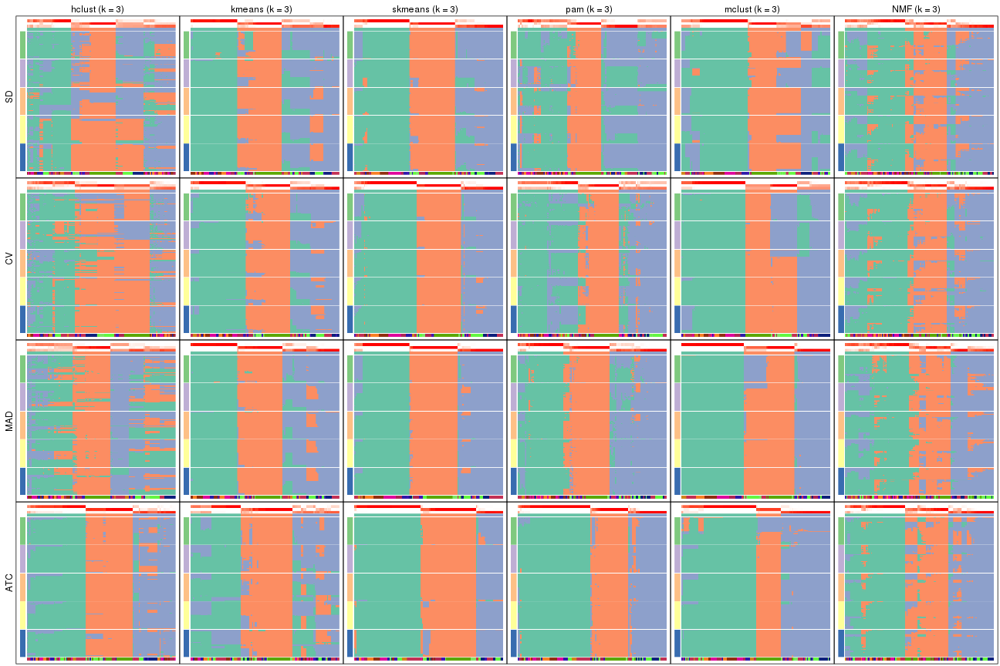</p>

</div>
<div id='tab-collect-membership-heatmap-3'>
<pre><code class="r">collect_plots(res_list, k = 4, fun = membership_heatmap, mc.cores = 4)
</code></pre>

<p></p>

</div>
<div id='tab-collect-membership-heatmap-4'>
<pre><code class="r">collect_plots(res_list, k = 5, fun = membership_heatmap, mc.cores = 4)
</code></pre>

<p></p>

</div>
<div id='tab-collect-membership-heatmap-5'>
<pre><code class="r">collect_plots(res_list, k = 6, fun = membership_heatmap, mc.cores = 4)
</code></pre>

<p></p>

</div>
</div>


### Signature heatmap

Signature heatmaps for all methods. ([What is a signature heatmap?](http://bioconductor.org/packages/devel/bioc/vignettes/cola/inst/doc/cola.html#toc_22))


Note in following heatmaps, rows are scaled.


<script>
$( function() {
	$( '#tabs-collect-get-signatures' ).tabs();
} );
</script>
<div id='tabs-collect-get-signatures'>
<ul>
<li><a href='#tab-collect-get-signatures-1'>k = 2</a></li>
<li><a href='#tab-collect-get-signatures-2'>k = 3</a></li>
<li><a href='#tab-collect-get-signatures-3'>k = 4</a></li>
<li><a href='#tab-collect-get-signatures-4'>k = 5</a></li>
<li><a href='#tab-collect-get-signatures-5'>k = 6</a></li>
</ul>
<div id='tab-collect-get-signatures-1'>
<pre><code class="r">collect_plots(res_list, k = 2, fun = get_signatures, mc.cores = 4)
</code></pre>

<p></p>

</div>
<div id='tab-collect-get-signatures-2'>
<pre><code class="r">collect_plots(res_list, k = 3, fun = get_signatures, mc.cores = 4)
</code></pre>

<p></p>

</div>
<div id='tab-collect-get-signatures-3'>
<pre><code class="r">collect_plots(res_list, k = 4, fun = get_signatures, mc.cores = 4)
</code></pre>

<p></p>

</div>
<div id='tab-collect-get-signatures-4'>
<pre><code class="r">collect_plots(res_list, k = 5, fun = get_signatures, mc.cores = 4)
</code></pre>

<p></p>

</div>
<div id='tab-collect-get-signatures-5'>
<pre><code class="r">collect_plots(res_list, k = 6, fun = get_signatures, mc.cores = 4)
</code></pre>

<p></p>

</div>
</div>


### Statistics table

The statistics used for measuring the stability of consensus partitioning.
([How are they
defined?](http://bioconductor.org/packages/devel/bioc/vignettes/cola/inst/doc/cola.html#toc_13))


<script>
$( function() {
	$( '#tabs-get-stats-from-consensus-partition-list' ).tabs();
} );
</script>
<div id='tabs-get-stats-from-consensus-partition-list'>
<ul>
<li><a href='#tab-get-stats-from-consensus-partition-list-1'>k = 2</a></li>
<li><a href='#tab-get-stats-from-consensus-partition-list-2'>k = 3</a></li>
<li><a href='#tab-get-stats-from-consensus-partition-list-3'>k = 4</a></li>
<li><a href='#tab-get-stats-from-consensus-partition-list-4'>k = 5</a></li>
<li><a href='#tab-get-stats-from-consensus-partition-list-5'>k = 6</a></li>
</ul>
<div id='tab-get-stats-from-consensus-partition-list-1'>
<pre><code class="r">get_stats(res_list, k = 2)
</code></pre>

<pre><code>#&gt;             k 1-PAC mean_silhouette concordance area_increased  Rand Jaccard
#&gt; SD:NMF      2 0.866           0.929       0.968          0.501 0.498   0.498
#&gt; CV:NMF      2 0.932           0.940       0.975          0.500 0.500   0.500
#&gt; MAD:NMF     2 0.963           0.954       0.980          0.502 0.497   0.497
#&gt; ATC:NMF     2 0.966           0.950       0.980          0.504 0.496   0.496
#&gt; SD:skmeans  2 0.874           0.952       0.972          0.503 0.497   0.497
#&gt; CV:skmeans  2 1.000           0.983       0.993          0.503 0.497   0.497
#&gt; MAD:skmeans 2 1.000           0.989       0.995          0.503 0.497   0.497
#&gt; ATC:skmeans 2 0.983           0.956       0.983          0.504 0.496   0.496
#&gt; SD:mclust   2 0.948           0.931       0.974          0.499 0.500   0.500
#&gt; CV:mclust   2 0.590           0.903       0.928          0.464 0.497   0.497
#&gt; MAD:mclust  2 0.805           0.914       0.957          0.497 0.502   0.502
#&gt; ATC:mclust  2 0.533           0.895       0.915          0.442 0.506   0.506
#&gt; SD:kmeans   2 0.698           0.927       0.952          0.489 0.497   0.497
#&gt; CV:kmeans   2 0.956           0.957       0.976          0.497 0.497   0.497
#&gt; MAD:kmeans  2 0.919           0.956       0.980          0.500 0.499   0.499
#&gt; ATC:kmeans  2 1.000           0.994       0.997          0.503 0.498   0.498
#&gt; SD:pam      2 0.295           0.648       0.840          0.470 0.508   0.508
#&gt; CV:pam      2 0.408           0.732       0.872          0.480 0.506   0.506
#&gt; MAD:pam     2 0.474           0.813       0.895          0.485 0.521   0.521
#&gt; ATC:pam     2 1.000           0.976       0.990          0.499 0.504   0.504
#&gt; SD:hclust   2 0.248           0.684       0.821          0.425 0.521   0.521
#&gt; CV:hclust   2 0.305           0.759       0.868          0.437 0.543   0.543
#&gt; MAD:hclust  2 0.204           0.583       0.805          0.433 0.521   0.521
#&gt; ATC:hclust  2 0.674           0.887       0.943          0.481 0.514   0.514
</code></pre>

</div>
<div id='tab-get-stats-from-consensus-partition-list-2'>
<pre><code class="r">get_stats(res_list, k = 3)
</code></pre>

<pre><code>#&gt;             k 1-PAC mean_silhouette concordance area_increased  Rand Jaccard
#&gt; SD:NMF      3 0.539           0.634       0.834          0.325 0.727   0.507
#&gt; CV:NMF      3 0.577           0.667       0.849          0.322 0.728   0.511
#&gt; MAD:NMF     3 0.537           0.679       0.842          0.319 0.760   0.555
#&gt; ATC:NMF     3 0.652           0.738       0.884          0.317 0.749   0.537
#&gt; SD:skmeans  3 0.751           0.872       0.935          0.322 0.729   0.507
#&gt; CV:skmeans  3 0.917           0.895       0.953          0.316 0.770   0.569
#&gt; MAD:skmeans 3 0.866           0.911       0.960          0.331 0.739   0.521
#&gt; ATC:skmeans 3 0.922           0.939       0.971          0.257 0.822   0.658
#&gt; SD:mclust   3 0.599           0.652       0.823          0.277 0.780   0.593
#&gt; CV:mclust   3 0.702           0.766       0.863          0.371 0.804   0.625
#&gt; MAD:mclust  3 0.882           0.915       0.950          0.310 0.821   0.651
#&gt; ATC:mclust  3 0.710           0.931       0.945          0.387 0.809   0.648
#&gt; SD:kmeans   3 0.604           0.761       0.871          0.336 0.684   0.449
#&gt; CV:kmeans   3 0.663           0.823       0.903          0.325 0.725   0.501
#&gt; MAD:kmeans  3 0.841           0.844       0.925          0.335 0.691   0.458
#&gt; ATC:kmeans  3 0.563           0.579       0.791          0.301 0.736   0.515
#&gt; SD:pam      3 0.525           0.651       0.803          0.384 0.555   0.317
#&gt; CV:pam      3 0.566           0.604       0.817          0.361 0.801   0.618
#&gt; MAD:pam     3 0.673           0.794       0.903          0.371 0.720   0.505
#&gt; ATC:pam     3 0.920           0.904       0.960          0.281 0.806   0.634
#&gt; SD:hclust   3 0.366           0.411       0.698          0.459 0.699   0.480
#&gt; CV:hclust   3 0.354           0.678       0.777          0.416 0.825   0.682
#&gt; MAD:hclust  3 0.312           0.573       0.680          0.440 0.688   0.471
#&gt; ATC:hclust  3 0.747           0.856       0.912          0.362 0.811   0.635
</code></pre>

</div>
<div id='tab-get-stats-from-consensus-partition-list-3'>
<pre><code class="r">get_stats(res_list, k = 4)
</code></pre>

<pre><code>#&gt;             k 1-PAC mean_silhouette concordance area_increased  Rand Jaccard
#&gt; SD:NMF      4 0.546           0.627       0.769          0.117 0.821   0.537
#&gt; CV:NMF      4 0.555           0.509       0.716          0.123 0.806   0.517
#&gt; MAD:NMF     4 0.578           0.476       0.692          0.125 0.831   0.559
#&gt; ATC:NMF     4 0.690           0.776       0.869          0.116 0.840   0.577
#&gt; SD:skmeans  4 0.829           0.900       0.944          0.129 0.844   0.576
#&gt; CV:skmeans  4 0.858           0.846       0.931          0.134 0.817   0.524
#&gt; MAD:skmeans 4 0.917           0.899       0.948          0.121 0.850   0.590
#&gt; ATC:skmeans 4 0.968           0.952       0.981          0.120 0.895   0.724
#&gt; SD:mclust   4 0.630           0.774       0.851          0.104 0.840   0.593
#&gt; CV:mclust   4 0.657           0.745       0.832          0.132 0.847   0.603
#&gt; MAD:mclust  4 0.707           0.806       0.879          0.107 0.924   0.786
#&gt; ATC:mclust  4 0.787           0.897       0.921          0.196 0.844   0.613
#&gt; SD:kmeans   4 0.705           0.788       0.881          0.132 0.834   0.556
#&gt; CV:kmeans   4 0.710           0.719       0.864          0.130 0.802   0.487
#&gt; MAD:kmeans  4 0.767           0.768       0.870          0.120 0.906   0.725
#&gt; ATC:kmeans  4 0.849           0.905       0.939          0.141 0.808   0.501
#&gt; SD:pam      4 0.648           0.667       0.836          0.130 0.910   0.746
#&gt; CV:pam      4 0.547           0.536       0.730          0.136 0.689   0.310
#&gt; MAD:pam     4 0.646           0.629       0.805          0.124 0.800   0.488
#&gt; ATC:pam     4 0.780           0.845       0.902          0.162 0.844   0.596
#&gt; SD:hclust   4 0.592           0.629       0.747          0.142 0.774   0.449
#&gt; CV:hclust   4 0.505           0.395       0.709          0.107 0.945   0.860
#&gt; MAD:hclust  4 0.554           0.739       0.838          0.168 0.886   0.682
#&gt; ATC:hclust  4 0.717           0.796       0.858          0.107 0.929   0.789
</code></pre>

</div>
<div id='tab-get-stats-from-consensus-partition-list-4'>
<pre><code class="r">get_stats(res_list, k = 5)
</code></pre>

<pre><code>#&gt;             k 1-PAC mean_silhouette concordance area_increased  Rand Jaccard
#&gt; SD:NMF      5 0.620           0.564       0.731         0.0679 0.898   0.639
#&gt; CV:NMF      5 0.623           0.547       0.731         0.0650 0.853   0.537
#&gt; MAD:NMF     5 0.612           0.538       0.738         0.0634 0.819   0.436
#&gt; ATC:NMF     5 0.746           0.744       0.860         0.0690 0.887   0.606
#&gt; SD:skmeans  5 0.784           0.799       0.884         0.0434 0.944   0.786
#&gt; CV:skmeans  5 0.762           0.721       0.853         0.0463 0.951   0.806
#&gt; MAD:skmeans 5 0.769           0.749       0.856         0.0467 0.960   0.843
#&gt; ATC:skmeans 5 0.812           0.743       0.862         0.0702 0.946   0.820
#&gt; SD:mclust   5 0.831           0.810       0.891         0.1028 0.916   0.703
#&gt; CV:mclust   5 0.841           0.860       0.929         0.0797 0.913   0.698
#&gt; MAD:mclust  5 0.838           0.845       0.916         0.0862 0.899   0.666
#&gt; ATC:mclust  5 0.850           0.830       0.913         0.0657 0.908   0.675
#&gt; SD:kmeans   5 0.731           0.730       0.815         0.0623 0.956   0.829
#&gt; CV:kmeans   5 0.694           0.598       0.750         0.0616 0.913   0.677
#&gt; MAD:kmeans  5 0.748           0.642       0.811         0.0541 0.898   0.656
#&gt; ATC:kmeans  5 0.787           0.707       0.836         0.0584 0.978   0.912
#&gt; SD:pam      5 0.742           0.752       0.877         0.0645 0.869   0.574
#&gt; CV:pam      5 0.744           0.762       0.884         0.0740 0.888   0.603
#&gt; MAD:pam     5 0.769           0.764       0.881         0.0657 0.902   0.642
#&gt; ATC:pam     5 0.805           0.840       0.917         0.0699 0.879   0.582
#&gt; SD:hclust   5 0.569           0.568       0.717         0.0638 0.868   0.578
#&gt; CV:hclust   5 0.522           0.509       0.670         0.0586 0.842   0.573
#&gt; MAD:hclust  5 0.641           0.763       0.829         0.0644 0.944   0.791
#&gt; ATC:hclust  5 0.734           0.536       0.781         0.0639 0.879   0.594
</code></pre>

</div>
<div id='tab-get-stats-from-consensus-partition-list-5'>
<pre><code class="r">get_stats(res_list, k = 6)
</code></pre>

<pre><code>#&gt;             k 1-PAC mean_silhouette concordance area_increased  Rand Jaccard
#&gt; SD:NMF      6 0.727           0.712       0.819         0.0387 0.946   0.752
#&gt; CV:NMF      6 0.709           0.669       0.799         0.0435 0.895   0.582
#&gt; MAD:NMF     6 0.736           0.695       0.824         0.0406 0.927   0.683
#&gt; ATC:NMF     6 0.757           0.756       0.850         0.0419 0.925   0.661
#&gt; SD:skmeans  6 0.778           0.626       0.752         0.0436 0.921   0.663
#&gt; CV:skmeans  6 0.753           0.594       0.764         0.0407 0.884   0.543
#&gt; MAD:skmeans 6 0.749           0.545       0.739         0.0405 0.927   0.695
#&gt; ATC:skmeans 6 0.776           0.762       0.832         0.0549 0.890   0.597
#&gt; SD:mclust   6 0.795           0.610       0.783         0.0511 0.936   0.717
#&gt; CV:mclust   6 0.815           0.741       0.859         0.0593 0.913   0.638
#&gt; MAD:mclust  6 0.802           0.669       0.813         0.0435 0.925   0.672
#&gt; ATC:mclust  6 0.820           0.791       0.847         0.0321 0.932   0.720
#&gt; SD:kmeans   6 0.770           0.531       0.745         0.0398 0.924   0.689
#&gt; CV:kmeans   6 0.726           0.597       0.698         0.0366 0.896   0.572
#&gt; MAD:kmeans  6 0.756           0.647       0.789         0.0380 0.899   0.607
#&gt; ATC:kmeans  6 0.781           0.647       0.756         0.0422 0.898   0.595
#&gt; SD:pam      6 0.805           0.675       0.827         0.0475 0.925   0.685
#&gt; CV:pam      6 0.734           0.623       0.806         0.0384 0.924   0.663
#&gt; MAD:pam     6 0.856           0.817       0.908         0.0351 0.958   0.800
#&gt; ATC:pam     6 0.906           0.858       0.940         0.0391 0.963   0.820
#&gt; SD:hclust   6 0.697           0.631       0.778         0.0555 0.944   0.776
#&gt; CV:hclust   6 0.547           0.601       0.734         0.0596 0.920   0.702
#&gt; MAD:hclust  6 0.706           0.722       0.829         0.0412 0.965   0.841
#&gt; ATC:hclust  6 0.787           0.695       0.821         0.0533 0.928   0.705
</code></pre>

</div>
</div>

Following heatmap plots the partition for each combination of methods and the
lightness correspond to the silhouette scores for samples in each method. On
top the consensus subgroup is inferred from all methods by taking the mean
silhouette scores as weight.


<script>
$( function() {
	$( '#tabs-collect-stats-from-consensus-partition-list' ).tabs();
} );
</script>
<div id='tabs-collect-stats-from-consensus-partition-list'>
<ul>
<li><a href='#tab-collect-stats-from-consensus-partition-list-1'>k = 2</a></li>
<li><a href='#tab-collect-stats-from-consensus-partition-list-2'>k = 3</a></li>
<li><a href='#tab-collect-stats-from-consensus-partition-list-3'>k = 4</a></li>
<li><a href='#tab-collect-stats-from-consensus-partition-list-4'>k = 5</a></li>
<li><a href='#tab-collect-stats-from-consensus-partition-list-5'>k = 6</a></li>
</ul>
<div id='tab-collect-stats-from-consensus-partition-list-1'>
<pre><code class="r">collect_stats(res_list, k = 2)
</code></pre>

<p></p>

</div>
<div id='tab-collect-stats-from-consensus-partition-list-2'>
<pre><code class="r">collect_stats(res_list, k = 3)
</code></pre>

<p></p>

</div>
<div id='tab-collect-stats-from-consensus-partition-list-3'>
<pre><code class="r">collect_stats(res_list, k = 4)
</code></pre>

<p>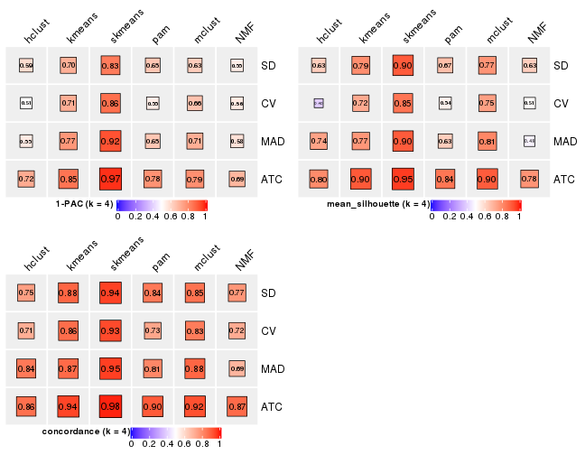</p>

</div>
<div id='tab-collect-stats-from-consensus-partition-list-4'>
<pre><code class="r">collect_stats(res_list, k = 5)
</code></pre>

<p></p>

</div>
<div id='tab-collect-stats-from-consensus-partition-list-5'>
<pre><code class="r">collect_stats(res_list, k = 6)
</code></pre>

<p></p>

</div>
</div>

### Partition from all methods


Collect partitions from all methods:


<script>
$( function() {
	$( '#tabs-collect-classes-from-consensus-partition-list' ).tabs();
} );
</script>
<div id='tabs-collect-classes-from-consensus-partition-list'>
<ul>
<li><a href='#tab-collect-classes-from-consensus-partition-list-1'>k = 2</a></li>
<li><a href='#tab-collect-classes-from-consensus-partition-list-2'>k = 3</a></li>
<li><a href='#tab-collect-classes-from-consensus-partition-list-3'>k = 4</a></li>
<li><a href='#tab-collect-classes-from-consensus-partition-list-4'>k = 5</a></li>
<li><a href='#tab-collect-classes-from-consensus-partition-list-5'>k = 6</a></li>
</ul>
<div id='tab-collect-classes-from-consensus-partition-list-1'>
<pre><code class="r">collect_classes(res_list, k = 2)
</code></pre>

<p></p>

</div>
<div id='tab-collect-classes-from-consensus-partition-list-2'>
<pre><code class="r">collect_classes(res_list, k = 3)
</code></pre>

<p></p>

</div>
<div id='tab-collect-classes-from-consensus-partition-list-3'>
<pre><code class="r">collect_classes(res_list, k = 4)
</code></pre>

<p></p>

</div>
<div id='tab-collect-classes-from-consensus-partition-list-4'>
<pre><code class="r">collect_classes(res_list, k = 5)
</code></pre>

<p></p>

</div>
<div id='tab-collect-classes-from-consensus-partition-list-5'>
<pre><code class="r">collect_classes(res_list, k = 6)
</code></pre>

<p></p>

</div>
</div>


### Top rows overlap


Overlap of top rows from different top-row methods:


<script>
$( function() {
	$( '#tabs-top-rows-overlap-by-euler' ).tabs();
} );
</script>
<div id='tabs-top-rows-overlap-by-euler'>
<ul>
<li><a href='#tab-top-rows-overlap-by-euler-1'>top_n = 1000</a></li>
<li><a href='#tab-top-rows-overlap-by-euler-2'>top_n = 2000</a></li>
<li><a href='#tab-top-rows-overlap-by-euler-3'>top_n = 3000</a></li>
<li><a href='#tab-top-rows-overlap-by-euler-4'>top_n = 4000</a></li>
<li><a href='#tab-top-rows-overlap-by-euler-5'>top_n = 5000</a></li>
</ul>
<div id='tab-top-rows-overlap-by-euler-1'>
<pre><code class="r">top_rows_overlap(res_list, top_n = 1000, method = &quot;euler&quot;)
</code></pre>

<p>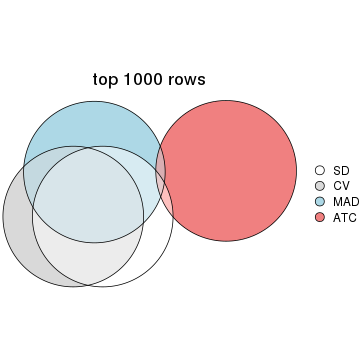</p>

</div>
<div id='tab-top-rows-overlap-by-euler-2'>
<pre><code class="r">top_rows_overlap(res_list, top_n = 2000, method = &quot;euler&quot;)
</code></pre>

<p></p>

</div>
<div id='tab-top-rows-overlap-by-euler-3'>
<pre><code class="r">top_rows_overlap(res_list, top_n = 3000, method = &quot;euler&quot;)
</code></pre>

<p></p>

</div>
<div id='tab-top-rows-overlap-by-euler-4'>
<pre><code class="r">top_rows_overlap(res_list, top_n = 4000, method = &quot;euler&quot;)
</code></pre>

<p></p>

</div>
<div id='tab-top-rows-overlap-by-euler-5'>
<pre><code class="r">top_rows_overlap(res_list, top_n = 5000, method = &quot;euler&quot;)
</code></pre>

<p></p>

</div>
</div>

Also visualize the correspondance of rankings between different top-row methods:


<script>
$( function() {
	$( '#tabs-top-rows-overlap-by-correspondance' ).tabs();
} );
</script>
<div id='tabs-top-rows-overlap-by-correspondance'>
<ul>
<li><a href='#tab-top-rows-overlap-by-correspondance-1'>top_n = 1000</a></li>
<li><a href='#tab-top-rows-overlap-by-correspondance-2'>top_n = 2000</a></li>
<li><a href='#tab-top-rows-overlap-by-correspondance-3'>top_n = 3000</a></li>
<li><a href='#tab-top-rows-overlap-by-correspondance-4'>top_n = 4000</a></li>
<li><a href='#tab-top-rows-overlap-by-correspondance-5'>top_n = 5000</a></li>
</ul>
<div id='tab-top-rows-overlap-by-correspondance-1'>
<pre><code class="r">top_rows_overlap(res_list, top_n = 1000, method = &quot;correspondance&quot;)
</code></pre>

<p></p>

</div>
<div id='tab-top-rows-overlap-by-correspondance-2'>
<pre><code class="r">top_rows_overlap(res_list, top_n = 2000, method = &quot;correspondance&quot;)
</code></pre>

<p>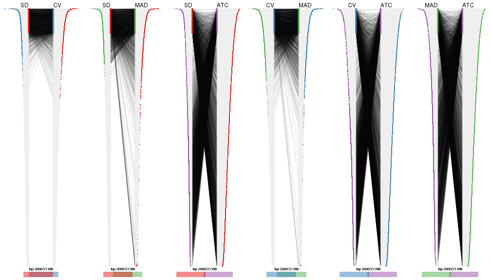</p>

</div>
<div id='tab-top-rows-overlap-by-correspondance-3'>
<pre><code class="r">top_rows_overlap(res_list, top_n = 3000, method = &quot;correspondance&quot;)
</code></pre>

<p></p>

</div>
<div id='tab-top-rows-overlap-by-correspondance-4'>
<pre><code class="r">top_rows_overlap(res_list, top_n = 4000, method = &quot;correspondance&quot;)
</code></pre>

<p></p>

</div>
<div id='tab-top-rows-overlap-by-correspondance-5'>
<pre><code class="r">top_rows_overlap(res_list, top_n = 5000, method = &quot;correspondance&quot;)
</code></pre>

<p></p>

</div>
</div>


Heatmaps of the top rows:


<script>
$( function() {
	$( '#tabs-top-rows-heatmap' ).tabs();
} );
</script>
<div id='tabs-top-rows-heatmap'>
<ul>
<li><a href='#tab-top-rows-heatmap-1'>top_n = 1000</a></li>
<li><a href='#tab-top-rows-heatmap-2'>top_n = 2000</a></li>
<li><a href='#tab-top-rows-heatmap-3'>top_n = 3000</a></li>
<li><a href='#tab-top-rows-heatmap-4'>top_n = 4000</a></li>
<li><a href='#tab-top-rows-heatmap-5'>top_n = 5000</a></li>
</ul>
<div id='tab-top-rows-heatmap-1'>
<pre><code class="r">top_rows_heatmap(res_list, top_n = 1000)
</code></pre>

<p></p>

</div>
<div id='tab-top-rows-heatmap-2'>
<pre><code class="r">top_rows_heatmap(res_list, top_n = 2000)
</code></pre>

<p></p>

</div>
<div id='tab-top-rows-heatmap-3'>
<pre><code class="r">top_rows_heatmap(res_list, top_n = 3000)
</code></pre>

<p></p>

</div>
<div id='tab-top-rows-heatmap-4'>
<pre><code class="r">top_rows_heatmap(res_list, top_n = 4000)
</code></pre>

<p></p>

</div>
<div id='tab-top-rows-heatmap-5'>
<pre><code class="r">top_rows_heatmap(res_list, top_n = 5000)
</code></pre>

<p></p>

</div>
</div>


### Test to known annotations


Test correlation between subgroups and known annotations. If the known
annotation is numeric, one-way ANOVA test is applied, and if the known
annotation is discrete, chi-squared contingency table test is applied.


<script>
$( function() {
	$( '#tabs-test-to-known-factors-from-consensus-partition-list' ).tabs();
} );
</script>
<div id='tabs-test-to-known-factors-from-consensus-partition-list'>
<ul>
<li><a href='#tab-test-to-known-factors-from-consensus-partition-list-1'>k = 2</a></li>
<li><a href='#tab-test-to-known-factors-from-consensus-partition-list-2'>k = 3</a></li>
<li><a href='#tab-test-to-known-factors-from-consensus-partition-list-3'>k = 4</a></li>
<li><a href='#tab-test-to-known-factors-from-consensus-partition-list-4'>k = 5</a></li>
<li><a href='#tab-test-to-known-factors-from-consensus-partition-list-5'>k = 6</a></li>
</ul>
<div id='tab-test-to-known-factors-from-consensus-partition-list-1'>
<pre><code class="r">test_to_known_factors(res_list, k = 2)
</code></pre>

<pre><code>#&gt;               n disease.state(p) k
#&gt; SD:NMF      119         1.77e-09 2
#&gt; CV:NMF      118         2.16e-09 2
#&gt; MAD:NMF     119         2.13e-09 2
#&gt; ATC:NMF     117         1.51e-11 2
#&gt; SD:skmeans  121         1.64e-11 2
#&gt; CV:skmeans  119         4.11e-11 2
#&gt; MAD:skmeans 121         1.64e-11 2
#&gt; ATC:skmeans 118         2.26e-12 2
#&gt; SD:mclust   115         2.16e-12 2
#&gt; CV:mclust   119         2.00e-11 2
#&gt; MAD:mclust  115         4.59e-13 2
#&gt; ATC:mclust  120         1.97e-13 2
#&gt; SD:kmeans   121         1.64e-11 2
#&gt; CV:kmeans   119         4.11e-11 2
#&gt; MAD:kmeans  119         4.11e-11 2
#&gt; ATC:kmeans  121         1.03e-12 2
#&gt; SD:pam      100         1.70e-07 2
#&gt; CV:pam      105         2.16e-07 2
#&gt; MAD:pam     117         4.39e-11 2
#&gt; ATC:pam     119         9.88e-12 2
#&gt; SD:hclust   108         2.55e-07 2
#&gt; CV:hclust   112         1.59e-07 2
#&gt; MAD:hclust   91         3.47e-13 2
#&gt; ATC:hclust  114         5.47e-10 2
</code></pre>

</div>
<div id='tab-test-to-known-factors-from-consensus-partition-list-2'>
<pre><code class="r">test_to_known_factors(res_list, k = 3)
</code></pre>

<pre><code>#&gt;               n disease.state(p) k
#&gt; SD:NMF       95         4.31e-15 3
#&gt; CV:NMF       96         5.04e-18 3
#&gt; MAD:NMF     100         1.57e-13 3
#&gt; ATC:NMF     107         3.98e-15 3
#&gt; SD:skmeans  119         4.44e-25 3
#&gt; CV:skmeans  115         3.53e-24 3
#&gt; MAD:skmeans 117         9.06e-25 3
#&gt; ATC:skmeans 120         2.66e-15 3
#&gt; SD:mclust   100         1.65e-22 3
#&gt; CV:mclust   112         4.74e-26 3
#&gt; MAD:mclust  117         2.26e-23 3
#&gt; ATC:mclust  120         5.94e-26 3
#&gt; SD:kmeans   104         2.49e-24 3
#&gt; CV:kmeans   118         4.50e-24 3
#&gt; MAD:kmeans  106         4.12e-25 3
#&gt; ATC:kmeans   71         1.25e-06 3
#&gt; SD:pam      107         3.79e-30 3
#&gt; CV:pam      100         3.72e-15 3
#&gt; MAD:pam     107         9.17e-24 3
#&gt; ATC:pam     116         1.99e-18 3
#&gt; SD:hclust    56         9.31e-09 3
#&gt; CV:hclust   110         9.28e-15 3
#&gt; MAD:hclust   90         5.69e-24 3
#&gt; ATC:hclust  117         3.22e-14 3
</code></pre>

</div>
<div id='tab-test-to-known-factors-from-consensus-partition-list-3'>
<pre><code class="r">test_to_known_factors(res_list, k = 4)
</code></pre>

<pre><code>#&gt;               n disease.state(p) k
#&gt; SD:NMF       97         7.14e-25 4
#&gt; CV:NMF       73         3.18e-18 4
#&gt; MAD:NMF      64         6.35e-14 4
#&gt; ATC:NMF     112         7.37e-29 4
#&gt; SD:skmeans  120         5.03e-32 4
#&gt; CV:skmeans  114         2.92e-32 4
#&gt; MAD:skmeans 114         1.20e-29 4
#&gt; ATC:skmeans 119         3.26e-18 4
#&gt; SD:mclust   116         3.19e-34 4
#&gt; CV:mclust   103         4.17e-33 4
#&gt; MAD:mclust  115         1.30e-28 4
#&gt; ATC:mclust  118         2.68e-31 4
#&gt; SD:kmeans   110         2.30e-33 4
#&gt; CV:kmeans   106         1.87e-32 4
#&gt; MAD:kmeans  107         2.49e-29 4
#&gt; ATC:kmeans  116         7.41e-26 4
#&gt; SD:pam       96         2.55e-35 4
#&gt; CV:pam       72         4.64e-18 4
#&gt; MAD:pam      84         1.16e-28 4
#&gt; ATC:pam     113         1.64e-25 4
#&gt; SD:hclust    94         1.06e-28 4
#&gt; CV:hclust    69         4.80e-20 4
#&gt; MAD:hclust  110         2.57e-33 4
#&gt; ATC:hclust  110         4.29e-17 4
</code></pre>

</div>
<div id='tab-test-to-known-factors-from-consensus-partition-list-4'>
<pre><code class="r">test_to_known_factors(res_list, k = 5)
</code></pre>

<pre><code>#&gt;               n disease.state(p) k
#&gt; SD:NMF       82         2.70e-33 5
#&gt; CV:NMF       73         1.17e-18 5
#&gt; MAD:NMF      73         2.37e-23 5
#&gt; ATC:NMF     102         3.44e-31 5
#&gt; SD:skmeans  111         8.59e-43 5
#&gt; CV:skmeans  105         7.43e-42 5
#&gt; MAD:skmeans 110         3.19e-42 5
#&gt; ATC:skmeans 104         7.19e-22 5
#&gt; SD:mclust   113         9.45e-45 5
#&gt; CV:mclust   115         1.41e-43 5
#&gt; MAD:mclust  116         5.98e-42 5
#&gt; ATC:mclust  113         1.40e-34 5
#&gt; SD:kmeans   105         3.35e-37 5
#&gt; CV:kmeans    87         1.90e-28 5
#&gt; MAD:kmeans   96         5.51e-30 5
#&gt; ATC:kmeans  103         2.03e-20 5
#&gt; SD:pam      106         3.02e-45 5
#&gt; CV:pam      110         1.01e-33 5
#&gt; MAD:pam     104         5.26e-42 5
#&gt; ATC:pam     112         2.20e-27 5
#&gt; SD:hclust    91         9.57e-31 5
#&gt; CV:hclust    82         1.06e-22 5
#&gt; MAD:hclust  115         1.30e-33 5
#&gt; ATC:hclust   71         7.26e-13 5
</code></pre>

</div>
<div id='tab-test-to-known-factors-from-consensus-partition-list-5'>
<pre><code class="r">test_to_known_factors(res_list, k = 6)
</code></pre>

<pre><code>#&gt;               n disease.state(p) k
#&gt; SD:NMF      105         1.88e-43 6
#&gt; CV:NMF       98         1.30e-39 6
#&gt; MAD:NMF     102         8.44e-42 6
#&gt; ATC:NMF     112         4.38e-45 6
#&gt; SD:skmeans   89         2.00e-36 6
#&gt; CV:skmeans   85         6.27e-33 6
#&gt; MAD:skmeans  74         3.02e-25 6
#&gt; ATC:skmeans 109         2.94e-30 6
#&gt; SD:mclust    88         5.61e-29 6
#&gt; CV:mclust   104         1.88e-35 6
#&gt; MAD:mclust   91         3.80e-29 6
#&gt; ATC:mclust  110         2.94e-36 6
#&gt; SD:kmeans    81         6.33e-29 6
#&gt; CV:kmeans    93         5.65e-30 6
#&gt; MAD:kmeans   94         3.94e-30 6
#&gt; ATC:kmeans  101         1.16e-28 6
#&gt; SD:pam       97         1.16e-51 6
#&gt; CV:pam       88         3.06e-33 6
#&gt; MAD:pam     111         4.15e-37 6
#&gt; ATC:pam     112         2.66e-32 6
#&gt; SD:hclust    96         1.37e-30 6
#&gt; CV:hclust    92         5.23e-26 6
#&gt; MAD:hclust  106         2.64e-31 6
#&gt; ATC:hclust  109         2.14e-23 6
</code></pre>

</div>
</div>


 
## Results for each method


---------------------------------------------------


### SD:hclust


The object with results only for a single top-value method and a single partition method 
can be extracted as:

```r
res = res_list["SD", "hclust"]
# you can also extract it by
# res = res_list["SD:hclust"]
```

A summary of `res` and all the functions that can be applied to it:

```r
res
```

```
#> A 'ConsensusPartition' object with k = 2, 3, 4, 5, 6.
#>   On a matrix with 21168 rows and 121 columns.
#>   Top rows (1000, 2000, 3000, 4000, 5000) are extracted by 'SD' method.
#>   Subgroups are detected by 'hclust' method.
#>   Performed in total 1250 partitions by row resampling.
#>   Best k for subgroups seems to be 4.
#> 
#> Following methods can be applied to this 'ConsensusPartition' object:
#>  [1] "cola_report"             "collect_classes"         "collect_plots"          
#>  [4] "collect_stats"           "colnames"                "compare_signatures"     
#>  [7] "consensus_heatmap"       "dimension_reduction"     "functional_enrichment"  
#> [10] "get_anno_col"            "get_anno"                "get_classes"            
#> [13] "get_consensus"           "get_matrix"              "get_membership"         
#> [16] "get_param"               "get_signatures"          "get_stats"              
#> [19] "is_best_k"               "is_stable_k"             "membership_heatmap"     
#> [22] "ncol"                    "nrow"                    "plot_ecdf"              
#> [25] "rownames"                "select_partition_number" "show"                   
#> [28] "suggest_best_k"          "test_to_known_factors"
```

`collect_plots()` function collects all the plots made from `res` for all `k` (number of partitions)
into one single page to provide an easy and fast comparison between different `k`.

```r
collect_plots(res)
```


The plots are:

- The first row: a plot of the ECDF (Empirical cumulative distribution
  function) curves of the consensus matrix for each `k` and the heatmap of
  predicted classes for each `k`.
- The second row: heatmaps of the consensus matrix for each `k`.
- The third row: heatmaps of the membership matrix for each `k`.
- The fouth row: heatmaps of the signatures for each `k`.

All the plots in panels can be made by individual functions and they are
plotted later in this section.

`select_partition_number()` produces several plots showing different
statistics for choosing "optimized" `k`. There are following statistics:

- ECDF curves of the consensus matrix for each `k`;
- 1-PAC. [The PAC
  score](https://en.wikipedia.org/wiki/Consensus_clustering#Over-interpretation_potential_of_consensus_clustering)
  measures the proportion of the ambiguous subgrouping.
- Mean silhouette score.
- Concordance. The mean probability of fiting the consensus class ids in all
  partitions.
- Area increased. Denote $A_k$ as the area under the ECDF curve for current
  `k`, the area increased is defined as $A_k - A_{k-1}$.
- Rand index. The percent of pairs of samples that are both in a same cluster
  or both are not in a same cluster in the partition of k and k-1.
- Jaccard index. The ratio of pairs of samples are both in a same cluster in
  the partition of k and k-1 and the pairs of samples are both in a same
  cluster in the partition k or k-1.

The detailed explanations of these statistics can be found in [the cola
vignette](http://bioconductor.org/packages/devel/bioc/vignettes/cola/inst/doc/cola.html#toc_13).

Generally speaking, lower PAC score, higher mean silhouette score or higher
concordance corresponds to better partition. Rand index and Jaccard index
measure how similar the current partition is compared to partition with `k-1`.
If they are too similar, we won't accept `k` is better than `k-1`.

```r
select_partition_number(res)
```


The numeric values for all these statistics can be obtained by `get_stats()`.

```r
get_stats(res)
```

```
#>   k 1-PAC mean_silhouette concordance area_increased  Rand Jaccard
#> 2 2 0.248           0.684       0.821         0.4254 0.521   0.521
#> 3 3 0.366           0.411       0.698         0.4595 0.699   0.480
#> 4 4 0.592           0.629       0.747         0.1418 0.774   0.449
#> 5 5 0.569           0.568       0.717         0.0638 0.868   0.578
#> 6 6 0.697           0.631       0.778         0.0555 0.944   0.776
```

`suggest_best_k()` suggests the best $k$ based on these statistics. The rules are as follows:

- All $k$ with Jaccard index larger than 0.95 are removed because the increase of
  the partition number does not provides enough extra information. If all $k$ are removed,
  the best $k$ is assigned by `NA`.
- For $k$ with 1-PAC larger than 0.9, the maximal $k$ is taken as the "best k". Other $k$ is called "optional k".
- If it does not fit the second rule. The $k$ with the highest vote of highest
  1-PAC, mean silhouette and concordance is taken as the "best k".

```r
suggest_best_k(res)
```

```
#> [1] 4
```


Following shows the table of the partitions (You need to click the **show/hide
code output** link to see it). The membership matrix (columns with name `p*`)
is inferred by
[`clue::cl_consensus()`](https://www.rdocumentation.org/link/cl_consensus?package=clue)
function with the `SE` method. Basically the value in the membership matrix
represents the probability to belong to a certain group. The finall class
label for an item is determined with the group with highest probability it
belongs to.

In `get_classes()` function, the entropy is calculated from the membership
matrix and the silhouette score is calculated from the consensus matrix.


<script>
$( function() {
	$( '#tabs-SD-hclust-get-classes' ).tabs();
} );
</script>
<div id='tabs-SD-hclust-get-classes'>
<ul>
<li><a href='#tab-SD-hclust-get-classes-1'>k = 2</a></li>
<li><a href='#tab-SD-hclust-get-classes-2'>k = 3</a></li>
<li><a href='#tab-SD-hclust-get-classes-3'>k = 4</a></li>
<li><a href='#tab-SD-hclust-get-classes-4'>k = 5</a></li>
<li><a href='#tab-SD-hclust-get-classes-5'>k = 6</a></li>
</ul>

<div id='tab-SD-hclust-get-classes-1'>
<p><a id='tab-SD-hclust-get-classes-1-a' style='color:#0366d6' href='#'>show/hide code output</a></p>
<pre><code class="r">cbind(get_classes(res, k = 2), get_membership(res, k = 2))
</code></pre>

<pre><code>#&gt;           class entropy silhouette    p1    p2
#&gt; GSM74356      2  0.9393     0.5906 0.356 0.644
#&gt; GSM74357      2  0.9323     0.6071 0.348 0.652
#&gt; GSM74358      2  0.9323     0.6071 0.348 0.652
#&gt; GSM74359      1  0.4939     0.7651 0.892 0.108
#&gt; GSM74360      1  0.4939     0.7651 0.892 0.108
#&gt; GSM74361      1  0.9993    -0.0645 0.516 0.484
#&gt; GSM74362      1  0.9993    -0.0645 0.516 0.484
#&gt; GSM74363      2  0.9323     0.6071 0.348 0.652
#&gt; GSM74402      1  0.0000     0.7733 1.000 0.000
#&gt; GSM74403      1  0.0000     0.7733 1.000 0.000
#&gt; GSM74404      1  0.0000     0.7733 1.000 0.000
#&gt; GSM74406      1  0.0000     0.7733 1.000 0.000
#&gt; GSM74407      1  0.0672     0.7745 0.992 0.008
#&gt; GSM74408      1  0.0000     0.7733 1.000 0.000
#&gt; GSM74409      1  0.0000     0.7733 1.000 0.000
#&gt; GSM74410      1  0.0000     0.7733 1.000 0.000
#&gt; GSM119936     1  0.0000     0.7733 1.000 0.000
#&gt; GSM119937     1  0.1633     0.7750 0.976 0.024
#&gt; GSM74411      2  0.8443     0.7201 0.272 0.728
#&gt; GSM74412      2  0.8443     0.7201 0.272 0.728
#&gt; GSM74413      2  0.8443     0.7201 0.272 0.728
#&gt; GSM74414      2  0.7528     0.7508 0.216 0.784
#&gt; GSM74415      2  0.8443     0.7201 0.272 0.728
#&gt; GSM121379     2  0.0000     0.7517 0.000 1.000
#&gt; GSM121380     2  0.0000     0.7517 0.000 1.000
#&gt; GSM121381     2  0.0000     0.7517 0.000 1.000
#&gt; GSM121382     2  0.0000     0.7517 0.000 1.000
#&gt; GSM121383     2  0.0000     0.7517 0.000 1.000
#&gt; GSM121384     2  0.0000     0.7517 0.000 1.000
#&gt; GSM121385     2  0.0000     0.7517 0.000 1.000
#&gt; GSM121386     2  0.0000     0.7517 0.000 1.000
#&gt; GSM121387     2  0.0000     0.7517 0.000 1.000
#&gt; GSM121388     2  0.0000     0.7517 0.000 1.000
#&gt; GSM121389     2  0.0000     0.7517 0.000 1.000
#&gt; GSM121390     2  0.0000     0.7517 0.000 1.000
#&gt; GSM121391     2  0.0000     0.7517 0.000 1.000
#&gt; GSM121392     2  0.0000     0.7517 0.000 1.000
#&gt; GSM121393     2  0.0000     0.7517 0.000 1.000
#&gt; GSM121394     2  0.0000     0.7517 0.000 1.000
#&gt; GSM121395     2  0.0000     0.7517 0.000 1.000
#&gt; GSM121396     2  0.1633     0.7573 0.024 0.976
#&gt; GSM121397     2  0.0000     0.7517 0.000 1.000
#&gt; GSM121398     2  0.0000     0.7517 0.000 1.000
#&gt; GSM121399     2  0.0000     0.7517 0.000 1.000
#&gt; GSM74240      2  0.8661     0.7051 0.288 0.712
#&gt; GSM74241      2  0.8661     0.7051 0.288 0.712
#&gt; GSM74242      2  0.8661     0.7051 0.288 0.712
#&gt; GSM74243      2  0.8661     0.7051 0.288 0.712
#&gt; GSM74244      2  0.8661     0.7051 0.288 0.712
#&gt; GSM74245      2  0.8661     0.7051 0.288 0.712
#&gt; GSM74246      2  0.8661     0.7051 0.288 0.712
#&gt; GSM74247      2  0.8661     0.7051 0.288 0.712
#&gt; GSM74248      2  0.8661     0.7051 0.288 0.712
#&gt; GSM74416      1  0.0000     0.7733 1.000 0.000
#&gt; GSM74417      1  0.0000     0.7733 1.000 0.000
#&gt; GSM74418      1  0.0000     0.7733 1.000 0.000
#&gt; GSM74419      1  0.0376     0.7740 0.996 0.004
#&gt; GSM121358     2  0.8555     0.7141 0.280 0.720
#&gt; GSM121359     2  0.8555     0.7141 0.280 0.720
#&gt; GSM121360     1  0.5059     0.7635 0.888 0.112
#&gt; GSM121362     1  0.5059     0.7635 0.888 0.112
#&gt; GSM121364     1  0.4939     0.7651 0.892 0.108
#&gt; GSM121365     2  0.8661     0.7056 0.288 0.712
#&gt; GSM121366     2  0.8555     0.7141 0.280 0.720
#&gt; GSM121367     2  0.8555     0.7141 0.280 0.720
#&gt; GSM121370     2  0.8555     0.7141 0.280 0.720
#&gt; GSM121371     2  0.8555     0.7141 0.280 0.720
#&gt; GSM121372     2  0.8555     0.7141 0.280 0.720
#&gt; GSM121373     1  0.4939     0.7651 0.892 0.108
#&gt; GSM121374     1  0.4939     0.7651 0.892 0.108
#&gt; GSM121407     2  0.7815     0.7443 0.232 0.768
#&gt; GSM74387      2  0.4161     0.7645 0.084 0.916
#&gt; GSM74388      2  0.1184     0.7576 0.016 0.984
#&gt; GSM74389      1  0.9209     0.4836 0.664 0.336
#&gt; GSM74390      2  0.7883     0.7446 0.236 0.764
#&gt; GSM74391      1  0.7299     0.6882 0.796 0.204
#&gt; GSM74392      1  0.9710     0.3083 0.600 0.400
#&gt; GSM74393      1  0.9710     0.3083 0.600 0.400
#&gt; GSM74394      2  0.1843     0.7601 0.028 0.972
#&gt; GSM74239      1  0.4431     0.7667 0.908 0.092
#&gt; GSM74364      1  0.4431     0.7654 0.908 0.092
#&gt; GSM74365      1  0.9815     0.2335 0.580 0.420
#&gt; GSM74366      2  0.7815     0.7208 0.232 0.768
#&gt; GSM74367      1  0.9286     0.4696 0.656 0.344
#&gt; GSM74377      2  0.8016     0.7115 0.244 0.756
#&gt; GSM74378      2  0.8016     0.7115 0.244 0.756
#&gt; GSM74379      2  0.9044     0.6058 0.320 0.680
#&gt; GSM74380      2  0.8661     0.6702 0.288 0.712
#&gt; GSM74381      2  0.8144     0.7033 0.252 0.748
#&gt; GSM121357     2  0.5294     0.7619 0.120 0.880
#&gt; GSM121361     2  0.1184     0.7576 0.016 0.984
#&gt; GSM121363     2  0.1184     0.7576 0.016 0.984
#&gt; GSM121368     2  0.1184     0.7576 0.016 0.984
#&gt; GSM121369     2  0.1414     0.7586 0.020 0.980
#&gt; GSM74368      1  0.8661     0.5963 0.712 0.288
#&gt; GSM74369      1  0.8661     0.5963 0.712 0.288
#&gt; GSM74370      1  0.5178     0.7593 0.884 0.116
#&gt; GSM74371      1  0.0000     0.7733 1.000 0.000
#&gt; GSM74372      1  0.9129     0.5017 0.672 0.328
#&gt; GSM74373      2  0.9608     0.4303 0.384 0.616
#&gt; GSM74374      1  0.9427     0.4199 0.640 0.360
#&gt; GSM74375      2  0.8267     0.6976 0.260 0.740
#&gt; GSM74376      2  0.8016     0.7061 0.244 0.756
#&gt; GSM74405      2  0.8267     0.6987 0.260 0.740
#&gt; GSM74351      1  0.0000     0.7733 1.000 0.000
#&gt; GSM74352      2  0.8016     0.7100 0.244 0.756
#&gt; GSM74353      1  0.7745     0.6709 0.772 0.228
#&gt; GSM74354      1  0.9460     0.4120 0.636 0.364
#&gt; GSM74355      2  0.7950     0.7131 0.240 0.760
#&gt; GSM74382      1  0.0376     0.7736 0.996 0.004
#&gt; GSM74383      1  0.7745     0.6597 0.772 0.228
#&gt; GSM74384      2  0.7950     0.7131 0.240 0.760
#&gt; GSM74385      1  0.0000     0.7733 1.000 0.000
#&gt; GSM74386      1  0.9522     0.4047 0.628 0.372
#&gt; GSM74395      1  0.9170     0.4999 0.668 0.332
#&gt; GSM74396      1  0.9170     0.4999 0.668 0.332
#&gt; GSM74397      1  0.9000     0.5346 0.684 0.316
#&gt; GSM74398      2  0.8267     0.6929 0.260 0.740
#&gt; GSM74399      2  0.8016     0.7094 0.244 0.756
#&gt; GSM74400      2  0.8608     0.6765 0.284 0.716
#&gt; GSM74401      2  0.8608     0.6765 0.284 0.716
</code></pre>

<script>
$('#tab-SD-hclust-get-classes-1-a').parent().next().next().hide();
$('#tab-SD-hclust-get-classes-1-a').click(function(){
  $('#tab-SD-hclust-get-classes-1-a').parent().next().next().toggle();
  return(false);
});
</script>
</div>

<div id='tab-SD-hclust-get-classes-2'>
<p><a id='tab-SD-hclust-get-classes-2-a' style='color:#0366d6' href='#'>show/hide code output</a></p>
<pre><code class="r">cbind(get_classes(res, k = 3), get_membership(res, k = 3))
</code></pre>

<pre><code>#&gt;           class entropy silhouette    p1    p2    p3
#&gt; GSM74356      3  0.9464    0.05545 0.180 0.408 0.412
#&gt; GSM74357      3  0.9334    0.05714 0.164 0.408 0.428
#&gt; GSM74358      3  0.9334    0.05714 0.164 0.408 0.428
#&gt; GSM74359      1  0.5016    0.68464 0.760 0.000 0.240
#&gt; GSM74360      1  0.5016    0.68464 0.760 0.000 0.240
#&gt; GSM74361      3  0.9953    0.15168 0.344 0.288 0.368
#&gt; GSM74362      3  0.9955    0.15249 0.348 0.288 0.364
#&gt; GSM74363      3  0.9334    0.05714 0.164 0.408 0.428
#&gt; GSM74402      1  0.0592    0.77389 0.988 0.000 0.012
#&gt; GSM74403      1  0.0000    0.77210 1.000 0.000 0.000
#&gt; GSM74404      1  0.0000    0.77210 1.000 0.000 0.000
#&gt; GSM74406      1  0.0592    0.77389 0.988 0.000 0.012
#&gt; GSM74407      1  0.1289    0.77050 0.968 0.000 0.032
#&gt; GSM74408      1  0.0237    0.77317 0.996 0.000 0.004
#&gt; GSM74409      1  0.0237    0.77317 0.996 0.000 0.004
#&gt; GSM74410      1  0.0237    0.77317 0.996 0.000 0.004
#&gt; GSM119936     1  0.0237    0.77317 0.996 0.000 0.004
#&gt; GSM119937     1  0.2448    0.75594 0.924 0.000 0.076
#&gt; GSM74411      2  0.8403    0.01157 0.084 0.468 0.448
#&gt; GSM74412      2  0.8403    0.01157 0.084 0.468 0.448
#&gt; GSM74413      2  0.8403    0.01157 0.084 0.468 0.448
#&gt; GSM74414      2  0.8056    0.16719 0.068 0.532 0.400
#&gt; GSM74415      2  0.8403    0.01157 0.084 0.468 0.448
#&gt; GSM121379     2  0.0000    0.75634 0.000 1.000 0.000
#&gt; GSM121380     2  0.0000    0.75634 0.000 1.000 0.000
#&gt; GSM121381     2  0.0237    0.75447 0.000 0.996 0.004
#&gt; GSM121382     2  0.0000    0.75634 0.000 1.000 0.000
#&gt; GSM121383     2  0.0000    0.75634 0.000 1.000 0.000
#&gt; GSM121384     2  0.0000    0.75634 0.000 1.000 0.000
#&gt; GSM121385     2  0.0000    0.75634 0.000 1.000 0.000
#&gt; GSM121386     2  0.0000    0.75634 0.000 1.000 0.000
#&gt; GSM121387     2  0.0000    0.75634 0.000 1.000 0.000
#&gt; GSM121388     2  0.0000    0.75634 0.000 1.000 0.000
#&gt; GSM121389     2  0.0000    0.75634 0.000 1.000 0.000
#&gt; GSM121390     2  0.0000    0.75634 0.000 1.000 0.000
#&gt; GSM121391     2  0.0000    0.75634 0.000 1.000 0.000
#&gt; GSM121392     2  0.0000    0.75634 0.000 1.000 0.000
#&gt; GSM121393     2  0.0000    0.75634 0.000 1.000 0.000
#&gt; GSM121394     2  0.0237    0.75447 0.000 0.996 0.004
#&gt; GSM121395     2  0.0000    0.75634 0.000 1.000 0.000
#&gt; GSM121396     2  0.1989    0.73083 0.004 0.948 0.048
#&gt; GSM121397     2  0.0000    0.75634 0.000 1.000 0.000
#&gt; GSM121398     2  0.0000    0.75634 0.000 1.000 0.000
#&gt; GSM121399     2  0.0000    0.75634 0.000 1.000 0.000
#&gt; GSM74240      3  0.8395    0.02193 0.084 0.436 0.480
#&gt; GSM74241      3  0.8395    0.02193 0.084 0.436 0.480
#&gt; GSM74242      3  0.8395    0.02193 0.084 0.436 0.480
#&gt; GSM74243      3  0.8395    0.02193 0.084 0.436 0.480
#&gt; GSM74244      3  0.8395    0.02193 0.084 0.436 0.480
#&gt; GSM74245      3  0.8395    0.02193 0.084 0.436 0.480
#&gt; GSM74246      3  0.8395    0.02193 0.084 0.436 0.480
#&gt; GSM74247      3  0.8395    0.02193 0.084 0.436 0.480
#&gt; GSM74248      3  0.8395    0.02193 0.084 0.436 0.480
#&gt; GSM74416      1  0.0424    0.77163 0.992 0.000 0.008
#&gt; GSM74417      1  0.0424    0.77163 0.992 0.000 0.008
#&gt; GSM74418      1  0.0424    0.77163 0.992 0.000 0.008
#&gt; GSM74419      1  0.0829    0.77364 0.984 0.004 0.012
#&gt; GSM121358     3  0.8404   -0.01185 0.084 0.452 0.464
#&gt; GSM121359     3  0.8404   -0.01185 0.084 0.452 0.464
#&gt; GSM121360     1  0.5058    0.68053 0.756 0.000 0.244
#&gt; GSM121362     1  0.5058    0.68053 0.756 0.000 0.244
#&gt; GSM121364     1  0.5016    0.68464 0.760 0.000 0.240
#&gt; GSM121365     3  0.8581   -0.00120 0.096 0.448 0.456
#&gt; GSM121366     3  0.8404   -0.01185 0.084 0.452 0.464
#&gt; GSM121367     3  0.8404   -0.01185 0.084 0.452 0.464
#&gt; GSM121370     3  0.8404   -0.01185 0.084 0.452 0.464
#&gt; GSM121371     3  0.8404   -0.01185 0.084 0.452 0.464
#&gt; GSM121372     3  0.8404   -0.01185 0.084 0.452 0.464
#&gt; GSM121373     1  0.5016    0.68464 0.760 0.000 0.240
#&gt; GSM121374     1  0.5016    0.68464 0.760 0.000 0.240
#&gt; GSM121407     2  0.8093    0.12742 0.068 0.516 0.416
#&gt; GSM74387      2  0.6143    0.49289 0.012 0.684 0.304
#&gt; GSM74388      2  0.5016    0.57987 0.000 0.760 0.240
#&gt; GSM74389      1  0.8965    0.27666 0.564 0.240 0.196
#&gt; GSM74390      2  0.8936    0.03488 0.128 0.484 0.388
#&gt; GSM74391      1  0.6705    0.57272 0.740 0.176 0.084
#&gt; GSM74392      1  0.9474    0.11770 0.496 0.272 0.232
#&gt; GSM74393      1  0.9474    0.11770 0.496 0.272 0.232
#&gt; GSM74394      2  0.5098    0.57030 0.000 0.752 0.248
#&gt; GSM74239      1  0.5591    0.60662 0.696 0.000 0.304
#&gt; GSM74364      1  0.5621    0.60179 0.692 0.000 0.308
#&gt; GSM74365      3  0.7310    0.00815 0.324 0.048 0.628
#&gt; GSM74366      3  0.5115    0.39788 0.004 0.228 0.768
#&gt; GSM74367      3  0.7309   -0.18824 0.416 0.032 0.552
#&gt; GSM74377      3  0.4978    0.40553 0.004 0.216 0.780
#&gt; GSM74378      3  0.4978    0.40553 0.004 0.216 0.780
#&gt; GSM74379      3  0.6318    0.41796 0.068 0.172 0.760
#&gt; GSM74380      3  0.6007    0.41998 0.044 0.192 0.764
#&gt; GSM74381      3  0.5109    0.40878 0.008 0.212 0.780
#&gt; GSM121357     2  0.6677    0.45179 0.024 0.652 0.324
#&gt; GSM121361     2  0.4931    0.59329 0.000 0.768 0.232
#&gt; GSM121363     2  0.4931    0.59329 0.000 0.768 0.232
#&gt; GSM121368     2  0.4931    0.59329 0.000 0.768 0.232
#&gt; GSM121369     2  0.4974    0.58826 0.000 0.764 0.236
#&gt; GSM74368      1  0.7575    0.34125 0.504 0.040 0.456
#&gt; GSM74369      1  0.7575    0.34125 0.504 0.040 0.456
#&gt; GSM74370      1  0.5480    0.66732 0.732 0.004 0.264
#&gt; GSM74371      1  0.3192    0.72876 0.888 0.000 0.112
#&gt; GSM74372      3  0.6442   -0.23515 0.432 0.004 0.564
#&gt; GSM74373      3  0.7202    0.35369 0.124 0.160 0.716
#&gt; GSM74374      3  0.6282   -0.13703 0.384 0.004 0.612
#&gt; GSM74375      3  0.5366    0.41267 0.016 0.208 0.776
#&gt; GSM74376      3  0.5551    0.40250 0.016 0.224 0.760
#&gt; GSM74405      3  0.5455    0.41422 0.020 0.204 0.776
#&gt; GSM74351      1  0.0237    0.77195 0.996 0.000 0.004
#&gt; GSM74352      3  0.5360    0.40605 0.012 0.220 0.768
#&gt; GSM74353      1  0.7158    0.47036 0.596 0.032 0.372
#&gt; GSM74354      3  0.6264   -0.13302 0.380 0.004 0.616
#&gt; GSM74355      3  0.5024    0.40328 0.004 0.220 0.776
#&gt; GSM74382      1  0.4605    0.68103 0.796 0.000 0.204
#&gt; GSM74383      1  0.6295    0.37642 0.528 0.000 0.472
#&gt; GSM74384      3  0.5070    0.40059 0.004 0.224 0.772
#&gt; GSM74385      1  0.3816    0.70559 0.852 0.000 0.148
#&gt; GSM74386      3  0.7969   -0.15895 0.396 0.064 0.540
#&gt; GSM74395      3  0.7232   -0.20842 0.428 0.028 0.544
#&gt; GSM74396      3  0.7232   -0.20842 0.428 0.028 0.544
#&gt; GSM74397      3  0.7274   -0.26266 0.452 0.028 0.520
#&gt; GSM74398      3  0.5772    0.40912 0.024 0.220 0.756
#&gt; GSM74399      3  0.5202    0.40509 0.008 0.220 0.772
#&gt; GSM74400      3  0.5951    0.41801 0.040 0.196 0.764
#&gt; GSM74401      3  0.5951    0.41801 0.040 0.196 0.764
</code></pre>

<script>
$('#tab-SD-hclust-get-classes-2-a').parent().next().next().hide();
$('#tab-SD-hclust-get-classes-2-a').click(function(){
  $('#tab-SD-hclust-get-classes-2-a').parent().next().next().toggle();
  return(false);
});
</script>
</div>

<div id='tab-SD-hclust-get-classes-3'>
<p><a id='tab-SD-hclust-get-classes-3-a' style='color:#0366d6' href='#'>show/hide code output</a></p>
<pre><code class="r">cbind(get_classes(res, k = 4), get_membership(res, k = 4))
</code></pre>

<pre><code>#&gt;           class entropy silhouette    p1    p2    p3    p4
#&gt; GSM74356      3  0.2530     0.6661 0.000 0.004 0.896 0.100
#&gt; GSM74357      3  0.2197     0.6817 0.000 0.004 0.916 0.080
#&gt; GSM74358      3  0.2197     0.6817 0.000 0.004 0.916 0.080
#&gt; GSM74359      4  0.7718     0.5477 0.004 0.240 0.272 0.484
#&gt; GSM74360      4  0.7718     0.5477 0.004 0.240 0.272 0.484
#&gt; GSM74361      3  0.5394     0.5049 0.000 0.060 0.712 0.228
#&gt; GSM74362      3  0.5426     0.4980 0.000 0.060 0.708 0.232
#&gt; GSM74363      3  0.2197     0.6817 0.000 0.004 0.916 0.080
#&gt; GSM74402      4  0.0592     0.7203 0.000 0.000 0.016 0.984
#&gt; GSM74403      4  0.1209     0.7101 0.004 0.032 0.000 0.964
#&gt; GSM74404      4  0.1209     0.7101 0.004 0.032 0.000 0.964
#&gt; GSM74406      4  0.0707     0.7206 0.000 0.000 0.020 0.980
#&gt; GSM74407      4  0.1302     0.7160 0.000 0.000 0.044 0.956
#&gt; GSM74408      4  0.0672     0.7199 0.000 0.008 0.008 0.984
#&gt; GSM74409      4  0.0672     0.7199 0.000 0.008 0.008 0.984
#&gt; GSM74410      4  0.0672     0.7199 0.000 0.008 0.008 0.984
#&gt; GSM119936     4  0.0672     0.7199 0.000 0.008 0.008 0.984
#&gt; GSM119937     4  0.2334     0.6965 0.000 0.004 0.088 0.908
#&gt; GSM74411      3  0.0921     0.7115 0.000 0.028 0.972 0.000
#&gt; GSM74412      3  0.0921     0.7115 0.000 0.028 0.972 0.000
#&gt; GSM74413      3  0.0921     0.7115 0.000 0.028 0.972 0.000
#&gt; GSM74414      3  0.3323     0.6321 0.060 0.064 0.876 0.000
#&gt; GSM74415      3  0.0921     0.7115 0.000 0.028 0.972 0.000
#&gt; GSM121379     2  0.5007     0.9945 0.008 0.636 0.356 0.000
#&gt; GSM121380     2  0.5007     0.9945 0.008 0.636 0.356 0.000
#&gt; GSM121381     2  0.5024     0.9888 0.008 0.632 0.360 0.000
#&gt; GSM121382     2  0.5007     0.9945 0.008 0.636 0.356 0.000
#&gt; GSM121383     2  0.5007     0.9945 0.008 0.636 0.356 0.000
#&gt; GSM121384     2  0.5007     0.9945 0.008 0.636 0.356 0.000
#&gt; GSM121385     2  0.5007     0.9945 0.008 0.636 0.356 0.000
#&gt; GSM121386     2  0.5007     0.9945 0.008 0.636 0.356 0.000
#&gt; GSM121387     2  0.5007     0.9945 0.008 0.636 0.356 0.000
#&gt; GSM121388     2  0.5007     0.9945 0.008 0.636 0.356 0.000
#&gt; GSM121389     2  0.5007     0.9945 0.008 0.636 0.356 0.000
#&gt; GSM121390     2  0.5007     0.9945 0.008 0.636 0.356 0.000
#&gt; GSM121391     2  0.5007     0.9945 0.008 0.636 0.356 0.000
#&gt; GSM121392     2  0.5007     0.9945 0.008 0.636 0.356 0.000
#&gt; GSM121393     2  0.5007     0.9945 0.008 0.636 0.356 0.000
#&gt; GSM121394     2  0.5024     0.9888 0.008 0.632 0.360 0.000
#&gt; GSM121395     2  0.5007     0.9945 0.008 0.636 0.356 0.000
#&gt; GSM121396     2  0.5193     0.8973 0.008 0.580 0.412 0.000
#&gt; GSM121397     2  0.5007     0.9945 0.008 0.636 0.356 0.000
#&gt; GSM121398     2  0.5007     0.9945 0.008 0.636 0.356 0.000
#&gt; GSM121399     2  0.5007     0.9945 0.008 0.636 0.356 0.000
#&gt; GSM74240      3  0.0188     0.7232 0.000 0.004 0.996 0.000
#&gt; GSM74241      3  0.0188     0.7232 0.000 0.004 0.996 0.000
#&gt; GSM74242      3  0.0188     0.7232 0.000 0.004 0.996 0.000
#&gt; GSM74243      3  0.0188     0.7232 0.000 0.004 0.996 0.000
#&gt; GSM74244      3  0.0188     0.7232 0.000 0.004 0.996 0.000
#&gt; GSM74245      3  0.0188     0.7232 0.000 0.004 0.996 0.000
#&gt; GSM74246      3  0.0188     0.7232 0.000 0.004 0.996 0.000
#&gt; GSM74247      3  0.0188     0.7232 0.000 0.004 0.996 0.000
#&gt; GSM74248      3  0.0188     0.7232 0.000 0.004 0.996 0.000
#&gt; GSM74416      4  0.2345     0.6906 0.000 0.100 0.000 0.900
#&gt; GSM74417      4  0.2345     0.6906 0.000 0.100 0.000 0.900
#&gt; GSM74418      4  0.2345     0.6906 0.000 0.100 0.000 0.900
#&gt; GSM74419      4  0.0707     0.7207 0.000 0.000 0.020 0.980
#&gt; GSM121358     3  0.0469     0.7214 0.000 0.012 0.988 0.000
#&gt; GSM121359     3  0.0469     0.7214 0.000 0.012 0.988 0.000
#&gt; GSM121360     4  0.7845     0.5445 0.008 0.240 0.272 0.480
#&gt; GSM121362     4  0.7845     0.5445 0.008 0.240 0.272 0.480
#&gt; GSM121364     4  0.7718     0.5477 0.004 0.240 0.272 0.484
#&gt; GSM121365     3  0.0804     0.7216 0.000 0.008 0.980 0.012
#&gt; GSM121366     3  0.0469     0.7214 0.000 0.012 0.988 0.000
#&gt; GSM121367     3  0.0469     0.7214 0.000 0.012 0.988 0.000
#&gt; GSM121370     3  0.0469     0.7214 0.000 0.012 0.988 0.000
#&gt; GSM121371     3  0.0469     0.7214 0.000 0.012 0.988 0.000
#&gt; GSM121372     3  0.0469     0.7214 0.000 0.012 0.988 0.000
#&gt; GSM121373     4  0.7718     0.5477 0.004 0.240 0.272 0.484
#&gt; GSM121374     4  0.7718     0.5477 0.004 0.240 0.272 0.484
#&gt; GSM121407     3  0.2363     0.6734 0.024 0.056 0.920 0.000
#&gt; GSM74387      3  0.6977     0.0610 0.212 0.204 0.584 0.000
#&gt; GSM74388      3  0.7754    -0.2031 0.336 0.244 0.420 0.000
#&gt; GSM74389      3  0.6443    -0.0932 0.004 0.056 0.472 0.468
#&gt; GSM74390      3  0.5880     0.4598 0.232 0.008 0.692 0.068
#&gt; GSM74391      4  0.5523     0.5487 0.012 0.032 0.260 0.696
#&gt; GSM74392      3  0.6212     0.1832 0.000 0.060 0.560 0.380
#&gt; GSM74393      3  0.6212     0.1832 0.000 0.060 0.560 0.380
#&gt; GSM74394      3  0.7705    -0.1812 0.312 0.244 0.444 0.000
#&gt; GSM74239      4  0.7285     0.2378 0.300 0.180 0.000 0.520
#&gt; GSM74364      4  0.7254     0.2429 0.300 0.176 0.000 0.524
#&gt; GSM74365      1  0.5826     0.5835 0.680 0.064 0.004 0.252
#&gt; GSM74366      1  0.1174     0.7540 0.968 0.020 0.012 0.000
#&gt; GSM74367      1  0.6265     0.4702 0.588 0.072 0.000 0.340
#&gt; GSM74377      1  0.0779     0.7590 0.980 0.016 0.004 0.000
#&gt; GSM74378      1  0.0779     0.7590 0.980 0.016 0.004 0.000
#&gt; GSM74379      1  0.2317     0.7521 0.928 0.036 0.004 0.032
#&gt; GSM74380      1  0.1697     0.7598 0.952 0.016 0.004 0.028
#&gt; GSM74381      1  0.0779     0.7607 0.980 0.016 0.004 0.000
#&gt; GSM121357     3  0.6303     0.2071 0.148 0.192 0.660 0.000
#&gt; GSM121361     3  0.7758    -0.2193 0.308 0.260 0.432 0.000
#&gt; GSM121363     3  0.7758    -0.2193 0.308 0.260 0.432 0.000
#&gt; GSM121368     3  0.7758    -0.2193 0.308 0.260 0.432 0.000
#&gt; GSM121369     3  0.7733    -0.2078 0.304 0.256 0.440 0.000
#&gt; GSM74368      1  0.7276     0.2830 0.496 0.120 0.008 0.376
#&gt; GSM74369      1  0.7276     0.2830 0.496 0.120 0.008 0.376
#&gt; GSM74370      4  0.7627     0.3358 0.252 0.240 0.004 0.504
#&gt; GSM74371      4  0.6010     0.5914 0.104 0.220 0.000 0.676
#&gt; GSM74372      1  0.6536     0.4305 0.560 0.088 0.000 0.352
#&gt; GSM74373      1  0.3836     0.7254 0.852 0.092 0.004 0.052
#&gt; GSM74374      1  0.6300     0.5126 0.608 0.084 0.000 0.308
#&gt; GSM74375      1  0.0524     0.7615 0.988 0.008 0.000 0.004
#&gt; GSM74376      1  0.1396     0.7571 0.960 0.032 0.004 0.004
#&gt; GSM74405      1  0.1114     0.7624 0.972 0.016 0.004 0.008
#&gt; GSM74351      4  0.1305     0.7140 0.004 0.036 0.000 0.960
#&gt; GSM74352      1  0.1229     0.7596 0.968 0.020 0.004 0.008
#&gt; GSM74353      4  0.6677     0.0304 0.400 0.060 0.012 0.528
#&gt; GSM74354      1  0.6242     0.5153 0.612 0.080 0.000 0.308
#&gt; GSM74355      1  0.0895     0.7578 0.976 0.020 0.004 0.000
#&gt; GSM74382      4  0.6719     0.4501 0.204 0.180 0.000 0.616
#&gt; GSM74383      1  0.7037     0.2240 0.464 0.120 0.000 0.416
#&gt; GSM74384      1  0.1004     0.7568 0.972 0.024 0.004 0.000
#&gt; GSM74385      4  0.6673     0.5284 0.140 0.252 0.000 0.608
#&gt; GSM74386      1  0.6762     0.4673 0.596 0.088 0.012 0.304
#&gt; GSM74395      1  0.6310     0.4534 0.576 0.072 0.000 0.352
#&gt; GSM74396      1  0.6310     0.4534 0.576 0.072 0.000 0.352
#&gt; GSM74397      1  0.6698     0.3832 0.540 0.072 0.008 0.380
#&gt; GSM74398      1  0.1362     0.7625 0.964 0.020 0.004 0.012
#&gt; GSM74399      1  0.0779     0.7592 0.980 0.016 0.004 0.000
#&gt; GSM74400      1  0.1510     0.7601 0.956 0.028 0.000 0.016
#&gt; GSM74401      1  0.1510     0.7601 0.956 0.028 0.000 0.016
</code></pre>

<script>
$('#tab-SD-hclust-get-classes-3-a').parent().next().next().hide();
$('#tab-SD-hclust-get-classes-3-a').click(function(){
  $('#tab-SD-hclust-get-classes-3-a').parent().next().next().toggle();
  return(false);
});
</script>
</div>

<div id='tab-SD-hclust-get-classes-4'>
<p><a id='tab-SD-hclust-get-classes-4-a' style='color:#0366d6' href='#'>show/hide code output</a></p>
<pre><code class="r">cbind(get_classes(res, k = 5), get_membership(res, k = 5))
</code></pre>

<pre><code>#&gt;           class entropy silhouette    p1    p2    p3    p4    p5
#&gt; GSM74356      3  0.5579     0.6888 0.000 0.216 0.676 0.080 0.028
#&gt; GSM74357      3  0.5273     0.6975 0.000 0.216 0.696 0.064 0.024
#&gt; GSM74358      3  0.5273     0.6975 0.000 0.216 0.696 0.064 0.024
#&gt; GSM74359      3  0.6526    -0.1116 0.000 0.000 0.452 0.344 0.204
#&gt; GSM74360      3  0.6526    -0.1116 0.000 0.000 0.452 0.344 0.204
#&gt; GSM74361      3  0.6443     0.5915 0.000 0.136 0.632 0.168 0.064
#&gt; GSM74362      3  0.6475     0.5873 0.000 0.136 0.628 0.172 0.064
#&gt; GSM74363      3  0.5273     0.6975 0.000 0.216 0.696 0.064 0.024
#&gt; GSM74402      4  0.1211     0.7745 0.000 0.000 0.016 0.960 0.024
#&gt; GSM74403      4  0.2136     0.7276 0.000 0.000 0.008 0.904 0.088
#&gt; GSM74404      4  0.2136     0.7276 0.000 0.000 0.008 0.904 0.088
#&gt; GSM74406      4  0.1216     0.7731 0.000 0.000 0.020 0.960 0.020
#&gt; GSM74407      4  0.2446     0.7247 0.000 0.000 0.044 0.900 0.056
#&gt; GSM74408      4  0.0290     0.7788 0.000 0.000 0.008 0.992 0.000
#&gt; GSM74409      4  0.0290     0.7788 0.000 0.000 0.008 0.992 0.000
#&gt; GSM74410      4  0.0290     0.7788 0.000 0.000 0.008 0.992 0.000
#&gt; GSM119936     4  0.0290     0.7788 0.000 0.000 0.008 0.992 0.000
#&gt; GSM119937     4  0.3033     0.6788 0.000 0.000 0.084 0.864 0.052
#&gt; GSM74411      3  0.3534     0.7020 0.000 0.256 0.744 0.000 0.000
#&gt; GSM74412      3  0.3534     0.7020 0.000 0.256 0.744 0.000 0.000
#&gt; GSM74413      3  0.3534     0.7020 0.000 0.256 0.744 0.000 0.000
#&gt; GSM74414      3  0.5120     0.6166 0.056 0.292 0.648 0.000 0.004
#&gt; GSM74415      3  0.3534     0.7020 0.000 0.256 0.744 0.000 0.000
#&gt; GSM121379     2  0.0000     0.8545 0.000 1.000 0.000 0.000 0.000
#&gt; GSM121380     2  0.0000     0.8545 0.000 1.000 0.000 0.000 0.000
#&gt; GSM121381     2  0.0404     0.8455 0.000 0.988 0.012 0.000 0.000
#&gt; GSM121382     2  0.0000     0.8545 0.000 1.000 0.000 0.000 0.000
#&gt; GSM121383     2  0.0000     0.8545 0.000 1.000 0.000 0.000 0.000
#&gt; GSM121384     2  0.0000     0.8545 0.000 1.000 0.000 0.000 0.000
#&gt; GSM121385     2  0.0000     0.8545 0.000 1.000 0.000 0.000 0.000
#&gt; GSM121386     2  0.0000     0.8545 0.000 1.000 0.000 0.000 0.000
#&gt; GSM121387     2  0.0000     0.8545 0.000 1.000 0.000 0.000 0.000
#&gt; GSM121388     2  0.0162     0.8516 0.000 0.996 0.004 0.000 0.000
#&gt; GSM121389     2  0.0000     0.8545 0.000 1.000 0.000 0.000 0.000
#&gt; GSM121390     2  0.0000     0.8545 0.000 1.000 0.000 0.000 0.000
#&gt; GSM121391     2  0.0000     0.8545 0.000 1.000 0.000 0.000 0.000
#&gt; GSM121392     2  0.0000     0.8545 0.000 1.000 0.000 0.000 0.000
#&gt; GSM121393     2  0.0000     0.8545 0.000 1.000 0.000 0.000 0.000
#&gt; GSM121394     2  0.0404     0.8455 0.000 0.988 0.012 0.000 0.000
#&gt; GSM121395     2  0.0000     0.8545 0.000 1.000 0.000 0.000 0.000
#&gt; GSM121396     2  0.1410     0.8070 0.000 0.940 0.060 0.000 0.000
#&gt; GSM121397     2  0.0000     0.8545 0.000 1.000 0.000 0.000 0.000
#&gt; GSM121398     2  0.0000     0.8545 0.000 1.000 0.000 0.000 0.000
#&gt; GSM121399     2  0.0000     0.8545 0.000 1.000 0.000 0.000 0.000
#&gt; GSM74240      3  0.4355     0.7130 0.000 0.224 0.732 0.000 0.044
#&gt; GSM74241      3  0.4355     0.7130 0.000 0.224 0.732 0.000 0.044
#&gt; GSM74242      3  0.4355     0.7130 0.000 0.224 0.732 0.000 0.044
#&gt; GSM74243      3  0.4355     0.7130 0.000 0.224 0.732 0.000 0.044
#&gt; GSM74244      3  0.4355     0.7130 0.000 0.224 0.732 0.000 0.044
#&gt; GSM74245      3  0.4355     0.7130 0.000 0.224 0.732 0.000 0.044
#&gt; GSM74246      3  0.4355     0.7130 0.000 0.224 0.732 0.000 0.044
#&gt; GSM74247      3  0.4355     0.7130 0.000 0.224 0.732 0.000 0.044
#&gt; GSM74248      3  0.4355     0.7130 0.000 0.224 0.732 0.000 0.044
#&gt; GSM74416      4  0.3098     0.6779 0.000 0.000 0.016 0.836 0.148
#&gt; GSM74417      4  0.3141     0.6747 0.000 0.000 0.016 0.832 0.152
#&gt; GSM74418      4  0.3141     0.6747 0.000 0.000 0.016 0.832 0.152
#&gt; GSM74419      4  0.1117     0.7738 0.000 0.000 0.020 0.964 0.016
#&gt; GSM121358     3  0.3424     0.7117 0.000 0.240 0.760 0.000 0.000
#&gt; GSM121359     3  0.3424     0.7117 0.000 0.240 0.760 0.000 0.000
#&gt; GSM121360     3  0.6661    -0.1088 0.004 0.000 0.452 0.340 0.204
#&gt; GSM121362     3  0.6661    -0.1088 0.004 0.000 0.452 0.340 0.204
#&gt; GSM121364     3  0.6526    -0.1116 0.000 0.000 0.452 0.344 0.204
#&gt; GSM121365     3  0.3779     0.7136 0.000 0.236 0.752 0.012 0.000
#&gt; GSM121366     3  0.3424     0.7117 0.000 0.240 0.760 0.000 0.000
#&gt; GSM121367     3  0.3424     0.7117 0.000 0.240 0.760 0.000 0.000
#&gt; GSM121370     3  0.3424     0.7117 0.000 0.240 0.760 0.000 0.000
#&gt; GSM121371     3  0.3424     0.7117 0.000 0.240 0.760 0.000 0.000
#&gt; GSM121372     3  0.3424     0.7117 0.000 0.240 0.760 0.000 0.000
#&gt; GSM121373     3  0.6526    -0.1116 0.000 0.000 0.452 0.344 0.204
#&gt; GSM121374     3  0.6526    -0.1116 0.000 0.000 0.452 0.344 0.204
#&gt; GSM121407     3  0.4442     0.6605 0.028 0.284 0.688 0.000 0.000
#&gt; GSM74387      2  0.6746     0.2373 0.204 0.492 0.292 0.000 0.012
#&gt; GSM74388      2  0.5756     0.5396 0.324 0.588 0.076 0.000 0.012
#&gt; GSM74389      3  0.7691     0.2085 0.004 0.132 0.392 0.384 0.088
#&gt; GSM74390      3  0.8010     0.4470 0.216 0.224 0.468 0.020 0.072
#&gt; GSM74391      4  0.6825     0.3017 0.012 0.104 0.184 0.620 0.080
#&gt; GSM74392      3  0.7345     0.3966 0.000 0.136 0.480 0.308 0.076
#&gt; GSM74393      3  0.7345     0.3966 0.000 0.136 0.480 0.308 0.076
#&gt; GSM74394      2  0.5945     0.5371 0.300 0.588 0.100 0.000 0.012
#&gt; GSM74239      5  0.6129     0.6440 0.160 0.000 0.004 0.264 0.572
#&gt; GSM74364      5  0.6129     0.6421 0.160 0.000 0.004 0.264 0.572
#&gt; GSM74365      1  0.5821     0.3387 0.564 0.000 0.008 0.084 0.344
#&gt; GSM74366      1  0.0693     0.6821 0.980 0.000 0.012 0.000 0.008
#&gt; GSM74367      1  0.6452     0.1191 0.480 0.000 0.004 0.164 0.352
#&gt; GSM74377      1  0.0671     0.6909 0.980 0.000 0.004 0.000 0.016
#&gt; GSM74378      1  0.0566     0.6876 0.984 0.000 0.004 0.000 0.012
#&gt; GSM74379      1  0.2672     0.6616 0.872 0.000 0.008 0.004 0.116
#&gt; GSM74380      1  0.2054     0.6813 0.916 0.000 0.008 0.004 0.072
#&gt; GSM74381      1  0.0898     0.6913 0.972 0.000 0.008 0.000 0.020
#&gt; GSM121357     2  0.6502     0.0381 0.136 0.472 0.380 0.000 0.012
#&gt; GSM121361     2  0.5790     0.5583 0.296 0.604 0.088 0.000 0.012
#&gt; GSM121363     2  0.5790     0.5583 0.296 0.604 0.088 0.000 0.012
#&gt; GSM121368     2  0.5790     0.5583 0.296 0.604 0.088 0.000 0.012
#&gt; GSM121369     2  0.5865     0.5526 0.292 0.600 0.096 0.000 0.012
#&gt; GSM74368      1  0.7608    -0.1232 0.384 0.000 0.072 0.168 0.376
#&gt; GSM74369      1  0.7608    -0.1232 0.384 0.000 0.072 0.168 0.376
#&gt; GSM74370      5  0.8098     0.3841 0.132 0.000 0.200 0.256 0.412
#&gt; GSM74371      5  0.4787     0.2747 0.004 0.000 0.012 0.456 0.528
#&gt; GSM74372      1  0.6768     0.0258 0.440 0.000 0.020 0.148 0.392
#&gt; GSM74373      1  0.3880     0.5994 0.772 0.000 0.020 0.004 0.204
#&gt; GSM74374      1  0.6507     0.1811 0.488 0.000 0.016 0.128 0.368
#&gt; GSM74375      1  0.1341     0.6806 0.944 0.000 0.000 0.000 0.056
#&gt; GSM74376      1  0.1356     0.6874 0.956 0.012 0.004 0.000 0.028
#&gt; GSM74405      1  0.1124     0.6912 0.960 0.000 0.004 0.000 0.036
#&gt; GSM74351      4  0.3656     0.6036 0.000 0.000 0.020 0.784 0.196
#&gt; GSM74352      1  0.0992     0.6862 0.968 0.000 0.008 0.000 0.024
#&gt; GSM74353      4  0.7521    -0.4298 0.324 0.000 0.040 0.380 0.256
#&gt; GSM74354      1  0.6575     0.1914 0.492 0.000 0.020 0.128 0.360
#&gt; GSM74355      1  0.0324     0.6873 0.992 0.000 0.004 0.000 0.004
#&gt; GSM74382      5  0.5674     0.5675 0.072 0.000 0.004 0.388 0.536
#&gt; GSM74383      5  0.6928     0.2549 0.320 0.000 0.020 0.192 0.468
#&gt; GSM74384      1  0.0613     0.6850 0.984 0.004 0.004 0.000 0.008
#&gt; GSM74385      5  0.4517     0.4576 0.008 0.000 0.004 0.372 0.616
#&gt; GSM74386      1  0.6993     0.1080 0.476 0.000 0.048 0.124 0.352
#&gt; GSM74395      1  0.6453     0.1035 0.468 0.000 0.004 0.160 0.368
#&gt; GSM74396      1  0.6453     0.1035 0.468 0.000 0.004 0.160 0.368
#&gt; GSM74397      1  0.6894    -0.0274 0.440 0.000 0.012 0.212 0.336
#&gt; GSM74398      1  0.1059     0.6918 0.968 0.000 0.004 0.008 0.020
#&gt; GSM74399      1  0.0451     0.6889 0.988 0.000 0.004 0.000 0.008
#&gt; GSM74400      1  0.2953     0.6353 0.844 0.000 0.012 0.000 0.144
#&gt; GSM74401      1  0.2953     0.6353 0.844 0.000 0.012 0.000 0.144
</code></pre>

<script>
$('#tab-SD-hclust-get-classes-4-a').parent().next().next().hide();
$('#tab-SD-hclust-get-classes-4-a').click(function(){
  $('#tab-SD-hclust-get-classes-4-a').parent().next().next().toggle();
  return(false);
});
</script>
</div>

<div id='tab-SD-hclust-get-classes-5'>
<p><a id='tab-SD-hclust-get-classes-5-a' style='color:#0366d6' href='#'>show/hide code output</a></p>
<pre><code class="r">cbind(get_classes(res, k = 6), get_membership(res, k = 6))
</code></pre>

<pre><code>#&gt;           class entropy silhouette    p1    p2    p3    p4    p5    p6
#&gt; GSM74356      3  0.2487    0.72919 0.000 0.000 0.876 0.032 0.092 0.000
#&gt; GSM74357      3  0.2147    0.74411 0.000 0.000 0.896 0.020 0.084 0.000
#&gt; GSM74358      3  0.2147    0.74411 0.000 0.000 0.896 0.020 0.084 0.000
#&gt; GSM74359      5  0.4536    0.90753 0.000 0.000 0.180 0.120 0.700 0.000
#&gt; GSM74360      5  0.4536    0.90753 0.000 0.000 0.180 0.120 0.700 0.000
#&gt; GSM74361      3  0.4408    0.36877 0.000 0.000 0.656 0.052 0.292 0.000
#&gt; GSM74362      3  0.4463    0.36061 0.000 0.000 0.652 0.056 0.292 0.000
#&gt; GSM74363      3  0.2147    0.74411 0.000 0.000 0.896 0.020 0.084 0.000
#&gt; GSM74402      4  0.2355    0.81471 0.008 0.000 0.004 0.876 0.112 0.000
#&gt; GSM74403      4  0.1524    0.74111 0.060 0.000 0.000 0.932 0.008 0.000
#&gt; GSM74404      4  0.1643    0.73518 0.068 0.000 0.000 0.924 0.008 0.000
#&gt; GSM74406      4  0.2400    0.81328 0.004 0.000 0.008 0.872 0.116 0.000
#&gt; GSM74407      4  0.3343    0.75550 0.004 0.000 0.024 0.796 0.176 0.000
#&gt; GSM74408      4  0.1814    0.82056 0.000 0.000 0.000 0.900 0.100 0.000
#&gt; GSM74409      4  0.1814    0.82056 0.000 0.000 0.000 0.900 0.100 0.000
#&gt; GSM74410      4  0.1814    0.82056 0.000 0.000 0.000 0.900 0.100 0.000
#&gt; GSM119936     4  0.1814    0.82056 0.000 0.000 0.000 0.900 0.100 0.000
#&gt; GSM119937     4  0.4062    0.71268 0.004 0.000 0.060 0.744 0.192 0.000
#&gt; GSM74411      3  0.0937    0.79778 0.000 0.040 0.960 0.000 0.000 0.000
#&gt; GSM74412      3  0.0937    0.79778 0.000 0.040 0.960 0.000 0.000 0.000
#&gt; GSM74413      3  0.0937    0.79778 0.000 0.040 0.960 0.000 0.000 0.000
#&gt; GSM74414      3  0.2822    0.74310 0.000 0.076 0.864 0.000 0.004 0.056
#&gt; GSM74415      3  0.0937    0.79778 0.000 0.040 0.960 0.000 0.000 0.000
#&gt; GSM121379     2  0.0865    0.89131 0.000 0.964 0.036 0.000 0.000 0.000
#&gt; GSM121380     2  0.0865    0.89131 0.000 0.964 0.036 0.000 0.000 0.000
#&gt; GSM121381     2  0.1267    0.87504 0.000 0.940 0.060 0.000 0.000 0.000
#&gt; GSM121382     2  0.0865    0.89131 0.000 0.964 0.036 0.000 0.000 0.000
#&gt; GSM121383     2  0.0865    0.89131 0.000 0.964 0.036 0.000 0.000 0.000
#&gt; GSM121384     2  0.0865    0.89131 0.000 0.964 0.036 0.000 0.000 0.000
#&gt; GSM121385     2  0.0937    0.88940 0.000 0.960 0.040 0.000 0.000 0.000
#&gt; GSM121386     2  0.0937    0.88940 0.000 0.960 0.040 0.000 0.000 0.000
#&gt; GSM121387     2  0.0865    0.89131 0.000 0.964 0.036 0.000 0.000 0.000
#&gt; GSM121388     2  0.1141    0.88051 0.000 0.948 0.052 0.000 0.000 0.000
#&gt; GSM121389     2  0.0865    0.89131 0.000 0.964 0.036 0.000 0.000 0.000
#&gt; GSM121390     2  0.0865    0.89131 0.000 0.964 0.036 0.000 0.000 0.000
#&gt; GSM121391     2  0.0865    0.89131 0.000 0.964 0.036 0.000 0.000 0.000
#&gt; GSM121392     2  0.0865    0.89131 0.000 0.964 0.036 0.000 0.000 0.000
#&gt; GSM121393     2  0.0865    0.89131 0.000 0.964 0.036 0.000 0.000 0.000
#&gt; GSM121394     2  0.1267    0.87504 0.000 0.940 0.060 0.000 0.000 0.000
#&gt; GSM121395     2  0.0865    0.89131 0.000 0.964 0.036 0.000 0.000 0.000
#&gt; GSM121396     2  0.1910    0.83862 0.000 0.892 0.108 0.000 0.000 0.000
#&gt; GSM121397     2  0.0865    0.89131 0.000 0.964 0.036 0.000 0.000 0.000
#&gt; GSM121398     2  0.0865    0.89131 0.000 0.964 0.036 0.000 0.000 0.000
#&gt; GSM121399     2  0.0865    0.89131 0.000 0.964 0.036 0.000 0.000 0.000
#&gt; GSM74240      3  0.2604    0.78242 0.076 0.008 0.880 0.000 0.036 0.000
#&gt; GSM74241      3  0.2604    0.78242 0.076 0.008 0.880 0.000 0.036 0.000
#&gt; GSM74242      3  0.2604    0.78242 0.076 0.008 0.880 0.000 0.036 0.000
#&gt; GSM74243      3  0.2604    0.78242 0.076 0.008 0.880 0.000 0.036 0.000
#&gt; GSM74244      3  0.2604    0.78242 0.076 0.008 0.880 0.000 0.036 0.000
#&gt; GSM74245      3  0.2604    0.78242 0.076 0.008 0.880 0.000 0.036 0.000
#&gt; GSM74246      3  0.2604    0.78242 0.076 0.008 0.880 0.000 0.036 0.000
#&gt; GSM74247      3  0.2604    0.78242 0.076 0.008 0.880 0.000 0.036 0.000
#&gt; GSM74248      3  0.2604    0.78242 0.076 0.008 0.880 0.000 0.036 0.000
#&gt; GSM74416      4  0.2163    0.70992 0.092 0.000 0.000 0.892 0.016 0.000
#&gt; GSM74417      4  0.2214    0.70678 0.096 0.000 0.000 0.888 0.016 0.000
#&gt; GSM74418      4  0.2214    0.70678 0.096 0.000 0.000 0.888 0.016 0.000
#&gt; GSM74419      4  0.2445    0.81340 0.004 0.000 0.008 0.868 0.120 0.000
#&gt; GSM121358     3  0.0547    0.80195 0.000 0.020 0.980 0.000 0.000 0.000
#&gt; GSM121359     3  0.0547    0.80195 0.000 0.020 0.980 0.000 0.000 0.000
#&gt; GSM121360     5  0.4496    0.90443 0.000 0.000 0.180 0.116 0.704 0.000
#&gt; GSM121362     5  0.4496    0.90443 0.000 0.000 0.180 0.116 0.704 0.000
#&gt; GSM121364     5  0.4536    0.90753 0.000 0.000 0.180 0.120 0.700 0.000
#&gt; GSM121365     3  0.0909    0.80007 0.000 0.020 0.968 0.012 0.000 0.000
#&gt; GSM121366     3  0.0547    0.80195 0.000 0.020 0.980 0.000 0.000 0.000
#&gt; GSM121367     3  0.0547    0.80195 0.000 0.020 0.980 0.000 0.000 0.000
#&gt; GSM121370     3  0.0547    0.80195 0.000 0.020 0.980 0.000 0.000 0.000
#&gt; GSM121371     3  0.0547    0.80195 0.000 0.020 0.980 0.000 0.000 0.000
#&gt; GSM121372     3  0.0547    0.80195 0.000 0.020 0.980 0.000 0.000 0.000
#&gt; GSM121373     5  0.4536    0.90753 0.000 0.000 0.180 0.120 0.700 0.000
#&gt; GSM121374     5  0.4536    0.90753 0.000 0.000 0.180 0.120 0.700 0.000
#&gt; GSM121407     3  0.2152    0.77483 0.000 0.068 0.904 0.000 0.004 0.024
#&gt; GSM74387      3  0.6374   -0.10129 0.000 0.368 0.412 0.000 0.024 0.196
#&gt; GSM74388      2  0.5644    0.53281 0.000 0.552 0.108 0.000 0.020 0.320
#&gt; GSM74389      3  0.6563   -0.24686 0.020 0.000 0.416 0.256 0.304 0.004
#&gt; GSM74390      3  0.5271    0.53332 0.064 0.008 0.680 0.000 0.048 0.200
#&gt; GSM74391      4  0.6408    0.17109 0.020 0.000 0.228 0.512 0.228 0.012
#&gt; GSM74392      3  0.5780   -0.06655 0.004 0.000 0.496 0.168 0.332 0.000
#&gt; GSM74393      3  0.5780   -0.06655 0.004 0.000 0.496 0.168 0.332 0.000
#&gt; GSM74394      2  0.5828    0.54639 0.000 0.552 0.132 0.000 0.024 0.292
#&gt; GSM74239      1  0.6081    0.66217 0.604 0.000 0.000 0.188 0.104 0.104
#&gt; GSM74364      1  0.6145    0.66473 0.596 0.000 0.000 0.192 0.108 0.104
#&gt; GSM74365      6  0.5884    0.30624 0.348 0.000 0.000 0.032 0.104 0.516
#&gt; GSM74366      6  0.0622    0.63969 0.000 0.000 0.008 0.000 0.012 0.980
#&gt; GSM74367      6  0.6385    0.09759 0.396 0.000 0.000 0.092 0.076 0.436
#&gt; GSM74377      6  0.0820    0.64802 0.016 0.000 0.000 0.000 0.012 0.972
#&gt; GSM74378      6  0.0717    0.64564 0.008 0.000 0.000 0.000 0.016 0.976
#&gt; GSM74379      6  0.2909    0.61146 0.136 0.000 0.000 0.000 0.028 0.836
#&gt; GSM74380      6  0.2176    0.63581 0.080 0.000 0.000 0.000 0.024 0.896
#&gt; GSM74381      6  0.1092    0.64791 0.020 0.000 0.000 0.000 0.020 0.960
#&gt; GSM121357     3  0.5784    0.26715 0.000 0.300 0.548 0.000 0.020 0.132
#&gt; GSM121361     2  0.5714    0.56503 0.000 0.568 0.120 0.000 0.024 0.288
#&gt; GSM121363     2  0.5714    0.56503 0.000 0.568 0.120 0.000 0.024 0.288
#&gt; GSM121368     2  0.5714    0.56503 0.000 0.568 0.120 0.000 0.024 0.288
#&gt; GSM121369     2  0.5766    0.56231 0.000 0.564 0.128 0.000 0.024 0.284
#&gt; GSM74368      6  0.7107   -0.01428 0.300 0.000 0.004 0.056 0.308 0.332
#&gt; GSM74369      6  0.7107   -0.01428 0.300 0.000 0.004 0.056 0.308 0.332
#&gt; GSM74370      5  0.5973   -0.04582 0.284 0.000 0.000 0.064 0.564 0.088
#&gt; GSM74371      1  0.5442    0.40085 0.496 0.016 0.000 0.412 0.076 0.000
#&gt; GSM74372      6  0.6899    0.04277 0.356 0.000 0.000 0.092 0.148 0.404
#&gt; GSM74373      6  0.3963    0.56043 0.164 0.000 0.000 0.000 0.080 0.756
#&gt; GSM74374      6  0.6390    0.17546 0.368 0.000 0.000 0.044 0.144 0.444
#&gt; GSM74375      6  0.1995    0.62470 0.052 0.000 0.000 0.000 0.036 0.912
#&gt; GSM74376      6  0.1180    0.64550 0.016 0.012 0.000 0.000 0.012 0.960
#&gt; GSM74405      6  0.1168    0.64815 0.028 0.000 0.000 0.000 0.016 0.956
#&gt; GSM74351      4  0.4175    0.57140 0.136 0.000 0.004 0.752 0.108 0.000
#&gt; GSM74352      6  0.0820    0.64493 0.016 0.000 0.000 0.000 0.012 0.972
#&gt; GSM74353      6  0.7820   -0.23370 0.212 0.000 0.004 0.272 0.236 0.276
#&gt; GSM74354      6  0.6346    0.17831 0.380 0.000 0.000 0.048 0.128 0.444
#&gt; GSM74355      6  0.0260    0.64429 0.000 0.000 0.000 0.000 0.008 0.992
#&gt; GSM74382      1  0.5363    0.63885 0.580 0.000 0.000 0.320 0.080 0.020
#&gt; GSM74383      1  0.6644    0.23375 0.504 0.000 0.000 0.096 0.132 0.268
#&gt; GSM74384      6  0.0508    0.64206 0.000 0.004 0.000 0.000 0.012 0.984
#&gt; GSM74385      1  0.5207    0.54091 0.588 0.016 0.000 0.324 0.072 0.000
#&gt; GSM74386      6  0.6785    0.15695 0.300 0.000 0.008 0.040 0.208 0.444
#&gt; GSM74395      6  0.6391    0.08631 0.412 0.000 0.000 0.076 0.092 0.420
#&gt; GSM74396      6  0.6391    0.08631 0.412 0.000 0.000 0.076 0.092 0.420
#&gt; GSM74397      6  0.7014   -0.00771 0.372 0.000 0.004 0.116 0.116 0.392
#&gt; GSM74398      6  0.0713    0.64880 0.028 0.000 0.000 0.000 0.000 0.972
#&gt; GSM74399      6  0.0260    0.64593 0.008 0.000 0.000 0.000 0.000 0.992
#&gt; GSM74400      6  0.5356    0.45246 0.184 0.020 0.004 0.000 0.136 0.656
#&gt; GSM74401      6  0.5356    0.45246 0.184 0.020 0.004 0.000 0.136 0.656
</code></pre>

<script>
$('#tab-SD-hclust-get-classes-5-a').parent().next().next().hide();
$('#tab-SD-hclust-get-classes-5-a').click(function(){
  $('#tab-SD-hclust-get-classes-5-a').parent().next().next().toggle();
  return(false);
});
</script>
</div>
</div>

Heatmaps for the consensus matrix. It visualizes the probability of two
samples to be in a same group.


<script>
$( function() {
	$( '#tabs-SD-hclust-consensus-heatmap' ).tabs();
} );
</script>
<div id='tabs-SD-hclust-consensus-heatmap'>
<ul>
<li><a href='#tab-SD-hclust-consensus-heatmap-1'>k = 2</a></li>
<li><a href='#tab-SD-hclust-consensus-heatmap-2'>k = 3</a></li>
<li><a href='#tab-SD-hclust-consensus-heatmap-3'>k = 4</a></li>
<li><a href='#tab-SD-hclust-consensus-heatmap-4'>k = 5</a></li>
<li><a href='#tab-SD-hclust-consensus-heatmap-5'>k = 6</a></li>
</ul>
<div id='tab-SD-hclust-consensus-heatmap-1'>
<pre><code class="r">consensus_heatmap(res, k = 2)
</code></pre>

<p></p>

</div>
<div id='tab-SD-hclust-consensus-heatmap-2'>
<pre><code class="r">consensus_heatmap(res, k = 3)
</code></pre>

<p></p>

</div>
<div id='tab-SD-hclust-consensus-heatmap-3'>
<pre><code class="r">consensus_heatmap(res, k = 4)
</code></pre>

<p></p>

</div>
<div id='tab-SD-hclust-consensus-heatmap-4'>
<pre><code class="r">consensus_heatmap(res, k = 5)
</code></pre>

<p></p>

</div>
<div id='tab-SD-hclust-consensus-heatmap-5'>
<pre><code class="r">consensus_heatmap(res, k = 6)
</code></pre>

<p></p>

</div>
</div>

Heatmaps for the membership of samples in all partitions to see how consistent they are:


<script>
$( function() {
	$( '#tabs-SD-hclust-membership-heatmap' ).tabs();
} );
</script>
<div id='tabs-SD-hclust-membership-heatmap'>
<ul>
<li><a href='#tab-SD-hclust-membership-heatmap-1'>k = 2</a></li>
<li><a href='#tab-SD-hclust-membership-heatmap-2'>k = 3</a></li>
<li><a href='#tab-SD-hclust-membership-heatmap-3'>k = 4</a></li>
<li><a href='#tab-SD-hclust-membership-heatmap-4'>k = 5</a></li>
<li><a href='#tab-SD-hclust-membership-heatmap-5'>k = 6</a></li>
</ul>
<div id='tab-SD-hclust-membership-heatmap-1'>
<pre><code class="r">membership_heatmap(res, k = 2)
</code></pre>

<p></p>

</div>
<div id='tab-SD-hclust-membership-heatmap-2'>
<pre><code class="r">membership_heatmap(res, k = 3)
</code></pre>

<p></p>

</div>
<div id='tab-SD-hclust-membership-heatmap-3'>
<pre><code class="r">membership_heatmap(res, k = 4)
</code></pre>

<p></p>

</div>
<div id='tab-SD-hclust-membership-heatmap-4'>
<pre><code class="r">membership_heatmap(res, k = 5)
</code></pre>

<p></p>

</div>
<div id='tab-SD-hclust-membership-heatmap-5'>
<pre><code class="r">membership_heatmap(res, k = 6)
</code></pre>

<p></p>

</div>
</div>

As soon as we have had the classes for columns, we can look for signatures
which are significantly different between classes which can be candidate marks
for certain classes. Following are the heatmaps for signatures.


Signature heatmaps where rows are scaled:


<script>
$( function() {
	$( '#tabs-SD-hclust-get-signatures' ).tabs();
} );
</script>
<div id='tabs-SD-hclust-get-signatures'>
<ul>
<li><a href='#tab-SD-hclust-get-signatures-1'>k = 2</a></li>
<li><a href='#tab-SD-hclust-get-signatures-2'>k = 3</a></li>
<li><a href='#tab-SD-hclust-get-signatures-3'>k = 4</a></li>
<li><a href='#tab-SD-hclust-get-signatures-4'>k = 5</a></li>
<li><a href='#tab-SD-hclust-get-signatures-5'>k = 6</a></li>
</ul>
<div id='tab-SD-hclust-get-signatures-1'>
<pre><code class="r">get_signatures(res, k = 2)
</code></pre>

<p></p>

</div>
<div id='tab-SD-hclust-get-signatures-2'>
<pre><code class="r">get_signatures(res, k = 3)
</code></pre>

<p></p>

</div>
<div id='tab-SD-hclust-get-signatures-3'>
<pre><code class="r">get_signatures(res, k = 4)
</code></pre>

<p></p>

</div>
<div id='tab-SD-hclust-get-signatures-4'>
<pre><code class="r">get_signatures(res, k = 5)
</code></pre>

<p></p>

</div>
<div id='tab-SD-hclust-get-signatures-5'>
<pre><code class="r">get_signatures(res, k = 6)
</code></pre>

<p></p>

</div>
</div>


Signature heatmaps where rows are not scaled:


<script>
$( function() {
	$( '#tabs-SD-hclust-get-signatures-no-scale' ).tabs();
} );
</script>
<div id='tabs-SD-hclust-get-signatures-no-scale'>
<ul>
<li><a href='#tab-SD-hclust-get-signatures-no-scale-1'>k = 2</a></li>
<li><a href='#tab-SD-hclust-get-signatures-no-scale-2'>k = 3</a></li>
<li><a href='#tab-SD-hclust-get-signatures-no-scale-3'>k = 4</a></li>
<li><a href='#tab-SD-hclust-get-signatures-no-scale-4'>k = 5</a></li>
<li><a href='#tab-SD-hclust-get-signatures-no-scale-5'>k = 6</a></li>
</ul>
<div id='tab-SD-hclust-get-signatures-no-scale-1'>
<pre><code class="r">get_signatures(res, k = 2, scale_rows = FALSE)
</code></pre>

<p></p>

</div>
<div id='tab-SD-hclust-get-signatures-no-scale-2'>
<pre><code class="r">get_signatures(res, k = 3, scale_rows = FALSE)
</code></pre>

<p></p>

</div>
<div id='tab-SD-hclust-get-signatures-no-scale-3'>
<pre><code class="r">get_signatures(res, k = 4, scale_rows = FALSE)
</code></pre>

<p></p>

</div>
<div id='tab-SD-hclust-get-signatures-no-scale-4'>
<pre><code class="r">get_signatures(res, k = 5, scale_rows = FALSE)
</code></pre>

<p></p>

</div>
<div id='tab-SD-hclust-get-signatures-no-scale-5'>
<pre><code class="r">get_signatures(res, k = 6, scale_rows = FALSE)
</code></pre>

<p></p>

</div>
</div>


Compare the overlap of signatures from different k:

```r
compare_signatures(res)
```


`get_signature()` returns a data frame invisibly. TO get the list of signatures, the function
call should be assigned to a variable explicitly. In following code, if `plot` argument is set
to `FALSE`, no heatmap is plotted while only the differential analysis is performed.

```r
# code only for demonstration
tb = get_signature(res, k = ..., plot = FALSE)
```

An example of the output of `tb` is:

```
#>   which_row         fdr    mean_1    mean_2 scaled_mean_1 scaled_mean_2 km
#> 1        38 0.042760348  8.373488  9.131774    -0.5533452     0.5164555  1
#> 2        40 0.018707592  7.106213  8.469186    -0.6173731     0.5762149  1
#> 3        55 0.019134737 10.221463 11.207825    -0.6159697     0.5749050  1
#> 4        59 0.006059896  5.921854  7.869574    -0.6899429     0.6439467  1
#> 5        60 0.018055526  8.928898 10.211722    -0.6204761     0.5791110  1
#> 6        98 0.009384629 15.714769 14.887706     0.6635654    -0.6193277  2
...
```

The columns in `tb` are:

1. `which_row`: row indices corresponding to the input matrix.
2. `fdr`: FDR for the differential test. 
3. `mean_x`: The mean value in group x.
4. `scaled_mean_x`: The mean value in group x after rows are scaled.
5. `km`: Row groups if k-means clustering is applied to rows.


UMAP plot which shows how samples are separated.


<script>
$( function() {
	$( '#tabs-SD-hclust-dimension-reduction' ).tabs();
} );
</script>
<div id='tabs-SD-hclust-dimension-reduction'>
<ul>
<li><a href='#tab-SD-hclust-dimension-reduction-1'>k = 2</a></li>
<li><a href='#tab-SD-hclust-dimension-reduction-2'>k = 3</a></li>
<li><a href='#tab-SD-hclust-dimension-reduction-3'>k = 4</a></li>
<li><a href='#tab-SD-hclust-dimension-reduction-4'>k = 5</a></li>
<li><a href='#tab-SD-hclust-dimension-reduction-5'>k = 6</a></li>
</ul>
<div id='tab-SD-hclust-dimension-reduction-1'>
<pre><code class="r">dimension_reduction(res, k = 2, method = &quot;UMAP&quot;)
</code></pre>

<p></p>

</div>
<div id='tab-SD-hclust-dimension-reduction-2'>
<pre><code class="r">dimension_reduction(res, k = 3, method = &quot;UMAP&quot;)
</code></pre>

<p></p>

</div>
<div id='tab-SD-hclust-dimension-reduction-3'>
<pre><code class="r">dimension_reduction(res, k = 4, method = &quot;UMAP&quot;)
</code></pre>

<p></p>

</div>
<div id='tab-SD-hclust-dimension-reduction-4'>
<pre><code class="r">dimension_reduction(res, k = 5, method = &quot;UMAP&quot;)
</code></pre>

<p></p>

</div>
<div id='tab-SD-hclust-dimension-reduction-5'>
<pre><code class="r">dimension_reduction(res, k = 6, method = &quot;UMAP&quot;)
</code></pre>

<p></p>

</div>
</div>


Following heatmap shows how subgroups are split when increasing `k`:

```r
collect_classes(res)
```

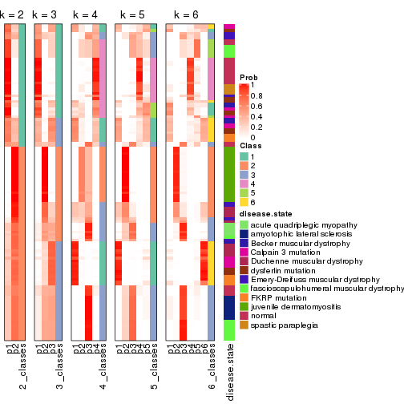


Test correlation between subgroups and known annotations. If the known
annotation is numeric, one-way ANOVA test is applied, and if the known
annotation is discrete, chi-squared contingency table test is applied.

```r
test_to_known_factors(res)
```

```
#>             n disease.state(p) k
#> SD:hclust 108         2.55e-07 2
#> SD:hclust  56         9.31e-09 3
#> SD:hclust  94         1.06e-28 4
#> SD:hclust  91         9.57e-31 5
#> SD:hclust  96         1.37e-30 6
```


If matrix rows can be associated to genes, consider to use `GO_Enrichment(res,
...)` to perform function enrichment for the signature genes.


 

---------------------------------------------------


### SD:kmeans


The object with results only for a single top-value method and a single partition method 
can be extracted as:

```r
res = res_list["SD", "kmeans"]
# you can also extract it by
# res = res_list["SD:kmeans"]
```

A summary of `res` and all the functions that can be applied to it:

```r
res
```

```
#> A 'ConsensusPartition' object with k = 2, 3, 4, 5, 6.
#>   On a matrix with 21168 rows and 121 columns.
#>   Top rows (1000, 2000, 3000, 4000, 5000) are extracted by 'SD' method.
#>   Subgroups are detected by 'kmeans' method.
#>   Performed in total 1250 partitions by row resampling.
#>   Best k for subgroups seems to be 2.
#> 
#> Following methods can be applied to this 'ConsensusPartition' object:
#>  [1] "cola_report"             "collect_classes"         "collect_plots"          
#>  [4] "collect_stats"           "colnames"                "compare_signatures"     
#>  [7] "consensus_heatmap"       "dimension_reduction"     "functional_enrichment"  
#> [10] "get_anno_col"            "get_anno"                "get_classes"            
#> [13] "get_consensus"           "get_matrix"              "get_membership"         
#> [16] "get_param"               "get_signatures"          "get_stats"              
#> [19] "is_best_k"               "is_stable_k"             "membership_heatmap"     
#> [22] "ncol"                    "nrow"                    "plot_ecdf"              
#> [25] "rownames"                "select_partition_number" "show"                   
#> [28] "suggest_best_k"          "test_to_known_factors"
```

`collect_plots()` function collects all the plots made from `res` for all `k` (number of partitions)
into one single page to provide an easy and fast comparison between different `k`.

```r
collect_plots(res)
```


The plots are:

- The first row: a plot of the ECDF (Empirical cumulative distribution
  function) curves of the consensus matrix for each `k` and the heatmap of
  predicted classes for each `k`.
- The second row: heatmaps of the consensus matrix for each `k`.
- The third row: heatmaps of the membership matrix for each `k`.
- The fouth row: heatmaps of the signatures for each `k`.

All the plots in panels can be made by individual functions and they are
plotted later in this section.

`select_partition_number()` produces several plots showing different
statistics for choosing "optimized" `k`. There are following statistics:

- ECDF curves of the consensus matrix for each `k`;
- 1-PAC. [The PAC
  score](https://en.wikipedia.org/wiki/Consensus_clustering#Over-interpretation_potential_of_consensus_clustering)
  measures the proportion of the ambiguous subgrouping.
- Mean silhouette score.
- Concordance. The mean probability of fiting the consensus class ids in all
  partitions.
- Area increased. Denote $A_k$ as the area under the ECDF curve for current
  `k`, the area increased is defined as $A_k - A_{k-1}$.
- Rand index. The percent of pairs of samples that are both in a same cluster
  or both are not in a same cluster in the partition of k and k-1.
- Jaccard index. The ratio of pairs of samples are both in a same cluster in
  the partition of k and k-1 and the pairs of samples are both in a same
  cluster in the partition k or k-1.

The detailed explanations of these statistics can be found in [the cola
vignette](http://bioconductor.org/packages/devel/bioc/vignettes/cola/inst/doc/cola.html#toc_13).

Generally speaking, lower PAC score, higher mean silhouette score or higher
concordance corresponds to better partition. Rand index and Jaccard index
measure how similar the current partition is compared to partition with `k-1`.
If they are too similar, we won't accept `k` is better than `k-1`.

```r
select_partition_number(res)
```


The numeric values for all these statistics can be obtained by `get_stats()`.

```r
get_stats(res)
```

```
#>   k 1-PAC mean_silhouette concordance area_increased  Rand Jaccard
#> 2 2 0.698           0.927       0.952         0.4895 0.497   0.497
#> 3 3 0.604           0.761       0.871         0.3365 0.684   0.449
#> 4 4 0.705           0.788       0.881         0.1317 0.834   0.556
#> 5 5 0.731           0.730       0.815         0.0623 0.956   0.829
#> 6 6 0.770           0.531       0.745         0.0398 0.924   0.689
```

`suggest_best_k()` suggests the best $k$ based on these statistics. The rules are as follows:

- All $k$ with Jaccard index larger than 0.95 are removed because the increase of
  the partition number does not provides enough extra information. If all $k$ are removed,
  the best $k$ is assigned by `NA`.
- For $k$ with 1-PAC larger than 0.9, the maximal $k$ is taken as the "best k". Other $k$ is called "optional k".
- If it does not fit the second rule. The $k$ with the highest vote of highest
  1-PAC, mean silhouette and concordance is taken as the "best k".

```r
suggest_best_k(res)
```

```
#> [1] 2
```


Following shows the table of the partitions (You need to click the **show/hide
code output** link to see it). The membership matrix (columns with name `p*`)
is inferred by
[`clue::cl_consensus()`](https://www.rdocumentation.org/link/cl_consensus?package=clue)
function with the `SE` method. Basically the value in the membership matrix
represents the probability to belong to a certain group. The finall class
label for an item is determined with the group with highest probability it
belongs to.

In `get_classes()` function, the entropy is calculated from the membership
matrix and the silhouette score is calculated from the consensus matrix.


<script>
$( function() {
	$( '#tabs-SD-kmeans-get-classes' ).tabs();
} );
</script>
<div id='tabs-SD-kmeans-get-classes'>
<ul>
<li><a href='#tab-SD-kmeans-get-classes-1'>k = 2</a></li>
<li><a href='#tab-SD-kmeans-get-classes-2'>k = 3</a></li>
<li><a href='#tab-SD-kmeans-get-classes-3'>k = 4</a></li>
<li><a href='#tab-SD-kmeans-get-classes-4'>k = 5</a></li>
<li><a href='#tab-SD-kmeans-get-classes-5'>k = 6</a></li>
</ul>

<div id='tab-SD-kmeans-get-classes-1'>
<p><a id='tab-SD-kmeans-get-classes-1-a' style='color:#0366d6' href='#'>show/hide code output</a></p>
<pre><code class="r">cbind(get_classes(res, k = 2), get_membership(res, k = 2))
</code></pre>

<pre><code>#&gt;           class entropy silhouette    p1    p2
#&gt; GSM74356      2  0.6623      0.853 0.172 0.828
#&gt; GSM74357      2  0.8081      0.783 0.248 0.752
#&gt; GSM74358      2  0.8081      0.783 0.248 0.752
#&gt; GSM74359      1  0.0000      0.987 1.000 0.000
#&gt; GSM74360      1  0.0000      0.987 1.000 0.000
#&gt; GSM74361      2  0.7139      0.835 0.196 0.804
#&gt; GSM74362      2  0.8081      0.783 0.248 0.752
#&gt; GSM74363      2  0.6623      0.853 0.172 0.828
#&gt; GSM74402      1  0.0000      0.987 1.000 0.000
#&gt; GSM74403      1  0.0000      0.987 1.000 0.000
#&gt; GSM74404      1  0.0000      0.987 1.000 0.000
#&gt; GSM74406      1  0.0000      0.987 1.000 0.000
#&gt; GSM74407      1  0.0000      0.987 1.000 0.000
#&gt; GSM74408      1  0.0000      0.987 1.000 0.000
#&gt; GSM74409      1  0.0000      0.987 1.000 0.000
#&gt; GSM74410      1  0.0000      0.987 1.000 0.000
#&gt; GSM119936     1  0.0000      0.987 1.000 0.000
#&gt; GSM119937     1  0.0000      0.987 1.000 0.000
#&gt; GSM74411      2  0.1184      0.918 0.016 0.984
#&gt; GSM74412      2  0.0938      0.919 0.012 0.988
#&gt; GSM74413      2  0.0938      0.919 0.012 0.988
#&gt; GSM74414      2  0.0938      0.919 0.012 0.988
#&gt; GSM74415      2  0.5946      0.870 0.144 0.856
#&gt; GSM121379     2  0.0938      0.919 0.012 0.988
#&gt; GSM121380     2  0.0938      0.919 0.012 0.988
#&gt; GSM121381     2  0.0938      0.919 0.012 0.988
#&gt; GSM121382     2  0.0938      0.919 0.012 0.988
#&gt; GSM121383     2  0.0938      0.919 0.012 0.988
#&gt; GSM121384     2  0.0938      0.919 0.012 0.988
#&gt; GSM121385     2  0.0938      0.919 0.012 0.988
#&gt; GSM121386     2  0.0938      0.919 0.012 0.988
#&gt; GSM121387     2  0.0938      0.919 0.012 0.988
#&gt; GSM121388     2  0.0938      0.919 0.012 0.988
#&gt; GSM121389     2  0.0938      0.919 0.012 0.988
#&gt; GSM121390     2  0.0938      0.919 0.012 0.988
#&gt; GSM121391     2  0.0938      0.919 0.012 0.988
#&gt; GSM121392     2  0.0938      0.919 0.012 0.988
#&gt; GSM121393     2  0.0938      0.919 0.012 0.988
#&gt; GSM121394     2  0.0938      0.919 0.012 0.988
#&gt; GSM121395     2  0.0938      0.919 0.012 0.988
#&gt; GSM121396     2  0.0938      0.919 0.012 0.988
#&gt; GSM121397     2  0.0938      0.919 0.012 0.988
#&gt; GSM121398     2  0.0938      0.919 0.012 0.988
#&gt; GSM121399     2  0.0938      0.919 0.012 0.988
#&gt; GSM74240      2  0.7815      0.790 0.232 0.768
#&gt; GSM74241      2  0.7299      0.819 0.204 0.796
#&gt; GSM74242      2  0.9608      0.529 0.384 0.616
#&gt; GSM74243      2  0.9608      0.529 0.384 0.616
#&gt; GSM74244      2  0.7056      0.831 0.192 0.808
#&gt; GSM74245      2  0.7815      0.790 0.232 0.768
#&gt; GSM74246      2  0.7056      0.831 0.192 0.808
#&gt; GSM74247      2  0.7056      0.831 0.192 0.808
#&gt; GSM74248      2  0.7950      0.781 0.240 0.760
#&gt; GSM74416      1  0.0000      0.987 1.000 0.000
#&gt; GSM74417      1  0.0000      0.987 1.000 0.000
#&gt; GSM74418      1  0.0000      0.987 1.000 0.000
#&gt; GSM74419      1  0.0000      0.987 1.000 0.000
#&gt; GSM121358     2  0.6343      0.861 0.160 0.840
#&gt; GSM121359     2  0.0938      0.919 0.012 0.988
#&gt; GSM121360     1  0.0000      0.987 1.000 0.000
#&gt; GSM121362     1  0.0000      0.987 1.000 0.000
#&gt; GSM121364     1  0.0000      0.987 1.000 0.000
#&gt; GSM121365     2  0.6343      0.861 0.160 0.840
#&gt; GSM121366     2  0.5519      0.877 0.128 0.872
#&gt; GSM121367     2  0.6343      0.861 0.160 0.840
#&gt; GSM121370     2  0.6343      0.861 0.160 0.840
#&gt; GSM121371     2  0.6343      0.861 0.160 0.840
#&gt; GSM121372     2  0.0938      0.919 0.012 0.988
#&gt; GSM121373     1  0.0000      0.987 1.000 0.000
#&gt; GSM121374     1  0.0000      0.987 1.000 0.000
#&gt; GSM121407     2  0.0938      0.919 0.012 0.988
#&gt; GSM74387      2  0.1633      0.916 0.024 0.976
#&gt; GSM74388      2  0.0938      0.919 0.012 0.988
#&gt; GSM74389      1  0.0000      0.987 1.000 0.000
#&gt; GSM74390      1  0.0000      0.987 1.000 0.000
#&gt; GSM74391      1  0.0000      0.987 1.000 0.000
#&gt; GSM74392      1  0.0000      0.987 1.000 0.000
#&gt; GSM74393      1  0.0000      0.987 1.000 0.000
#&gt; GSM74394      2  0.1184      0.918 0.016 0.984
#&gt; GSM74239      1  0.0000      0.987 1.000 0.000
#&gt; GSM74364      1  0.0000      0.987 1.000 0.000
#&gt; GSM74365      1  0.0000      0.987 1.000 0.000
#&gt; GSM74366      1  0.5737      0.838 0.864 0.136
#&gt; GSM74367      1  0.0000      0.987 1.000 0.000
#&gt; GSM74377      1  0.0376      0.983 0.996 0.004
#&gt; GSM74378      1  0.5737      0.838 0.864 0.136
#&gt; GSM74379      1  0.0000      0.987 1.000 0.000
#&gt; GSM74380      1  0.0000      0.987 1.000 0.000
#&gt; GSM74381      1  0.1414      0.968 0.980 0.020
#&gt; GSM121357     2  0.0938      0.919 0.012 0.988
#&gt; GSM121361     2  0.0938      0.919 0.012 0.988
#&gt; GSM121363     2  0.0938      0.919 0.012 0.988
#&gt; GSM121368     2  0.0938      0.919 0.012 0.988
#&gt; GSM121369     2  0.1633      0.916 0.024 0.976
#&gt; GSM74368      1  0.0000      0.987 1.000 0.000
#&gt; GSM74369      1  0.0000      0.987 1.000 0.000
#&gt; GSM74370      1  0.0000      0.987 1.000 0.000
#&gt; GSM74371      1  0.0000      0.987 1.000 0.000
#&gt; GSM74372      1  0.0000      0.987 1.000 0.000
#&gt; GSM74373      1  0.0376      0.983 0.996 0.004
#&gt; GSM74374      1  0.0000      0.987 1.000 0.000
#&gt; GSM74375      1  0.0000      0.987 1.000 0.000
#&gt; GSM74376      1  0.0000      0.987 1.000 0.000
#&gt; GSM74405      1  0.0000      0.987 1.000 0.000
#&gt; GSM74351      1  0.0000      0.987 1.000 0.000
#&gt; GSM74352      1  0.6247      0.813 0.844 0.156
#&gt; GSM74353      1  0.0000      0.987 1.000 0.000
#&gt; GSM74354      1  0.0000      0.987 1.000 0.000
#&gt; GSM74355      1  0.4690      0.881 0.900 0.100
#&gt; GSM74382      1  0.0000      0.987 1.000 0.000
#&gt; GSM74383      1  0.0000      0.987 1.000 0.000
#&gt; GSM74384      1  0.6247      0.813 0.844 0.156
#&gt; GSM74385      1  0.0000      0.987 1.000 0.000
#&gt; GSM74386      1  0.0000      0.987 1.000 0.000
#&gt; GSM74395      1  0.0000      0.987 1.000 0.000
#&gt; GSM74396      1  0.0000      0.987 1.000 0.000
#&gt; GSM74397      1  0.0000      0.987 1.000 0.000
#&gt; GSM74398      1  0.0000      0.987 1.000 0.000
#&gt; GSM74399      1  0.0000      0.987 1.000 0.000
#&gt; GSM74400      1  0.0000      0.987 1.000 0.000
#&gt; GSM74401      1  0.0000      0.987 1.000 0.000
</code></pre>

<script>
$('#tab-SD-kmeans-get-classes-1-a').parent().next().next().hide();
$('#tab-SD-kmeans-get-classes-1-a').click(function(){
  $('#tab-SD-kmeans-get-classes-1-a').parent().next().next().toggle();
  return(false);
});
</script>
</div>

<div id='tab-SD-kmeans-get-classes-2'>
<p><a id='tab-SD-kmeans-get-classes-2-a' style='color:#0366d6' href='#'>show/hide code output</a></p>
<pre><code class="r">cbind(get_classes(res, k = 3), get_membership(res, k = 3))
</code></pre>

<pre><code>#&gt;           class entropy silhouette    p1    p2    p3
#&gt; GSM74356      3  0.1482      0.688 0.012 0.020 0.968
#&gt; GSM74357      3  0.1491      0.691 0.016 0.016 0.968
#&gt; GSM74358      3  0.1491      0.691 0.016 0.016 0.968
#&gt; GSM74359      3  0.4842      0.689 0.224 0.000 0.776
#&gt; GSM74360      3  0.5138      0.675 0.252 0.000 0.748
#&gt; GSM74361      3  0.1491      0.691 0.016 0.016 0.968
#&gt; GSM74362      3  0.1491      0.691 0.016 0.016 0.968
#&gt; GSM74363      3  0.1711      0.680 0.008 0.032 0.960
#&gt; GSM74402      3  0.6180      0.446 0.416 0.000 0.584
#&gt; GSM74403      3  0.6260      0.377 0.448 0.000 0.552
#&gt; GSM74404      3  0.6260      0.377 0.448 0.000 0.552
#&gt; GSM74406      3  0.5138      0.675 0.252 0.000 0.748
#&gt; GSM74407      3  0.6008      0.525 0.372 0.000 0.628
#&gt; GSM74408      3  0.5138      0.675 0.252 0.000 0.748
#&gt; GSM74409      3  0.5138      0.675 0.252 0.000 0.748
#&gt; GSM74410      3  0.5058      0.680 0.244 0.000 0.756
#&gt; GSM119936     3  0.5138      0.675 0.252 0.000 0.748
#&gt; GSM119937     3  0.5138      0.675 0.252 0.000 0.748
#&gt; GSM74411      2  0.6126      0.578 0.004 0.644 0.352
#&gt; GSM74412      2  0.5115      0.755 0.004 0.768 0.228
#&gt; GSM74413      2  0.5656      0.691 0.004 0.712 0.284
#&gt; GSM74414      2  0.1765      0.879 0.004 0.956 0.040
#&gt; GSM74415      3  0.6264      0.178 0.004 0.380 0.616
#&gt; GSM121379     2  0.0000      0.894 0.000 1.000 0.000
#&gt; GSM121380     2  0.0000      0.894 0.000 1.000 0.000
#&gt; GSM121381     2  0.0000      0.894 0.000 1.000 0.000
#&gt; GSM121382     2  0.0000      0.894 0.000 1.000 0.000
#&gt; GSM121383     2  0.0000      0.894 0.000 1.000 0.000
#&gt; GSM121384     2  0.0000      0.894 0.000 1.000 0.000
#&gt; GSM121385     2  0.0000      0.894 0.000 1.000 0.000
#&gt; GSM121386     2  0.0000      0.894 0.000 1.000 0.000
#&gt; GSM121387     2  0.0000      0.894 0.000 1.000 0.000
#&gt; GSM121388     2  0.0000      0.894 0.000 1.000 0.000
#&gt; GSM121389     2  0.0000      0.894 0.000 1.000 0.000
#&gt; GSM121390     2  0.0000      0.894 0.000 1.000 0.000
#&gt; GSM121391     2  0.0000      0.894 0.000 1.000 0.000
#&gt; GSM121392     2  0.0237      0.891 0.004 0.996 0.000
#&gt; GSM121393     2  0.0000      0.894 0.000 1.000 0.000
#&gt; GSM121394     2  0.0000      0.894 0.000 1.000 0.000
#&gt; GSM121395     2  0.0000      0.894 0.000 1.000 0.000
#&gt; GSM121396     2  0.0747      0.889 0.000 0.984 0.016
#&gt; GSM121397     2  0.0000      0.894 0.000 1.000 0.000
#&gt; GSM121398     2  0.0000      0.894 0.000 1.000 0.000
#&gt; GSM121399     2  0.0000      0.894 0.000 1.000 0.000
#&gt; GSM74240      3  0.0983      0.681 0.016 0.004 0.980
#&gt; GSM74241      3  0.5723      0.433 0.016 0.240 0.744
#&gt; GSM74242      3  0.0475      0.683 0.004 0.004 0.992
#&gt; GSM74243      3  0.0475      0.683 0.004 0.004 0.992
#&gt; GSM74244      3  0.5723      0.433 0.016 0.240 0.744
#&gt; GSM74245      3  0.0983      0.681 0.016 0.004 0.980
#&gt; GSM74246      3  0.6096      0.363 0.016 0.280 0.704
#&gt; GSM74247      3  0.6448      0.261 0.016 0.328 0.656
#&gt; GSM74248      3  0.0983      0.681 0.016 0.004 0.980
#&gt; GSM74416      3  0.6260      0.377 0.448 0.000 0.552
#&gt; GSM74417      3  0.6260      0.377 0.448 0.000 0.552
#&gt; GSM74418      3  0.6295      0.316 0.472 0.000 0.528
#&gt; GSM74419      3  0.5138      0.675 0.252 0.000 0.748
#&gt; GSM121358     3  0.6529      0.214 0.012 0.368 0.620
#&gt; GSM121359     2  0.5480      0.717 0.004 0.732 0.264
#&gt; GSM121360     3  0.5926      0.550 0.356 0.000 0.644
#&gt; GSM121362     3  0.6008      0.522 0.372 0.000 0.628
#&gt; GSM121364     3  0.4974      0.684 0.236 0.000 0.764
#&gt; GSM121365     3  0.6529      0.214 0.012 0.368 0.620
#&gt; GSM121366     3  0.6247      0.190 0.004 0.376 0.620
#&gt; GSM121367     3  0.6529      0.214 0.012 0.368 0.620
#&gt; GSM121370     3  0.6529      0.214 0.012 0.368 0.620
#&gt; GSM121371     3  0.6529      0.214 0.012 0.368 0.620
#&gt; GSM121372     2  0.5623      0.697 0.004 0.716 0.280
#&gt; GSM121373     3  0.4974      0.684 0.236 0.000 0.764
#&gt; GSM121374     3  0.4974      0.684 0.236 0.000 0.764
#&gt; GSM121407     2  0.4883      0.773 0.004 0.788 0.208
#&gt; GSM74387      2  0.8286      0.652 0.140 0.624 0.236
#&gt; GSM74388      2  0.5466      0.782 0.160 0.800 0.040
#&gt; GSM74389      3  0.2711      0.713 0.088 0.000 0.912
#&gt; GSM74390      1  0.0000      0.980 1.000 0.000 0.000
#&gt; GSM74391      3  0.5098      0.678 0.248 0.000 0.752
#&gt; GSM74392      3  0.4750      0.692 0.216 0.000 0.784
#&gt; GSM74393      3  0.1753      0.703 0.048 0.000 0.952
#&gt; GSM74394      2  0.7829      0.703 0.164 0.672 0.164
#&gt; GSM74239      1  0.0747      0.979 0.984 0.000 0.016
#&gt; GSM74364      1  0.0747      0.979 0.984 0.000 0.016
#&gt; GSM74365      1  0.0237      0.980 0.996 0.000 0.004
#&gt; GSM74366      1  0.1163      0.952 0.972 0.028 0.000
#&gt; GSM74367      1  0.0747      0.979 0.984 0.000 0.016
#&gt; GSM74377      1  0.0000      0.980 1.000 0.000 0.000
#&gt; GSM74378      1  0.0892      0.961 0.980 0.020 0.000
#&gt; GSM74379      1  0.0000      0.980 1.000 0.000 0.000
#&gt; GSM74380      1  0.0000      0.980 1.000 0.000 0.000
#&gt; GSM74381      1  0.0000      0.980 1.000 0.000 0.000
#&gt; GSM121357     2  0.2200      0.872 0.004 0.940 0.056
#&gt; GSM121361     2  0.5875      0.777 0.160 0.784 0.056
#&gt; GSM121363     2  0.5816      0.782 0.156 0.788 0.056
#&gt; GSM121368     2  0.5816      0.782 0.156 0.788 0.056
#&gt; GSM121369     2  0.8212      0.670 0.168 0.640 0.192
#&gt; GSM74368      1  0.0747      0.979 0.984 0.000 0.016
#&gt; GSM74369      1  0.0747      0.979 0.984 0.000 0.016
#&gt; GSM74370      1  0.0747      0.979 0.984 0.000 0.016
#&gt; GSM74371      1  0.0892      0.976 0.980 0.000 0.020
#&gt; GSM74372      1  0.0747      0.979 0.984 0.000 0.016
#&gt; GSM74373      1  0.0000      0.980 1.000 0.000 0.000
#&gt; GSM74374      1  0.0424      0.980 0.992 0.000 0.008
#&gt; GSM74375      1  0.0000      0.980 1.000 0.000 0.000
#&gt; GSM74376      1  0.0000      0.980 1.000 0.000 0.000
#&gt; GSM74405      1  0.0000      0.980 1.000 0.000 0.000
#&gt; GSM74351      1  0.2356      0.908 0.928 0.000 0.072
#&gt; GSM74352      1  0.1289      0.947 0.968 0.032 0.000
#&gt; GSM74353      1  0.0747      0.979 0.984 0.000 0.016
#&gt; GSM74354      1  0.0592      0.980 0.988 0.000 0.012
#&gt; GSM74355      1  0.0424      0.973 0.992 0.008 0.000
#&gt; GSM74382      1  0.2959      0.863 0.900 0.000 0.100
#&gt; GSM74383      1  0.0747      0.979 0.984 0.000 0.016
#&gt; GSM74384      1  0.1289      0.947 0.968 0.032 0.000
#&gt; GSM74385      1  0.0892      0.976 0.980 0.000 0.020
#&gt; GSM74386      1  0.0592      0.980 0.988 0.000 0.012
#&gt; GSM74395      1  0.0747      0.979 0.984 0.000 0.016
#&gt; GSM74396      1  0.0747      0.979 0.984 0.000 0.016
#&gt; GSM74397      1  0.0892      0.976 0.980 0.000 0.020
#&gt; GSM74398      1  0.0000      0.980 1.000 0.000 0.000
#&gt; GSM74399      1  0.0000      0.980 1.000 0.000 0.000
#&gt; GSM74400      1  0.0000      0.980 1.000 0.000 0.000
#&gt; GSM74401      1  0.0000      0.980 1.000 0.000 0.000
</code></pre>

<script>
$('#tab-SD-kmeans-get-classes-2-a').parent().next().next().hide();
$('#tab-SD-kmeans-get-classes-2-a').click(function(){
  $('#tab-SD-kmeans-get-classes-2-a').parent().next().next().toggle();
  return(false);
});
</script>
</div>

<div id='tab-SD-kmeans-get-classes-3'>
<p><a id='tab-SD-kmeans-get-classes-3-a' style='color:#0366d6' href='#'>show/hide code output</a></p>
<pre><code class="r">cbind(get_classes(res, k = 4), get_membership(res, k = 4))
</code></pre>

<pre><code>#&gt;           class entropy silhouette    p1    p2    p3    p4
#&gt; GSM74356      3  0.2345      0.866 0.000 0.000 0.900 0.100
#&gt; GSM74357      3  0.2408      0.864 0.000 0.000 0.896 0.104
#&gt; GSM74358      3  0.2408      0.864 0.000 0.000 0.896 0.104
#&gt; GSM74359      4  0.3707      0.822 0.028 0.000 0.132 0.840
#&gt; GSM74360      4  0.0921      0.905 0.028 0.000 0.000 0.972
#&gt; GSM74361      3  0.2345      0.866 0.000 0.000 0.900 0.100
#&gt; GSM74362      3  0.2469      0.863 0.000 0.000 0.892 0.108
#&gt; GSM74363      3  0.2345      0.866 0.000 0.000 0.900 0.100
#&gt; GSM74402      4  0.1302      0.904 0.044 0.000 0.000 0.956
#&gt; GSM74403      4  0.1389      0.903 0.048 0.000 0.000 0.952
#&gt; GSM74404      4  0.1389      0.903 0.048 0.000 0.000 0.952
#&gt; GSM74406      4  0.1022      0.907 0.032 0.000 0.000 0.968
#&gt; GSM74407      4  0.1211      0.906 0.040 0.000 0.000 0.960
#&gt; GSM74408      4  0.1022      0.907 0.032 0.000 0.000 0.968
#&gt; GSM74409      4  0.1022      0.907 0.032 0.000 0.000 0.968
#&gt; GSM74410      4  0.1022      0.907 0.032 0.000 0.000 0.968
#&gt; GSM119936     4  0.1022      0.907 0.032 0.000 0.000 0.968
#&gt; GSM119937     4  0.1022      0.907 0.032 0.000 0.000 0.968
#&gt; GSM74411      3  0.4034      0.745 0.008 0.192 0.796 0.004
#&gt; GSM74412      3  0.3893      0.740 0.008 0.196 0.796 0.000
#&gt; GSM74413      3  0.4034      0.745 0.008 0.192 0.796 0.004
#&gt; GSM74414      2  0.5280      0.699 0.128 0.752 0.120 0.000
#&gt; GSM74415      3  0.2271      0.871 0.008 0.012 0.928 0.052
#&gt; GSM121379     2  0.0000      0.886 0.000 1.000 0.000 0.000
#&gt; GSM121380     2  0.0000      0.886 0.000 1.000 0.000 0.000
#&gt; GSM121381     2  0.0000      0.886 0.000 1.000 0.000 0.000
#&gt; GSM121382     2  0.0188      0.886 0.000 0.996 0.000 0.004
#&gt; GSM121383     2  0.0188      0.886 0.000 0.996 0.000 0.004
#&gt; GSM121384     2  0.0000      0.886 0.000 1.000 0.000 0.000
#&gt; GSM121385     2  0.0000      0.886 0.000 1.000 0.000 0.000
#&gt; GSM121386     2  0.0000      0.886 0.000 1.000 0.000 0.000
#&gt; GSM121387     2  0.0188      0.886 0.000 0.996 0.000 0.004
#&gt; GSM121388     2  0.0376      0.884 0.000 0.992 0.004 0.004
#&gt; GSM121389     2  0.0188      0.886 0.000 0.996 0.000 0.004
#&gt; GSM121390     2  0.0000      0.886 0.000 1.000 0.000 0.000
#&gt; GSM121391     2  0.0000      0.886 0.000 1.000 0.000 0.000
#&gt; GSM121392     2  0.0000      0.886 0.000 1.000 0.000 0.000
#&gt; GSM121393     2  0.0188      0.886 0.000 0.996 0.000 0.004
#&gt; GSM121394     2  0.0188      0.886 0.000 0.996 0.000 0.004
#&gt; GSM121395     2  0.0188      0.886 0.000 0.996 0.000 0.004
#&gt; GSM121396     2  0.2125      0.823 0.000 0.920 0.076 0.004
#&gt; GSM121397     2  0.0000      0.886 0.000 1.000 0.000 0.000
#&gt; GSM121398     2  0.0000      0.886 0.000 1.000 0.000 0.000
#&gt; GSM121399     2  0.0000      0.886 0.000 1.000 0.000 0.000
#&gt; GSM74240      3  0.1398      0.862 0.004 0.000 0.956 0.040
#&gt; GSM74241      3  0.1398      0.862 0.004 0.000 0.956 0.040
#&gt; GSM74242      3  0.1398      0.862 0.004 0.000 0.956 0.040
#&gt; GSM74243      3  0.1398      0.862 0.004 0.000 0.956 0.040
#&gt; GSM74244      3  0.1398      0.862 0.004 0.000 0.956 0.040
#&gt; GSM74245      3  0.1398      0.862 0.004 0.000 0.956 0.040
#&gt; GSM74246      3  0.1398      0.862 0.004 0.000 0.956 0.040
#&gt; GSM74247      3  0.1398      0.862 0.004 0.000 0.956 0.040
#&gt; GSM74248      3  0.1398      0.862 0.004 0.000 0.956 0.040
#&gt; GSM74416      4  0.1389      0.903 0.048 0.000 0.000 0.952
#&gt; GSM74417      4  0.1389      0.903 0.048 0.000 0.000 0.952
#&gt; GSM74418      4  0.1389      0.903 0.048 0.000 0.000 0.952
#&gt; GSM74419      4  0.1022      0.907 0.032 0.000 0.000 0.968
#&gt; GSM121358     3  0.2665      0.870 0.004 0.008 0.900 0.088
#&gt; GSM121359     3  0.4192      0.733 0.004 0.208 0.780 0.008
#&gt; GSM121360     4  0.6494      0.591 0.232 0.000 0.136 0.632
#&gt; GSM121362     4  0.6680      0.536 0.260 0.000 0.136 0.604
#&gt; GSM121364     4  0.3653      0.825 0.028 0.000 0.128 0.844
#&gt; GSM121365     3  0.2665      0.870 0.004 0.008 0.900 0.088
#&gt; GSM121366     3  0.2528      0.871 0.004 0.008 0.908 0.080
#&gt; GSM121367     3  0.2665      0.870 0.004 0.008 0.900 0.088
#&gt; GSM121370     3  0.2597      0.871 0.004 0.008 0.904 0.084
#&gt; GSM121371     3  0.2665      0.870 0.004 0.008 0.900 0.088
#&gt; GSM121372     3  0.4294      0.735 0.008 0.204 0.780 0.008
#&gt; GSM121373     4  0.3760      0.822 0.028 0.000 0.136 0.836
#&gt; GSM121374     4  0.3707      0.822 0.028 0.000 0.132 0.840
#&gt; GSM121407     3  0.4192      0.730 0.008 0.208 0.780 0.004
#&gt; GSM74387      3  0.4610      0.764 0.100 0.100 0.800 0.000
#&gt; GSM74388      2  0.6552      0.318 0.440 0.484 0.076 0.000
#&gt; GSM74389      3  0.5500      0.140 0.016 0.000 0.520 0.464
#&gt; GSM74390      1  0.0188      0.852 0.996 0.000 0.004 0.000
#&gt; GSM74391      4  0.1022      0.907 0.032 0.000 0.000 0.968
#&gt; GSM74392      4  0.3707      0.822 0.028 0.000 0.132 0.840
#&gt; GSM74393      3  0.3870      0.758 0.004 0.000 0.788 0.208
#&gt; GSM74394      1  0.7558     -0.165 0.428 0.192 0.380 0.000
#&gt; GSM74239      1  0.4428      0.683 0.720 0.000 0.004 0.276
#&gt; GSM74364      1  0.4837      0.548 0.648 0.000 0.004 0.348
#&gt; GSM74365      1  0.0817      0.854 0.976 0.000 0.000 0.024
#&gt; GSM74366      1  0.0336      0.850 0.992 0.000 0.008 0.000
#&gt; GSM74367      1  0.3583      0.800 0.816 0.000 0.004 0.180
#&gt; GSM74377      1  0.0000      0.855 1.000 0.000 0.000 0.000
#&gt; GSM74378      1  0.0188      0.853 0.996 0.000 0.004 0.000
#&gt; GSM74379      1  0.0000      0.855 1.000 0.000 0.000 0.000
#&gt; GSM74380      1  0.0000      0.855 1.000 0.000 0.000 0.000
#&gt; GSM74381      1  0.0000      0.855 1.000 0.000 0.000 0.000
#&gt; GSM121357     2  0.6701      0.420 0.120 0.584 0.296 0.000
#&gt; GSM121361     2  0.7007      0.303 0.432 0.452 0.116 0.000
#&gt; GSM121363     2  0.7006      0.313 0.428 0.456 0.116 0.000
#&gt; GSM121368     2  0.7006      0.313 0.428 0.456 0.116 0.000
#&gt; GSM121369     3  0.7007      0.217 0.432 0.116 0.452 0.000
#&gt; GSM74368      1  0.3751      0.788 0.800 0.000 0.004 0.196
#&gt; GSM74369      1  0.3791      0.784 0.796 0.000 0.004 0.200
#&gt; GSM74370      1  0.3751      0.789 0.800 0.000 0.004 0.196
#&gt; GSM74371      4  0.5165     -0.144 0.484 0.000 0.004 0.512
#&gt; GSM74372      1  0.3356      0.804 0.824 0.000 0.000 0.176
#&gt; GSM74373      1  0.0000      0.855 1.000 0.000 0.000 0.000
#&gt; GSM74374      1  0.2704      0.828 0.876 0.000 0.000 0.124
#&gt; GSM74375      1  0.0000      0.855 1.000 0.000 0.000 0.000
#&gt; GSM74376      1  0.0188      0.853 0.996 0.000 0.004 0.000
#&gt; GSM74405      1  0.0000      0.855 1.000 0.000 0.000 0.000
#&gt; GSM74351      4  0.2125      0.876 0.076 0.000 0.004 0.920
#&gt; GSM74352      1  0.0376      0.850 0.992 0.004 0.004 0.000
#&gt; GSM74353      1  0.3791      0.784 0.796 0.000 0.004 0.200
#&gt; GSM74354      1  0.2944      0.826 0.868 0.000 0.004 0.128
#&gt; GSM74355      1  0.0000      0.855 1.000 0.000 0.000 0.000
#&gt; GSM74382      4  0.2053      0.880 0.072 0.000 0.004 0.924
#&gt; GSM74383      1  0.3583      0.800 0.816 0.000 0.004 0.180
#&gt; GSM74384      1  0.0524      0.847 0.988 0.004 0.008 0.000
#&gt; GSM74385      1  0.5060      0.412 0.584 0.000 0.004 0.412
#&gt; GSM74386      1  0.3583      0.800 0.816 0.000 0.004 0.180
#&gt; GSM74395      1  0.3710      0.790 0.804 0.000 0.004 0.192
#&gt; GSM74396      1  0.3494      0.805 0.824 0.000 0.004 0.172
#&gt; GSM74397      1  0.4920      0.499 0.628 0.000 0.004 0.368
#&gt; GSM74398      1  0.0188      0.855 0.996 0.000 0.000 0.004
#&gt; GSM74399      1  0.0000      0.855 1.000 0.000 0.000 0.000
#&gt; GSM74400      1  0.1022      0.853 0.968 0.000 0.000 0.032
#&gt; GSM74401      1  0.1022      0.853 0.968 0.000 0.000 0.032
</code></pre>

<script>
$('#tab-SD-kmeans-get-classes-3-a').parent().next().next().hide();
$('#tab-SD-kmeans-get-classes-3-a').click(function(){
  $('#tab-SD-kmeans-get-classes-3-a').parent().next().next().toggle();
  return(false);
});
</script>
</div>

<div id='tab-SD-kmeans-get-classes-4'>
<p><a id='tab-SD-kmeans-get-classes-4-a' style='color:#0366d6' href='#'>show/hide code output</a></p>
<pre><code class="r">cbind(get_classes(res, k = 5), get_membership(res, k = 5))
</code></pre>

<pre><code>#&gt;           class entropy silhouette    p1    p2    p3    p4    p5
#&gt; GSM74356      3  0.1522     0.8139 0.000 0.000 0.944 0.044 0.012
#&gt; GSM74357      3  0.2139     0.8003 0.000 0.000 0.916 0.052 0.032
#&gt; GSM74358      3  0.2139     0.8003 0.000 0.000 0.916 0.052 0.032
#&gt; GSM74359      4  0.4847     0.6998 0.000 0.000 0.080 0.704 0.216
#&gt; GSM74360      4  0.4150     0.7230 0.000 0.000 0.036 0.748 0.216
#&gt; GSM74361      3  0.1522     0.8139 0.000 0.000 0.944 0.044 0.012
#&gt; GSM74362      3  0.5123     0.5963 0.000 0.000 0.696 0.144 0.160
#&gt; GSM74363      3  0.1205     0.8171 0.000 0.000 0.956 0.040 0.004
#&gt; GSM74402      4  0.2074     0.7904 0.104 0.000 0.000 0.896 0.000
#&gt; GSM74403      4  0.2233     0.7892 0.104 0.000 0.000 0.892 0.004
#&gt; GSM74404      4  0.2233     0.7892 0.104 0.000 0.000 0.892 0.004
#&gt; GSM74406      4  0.0510     0.8064 0.016 0.000 0.000 0.984 0.000
#&gt; GSM74407      4  0.2074     0.7904 0.104 0.000 0.000 0.896 0.000
#&gt; GSM74408      4  0.0510     0.8064 0.016 0.000 0.000 0.984 0.000
#&gt; GSM74409      4  0.0510     0.8064 0.016 0.000 0.000 0.984 0.000
#&gt; GSM74410      4  0.0404     0.8054 0.012 0.000 0.000 0.988 0.000
#&gt; GSM119936     4  0.0794     0.8063 0.028 0.000 0.000 0.972 0.000
#&gt; GSM119937     4  0.0703     0.8067 0.024 0.000 0.000 0.976 0.000
#&gt; GSM74411      3  0.3888     0.7565 0.000 0.072 0.812 0.004 0.112
#&gt; GSM74412      3  0.3888     0.7565 0.000 0.072 0.812 0.004 0.112
#&gt; GSM74413      3  0.3888     0.7565 0.000 0.072 0.812 0.004 0.112
#&gt; GSM74414      5  0.7246     0.6208 0.064 0.392 0.124 0.000 0.420
#&gt; GSM74415      3  0.3166     0.7971 0.000 0.012 0.856 0.020 0.112
#&gt; GSM121379     2  0.0162     0.9822 0.000 0.996 0.000 0.000 0.004
#&gt; GSM121380     2  0.0162     0.9822 0.000 0.996 0.000 0.000 0.004
#&gt; GSM121381     2  0.0162     0.9822 0.000 0.996 0.000 0.000 0.004
#&gt; GSM121382     2  0.0162     0.9805 0.000 0.996 0.000 0.000 0.004
#&gt; GSM121383     2  0.0162     0.9805 0.000 0.996 0.000 0.000 0.004
#&gt; GSM121384     2  0.0162     0.9822 0.000 0.996 0.000 0.000 0.004
#&gt; GSM121385     2  0.0162     0.9822 0.000 0.996 0.000 0.000 0.004
#&gt; GSM121386     2  0.0162     0.9822 0.000 0.996 0.000 0.000 0.004
#&gt; GSM121387     2  0.0162     0.9805 0.000 0.996 0.000 0.000 0.004
#&gt; GSM121388     2  0.1041     0.9595 0.000 0.964 0.004 0.000 0.032
#&gt; GSM121389     2  0.0609     0.9710 0.000 0.980 0.000 0.000 0.020
#&gt; GSM121390     2  0.0162     0.9822 0.000 0.996 0.000 0.000 0.004
#&gt; GSM121391     2  0.0000     0.9816 0.000 1.000 0.000 0.000 0.000
#&gt; GSM121392     2  0.0162     0.9822 0.000 0.996 0.000 0.000 0.004
#&gt; GSM121393     2  0.0794     0.9657 0.000 0.972 0.000 0.000 0.028
#&gt; GSM121394     2  0.0000     0.9816 0.000 1.000 0.000 0.000 0.000
#&gt; GSM121395     2  0.0794     0.9657 0.000 0.972 0.000 0.000 0.028
#&gt; GSM121396     2  0.3115     0.7822 0.000 0.852 0.112 0.000 0.036
#&gt; GSM121397     2  0.0162     0.9822 0.000 0.996 0.000 0.000 0.004
#&gt; GSM121398     2  0.0162     0.9822 0.000 0.996 0.000 0.000 0.004
#&gt; GSM121399     2  0.0000     0.9816 0.000 1.000 0.000 0.000 0.000
#&gt; GSM74240      3  0.3727     0.7723 0.000 0.000 0.768 0.016 0.216
#&gt; GSM74241      3  0.3663     0.7735 0.000 0.000 0.776 0.016 0.208
#&gt; GSM74242      3  0.3630     0.7732 0.000 0.000 0.780 0.016 0.204
#&gt; GSM74243      3  0.3630     0.7732 0.000 0.000 0.780 0.016 0.204
#&gt; GSM74244      3  0.3663     0.7735 0.000 0.000 0.776 0.016 0.208
#&gt; GSM74245      3  0.3696     0.7732 0.000 0.000 0.772 0.016 0.212
#&gt; GSM74246      3  0.3696     0.7724 0.000 0.000 0.772 0.016 0.212
#&gt; GSM74247      3  0.3696     0.7724 0.000 0.000 0.772 0.016 0.212
#&gt; GSM74248      3  0.3727     0.7723 0.000 0.000 0.768 0.016 0.216
#&gt; GSM74416      4  0.2338     0.7854 0.112 0.000 0.000 0.884 0.004
#&gt; GSM74417      4  0.2338     0.7854 0.112 0.000 0.000 0.884 0.004
#&gt; GSM74418      4  0.2338     0.7854 0.112 0.000 0.000 0.884 0.004
#&gt; GSM74419      4  0.0703     0.8067 0.024 0.000 0.000 0.976 0.000
#&gt; GSM121358     3  0.1356     0.8198 0.000 0.012 0.956 0.028 0.004
#&gt; GSM121359     3  0.3043     0.7685 0.000 0.080 0.864 0.000 0.056
#&gt; GSM121360     4  0.6982     0.5730 0.132 0.000 0.080 0.568 0.220
#&gt; GSM121362     4  0.7479     0.4957 0.200 0.000 0.080 0.500 0.220
#&gt; GSM121364     4  0.4847     0.6998 0.000 0.000 0.080 0.704 0.216
#&gt; GSM121365     3  0.1356     0.8198 0.000 0.012 0.956 0.028 0.004
#&gt; GSM121366     3  0.1267     0.8198 0.000 0.012 0.960 0.024 0.004
#&gt; GSM121367     3  0.1356     0.8198 0.000 0.012 0.956 0.028 0.004
#&gt; GSM121370     3  0.1356     0.8198 0.000 0.012 0.956 0.028 0.004
#&gt; GSM121371     3  0.1356     0.8198 0.000 0.012 0.956 0.028 0.004
#&gt; GSM121372     3  0.3110     0.7663 0.000 0.080 0.860 0.000 0.060
#&gt; GSM121373     4  0.4847     0.6998 0.000 0.000 0.080 0.704 0.216
#&gt; GSM121374     4  0.4847     0.6998 0.000 0.000 0.080 0.704 0.216
#&gt; GSM121407     3  0.3362     0.7549 0.000 0.080 0.844 0.000 0.076
#&gt; GSM74387      3  0.5652     0.2082 0.020 0.044 0.556 0.000 0.380
#&gt; GSM74388      5  0.7199     0.7983 0.216 0.256 0.040 0.000 0.488
#&gt; GSM74389      4  0.6246     0.3776 0.000 0.000 0.292 0.528 0.180
#&gt; GSM74390      1  0.3612     0.5798 0.732 0.000 0.000 0.000 0.268
#&gt; GSM74391      4  0.1568     0.8023 0.020 0.000 0.000 0.944 0.036
#&gt; GSM74392      4  0.4605     0.7131 0.000 0.000 0.076 0.732 0.192
#&gt; GSM74393      3  0.6507     0.0482 0.000 0.000 0.432 0.376 0.192
#&gt; GSM74394      5  0.7771     0.7636 0.200 0.144 0.168 0.000 0.488
#&gt; GSM74239      1  0.2561     0.6527 0.856 0.000 0.000 0.144 0.000
#&gt; GSM74364      1  0.3266     0.5884 0.796 0.000 0.000 0.200 0.004
#&gt; GSM74365      1  0.0865     0.7180 0.972 0.000 0.000 0.004 0.024
#&gt; GSM74366      1  0.4242     0.3930 0.572 0.000 0.000 0.000 0.428
#&gt; GSM74367      1  0.1197     0.7236 0.952 0.000 0.000 0.048 0.000
#&gt; GSM74377      1  0.3857     0.5602 0.688 0.000 0.000 0.000 0.312
#&gt; GSM74378      1  0.4242     0.3930 0.572 0.000 0.000 0.000 0.428
#&gt; GSM74379      1  0.3003     0.6617 0.812 0.000 0.000 0.000 0.188
#&gt; GSM74380      1  0.3039     0.6598 0.808 0.000 0.000 0.000 0.192
#&gt; GSM74381      1  0.4060     0.5034 0.640 0.000 0.000 0.000 0.360
#&gt; GSM121357     5  0.7800     0.6643 0.072 0.304 0.228 0.000 0.396
#&gt; GSM121361     5  0.7504     0.8302 0.204 0.252 0.068 0.000 0.476
#&gt; GSM121363     5  0.7483     0.8322 0.200 0.252 0.068 0.000 0.480
#&gt; GSM121368     5  0.7509     0.8336 0.196 0.252 0.072 0.000 0.480
#&gt; GSM121369     5  0.7708     0.7119 0.200 0.104 0.216 0.000 0.480
#&gt; GSM74368      1  0.1410     0.7194 0.940 0.000 0.000 0.060 0.000
#&gt; GSM74369      1  0.1410     0.7194 0.940 0.000 0.000 0.060 0.000
#&gt; GSM74370      1  0.1410     0.7194 0.940 0.000 0.000 0.060 0.000
#&gt; GSM74371      1  0.4415     0.0272 0.552 0.000 0.000 0.444 0.004
#&gt; GSM74372      1  0.1357     0.7242 0.948 0.000 0.000 0.048 0.004
#&gt; GSM74373      1  0.4074     0.4981 0.636 0.000 0.000 0.000 0.364
#&gt; GSM74374      1  0.1168     0.7244 0.960 0.000 0.000 0.032 0.008
#&gt; GSM74375      1  0.2929     0.6754 0.820 0.000 0.000 0.000 0.180
#&gt; GSM74376      1  0.4227     0.4085 0.580 0.000 0.000 0.000 0.420
#&gt; GSM74405      1  0.4114     0.4810 0.624 0.000 0.000 0.000 0.376
#&gt; GSM74351      4  0.4321     0.3991 0.396 0.000 0.000 0.600 0.004
#&gt; GSM74352      1  0.4227     0.4085 0.580 0.000 0.000 0.000 0.420
#&gt; GSM74353      1  0.1410     0.7194 0.940 0.000 0.000 0.060 0.000
#&gt; GSM74354      1  0.0880     0.7240 0.968 0.000 0.000 0.032 0.000
#&gt; GSM74355      1  0.4227     0.4085 0.580 0.000 0.000 0.000 0.420
#&gt; GSM74382      4  0.4288     0.4252 0.384 0.000 0.000 0.612 0.004
#&gt; GSM74383      1  0.1197     0.7236 0.952 0.000 0.000 0.048 0.000
#&gt; GSM74384      1  0.4242     0.3930 0.572 0.000 0.000 0.000 0.428
#&gt; GSM74385      1  0.4084     0.3563 0.668 0.000 0.000 0.328 0.004
#&gt; GSM74386      1  0.1197     0.7236 0.952 0.000 0.000 0.048 0.000
#&gt; GSM74395      1  0.1341     0.7210 0.944 0.000 0.000 0.056 0.000
#&gt; GSM74396      1  0.1197     0.7236 0.952 0.000 0.000 0.048 0.000
#&gt; GSM74397      1  0.3274     0.5603 0.780 0.000 0.000 0.220 0.000
#&gt; GSM74398      1  0.2561     0.6848 0.856 0.000 0.000 0.000 0.144
#&gt; GSM74399      1  0.3561     0.6101 0.740 0.000 0.000 0.000 0.260
#&gt; GSM74400      1  0.2020     0.7093 0.900 0.000 0.000 0.000 0.100
#&gt; GSM74401      1  0.2020     0.7093 0.900 0.000 0.000 0.000 0.100
</code></pre>

<script>
$('#tab-SD-kmeans-get-classes-4-a').parent().next().next().hide();
$('#tab-SD-kmeans-get-classes-4-a').click(function(){
  $('#tab-SD-kmeans-get-classes-4-a').parent().next().next().toggle();
  return(false);
});
</script>
</div>

<div id='tab-SD-kmeans-get-classes-5'>
<p><a id='tab-SD-kmeans-get-classes-5-a' style='color:#0366d6' href='#'>show/hide code output</a></p>
<pre><code class="r">cbind(get_classes(res, k = 6), get_membership(res, k = 6))
</code></pre>

<pre><code>#&gt;           class entropy silhouette    p1    p2    p3    p4    p5    p6
#&gt; GSM74356      3  0.2113     0.7104 0.004 0.000 0.908 0.028 0.060 0.000
#&gt; GSM74357      3  0.2364     0.6989 0.004 0.000 0.892 0.032 0.072 0.000
#&gt; GSM74358      3  0.2364     0.6989 0.004 0.000 0.892 0.032 0.072 0.000
#&gt; GSM74359      4  0.4789    -0.4750 0.016 0.000 0.024 0.512 0.448 0.000
#&gt; GSM74360      4  0.4563    -0.4527 0.016 0.000 0.012 0.524 0.448 0.000
#&gt; GSM74361      3  0.2173     0.7106 0.004 0.000 0.904 0.028 0.064 0.000
#&gt; GSM74362      3  0.5306     0.0163 0.004 0.000 0.532 0.096 0.368 0.000
#&gt; GSM74363      3  0.1562     0.7255 0.004 0.000 0.940 0.024 0.032 0.000
#&gt; GSM74402      4  0.1700     0.5814 0.080 0.000 0.004 0.916 0.000 0.000
#&gt; GSM74403      4  0.1970     0.5772 0.092 0.000 0.000 0.900 0.008 0.000
#&gt; GSM74404      4  0.1970     0.5772 0.092 0.000 0.000 0.900 0.008 0.000
#&gt; GSM74406      4  0.0405     0.5787 0.008 0.000 0.004 0.988 0.000 0.000
#&gt; GSM74407      4  0.1901     0.5805 0.076 0.000 0.004 0.912 0.008 0.000
#&gt; GSM74408      4  0.0862     0.5721 0.008 0.000 0.004 0.972 0.016 0.000
#&gt; GSM74409      4  0.0951     0.5691 0.008 0.000 0.004 0.968 0.020 0.000
#&gt; GSM74410      4  0.0837     0.5666 0.004 0.000 0.004 0.972 0.020 0.000
#&gt; GSM119936     4  0.0767     0.5780 0.012 0.000 0.004 0.976 0.008 0.000
#&gt; GSM119937     4  0.0964     0.5748 0.012 0.000 0.004 0.968 0.016 0.000
#&gt; GSM74411      3  0.4364     0.7050 0.076 0.032 0.760 0.000 0.132 0.000
#&gt; GSM74412      3  0.4364     0.7050 0.076 0.032 0.760 0.000 0.132 0.000
#&gt; GSM74413      3  0.4364     0.7050 0.076 0.032 0.760 0.000 0.132 0.000
#&gt; GSM74414      6  0.8584     0.2360 0.236 0.268 0.108 0.000 0.116 0.272
#&gt; GSM74415      3  0.4045     0.7095 0.076 0.008 0.776 0.004 0.136 0.000
#&gt; GSM121379     2  0.0291     0.9793 0.004 0.992 0.000 0.000 0.004 0.000
#&gt; GSM121380     2  0.0291     0.9793 0.004 0.992 0.000 0.000 0.004 0.000
#&gt; GSM121381     2  0.0291     0.9793 0.004 0.992 0.000 0.000 0.004 0.000
#&gt; GSM121382     2  0.0146     0.9779 0.000 0.996 0.000 0.000 0.004 0.000
#&gt; GSM121383     2  0.0146     0.9779 0.000 0.996 0.000 0.000 0.004 0.000
#&gt; GSM121384     2  0.0291     0.9793 0.004 0.992 0.000 0.000 0.004 0.000
#&gt; GSM121385     2  0.0291     0.9793 0.004 0.992 0.000 0.000 0.004 0.000
#&gt; GSM121386     2  0.0291     0.9793 0.004 0.992 0.000 0.000 0.004 0.000
#&gt; GSM121387     2  0.0146     0.9779 0.000 0.996 0.000 0.000 0.004 0.000
#&gt; GSM121388     2  0.1882     0.9399 0.020 0.928 0.024 0.000 0.028 0.000
#&gt; GSM121389     2  0.1176     0.9595 0.020 0.956 0.000 0.000 0.024 0.000
#&gt; GSM121390     2  0.0291     0.9793 0.004 0.992 0.000 0.000 0.004 0.000
#&gt; GSM121391     2  0.0000     0.9787 0.000 1.000 0.000 0.000 0.000 0.000
#&gt; GSM121392     2  0.0405     0.9769 0.008 0.988 0.000 0.000 0.004 0.000
#&gt; GSM121393     2  0.1257     0.9574 0.020 0.952 0.000 0.000 0.028 0.000
#&gt; GSM121394     2  0.0000     0.9787 0.000 1.000 0.000 0.000 0.000 0.000
#&gt; GSM121395     2  0.1257     0.9574 0.020 0.952 0.000 0.000 0.028 0.000
#&gt; GSM121396     2  0.3476     0.8132 0.024 0.816 0.132 0.000 0.028 0.000
#&gt; GSM121397     2  0.0291     0.9793 0.004 0.992 0.000 0.000 0.004 0.000
#&gt; GSM121398     2  0.0291     0.9793 0.004 0.992 0.000 0.000 0.004 0.000
#&gt; GSM121399     2  0.0000     0.9787 0.000 1.000 0.000 0.000 0.000 0.000
#&gt; GSM74240      3  0.5285     0.6165 0.108 0.000 0.524 0.000 0.368 0.000
#&gt; GSM74241      3  0.5277     0.6184 0.108 0.000 0.528 0.000 0.364 0.000
#&gt; GSM74242      3  0.5257     0.6165 0.104 0.000 0.524 0.000 0.372 0.000
#&gt; GSM74243      3  0.5257     0.6165 0.104 0.000 0.524 0.000 0.372 0.000
#&gt; GSM74244      3  0.5249     0.6184 0.104 0.000 0.528 0.000 0.368 0.000
#&gt; GSM74245      3  0.5249     0.6184 0.104 0.000 0.528 0.000 0.368 0.000
#&gt; GSM74246      3  0.5312     0.6173 0.112 0.000 0.524 0.000 0.364 0.000
#&gt; GSM74247      3  0.5312     0.6173 0.112 0.000 0.524 0.000 0.364 0.000
#&gt; GSM74248      3  0.5257     0.6165 0.104 0.000 0.524 0.000 0.372 0.000
#&gt; GSM74416      4  0.2003     0.5709 0.116 0.000 0.000 0.884 0.000 0.000
#&gt; GSM74417      4  0.2003     0.5709 0.116 0.000 0.000 0.884 0.000 0.000
#&gt; GSM74418      4  0.2003     0.5709 0.116 0.000 0.000 0.884 0.000 0.000
#&gt; GSM74419      4  0.0692     0.5809 0.020 0.000 0.004 0.976 0.000 0.000
#&gt; GSM121358     3  0.0767     0.7375 0.000 0.012 0.976 0.008 0.004 0.000
#&gt; GSM121359     3  0.1675     0.7292 0.008 0.032 0.936 0.000 0.024 0.000
#&gt; GSM121360     5  0.6060     0.5183 0.076 0.000 0.024 0.428 0.452 0.020
#&gt; GSM121362     5  0.6844     0.5412 0.136 0.000 0.024 0.352 0.444 0.044
#&gt; GSM121364     4  0.4789    -0.4750 0.016 0.000 0.024 0.512 0.448 0.000
#&gt; GSM121365     3  0.0767     0.7375 0.000 0.012 0.976 0.008 0.004 0.000
#&gt; GSM121366     3  0.0653     0.7382 0.000 0.012 0.980 0.004 0.004 0.000
#&gt; GSM121367     3  0.0767     0.7375 0.000 0.012 0.976 0.008 0.004 0.000
#&gt; GSM121370     3  0.0767     0.7375 0.000 0.012 0.976 0.008 0.004 0.000
#&gt; GSM121371     3  0.0767     0.7375 0.000 0.012 0.976 0.008 0.004 0.000
#&gt; GSM121372     3  0.1871     0.7264 0.016 0.032 0.928 0.000 0.024 0.000
#&gt; GSM121373     4  0.4789    -0.4750 0.016 0.000 0.024 0.512 0.448 0.000
#&gt; GSM121374     4  0.4789    -0.4750 0.016 0.000 0.024 0.512 0.448 0.000
#&gt; GSM121407     3  0.2777     0.7094 0.044 0.032 0.880 0.000 0.044 0.000
#&gt; GSM74387      3  0.7467     0.1556 0.268 0.004 0.388 0.000 0.136 0.204
#&gt; GSM74388      6  0.8022     0.3845 0.256 0.208 0.052 0.000 0.108 0.376
#&gt; GSM74389      4  0.5828    -0.5916 0.004 0.000 0.160 0.428 0.408 0.000
#&gt; GSM74390      6  0.5011    -0.1865 0.420 0.000 0.000 0.000 0.072 0.508
#&gt; GSM74391      4  0.2313     0.4745 0.012 0.000 0.004 0.884 0.100 0.000
#&gt; GSM74392      4  0.4460    -0.3999 0.004 0.000 0.024 0.568 0.404 0.000
#&gt; GSM74393      5  0.6114     0.4250 0.004 0.000 0.236 0.348 0.412 0.000
#&gt; GSM74394      6  0.8331     0.3221 0.272 0.096 0.148 0.000 0.128 0.356
#&gt; GSM74239      1  0.4750     0.8236 0.544 0.000 0.000 0.052 0.000 0.404
#&gt; GSM74364      1  0.4983     0.7721 0.564 0.000 0.000 0.080 0.000 0.356
#&gt; GSM74365      6  0.3867    -0.8553 0.488 0.000 0.000 0.000 0.000 0.512
#&gt; GSM74366      6  0.3037     0.4895 0.176 0.000 0.000 0.000 0.016 0.808
#&gt; GSM74367      1  0.3998     0.8745 0.504 0.000 0.000 0.004 0.000 0.492
#&gt; GSM74377      6  0.0937     0.3025 0.040 0.000 0.000 0.000 0.000 0.960
#&gt; GSM74378      6  0.2669     0.4862 0.156 0.000 0.000 0.000 0.008 0.836
#&gt; GSM74379      6  0.3023    -0.2260 0.232 0.000 0.000 0.000 0.000 0.768
#&gt; GSM74380      6  0.2762    -0.1243 0.196 0.000 0.000 0.000 0.000 0.804
#&gt; GSM74381      6  0.0146     0.3572 0.004 0.000 0.000 0.000 0.000 0.996
#&gt; GSM121357     6  0.8688     0.2957 0.248 0.224 0.140 0.000 0.112 0.276
#&gt; GSM121361     6  0.8184     0.3756 0.256 0.208 0.060 0.000 0.120 0.356
#&gt; GSM121363     6  0.8184     0.3756 0.256 0.208 0.060 0.000 0.120 0.356
#&gt; GSM121368     6  0.8184     0.3756 0.256 0.208 0.060 0.000 0.120 0.356
#&gt; GSM121369     6  0.8259     0.3069 0.264 0.072 0.168 0.000 0.136 0.360
#&gt; GSM74368      1  0.4225     0.8772 0.508 0.000 0.000 0.008 0.004 0.480
#&gt; GSM74369      1  0.4225     0.8772 0.508 0.000 0.000 0.008 0.004 0.480
#&gt; GSM74370      1  0.4224     0.8788 0.512 0.000 0.000 0.008 0.004 0.476
#&gt; GSM74371      1  0.5454     0.5341 0.572 0.000 0.000 0.236 0.000 0.192
#&gt; GSM74372      1  0.4491     0.8698 0.500 0.000 0.000 0.008 0.016 0.476
#&gt; GSM74373      6  0.0520     0.3511 0.008 0.000 0.000 0.000 0.008 0.984
#&gt; GSM74374      1  0.4264     0.8674 0.496 0.000 0.000 0.000 0.016 0.488
#&gt; GSM74375      6  0.3374    -0.1895 0.208 0.000 0.000 0.000 0.020 0.772
#&gt; GSM74376      6  0.2631     0.4853 0.152 0.000 0.000 0.000 0.008 0.840
#&gt; GSM74405      6  0.0000     0.3619 0.000 0.000 0.000 0.000 0.000 1.000
#&gt; GSM74351      4  0.4660     0.1924 0.416 0.000 0.000 0.540 0.000 0.044
#&gt; GSM74352      6  0.2631     0.4853 0.152 0.000 0.000 0.000 0.008 0.840
#&gt; GSM74353      1  0.4390     0.8782 0.508 0.000 0.000 0.016 0.004 0.472
#&gt; GSM74354      1  0.3868     0.8741 0.508 0.000 0.000 0.000 0.000 0.492
#&gt; GSM74355      6  0.2553     0.4815 0.144 0.000 0.000 0.000 0.008 0.848
#&gt; GSM74382      4  0.4705     0.0430 0.472 0.000 0.000 0.484 0.000 0.044
#&gt; GSM74383      1  0.3996     0.8791 0.512 0.000 0.000 0.004 0.000 0.484
#&gt; GSM74384      6  0.3071     0.4896 0.180 0.000 0.000 0.000 0.016 0.804
#&gt; GSM74385      1  0.5420     0.6299 0.572 0.000 0.000 0.172 0.000 0.256
#&gt; GSM74386      1  0.3867     0.8763 0.512 0.000 0.000 0.000 0.000 0.488
#&gt; GSM74395      1  0.3996     0.8793 0.512 0.000 0.000 0.004 0.000 0.484
#&gt; GSM74396      1  0.3997     0.8781 0.508 0.000 0.000 0.004 0.000 0.488
#&gt; GSM74397      1  0.5071     0.7908 0.540 0.000 0.000 0.084 0.000 0.376
#&gt; GSM74398      6  0.3373    -0.3131 0.248 0.000 0.000 0.000 0.008 0.744
#&gt; GSM74399      6  0.1644     0.2272 0.076 0.000 0.000 0.000 0.004 0.920
#&gt; GSM74400      6  0.4567    -0.5172 0.332 0.000 0.000 0.000 0.052 0.616
#&gt; GSM74401      6  0.4567    -0.5172 0.332 0.000 0.000 0.000 0.052 0.616
</code></pre>

<script>
$('#tab-SD-kmeans-get-classes-5-a').parent().next().next().hide();
$('#tab-SD-kmeans-get-classes-5-a').click(function(){
  $('#tab-SD-kmeans-get-classes-5-a').parent().next().next().toggle();
  return(false);
});
</script>
</div>
</div>

Heatmaps for the consensus matrix. It visualizes the probability of two
samples to be in a same group.


<script>
$( function() {
	$( '#tabs-SD-kmeans-consensus-heatmap' ).tabs();
} );
</script>
<div id='tabs-SD-kmeans-consensus-heatmap'>
<ul>
<li><a href='#tab-SD-kmeans-consensus-heatmap-1'>k = 2</a></li>
<li><a href='#tab-SD-kmeans-consensus-heatmap-2'>k = 3</a></li>
<li><a href='#tab-SD-kmeans-consensus-heatmap-3'>k = 4</a></li>
<li><a href='#tab-SD-kmeans-consensus-heatmap-4'>k = 5</a></li>
<li><a href='#tab-SD-kmeans-consensus-heatmap-5'>k = 6</a></li>
</ul>
<div id='tab-SD-kmeans-consensus-heatmap-1'>
<pre><code class="r">consensus_heatmap(res, k = 2)
</code></pre>

<p></p>

</div>
<div id='tab-SD-kmeans-consensus-heatmap-2'>
<pre><code class="r">consensus_heatmap(res, k = 3)
</code></pre>

<p></p>

</div>
<div id='tab-SD-kmeans-consensus-heatmap-3'>
<pre><code class="r">consensus_heatmap(res, k = 4)
</code></pre>

<p></p>

</div>
<div id='tab-SD-kmeans-consensus-heatmap-4'>
<pre><code class="r">consensus_heatmap(res, k = 5)
</code></pre>

<p></p>

</div>
<div id='tab-SD-kmeans-consensus-heatmap-5'>
<pre><code class="r">consensus_heatmap(res, k = 6)
</code></pre>

<p></p>

</div>
</div>

Heatmaps for the membership of samples in all partitions to see how consistent they are:


<script>
$( function() {
	$( '#tabs-SD-kmeans-membership-heatmap' ).tabs();
} );
</script>
<div id='tabs-SD-kmeans-membership-heatmap'>
<ul>
<li><a href='#tab-SD-kmeans-membership-heatmap-1'>k = 2</a></li>
<li><a href='#tab-SD-kmeans-membership-heatmap-2'>k = 3</a></li>
<li><a href='#tab-SD-kmeans-membership-heatmap-3'>k = 4</a></li>
<li><a href='#tab-SD-kmeans-membership-heatmap-4'>k = 5</a></li>
<li><a href='#tab-SD-kmeans-membership-heatmap-5'>k = 6</a></li>
</ul>
<div id='tab-SD-kmeans-membership-heatmap-1'>
<pre><code class="r">membership_heatmap(res, k = 2)
</code></pre>

<p></p>

</div>
<div id='tab-SD-kmeans-membership-heatmap-2'>
<pre><code class="r">membership_heatmap(res, k = 3)
</code></pre>

<p></p>

</div>
<div id='tab-SD-kmeans-membership-heatmap-3'>
<pre><code class="r">membership_heatmap(res, k = 4)
</code></pre>

<p></p>

</div>
<div id='tab-SD-kmeans-membership-heatmap-4'>
<pre><code class="r">membership_heatmap(res, k = 5)
</code></pre>

<p></p>

</div>
<div id='tab-SD-kmeans-membership-heatmap-5'>
<pre><code class="r">membership_heatmap(res, k = 6)
</code></pre>

<p></p>

</div>
</div>

As soon as we have had the classes for columns, we can look for signatures
which are significantly different between classes which can be candidate marks
for certain classes. Following are the heatmaps for signatures.


Signature heatmaps where rows are scaled:


<script>
$( function() {
	$( '#tabs-SD-kmeans-get-signatures' ).tabs();
} );
</script>
<div id='tabs-SD-kmeans-get-signatures'>
<ul>
<li><a href='#tab-SD-kmeans-get-signatures-1'>k = 2</a></li>
<li><a href='#tab-SD-kmeans-get-signatures-2'>k = 3</a></li>
<li><a href='#tab-SD-kmeans-get-signatures-3'>k = 4</a></li>
<li><a href='#tab-SD-kmeans-get-signatures-4'>k = 5</a></li>
<li><a href='#tab-SD-kmeans-get-signatures-5'>k = 6</a></li>
</ul>
<div id='tab-SD-kmeans-get-signatures-1'>
<pre><code class="r">get_signatures(res, k = 2)
</code></pre>

<p></p>

</div>
<div id='tab-SD-kmeans-get-signatures-2'>
<pre><code class="r">get_signatures(res, k = 3)
</code></pre>

<p></p>

</div>
<div id='tab-SD-kmeans-get-signatures-3'>
<pre><code class="r">get_signatures(res, k = 4)
</code></pre>

<p></p>

</div>
<div id='tab-SD-kmeans-get-signatures-4'>
<pre><code class="r">get_signatures(res, k = 5)
</code></pre>

<p></p>

</div>
<div id='tab-SD-kmeans-get-signatures-5'>
<pre><code class="r">get_signatures(res, k = 6)
</code></pre>

<p></p>

</div>
</div>


Signature heatmaps where rows are not scaled:


<script>
$( function() {
	$( '#tabs-SD-kmeans-get-signatures-no-scale' ).tabs();
} );
</script>
<div id='tabs-SD-kmeans-get-signatures-no-scale'>
<ul>
<li><a href='#tab-SD-kmeans-get-signatures-no-scale-1'>k = 2</a></li>
<li><a href='#tab-SD-kmeans-get-signatures-no-scale-2'>k = 3</a></li>
<li><a href='#tab-SD-kmeans-get-signatures-no-scale-3'>k = 4</a></li>
<li><a href='#tab-SD-kmeans-get-signatures-no-scale-4'>k = 5</a></li>
<li><a href='#tab-SD-kmeans-get-signatures-no-scale-5'>k = 6</a></li>
</ul>
<div id='tab-SD-kmeans-get-signatures-no-scale-1'>
<pre><code class="r">get_signatures(res, k = 2, scale_rows = FALSE)
</code></pre>

<p></p>

</div>
<div id='tab-SD-kmeans-get-signatures-no-scale-2'>
<pre><code class="r">get_signatures(res, k = 3, scale_rows = FALSE)
</code></pre>

<p></p>

</div>
<div id='tab-SD-kmeans-get-signatures-no-scale-3'>
<pre><code class="r">get_signatures(res, k = 4, scale_rows = FALSE)
</code></pre>

<p></p>

</div>
<div id='tab-SD-kmeans-get-signatures-no-scale-4'>
<pre><code class="r">get_signatures(res, k = 5, scale_rows = FALSE)
</code></pre>

<p></p>

</div>
<div id='tab-SD-kmeans-get-signatures-no-scale-5'>
<pre><code class="r">get_signatures(res, k = 6, scale_rows = FALSE)
</code></pre>

<p></p>

</div>
</div>


Compare the overlap of signatures from different k:

```r
compare_signatures(res)
```


`get_signature()` returns a data frame invisibly. TO get the list of signatures, the function
call should be assigned to a variable explicitly. In following code, if `plot` argument is set
to `FALSE`, no heatmap is plotted while only the differential analysis is performed.

```r
# code only for demonstration
tb = get_signature(res, k = ..., plot = FALSE)
```

An example of the output of `tb` is:

```
#>   which_row         fdr    mean_1    mean_2 scaled_mean_1 scaled_mean_2 km
#> 1        38 0.042760348  8.373488  9.131774    -0.5533452     0.5164555  1
#> 2        40 0.018707592  7.106213  8.469186    -0.6173731     0.5762149  1
#> 3        55 0.019134737 10.221463 11.207825    -0.6159697     0.5749050  1
#> 4        59 0.006059896  5.921854  7.869574    -0.6899429     0.6439467  1
#> 5        60 0.018055526  8.928898 10.211722    -0.6204761     0.5791110  1
#> 6        98 0.009384629 15.714769 14.887706     0.6635654    -0.6193277  2
...
```

The columns in `tb` are:

1. `which_row`: row indices corresponding to the input matrix.
2. `fdr`: FDR for the differential test. 
3. `mean_x`: The mean value in group x.
4. `scaled_mean_x`: The mean value in group x after rows are scaled.
5. `km`: Row groups if k-means clustering is applied to rows.


UMAP plot which shows how samples are separated.


<script>
$( function() {
	$( '#tabs-SD-kmeans-dimension-reduction' ).tabs();
} );
</script>
<div id='tabs-SD-kmeans-dimension-reduction'>
<ul>
<li><a href='#tab-SD-kmeans-dimension-reduction-1'>k = 2</a></li>
<li><a href='#tab-SD-kmeans-dimension-reduction-2'>k = 3</a></li>
<li><a href='#tab-SD-kmeans-dimension-reduction-3'>k = 4</a></li>
<li><a href='#tab-SD-kmeans-dimension-reduction-4'>k = 5</a></li>
<li><a href='#tab-SD-kmeans-dimension-reduction-5'>k = 6</a></li>
</ul>
<div id='tab-SD-kmeans-dimension-reduction-1'>
<pre><code class="r">dimension_reduction(res, k = 2, method = &quot;UMAP&quot;)
</code></pre>

<p></p>

</div>
<div id='tab-SD-kmeans-dimension-reduction-2'>
<pre><code class="r">dimension_reduction(res, k = 3, method = &quot;UMAP&quot;)
</code></pre>

<p></p>

</div>
<div id='tab-SD-kmeans-dimension-reduction-3'>
<pre><code class="r">dimension_reduction(res, k = 4, method = &quot;UMAP&quot;)
</code></pre>

<p></p>

</div>
<div id='tab-SD-kmeans-dimension-reduction-4'>
<pre><code class="r">dimension_reduction(res, k = 5, method = &quot;UMAP&quot;)
</code></pre>

<p></p>

</div>
<div id='tab-SD-kmeans-dimension-reduction-5'>
<pre><code class="r">dimension_reduction(res, k = 6, method = &quot;UMAP&quot;)
</code></pre>

<p></p>

</div>
</div>


Following heatmap shows how subgroups are split when increasing `k`:

```r
collect_classes(res)
```


Test correlation between subgroups and known annotations. If the known
annotation is numeric, one-way ANOVA test is applied, and if the known
annotation is discrete, chi-squared contingency table test is applied.

```r
test_to_known_factors(res)
```

```
#>             n disease.state(p) k
#> SD:kmeans 121         1.64e-11 2
#> SD:kmeans 104         2.49e-24 3
#> SD:kmeans 110         2.30e-33 4
#> SD:kmeans 105         3.35e-37 5
#> SD:kmeans  81         6.33e-29 6
```


If matrix rows can be associated to genes, consider to use `GO_Enrichment(res,
...)` to perform function enrichment for the signature genes.


 

---------------------------------------------------


### SD:skmeans


The object with results only for a single top-value method and a single partition method 
can be extracted as:

```r
res = res_list["SD", "skmeans"]
# you can also extract it by
# res = res_list["SD:skmeans"]
```

A summary of `res` and all the functions that can be applied to it:

```r
res
```

```
#> A 'ConsensusPartition' object with k = 2, 3, 4, 5, 6.
#>   On a matrix with 21168 rows and 121 columns.
#>   Top rows (1000, 2000, 3000, 4000, 5000) are extracted by 'SD' method.
#>   Subgroups are detected by 'skmeans' method.
#>   Performed in total 1250 partitions by row resampling.
#>   Best k for subgroups seems to be 2.
#> 
#> Following methods can be applied to this 'ConsensusPartition' object:
#>  [1] "cola_report"             "collect_classes"         "collect_plots"          
#>  [4] "collect_stats"           "colnames"                "compare_signatures"     
#>  [7] "consensus_heatmap"       "dimension_reduction"     "functional_enrichment"  
#> [10] "get_anno_col"            "get_anno"                "get_classes"            
#> [13] "get_consensus"           "get_matrix"              "get_membership"         
#> [16] "get_param"               "get_signatures"          "get_stats"              
#> [19] "is_best_k"               "is_stable_k"             "membership_heatmap"     
#> [22] "ncol"                    "nrow"                    "plot_ecdf"              
#> [25] "rownames"                "select_partition_number" "show"                   
#> [28] "suggest_best_k"          "test_to_known_factors"
```

`collect_plots()` function collects all the plots made from `res` for all `k` (number of partitions)
into one single page to provide an easy and fast comparison between different `k`.

```r
collect_plots(res)
```


The plots are:

- The first row: a plot of the ECDF (Empirical cumulative distribution
  function) curves of the consensus matrix for each `k` and the heatmap of
  predicted classes for each `k`.
- The second row: heatmaps of the consensus matrix for each `k`.
- The third row: heatmaps of the membership matrix for each `k`.
- The fouth row: heatmaps of the signatures for each `k`.

All the plots in panels can be made by individual functions and they are
plotted later in this section.

`select_partition_number()` produces several plots showing different
statistics for choosing "optimized" `k`. There are following statistics:

- ECDF curves of the consensus matrix for each `k`;
- 1-PAC. [The PAC
  score](https://en.wikipedia.org/wiki/Consensus_clustering#Over-interpretation_potential_of_consensus_clustering)
  measures the proportion of the ambiguous subgrouping.
- Mean silhouette score.
- Concordance. The mean probability of fiting the consensus class ids in all
  partitions.
- Area increased. Denote $A_k$ as the area under the ECDF curve for current
  `k`, the area increased is defined as $A_k - A_{k-1}$.
- Rand index. The percent of pairs of samples that are both in a same cluster
  or both are not in a same cluster in the partition of k and k-1.
- Jaccard index. The ratio of pairs of samples are both in a same cluster in
  the partition of k and k-1 and the pairs of samples are both in a same
  cluster in the partition k or k-1.

The detailed explanations of these statistics can be found in [the cola
vignette](http://bioconductor.org/packages/devel/bioc/vignettes/cola/inst/doc/cola.html#toc_13).

Generally speaking, lower PAC score, higher mean silhouette score or higher
concordance corresponds to better partition. Rand index and Jaccard index
measure how similar the current partition is compared to partition with `k-1`.
If they are too similar, we won't accept `k` is better than `k-1`.

```r
select_partition_number(res)
```


The numeric values for all these statistics can be obtained by `get_stats()`.

```r
get_stats(res)
```

```
#>   k 1-PAC mean_silhouette concordance area_increased  Rand Jaccard
#> 2 2 0.874           0.952       0.972         0.5028 0.497   0.497
#> 3 3 0.751           0.872       0.935         0.3223 0.729   0.507
#> 4 4 0.829           0.900       0.944         0.1292 0.844   0.576
#> 5 5 0.784           0.799       0.884         0.0434 0.944   0.786
#> 6 6 0.778           0.626       0.752         0.0436 0.921   0.663
```

`suggest_best_k()` suggests the best $k$ based on these statistics. The rules are as follows:

- All $k$ with Jaccard index larger than 0.95 are removed because the increase of
  the partition number does not provides enough extra information. If all $k$ are removed,
  the best $k$ is assigned by `NA`.
- For $k$ with 1-PAC larger than 0.9, the maximal $k$ is taken as the "best k". Other $k$ is called "optional k".
- If it does not fit the second rule. The $k$ with the highest vote of highest
  1-PAC, mean silhouette and concordance is taken as the "best k".

```r
suggest_best_k(res)
```

```
#> [1] 2
```


Following shows the table of the partitions (You need to click the **show/hide
code output** link to see it). The membership matrix (columns with name `p*`)
is inferred by
[`clue::cl_consensus()`](https://www.rdocumentation.org/link/cl_consensus?package=clue)
function with the `SE` method. Basically the value in the membership matrix
represents the probability to belong to a certain group. The finall class
label for an item is determined with the group with highest probability it
belongs to.

In `get_classes()` function, the entropy is calculated from the membership
matrix and the silhouette score is calculated from the consensus matrix.


<script>
$( function() {
	$( '#tabs-SD-skmeans-get-classes' ).tabs();
} );
</script>
<div id='tabs-SD-skmeans-get-classes'>
<ul>
<li><a href='#tab-SD-skmeans-get-classes-1'>k = 2</a></li>
<li><a href='#tab-SD-skmeans-get-classes-2'>k = 3</a></li>
<li><a href='#tab-SD-skmeans-get-classes-3'>k = 4</a></li>
<li><a href='#tab-SD-skmeans-get-classes-4'>k = 5</a></li>
<li><a href='#tab-SD-skmeans-get-classes-5'>k = 6</a></li>
</ul>

<div id='tab-SD-skmeans-get-classes-1'>
<p><a id='tab-SD-skmeans-get-classes-1-a' style='color:#0366d6' href='#'>show/hide code output</a></p>
<pre><code class="r">cbind(get_classes(res, k = 2), get_membership(res, k = 2))
</code></pre>

<pre><code>#&gt;           class entropy silhouette    p1    p2
#&gt; GSM74356      2  0.2778      0.946 0.048 0.952
#&gt; GSM74357      2  0.6438      0.846 0.164 0.836
#&gt; GSM74358      2  0.6438      0.846 0.164 0.836
#&gt; GSM74359      1  0.0000      0.979 1.000 0.000
#&gt; GSM74360      1  0.0000      0.979 1.000 0.000
#&gt; GSM74361      2  0.2778      0.946 0.048 0.952
#&gt; GSM74362      2  0.6438      0.846 0.164 0.836
#&gt; GSM74363      2  0.2778      0.946 0.048 0.952
#&gt; GSM74402      1  0.0000      0.979 1.000 0.000
#&gt; GSM74403      1  0.0000      0.979 1.000 0.000
#&gt; GSM74404      1  0.0000      0.979 1.000 0.000
#&gt; GSM74406      1  0.0000      0.979 1.000 0.000
#&gt; GSM74407      1  0.0000      0.979 1.000 0.000
#&gt; GSM74408      1  0.0000      0.979 1.000 0.000
#&gt; GSM74409      1  0.0000      0.979 1.000 0.000
#&gt; GSM74410      1  0.0000      0.979 1.000 0.000
#&gt; GSM119936     1  0.0000      0.979 1.000 0.000
#&gt; GSM119937     1  0.0000      0.979 1.000 0.000
#&gt; GSM74411      2  0.0000      0.964 0.000 1.000
#&gt; GSM74412      2  0.0000      0.964 0.000 1.000
#&gt; GSM74413      2  0.0000      0.964 0.000 1.000
#&gt; GSM74414      2  0.0000      0.964 0.000 1.000
#&gt; GSM74415      2  0.0000      0.964 0.000 1.000
#&gt; GSM121379     2  0.0000      0.964 0.000 1.000
#&gt; GSM121380     2  0.0000      0.964 0.000 1.000
#&gt; GSM121381     2  0.0000      0.964 0.000 1.000
#&gt; GSM121382     2  0.0000      0.964 0.000 1.000
#&gt; GSM121383     2  0.0000      0.964 0.000 1.000
#&gt; GSM121384     2  0.0000      0.964 0.000 1.000
#&gt; GSM121385     2  0.0000      0.964 0.000 1.000
#&gt; GSM121386     2  0.0000      0.964 0.000 1.000
#&gt; GSM121387     2  0.0000      0.964 0.000 1.000
#&gt; GSM121388     2  0.0000      0.964 0.000 1.000
#&gt; GSM121389     2  0.0000      0.964 0.000 1.000
#&gt; GSM121390     2  0.0000      0.964 0.000 1.000
#&gt; GSM121391     2  0.0000      0.964 0.000 1.000
#&gt; GSM121392     2  0.0000      0.964 0.000 1.000
#&gt; GSM121393     2  0.0000      0.964 0.000 1.000
#&gt; GSM121394     2  0.0000      0.964 0.000 1.000
#&gt; GSM121395     2  0.0000      0.964 0.000 1.000
#&gt; GSM121396     2  0.0000      0.964 0.000 1.000
#&gt; GSM121397     2  0.0000      0.964 0.000 1.000
#&gt; GSM121398     2  0.0000      0.964 0.000 1.000
#&gt; GSM121399     2  0.0000      0.964 0.000 1.000
#&gt; GSM74240      2  0.6438      0.846 0.164 0.836
#&gt; GSM74241      2  0.2948      0.944 0.052 0.948
#&gt; GSM74242      2  0.8144      0.729 0.252 0.748
#&gt; GSM74243      2  0.8144      0.729 0.252 0.748
#&gt; GSM74244      2  0.2948      0.944 0.052 0.948
#&gt; GSM74245      2  0.6343      0.850 0.160 0.840
#&gt; GSM74246      2  0.2948      0.944 0.052 0.948
#&gt; GSM74247      2  0.2948      0.944 0.052 0.948
#&gt; GSM74248      2  0.6438      0.846 0.164 0.836
#&gt; GSM74416      1  0.0000      0.979 1.000 0.000
#&gt; GSM74417      1  0.0000      0.979 1.000 0.000
#&gt; GSM74418      1  0.0000      0.979 1.000 0.000
#&gt; GSM74419      1  0.0000      0.979 1.000 0.000
#&gt; GSM121358     2  0.2603      0.947 0.044 0.956
#&gt; GSM121359     2  0.0000      0.964 0.000 1.000
#&gt; GSM121360     1  0.0000      0.979 1.000 0.000
#&gt; GSM121362     1  0.0000      0.979 1.000 0.000
#&gt; GSM121364     1  0.0000      0.979 1.000 0.000
#&gt; GSM121365     2  0.2603      0.947 0.044 0.956
#&gt; GSM121366     2  0.2423      0.949 0.040 0.960
#&gt; GSM121367     2  0.2603      0.947 0.044 0.956
#&gt; GSM121370     2  0.2603      0.947 0.044 0.956
#&gt; GSM121371     2  0.2603      0.947 0.044 0.956
#&gt; GSM121372     2  0.0000      0.964 0.000 1.000
#&gt; GSM121373     1  0.0000      0.979 1.000 0.000
#&gt; GSM121374     1  0.0000      0.979 1.000 0.000
#&gt; GSM121407     2  0.0000      0.964 0.000 1.000
#&gt; GSM74387      2  0.0000      0.964 0.000 1.000
#&gt; GSM74388      2  0.0000      0.964 0.000 1.000
#&gt; GSM74389      1  0.0376      0.977 0.996 0.004
#&gt; GSM74390      1  0.1184      0.971 0.984 0.016
#&gt; GSM74391      1  0.0000      0.979 1.000 0.000
#&gt; GSM74392      1  0.0000      0.979 1.000 0.000
#&gt; GSM74393      1  0.0376      0.977 0.996 0.004
#&gt; GSM74394      2  0.0000      0.964 0.000 1.000
#&gt; GSM74239      1  0.0000      0.979 1.000 0.000
#&gt; GSM74364      1  0.0000      0.979 1.000 0.000
#&gt; GSM74365      1  0.0000      0.979 1.000 0.000
#&gt; GSM74366      1  0.6343      0.839 0.840 0.160
#&gt; GSM74367      1  0.0000      0.979 1.000 0.000
#&gt; GSM74377      1  0.2603      0.954 0.956 0.044
#&gt; GSM74378      1  0.6048      0.853 0.852 0.148
#&gt; GSM74379      1  0.2423      0.956 0.960 0.040
#&gt; GSM74380      1  0.2423      0.956 0.960 0.040
#&gt; GSM74381      1  0.2603      0.954 0.956 0.044
#&gt; GSM121357     2  0.0000      0.964 0.000 1.000
#&gt; GSM121361     2  0.0000      0.964 0.000 1.000
#&gt; GSM121363     2  0.0000      0.964 0.000 1.000
#&gt; GSM121368     2  0.0000      0.964 0.000 1.000
#&gt; GSM121369     2  0.0000      0.964 0.000 1.000
#&gt; GSM74368      1  0.0000      0.979 1.000 0.000
#&gt; GSM74369      1  0.0000      0.979 1.000 0.000
#&gt; GSM74370      1  0.0000      0.979 1.000 0.000
#&gt; GSM74371      1  0.0000      0.979 1.000 0.000
#&gt; GSM74372      1  0.0000      0.979 1.000 0.000
#&gt; GSM74373      1  0.2603      0.954 0.956 0.044
#&gt; GSM74374      1  0.0000      0.979 1.000 0.000
#&gt; GSM74375      1  0.2603      0.954 0.956 0.044
#&gt; GSM74376      1  0.2603      0.954 0.956 0.044
#&gt; GSM74405      1  0.2603      0.954 0.956 0.044
#&gt; GSM74351      1  0.0000      0.979 1.000 0.000
#&gt; GSM74352      1  0.6438      0.834 0.836 0.164
#&gt; GSM74353      1  0.0000      0.979 1.000 0.000
#&gt; GSM74354      1  0.0000      0.979 1.000 0.000
#&gt; GSM74355      1  0.5842      0.863 0.860 0.140
#&gt; GSM74382      1  0.0000      0.979 1.000 0.000
#&gt; GSM74383      1  0.0000      0.979 1.000 0.000
#&gt; GSM74384      1  0.6438      0.834 0.836 0.164
#&gt; GSM74385      1  0.0000      0.979 1.000 0.000
#&gt; GSM74386      1  0.0000      0.979 1.000 0.000
#&gt; GSM74395      1  0.0000      0.979 1.000 0.000
#&gt; GSM74396      1  0.0000      0.979 1.000 0.000
#&gt; GSM74397      1  0.0000      0.979 1.000 0.000
#&gt; GSM74398      1  0.0000      0.979 1.000 0.000
#&gt; GSM74399      1  0.2603      0.954 0.956 0.044
#&gt; GSM74400      1  0.2603      0.954 0.956 0.044
#&gt; GSM74401      1  0.2603      0.954 0.956 0.044
</code></pre>

<script>
$('#tab-SD-skmeans-get-classes-1-a').parent().next().next().hide();
$('#tab-SD-skmeans-get-classes-1-a').click(function(){
  $('#tab-SD-skmeans-get-classes-1-a').parent().next().next().toggle();
  return(false);
});
</script>
</div>

<div id='tab-SD-skmeans-get-classes-2'>
<p><a id='tab-SD-skmeans-get-classes-2-a' style='color:#0366d6' href='#'>show/hide code output</a></p>
<pre><code class="r">cbind(get_classes(res, k = 3), get_membership(res, k = 3))
</code></pre>

<pre><code>#&gt;           class entropy silhouette    p1    p2    p3
#&gt; GSM74356      3  0.0000      0.882 0.000 0.000 1.000
#&gt; GSM74357      3  0.0000      0.882 0.000 0.000 1.000
#&gt; GSM74358      3  0.0000      0.882 0.000 0.000 1.000
#&gt; GSM74359      3  0.3340      0.846 0.120 0.000 0.880
#&gt; GSM74360      3  0.4504      0.797 0.196 0.000 0.804
#&gt; GSM74361      3  0.0000      0.882 0.000 0.000 1.000
#&gt; GSM74362      3  0.0000      0.882 0.000 0.000 1.000
#&gt; GSM74363      3  0.0000      0.882 0.000 0.000 1.000
#&gt; GSM74402      1  0.5397      0.591 0.720 0.000 0.280
#&gt; GSM74403      1  0.5058      0.659 0.756 0.000 0.244
#&gt; GSM74404      1  0.5058      0.659 0.756 0.000 0.244
#&gt; GSM74406      3  0.5291      0.715 0.268 0.000 0.732
#&gt; GSM74407      1  0.5497      0.567 0.708 0.000 0.292
#&gt; GSM74408      3  0.5016      0.753 0.240 0.000 0.760
#&gt; GSM74409      3  0.4702      0.783 0.212 0.000 0.788
#&gt; GSM74410      3  0.4121      0.819 0.168 0.000 0.832
#&gt; GSM119936     3  0.5291      0.715 0.268 0.000 0.732
#&gt; GSM119937     3  0.6204      0.373 0.424 0.000 0.576
#&gt; GSM74411      2  0.3941      0.844 0.000 0.844 0.156
#&gt; GSM74412      2  0.2625      0.908 0.000 0.916 0.084
#&gt; GSM74413      2  0.3941      0.844 0.000 0.844 0.156
#&gt; GSM74414      2  0.0000      0.965 0.000 1.000 0.000
#&gt; GSM74415      2  0.6244      0.319 0.000 0.560 0.440
#&gt; GSM121379     2  0.0000      0.965 0.000 1.000 0.000
#&gt; GSM121380     2  0.0000      0.965 0.000 1.000 0.000
#&gt; GSM121381     2  0.0000      0.965 0.000 1.000 0.000
#&gt; GSM121382     2  0.0000      0.965 0.000 1.000 0.000
#&gt; GSM121383     2  0.0000      0.965 0.000 1.000 0.000
#&gt; GSM121384     2  0.0000      0.965 0.000 1.000 0.000
#&gt; GSM121385     2  0.0000      0.965 0.000 1.000 0.000
#&gt; GSM121386     2  0.0000      0.965 0.000 1.000 0.000
#&gt; GSM121387     2  0.0000      0.965 0.000 1.000 0.000
#&gt; GSM121388     2  0.0000      0.965 0.000 1.000 0.000
#&gt; GSM121389     2  0.0000      0.965 0.000 1.000 0.000
#&gt; GSM121390     2  0.0000      0.965 0.000 1.000 0.000
#&gt; GSM121391     2  0.0000      0.965 0.000 1.000 0.000
#&gt; GSM121392     2  0.0000      0.965 0.000 1.000 0.000
#&gt; GSM121393     2  0.0000      0.965 0.000 1.000 0.000
#&gt; GSM121394     2  0.0000      0.965 0.000 1.000 0.000
#&gt; GSM121395     2  0.0000      0.965 0.000 1.000 0.000
#&gt; GSM121396     2  0.0000      0.965 0.000 1.000 0.000
#&gt; GSM121397     2  0.0000      0.965 0.000 1.000 0.000
#&gt; GSM121398     2  0.0000      0.965 0.000 1.000 0.000
#&gt; GSM121399     2  0.0000      0.965 0.000 1.000 0.000
#&gt; GSM74240      3  0.0000      0.882 0.000 0.000 1.000
#&gt; GSM74241      3  0.0747      0.877 0.000 0.016 0.984
#&gt; GSM74242      3  0.0000      0.882 0.000 0.000 1.000
#&gt; GSM74243      3  0.0000      0.882 0.000 0.000 1.000
#&gt; GSM74244      3  0.0592      0.879 0.000 0.012 0.988
#&gt; GSM74245      3  0.0000      0.882 0.000 0.000 1.000
#&gt; GSM74246      3  0.1163      0.871 0.000 0.028 0.972
#&gt; GSM74247      3  0.1643      0.863 0.000 0.044 0.956
#&gt; GSM74248      3  0.0000      0.882 0.000 0.000 1.000
#&gt; GSM74416      1  0.5058      0.659 0.756 0.000 0.244
#&gt; GSM74417      1  0.5058      0.659 0.756 0.000 0.244
#&gt; GSM74418      1  0.5016      0.665 0.760 0.000 0.240
#&gt; GSM74419      3  0.5178      0.732 0.256 0.000 0.744
#&gt; GSM121358     3  0.2066      0.853 0.000 0.060 0.940
#&gt; GSM121359     2  0.3941      0.844 0.000 0.844 0.156
#&gt; GSM121360     3  0.4842      0.776 0.224 0.000 0.776
#&gt; GSM121362     3  0.5968      0.550 0.364 0.000 0.636
#&gt; GSM121364     3  0.3941      0.827 0.156 0.000 0.844
#&gt; GSM121365     3  0.2066      0.853 0.000 0.060 0.940
#&gt; GSM121366     3  0.2165      0.850 0.000 0.064 0.936
#&gt; GSM121367     3  0.2066      0.853 0.000 0.060 0.940
#&gt; GSM121370     3  0.2066      0.853 0.000 0.060 0.940
#&gt; GSM121371     3  0.2066      0.853 0.000 0.060 0.940
#&gt; GSM121372     2  0.3941      0.844 0.000 0.844 0.156
#&gt; GSM121373     3  0.4002      0.824 0.160 0.000 0.840
#&gt; GSM121374     3  0.3941      0.827 0.156 0.000 0.844
#&gt; GSM121407     2  0.1529      0.940 0.000 0.960 0.040
#&gt; GSM74387      2  0.2625      0.908 0.000 0.916 0.084
#&gt; GSM74388      2  0.0000      0.965 0.000 1.000 0.000
#&gt; GSM74389      3  0.0424      0.881 0.008 0.000 0.992
#&gt; GSM74390      1  0.0000      0.931 1.000 0.000 0.000
#&gt; GSM74391      3  0.4931      0.762 0.232 0.000 0.768
#&gt; GSM74392      3  0.3619      0.838 0.136 0.000 0.864
#&gt; GSM74393      3  0.0000      0.882 0.000 0.000 1.000
#&gt; GSM74394      2  0.0000      0.965 0.000 1.000 0.000
#&gt; GSM74239      1  0.0000      0.931 1.000 0.000 0.000
#&gt; GSM74364      1  0.0000      0.931 1.000 0.000 0.000
#&gt; GSM74365      1  0.0000      0.931 1.000 0.000 0.000
#&gt; GSM74366      1  0.4750      0.706 0.784 0.216 0.000
#&gt; GSM74367      1  0.0000      0.931 1.000 0.000 0.000
#&gt; GSM74377      1  0.0237      0.928 0.996 0.004 0.000
#&gt; GSM74378      1  0.3116      0.831 0.892 0.108 0.000
#&gt; GSM74379      1  0.0000      0.931 1.000 0.000 0.000
#&gt; GSM74380      1  0.0000      0.931 1.000 0.000 0.000
#&gt; GSM74381      1  0.0237      0.928 0.996 0.004 0.000
#&gt; GSM121357     2  0.0000      0.965 0.000 1.000 0.000
#&gt; GSM121361     2  0.0000      0.965 0.000 1.000 0.000
#&gt; GSM121363     2  0.0000      0.965 0.000 1.000 0.000
#&gt; GSM121368     2  0.0000      0.965 0.000 1.000 0.000
#&gt; GSM121369     2  0.0000      0.965 0.000 1.000 0.000
#&gt; GSM74368      1  0.0000      0.931 1.000 0.000 0.000
#&gt; GSM74369      1  0.0000      0.931 1.000 0.000 0.000
#&gt; GSM74370      1  0.0000      0.931 1.000 0.000 0.000
#&gt; GSM74371      1  0.0000      0.931 1.000 0.000 0.000
#&gt; GSM74372      1  0.0000      0.931 1.000 0.000 0.000
#&gt; GSM74373      1  0.0000      0.931 1.000 0.000 0.000
#&gt; GSM74374      1  0.0000      0.931 1.000 0.000 0.000
#&gt; GSM74375      1  0.0000      0.931 1.000 0.000 0.000
#&gt; GSM74376      1  0.0000      0.931 1.000 0.000 0.000
#&gt; GSM74405      1  0.0000      0.931 1.000 0.000 0.000
#&gt; GSM74351      1  0.0000      0.931 1.000 0.000 0.000
#&gt; GSM74352      1  0.3941      0.781 0.844 0.156 0.000
#&gt; GSM74353      1  0.0000      0.931 1.000 0.000 0.000
#&gt; GSM74354      1  0.0000      0.931 1.000 0.000 0.000
#&gt; GSM74355      1  0.1031      0.911 0.976 0.024 0.000
#&gt; GSM74382      1  0.0000      0.931 1.000 0.000 0.000
#&gt; GSM74383      1  0.0000      0.931 1.000 0.000 0.000
#&gt; GSM74384      1  0.5098      0.656 0.752 0.248 0.000
#&gt; GSM74385      1  0.0000      0.931 1.000 0.000 0.000
#&gt; GSM74386      1  0.0000      0.931 1.000 0.000 0.000
#&gt; GSM74395      1  0.0000      0.931 1.000 0.000 0.000
#&gt; GSM74396      1  0.0000      0.931 1.000 0.000 0.000
#&gt; GSM74397      1  0.0000      0.931 1.000 0.000 0.000
#&gt; GSM74398      1  0.0000      0.931 1.000 0.000 0.000
#&gt; GSM74399      1  0.0000      0.931 1.000 0.000 0.000
#&gt; GSM74400      1  0.0000      0.931 1.000 0.000 0.000
#&gt; GSM74401      1  0.0000      0.931 1.000 0.000 0.000
</code></pre>

<script>
$('#tab-SD-skmeans-get-classes-2-a').parent().next().next().hide();
$('#tab-SD-skmeans-get-classes-2-a').click(function(){
  $('#tab-SD-skmeans-get-classes-2-a').parent().next().next().toggle();
  return(false);
});
</script>
</div>

<div id='tab-SD-skmeans-get-classes-3'>
<p><a id='tab-SD-skmeans-get-classes-3-a' style='color:#0366d6' href='#'>show/hide code output</a></p>
<pre><code class="r">cbind(get_classes(res, k = 4), get_membership(res, k = 4))
</code></pre>

<pre><code>#&gt;           class entropy silhouette    p1    p2    p3    p4
#&gt; GSM74356      3  0.0469      0.968 0.000 0.000 0.988 0.012
#&gt; GSM74357      3  0.0469      0.968 0.000 0.000 0.988 0.012
#&gt; GSM74358      3  0.0469      0.968 0.000 0.000 0.988 0.012
#&gt; GSM74359      4  0.0000      0.964 0.000 0.000 0.000 1.000
#&gt; GSM74360      4  0.0000      0.964 0.000 0.000 0.000 1.000
#&gt; GSM74361      3  0.0592      0.966 0.000 0.000 0.984 0.016
#&gt; GSM74362      3  0.4103      0.655 0.000 0.000 0.744 0.256
#&gt; GSM74363      3  0.0469      0.968 0.000 0.000 0.988 0.012
#&gt; GSM74402      4  0.0188      0.963 0.004 0.000 0.000 0.996
#&gt; GSM74403      4  0.0336      0.961 0.008 0.000 0.000 0.992
#&gt; GSM74404      4  0.0336      0.961 0.008 0.000 0.000 0.992
#&gt; GSM74406      4  0.0000      0.964 0.000 0.000 0.000 1.000
#&gt; GSM74407      4  0.0188      0.963 0.004 0.000 0.000 0.996
#&gt; GSM74408      4  0.0000      0.964 0.000 0.000 0.000 1.000
#&gt; GSM74409      4  0.0000      0.964 0.000 0.000 0.000 1.000
#&gt; GSM74410      4  0.0000      0.964 0.000 0.000 0.000 1.000
#&gt; GSM119936     4  0.0000      0.964 0.000 0.000 0.000 1.000
#&gt; GSM119937     4  0.0000      0.964 0.000 0.000 0.000 1.000
#&gt; GSM74411      3  0.2281      0.888 0.000 0.096 0.904 0.000
#&gt; GSM74412      2  0.4605      0.511 0.000 0.664 0.336 0.000
#&gt; GSM74413      3  0.2589      0.864 0.000 0.116 0.884 0.000
#&gt; GSM74414      2  0.0000      0.937 0.000 1.000 0.000 0.000
#&gt; GSM74415      3  0.0000      0.969 0.000 0.000 1.000 0.000
#&gt; GSM121379     2  0.0000      0.937 0.000 1.000 0.000 0.000
#&gt; GSM121380     2  0.0000      0.937 0.000 1.000 0.000 0.000
#&gt; GSM121381     2  0.0000      0.937 0.000 1.000 0.000 0.000
#&gt; GSM121382     2  0.0000      0.937 0.000 1.000 0.000 0.000
#&gt; GSM121383     2  0.0000      0.937 0.000 1.000 0.000 0.000
#&gt; GSM121384     2  0.0000      0.937 0.000 1.000 0.000 0.000
#&gt; GSM121385     2  0.0000      0.937 0.000 1.000 0.000 0.000
#&gt; GSM121386     2  0.0000      0.937 0.000 1.000 0.000 0.000
#&gt; GSM121387     2  0.0000      0.937 0.000 1.000 0.000 0.000
#&gt; GSM121388     2  0.0000      0.937 0.000 1.000 0.000 0.000
#&gt; GSM121389     2  0.0000      0.937 0.000 1.000 0.000 0.000
#&gt; GSM121390     2  0.0000      0.937 0.000 1.000 0.000 0.000
#&gt; GSM121391     2  0.0000      0.937 0.000 1.000 0.000 0.000
#&gt; GSM121392     2  0.0000      0.937 0.000 1.000 0.000 0.000
#&gt; GSM121393     2  0.0000      0.937 0.000 1.000 0.000 0.000
#&gt; GSM121394     2  0.0000      0.937 0.000 1.000 0.000 0.000
#&gt; GSM121395     2  0.0000      0.937 0.000 1.000 0.000 0.000
#&gt; GSM121396     2  0.0000      0.937 0.000 1.000 0.000 0.000
#&gt; GSM121397     2  0.0000      0.937 0.000 1.000 0.000 0.000
#&gt; GSM121398     2  0.0000      0.937 0.000 1.000 0.000 0.000
#&gt; GSM121399     2  0.0000      0.937 0.000 1.000 0.000 0.000
#&gt; GSM74240      3  0.0000      0.969 0.000 0.000 1.000 0.000
#&gt; GSM74241      3  0.0000      0.969 0.000 0.000 1.000 0.000
#&gt; GSM74242      3  0.0188      0.969 0.000 0.000 0.996 0.004
#&gt; GSM74243      3  0.0188      0.969 0.000 0.000 0.996 0.004
#&gt; GSM74244      3  0.0000      0.969 0.000 0.000 1.000 0.000
#&gt; GSM74245      3  0.0000      0.969 0.000 0.000 1.000 0.000
#&gt; GSM74246      3  0.0000      0.969 0.000 0.000 1.000 0.000
#&gt; GSM74247      3  0.0000      0.969 0.000 0.000 1.000 0.000
#&gt; GSM74248      3  0.0188      0.969 0.000 0.000 0.996 0.004
#&gt; GSM74416      4  0.0336      0.961 0.008 0.000 0.000 0.992
#&gt; GSM74417      4  0.0188      0.963 0.004 0.000 0.000 0.996
#&gt; GSM74418      4  0.0336      0.961 0.008 0.000 0.000 0.992
#&gt; GSM74419      4  0.0000      0.964 0.000 0.000 0.000 1.000
#&gt; GSM121358     3  0.0524      0.969 0.000 0.004 0.988 0.008
#&gt; GSM121359     3  0.1940      0.914 0.000 0.076 0.924 0.000
#&gt; GSM121360     4  0.0188      0.962 0.004 0.000 0.000 0.996
#&gt; GSM121362     4  0.2081      0.883 0.084 0.000 0.000 0.916
#&gt; GSM121364     4  0.0000      0.964 0.000 0.000 0.000 1.000
#&gt; GSM121365     3  0.0524      0.969 0.000 0.004 0.988 0.008
#&gt; GSM121366     3  0.0524      0.969 0.000 0.004 0.988 0.008
#&gt; GSM121367     3  0.0524      0.969 0.000 0.004 0.988 0.008
#&gt; GSM121370     3  0.0524      0.969 0.000 0.004 0.988 0.008
#&gt; GSM121371     3  0.0524      0.969 0.000 0.004 0.988 0.008
#&gt; GSM121372     3  0.1940      0.914 0.000 0.076 0.924 0.000
#&gt; GSM121373     4  0.0000      0.964 0.000 0.000 0.000 1.000
#&gt; GSM121374     4  0.0000      0.964 0.000 0.000 0.000 1.000
#&gt; GSM121407     2  0.4250      0.621 0.000 0.724 0.276 0.000
#&gt; GSM74387      2  0.6292      0.252 0.060 0.524 0.416 0.000
#&gt; GSM74388      2  0.3157      0.853 0.144 0.852 0.004 0.000
#&gt; GSM74389      4  0.3528      0.759 0.000 0.000 0.192 0.808
#&gt; GSM74390      1  0.0336      0.902 0.992 0.000 0.000 0.008
#&gt; GSM74391      4  0.0000      0.964 0.000 0.000 0.000 1.000
#&gt; GSM74392      4  0.0000      0.964 0.000 0.000 0.000 1.000
#&gt; GSM74393      4  0.4250      0.618 0.000 0.000 0.276 0.724
#&gt; GSM74394      2  0.3157      0.853 0.144 0.852 0.004 0.000
#&gt; GSM74239      1  0.3172      0.862 0.840 0.000 0.000 0.160
#&gt; GSM74364      1  0.3400      0.847 0.820 0.000 0.000 0.180
#&gt; GSM74365      1  0.0707      0.904 0.980 0.000 0.000 0.020
#&gt; GSM74366      1  0.0000      0.904 1.000 0.000 0.000 0.000
#&gt; GSM74367      1  0.2647      0.882 0.880 0.000 0.000 0.120
#&gt; GSM74377      1  0.0000      0.904 1.000 0.000 0.000 0.000
#&gt; GSM74378      1  0.0000      0.904 1.000 0.000 0.000 0.000
#&gt; GSM74379      1  0.0000      0.904 1.000 0.000 0.000 0.000
#&gt; GSM74380      1  0.0000      0.904 1.000 0.000 0.000 0.000
#&gt; GSM74381      1  0.0000      0.904 1.000 0.000 0.000 0.000
#&gt; GSM121357     2  0.0000      0.937 0.000 1.000 0.000 0.000
#&gt; GSM121361     2  0.3157      0.853 0.144 0.852 0.004 0.000
#&gt; GSM121363     2  0.3052      0.859 0.136 0.860 0.004 0.000
#&gt; GSM121368     2  0.3052      0.859 0.136 0.860 0.004 0.000
#&gt; GSM121369     2  0.3157      0.853 0.144 0.852 0.004 0.000
#&gt; GSM74368      1  0.3569      0.835 0.804 0.000 0.000 0.196
#&gt; GSM74369      1  0.3074      0.868 0.848 0.000 0.000 0.152
#&gt; GSM74370      1  0.3907      0.797 0.768 0.000 0.000 0.232
#&gt; GSM74371      1  0.4830      0.523 0.608 0.000 0.000 0.392
#&gt; GSM74372      1  0.3528      0.839 0.808 0.000 0.000 0.192
#&gt; GSM74373      1  0.0000      0.904 1.000 0.000 0.000 0.000
#&gt; GSM74374      1  0.1940      0.896 0.924 0.000 0.000 0.076
#&gt; GSM74375      1  0.0469      0.905 0.988 0.000 0.000 0.012
#&gt; GSM74376      1  0.0000      0.904 1.000 0.000 0.000 0.000
#&gt; GSM74405      1  0.0000      0.904 1.000 0.000 0.000 0.000
#&gt; GSM74351      4  0.2760      0.826 0.128 0.000 0.000 0.872
#&gt; GSM74352      1  0.0000      0.904 1.000 0.000 0.000 0.000
#&gt; GSM74353      1  0.3356      0.852 0.824 0.000 0.000 0.176
#&gt; GSM74354      1  0.2281      0.891 0.904 0.000 0.000 0.096
#&gt; GSM74355      1  0.0000      0.904 1.000 0.000 0.000 0.000
#&gt; GSM74382      4  0.2345      0.864 0.100 0.000 0.000 0.900
#&gt; GSM74383      1  0.2647      0.882 0.880 0.000 0.000 0.120
#&gt; GSM74384      1  0.0000      0.904 1.000 0.000 0.000 0.000
#&gt; GSM74385      1  0.4008      0.780 0.756 0.000 0.000 0.244
#&gt; GSM74386      1  0.2921      0.875 0.860 0.000 0.000 0.140
#&gt; GSM74395      1  0.3400      0.849 0.820 0.000 0.000 0.180
#&gt; GSM74396      1  0.2704      0.882 0.876 0.000 0.000 0.124
#&gt; GSM74397      1  0.4817      0.525 0.612 0.000 0.000 0.388
#&gt; GSM74398      1  0.0000      0.904 1.000 0.000 0.000 0.000
#&gt; GSM74399      1  0.0000      0.904 1.000 0.000 0.000 0.000
#&gt; GSM74400      1  0.0921      0.904 0.972 0.000 0.000 0.028
#&gt; GSM74401      1  0.0817      0.904 0.976 0.000 0.000 0.024
</code></pre>

<script>
$('#tab-SD-skmeans-get-classes-3-a').parent().next().next().hide();
$('#tab-SD-skmeans-get-classes-3-a').click(function(){
  $('#tab-SD-skmeans-get-classes-3-a').parent().next().next().toggle();
  return(false);
});
</script>
</div>

<div id='tab-SD-skmeans-get-classes-4'>
<p><a id='tab-SD-skmeans-get-classes-4-a' style='color:#0366d6' href='#'>show/hide code output</a></p>
<pre><code class="r">cbind(get_classes(res, k = 5), get_membership(res, k = 5))
</code></pre>

<pre><code>#&gt;           class entropy silhouette    p1    p2    p3    p4    p5
#&gt; GSM74356      3  0.0566     0.8478 0.000 0.000 0.984 0.004 0.012
#&gt; GSM74357      3  0.0693     0.8457 0.000 0.000 0.980 0.008 0.012
#&gt; GSM74358      3  0.0693     0.8457 0.000 0.000 0.980 0.008 0.012
#&gt; GSM74359      4  0.2248     0.8525 0.000 0.000 0.012 0.900 0.088
#&gt; GSM74360      4  0.2189     0.8545 0.000 0.000 0.012 0.904 0.084
#&gt; GSM74361      3  0.1041     0.8373 0.000 0.000 0.964 0.004 0.032
#&gt; GSM74362      3  0.4262     0.6271 0.000 0.000 0.776 0.124 0.100
#&gt; GSM74363      3  0.0162     0.8517 0.000 0.000 0.996 0.004 0.000
#&gt; GSM74402      4  0.0510     0.8706 0.016 0.000 0.000 0.984 0.000
#&gt; GSM74403      4  0.0609     0.8694 0.020 0.000 0.000 0.980 0.000
#&gt; GSM74404      4  0.0609     0.8694 0.020 0.000 0.000 0.980 0.000
#&gt; GSM74406      4  0.0693     0.8752 0.000 0.000 0.008 0.980 0.012
#&gt; GSM74407      4  0.0404     0.8715 0.012 0.000 0.000 0.988 0.000
#&gt; GSM74408      4  0.0960     0.8746 0.004 0.000 0.008 0.972 0.016
#&gt; GSM74409      4  0.0798     0.8738 0.000 0.000 0.008 0.976 0.016
#&gt; GSM74410      4  0.1106     0.8719 0.000 0.000 0.012 0.964 0.024
#&gt; GSM119936     4  0.0451     0.8748 0.000 0.000 0.008 0.988 0.004
#&gt; GSM119937     4  0.0613     0.8746 0.004 0.000 0.008 0.984 0.004
#&gt; GSM74411      3  0.5019     0.3982 0.000 0.052 0.632 0.000 0.316
#&gt; GSM74412      3  0.6413     0.2218 0.000 0.224 0.508 0.000 0.268
#&gt; GSM74413      3  0.5180     0.3958 0.000 0.064 0.624 0.000 0.312
#&gt; GSM74414      2  0.0609     0.9279 0.000 0.980 0.000 0.000 0.020
#&gt; GSM74415      3  0.3949     0.3907 0.000 0.000 0.668 0.000 0.332
#&gt; GSM121379     2  0.0000     0.9379 0.000 1.000 0.000 0.000 0.000
#&gt; GSM121380     2  0.0000     0.9379 0.000 1.000 0.000 0.000 0.000
#&gt; GSM121381     2  0.0000     0.9379 0.000 1.000 0.000 0.000 0.000
#&gt; GSM121382     2  0.0000     0.9379 0.000 1.000 0.000 0.000 0.000
#&gt; GSM121383     2  0.0000     0.9379 0.000 1.000 0.000 0.000 0.000
#&gt; GSM121384     2  0.0000     0.9379 0.000 1.000 0.000 0.000 0.000
#&gt; GSM121385     2  0.0000     0.9379 0.000 1.000 0.000 0.000 0.000
#&gt; GSM121386     2  0.0000     0.9379 0.000 1.000 0.000 0.000 0.000
#&gt; GSM121387     2  0.0000     0.9379 0.000 1.000 0.000 0.000 0.000
#&gt; GSM121388     2  0.0000     0.9379 0.000 1.000 0.000 0.000 0.000
#&gt; GSM121389     2  0.0000     0.9379 0.000 1.000 0.000 0.000 0.000
#&gt; GSM121390     2  0.0000     0.9379 0.000 1.000 0.000 0.000 0.000
#&gt; GSM121391     2  0.0000     0.9379 0.000 1.000 0.000 0.000 0.000
#&gt; GSM121392     2  0.0000     0.9379 0.000 1.000 0.000 0.000 0.000
#&gt; GSM121393     2  0.0000     0.9379 0.000 1.000 0.000 0.000 0.000
#&gt; GSM121394     2  0.0000     0.9379 0.000 1.000 0.000 0.000 0.000
#&gt; GSM121395     2  0.0000     0.9379 0.000 1.000 0.000 0.000 0.000
#&gt; GSM121396     2  0.0404     0.9287 0.000 0.988 0.012 0.000 0.000
#&gt; GSM121397     2  0.0000     0.9379 0.000 1.000 0.000 0.000 0.000
#&gt; GSM121398     2  0.0000     0.9379 0.000 1.000 0.000 0.000 0.000
#&gt; GSM121399     2  0.0000     0.9379 0.000 1.000 0.000 0.000 0.000
#&gt; GSM74240      5  0.2929     0.9152 0.000 0.000 0.180 0.000 0.820
#&gt; GSM74241      5  0.2966     0.9159 0.000 0.000 0.184 0.000 0.816
#&gt; GSM74242      5  0.2929     0.9152 0.000 0.000 0.180 0.000 0.820
#&gt; GSM74243      5  0.2929     0.9152 0.000 0.000 0.180 0.000 0.820
#&gt; GSM74244      5  0.2966     0.9159 0.000 0.000 0.184 0.000 0.816
#&gt; GSM74245      5  0.2966     0.9159 0.000 0.000 0.184 0.000 0.816
#&gt; GSM74246      5  0.2966     0.9159 0.000 0.000 0.184 0.000 0.816
#&gt; GSM74247      5  0.2966     0.9159 0.000 0.000 0.184 0.000 0.816
#&gt; GSM74248      5  0.2929     0.9152 0.000 0.000 0.180 0.000 0.820
#&gt; GSM74416      4  0.0609     0.8694 0.020 0.000 0.000 0.980 0.000
#&gt; GSM74417      4  0.0609     0.8694 0.020 0.000 0.000 0.980 0.000
#&gt; GSM74418      4  0.0703     0.8673 0.024 0.000 0.000 0.976 0.000
#&gt; GSM74419      4  0.0613     0.8747 0.004 0.000 0.008 0.984 0.004
#&gt; GSM121358     3  0.0162     0.8517 0.000 0.000 0.996 0.004 0.000
#&gt; GSM121359     3  0.1041     0.8316 0.000 0.032 0.964 0.000 0.004
#&gt; GSM121360     4  0.2522     0.8437 0.000 0.000 0.012 0.880 0.108
#&gt; GSM121362     4  0.4093     0.8075 0.092 0.000 0.012 0.808 0.088
#&gt; GSM121364     4  0.2248     0.8525 0.000 0.000 0.012 0.900 0.088
#&gt; GSM121365     3  0.0162     0.8517 0.000 0.000 0.996 0.004 0.000
#&gt; GSM121366     3  0.0162     0.8517 0.000 0.000 0.996 0.004 0.000
#&gt; GSM121367     3  0.0162     0.8517 0.000 0.000 0.996 0.004 0.000
#&gt; GSM121370     3  0.0162     0.8517 0.000 0.000 0.996 0.004 0.000
#&gt; GSM121371     3  0.0162     0.8517 0.000 0.000 0.996 0.004 0.000
#&gt; GSM121372     3  0.1041     0.8316 0.000 0.032 0.964 0.000 0.004
#&gt; GSM121373     4  0.2248     0.8525 0.000 0.000 0.012 0.900 0.088
#&gt; GSM121374     4  0.2248     0.8525 0.000 0.000 0.012 0.900 0.088
#&gt; GSM121407     3  0.2513     0.7362 0.000 0.116 0.876 0.000 0.008
#&gt; GSM74387      5  0.7055     0.0408 0.012 0.264 0.320 0.000 0.404
#&gt; GSM74388      2  0.4785     0.7447 0.140 0.740 0.004 0.000 0.116
#&gt; GSM74389      4  0.4800     0.4795 0.000 0.000 0.028 0.604 0.368
#&gt; GSM74390      1  0.2623     0.8153 0.884 0.000 0.004 0.016 0.096
#&gt; GSM74391      4  0.1251     0.8713 0.000 0.000 0.008 0.956 0.036
#&gt; GSM74392      4  0.2248     0.8525 0.000 0.000 0.012 0.900 0.088
#&gt; GSM74393      4  0.5953     0.2697 0.000 0.000 0.112 0.504 0.384
#&gt; GSM74394      2  0.5337     0.6854 0.136 0.684 0.004 0.000 0.176
#&gt; GSM74239      1  0.3586     0.7239 0.736 0.000 0.000 0.264 0.000
#&gt; GSM74364      1  0.3837     0.6636 0.692 0.000 0.000 0.308 0.000
#&gt; GSM74365      1  0.0963     0.8522 0.964 0.000 0.000 0.036 0.000
#&gt; GSM74366      1  0.2068     0.8206 0.904 0.000 0.004 0.000 0.092
#&gt; GSM74367      1  0.2471     0.8220 0.864 0.000 0.000 0.136 0.000
#&gt; GSM74377      1  0.1121     0.8438 0.956 0.000 0.000 0.000 0.044
#&gt; GSM74378      1  0.2011     0.8230 0.908 0.000 0.004 0.000 0.088
#&gt; GSM74379      1  0.0771     0.8488 0.976 0.000 0.000 0.004 0.020
#&gt; GSM74380      1  0.0671     0.8496 0.980 0.000 0.000 0.004 0.016
#&gt; GSM74381      1  0.1282     0.8424 0.952 0.000 0.004 0.000 0.044
#&gt; GSM121357     2  0.1082     0.9197 0.000 0.964 0.008 0.000 0.028
#&gt; GSM121361     2  0.4743     0.7489 0.136 0.744 0.004 0.000 0.116
#&gt; GSM121363     2  0.4743     0.7489 0.136 0.744 0.004 0.000 0.116
#&gt; GSM121368     2  0.4700     0.7528 0.132 0.748 0.004 0.000 0.116
#&gt; GSM121369     2  0.4997     0.7361 0.136 0.728 0.008 0.000 0.128
#&gt; GSM74368      1  0.4473     0.6210 0.656 0.000 0.000 0.324 0.020
#&gt; GSM74369      1  0.3534     0.7314 0.744 0.000 0.000 0.256 0.000
#&gt; GSM74370      1  0.3949     0.6240 0.668 0.000 0.000 0.332 0.000
#&gt; GSM74371      4  0.4283    -0.0615 0.456 0.000 0.000 0.544 0.000
#&gt; GSM74372      1  0.3690     0.7540 0.764 0.000 0.000 0.224 0.012
#&gt; GSM74373      1  0.1502     0.8384 0.940 0.000 0.004 0.000 0.056
#&gt; GSM74374      1  0.1792     0.8447 0.916 0.000 0.000 0.084 0.000
#&gt; GSM74375      1  0.1211     0.8527 0.960 0.000 0.000 0.024 0.016
#&gt; GSM74376      1  0.1892     0.8279 0.916 0.000 0.004 0.000 0.080
#&gt; GSM74405      1  0.1430     0.8398 0.944 0.000 0.004 0.000 0.052
#&gt; GSM74351      4  0.2732     0.7330 0.160 0.000 0.000 0.840 0.000
#&gt; GSM74352      1  0.1768     0.8316 0.924 0.000 0.004 0.000 0.072
#&gt; GSM74353      1  0.3796     0.6811 0.700 0.000 0.000 0.300 0.000
#&gt; GSM74354      1  0.2020     0.8402 0.900 0.000 0.000 0.100 0.000
#&gt; GSM74355      1  0.1638     0.8353 0.932 0.000 0.004 0.000 0.064
#&gt; GSM74382      4  0.2605     0.7512 0.148 0.000 0.000 0.852 0.000
#&gt; GSM74383      1  0.2377     0.8270 0.872 0.000 0.000 0.128 0.000
#&gt; GSM74384      1  0.2068     0.8206 0.904 0.000 0.004 0.000 0.092
#&gt; GSM74385      1  0.4249     0.3997 0.568 0.000 0.000 0.432 0.000
#&gt; GSM74386      1  0.3109     0.7842 0.800 0.000 0.000 0.200 0.000
#&gt; GSM74395      1  0.3707     0.6979 0.716 0.000 0.000 0.284 0.000
#&gt; GSM74396      1  0.2516     0.8240 0.860 0.000 0.000 0.140 0.000
#&gt; GSM74397      4  0.4297    -0.1097 0.472 0.000 0.000 0.528 0.000
#&gt; GSM74398      1  0.0566     0.8512 0.984 0.000 0.000 0.012 0.004
#&gt; GSM74399      1  0.1205     0.8435 0.956 0.000 0.004 0.000 0.040
#&gt; GSM74400      1  0.1408     0.8528 0.948 0.000 0.000 0.044 0.008
#&gt; GSM74401      1  0.1251     0.8527 0.956 0.000 0.000 0.036 0.008
</code></pre>

<script>
$('#tab-SD-skmeans-get-classes-4-a').parent().next().next().hide();
$('#tab-SD-skmeans-get-classes-4-a').click(function(){
  $('#tab-SD-skmeans-get-classes-4-a').parent().next().next().toggle();
  return(false);
});
</script>
</div>

<div id='tab-SD-skmeans-get-classes-5'>
<p><a id='tab-SD-skmeans-get-classes-5-a' style='color:#0366d6' href='#'>show/hide code output</a></p>
<pre><code class="r">cbind(get_classes(res, k = 6), get_membership(res, k = 6))
</code></pre>

<pre><code>#&gt;           class entropy silhouette    p1    p2    p3    p4    p5    p6
#&gt; GSM74356      3  0.0405     0.8487 0.004 0.000 0.988 0.008 0.000 0.000
#&gt; GSM74357      3  0.0692     0.8437 0.004 0.000 0.976 0.020 0.000 0.000
#&gt; GSM74358      3  0.0692     0.8437 0.004 0.000 0.976 0.020 0.000 0.000
#&gt; GSM74359      4  0.0551     0.7476 0.004 0.000 0.008 0.984 0.004 0.000
#&gt; GSM74360      4  0.0260     0.7526 0.008 0.000 0.000 0.992 0.000 0.000
#&gt; GSM74361      3  0.2081     0.8102 0.012 0.000 0.916 0.036 0.036 0.000
#&gt; GSM74362      3  0.4594     0.3992 0.004 0.000 0.560 0.404 0.032 0.000
#&gt; GSM74363      3  0.0291     0.8496 0.004 0.000 0.992 0.004 0.000 0.000
#&gt; GSM74402      4  0.3807     0.7205 0.368 0.000 0.000 0.628 0.000 0.004
#&gt; GSM74403      4  0.3872     0.6975 0.392 0.000 0.000 0.604 0.000 0.004
#&gt; GSM74404      4  0.3852     0.7069 0.384 0.000 0.000 0.612 0.000 0.004
#&gt; GSM74406      4  0.2969     0.7917 0.224 0.000 0.000 0.776 0.000 0.000
#&gt; GSM74407      4  0.3819     0.7163 0.372 0.000 0.000 0.624 0.000 0.004
#&gt; GSM74408      4  0.3163     0.7895 0.232 0.000 0.000 0.764 0.004 0.000
#&gt; GSM74409      4  0.2697     0.7909 0.188 0.000 0.000 0.812 0.000 0.000
#&gt; GSM74410      4  0.2902     0.7911 0.196 0.000 0.000 0.800 0.004 0.000
#&gt; GSM119936     4  0.3266     0.7792 0.272 0.000 0.000 0.728 0.000 0.000
#&gt; GSM119937     4  0.3126     0.7870 0.248 0.000 0.000 0.752 0.000 0.000
#&gt; GSM74411      3  0.6186     0.4084 0.140 0.044 0.528 0.000 0.288 0.000
#&gt; GSM74412      3  0.7084     0.3277 0.144 0.152 0.456 0.000 0.248 0.000
#&gt; GSM74413      3  0.6351     0.4112 0.140 0.060 0.524 0.000 0.276 0.000
#&gt; GSM74414      2  0.3404     0.7712 0.184 0.792 0.004 0.000 0.008 0.012
#&gt; GSM74415      3  0.5567     0.4196 0.136 0.008 0.556 0.000 0.300 0.000
#&gt; GSM121379     2  0.0000     0.9800 0.000 1.000 0.000 0.000 0.000 0.000
#&gt; GSM121380     2  0.0000     0.9800 0.000 1.000 0.000 0.000 0.000 0.000
#&gt; GSM121381     2  0.0000     0.9800 0.000 1.000 0.000 0.000 0.000 0.000
#&gt; GSM121382     2  0.0000     0.9800 0.000 1.000 0.000 0.000 0.000 0.000
#&gt; GSM121383     2  0.0146     0.9787 0.000 0.996 0.000 0.000 0.004 0.000
#&gt; GSM121384     2  0.0000     0.9800 0.000 1.000 0.000 0.000 0.000 0.000
#&gt; GSM121385     2  0.0000     0.9800 0.000 1.000 0.000 0.000 0.000 0.000
#&gt; GSM121386     2  0.0000     0.9800 0.000 1.000 0.000 0.000 0.000 0.000
#&gt; GSM121387     2  0.0146     0.9787 0.000 0.996 0.000 0.000 0.004 0.000
#&gt; GSM121388     2  0.0146     0.9787 0.000 0.996 0.000 0.000 0.004 0.000
#&gt; GSM121389     2  0.0146     0.9787 0.000 0.996 0.000 0.000 0.004 0.000
#&gt; GSM121390     2  0.0000     0.9800 0.000 1.000 0.000 0.000 0.000 0.000
#&gt; GSM121391     2  0.0000     0.9800 0.000 1.000 0.000 0.000 0.000 0.000
#&gt; GSM121392     2  0.0000     0.9800 0.000 1.000 0.000 0.000 0.000 0.000
#&gt; GSM121393     2  0.0146     0.9787 0.000 0.996 0.000 0.000 0.004 0.000
#&gt; GSM121394     2  0.0000     0.9800 0.000 1.000 0.000 0.000 0.000 0.000
#&gt; GSM121395     2  0.0146     0.9787 0.000 0.996 0.000 0.000 0.004 0.000
#&gt; GSM121396     2  0.0508     0.9676 0.000 0.984 0.012 0.000 0.004 0.000
#&gt; GSM121397     2  0.0000     0.9800 0.000 1.000 0.000 0.000 0.000 0.000
#&gt; GSM121398     2  0.0000     0.9800 0.000 1.000 0.000 0.000 0.000 0.000
#&gt; GSM121399     2  0.0000     0.9800 0.000 1.000 0.000 0.000 0.000 0.000
#&gt; GSM74240      5  0.0865     0.9986 0.000 0.000 0.036 0.000 0.964 0.000
#&gt; GSM74241      5  0.0865     0.9986 0.000 0.000 0.036 0.000 0.964 0.000
#&gt; GSM74242      5  0.0865     0.9986 0.000 0.000 0.036 0.000 0.964 0.000
#&gt; GSM74243      5  0.0865     0.9986 0.000 0.000 0.036 0.000 0.964 0.000
#&gt; GSM74244      5  0.0865     0.9986 0.000 0.000 0.036 0.000 0.964 0.000
#&gt; GSM74245      5  0.0865     0.9986 0.000 0.000 0.036 0.000 0.964 0.000
#&gt; GSM74246      5  0.0790     0.9951 0.000 0.000 0.032 0.000 0.968 0.000
#&gt; GSM74247      5  0.0790     0.9951 0.000 0.000 0.032 0.000 0.968 0.000
#&gt; GSM74248      5  0.0865     0.9986 0.000 0.000 0.036 0.000 0.964 0.000
#&gt; GSM74416      4  0.3899     0.6834 0.404 0.000 0.000 0.592 0.000 0.004
#&gt; GSM74417      4  0.3727     0.7066 0.388 0.000 0.000 0.612 0.000 0.000
#&gt; GSM74418      4  0.4018     0.6657 0.412 0.000 0.000 0.580 0.000 0.008
#&gt; GSM74419      4  0.3330     0.7746 0.284 0.000 0.000 0.716 0.000 0.000
#&gt; GSM121358     3  0.0146     0.8504 0.000 0.000 0.996 0.004 0.000 0.000
#&gt; GSM121359     3  0.0603     0.8421 0.004 0.016 0.980 0.000 0.000 0.000
#&gt; GSM121360     4  0.1728     0.7139 0.064 0.000 0.004 0.924 0.008 0.000
#&gt; GSM121362     4  0.3391     0.6329 0.120 0.000 0.008 0.828 0.008 0.036
#&gt; GSM121364     4  0.0551     0.7476 0.004 0.000 0.008 0.984 0.004 0.000
#&gt; GSM121365     3  0.0146     0.8504 0.000 0.000 0.996 0.004 0.000 0.000
#&gt; GSM121366     3  0.0146     0.8504 0.000 0.000 0.996 0.004 0.000 0.000
#&gt; GSM121367     3  0.0146     0.8504 0.000 0.000 0.996 0.004 0.000 0.000
#&gt; GSM121370     3  0.0146     0.8504 0.000 0.000 0.996 0.004 0.000 0.000
#&gt; GSM121371     3  0.0146     0.8504 0.000 0.000 0.996 0.004 0.000 0.000
#&gt; GSM121372     3  0.0717     0.8411 0.008 0.016 0.976 0.000 0.000 0.000
#&gt; GSM121373     4  0.0551     0.7476 0.004 0.000 0.008 0.984 0.004 0.000
#&gt; GSM121374     4  0.0551     0.7476 0.004 0.000 0.008 0.984 0.004 0.000
#&gt; GSM121407     3  0.1857     0.8164 0.044 0.028 0.924 0.000 0.004 0.000
#&gt; GSM74387      1  0.8492    -0.1125 0.372 0.132 0.168 0.000 0.196 0.132
#&gt; GSM74388      1  0.6777     0.0399 0.364 0.332 0.000 0.000 0.040 0.264
#&gt; GSM74389      4  0.3141     0.5874 0.000 0.000 0.012 0.788 0.200 0.000
#&gt; GSM74390      6  0.5283     0.4271 0.252 0.000 0.004 0.024 0.080 0.640
#&gt; GSM74391      4  0.3259     0.7919 0.216 0.000 0.000 0.772 0.012 0.000
#&gt; GSM74392      4  0.1078     0.7507 0.016 0.000 0.008 0.964 0.012 0.000
#&gt; GSM74393      4  0.4196     0.5398 0.028 0.000 0.044 0.756 0.172 0.000
#&gt; GSM74394      1  0.7120     0.0859 0.380 0.288 0.004 0.000 0.064 0.264
#&gt; GSM74239      1  0.4755    -0.1677 0.492 0.000 0.000 0.048 0.000 0.460
#&gt; GSM74364      1  0.4824    -0.0725 0.524 0.000 0.000 0.056 0.000 0.420
#&gt; GSM74365      6  0.3690     0.5207 0.308 0.000 0.000 0.008 0.000 0.684
#&gt; GSM74366      6  0.2632     0.5250 0.164 0.000 0.000 0.000 0.004 0.832
#&gt; GSM74367      6  0.4178     0.4299 0.372 0.000 0.000 0.020 0.000 0.608
#&gt; GSM74377      6  0.0260     0.6401 0.008 0.000 0.000 0.000 0.000 0.992
#&gt; GSM74378      6  0.2260     0.5548 0.140 0.000 0.000 0.000 0.000 0.860
#&gt; GSM74379      6  0.1957     0.6379 0.112 0.000 0.000 0.000 0.000 0.888
#&gt; GSM74380      6  0.1765     0.6402 0.096 0.000 0.000 0.000 0.000 0.904
#&gt; GSM74381      6  0.0146     0.6402 0.004 0.000 0.000 0.000 0.000 0.996
#&gt; GSM121357     2  0.3228     0.7852 0.176 0.804 0.012 0.000 0.004 0.004
#&gt; GSM121361     1  0.6895     0.0326 0.360 0.336 0.004 0.000 0.040 0.260
#&gt; GSM121363     1  0.6847     0.0195 0.356 0.344 0.004 0.000 0.036 0.260
#&gt; GSM121368     1  0.6893     0.0382 0.364 0.332 0.004 0.000 0.040 0.260
#&gt; GSM121369     1  0.7473     0.0721 0.372 0.300 0.008 0.020 0.048 0.252
#&gt; GSM74368      1  0.5088    -0.0499 0.516 0.000 0.000 0.068 0.004 0.412
#&gt; GSM74369      1  0.4887    -0.1814 0.476 0.000 0.000 0.048 0.004 0.472
#&gt; GSM74370      1  0.5319    -0.1748 0.456 0.000 0.000 0.088 0.004 0.452
#&gt; GSM74371      1  0.5389     0.1370 0.572 0.000 0.000 0.160 0.000 0.268
#&gt; GSM74372      6  0.5045     0.2562 0.412 0.000 0.000 0.076 0.000 0.512
#&gt; GSM74373      6  0.1007     0.6263 0.044 0.000 0.000 0.000 0.000 0.956
#&gt; GSM74374      6  0.4105     0.4600 0.348 0.000 0.000 0.020 0.000 0.632
#&gt; GSM74375      6  0.2520     0.6228 0.152 0.000 0.000 0.004 0.000 0.844
#&gt; GSM74376      6  0.2362     0.5559 0.136 0.000 0.000 0.000 0.004 0.860
#&gt; GSM74405      6  0.0547     0.6331 0.020 0.000 0.000 0.000 0.000 0.980
#&gt; GSM74351      1  0.5166    -0.2063 0.552 0.000 0.000 0.348 0.000 0.100
#&gt; GSM74352      6  0.2048     0.5721 0.120 0.000 0.000 0.000 0.000 0.880
#&gt; GSM74353      1  0.4868    -0.0640 0.524 0.000 0.000 0.060 0.000 0.416
#&gt; GSM74354      6  0.4237     0.3935 0.396 0.000 0.000 0.020 0.000 0.584
#&gt; GSM74355      6  0.1814     0.5874 0.100 0.000 0.000 0.000 0.000 0.900
#&gt; GSM74382      1  0.5094    -0.1760 0.568 0.000 0.000 0.336 0.000 0.096
#&gt; GSM74383      6  0.4439     0.3104 0.432 0.000 0.000 0.028 0.000 0.540
#&gt; GSM74384      6  0.2703     0.5156 0.172 0.000 0.000 0.000 0.004 0.824
#&gt; GSM74385      1  0.5087     0.0561 0.560 0.000 0.000 0.092 0.000 0.348
#&gt; GSM74386      6  0.4603     0.3254 0.416 0.000 0.000 0.040 0.000 0.544
#&gt; GSM74395      1  0.5033    -0.1639 0.476 0.000 0.000 0.072 0.000 0.452
#&gt; GSM74396      6  0.4574     0.2731 0.440 0.000 0.000 0.036 0.000 0.524
#&gt; GSM74397      1  0.5682     0.1083 0.512 0.000 0.000 0.188 0.000 0.300
#&gt; GSM74398      6  0.2902     0.6020 0.196 0.000 0.000 0.004 0.000 0.800
#&gt; GSM74399      6  0.0260     0.6414 0.008 0.000 0.000 0.000 0.000 0.992
#&gt; GSM74400      6  0.3828     0.5333 0.288 0.000 0.000 0.012 0.004 0.696
#&gt; GSM74401      6  0.3608     0.5495 0.272 0.000 0.000 0.012 0.000 0.716
</code></pre>

<script>
$('#tab-SD-skmeans-get-classes-5-a').parent().next().next().hide();
$('#tab-SD-skmeans-get-classes-5-a').click(function(){
  $('#tab-SD-skmeans-get-classes-5-a').parent().next().next().toggle();
  return(false);
});
</script>
</div>
</div>

Heatmaps for the consensus matrix. It visualizes the probability of two
samples to be in a same group.


<script>
$( function() {
	$( '#tabs-SD-skmeans-consensus-heatmap' ).tabs();
} );
</script>
<div id='tabs-SD-skmeans-consensus-heatmap'>
<ul>
<li><a href='#tab-SD-skmeans-consensus-heatmap-1'>k = 2</a></li>
<li><a href='#tab-SD-skmeans-consensus-heatmap-2'>k = 3</a></li>
<li><a href='#tab-SD-skmeans-consensus-heatmap-3'>k = 4</a></li>
<li><a href='#tab-SD-skmeans-consensus-heatmap-4'>k = 5</a></li>
<li><a href='#tab-SD-skmeans-consensus-heatmap-5'>k = 6</a></li>
</ul>
<div id='tab-SD-skmeans-consensus-heatmap-1'>
<pre><code class="r">consensus_heatmap(res, k = 2)
</code></pre>

<p></p>

</div>
<div id='tab-SD-skmeans-consensus-heatmap-2'>
<pre><code class="r">consensus_heatmap(res, k = 3)
</code></pre>

<p></p>

</div>
<div id='tab-SD-skmeans-consensus-heatmap-3'>
<pre><code class="r">consensus_heatmap(res, k = 4)
</code></pre>

<p></p>

</div>
<div id='tab-SD-skmeans-consensus-heatmap-4'>
<pre><code class="r">consensus_heatmap(res, k = 5)
</code></pre>

<p></p>

</div>
<div id='tab-SD-skmeans-consensus-heatmap-5'>
<pre><code class="r">consensus_heatmap(res, k = 6)
</code></pre>

<p></p>

</div>
</div>

Heatmaps for the membership of samples in all partitions to see how consistent they are:


<script>
$( function() {
	$( '#tabs-SD-skmeans-membership-heatmap' ).tabs();
} );
</script>
<div id='tabs-SD-skmeans-membership-heatmap'>
<ul>
<li><a href='#tab-SD-skmeans-membership-heatmap-1'>k = 2</a></li>
<li><a href='#tab-SD-skmeans-membership-heatmap-2'>k = 3</a></li>
<li><a href='#tab-SD-skmeans-membership-heatmap-3'>k = 4</a></li>
<li><a href='#tab-SD-skmeans-membership-heatmap-4'>k = 5</a></li>
<li><a href='#tab-SD-skmeans-membership-heatmap-5'>k = 6</a></li>
</ul>
<div id='tab-SD-skmeans-membership-heatmap-1'>
<pre><code class="r">membership_heatmap(res, k = 2)
</code></pre>

<p></p>

</div>
<div id='tab-SD-skmeans-membership-heatmap-2'>
<pre><code class="r">membership_heatmap(res, k = 3)
</code></pre>

<p></p>

</div>
<div id='tab-SD-skmeans-membership-heatmap-3'>
<pre><code class="r">membership_heatmap(res, k = 4)
</code></pre>

<p></p>

</div>
<div id='tab-SD-skmeans-membership-heatmap-4'>
<pre><code class="r">membership_heatmap(res, k = 5)
</code></pre>

<p></p>

</div>
<div id='tab-SD-skmeans-membership-heatmap-5'>
<pre><code class="r">membership_heatmap(res, k = 6)
</code></pre>

<p></p>

</div>
</div>

As soon as we have had the classes for columns, we can look for signatures
which are significantly different between classes which can be candidate marks
for certain classes. Following are the heatmaps for signatures.


Signature heatmaps where rows are scaled:


<script>
$( function() {
	$( '#tabs-SD-skmeans-get-signatures' ).tabs();
} );
</script>
<div id='tabs-SD-skmeans-get-signatures'>
<ul>
<li><a href='#tab-SD-skmeans-get-signatures-1'>k = 2</a></li>
<li><a href='#tab-SD-skmeans-get-signatures-2'>k = 3</a></li>
<li><a href='#tab-SD-skmeans-get-signatures-3'>k = 4</a></li>
<li><a href='#tab-SD-skmeans-get-signatures-4'>k = 5</a></li>
<li><a href='#tab-SD-skmeans-get-signatures-5'>k = 6</a></li>
</ul>
<div id='tab-SD-skmeans-get-signatures-1'>
<pre><code class="r">get_signatures(res, k = 2)
</code></pre>

<p></p>

</div>
<div id='tab-SD-skmeans-get-signatures-2'>
<pre><code class="r">get_signatures(res, k = 3)
</code></pre>

<p></p>

</div>
<div id='tab-SD-skmeans-get-signatures-3'>
<pre><code class="r">get_signatures(res, k = 4)
</code></pre>

<pre><code>#&gt; Error in mat[ceiling(1:nr/h_ratio), ceiling(1:nc/w_ratio), drop = FALSE]: subscript out of bounds
</code></pre>

<p></p>

</div>
<div id='tab-SD-skmeans-get-signatures-4'>
<pre><code class="r">get_signatures(res, k = 5)
</code></pre>

<p></p>

</div>
<div id='tab-SD-skmeans-get-signatures-5'>
<pre><code class="r">get_signatures(res, k = 6)
</code></pre>

<p></p>

</div>
</div>


Signature heatmaps where rows are not scaled:


<script>
$( function() {
	$( '#tabs-SD-skmeans-get-signatures-no-scale' ).tabs();
} );
</script>
<div id='tabs-SD-skmeans-get-signatures-no-scale'>
<ul>
<li><a href='#tab-SD-skmeans-get-signatures-no-scale-1'>k = 2</a></li>
<li><a href='#tab-SD-skmeans-get-signatures-no-scale-2'>k = 3</a></li>
<li><a href='#tab-SD-skmeans-get-signatures-no-scale-3'>k = 4</a></li>
<li><a href='#tab-SD-skmeans-get-signatures-no-scale-4'>k = 5</a></li>
<li><a href='#tab-SD-skmeans-get-signatures-no-scale-5'>k = 6</a></li>
</ul>
<div id='tab-SD-skmeans-get-signatures-no-scale-1'>
<pre><code class="r">get_signatures(res, k = 2, scale_rows = FALSE)
</code></pre>

<p></p>

</div>
<div id='tab-SD-skmeans-get-signatures-no-scale-2'>
<pre><code class="r">get_signatures(res, k = 3, scale_rows = FALSE)
</code></pre>

<p></p>

</div>
<div id='tab-SD-skmeans-get-signatures-no-scale-3'>
<pre><code class="r">get_signatures(res, k = 4, scale_rows = FALSE)
</code></pre>

<p></p>

</div>
<div id='tab-SD-skmeans-get-signatures-no-scale-4'>
<pre><code class="r">get_signatures(res, k = 5, scale_rows = FALSE)
</code></pre>

<p></p>

</div>
<div id='tab-SD-skmeans-get-signatures-no-scale-5'>
<pre><code class="r">get_signatures(res, k = 6, scale_rows = FALSE)
</code></pre>

<p></p>

</div>
</div>


Compare the overlap of signatures from different k:

```r
compare_signatures(res)
```


`get_signature()` returns a data frame invisibly. TO get the list of signatures, the function
call should be assigned to a variable explicitly. In following code, if `plot` argument is set
to `FALSE`, no heatmap is plotted while only the differential analysis is performed.

```r
# code only for demonstration
tb = get_signature(res, k = ..., plot = FALSE)
```

An example of the output of `tb` is:

```
#>   which_row         fdr    mean_1    mean_2 scaled_mean_1 scaled_mean_2 km
#> 1        38 0.042760348  8.373488  9.131774    -0.5533452     0.5164555  1
#> 2        40 0.018707592  7.106213  8.469186    -0.6173731     0.5762149  1
#> 3        55 0.019134737 10.221463 11.207825    -0.6159697     0.5749050  1
#> 4        59 0.006059896  5.921854  7.869574    -0.6899429     0.6439467  1
#> 5        60 0.018055526  8.928898 10.211722    -0.6204761     0.5791110  1
#> 6        98 0.009384629 15.714769 14.887706     0.6635654    -0.6193277  2
...
```

The columns in `tb` are:

1. `which_row`: row indices corresponding to the input matrix.
2. `fdr`: FDR for the differential test. 
3. `mean_x`: The mean value in group x.
4. `scaled_mean_x`: The mean value in group x after rows are scaled.
5. `km`: Row groups if k-means clustering is applied to rows.


UMAP plot which shows how samples are separated.


<script>
$( function() {
	$( '#tabs-SD-skmeans-dimension-reduction' ).tabs();
} );
</script>
<div id='tabs-SD-skmeans-dimension-reduction'>
<ul>
<li><a href='#tab-SD-skmeans-dimension-reduction-1'>k = 2</a></li>
<li><a href='#tab-SD-skmeans-dimension-reduction-2'>k = 3</a></li>
<li><a href='#tab-SD-skmeans-dimension-reduction-3'>k = 4</a></li>
<li><a href='#tab-SD-skmeans-dimension-reduction-4'>k = 5</a></li>
<li><a href='#tab-SD-skmeans-dimension-reduction-5'>k = 6</a></li>
</ul>
<div id='tab-SD-skmeans-dimension-reduction-1'>
<pre><code class="r">dimension_reduction(res, k = 2, method = &quot;UMAP&quot;)
</code></pre>

<p></p>

</div>
<div id='tab-SD-skmeans-dimension-reduction-2'>
<pre><code class="r">dimension_reduction(res, k = 3, method = &quot;UMAP&quot;)
</code></pre>

<p></p>

</div>
<div id='tab-SD-skmeans-dimension-reduction-3'>
<pre><code class="r">dimension_reduction(res, k = 4, method = &quot;UMAP&quot;)
</code></pre>

<p></p>

</div>
<div id='tab-SD-skmeans-dimension-reduction-4'>
<pre><code class="r">dimension_reduction(res, k = 5, method = &quot;UMAP&quot;)
</code></pre>

<p></p>

</div>
<div id='tab-SD-skmeans-dimension-reduction-5'>
<pre><code class="r">dimension_reduction(res, k = 6, method = &quot;UMAP&quot;)
</code></pre>

<p></p>

</div>
</div>


Following heatmap shows how subgroups are split when increasing `k`:

```r
collect_classes(res)
```


Test correlation between subgroups and known annotations. If the known
annotation is numeric, one-way ANOVA test is applied, and if the known
annotation is discrete, chi-squared contingency table test is applied.

```r
test_to_known_factors(res)
```

```
#>              n disease.state(p) k
#> SD:skmeans 121         1.64e-11 2
#> SD:skmeans 119         4.44e-25 3
#> SD:skmeans 120         5.03e-32 4
#> SD:skmeans 111         8.59e-43 5
#> SD:skmeans  89         2.00e-36 6
```


If matrix rows can be associated to genes, consider to use `GO_Enrichment(res,
...)` to perform function enrichment for the signature genes.


 

---------------------------------------------------


### SD:pam


The object with results only for a single top-value method and a single partition method 
can be extracted as:

```r
res = res_list["SD", "pam"]
# you can also extract it by
# res = res_list["SD:pam"]
```

A summary of `res` and all the functions that can be applied to it:

```r
res
```

```
#> A 'ConsensusPartition' object with k = 2, 3, 4, 5, 6.
#>   On a matrix with 21168 rows and 121 columns.
#>   Top rows (1000, 2000, 3000, 4000, 5000) are extracted by 'SD' method.
#>   Subgroups are detected by 'pam' method.
#>   Performed in total 1250 partitions by row resampling.
#>   Best k for subgroups seems to be 5.
#> 
#> Following methods can be applied to this 'ConsensusPartition' object:
#>  [1] "cola_report"             "collect_classes"         "collect_plots"          
#>  [4] "collect_stats"           "colnames"                "compare_signatures"     
#>  [7] "consensus_heatmap"       "dimension_reduction"     "functional_enrichment"  
#> [10] "get_anno_col"            "get_anno"                "get_classes"            
#> [13] "get_consensus"           "get_matrix"              "get_membership"         
#> [16] "get_param"               "get_signatures"          "get_stats"              
#> [19] "is_best_k"               "is_stable_k"             "membership_heatmap"     
#> [22] "ncol"                    "nrow"                    "plot_ecdf"              
#> [25] "rownames"                "select_partition_number" "show"                   
#> [28] "suggest_best_k"          "test_to_known_factors"
```

`collect_plots()` function collects all the plots made from `res` for all `k` (number of partitions)
into one single page to provide an easy and fast comparison between different `k`.

```r
collect_plots(res)
```


The plots are:

- The first row: a plot of the ECDF (Empirical cumulative distribution
  function) curves of the consensus matrix for each `k` and the heatmap of
  predicted classes for each `k`.
- The second row: heatmaps of the consensus matrix for each `k`.
- The third row: heatmaps of the membership matrix for each `k`.
- The fouth row: heatmaps of the signatures for each `k`.

All the plots in panels can be made by individual functions and they are
plotted later in this section.

`select_partition_number()` produces several plots showing different
statistics for choosing "optimized" `k`. There are following statistics:

- ECDF curves of the consensus matrix for each `k`;
- 1-PAC. [The PAC
  score](https://en.wikipedia.org/wiki/Consensus_clustering#Over-interpretation_potential_of_consensus_clustering)
  measures the proportion of the ambiguous subgrouping.
- Mean silhouette score.
- Concordance. The mean probability of fiting the consensus class ids in all
  partitions.
- Area increased. Denote $A_k$ as the area under the ECDF curve for current
  `k`, the area increased is defined as $A_k - A_{k-1}$.
- Rand index. The percent of pairs of samples that are both in a same cluster
  or both are not in a same cluster in the partition of k and k-1.
- Jaccard index. The ratio of pairs of samples are both in a same cluster in
  the partition of k and k-1 and the pairs of samples are both in a same
  cluster in the partition k or k-1.

The detailed explanations of these statistics can be found in [the cola
vignette](http://bioconductor.org/packages/devel/bioc/vignettes/cola/inst/doc/cola.html#toc_13).

Generally speaking, lower PAC score, higher mean silhouette score or higher
concordance corresponds to better partition. Rand index and Jaccard index
measure how similar the current partition is compared to partition with `k-1`.
If they are too similar, we won't accept `k` is better than `k-1`.

```r
select_partition_number(res)
```


The numeric values for all these statistics can be obtained by `get_stats()`.

```r
get_stats(res)
```

```
#>   k 1-PAC mean_silhouette concordance area_increased  Rand Jaccard
#> 2 2 0.295           0.648       0.840         0.4697 0.508   0.508
#> 3 3 0.525           0.651       0.803         0.3841 0.555   0.317
#> 4 4 0.648           0.667       0.836         0.1298 0.910   0.746
#> 5 5 0.742           0.752       0.877         0.0645 0.869   0.574
#> 6 6 0.805           0.675       0.827         0.0475 0.925   0.685
```

`suggest_best_k()` suggests the best $k$ based on these statistics. The rules are as follows:

- All $k$ with Jaccard index larger than 0.95 are removed because the increase of
  the partition number does not provides enough extra information. If all $k$ are removed,
  the best $k$ is assigned by `NA`.
- For $k$ with 1-PAC larger than 0.9, the maximal $k$ is taken as the "best k". Other $k$ is called "optional k".
- If it does not fit the second rule. The $k$ with the highest vote of highest
  1-PAC, mean silhouette and concordance is taken as the "best k".

```r
suggest_best_k(res)
```

```
#> [1] 5
```


Following shows the table of the partitions (You need to click the **show/hide
code output** link to see it). The membership matrix (columns with name `p*`)
is inferred by
[`clue::cl_consensus()`](https://www.rdocumentation.org/link/cl_consensus?package=clue)
function with the `SE` method. Basically the value in the membership matrix
represents the probability to belong to a certain group. The finall class
label for an item is determined with the group with highest probability it
belongs to.

In `get_classes()` function, the entropy is calculated from the membership
matrix and the silhouette score is calculated from the consensus matrix.


<script>
$( function() {
	$( '#tabs-SD-pam-get-classes' ).tabs();
} );
</script>
<div id='tabs-SD-pam-get-classes'>
<ul>
<li><a href='#tab-SD-pam-get-classes-1'>k = 2</a></li>
<li><a href='#tab-SD-pam-get-classes-2'>k = 3</a></li>
<li><a href='#tab-SD-pam-get-classes-3'>k = 4</a></li>
<li><a href='#tab-SD-pam-get-classes-4'>k = 5</a></li>
<li><a href='#tab-SD-pam-get-classes-5'>k = 6</a></li>
</ul>

<div id='tab-SD-pam-get-classes-1'>
<p><a id='tab-SD-pam-get-classes-1-a' style='color:#0366d6' href='#'>show/hide code output</a></p>
<pre><code class="r">cbind(get_classes(res, k = 2), get_membership(res, k = 2))
</code></pre>

<pre><code>#&gt;           class entropy silhouette    p1    p2
#&gt; GSM74356      1  0.9754     0.3157 0.592 0.408
#&gt; GSM74357      1  0.9775     0.3031 0.588 0.412
#&gt; GSM74358      1  0.8909     0.5350 0.692 0.308
#&gt; GSM74359      1  0.2778     0.7646 0.952 0.048
#&gt; GSM74360      1  0.1184     0.7634 0.984 0.016
#&gt; GSM74361      1  0.9661     0.3590 0.608 0.392
#&gt; GSM74362      1  0.8386     0.5991 0.732 0.268
#&gt; GSM74363      2  0.9896     0.2315 0.440 0.560
#&gt; GSM74402      1  0.1184     0.7634 0.984 0.016
#&gt; GSM74403      1  0.0000     0.7581 1.000 0.000
#&gt; GSM74404      1  0.0000     0.7581 1.000 0.000
#&gt; GSM74406      1  0.2236     0.7664 0.964 0.036
#&gt; GSM74407      1  0.4161     0.7535 0.916 0.084
#&gt; GSM74408      1  0.2236     0.7664 0.964 0.036
#&gt; GSM74409      1  0.2236     0.7664 0.964 0.036
#&gt; GSM74410      1  0.2236     0.7664 0.964 0.036
#&gt; GSM119936     1  0.1843     0.7655 0.972 0.028
#&gt; GSM119937     1  0.2236     0.7664 0.964 0.036
#&gt; GSM74411      2  0.6623     0.7236 0.172 0.828
#&gt; GSM74412      2  0.0938     0.8062 0.012 0.988
#&gt; GSM74413      2  0.6438     0.7304 0.164 0.836
#&gt; GSM74414      2  0.0000     0.8075 0.000 1.000
#&gt; GSM74415      2  0.8144     0.6337 0.252 0.748
#&gt; GSM121379     2  0.0000     0.8075 0.000 1.000
#&gt; GSM121380     2  0.0000     0.8075 0.000 1.000
#&gt; GSM121381     2  0.0000     0.8075 0.000 1.000
#&gt; GSM121382     2  0.0000     0.8075 0.000 1.000
#&gt; GSM121383     2  0.0000     0.8075 0.000 1.000
#&gt; GSM121384     2  0.0000     0.8075 0.000 1.000
#&gt; GSM121385     2  0.0000     0.8075 0.000 1.000
#&gt; GSM121386     2  0.0000     0.8075 0.000 1.000
#&gt; GSM121387     2  0.0000     0.8075 0.000 1.000
#&gt; GSM121388     2  0.0376     0.8068 0.004 0.996
#&gt; GSM121389     2  0.0000     0.8075 0.000 1.000
#&gt; GSM121390     2  0.0000     0.8075 0.000 1.000
#&gt; GSM121391     2  0.0376     0.8068 0.004 0.996
#&gt; GSM121392     2  0.0000     0.8075 0.000 1.000
#&gt; GSM121393     2  0.0000     0.8075 0.000 1.000
#&gt; GSM121394     2  0.0376     0.8068 0.004 0.996
#&gt; GSM121395     2  0.0000     0.8075 0.000 1.000
#&gt; GSM121396     2  0.1184     0.8052 0.016 0.984
#&gt; GSM121397     2  0.0000     0.8075 0.000 1.000
#&gt; GSM121398     2  0.0000     0.8075 0.000 1.000
#&gt; GSM121399     2  0.0000     0.8075 0.000 1.000
#&gt; GSM74240      1  0.9944     0.1912 0.544 0.456
#&gt; GSM74241      2  0.6973     0.7074 0.188 0.812
#&gt; GSM74242      1  0.8763     0.5554 0.704 0.296
#&gt; GSM74243      1  0.8207     0.6156 0.744 0.256
#&gt; GSM74244      2  0.9044     0.5169 0.320 0.680
#&gt; GSM74245      1  0.9732     0.3362 0.596 0.404
#&gt; GSM74246      2  0.6887     0.7106 0.184 0.816
#&gt; GSM74247      2  0.6973     0.7074 0.188 0.812
#&gt; GSM74248      1  0.8081     0.6255 0.752 0.248
#&gt; GSM74416      1  0.2236     0.7664 0.964 0.036
#&gt; GSM74417      1  0.0000     0.7581 1.000 0.000
#&gt; GSM74418      1  0.0000     0.7581 1.000 0.000
#&gt; GSM74419      1  0.6801     0.6936 0.820 0.180
#&gt; GSM121358     2  0.9896     0.2315 0.440 0.560
#&gt; GSM121359     2  0.6623     0.7248 0.172 0.828
#&gt; GSM121360     1  0.7528     0.6490 0.784 0.216
#&gt; GSM121362     2  0.9933     0.1735 0.452 0.548
#&gt; GSM121364     1  0.2778     0.7646 0.952 0.048
#&gt; GSM121365     2  0.9896     0.2315 0.440 0.560
#&gt; GSM121366     2  0.9850     0.2560 0.428 0.572
#&gt; GSM121367     2  0.9933     0.1917 0.452 0.548
#&gt; GSM121370     2  0.9944     0.1757 0.456 0.544
#&gt; GSM121371     2  0.9896     0.2315 0.440 0.560
#&gt; GSM121372     2  0.6623     0.7232 0.172 0.828
#&gt; GSM121373     1  0.2948     0.7637 0.948 0.052
#&gt; GSM121374     1  0.2778     0.7646 0.952 0.048
#&gt; GSM121407     2  0.6438     0.7304 0.164 0.836
#&gt; GSM74387      2  0.6531     0.7271 0.168 0.832
#&gt; GSM74388      2  0.0000     0.8075 0.000 1.000
#&gt; GSM74389      1  0.3584     0.7604 0.932 0.068
#&gt; GSM74390      2  0.7056     0.7069 0.192 0.808
#&gt; GSM74391      1  0.7219     0.6742 0.800 0.200
#&gt; GSM74392      1  0.2778     0.7646 0.952 0.048
#&gt; GSM74393      1  0.8016     0.6303 0.756 0.244
#&gt; GSM74394      2  0.0376     0.8074 0.004 0.996
#&gt; GSM74239      1  0.8081     0.5866 0.752 0.248
#&gt; GSM74364      1  0.8207     0.5763 0.744 0.256
#&gt; GSM74365      2  0.9170     0.5530 0.332 0.668
#&gt; GSM74366      2  0.2236     0.7906 0.036 0.964
#&gt; GSM74367      1  0.8443     0.5557 0.728 0.272
#&gt; GSM74377      2  0.3733     0.7822 0.072 0.928
#&gt; GSM74378      2  0.2778     0.7849 0.048 0.952
#&gt; GSM74379      2  0.8207     0.6687 0.256 0.744
#&gt; GSM74380      2  0.9732     0.3356 0.404 0.596
#&gt; GSM74381      2  0.5519     0.7308 0.128 0.872
#&gt; GSM121357     2  0.2043     0.8019 0.032 0.968
#&gt; GSM121361     2  0.0000     0.8075 0.000 1.000
#&gt; GSM121363     2  0.0000     0.8075 0.000 1.000
#&gt; GSM121368     2  0.0000     0.8075 0.000 1.000
#&gt; GSM121369     2  0.6148     0.7395 0.152 0.848
#&gt; GSM74368      2  0.8267     0.6657 0.260 0.740
#&gt; GSM74369      2  0.8386     0.6562 0.268 0.732
#&gt; GSM74370      1  0.9998    -0.0996 0.508 0.492
#&gt; GSM74371      1  0.1184     0.7580 0.984 0.016
#&gt; GSM74372      1  0.7299     0.6409 0.796 0.204
#&gt; GSM74373      2  0.5629     0.7401 0.132 0.868
#&gt; GSM74374      1  0.8207     0.5765 0.744 0.256
#&gt; GSM74375      2  0.9795     0.2665 0.416 0.584
#&gt; GSM74376      2  0.4690     0.7847 0.100 0.900
#&gt; GSM74405      2  0.6531     0.6963 0.168 0.832
#&gt; GSM74351      1  0.0000     0.7581 1.000 0.000
#&gt; GSM74352      2  0.2778     0.7849 0.048 0.952
#&gt; GSM74353      1  0.8555     0.5481 0.720 0.280
#&gt; GSM74354      2  0.9996     0.1338 0.488 0.512
#&gt; GSM74355      2  0.2603     0.7870 0.044 0.956
#&gt; GSM74382      1  0.0000     0.7581 1.000 0.000
#&gt; GSM74383      1  0.8955     0.4900 0.688 0.312
#&gt; GSM74384      2  0.2236     0.7906 0.036 0.964
#&gt; GSM74385      1  0.3733     0.7395 0.928 0.072
#&gt; GSM74386      1  0.9358     0.3873 0.648 0.352
#&gt; GSM74395      1  0.8555     0.5451 0.720 0.280
#&gt; GSM74396      1  0.8207     0.5765 0.744 0.256
#&gt; GSM74397      1  0.8207     0.6086 0.744 0.256
#&gt; GSM74398      1  0.9933     0.1850 0.548 0.452
#&gt; GSM74399      2  0.7219     0.7269 0.200 0.800
#&gt; GSM74400      2  0.9775     0.3103 0.412 0.588
#&gt; GSM74401      2  0.7815     0.6469 0.232 0.768
</code></pre>

<script>
$('#tab-SD-pam-get-classes-1-a').parent().next().next().hide();
$('#tab-SD-pam-get-classes-1-a').click(function(){
  $('#tab-SD-pam-get-classes-1-a').parent().next().next().toggle();
  return(false);
});
</script>
</div>

<div id='tab-SD-pam-get-classes-2'>
<p><a id='tab-SD-pam-get-classes-2-a' style='color:#0366d6' href='#'>show/hide code output</a></p>
<pre><code class="r">cbind(get_classes(res, k = 3), get_membership(res, k = 3))
</code></pre>

<pre><code>#&gt;           class entropy silhouette    p1    p2    p3
#&gt; GSM74356      3  0.5733     0.6952 0.324 0.000 0.676
#&gt; GSM74357      3  0.5706     0.6959 0.320 0.000 0.680
#&gt; GSM74358      3  0.5678     0.6965 0.316 0.000 0.684
#&gt; GSM74359      3  0.0000     0.6913 0.000 0.000 1.000
#&gt; GSM74360      3  0.0237     0.6879 0.004 0.000 0.996
#&gt; GSM74361      3  0.5706     0.6959 0.320 0.000 0.680
#&gt; GSM74362      3  0.2711     0.7103 0.088 0.000 0.912
#&gt; GSM74363      3  0.5988     0.6821 0.368 0.000 0.632
#&gt; GSM74402      3  0.0000     0.6913 0.000 0.000 1.000
#&gt; GSM74403      3  0.6180    -0.4116 0.416 0.000 0.584
#&gt; GSM74404      3  0.6095    -0.3488 0.392 0.000 0.608
#&gt; GSM74406      3  0.0000     0.6913 0.000 0.000 1.000
#&gt; GSM74407      3  0.0424     0.6942 0.008 0.000 0.992
#&gt; GSM74408      3  0.0000     0.6913 0.000 0.000 1.000
#&gt; GSM74409      3  0.0000     0.6913 0.000 0.000 1.000
#&gt; GSM74410      3  0.0000     0.6913 0.000 0.000 1.000
#&gt; GSM119936     3  0.0000     0.6913 0.000 0.000 1.000
#&gt; GSM119937     3  0.0000     0.6913 0.000 0.000 1.000
#&gt; GSM74411      3  0.6264     0.6735 0.380 0.004 0.616
#&gt; GSM74412      2  0.8033     0.3852 0.424 0.512 0.064
#&gt; GSM74413      3  0.7091     0.6285 0.416 0.024 0.560
#&gt; GSM74414      2  0.6154     0.4925 0.408 0.592 0.000
#&gt; GSM74415      3  0.6008     0.6812 0.372 0.000 0.628
#&gt; GSM121379     2  0.0000     0.8982 0.000 1.000 0.000
#&gt; GSM121380     2  0.0000     0.8982 0.000 1.000 0.000
#&gt; GSM121381     2  0.0000     0.8982 0.000 1.000 0.000
#&gt; GSM121382     2  0.0000     0.8982 0.000 1.000 0.000
#&gt; GSM121383     2  0.0000     0.8982 0.000 1.000 0.000
#&gt; GSM121384     2  0.0000     0.8982 0.000 1.000 0.000
#&gt; GSM121385     2  0.0000     0.8982 0.000 1.000 0.000
#&gt; GSM121386     2  0.0000     0.8982 0.000 1.000 0.000
#&gt; GSM121387     2  0.0000     0.8982 0.000 1.000 0.000
#&gt; GSM121388     2  0.4861     0.7371 0.180 0.808 0.012
#&gt; GSM121389     2  0.0000     0.8982 0.000 1.000 0.000
#&gt; GSM121390     2  0.0000     0.8982 0.000 1.000 0.000
#&gt; GSM121391     2  0.0000     0.8982 0.000 1.000 0.000
#&gt; GSM121392     2  0.0747     0.8887 0.016 0.984 0.000
#&gt; GSM121393     2  0.0000     0.8982 0.000 1.000 0.000
#&gt; GSM121394     2  0.0000     0.8982 0.000 1.000 0.000
#&gt; GSM121395     2  0.0000     0.8982 0.000 1.000 0.000
#&gt; GSM121396     2  0.1267     0.8794 0.004 0.972 0.024
#&gt; GSM121397     2  0.0000     0.8982 0.000 1.000 0.000
#&gt; GSM121398     2  0.0000     0.8982 0.000 1.000 0.000
#&gt; GSM121399     2  0.0000     0.8982 0.000 1.000 0.000
#&gt; GSM74240      3  0.5560     0.6749 0.300 0.000 0.700
#&gt; GSM74241      3  0.6252     0.6160 0.444 0.000 0.556
#&gt; GSM74242      3  0.3482     0.7093 0.128 0.000 0.872
#&gt; GSM74243      3  0.2356     0.7092 0.072 0.000 0.928
#&gt; GSM74244      3  0.5988     0.6820 0.368 0.000 0.632
#&gt; GSM74245      3  0.5560     0.7007 0.300 0.000 0.700
#&gt; GSM74246      3  0.6483     0.6020 0.452 0.004 0.544
#&gt; GSM74247      3  0.6654     0.5964 0.456 0.008 0.536
#&gt; GSM74248      3  0.2261     0.7074 0.068 0.000 0.932
#&gt; GSM74416      3  0.0000     0.6913 0.000 0.000 1.000
#&gt; GSM74417      3  0.0000     0.6913 0.000 0.000 1.000
#&gt; GSM74418      3  0.0424     0.6834 0.008 0.000 0.992
#&gt; GSM74419      3  0.1964     0.7072 0.056 0.000 0.944
#&gt; GSM121358     3  0.6209     0.6803 0.368 0.004 0.628
#&gt; GSM121359     3  0.7245     0.6612 0.368 0.036 0.596
#&gt; GSM121360     3  0.5621     0.0110 0.308 0.000 0.692
#&gt; GSM121362     3  0.5650     0.4954 0.312 0.000 0.688
#&gt; GSM121364     3  0.0000     0.6913 0.000 0.000 1.000
#&gt; GSM121365     3  0.5988     0.6821 0.368 0.000 0.632
#&gt; GSM121366     3  0.6209     0.6803 0.368 0.004 0.628
#&gt; GSM121367     3  0.5968     0.6840 0.364 0.000 0.636
#&gt; GSM121370     3  0.5968     0.6840 0.364 0.000 0.636
#&gt; GSM121371     3  0.5988     0.6821 0.368 0.000 0.632
#&gt; GSM121372     3  0.6228     0.6786 0.372 0.004 0.624
#&gt; GSM121373     3  0.0000     0.6913 0.000 0.000 1.000
#&gt; GSM121374     3  0.0000     0.6913 0.000 0.000 1.000
#&gt; GSM121407     3  0.7159     0.5917 0.448 0.024 0.528
#&gt; GSM74387      3  0.7672     0.5438 0.468 0.044 0.488
#&gt; GSM74388      2  0.4654     0.7177 0.208 0.792 0.000
#&gt; GSM74389      3  0.0000     0.6913 0.000 0.000 1.000
#&gt; GSM74390      1  0.6140     0.0648 0.596 0.000 0.404
#&gt; GSM74391      3  0.1753     0.7052 0.048 0.000 0.952
#&gt; GSM74392      3  0.0237     0.6889 0.004 0.000 0.996
#&gt; GSM74393      3  0.2356     0.7066 0.072 0.000 0.928
#&gt; GSM74394      1  0.6291    -0.3249 0.532 0.468 0.000
#&gt; GSM74239      1  0.6168     0.6721 0.588 0.000 0.412
#&gt; GSM74364      1  0.6244     0.6414 0.560 0.000 0.440
#&gt; GSM74365      1  0.4842     0.7157 0.776 0.000 0.224
#&gt; GSM74366      1  0.5650     0.4461 0.688 0.312 0.000
#&gt; GSM74367      1  0.5948     0.7070 0.640 0.000 0.360
#&gt; GSM74377      1  0.0848     0.5929 0.984 0.008 0.008
#&gt; GSM74378      1  0.5678     0.4577 0.684 0.316 0.000
#&gt; GSM74379      1  0.3879     0.6908 0.848 0.000 0.152
#&gt; GSM74380      1  0.5591     0.7219 0.696 0.000 0.304
#&gt; GSM74381      1  0.5873     0.4655 0.684 0.312 0.004
#&gt; GSM121357     2  0.8138     0.3305 0.452 0.480 0.068
#&gt; GSM121361     2  0.4842     0.6989 0.224 0.776 0.000
#&gt; GSM121363     2  0.4605     0.7266 0.204 0.796 0.000
#&gt; GSM121368     2  0.4504     0.7362 0.196 0.804 0.000
#&gt; GSM121369     1  0.8425    -0.3524 0.540 0.096 0.364
#&gt; GSM74368      1  0.4974     0.3474 0.764 0.000 0.236
#&gt; GSM74369      1  0.1031     0.5825 0.976 0.000 0.024
#&gt; GSM74370      1  0.5678     0.7195 0.684 0.000 0.316
#&gt; GSM74371      1  0.6225     0.6517 0.568 0.000 0.432
#&gt; GSM74372      1  0.6008     0.7003 0.628 0.000 0.372
#&gt; GSM74373      1  0.5858     0.7209 0.740 0.020 0.240
#&gt; GSM74374      1  0.6008     0.7003 0.628 0.000 0.372
#&gt; GSM74375      1  0.3941     0.6736 0.844 0.000 0.156
#&gt; GSM74376      1  0.0237     0.5829 0.996 0.004 0.000
#&gt; GSM74405      1  0.3112     0.6568 0.900 0.004 0.096
#&gt; GSM74351      1  0.6309     0.5652 0.504 0.000 0.496
#&gt; GSM74352      1  0.4796     0.5525 0.780 0.220 0.000
#&gt; GSM74353      1  0.5760     0.7181 0.672 0.000 0.328
#&gt; GSM74354      1  0.5678     0.7195 0.684 0.000 0.316
#&gt; GSM74355      1  0.4399     0.5730 0.812 0.188 0.000
#&gt; GSM74382      1  0.6309     0.5648 0.504 0.000 0.496
#&gt; GSM74383      1  0.5988     0.7030 0.632 0.000 0.368
#&gt; GSM74384      1  0.4121     0.5882 0.832 0.168 0.000
#&gt; GSM74385      1  0.6204     0.6600 0.576 0.000 0.424
#&gt; GSM74386      1  0.5835     0.7149 0.660 0.000 0.340
#&gt; GSM74395      1  0.5948     0.7090 0.640 0.000 0.360
#&gt; GSM74396      1  0.6008     0.7003 0.628 0.000 0.372
#&gt; GSM74397      1  0.6260     0.6309 0.552 0.000 0.448
#&gt; GSM74398      1  0.4452     0.6920 0.808 0.000 0.192
#&gt; GSM74399      1  0.0592     0.5921 0.988 0.000 0.012
#&gt; GSM74400      1  0.6301     0.7258 0.712 0.028 0.260
#&gt; GSM74401      1  0.4326     0.6936 0.844 0.012 0.144
</code></pre>

<script>
$('#tab-SD-pam-get-classes-2-a').parent().next().next().hide();
$('#tab-SD-pam-get-classes-2-a').click(function(){
  $('#tab-SD-pam-get-classes-2-a').parent().next().next().toggle();
  return(false);
});
</script>
</div>

<div id='tab-SD-pam-get-classes-3'>
<p><a id='tab-SD-pam-get-classes-3-a' style='color:#0366d6' href='#'>show/hide code output</a></p>
<pre><code class="r">cbind(get_classes(res, k = 4), get_membership(res, k = 4))
</code></pre>

<pre><code>#&gt;           class entropy silhouette    p1    p2    p3    p4
#&gt; GSM74356      4  0.4605     0.5138 0.000 0.000 0.336 0.664
#&gt; GSM74357      4  0.4605     0.5138 0.000 0.000 0.336 0.664
#&gt; GSM74358      4  0.4605     0.5138 0.000 0.000 0.336 0.664
#&gt; GSM74359      4  0.0000     0.6964 0.000 0.000 0.000 1.000
#&gt; GSM74360      4  0.0592     0.6874 0.000 0.000 0.016 0.984
#&gt; GSM74361      4  0.4605     0.5138 0.000 0.000 0.336 0.664
#&gt; GSM74362      4  0.1637     0.6811 0.000 0.000 0.060 0.940
#&gt; GSM74363      4  0.4781     0.5098 0.004 0.000 0.336 0.660
#&gt; GSM74402      4  0.0707     0.6955 0.000 0.000 0.020 0.980
#&gt; GSM74403      4  0.4730     0.1350 0.364 0.000 0.000 0.636
#&gt; GSM74404      4  0.4761     0.1129 0.372 0.000 0.000 0.628
#&gt; GSM74406      4  0.0336     0.6965 0.000 0.000 0.008 0.992
#&gt; GSM74407      4  0.0469     0.6963 0.000 0.000 0.012 0.988
#&gt; GSM74408      4  0.0000     0.6964 0.000 0.000 0.000 1.000
#&gt; GSM74409      4  0.0000     0.6964 0.000 0.000 0.000 1.000
#&gt; GSM74410      4  0.0469     0.6963 0.000 0.000 0.012 0.988
#&gt; GSM119936     4  0.0000     0.6964 0.000 0.000 0.000 1.000
#&gt; GSM119937     4  0.0592     0.6963 0.000 0.000 0.016 0.984
#&gt; GSM74411      3  0.4936     0.0946 0.004 0.000 0.624 0.372
#&gt; GSM74412      2  0.6009     0.4249 0.012 0.608 0.348 0.032
#&gt; GSM74413      3  0.6008    -0.1808 0.012 0.020 0.504 0.464
#&gt; GSM74414      2  0.4834     0.7443 0.096 0.784 0.120 0.000
#&gt; GSM74415      3  0.4999    -0.2397 0.000 0.000 0.508 0.492
#&gt; GSM121379     2  0.0000     0.9072 0.000 1.000 0.000 0.000
#&gt; GSM121380     2  0.0000     0.9072 0.000 1.000 0.000 0.000
#&gt; GSM121381     2  0.0000     0.9072 0.000 1.000 0.000 0.000
#&gt; GSM121382     2  0.0000     0.9072 0.000 1.000 0.000 0.000
#&gt; GSM121383     2  0.0000     0.9072 0.000 1.000 0.000 0.000
#&gt; GSM121384     2  0.0000     0.9072 0.000 1.000 0.000 0.000
#&gt; GSM121385     2  0.0000     0.9072 0.000 1.000 0.000 0.000
#&gt; GSM121386     2  0.0000     0.9072 0.000 1.000 0.000 0.000
#&gt; GSM121387     2  0.0000     0.9072 0.000 1.000 0.000 0.000
#&gt; GSM121388     2  0.3172     0.7781 0.000 0.840 0.160 0.000
#&gt; GSM121389     2  0.0000     0.9072 0.000 1.000 0.000 0.000
#&gt; GSM121390     2  0.0000     0.9072 0.000 1.000 0.000 0.000
#&gt; GSM121391     2  0.0000     0.9072 0.000 1.000 0.000 0.000
#&gt; GSM121392     2  0.0188     0.9046 0.004 0.996 0.000 0.000
#&gt; GSM121393     2  0.0000     0.9072 0.000 1.000 0.000 0.000
#&gt; GSM121394     2  0.0000     0.9072 0.000 1.000 0.000 0.000
#&gt; GSM121395     2  0.0000     0.9072 0.000 1.000 0.000 0.000
#&gt; GSM121396     2  0.2675     0.8306 0.000 0.892 0.100 0.008
#&gt; GSM121397     2  0.0000     0.9072 0.000 1.000 0.000 0.000
#&gt; GSM121398     2  0.0000     0.9072 0.000 1.000 0.000 0.000
#&gt; GSM121399     2  0.0000     0.9072 0.000 1.000 0.000 0.000
#&gt; GSM74240      3  0.2660     0.6658 0.056 0.000 0.908 0.036
#&gt; GSM74241      3  0.0188     0.6438 0.004 0.000 0.996 0.000
#&gt; GSM74242      3  0.3074     0.6080 0.000 0.000 0.848 0.152
#&gt; GSM74243      3  0.4382     0.4791 0.000 0.000 0.704 0.296
#&gt; GSM74244      3  0.0469     0.6440 0.000 0.000 0.988 0.012
#&gt; GSM74245      3  0.1022     0.6508 0.000 0.000 0.968 0.032
#&gt; GSM74246      3  0.2408     0.6601 0.104 0.000 0.896 0.000
#&gt; GSM74247      3  0.2345     0.6611 0.100 0.000 0.900 0.000
#&gt; GSM74248      3  0.4406     0.4721 0.000 0.000 0.700 0.300
#&gt; GSM74416      4  0.0000     0.6964 0.000 0.000 0.000 1.000
#&gt; GSM74417      4  0.0000     0.6964 0.000 0.000 0.000 1.000
#&gt; GSM74418      4  0.0592     0.6843 0.016 0.000 0.000 0.984
#&gt; GSM74419      4  0.0469     0.6963 0.000 0.000 0.012 0.988
#&gt; GSM121358     4  0.4920     0.4777 0.004 0.000 0.368 0.628
#&gt; GSM121359     4  0.7130     0.2755 0.004 0.120 0.368 0.508
#&gt; GSM121360     3  0.7261     0.3491 0.152 0.000 0.480 0.368
#&gt; GSM121362     4  0.6732     0.2487 0.220 0.000 0.168 0.612
#&gt; GSM121364     4  0.0000     0.6964 0.000 0.000 0.000 1.000
#&gt; GSM121365     4  0.4920     0.4777 0.004 0.000 0.368 0.628
#&gt; GSM121366     4  0.4920     0.4777 0.004 0.000 0.368 0.628
#&gt; GSM121367     4  0.4746     0.4821 0.000 0.000 0.368 0.632
#&gt; GSM121370     4  0.4746     0.4821 0.000 0.000 0.368 0.632
#&gt; GSM121371     4  0.4920     0.4777 0.004 0.000 0.368 0.628
#&gt; GSM121372     4  0.4920     0.4777 0.004 0.000 0.368 0.628
#&gt; GSM121373     4  0.0000     0.6964 0.000 0.000 0.000 1.000
#&gt; GSM121374     4  0.0000     0.6964 0.000 0.000 0.000 1.000
#&gt; GSM121407     4  0.7787     0.1650 0.012 0.168 0.368 0.452
#&gt; GSM74387      3  0.6990     0.5481 0.168 0.024 0.644 0.164
#&gt; GSM74388      2  0.4008     0.6934 0.244 0.756 0.000 0.000
#&gt; GSM74389      4  0.4304     0.3383 0.000 0.000 0.284 0.716
#&gt; GSM74390      1  0.7451    -0.3132 0.420 0.000 0.408 0.172
#&gt; GSM74391      4  0.4543     0.2493 0.000 0.000 0.324 0.676
#&gt; GSM74392      4  0.2647     0.5855 0.000 0.000 0.120 0.880
#&gt; GSM74393      4  0.4277     0.3646 0.000 0.000 0.280 0.720
#&gt; GSM74394      3  0.5850     0.5538 0.244 0.080 0.676 0.000
#&gt; GSM74239      1  0.3400     0.7898 0.820 0.000 0.000 0.180
#&gt; GSM74364      1  0.3123     0.8090 0.844 0.000 0.000 0.156
#&gt; GSM74365      1  0.0000     0.8598 1.000 0.000 0.000 0.000
#&gt; GSM74366      1  0.1474     0.8209 0.948 0.052 0.000 0.000
#&gt; GSM74367      1  0.0921     0.8580 0.972 0.000 0.000 0.028
#&gt; GSM74377      1  0.0000     0.8598 1.000 0.000 0.000 0.000
#&gt; GSM74378      1  0.0000     0.8598 1.000 0.000 0.000 0.000
#&gt; GSM74379      1  0.0000     0.8598 1.000 0.000 0.000 0.000
#&gt; GSM74380      1  0.0000     0.8598 1.000 0.000 0.000 0.000
#&gt; GSM74381      1  0.0000     0.8598 1.000 0.000 0.000 0.000
#&gt; GSM121357     2  0.7692     0.4573 0.140 0.596 0.212 0.052
#&gt; GSM121361     2  0.4188     0.6901 0.244 0.752 0.004 0.000
#&gt; GSM121363     2  0.3764     0.7294 0.216 0.784 0.000 0.000
#&gt; GSM121368     2  0.3764     0.7295 0.216 0.784 0.000 0.000
#&gt; GSM121369     3  0.8662     0.5015 0.256 0.136 0.504 0.104
#&gt; GSM74368      1  0.5833     0.4790 0.692 0.000 0.096 0.212
#&gt; GSM74369      1  0.1305     0.8408 0.960 0.000 0.036 0.004
#&gt; GSM74370      1  0.0000     0.8598 1.000 0.000 0.000 0.000
#&gt; GSM74371      1  0.4585     0.6322 0.668 0.000 0.000 0.332
#&gt; GSM74372      1  0.3649     0.7725 0.796 0.000 0.000 0.204
#&gt; GSM74373      1  0.0000     0.8598 1.000 0.000 0.000 0.000
#&gt; GSM74374      1  0.2216     0.8423 0.908 0.000 0.000 0.092
#&gt; GSM74375      1  0.2999     0.8226 0.864 0.000 0.004 0.132
#&gt; GSM74376      1  0.0000     0.8598 1.000 0.000 0.000 0.000
#&gt; GSM74405      1  0.0000     0.8598 1.000 0.000 0.000 0.000
#&gt; GSM74351      1  0.4790     0.5556 0.620 0.000 0.000 0.380
#&gt; GSM74352      1  0.0000     0.8598 1.000 0.000 0.000 0.000
#&gt; GSM74353      1  0.2469     0.8359 0.892 0.000 0.000 0.108
#&gt; GSM74354      1  0.0469     0.8595 0.988 0.000 0.000 0.012
#&gt; GSM74355      1  0.0000     0.8598 1.000 0.000 0.000 0.000
#&gt; GSM74382      1  0.4830     0.5416 0.608 0.000 0.000 0.392
#&gt; GSM74383      1  0.2814     0.8239 0.868 0.000 0.000 0.132
#&gt; GSM74384      1  0.0000     0.8598 1.000 0.000 0.000 0.000
#&gt; GSM74385      1  0.4406     0.6718 0.700 0.000 0.000 0.300
#&gt; GSM74386      1  0.2921     0.8200 0.860 0.000 0.000 0.140
#&gt; GSM74395      1  0.2760     0.8253 0.872 0.000 0.000 0.128
#&gt; GSM74396      1  0.2408     0.8381 0.896 0.000 0.000 0.104
#&gt; GSM74397      1  0.4585     0.6310 0.668 0.000 0.000 0.332
#&gt; GSM74398      1  0.1637     0.8512 0.940 0.000 0.000 0.060
#&gt; GSM74399      1  0.0000     0.8598 1.000 0.000 0.000 0.000
#&gt; GSM74400      1  0.0000     0.8598 1.000 0.000 0.000 0.000
#&gt; GSM74401      1  0.0000     0.8598 1.000 0.000 0.000 0.000
</code></pre>

<script>
$('#tab-SD-pam-get-classes-3-a').parent().next().next().hide();
$('#tab-SD-pam-get-classes-3-a').click(function(){
  $('#tab-SD-pam-get-classes-3-a').parent().next().next().toggle();
  return(false);
});
</script>
</div>

<div id='tab-SD-pam-get-classes-4'>
<p><a id='tab-SD-pam-get-classes-4-a' style='color:#0366d6' href='#'>show/hide code output</a></p>
<pre><code class="r">cbind(get_classes(res, k = 5), get_membership(res, k = 5))
</code></pre>

<pre><code>#&gt;           class entropy silhouette    p1    p2    p3    p4    p5
#&gt; GSM74356      3  0.3480     0.6211 0.000 0.000 0.752 0.248 0.000
#&gt; GSM74357      3  0.3480     0.6211 0.000 0.000 0.752 0.248 0.000
#&gt; GSM74358      3  0.3480     0.6211 0.000 0.000 0.752 0.248 0.000
#&gt; GSM74359      4  0.0290     0.7872 0.000 0.000 0.008 0.992 0.000
#&gt; GSM74360      4  0.0290     0.7872 0.000 0.000 0.008 0.992 0.000
#&gt; GSM74361      3  0.3508     0.6151 0.000 0.000 0.748 0.252 0.000
#&gt; GSM74362      4  0.4030     0.4883 0.000 0.000 0.352 0.648 0.000
#&gt; GSM74363      3  0.3480     0.6211 0.000 0.000 0.752 0.248 0.000
#&gt; GSM74402      4  0.3336     0.6801 0.000 0.000 0.228 0.772 0.000
#&gt; GSM74403      4  0.0404     0.7871 0.012 0.000 0.000 0.988 0.000
#&gt; GSM74404      4  0.0771     0.7866 0.020 0.000 0.004 0.976 0.000
#&gt; GSM74406      4  0.3143     0.6992 0.000 0.000 0.204 0.796 0.000
#&gt; GSM74407      4  0.3906     0.6603 0.000 0.000 0.240 0.744 0.016
#&gt; GSM74408      4  0.0510     0.7868 0.000 0.000 0.016 0.984 0.000
#&gt; GSM74409      4  0.0290     0.7872 0.000 0.000 0.008 0.992 0.000
#&gt; GSM74410      4  0.3305     0.6835 0.000 0.000 0.224 0.776 0.000
#&gt; GSM119936     4  0.2280     0.7523 0.000 0.000 0.120 0.880 0.000
#&gt; GSM119937     4  0.2891     0.7226 0.000 0.000 0.176 0.824 0.000
#&gt; GSM74411      3  0.2249     0.7243 0.000 0.000 0.896 0.008 0.096
#&gt; GSM74412      3  0.4562     0.4436 0.000 0.292 0.676 0.000 0.032
#&gt; GSM74413      3  0.0404     0.7762 0.000 0.000 0.988 0.000 0.012
#&gt; GSM74414      2  0.5915     0.2090 0.108 0.508 0.384 0.000 0.000
#&gt; GSM74415      3  0.1774     0.7605 0.000 0.000 0.932 0.016 0.052
#&gt; GSM121379     2  0.0000     0.9064 0.000 1.000 0.000 0.000 0.000
#&gt; GSM121380     2  0.0000     0.9064 0.000 1.000 0.000 0.000 0.000
#&gt; GSM121381     2  0.0000     0.9064 0.000 1.000 0.000 0.000 0.000
#&gt; GSM121382     2  0.0000     0.9064 0.000 1.000 0.000 0.000 0.000
#&gt; GSM121383     2  0.0000     0.9064 0.000 1.000 0.000 0.000 0.000
#&gt; GSM121384     2  0.0000     0.9064 0.000 1.000 0.000 0.000 0.000
#&gt; GSM121385     2  0.0000     0.9064 0.000 1.000 0.000 0.000 0.000
#&gt; GSM121386     2  0.0000     0.9064 0.000 1.000 0.000 0.000 0.000
#&gt; GSM121387     2  0.0000     0.9064 0.000 1.000 0.000 0.000 0.000
#&gt; GSM121388     2  0.4126     0.3935 0.000 0.620 0.380 0.000 0.000
#&gt; GSM121389     2  0.0000     0.9064 0.000 1.000 0.000 0.000 0.000
#&gt; GSM121390     2  0.0000     0.9064 0.000 1.000 0.000 0.000 0.000
#&gt; GSM121391     2  0.0000     0.9064 0.000 1.000 0.000 0.000 0.000
#&gt; GSM121392     2  0.0162     0.9037 0.000 0.996 0.004 0.000 0.000
#&gt; GSM121393     2  0.0000     0.9064 0.000 1.000 0.000 0.000 0.000
#&gt; GSM121394     2  0.0000     0.9064 0.000 1.000 0.000 0.000 0.000
#&gt; GSM121395     2  0.0000     0.9064 0.000 1.000 0.000 0.000 0.000
#&gt; GSM121396     2  0.2561     0.7879 0.000 0.856 0.144 0.000 0.000
#&gt; GSM121397     2  0.0000     0.9064 0.000 1.000 0.000 0.000 0.000
#&gt; GSM121398     2  0.0000     0.9064 0.000 1.000 0.000 0.000 0.000
#&gt; GSM121399     2  0.0000     0.9064 0.000 1.000 0.000 0.000 0.000
#&gt; GSM74240      5  0.0000     0.9368 0.000 0.000 0.000 0.000 1.000
#&gt; GSM74241      5  0.0000     0.9368 0.000 0.000 0.000 0.000 1.000
#&gt; GSM74242      5  0.0000     0.9368 0.000 0.000 0.000 0.000 1.000
#&gt; GSM74243      5  0.0000     0.9368 0.000 0.000 0.000 0.000 1.000
#&gt; GSM74244      5  0.0000     0.9368 0.000 0.000 0.000 0.000 1.000
#&gt; GSM74245      5  0.0000     0.9368 0.000 0.000 0.000 0.000 1.000
#&gt; GSM74246      5  0.0000     0.9368 0.000 0.000 0.000 0.000 1.000
#&gt; GSM74247      5  0.0000     0.9368 0.000 0.000 0.000 0.000 1.000
#&gt; GSM74248      5  0.0000     0.9368 0.000 0.000 0.000 0.000 1.000
#&gt; GSM74416      4  0.0451     0.7861 0.008 0.000 0.004 0.988 0.000
#&gt; GSM74417      4  0.0000     0.7863 0.000 0.000 0.000 1.000 0.000
#&gt; GSM74418      4  0.0290     0.7848 0.008 0.000 0.000 0.992 0.000
#&gt; GSM74419      4  0.3395     0.6717 0.000 0.000 0.236 0.764 0.000
#&gt; GSM121358     3  0.0609     0.7854 0.000 0.000 0.980 0.020 0.000
#&gt; GSM121359     3  0.0579     0.7818 0.000 0.008 0.984 0.008 0.000
#&gt; GSM121360     4  0.5332     0.5227 0.072 0.000 0.020 0.688 0.220
#&gt; GSM121362     4  0.6959     0.3286 0.224 0.000 0.144 0.564 0.068
#&gt; GSM121364     4  0.0290     0.7872 0.000 0.000 0.008 0.992 0.000
#&gt; GSM121365     3  0.0510     0.7847 0.000 0.000 0.984 0.016 0.000
#&gt; GSM121366     3  0.0609     0.7854 0.000 0.000 0.980 0.020 0.000
#&gt; GSM121367     3  0.0609     0.7854 0.000 0.000 0.980 0.020 0.000
#&gt; GSM121370     3  0.0609     0.7854 0.000 0.000 0.980 0.020 0.000
#&gt; GSM121371     3  0.0609     0.7854 0.000 0.000 0.980 0.020 0.000
#&gt; GSM121372     3  0.0510     0.7847 0.000 0.000 0.984 0.016 0.000
#&gt; GSM121373     4  0.0290     0.7872 0.000 0.000 0.008 0.992 0.000
#&gt; GSM121374     4  0.0404     0.7869 0.000 0.000 0.012 0.988 0.000
#&gt; GSM121407     3  0.0162     0.7753 0.004 0.000 0.996 0.000 0.000
#&gt; GSM74387      3  0.5664     0.4491 0.168 0.004 0.648 0.000 0.180
#&gt; GSM74388      2  0.3934     0.6760 0.244 0.740 0.016 0.000 0.000
#&gt; GSM74389      4  0.4719     0.6340 0.000 0.000 0.056 0.696 0.248
#&gt; GSM74390      3  0.7214     0.1515 0.376 0.000 0.416 0.040 0.168
#&gt; GSM74391      4  0.4010     0.6823 0.000 0.000 0.032 0.760 0.208
#&gt; GSM74392      4  0.2228     0.7754 0.000 0.000 0.040 0.912 0.048
#&gt; GSM74393      4  0.5741     0.4429 0.000 0.000 0.096 0.544 0.360
#&gt; GSM74394      5  0.6614     0.1291 0.236 0.000 0.316 0.000 0.448
#&gt; GSM74239      1  0.3534     0.6801 0.744 0.000 0.000 0.256 0.000
#&gt; GSM74364      1  0.3274     0.7521 0.780 0.000 0.000 0.220 0.000
#&gt; GSM74365      1  0.0290     0.8978 0.992 0.000 0.000 0.008 0.000
#&gt; GSM74366      1  0.1626     0.8642 0.940 0.044 0.016 0.000 0.000
#&gt; GSM74367      1  0.0963     0.8932 0.964 0.000 0.000 0.036 0.000
#&gt; GSM74377      1  0.0510     0.8966 0.984 0.000 0.016 0.000 0.000
#&gt; GSM74378      1  0.0510     0.8966 0.984 0.000 0.016 0.000 0.000
#&gt; GSM74379      1  0.0404     0.8976 0.988 0.000 0.012 0.000 0.000
#&gt; GSM74380      1  0.0000     0.8984 1.000 0.000 0.000 0.000 0.000
#&gt; GSM74381      1  0.0404     0.8976 0.988 0.000 0.012 0.000 0.000
#&gt; GSM121357     3  0.6062     0.3554 0.168 0.268 0.564 0.000 0.000
#&gt; GSM121361     2  0.4268     0.6673 0.244 0.728 0.024 0.000 0.004
#&gt; GSM121363     2  0.3940     0.6999 0.220 0.756 0.024 0.000 0.000
#&gt; GSM121368     2  0.3970     0.6953 0.224 0.752 0.024 0.000 0.000
#&gt; GSM121369     3  0.7554     0.1990 0.240 0.068 0.468 0.000 0.224
#&gt; GSM74368      1  0.4850     0.5454 0.696 0.000 0.232 0.072 0.000
#&gt; GSM74369      1  0.1597     0.8794 0.940 0.000 0.048 0.012 0.000
#&gt; GSM74370      1  0.0451     0.8986 0.988 0.000 0.008 0.004 0.000
#&gt; GSM74371      4  0.3707     0.5222 0.284 0.000 0.000 0.716 0.000
#&gt; GSM74372      1  0.3424     0.7109 0.760 0.000 0.000 0.240 0.000
#&gt; GSM74373      1  0.0510     0.8966 0.984 0.000 0.016 0.000 0.000
#&gt; GSM74374      1  0.2074     0.8578 0.896 0.000 0.000 0.104 0.000
#&gt; GSM74375      1  0.2970     0.7978 0.828 0.000 0.000 0.168 0.004
#&gt; GSM74376      1  0.0404     0.8976 0.988 0.000 0.012 0.000 0.000
#&gt; GSM74405      1  0.0510     0.8966 0.984 0.000 0.016 0.000 0.000
#&gt; GSM74351      4  0.4161     0.3348 0.392 0.000 0.000 0.608 0.000
#&gt; GSM74352      1  0.0510     0.8966 0.984 0.000 0.016 0.000 0.000
#&gt; GSM74353      1  0.2516     0.8285 0.860 0.000 0.000 0.140 0.000
#&gt; GSM74354      1  0.0609     0.8970 0.980 0.000 0.000 0.020 0.000
#&gt; GSM74355      1  0.0510     0.8966 0.984 0.000 0.016 0.000 0.000
#&gt; GSM74382      4  0.3913     0.4747 0.324 0.000 0.000 0.676 0.000
#&gt; GSM74383      1  0.2852     0.7973 0.828 0.000 0.000 0.172 0.000
#&gt; GSM74384      1  0.0510     0.8966 0.984 0.000 0.016 0.000 0.000
#&gt; GSM74385      4  0.4074     0.3737 0.364 0.000 0.000 0.636 0.000
#&gt; GSM74386      1  0.3452     0.7199 0.756 0.000 0.000 0.244 0.000
#&gt; GSM74395      1  0.2813     0.8002 0.832 0.000 0.000 0.168 0.000
#&gt; GSM74396      1  0.2377     0.8400 0.872 0.000 0.000 0.128 0.000
#&gt; GSM74397      4  0.4653     0.0941 0.472 0.000 0.012 0.516 0.000
#&gt; GSM74398      1  0.1671     0.8729 0.924 0.000 0.000 0.076 0.000
#&gt; GSM74399      1  0.0451     0.8987 0.988 0.000 0.008 0.004 0.000
#&gt; GSM74400      1  0.0566     0.8984 0.984 0.000 0.004 0.012 0.000
#&gt; GSM74401      1  0.0451     0.8984 0.988 0.000 0.004 0.008 0.000
</code></pre>

<script>
$('#tab-SD-pam-get-classes-4-a').parent().next().next().hide();
$('#tab-SD-pam-get-classes-4-a').click(function(){
  $('#tab-SD-pam-get-classes-4-a').parent().next().next().toggle();
  return(false);
});
</script>
</div>

<div id='tab-SD-pam-get-classes-5'>
<p><a id='tab-SD-pam-get-classes-5-a' style='color:#0366d6' href='#'>show/hide code output</a></p>
<pre><code class="r">cbind(get_classes(res, k = 6), get_membership(res, k = 6))
</code></pre>

<pre><code>#&gt;           class entropy silhouette    p1    p2    p3    p4    p5    p6
#&gt; GSM74356      4  0.3860     0.2878 0.000 0.000 0.472 0.528 0.000 0.000
#&gt; GSM74357      4  0.3860     0.2878 0.000 0.000 0.472 0.528 0.000 0.000
#&gt; GSM74358      4  0.3860     0.2878 0.000 0.000 0.472 0.528 0.000 0.000
#&gt; GSM74359      6  0.3997     0.5475 0.000 0.000 0.004 0.488 0.000 0.508
#&gt; GSM74360      6  0.3854     0.5681 0.000 0.000 0.000 0.464 0.000 0.536
#&gt; GSM74361      4  0.3857     0.2955 0.000 0.000 0.468 0.532 0.000 0.000
#&gt; GSM74362      4  0.3126     0.5285 0.000 0.000 0.248 0.752 0.000 0.000
#&gt; GSM74363      4  0.3860     0.2878 0.000 0.000 0.472 0.528 0.000 0.000
#&gt; GSM74402      4  0.1176     0.5994 0.000 0.000 0.020 0.956 0.000 0.024
#&gt; GSM74403      4  0.1334     0.5659 0.020 0.000 0.000 0.948 0.000 0.032
#&gt; GSM74404      4  0.1498     0.5599 0.028 0.000 0.000 0.940 0.000 0.032
#&gt; GSM74406      4  0.1398     0.6128 0.000 0.000 0.052 0.940 0.000 0.008
#&gt; GSM74407      4  0.2341     0.6016 0.012 0.000 0.056 0.900 0.000 0.032
#&gt; GSM74408      4  0.0632     0.5889 0.000 0.000 0.000 0.976 0.000 0.024
#&gt; GSM74409      4  0.1082     0.5835 0.000 0.000 0.004 0.956 0.000 0.040
#&gt; GSM74410      4  0.1267     0.6146 0.000 0.000 0.060 0.940 0.000 0.000
#&gt; GSM119936     4  0.0146     0.5970 0.000 0.000 0.004 0.996 0.000 0.000
#&gt; GSM119937     4  0.1429     0.6119 0.004 0.000 0.052 0.940 0.000 0.004
#&gt; GSM74411      3  0.0547     0.8292 0.000 0.000 0.980 0.000 0.020 0.000
#&gt; GSM74412      3  0.3183     0.6653 0.000 0.200 0.788 0.000 0.004 0.008
#&gt; GSM74413      3  0.0146     0.8369 0.000 0.000 0.996 0.000 0.004 0.000
#&gt; GSM74414      3  0.5865     0.1379 0.004 0.392 0.436 0.000 0.000 0.168
#&gt; GSM74415      3  0.0632     0.8260 0.000 0.000 0.976 0.000 0.024 0.000
#&gt; GSM121379     2  0.0000     0.8883 0.000 1.000 0.000 0.000 0.000 0.000
#&gt; GSM121380     2  0.0000     0.8883 0.000 1.000 0.000 0.000 0.000 0.000
#&gt; GSM121381     2  0.0000     0.8883 0.000 1.000 0.000 0.000 0.000 0.000
#&gt; GSM121382     2  0.0000     0.8883 0.000 1.000 0.000 0.000 0.000 0.000
#&gt; GSM121383     2  0.0000     0.8883 0.000 1.000 0.000 0.000 0.000 0.000
#&gt; GSM121384     2  0.0000     0.8883 0.000 1.000 0.000 0.000 0.000 0.000
#&gt; GSM121385     2  0.0000     0.8883 0.000 1.000 0.000 0.000 0.000 0.000
#&gt; GSM121386     2  0.0000     0.8883 0.000 1.000 0.000 0.000 0.000 0.000
#&gt; GSM121387     2  0.0000     0.8883 0.000 1.000 0.000 0.000 0.000 0.000
#&gt; GSM121388     2  0.3862     0.0252 0.000 0.524 0.476 0.000 0.000 0.000
#&gt; GSM121389     2  0.0000     0.8883 0.000 1.000 0.000 0.000 0.000 0.000
#&gt; GSM121390     2  0.0000     0.8883 0.000 1.000 0.000 0.000 0.000 0.000
#&gt; GSM121391     2  0.0000     0.8883 0.000 1.000 0.000 0.000 0.000 0.000
#&gt; GSM121392     2  0.0260     0.8832 0.000 0.992 0.000 0.000 0.000 0.008
#&gt; GSM121393     2  0.0000     0.8883 0.000 1.000 0.000 0.000 0.000 0.000
#&gt; GSM121394     2  0.0000     0.8883 0.000 1.000 0.000 0.000 0.000 0.000
#&gt; GSM121395     2  0.0000     0.8883 0.000 1.000 0.000 0.000 0.000 0.000
#&gt; GSM121396     2  0.2416     0.7415 0.000 0.844 0.156 0.000 0.000 0.000
#&gt; GSM121397     2  0.0000     0.8883 0.000 1.000 0.000 0.000 0.000 0.000
#&gt; GSM121398     2  0.0000     0.8883 0.000 1.000 0.000 0.000 0.000 0.000
#&gt; GSM121399     2  0.0000     0.8883 0.000 1.000 0.000 0.000 0.000 0.000
#&gt; GSM74240      5  0.0000     1.0000 0.000 0.000 0.000 0.000 1.000 0.000
#&gt; GSM74241      5  0.0000     1.0000 0.000 0.000 0.000 0.000 1.000 0.000
#&gt; GSM74242      5  0.0000     1.0000 0.000 0.000 0.000 0.000 1.000 0.000
#&gt; GSM74243      5  0.0000     1.0000 0.000 0.000 0.000 0.000 1.000 0.000
#&gt; GSM74244      5  0.0000     1.0000 0.000 0.000 0.000 0.000 1.000 0.000
#&gt; GSM74245      5  0.0000     1.0000 0.000 0.000 0.000 0.000 1.000 0.000
#&gt; GSM74246      5  0.0000     1.0000 0.000 0.000 0.000 0.000 1.000 0.000
#&gt; GSM74247      5  0.0000     1.0000 0.000 0.000 0.000 0.000 1.000 0.000
#&gt; GSM74248      5  0.0000     1.0000 0.000 0.000 0.000 0.000 1.000 0.000
#&gt; GSM74416      6  0.4535     0.5387 0.032 0.000 0.000 0.484 0.000 0.484
#&gt; GSM74417      6  0.4393     0.5684 0.024 0.000 0.000 0.452 0.000 0.524
#&gt; GSM74418      6  0.4469     0.5583 0.028 0.000 0.000 0.468 0.000 0.504
#&gt; GSM74419      4  0.0865     0.6136 0.000 0.000 0.036 0.964 0.000 0.000
#&gt; GSM121358     3  0.0260     0.8338 0.000 0.000 0.992 0.008 0.000 0.000
#&gt; GSM121359     3  0.0000     0.8378 0.000 0.000 1.000 0.000 0.000 0.000
#&gt; GSM121360     6  0.4043     0.4958 0.024 0.000 0.004 0.256 0.004 0.712
#&gt; GSM121362     6  0.2811     0.3902 0.036 0.000 0.012 0.084 0.000 0.868
#&gt; GSM121364     6  0.3993     0.5619 0.000 0.000 0.004 0.476 0.000 0.520
#&gt; GSM121365     3  0.0000     0.8378 0.000 0.000 1.000 0.000 0.000 0.000
#&gt; GSM121366     3  0.0146     0.8369 0.000 0.000 0.996 0.004 0.000 0.000
#&gt; GSM121367     3  0.0146     0.8369 0.000 0.000 0.996 0.004 0.000 0.000
#&gt; GSM121370     3  0.0146     0.8369 0.000 0.000 0.996 0.004 0.000 0.000
#&gt; GSM121371     3  0.0146     0.8369 0.000 0.000 0.996 0.004 0.000 0.000
#&gt; GSM121372     3  0.0000     0.8378 0.000 0.000 1.000 0.000 0.000 0.000
#&gt; GSM121373     6  0.4091     0.5622 0.000 0.000 0.008 0.472 0.000 0.520
#&gt; GSM121374     6  0.4177     0.5615 0.000 0.000 0.012 0.468 0.000 0.520
#&gt; GSM121407     3  0.0000     0.8378 0.000 0.000 1.000 0.000 0.000 0.000
#&gt; GSM74387      3  0.4172     0.4750 0.004 0.000 0.564 0.000 0.008 0.424
#&gt; GSM74388      2  0.4389     0.4642 0.024 0.528 0.000 0.000 0.000 0.448
#&gt; GSM74389      4  0.3424     0.4474 0.000 0.000 0.020 0.780 0.196 0.004
#&gt; GSM74390      6  0.5857    -0.4193 0.056 0.000 0.444 0.004 0.048 0.448
#&gt; GSM74391      4  0.2401     0.5896 0.004 0.000 0.016 0.900 0.060 0.020
#&gt; GSM74392      4  0.1464     0.5870 0.000 0.000 0.004 0.944 0.016 0.036
#&gt; GSM74393      4  0.4374     0.0646 0.000 0.000 0.016 0.532 0.448 0.004
#&gt; GSM74394      6  0.6169    -0.2847 0.008 0.000 0.304 0.000 0.244 0.444
#&gt; GSM74239      1  0.2260     0.7625 0.860 0.000 0.000 0.140 0.000 0.000
#&gt; GSM74364      1  0.2164     0.8147 0.900 0.000 0.000 0.032 0.000 0.068
#&gt; GSM74365      1  0.0291     0.8600 0.992 0.000 0.000 0.004 0.000 0.004
#&gt; GSM74366      1  0.4543     0.5898 0.576 0.040 0.000 0.000 0.000 0.384
#&gt; GSM74367      1  0.0146     0.8585 0.996 0.000 0.000 0.000 0.000 0.004
#&gt; GSM74377      1  0.2631     0.8143 0.820 0.000 0.000 0.000 0.000 0.180
#&gt; GSM74378      1  0.3823     0.5740 0.564 0.000 0.000 0.000 0.000 0.436
#&gt; GSM74379      1  0.1714     0.8529 0.908 0.000 0.000 0.000 0.000 0.092
#&gt; GSM74380      1  0.0937     0.8618 0.960 0.000 0.000 0.000 0.000 0.040
#&gt; GSM74381      1  0.2416     0.8289 0.844 0.000 0.000 0.000 0.000 0.156
#&gt; GSM121357     3  0.4093     0.4617 0.004 0.004 0.552 0.000 0.000 0.440
#&gt; GSM121361     2  0.4389     0.4642 0.024 0.528 0.000 0.000 0.000 0.448
#&gt; GSM121363     2  0.4374     0.4688 0.016 0.532 0.004 0.000 0.000 0.448
#&gt; GSM121368     2  0.4482     0.4624 0.012 0.528 0.012 0.000 0.000 0.448
#&gt; GSM121369     3  0.4712     0.4268 0.004 0.000 0.512 0.000 0.036 0.448
#&gt; GSM74368      1  0.5918     0.5529 0.580 0.000 0.052 0.108 0.000 0.260
#&gt; GSM74369      1  0.0935     0.8536 0.964 0.000 0.032 0.000 0.000 0.004
#&gt; GSM74370      1  0.2219     0.8386 0.864 0.000 0.000 0.000 0.000 0.136
#&gt; GSM74371      6  0.5543     0.5113 0.140 0.000 0.000 0.372 0.000 0.488
#&gt; GSM74372      1  0.1757     0.8251 0.916 0.000 0.000 0.076 0.000 0.008
#&gt; GSM74373      1  0.1814     0.8498 0.900 0.000 0.000 0.000 0.000 0.100
#&gt; GSM74374      1  0.0000     0.8593 1.000 0.000 0.000 0.000 0.000 0.000
#&gt; GSM74375      1  0.1411     0.8469 0.936 0.000 0.000 0.060 0.004 0.000
#&gt; GSM74376      1  0.1765     0.8504 0.904 0.000 0.000 0.000 0.000 0.096
#&gt; GSM74405      1  0.1957     0.8462 0.888 0.000 0.000 0.000 0.000 0.112
#&gt; GSM74351      4  0.5966    -0.2723 0.352 0.000 0.000 0.420 0.000 0.228
#&gt; GSM74352      1  0.3672     0.6525 0.632 0.000 0.000 0.000 0.000 0.368
#&gt; GSM74353      1  0.0363     0.8586 0.988 0.000 0.000 0.012 0.000 0.000
#&gt; GSM74354      1  0.0820     0.8604 0.972 0.000 0.000 0.012 0.000 0.016
#&gt; GSM74355      1  0.3672     0.6500 0.632 0.000 0.000 0.000 0.000 0.368
#&gt; GSM74382      4  0.6016    -0.2952 0.340 0.000 0.000 0.412 0.000 0.248
#&gt; GSM74383      1  0.0713     0.8548 0.972 0.000 0.000 0.028 0.000 0.000
#&gt; GSM74384      1  0.2941     0.7872 0.780 0.000 0.000 0.000 0.000 0.220
#&gt; GSM74385      6  0.6011     0.3930 0.272 0.000 0.000 0.296 0.000 0.432
#&gt; GSM74386      1  0.2747     0.7828 0.860 0.000 0.000 0.044 0.000 0.096
#&gt; GSM74395      1  0.0146     0.8585 0.996 0.000 0.000 0.000 0.000 0.004
#&gt; GSM74396      1  0.0146     0.8582 0.996 0.000 0.000 0.004 0.000 0.000
#&gt; GSM74397      1  0.5769     0.0200 0.504 0.000 0.016 0.360 0.000 0.120
#&gt; GSM74398      1  0.0363     0.8617 0.988 0.000 0.000 0.000 0.000 0.012
#&gt; GSM74399      1  0.1387     0.8581 0.932 0.000 0.000 0.000 0.000 0.068
#&gt; GSM74400      1  0.0603     0.8633 0.980 0.000 0.000 0.004 0.000 0.016
#&gt; GSM74401      1  0.0603     0.8632 0.980 0.000 0.000 0.004 0.000 0.016
</code></pre>

<script>
$('#tab-SD-pam-get-classes-5-a').parent().next().next().hide();
$('#tab-SD-pam-get-classes-5-a').click(function(){
  $('#tab-SD-pam-get-classes-5-a').parent().next().next().toggle();
  return(false);
});
</script>
</div>
</div>

Heatmaps for the consensus matrix. It visualizes the probability of two
samples to be in a same group.


<script>
$( function() {
	$( '#tabs-SD-pam-consensus-heatmap' ).tabs();
} );
</script>
<div id='tabs-SD-pam-consensus-heatmap'>
<ul>
<li><a href='#tab-SD-pam-consensus-heatmap-1'>k = 2</a></li>
<li><a href='#tab-SD-pam-consensus-heatmap-2'>k = 3</a></li>
<li><a href='#tab-SD-pam-consensus-heatmap-3'>k = 4</a></li>
<li><a href='#tab-SD-pam-consensus-heatmap-4'>k = 5</a></li>
<li><a href='#tab-SD-pam-consensus-heatmap-5'>k = 6</a></li>
</ul>
<div id='tab-SD-pam-consensus-heatmap-1'>
<pre><code class="r">consensus_heatmap(res, k = 2)
</code></pre>

<p></p>

</div>
<div id='tab-SD-pam-consensus-heatmap-2'>
<pre><code class="r">consensus_heatmap(res, k = 3)
</code></pre>

<p></p>

</div>
<div id='tab-SD-pam-consensus-heatmap-3'>
<pre><code class="r">consensus_heatmap(res, k = 4)
</code></pre>

<p>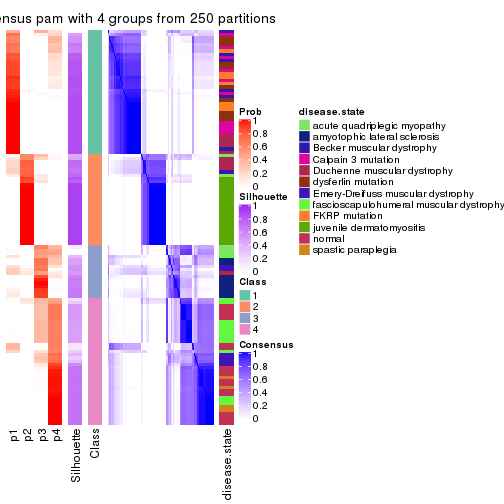</p>

</div>
<div id='tab-SD-pam-consensus-heatmap-4'>
<pre><code class="r">consensus_heatmap(res, k = 5)
</code></pre>

<p></p>

</div>
<div id='tab-SD-pam-consensus-heatmap-5'>
<pre><code class="r">consensus_heatmap(res, k = 6)
</code></pre>

<p></p>

</div>
</div>

Heatmaps for the membership of samples in all partitions to see how consistent they are:


<script>
$( function() {
	$( '#tabs-SD-pam-membership-heatmap' ).tabs();
} );
</script>
<div id='tabs-SD-pam-membership-heatmap'>
<ul>
<li><a href='#tab-SD-pam-membership-heatmap-1'>k = 2</a></li>
<li><a href='#tab-SD-pam-membership-heatmap-2'>k = 3</a></li>
<li><a href='#tab-SD-pam-membership-heatmap-3'>k = 4</a></li>
<li><a href='#tab-SD-pam-membership-heatmap-4'>k = 5</a></li>
<li><a href='#tab-SD-pam-membership-heatmap-5'>k = 6</a></li>
</ul>
<div id='tab-SD-pam-membership-heatmap-1'>
<pre><code class="r">membership_heatmap(res, k = 2)
</code></pre>

<p></p>

</div>
<div id='tab-SD-pam-membership-heatmap-2'>
<pre><code class="r">membership_heatmap(res, k = 3)
</code></pre>

<p></p>

</div>
<div id='tab-SD-pam-membership-heatmap-3'>
<pre><code class="r">membership_heatmap(res, k = 4)
</code></pre>

<p></p>

</div>
<div id='tab-SD-pam-membership-heatmap-4'>
<pre><code class="r">membership_heatmap(res, k = 5)
</code></pre>

<p></p>

</div>
<div id='tab-SD-pam-membership-heatmap-5'>
<pre><code class="r">membership_heatmap(res, k = 6)
</code></pre>

<p></p>

</div>
</div>

As soon as we have had the classes for columns, we can look for signatures
which are significantly different between classes which can be candidate marks
for certain classes. Following are the heatmaps for signatures.


Signature heatmaps where rows are scaled:


<script>
$( function() {
	$( '#tabs-SD-pam-get-signatures' ).tabs();
} );
</script>
<div id='tabs-SD-pam-get-signatures'>
<ul>
<li><a href='#tab-SD-pam-get-signatures-1'>k = 2</a></li>
<li><a href='#tab-SD-pam-get-signatures-2'>k = 3</a></li>
<li><a href='#tab-SD-pam-get-signatures-3'>k = 4</a></li>
<li><a href='#tab-SD-pam-get-signatures-4'>k = 5</a></li>
<li><a href='#tab-SD-pam-get-signatures-5'>k = 6</a></li>
</ul>
<div id='tab-SD-pam-get-signatures-1'>
<pre><code class="r">get_signatures(res, k = 2)
</code></pre>

<p></p>

</div>
<div id='tab-SD-pam-get-signatures-2'>
<pre><code class="r">get_signatures(res, k = 3)
</code></pre>

<p></p>

</div>
<div id='tab-SD-pam-get-signatures-3'>
<pre><code class="r">get_signatures(res, k = 4)
</code></pre>

<p></p>

</div>
<div id='tab-SD-pam-get-signatures-4'>
<pre><code class="r">get_signatures(res, k = 5)
</code></pre>

<p></p>

</div>
<div id='tab-SD-pam-get-signatures-5'>
<pre><code class="r">get_signatures(res, k = 6)
</code></pre>

<p></p>

</div>
</div>


Signature heatmaps where rows are not scaled:


<script>
$( function() {
	$( '#tabs-SD-pam-get-signatures-no-scale' ).tabs();
} );
</script>
<div id='tabs-SD-pam-get-signatures-no-scale'>
<ul>
<li><a href='#tab-SD-pam-get-signatures-no-scale-1'>k = 2</a></li>
<li><a href='#tab-SD-pam-get-signatures-no-scale-2'>k = 3</a></li>
<li><a href='#tab-SD-pam-get-signatures-no-scale-3'>k = 4</a></li>
<li><a href='#tab-SD-pam-get-signatures-no-scale-4'>k = 5</a></li>
<li><a href='#tab-SD-pam-get-signatures-no-scale-5'>k = 6</a></li>
</ul>
<div id='tab-SD-pam-get-signatures-no-scale-1'>
<pre><code class="r">get_signatures(res, k = 2, scale_rows = FALSE)
</code></pre>

<p></p>

</div>
<div id='tab-SD-pam-get-signatures-no-scale-2'>
<pre><code class="r">get_signatures(res, k = 3, scale_rows = FALSE)
</code></pre>

<p></p>

</div>
<div id='tab-SD-pam-get-signatures-no-scale-3'>
<pre><code class="r">get_signatures(res, k = 4, scale_rows = FALSE)
</code></pre>

<p></p>

</div>
<div id='tab-SD-pam-get-signatures-no-scale-4'>
<pre><code class="r">get_signatures(res, k = 5, scale_rows = FALSE)
</code></pre>

<p></p>

</div>
<div id='tab-SD-pam-get-signatures-no-scale-5'>
<pre><code class="r">get_signatures(res, k = 6, scale_rows = FALSE)
</code></pre>

<p></p>

</div>
</div>


Compare the overlap of signatures from different k:

```r
compare_signatures(res)
```


`get_signature()` returns a data frame invisibly. TO get the list of signatures, the function
call should be assigned to a variable explicitly. In following code, if `plot` argument is set
to `FALSE`, no heatmap is plotted while only the differential analysis is performed.

```r
# code only for demonstration
tb = get_signature(res, k = ..., plot = FALSE)
```

An example of the output of `tb` is:

```
#>   which_row         fdr    mean_1    mean_2 scaled_mean_1 scaled_mean_2 km
#> 1        38 0.042760348  8.373488  9.131774    -0.5533452     0.5164555  1
#> 2        40 0.018707592  7.106213  8.469186    -0.6173731     0.5762149  1
#> 3        55 0.019134737 10.221463 11.207825    -0.6159697     0.5749050  1
#> 4        59 0.006059896  5.921854  7.869574    -0.6899429     0.6439467  1
#> 5        60 0.018055526  8.928898 10.211722    -0.6204761     0.5791110  1
#> 6        98 0.009384629 15.714769 14.887706     0.6635654    -0.6193277  2
...
```

The columns in `tb` are:

1. `which_row`: row indices corresponding to the input matrix.
2. `fdr`: FDR for the differential test. 
3. `mean_x`: The mean value in group x.
4. `scaled_mean_x`: The mean value in group x after rows are scaled.
5. `km`: Row groups if k-means clustering is applied to rows.


UMAP plot which shows how samples are separated.


<script>
$( function() {
	$( '#tabs-SD-pam-dimension-reduction' ).tabs();
} );
</script>
<div id='tabs-SD-pam-dimension-reduction'>
<ul>
<li><a href='#tab-SD-pam-dimension-reduction-1'>k = 2</a></li>
<li><a href='#tab-SD-pam-dimension-reduction-2'>k = 3</a></li>
<li><a href='#tab-SD-pam-dimension-reduction-3'>k = 4</a></li>
<li><a href='#tab-SD-pam-dimension-reduction-4'>k = 5</a></li>
<li><a href='#tab-SD-pam-dimension-reduction-5'>k = 6</a></li>
</ul>
<div id='tab-SD-pam-dimension-reduction-1'>
<pre><code class="r">dimension_reduction(res, k = 2, method = &quot;UMAP&quot;)
</code></pre>

<p></p>

</div>
<div id='tab-SD-pam-dimension-reduction-2'>
<pre><code class="r">dimension_reduction(res, k = 3, method = &quot;UMAP&quot;)
</code></pre>

<p></p>

</div>
<div id='tab-SD-pam-dimension-reduction-3'>
<pre><code class="r">dimension_reduction(res, k = 4, method = &quot;UMAP&quot;)
</code></pre>

<p></p>

</div>
<div id='tab-SD-pam-dimension-reduction-4'>
<pre><code class="r">dimension_reduction(res, k = 5, method = &quot;UMAP&quot;)
</code></pre>

<p></p>

</div>
<div id='tab-SD-pam-dimension-reduction-5'>
<pre><code class="r">dimension_reduction(res, k = 6, method = &quot;UMAP&quot;)
</code></pre>

<p></p>

</div>
</div>


Following heatmap shows how subgroups are split when increasing `k`:

```r
collect_classes(res)
```


Test correlation between subgroups and known annotations. If the known
annotation is numeric, one-way ANOVA test is applied, and if the known
annotation is discrete, chi-squared contingency table test is applied.

```r
test_to_known_factors(res)
```

```
#>          n disease.state(p) k
#> SD:pam 100         1.70e-07 2
#> SD:pam 107         3.79e-30 3
#> SD:pam  96         2.55e-35 4
#> SD:pam 106         3.02e-45 5
#> SD:pam  97         1.16e-51 6
```


If matrix rows can be associated to genes, consider to use `GO_Enrichment(res,
...)` to perform function enrichment for the signature genes.


 

---------------------------------------------------


### SD:mclust*


The object with results only for a single top-value method and a single partition method 
can be extracted as:

```r
res = res_list["SD", "mclust"]
# you can also extract it by
# res = res_list["SD:mclust"]
```

A summary of `res` and all the functions that can be applied to it:

```r
res
```

```
#> A 'ConsensusPartition' object with k = 2, 3, 4, 5, 6.
#>   On a matrix with 21168 rows and 121 columns.
#>   Top rows (1000, 2000, 3000, 4000, 5000) are extracted by 'SD' method.
#>   Subgroups are detected by 'mclust' method.
#>   Performed in total 1250 partitions by row resampling.
#>   Best k for subgroups seems to be 2.
#> 
#> Following methods can be applied to this 'ConsensusPartition' object:
#>  [1] "cola_report"             "collect_classes"         "collect_plots"          
#>  [4] "collect_stats"           "colnames"                "compare_signatures"     
#>  [7] "consensus_heatmap"       "dimension_reduction"     "functional_enrichment"  
#> [10] "get_anno_col"            "get_anno"                "get_classes"            
#> [13] "get_consensus"           "get_matrix"              "get_membership"         
#> [16] "get_param"               "get_signatures"          "get_stats"              
#> [19] "is_best_k"               "is_stable_k"             "membership_heatmap"     
#> [22] "ncol"                    "nrow"                    "plot_ecdf"              
#> [25] "rownames"                "select_partition_number" "show"                   
#> [28] "suggest_best_k"          "test_to_known_factors"
```

`collect_plots()` function collects all the plots made from `res` for all `k` (number of partitions)
into one single page to provide an easy and fast comparison between different `k`.

```r
collect_plots(res)
```


The plots are:

- The first row: a plot of the ECDF (Empirical cumulative distribution
  function) curves of the consensus matrix for each `k` and the heatmap of
  predicted classes for each `k`.
- The second row: heatmaps of the consensus matrix for each `k`.
- The third row: heatmaps of the membership matrix for each `k`.
- The fouth row: heatmaps of the signatures for each `k`.

All the plots in panels can be made by individual functions and they are
plotted later in this section.

`select_partition_number()` produces several plots showing different
statistics for choosing "optimized" `k`. There are following statistics:

- ECDF curves of the consensus matrix for each `k`;
- 1-PAC. [The PAC
  score](https://en.wikipedia.org/wiki/Consensus_clustering#Over-interpretation_potential_of_consensus_clustering)
  measures the proportion of the ambiguous subgrouping.
- Mean silhouette score.
- Concordance. The mean probability of fiting the consensus class ids in all
  partitions.
- Area increased. Denote $A_k$ as the area under the ECDF curve for current
  `k`, the area increased is defined as $A_k - A_{k-1}$.
- Rand index. The percent of pairs of samples that are both in a same cluster
  or both are not in a same cluster in the partition of k and k-1.
- Jaccard index. The ratio of pairs of samples are both in a same cluster in
  the partition of k and k-1 and the pairs of samples are both in a same
  cluster in the partition k or k-1.

The detailed explanations of these statistics can be found in [the cola
vignette](http://bioconductor.org/packages/devel/bioc/vignettes/cola/inst/doc/cola.html#toc_13).

Generally speaking, lower PAC score, higher mean silhouette score or higher
concordance corresponds to better partition. Rand index and Jaccard index
measure how similar the current partition is compared to partition with `k-1`.
If they are too similar, we won't accept `k` is better than `k-1`.

```r
select_partition_number(res)
```


The numeric values for all these statistics can be obtained by `get_stats()`.

```r
get_stats(res)
```

```
#>   k 1-PAC mean_silhouette concordance area_increased  Rand Jaccard
#> 2 2 0.948           0.931       0.974         0.4986 0.500   0.500
#> 3 3 0.599           0.652       0.823         0.2769 0.780   0.593
#> 4 4 0.630           0.774       0.851         0.1043 0.840   0.593
#> 5 5 0.831           0.810       0.891         0.1028 0.916   0.703
#> 6 6 0.795           0.610       0.783         0.0511 0.936   0.717
```

`suggest_best_k()` suggests the best $k$ based on these statistics. The rules are as follows:

- All $k$ with Jaccard index larger than 0.95 are removed because the increase of
  the partition number does not provides enough extra information. If all $k$ are removed,
  the best $k$ is assigned by `NA`.
- For $k$ with 1-PAC larger than 0.9, the maximal $k$ is taken as the "best k". Other $k$ is called "optional k".
- If it does not fit the second rule. The $k$ with the highest vote of highest
  1-PAC, mean silhouette and concordance is taken as the "best k".

```r
suggest_best_k(res)
```

```
#> [1] 2
```


Following shows the table of the partitions (You need to click the **show/hide
code output** link to see it). The membership matrix (columns with name `p*`)
is inferred by
[`clue::cl_consensus()`](https://www.rdocumentation.org/link/cl_consensus?package=clue)
function with the `SE` method. Basically the value in the membership matrix
represents the probability to belong to a certain group. The finall class
label for an item is determined with the group with highest probability it
belongs to.

In `get_classes()` function, the entropy is calculated from the membership
matrix and the silhouette score is calculated from the consensus matrix.


<script>
$( function() {
	$( '#tabs-SD-mclust-get-classes' ).tabs();
} );
</script>
<div id='tabs-SD-mclust-get-classes'>
<ul>
<li><a href='#tab-SD-mclust-get-classes-1'>k = 2</a></li>
<li><a href='#tab-SD-mclust-get-classes-2'>k = 3</a></li>
<li><a href='#tab-SD-mclust-get-classes-3'>k = 4</a></li>
<li><a href='#tab-SD-mclust-get-classes-4'>k = 5</a></li>
<li><a href='#tab-SD-mclust-get-classes-5'>k = 6</a></li>
</ul>

<div id='tab-SD-mclust-get-classes-1'>
<p><a id='tab-SD-mclust-get-classes-1-a' style='color:#0366d6' href='#'>show/hide code output</a></p>
<pre><code class="r">cbind(get_classes(res, k = 2), get_membership(res, k = 2))
</code></pre>

<pre><code>#&gt;           class entropy silhouette    p1    p2
#&gt; GSM74356      2  0.0376     0.9666 0.004 0.996
#&gt; GSM74357      2  0.0376     0.9666 0.004 0.996
#&gt; GSM74358      2  0.0376     0.9666 0.004 0.996
#&gt; GSM74359      1  0.0000     0.9756 1.000 0.000
#&gt; GSM74360      1  0.0000     0.9756 1.000 0.000
#&gt; GSM74361      2  0.0938     0.9599 0.012 0.988
#&gt; GSM74362      2  0.5408     0.8427 0.124 0.876
#&gt; GSM74363      2  0.0376     0.9666 0.004 0.996
#&gt; GSM74402      1  0.0000     0.9756 1.000 0.000
#&gt; GSM74403      1  0.0000     0.9756 1.000 0.000
#&gt; GSM74404      1  0.0000     0.9756 1.000 0.000
#&gt; GSM74406      1  0.0000     0.9756 1.000 0.000
#&gt; GSM74407      1  0.0000     0.9756 1.000 0.000
#&gt; GSM74408      1  0.0000     0.9756 1.000 0.000
#&gt; GSM74409      1  0.0000     0.9756 1.000 0.000
#&gt; GSM74410      1  0.0000     0.9756 1.000 0.000
#&gt; GSM119936     1  0.0000     0.9756 1.000 0.000
#&gt; GSM119937     1  0.0000     0.9756 1.000 0.000
#&gt; GSM74411      2  0.0000     0.9681 0.000 1.000
#&gt; GSM74412      2  0.0000     0.9681 0.000 1.000
#&gt; GSM74413      2  0.0000     0.9681 0.000 1.000
#&gt; GSM74414      2  0.0376     0.9666 0.004 0.996
#&gt; GSM74415      2  0.0376     0.9666 0.004 0.996
#&gt; GSM121379     2  0.0000     0.9681 0.000 1.000
#&gt; GSM121380     2  0.0000     0.9681 0.000 1.000
#&gt; GSM121381     2  0.0000     0.9681 0.000 1.000
#&gt; GSM121382     2  0.0000     0.9681 0.000 1.000
#&gt; GSM121383     2  0.0000     0.9681 0.000 1.000
#&gt; GSM121384     2  0.0000     0.9681 0.000 1.000
#&gt; GSM121385     2  0.0000     0.9681 0.000 1.000
#&gt; GSM121386     2  0.0000     0.9681 0.000 1.000
#&gt; GSM121387     2  0.0000     0.9681 0.000 1.000
#&gt; GSM121388     2  0.0000     0.9681 0.000 1.000
#&gt; GSM121389     2  0.0000     0.9681 0.000 1.000
#&gt; GSM121390     2  0.0000     0.9681 0.000 1.000
#&gt; GSM121391     2  0.0000     0.9681 0.000 1.000
#&gt; GSM121392     2  0.0000     0.9681 0.000 1.000
#&gt; GSM121393     2  0.0000     0.9681 0.000 1.000
#&gt; GSM121394     2  0.0000     0.9681 0.000 1.000
#&gt; GSM121395     2  0.0000     0.9681 0.000 1.000
#&gt; GSM121396     2  0.0000     0.9681 0.000 1.000
#&gt; GSM121397     2  0.0000     0.9681 0.000 1.000
#&gt; GSM121398     2  0.0000     0.9681 0.000 1.000
#&gt; GSM121399     2  0.0000     0.9681 0.000 1.000
#&gt; GSM74240      2  0.0000     0.9681 0.000 1.000
#&gt; GSM74241      2  0.0000     0.9681 0.000 1.000
#&gt; GSM74242      2  0.0000     0.9681 0.000 1.000
#&gt; GSM74243      2  0.0000     0.9681 0.000 1.000
#&gt; GSM74244      2  0.0000     0.9681 0.000 1.000
#&gt; GSM74245      2  0.0000     0.9681 0.000 1.000
#&gt; GSM74246      2  0.0000     0.9681 0.000 1.000
#&gt; GSM74247      2  0.0000     0.9681 0.000 1.000
#&gt; GSM74248      2  0.0000     0.9681 0.000 1.000
#&gt; GSM74416      1  0.0000     0.9756 1.000 0.000
#&gt; GSM74417      1  0.0000     0.9756 1.000 0.000
#&gt; GSM74418      1  0.0000     0.9756 1.000 0.000
#&gt; GSM74419      1  0.0000     0.9756 1.000 0.000
#&gt; GSM121358     2  0.0376     0.9666 0.004 0.996
#&gt; GSM121359     2  0.0000     0.9681 0.000 1.000
#&gt; GSM121360     1  0.0000     0.9756 1.000 0.000
#&gt; GSM121362     1  0.0000     0.9756 1.000 0.000
#&gt; GSM121364     1  0.0000     0.9756 1.000 0.000
#&gt; GSM121365     2  0.0376     0.9666 0.004 0.996
#&gt; GSM121366     2  0.0376     0.9666 0.004 0.996
#&gt; GSM121367     2  0.0376     0.9666 0.004 0.996
#&gt; GSM121370     2  0.0376     0.9666 0.004 0.996
#&gt; GSM121371     2  0.0376     0.9666 0.004 0.996
#&gt; GSM121372     2  0.0000     0.9681 0.000 1.000
#&gt; GSM121373     1  0.0000     0.9756 1.000 0.000
#&gt; GSM121374     1  0.0000     0.9756 1.000 0.000
#&gt; GSM121407     2  0.0000     0.9681 0.000 1.000
#&gt; GSM74387      2  0.5946     0.8177 0.144 0.856
#&gt; GSM74388      1  0.9248     0.4708 0.660 0.340
#&gt; GSM74389      1  0.7299     0.7291 0.796 0.204
#&gt; GSM74390      1  0.0000     0.9756 1.000 0.000
#&gt; GSM74391      1  0.0000     0.9756 1.000 0.000
#&gt; GSM74392      1  0.0000     0.9756 1.000 0.000
#&gt; GSM74393      1  0.3733     0.9025 0.928 0.072
#&gt; GSM74394      2  1.0000     0.0134 0.496 0.504
#&gt; GSM74239      1  0.0000     0.9756 1.000 0.000
#&gt; GSM74364      1  0.0000     0.9756 1.000 0.000
#&gt; GSM74365      1  0.0000     0.9756 1.000 0.000
#&gt; GSM74366      1  0.0000     0.9756 1.000 0.000
#&gt; GSM74367      1  0.0000     0.9756 1.000 0.000
#&gt; GSM74377      1  0.0000     0.9756 1.000 0.000
#&gt; GSM74378      1  0.0000     0.9756 1.000 0.000
#&gt; GSM74379      1  0.0000     0.9756 1.000 0.000
#&gt; GSM74380      1  0.0000     0.9756 1.000 0.000
#&gt; GSM74381      1  0.0000     0.9756 1.000 0.000
#&gt; GSM121357     2  0.0376     0.9666 0.004 0.996
#&gt; GSM121361     1  0.9686     0.3280 0.604 0.396
#&gt; GSM121363     2  0.9933     0.1745 0.452 0.548
#&gt; GSM121368     2  0.9491     0.4154 0.368 0.632
#&gt; GSM121369     1  0.9996     0.0188 0.512 0.488
#&gt; GSM74368      1  0.0000     0.9756 1.000 0.000
#&gt; GSM74369      1  0.0000     0.9756 1.000 0.000
#&gt; GSM74370      1  0.0000     0.9756 1.000 0.000
#&gt; GSM74371      1  0.0000     0.9756 1.000 0.000
#&gt; GSM74372      1  0.0000     0.9756 1.000 0.000
#&gt; GSM74373      1  0.0000     0.9756 1.000 0.000
#&gt; GSM74374      1  0.0000     0.9756 1.000 0.000
#&gt; GSM74375      1  0.0000     0.9756 1.000 0.000
#&gt; GSM74376      1  0.0000     0.9756 1.000 0.000
#&gt; GSM74405      1  0.0000     0.9756 1.000 0.000
#&gt; GSM74351      1  0.0000     0.9756 1.000 0.000
#&gt; GSM74352      1  0.0000     0.9756 1.000 0.000
#&gt; GSM74353      1  0.0000     0.9756 1.000 0.000
#&gt; GSM74354      1  0.0000     0.9756 1.000 0.000
#&gt; GSM74355      1  0.0000     0.9756 1.000 0.000
#&gt; GSM74382      1  0.0000     0.9756 1.000 0.000
#&gt; GSM74383      1  0.0000     0.9756 1.000 0.000
#&gt; GSM74384      1  0.0000     0.9756 1.000 0.000
#&gt; GSM74385      1  0.0000     0.9756 1.000 0.000
#&gt; GSM74386      1  0.0000     0.9756 1.000 0.000
#&gt; GSM74395      1  0.0000     0.9756 1.000 0.000
#&gt; GSM74396      1  0.0000     0.9756 1.000 0.000
#&gt; GSM74397      1  0.0000     0.9756 1.000 0.000
#&gt; GSM74398      1  0.0000     0.9756 1.000 0.000
#&gt; GSM74399      1  0.0000     0.9756 1.000 0.000
#&gt; GSM74400      1  0.0000     0.9756 1.000 0.000
#&gt; GSM74401      1  0.0000     0.9756 1.000 0.000
</code></pre>

<script>
$('#tab-SD-mclust-get-classes-1-a').parent().next().next().hide();
$('#tab-SD-mclust-get-classes-1-a').click(function(){
  $('#tab-SD-mclust-get-classes-1-a').parent().next().next().toggle();
  return(false);
});
</script>
</div>

<div id='tab-SD-mclust-get-classes-2'>
<p><a id='tab-SD-mclust-get-classes-2-a' style='color:#0366d6' href='#'>show/hide code output</a></p>
<pre><code class="r">cbind(get_classes(res, k = 3), get_membership(res, k = 3))
</code></pre>

<pre><code>#&gt;           class entropy silhouette    p1    p2    p3
#&gt; GSM74356      2  0.6180     0.7370 0.000 0.584 0.416
#&gt; GSM74357      2  0.6180     0.7370 0.000 0.584 0.416
#&gt; GSM74358      2  0.6180     0.7370 0.000 0.584 0.416
#&gt; GSM74359      3  0.6111     0.5498 0.396 0.000 0.604
#&gt; GSM74360      3  0.6168     0.5288 0.412 0.000 0.588
#&gt; GSM74361      2  0.7207     0.7206 0.032 0.584 0.384
#&gt; GSM74362      2  0.7806     0.6958 0.064 0.584 0.352
#&gt; GSM74363      2  0.6180     0.7370 0.000 0.584 0.416
#&gt; GSM74402      1  0.6307    -0.3391 0.512 0.000 0.488
#&gt; GSM74403      1  0.1411     0.8000 0.964 0.000 0.036
#&gt; GSM74404      1  0.1411     0.8000 0.964 0.000 0.036
#&gt; GSM74406      1  0.6308    -0.3474 0.508 0.000 0.492
#&gt; GSM74407      1  0.6308    -0.3494 0.508 0.000 0.492
#&gt; GSM74408      3  0.6140     0.4780 0.404 0.000 0.596
#&gt; GSM74409      3  0.6140     0.4780 0.404 0.000 0.596
#&gt; GSM74410      3  0.6140     0.4780 0.404 0.000 0.596
#&gt; GSM119936     1  0.6307    -0.3391 0.512 0.000 0.488
#&gt; GSM119937     3  0.6140     0.4780 0.404 0.000 0.596
#&gt; GSM74411      2  0.5397     0.7760 0.000 0.720 0.280
#&gt; GSM74412      2  0.5178     0.7853 0.000 0.744 0.256
#&gt; GSM74413      2  0.5327     0.7795 0.000 0.728 0.272
#&gt; GSM74414      2  0.5085     0.7603 0.092 0.836 0.072
#&gt; GSM74415      2  0.5497     0.7747 0.000 0.708 0.292
#&gt; GSM121379     2  0.0000     0.8207 0.000 1.000 0.000
#&gt; GSM121380     2  0.0000     0.8207 0.000 1.000 0.000
#&gt; GSM121381     2  0.0000     0.8207 0.000 1.000 0.000
#&gt; GSM121382     2  0.0000     0.8207 0.000 1.000 0.000
#&gt; GSM121383     2  0.0000     0.8207 0.000 1.000 0.000
#&gt; GSM121384     2  0.0000     0.8207 0.000 1.000 0.000
#&gt; GSM121385     2  0.0000     0.8207 0.000 1.000 0.000
#&gt; GSM121386     2  0.0000     0.8207 0.000 1.000 0.000
#&gt; GSM121387     2  0.0000     0.8207 0.000 1.000 0.000
#&gt; GSM121388     2  0.0747     0.8212 0.000 0.984 0.016
#&gt; GSM121389     2  0.0000     0.8207 0.000 1.000 0.000
#&gt; GSM121390     2  0.0000     0.8207 0.000 1.000 0.000
#&gt; GSM121391     2  0.0000     0.8207 0.000 1.000 0.000
#&gt; GSM121392     2  0.0000     0.8207 0.000 1.000 0.000
#&gt; GSM121393     2  0.0747     0.8212 0.000 0.984 0.016
#&gt; GSM121394     2  0.0747     0.8212 0.000 0.984 0.016
#&gt; GSM121395     2  0.0000     0.8207 0.000 1.000 0.000
#&gt; GSM121396     2  0.4654     0.7968 0.000 0.792 0.208
#&gt; GSM121397     2  0.0000     0.8207 0.000 1.000 0.000
#&gt; GSM121398     2  0.0000     0.8207 0.000 1.000 0.000
#&gt; GSM121399     2  0.0000     0.8207 0.000 1.000 0.000
#&gt; GSM74240      3  0.3686     0.5214 0.000 0.140 0.860
#&gt; GSM74241      3  0.3686     0.5214 0.000 0.140 0.860
#&gt; GSM74242      3  0.3686     0.5214 0.000 0.140 0.860
#&gt; GSM74243      3  0.3686     0.5214 0.000 0.140 0.860
#&gt; GSM74244      3  0.3686     0.5214 0.000 0.140 0.860
#&gt; GSM74245      3  0.3686     0.5214 0.000 0.140 0.860
#&gt; GSM74246      3  0.3686     0.5214 0.000 0.140 0.860
#&gt; GSM74247      3  0.3686     0.5214 0.000 0.140 0.860
#&gt; GSM74248      3  0.3686     0.5214 0.000 0.140 0.860
#&gt; GSM74416      1  0.6309    -0.2573 0.504 0.000 0.496
#&gt; GSM74417      1  0.6309    -0.2573 0.504 0.000 0.496
#&gt; GSM74418      1  0.6309    -0.2573 0.504 0.000 0.496
#&gt; GSM74419      3  0.6140     0.4780 0.404 0.000 0.596
#&gt; GSM121358     2  0.6180     0.7370 0.000 0.584 0.416
#&gt; GSM121359     2  0.5363     0.7809 0.000 0.724 0.276
#&gt; GSM121360     3  0.6252     0.4609 0.444 0.000 0.556
#&gt; GSM121362     1  0.6062     0.1282 0.616 0.000 0.384
#&gt; GSM121364     3  0.6126     0.5462 0.400 0.000 0.600
#&gt; GSM121365     2  0.6180     0.7370 0.000 0.584 0.416
#&gt; GSM121366     2  0.6180     0.7370 0.000 0.584 0.416
#&gt; GSM121367     2  0.6180     0.7370 0.000 0.584 0.416
#&gt; GSM121370     2  0.6180     0.7370 0.000 0.584 0.416
#&gt; GSM121371     2  0.6180     0.7370 0.000 0.584 0.416
#&gt; GSM121372     2  0.5291     0.7808 0.000 0.732 0.268
#&gt; GSM121373     3  0.6140     0.5403 0.404 0.000 0.596
#&gt; GSM121374     3  0.6126     0.5462 0.400 0.000 0.600
#&gt; GSM121407     2  0.5098     0.7878 0.000 0.752 0.248
#&gt; GSM74387      2  0.9766    -0.0768 0.236 0.416 0.348
#&gt; GSM74388      1  0.7545     0.3937 0.652 0.076 0.272
#&gt; GSM74389      3  0.5733     0.5856 0.324 0.000 0.676
#&gt; GSM74390      1  0.3816     0.6672 0.852 0.000 0.148
#&gt; GSM74391      3  0.6126     0.5462 0.400 0.000 0.600
#&gt; GSM74392      3  0.6126     0.5462 0.400 0.000 0.600
#&gt; GSM74393      3  0.5760     0.5848 0.328 0.000 0.672
#&gt; GSM74394      1  0.7622     0.3868 0.648 0.080 0.272
#&gt; GSM74239      1  0.0000     0.8350 1.000 0.000 0.000
#&gt; GSM74364      1  0.0000     0.8350 1.000 0.000 0.000
#&gt; GSM74365      1  0.0000     0.8350 1.000 0.000 0.000
#&gt; GSM74366      1  0.0000     0.8350 1.000 0.000 0.000
#&gt; GSM74367      1  0.0000     0.8350 1.000 0.000 0.000
#&gt; GSM74377      1  0.0000     0.8350 1.000 0.000 0.000
#&gt; GSM74378      1  0.0000     0.8350 1.000 0.000 0.000
#&gt; GSM74379      1  0.0000     0.8350 1.000 0.000 0.000
#&gt; GSM74380      1  0.0000     0.8350 1.000 0.000 0.000
#&gt; GSM74381      1  0.0000     0.8350 1.000 0.000 0.000
#&gt; GSM121357     2  0.5093     0.7643 0.088 0.836 0.076
#&gt; GSM121361     1  0.7622     0.3868 0.648 0.080 0.272
#&gt; GSM121363     1  0.7622     0.3868 0.648 0.080 0.272
#&gt; GSM121368     1  0.7770     0.3708 0.640 0.088 0.272
#&gt; GSM121369     1  0.7622     0.3868 0.648 0.080 0.272
#&gt; GSM74368      1  0.0592     0.8246 0.988 0.000 0.012
#&gt; GSM74369      1  0.0000     0.8350 1.000 0.000 0.000
#&gt; GSM74370      1  0.0000     0.8350 1.000 0.000 0.000
#&gt; GSM74371      1  0.0000     0.8350 1.000 0.000 0.000
#&gt; GSM74372      1  0.0000     0.8350 1.000 0.000 0.000
#&gt; GSM74373      1  0.0000     0.8350 1.000 0.000 0.000
#&gt; GSM74374      1  0.0000     0.8350 1.000 0.000 0.000
#&gt; GSM74375      1  0.0000     0.8350 1.000 0.000 0.000
#&gt; GSM74376      1  0.0000     0.8350 1.000 0.000 0.000
#&gt; GSM74405      1  0.0000     0.8350 1.000 0.000 0.000
#&gt; GSM74351      1  0.0000     0.8350 1.000 0.000 0.000
#&gt; GSM74352      1  0.0237     0.8316 0.996 0.000 0.004
#&gt; GSM74353      1  0.0000     0.8350 1.000 0.000 0.000
#&gt; GSM74354      1  0.0000     0.8350 1.000 0.000 0.000
#&gt; GSM74355      1  0.0000     0.8350 1.000 0.000 0.000
#&gt; GSM74382      1  0.0000     0.8350 1.000 0.000 0.000
#&gt; GSM74383      1  0.0000     0.8350 1.000 0.000 0.000
#&gt; GSM74384      1  0.0000     0.8350 1.000 0.000 0.000
#&gt; GSM74385      1  0.0000     0.8350 1.000 0.000 0.000
#&gt; GSM74386      1  0.0000     0.8350 1.000 0.000 0.000
#&gt; GSM74395      1  0.0000     0.8350 1.000 0.000 0.000
#&gt; GSM74396      1  0.0000     0.8350 1.000 0.000 0.000
#&gt; GSM74397      1  0.0000     0.8350 1.000 0.000 0.000
#&gt; GSM74398      1  0.0000     0.8350 1.000 0.000 0.000
#&gt; GSM74399      1  0.0000     0.8350 1.000 0.000 0.000
#&gt; GSM74400      1  0.0000     0.8350 1.000 0.000 0.000
#&gt; GSM74401      1  0.0000     0.8350 1.000 0.000 0.000
</code></pre>

<script>
$('#tab-SD-mclust-get-classes-2-a').parent().next().next().hide();
$('#tab-SD-mclust-get-classes-2-a').click(function(){
  $('#tab-SD-mclust-get-classes-2-a').parent().next().next().toggle();
  return(false);
});
</script>
</div>

<div id='tab-SD-mclust-get-classes-3'>
<p><a id='tab-SD-mclust-get-classes-3-a' style='color:#0366d6' href='#'>show/hide code output</a></p>
<pre><code class="r">cbind(get_classes(res, k = 4), get_membership(res, k = 4))
</code></pre>

<pre><code>#&gt;           class entropy silhouette    p1    p2    p3    p4
#&gt; GSM74356      3  0.1059      0.854 0.000 0.016 0.972 0.012
#&gt; GSM74357      3  0.1182      0.849 0.000 0.016 0.968 0.016
#&gt; GSM74358      3  0.1182      0.849 0.000 0.016 0.968 0.016
#&gt; GSM74359      4  0.7551      0.720 0.272 0.000 0.240 0.488
#&gt; GSM74360      4  0.7564      0.684 0.328 0.000 0.208 0.464
#&gt; GSM74361      3  0.1297      0.847 0.000 0.016 0.964 0.020
#&gt; GSM74362      3  0.1297      0.847 0.000 0.016 0.964 0.020
#&gt; GSM74363      3  0.1182      0.855 0.000 0.016 0.968 0.016
#&gt; GSM74402      4  0.7582      0.674 0.336 0.000 0.208 0.456
#&gt; GSM74403      1  0.3494      0.665 0.824 0.000 0.172 0.004
#&gt; GSM74404      1  0.3751      0.620 0.800 0.000 0.196 0.004
#&gt; GSM74406      4  0.7596      0.680 0.332 0.000 0.212 0.456
#&gt; GSM74407      4  0.7576      0.689 0.324 0.000 0.212 0.464
#&gt; GSM74408      4  0.7587      0.704 0.244 0.000 0.276 0.480
#&gt; GSM74409      4  0.7587      0.704 0.244 0.000 0.276 0.480
#&gt; GSM74410      4  0.7578      0.701 0.236 0.000 0.284 0.480
#&gt; GSM119936     4  0.7609      0.695 0.312 0.000 0.224 0.464
#&gt; GSM119937     4  0.7587      0.704 0.244 0.000 0.276 0.480
#&gt; GSM74411      3  0.3166      0.842 0.000 0.016 0.868 0.116
#&gt; GSM74412      3  0.3108      0.843 0.000 0.016 0.872 0.112
#&gt; GSM74413      3  0.3108      0.843 0.000 0.016 0.872 0.112
#&gt; GSM74414      3  0.3736      0.839 0.004 0.024 0.844 0.128
#&gt; GSM74415      3  0.3166      0.842 0.000 0.016 0.868 0.116
#&gt; GSM121379     2  0.0000      0.986 0.000 1.000 0.000 0.000
#&gt; GSM121380     2  0.0188      0.984 0.000 0.996 0.004 0.000
#&gt; GSM121381     2  0.0000      0.986 0.000 1.000 0.000 0.000
#&gt; GSM121382     2  0.0000      0.986 0.000 1.000 0.000 0.000
#&gt; GSM121383     2  0.0000      0.986 0.000 1.000 0.000 0.000
#&gt; GSM121384     2  0.0000      0.986 0.000 1.000 0.000 0.000
#&gt; GSM121385     2  0.0000      0.986 0.000 1.000 0.000 0.000
#&gt; GSM121386     2  0.0000      0.986 0.000 1.000 0.000 0.000
#&gt; GSM121387     2  0.0000      0.986 0.000 1.000 0.000 0.000
#&gt; GSM121388     2  0.1256      0.961 0.000 0.964 0.008 0.028
#&gt; GSM121389     2  0.0000      0.986 0.000 1.000 0.000 0.000
#&gt; GSM121390     2  0.0188      0.984 0.000 0.996 0.004 0.000
#&gt; GSM121391     2  0.0000      0.986 0.000 1.000 0.000 0.000
#&gt; GSM121392     2  0.3048      0.875 0.000 0.876 0.016 0.108
#&gt; GSM121393     2  0.1807      0.941 0.000 0.940 0.008 0.052
#&gt; GSM121394     2  0.1004      0.967 0.000 0.972 0.004 0.024
#&gt; GSM121395     2  0.0000      0.986 0.000 1.000 0.000 0.000
#&gt; GSM121396     3  0.6027      0.659 0.000 0.244 0.664 0.092
#&gt; GSM121397     2  0.0000      0.986 0.000 1.000 0.000 0.000
#&gt; GSM121398     2  0.0000      0.986 0.000 1.000 0.000 0.000
#&gt; GSM121399     2  0.0000      0.986 0.000 1.000 0.000 0.000
#&gt; GSM74240      4  0.0921      0.523 0.000 0.000 0.028 0.972
#&gt; GSM74241      4  0.1022      0.519 0.000 0.000 0.032 0.968
#&gt; GSM74242      4  0.1022      0.522 0.000 0.000 0.032 0.968
#&gt; GSM74243      4  0.1022      0.522 0.000 0.000 0.032 0.968
#&gt; GSM74244      4  0.0921      0.523 0.000 0.000 0.028 0.972
#&gt; GSM74245      4  0.0921      0.523 0.000 0.000 0.028 0.972
#&gt; GSM74246      4  0.0921      0.523 0.000 0.000 0.028 0.972
#&gt; GSM74247      4  0.0921      0.523 0.000 0.000 0.028 0.972
#&gt; GSM74248      4  0.0921      0.523 0.000 0.000 0.028 0.972
#&gt; GSM74416      1  0.7767     -0.363 0.432 0.000 0.268 0.300
#&gt; GSM74417      1  0.7732     -0.328 0.444 0.000 0.268 0.288
#&gt; GSM74418      1  0.7706     -0.305 0.452 0.000 0.268 0.280
#&gt; GSM74419      4  0.7587      0.704 0.244 0.000 0.276 0.480
#&gt; GSM121358     3  0.0779      0.855 0.000 0.016 0.980 0.004
#&gt; GSM121359     3  0.3056      0.840 0.000 0.072 0.888 0.040
#&gt; GSM121360     4  0.7325      0.604 0.368 0.000 0.160 0.472
#&gt; GSM121362     1  0.6334     -0.382 0.484 0.000 0.060 0.456
#&gt; GSM121364     4  0.7640      0.712 0.296 0.000 0.240 0.464
#&gt; GSM121365     3  0.0927      0.854 0.000 0.016 0.976 0.008
#&gt; GSM121366     3  0.1398      0.848 0.000 0.040 0.956 0.004
#&gt; GSM121367     3  0.0927      0.854 0.000 0.016 0.976 0.008
#&gt; GSM121370     3  0.0592      0.854 0.000 0.016 0.984 0.000
#&gt; GSM121371     3  0.0927      0.855 0.000 0.016 0.976 0.008
#&gt; GSM121372     3  0.2586      0.851 0.000 0.048 0.912 0.040
#&gt; GSM121373     4  0.7640      0.712 0.296 0.000 0.240 0.464
#&gt; GSM121374     4  0.7640      0.712 0.296 0.000 0.240 0.464
#&gt; GSM121407     3  0.3149      0.848 0.000 0.032 0.880 0.088
#&gt; GSM74387      3  0.4661      0.800 0.052 0.008 0.800 0.140
#&gt; GSM74388      3  0.6404      0.647 0.220 0.000 0.644 0.136
#&gt; GSM74389      4  0.7512      0.721 0.268 0.000 0.236 0.496
#&gt; GSM74390      1  0.4500      0.319 0.684 0.000 0.000 0.316
#&gt; GSM74391      4  0.7640      0.712 0.296 0.000 0.240 0.464
#&gt; GSM74392      4  0.7613      0.716 0.288 0.000 0.240 0.472
#&gt; GSM74393      4  0.7512      0.721 0.268 0.000 0.236 0.496
#&gt; GSM74394      3  0.6205      0.680 0.196 0.000 0.668 0.136
#&gt; GSM74239      1  0.0000      0.894 1.000 0.000 0.000 0.000
#&gt; GSM74364      1  0.0000      0.894 1.000 0.000 0.000 0.000
#&gt; GSM74365      1  0.0000      0.894 1.000 0.000 0.000 0.000
#&gt; GSM74366      1  0.0000      0.894 1.000 0.000 0.000 0.000
#&gt; GSM74367      1  0.0000      0.894 1.000 0.000 0.000 0.000
#&gt; GSM74377      1  0.0000      0.894 1.000 0.000 0.000 0.000
#&gt; GSM74378      1  0.0000      0.894 1.000 0.000 0.000 0.000
#&gt; GSM74379      1  0.0000      0.894 1.000 0.000 0.000 0.000
#&gt; GSM74380      1  0.0000      0.894 1.000 0.000 0.000 0.000
#&gt; GSM74381      1  0.0000      0.894 1.000 0.000 0.000 0.000
#&gt; GSM121357     3  0.3932      0.837 0.004 0.032 0.836 0.128
#&gt; GSM121361     3  0.6308      0.665 0.208 0.000 0.656 0.136
#&gt; GSM121363     3  0.6205      0.680 0.196 0.000 0.668 0.136
#&gt; GSM121368     3  0.5855      0.718 0.160 0.000 0.704 0.136
#&gt; GSM121369     3  0.6112      0.683 0.196 0.000 0.676 0.128
#&gt; GSM74368      1  0.3367      0.741 0.864 0.000 0.028 0.108
#&gt; GSM74369      1  0.0188      0.892 0.996 0.000 0.000 0.004
#&gt; GSM74370      1  0.0000      0.894 1.000 0.000 0.000 0.000
#&gt; GSM74371      1  0.0188      0.891 0.996 0.000 0.000 0.004
#&gt; GSM74372      1  0.0000      0.894 1.000 0.000 0.000 0.000
#&gt; GSM74373      1  0.0000      0.894 1.000 0.000 0.000 0.000
#&gt; GSM74374      1  0.0000      0.894 1.000 0.000 0.000 0.000
#&gt; GSM74375      1  0.0188      0.892 0.996 0.000 0.000 0.004
#&gt; GSM74376      1  0.0000      0.894 1.000 0.000 0.000 0.000
#&gt; GSM74405      1  0.0000      0.894 1.000 0.000 0.000 0.000
#&gt; GSM74351      1  0.2662      0.800 0.900 0.000 0.084 0.016
#&gt; GSM74352      1  0.1059      0.876 0.972 0.000 0.016 0.012
#&gt; GSM74353      1  0.0188      0.892 0.996 0.000 0.000 0.004
#&gt; GSM74354      1  0.0000      0.894 1.000 0.000 0.000 0.000
#&gt; GSM74355      1  0.0000      0.894 1.000 0.000 0.000 0.000
#&gt; GSM74382      1  0.0657      0.883 0.984 0.000 0.012 0.004
#&gt; GSM74383      1  0.0000      0.894 1.000 0.000 0.000 0.000
#&gt; GSM74384      1  0.0000      0.894 1.000 0.000 0.000 0.000
#&gt; GSM74385      1  0.0336      0.888 0.992 0.000 0.008 0.000
#&gt; GSM74386      1  0.0000      0.894 1.000 0.000 0.000 0.000
#&gt; GSM74395      1  0.0000      0.894 1.000 0.000 0.000 0.000
#&gt; GSM74396      1  0.0000      0.894 1.000 0.000 0.000 0.000
#&gt; GSM74397      1  0.0000      0.894 1.000 0.000 0.000 0.000
#&gt; GSM74398      1  0.0000      0.894 1.000 0.000 0.000 0.000
#&gt; GSM74399      1  0.0000      0.894 1.000 0.000 0.000 0.000
#&gt; GSM74400      1  0.3278      0.761 0.864 0.000 0.116 0.020
#&gt; GSM74401      1  0.2563      0.816 0.908 0.000 0.072 0.020
</code></pre>

<script>
$('#tab-SD-mclust-get-classes-3-a').parent().next().next().hide();
$('#tab-SD-mclust-get-classes-3-a').click(function(){
  $('#tab-SD-mclust-get-classes-3-a').parent().next().next().toggle();
  return(false);
});
</script>
</div>

<div id='tab-SD-mclust-get-classes-4'>
<p><a id='tab-SD-mclust-get-classes-4-a' style='color:#0366d6' href='#'>show/hide code output</a></p>
<pre><code class="r">cbind(get_classes(res, k = 5), get_membership(res, k = 5))
</code></pre>

<pre><code>#&gt;           class entropy silhouette    p1    p2    p3    p4    p5
#&gt; GSM74356      3  0.0000     0.9392 0.000 0.000 1.000 0.000 0.000
#&gt; GSM74357      3  0.0000     0.9392 0.000 0.000 1.000 0.000 0.000
#&gt; GSM74358      3  0.0000     0.9392 0.000 0.000 1.000 0.000 0.000
#&gt; GSM74359      4  0.3907     0.7450 0.016 0.000 0.008 0.772 0.204
#&gt; GSM74360      4  0.2959     0.8040 0.036 0.000 0.000 0.864 0.100
#&gt; GSM74361      3  0.0000     0.9392 0.000 0.000 1.000 0.000 0.000
#&gt; GSM74362      3  0.0290     0.9340 0.000 0.000 0.992 0.008 0.000
#&gt; GSM74363      3  0.0000     0.9392 0.000 0.000 1.000 0.000 0.000
#&gt; GSM74402      4  0.0609     0.8154 0.020 0.000 0.000 0.980 0.000
#&gt; GSM74403      1  0.3910     0.6420 0.720 0.000 0.000 0.272 0.008
#&gt; GSM74404      1  0.3910     0.6418 0.720 0.000 0.000 0.272 0.008
#&gt; GSM74406      4  0.0898     0.8165 0.020 0.000 0.000 0.972 0.008
#&gt; GSM74407      4  0.2850     0.8060 0.036 0.000 0.000 0.872 0.092
#&gt; GSM74408      4  0.0290     0.8122 0.008 0.000 0.000 0.992 0.000
#&gt; GSM74409      4  0.0290     0.8122 0.008 0.000 0.000 0.992 0.000
#&gt; GSM74410      4  0.0290     0.8122 0.008 0.000 0.000 0.992 0.000
#&gt; GSM119936     4  0.0609     0.8154 0.020 0.000 0.000 0.980 0.000
#&gt; GSM119937     4  0.0290     0.8122 0.008 0.000 0.000 0.992 0.000
#&gt; GSM74411      3  0.3012     0.8417 0.000 0.000 0.852 0.024 0.124
#&gt; GSM74412      3  0.2020     0.8893 0.000 0.000 0.900 0.000 0.100
#&gt; GSM74413      3  0.2020     0.8893 0.000 0.000 0.900 0.000 0.100
#&gt; GSM74414      5  0.7673     0.0788 0.012 0.208 0.364 0.036 0.380
#&gt; GSM74415      3  0.2597     0.8631 0.000 0.000 0.884 0.024 0.092
#&gt; GSM121379     2  0.0000     0.9945 0.000 1.000 0.000 0.000 0.000
#&gt; GSM121380     2  0.0000     0.9945 0.000 1.000 0.000 0.000 0.000
#&gt; GSM121381     2  0.0000     0.9945 0.000 1.000 0.000 0.000 0.000
#&gt; GSM121382     2  0.0000     0.9945 0.000 1.000 0.000 0.000 0.000
#&gt; GSM121383     2  0.0000     0.9945 0.000 1.000 0.000 0.000 0.000
#&gt; GSM121384     2  0.0000     0.9945 0.000 1.000 0.000 0.000 0.000
#&gt; GSM121385     2  0.0000     0.9945 0.000 1.000 0.000 0.000 0.000
#&gt; GSM121386     2  0.0000     0.9945 0.000 1.000 0.000 0.000 0.000
#&gt; GSM121387     2  0.0000     0.9945 0.000 1.000 0.000 0.000 0.000
#&gt; GSM121388     2  0.0290     0.9874 0.000 0.992 0.000 0.000 0.008
#&gt; GSM121389     2  0.0000     0.9945 0.000 1.000 0.000 0.000 0.000
#&gt; GSM121390     2  0.0000     0.9945 0.000 1.000 0.000 0.000 0.000
#&gt; GSM121391     2  0.0000     0.9945 0.000 1.000 0.000 0.000 0.000
#&gt; GSM121392     2  0.1410     0.9328 0.000 0.940 0.000 0.000 0.060
#&gt; GSM121393     2  0.0794     0.9695 0.000 0.972 0.000 0.000 0.028
#&gt; GSM121394     2  0.0000     0.9945 0.000 1.000 0.000 0.000 0.000
#&gt; GSM121395     2  0.0000     0.9945 0.000 1.000 0.000 0.000 0.000
#&gt; GSM121396     3  0.5678     0.3004 0.000 0.392 0.524 0.000 0.084
#&gt; GSM121397     2  0.0000     0.9945 0.000 1.000 0.000 0.000 0.000
#&gt; GSM121398     2  0.0000     0.9945 0.000 1.000 0.000 0.000 0.000
#&gt; GSM121399     2  0.0000     0.9945 0.000 1.000 0.000 0.000 0.000
#&gt; GSM74240      5  0.2595     0.6498 0.000 0.000 0.032 0.080 0.888
#&gt; GSM74241      5  0.2754     0.6501 0.000 0.000 0.040 0.080 0.880
#&gt; GSM74242      5  0.5052    -0.0464 0.000 0.000 0.036 0.412 0.552
#&gt; GSM74243      5  0.4982    -0.0465 0.000 0.000 0.032 0.412 0.556
#&gt; GSM74244      5  0.2595     0.6498 0.000 0.000 0.032 0.080 0.888
#&gt; GSM74245      5  0.2932     0.6322 0.000 0.000 0.032 0.104 0.864
#&gt; GSM74246      5  0.2595     0.6498 0.000 0.000 0.032 0.080 0.888
#&gt; GSM74247      5  0.2595     0.6498 0.000 0.000 0.032 0.080 0.888
#&gt; GSM74248      5  0.3182     0.6116 0.000 0.000 0.032 0.124 0.844
#&gt; GSM74416      4  0.2110     0.7614 0.072 0.000 0.000 0.912 0.016
#&gt; GSM74417      4  0.2110     0.7614 0.072 0.000 0.000 0.912 0.016
#&gt; GSM74418      4  0.2233     0.7524 0.080 0.000 0.000 0.904 0.016
#&gt; GSM74419      4  0.0290     0.8122 0.008 0.000 0.000 0.992 0.000
#&gt; GSM121358     3  0.0000     0.9392 0.000 0.000 1.000 0.000 0.000
#&gt; GSM121359     3  0.0794     0.9276 0.000 0.000 0.972 0.000 0.028
#&gt; GSM121360     4  0.6568     0.2037 0.252 0.000 0.000 0.472 0.276
#&gt; GSM121362     1  0.6599    -0.0475 0.464 0.000 0.000 0.264 0.272
#&gt; GSM121364     4  0.3463     0.7784 0.016 0.000 0.008 0.820 0.156
#&gt; GSM121365     3  0.0000     0.9392 0.000 0.000 1.000 0.000 0.000
#&gt; GSM121366     3  0.0000     0.9392 0.000 0.000 1.000 0.000 0.000
#&gt; GSM121367     3  0.0000     0.9392 0.000 0.000 1.000 0.000 0.000
#&gt; GSM121370     3  0.0000     0.9392 0.000 0.000 1.000 0.000 0.000
#&gt; GSM121371     3  0.0000     0.9392 0.000 0.000 1.000 0.000 0.000
#&gt; GSM121372     3  0.1043     0.9250 0.000 0.000 0.960 0.000 0.040
#&gt; GSM121373     4  0.4219     0.6914 0.024 0.000 0.000 0.716 0.260
#&gt; GSM121374     4  0.3516     0.7753 0.020 0.000 0.004 0.812 0.164
#&gt; GSM121407     3  0.1544     0.9114 0.000 0.000 0.932 0.000 0.068
#&gt; GSM74387      5  0.6205     0.5880 0.096 0.000 0.208 0.056 0.640
#&gt; GSM74388      5  0.5656     0.6390 0.200 0.000 0.068 0.048 0.684
#&gt; GSM74389      4  0.4464     0.6334 0.012 0.000 0.008 0.676 0.304
#&gt; GSM74390      1  0.5740     0.3324 0.600 0.000 0.000 0.128 0.272
#&gt; GSM74391      4  0.4286     0.6894 0.020 0.000 0.004 0.716 0.260
#&gt; GSM74392      4  0.4153     0.7144 0.016 0.000 0.008 0.740 0.236
#&gt; GSM74393      4  0.4464     0.6334 0.012 0.000 0.008 0.676 0.304
#&gt; GSM74394      5  0.5656     0.6390 0.200 0.000 0.068 0.048 0.684
#&gt; GSM74239      1  0.1117     0.9197 0.964 0.000 0.000 0.016 0.020
#&gt; GSM74364      1  0.1211     0.9185 0.960 0.000 0.000 0.016 0.024
#&gt; GSM74365      1  0.0324     0.9237 0.992 0.000 0.000 0.004 0.004
#&gt; GSM74366      1  0.1106     0.9164 0.964 0.000 0.000 0.012 0.024
#&gt; GSM74367      1  0.0451     0.9234 0.988 0.000 0.000 0.008 0.004
#&gt; GSM74377      1  0.0693     0.9194 0.980 0.000 0.000 0.008 0.012
#&gt; GSM74378      1  0.0798     0.9182 0.976 0.000 0.000 0.008 0.016
#&gt; GSM74379      1  0.0566     0.9230 0.984 0.000 0.000 0.004 0.012
#&gt; GSM74380      1  0.0566     0.9230 0.984 0.000 0.000 0.004 0.012
#&gt; GSM74381      1  0.0693     0.9194 0.980 0.000 0.000 0.008 0.012
#&gt; GSM121357     5  0.7568     0.0692 0.008 0.204 0.368 0.036 0.384
#&gt; GSM121361     5  0.5656     0.6390 0.200 0.000 0.068 0.048 0.684
#&gt; GSM121363     5  0.5656     0.6390 0.200 0.000 0.068 0.048 0.684
#&gt; GSM121368     5  0.5656     0.6390 0.200 0.000 0.068 0.048 0.684
#&gt; GSM121369     5  0.5656     0.6390 0.200 0.000 0.068 0.048 0.684
#&gt; GSM74368      1  0.4159     0.7386 0.776 0.000 0.000 0.156 0.068
#&gt; GSM74369      1  0.1012     0.9216 0.968 0.000 0.000 0.012 0.020
#&gt; GSM74370      1  0.0451     0.9234 0.988 0.000 0.000 0.008 0.004
#&gt; GSM74371      1  0.1661     0.9116 0.940 0.000 0.000 0.024 0.036
#&gt; GSM74372      1  0.0566     0.9239 0.984 0.000 0.000 0.004 0.012
#&gt; GSM74373      1  0.0510     0.9220 0.984 0.000 0.000 0.000 0.016
#&gt; GSM74374      1  0.0671     0.9228 0.980 0.000 0.000 0.004 0.016
#&gt; GSM74375      1  0.1216     0.9190 0.960 0.000 0.000 0.020 0.020
#&gt; GSM74376      1  0.0798     0.9187 0.976 0.000 0.000 0.008 0.016
#&gt; GSM74405      1  0.0771     0.9238 0.976 0.000 0.000 0.004 0.020
#&gt; GSM74351      1  0.3574     0.7817 0.804 0.000 0.000 0.168 0.028
#&gt; GSM74352      1  0.1549     0.9090 0.944 0.000 0.000 0.040 0.016
#&gt; GSM74353      1  0.1018     0.9203 0.968 0.000 0.000 0.016 0.016
#&gt; GSM74354      1  0.0290     0.9237 0.992 0.000 0.000 0.008 0.000
#&gt; GSM74355      1  0.0693     0.9194 0.980 0.000 0.000 0.008 0.012
#&gt; GSM74382      1  0.3141     0.7914 0.832 0.000 0.000 0.152 0.016
#&gt; GSM74383      1  0.0807     0.9230 0.976 0.000 0.000 0.012 0.012
#&gt; GSM74384      1  0.1310     0.9156 0.956 0.000 0.000 0.020 0.024
#&gt; GSM74385      1  0.1568     0.9133 0.944 0.000 0.000 0.020 0.036
#&gt; GSM74386      1  0.0324     0.9235 0.992 0.000 0.000 0.004 0.004
#&gt; GSM74395      1  0.0451     0.9239 0.988 0.000 0.000 0.004 0.008
#&gt; GSM74396      1  0.0324     0.9235 0.992 0.000 0.000 0.004 0.004
#&gt; GSM74397      1  0.1818     0.9050 0.932 0.000 0.000 0.044 0.024
#&gt; GSM74398      1  0.0671     0.9240 0.980 0.000 0.000 0.004 0.016
#&gt; GSM74399      1  0.0671     0.9228 0.980 0.000 0.000 0.004 0.016
#&gt; GSM74400      1  0.1701     0.9019 0.936 0.000 0.000 0.048 0.016
#&gt; GSM74401      1  0.1701     0.9019 0.936 0.000 0.000 0.048 0.016
</code></pre>

<script>
$('#tab-SD-mclust-get-classes-4-a').parent().next().next().hide();
$('#tab-SD-mclust-get-classes-4-a').click(function(){
  $('#tab-SD-mclust-get-classes-4-a').parent().next().next().toggle();
  return(false);
});
</script>
</div>

<div id='tab-SD-mclust-get-classes-5'>
<p><a id='tab-SD-mclust-get-classes-5-a' style='color:#0366d6' href='#'>show/hide code output</a></p>
<pre><code class="r">cbind(get_classes(res, k = 6), get_membership(res, k = 6))
</code></pre>

<pre><code>#&gt;           class entropy silhouette    p1    p2    p3    p4    p5    p6
#&gt; GSM74356      3  0.0000     0.9309 0.000 0.000 1.000 0.000 0.000 0.000
#&gt; GSM74357      3  0.0000     0.9309 0.000 0.000 1.000 0.000 0.000 0.000
#&gt; GSM74358      3  0.0000     0.9309 0.000 0.000 1.000 0.000 0.000 0.000
#&gt; GSM74359      4  0.3776     0.6967 0.000 0.000 0.000 0.756 0.196 0.048
#&gt; GSM74360      4  0.3109     0.7504 0.008 0.000 0.000 0.848 0.076 0.068
#&gt; GSM74361      3  0.0000     0.9309 0.000 0.000 1.000 0.000 0.000 0.000
#&gt; GSM74362      3  0.0146     0.9287 0.000 0.000 0.996 0.000 0.004 0.000
#&gt; GSM74363      3  0.0000     0.9309 0.000 0.000 1.000 0.000 0.000 0.000
#&gt; GSM74402      4  0.0146     0.7599 0.004 0.000 0.000 0.996 0.000 0.000
#&gt; GSM74403      1  0.4201     0.3109 0.664 0.000 0.000 0.300 0.000 0.036
#&gt; GSM74404      1  0.4183     0.3132 0.668 0.000 0.000 0.296 0.000 0.036
#&gt; GSM74406      4  0.0000     0.7598 0.000 0.000 0.000 1.000 0.000 0.000
#&gt; GSM74407      4  0.2793     0.7557 0.020 0.000 0.000 0.876 0.060 0.044
#&gt; GSM74408      4  0.0146     0.7599 0.004 0.000 0.000 0.996 0.000 0.000
#&gt; GSM74409      4  0.0146     0.7599 0.004 0.000 0.000 0.996 0.000 0.000
#&gt; GSM74410      4  0.0000     0.7598 0.000 0.000 0.000 1.000 0.000 0.000
#&gt; GSM119936     4  0.0260     0.7584 0.008 0.000 0.000 0.992 0.000 0.000
#&gt; GSM119937     4  0.0146     0.7599 0.004 0.000 0.000 0.996 0.000 0.000
#&gt; GSM74411      3  0.1908     0.8771 0.000 0.000 0.900 0.000 0.096 0.004
#&gt; GSM74412      3  0.1531     0.8985 0.000 0.000 0.928 0.000 0.068 0.004
#&gt; GSM74413      3  0.1531     0.8985 0.000 0.000 0.928 0.000 0.068 0.004
#&gt; GSM74414      6  0.7532    -0.5050 0.000 0.176 0.224 0.000 0.236 0.364
#&gt; GSM74415      3  0.1753     0.8879 0.000 0.000 0.912 0.000 0.084 0.004
#&gt; GSM121379     2  0.0000     0.9982 0.000 1.000 0.000 0.000 0.000 0.000
#&gt; GSM121380     2  0.0000     0.9982 0.000 1.000 0.000 0.000 0.000 0.000
#&gt; GSM121381     2  0.0000     0.9982 0.000 1.000 0.000 0.000 0.000 0.000
#&gt; GSM121382     2  0.0000     0.9982 0.000 1.000 0.000 0.000 0.000 0.000
#&gt; GSM121383     2  0.0000     0.9982 0.000 1.000 0.000 0.000 0.000 0.000
#&gt; GSM121384     2  0.0000     0.9982 0.000 1.000 0.000 0.000 0.000 0.000
#&gt; GSM121385     2  0.0000     0.9982 0.000 1.000 0.000 0.000 0.000 0.000
#&gt; GSM121386     2  0.0000     0.9982 0.000 1.000 0.000 0.000 0.000 0.000
#&gt; GSM121387     2  0.0000     0.9982 0.000 1.000 0.000 0.000 0.000 0.000
#&gt; GSM121388     2  0.0000     0.9982 0.000 1.000 0.000 0.000 0.000 0.000
#&gt; GSM121389     2  0.0000     0.9982 0.000 1.000 0.000 0.000 0.000 0.000
#&gt; GSM121390     2  0.0000     0.9982 0.000 1.000 0.000 0.000 0.000 0.000
#&gt; GSM121391     2  0.0000     0.9982 0.000 1.000 0.000 0.000 0.000 0.000
#&gt; GSM121392     2  0.0632     0.9741 0.000 0.976 0.000 0.000 0.024 0.000
#&gt; GSM121393     2  0.0146     0.9949 0.000 0.996 0.000 0.000 0.000 0.004
#&gt; GSM121394     2  0.0146     0.9947 0.000 0.996 0.000 0.000 0.004 0.000
#&gt; GSM121395     2  0.0000     0.9982 0.000 1.000 0.000 0.000 0.000 0.000
#&gt; GSM121396     3  0.4535     0.5440 0.000 0.296 0.644 0.000 0.060 0.000
#&gt; GSM121397     2  0.0000     0.9982 0.000 1.000 0.000 0.000 0.000 0.000
#&gt; GSM121398     2  0.0000     0.9982 0.000 1.000 0.000 0.000 0.000 0.000
#&gt; GSM121399     2  0.0000     0.9982 0.000 1.000 0.000 0.000 0.000 0.000
#&gt; GSM74240      5  0.1267     0.7029 0.000 0.000 0.000 0.060 0.940 0.000
#&gt; GSM74241      5  0.1219     0.7068 0.000 0.000 0.004 0.048 0.948 0.000
#&gt; GSM74242      5  0.3490     0.4061 0.000 0.000 0.008 0.268 0.724 0.000
#&gt; GSM74243      5  0.3244     0.4067 0.000 0.000 0.000 0.268 0.732 0.000
#&gt; GSM74244      5  0.1075     0.7076 0.000 0.000 0.000 0.048 0.952 0.000
#&gt; GSM74245      5  0.1610     0.6850 0.000 0.000 0.000 0.084 0.916 0.000
#&gt; GSM74246      5  0.1141     0.7070 0.000 0.000 0.000 0.052 0.948 0.000
#&gt; GSM74247      5  0.1141     0.7070 0.000 0.000 0.000 0.052 0.948 0.000
#&gt; GSM74248      5  0.2378     0.6087 0.000 0.000 0.000 0.152 0.848 0.000
#&gt; GSM74416      4  0.3266     0.5396 0.272 0.000 0.000 0.728 0.000 0.000
#&gt; GSM74417      4  0.3426     0.5336 0.276 0.000 0.000 0.720 0.000 0.004
#&gt; GSM74418      4  0.3426     0.5336 0.276 0.000 0.000 0.720 0.000 0.004
#&gt; GSM74419      4  0.0146     0.7599 0.004 0.000 0.000 0.996 0.000 0.000
#&gt; GSM121358     3  0.0000     0.9309 0.000 0.000 1.000 0.000 0.000 0.000
#&gt; GSM121359     3  0.0260     0.9285 0.000 0.000 0.992 0.000 0.008 0.000
#&gt; GSM121360     4  0.5675     0.6096 0.084 0.000 0.000 0.644 0.184 0.088
#&gt; GSM121362     4  0.7227     0.2250 0.276 0.000 0.000 0.408 0.196 0.120
#&gt; GSM121364     4  0.3370     0.7263 0.000 0.000 0.000 0.804 0.148 0.048
#&gt; GSM121365     3  0.0000     0.9309 0.000 0.000 1.000 0.000 0.000 0.000
#&gt; GSM121366     3  0.0000     0.9309 0.000 0.000 1.000 0.000 0.000 0.000
#&gt; GSM121367     3  0.0000     0.9309 0.000 0.000 1.000 0.000 0.000 0.000
#&gt; GSM121370     3  0.0000     0.9309 0.000 0.000 1.000 0.000 0.000 0.000
#&gt; GSM121371     3  0.0000     0.9309 0.000 0.000 1.000 0.000 0.000 0.000
#&gt; GSM121372     3  0.0363     0.9270 0.000 0.000 0.988 0.000 0.012 0.000
#&gt; GSM121373     4  0.4114     0.6866 0.008 0.000 0.000 0.740 0.200 0.052
#&gt; GSM121374     4  0.3516     0.7183 0.000 0.000 0.000 0.788 0.164 0.048
#&gt; GSM121407     3  0.0935     0.9168 0.000 0.000 0.964 0.000 0.032 0.004
#&gt; GSM74387      5  0.4964     0.6480 0.000 0.000 0.056 0.004 0.512 0.428
#&gt; GSM74388      5  0.4136     0.6772 0.012 0.000 0.000 0.000 0.560 0.428
#&gt; GSM74389      4  0.4660     0.5478 0.008 0.000 0.000 0.636 0.308 0.048
#&gt; GSM74390      1  0.7474     0.1222 0.388 0.000 0.000 0.200 0.192 0.220
#&gt; GSM74391      4  0.4114     0.6866 0.008 0.000 0.000 0.740 0.200 0.052
#&gt; GSM74392      4  0.3864     0.6851 0.000 0.000 0.000 0.744 0.208 0.048
#&gt; GSM74393      4  0.4660     0.5478 0.008 0.000 0.000 0.636 0.308 0.048
#&gt; GSM74394      5  0.3828     0.6800 0.000 0.000 0.000 0.000 0.560 0.440
#&gt; GSM74239      1  0.2697     0.3283 0.812 0.000 0.000 0.000 0.000 0.188
#&gt; GSM74364      1  0.0508     0.4705 0.984 0.000 0.000 0.004 0.000 0.012
#&gt; GSM74365      1  0.3756    -0.3483 0.600 0.000 0.000 0.000 0.000 0.400
#&gt; GSM74366      6  0.3851     0.6651 0.460 0.000 0.000 0.000 0.000 0.540
#&gt; GSM74367      1  0.3851    -0.5420 0.540 0.000 0.000 0.000 0.000 0.460
#&gt; GSM74377      6  0.3864     0.7061 0.480 0.000 0.000 0.000 0.000 0.520
#&gt; GSM74378      6  0.3857     0.7067 0.468 0.000 0.000 0.000 0.000 0.532
#&gt; GSM74379      6  0.3866     0.7044 0.484 0.000 0.000 0.000 0.000 0.516
#&gt; GSM74380      6  0.3866     0.7044 0.484 0.000 0.000 0.000 0.000 0.516
#&gt; GSM74381      6  0.3862     0.7106 0.476 0.000 0.000 0.000 0.000 0.524
#&gt; GSM121357     3  0.7613    -0.1102 0.000 0.176 0.320 0.000 0.236 0.268
#&gt; GSM121361     5  0.3961     0.6787 0.004 0.000 0.000 0.000 0.556 0.440
#&gt; GSM121363     5  0.3828     0.6800 0.000 0.000 0.000 0.000 0.560 0.440
#&gt; GSM121368     5  0.3828     0.6800 0.000 0.000 0.000 0.000 0.560 0.440
#&gt; GSM121369     5  0.4098     0.6779 0.004 0.000 0.000 0.004 0.548 0.444
#&gt; GSM74368      1  0.4779     0.1529 0.572 0.000 0.000 0.368 0.000 0.060
#&gt; GSM74369      1  0.2605     0.4520 0.864 0.000 0.000 0.028 0.000 0.108
#&gt; GSM74370      1  0.3717    -0.2795 0.616 0.000 0.000 0.000 0.000 0.384
#&gt; GSM74371      1  0.1219     0.4663 0.948 0.000 0.000 0.004 0.000 0.048
#&gt; GSM74372      1  0.3833    -0.4642 0.556 0.000 0.000 0.000 0.000 0.444
#&gt; GSM74373      6  0.3862     0.7106 0.476 0.000 0.000 0.000 0.000 0.524
#&gt; GSM74374      1  0.3854    -0.5955 0.536 0.000 0.000 0.000 0.000 0.464
#&gt; GSM74375      1  0.3742    -0.0393 0.648 0.000 0.000 0.004 0.000 0.348
#&gt; GSM74376      6  0.3864     0.6954 0.480 0.000 0.000 0.000 0.000 0.520
#&gt; GSM74405      6  0.3864     0.7013 0.480 0.000 0.000 0.000 0.000 0.520
#&gt; GSM74351      1  0.2039     0.4479 0.904 0.000 0.000 0.076 0.000 0.020
#&gt; GSM74352      1  0.3198     0.2778 0.740 0.000 0.000 0.000 0.000 0.260
#&gt; GSM74353      1  0.1524     0.4714 0.932 0.000 0.000 0.008 0.000 0.060
#&gt; GSM74354      1  0.3175     0.1947 0.744 0.000 0.000 0.000 0.000 0.256
#&gt; GSM74355      6  0.3857     0.7067 0.468 0.000 0.000 0.000 0.000 0.532
#&gt; GSM74382      1  0.1700     0.4625 0.928 0.000 0.000 0.048 0.000 0.024
#&gt; GSM74383      1  0.2912     0.2869 0.784 0.000 0.000 0.000 0.000 0.216
#&gt; GSM74384      6  0.3857     0.6801 0.468 0.000 0.000 0.000 0.000 0.532
#&gt; GSM74385      1  0.1082     0.4701 0.956 0.000 0.000 0.004 0.000 0.040
#&gt; GSM74386      1  0.3937    -0.4264 0.572 0.000 0.000 0.004 0.000 0.424
#&gt; GSM74395      1  0.3797    -0.3981 0.580 0.000 0.000 0.000 0.000 0.420
#&gt; GSM74396      1  0.3817    -0.4531 0.568 0.000 0.000 0.000 0.000 0.432
#&gt; GSM74397      1  0.3971     0.3899 0.748 0.000 0.000 0.068 0.000 0.184
#&gt; GSM74398      1  0.3868    -0.6547 0.508 0.000 0.000 0.000 0.000 0.492
#&gt; GSM74399      6  0.3866     0.7044 0.484 0.000 0.000 0.000 0.000 0.516
#&gt; GSM74400      1  0.1075     0.4643 0.952 0.000 0.000 0.000 0.000 0.048
#&gt; GSM74401      1  0.1141     0.4653 0.948 0.000 0.000 0.000 0.000 0.052
</code></pre>

<script>
$('#tab-SD-mclust-get-classes-5-a').parent().next().next().hide();
$('#tab-SD-mclust-get-classes-5-a').click(function(){
  $('#tab-SD-mclust-get-classes-5-a').parent().next().next().toggle();
  return(false);
});
</script>
</div>
</div>

Heatmaps for the consensus matrix. It visualizes the probability of two
samples to be in a same group.


<script>
$( function() {
	$( '#tabs-SD-mclust-consensus-heatmap' ).tabs();
} );
</script>
<div id='tabs-SD-mclust-consensus-heatmap'>
<ul>
<li><a href='#tab-SD-mclust-consensus-heatmap-1'>k = 2</a></li>
<li><a href='#tab-SD-mclust-consensus-heatmap-2'>k = 3</a></li>
<li><a href='#tab-SD-mclust-consensus-heatmap-3'>k = 4</a></li>
<li><a href='#tab-SD-mclust-consensus-heatmap-4'>k = 5</a></li>
<li><a href='#tab-SD-mclust-consensus-heatmap-5'>k = 6</a></li>
</ul>
<div id='tab-SD-mclust-consensus-heatmap-1'>
<pre><code class="r">consensus_heatmap(res, k = 2)
</code></pre>

<p></p>

</div>
<div id='tab-SD-mclust-consensus-heatmap-2'>
<pre><code class="r">consensus_heatmap(res, k = 3)
</code></pre>

<p></p>

</div>
<div id='tab-SD-mclust-consensus-heatmap-3'>
<pre><code class="r">consensus_heatmap(res, k = 4)
</code></pre>

<p></p>

</div>
<div id='tab-SD-mclust-consensus-heatmap-4'>
<pre><code class="r">consensus_heatmap(res, k = 5)
</code></pre>

<p></p>

</div>
<div id='tab-SD-mclust-consensus-heatmap-5'>
<pre><code class="r">consensus_heatmap(res, k = 6)
</code></pre>

<p></p>

</div>
</div>

Heatmaps for the membership of samples in all partitions to see how consistent they are:


<script>
$( function() {
	$( '#tabs-SD-mclust-membership-heatmap' ).tabs();
} );
</script>
<div id='tabs-SD-mclust-membership-heatmap'>
<ul>
<li><a href='#tab-SD-mclust-membership-heatmap-1'>k = 2</a></li>
<li><a href='#tab-SD-mclust-membership-heatmap-2'>k = 3</a></li>
<li><a href='#tab-SD-mclust-membership-heatmap-3'>k = 4</a></li>
<li><a href='#tab-SD-mclust-membership-heatmap-4'>k = 5</a></li>
<li><a href='#tab-SD-mclust-membership-heatmap-5'>k = 6</a></li>
</ul>
<div id='tab-SD-mclust-membership-heatmap-1'>
<pre><code class="r">membership_heatmap(res, k = 2)
</code></pre>

<p></p>

</div>
<div id='tab-SD-mclust-membership-heatmap-2'>
<pre><code class="r">membership_heatmap(res, k = 3)
</code></pre>

<p></p>

</div>
<div id='tab-SD-mclust-membership-heatmap-3'>
<pre><code class="r">membership_heatmap(res, k = 4)
</code></pre>

<p></p>

</div>
<div id='tab-SD-mclust-membership-heatmap-4'>
<pre><code class="r">membership_heatmap(res, k = 5)
</code></pre>

<p></p>

</div>
<div id='tab-SD-mclust-membership-heatmap-5'>
<pre><code class="r">membership_heatmap(res, k = 6)
</code></pre>

<p></p>

</div>
</div>

As soon as we have had the classes for columns, we can look for signatures
which are significantly different between classes which can be candidate marks
for certain classes. Following are the heatmaps for signatures.


Signature heatmaps where rows are scaled:


<script>
$( function() {
	$( '#tabs-SD-mclust-get-signatures' ).tabs();
} );
</script>
<div id='tabs-SD-mclust-get-signatures'>
<ul>
<li><a href='#tab-SD-mclust-get-signatures-1'>k = 2</a></li>
<li><a href='#tab-SD-mclust-get-signatures-2'>k = 3</a></li>
<li><a href='#tab-SD-mclust-get-signatures-3'>k = 4</a></li>
<li><a href='#tab-SD-mclust-get-signatures-4'>k = 5</a></li>
<li><a href='#tab-SD-mclust-get-signatures-5'>k = 6</a></li>
</ul>
<div id='tab-SD-mclust-get-signatures-1'>
<pre><code class="r">get_signatures(res, k = 2)
</code></pre>

<p></p>

</div>
<div id='tab-SD-mclust-get-signatures-2'>
<pre><code class="r">get_signatures(res, k = 3)
</code></pre>

<p></p>

</div>
<div id='tab-SD-mclust-get-signatures-3'>
<pre><code class="r">get_signatures(res, k = 4)
</code></pre>

<p></p>

</div>
<div id='tab-SD-mclust-get-signatures-4'>
<pre><code class="r">get_signatures(res, k = 5)
</code></pre>

<p></p>

</div>
<div id='tab-SD-mclust-get-signatures-5'>
<pre><code class="r">get_signatures(res, k = 6)
</code></pre>

<p></p>

</div>
</div>


Signature heatmaps where rows are not scaled:


<script>
$( function() {
	$( '#tabs-SD-mclust-get-signatures-no-scale' ).tabs();
} );
</script>
<div id='tabs-SD-mclust-get-signatures-no-scale'>
<ul>
<li><a href='#tab-SD-mclust-get-signatures-no-scale-1'>k = 2</a></li>
<li><a href='#tab-SD-mclust-get-signatures-no-scale-2'>k = 3</a></li>
<li><a href='#tab-SD-mclust-get-signatures-no-scale-3'>k = 4</a></li>
<li><a href='#tab-SD-mclust-get-signatures-no-scale-4'>k = 5</a></li>
<li><a href='#tab-SD-mclust-get-signatures-no-scale-5'>k = 6</a></li>
</ul>
<div id='tab-SD-mclust-get-signatures-no-scale-1'>
<pre><code class="r">get_signatures(res, k = 2, scale_rows = FALSE)
</code></pre>

<p></p>

</div>
<div id='tab-SD-mclust-get-signatures-no-scale-2'>
<pre><code class="r">get_signatures(res, k = 3, scale_rows = FALSE)
</code></pre>

<p></p>

</div>
<div id='tab-SD-mclust-get-signatures-no-scale-3'>
<pre><code class="r">get_signatures(res, k = 4, scale_rows = FALSE)
</code></pre>

<p></p>

</div>
<div id='tab-SD-mclust-get-signatures-no-scale-4'>
<pre><code class="r">get_signatures(res, k = 5, scale_rows = FALSE)
</code></pre>

<p></p>

</div>
<div id='tab-SD-mclust-get-signatures-no-scale-5'>
<pre><code class="r">get_signatures(res, k = 6, scale_rows = FALSE)
</code></pre>

<p></p>

</div>
</div>


Compare the overlap of signatures from different k:

```r
compare_signatures(res)
```


`get_signature()` returns a data frame invisibly. TO get the list of signatures, the function
call should be assigned to a variable explicitly. In following code, if `plot` argument is set
to `FALSE`, no heatmap is plotted while only the differential analysis is performed.

```r
# code only for demonstration
tb = get_signature(res, k = ..., plot = FALSE)
```

An example of the output of `tb` is:

```
#>   which_row         fdr    mean_1    mean_2 scaled_mean_1 scaled_mean_2 km
#> 1        38 0.042760348  8.373488  9.131774    -0.5533452     0.5164555  1
#> 2        40 0.018707592  7.106213  8.469186    -0.6173731     0.5762149  1
#> 3        55 0.019134737 10.221463 11.207825    -0.6159697     0.5749050  1
#> 4        59 0.006059896  5.921854  7.869574    -0.6899429     0.6439467  1
#> 5        60 0.018055526  8.928898 10.211722    -0.6204761     0.5791110  1
#> 6        98 0.009384629 15.714769 14.887706     0.6635654    -0.6193277  2
...
```

The columns in `tb` are:

1. `which_row`: row indices corresponding to the input matrix.
2. `fdr`: FDR for the differential test. 
3. `mean_x`: The mean value in group x.
4. `scaled_mean_x`: The mean value in group x after rows are scaled.
5. `km`: Row groups if k-means clustering is applied to rows.


UMAP plot which shows how samples are separated.


<script>
$( function() {
	$( '#tabs-SD-mclust-dimension-reduction' ).tabs();
} );
</script>
<div id='tabs-SD-mclust-dimension-reduction'>
<ul>
<li><a href='#tab-SD-mclust-dimension-reduction-1'>k = 2</a></li>
<li><a href='#tab-SD-mclust-dimension-reduction-2'>k = 3</a></li>
<li><a href='#tab-SD-mclust-dimension-reduction-3'>k = 4</a></li>
<li><a href='#tab-SD-mclust-dimension-reduction-4'>k = 5</a></li>
<li><a href='#tab-SD-mclust-dimension-reduction-5'>k = 6</a></li>
</ul>
<div id='tab-SD-mclust-dimension-reduction-1'>
<pre><code class="r">dimension_reduction(res, k = 2, method = &quot;UMAP&quot;)
</code></pre>

<p></p>

</div>
<div id='tab-SD-mclust-dimension-reduction-2'>
<pre><code class="r">dimension_reduction(res, k = 3, method = &quot;UMAP&quot;)
</code></pre>

<p></p>

</div>
<div id='tab-SD-mclust-dimension-reduction-3'>
<pre><code class="r">dimension_reduction(res, k = 4, method = &quot;UMAP&quot;)
</code></pre>

<p></p>

</div>
<div id='tab-SD-mclust-dimension-reduction-4'>
<pre><code class="r">dimension_reduction(res, k = 5, method = &quot;UMAP&quot;)
</code></pre>

<p></p>

</div>
<div id='tab-SD-mclust-dimension-reduction-5'>
<pre><code class="r">dimension_reduction(res, k = 6, method = &quot;UMAP&quot;)
</code></pre>

<p></p>

</div>
</div>


Following heatmap shows how subgroups are split when increasing `k`:

```r
collect_classes(res)
```


Test correlation between subgroups and known annotations. If the known
annotation is numeric, one-way ANOVA test is applied, and if the known
annotation is discrete, chi-squared contingency table test is applied.

```r
test_to_known_factors(res)
```

```
#>             n disease.state(p) k
#> SD:mclust 115         2.16e-12 2
#> SD:mclust 100         1.65e-22 3
#> SD:mclust 116         3.19e-34 4
#> SD:mclust 113         9.45e-45 5
#> SD:mclust  88         5.61e-29 6
```


If matrix rows can be associated to genes, consider to use `GO_Enrichment(res,
...)` to perform function enrichment for the signature genes.


 

---------------------------------------------------


### SD:NMF


The object with results only for a single top-value method and a single partition method 
can be extracted as:

```r
res = res_list["SD", "NMF"]
# you can also extract it by
# res = res_list["SD:NMF"]
```

A summary of `res` and all the functions that can be applied to it:

```r
res
```

```
#> A 'ConsensusPartition' object with k = 2, 3, 4, 5, 6.
#>   On a matrix with 21168 rows and 121 columns.
#>   Top rows (1000, 2000, 3000, 4000, 5000) are extracted by 'SD' method.
#>   Subgroups are detected by 'NMF' method.
#>   Performed in total 1250 partitions by row resampling.
#>   Best k for subgroups seems to be 2.
#> 
#> Following methods can be applied to this 'ConsensusPartition' object:
#>  [1] "cola_report"             "collect_classes"         "collect_plots"          
#>  [4] "collect_stats"           "colnames"                "compare_signatures"     
#>  [7] "consensus_heatmap"       "dimension_reduction"     "functional_enrichment"  
#> [10] "get_anno_col"            "get_anno"                "get_classes"            
#> [13] "get_consensus"           "get_matrix"              "get_membership"         
#> [16] "get_param"               "get_signatures"          "get_stats"              
#> [19] "is_best_k"               "is_stable_k"             "membership_heatmap"     
#> [22] "ncol"                    "nrow"                    "plot_ecdf"              
#> [25] "rownames"                "select_partition_number" "show"                   
#> [28] "suggest_best_k"          "test_to_known_factors"
```

`collect_plots()` function collects all the plots made from `res` for all `k` (number of partitions)
into one single page to provide an easy and fast comparison between different `k`.

```r
collect_plots(res)
```


The plots are:

- The first row: a plot of the ECDF (Empirical cumulative distribution
  function) curves of the consensus matrix for each `k` and the heatmap of
  predicted classes for each `k`.
- The second row: heatmaps of the consensus matrix for each `k`.
- The third row: heatmaps of the membership matrix for each `k`.
- The fouth row: heatmaps of the signatures for each `k`.

All the plots in panels can be made by individual functions and they are
plotted later in this section.

`select_partition_number()` produces several plots showing different
statistics for choosing "optimized" `k`. There are following statistics:

- ECDF curves of the consensus matrix for each `k`;
- 1-PAC. [The PAC
  score](https://en.wikipedia.org/wiki/Consensus_clustering#Over-interpretation_potential_of_consensus_clustering)
  measures the proportion of the ambiguous subgrouping.
- Mean silhouette score.
- Concordance. The mean probability of fiting the consensus class ids in all
  partitions.
- Area increased. Denote $A_k$ as the area under the ECDF curve for current
  `k`, the area increased is defined as $A_k - A_{k-1}$.
- Rand index. The percent of pairs of samples that are both in a same cluster
  or both are not in a same cluster in the partition of k and k-1.
- Jaccard index. The ratio of pairs of samples are both in a same cluster in
  the partition of k and k-1 and the pairs of samples are both in a same
  cluster in the partition k or k-1.

The detailed explanations of these statistics can be found in [the cola
vignette](http://bioconductor.org/packages/devel/bioc/vignettes/cola/inst/doc/cola.html#toc_13).

Generally speaking, lower PAC score, higher mean silhouette score or higher
concordance corresponds to better partition. Rand index and Jaccard index
measure how similar the current partition is compared to partition with `k-1`.
If they are too similar, we won't accept `k` is better than `k-1`.

```r
select_partition_number(res)
```


The numeric values for all these statistics can be obtained by `get_stats()`.

```r
get_stats(res)
```

```
#>   k 1-PAC mean_silhouette concordance area_increased  Rand Jaccard
#> 2 2 0.866           0.929       0.968         0.5010 0.498   0.498
#> 3 3 0.539           0.634       0.834         0.3248 0.727   0.507
#> 4 4 0.546           0.627       0.769         0.1170 0.821   0.537
#> 5 5 0.620           0.564       0.731         0.0679 0.898   0.639
#> 6 6 0.727           0.712       0.819         0.0387 0.946   0.752
```

`suggest_best_k()` suggests the best $k$ based on these statistics. The rules are as follows:

- All $k$ with Jaccard index larger than 0.95 are removed because the increase of
  the partition number does not provides enough extra information. If all $k$ are removed,
  the best $k$ is assigned by `NA`.
- For $k$ with 1-PAC larger than 0.9, the maximal $k$ is taken as the "best k". Other $k$ is called "optional k".
- If it does not fit the second rule. The $k$ with the highest vote of highest
  1-PAC, mean silhouette and concordance is taken as the "best k".

```r
suggest_best_k(res)
```

```
#> [1] 2
```


Following shows the table of the partitions (You need to click the **show/hide
code output** link to see it). The membership matrix (columns with name `p*`)
is inferred by
[`clue::cl_consensus()`](https://www.rdocumentation.org/link/cl_consensus?package=clue)
function with the `SE` method. Basically the value in the membership matrix
represents the probability to belong to a certain group. The finall class
label for an item is determined with the group with highest probability it
belongs to.

In `get_classes()` function, the entropy is calculated from the membership
matrix and the silhouette score is calculated from the consensus matrix.


<script>
$( function() {
	$( '#tabs-SD-NMF-get-classes' ).tabs();
} );
</script>
<div id='tabs-SD-NMF-get-classes'>
<ul>
<li><a href='#tab-SD-NMF-get-classes-1'>k = 2</a></li>
<li><a href='#tab-SD-NMF-get-classes-2'>k = 3</a></li>
<li><a href='#tab-SD-NMF-get-classes-3'>k = 4</a></li>
<li><a href='#tab-SD-NMF-get-classes-4'>k = 5</a></li>
<li><a href='#tab-SD-NMF-get-classes-5'>k = 6</a></li>
</ul>

<div id='tab-SD-NMF-get-classes-1'>
<p><a id='tab-SD-NMF-get-classes-1-a' style='color:#0366d6' href='#'>show/hide code output</a></p>
<pre><code class="r">cbind(get_classes(res, k = 2), get_membership(res, k = 2))
</code></pre>

<pre><code>#&gt;           class entropy silhouette    p1    p2
#&gt; GSM74356      2  0.7299     0.7704 0.204 0.796
#&gt; GSM74357      1  0.9933     0.1003 0.548 0.452
#&gt; GSM74358      1  0.4161     0.8965 0.916 0.084
#&gt; GSM74359      1  0.0000     0.9748 1.000 0.000
#&gt; GSM74360      1  0.0000     0.9748 1.000 0.000
#&gt; GSM74361      2  0.7528     0.7548 0.216 0.784
#&gt; GSM74362      1  0.5519     0.8430 0.872 0.128
#&gt; GSM74363      2  0.6973     0.7905 0.188 0.812
#&gt; GSM74402      1  0.0000     0.9748 1.000 0.000
#&gt; GSM74403      1  0.0000     0.9748 1.000 0.000
#&gt; GSM74404      1  0.0000     0.9748 1.000 0.000
#&gt; GSM74406      1  0.0000     0.9748 1.000 0.000
#&gt; GSM74407      1  0.0000     0.9748 1.000 0.000
#&gt; GSM74408      1  0.0000     0.9748 1.000 0.000
#&gt; GSM74409      1  0.0000     0.9748 1.000 0.000
#&gt; GSM74410      1  0.0000     0.9748 1.000 0.000
#&gt; GSM119936     1  0.0000     0.9748 1.000 0.000
#&gt; GSM119937     1  0.0000     0.9748 1.000 0.000
#&gt; GSM74411      2  0.0000     0.9568 0.000 1.000
#&gt; GSM74412      2  0.0000     0.9568 0.000 1.000
#&gt; GSM74413      2  0.0000     0.9568 0.000 1.000
#&gt; GSM74414      2  0.0000     0.9568 0.000 1.000
#&gt; GSM74415      2  0.1184     0.9480 0.016 0.984
#&gt; GSM121379     2  0.0000     0.9568 0.000 1.000
#&gt; GSM121380     2  0.0000     0.9568 0.000 1.000
#&gt; GSM121381     2  0.0000     0.9568 0.000 1.000
#&gt; GSM121382     2  0.0000     0.9568 0.000 1.000
#&gt; GSM121383     2  0.0000     0.9568 0.000 1.000
#&gt; GSM121384     2  0.0000     0.9568 0.000 1.000
#&gt; GSM121385     2  0.0000     0.9568 0.000 1.000
#&gt; GSM121386     2  0.0000     0.9568 0.000 1.000
#&gt; GSM121387     2  0.0000     0.9568 0.000 1.000
#&gt; GSM121388     2  0.0000     0.9568 0.000 1.000
#&gt; GSM121389     2  0.0000     0.9568 0.000 1.000
#&gt; GSM121390     2  0.0000     0.9568 0.000 1.000
#&gt; GSM121391     2  0.0000     0.9568 0.000 1.000
#&gt; GSM121392     2  0.0000     0.9568 0.000 1.000
#&gt; GSM121393     2  0.0000     0.9568 0.000 1.000
#&gt; GSM121394     2  0.0000     0.9568 0.000 1.000
#&gt; GSM121395     2  0.0000     0.9568 0.000 1.000
#&gt; GSM121396     2  0.0000     0.9568 0.000 1.000
#&gt; GSM121397     2  0.0000     0.9568 0.000 1.000
#&gt; GSM121398     2  0.0000     0.9568 0.000 1.000
#&gt; GSM121399     2  0.0000     0.9568 0.000 1.000
#&gt; GSM74240      2  0.7219     0.7765 0.200 0.800
#&gt; GSM74241      2  0.0938     0.9505 0.012 0.988
#&gt; GSM74242      1  0.0000     0.9748 1.000 0.000
#&gt; GSM74243      1  0.0000     0.9748 1.000 0.000
#&gt; GSM74244      2  0.0938     0.9505 0.012 0.988
#&gt; GSM74245      2  0.8555     0.6558 0.280 0.720
#&gt; GSM74246      2  0.0000     0.9568 0.000 1.000
#&gt; GSM74247      2  0.0000     0.9568 0.000 1.000
#&gt; GSM74248      2  0.8267     0.6897 0.260 0.740
#&gt; GSM74416      1  0.0000     0.9748 1.000 0.000
#&gt; GSM74417      1  0.0000     0.9748 1.000 0.000
#&gt; GSM74418      1  0.0000     0.9748 1.000 0.000
#&gt; GSM74419      1  0.0000     0.9748 1.000 0.000
#&gt; GSM121358     2  0.4562     0.8860 0.096 0.904
#&gt; GSM121359     2  0.0000     0.9568 0.000 1.000
#&gt; GSM121360     1  0.0000     0.9748 1.000 0.000
#&gt; GSM121362     1  0.1633     0.9572 0.976 0.024
#&gt; GSM121364     1  0.0000     0.9748 1.000 0.000
#&gt; GSM121365     2  0.1184     0.9480 0.016 0.984
#&gt; GSM121366     2  0.0000     0.9568 0.000 1.000
#&gt; GSM121367     2  0.6438     0.8180 0.164 0.836
#&gt; GSM121370     2  0.0938     0.9505 0.012 0.988
#&gt; GSM121371     2  0.4815     0.8789 0.104 0.896
#&gt; GSM121372     2  0.0000     0.9568 0.000 1.000
#&gt; GSM121373     1  0.0000     0.9748 1.000 0.000
#&gt; GSM121374     1  0.0000     0.9748 1.000 0.000
#&gt; GSM121407     2  0.0000     0.9568 0.000 1.000
#&gt; GSM74387      2  0.0000     0.9568 0.000 1.000
#&gt; GSM74388      2  0.0000     0.9568 0.000 1.000
#&gt; GSM74389      1  0.0000     0.9748 1.000 0.000
#&gt; GSM74390      1  0.0000     0.9748 1.000 0.000
#&gt; GSM74391      1  0.0000     0.9748 1.000 0.000
#&gt; GSM74392      1  0.0000     0.9748 1.000 0.000
#&gt; GSM74393      1  0.0000     0.9748 1.000 0.000
#&gt; GSM74394      2  0.0000     0.9568 0.000 1.000
#&gt; GSM74239      1  0.0000     0.9748 1.000 0.000
#&gt; GSM74364      1  0.0000     0.9748 1.000 0.000
#&gt; GSM74365      1  0.0000     0.9748 1.000 0.000
#&gt; GSM74366      2  0.0938     0.9499 0.012 0.988
#&gt; GSM74367      1  0.0000     0.9748 1.000 0.000
#&gt; GSM74377      1  0.4431     0.8936 0.908 0.092
#&gt; GSM74378      2  0.9970     0.0868 0.468 0.532
#&gt; GSM74379      1  0.0000     0.9748 1.000 0.000
#&gt; GSM74380      1  0.0938     0.9665 0.988 0.012
#&gt; GSM74381      1  0.6623     0.7954 0.828 0.172
#&gt; GSM121357     2  0.0000     0.9568 0.000 1.000
#&gt; GSM121361     2  0.0000     0.9568 0.000 1.000
#&gt; GSM121363     2  0.0000     0.9568 0.000 1.000
#&gt; GSM121368     2  0.0000     0.9568 0.000 1.000
#&gt; GSM121369     2  0.0000     0.9568 0.000 1.000
#&gt; GSM74368      1  0.0000     0.9748 1.000 0.000
#&gt; GSM74369      1  0.0000     0.9748 1.000 0.000
#&gt; GSM74370      1  0.0000     0.9748 1.000 0.000
#&gt; GSM74371      1  0.0000     0.9748 1.000 0.000
#&gt; GSM74372      1  0.0000     0.9748 1.000 0.000
#&gt; GSM74373      1  0.3879     0.9099 0.924 0.076
#&gt; GSM74374      1  0.0000     0.9748 1.000 0.000
#&gt; GSM74375      1  0.1633     0.9575 0.976 0.024
#&gt; GSM74376      1  0.5178     0.8696 0.884 0.116
#&gt; GSM74405      1  0.2043     0.9506 0.968 0.032
#&gt; GSM74351      1  0.0000     0.9748 1.000 0.000
#&gt; GSM74352      2  0.4298     0.8861 0.088 0.912
#&gt; GSM74353      1  0.0000     0.9748 1.000 0.000
#&gt; GSM74354      1  0.0000     0.9748 1.000 0.000
#&gt; GSM74355      1  0.8443     0.6432 0.728 0.272
#&gt; GSM74382      1  0.0000     0.9748 1.000 0.000
#&gt; GSM74383      1  0.0000     0.9748 1.000 0.000
#&gt; GSM74384      2  0.0000     0.9568 0.000 1.000
#&gt; GSM74385      1  0.0000     0.9748 1.000 0.000
#&gt; GSM74386      1  0.0000     0.9748 1.000 0.000
#&gt; GSM74395      1  0.0000     0.9748 1.000 0.000
#&gt; GSM74396      1  0.0000     0.9748 1.000 0.000
#&gt; GSM74397      1  0.0000     0.9748 1.000 0.000
#&gt; GSM74398      1  0.0000     0.9748 1.000 0.000
#&gt; GSM74399      1  0.0000     0.9748 1.000 0.000
#&gt; GSM74400      1  0.0376     0.9720 0.996 0.004
#&gt; GSM74401      1  0.1414     0.9607 0.980 0.020
</code></pre>

<script>
$('#tab-SD-NMF-get-classes-1-a').parent().next().next().hide();
$('#tab-SD-NMF-get-classes-1-a').click(function(){
  $('#tab-SD-NMF-get-classes-1-a').parent().next().next().toggle();
  return(false);
});
</script>
</div>

<div id='tab-SD-NMF-get-classes-2'>
<p><a id='tab-SD-NMF-get-classes-2-a' style='color:#0366d6' href='#'>show/hide code output</a></p>
<pre><code class="r">cbind(get_classes(res, k = 3), get_membership(res, k = 3))
</code></pre>

<pre><code>#&gt;           class entropy silhouette    p1    p2    p3
#&gt; GSM74356      3  0.0000     0.7759 0.000 0.000 1.000
#&gt; GSM74357      3  0.0424     0.7731 0.008 0.000 0.992
#&gt; GSM74358      3  0.0747     0.7697 0.016 0.000 0.984
#&gt; GSM74359      3  0.5431     0.4071 0.284 0.000 0.716
#&gt; GSM74360      1  0.5254     0.6650 0.736 0.000 0.264
#&gt; GSM74361      3  0.0747     0.7797 0.000 0.016 0.984
#&gt; GSM74362      3  0.0592     0.7716 0.012 0.000 0.988
#&gt; GSM74363      3  0.0592     0.7792 0.000 0.012 0.988
#&gt; GSM74402      1  0.5291     0.6607 0.732 0.000 0.268
#&gt; GSM74403      1  0.4062     0.7514 0.836 0.000 0.164
#&gt; GSM74404      1  0.4235     0.7435 0.824 0.000 0.176
#&gt; GSM74406      1  0.6111     0.4717 0.604 0.000 0.396
#&gt; GSM74407      1  0.5529     0.6268 0.704 0.000 0.296
#&gt; GSM74408      1  0.6267     0.3459 0.548 0.000 0.452
#&gt; GSM74409      1  0.6215     0.4037 0.572 0.000 0.428
#&gt; GSM74410      3  0.6235    -0.0319 0.436 0.000 0.564
#&gt; GSM119936     1  0.6126     0.4644 0.600 0.000 0.400
#&gt; GSM119937     1  0.6079     0.4876 0.612 0.000 0.388
#&gt; GSM74411      3  0.4750     0.6437 0.000 0.216 0.784
#&gt; GSM74412      3  0.6026     0.3584 0.000 0.376 0.624
#&gt; GSM74413      3  0.5098     0.6006 0.000 0.248 0.752
#&gt; GSM74414      2  0.1031     0.7818 0.000 0.976 0.024
#&gt; GSM74415      3  0.2261     0.7661 0.000 0.068 0.932
#&gt; GSM121379     2  0.2165     0.7782 0.000 0.936 0.064
#&gt; GSM121380     2  0.1529     0.7825 0.000 0.960 0.040
#&gt; GSM121381     2  0.5431     0.5513 0.000 0.716 0.284
#&gt; GSM121382     2  0.5254     0.5844 0.000 0.736 0.264
#&gt; GSM121383     2  0.5678     0.4930 0.000 0.684 0.316
#&gt; GSM121384     2  0.1753     0.7820 0.000 0.952 0.048
#&gt; GSM121385     2  0.2959     0.7614 0.000 0.900 0.100
#&gt; GSM121386     2  0.2878     0.7642 0.000 0.904 0.096
#&gt; GSM121387     2  0.4504     0.6762 0.000 0.804 0.196
#&gt; GSM121388     3  0.6302     0.0526 0.000 0.480 0.520
#&gt; GSM121389     2  0.2796     0.7665 0.000 0.908 0.092
#&gt; GSM121390     2  0.0424     0.7797 0.000 0.992 0.008
#&gt; GSM121391     2  0.6244     0.1807 0.000 0.560 0.440
#&gt; GSM121392     2  0.0424     0.7773 0.008 0.992 0.000
#&gt; GSM121393     2  0.2066     0.7804 0.000 0.940 0.060
#&gt; GSM121394     3  0.6260     0.1604 0.000 0.448 0.552
#&gt; GSM121395     2  0.2711     0.7688 0.000 0.912 0.088
#&gt; GSM121396     3  0.5465     0.5377 0.000 0.288 0.712
#&gt; GSM121397     2  0.1860     0.7816 0.000 0.948 0.052
#&gt; GSM121398     2  0.2066     0.7794 0.000 0.940 0.060
#&gt; GSM121399     2  0.4504     0.6764 0.000 0.804 0.196
#&gt; GSM74240      3  0.1129     0.7801 0.004 0.020 0.976
#&gt; GSM74241      3  0.2625     0.7567 0.000 0.084 0.916
#&gt; GSM74242      3  0.1411     0.7583 0.036 0.000 0.964
#&gt; GSM74243      3  0.1031     0.7654 0.024 0.000 0.976
#&gt; GSM74244      3  0.1860     0.7740 0.000 0.052 0.948
#&gt; GSM74245      3  0.0592     0.7792 0.000 0.012 0.988
#&gt; GSM74246      3  0.4062     0.6939 0.000 0.164 0.836
#&gt; GSM74247      3  0.4842     0.6337 0.000 0.224 0.776
#&gt; GSM74248      3  0.0592     0.7794 0.000 0.012 0.988
#&gt; GSM74416      1  0.4750     0.7123 0.784 0.000 0.216
#&gt; GSM74417      1  0.4452     0.7317 0.808 0.000 0.192
#&gt; GSM74418      1  0.4178     0.7465 0.828 0.000 0.172
#&gt; GSM74419      1  0.6308     0.2418 0.508 0.000 0.492
#&gt; GSM121358     3  0.1289     0.7790 0.000 0.032 0.968
#&gt; GSM121359     3  0.4654     0.6526 0.000 0.208 0.792
#&gt; GSM121360     1  0.4228     0.7631 0.844 0.008 0.148
#&gt; GSM121362     1  0.5791     0.7484 0.792 0.060 0.148
#&gt; GSM121364     3  0.6305    -0.1933 0.484 0.000 0.516
#&gt; GSM121365     3  0.1643     0.7765 0.000 0.044 0.956
#&gt; GSM121366     3  0.1964     0.7722 0.000 0.056 0.944
#&gt; GSM121367     3  0.1031     0.7796 0.000 0.024 0.976
#&gt; GSM121370     3  0.1529     0.7776 0.000 0.040 0.960
#&gt; GSM121371     3  0.1529     0.7777 0.000 0.040 0.960
#&gt; GSM121372     3  0.4654     0.6524 0.000 0.208 0.792
#&gt; GSM121373     1  0.5988     0.5195 0.632 0.000 0.368
#&gt; GSM121374     3  0.6274    -0.1014 0.456 0.000 0.544
#&gt; GSM121407     3  0.5859     0.4298 0.000 0.344 0.656
#&gt; GSM74387      2  0.6260     0.1478 0.000 0.552 0.448
#&gt; GSM74388      2  0.2537     0.7486 0.080 0.920 0.000
#&gt; GSM74389      3  0.4235     0.6145 0.176 0.000 0.824
#&gt; GSM74390      1  0.1860     0.7859 0.948 0.052 0.000
#&gt; GSM74391      1  0.6062     0.4940 0.616 0.000 0.384
#&gt; GSM74392      3  0.6291    -0.1405 0.468 0.000 0.532
#&gt; GSM74393      3  0.3551     0.6714 0.132 0.000 0.868
#&gt; GSM74394      2  0.1647     0.7722 0.036 0.960 0.004
#&gt; GSM74239      1  0.0592     0.8093 0.988 0.000 0.012
#&gt; GSM74364      1  0.0592     0.8092 0.988 0.000 0.012
#&gt; GSM74365      1  0.0747     0.8033 0.984 0.016 0.000
#&gt; GSM74366      2  0.5397     0.5557 0.280 0.720 0.000
#&gt; GSM74367      1  0.0592     0.8049 0.988 0.012 0.000
#&gt; GSM74377      1  0.6267     0.0674 0.548 0.452 0.000
#&gt; GSM74378      2  0.5988     0.4087 0.368 0.632 0.000
#&gt; GSM74379      1  0.2959     0.7517 0.900 0.100 0.000
#&gt; GSM74380      1  0.5254     0.5410 0.736 0.264 0.000
#&gt; GSM74381      2  0.6280     0.1918 0.460 0.540 0.000
#&gt; GSM121357     2  0.4121     0.7053 0.000 0.832 0.168
#&gt; GSM121361     2  0.1964     0.7610 0.056 0.944 0.000
#&gt; GSM121363     2  0.0892     0.7750 0.020 0.980 0.000
#&gt; GSM121368     2  0.0237     0.7784 0.004 0.996 0.000
#&gt; GSM121369     2  0.3583     0.7788 0.044 0.900 0.056
#&gt; GSM74368      1  0.0892     0.8089 0.980 0.000 0.020
#&gt; GSM74369      1  0.0424     0.8090 0.992 0.000 0.008
#&gt; GSM74370      1  0.0424     0.8058 0.992 0.008 0.000
#&gt; GSM74371      1  0.0747     0.8090 0.984 0.000 0.016
#&gt; GSM74372      1  0.0661     0.8071 0.988 0.008 0.004
#&gt; GSM74373      1  0.5859     0.3798 0.656 0.344 0.000
#&gt; GSM74374      1  0.1031     0.7998 0.976 0.024 0.000
#&gt; GSM74375      1  0.4750     0.6179 0.784 0.216 0.000
#&gt; GSM74376      2  0.6299     0.1440 0.476 0.524 0.000
#&gt; GSM74405      1  0.5926     0.3520 0.644 0.356 0.000
#&gt; GSM74351      1  0.2261     0.7974 0.932 0.000 0.068
#&gt; GSM74352      2  0.5363     0.5627 0.276 0.724 0.000
#&gt; GSM74353      1  0.0000     0.8076 1.000 0.000 0.000
#&gt; GSM74354      1  0.0592     0.8049 0.988 0.012 0.000
#&gt; GSM74355      2  0.6225     0.2662 0.432 0.568 0.000
#&gt; GSM74382      1  0.2066     0.8002 0.940 0.000 0.060
#&gt; GSM74383      1  0.0237     0.8069 0.996 0.004 0.000
#&gt; GSM74384      2  0.4842     0.6257 0.224 0.776 0.000
#&gt; GSM74385      1  0.0592     0.8091 0.988 0.000 0.012
#&gt; GSM74386      1  0.0592     0.8049 0.988 0.012 0.000
#&gt; GSM74395      1  0.0424     0.8088 0.992 0.000 0.008
#&gt; GSM74396      1  0.0592     0.8049 0.988 0.012 0.000
#&gt; GSM74397      1  0.1031     0.8086 0.976 0.000 0.024
#&gt; GSM74398      1  0.1964     0.7830 0.944 0.056 0.000
#&gt; GSM74399      1  0.4062     0.6882 0.836 0.164 0.000
#&gt; GSM74400      1  0.2878     0.7540 0.904 0.096 0.000
#&gt; GSM74401      1  0.3482     0.7253 0.872 0.128 0.000
</code></pre>

<script>
$('#tab-SD-NMF-get-classes-2-a').parent().next().next().hide();
$('#tab-SD-NMF-get-classes-2-a').click(function(){
  $('#tab-SD-NMF-get-classes-2-a').parent().next().next().toggle();
  return(false);
});
</script>
</div>

<div id='tab-SD-NMF-get-classes-3'>
<p><a id='tab-SD-NMF-get-classes-3-a' style='color:#0366d6' href='#'>show/hide code output</a></p>
<pre><code class="r">cbind(get_classes(res, k = 4), get_membership(res, k = 4))
</code></pre>

<pre><code>#&gt;           class entropy silhouette    p1    p2    p3    p4
#&gt; GSM74356      3  0.5812     0.6470 0.004 0.184 0.712 0.100
#&gt; GSM74357      3  0.5719     0.6511 0.000 0.152 0.716 0.132
#&gt; GSM74358      3  0.6037     0.6451 0.004 0.156 0.700 0.140
#&gt; GSM74359      3  0.5943     0.3294 0.028 0.008 0.576 0.388
#&gt; GSM74360      4  0.3821     0.6689 0.040 0.000 0.120 0.840
#&gt; GSM74361      3  0.5137     0.6719 0.004 0.108 0.772 0.116
#&gt; GSM74362      3  0.5298     0.6652 0.016 0.068 0.768 0.148
#&gt; GSM74363      3  0.6133     0.6241 0.004 0.220 0.676 0.100
#&gt; GSM74402      4  0.0927     0.7298 0.008 0.000 0.016 0.976
#&gt; GSM74403      4  0.1305     0.7339 0.036 0.000 0.004 0.960
#&gt; GSM74404      4  0.1356     0.7336 0.032 0.000 0.008 0.960
#&gt; GSM74406      4  0.2281     0.6955 0.000 0.000 0.096 0.904
#&gt; GSM74407      4  0.2660     0.7220 0.036 0.000 0.056 0.908
#&gt; GSM74408      4  0.3196     0.6648 0.008 0.000 0.136 0.856
#&gt; GSM74409      4  0.3257     0.6600 0.004 0.000 0.152 0.844
#&gt; GSM74410      4  0.5114     0.4929 0.008 0.020 0.260 0.712
#&gt; GSM119936     4  0.2654     0.6847 0.004 0.000 0.108 0.888
#&gt; GSM119937     4  0.2976     0.6770 0.008 0.000 0.120 0.872
#&gt; GSM74411      3  0.4586     0.6892 0.136 0.068 0.796 0.000
#&gt; GSM74412      3  0.6133     0.6341 0.124 0.204 0.672 0.000
#&gt; GSM74413      3  0.4710     0.6826 0.088 0.120 0.792 0.000
#&gt; GSM74414      2  0.4220     0.6995 0.248 0.748 0.004 0.000
#&gt; GSM74415      3  0.3497     0.6920 0.124 0.024 0.852 0.000
#&gt; GSM121379     2  0.2216     0.8536 0.092 0.908 0.000 0.000
#&gt; GSM121380     2  0.3172     0.8081 0.160 0.840 0.000 0.000
#&gt; GSM121381     2  0.1302     0.8311 0.000 0.956 0.044 0.000
#&gt; GSM121382     2  0.1305     0.8381 0.004 0.960 0.036 0.000
#&gt; GSM121383     2  0.1389     0.8274 0.000 0.952 0.048 0.000
#&gt; GSM121384     2  0.2973     0.8233 0.144 0.856 0.000 0.000
#&gt; GSM121385     2  0.2271     0.8614 0.076 0.916 0.008 0.000
#&gt; GSM121386     2  0.1978     0.8621 0.068 0.928 0.004 0.000
#&gt; GSM121387     2  0.1406     0.8493 0.016 0.960 0.024 0.000
#&gt; GSM121388     2  0.3074     0.7247 0.000 0.848 0.152 0.000
#&gt; GSM121389     2  0.1743     0.8633 0.056 0.940 0.004 0.000
#&gt; GSM121390     2  0.3400     0.7875 0.180 0.820 0.000 0.000
#&gt; GSM121391     2  0.2469     0.7734 0.000 0.892 0.108 0.000
#&gt; GSM121392     2  0.3764     0.7420 0.216 0.784 0.000 0.000
#&gt; GSM121393     2  0.2089     0.8590 0.048 0.932 0.020 0.000
#&gt; GSM121394     2  0.3791     0.6551 0.004 0.796 0.200 0.000
#&gt; GSM121395     2  0.1474     0.8632 0.052 0.948 0.000 0.000
#&gt; GSM121396     2  0.4872     0.3340 0.004 0.640 0.356 0.000
#&gt; GSM121397     2  0.2973     0.8231 0.144 0.856 0.000 0.000
#&gt; GSM121398     2  0.2345     0.8500 0.100 0.900 0.000 0.000
#&gt; GSM121399     2  0.1109     0.8419 0.004 0.968 0.028 0.000
#&gt; GSM74240      3  0.4605     0.5397 0.336 0.000 0.664 0.000
#&gt; GSM74241      3  0.4990     0.5189 0.352 0.008 0.640 0.000
#&gt; GSM74242      3  0.3668     0.6637 0.188 0.000 0.808 0.004
#&gt; GSM74243      3  0.3791     0.6579 0.200 0.000 0.796 0.004
#&gt; GSM74244      3  0.4252     0.6224 0.252 0.004 0.744 0.000
#&gt; GSM74245      3  0.3610     0.6567 0.200 0.000 0.800 0.000
#&gt; GSM74246      3  0.4730     0.5016 0.364 0.000 0.636 0.000
#&gt; GSM74247      3  0.4920     0.4925 0.368 0.004 0.628 0.000
#&gt; GSM74248      3  0.4406     0.5790 0.300 0.000 0.700 0.000
#&gt; GSM74416      4  0.0188     0.7300 0.000 0.000 0.004 0.996
#&gt; GSM74417      4  0.0376     0.7308 0.004 0.000 0.004 0.992
#&gt; GSM74418      4  0.0376     0.7308 0.004 0.000 0.004 0.992
#&gt; GSM74419      4  0.3829     0.6410 0.004 0.016 0.152 0.828
#&gt; GSM121358     3  0.5471     0.6457 0.004 0.208 0.724 0.064
#&gt; GSM121359     3  0.4761     0.5146 0.004 0.332 0.664 0.000
#&gt; GSM121360     1  0.5820     0.4776 0.680 0.000 0.240 0.080
#&gt; GSM121362     1  0.8393     0.1943 0.436 0.044 0.164 0.356
#&gt; GSM121364     4  0.5237     0.3379 0.016 0.000 0.356 0.628
#&gt; GSM121365     3  0.5609     0.6336 0.004 0.224 0.708 0.064
#&gt; GSM121366     3  0.5252     0.6283 0.004 0.236 0.720 0.040
#&gt; GSM121367     3  0.5176     0.6578 0.004 0.192 0.748 0.056
#&gt; GSM121370     3  0.4776     0.6656 0.004 0.184 0.772 0.040
#&gt; GSM121371     3  0.5576     0.6369 0.004 0.220 0.712 0.064
#&gt; GSM121372     3  0.5038     0.5718 0.020 0.296 0.684 0.000
#&gt; GSM121373     4  0.5599     0.4901 0.052 0.000 0.276 0.672
#&gt; GSM121374     4  0.5743     0.1950 0.024 0.004 0.396 0.576
#&gt; GSM121407     3  0.5535     0.3597 0.020 0.420 0.560 0.000
#&gt; GSM74387      3  0.5119     0.3464 0.440 0.004 0.556 0.000
#&gt; GSM74388      1  0.4289     0.6307 0.796 0.172 0.032 0.000
#&gt; GSM74389      3  0.5495     0.6479 0.176 0.000 0.728 0.096
#&gt; GSM74390      1  0.5033     0.6534 0.776 0.008 0.064 0.152
#&gt; GSM74391      4  0.6852     0.2906 0.124 0.000 0.320 0.556
#&gt; GSM74392      3  0.6575     0.2746 0.080 0.000 0.508 0.412
#&gt; GSM74393      3  0.4996     0.6554 0.192 0.000 0.752 0.056
#&gt; GSM74394      1  0.4175     0.4860 0.776 0.012 0.212 0.000
#&gt; GSM74239      4  0.3172     0.7029 0.160 0.000 0.000 0.840
#&gt; GSM74364      4  0.2814     0.7172 0.132 0.000 0.000 0.868
#&gt; GSM74365      4  0.4916     0.2582 0.424 0.000 0.000 0.576
#&gt; GSM74366      1  0.3554     0.7019 0.844 0.136 0.000 0.020
#&gt; GSM74367      4  0.4776     0.3936 0.376 0.000 0.000 0.624
#&gt; GSM74377      1  0.5669     0.6629 0.708 0.092 0.000 0.200
#&gt; GSM74378      1  0.4379     0.6840 0.792 0.172 0.000 0.036
#&gt; GSM74379      1  0.4800     0.4798 0.656 0.004 0.000 0.340
#&gt; GSM74380      1  0.4744     0.6368 0.736 0.024 0.000 0.240
#&gt; GSM74381      1  0.4411     0.7207 0.812 0.108 0.000 0.080
#&gt; GSM121357     2  0.5096     0.8065 0.156 0.760 0.084 0.000
#&gt; GSM121361     1  0.4514     0.6415 0.796 0.148 0.056 0.000
#&gt; GSM121363     1  0.4599     0.5711 0.760 0.212 0.028 0.000
#&gt; GSM121368     1  0.4931     0.6037 0.776 0.132 0.092 0.000
#&gt; GSM121369     1  0.5219     0.4723 0.712 0.044 0.244 0.000
#&gt; GSM74368      4  0.3486     0.6829 0.188 0.000 0.000 0.812
#&gt; GSM74369      4  0.2973     0.7114 0.144 0.000 0.000 0.856
#&gt; GSM74370      4  0.4283     0.6221 0.256 0.000 0.004 0.740
#&gt; GSM74371      4  0.2814     0.7170 0.132 0.000 0.000 0.868
#&gt; GSM74372      1  0.5768     0.0707 0.516 0.000 0.028 0.456
#&gt; GSM74373      1  0.5203     0.6393 0.720 0.048 0.000 0.232
#&gt; GSM74374      4  0.4855     0.3336 0.400 0.000 0.000 0.600
#&gt; GSM74375      1  0.5543     0.4378 0.612 0.028 0.000 0.360
#&gt; GSM74376      1  0.3421     0.7239 0.868 0.044 0.000 0.088
#&gt; GSM74405      1  0.3813     0.7024 0.828 0.024 0.000 0.148
#&gt; GSM74351      4  0.1557     0.7329 0.056 0.000 0.000 0.944
#&gt; GSM74352      1  0.5807     0.4934 0.636 0.312 0.000 0.052
#&gt; GSM74353      4  0.3123     0.7053 0.156 0.000 0.000 0.844
#&gt; GSM74354      4  0.4277     0.5794 0.280 0.000 0.000 0.720
#&gt; GSM74355      1  0.4215     0.7237 0.824 0.104 0.000 0.072
#&gt; GSM74382      4  0.1792     0.7315 0.068 0.000 0.000 0.932
#&gt; GSM74383      4  0.3801     0.6521 0.220 0.000 0.000 0.780
#&gt; GSM74384      1  0.4049     0.6381 0.780 0.212 0.000 0.008
#&gt; GSM74385      4  0.2647     0.7202 0.120 0.000 0.000 0.880
#&gt; GSM74386      4  0.4661     0.4750 0.348 0.000 0.000 0.652
#&gt; GSM74395      4  0.4382     0.5578 0.296 0.000 0.000 0.704
#&gt; GSM74396      4  0.4817     0.3600 0.388 0.000 0.000 0.612
#&gt; GSM74397      4  0.2973     0.7138 0.144 0.000 0.000 0.856
#&gt; GSM74398      1  0.4560     0.5482 0.700 0.000 0.004 0.296
#&gt; GSM74399      1  0.4690     0.6015 0.720 0.008 0.004 0.268
#&gt; GSM74400      4  0.5267     0.5843 0.240 0.048 0.000 0.712
#&gt; GSM74401      4  0.5574     0.5069 0.284 0.048 0.000 0.668
</code></pre>

<script>
$('#tab-SD-NMF-get-classes-3-a').parent().next().next().hide();
$('#tab-SD-NMF-get-classes-3-a').click(function(){
  $('#tab-SD-NMF-get-classes-3-a').parent().next().next().toggle();
  return(false);
});
</script>
</div>

<div id='tab-SD-NMF-get-classes-4'>
<p><a id='tab-SD-NMF-get-classes-4-a' style='color:#0366d6' href='#'>show/hide code output</a></p>
<pre><code class="r">cbind(get_classes(res, k = 5), get_membership(res, k = 5))
</code></pre>

<pre><code>#&gt;           class entropy silhouette    p1    p2    p3    p4    p5
#&gt; GSM74356      3  0.2892     0.5277 0.004 0.016 0.884 0.016 0.080
#&gt; GSM74357      3  0.2635     0.5320 0.004 0.012 0.900 0.020 0.064
#&gt; GSM74358      3  0.2661     0.5320 0.004 0.012 0.900 0.024 0.060
#&gt; GSM74359      3  0.7332     0.2952 0.040 0.000 0.444 0.212 0.304
#&gt; GSM74360      4  0.7775    -0.2051 0.056 0.000 0.304 0.340 0.300
#&gt; GSM74361      3  0.5421     0.3929 0.020 0.004 0.668 0.052 0.256
#&gt; GSM74362      3  0.6066     0.3376 0.036 0.000 0.568 0.060 0.336
#&gt; GSM74363      3  0.2879     0.5423 0.000 0.080 0.880 0.008 0.032
#&gt; GSM74402      4  0.1682     0.7213 0.012 0.000 0.032 0.944 0.012
#&gt; GSM74403      4  0.1399     0.7142 0.000 0.000 0.028 0.952 0.020
#&gt; GSM74404      4  0.3205     0.6677 0.008 0.000 0.056 0.864 0.072
#&gt; GSM74406      4  0.5532     0.3999 0.008 0.000 0.256 0.644 0.092
#&gt; GSM74407      4  0.2491     0.6931 0.000 0.000 0.068 0.896 0.036
#&gt; GSM74408      4  0.6044     0.2896 0.012 0.000 0.284 0.588 0.116
#&gt; GSM74409      4  0.6694     0.0557 0.016 0.000 0.340 0.484 0.160
#&gt; GSM74410      3  0.6659     0.1657 0.012 0.004 0.456 0.392 0.136
#&gt; GSM119936     4  0.4949     0.4978 0.008 0.000 0.208 0.712 0.072
#&gt; GSM119937     4  0.5932     0.1765 0.008 0.000 0.368 0.536 0.088
#&gt; GSM74411      5  0.5128     0.5010 0.028 0.008 0.392 0.000 0.572
#&gt; GSM74412      5  0.5482     0.4166 0.028 0.020 0.440 0.000 0.512
#&gt; GSM74413      5  0.4936     0.4572 0.008 0.016 0.416 0.000 0.560
#&gt; GSM74414      1  0.6910     0.1493 0.452 0.392 0.048 0.000 0.108
#&gt; GSM74415      5  0.4710     0.5370 0.012 0.008 0.364 0.000 0.616
#&gt; GSM121379     2  0.0703     0.9291 0.024 0.976 0.000 0.000 0.000
#&gt; GSM121380     2  0.1544     0.9033 0.068 0.932 0.000 0.000 0.000
#&gt; GSM121381     2  0.1717     0.9168 0.008 0.936 0.052 0.000 0.004
#&gt; GSM121382     2  0.1626     0.9141 0.000 0.940 0.044 0.000 0.016
#&gt; GSM121383     2  0.1205     0.9198 0.000 0.956 0.040 0.000 0.004
#&gt; GSM121384     2  0.1478     0.9070 0.064 0.936 0.000 0.000 0.000
#&gt; GSM121385     2  0.0727     0.9316 0.012 0.980 0.004 0.000 0.004
#&gt; GSM121386     2  0.0703     0.9291 0.024 0.976 0.000 0.000 0.000
#&gt; GSM121387     2  0.0727     0.9293 0.004 0.980 0.012 0.000 0.004
#&gt; GSM121388     2  0.2873     0.8527 0.000 0.860 0.120 0.000 0.020
#&gt; GSM121389     2  0.1116     0.9298 0.028 0.964 0.004 0.000 0.004
#&gt; GSM121390     2  0.1908     0.8840 0.092 0.908 0.000 0.000 0.000
#&gt; GSM121391     2  0.1831     0.8992 0.000 0.920 0.076 0.000 0.004
#&gt; GSM121392     2  0.2439     0.8521 0.120 0.876 0.000 0.000 0.004
#&gt; GSM121393     2  0.0955     0.9292 0.028 0.968 0.004 0.000 0.000
#&gt; GSM121394     2  0.3016     0.8409 0.000 0.848 0.132 0.000 0.020
#&gt; GSM121395     2  0.0579     0.9314 0.008 0.984 0.000 0.000 0.008
#&gt; GSM121396     2  0.4180     0.7041 0.000 0.744 0.220 0.000 0.036
#&gt; GSM121397     2  0.1270     0.9148 0.052 0.948 0.000 0.000 0.000
#&gt; GSM121398     2  0.0727     0.9316 0.012 0.980 0.004 0.000 0.004
#&gt; GSM121399     2  0.1082     0.9236 0.000 0.964 0.028 0.000 0.008
#&gt; GSM74240      5  0.4877     0.6073 0.136 0.000 0.128 0.004 0.732
#&gt; GSM74241      5  0.5513     0.6143 0.144 0.000 0.188 0.004 0.664
#&gt; GSM74242      5  0.4743     0.5933 0.024 0.000 0.268 0.016 0.692
#&gt; GSM74243      5  0.4558     0.6002 0.020 0.000 0.252 0.016 0.712
#&gt; GSM74244      5  0.4923     0.6128 0.068 0.000 0.252 0.000 0.680
#&gt; GSM74245      5  0.4575     0.6158 0.052 0.000 0.236 0.000 0.712
#&gt; GSM74246      5  0.5067     0.6009 0.172 0.000 0.128 0.000 0.700
#&gt; GSM74247      5  0.5379     0.6106 0.164 0.000 0.168 0.000 0.668
#&gt; GSM74248      5  0.4588     0.6031 0.116 0.000 0.136 0.000 0.748
#&gt; GSM74416      4  0.1195     0.7166 0.000 0.000 0.028 0.960 0.012
#&gt; GSM74417      4  0.1901     0.7058 0.004 0.000 0.040 0.932 0.024
#&gt; GSM74418      4  0.1173     0.7198 0.004 0.000 0.020 0.964 0.012
#&gt; GSM74419      4  0.4025     0.6067 0.004 0.000 0.140 0.796 0.060
#&gt; GSM121358     3  0.2473     0.5413 0.000 0.072 0.896 0.000 0.032
#&gt; GSM121359     3  0.4720     0.4025 0.000 0.124 0.736 0.000 0.140
#&gt; GSM121360     1  0.7105     0.2458 0.420 0.004 0.156 0.028 0.392
#&gt; GSM121362     1  0.7870     0.2378 0.400 0.012 0.164 0.068 0.356
#&gt; GSM121364     3  0.7462     0.2859 0.040 0.000 0.416 0.256 0.288
#&gt; GSM121365     3  0.3102     0.5300 0.000 0.084 0.860 0.000 0.056
#&gt; GSM121366     3  0.4022     0.4754 0.000 0.100 0.796 0.000 0.104
#&gt; GSM121367     3  0.3119     0.5231 0.000 0.072 0.860 0.000 0.068
#&gt; GSM121370     3  0.3493     0.4911 0.000 0.060 0.832 0.000 0.108
#&gt; GSM121371     3  0.2889     0.5344 0.000 0.084 0.872 0.000 0.044
#&gt; GSM121372     3  0.4827     0.3823 0.000 0.116 0.724 0.000 0.160
#&gt; GSM121373     3  0.7840     0.2605 0.100 0.000 0.404 0.168 0.328
#&gt; GSM121374     3  0.7290     0.3188 0.040 0.000 0.460 0.212 0.288
#&gt; GSM121407     3  0.5320     0.3655 0.008 0.144 0.696 0.000 0.152
#&gt; GSM74387      5  0.5663     0.2397 0.364 0.000 0.088 0.000 0.548
#&gt; GSM74388      1  0.4723     0.6070 0.736 0.128 0.000 0.000 0.136
#&gt; GSM74389      5  0.6497     0.0280 0.052 0.000 0.288 0.088 0.572
#&gt; GSM74390      1  0.3477     0.6508 0.824 0.000 0.000 0.040 0.136
#&gt; GSM74391      5  0.7259    -0.0860 0.040 0.000 0.176 0.380 0.404
#&gt; GSM74392      5  0.7650    -0.2597 0.052 0.000 0.344 0.240 0.364
#&gt; GSM74393      5  0.5905    -0.1042 0.072 0.000 0.400 0.012 0.516
#&gt; GSM74394      1  0.4236     0.4426 0.664 0.004 0.004 0.000 0.328
#&gt; GSM74239      4  0.2389     0.7155 0.116 0.000 0.000 0.880 0.004
#&gt; GSM74364      4  0.2233     0.7188 0.104 0.000 0.000 0.892 0.004
#&gt; GSM74365      4  0.4283     0.2273 0.456 0.000 0.000 0.544 0.000
#&gt; GSM74366      1  0.1949     0.6895 0.932 0.040 0.000 0.016 0.012
#&gt; GSM74367      4  0.3884     0.5880 0.288 0.000 0.000 0.708 0.004
#&gt; GSM74377      1  0.3878     0.5557 0.748 0.016 0.000 0.236 0.000
#&gt; GSM74378      1  0.2618     0.6953 0.900 0.052 0.000 0.036 0.012
#&gt; GSM74379      1  0.3662     0.5339 0.744 0.000 0.000 0.252 0.004
#&gt; GSM74380      1  0.3522     0.5842 0.780 0.004 0.000 0.212 0.004
#&gt; GSM74381      1  0.2228     0.6961 0.912 0.048 0.000 0.040 0.000
#&gt; GSM121357     1  0.7838     0.1470 0.352 0.308 0.276 0.000 0.064
#&gt; GSM121361     1  0.5177     0.5641 0.676 0.104 0.000 0.000 0.220
#&gt; GSM121363     1  0.4593     0.6085 0.748 0.124 0.000 0.000 0.128
#&gt; GSM121368     1  0.4109     0.5886 0.768 0.036 0.004 0.000 0.192
#&gt; GSM121369     1  0.5088     0.4799 0.644 0.012 0.036 0.000 0.308
#&gt; GSM74368      4  0.3814     0.5937 0.276 0.000 0.004 0.720 0.000
#&gt; GSM74369      4  0.4280     0.5430 0.312 0.000 0.004 0.676 0.008
#&gt; GSM74370      1  0.7549     0.1979 0.440 0.000 0.072 0.320 0.168
#&gt; GSM74371      4  0.1892     0.7232 0.080 0.000 0.000 0.916 0.004
#&gt; GSM74372      1  0.7618     0.3484 0.452 0.000 0.068 0.228 0.252
#&gt; GSM74373      1  0.3463     0.6639 0.836 0.032 0.000 0.124 0.008
#&gt; GSM74374      4  0.3913     0.5558 0.324 0.000 0.000 0.676 0.000
#&gt; GSM74375      4  0.5140     0.4683 0.328 0.008 0.000 0.624 0.040
#&gt; GSM74376      1  0.2949     0.6923 0.880 0.012 0.000 0.072 0.036
#&gt; GSM74405      1  0.2615     0.6924 0.892 0.008 0.000 0.080 0.020
#&gt; GSM74351      4  0.1455     0.7258 0.032 0.000 0.008 0.952 0.008
#&gt; GSM74352      1  0.4671     0.6175 0.740 0.116 0.000 0.144 0.000
#&gt; GSM74353      4  0.2629     0.7124 0.136 0.000 0.000 0.860 0.004
#&gt; GSM74354      4  0.3160     0.6817 0.188 0.000 0.000 0.808 0.004
#&gt; GSM74355      1  0.3067     0.6931 0.876 0.040 0.000 0.068 0.016
#&gt; GSM74382      4  0.1281     0.7261 0.032 0.000 0.000 0.956 0.012
#&gt; GSM74383      4  0.3074     0.6792 0.196 0.000 0.000 0.804 0.000
#&gt; GSM74384      1  0.2490     0.6827 0.896 0.080 0.000 0.004 0.020
#&gt; GSM74385      4  0.1717     0.7275 0.052 0.000 0.004 0.936 0.008
#&gt; GSM74386      4  0.4101     0.4630 0.372 0.000 0.000 0.628 0.000
#&gt; GSM74395      4  0.3366     0.6672 0.212 0.000 0.000 0.784 0.004
#&gt; GSM74396      4  0.4151     0.4978 0.344 0.000 0.000 0.652 0.004
#&gt; GSM74397      4  0.2358     0.7211 0.104 0.000 0.000 0.888 0.008
#&gt; GSM74398      1  0.3838     0.4869 0.716 0.000 0.000 0.280 0.004
#&gt; GSM74399      1  0.4147     0.4184 0.676 0.000 0.000 0.316 0.008
#&gt; GSM74400      4  0.4018     0.6809 0.104 0.088 0.000 0.804 0.004
#&gt; GSM74401      4  0.4489     0.6559 0.156 0.080 0.000 0.760 0.004
</code></pre>

<script>
$('#tab-SD-NMF-get-classes-4-a').parent().next().next().hide();
$('#tab-SD-NMF-get-classes-4-a').click(function(){
  $('#tab-SD-NMF-get-classes-4-a').parent().next().next().toggle();
  return(false);
});
</script>
</div>

<div id='tab-SD-NMF-get-classes-5'>
<p><a id='tab-SD-NMF-get-classes-5-a' style='color:#0366d6' href='#'>show/hide code output</a></p>
<pre><code class="r">cbind(get_classes(res, k = 6), get_membership(res, k = 6))
</code></pre>

<pre><code>#&gt;           class entropy silhouette    p1    p2    p3    p4    p5    p6
#&gt; GSM74356      3  0.3190     0.7181 0.000 0.000 0.772 0.220 0.008 0.000
#&gt; GSM74357      3  0.3109     0.7094 0.000 0.000 0.772 0.224 0.004 0.000
#&gt; GSM74358      3  0.2964     0.7353 0.000 0.000 0.792 0.204 0.004 0.000
#&gt; GSM74359      4  0.4514     0.6664 0.096 0.000 0.116 0.752 0.036 0.000
#&gt; GSM74360      4  0.2736     0.6822 0.076 0.000 0.028 0.876 0.020 0.000
#&gt; GSM74361      4  0.5221     0.2575 0.000 0.004 0.384 0.536 0.072 0.004
#&gt; GSM74362      4  0.3970     0.5841 0.012 0.000 0.224 0.740 0.020 0.004
#&gt; GSM74363      3  0.2121     0.8497 0.000 0.000 0.892 0.096 0.012 0.000
#&gt; GSM74402      1  0.1588     0.7777 0.924 0.000 0.004 0.072 0.000 0.000
#&gt; GSM74403      1  0.2355     0.7442 0.876 0.000 0.000 0.112 0.008 0.004
#&gt; GSM74404      1  0.3991     0.5896 0.724 0.000 0.000 0.240 0.028 0.008
#&gt; GSM74406      1  0.5140     0.0915 0.520 0.000 0.088 0.392 0.000 0.000
#&gt; GSM74407      1  0.3527     0.6813 0.792 0.000 0.004 0.164 0.040 0.000
#&gt; GSM74408      1  0.5677    -0.1719 0.440 0.000 0.156 0.404 0.000 0.000
#&gt; GSM74409      4  0.5085     0.5406 0.272 0.000 0.120 0.608 0.000 0.000
#&gt; GSM74410      4  0.5877     0.3511 0.212 0.000 0.332 0.456 0.000 0.000
#&gt; GSM119936     1  0.4887     0.3772 0.624 0.000 0.096 0.280 0.000 0.000
#&gt; GSM119937     4  0.6067     0.3399 0.332 0.000 0.272 0.396 0.000 0.000
#&gt; GSM74411      5  0.4005     0.6975 0.000 0.004 0.232 0.024 0.732 0.008
#&gt; GSM74412      5  0.5359     0.6128 0.000 0.004 0.276 0.060 0.624 0.036
#&gt; GSM74413      5  0.4302     0.6237 0.000 0.004 0.292 0.036 0.668 0.000
#&gt; GSM74414      6  0.7154     0.3102 0.000 0.156 0.084 0.032 0.216 0.512
#&gt; GSM74415      5  0.3549     0.7435 0.000 0.004 0.184 0.024 0.784 0.004
#&gt; GSM121379     2  0.0146     0.9821 0.000 0.996 0.000 0.000 0.004 0.000
#&gt; GSM121380     2  0.0146     0.9816 0.000 0.996 0.000 0.000 0.004 0.000
#&gt; GSM121381     2  0.0972     0.9698 0.000 0.964 0.028 0.008 0.000 0.000
#&gt; GSM121382     2  0.0767     0.9795 0.000 0.976 0.012 0.008 0.004 0.000
#&gt; GSM121383     2  0.0551     0.9816 0.000 0.984 0.008 0.004 0.004 0.000
#&gt; GSM121384     2  0.0146     0.9816 0.000 0.996 0.000 0.000 0.004 0.000
#&gt; GSM121385     2  0.0146     0.9823 0.000 0.996 0.004 0.000 0.000 0.000
#&gt; GSM121386     2  0.0000     0.9820 0.000 1.000 0.000 0.000 0.000 0.000
#&gt; GSM121387     2  0.0405     0.9823 0.000 0.988 0.008 0.000 0.004 0.000
#&gt; GSM121388     2  0.1409     0.9652 0.000 0.948 0.032 0.008 0.012 0.000
#&gt; GSM121389     2  0.0436     0.9820 0.000 0.988 0.004 0.000 0.004 0.004
#&gt; GSM121390     2  0.0146     0.9816 0.000 0.996 0.000 0.000 0.004 0.000
#&gt; GSM121391     2  0.0653     0.9802 0.000 0.980 0.012 0.004 0.004 0.000
#&gt; GSM121392     2  0.0291     0.9799 0.000 0.992 0.000 0.000 0.004 0.004
#&gt; GSM121393     2  0.0779     0.9792 0.000 0.976 0.008 0.000 0.008 0.008
#&gt; GSM121394     2  0.1657     0.9554 0.000 0.936 0.040 0.012 0.012 0.000
#&gt; GSM121395     2  0.0405     0.9822 0.000 0.988 0.008 0.000 0.004 0.000
#&gt; GSM121396     2  0.2502     0.9052 0.000 0.884 0.084 0.012 0.020 0.000
#&gt; GSM121397     2  0.0146     0.9816 0.000 0.996 0.000 0.000 0.004 0.000
#&gt; GSM121398     2  0.0146     0.9823 0.000 0.996 0.004 0.000 0.000 0.000
#&gt; GSM121399     2  0.0551     0.9817 0.000 0.984 0.008 0.004 0.004 0.000
#&gt; GSM74240      5  0.2056     0.7823 0.000 0.000 0.004 0.080 0.904 0.012
#&gt; GSM74241      5  0.1534     0.8096 0.004 0.000 0.032 0.004 0.944 0.016
#&gt; GSM74242      5  0.2222     0.8068 0.012 0.000 0.032 0.040 0.912 0.004
#&gt; GSM74243      5  0.2180     0.8059 0.008 0.000 0.028 0.048 0.912 0.004
#&gt; GSM74244      5  0.2022     0.8119 0.000 0.000 0.052 0.024 0.916 0.008
#&gt; GSM74245      5  0.1794     0.8115 0.000 0.000 0.036 0.040 0.924 0.000
#&gt; GSM74246      5  0.1464     0.8016 0.000 0.000 0.004 0.036 0.944 0.016
#&gt; GSM74247      5  0.1511     0.8053 0.000 0.000 0.012 0.012 0.944 0.032
#&gt; GSM74248      5  0.2306     0.7727 0.000 0.000 0.004 0.092 0.888 0.016
#&gt; GSM74416      1  0.1555     0.7708 0.932 0.000 0.004 0.060 0.004 0.000
#&gt; GSM74417      1  0.2488     0.7348 0.864 0.000 0.000 0.124 0.004 0.008
#&gt; GSM74418      1  0.1493     0.7754 0.936 0.000 0.004 0.056 0.004 0.000
#&gt; GSM74419      1  0.4352     0.5521 0.696 0.000 0.008 0.260 0.028 0.008
#&gt; GSM121358     3  0.2060     0.8530 0.000 0.000 0.900 0.084 0.016 0.000
#&gt; GSM121359     3  0.2301     0.7861 0.000 0.000 0.884 0.020 0.096 0.000
#&gt; GSM121360     4  0.4765     0.5293 0.004 0.004 0.040 0.716 0.036 0.200
#&gt; GSM121362     4  0.4640     0.6204 0.024 0.008 0.044 0.760 0.020 0.144
#&gt; GSM121364     4  0.3668     0.6782 0.084 0.000 0.088 0.812 0.016 0.000
#&gt; GSM121365     3  0.1462     0.8609 0.000 0.000 0.936 0.056 0.008 0.000
#&gt; GSM121366     3  0.1498     0.8469 0.000 0.000 0.940 0.028 0.032 0.000
#&gt; GSM121367     3  0.1829     0.8623 0.000 0.000 0.920 0.056 0.024 0.000
#&gt; GSM121370     3  0.2595     0.8377 0.000 0.000 0.872 0.044 0.084 0.000
#&gt; GSM121371     3  0.1719     0.8616 0.000 0.000 0.924 0.060 0.016 0.000
#&gt; GSM121372     3  0.2540     0.7922 0.000 0.000 0.872 0.020 0.104 0.004
#&gt; GSM121373     4  0.3532     0.6594 0.032 0.000 0.116 0.820 0.000 0.032
#&gt; GSM121374     4  0.3865     0.6655 0.076 0.000 0.132 0.784 0.008 0.000
#&gt; GSM121407     3  0.3230     0.7872 0.000 0.000 0.844 0.016 0.084 0.056
#&gt; GSM74387      5  0.5885     0.3897 0.000 0.000 0.032 0.128 0.560 0.280
#&gt; GSM74388      6  0.5297     0.6318 0.000 0.056 0.000 0.148 0.112 0.684
#&gt; GSM74389      4  0.4980     0.1007 0.028 0.000 0.016 0.512 0.440 0.004
#&gt; GSM74390      6  0.4598     0.7154 0.048 0.000 0.000 0.080 0.124 0.748
#&gt; GSM74391      5  0.5807    -0.0206 0.140 0.000 0.008 0.412 0.440 0.000
#&gt; GSM74392      4  0.4400     0.6238 0.092 0.000 0.016 0.744 0.148 0.000
#&gt; GSM74393      4  0.4764     0.4403 0.004 0.000 0.052 0.664 0.268 0.012
#&gt; GSM74394      6  0.5451     0.3018 0.000 0.000 0.004 0.116 0.352 0.528
#&gt; GSM74239      1  0.2002     0.7939 0.908 0.000 0.000 0.012 0.004 0.076
#&gt; GSM74364      1  0.1605     0.7955 0.936 0.000 0.000 0.016 0.004 0.044
#&gt; GSM74365      1  0.3699     0.5312 0.660 0.000 0.000 0.000 0.004 0.336
#&gt; GSM74366      6  0.1167     0.7742 0.020 0.012 0.000 0.000 0.008 0.960
#&gt; GSM74367      1  0.2845     0.7501 0.820 0.000 0.000 0.004 0.004 0.172
#&gt; GSM74377      6  0.2320     0.7585 0.132 0.000 0.000 0.000 0.004 0.864
#&gt; GSM74378      6  0.1245     0.7758 0.032 0.016 0.000 0.000 0.000 0.952
#&gt; GSM74379      6  0.2825     0.7574 0.136 0.000 0.000 0.008 0.012 0.844
#&gt; GSM74380      6  0.2805     0.7124 0.184 0.000 0.000 0.000 0.004 0.812
#&gt; GSM74381      6  0.2325     0.7785 0.068 0.008 0.000 0.004 0.020 0.900
#&gt; GSM121357     6  0.5351     0.3881 0.000 0.024 0.340 0.020 0.032 0.584
#&gt; GSM121361     6  0.4813     0.6334 0.000 0.024 0.004 0.192 0.072 0.708
#&gt; GSM121363     6  0.3412     0.7218 0.000 0.028 0.004 0.088 0.040 0.840
#&gt; GSM121368     6  0.3253     0.7234 0.000 0.008 0.012 0.088 0.044 0.848
#&gt; GSM121369     6  0.4976     0.5066 0.000 0.004 0.024 0.300 0.040 0.632
#&gt; GSM74368      1  0.4271     0.5746 0.664 0.000 0.020 0.012 0.000 0.304
#&gt; GSM74369      1  0.4138     0.6244 0.692 0.000 0.020 0.012 0.000 0.276
#&gt; GSM74370      6  0.6126     0.2025 0.164 0.000 0.004 0.364 0.012 0.456
#&gt; GSM74371      1  0.1003     0.7939 0.964 0.000 0.000 0.020 0.000 0.016
#&gt; GSM74372      4  0.6785     0.3339 0.120 0.000 0.000 0.504 0.140 0.236
#&gt; GSM74373      6  0.3175     0.7707 0.108 0.004 0.000 0.032 0.012 0.844
#&gt; GSM74374      1  0.3883     0.7148 0.752 0.000 0.000 0.044 0.004 0.200
#&gt; GSM74375      1  0.4432     0.7211 0.756 0.004 0.000 0.024 0.076 0.140
#&gt; GSM74376      6  0.2917     0.7752 0.040 0.000 0.000 0.040 0.048 0.872
#&gt; GSM74405      6  0.1594     0.7790 0.052 0.000 0.000 0.016 0.000 0.932
#&gt; GSM74351      1  0.1387     0.7827 0.932 0.000 0.000 0.068 0.000 0.000
#&gt; GSM74352      6  0.2848     0.7589 0.124 0.024 0.000 0.004 0.000 0.848
#&gt; GSM74353      1  0.2218     0.7951 0.884 0.000 0.000 0.012 0.000 0.104
#&gt; GSM74354      1  0.2243     0.7861 0.880 0.000 0.000 0.004 0.004 0.112
#&gt; GSM74355      6  0.1555     0.7772 0.060 0.004 0.000 0.000 0.004 0.932
#&gt; GSM74382      1  0.0790     0.7851 0.968 0.000 0.000 0.032 0.000 0.000
#&gt; GSM74383      1  0.2558     0.7634 0.840 0.000 0.000 0.000 0.004 0.156
#&gt; GSM74384      6  0.1542     0.7722 0.016 0.024 0.000 0.016 0.000 0.944
#&gt; GSM74385      1  0.1010     0.7865 0.960 0.000 0.000 0.036 0.000 0.004
#&gt; GSM74386      1  0.3828     0.6757 0.724 0.000 0.000 0.008 0.016 0.252
#&gt; GSM74395      1  0.2466     0.7915 0.872 0.000 0.000 0.008 0.008 0.112
#&gt; GSM74396      1  0.2920     0.7529 0.820 0.000 0.000 0.008 0.004 0.168
#&gt; GSM74397      1  0.1563     0.7973 0.932 0.000 0.000 0.012 0.000 0.056
#&gt; GSM74398      6  0.4450     0.4069 0.352 0.000 0.000 0.012 0.020 0.616
#&gt; GSM74399      6  0.3691     0.6068 0.260 0.000 0.000 0.008 0.008 0.724
#&gt; GSM74400      1  0.2935     0.7494 0.852 0.112 0.000 0.004 0.004 0.028
#&gt; GSM74401      1  0.3084     0.7761 0.856 0.068 0.000 0.008 0.004 0.064
</code></pre>

<script>
$('#tab-SD-NMF-get-classes-5-a').parent().next().next().hide();
$('#tab-SD-NMF-get-classes-5-a').click(function(){
  $('#tab-SD-NMF-get-classes-5-a').parent().next().next().toggle();
  return(false);
});
</script>
</div>
</div>

Heatmaps for the consensus matrix. It visualizes the probability of two
samples to be in a same group.


<script>
$( function() {
	$( '#tabs-SD-NMF-consensus-heatmap' ).tabs();
} );
</script>
<div id='tabs-SD-NMF-consensus-heatmap'>
<ul>
<li><a href='#tab-SD-NMF-consensus-heatmap-1'>k = 2</a></li>
<li><a href='#tab-SD-NMF-consensus-heatmap-2'>k = 3</a></li>
<li><a href='#tab-SD-NMF-consensus-heatmap-3'>k = 4</a></li>
<li><a href='#tab-SD-NMF-consensus-heatmap-4'>k = 5</a></li>
<li><a href='#tab-SD-NMF-consensus-heatmap-5'>k = 6</a></li>
</ul>
<div id='tab-SD-NMF-consensus-heatmap-1'>
<pre><code class="r">consensus_heatmap(res, k = 2)
</code></pre>

<p></p>

</div>
<div id='tab-SD-NMF-consensus-heatmap-2'>
<pre><code class="r">consensus_heatmap(res, k = 3)
</code></pre>

<p></p>

</div>
<div id='tab-SD-NMF-consensus-heatmap-3'>
<pre><code class="r">consensus_heatmap(res, k = 4)
</code></pre>

<p></p>

</div>
<div id='tab-SD-NMF-consensus-heatmap-4'>
<pre><code class="r">consensus_heatmap(res, k = 5)
</code></pre>

<p></p>

</div>
<div id='tab-SD-NMF-consensus-heatmap-5'>
<pre><code class="r">consensus_heatmap(res, k = 6)
</code></pre>

<p></p>

</div>
</div>

Heatmaps for the membership of samples in all partitions to see how consistent they are:


<script>
$( function() {
	$( '#tabs-SD-NMF-membership-heatmap' ).tabs();
} );
</script>
<div id='tabs-SD-NMF-membership-heatmap'>
<ul>
<li><a href='#tab-SD-NMF-membership-heatmap-1'>k = 2</a></li>
<li><a href='#tab-SD-NMF-membership-heatmap-2'>k = 3</a></li>
<li><a href='#tab-SD-NMF-membership-heatmap-3'>k = 4</a></li>
<li><a href='#tab-SD-NMF-membership-heatmap-4'>k = 5</a></li>
<li><a href='#tab-SD-NMF-membership-heatmap-5'>k = 6</a></li>
</ul>
<div id='tab-SD-NMF-membership-heatmap-1'>
<pre><code class="r">membership_heatmap(res, k = 2)
</code></pre>

<p></p>

</div>
<div id='tab-SD-NMF-membership-heatmap-2'>
<pre><code class="r">membership_heatmap(res, k = 3)
</code></pre>

<p></p>

</div>
<div id='tab-SD-NMF-membership-heatmap-3'>
<pre><code class="r">membership_heatmap(res, k = 4)
</code></pre>

<p></p>

</div>
<div id='tab-SD-NMF-membership-heatmap-4'>
<pre><code class="r">membership_heatmap(res, k = 5)
</code></pre>

<p></p>

</div>
<div id='tab-SD-NMF-membership-heatmap-5'>
<pre><code class="r">membership_heatmap(res, k = 6)
</code></pre>

<p></p>

</div>
</div>

As soon as we have had the classes for columns, we can look for signatures
which are significantly different between classes which can be candidate marks
for certain classes. Following are the heatmaps for signatures.


Signature heatmaps where rows are scaled:


<script>
$( function() {
	$( '#tabs-SD-NMF-get-signatures' ).tabs();
} );
</script>
<div id='tabs-SD-NMF-get-signatures'>
<ul>
<li><a href='#tab-SD-NMF-get-signatures-1'>k = 2</a></li>
<li><a href='#tab-SD-NMF-get-signatures-2'>k = 3</a></li>
<li><a href='#tab-SD-NMF-get-signatures-3'>k = 4</a></li>
<li><a href='#tab-SD-NMF-get-signatures-4'>k = 5</a></li>
<li><a href='#tab-SD-NMF-get-signatures-5'>k = 6</a></li>
</ul>
<div id='tab-SD-NMF-get-signatures-1'>
<pre><code class="r">get_signatures(res, k = 2)
</code></pre>

<p></p>

</div>
<div id='tab-SD-NMF-get-signatures-2'>
<pre><code class="r">get_signatures(res, k = 3)
</code></pre>

<p></p>

</div>
<div id='tab-SD-NMF-get-signatures-3'>
<pre><code class="r">get_signatures(res, k = 4)
</code></pre>

<p></p>

</div>
<div id='tab-SD-NMF-get-signatures-4'>
<pre><code class="r">get_signatures(res, k = 5)
</code></pre>

<p></p>

</div>
<div id='tab-SD-NMF-get-signatures-5'>
<pre><code class="r">get_signatures(res, k = 6)
</code></pre>

<p></p>

</div>
</div>


Signature heatmaps where rows are not scaled:


<script>
$( function() {
	$( '#tabs-SD-NMF-get-signatures-no-scale' ).tabs();
} );
</script>
<div id='tabs-SD-NMF-get-signatures-no-scale'>
<ul>
<li><a href='#tab-SD-NMF-get-signatures-no-scale-1'>k = 2</a></li>
<li><a href='#tab-SD-NMF-get-signatures-no-scale-2'>k = 3</a></li>
<li><a href='#tab-SD-NMF-get-signatures-no-scale-3'>k = 4</a></li>
<li><a href='#tab-SD-NMF-get-signatures-no-scale-4'>k = 5</a></li>
<li><a href='#tab-SD-NMF-get-signatures-no-scale-5'>k = 6</a></li>
</ul>
<div id='tab-SD-NMF-get-signatures-no-scale-1'>
<pre><code class="r">get_signatures(res, k = 2, scale_rows = FALSE)
</code></pre>

<p></p>

</div>
<div id='tab-SD-NMF-get-signatures-no-scale-2'>
<pre><code class="r">get_signatures(res, k = 3, scale_rows = FALSE)
</code></pre>

<p></p>

</div>
<div id='tab-SD-NMF-get-signatures-no-scale-3'>
<pre><code class="r">get_signatures(res, k = 4, scale_rows = FALSE)
</code></pre>

<p></p>

</div>
<div id='tab-SD-NMF-get-signatures-no-scale-4'>
<pre><code class="r">get_signatures(res, k = 5, scale_rows = FALSE)
</code></pre>

<p></p>

</div>
<div id='tab-SD-NMF-get-signatures-no-scale-5'>
<pre><code class="r">get_signatures(res, k = 6, scale_rows = FALSE)
</code></pre>

<p></p>

</div>
</div>


Compare the overlap of signatures from different k:

```r
compare_signatures(res)
```


`get_signature()` returns a data frame invisibly. TO get the list of signatures, the function
call should be assigned to a variable explicitly. In following code, if `plot` argument is set
to `FALSE`, no heatmap is plotted while only the differential analysis is performed.

```r
# code only for demonstration
tb = get_signature(res, k = ..., plot = FALSE)
```

An example of the output of `tb` is:

```
#>   which_row         fdr    mean_1    mean_2 scaled_mean_1 scaled_mean_2 km
#> 1        38 0.042760348  8.373488  9.131774    -0.5533452     0.5164555  1
#> 2        40 0.018707592  7.106213  8.469186    -0.6173731     0.5762149  1
#> 3        55 0.019134737 10.221463 11.207825    -0.6159697     0.5749050  1
#> 4        59 0.006059896  5.921854  7.869574    -0.6899429     0.6439467  1
#> 5        60 0.018055526  8.928898 10.211722    -0.6204761     0.5791110  1
#> 6        98 0.009384629 15.714769 14.887706     0.6635654    -0.6193277  2
...
```

The columns in `tb` are:

1. `which_row`: row indices corresponding to the input matrix.
2. `fdr`: FDR for the differential test. 
3. `mean_x`: The mean value in group x.
4. `scaled_mean_x`: The mean value in group x after rows are scaled.
5. `km`: Row groups if k-means clustering is applied to rows.


UMAP plot which shows how samples are separated.


<script>
$( function() {
	$( '#tabs-SD-NMF-dimension-reduction' ).tabs();
} );
</script>
<div id='tabs-SD-NMF-dimension-reduction'>
<ul>
<li><a href='#tab-SD-NMF-dimension-reduction-1'>k = 2</a></li>
<li><a href='#tab-SD-NMF-dimension-reduction-2'>k = 3</a></li>
<li><a href='#tab-SD-NMF-dimension-reduction-3'>k = 4</a></li>
<li><a href='#tab-SD-NMF-dimension-reduction-4'>k = 5</a></li>
<li><a href='#tab-SD-NMF-dimension-reduction-5'>k = 6</a></li>
</ul>
<div id='tab-SD-NMF-dimension-reduction-1'>
<pre><code class="r">dimension_reduction(res, k = 2, method = &quot;UMAP&quot;)
</code></pre>

<p></p>

</div>
<div id='tab-SD-NMF-dimension-reduction-2'>
<pre><code class="r">dimension_reduction(res, k = 3, method = &quot;UMAP&quot;)
</code></pre>

<p></p>

</div>
<div id='tab-SD-NMF-dimension-reduction-3'>
<pre><code class="r">dimension_reduction(res, k = 4, method = &quot;UMAP&quot;)
</code></pre>

<p></p>

</div>
<div id='tab-SD-NMF-dimension-reduction-4'>
<pre><code class="r">dimension_reduction(res, k = 5, method = &quot;UMAP&quot;)
</code></pre>

<p></p>

</div>
<div id='tab-SD-NMF-dimension-reduction-5'>
<pre><code class="r">dimension_reduction(res, k = 6, method = &quot;UMAP&quot;)
</code></pre>

<p></p>

</div>
</div>


Following heatmap shows how subgroups are split when increasing `k`:

```r
collect_classes(res)
```


Test correlation between subgroups and known annotations. If the known
annotation is numeric, one-way ANOVA test is applied, and if the known
annotation is discrete, chi-squared contingency table test is applied.

```r
test_to_known_factors(res)
```

```
#>          n disease.state(p) k
#> SD:NMF 119         1.77e-09 2
#> SD:NMF  95         4.31e-15 3
#> SD:NMF  97         7.14e-25 4
#> SD:NMF  82         2.70e-33 5
#> SD:NMF 105         1.88e-43 6
```


If matrix rows can be associated to genes, consider to use `GO_Enrichment(res,
...)` to perform function enrichment for the signature genes.


 

---------------------------------------------------


### CV:hclust


The object with results only for a single top-value method and a single partition method 
can be extracted as:

```r
res = res_list["CV", "hclust"]
# you can also extract it by
# res = res_list["CV:hclust"]
```

A summary of `res` and all the functions that can be applied to it:

```r
res
```

```
#> A 'ConsensusPartition' object with k = 2, 3, 4, 5, 6.
#>   On a matrix with 21168 rows and 121 columns.
#>   Top rows (1000, 2000, 3000, 4000, 5000) are extracted by 'CV' method.
#>   Subgroups are detected by 'hclust' method.
#>   Performed in total 1250 partitions by row resampling.
#>   Best k for subgroups seems to be 2.
#> 
#> Following methods can be applied to this 'ConsensusPartition' object:
#>  [1] "cola_report"             "collect_classes"         "collect_plots"          
#>  [4] "collect_stats"           "colnames"                "compare_signatures"     
#>  [7] "consensus_heatmap"       "dimension_reduction"     "functional_enrichment"  
#> [10] "get_anno_col"            "get_anno"                "get_classes"            
#> [13] "get_consensus"           "get_matrix"              "get_membership"         
#> [16] "get_param"               "get_signatures"          "get_stats"              
#> [19] "is_best_k"               "is_stable_k"             "membership_heatmap"     
#> [22] "ncol"                    "nrow"                    "plot_ecdf"              
#> [25] "rownames"                "select_partition_number" "show"                   
#> [28] "suggest_best_k"          "test_to_known_factors"
```

`collect_plots()` function collects all the plots made from `res` for all `k` (number of partitions)
into one single page to provide an easy and fast comparison between different `k`.

```r
collect_plots(res)
```


The plots are:

- The first row: a plot of the ECDF (Empirical cumulative distribution
  function) curves of the consensus matrix for each `k` and the heatmap of
  predicted classes for each `k`.
- The second row: heatmaps of the consensus matrix for each `k`.
- The third row: heatmaps of the membership matrix for each `k`.
- The fouth row: heatmaps of the signatures for each `k`.

All the plots in panels can be made by individual functions and they are
plotted later in this section.

`select_partition_number()` produces several plots showing different
statistics for choosing "optimized" `k`. There are following statistics:

- ECDF curves of the consensus matrix for each `k`;
- 1-PAC. [The PAC
  score](https://en.wikipedia.org/wiki/Consensus_clustering#Over-interpretation_potential_of_consensus_clustering)
  measures the proportion of the ambiguous subgrouping.
- Mean silhouette score.
- Concordance. The mean probability of fiting the consensus class ids in all
  partitions.
- Area increased. Denote $A_k$ as the area under the ECDF curve for current
  `k`, the area increased is defined as $A_k - A_{k-1}$.
- Rand index. The percent of pairs of samples that are both in a same cluster
  or both are not in a same cluster in the partition of k and k-1.
- Jaccard index. The ratio of pairs of samples are both in a same cluster in
  the partition of k and k-1 and the pairs of samples are both in a same
  cluster in the partition k or k-1.

The detailed explanations of these statistics can be found in [the cola
vignette](http://bioconductor.org/packages/devel/bioc/vignettes/cola/inst/doc/cola.html#toc_13).

Generally speaking, lower PAC score, higher mean silhouette score or higher
concordance corresponds to better partition. Rand index and Jaccard index
measure how similar the current partition is compared to partition with `k-1`.
If they are too similar, we won't accept `k` is better than `k-1`.

```r
select_partition_number(res)
```


The numeric values for all these statistics can be obtained by `get_stats()`.

```r
get_stats(res)
```

```
#>   k 1-PAC mean_silhouette concordance area_increased  Rand Jaccard
#> 2 2 0.305           0.759       0.868         0.4368 0.543   0.543
#> 3 3 0.354           0.678       0.777         0.4163 0.825   0.682
#> 4 4 0.505           0.395       0.709         0.1072 0.945   0.860
#> 5 5 0.522           0.509       0.670         0.0586 0.842   0.573
#> 6 6 0.547           0.601       0.734         0.0596 0.920   0.702
```

`suggest_best_k()` suggests the best $k$ based on these statistics. The rules are as follows:

- All $k$ with Jaccard index larger than 0.95 are removed because the increase of
  the partition number does not provides enough extra information. If all $k$ are removed,
  the best $k$ is assigned by `NA`.
- For $k$ with 1-PAC larger than 0.9, the maximal $k$ is taken as the "best k". Other $k$ is called "optional k".
- If it does not fit the second rule. The $k$ with the highest vote of highest
  1-PAC, mean silhouette and concordance is taken as the "best k".

```r
suggest_best_k(res)
```

```
#> [1] 2
```


Following shows the table of the partitions (You need to click the **show/hide
code output** link to see it). The membership matrix (columns with name `p*`)
is inferred by
[`clue::cl_consensus()`](https://www.rdocumentation.org/link/cl_consensus?package=clue)
function with the `SE` method. Basically the value in the membership matrix
represents the probability to belong to a certain group. The finall class
label for an item is determined with the group with highest probability it
belongs to.

In `get_classes()` function, the entropy is calculated from the membership
matrix and the silhouette score is calculated from the consensus matrix.


<script>
$( function() {
	$( '#tabs-CV-hclust-get-classes' ).tabs();
} );
</script>
<div id='tabs-CV-hclust-get-classes'>
<ul>
<li><a href='#tab-CV-hclust-get-classes-1'>k = 2</a></li>
<li><a href='#tab-CV-hclust-get-classes-2'>k = 3</a></li>
<li><a href='#tab-CV-hclust-get-classes-3'>k = 4</a></li>
<li><a href='#tab-CV-hclust-get-classes-4'>k = 5</a></li>
<li><a href='#tab-CV-hclust-get-classes-5'>k = 6</a></li>
</ul>

<div id='tab-CV-hclust-get-classes-1'>
<p><a id='tab-CV-hclust-get-classes-1-a' style='color:#0366d6' href='#'>show/hide code output</a></p>
<pre><code class="r">cbind(get_classes(res, k = 2), get_membership(res, k = 2))
</code></pre>

<pre><code>#&gt;           class entropy silhouette    p1    p2
#&gt; GSM74356      2  0.6973     0.8014 0.188 0.812
#&gt; GSM74357      2  0.6973     0.8014 0.188 0.812
#&gt; GSM74358      2  0.6973     0.8014 0.188 0.812
#&gt; GSM74359      1  0.5519     0.8059 0.872 0.128
#&gt; GSM74360      1  0.5519     0.8059 0.872 0.128
#&gt; GSM74361      2  0.9044     0.6158 0.320 0.680
#&gt; GSM74362      2  0.9044     0.6158 0.320 0.680
#&gt; GSM74363      2  0.6973     0.8014 0.188 0.812
#&gt; GSM74402      1  0.3114     0.8297 0.944 0.056
#&gt; GSM74403      1  0.0000     0.8212 1.000 0.000
#&gt; GSM74404      1  0.0000     0.8212 1.000 0.000
#&gt; GSM74406      1  0.2236     0.8293 0.964 0.036
#&gt; GSM74407      1  0.2236     0.8293 0.964 0.036
#&gt; GSM74408      1  0.0938     0.8262 0.988 0.012
#&gt; GSM74409      1  0.0938     0.8262 0.988 0.012
#&gt; GSM74410      1  0.0938     0.8262 0.988 0.012
#&gt; GSM119936     1  0.0938     0.8262 0.988 0.012
#&gt; GSM119937     1  0.1184     0.8270 0.984 0.016
#&gt; GSM74411      2  0.4022     0.8543 0.080 0.920
#&gt; GSM74412      2  0.4022     0.8543 0.080 0.920
#&gt; GSM74413      2  0.4022     0.8543 0.080 0.920
#&gt; GSM74414      2  0.4022     0.8543 0.080 0.920
#&gt; GSM74415      2  0.4022     0.8543 0.080 0.920
#&gt; GSM121379     2  0.0000     0.8464 0.000 1.000
#&gt; GSM121380     2  0.0000     0.8464 0.000 1.000
#&gt; GSM121381     2  0.0000     0.8464 0.000 1.000
#&gt; GSM121382     2  0.0000     0.8464 0.000 1.000
#&gt; GSM121383     2  0.0000     0.8464 0.000 1.000
#&gt; GSM121384     2  0.0000     0.8464 0.000 1.000
#&gt; GSM121385     2  0.0000     0.8464 0.000 1.000
#&gt; GSM121386     2  0.0000     0.8464 0.000 1.000
#&gt; GSM121387     2  0.0000     0.8464 0.000 1.000
#&gt; GSM121388     2  0.0000     0.8464 0.000 1.000
#&gt; GSM121389     2  0.0000     0.8464 0.000 1.000
#&gt; GSM121390     2  0.0000     0.8464 0.000 1.000
#&gt; GSM121391     2  0.0000     0.8464 0.000 1.000
#&gt; GSM121392     2  0.0000     0.8464 0.000 1.000
#&gt; GSM121393     2  0.0000     0.8464 0.000 1.000
#&gt; GSM121394     2  0.0000     0.8464 0.000 1.000
#&gt; GSM121395     2  0.0000     0.8464 0.000 1.000
#&gt; GSM121396     2  0.0000     0.8464 0.000 1.000
#&gt; GSM121397     2  0.0000     0.8464 0.000 1.000
#&gt; GSM121398     2  0.0000     0.8464 0.000 1.000
#&gt; GSM121399     2  0.0000     0.8464 0.000 1.000
#&gt; GSM74240      2  0.7528     0.7740 0.216 0.784
#&gt; GSM74241      2  0.7528     0.7740 0.216 0.784
#&gt; GSM74242      2  0.7528     0.7740 0.216 0.784
#&gt; GSM74243      2  0.7528     0.7740 0.216 0.784
#&gt; GSM74244      2  0.7528     0.7740 0.216 0.784
#&gt; GSM74245      2  0.7528     0.7740 0.216 0.784
#&gt; GSM74246      2  0.7528     0.7740 0.216 0.784
#&gt; GSM74247      2  0.7528     0.7740 0.216 0.784
#&gt; GSM74248      2  0.7528     0.7740 0.216 0.784
#&gt; GSM74416      1  0.0000     0.8212 1.000 0.000
#&gt; GSM74417      1  0.0000     0.8212 1.000 0.000
#&gt; GSM74418      1  0.0000     0.8212 1.000 0.000
#&gt; GSM74419      1  0.4298     0.8213 0.912 0.088
#&gt; GSM121358     2  0.4298     0.8535 0.088 0.912
#&gt; GSM121359     2  0.4298     0.8535 0.088 0.912
#&gt; GSM121360     1  0.5519     0.8059 0.872 0.128
#&gt; GSM121362     1  0.5519     0.8059 0.872 0.128
#&gt; GSM121364     1  0.5519     0.8059 0.872 0.128
#&gt; GSM121365     2  0.4298     0.8535 0.088 0.912
#&gt; GSM121366     2  0.4298     0.8535 0.088 0.912
#&gt; GSM121367     2  0.4298     0.8535 0.088 0.912
#&gt; GSM121370     2  0.4298     0.8535 0.088 0.912
#&gt; GSM121371     2  0.4298     0.8535 0.088 0.912
#&gt; GSM121372     2  0.4298     0.8535 0.088 0.912
#&gt; GSM121373     1  0.5519     0.8059 0.872 0.128
#&gt; GSM121374     1  0.5408     0.8078 0.876 0.124
#&gt; GSM121407     2  0.4161     0.8537 0.084 0.916
#&gt; GSM74387      2  0.3274     0.8555 0.060 0.940
#&gt; GSM74388      2  0.2236     0.8524 0.036 0.964
#&gt; GSM74389      1  0.9732     0.3034 0.596 0.404
#&gt; GSM74390      2  0.6623     0.8242 0.172 0.828
#&gt; GSM74391      1  0.9129     0.5203 0.672 0.328
#&gt; GSM74392      2  0.9323     0.5558 0.348 0.652
#&gt; GSM74393      2  0.9323     0.5558 0.348 0.652
#&gt; GSM74394      2  0.2778     0.8544 0.048 0.952
#&gt; GSM74239      1  0.3274     0.8250 0.940 0.060
#&gt; GSM74364      1  0.3114     0.8254 0.944 0.056
#&gt; GSM74365      2  0.9833     0.3122 0.424 0.576
#&gt; GSM74366      2  0.5946     0.8110 0.144 0.856
#&gt; GSM74367      1  0.9909     0.1936 0.556 0.444
#&gt; GSM74377      2  0.6343     0.8003 0.160 0.840
#&gt; GSM74378      2  0.6148     0.8057 0.152 0.848
#&gt; GSM74379      2  0.8763     0.6253 0.296 0.704
#&gt; GSM74380      2  0.8909     0.6103 0.308 0.692
#&gt; GSM74381      2  0.6887     0.7781 0.184 0.816
#&gt; GSM121357     2  0.3733     0.8568 0.072 0.928
#&gt; GSM121361     2  0.2423     0.8521 0.040 0.960
#&gt; GSM121363     2  0.2423     0.8521 0.040 0.960
#&gt; GSM121368     2  0.2423     0.8521 0.040 0.960
#&gt; GSM121369     2  0.2423     0.8521 0.040 0.960
#&gt; GSM74368      1  0.7299     0.7325 0.796 0.204
#&gt; GSM74369      1  0.7299     0.7325 0.796 0.204
#&gt; GSM74370      1  0.4431     0.8152 0.908 0.092
#&gt; GSM74371      1  0.0000     0.8212 1.000 0.000
#&gt; GSM74372      1  0.5629     0.7906 0.868 0.132
#&gt; GSM74373      2  0.9977     0.0933 0.472 0.528
#&gt; GSM74374      1  0.7528     0.7217 0.784 0.216
#&gt; GSM74375      2  0.7745     0.7456 0.228 0.772
#&gt; GSM74376      2  0.8386     0.6824 0.268 0.732
#&gt; GSM74405      2  0.8499     0.6695 0.276 0.724
#&gt; GSM74351      1  0.0376     0.8230 0.996 0.004
#&gt; GSM74352      2  0.6801     0.7855 0.180 0.820
#&gt; GSM74353      1  0.9996     0.0252 0.512 0.488
#&gt; GSM74354      1  0.9286     0.5118 0.656 0.344
#&gt; GSM74355      2  0.6048     0.8077 0.148 0.852
#&gt; GSM74382      1  0.0938     0.8254 0.988 0.012
#&gt; GSM74383      1  0.7056     0.7442 0.808 0.192
#&gt; GSM74384      2  0.6148     0.8057 0.152 0.848
#&gt; GSM74385      1  0.0000     0.8212 1.000 0.000
#&gt; GSM74386      1  0.9580     0.4009 0.620 0.380
#&gt; GSM74395      1  0.9775     0.3069 0.588 0.412
#&gt; GSM74396      1  0.9922     0.1959 0.552 0.448
#&gt; GSM74397      1  0.9209     0.4974 0.664 0.336
#&gt; GSM74398      2  0.9087     0.5936 0.324 0.676
#&gt; GSM74399      2  0.6531     0.7961 0.168 0.832
#&gt; GSM74400      2  0.6531     0.8010 0.168 0.832
#&gt; GSM74401      2  0.6531     0.8010 0.168 0.832
</code></pre>

<script>
$('#tab-CV-hclust-get-classes-1-a').parent().next().next().hide();
$('#tab-CV-hclust-get-classes-1-a').click(function(){
  $('#tab-CV-hclust-get-classes-1-a').parent().next().next().toggle();
  return(false);
});
</script>
</div>

<div id='tab-CV-hclust-get-classes-2'>
<p><a id='tab-CV-hclust-get-classes-2-a' style='color:#0366d6' href='#'>show/hide code output</a></p>
<pre><code class="r">cbind(get_classes(res, k = 3), get_membership(res, k = 3))
</code></pre>

<pre><code>#&gt;           class entropy silhouette    p1    p2    p3
#&gt; GSM74356      2  0.4092     0.7304 0.088 0.876 0.036
#&gt; GSM74357      2  0.4092     0.7304 0.088 0.876 0.036
#&gt; GSM74358      2  0.4092     0.7304 0.088 0.876 0.036
#&gt; GSM74359      1  0.5905     0.6911 0.772 0.184 0.044
#&gt; GSM74360      1  0.5905     0.6911 0.772 0.184 0.044
#&gt; GSM74361      2  0.6292     0.5806 0.216 0.740 0.044
#&gt; GSM74362      2  0.6232     0.5786 0.220 0.740 0.040
#&gt; GSM74363      2  0.4092     0.7304 0.088 0.876 0.036
#&gt; GSM74402      1  0.4399     0.7483 0.864 0.092 0.044
#&gt; GSM74403      1  0.2680     0.7380 0.924 0.008 0.068
#&gt; GSM74404      1  0.2774     0.7366 0.920 0.008 0.072
#&gt; GSM74406      1  0.3670     0.7502 0.888 0.092 0.020
#&gt; GSM74407      1  0.3722     0.7519 0.888 0.088 0.024
#&gt; GSM74408      1  0.2496     0.7515 0.928 0.068 0.004
#&gt; GSM74409      1  0.2496     0.7515 0.928 0.068 0.004
#&gt; GSM74410      1  0.2496     0.7515 0.928 0.068 0.004
#&gt; GSM119936     1  0.2496     0.7515 0.928 0.068 0.004
#&gt; GSM119937     1  0.2682     0.7511 0.920 0.076 0.004
#&gt; GSM74411      2  0.0661     0.7809 0.004 0.988 0.008
#&gt; GSM74412      2  0.0661     0.7809 0.004 0.988 0.008
#&gt; GSM74413      2  0.0661     0.7809 0.004 0.988 0.008
#&gt; GSM74414      2  0.1878     0.7771 0.004 0.952 0.044
#&gt; GSM74415      2  0.0661     0.7809 0.004 0.988 0.008
#&gt; GSM121379     2  0.4750     0.7549 0.000 0.784 0.216
#&gt; GSM121380     2  0.4750     0.7549 0.000 0.784 0.216
#&gt; GSM121381     2  0.4750     0.7549 0.000 0.784 0.216
#&gt; GSM121382     2  0.4750     0.7549 0.000 0.784 0.216
#&gt; GSM121383     2  0.4750     0.7549 0.000 0.784 0.216
#&gt; GSM121384     2  0.4750     0.7549 0.000 0.784 0.216
#&gt; GSM121385     2  0.4750     0.7549 0.000 0.784 0.216
#&gt; GSM121386     2  0.4750     0.7549 0.000 0.784 0.216
#&gt; GSM121387     2  0.4750     0.7549 0.000 0.784 0.216
#&gt; GSM121388     2  0.4750     0.7549 0.000 0.784 0.216
#&gt; GSM121389     2  0.4750     0.7549 0.000 0.784 0.216
#&gt; GSM121390     2  0.4750     0.7549 0.000 0.784 0.216
#&gt; GSM121391     2  0.4750     0.7549 0.000 0.784 0.216
#&gt; GSM121392     2  0.4796     0.7520 0.000 0.780 0.220
#&gt; GSM121393     2  0.4750     0.7549 0.000 0.784 0.216
#&gt; GSM121394     2  0.4702     0.7551 0.000 0.788 0.212
#&gt; GSM121395     2  0.4750     0.7549 0.000 0.784 0.216
#&gt; GSM121396     2  0.4750     0.7549 0.000 0.784 0.216
#&gt; GSM121397     2  0.4750     0.7549 0.000 0.784 0.216
#&gt; GSM121398     2  0.4750     0.7549 0.000 0.784 0.216
#&gt; GSM121399     2  0.4750     0.7549 0.000 0.784 0.216
#&gt; GSM74240      2  0.4676     0.7090 0.112 0.848 0.040
#&gt; GSM74241      2  0.4676     0.7090 0.112 0.848 0.040
#&gt; GSM74242      2  0.4676     0.7090 0.112 0.848 0.040
#&gt; GSM74243      2  0.4676     0.7090 0.112 0.848 0.040
#&gt; GSM74244      2  0.4676     0.7090 0.112 0.848 0.040
#&gt; GSM74245      2  0.4676     0.7090 0.112 0.848 0.040
#&gt; GSM74246      2  0.4676     0.7090 0.112 0.848 0.040
#&gt; GSM74247      2  0.4676     0.7090 0.112 0.848 0.040
#&gt; GSM74248      2  0.4676     0.7090 0.112 0.848 0.040
#&gt; GSM74416      1  0.3116     0.7226 0.892 0.000 0.108
#&gt; GSM74417      1  0.3116     0.7226 0.892 0.000 0.108
#&gt; GSM74418      1  0.3116     0.7226 0.892 0.000 0.108
#&gt; GSM74419      1  0.4475     0.7291 0.840 0.144 0.016
#&gt; GSM121358     2  0.0661     0.7799 0.004 0.988 0.008
#&gt; GSM121359     2  0.0661     0.7799 0.004 0.988 0.008
#&gt; GSM121360     1  0.5905     0.6911 0.772 0.184 0.044
#&gt; GSM121362     1  0.5905     0.6911 0.772 0.184 0.044
#&gt; GSM121364     1  0.5905     0.6911 0.772 0.184 0.044
#&gt; GSM121365     2  0.0661     0.7799 0.004 0.988 0.008
#&gt; GSM121366     2  0.0661     0.7799 0.004 0.988 0.008
#&gt; GSM121367     2  0.0661     0.7799 0.004 0.988 0.008
#&gt; GSM121370     2  0.0661     0.7799 0.004 0.988 0.008
#&gt; GSM121371     2  0.0661     0.7799 0.004 0.988 0.008
#&gt; GSM121372     2  0.0661     0.7799 0.004 0.988 0.008
#&gt; GSM121373     1  0.5905     0.6911 0.772 0.184 0.044
#&gt; GSM121374     1  0.5746     0.6957 0.780 0.180 0.040
#&gt; GSM121407     2  0.0475     0.7804 0.004 0.992 0.004
#&gt; GSM74387      2  0.5363     0.6084 0.000 0.724 0.276
#&gt; GSM74388      2  0.5785     0.5633 0.000 0.668 0.332
#&gt; GSM74389      1  0.7890     0.1817 0.512 0.432 0.056
#&gt; GSM74390      2  0.6295     0.6885 0.072 0.764 0.164
#&gt; GSM74391      1  0.7499     0.3710 0.592 0.360 0.048
#&gt; GSM74392      2  0.6521     0.5414 0.248 0.712 0.040
#&gt; GSM74393      2  0.6521     0.5414 0.248 0.712 0.040
#&gt; GSM74394      2  0.5650     0.5673 0.000 0.688 0.312
#&gt; GSM74239      1  0.4682     0.6806 0.804 0.004 0.192
#&gt; GSM74364      1  0.4504     0.6801 0.804 0.000 0.196
#&gt; GSM74365      3  0.8079     0.6151 0.260 0.112 0.628
#&gt; GSM74366      3  0.5158     0.7864 0.004 0.232 0.764
#&gt; GSM74367      3  0.8316     0.2464 0.424 0.080 0.496
#&gt; GSM74377      3  0.5122     0.8169 0.012 0.200 0.788
#&gt; GSM74378      3  0.4931     0.8084 0.004 0.212 0.784
#&gt; GSM74379      3  0.7281     0.7783 0.140 0.148 0.712
#&gt; GSM74380      3  0.7564     0.7688 0.152 0.156 0.692
#&gt; GSM74381      3  0.5574     0.8211 0.032 0.184 0.784
#&gt; GSM121357     2  0.5244     0.6547 0.004 0.756 0.240
#&gt; GSM121361     2  0.5733     0.5781 0.000 0.676 0.324
#&gt; GSM121363     2  0.5733     0.5781 0.000 0.676 0.324
#&gt; GSM121368     2  0.5733     0.5781 0.000 0.676 0.324
#&gt; GSM121369     2  0.5733     0.5781 0.000 0.676 0.324
#&gt; GSM74368      1  0.7400     0.5282 0.664 0.072 0.264
#&gt; GSM74369      1  0.7400     0.5282 0.664 0.072 0.264
#&gt; GSM74370      1  0.5911     0.6839 0.784 0.060 0.156
#&gt; GSM74371      1  0.2878     0.7274 0.904 0.000 0.096
#&gt; GSM74372      1  0.5774     0.6375 0.748 0.020 0.232
#&gt; GSM74373      3  0.8454     0.5109 0.316 0.112 0.572
#&gt; GSM74374      1  0.6819     0.4802 0.644 0.028 0.328
#&gt; GSM74375      3  0.6527     0.8162 0.068 0.188 0.744
#&gt; GSM74376      3  0.7391     0.7998 0.108 0.196 0.696
#&gt; GSM74405      3  0.7004     0.7951 0.112 0.160 0.728
#&gt; GSM74351      1  0.3425     0.7301 0.884 0.004 0.112
#&gt; GSM74352      3  0.5921     0.8181 0.032 0.212 0.756
#&gt; GSM74353      3  0.8754     0.4108 0.376 0.116 0.508
#&gt; GSM74354      1  0.7807     0.0842 0.516 0.052 0.432
#&gt; GSM74355      3  0.4931     0.8081 0.004 0.212 0.784
#&gt; GSM74382      1  0.3619     0.7143 0.864 0.000 0.136
#&gt; GSM74383      1  0.7013     0.4859 0.640 0.036 0.324
#&gt; GSM74384      3  0.4978     0.8052 0.004 0.216 0.780
#&gt; GSM74385      1  0.2959     0.7264 0.900 0.000 0.100
#&gt; GSM74386      1  0.8395    -0.0304 0.480 0.084 0.436
#&gt; GSM74395      1  0.8341    -0.1131 0.468 0.080 0.452
#&gt; GSM74396      3  0.8322     0.1960 0.428 0.080 0.492
#&gt; GSM74397      1  0.8375     0.2597 0.540 0.092 0.368
#&gt; GSM74398      3  0.7670     0.7575 0.152 0.164 0.684
#&gt; GSM74399      3  0.5503     0.8202 0.020 0.208 0.772
#&gt; GSM74400      3  0.5506     0.8112 0.016 0.220 0.764
#&gt; GSM74401      3  0.5506     0.8112 0.016 0.220 0.764
</code></pre>

<script>
$('#tab-CV-hclust-get-classes-2-a').parent().next().next().hide();
$('#tab-CV-hclust-get-classes-2-a').click(function(){
  $('#tab-CV-hclust-get-classes-2-a').parent().next().next().toggle();
  return(false);
});
</script>
</div>

<div id='tab-CV-hclust-get-classes-3'>
<p><a id='tab-CV-hclust-get-classes-3-a' style='color:#0366d6' href='#'>show/hide code output</a></p>
<pre><code class="r">cbind(get_classes(res, k = 4), get_membership(res, k = 4))
</code></pre>

<pre><code>#&gt;           class entropy silhouette    p1    p2    p3    p4
#&gt; GSM74356      2  0.6252    -0.3819 0.016 0.528 0.428 0.028
#&gt; GSM74357      2  0.6252    -0.3819 0.016 0.528 0.428 0.028
#&gt; GSM74358      2  0.6252    -0.3819 0.016 0.528 0.428 0.028
#&gt; GSM74359      4  0.4936     0.5877 0.004 0.000 0.372 0.624
#&gt; GSM74360      4  0.4936     0.5877 0.004 0.000 0.372 0.624
#&gt; GSM74361      3  0.7404     0.9307 0.008 0.416 0.448 0.128
#&gt; GSM74362      3  0.7439     0.9378 0.008 0.416 0.444 0.132
#&gt; GSM74363      2  0.6252    -0.3819 0.016 0.528 0.428 0.028
#&gt; GSM74402      4  0.4010     0.6717 0.028 0.000 0.156 0.816
#&gt; GSM74403      4  0.3278     0.6261 0.020 0.000 0.116 0.864
#&gt; GSM74404      4  0.3219     0.6241 0.020 0.000 0.112 0.868
#&gt; GSM74406      4  0.3355     0.6774 0.004 0.000 0.160 0.836
#&gt; GSM74407      4  0.3401     0.6774 0.008 0.000 0.152 0.840
#&gt; GSM74408      4  0.3219     0.6793 0.000 0.000 0.164 0.836
#&gt; GSM74409      4  0.3219     0.6793 0.000 0.000 0.164 0.836
#&gt; GSM74410      4  0.3219     0.6793 0.000 0.000 0.164 0.836
#&gt; GSM119936     4  0.3219     0.6793 0.000 0.000 0.164 0.836
#&gt; GSM119937     4  0.3311     0.6786 0.000 0.000 0.172 0.828
#&gt; GSM74411      2  0.5038     0.1886 0.012 0.652 0.336 0.000
#&gt; GSM74412      2  0.5038     0.1886 0.012 0.652 0.336 0.000
#&gt; GSM74413      2  0.5038     0.1886 0.012 0.652 0.336 0.000
#&gt; GSM74414      2  0.5592     0.2038 0.044 0.656 0.300 0.000
#&gt; GSM74415      2  0.5038     0.1886 0.012 0.652 0.336 0.000
#&gt; GSM121379     2  0.0000     0.5303 0.000 1.000 0.000 0.000
#&gt; GSM121380     2  0.0000     0.5303 0.000 1.000 0.000 0.000
#&gt; GSM121381     2  0.0000     0.5303 0.000 1.000 0.000 0.000
#&gt; GSM121382     2  0.0000     0.5303 0.000 1.000 0.000 0.000
#&gt; GSM121383     2  0.0000     0.5303 0.000 1.000 0.000 0.000
#&gt; GSM121384     2  0.0000     0.5303 0.000 1.000 0.000 0.000
#&gt; GSM121385     2  0.0000     0.5303 0.000 1.000 0.000 0.000
#&gt; GSM121386     2  0.0000     0.5303 0.000 1.000 0.000 0.000
#&gt; GSM121387     2  0.0000     0.5303 0.000 1.000 0.000 0.000
#&gt; GSM121388     2  0.0000     0.5303 0.000 1.000 0.000 0.000
#&gt; GSM121389     2  0.0000     0.5303 0.000 1.000 0.000 0.000
#&gt; GSM121390     2  0.0000     0.5303 0.000 1.000 0.000 0.000
#&gt; GSM121391     2  0.0000     0.5303 0.000 1.000 0.000 0.000
#&gt; GSM121392     2  0.0376     0.5265 0.004 0.992 0.004 0.000
#&gt; GSM121393     2  0.0000     0.5303 0.000 1.000 0.000 0.000
#&gt; GSM121394     2  0.0188     0.5288 0.000 0.996 0.004 0.000
#&gt; GSM121395     2  0.0000     0.5303 0.000 1.000 0.000 0.000
#&gt; GSM121396     2  0.0000     0.5303 0.000 1.000 0.000 0.000
#&gt; GSM121397     2  0.0000     0.5303 0.000 1.000 0.000 0.000
#&gt; GSM121398     2  0.0000     0.5303 0.000 1.000 0.000 0.000
#&gt; GSM121399     2  0.0000     0.5303 0.000 1.000 0.000 0.000
#&gt; GSM74240      2  0.6399    -0.4984 0.012 0.508 0.440 0.040
#&gt; GSM74241      2  0.6399    -0.4984 0.012 0.508 0.440 0.040
#&gt; GSM74242      2  0.6399    -0.4984 0.012 0.508 0.440 0.040
#&gt; GSM74243      2  0.6399    -0.4984 0.012 0.508 0.440 0.040
#&gt; GSM74244      2  0.6399    -0.4984 0.012 0.508 0.440 0.040
#&gt; GSM74245      2  0.6399    -0.4984 0.012 0.508 0.440 0.040
#&gt; GSM74246      2  0.6399    -0.4984 0.012 0.508 0.440 0.040
#&gt; GSM74247      2  0.6399    -0.4984 0.012 0.508 0.440 0.040
#&gt; GSM74248      2  0.6399    -0.4984 0.012 0.508 0.440 0.040
#&gt; GSM74416      4  0.4624     0.5197 0.000 0.000 0.340 0.660
#&gt; GSM74417      4  0.4624     0.5197 0.000 0.000 0.340 0.660
#&gt; GSM74418      4  0.4624     0.5197 0.000 0.000 0.340 0.660
#&gt; GSM74419      4  0.4049     0.6648 0.000 0.008 0.212 0.780
#&gt; GSM121358     2  0.5093     0.1619 0.012 0.640 0.348 0.000
#&gt; GSM121359     2  0.5093     0.1619 0.012 0.640 0.348 0.000
#&gt; GSM121360     4  0.4936     0.5877 0.004 0.000 0.372 0.624
#&gt; GSM121362     4  0.4936     0.5877 0.004 0.000 0.372 0.624
#&gt; GSM121364     4  0.4936     0.5877 0.004 0.000 0.372 0.624
#&gt; GSM121365     2  0.5093     0.1619 0.012 0.640 0.348 0.000
#&gt; GSM121366     2  0.5093     0.1619 0.012 0.640 0.348 0.000
#&gt; GSM121367     2  0.5093     0.1619 0.012 0.640 0.348 0.000
#&gt; GSM121370     2  0.5093     0.1619 0.012 0.640 0.348 0.000
#&gt; GSM121371     2  0.5093     0.1619 0.012 0.640 0.348 0.000
#&gt; GSM121372     2  0.5093     0.1619 0.012 0.640 0.348 0.000
#&gt; GSM121373     4  0.4936     0.5877 0.004 0.000 0.372 0.624
#&gt; GSM121374     4  0.4746     0.5948 0.000 0.000 0.368 0.632
#&gt; GSM121407     2  0.5057     0.1778 0.012 0.648 0.340 0.000
#&gt; GSM74387      2  0.5835     0.3231 0.280 0.656 0.064 0.000
#&gt; GSM74388      2  0.4820     0.3432 0.296 0.692 0.012 0.000
#&gt; GSM74389      4  0.8061    -0.2675 0.028 0.336 0.164 0.472
#&gt; GSM74390      2  0.7816    -0.0298 0.176 0.564 0.224 0.036
#&gt; GSM74391      4  0.7740     0.0752 0.028 0.276 0.152 0.544
#&gt; GSM74392      3  0.7533     0.9409 0.004 0.408 0.428 0.160
#&gt; GSM74393      3  0.7533     0.9409 0.004 0.408 0.428 0.160
#&gt; GSM74394      2  0.5668     0.3181 0.300 0.652 0.048 0.000
#&gt; GSM74239      4  0.6233     0.4809 0.124 0.000 0.216 0.660
#&gt; GSM74364      4  0.6308     0.4743 0.120 0.000 0.232 0.648
#&gt; GSM74365      1  0.5391     0.6724 0.716 0.008 0.040 0.236
#&gt; GSM74366      1  0.2124     0.7576 0.924 0.068 0.008 0.000
#&gt; GSM74367      1  0.6223     0.4270 0.556 0.000 0.060 0.384
#&gt; GSM74377      1  0.1786     0.7781 0.948 0.036 0.008 0.008
#&gt; GSM74378      1  0.1489     0.7735 0.952 0.044 0.004 0.000
#&gt; GSM74379      1  0.4426     0.7667 0.824 0.024 0.032 0.120
#&gt; GSM74380      1  0.4832     0.7576 0.796 0.024 0.036 0.144
#&gt; GSM74381      1  0.2418     0.7835 0.928 0.032 0.016 0.024
#&gt; GSM121357     2  0.6134     0.3289 0.236 0.660 0.104 0.000
#&gt; GSM121361     2  0.4770     0.3533 0.288 0.700 0.012 0.000
#&gt; GSM121363     2  0.4770     0.3533 0.288 0.700 0.012 0.000
#&gt; GSM121368     2  0.4770     0.3533 0.288 0.700 0.012 0.000
#&gt; GSM121369     2  0.4770     0.3533 0.288 0.700 0.012 0.000
#&gt; GSM74368      4  0.6548     0.3847 0.276 0.000 0.116 0.608
#&gt; GSM74369      4  0.6548     0.3847 0.276 0.000 0.116 0.608
#&gt; GSM74370      4  0.5771     0.5670 0.144 0.000 0.144 0.712
#&gt; GSM74371      4  0.5125     0.5049 0.008 0.000 0.388 0.604
#&gt; GSM74372      4  0.5572     0.4768 0.196 0.000 0.088 0.716
#&gt; GSM74373      1  0.6603     0.5846 0.632 0.028 0.060 0.280
#&gt; GSM74374      4  0.6116     0.2568 0.320 0.000 0.068 0.612
#&gt; GSM74375      1  0.3353     0.7825 0.888 0.020 0.036 0.056
#&gt; GSM74376      1  0.4958     0.7644 0.804 0.056 0.032 0.108
#&gt; GSM74405      1  0.4117     0.7727 0.840 0.024 0.024 0.112
#&gt; GSM74351      4  0.3900     0.6198 0.020 0.000 0.164 0.816
#&gt; GSM74352      1  0.2465     0.7806 0.924 0.044 0.012 0.020
#&gt; GSM74353      1  0.6461     0.5163 0.584 0.008 0.064 0.344
#&gt; GSM74354      1  0.6660     0.1780 0.464 0.000 0.084 0.452
#&gt; GSM74355      1  0.1545     0.7730 0.952 0.040 0.008 0.000
#&gt; GSM74382      4  0.5429     0.5503 0.072 0.000 0.208 0.720
#&gt; GSM74383      4  0.6985     0.1762 0.312 0.000 0.140 0.548
#&gt; GSM74384      1  0.1807     0.7700 0.940 0.052 0.008 0.000
#&gt; GSM74385      4  0.5112     0.4981 0.008 0.000 0.384 0.608
#&gt; GSM74386      1  0.7162     0.2320 0.472 0.000 0.136 0.392
#&gt; GSM74395      1  0.6642     0.2769 0.492 0.000 0.084 0.424
#&gt; GSM74396      1  0.6873     0.3722 0.524 0.008 0.084 0.384
#&gt; GSM74397      4  0.7009     0.0455 0.392 0.000 0.120 0.488
#&gt; GSM74398      1  0.4463     0.7544 0.808 0.008 0.040 0.144
#&gt; GSM74399      1  0.1953     0.7806 0.944 0.032 0.012 0.012
#&gt; GSM74400      1  0.2075     0.7637 0.936 0.016 0.044 0.004
#&gt; GSM74401      1  0.2075     0.7637 0.936 0.016 0.044 0.004
</code></pre>

<script>
$('#tab-CV-hclust-get-classes-3-a').parent().next().next().hide();
$('#tab-CV-hclust-get-classes-3-a').click(function(){
  $('#tab-CV-hclust-get-classes-3-a').parent().next().next().toggle();
  return(false);
});
</script>
</div>

<div id='tab-CV-hclust-get-classes-4'>
<p><a id='tab-CV-hclust-get-classes-4-a' style='color:#0366d6' href='#'>show/hide code output</a></p>
<pre><code class="r">cbind(get_classes(res, k = 5), get_membership(res, k = 5))
</code></pre>

<pre><code>#&gt;           class entropy silhouette    p1    p2    p3    p4    p5
#&gt; GSM74356      3  0.1732    0.67154 0.000 0.000 0.920 0.080 0.000
#&gt; GSM74357      3  0.1732    0.67154 0.000 0.000 0.920 0.080 0.000
#&gt; GSM74358      3  0.1732    0.67154 0.000 0.000 0.920 0.080 0.000
#&gt; GSM74359      4  0.4964    0.50551 0.000 0.052 0.200 0.724 0.024
#&gt; GSM74360      4  0.4964    0.50551 0.000 0.052 0.200 0.724 0.024
#&gt; GSM74361      3  0.4015    0.58893 0.000 0.012 0.768 0.204 0.016
#&gt; GSM74362      3  0.4048    0.58649 0.000 0.012 0.764 0.208 0.016
#&gt; GSM74363      3  0.1732    0.67154 0.000 0.000 0.920 0.080 0.000
#&gt; GSM74402      4  0.5249    0.41674 0.024 0.024 0.088 0.756 0.108
#&gt; GSM74403      4  0.5140   -0.16056 0.004 0.048 0.000 0.624 0.324
#&gt; GSM74404      4  0.5203   -0.16954 0.004 0.052 0.000 0.620 0.324
#&gt; GSM74406      4  0.4274    0.46602 0.004 0.020 0.092 0.808 0.076
#&gt; GSM74407      4  0.4478    0.44828 0.004 0.024 0.084 0.796 0.092
#&gt; GSM74408      4  0.2012    0.49357 0.000 0.000 0.060 0.920 0.020
#&gt; GSM74409      4  0.2012    0.49357 0.000 0.000 0.060 0.920 0.020
#&gt; GSM74410      4  0.2012    0.49357 0.000 0.000 0.060 0.920 0.020
#&gt; GSM119936     4  0.2012    0.49357 0.000 0.000 0.060 0.920 0.020
#&gt; GSM119937     4  0.2144    0.49769 0.000 0.000 0.068 0.912 0.020
#&gt; GSM74411      3  0.1121    0.62295 0.000 0.044 0.956 0.000 0.000
#&gt; GSM74412      3  0.1121    0.62295 0.000 0.044 0.956 0.000 0.000
#&gt; GSM74413      3  0.1121    0.62295 0.000 0.044 0.956 0.000 0.000
#&gt; GSM74414      3  0.2291    0.58862 0.036 0.056 0.908 0.000 0.000
#&gt; GSM74415      3  0.1121    0.62295 0.000 0.044 0.956 0.000 0.000
#&gt; GSM121379     2  0.4420    0.99891 0.004 0.548 0.448 0.000 0.000
#&gt; GSM121380     2  0.4420    0.99891 0.004 0.548 0.448 0.000 0.000
#&gt; GSM121381     2  0.4420    0.99891 0.004 0.548 0.448 0.000 0.000
#&gt; GSM121382     2  0.4420    0.99891 0.004 0.548 0.448 0.000 0.000
#&gt; GSM121383     2  0.4420    0.99891 0.004 0.548 0.448 0.000 0.000
#&gt; GSM121384     2  0.4420    0.99891 0.004 0.548 0.448 0.000 0.000
#&gt; GSM121385     2  0.4420    0.99891 0.004 0.548 0.448 0.000 0.000
#&gt; GSM121386     2  0.4420    0.99891 0.004 0.548 0.448 0.000 0.000
#&gt; GSM121387     2  0.4420    0.99891 0.004 0.548 0.448 0.000 0.000
#&gt; GSM121388     2  0.4420    0.99891 0.004 0.548 0.448 0.000 0.000
#&gt; GSM121389     2  0.4420    0.99891 0.004 0.548 0.448 0.000 0.000
#&gt; GSM121390     2  0.4420    0.99891 0.004 0.548 0.448 0.000 0.000
#&gt; GSM121391     2  0.4420    0.99891 0.004 0.548 0.448 0.000 0.000
#&gt; GSM121392     2  0.4680    0.98646 0.008 0.540 0.448 0.000 0.004
#&gt; GSM121393     2  0.4420    0.99891 0.004 0.548 0.448 0.000 0.000
#&gt; GSM121394     2  0.4425    0.99149 0.004 0.544 0.452 0.000 0.000
#&gt; GSM121395     2  0.4420    0.99891 0.004 0.548 0.448 0.000 0.000
#&gt; GSM121396     2  0.4420    0.99891 0.004 0.548 0.448 0.000 0.000
#&gt; GSM121397     2  0.4420    0.99891 0.004 0.548 0.448 0.000 0.000
#&gt; GSM121398     2  0.4420    0.99891 0.004 0.548 0.448 0.000 0.000
#&gt; GSM121399     2  0.4420    0.99891 0.004 0.548 0.448 0.000 0.000
#&gt; GSM74240      3  0.2645    0.67010 0.000 0.008 0.884 0.096 0.012
#&gt; GSM74241      3  0.2645    0.67010 0.000 0.008 0.884 0.096 0.012
#&gt; GSM74242      3  0.2645    0.67010 0.000 0.008 0.884 0.096 0.012
#&gt; GSM74243      3  0.2645    0.67010 0.000 0.008 0.884 0.096 0.012
#&gt; GSM74244      3  0.2645    0.67010 0.000 0.008 0.884 0.096 0.012
#&gt; GSM74245      3  0.2645    0.67010 0.000 0.008 0.884 0.096 0.012
#&gt; GSM74246      3  0.2645    0.67010 0.000 0.008 0.884 0.096 0.012
#&gt; GSM74247      3  0.2645    0.67010 0.000 0.008 0.884 0.096 0.012
#&gt; GSM74248      3  0.2645    0.67010 0.000 0.008 0.884 0.096 0.012
#&gt; GSM74416      4  0.6338   -0.39283 0.000 0.160 0.000 0.448 0.392
#&gt; GSM74417      4  0.6360   -0.39337 0.000 0.164 0.000 0.448 0.388
#&gt; GSM74418      4  0.6360   -0.39337 0.000 0.164 0.000 0.448 0.388
#&gt; GSM74419      4  0.4512    0.48751 0.000 0.020 0.140 0.776 0.064
#&gt; GSM121358     3  0.0880    0.63532 0.000 0.032 0.968 0.000 0.000
#&gt; GSM121359     3  0.0880    0.63532 0.000 0.032 0.968 0.000 0.000
#&gt; GSM121360     4  0.4964    0.50551 0.000 0.052 0.200 0.724 0.024
#&gt; GSM121362     4  0.4964    0.50551 0.000 0.052 0.200 0.724 0.024
#&gt; GSM121364     4  0.4964    0.50551 0.000 0.052 0.200 0.724 0.024
#&gt; GSM121365     3  0.0880    0.63532 0.000 0.032 0.968 0.000 0.000
#&gt; GSM121366     3  0.0880    0.63532 0.000 0.032 0.968 0.000 0.000
#&gt; GSM121367     3  0.0880    0.63532 0.000 0.032 0.968 0.000 0.000
#&gt; GSM121370     3  0.0880    0.63532 0.000 0.032 0.968 0.000 0.000
#&gt; GSM121371     3  0.0880    0.63532 0.000 0.032 0.968 0.000 0.000
#&gt; GSM121372     3  0.0880    0.63532 0.000 0.032 0.968 0.000 0.000
#&gt; GSM121373     4  0.4964    0.50551 0.000 0.052 0.200 0.724 0.024
#&gt; GSM121374     4  0.4899    0.50649 0.000 0.052 0.192 0.732 0.024
#&gt; GSM121407     3  0.1043    0.62795 0.000 0.040 0.960 0.000 0.000
#&gt; GSM74387      3  0.6803   -0.22022 0.284 0.220 0.484 0.000 0.012
#&gt; GSM74388      3  0.7075   -0.33895 0.308 0.280 0.400 0.000 0.012
#&gt; GSM74389      3  0.6427   -0.08068 0.012 0.012 0.448 0.444 0.084
#&gt; GSM74390      3  0.6127    0.44846 0.188 0.052 0.680 0.032 0.048
#&gt; GSM74391      4  0.6725    0.16406 0.012 0.020 0.368 0.496 0.104
#&gt; GSM74392      3  0.4260    0.56226 0.000 0.012 0.736 0.236 0.016
#&gt; GSM74393      3  0.4260    0.56226 0.000 0.012 0.736 0.236 0.016
#&gt; GSM74394      3  0.6921   -0.24818 0.300 0.236 0.452 0.000 0.012
#&gt; GSM74239      5  0.6021    0.67135 0.088 0.012 0.000 0.364 0.536
#&gt; GSM74364      5  0.6035    0.68155 0.084 0.016 0.000 0.352 0.548
#&gt; GSM74365      1  0.5268    0.61470 0.692 0.000 0.004 0.136 0.168
#&gt; GSM74366      1  0.1498    0.71425 0.952 0.016 0.024 0.000 0.008
#&gt; GSM74367      1  0.6345    0.31047 0.524 0.000 0.000 0.252 0.224
#&gt; GSM74377      1  0.0486    0.73251 0.988 0.000 0.004 0.004 0.004
#&gt; GSM74378      1  0.0727    0.72770 0.980 0.004 0.012 0.000 0.004
#&gt; GSM74379      1  0.3715    0.71551 0.824 0.000 0.004 0.064 0.108
#&gt; GSM74380      1  0.3956    0.71066 0.808 0.000 0.004 0.080 0.108
#&gt; GSM74381      1  0.1461    0.73813 0.952 0.000 0.004 0.016 0.028
#&gt; GSM121357     3  0.6433   -0.12372 0.236 0.192 0.560 0.000 0.012
#&gt; GSM121361     3  0.7052   -0.34427 0.300 0.276 0.412 0.000 0.012
#&gt; GSM121363     3  0.7052   -0.34427 0.300 0.276 0.412 0.000 0.012
#&gt; GSM121368     3  0.7052   -0.34427 0.300 0.276 0.412 0.000 0.012
#&gt; GSM121369     3  0.7052   -0.34427 0.300 0.276 0.412 0.000 0.012
#&gt; GSM74368      4  0.7290    0.05969 0.244 0.036 0.032 0.552 0.136
#&gt; GSM74369      4  0.7290    0.05969 0.244 0.036 0.032 0.552 0.136
#&gt; GSM74370      4  0.6551    0.23439 0.116 0.064 0.028 0.668 0.124
#&gt; GSM74371      5  0.5878    0.56697 0.000 0.120 0.000 0.324 0.556
#&gt; GSM74372      4  0.6972   -0.35913 0.172 0.024 0.004 0.500 0.300
#&gt; GSM74373      1  0.6321    0.52758 0.640 0.024 0.012 0.152 0.172
#&gt; GSM74374      4  0.7378   -0.34578 0.292 0.024 0.004 0.416 0.264
#&gt; GSM74375      1  0.2963    0.73502 0.884 0.004 0.008 0.048 0.056
#&gt; GSM74376      1  0.4231    0.71897 0.820 0.008 0.032 0.056 0.084
#&gt; GSM74405      1  0.3334    0.72455 0.852 0.000 0.004 0.064 0.080
#&gt; GSM74351      4  0.5719   -0.14858 0.004 0.104 0.000 0.604 0.288
#&gt; GSM74352      1  0.1794    0.73351 0.944 0.008 0.012 0.012 0.024
#&gt; GSM74353      1  0.6278    0.44968 0.576 0.004 0.008 0.268 0.144
#&gt; GSM74354      1  0.7335   -0.00167 0.420 0.016 0.008 0.288 0.268
#&gt; GSM74355      1  0.0740    0.72719 0.980 0.008 0.004 0.000 0.008
#&gt; GSM74382      5  0.5703    0.58524 0.036 0.024 0.000 0.448 0.492
#&gt; GSM74383      5  0.7086    0.36845 0.268 0.008 0.004 0.304 0.416
#&gt; GSM74384      1  0.1087    0.72438 0.968 0.008 0.016 0.000 0.008
#&gt; GSM74385      5  0.6288    0.56338 0.000 0.180 0.000 0.304 0.516
#&gt; GSM74386      1  0.7704    0.05503 0.432 0.024 0.024 0.284 0.236
#&gt; GSM74395      1  0.7068    0.12635 0.460 0.000 0.024 0.304 0.212
#&gt; GSM74396      1  0.6899    0.23172 0.500 0.000 0.024 0.284 0.192
#&gt; GSM74397      4  0.7695   -0.27871 0.364 0.004 0.056 0.380 0.196
#&gt; GSM74398      1  0.4231    0.70257 0.796 0.004 0.004 0.100 0.096
#&gt; GSM74399      1  0.1220    0.73421 0.964 0.004 0.004 0.008 0.020
#&gt; GSM74400      1  0.4868    0.57620 0.720 0.084 0.000 0.004 0.192
#&gt; GSM74401      1  0.4868    0.57620 0.720 0.084 0.000 0.004 0.192
</code></pre>

<script>
$('#tab-CV-hclust-get-classes-4-a').parent().next().next().hide();
$('#tab-CV-hclust-get-classes-4-a').click(function(){
  $('#tab-CV-hclust-get-classes-4-a').parent().next().next().toggle();
  return(false);
});
</script>
</div>

<div id='tab-CV-hclust-get-classes-5'>
<p><a id='tab-CV-hclust-get-classes-5-a' style='color:#0366d6' href='#'>show/hide code output</a></p>
<pre><code class="r">cbind(get_classes(res, k = 6), get_membership(res, k = 6))
</code></pre>

<pre><code>#&gt;           class entropy silhouette    p1    p2    p3    p4 p5    p6
#&gt; GSM74356      3  0.1003    0.84496 0.000 0.020 0.964 0.016 NA 0.000
#&gt; GSM74357      3  0.1003    0.84496 0.000 0.020 0.964 0.016 NA 0.000
#&gt; GSM74358      3  0.1003    0.84496 0.000 0.020 0.964 0.016 NA 0.000
#&gt; GSM74359      4  0.4607    0.56694 0.000 0.012 0.264 0.672 NA 0.000
#&gt; GSM74360      4  0.4607    0.56694 0.000 0.012 0.264 0.672 NA 0.000
#&gt; GSM74361      3  0.2593    0.71758 0.000 0.000 0.844 0.148 NA 0.000
#&gt; GSM74362      3  0.2631    0.71338 0.000 0.000 0.840 0.152 NA 0.000
#&gt; GSM74363      3  0.1003    0.84496 0.000 0.020 0.964 0.016 NA 0.000
#&gt; GSM74402      4  0.5986    0.46934 0.180 0.012 0.132 0.636 NA 0.024
#&gt; GSM74403      4  0.5888   -0.11088 0.420 0.016 0.016 0.476 NA 0.004
#&gt; GSM74404      4  0.5809   -0.11914 0.420 0.016 0.012 0.480 NA 0.004
#&gt; GSM74406      4  0.4959    0.53209 0.124 0.012 0.144 0.708 NA 0.000
#&gt; GSM74407      4  0.5159    0.51541 0.144 0.012 0.136 0.692 NA 0.000
#&gt; GSM74408      4  0.2678    0.56539 0.020 0.000 0.116 0.860 NA 0.000
#&gt; GSM74409      4  0.2678    0.56539 0.020 0.000 0.116 0.860 NA 0.000
#&gt; GSM74410      4  0.2678    0.56539 0.020 0.000 0.116 0.860 NA 0.000
#&gt; GSM119936     4  0.2678    0.56539 0.020 0.000 0.116 0.860 NA 0.000
#&gt; GSM119937     4  0.2766    0.56856 0.020 0.000 0.124 0.852 NA 0.000
#&gt; GSM74411      3  0.2178    0.82460 0.000 0.132 0.868 0.000 NA 0.000
#&gt; GSM74412      3  0.2178    0.82460 0.000 0.132 0.868 0.000 NA 0.000
#&gt; GSM74413      3  0.2178    0.82460 0.000 0.132 0.868 0.000 NA 0.000
#&gt; GSM74414      3  0.3134    0.78924 0.000 0.144 0.820 0.000 NA 0.036
#&gt; GSM74415      3  0.2178    0.82460 0.000 0.132 0.868 0.000 NA 0.000
#&gt; GSM121379     2  0.2178    0.88419 0.000 0.868 0.132 0.000 NA 0.000
#&gt; GSM121380     2  0.2178    0.88419 0.000 0.868 0.132 0.000 NA 0.000
#&gt; GSM121381     2  0.2178    0.88419 0.000 0.868 0.132 0.000 NA 0.000
#&gt; GSM121382     2  0.2178    0.88419 0.000 0.868 0.132 0.000 NA 0.000
#&gt; GSM121383     2  0.2178    0.88419 0.000 0.868 0.132 0.000 NA 0.000
#&gt; GSM121384     2  0.2178    0.88419 0.000 0.868 0.132 0.000 NA 0.000
#&gt; GSM121385     2  0.2178    0.88419 0.000 0.868 0.132 0.000 NA 0.000
#&gt; GSM121386     2  0.2178    0.88419 0.000 0.868 0.132 0.000 NA 0.000
#&gt; GSM121387     2  0.2178    0.88419 0.000 0.868 0.132 0.000 NA 0.000
#&gt; GSM121388     2  0.2219    0.88182 0.000 0.864 0.136 0.000 NA 0.000
#&gt; GSM121389     2  0.2219    0.88182 0.000 0.864 0.136 0.000 NA 0.000
#&gt; GSM121390     2  0.2178    0.88419 0.000 0.868 0.132 0.000 NA 0.000
#&gt; GSM121391     2  0.2178    0.88419 0.000 0.868 0.132 0.000 NA 0.000
#&gt; GSM121392     2  0.2431    0.88091 0.000 0.860 0.132 0.000 NA 0.000
#&gt; GSM121393     2  0.2178    0.88419 0.000 0.868 0.132 0.000 NA 0.000
#&gt; GSM121394     2  0.2219    0.88196 0.000 0.864 0.136 0.000 NA 0.000
#&gt; GSM121395     2  0.2219    0.88182 0.000 0.864 0.136 0.000 NA 0.000
#&gt; GSM121396     2  0.2219    0.88182 0.000 0.864 0.136 0.000 NA 0.000
#&gt; GSM121397     2  0.2178    0.88419 0.000 0.868 0.132 0.000 NA 0.000
#&gt; GSM121398     2  0.2178    0.88419 0.000 0.868 0.132 0.000 NA 0.000
#&gt; GSM121399     2  0.2178    0.88419 0.000 0.868 0.132 0.000 NA 0.000
#&gt; GSM74240      3  0.0972    0.83805 0.000 0.000 0.964 0.028 NA 0.000
#&gt; GSM74241      3  0.0972    0.83805 0.000 0.000 0.964 0.028 NA 0.000
#&gt; GSM74242      3  0.0972    0.83805 0.000 0.000 0.964 0.028 NA 0.000
#&gt; GSM74243      3  0.0972    0.83805 0.000 0.000 0.964 0.028 NA 0.000
#&gt; GSM74244      3  0.0972    0.83805 0.000 0.000 0.964 0.028 NA 0.000
#&gt; GSM74245      3  0.0972    0.83805 0.000 0.000 0.964 0.028 NA 0.000
#&gt; GSM74246      3  0.0972    0.83805 0.000 0.000 0.964 0.028 NA 0.000
#&gt; GSM74247      3  0.0972    0.83805 0.000 0.000 0.964 0.028 NA 0.000
#&gt; GSM74248      3  0.0972    0.83805 0.000 0.000 0.964 0.028 NA 0.000
#&gt; GSM74416      4  0.6383   -0.18824 0.324 0.020 0.000 0.428 NA 0.000
#&gt; GSM74417      4  0.6391   -0.18921 0.320 0.020 0.000 0.428 NA 0.000
#&gt; GSM74418      4  0.6391   -0.18921 0.320 0.020 0.000 0.428 NA 0.000
#&gt; GSM74419      4  0.5008    0.55040 0.092 0.012 0.192 0.692 NA 0.000
#&gt; GSM121358     3  0.2048    0.83428 0.000 0.120 0.880 0.000 NA 0.000
#&gt; GSM121359     3  0.2048    0.83428 0.000 0.120 0.880 0.000 NA 0.000
#&gt; GSM121360     4  0.4607    0.56694 0.000 0.012 0.264 0.672 NA 0.000
#&gt; GSM121362     4  0.4607    0.56694 0.000 0.012 0.264 0.672 NA 0.000
#&gt; GSM121364     4  0.4607    0.56694 0.000 0.012 0.264 0.672 NA 0.000
#&gt; GSM121365     3  0.2048    0.83428 0.000 0.120 0.880 0.000 NA 0.000
#&gt; GSM121366     3  0.2048    0.83428 0.000 0.120 0.880 0.000 NA 0.000
#&gt; GSM121367     3  0.2048    0.83428 0.000 0.120 0.880 0.000 NA 0.000
#&gt; GSM121370     3  0.2048    0.83428 0.000 0.120 0.880 0.000 NA 0.000
#&gt; GSM121371     3  0.2048    0.83428 0.000 0.120 0.880 0.000 NA 0.000
#&gt; GSM121372     3  0.2048    0.83428 0.000 0.120 0.880 0.000 NA 0.000
#&gt; GSM121373     4  0.4607    0.56694 0.000 0.012 0.264 0.672 NA 0.000
#&gt; GSM121374     4  0.4528    0.56787 0.000 0.012 0.260 0.680 NA 0.000
#&gt; GSM121407     3  0.2135    0.82855 0.000 0.128 0.872 0.000 NA 0.000
#&gt; GSM74387      2  0.6364    0.57381 0.008 0.472 0.232 0.000 NA 0.276
#&gt; GSM74388      2  0.5921    0.61987 0.008 0.540 0.140 0.000 NA 0.300
#&gt; GSM74389      3  0.6111   -0.06760 0.116 0.004 0.492 0.364 NA 0.012
#&gt; GSM74390      3  0.6685    0.51415 0.056 0.040 0.608 0.012 NA 0.160
#&gt; GSM74391      4  0.6503    0.21996 0.140 0.012 0.412 0.412 NA 0.012
#&gt; GSM74392      3  0.2882    0.67179 0.000 0.000 0.812 0.180 NA 0.000
#&gt; GSM74393      3  0.2882    0.67179 0.000 0.000 0.812 0.180 NA 0.000
#&gt; GSM74394      2  0.6227    0.58713 0.008 0.496 0.192 0.000 NA 0.292
#&gt; GSM74239      1  0.4693    0.58337 0.732 0.004 0.008 0.172 NA 0.068
#&gt; GSM74364      1  0.4592    0.57997 0.744 0.004 0.004 0.160 NA 0.064
#&gt; GSM74365      6  0.4670    0.55081 0.264 0.000 0.008 0.040 NA 0.676
#&gt; GSM74366      6  0.1488    0.66594 0.008 0.028 0.008 0.000 NA 0.948
#&gt; GSM74367      6  0.6025    0.27561 0.356 0.000 0.016 0.104 NA 0.508
#&gt; GSM74377      6  0.0653    0.68629 0.012 0.000 0.000 0.004 NA 0.980
#&gt; GSM74378      6  0.0622    0.67990 0.008 0.012 0.000 0.000 NA 0.980
#&gt; GSM74379      6  0.3441    0.65724 0.148 0.000 0.004 0.024 NA 0.812
#&gt; GSM74380      6  0.3680    0.65907 0.136 0.000 0.004 0.044 NA 0.804
#&gt; GSM74381      6  0.1477    0.69061 0.048 0.000 0.000 0.008 NA 0.940
#&gt; GSM121357     2  0.6411    0.36957 0.004 0.396 0.356 0.000 NA 0.232
#&gt; GSM121361     2  0.5894    0.63141 0.008 0.548 0.140 0.000 NA 0.292
#&gt; GSM121363     2  0.5894    0.63141 0.008 0.548 0.140 0.000 NA 0.292
#&gt; GSM121368     2  0.5894    0.63141 0.008 0.548 0.140 0.000 NA 0.292
#&gt; GSM121369     2  0.5894    0.63141 0.008 0.548 0.140 0.000 NA 0.292
#&gt; GSM74368      4  0.7550   -0.05093 0.196 0.008 0.048 0.464 NA 0.232
#&gt; GSM74369      4  0.7550   -0.05093 0.196 0.008 0.048 0.464 NA 0.232
#&gt; GSM74370      4  0.7018    0.17396 0.204 0.012 0.048 0.568 NA 0.100
#&gt; GSM74371      1  0.5936    0.40641 0.544 0.016 0.000 0.220 NA 0.000
#&gt; GSM74372      1  0.6926    0.38466 0.432 0.012 0.020 0.356 NA 0.156
#&gt; GSM74373      6  0.6128    0.41936 0.200 0.024 0.012 0.124 NA 0.620
#&gt; GSM74374      1  0.7214    0.37711 0.404 0.012 0.016 0.272 NA 0.268
#&gt; GSM74375      6  0.2784    0.68373 0.064 0.000 0.004 0.020 NA 0.880
#&gt; GSM74376      6  0.3942    0.67007 0.108 0.020 0.016 0.024 NA 0.816
#&gt; GSM74405      6  0.3068    0.67393 0.112 0.000 0.004 0.024 NA 0.848
#&gt; GSM74351      4  0.5778   -0.03455 0.344 0.020 0.000 0.520 NA 0.000
#&gt; GSM74352      6  0.1761    0.68439 0.032 0.016 0.000 0.008 NA 0.936
#&gt; GSM74353      6  0.6249    0.39762 0.208 0.000 0.024 0.176 NA 0.572
#&gt; GSM74354      1  0.6704    0.07827 0.420 0.008 0.020 0.152 NA 0.384
#&gt; GSM74355      6  0.0665    0.68168 0.008 0.008 0.000 0.000 NA 0.980
#&gt; GSM74382      1  0.4879    0.48720 0.680 0.004 0.016 0.252 NA 0.016
#&gt; GSM74383      1  0.5833    0.40422 0.608 0.004 0.024 0.116 NA 0.240
#&gt; GSM74384      6  0.1065    0.67529 0.008 0.020 0.000 0.000 NA 0.964
#&gt; GSM74385      1  0.6718    0.41766 0.472 0.064 0.000 0.200 NA 0.000
#&gt; GSM74386      6  0.6842   -0.00989 0.384 0.000 0.048 0.124 NA 0.420
#&gt; GSM74395      6  0.6489    0.10145 0.368 0.000 0.048 0.132 NA 0.448
#&gt; GSM74396      6  0.6411    0.19664 0.336 0.000 0.048 0.128 NA 0.484
#&gt; GSM74397      6  0.7325   -0.19110 0.324 0.000 0.080 0.232 NA 0.356
#&gt; GSM74398      6  0.3767    0.65261 0.156 0.000 0.004 0.028 NA 0.792
#&gt; GSM74399      6  0.1096    0.68763 0.020 0.004 0.000 0.004 NA 0.964
#&gt; GSM74400      6  0.4689    0.28320 0.020 0.008 0.000 0.004 NA 0.508
#&gt; GSM74401      6  0.4689    0.28320 0.020 0.008 0.000 0.004 NA 0.508
</code></pre>

<script>
$('#tab-CV-hclust-get-classes-5-a').parent().next().next().hide();
$('#tab-CV-hclust-get-classes-5-a').click(function(){
  $('#tab-CV-hclust-get-classes-5-a').parent().next().next().toggle();
  return(false);
});
</script>
</div>
</div>

Heatmaps for the consensus matrix. It visualizes the probability of two
samples to be in a same group.


<script>
$( function() {
	$( '#tabs-CV-hclust-consensus-heatmap' ).tabs();
} );
</script>
<div id='tabs-CV-hclust-consensus-heatmap'>
<ul>
<li><a href='#tab-CV-hclust-consensus-heatmap-1'>k = 2</a></li>
<li><a href='#tab-CV-hclust-consensus-heatmap-2'>k = 3</a></li>
<li><a href='#tab-CV-hclust-consensus-heatmap-3'>k = 4</a></li>
<li><a href='#tab-CV-hclust-consensus-heatmap-4'>k = 5</a></li>
<li><a href='#tab-CV-hclust-consensus-heatmap-5'>k = 6</a></li>
</ul>
<div id='tab-CV-hclust-consensus-heatmap-1'>
<pre><code class="r">consensus_heatmap(res, k = 2)
</code></pre>

<p></p>

</div>
<div id='tab-CV-hclust-consensus-heatmap-2'>
<pre><code class="r">consensus_heatmap(res, k = 3)
</code></pre>

<p></p>

</div>
<div id='tab-CV-hclust-consensus-heatmap-3'>
<pre><code class="r">consensus_heatmap(res, k = 4)
</code></pre>

<p></p>

</div>
<div id='tab-CV-hclust-consensus-heatmap-4'>
<pre><code class="r">consensus_heatmap(res, k = 5)
</code></pre>

<p></p>

</div>
<div id='tab-CV-hclust-consensus-heatmap-5'>
<pre><code class="r">consensus_heatmap(res, k = 6)
</code></pre>

<p></p>

</div>
</div>

Heatmaps for the membership of samples in all partitions to see how consistent they are:


<script>
$( function() {
	$( '#tabs-CV-hclust-membership-heatmap' ).tabs();
} );
</script>
<div id='tabs-CV-hclust-membership-heatmap'>
<ul>
<li><a href='#tab-CV-hclust-membership-heatmap-1'>k = 2</a></li>
<li><a href='#tab-CV-hclust-membership-heatmap-2'>k = 3</a></li>
<li><a href='#tab-CV-hclust-membership-heatmap-3'>k = 4</a></li>
<li><a href='#tab-CV-hclust-membership-heatmap-4'>k = 5</a></li>
<li><a href='#tab-CV-hclust-membership-heatmap-5'>k = 6</a></li>
</ul>
<div id='tab-CV-hclust-membership-heatmap-1'>
<pre><code class="r">membership_heatmap(res, k = 2)
</code></pre>

<p></p>

</div>
<div id='tab-CV-hclust-membership-heatmap-2'>
<pre><code class="r">membership_heatmap(res, k = 3)
</code></pre>

<p></p>

</div>
<div id='tab-CV-hclust-membership-heatmap-3'>
<pre><code class="r">membership_heatmap(res, k = 4)
</code></pre>

<p></p>

</div>
<div id='tab-CV-hclust-membership-heatmap-4'>
<pre><code class="r">membership_heatmap(res, k = 5)
</code></pre>

<p></p>

</div>
<div id='tab-CV-hclust-membership-heatmap-5'>
<pre><code class="r">membership_heatmap(res, k = 6)
</code></pre>

<p></p>

</div>
</div>

As soon as we have had the classes for columns, we can look for signatures
which are significantly different between classes which can be candidate marks
for certain classes. Following are the heatmaps for signatures.


Signature heatmaps where rows are scaled:


<script>
$( function() {
	$( '#tabs-CV-hclust-get-signatures' ).tabs();
} );
</script>
<div id='tabs-CV-hclust-get-signatures'>
<ul>
<li><a href='#tab-CV-hclust-get-signatures-1'>k = 2</a></li>
<li><a href='#tab-CV-hclust-get-signatures-2'>k = 3</a></li>
<li><a href='#tab-CV-hclust-get-signatures-3'>k = 4</a></li>
<li><a href='#tab-CV-hclust-get-signatures-4'>k = 5</a></li>
<li><a href='#tab-CV-hclust-get-signatures-5'>k = 6</a></li>
</ul>
<div id='tab-CV-hclust-get-signatures-1'>
<pre><code class="r">get_signatures(res, k = 2)
</code></pre>

<p></p>

</div>
<div id='tab-CV-hclust-get-signatures-2'>
<pre><code class="r">get_signatures(res, k = 3)
</code></pre>

<p></p>

</div>
<div id='tab-CV-hclust-get-signatures-3'>
<pre><code class="r">get_signatures(res, k = 4)
</code></pre>

<p></p>

</div>
<div id='tab-CV-hclust-get-signatures-4'>
<pre><code class="r">get_signatures(res, k = 5)
</code></pre>

<p></p>

</div>
<div id='tab-CV-hclust-get-signatures-5'>
<pre><code class="r">get_signatures(res, k = 6)
</code></pre>

<p></p>

</div>
</div>


Signature heatmaps where rows are not scaled:


<script>
$( function() {
	$( '#tabs-CV-hclust-get-signatures-no-scale' ).tabs();
} );
</script>
<div id='tabs-CV-hclust-get-signatures-no-scale'>
<ul>
<li><a href='#tab-CV-hclust-get-signatures-no-scale-1'>k = 2</a></li>
<li><a href='#tab-CV-hclust-get-signatures-no-scale-2'>k = 3</a></li>
<li><a href='#tab-CV-hclust-get-signatures-no-scale-3'>k = 4</a></li>
<li><a href='#tab-CV-hclust-get-signatures-no-scale-4'>k = 5</a></li>
<li><a href='#tab-CV-hclust-get-signatures-no-scale-5'>k = 6</a></li>
</ul>
<div id='tab-CV-hclust-get-signatures-no-scale-1'>
<pre><code class="r">get_signatures(res, k = 2, scale_rows = FALSE)
</code></pre>

<p></p>

</div>
<div id='tab-CV-hclust-get-signatures-no-scale-2'>
<pre><code class="r">get_signatures(res, k = 3, scale_rows = FALSE)
</code></pre>

<p></p>

</div>
<div id='tab-CV-hclust-get-signatures-no-scale-3'>
<pre><code class="r">get_signatures(res, k = 4, scale_rows = FALSE)
</code></pre>

<p>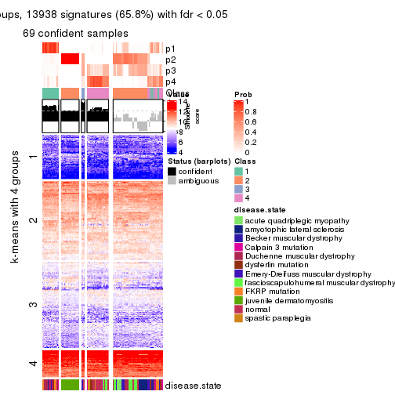</p>

</div>
<div id='tab-CV-hclust-get-signatures-no-scale-4'>
<pre><code class="r">get_signatures(res, k = 5, scale_rows = FALSE)
</code></pre>

<p></p>

</div>
<div id='tab-CV-hclust-get-signatures-no-scale-5'>
<pre><code class="r">get_signatures(res, k = 6, scale_rows = FALSE)
</code></pre>

<p></p>

</div>
</div>


Compare the overlap of signatures from different k:

```r
compare_signatures(res)
```


`get_signature()` returns a data frame invisibly. TO get the list of signatures, the function
call should be assigned to a variable explicitly. In following code, if `plot` argument is set
to `FALSE`, no heatmap is plotted while only the differential analysis is performed.

```r
# code only for demonstration
tb = get_signature(res, k = ..., plot = FALSE)
```

An example of the output of `tb` is:

```
#>   which_row         fdr    mean_1    mean_2 scaled_mean_1 scaled_mean_2 km
#> 1        38 0.042760348  8.373488  9.131774    -0.5533452     0.5164555  1
#> 2        40 0.018707592  7.106213  8.469186    -0.6173731     0.5762149  1
#> 3        55 0.019134737 10.221463 11.207825    -0.6159697     0.5749050  1
#> 4        59 0.006059896  5.921854  7.869574    -0.6899429     0.6439467  1
#> 5        60 0.018055526  8.928898 10.211722    -0.6204761     0.5791110  1
#> 6        98 0.009384629 15.714769 14.887706     0.6635654    -0.6193277  2
...
```

The columns in `tb` are:

1. `which_row`: row indices corresponding to the input matrix.
2. `fdr`: FDR for the differential test. 
3. `mean_x`: The mean value in group x.
4. `scaled_mean_x`: The mean value in group x after rows are scaled.
5. `km`: Row groups if k-means clustering is applied to rows.


UMAP plot which shows how samples are separated.


<script>
$( function() {
	$( '#tabs-CV-hclust-dimension-reduction' ).tabs();
} );
</script>
<div id='tabs-CV-hclust-dimension-reduction'>
<ul>
<li><a href='#tab-CV-hclust-dimension-reduction-1'>k = 2</a></li>
<li><a href='#tab-CV-hclust-dimension-reduction-2'>k = 3</a></li>
<li><a href='#tab-CV-hclust-dimension-reduction-3'>k = 4</a></li>
<li><a href='#tab-CV-hclust-dimension-reduction-4'>k = 5</a></li>
<li><a href='#tab-CV-hclust-dimension-reduction-5'>k = 6</a></li>
</ul>
<div id='tab-CV-hclust-dimension-reduction-1'>
<pre><code class="r">dimension_reduction(res, k = 2, method = &quot;UMAP&quot;)
</code></pre>

<p></p>

</div>
<div id='tab-CV-hclust-dimension-reduction-2'>
<pre><code class="r">dimension_reduction(res, k = 3, method = &quot;UMAP&quot;)
</code></pre>

<p></p>

</div>
<div id='tab-CV-hclust-dimension-reduction-3'>
<pre><code class="r">dimension_reduction(res, k = 4, method = &quot;UMAP&quot;)
</code></pre>

<p></p>

</div>
<div id='tab-CV-hclust-dimension-reduction-4'>
<pre><code class="r">dimension_reduction(res, k = 5, method = &quot;UMAP&quot;)
</code></pre>

<p></p>

</div>
<div id='tab-CV-hclust-dimension-reduction-5'>
<pre><code class="r">dimension_reduction(res, k = 6, method = &quot;UMAP&quot;)
</code></pre>

<p></p>

</div>
</div>


Following heatmap shows how subgroups are split when increasing `k`:

```r
collect_classes(res)
```


Test correlation between subgroups and known annotations. If the known
annotation is numeric, one-way ANOVA test is applied, and if the known
annotation is discrete, chi-squared contingency table test is applied.

```r
test_to_known_factors(res)
```

```
#>             n disease.state(p) k
#> CV:hclust 112         1.59e-07 2
#> CV:hclust 110         9.28e-15 3
#> CV:hclust  69         4.80e-20 4
#> CV:hclust  82         1.06e-22 5
#> CV:hclust  92         5.23e-26 6
```


If matrix rows can be associated to genes, consider to use `GO_Enrichment(res,
...)` to perform function enrichment for the signature genes.


 

---------------------------------------------------


### CV:kmeans**


The object with results only for a single top-value method and a single partition method 
can be extracted as:

```r
res = res_list["CV", "kmeans"]
# you can also extract it by
# res = res_list["CV:kmeans"]
```

A summary of `res` and all the functions that can be applied to it:

```r
res
```

```
#> A 'ConsensusPartition' object with k = 2, 3, 4, 5, 6.
#>   On a matrix with 21168 rows and 121 columns.
#>   Top rows (1000, 2000, 3000, 4000, 5000) are extracted by 'CV' method.
#>   Subgroups are detected by 'kmeans' method.
#>   Performed in total 1250 partitions by row resampling.
#>   Best k for subgroups seems to be 2.
#> 
#> Following methods can be applied to this 'ConsensusPartition' object:
#>  [1] "cola_report"             "collect_classes"         "collect_plots"          
#>  [4] "collect_stats"           "colnames"                "compare_signatures"     
#>  [7] "consensus_heatmap"       "dimension_reduction"     "functional_enrichment"  
#> [10] "get_anno_col"            "get_anno"                "get_classes"            
#> [13] "get_consensus"           "get_matrix"              "get_membership"         
#> [16] "get_param"               "get_signatures"          "get_stats"              
#> [19] "is_best_k"               "is_stable_k"             "membership_heatmap"     
#> [22] "ncol"                    "nrow"                    "plot_ecdf"              
#> [25] "rownames"                "select_partition_number" "show"                   
#> [28] "suggest_best_k"          "test_to_known_factors"
```

`collect_plots()` function collects all the plots made from `res` for all `k` (number of partitions)
into one single page to provide an easy and fast comparison between different `k`.

```r
collect_plots(res)
```


The plots are:

- The first row: a plot of the ECDF (Empirical cumulative distribution
  function) curves of the consensus matrix for each `k` and the heatmap of
  predicted classes for each `k`.
- The second row: heatmaps of the consensus matrix for each `k`.
- The third row: heatmaps of the membership matrix for each `k`.
- The fouth row: heatmaps of the signatures for each `k`.

All the plots in panels can be made by individual functions and they are
plotted later in this section.

`select_partition_number()` produces several plots showing different
statistics for choosing "optimized" `k`. There are following statistics:

- ECDF curves of the consensus matrix for each `k`;
- 1-PAC. [The PAC
  score](https://en.wikipedia.org/wiki/Consensus_clustering#Over-interpretation_potential_of_consensus_clustering)
  measures the proportion of the ambiguous subgrouping.
- Mean silhouette score.
- Concordance. The mean probability of fiting the consensus class ids in all
  partitions.
- Area increased. Denote $A_k$ as the area under the ECDF curve for current
  `k`, the area increased is defined as $A_k - A_{k-1}$.
- Rand index. The percent of pairs of samples that are both in a same cluster
  or both are not in a same cluster in the partition of k and k-1.
- Jaccard index. The ratio of pairs of samples are both in a same cluster in
  the partition of k and k-1 and the pairs of samples are both in a same
  cluster in the partition k or k-1.

The detailed explanations of these statistics can be found in [the cola
vignette](http://bioconductor.org/packages/devel/bioc/vignettes/cola/inst/doc/cola.html#toc_13).

Generally speaking, lower PAC score, higher mean silhouette score or higher
concordance corresponds to better partition. Rand index and Jaccard index
measure how similar the current partition is compared to partition with `k-1`.
If they are too similar, we won't accept `k` is better than `k-1`.

```r
select_partition_number(res)
```


The numeric values for all these statistics can be obtained by `get_stats()`.

```r
get_stats(res)
```

```
#>   k 1-PAC mean_silhouette concordance area_increased  Rand Jaccard
#> 2 2 0.956           0.957       0.976         0.4969 0.497   0.497
#> 3 3 0.663           0.823       0.903         0.3250 0.725   0.501
#> 4 4 0.710           0.719       0.864         0.1302 0.802   0.487
#> 5 5 0.694           0.598       0.750         0.0616 0.913   0.677
#> 6 6 0.726           0.597       0.698         0.0366 0.896   0.572
```

`suggest_best_k()` suggests the best $k$ based on these statistics. The rules are as follows:

- All $k$ with Jaccard index larger than 0.95 are removed because the increase of
  the partition number does not provides enough extra information. If all $k$ are removed,
  the best $k$ is assigned by `NA`.
- For $k$ with 1-PAC larger than 0.9, the maximal $k$ is taken as the "best k". Other $k$ is called "optional k".
- If it does not fit the second rule. The $k$ with the highest vote of highest
  1-PAC, mean silhouette and concordance is taken as the "best k".

```r
suggest_best_k(res)
```

```
#> [1] 2
```


Following shows the table of the partitions (You need to click the **show/hide
code output** link to see it). The membership matrix (columns with name `p*`)
is inferred by
[`clue::cl_consensus()`](https://www.rdocumentation.org/link/cl_consensus?package=clue)
function with the `SE` method. Basically the value in the membership matrix
represents the probability to belong to a certain group. The finall class
label for an item is determined with the group with highest probability it
belongs to.

In `get_classes()` function, the entropy is calculated from the membership
matrix and the silhouette score is calculated from the consensus matrix.


<script>
$( function() {
	$( '#tabs-CV-kmeans-get-classes' ).tabs();
} );
</script>
<div id='tabs-CV-kmeans-get-classes'>
<ul>
<li><a href='#tab-CV-kmeans-get-classes-1'>k = 2</a></li>
<li><a href='#tab-CV-kmeans-get-classes-2'>k = 3</a></li>
<li><a href='#tab-CV-kmeans-get-classes-3'>k = 4</a></li>
<li><a href='#tab-CV-kmeans-get-classes-4'>k = 5</a></li>
<li><a href='#tab-CV-kmeans-get-classes-5'>k = 6</a></li>
</ul>

<div id='tab-CV-kmeans-get-classes-1'>
<p><a id='tab-CV-kmeans-get-classes-1-a' style='color:#0366d6' href='#'>show/hide code output</a></p>
<pre><code class="r">cbind(get_classes(res, k = 2), get_membership(res, k = 2))
</code></pre>

<pre><code>#&gt;           class entropy silhouette    p1    p2
#&gt; GSM74356      2  0.2948      0.940 0.052 0.948
#&gt; GSM74357      2  0.4815      0.906 0.104 0.896
#&gt; GSM74358      2  0.4562      0.912 0.096 0.904
#&gt; GSM74359      1  0.0000      0.997 1.000 0.000
#&gt; GSM74360      1  0.0000      0.997 1.000 0.000
#&gt; GSM74361      2  0.4562      0.912 0.096 0.904
#&gt; GSM74362      2  0.5737      0.876 0.136 0.864
#&gt; GSM74363      2  0.2948      0.940 0.052 0.948
#&gt; GSM74402      1  0.0000      0.997 1.000 0.000
#&gt; GSM74403      1  0.0000      0.997 1.000 0.000
#&gt; GSM74404      1  0.0000      0.997 1.000 0.000
#&gt; GSM74406      1  0.0000      0.997 1.000 0.000
#&gt; GSM74407      1  0.0000      0.997 1.000 0.000
#&gt; GSM74408      1  0.0000      0.997 1.000 0.000
#&gt; GSM74409      1  0.0000      0.997 1.000 0.000
#&gt; GSM74410      1  0.0000      0.997 1.000 0.000
#&gt; GSM119936     1  0.0000      0.997 1.000 0.000
#&gt; GSM119937     1  0.0000      0.997 1.000 0.000
#&gt; GSM74411      2  0.0000      0.952 0.000 1.000
#&gt; GSM74412      2  0.0000      0.952 0.000 1.000
#&gt; GSM74413      2  0.0000      0.952 0.000 1.000
#&gt; GSM74414      2  0.0000      0.952 0.000 1.000
#&gt; GSM74415      2  0.2948      0.940 0.052 0.948
#&gt; GSM121379     2  0.0000      0.952 0.000 1.000
#&gt; GSM121380     2  0.0000      0.952 0.000 1.000
#&gt; GSM121381     2  0.0000      0.952 0.000 1.000
#&gt; GSM121382     2  0.0000      0.952 0.000 1.000
#&gt; GSM121383     2  0.0000      0.952 0.000 1.000
#&gt; GSM121384     2  0.0000      0.952 0.000 1.000
#&gt; GSM121385     2  0.0000      0.952 0.000 1.000
#&gt; GSM121386     2  0.0000      0.952 0.000 1.000
#&gt; GSM121387     2  0.0000      0.952 0.000 1.000
#&gt; GSM121388     2  0.0000      0.952 0.000 1.000
#&gt; GSM121389     2  0.0000      0.952 0.000 1.000
#&gt; GSM121390     2  0.0000      0.952 0.000 1.000
#&gt; GSM121391     2  0.0000      0.952 0.000 1.000
#&gt; GSM121392     2  0.0000      0.952 0.000 1.000
#&gt; GSM121393     2  0.0000      0.952 0.000 1.000
#&gt; GSM121394     2  0.0000      0.952 0.000 1.000
#&gt; GSM121395     2  0.0000      0.952 0.000 1.000
#&gt; GSM121396     2  0.0000      0.952 0.000 1.000
#&gt; GSM121397     2  0.0000      0.952 0.000 1.000
#&gt; GSM121398     2  0.0000      0.952 0.000 1.000
#&gt; GSM121399     2  0.0000      0.952 0.000 1.000
#&gt; GSM74240      2  0.6048      0.863 0.148 0.852
#&gt; GSM74241      2  0.5178      0.895 0.116 0.884
#&gt; GSM74242      2  0.9909      0.304 0.444 0.556
#&gt; GSM74243      2  0.9909      0.304 0.444 0.556
#&gt; GSM74244      2  0.4431      0.915 0.092 0.908
#&gt; GSM74245      2  0.5946      0.868 0.144 0.856
#&gt; GSM74246      2  0.4690      0.909 0.100 0.900
#&gt; GSM74247      2  0.4562      0.912 0.096 0.904
#&gt; GSM74248      2  0.6048      0.863 0.148 0.852
#&gt; GSM74416      1  0.0000      0.997 1.000 0.000
#&gt; GSM74417      1  0.0000      0.997 1.000 0.000
#&gt; GSM74418      1  0.0000      0.997 1.000 0.000
#&gt; GSM74419      1  0.0000      0.997 1.000 0.000
#&gt; GSM121358     2  0.2948      0.940 0.052 0.948
#&gt; GSM121359     2  0.0000      0.952 0.000 1.000
#&gt; GSM121360     1  0.0000      0.997 1.000 0.000
#&gt; GSM121362     1  0.0000      0.997 1.000 0.000
#&gt; GSM121364     1  0.0000      0.997 1.000 0.000
#&gt; GSM121365     2  0.2948      0.940 0.052 0.948
#&gt; GSM121366     2  0.0000      0.952 0.000 1.000
#&gt; GSM121367     2  0.2948      0.940 0.052 0.948
#&gt; GSM121370     2  0.2948      0.940 0.052 0.948
#&gt; GSM121371     2  0.2948      0.940 0.052 0.948
#&gt; GSM121372     2  0.0000      0.952 0.000 1.000
#&gt; GSM121373     1  0.0000      0.997 1.000 0.000
#&gt; GSM121374     1  0.0000      0.997 1.000 0.000
#&gt; GSM121407     2  0.0000      0.952 0.000 1.000
#&gt; GSM74387      2  0.2778      0.941 0.048 0.952
#&gt; GSM74388      2  0.0000      0.952 0.000 1.000
#&gt; GSM74389      1  0.0672      0.990 0.992 0.008
#&gt; GSM74390      1  0.0000      0.997 1.000 0.000
#&gt; GSM74391      1  0.0000      0.997 1.000 0.000
#&gt; GSM74392      1  0.0000      0.997 1.000 0.000
#&gt; GSM74393      1  0.2236      0.960 0.964 0.036
#&gt; GSM74394      2  0.2948      0.940 0.052 0.948
#&gt; GSM74239      1  0.0000      0.997 1.000 0.000
#&gt; GSM74364      1  0.0000      0.997 1.000 0.000
#&gt; GSM74365      1  0.0000      0.997 1.000 0.000
#&gt; GSM74366      1  0.0376      0.994 0.996 0.004
#&gt; GSM74367      1  0.0000      0.997 1.000 0.000
#&gt; GSM74377      1  0.0000      0.997 1.000 0.000
#&gt; GSM74378      1  0.0376      0.994 0.996 0.004
#&gt; GSM74379      1  0.0000      0.997 1.000 0.000
#&gt; GSM74380      1  0.0000      0.997 1.000 0.000
#&gt; GSM74381      1  0.0000      0.997 1.000 0.000
#&gt; GSM121357     2  0.0000      0.952 0.000 1.000
#&gt; GSM121361     2  0.1414      0.948 0.020 0.980
#&gt; GSM121363     2  0.0000      0.952 0.000 1.000
#&gt; GSM121368     2  0.0000      0.952 0.000 1.000
#&gt; GSM121369     2  0.2778      0.941 0.048 0.952
#&gt; GSM74368      1  0.0000      0.997 1.000 0.000
#&gt; GSM74369      1  0.0000      0.997 1.000 0.000
#&gt; GSM74370      1  0.0000      0.997 1.000 0.000
#&gt; GSM74371      1  0.0000      0.997 1.000 0.000
#&gt; GSM74372      1  0.0000      0.997 1.000 0.000
#&gt; GSM74373      1  0.0000      0.997 1.000 0.000
#&gt; GSM74374      1  0.0000      0.997 1.000 0.000
#&gt; GSM74375      1  0.0000      0.997 1.000 0.000
#&gt; GSM74376      1  0.0000      0.997 1.000 0.000
#&gt; GSM74405      1  0.0000      0.997 1.000 0.000
#&gt; GSM74351      1  0.0000      0.997 1.000 0.000
#&gt; GSM74352      1  0.1414      0.979 0.980 0.020
#&gt; GSM74353      1  0.0000      0.997 1.000 0.000
#&gt; GSM74354      1  0.0000      0.997 1.000 0.000
#&gt; GSM74355      1  0.0000      0.997 1.000 0.000
#&gt; GSM74382      1  0.0000      0.997 1.000 0.000
#&gt; GSM74383      1  0.0000      0.997 1.000 0.000
#&gt; GSM74384      1  0.4022      0.914 0.920 0.080
#&gt; GSM74385      1  0.0000      0.997 1.000 0.000
#&gt; GSM74386      1  0.0000      0.997 1.000 0.000
#&gt; GSM74395      1  0.0000      0.997 1.000 0.000
#&gt; GSM74396      1  0.0000      0.997 1.000 0.000
#&gt; GSM74397      1  0.0000      0.997 1.000 0.000
#&gt; GSM74398      1  0.0000      0.997 1.000 0.000
#&gt; GSM74399      1  0.0000      0.997 1.000 0.000
#&gt; GSM74400      1  0.0000      0.997 1.000 0.000
#&gt; GSM74401      1  0.0000      0.997 1.000 0.000
</code></pre>

<script>
$('#tab-CV-kmeans-get-classes-1-a').parent().next().next().hide();
$('#tab-CV-kmeans-get-classes-1-a').click(function(){
  $('#tab-CV-kmeans-get-classes-1-a').parent().next().next().toggle();
  return(false);
});
</script>
</div>

<div id='tab-CV-kmeans-get-classes-2'>
<p><a id='tab-CV-kmeans-get-classes-2-a' style='color:#0366d6' href='#'>show/hide code output</a></p>
<pre><code class="r">cbind(get_classes(res, k = 3), get_membership(res, k = 3))
</code></pre>

<pre><code>#&gt;           class entropy silhouette    p1    p2    p3
#&gt; GSM74356      3  0.1031      0.783 0.000 0.024 0.976
#&gt; GSM74357      3  0.1031      0.783 0.000 0.024 0.976
#&gt; GSM74358      3  0.1031      0.783 0.000 0.024 0.976
#&gt; GSM74359      3  0.4399      0.749 0.188 0.000 0.812
#&gt; GSM74360      3  0.4654      0.731 0.208 0.000 0.792
#&gt; GSM74361      3  0.0892      0.784 0.000 0.020 0.980
#&gt; GSM74362      3  0.0892      0.784 0.000 0.020 0.980
#&gt; GSM74363      3  0.1529      0.776 0.000 0.040 0.960
#&gt; GSM74402      1  0.5560      0.563 0.700 0.000 0.300
#&gt; GSM74403      1  0.4605      0.745 0.796 0.000 0.204
#&gt; GSM74404      1  0.4605      0.745 0.796 0.000 0.204
#&gt; GSM74406      3  0.5733      0.578 0.324 0.000 0.676
#&gt; GSM74407      1  0.5431      0.598 0.716 0.000 0.284
#&gt; GSM74408      3  0.5706      0.584 0.320 0.000 0.680
#&gt; GSM74409      3  0.4887      0.710 0.228 0.000 0.772
#&gt; GSM74410      3  0.4555      0.739 0.200 0.000 0.800
#&gt; GSM119936     3  0.6079      0.443 0.388 0.000 0.612
#&gt; GSM119937     3  0.6079      0.443 0.388 0.000 0.612
#&gt; GSM74411      2  0.5591      0.679 0.000 0.696 0.304
#&gt; GSM74412      2  0.4605      0.809 0.000 0.796 0.204
#&gt; GSM74413      2  0.4750      0.797 0.000 0.784 0.216
#&gt; GSM74414      2  0.1964      0.891 0.000 0.944 0.056
#&gt; GSM74415      3  0.4887      0.611 0.000 0.228 0.772
#&gt; GSM121379     2  0.0000      0.906 0.000 1.000 0.000
#&gt; GSM121380     2  0.0000      0.906 0.000 1.000 0.000
#&gt; GSM121381     2  0.0000      0.906 0.000 1.000 0.000
#&gt; GSM121382     2  0.0000      0.906 0.000 1.000 0.000
#&gt; GSM121383     2  0.0000      0.906 0.000 1.000 0.000
#&gt; GSM121384     2  0.0000      0.906 0.000 1.000 0.000
#&gt; GSM121385     2  0.0000      0.906 0.000 1.000 0.000
#&gt; GSM121386     2  0.0000      0.906 0.000 1.000 0.000
#&gt; GSM121387     2  0.0000      0.906 0.000 1.000 0.000
#&gt; GSM121388     2  0.0000      0.906 0.000 1.000 0.000
#&gt; GSM121389     2  0.0000      0.906 0.000 1.000 0.000
#&gt; GSM121390     2  0.0000      0.906 0.000 1.000 0.000
#&gt; GSM121391     2  0.0000      0.906 0.000 1.000 0.000
#&gt; GSM121392     2  0.0000      0.906 0.000 1.000 0.000
#&gt; GSM121393     2  0.0000      0.906 0.000 1.000 0.000
#&gt; GSM121394     2  0.0000      0.906 0.000 1.000 0.000
#&gt; GSM121395     2  0.0000      0.906 0.000 1.000 0.000
#&gt; GSM121396     2  0.1529      0.896 0.000 0.960 0.040
#&gt; GSM121397     2  0.0000      0.906 0.000 1.000 0.000
#&gt; GSM121398     2  0.0000      0.906 0.000 1.000 0.000
#&gt; GSM121399     2  0.0000      0.906 0.000 1.000 0.000
#&gt; GSM74240      3  0.0237      0.786 0.000 0.004 0.996
#&gt; GSM74241      3  0.3619      0.706 0.000 0.136 0.864
#&gt; GSM74242      3  0.0000      0.786 0.000 0.000 1.000
#&gt; GSM74243      3  0.0000      0.786 0.000 0.000 1.000
#&gt; GSM74244      3  0.3619      0.706 0.000 0.136 0.864
#&gt; GSM74245      3  0.0424      0.785 0.000 0.008 0.992
#&gt; GSM74246      3  0.3752      0.699 0.000 0.144 0.856
#&gt; GSM74247      3  0.4062      0.677 0.000 0.164 0.836
#&gt; GSM74248      3  0.0237      0.786 0.000 0.004 0.996
#&gt; GSM74416      1  0.4605      0.745 0.796 0.000 0.204
#&gt; GSM74417      1  0.4605      0.745 0.796 0.000 0.204
#&gt; GSM74418      1  0.3340      0.846 0.880 0.000 0.120
#&gt; GSM74419      3  0.5760      0.570 0.328 0.000 0.672
#&gt; GSM121358     3  0.4931      0.606 0.000 0.232 0.768
#&gt; GSM121359     2  0.4605      0.809 0.000 0.796 0.204
#&gt; GSM121360     3  0.4291      0.750 0.180 0.000 0.820
#&gt; GSM121362     3  0.5621      0.603 0.308 0.000 0.692
#&gt; GSM121364     3  0.4452      0.746 0.192 0.000 0.808
#&gt; GSM121365     3  0.4931      0.606 0.000 0.232 0.768
#&gt; GSM121366     3  0.4931      0.606 0.000 0.232 0.768
#&gt; GSM121367     3  0.4931      0.606 0.000 0.232 0.768
#&gt; GSM121370     3  0.4931      0.606 0.000 0.232 0.768
#&gt; GSM121371     3  0.4931      0.606 0.000 0.232 0.768
#&gt; GSM121372     2  0.5016      0.771 0.000 0.760 0.240
#&gt; GSM121373     3  0.4452      0.746 0.192 0.000 0.808
#&gt; GSM121374     3  0.4452      0.746 0.192 0.000 0.808
#&gt; GSM121407     2  0.4555      0.812 0.000 0.800 0.200
#&gt; GSM74387      2  0.5968      0.588 0.000 0.636 0.364
#&gt; GSM74388      2  0.3669      0.872 0.040 0.896 0.064
#&gt; GSM74389      3  0.2261      0.787 0.068 0.000 0.932
#&gt; GSM74390      1  0.0747      0.948 0.984 0.000 0.016
#&gt; GSM74391      3  0.4796      0.719 0.220 0.000 0.780
#&gt; GSM74392      3  0.4291      0.753 0.180 0.000 0.820
#&gt; GSM74393      3  0.0000      0.786 0.000 0.000 1.000
#&gt; GSM74394      2  0.7304      0.724 0.084 0.688 0.228
#&gt; GSM74239      1  0.0424      0.950 0.992 0.000 0.008
#&gt; GSM74364      1  0.0424      0.950 0.992 0.000 0.008
#&gt; GSM74365      1  0.0000      0.950 1.000 0.000 0.000
#&gt; GSM74366      1  0.0747      0.948 0.984 0.000 0.016
#&gt; GSM74367      1  0.0237      0.950 0.996 0.000 0.004
#&gt; GSM74377      1  0.0747      0.948 0.984 0.000 0.016
#&gt; GSM74378      1  0.0747      0.948 0.984 0.000 0.016
#&gt; GSM74379      1  0.0747      0.948 0.984 0.000 0.016
#&gt; GSM74380      1  0.0747      0.948 0.984 0.000 0.016
#&gt; GSM74381      1  0.0747      0.948 0.984 0.000 0.016
#&gt; GSM121357     2  0.3482      0.859 0.000 0.872 0.128
#&gt; GSM121361     2  0.5435      0.832 0.048 0.808 0.144
#&gt; GSM121363     2  0.4615      0.849 0.020 0.836 0.144
#&gt; GSM121368     2  0.4475      0.851 0.016 0.840 0.144
#&gt; GSM121369     2  0.7597      0.491 0.048 0.568 0.384
#&gt; GSM74368      1  0.0424      0.950 0.992 0.000 0.008
#&gt; GSM74369      1  0.0424      0.950 0.992 0.000 0.008
#&gt; GSM74370      1  0.0424      0.950 0.992 0.000 0.008
#&gt; GSM74371      1  0.0424      0.950 0.992 0.000 0.008
#&gt; GSM74372      1  0.0424      0.950 0.992 0.000 0.008
#&gt; GSM74373      1  0.0747      0.948 0.984 0.000 0.016
#&gt; GSM74374      1  0.0000      0.950 1.000 0.000 0.000
#&gt; GSM74375      1  0.0747      0.948 0.984 0.000 0.016
#&gt; GSM74376      1  0.0747      0.948 0.984 0.000 0.016
#&gt; GSM74405      1  0.0747      0.948 0.984 0.000 0.016
#&gt; GSM74351      1  0.0424      0.950 0.992 0.000 0.008
#&gt; GSM74352      1  0.0747      0.948 0.984 0.000 0.016
#&gt; GSM74353      1  0.0424      0.950 0.992 0.000 0.008
#&gt; GSM74354      1  0.0000      0.950 1.000 0.000 0.000
#&gt; GSM74355      1  0.0747      0.948 0.984 0.000 0.016
#&gt; GSM74382      1  0.0424      0.950 0.992 0.000 0.008
#&gt; GSM74383      1  0.0237      0.950 0.996 0.000 0.004
#&gt; GSM74384      1  0.0747      0.948 0.984 0.000 0.016
#&gt; GSM74385      1  0.0424      0.950 0.992 0.000 0.008
#&gt; GSM74386      1  0.0237      0.950 0.996 0.000 0.004
#&gt; GSM74395      1  0.0424      0.950 0.992 0.000 0.008
#&gt; GSM74396      1  0.0000      0.950 1.000 0.000 0.000
#&gt; GSM74397      1  0.0592      0.948 0.988 0.000 0.012
#&gt; GSM74398      1  0.0747      0.948 0.984 0.000 0.016
#&gt; GSM74399      1  0.0747      0.948 0.984 0.000 0.016
#&gt; GSM74400      1  0.0237      0.950 0.996 0.000 0.004
#&gt; GSM74401      1  0.0237      0.950 0.996 0.000 0.004
</code></pre>

<script>
$('#tab-CV-kmeans-get-classes-2-a').parent().next().next().hide();
$('#tab-CV-kmeans-get-classes-2-a').click(function(){
  $('#tab-CV-kmeans-get-classes-2-a').parent().next().next().toggle();
  return(false);
});
</script>
</div>

<div id='tab-CV-kmeans-get-classes-3'>
<p><a id='tab-CV-kmeans-get-classes-3-a' style='color:#0366d6' href='#'>show/hide code output</a></p>
<pre><code class="r">cbind(get_classes(res, k = 4), get_membership(res, k = 4))
</code></pre>

<pre><code>#&gt;           class entropy silhouette    p1    p2    p3    p4
#&gt; GSM74356      3  0.1022     0.8606 0.000 0.000 0.968 0.032
#&gt; GSM74357      3  0.1118     0.8582 0.000 0.000 0.964 0.036
#&gt; GSM74358      3  0.1118     0.8582 0.000 0.000 0.964 0.036
#&gt; GSM74359      4  0.4800     0.5497 0.004 0.000 0.340 0.656
#&gt; GSM74360      4  0.2714     0.7275 0.004 0.000 0.112 0.884
#&gt; GSM74361      3  0.1022     0.8622 0.000 0.000 0.968 0.032
#&gt; GSM74362      3  0.1211     0.8576 0.000 0.000 0.960 0.040
#&gt; GSM74363      3  0.0921     0.8624 0.000 0.000 0.972 0.028
#&gt; GSM74402      4  0.1743     0.7456 0.056 0.000 0.004 0.940
#&gt; GSM74403      4  0.1637     0.7429 0.060 0.000 0.000 0.940
#&gt; GSM74404      4  0.1637     0.7429 0.060 0.000 0.000 0.940
#&gt; GSM74406      4  0.0927     0.7584 0.016 0.000 0.008 0.976
#&gt; GSM74407      4  0.1557     0.7454 0.056 0.000 0.000 0.944
#&gt; GSM74408      4  0.0927     0.7584 0.016 0.000 0.008 0.976
#&gt; GSM74409      4  0.0937     0.7581 0.012 0.000 0.012 0.976
#&gt; GSM74410      4  0.0927     0.7572 0.008 0.000 0.016 0.976
#&gt; GSM119936     4  0.1042     0.7580 0.020 0.000 0.008 0.972
#&gt; GSM119937     4  0.1042     0.7580 0.020 0.000 0.008 0.972
#&gt; GSM74411      3  0.5106     0.5192 0.008 0.312 0.672 0.008
#&gt; GSM74412      3  0.5149     0.5038 0.008 0.320 0.664 0.008
#&gt; GSM74413      3  0.5127     0.5119 0.008 0.316 0.668 0.008
#&gt; GSM74414      2  0.4630     0.6820 0.024 0.776 0.192 0.008
#&gt; GSM74415      3  0.0804     0.8640 0.008 0.000 0.980 0.012
#&gt; GSM121379     2  0.0000     0.8883 0.000 1.000 0.000 0.000
#&gt; GSM121380     2  0.0000     0.8883 0.000 1.000 0.000 0.000
#&gt; GSM121381     2  0.0000     0.8883 0.000 1.000 0.000 0.000
#&gt; GSM121382     2  0.0000     0.8883 0.000 1.000 0.000 0.000
#&gt; GSM121383     2  0.0000     0.8883 0.000 1.000 0.000 0.000
#&gt; GSM121384     2  0.0000     0.8883 0.000 1.000 0.000 0.000
#&gt; GSM121385     2  0.0000     0.8883 0.000 1.000 0.000 0.000
#&gt; GSM121386     2  0.0000     0.8883 0.000 1.000 0.000 0.000
#&gt; GSM121387     2  0.0000     0.8883 0.000 1.000 0.000 0.000
#&gt; GSM121388     2  0.0188     0.8865 0.000 0.996 0.000 0.004
#&gt; GSM121389     2  0.0188     0.8865 0.000 0.996 0.000 0.004
#&gt; GSM121390     2  0.0000     0.8883 0.000 1.000 0.000 0.000
#&gt; GSM121391     2  0.0000     0.8883 0.000 1.000 0.000 0.000
#&gt; GSM121392     2  0.0000     0.8883 0.000 1.000 0.000 0.000
#&gt; GSM121393     2  0.0188     0.8865 0.000 0.996 0.000 0.004
#&gt; GSM121394     2  0.0000     0.8883 0.000 1.000 0.000 0.000
#&gt; GSM121395     2  0.0188     0.8865 0.000 0.996 0.000 0.004
#&gt; GSM121396     2  0.2714     0.7923 0.000 0.884 0.112 0.004
#&gt; GSM121397     2  0.0000     0.8883 0.000 1.000 0.000 0.000
#&gt; GSM121398     2  0.0000     0.8883 0.000 1.000 0.000 0.000
#&gt; GSM121399     2  0.0000     0.8883 0.000 1.000 0.000 0.000
#&gt; GSM74240      3  0.0804     0.8651 0.008 0.000 0.980 0.012
#&gt; GSM74241      3  0.0672     0.8644 0.008 0.000 0.984 0.008
#&gt; GSM74242      3  0.1356     0.8615 0.008 0.000 0.960 0.032
#&gt; GSM74243      3  0.1452     0.8593 0.008 0.000 0.956 0.036
#&gt; GSM74244      3  0.0804     0.8651 0.008 0.000 0.980 0.012
#&gt; GSM74245      3  0.0804     0.8651 0.008 0.000 0.980 0.012
#&gt; GSM74246      3  0.0672     0.8644 0.008 0.000 0.984 0.008
#&gt; GSM74247      3  0.0672     0.8644 0.008 0.000 0.984 0.008
#&gt; GSM74248      3  0.0804     0.8651 0.008 0.000 0.980 0.012
#&gt; GSM74416      4  0.1637     0.7429 0.060 0.000 0.000 0.940
#&gt; GSM74417      4  0.1557     0.7454 0.056 0.000 0.000 0.944
#&gt; GSM74418      4  0.1637     0.7429 0.060 0.000 0.000 0.940
#&gt; GSM74419      4  0.1042     0.7580 0.020 0.000 0.008 0.972
#&gt; GSM121358     3  0.0895     0.8650 0.000 0.004 0.976 0.020
#&gt; GSM121359     3  0.4761     0.4909 0.000 0.332 0.664 0.004
#&gt; GSM121360     4  0.4800     0.5497 0.004 0.000 0.340 0.656
#&gt; GSM121362     4  0.5695     0.5350 0.040 0.000 0.336 0.624
#&gt; GSM121364     4  0.4761     0.5583 0.004 0.000 0.332 0.664
#&gt; GSM121365     3  0.0895     0.8650 0.000 0.004 0.976 0.020
#&gt; GSM121366     3  0.0657     0.8657 0.000 0.004 0.984 0.012
#&gt; GSM121367     3  0.0895     0.8650 0.000 0.004 0.976 0.020
#&gt; GSM121370     3  0.0592     0.8655 0.000 0.000 0.984 0.016
#&gt; GSM121371     3  0.0895     0.8650 0.000 0.004 0.976 0.020
#&gt; GSM121372     3  0.4720     0.5074 0.000 0.324 0.672 0.004
#&gt; GSM121373     4  0.4800     0.5497 0.004 0.000 0.340 0.656
#&gt; GSM121374     4  0.4800     0.5497 0.004 0.000 0.340 0.656
#&gt; GSM121407     3  0.4781     0.4824 0.000 0.336 0.660 0.004
#&gt; GSM74387      3  0.3822     0.7526 0.016 0.140 0.836 0.008
#&gt; GSM74388      2  0.7224     0.4712 0.340 0.528 0.124 0.008
#&gt; GSM74389      4  0.5000     0.1712 0.000 0.000 0.500 0.500
#&gt; GSM74390      1  0.0336     0.8450 0.992 0.000 0.000 0.008
#&gt; GSM74391      4  0.1284     0.7566 0.012 0.000 0.024 0.964
#&gt; GSM74392      4  0.4800     0.5497 0.004 0.000 0.340 0.656
#&gt; GSM74393      3  0.2918     0.7787 0.008 0.000 0.876 0.116
#&gt; GSM74394      3  0.7932     0.2047 0.252 0.280 0.460 0.008
#&gt; GSM74239      1  0.4713     0.5645 0.640 0.000 0.000 0.360
#&gt; GSM74364      1  0.4730     0.5568 0.636 0.000 0.000 0.364
#&gt; GSM74365      1  0.1637     0.8364 0.940 0.000 0.000 0.060
#&gt; GSM74366      1  0.0376     0.8341 0.992 0.000 0.004 0.004
#&gt; GSM74367      1  0.3907     0.7451 0.768 0.000 0.000 0.232
#&gt; GSM74377      1  0.0336     0.8450 0.992 0.000 0.000 0.008
#&gt; GSM74378      1  0.0000     0.8401 1.000 0.000 0.000 0.000
#&gt; GSM74379      1  0.0336     0.8450 0.992 0.000 0.000 0.008
#&gt; GSM74380      1  0.0336     0.8450 0.992 0.000 0.000 0.008
#&gt; GSM74381      1  0.0336     0.8450 0.992 0.000 0.000 0.008
#&gt; GSM121357     2  0.5833     0.1299 0.024 0.532 0.440 0.004
#&gt; GSM121361     2  0.7867     0.3552 0.268 0.476 0.248 0.008
#&gt; GSM121363     2  0.7870     0.3451 0.256 0.476 0.260 0.008
#&gt; GSM121368     2  0.7870     0.3451 0.256 0.476 0.260 0.008
#&gt; GSM121369     3  0.5391     0.6595 0.208 0.052 0.732 0.008
#&gt; GSM74368      1  0.4250     0.7074 0.724 0.000 0.000 0.276
#&gt; GSM74369      1  0.4382     0.6833 0.704 0.000 0.000 0.296
#&gt; GSM74370      1  0.4585     0.6322 0.668 0.000 0.000 0.332
#&gt; GSM74371      4  0.4948    -0.0752 0.440 0.000 0.000 0.560
#&gt; GSM74372      4  0.4955    -0.0611 0.444 0.000 0.000 0.556
#&gt; GSM74373      1  0.0336     0.8450 0.992 0.000 0.000 0.008
#&gt; GSM74374      1  0.3356     0.7873 0.824 0.000 0.000 0.176
#&gt; GSM74375      1  0.0469     0.8449 0.988 0.000 0.000 0.012
#&gt; GSM74376      1  0.0000     0.8401 1.000 0.000 0.000 0.000
#&gt; GSM74405      1  0.0336     0.8450 0.992 0.000 0.000 0.008
#&gt; GSM74351      4  0.4431     0.3726 0.304 0.000 0.000 0.696
#&gt; GSM74352      1  0.0000     0.8401 1.000 0.000 0.000 0.000
#&gt; GSM74353      1  0.4817     0.5206 0.612 0.000 0.000 0.388
#&gt; GSM74354      1  0.3311     0.7909 0.828 0.000 0.000 0.172
#&gt; GSM74355      1  0.0000     0.8401 1.000 0.000 0.000 0.000
#&gt; GSM74382      4  0.4134     0.4702 0.260 0.000 0.000 0.740
#&gt; GSM74383      1  0.3764     0.7620 0.784 0.000 0.000 0.216
#&gt; GSM74384      1  0.0376     0.8341 0.992 0.000 0.004 0.004
#&gt; GSM74385      4  0.4994    -0.2109 0.480 0.000 0.000 0.520
#&gt; GSM74386      1  0.3726     0.7659 0.788 0.000 0.000 0.212
#&gt; GSM74395      1  0.4454     0.6486 0.692 0.000 0.000 0.308
#&gt; GSM74396      1  0.3688     0.7668 0.792 0.000 0.000 0.208
#&gt; GSM74397      1  0.4981     0.3060 0.536 0.000 0.000 0.464
#&gt; GSM74398      1  0.0336     0.8450 0.992 0.000 0.000 0.008
#&gt; GSM74399      1  0.0336     0.8450 0.992 0.000 0.000 0.008
#&gt; GSM74400      1  0.1389     0.8407 0.952 0.000 0.000 0.048
#&gt; GSM74401      1  0.1389     0.8407 0.952 0.000 0.000 0.048
</code></pre>

<script>
$('#tab-CV-kmeans-get-classes-3-a').parent().next().next().hide();
$('#tab-CV-kmeans-get-classes-3-a').click(function(){
  $('#tab-CV-kmeans-get-classes-3-a').parent().next().next().toggle();
  return(false);
});
</script>
</div>

<div id='tab-CV-kmeans-get-classes-4'>
<p><a id='tab-CV-kmeans-get-classes-4-a' style='color:#0366d6' href='#'>show/hide code output</a></p>
<pre><code class="r">cbind(get_classes(res, k = 5), get_membership(res, k = 5))
</code></pre>

<pre><code>#&gt;           class entropy silhouette    p1    p2    p3    p4    p5
#&gt; GSM74356      3  0.0727     0.8535 0.004 0.000 0.980 0.012 0.004
#&gt; GSM74357      3  0.1059     0.8502 0.004 0.000 0.968 0.020 0.008
#&gt; GSM74358      3  0.1059     0.8502 0.004 0.000 0.968 0.020 0.008
#&gt; GSM74359      4  0.5524     0.6237 0.004 0.000 0.180 0.664 0.152
#&gt; GSM74360      4  0.5029     0.6707 0.012 0.000 0.104 0.728 0.156
#&gt; GSM74361      3  0.1915     0.8473 0.000 0.000 0.928 0.032 0.040
#&gt; GSM74362      3  0.4960     0.6151 0.000 0.000 0.708 0.180 0.112
#&gt; GSM74363      3  0.0566     0.8542 0.004 0.000 0.984 0.012 0.000
#&gt; GSM74402      4  0.3491     0.6515 0.228 0.000 0.000 0.768 0.004
#&gt; GSM74403      4  0.4086     0.5980 0.284 0.000 0.000 0.704 0.012
#&gt; GSM74404      4  0.4086     0.5980 0.284 0.000 0.000 0.704 0.012
#&gt; GSM74406      4  0.2020     0.7176 0.100 0.000 0.000 0.900 0.000
#&gt; GSM74407      4  0.3671     0.6450 0.236 0.000 0.000 0.756 0.008
#&gt; GSM74408      4  0.2077     0.7194 0.084 0.000 0.000 0.908 0.008
#&gt; GSM74409      4  0.1981     0.7198 0.048 0.000 0.000 0.924 0.028
#&gt; GSM74410      4  0.2227     0.7195 0.048 0.000 0.004 0.916 0.032
#&gt; GSM119936     4  0.2536     0.7107 0.128 0.000 0.000 0.868 0.004
#&gt; GSM119937     4  0.2707     0.7107 0.132 0.000 0.000 0.860 0.008
#&gt; GSM74411      3  0.4503     0.7294 0.000 0.120 0.756 0.000 0.124
#&gt; GSM74412      3  0.4548     0.7264 0.000 0.120 0.752 0.000 0.128
#&gt; GSM74413      3  0.4503     0.7294 0.000 0.120 0.756 0.000 0.124
#&gt; GSM74414      2  0.5793     0.3745 0.000 0.584 0.124 0.000 0.292
#&gt; GSM74415      3  0.2536     0.8237 0.000 0.000 0.868 0.004 0.128
#&gt; GSM121379     2  0.0324     0.9347 0.000 0.992 0.000 0.004 0.004
#&gt; GSM121380     2  0.0162     0.9353 0.000 0.996 0.000 0.000 0.004
#&gt; GSM121381     2  0.0162     0.9353 0.000 0.996 0.000 0.000 0.004
#&gt; GSM121382     2  0.0290     0.9342 0.000 0.992 0.000 0.000 0.008
#&gt; GSM121383     2  0.0290     0.9342 0.000 0.992 0.000 0.000 0.008
#&gt; GSM121384     2  0.0162     0.9353 0.000 0.996 0.000 0.000 0.004
#&gt; GSM121385     2  0.0162     0.9353 0.000 0.996 0.000 0.000 0.004
#&gt; GSM121386     2  0.0162     0.9353 0.000 0.996 0.000 0.000 0.004
#&gt; GSM121387     2  0.0290     0.9342 0.000 0.992 0.000 0.000 0.008
#&gt; GSM121388     2  0.0932     0.9264 0.004 0.972 0.000 0.004 0.020
#&gt; GSM121389     2  0.0566     0.9319 0.000 0.984 0.000 0.004 0.012
#&gt; GSM121390     2  0.0324     0.9347 0.000 0.992 0.000 0.004 0.004
#&gt; GSM121391     2  0.0162     0.9349 0.000 0.996 0.000 0.000 0.004
#&gt; GSM121392     2  0.0324     0.9347 0.000 0.992 0.000 0.004 0.004
#&gt; GSM121393     2  0.0932     0.9264 0.004 0.972 0.000 0.004 0.020
#&gt; GSM121394     2  0.0162     0.9349 0.000 0.996 0.000 0.000 0.004
#&gt; GSM121395     2  0.0833     0.9284 0.004 0.976 0.000 0.004 0.016
#&gt; GSM121396     2  0.3425     0.7814 0.004 0.840 0.112 0.000 0.044
#&gt; GSM121397     2  0.0162     0.9353 0.000 0.996 0.000 0.000 0.004
#&gt; GSM121398     2  0.0162     0.9353 0.000 0.996 0.000 0.000 0.004
#&gt; GSM121399     2  0.0000     0.9353 0.000 1.000 0.000 0.000 0.000
#&gt; GSM74240      3  0.3209     0.8394 0.004 0.000 0.848 0.028 0.120
#&gt; GSM74241      3  0.3304     0.8390 0.004 0.000 0.840 0.028 0.128
#&gt; GSM74242      3  0.3273     0.8342 0.004 0.000 0.848 0.036 0.112
#&gt; GSM74243      3  0.3273     0.8342 0.004 0.000 0.848 0.036 0.112
#&gt; GSM74244      3  0.3160     0.8402 0.004 0.000 0.852 0.028 0.116
#&gt; GSM74245      3  0.3209     0.8394 0.004 0.000 0.848 0.028 0.120
#&gt; GSM74246      3  0.3441     0.8361 0.004 0.000 0.828 0.028 0.140
#&gt; GSM74247      3  0.3441     0.8361 0.004 0.000 0.828 0.028 0.140
#&gt; GSM74248      3  0.3059     0.8385 0.004 0.000 0.860 0.028 0.108
#&gt; GSM74416      4  0.3928     0.5849 0.296 0.000 0.000 0.700 0.004
#&gt; GSM74417      4  0.3861     0.6001 0.284 0.000 0.000 0.712 0.004
#&gt; GSM74418      4  0.3928     0.5849 0.296 0.000 0.000 0.700 0.004
#&gt; GSM74419      4  0.2605     0.7032 0.148 0.000 0.000 0.852 0.000
#&gt; GSM121358     3  0.0727     0.8544 0.004 0.000 0.980 0.012 0.004
#&gt; GSM121359     3  0.4416     0.7360 0.004 0.124 0.780 0.004 0.088
#&gt; GSM121360     4  0.5630     0.6145 0.004 0.000 0.180 0.652 0.164
#&gt; GSM121362     4  0.6199     0.6034 0.028 0.000 0.176 0.628 0.168
#&gt; GSM121364     4  0.5524     0.6237 0.004 0.000 0.180 0.664 0.152
#&gt; GSM121365     3  0.0727     0.8544 0.004 0.000 0.980 0.012 0.004
#&gt; GSM121366     3  0.0727     0.8544 0.004 0.000 0.980 0.012 0.004
#&gt; GSM121367     3  0.0727     0.8544 0.004 0.000 0.980 0.012 0.004
#&gt; GSM121370     3  0.0727     0.8544 0.004 0.000 0.980 0.012 0.004
#&gt; GSM121371     3  0.0727     0.8544 0.004 0.000 0.980 0.012 0.004
#&gt; GSM121372     3  0.4416     0.7360 0.004 0.124 0.780 0.004 0.088
#&gt; GSM121373     4  0.5524     0.6237 0.004 0.000 0.180 0.664 0.152
#&gt; GSM121374     4  0.5524     0.6237 0.004 0.000 0.180 0.664 0.152
#&gt; GSM121407     3  0.4522     0.7312 0.004 0.124 0.772 0.004 0.096
#&gt; GSM74387      3  0.5053     0.6483 0.000 0.048 0.644 0.004 0.304
#&gt; GSM74388      5  0.5649     0.1734 0.040 0.372 0.024 0.000 0.564
#&gt; GSM74389      4  0.6111     0.3356 0.004 0.000 0.340 0.532 0.124
#&gt; GSM74390      1  0.4182     0.2242 0.600 0.000 0.000 0.000 0.400
#&gt; GSM74391      4  0.3689     0.7215 0.084 0.000 0.012 0.836 0.068
#&gt; GSM74392      4  0.5487     0.6253 0.004 0.000 0.180 0.668 0.148
#&gt; GSM74393      3  0.6331     0.2464 0.004 0.000 0.508 0.336 0.152
#&gt; GSM74394      5  0.6390    -0.0508 0.020 0.096 0.348 0.004 0.532
#&gt; GSM74239      1  0.2583     0.6033 0.864 0.000 0.000 0.132 0.004
#&gt; GSM74364      1  0.2583     0.6046 0.864 0.000 0.000 0.132 0.004
#&gt; GSM74365      1  0.2929     0.5030 0.820 0.000 0.000 0.000 0.180
#&gt; GSM74366      5  0.4235     0.1882 0.424 0.000 0.000 0.000 0.576
#&gt; GSM74367      1  0.2153     0.6190 0.916 0.000 0.000 0.040 0.044
#&gt; GSM74377      1  0.4283     0.0823 0.544 0.000 0.000 0.000 0.456
#&gt; GSM74378      5  0.4256     0.1685 0.436 0.000 0.000 0.000 0.564
#&gt; GSM74379      1  0.4210     0.1828 0.588 0.000 0.000 0.000 0.412
#&gt; GSM74380      1  0.4219     0.1775 0.584 0.000 0.000 0.000 0.416
#&gt; GSM74381      1  0.4300     0.0162 0.524 0.000 0.000 0.000 0.476
#&gt; GSM121357     2  0.6754     0.0654 0.000 0.400 0.324 0.000 0.276
#&gt; GSM121361     5  0.6394     0.1496 0.020 0.368 0.092 0.004 0.516
#&gt; GSM121363     5  0.6394     0.1496 0.020 0.368 0.092 0.004 0.516
#&gt; GSM121368     5  0.6394     0.1496 0.020 0.368 0.092 0.004 0.516
#&gt; GSM121369     5  0.5824    -0.2412 0.020 0.028 0.428 0.012 0.512
#&gt; GSM74368      1  0.4025     0.5901 0.792 0.000 0.000 0.076 0.132
#&gt; GSM74369      1  0.3702     0.6104 0.820 0.000 0.000 0.084 0.096
#&gt; GSM74370      1  0.2900     0.6132 0.864 0.000 0.000 0.108 0.028
#&gt; GSM74371      1  0.4130     0.3923 0.696 0.000 0.000 0.292 0.012
#&gt; GSM74372      1  0.3863     0.4738 0.740 0.000 0.000 0.248 0.012
#&gt; GSM74373      1  0.4305    -0.0282 0.512 0.000 0.000 0.000 0.488
#&gt; GSM74374      1  0.1661     0.6201 0.940 0.000 0.000 0.024 0.036
#&gt; GSM74375      1  0.4256     0.1382 0.564 0.000 0.000 0.000 0.436
#&gt; GSM74376      5  0.4249     0.1773 0.432 0.000 0.000 0.000 0.568
#&gt; GSM74405      5  0.4305     0.0132 0.488 0.000 0.000 0.000 0.512
#&gt; GSM74351      1  0.4517     0.1669 0.600 0.000 0.000 0.388 0.012
#&gt; GSM74352      5  0.4268     0.1516 0.444 0.000 0.000 0.000 0.556
#&gt; GSM74353      1  0.2612     0.6111 0.868 0.000 0.000 0.124 0.008
#&gt; GSM74354      1  0.0898     0.6219 0.972 0.000 0.000 0.020 0.008
#&gt; GSM74355      5  0.4294     0.0815 0.468 0.000 0.000 0.000 0.532
#&gt; GSM74382      1  0.4457     0.1853 0.620 0.000 0.000 0.368 0.012
#&gt; GSM74383      1  0.1282     0.6249 0.952 0.000 0.000 0.044 0.004
#&gt; GSM74384      5  0.4235     0.1882 0.424 0.000 0.000 0.000 0.576
#&gt; GSM74385      1  0.4181     0.4298 0.712 0.000 0.000 0.268 0.020
#&gt; GSM74386      1  0.1997     0.6203 0.924 0.000 0.000 0.036 0.040
#&gt; GSM74395      1  0.1571     0.6240 0.936 0.000 0.000 0.060 0.004
#&gt; GSM74396      1  0.1168     0.6249 0.960 0.000 0.000 0.032 0.008
#&gt; GSM74397      1  0.3491     0.4988 0.768 0.000 0.000 0.228 0.004
#&gt; GSM74398      1  0.4192     0.2077 0.596 0.000 0.000 0.000 0.404
#&gt; GSM74399      1  0.4283     0.0823 0.544 0.000 0.000 0.000 0.456
#&gt; GSM74400      1  0.4138     0.2672 0.616 0.000 0.000 0.000 0.384
#&gt; GSM74401      1  0.4138     0.2672 0.616 0.000 0.000 0.000 0.384
</code></pre>

<script>
$('#tab-CV-kmeans-get-classes-4-a').parent().next().next().hide();
$('#tab-CV-kmeans-get-classes-4-a').click(function(){
  $('#tab-CV-kmeans-get-classes-4-a').parent().next().next().toggle();
  return(false);
});
</script>
</div>

<div id='tab-CV-kmeans-get-classes-5'>
<p><a id='tab-CV-kmeans-get-classes-5-a' style='color:#0366d6' href='#'>show/hide code output</a></p>
<pre><code class="r">cbind(get_classes(res, k = 6), get_membership(res, k = 6))
</code></pre>

<pre><code>#&gt;           class entropy silhouette    p1    p2    p3    p4    p5    p6
#&gt; GSM74356      3  0.1075      0.721 0.000 0.000 0.952 0.048 0.000 0.000
#&gt; GSM74357      3  0.1204      0.717 0.000 0.000 0.944 0.056 0.000 0.000
#&gt; GSM74358      3  0.1204      0.717 0.000 0.000 0.944 0.056 0.000 0.000
#&gt; GSM74359      4  0.1644      0.677 0.004 0.000 0.076 0.920 0.000 0.000
#&gt; GSM74360      4  0.1584      0.678 0.008 0.000 0.064 0.928 0.000 0.000
#&gt; GSM74361      3  0.2365      0.712 0.000 0.000 0.888 0.072 0.040 0.000
#&gt; GSM74362      4  0.4594     -0.166 0.000 0.000 0.476 0.488 0.036 0.000
#&gt; GSM74363      3  0.0790      0.724 0.000 0.000 0.968 0.032 0.000 0.000
#&gt; GSM74402      1  0.5693     -0.270 0.448 0.000 0.000 0.392 0.160 0.000
#&gt; GSM74403      1  0.5798     -0.137 0.484 0.000 0.000 0.312 0.204 0.000
#&gt; GSM74404      1  0.5798     -0.137 0.484 0.000 0.000 0.312 0.204 0.000
#&gt; GSM74406      4  0.5480      0.478 0.308 0.000 0.000 0.540 0.152 0.000
#&gt; GSM74407      1  0.5862     -0.262 0.428 0.000 0.000 0.376 0.196 0.000
#&gt; GSM74408      4  0.5440      0.488 0.296 0.000 0.000 0.552 0.152 0.000
#&gt; GSM74409      4  0.5277      0.525 0.256 0.000 0.000 0.592 0.152 0.000
#&gt; GSM74410      4  0.5177      0.540 0.236 0.000 0.000 0.612 0.152 0.000
#&gt; GSM119936     4  0.5624      0.403 0.356 0.000 0.000 0.488 0.156 0.000
#&gt; GSM119937     4  0.5642      0.407 0.352 0.000 0.000 0.488 0.160 0.000
#&gt; GSM74411      3  0.4044      0.557 0.000 0.040 0.704 0.000 0.256 0.000
#&gt; GSM74412      3  0.4332      0.444 0.000 0.040 0.644 0.000 0.316 0.000
#&gt; GSM74413      3  0.4044      0.557 0.000 0.040 0.704 0.000 0.256 0.000
#&gt; GSM74414      2  0.6907     -0.587 0.000 0.384 0.148 0.000 0.376 0.092
#&gt; GSM74415      3  0.3314      0.612 0.000 0.000 0.740 0.004 0.256 0.000
#&gt; GSM121379     2  0.0291      0.934 0.004 0.992 0.000 0.000 0.004 0.000
#&gt; GSM121380     2  0.0291      0.934 0.004 0.992 0.000 0.000 0.004 0.000
#&gt; GSM121381     2  0.0291      0.934 0.004 0.992 0.000 0.000 0.004 0.000
#&gt; GSM121382     2  0.0363      0.930 0.000 0.988 0.000 0.000 0.012 0.000
#&gt; GSM121383     2  0.0363      0.930 0.000 0.988 0.000 0.000 0.012 0.000
#&gt; GSM121384     2  0.0291      0.934 0.004 0.992 0.000 0.000 0.004 0.000
#&gt; GSM121385     2  0.0291      0.934 0.004 0.992 0.000 0.000 0.004 0.000
#&gt; GSM121386     2  0.0291      0.934 0.004 0.992 0.000 0.000 0.004 0.000
#&gt; GSM121387     2  0.0363      0.930 0.000 0.988 0.000 0.000 0.012 0.000
#&gt; GSM121388     2  0.1633      0.899 0.024 0.932 0.000 0.000 0.044 0.000
#&gt; GSM121389     2  0.1297      0.909 0.012 0.948 0.000 0.000 0.040 0.000
#&gt; GSM121390     2  0.0291      0.934 0.004 0.992 0.000 0.000 0.004 0.000
#&gt; GSM121391     2  0.0146      0.932 0.000 0.996 0.000 0.000 0.004 0.000
#&gt; GSM121392     2  0.0291      0.934 0.004 0.992 0.000 0.000 0.004 0.000
#&gt; GSM121393     2  0.1633      0.899 0.024 0.932 0.000 0.000 0.044 0.000
#&gt; GSM121394     2  0.0260      0.932 0.000 0.992 0.000 0.000 0.008 0.000
#&gt; GSM121395     2  0.1391      0.907 0.016 0.944 0.000 0.000 0.040 0.000
#&gt; GSM121396     2  0.4038      0.644 0.016 0.768 0.160 0.000 0.056 0.000
#&gt; GSM121397     2  0.0291      0.934 0.004 0.992 0.000 0.000 0.004 0.000
#&gt; GSM121398     2  0.0291      0.934 0.004 0.992 0.000 0.000 0.004 0.000
#&gt; GSM121399     2  0.0000      0.933 0.000 1.000 0.000 0.000 0.000 0.000
#&gt; GSM74240      3  0.5504      0.599 0.024 0.000 0.588 0.096 0.292 0.000
#&gt; GSM74241      3  0.5365      0.599 0.024 0.000 0.596 0.080 0.300 0.000
#&gt; GSM74242      3  0.5632      0.598 0.024 0.000 0.588 0.120 0.268 0.000
#&gt; GSM74243      3  0.5667      0.595 0.024 0.000 0.584 0.124 0.268 0.000
#&gt; GSM74244      3  0.5349      0.601 0.024 0.000 0.600 0.080 0.296 0.000
#&gt; GSM74245      3  0.5421      0.601 0.024 0.000 0.596 0.088 0.292 0.000
#&gt; GSM74246      3  0.5394      0.593 0.024 0.000 0.588 0.080 0.308 0.000
#&gt; GSM74247      3  0.5394      0.593 0.024 0.000 0.588 0.080 0.308 0.000
#&gt; GSM74248      3  0.5556      0.603 0.024 0.000 0.592 0.108 0.276 0.000
#&gt; GSM74416      1  0.5600     -0.130 0.508 0.000 0.000 0.332 0.160 0.000
#&gt; GSM74417      1  0.5618     -0.147 0.500 0.000 0.000 0.340 0.160 0.000
#&gt; GSM74418      1  0.5600     -0.130 0.508 0.000 0.000 0.332 0.160 0.000
#&gt; GSM74419      4  0.5651      0.340 0.400 0.000 0.000 0.448 0.152 0.000
#&gt; GSM121358     3  0.0922      0.725 0.000 0.004 0.968 0.024 0.004 0.000
#&gt; GSM121359     3  0.2744      0.627 0.000 0.072 0.864 0.000 0.064 0.000
#&gt; GSM121360     4  0.2002      0.670 0.004 0.000 0.076 0.908 0.012 0.000
#&gt; GSM121362     4  0.2507      0.659 0.016 0.000 0.072 0.892 0.012 0.008
#&gt; GSM121364     4  0.1644      0.677 0.004 0.000 0.076 0.920 0.000 0.000
#&gt; GSM121365     3  0.0922      0.725 0.000 0.004 0.968 0.024 0.004 0.000
#&gt; GSM121366     3  0.0837      0.724 0.000 0.004 0.972 0.020 0.004 0.000
#&gt; GSM121367     3  0.0922      0.725 0.000 0.004 0.968 0.024 0.004 0.000
#&gt; GSM121370     3  0.0837      0.724 0.000 0.004 0.972 0.020 0.004 0.000
#&gt; GSM121371     3  0.0922      0.725 0.000 0.004 0.968 0.024 0.004 0.000
#&gt; GSM121372     3  0.2830      0.632 0.000 0.068 0.864 0.004 0.064 0.000
#&gt; GSM121373     4  0.1644      0.677 0.004 0.000 0.076 0.920 0.000 0.000
#&gt; GSM121374     4  0.1644      0.677 0.004 0.000 0.076 0.920 0.000 0.000
#&gt; GSM121407     3  0.3118      0.599 0.000 0.072 0.836 0.000 0.092 0.000
#&gt; GSM74387      5  0.5715      0.240 0.000 0.024 0.400 0.008 0.500 0.068
#&gt; GSM74388      5  0.6718      0.661 0.000 0.272 0.028 0.008 0.436 0.256
#&gt; GSM74389      4  0.3909      0.571 0.008 0.000 0.160 0.772 0.060 0.000
#&gt; GSM74390      6  0.5408      0.373 0.304 0.000 0.000 0.000 0.144 0.552
#&gt; GSM74391      4  0.5522      0.509 0.268 0.000 0.004 0.568 0.160 0.000
#&gt; GSM74392      4  0.2262      0.679 0.008 0.000 0.080 0.896 0.016 0.000
#&gt; GSM74393      4  0.4407      0.415 0.000 0.000 0.232 0.692 0.076 0.000
#&gt; GSM74394      5  0.6779      0.574 0.000 0.056 0.260 0.008 0.488 0.188
#&gt; GSM74239      1  0.3314      0.525 0.740 0.000 0.000 0.000 0.004 0.256
#&gt; GSM74364      1  0.3488      0.529 0.744 0.000 0.000 0.004 0.008 0.244
#&gt; GSM74365      6  0.3971      0.102 0.448 0.000 0.000 0.000 0.004 0.548
#&gt; GSM74366      6  0.1714      0.749 0.000 0.000 0.000 0.000 0.092 0.908
#&gt; GSM74367      1  0.3727      0.348 0.612 0.000 0.000 0.000 0.000 0.388
#&gt; GSM74377      6  0.1556      0.818 0.080 0.000 0.000 0.000 0.000 0.920
#&gt; GSM74378      6  0.1387      0.775 0.000 0.000 0.000 0.000 0.068 0.932
#&gt; GSM74379      6  0.2340      0.774 0.148 0.000 0.000 0.000 0.000 0.852
#&gt; GSM74380      6  0.2135      0.791 0.128 0.000 0.000 0.000 0.000 0.872
#&gt; GSM74381      6  0.1444      0.820 0.072 0.000 0.000 0.000 0.000 0.928
#&gt; GSM121357     5  0.7174      0.614 0.000 0.276 0.272 0.000 0.368 0.084
#&gt; GSM121361     5  0.7183      0.740 0.000 0.264 0.092 0.008 0.444 0.192
#&gt; GSM121363     5  0.7205      0.736 0.000 0.272 0.092 0.008 0.436 0.192
#&gt; GSM121368     5  0.7205      0.736 0.000 0.272 0.092 0.008 0.436 0.192
#&gt; GSM121369     5  0.6798      0.508 0.000 0.024 0.284 0.032 0.480 0.180
#&gt; GSM74368      1  0.4947      0.274 0.528 0.000 0.000 0.008 0.048 0.416
#&gt; GSM74369      1  0.4923      0.317 0.544 0.000 0.000 0.008 0.048 0.400
#&gt; GSM74370      1  0.4694      0.510 0.656 0.000 0.000 0.020 0.040 0.284
#&gt; GSM74371      1  0.2636      0.558 0.860 0.000 0.000 0.004 0.016 0.120
#&gt; GSM74372      1  0.5285      0.532 0.660 0.000 0.000 0.048 0.076 0.216
#&gt; GSM74373      6  0.1398      0.821 0.052 0.000 0.000 0.000 0.008 0.940
#&gt; GSM74374      1  0.4646      0.453 0.616 0.000 0.000 0.000 0.060 0.324
#&gt; GSM74375      6  0.1806      0.814 0.088 0.000 0.000 0.000 0.004 0.908
#&gt; GSM74376      6  0.1556      0.765 0.000 0.000 0.000 0.000 0.080 0.920
#&gt; GSM74405      6  0.1498      0.811 0.028 0.000 0.000 0.000 0.032 0.940
#&gt; GSM74351      1  0.3282      0.516 0.848 0.000 0.000 0.036 0.068 0.048
#&gt; GSM74352      6  0.1757      0.778 0.008 0.000 0.000 0.000 0.076 0.916
#&gt; GSM74353      1  0.4476      0.519 0.668 0.000 0.000 0.008 0.044 0.280
#&gt; GSM74354      1  0.3714      0.449 0.656 0.000 0.000 0.000 0.004 0.340
#&gt; GSM74355      6  0.1528      0.800 0.016 0.000 0.000 0.000 0.048 0.936
#&gt; GSM74382      1  0.2164      0.549 0.908 0.000 0.000 0.012 0.020 0.060
#&gt; GSM74383      1  0.3725      0.479 0.676 0.000 0.000 0.000 0.008 0.316
#&gt; GSM74384      6  0.1765      0.744 0.000 0.000 0.000 0.000 0.096 0.904
#&gt; GSM74385      1  0.3236      0.556 0.820 0.000 0.000 0.004 0.036 0.140
#&gt; GSM74386      1  0.3659      0.411 0.636 0.000 0.000 0.000 0.000 0.364
#&gt; GSM74395      1  0.3499      0.475 0.680 0.000 0.000 0.000 0.000 0.320
#&gt; GSM74396      1  0.3547      0.461 0.668 0.000 0.000 0.000 0.000 0.332
#&gt; GSM74397      1  0.4147      0.547 0.744 0.000 0.000 0.044 0.016 0.196
#&gt; GSM74398      6  0.2048      0.795 0.120 0.000 0.000 0.000 0.000 0.880
#&gt; GSM74399      6  0.1610      0.817 0.084 0.000 0.000 0.000 0.000 0.916
#&gt; GSM74400      6  0.4166      0.714 0.160 0.000 0.000 0.004 0.088 0.748
#&gt; GSM74401      6  0.4200      0.708 0.164 0.000 0.000 0.004 0.088 0.744
</code></pre>

<script>
$('#tab-CV-kmeans-get-classes-5-a').parent().next().next().hide();
$('#tab-CV-kmeans-get-classes-5-a').click(function(){
  $('#tab-CV-kmeans-get-classes-5-a').parent().next().next().toggle();
  return(false);
});
</script>
</div>
</div>

Heatmaps for the consensus matrix. It visualizes the probability of two
samples to be in a same group.


<script>
$( function() {
	$( '#tabs-CV-kmeans-consensus-heatmap' ).tabs();
} );
</script>
<div id='tabs-CV-kmeans-consensus-heatmap'>
<ul>
<li><a href='#tab-CV-kmeans-consensus-heatmap-1'>k = 2</a></li>
<li><a href='#tab-CV-kmeans-consensus-heatmap-2'>k = 3</a></li>
<li><a href='#tab-CV-kmeans-consensus-heatmap-3'>k = 4</a></li>
<li><a href='#tab-CV-kmeans-consensus-heatmap-4'>k = 5</a></li>
<li><a href='#tab-CV-kmeans-consensus-heatmap-5'>k = 6</a></li>
</ul>
<div id='tab-CV-kmeans-consensus-heatmap-1'>
<pre><code class="r">consensus_heatmap(res, k = 2)
</code></pre>

<p></p>

</div>
<div id='tab-CV-kmeans-consensus-heatmap-2'>
<pre><code class="r">consensus_heatmap(res, k = 3)
</code></pre>

<p></p>

</div>
<div id='tab-CV-kmeans-consensus-heatmap-3'>
<pre><code class="r">consensus_heatmap(res, k = 4)
</code></pre>

<p></p>

</div>
<div id='tab-CV-kmeans-consensus-heatmap-4'>
<pre><code class="r">consensus_heatmap(res, k = 5)
</code></pre>

<p></p>

</div>
<div id='tab-CV-kmeans-consensus-heatmap-5'>
<pre><code class="r">consensus_heatmap(res, k = 6)
</code></pre>

<p></p>

</div>
</div>

Heatmaps for the membership of samples in all partitions to see how consistent they are:


<script>
$( function() {
	$( '#tabs-CV-kmeans-membership-heatmap' ).tabs();
} );
</script>
<div id='tabs-CV-kmeans-membership-heatmap'>
<ul>
<li><a href='#tab-CV-kmeans-membership-heatmap-1'>k = 2</a></li>
<li><a href='#tab-CV-kmeans-membership-heatmap-2'>k = 3</a></li>
<li><a href='#tab-CV-kmeans-membership-heatmap-3'>k = 4</a></li>
<li><a href='#tab-CV-kmeans-membership-heatmap-4'>k = 5</a></li>
<li><a href='#tab-CV-kmeans-membership-heatmap-5'>k = 6</a></li>
</ul>
<div id='tab-CV-kmeans-membership-heatmap-1'>
<pre><code class="r">membership_heatmap(res, k = 2)
</code></pre>

<p></p>

</div>
<div id='tab-CV-kmeans-membership-heatmap-2'>
<pre><code class="r">membership_heatmap(res, k = 3)
</code></pre>

<p>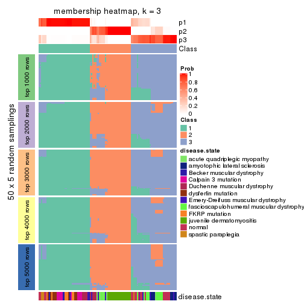</p>

</div>
<div id='tab-CV-kmeans-membership-heatmap-3'>
<pre><code class="r">membership_heatmap(res, k = 4)
</code></pre>

<p></p>

</div>
<div id='tab-CV-kmeans-membership-heatmap-4'>
<pre><code class="r">membership_heatmap(res, k = 5)
</code></pre>

<p></p>

</div>
<div id='tab-CV-kmeans-membership-heatmap-5'>
<pre><code class="r">membership_heatmap(res, k = 6)
</code></pre>

<p></p>

</div>
</div>

As soon as we have had the classes for columns, we can look for signatures
which are significantly different between classes which can be candidate marks
for certain classes. Following are the heatmaps for signatures.


Signature heatmaps where rows are scaled:


<script>
$( function() {
	$( '#tabs-CV-kmeans-get-signatures' ).tabs();
} );
</script>
<div id='tabs-CV-kmeans-get-signatures'>
<ul>
<li><a href='#tab-CV-kmeans-get-signatures-1'>k = 2</a></li>
<li><a href='#tab-CV-kmeans-get-signatures-2'>k = 3</a></li>
<li><a href='#tab-CV-kmeans-get-signatures-3'>k = 4</a></li>
<li><a href='#tab-CV-kmeans-get-signatures-4'>k = 5</a></li>
<li><a href='#tab-CV-kmeans-get-signatures-5'>k = 6</a></li>
</ul>
<div id='tab-CV-kmeans-get-signatures-1'>
<pre><code class="r">get_signatures(res, k = 2)
</code></pre>

<p></p>

</div>
<div id='tab-CV-kmeans-get-signatures-2'>
<pre><code class="r">get_signatures(res, k = 3)
</code></pre>

<p></p>

</div>
<div id='tab-CV-kmeans-get-signatures-3'>
<pre><code class="r">get_signatures(res, k = 4)
</code></pre>

<p></p>

</div>
<div id='tab-CV-kmeans-get-signatures-4'>
<pre><code class="r">get_signatures(res, k = 5)
</code></pre>

<p></p>

</div>
<div id='tab-CV-kmeans-get-signatures-5'>
<pre><code class="r">get_signatures(res, k = 6)
</code></pre>

<p></p>

</div>
</div>


Signature heatmaps where rows are not scaled:


<script>
$( function() {
	$( '#tabs-CV-kmeans-get-signatures-no-scale' ).tabs();
} );
</script>
<div id='tabs-CV-kmeans-get-signatures-no-scale'>
<ul>
<li><a href='#tab-CV-kmeans-get-signatures-no-scale-1'>k = 2</a></li>
<li><a href='#tab-CV-kmeans-get-signatures-no-scale-2'>k = 3</a></li>
<li><a href='#tab-CV-kmeans-get-signatures-no-scale-3'>k = 4</a></li>
<li><a href='#tab-CV-kmeans-get-signatures-no-scale-4'>k = 5</a></li>
<li><a href='#tab-CV-kmeans-get-signatures-no-scale-5'>k = 6</a></li>
</ul>
<div id='tab-CV-kmeans-get-signatures-no-scale-1'>
<pre><code class="r">get_signatures(res, k = 2, scale_rows = FALSE)
</code></pre>

<p></p>

</div>
<div id='tab-CV-kmeans-get-signatures-no-scale-2'>
<pre><code class="r">get_signatures(res, k = 3, scale_rows = FALSE)
</code></pre>

<p></p>

</div>
<div id='tab-CV-kmeans-get-signatures-no-scale-3'>
<pre><code class="r">get_signatures(res, k = 4, scale_rows = FALSE)
</code></pre>

<p></p>

</div>
<div id='tab-CV-kmeans-get-signatures-no-scale-4'>
<pre><code class="r">get_signatures(res, k = 5, scale_rows = FALSE)
</code></pre>

<p></p>

</div>
<div id='tab-CV-kmeans-get-signatures-no-scale-5'>
<pre><code class="r">get_signatures(res, k = 6, scale_rows = FALSE)
</code></pre>

<p></p>

</div>
</div>


Compare the overlap of signatures from different k:

```r
compare_signatures(res)
```


`get_signature()` returns a data frame invisibly. TO get the list of signatures, the function
call should be assigned to a variable explicitly. In following code, if `plot` argument is set
to `FALSE`, no heatmap is plotted while only the differential analysis is performed.

```r
# code only for demonstration
tb = get_signature(res, k = ..., plot = FALSE)
```

An example of the output of `tb` is:

```
#>   which_row         fdr    mean_1    mean_2 scaled_mean_1 scaled_mean_2 km
#> 1        38 0.042760348  8.373488  9.131774    -0.5533452     0.5164555  1
#> 2        40 0.018707592  7.106213  8.469186    -0.6173731     0.5762149  1
#> 3        55 0.019134737 10.221463 11.207825    -0.6159697     0.5749050  1
#> 4        59 0.006059896  5.921854  7.869574    -0.6899429     0.6439467  1
#> 5        60 0.018055526  8.928898 10.211722    -0.6204761     0.5791110  1
#> 6        98 0.009384629 15.714769 14.887706     0.6635654    -0.6193277  2
...
```

The columns in `tb` are:

1. `which_row`: row indices corresponding to the input matrix.
2. `fdr`: FDR for the differential test. 
3. `mean_x`: The mean value in group x.
4. `scaled_mean_x`: The mean value in group x after rows are scaled.
5. `km`: Row groups if k-means clustering is applied to rows.


UMAP plot which shows how samples are separated.


<script>
$( function() {
	$( '#tabs-CV-kmeans-dimension-reduction' ).tabs();
} );
</script>
<div id='tabs-CV-kmeans-dimension-reduction'>
<ul>
<li><a href='#tab-CV-kmeans-dimension-reduction-1'>k = 2</a></li>
<li><a href='#tab-CV-kmeans-dimension-reduction-2'>k = 3</a></li>
<li><a href='#tab-CV-kmeans-dimension-reduction-3'>k = 4</a></li>
<li><a href='#tab-CV-kmeans-dimension-reduction-4'>k = 5</a></li>
<li><a href='#tab-CV-kmeans-dimension-reduction-5'>k = 6</a></li>
</ul>
<div id='tab-CV-kmeans-dimension-reduction-1'>
<pre><code class="r">dimension_reduction(res, k = 2, method = &quot;UMAP&quot;)
</code></pre>

<p></p>

</div>
<div id='tab-CV-kmeans-dimension-reduction-2'>
<pre><code class="r">dimension_reduction(res, k = 3, method = &quot;UMAP&quot;)
</code></pre>

<p></p>

</div>
<div id='tab-CV-kmeans-dimension-reduction-3'>
<pre><code class="r">dimension_reduction(res, k = 4, method = &quot;UMAP&quot;)
</code></pre>

<p></p>

</div>
<div id='tab-CV-kmeans-dimension-reduction-4'>
<pre><code class="r">dimension_reduction(res, k = 5, method = &quot;UMAP&quot;)
</code></pre>

<p></p>

</div>
<div id='tab-CV-kmeans-dimension-reduction-5'>
<pre><code class="r">dimension_reduction(res, k = 6, method = &quot;UMAP&quot;)
</code></pre>

<p></p>

</div>
</div>


Following heatmap shows how subgroups are split when increasing `k`:

```r
collect_classes(res)
```


Test correlation between subgroups and known annotations. If the known
annotation is numeric, one-way ANOVA test is applied, and if the known
annotation is discrete, chi-squared contingency table test is applied.

```r
test_to_known_factors(res)
```

```
#>             n disease.state(p) k
#> CV:kmeans 119         4.11e-11 2
#> CV:kmeans 118         4.50e-24 3
#> CV:kmeans 106         1.87e-32 4
#> CV:kmeans  87         1.90e-28 5
#> CV:kmeans  93         5.65e-30 6
```


If matrix rows can be associated to genes, consider to use `GO_Enrichment(res,
...)` to perform function enrichment for the signature genes.


 

---------------------------------------------------


### CV:skmeans*


The object with results only for a single top-value method and a single partition method 
can be extracted as:

```r
res = res_list["CV", "skmeans"]
# you can also extract it by
# res = res_list["CV:skmeans"]
```

A summary of `res` and all the functions that can be applied to it:

```r
res
```

```
#> A 'ConsensusPartition' object with k = 2, 3, 4, 5, 6.
#>   On a matrix with 21168 rows and 121 columns.
#>   Top rows (1000, 2000, 3000, 4000, 5000) are extracted by 'CV' method.
#>   Subgroups are detected by 'skmeans' method.
#>   Performed in total 1250 partitions by row resampling.
#>   Best k for subgroups seems to be 3.
#> 
#> Following methods can be applied to this 'ConsensusPartition' object:
#>  [1] "cola_report"             "collect_classes"         "collect_plots"          
#>  [4] "collect_stats"           "colnames"                "compare_signatures"     
#>  [7] "consensus_heatmap"       "dimension_reduction"     "functional_enrichment"  
#> [10] "get_anno_col"            "get_anno"                "get_classes"            
#> [13] "get_consensus"           "get_matrix"              "get_membership"         
#> [16] "get_param"               "get_signatures"          "get_stats"              
#> [19] "is_best_k"               "is_stable_k"             "membership_heatmap"     
#> [22] "ncol"                    "nrow"                    "plot_ecdf"              
#> [25] "rownames"                "select_partition_number" "show"                   
#> [28] "suggest_best_k"          "test_to_known_factors"
```

`collect_plots()` function collects all the plots made from `res` for all `k` (number of partitions)
into one single page to provide an easy and fast comparison between different `k`.

```r
collect_plots(res)
```


The plots are:

- The first row: a plot of the ECDF (Empirical cumulative distribution
  function) curves of the consensus matrix for each `k` and the heatmap of
  predicted classes for each `k`.
- The second row: heatmaps of the consensus matrix for each `k`.
- The third row: heatmaps of the membership matrix for each `k`.
- The fouth row: heatmaps of the signatures for each `k`.

All the plots in panels can be made by individual functions and they are
plotted later in this section.

`select_partition_number()` produces several plots showing different
statistics for choosing "optimized" `k`. There are following statistics:

- ECDF curves of the consensus matrix for each `k`;
- 1-PAC. [The PAC
  score](https://en.wikipedia.org/wiki/Consensus_clustering#Over-interpretation_potential_of_consensus_clustering)
  measures the proportion of the ambiguous subgrouping.
- Mean silhouette score.
- Concordance. The mean probability of fiting the consensus class ids in all
  partitions.
- Area increased. Denote $A_k$ as the area under the ECDF curve for current
  `k`, the area increased is defined as $A_k - A_{k-1}$.
- Rand index. The percent of pairs of samples that are both in a same cluster
  or both are not in a same cluster in the partition of k and k-1.
- Jaccard index. The ratio of pairs of samples are both in a same cluster in
  the partition of k and k-1 and the pairs of samples are both in a same
  cluster in the partition k or k-1.

The detailed explanations of these statistics can be found in [the cola
vignette](http://bioconductor.org/packages/devel/bioc/vignettes/cola/inst/doc/cola.html#toc_13).

Generally speaking, lower PAC score, higher mean silhouette score or higher
concordance corresponds to better partition. Rand index and Jaccard index
measure how similar the current partition is compared to partition with `k-1`.
If they are too similar, we won't accept `k` is better than `k-1`.

```r
select_partition_number(res)
```


The numeric values for all these statistics can be obtained by `get_stats()`.

```r
get_stats(res)
```

```
#>   k 1-PAC mean_silhouette concordance area_increased  Rand Jaccard
#> 2 2 1.000           0.983       0.993         0.5033 0.497   0.497
#> 3 3 0.917           0.895       0.953         0.3157 0.770   0.569
#> 4 4 0.858           0.846       0.931         0.1335 0.817   0.524
#> 5 5 0.762           0.721       0.853         0.0463 0.951   0.806
#> 6 6 0.753           0.594       0.764         0.0407 0.884   0.543
```

`suggest_best_k()` suggests the best $k$ based on these statistics. The rules are as follows:

- All $k$ with Jaccard index larger than 0.95 are removed because the increase of
  the partition number does not provides enough extra information. If all $k$ are removed,
  the best $k$ is assigned by `NA`.
- For $k$ with 1-PAC larger than 0.9, the maximal $k$ is taken as the "best k". Other $k$ is called "optional k".
- If it does not fit the second rule. The $k$ with the highest vote of highest
  1-PAC, mean silhouette and concordance is taken as the "best k".

```r
suggest_best_k(res)
```

```
#> [1] 3
#> attr(,"optional")
#> [1] 2
```

There is also optional best $k$ = 2 that is worth to check.

Following shows the table of the partitions (You need to click the **show/hide
code output** link to see it). The membership matrix (columns with name `p*`)
is inferred by
[`clue::cl_consensus()`](https://www.rdocumentation.org/link/cl_consensus?package=clue)
function with the `SE` method. Basically the value in the membership matrix
represents the probability to belong to a certain group. The finall class
label for an item is determined with the group with highest probability it
belongs to.

In `get_classes()` function, the entropy is calculated from the membership
matrix and the silhouette score is calculated from the consensus matrix.


<script>
$( function() {
	$( '#tabs-CV-skmeans-get-classes' ).tabs();
} );
</script>
<div id='tabs-CV-skmeans-get-classes'>
<ul>
<li><a href='#tab-CV-skmeans-get-classes-1'>k = 2</a></li>
<li><a href='#tab-CV-skmeans-get-classes-2'>k = 3</a></li>
<li><a href='#tab-CV-skmeans-get-classes-3'>k = 4</a></li>
<li><a href='#tab-CV-skmeans-get-classes-4'>k = 5</a></li>
<li><a href='#tab-CV-skmeans-get-classes-5'>k = 6</a></li>
</ul>

<div id='tab-CV-skmeans-get-classes-1'>
<p><a id='tab-CV-skmeans-get-classes-1-a' style='color:#0366d6' href='#'>show/hide code output</a></p>
<pre><code class="r">cbind(get_classes(res, k = 2), get_membership(res, k = 2))
</code></pre>

<pre><code>#&gt;           class entropy silhouette    p1    p2
#&gt; GSM74356      2  0.0000      0.988 0.000 1.000
#&gt; GSM74357      2  0.0000      0.988 0.000 1.000
#&gt; GSM74358      2  0.0000      0.988 0.000 1.000
#&gt; GSM74359      1  0.0000      0.997 1.000 0.000
#&gt; GSM74360      1  0.0000      0.997 1.000 0.000
#&gt; GSM74361      2  0.0000      0.988 0.000 1.000
#&gt; GSM74362      2  0.0000      0.988 0.000 1.000
#&gt; GSM74363      2  0.0000      0.988 0.000 1.000
#&gt; GSM74402      1  0.0000      0.997 1.000 0.000
#&gt; GSM74403      1  0.0000      0.997 1.000 0.000
#&gt; GSM74404      1  0.0000      0.997 1.000 0.000
#&gt; GSM74406      1  0.0000      0.997 1.000 0.000
#&gt; GSM74407      1  0.0000      0.997 1.000 0.000
#&gt; GSM74408      1  0.0000      0.997 1.000 0.000
#&gt; GSM74409      1  0.0000      0.997 1.000 0.000
#&gt; GSM74410      1  0.0000      0.997 1.000 0.000
#&gt; GSM119936     1  0.0000      0.997 1.000 0.000
#&gt; GSM119937     1  0.0000      0.997 1.000 0.000
#&gt; GSM74411      2  0.0000      0.988 0.000 1.000
#&gt; GSM74412      2  0.0000      0.988 0.000 1.000
#&gt; GSM74413      2  0.0000      0.988 0.000 1.000
#&gt; GSM74414      2  0.0000      0.988 0.000 1.000
#&gt; GSM74415      2  0.0000      0.988 0.000 1.000
#&gt; GSM121379     2  0.0000      0.988 0.000 1.000
#&gt; GSM121380     2  0.0000      0.988 0.000 1.000
#&gt; GSM121381     2  0.0000      0.988 0.000 1.000
#&gt; GSM121382     2  0.0000      0.988 0.000 1.000
#&gt; GSM121383     2  0.0000      0.988 0.000 1.000
#&gt; GSM121384     2  0.0000      0.988 0.000 1.000
#&gt; GSM121385     2  0.0000      0.988 0.000 1.000
#&gt; GSM121386     2  0.0000      0.988 0.000 1.000
#&gt; GSM121387     2  0.0000      0.988 0.000 1.000
#&gt; GSM121388     2  0.0000      0.988 0.000 1.000
#&gt; GSM121389     2  0.0000      0.988 0.000 1.000
#&gt; GSM121390     2  0.0000      0.988 0.000 1.000
#&gt; GSM121391     2  0.0000      0.988 0.000 1.000
#&gt; GSM121392     2  0.0000      0.988 0.000 1.000
#&gt; GSM121393     2  0.0000      0.988 0.000 1.000
#&gt; GSM121394     2  0.0000      0.988 0.000 1.000
#&gt; GSM121395     2  0.0000      0.988 0.000 1.000
#&gt; GSM121396     2  0.0000      0.988 0.000 1.000
#&gt; GSM121397     2  0.0000      0.988 0.000 1.000
#&gt; GSM121398     2  0.0000      0.988 0.000 1.000
#&gt; GSM121399     2  0.0000      0.988 0.000 1.000
#&gt; GSM74240      2  0.0000      0.988 0.000 1.000
#&gt; GSM74241      2  0.0000      0.988 0.000 1.000
#&gt; GSM74242      2  0.9209      0.500 0.336 0.664
#&gt; GSM74243      2  0.9286      0.482 0.344 0.656
#&gt; GSM74244      2  0.0000      0.988 0.000 1.000
#&gt; GSM74245      2  0.0000      0.988 0.000 1.000
#&gt; GSM74246      2  0.0000      0.988 0.000 1.000
#&gt; GSM74247      2  0.0000      0.988 0.000 1.000
#&gt; GSM74248      2  0.0376      0.984 0.004 0.996
#&gt; GSM74416      1  0.0000      0.997 1.000 0.000
#&gt; GSM74417      1  0.0000      0.997 1.000 0.000
#&gt; GSM74418      1  0.0000      0.997 1.000 0.000
#&gt; GSM74419      1  0.0000      0.997 1.000 0.000
#&gt; GSM121358     2  0.0000      0.988 0.000 1.000
#&gt; GSM121359     2  0.0000      0.988 0.000 1.000
#&gt; GSM121360     1  0.0000      0.997 1.000 0.000
#&gt; GSM121362     1  0.0000      0.997 1.000 0.000
#&gt; GSM121364     1  0.0000      0.997 1.000 0.000
#&gt; GSM121365     2  0.0000      0.988 0.000 1.000
#&gt; GSM121366     2  0.0000      0.988 0.000 1.000
#&gt; GSM121367     2  0.0000      0.988 0.000 1.000
#&gt; GSM121370     2  0.0000      0.988 0.000 1.000
#&gt; GSM121371     2  0.0000      0.988 0.000 1.000
#&gt; GSM121372     2  0.0000      0.988 0.000 1.000
#&gt; GSM121373     1  0.0000      0.997 1.000 0.000
#&gt; GSM121374     1  0.0000      0.997 1.000 0.000
#&gt; GSM121407     2  0.0000      0.988 0.000 1.000
#&gt; GSM74387      2  0.0000      0.988 0.000 1.000
#&gt; GSM74388      2  0.0000      0.988 0.000 1.000
#&gt; GSM74389      1  0.2043      0.966 0.968 0.032
#&gt; GSM74390      1  0.0000      0.997 1.000 0.000
#&gt; GSM74391      1  0.0000      0.997 1.000 0.000
#&gt; GSM74392      1  0.0000      0.997 1.000 0.000
#&gt; GSM74393      1  0.5294      0.862 0.880 0.120
#&gt; GSM74394      2  0.0000      0.988 0.000 1.000
#&gt; GSM74239      1  0.0000      0.997 1.000 0.000
#&gt; GSM74364      1  0.0000      0.997 1.000 0.000
#&gt; GSM74365      1  0.0000      0.997 1.000 0.000
#&gt; GSM74366      1  0.0000      0.997 1.000 0.000
#&gt; GSM74367      1  0.0000      0.997 1.000 0.000
#&gt; GSM74377      1  0.0000      0.997 1.000 0.000
#&gt; GSM74378      1  0.0000      0.997 1.000 0.000
#&gt; GSM74379      1  0.0000      0.997 1.000 0.000
#&gt; GSM74380      1  0.0000      0.997 1.000 0.000
#&gt; GSM74381      1  0.0000      0.997 1.000 0.000
#&gt; GSM121357     2  0.0000      0.988 0.000 1.000
#&gt; GSM121361     2  0.0000      0.988 0.000 1.000
#&gt; GSM121363     2  0.0000      0.988 0.000 1.000
#&gt; GSM121368     2  0.0000      0.988 0.000 1.000
#&gt; GSM121369     2  0.0000      0.988 0.000 1.000
#&gt; GSM74368      1  0.0000      0.997 1.000 0.000
#&gt; GSM74369      1  0.0000      0.997 1.000 0.000
#&gt; GSM74370      1  0.0000      0.997 1.000 0.000
#&gt; GSM74371      1  0.0000      0.997 1.000 0.000
#&gt; GSM74372      1  0.0000      0.997 1.000 0.000
#&gt; GSM74373      1  0.0000      0.997 1.000 0.000
#&gt; GSM74374      1  0.0000      0.997 1.000 0.000
#&gt; GSM74375      1  0.0000      0.997 1.000 0.000
#&gt; GSM74376      1  0.0000      0.997 1.000 0.000
#&gt; GSM74405      1  0.0000      0.997 1.000 0.000
#&gt; GSM74351      1  0.0000      0.997 1.000 0.000
#&gt; GSM74352      1  0.0000      0.997 1.000 0.000
#&gt; GSM74353      1  0.0000      0.997 1.000 0.000
#&gt; GSM74354      1  0.0000      0.997 1.000 0.000
#&gt; GSM74355      1  0.0000      0.997 1.000 0.000
#&gt; GSM74382      1  0.0000      0.997 1.000 0.000
#&gt; GSM74383      1  0.0000      0.997 1.000 0.000
#&gt; GSM74384      1  0.2603      0.953 0.956 0.044
#&gt; GSM74385      1  0.0000      0.997 1.000 0.000
#&gt; GSM74386      1  0.0000      0.997 1.000 0.000
#&gt; GSM74395      1  0.0000      0.997 1.000 0.000
#&gt; GSM74396      1  0.0000      0.997 1.000 0.000
#&gt; GSM74397      1  0.0000      0.997 1.000 0.000
#&gt; GSM74398      1  0.0000      0.997 1.000 0.000
#&gt; GSM74399      1  0.0000      0.997 1.000 0.000
#&gt; GSM74400      1  0.0000      0.997 1.000 0.000
#&gt; GSM74401      1  0.0000      0.997 1.000 0.000
</code></pre>

<script>
$('#tab-CV-skmeans-get-classes-1-a').parent().next().next().hide();
$('#tab-CV-skmeans-get-classes-1-a').click(function(){
  $('#tab-CV-skmeans-get-classes-1-a').parent().next().next().toggle();
  return(false);
});
</script>
</div>

<div id='tab-CV-skmeans-get-classes-2'>
<p><a id='tab-CV-skmeans-get-classes-2-a' style='color:#0366d6' href='#'>show/hide code output</a></p>
<pre><code class="r">cbind(get_classes(res, k = 3), get_membership(res, k = 3))
</code></pre>

<pre><code>#&gt;           class entropy silhouette    p1    p2    p3
#&gt; GSM74356      3  0.0000     0.9272 0.000 0.000 1.000
#&gt; GSM74357      3  0.0000     0.9272 0.000 0.000 1.000
#&gt; GSM74358      3  0.0000     0.9272 0.000 0.000 1.000
#&gt; GSM74359      3  0.2066     0.9050 0.060 0.000 0.940
#&gt; GSM74360      3  0.2537     0.8912 0.080 0.000 0.920
#&gt; GSM74361      3  0.0000     0.9272 0.000 0.000 1.000
#&gt; GSM74362      3  0.0000     0.9272 0.000 0.000 1.000
#&gt; GSM74363      3  0.0237     0.9264 0.000 0.004 0.996
#&gt; GSM74402      1  0.3482     0.8164 0.872 0.000 0.128
#&gt; GSM74403      1  0.0000     0.9346 1.000 0.000 0.000
#&gt; GSM74404      1  0.0000     0.9346 1.000 0.000 0.000
#&gt; GSM74406      1  0.6026     0.4254 0.624 0.000 0.376
#&gt; GSM74407      1  0.2878     0.8518 0.904 0.000 0.096
#&gt; GSM74408      1  0.6308     0.0734 0.508 0.000 0.492
#&gt; GSM74409      3  0.5678     0.5196 0.316 0.000 0.684
#&gt; GSM74410      3  0.2711     0.8839 0.088 0.000 0.912
#&gt; GSM119936     1  0.5835     0.5004 0.660 0.000 0.340
#&gt; GSM119937     1  0.5835     0.5000 0.660 0.000 0.340
#&gt; GSM74411      2  0.2356     0.9349 0.000 0.928 0.072
#&gt; GSM74412      2  0.1031     0.9725 0.000 0.976 0.024
#&gt; GSM74413      2  0.2356     0.9349 0.000 0.928 0.072
#&gt; GSM74414      2  0.0000     0.9883 0.000 1.000 0.000
#&gt; GSM74415      3  0.6280     0.1485 0.000 0.460 0.540
#&gt; GSM121379     2  0.0000     0.9883 0.000 1.000 0.000
#&gt; GSM121380     2  0.0000     0.9883 0.000 1.000 0.000
#&gt; GSM121381     2  0.0000     0.9883 0.000 1.000 0.000
#&gt; GSM121382     2  0.0000     0.9883 0.000 1.000 0.000
#&gt; GSM121383     2  0.0000     0.9883 0.000 1.000 0.000
#&gt; GSM121384     2  0.0000     0.9883 0.000 1.000 0.000
#&gt; GSM121385     2  0.0000     0.9883 0.000 1.000 0.000
#&gt; GSM121386     2  0.0000     0.9883 0.000 1.000 0.000
#&gt; GSM121387     2  0.0000     0.9883 0.000 1.000 0.000
#&gt; GSM121388     2  0.0000     0.9883 0.000 1.000 0.000
#&gt; GSM121389     2  0.0000     0.9883 0.000 1.000 0.000
#&gt; GSM121390     2  0.0000     0.9883 0.000 1.000 0.000
#&gt; GSM121391     2  0.0000     0.9883 0.000 1.000 0.000
#&gt; GSM121392     2  0.0000     0.9883 0.000 1.000 0.000
#&gt; GSM121393     2  0.0000     0.9883 0.000 1.000 0.000
#&gt; GSM121394     2  0.0000     0.9883 0.000 1.000 0.000
#&gt; GSM121395     2  0.0000     0.9883 0.000 1.000 0.000
#&gt; GSM121396     2  0.0000     0.9883 0.000 1.000 0.000
#&gt; GSM121397     2  0.0000     0.9883 0.000 1.000 0.000
#&gt; GSM121398     2  0.0000     0.9883 0.000 1.000 0.000
#&gt; GSM121399     2  0.0000     0.9883 0.000 1.000 0.000
#&gt; GSM74240      3  0.0000     0.9272 0.000 0.000 1.000
#&gt; GSM74241      3  0.0424     0.9253 0.000 0.008 0.992
#&gt; GSM74242      3  0.0000     0.9272 0.000 0.000 1.000
#&gt; GSM74243      3  0.0000     0.9272 0.000 0.000 1.000
#&gt; GSM74244      3  0.0000     0.9272 0.000 0.000 1.000
#&gt; GSM74245      3  0.0000     0.9272 0.000 0.000 1.000
#&gt; GSM74246      3  0.0592     0.9241 0.000 0.012 0.988
#&gt; GSM74247      3  0.1163     0.9172 0.000 0.028 0.972
#&gt; GSM74248      3  0.0000     0.9272 0.000 0.000 1.000
#&gt; GSM74416      1  0.0000     0.9346 1.000 0.000 0.000
#&gt; GSM74417      1  0.0424     0.9292 0.992 0.000 0.008
#&gt; GSM74418      1  0.0000     0.9346 1.000 0.000 0.000
#&gt; GSM74419      1  0.5988     0.4403 0.632 0.000 0.368
#&gt; GSM121358     3  0.2711     0.8805 0.000 0.088 0.912
#&gt; GSM121359     2  0.2165     0.9422 0.000 0.936 0.064
#&gt; GSM121360     3  0.2356     0.8975 0.072 0.000 0.928
#&gt; GSM121362     3  0.5016     0.6941 0.240 0.000 0.760
#&gt; GSM121364     3  0.2356     0.8975 0.072 0.000 0.928
#&gt; GSM121365     3  0.2711     0.8805 0.000 0.088 0.912
#&gt; GSM121366     3  0.3038     0.8656 0.000 0.104 0.896
#&gt; GSM121367     3  0.2625     0.8835 0.000 0.084 0.916
#&gt; GSM121370     3  0.2796     0.8769 0.000 0.092 0.908
#&gt; GSM121371     3  0.2711     0.8805 0.000 0.088 0.912
#&gt; GSM121372     2  0.2261     0.9387 0.000 0.932 0.068
#&gt; GSM121373     3  0.2356     0.8975 0.072 0.000 0.928
#&gt; GSM121374     3  0.2356     0.8975 0.072 0.000 0.928
#&gt; GSM121407     2  0.1860     0.9518 0.000 0.948 0.052
#&gt; GSM74387      2  0.2066     0.9456 0.000 0.940 0.060
#&gt; GSM74388      2  0.0000     0.9883 0.000 1.000 0.000
#&gt; GSM74389      3  0.1289     0.9181 0.032 0.000 0.968
#&gt; GSM74390      1  0.0000     0.9346 1.000 0.000 0.000
#&gt; GSM74391      1  0.6307     0.0883 0.512 0.000 0.488
#&gt; GSM74392      3  0.2066     0.9050 0.060 0.000 0.940
#&gt; GSM74393      3  0.0000     0.9272 0.000 0.000 1.000
#&gt; GSM74394      2  0.0000     0.9883 0.000 1.000 0.000
#&gt; GSM74239      1  0.0000     0.9346 1.000 0.000 0.000
#&gt; GSM74364      1  0.0000     0.9346 1.000 0.000 0.000
#&gt; GSM74365      1  0.0000     0.9346 1.000 0.000 0.000
#&gt; GSM74366      1  0.2356     0.8714 0.928 0.072 0.000
#&gt; GSM74367      1  0.0000     0.9346 1.000 0.000 0.000
#&gt; GSM74377      1  0.0000     0.9346 1.000 0.000 0.000
#&gt; GSM74378      1  0.0747     0.9218 0.984 0.016 0.000
#&gt; GSM74379      1  0.0000     0.9346 1.000 0.000 0.000
#&gt; GSM74380      1  0.0000     0.9346 1.000 0.000 0.000
#&gt; GSM74381      1  0.0000     0.9346 1.000 0.000 0.000
#&gt; GSM121357     2  0.0000     0.9883 0.000 1.000 0.000
#&gt; GSM121361     2  0.0000     0.9883 0.000 1.000 0.000
#&gt; GSM121363     2  0.0000     0.9883 0.000 1.000 0.000
#&gt; GSM121368     2  0.0000     0.9883 0.000 1.000 0.000
#&gt; GSM121369     2  0.0000     0.9883 0.000 1.000 0.000
#&gt; GSM74368      1  0.0000     0.9346 1.000 0.000 0.000
#&gt; GSM74369      1  0.0000     0.9346 1.000 0.000 0.000
#&gt; GSM74370      1  0.0000     0.9346 1.000 0.000 0.000
#&gt; GSM74371      1  0.0000     0.9346 1.000 0.000 0.000
#&gt; GSM74372      1  0.0000     0.9346 1.000 0.000 0.000
#&gt; GSM74373      1  0.0000     0.9346 1.000 0.000 0.000
#&gt; GSM74374      1  0.0000     0.9346 1.000 0.000 0.000
#&gt; GSM74375      1  0.0000     0.9346 1.000 0.000 0.000
#&gt; GSM74376      1  0.0000     0.9346 1.000 0.000 0.000
#&gt; GSM74405      1  0.0000     0.9346 1.000 0.000 0.000
#&gt; GSM74351      1  0.0000     0.9346 1.000 0.000 0.000
#&gt; GSM74352      1  0.1753     0.8936 0.952 0.048 0.000
#&gt; GSM74353      1  0.0000     0.9346 1.000 0.000 0.000
#&gt; GSM74354      1  0.0000     0.9346 1.000 0.000 0.000
#&gt; GSM74355      1  0.0000     0.9346 1.000 0.000 0.000
#&gt; GSM74382      1  0.0000     0.9346 1.000 0.000 0.000
#&gt; GSM74383      1  0.0000     0.9346 1.000 0.000 0.000
#&gt; GSM74384      1  0.5138     0.6503 0.748 0.252 0.000
#&gt; GSM74385      1  0.0000     0.9346 1.000 0.000 0.000
#&gt; GSM74386      1  0.0000     0.9346 1.000 0.000 0.000
#&gt; GSM74395      1  0.0000     0.9346 1.000 0.000 0.000
#&gt; GSM74396      1  0.0000     0.9346 1.000 0.000 0.000
#&gt; GSM74397      1  0.0000     0.9346 1.000 0.000 0.000
#&gt; GSM74398      1  0.0000     0.9346 1.000 0.000 0.000
#&gt; GSM74399      1  0.0000     0.9346 1.000 0.000 0.000
#&gt; GSM74400      1  0.0000     0.9346 1.000 0.000 0.000
#&gt; GSM74401      1  0.0000     0.9346 1.000 0.000 0.000
</code></pre>

<script>
$('#tab-CV-skmeans-get-classes-2-a').parent().next().next().hide();
$('#tab-CV-skmeans-get-classes-2-a').click(function(){
  $('#tab-CV-skmeans-get-classes-2-a').parent().next().next().toggle();
  return(false);
});
</script>
</div>

<div id='tab-CV-skmeans-get-classes-3'>
<p><a id='tab-CV-skmeans-get-classes-3-a' style='color:#0366d6' href='#'>show/hide code output</a></p>
<pre><code class="r">cbind(get_classes(res, k = 4), get_membership(res, k = 4))
</code></pre>

<pre><code>#&gt;           class entropy silhouette    p1    p2    p3    p4
#&gt; GSM74356      3  0.0524     0.9018 0.000 0.004 0.988 0.008
#&gt; GSM74357      3  0.0469     0.9004 0.000 0.000 0.988 0.012
#&gt; GSM74358      3  0.0469     0.9004 0.000 0.000 0.988 0.012
#&gt; GSM74359      4  0.0469     0.8943 0.000 0.000 0.012 0.988
#&gt; GSM74360      4  0.0336     0.8952 0.000 0.000 0.008 0.992
#&gt; GSM74361      3  0.0336     0.9014 0.000 0.000 0.992 0.008
#&gt; GSM74362      3  0.3801     0.6742 0.000 0.000 0.780 0.220
#&gt; GSM74363      3  0.0524     0.9018 0.000 0.004 0.988 0.008
#&gt; GSM74402      4  0.1022     0.8843 0.032 0.000 0.000 0.968
#&gt; GSM74403      4  0.0921     0.8869 0.028 0.000 0.000 0.972
#&gt; GSM74404      4  0.0592     0.8945 0.016 0.000 0.000 0.984
#&gt; GSM74406      4  0.0336     0.8973 0.008 0.000 0.000 0.992
#&gt; GSM74407      4  0.0469     0.8962 0.012 0.000 0.000 0.988
#&gt; GSM74408      4  0.0336     0.8973 0.008 0.000 0.000 0.992
#&gt; GSM74409      4  0.0188     0.8972 0.004 0.000 0.000 0.996
#&gt; GSM74410      4  0.0000     0.8965 0.000 0.000 0.000 1.000
#&gt; GSM119936     4  0.0336     0.8973 0.008 0.000 0.000 0.992
#&gt; GSM119937     4  0.0336     0.8973 0.008 0.000 0.000 0.992
#&gt; GSM74411      3  0.4222     0.6541 0.000 0.272 0.728 0.000
#&gt; GSM74412      2  0.4382     0.5279 0.000 0.704 0.296 0.000
#&gt; GSM74413      3  0.4382     0.6166 0.000 0.296 0.704 0.000
#&gt; GSM74414      2  0.0188     0.9774 0.000 0.996 0.004 0.000
#&gt; GSM74415      3  0.0817     0.8957 0.000 0.024 0.976 0.000
#&gt; GSM121379     2  0.0000     0.9801 0.000 1.000 0.000 0.000
#&gt; GSM121380     2  0.0000     0.9801 0.000 1.000 0.000 0.000
#&gt; GSM121381     2  0.0000     0.9801 0.000 1.000 0.000 0.000
#&gt; GSM121382     2  0.0000     0.9801 0.000 1.000 0.000 0.000
#&gt; GSM121383     2  0.0000     0.9801 0.000 1.000 0.000 0.000
#&gt; GSM121384     2  0.0000     0.9801 0.000 1.000 0.000 0.000
#&gt; GSM121385     2  0.0000     0.9801 0.000 1.000 0.000 0.000
#&gt; GSM121386     2  0.0000     0.9801 0.000 1.000 0.000 0.000
#&gt; GSM121387     2  0.0000     0.9801 0.000 1.000 0.000 0.000
#&gt; GSM121388     2  0.0000     0.9801 0.000 1.000 0.000 0.000
#&gt; GSM121389     2  0.0000     0.9801 0.000 1.000 0.000 0.000
#&gt; GSM121390     2  0.0000     0.9801 0.000 1.000 0.000 0.000
#&gt; GSM121391     2  0.0000     0.9801 0.000 1.000 0.000 0.000
#&gt; GSM121392     2  0.0000     0.9801 0.000 1.000 0.000 0.000
#&gt; GSM121393     2  0.0000     0.9801 0.000 1.000 0.000 0.000
#&gt; GSM121394     2  0.0000     0.9801 0.000 1.000 0.000 0.000
#&gt; GSM121395     2  0.0000     0.9801 0.000 1.000 0.000 0.000
#&gt; GSM121396     2  0.0000     0.9801 0.000 1.000 0.000 0.000
#&gt; GSM121397     2  0.0000     0.9801 0.000 1.000 0.000 0.000
#&gt; GSM121398     2  0.0000     0.9801 0.000 1.000 0.000 0.000
#&gt; GSM121399     2  0.0000     0.9801 0.000 1.000 0.000 0.000
#&gt; GSM74240      3  0.0336     0.9019 0.000 0.000 0.992 0.008
#&gt; GSM74241      3  0.0336     0.9019 0.000 0.000 0.992 0.008
#&gt; GSM74242      3  0.0469     0.9010 0.000 0.000 0.988 0.012
#&gt; GSM74243      3  0.0921     0.8919 0.000 0.000 0.972 0.028
#&gt; GSM74244      3  0.0336     0.9019 0.000 0.000 0.992 0.008
#&gt; GSM74245      3  0.0336     0.9019 0.000 0.000 0.992 0.008
#&gt; GSM74246      3  0.0336     0.9019 0.000 0.000 0.992 0.008
#&gt; GSM74247      3  0.0336     0.9019 0.000 0.000 0.992 0.008
#&gt; GSM74248      3  0.0336     0.9019 0.000 0.000 0.992 0.008
#&gt; GSM74416      4  0.0707     0.8923 0.020 0.000 0.000 0.980
#&gt; GSM74417      4  0.0469     0.8962 0.012 0.000 0.000 0.988
#&gt; GSM74418      4  0.1022     0.8840 0.032 0.000 0.000 0.968
#&gt; GSM74419      4  0.0336     0.8973 0.008 0.000 0.000 0.992
#&gt; GSM121358     3  0.0592     0.9018 0.000 0.016 0.984 0.000
#&gt; GSM121359     3  0.3801     0.7300 0.000 0.220 0.780 0.000
#&gt; GSM121360     4  0.0469     0.8943 0.000 0.000 0.012 0.988
#&gt; GSM121362     4  0.0937     0.8919 0.012 0.000 0.012 0.976
#&gt; GSM121364     4  0.0469     0.8943 0.000 0.000 0.012 0.988
#&gt; GSM121365     3  0.0469     0.9021 0.000 0.012 0.988 0.000
#&gt; GSM121366     3  0.0707     0.9005 0.000 0.020 0.980 0.000
#&gt; GSM121367     3  0.0592     0.9018 0.000 0.016 0.984 0.000
#&gt; GSM121370     3  0.0707     0.9005 0.000 0.020 0.980 0.000
#&gt; GSM121371     3  0.0592     0.9018 0.000 0.016 0.984 0.000
#&gt; GSM121372     3  0.3649     0.7488 0.000 0.204 0.796 0.000
#&gt; GSM121373     4  0.0469     0.8943 0.000 0.000 0.012 0.988
#&gt; GSM121374     4  0.0469     0.8943 0.000 0.000 0.012 0.988
#&gt; GSM121407     3  0.4998     0.1572 0.000 0.488 0.512 0.000
#&gt; GSM74387      3  0.5000     0.0879 0.000 0.500 0.500 0.000
#&gt; GSM74388      2  0.1452     0.9534 0.036 0.956 0.008 0.000
#&gt; GSM74389      4  0.4103     0.6139 0.000 0.000 0.256 0.744
#&gt; GSM74390      1  0.1211     0.9034 0.960 0.000 0.000 0.040
#&gt; GSM74391      4  0.0000     0.8965 0.000 0.000 0.000 1.000
#&gt; GSM74392      4  0.0592     0.8920 0.000 0.000 0.016 0.984
#&gt; GSM74393      4  0.4933     0.2212 0.000 0.000 0.432 0.568
#&gt; GSM74394      2  0.1767     0.9441 0.044 0.944 0.012 0.000
#&gt; GSM74239      1  0.3123     0.8457 0.844 0.000 0.000 0.156
#&gt; GSM74364      1  0.3024     0.8520 0.852 0.000 0.000 0.148
#&gt; GSM74365      1  0.0469     0.9102 0.988 0.000 0.000 0.012
#&gt; GSM74366      1  0.0000     0.9116 1.000 0.000 0.000 0.000
#&gt; GSM74367      1  0.1716     0.8988 0.936 0.000 0.000 0.064
#&gt; GSM74377      1  0.0000     0.9116 1.000 0.000 0.000 0.000
#&gt; GSM74378      1  0.0000     0.9116 1.000 0.000 0.000 0.000
#&gt; GSM74379      1  0.0000     0.9116 1.000 0.000 0.000 0.000
#&gt; GSM74380      1  0.0000     0.9116 1.000 0.000 0.000 0.000
#&gt; GSM74381      1  0.0000     0.9116 1.000 0.000 0.000 0.000
#&gt; GSM121357     2  0.0000     0.9801 0.000 1.000 0.000 0.000
#&gt; GSM121361     2  0.1356     0.9565 0.032 0.960 0.008 0.000
#&gt; GSM121363     2  0.1256     0.9592 0.028 0.964 0.008 0.000
#&gt; GSM121368     2  0.1256     0.9592 0.028 0.964 0.008 0.000
#&gt; GSM121369     2  0.1510     0.9551 0.028 0.956 0.016 0.000
#&gt; GSM74368      1  0.3764     0.7783 0.784 0.000 0.000 0.216
#&gt; GSM74369      1  0.3123     0.8455 0.844 0.000 0.000 0.156
#&gt; GSM74370      1  0.4643     0.5671 0.656 0.000 0.000 0.344
#&gt; GSM74371      1  0.3942     0.7611 0.764 0.000 0.000 0.236
#&gt; GSM74372      4  0.5000    -0.1271 0.500 0.000 0.000 0.500
#&gt; GSM74373      1  0.0000     0.9116 1.000 0.000 0.000 0.000
#&gt; GSM74374      1  0.1637     0.9007 0.940 0.000 0.000 0.060
#&gt; GSM74375      1  0.0000     0.9116 1.000 0.000 0.000 0.000
#&gt; GSM74376      1  0.0000     0.9116 1.000 0.000 0.000 0.000
#&gt; GSM74405      1  0.0000     0.9116 1.000 0.000 0.000 0.000
#&gt; GSM74351      4  0.4999    -0.1401 0.492 0.000 0.000 0.508
#&gt; GSM74352      1  0.0000     0.9116 1.000 0.000 0.000 0.000
#&gt; GSM74353      1  0.4164     0.7241 0.736 0.000 0.000 0.264
#&gt; GSM74354      1  0.1867     0.8967 0.928 0.000 0.000 0.072
#&gt; GSM74355      1  0.0000     0.9116 1.000 0.000 0.000 0.000
#&gt; GSM74382      4  0.5000    -0.1654 0.500 0.000 0.000 0.500
#&gt; GSM74383      1  0.2011     0.8929 0.920 0.000 0.000 0.080
#&gt; GSM74384      1  0.0469     0.9039 0.988 0.012 0.000 0.000
#&gt; GSM74385      1  0.3942     0.7624 0.764 0.000 0.000 0.236
#&gt; GSM74386      1  0.2589     0.8747 0.884 0.000 0.000 0.116
#&gt; GSM74395      1  0.3528     0.8133 0.808 0.000 0.000 0.192
#&gt; GSM74396      1  0.1867     0.8964 0.928 0.000 0.000 0.072
#&gt; GSM74397      1  0.4830     0.4405 0.608 0.000 0.000 0.392
#&gt; GSM74398      1  0.0000     0.9116 1.000 0.000 0.000 0.000
#&gt; GSM74399      1  0.0000     0.9116 1.000 0.000 0.000 0.000
#&gt; GSM74400      1  0.0000     0.9116 1.000 0.000 0.000 0.000
#&gt; GSM74401      1  0.0000     0.9116 1.000 0.000 0.000 0.000
</code></pre>

<script>
$('#tab-CV-skmeans-get-classes-3-a').parent().next().next().hide();
$('#tab-CV-skmeans-get-classes-3-a').click(function(){
  $('#tab-CV-skmeans-get-classes-3-a').parent().next().next().toggle();
  return(false);
});
</script>
</div>

<div id='tab-CV-skmeans-get-classes-4'>
<p><a id='tab-CV-skmeans-get-classes-4-a' style='color:#0366d6' href='#'>show/hide code output</a></p>
<pre><code class="r">cbind(get_classes(res, k = 5), get_membership(res, k = 5))
</code></pre>

<pre><code>#&gt;           class entropy silhouette    p1    p2    p3    p4    p5
#&gt; GSM74356      3  0.0671     0.7907 0.000 0.000 0.980 0.004 0.016
#&gt; GSM74357      3  0.0671     0.7901 0.000 0.000 0.980 0.004 0.016
#&gt; GSM74358      3  0.0671     0.7901 0.000 0.000 0.980 0.004 0.016
#&gt; GSM74359      4  0.3488     0.7320 0.000 0.000 0.024 0.808 0.168
#&gt; GSM74360      4  0.3013     0.7510 0.000 0.000 0.008 0.832 0.160
#&gt; GSM74361      3  0.2583     0.6795 0.000 0.000 0.864 0.004 0.132
#&gt; GSM74362      3  0.6088     0.1844 0.000 0.000 0.548 0.156 0.296
#&gt; GSM74363      3  0.0000     0.7962 0.000 0.000 1.000 0.000 0.000
#&gt; GSM74402      4  0.1764     0.7967 0.064 0.000 0.000 0.928 0.008
#&gt; GSM74403      4  0.1430     0.8028 0.052 0.000 0.000 0.944 0.004
#&gt; GSM74404      4  0.1282     0.8057 0.044 0.000 0.000 0.952 0.004
#&gt; GSM74406      4  0.0955     0.8144 0.004 0.000 0.000 0.968 0.028
#&gt; GSM74407      4  0.1331     0.8116 0.040 0.000 0.000 0.952 0.008
#&gt; GSM74408      4  0.0609     0.8138 0.000 0.000 0.000 0.980 0.020
#&gt; GSM74409      4  0.0963     0.8113 0.000 0.000 0.000 0.964 0.036
#&gt; GSM74410      4  0.1270     0.8063 0.000 0.000 0.000 0.948 0.052
#&gt; GSM119936     4  0.0162     0.8149 0.004 0.000 0.000 0.996 0.000
#&gt; GSM119937     4  0.0162     0.8151 0.004 0.000 0.000 0.996 0.000
#&gt; GSM74411      3  0.5839     0.2977 0.000 0.116 0.560 0.000 0.324
#&gt; GSM74412      3  0.6729     0.1207 0.000 0.348 0.396 0.000 0.256
#&gt; GSM74413      3  0.6006     0.3173 0.000 0.144 0.556 0.000 0.300
#&gt; GSM74414      2  0.1043     0.9102 0.000 0.960 0.000 0.000 0.040
#&gt; GSM74415      3  0.4383     0.1562 0.000 0.004 0.572 0.000 0.424
#&gt; GSM121379     2  0.0000     0.9307 0.000 1.000 0.000 0.000 0.000
#&gt; GSM121380     2  0.0000     0.9307 0.000 1.000 0.000 0.000 0.000
#&gt; GSM121381     2  0.0000     0.9307 0.000 1.000 0.000 0.000 0.000
#&gt; GSM121382     2  0.0000     0.9307 0.000 1.000 0.000 0.000 0.000
#&gt; GSM121383     2  0.0000     0.9307 0.000 1.000 0.000 0.000 0.000
#&gt; GSM121384     2  0.0000     0.9307 0.000 1.000 0.000 0.000 0.000
#&gt; GSM121385     2  0.0000     0.9307 0.000 1.000 0.000 0.000 0.000
#&gt; GSM121386     2  0.0000     0.9307 0.000 1.000 0.000 0.000 0.000
#&gt; GSM121387     2  0.0000     0.9307 0.000 1.000 0.000 0.000 0.000
#&gt; GSM121388     2  0.0000     0.9307 0.000 1.000 0.000 0.000 0.000
#&gt; GSM121389     2  0.0000     0.9307 0.000 1.000 0.000 0.000 0.000
#&gt; GSM121390     2  0.0000     0.9307 0.000 1.000 0.000 0.000 0.000
#&gt; GSM121391     2  0.0000     0.9307 0.000 1.000 0.000 0.000 0.000
#&gt; GSM121392     2  0.0000     0.9307 0.000 1.000 0.000 0.000 0.000
#&gt; GSM121393     2  0.0000     0.9307 0.000 1.000 0.000 0.000 0.000
#&gt; GSM121394     2  0.0000     0.9307 0.000 1.000 0.000 0.000 0.000
#&gt; GSM121395     2  0.0000     0.9307 0.000 1.000 0.000 0.000 0.000
#&gt; GSM121396     2  0.1197     0.8955 0.000 0.952 0.048 0.000 0.000
#&gt; GSM121397     2  0.0000     0.9307 0.000 1.000 0.000 0.000 0.000
#&gt; GSM121398     2  0.0000     0.9307 0.000 1.000 0.000 0.000 0.000
#&gt; GSM121399     2  0.0000     0.9307 0.000 1.000 0.000 0.000 0.000
#&gt; GSM74240      5  0.3395     0.7761 0.000 0.000 0.236 0.000 0.764
#&gt; GSM74241      5  0.3424     0.7733 0.000 0.000 0.240 0.000 0.760
#&gt; GSM74242      5  0.3642     0.7732 0.000 0.000 0.232 0.008 0.760
#&gt; GSM74243      5  0.3720     0.7701 0.000 0.000 0.228 0.012 0.760
#&gt; GSM74244      5  0.3424     0.7733 0.000 0.000 0.240 0.000 0.760
#&gt; GSM74245      5  0.3395     0.7761 0.000 0.000 0.236 0.000 0.764
#&gt; GSM74246      5  0.3177     0.7656 0.000 0.000 0.208 0.000 0.792
#&gt; GSM74247      5  0.3242     0.7629 0.000 0.000 0.216 0.000 0.784
#&gt; GSM74248      5  0.3336     0.7760 0.000 0.000 0.228 0.000 0.772
#&gt; GSM74416      4  0.1557     0.8012 0.052 0.000 0.000 0.940 0.008
#&gt; GSM74417      4  0.0794     0.8121 0.028 0.000 0.000 0.972 0.000
#&gt; GSM74418      4  0.1892     0.7814 0.080 0.000 0.000 0.916 0.004
#&gt; GSM74419      4  0.0324     0.8150 0.004 0.000 0.000 0.992 0.004
#&gt; GSM121358     3  0.0162     0.7986 0.000 0.004 0.996 0.000 0.000
#&gt; GSM121359     3  0.1597     0.7704 0.000 0.048 0.940 0.000 0.012
#&gt; GSM121360     4  0.3513     0.7261 0.000 0.000 0.020 0.800 0.180
#&gt; GSM121362     4  0.3898     0.7345 0.016 0.000 0.024 0.800 0.160
#&gt; GSM121364     4  0.3488     0.7320 0.000 0.000 0.024 0.808 0.168
#&gt; GSM121365     3  0.0162     0.7986 0.000 0.004 0.996 0.000 0.000
#&gt; GSM121366     3  0.0162     0.7986 0.000 0.004 0.996 0.000 0.000
#&gt; GSM121367     3  0.0162     0.7986 0.000 0.004 0.996 0.000 0.000
#&gt; GSM121370     3  0.0162     0.7986 0.000 0.004 0.996 0.000 0.000
#&gt; GSM121371     3  0.0162     0.7986 0.000 0.004 0.996 0.000 0.000
#&gt; GSM121372     3  0.1522     0.7733 0.000 0.044 0.944 0.000 0.012
#&gt; GSM121373     4  0.3304     0.7388 0.000 0.000 0.016 0.816 0.168
#&gt; GSM121374     4  0.3399     0.7361 0.000 0.000 0.020 0.812 0.168
#&gt; GSM121407     3  0.2873     0.6936 0.000 0.120 0.860 0.000 0.020
#&gt; GSM74387      5  0.6215     0.2921 0.008 0.252 0.164 0.000 0.576
#&gt; GSM74388      2  0.4373     0.7608 0.080 0.760 0.000 0.000 0.160
#&gt; GSM74389      5  0.5111    -0.0658 0.000 0.000 0.036 0.464 0.500
#&gt; GSM74390      1  0.3464     0.7729 0.836 0.000 0.000 0.068 0.096
#&gt; GSM74391      4  0.1357     0.8116 0.004 0.000 0.000 0.948 0.048
#&gt; GSM74392      4  0.3427     0.7176 0.000 0.000 0.012 0.796 0.192
#&gt; GSM74393      5  0.5382     0.3184 0.000 0.000 0.072 0.336 0.592
#&gt; GSM74394      2  0.5542     0.3171 0.068 0.500 0.000 0.000 0.432
#&gt; GSM74239      1  0.4088     0.6642 0.688 0.000 0.000 0.304 0.008
#&gt; GSM74364      1  0.4183     0.6382 0.668 0.000 0.000 0.324 0.008
#&gt; GSM74365      1  0.1484     0.8152 0.944 0.000 0.000 0.048 0.008
#&gt; GSM74366      1  0.1732     0.7935 0.920 0.000 0.000 0.000 0.080
#&gt; GSM74367      1  0.3171     0.7684 0.816 0.000 0.000 0.176 0.008
#&gt; GSM74377      1  0.0703     0.8131 0.976 0.000 0.000 0.000 0.024
#&gt; GSM74378      1  0.1732     0.7935 0.920 0.000 0.000 0.000 0.080
#&gt; GSM74379      1  0.0671     0.8153 0.980 0.000 0.000 0.004 0.016
#&gt; GSM74380      1  0.0451     0.8156 0.988 0.000 0.000 0.004 0.008
#&gt; GSM74381      1  0.0794     0.8115 0.972 0.000 0.000 0.000 0.028
#&gt; GSM121357     2  0.1893     0.8887 0.000 0.928 0.048 0.000 0.024
#&gt; GSM121361     2  0.4577     0.7409 0.084 0.740 0.000 0.000 0.176
#&gt; GSM121363     2  0.4355     0.7610 0.076 0.760 0.000 0.000 0.164
#&gt; GSM121368     2  0.4335     0.7613 0.072 0.760 0.000 0.000 0.168
#&gt; GSM121369     2  0.5950     0.5790 0.072 0.612 0.032 0.000 0.284
#&gt; GSM74368      1  0.4639     0.5590 0.612 0.000 0.000 0.368 0.020
#&gt; GSM74369      1  0.4288     0.6407 0.664 0.000 0.000 0.324 0.012
#&gt; GSM74370      1  0.4510     0.4230 0.560 0.000 0.000 0.432 0.008
#&gt; GSM74371      1  0.4489     0.4695 0.572 0.000 0.000 0.420 0.008
#&gt; GSM74372      4  0.4774     0.0355 0.424 0.000 0.000 0.556 0.020
#&gt; GSM74373      1  0.0963     0.8098 0.964 0.000 0.000 0.000 0.036
#&gt; GSM74374      1  0.2930     0.7756 0.832 0.000 0.000 0.164 0.004
#&gt; GSM74375      1  0.1216     0.8172 0.960 0.000 0.000 0.020 0.020
#&gt; GSM74376      1  0.1671     0.7967 0.924 0.000 0.000 0.000 0.076
#&gt; GSM74405      1  0.1341     0.8036 0.944 0.000 0.000 0.000 0.056
#&gt; GSM74351      4  0.4497    -0.0249 0.424 0.000 0.000 0.568 0.008
#&gt; GSM74352      1  0.1608     0.7976 0.928 0.000 0.000 0.000 0.072
#&gt; GSM74353      1  0.4397     0.4362 0.564 0.000 0.000 0.432 0.004
#&gt; GSM74354      1  0.3280     0.7708 0.812 0.000 0.000 0.176 0.012
#&gt; GSM74355      1  0.1671     0.7958 0.924 0.000 0.000 0.000 0.076
#&gt; GSM74382      4  0.4504    -0.0436 0.428 0.000 0.000 0.564 0.008
#&gt; GSM74383      1  0.3700     0.7259 0.752 0.000 0.000 0.240 0.008
#&gt; GSM74384      1  0.1732     0.7935 0.920 0.000 0.000 0.000 0.080
#&gt; GSM74385      1  0.4455     0.5055 0.588 0.000 0.000 0.404 0.008
#&gt; GSM74386      1  0.3779     0.7261 0.752 0.000 0.000 0.236 0.012
#&gt; GSM74395      1  0.4127     0.6512 0.680 0.000 0.000 0.312 0.008
#&gt; GSM74396      1  0.3333     0.7525 0.788 0.000 0.000 0.208 0.004
#&gt; GSM74397      4  0.4549    -0.1523 0.464 0.000 0.000 0.528 0.008
#&gt; GSM74398      1  0.0671     0.8167 0.980 0.000 0.000 0.016 0.004
#&gt; GSM74399      1  0.0510     0.8139 0.984 0.000 0.000 0.000 0.016
#&gt; GSM74400      1  0.1282     0.8152 0.952 0.000 0.000 0.044 0.004
#&gt; GSM74401      1  0.0898     0.8164 0.972 0.000 0.000 0.020 0.008
</code></pre>

<script>
$('#tab-CV-skmeans-get-classes-4-a').parent().next().next().hide();
$('#tab-CV-skmeans-get-classes-4-a').click(function(){
  $('#tab-CV-skmeans-get-classes-4-a').parent().next().next().toggle();
  return(false);
});
</script>
</div>

<div id='tab-CV-skmeans-get-classes-5'>
<p><a id='tab-CV-skmeans-get-classes-5-a' style='color:#0366d6' href='#'>show/hide code output</a></p>
<pre><code class="r">cbind(get_classes(res, k = 6), get_membership(res, k = 6))
</code></pre>

<pre><code>#&gt;           class entropy silhouette    p1    p2    p3    p4    p5    p6
#&gt; GSM74356      3  0.1434    0.81603 0.000 0.000 0.948 0.012 0.028 0.012
#&gt; GSM74357      3  0.1405    0.81363 0.000 0.000 0.948 0.024 0.024 0.004
#&gt; GSM74358      3  0.1232    0.81804 0.000 0.000 0.956 0.016 0.024 0.004
#&gt; GSM74359      4  0.1644    0.72840 0.028 0.000 0.000 0.932 0.040 0.000
#&gt; GSM74360      4  0.1418    0.73024 0.032 0.000 0.000 0.944 0.024 0.000
#&gt; GSM74361      3  0.4683    0.55123 0.000 0.000 0.700 0.060 0.216 0.024
#&gt; GSM74362      4  0.6390    0.07500 0.000 0.000 0.328 0.448 0.196 0.028
#&gt; GSM74363      3  0.0951    0.82303 0.000 0.000 0.968 0.004 0.020 0.008
#&gt; GSM74402      1  0.4165    0.01748 0.568 0.000 0.000 0.420 0.008 0.004
#&gt; GSM74403      1  0.4138    0.17203 0.620 0.000 0.000 0.364 0.008 0.008
#&gt; GSM74404      1  0.4183    0.13177 0.604 0.000 0.000 0.380 0.008 0.008
#&gt; GSM74406      4  0.3636    0.56728 0.320 0.000 0.000 0.676 0.000 0.004
#&gt; GSM74407      1  0.4285   -0.03365 0.552 0.000 0.000 0.432 0.008 0.008
#&gt; GSM74408      4  0.3756    0.56721 0.316 0.000 0.000 0.676 0.004 0.004
#&gt; GSM74409      4  0.3240    0.63931 0.244 0.000 0.000 0.752 0.000 0.004
#&gt; GSM74410      4  0.3081    0.65460 0.220 0.000 0.000 0.776 0.000 0.004
#&gt; GSM119936     4  0.4056    0.40013 0.416 0.000 0.000 0.576 0.004 0.004
#&gt; GSM119937     4  0.4174    0.40590 0.408 0.000 0.004 0.580 0.004 0.004
#&gt; GSM74411      3  0.6349    0.23555 0.000 0.088 0.484 0.004 0.356 0.068
#&gt; GSM74412      3  0.7250    0.14504 0.000 0.272 0.388 0.004 0.252 0.084
#&gt; GSM74413      3  0.6454    0.29606 0.000 0.108 0.500 0.004 0.320 0.068
#&gt; GSM74414      2  0.3166    0.80391 0.000 0.852 0.016 0.004 0.040 0.088
#&gt; GSM74415      3  0.5251    0.13913 0.000 0.008 0.488 0.004 0.440 0.060
#&gt; GSM121379     2  0.0000    0.90572 0.000 1.000 0.000 0.000 0.000 0.000
#&gt; GSM121380     2  0.0000    0.90572 0.000 1.000 0.000 0.000 0.000 0.000
#&gt; GSM121381     2  0.0000    0.90572 0.000 1.000 0.000 0.000 0.000 0.000
#&gt; GSM121382     2  0.0000    0.90572 0.000 1.000 0.000 0.000 0.000 0.000
#&gt; GSM121383     2  0.0000    0.90572 0.000 1.000 0.000 0.000 0.000 0.000
#&gt; GSM121384     2  0.0000    0.90572 0.000 1.000 0.000 0.000 0.000 0.000
#&gt; GSM121385     2  0.0000    0.90572 0.000 1.000 0.000 0.000 0.000 0.000
#&gt; GSM121386     2  0.0000    0.90572 0.000 1.000 0.000 0.000 0.000 0.000
#&gt; GSM121387     2  0.0000    0.90572 0.000 1.000 0.000 0.000 0.000 0.000
#&gt; GSM121388     2  0.0260    0.89971 0.000 0.992 0.008 0.000 0.000 0.000
#&gt; GSM121389     2  0.0000    0.90572 0.000 1.000 0.000 0.000 0.000 0.000
#&gt; GSM121390     2  0.0000    0.90572 0.000 1.000 0.000 0.000 0.000 0.000
#&gt; GSM121391     2  0.0000    0.90572 0.000 1.000 0.000 0.000 0.000 0.000
#&gt; GSM121392     2  0.0146    0.90317 0.000 0.996 0.004 0.000 0.000 0.000
#&gt; GSM121393     2  0.0000    0.90572 0.000 1.000 0.000 0.000 0.000 0.000
#&gt; GSM121394     2  0.0000    0.90572 0.000 1.000 0.000 0.000 0.000 0.000
#&gt; GSM121395     2  0.0000    0.90572 0.000 1.000 0.000 0.000 0.000 0.000
#&gt; GSM121396     2  0.0937    0.87488 0.000 0.960 0.040 0.000 0.000 0.000
#&gt; GSM121397     2  0.0000    0.90572 0.000 1.000 0.000 0.000 0.000 0.000
#&gt; GSM121398     2  0.0000    0.90572 0.000 1.000 0.000 0.000 0.000 0.000
#&gt; GSM121399     2  0.0000    0.90572 0.000 1.000 0.000 0.000 0.000 0.000
#&gt; GSM74240      5  0.2058    0.90993 0.000 0.000 0.056 0.036 0.908 0.000
#&gt; GSM74241      5  0.1908    0.91003 0.000 0.000 0.056 0.028 0.916 0.000
#&gt; GSM74242      5  0.2328    0.90071 0.000 0.000 0.052 0.056 0.892 0.000
#&gt; GSM74243      5  0.2499    0.88770 0.000 0.000 0.048 0.072 0.880 0.000
#&gt; GSM74244      5  0.1950    0.90610 0.000 0.000 0.064 0.024 0.912 0.000
#&gt; GSM74245      5  0.2046    0.90916 0.000 0.000 0.060 0.032 0.908 0.000
#&gt; GSM74246      5  0.1644    0.90681 0.000 0.000 0.040 0.028 0.932 0.000
#&gt; GSM74247      5  0.1649    0.90221 0.000 0.000 0.036 0.032 0.932 0.000
#&gt; GSM74248      5  0.1930    0.90409 0.000 0.000 0.036 0.048 0.916 0.000
#&gt; GSM74416      1  0.4126    0.17352 0.624 0.000 0.000 0.360 0.008 0.008
#&gt; GSM74417      1  0.4165    0.00227 0.568 0.000 0.000 0.420 0.008 0.004
#&gt; GSM74418      1  0.4088    0.20304 0.636 0.000 0.000 0.348 0.008 0.008
#&gt; GSM74419      4  0.4172    0.38778 0.424 0.000 0.000 0.564 0.008 0.004
#&gt; GSM121358     3  0.0603    0.82731 0.000 0.000 0.980 0.004 0.016 0.000
#&gt; GSM121359     3  0.0820    0.81912 0.000 0.016 0.972 0.000 0.012 0.000
#&gt; GSM121360     4  0.1788    0.69100 0.004 0.000 0.000 0.928 0.040 0.028
#&gt; GSM121362     4  0.2231    0.70196 0.016 0.000 0.000 0.908 0.048 0.028
#&gt; GSM121364     4  0.1498    0.73198 0.028 0.000 0.000 0.940 0.032 0.000
#&gt; GSM121365     3  0.0603    0.82864 0.000 0.004 0.980 0.000 0.016 0.000
#&gt; GSM121366     3  0.0603    0.82864 0.000 0.004 0.980 0.000 0.016 0.000
#&gt; GSM121367     3  0.0603    0.82864 0.000 0.004 0.980 0.000 0.016 0.000
#&gt; GSM121370     3  0.0603    0.82864 0.000 0.004 0.980 0.000 0.016 0.000
#&gt; GSM121371     3  0.0603    0.82864 0.000 0.004 0.980 0.000 0.016 0.000
#&gt; GSM121372     3  0.0820    0.81912 0.000 0.016 0.972 0.000 0.012 0.000
#&gt; GSM121373     4  0.1572    0.73044 0.028 0.000 0.000 0.936 0.036 0.000
#&gt; GSM121374     4  0.1498    0.73172 0.028 0.000 0.000 0.940 0.032 0.000
#&gt; GSM121407     3  0.1332    0.80717 0.000 0.028 0.952 0.000 0.012 0.008
#&gt; GSM74387      5  0.7613    0.24214 0.000 0.116 0.160 0.032 0.436 0.256
#&gt; GSM74388      2  0.6051    0.36889 0.000 0.448 0.012 0.028 0.084 0.428
#&gt; GSM74389      4  0.4074    0.38185 0.000 0.000 0.016 0.656 0.324 0.004
#&gt; GSM74390      6  0.5632    0.31558 0.428 0.000 0.004 0.032 0.056 0.480
#&gt; GSM74391      4  0.4476    0.59719 0.280 0.000 0.000 0.668 0.044 0.008
#&gt; GSM74392      4  0.2653    0.70336 0.028 0.000 0.004 0.880 0.080 0.008
#&gt; GSM74393      4  0.4319    0.32805 0.000 0.000 0.008 0.648 0.320 0.024
#&gt; GSM74394      6  0.6905   -0.23426 0.000 0.256 0.012 0.032 0.292 0.408
#&gt; GSM74239      1  0.2563    0.59844 0.876 0.000 0.000 0.052 0.000 0.072
#&gt; GSM74364      1  0.2088    0.58339 0.904 0.000 0.000 0.028 0.000 0.068
#&gt; GSM74365      1  0.3695   -0.05441 0.624 0.000 0.000 0.000 0.000 0.376
#&gt; GSM74366      6  0.2738    0.66066 0.176 0.000 0.000 0.000 0.004 0.820
#&gt; GSM74367      1  0.3323    0.35480 0.752 0.000 0.000 0.008 0.000 0.240
#&gt; GSM74377      6  0.3634    0.66655 0.356 0.000 0.000 0.000 0.000 0.644
#&gt; GSM74378      6  0.3290    0.70237 0.252 0.000 0.000 0.000 0.004 0.744
#&gt; GSM74379      6  0.3804    0.58396 0.424 0.000 0.000 0.000 0.000 0.576
#&gt; GSM74380      6  0.3810    0.58187 0.428 0.000 0.000 0.000 0.000 0.572
#&gt; GSM74381      6  0.3684    0.68886 0.332 0.000 0.000 0.000 0.004 0.664
#&gt; GSM121357     2  0.3453    0.78963 0.000 0.828 0.044 0.000 0.024 0.104
#&gt; GSM121361     2  0.6153    0.37066 0.000 0.452 0.012 0.028 0.096 0.412
#&gt; GSM121363     2  0.6101    0.40342 0.000 0.476 0.012 0.028 0.092 0.392
#&gt; GSM121368     2  0.6176    0.38796 0.000 0.464 0.012 0.028 0.100 0.396
#&gt; GSM121369     6  0.7494   -0.27352 0.000 0.328 0.068 0.048 0.148 0.408
#&gt; GSM74368      1  0.3748    0.54514 0.784 0.000 0.000 0.064 0.004 0.148
#&gt; GSM74369      1  0.3727    0.49771 0.768 0.000 0.000 0.040 0.004 0.188
#&gt; GSM74370      1  0.3514    0.56647 0.804 0.000 0.000 0.088 0.000 0.108
#&gt; GSM74371      1  0.2822    0.60924 0.864 0.000 0.000 0.076 0.004 0.056
#&gt; GSM74372      1  0.4554    0.57270 0.716 0.000 0.000 0.172 0.008 0.104
#&gt; GSM74373      6  0.3601    0.69587 0.312 0.000 0.000 0.000 0.004 0.684
#&gt; GSM74374      1  0.3650    0.28003 0.716 0.000 0.000 0.008 0.004 0.272
#&gt; GSM74375      6  0.3950    0.54237 0.432 0.000 0.000 0.004 0.000 0.564
#&gt; GSM74376      6  0.3342    0.69310 0.228 0.000 0.000 0.000 0.012 0.760
#&gt; GSM74405      6  0.3672    0.70136 0.304 0.000 0.000 0.000 0.008 0.688
#&gt; GSM74351      1  0.3053    0.53918 0.812 0.000 0.000 0.172 0.012 0.004
#&gt; GSM74352      6  0.3373    0.69994 0.248 0.000 0.000 0.000 0.008 0.744
#&gt; GSM74353      1  0.2866    0.60825 0.860 0.000 0.000 0.084 0.004 0.052
#&gt; GSM74354      1  0.2933    0.42785 0.796 0.000 0.000 0.000 0.004 0.200
#&gt; GSM74355      6  0.3426    0.70475 0.276 0.000 0.000 0.000 0.004 0.720
#&gt; GSM74382      1  0.3111    0.55927 0.820 0.000 0.000 0.156 0.008 0.016
#&gt; GSM74383      1  0.3012    0.43720 0.796 0.000 0.000 0.000 0.008 0.196
#&gt; GSM74384      6  0.2946    0.63785 0.160 0.000 0.000 0.004 0.012 0.824
#&gt; GSM74385      1  0.2563    0.61039 0.876 0.000 0.000 0.072 0.000 0.052
#&gt; GSM74386      1  0.3682    0.44722 0.764 0.000 0.000 0.032 0.004 0.200
#&gt; GSM74395      1  0.3211    0.56821 0.824 0.000 0.000 0.056 0.000 0.120
#&gt; GSM74396      1  0.3253    0.45922 0.788 0.000 0.000 0.020 0.000 0.192
#&gt; GSM74397      1  0.4360    0.57380 0.724 0.000 0.000 0.184 0.004 0.088
#&gt; GSM74398      1  0.3998   -0.46540 0.504 0.000 0.000 0.000 0.004 0.492
#&gt; GSM74399      6  0.3684    0.64015 0.372 0.000 0.000 0.000 0.000 0.628
#&gt; GSM74400      1  0.3862   -0.13205 0.608 0.000 0.000 0.000 0.004 0.388
#&gt; GSM74401      1  0.3937   -0.27329 0.572 0.000 0.000 0.000 0.004 0.424
</code></pre>

<script>
$('#tab-CV-skmeans-get-classes-5-a').parent().next().next().hide();
$('#tab-CV-skmeans-get-classes-5-a').click(function(){
  $('#tab-CV-skmeans-get-classes-5-a').parent().next().next().toggle();
  return(false);
});
</script>
</div>
</div>

Heatmaps for the consensus matrix. It visualizes the probability of two
samples to be in a same group.


<script>
$( function() {
	$( '#tabs-CV-skmeans-consensus-heatmap' ).tabs();
} );
</script>
<div id='tabs-CV-skmeans-consensus-heatmap'>
<ul>
<li><a href='#tab-CV-skmeans-consensus-heatmap-1'>k = 2</a></li>
<li><a href='#tab-CV-skmeans-consensus-heatmap-2'>k = 3</a></li>
<li><a href='#tab-CV-skmeans-consensus-heatmap-3'>k = 4</a></li>
<li><a href='#tab-CV-skmeans-consensus-heatmap-4'>k = 5</a></li>
<li><a href='#tab-CV-skmeans-consensus-heatmap-5'>k = 6</a></li>
</ul>
<div id='tab-CV-skmeans-consensus-heatmap-1'>
<pre><code class="r">consensus_heatmap(res, k = 2)
</code></pre>

<p></p>

</div>
<div id='tab-CV-skmeans-consensus-heatmap-2'>
<pre><code class="r">consensus_heatmap(res, k = 3)
</code></pre>

<p></p>

</div>
<div id='tab-CV-skmeans-consensus-heatmap-3'>
<pre><code class="r">consensus_heatmap(res, k = 4)
</code></pre>

<p></p>

</div>
<div id='tab-CV-skmeans-consensus-heatmap-4'>
<pre><code class="r">consensus_heatmap(res, k = 5)
</code></pre>

<p></p>

</div>
<div id='tab-CV-skmeans-consensus-heatmap-5'>
<pre><code class="r">consensus_heatmap(res, k = 6)
</code></pre>

<p></p>

</div>
</div>

Heatmaps for the membership of samples in all partitions to see how consistent they are:


<script>
$( function() {
	$( '#tabs-CV-skmeans-membership-heatmap' ).tabs();
} );
</script>
<div id='tabs-CV-skmeans-membership-heatmap'>
<ul>
<li><a href='#tab-CV-skmeans-membership-heatmap-1'>k = 2</a></li>
<li><a href='#tab-CV-skmeans-membership-heatmap-2'>k = 3</a></li>
<li><a href='#tab-CV-skmeans-membership-heatmap-3'>k = 4</a></li>
<li><a href='#tab-CV-skmeans-membership-heatmap-4'>k = 5</a></li>
<li><a href='#tab-CV-skmeans-membership-heatmap-5'>k = 6</a></li>
</ul>
<div id='tab-CV-skmeans-membership-heatmap-1'>
<pre><code class="r">membership_heatmap(res, k = 2)
</code></pre>

<p></p>

</div>
<div id='tab-CV-skmeans-membership-heatmap-2'>
<pre><code class="r">membership_heatmap(res, k = 3)
</code></pre>

<p></p>

</div>
<div id='tab-CV-skmeans-membership-heatmap-3'>
<pre><code class="r">membership_heatmap(res, k = 4)
</code></pre>

<p></p>

</div>
<div id='tab-CV-skmeans-membership-heatmap-4'>
<pre><code class="r">membership_heatmap(res, k = 5)
</code></pre>

<p></p>

</div>
<div id='tab-CV-skmeans-membership-heatmap-5'>
<pre><code class="r">membership_heatmap(res, k = 6)
</code></pre>

<p></p>

</div>
</div>

As soon as we have had the classes for columns, we can look for signatures
which are significantly different between classes which can be candidate marks
for certain classes. Following are the heatmaps for signatures.


Signature heatmaps where rows are scaled:


<script>
$( function() {
	$( '#tabs-CV-skmeans-get-signatures' ).tabs();
} );
</script>
<div id='tabs-CV-skmeans-get-signatures'>
<ul>
<li><a href='#tab-CV-skmeans-get-signatures-1'>k = 2</a></li>
<li><a href='#tab-CV-skmeans-get-signatures-2'>k = 3</a></li>
<li><a href='#tab-CV-skmeans-get-signatures-3'>k = 4</a></li>
<li><a href='#tab-CV-skmeans-get-signatures-4'>k = 5</a></li>
<li><a href='#tab-CV-skmeans-get-signatures-5'>k = 6</a></li>
</ul>
<div id='tab-CV-skmeans-get-signatures-1'>
<pre><code class="r">get_signatures(res, k = 2)
</code></pre>

<p></p>

</div>
<div id='tab-CV-skmeans-get-signatures-2'>
<pre><code class="r">get_signatures(res, k = 3)
</code></pre>

<p></p>

</div>
<div id='tab-CV-skmeans-get-signatures-3'>
<pre><code class="r">get_signatures(res, k = 4)
</code></pre>

<p></p>

</div>
<div id='tab-CV-skmeans-get-signatures-4'>
<pre><code class="r">get_signatures(res, k = 5)
</code></pre>

<p></p>

</div>
<div id='tab-CV-skmeans-get-signatures-5'>
<pre><code class="r">get_signatures(res, k = 6)
</code></pre>

<p></p>

</div>
</div>


Signature heatmaps where rows are not scaled:


<script>
$( function() {
	$( '#tabs-CV-skmeans-get-signatures-no-scale' ).tabs();
} );
</script>
<div id='tabs-CV-skmeans-get-signatures-no-scale'>
<ul>
<li><a href='#tab-CV-skmeans-get-signatures-no-scale-1'>k = 2</a></li>
<li><a href='#tab-CV-skmeans-get-signatures-no-scale-2'>k = 3</a></li>
<li><a href='#tab-CV-skmeans-get-signatures-no-scale-3'>k = 4</a></li>
<li><a href='#tab-CV-skmeans-get-signatures-no-scale-4'>k = 5</a></li>
<li><a href='#tab-CV-skmeans-get-signatures-no-scale-5'>k = 6</a></li>
</ul>
<div id='tab-CV-skmeans-get-signatures-no-scale-1'>
<pre><code class="r">get_signatures(res, k = 2, scale_rows = FALSE)
</code></pre>

<p></p>

</div>
<div id='tab-CV-skmeans-get-signatures-no-scale-2'>
<pre><code class="r">get_signatures(res, k = 3, scale_rows = FALSE)
</code></pre>

<p></p>

</div>
<div id='tab-CV-skmeans-get-signatures-no-scale-3'>
<pre><code class="r">get_signatures(res, k = 4, scale_rows = FALSE)
</code></pre>

<p></p>

</div>
<div id='tab-CV-skmeans-get-signatures-no-scale-4'>
<pre><code class="r">get_signatures(res, k = 5, scale_rows = FALSE)
</code></pre>

<p></p>

</div>
<div id='tab-CV-skmeans-get-signatures-no-scale-5'>
<pre><code class="r">get_signatures(res, k = 6, scale_rows = FALSE)
</code></pre>

<p></p>

</div>
</div>


Compare the overlap of signatures from different k:

```r
compare_signatures(res)
```


`get_signature()` returns a data frame invisibly. TO get the list of signatures, the function
call should be assigned to a variable explicitly. In following code, if `plot` argument is set
to `FALSE`, no heatmap is plotted while only the differential analysis is performed.

```r
# code only for demonstration
tb = get_signature(res, k = ..., plot = FALSE)
```

An example of the output of `tb` is:

```
#>   which_row         fdr    mean_1    mean_2 scaled_mean_1 scaled_mean_2 km
#> 1        38 0.042760348  8.373488  9.131774    -0.5533452     0.5164555  1
#> 2        40 0.018707592  7.106213  8.469186    -0.6173731     0.5762149  1
#> 3        55 0.019134737 10.221463 11.207825    -0.6159697     0.5749050  1
#> 4        59 0.006059896  5.921854  7.869574    -0.6899429     0.6439467  1
#> 5        60 0.018055526  8.928898 10.211722    -0.6204761     0.5791110  1
#> 6        98 0.009384629 15.714769 14.887706     0.6635654    -0.6193277  2
...
```

The columns in `tb` are:

1. `which_row`: row indices corresponding to the input matrix.
2. `fdr`: FDR for the differential test. 
3. `mean_x`: The mean value in group x.
4. `scaled_mean_x`: The mean value in group x after rows are scaled.
5. `km`: Row groups if k-means clustering is applied to rows.


UMAP plot which shows how samples are separated.


<script>
$( function() {
	$( '#tabs-CV-skmeans-dimension-reduction' ).tabs();
} );
</script>
<div id='tabs-CV-skmeans-dimension-reduction'>
<ul>
<li><a href='#tab-CV-skmeans-dimension-reduction-1'>k = 2</a></li>
<li><a href='#tab-CV-skmeans-dimension-reduction-2'>k = 3</a></li>
<li><a href='#tab-CV-skmeans-dimension-reduction-3'>k = 4</a></li>
<li><a href='#tab-CV-skmeans-dimension-reduction-4'>k = 5</a></li>
<li><a href='#tab-CV-skmeans-dimension-reduction-5'>k = 6</a></li>
</ul>
<div id='tab-CV-skmeans-dimension-reduction-1'>
<pre><code class="r">dimension_reduction(res, k = 2, method = &quot;UMAP&quot;)
</code></pre>

<p></p>

</div>
<div id='tab-CV-skmeans-dimension-reduction-2'>
<pre><code class="r">dimension_reduction(res, k = 3, method = &quot;UMAP&quot;)
</code></pre>

<p></p>

</div>
<div id='tab-CV-skmeans-dimension-reduction-3'>
<pre><code class="r">dimension_reduction(res, k = 4, method = &quot;UMAP&quot;)
</code></pre>

<p></p>

</div>
<div id='tab-CV-skmeans-dimension-reduction-4'>
<pre><code class="r">dimension_reduction(res, k = 5, method = &quot;UMAP&quot;)
</code></pre>

<p></p>

</div>
<div id='tab-CV-skmeans-dimension-reduction-5'>
<pre><code class="r">dimension_reduction(res, k = 6, method = &quot;UMAP&quot;)
</code></pre>

<p></p>

</div>
</div>


Following heatmap shows how subgroups are split when increasing `k`:

```r
collect_classes(res)
```


Test correlation between subgroups and known annotations. If the known
annotation is numeric, one-way ANOVA test is applied, and if the known
annotation is discrete, chi-squared contingency table test is applied.

```r
test_to_known_factors(res)
```

```
#>              n disease.state(p) k
#> CV:skmeans 119         4.11e-11 2
#> CV:skmeans 115         3.53e-24 3
#> CV:skmeans 114         2.92e-32 4
#> CV:skmeans 105         7.43e-42 5
#> CV:skmeans  85         6.27e-33 6
```


If matrix rows can be associated to genes, consider to use `GO_Enrichment(res,
...)` to perform function enrichment for the signature genes.


 

---------------------------------------------------


### CV:pam


The object with results only for a single top-value method and a single partition method 
can be extracted as:

```r
res = res_list["CV", "pam"]
# you can also extract it by
# res = res_list["CV:pam"]
```

A summary of `res` and all the functions that can be applied to it:

```r
res
```

```
#> A 'ConsensusPartition' object with k = 2, 3, 4, 5, 6.
#>   On a matrix with 21168 rows and 121 columns.
#>   Top rows (1000, 2000, 3000, 4000, 5000) are extracted by 'CV' method.
#>   Subgroups are detected by 'pam' method.
#>   Performed in total 1250 partitions by row resampling.
#>   Best k for subgroups seems to be 5.
#> 
#> Following methods can be applied to this 'ConsensusPartition' object:
#>  [1] "cola_report"             "collect_classes"         "collect_plots"          
#>  [4] "collect_stats"           "colnames"                "compare_signatures"     
#>  [7] "consensus_heatmap"       "dimension_reduction"     "functional_enrichment"  
#> [10] "get_anno_col"            "get_anno"                "get_classes"            
#> [13] "get_consensus"           "get_matrix"              "get_membership"         
#> [16] "get_param"               "get_signatures"          "get_stats"              
#> [19] "is_best_k"               "is_stable_k"             "membership_heatmap"     
#> [22] "ncol"                    "nrow"                    "plot_ecdf"              
#> [25] "rownames"                "select_partition_number" "show"                   
#> [28] "suggest_best_k"          "test_to_known_factors"
```

`collect_plots()` function collects all the plots made from `res` for all `k` (number of partitions)
into one single page to provide an easy and fast comparison between different `k`.

```r
collect_plots(res)
```


The plots are:

- The first row: a plot of the ECDF (Empirical cumulative distribution
  function) curves of the consensus matrix for each `k` and the heatmap of
  predicted classes for each `k`.
- The second row: heatmaps of the consensus matrix for each `k`.
- The third row: heatmaps of the membership matrix for each `k`.
- The fouth row: heatmaps of the signatures for each `k`.

All the plots in panels can be made by individual functions and they are
plotted later in this section.

`select_partition_number()` produces several plots showing different
statistics for choosing "optimized" `k`. There are following statistics:

- ECDF curves of the consensus matrix for each `k`;
- 1-PAC. [The PAC
  score](https://en.wikipedia.org/wiki/Consensus_clustering#Over-interpretation_potential_of_consensus_clustering)
  measures the proportion of the ambiguous subgrouping.
- Mean silhouette score.
- Concordance. The mean probability of fiting the consensus class ids in all
  partitions.
- Area increased. Denote $A_k$ as the area under the ECDF curve for current
  `k`, the area increased is defined as $A_k - A_{k-1}$.
- Rand index. The percent of pairs of samples that are both in a same cluster
  or both are not in a same cluster in the partition of k and k-1.
- Jaccard index. The ratio of pairs of samples are both in a same cluster in
  the partition of k and k-1 and the pairs of samples are both in a same
  cluster in the partition k or k-1.

The detailed explanations of these statistics can be found in [the cola
vignette](http://bioconductor.org/packages/devel/bioc/vignettes/cola/inst/doc/cola.html#toc_13).

Generally speaking, lower PAC score, higher mean silhouette score or higher
concordance corresponds to better partition. Rand index and Jaccard index
measure how similar the current partition is compared to partition with `k-1`.
If they are too similar, we won't accept `k` is better than `k-1`.

```r
select_partition_number(res)
```


The numeric values for all these statistics can be obtained by `get_stats()`.

```r
get_stats(res)
```

```
#>   k 1-PAC mean_silhouette concordance area_increased  Rand Jaccard
#> 2 2 0.408           0.732       0.872         0.4804 0.506   0.506
#> 3 3 0.566           0.604       0.817         0.3606 0.801   0.618
#> 4 4 0.547           0.536       0.730         0.1357 0.689   0.310
#> 5 5 0.744           0.762       0.884         0.0740 0.888   0.603
#> 6 6 0.734           0.623       0.806         0.0384 0.924   0.663
```

`suggest_best_k()` suggests the best $k$ based on these statistics. The rules are as follows:

- All $k$ with Jaccard index larger than 0.95 are removed because the increase of
  the partition number does not provides enough extra information. If all $k$ are removed,
  the best $k$ is assigned by `NA`.
- For $k$ with 1-PAC larger than 0.9, the maximal $k$ is taken as the "best k". Other $k$ is called "optional k".
- If it does not fit the second rule. The $k$ with the highest vote of highest
  1-PAC, mean silhouette and concordance is taken as the "best k".

```r
suggest_best_k(res)
```

```
#> [1] 5
```


Following shows the table of the partitions (You need to click the **show/hide
code output** link to see it). The membership matrix (columns with name `p*`)
is inferred by
[`clue::cl_consensus()`](https://www.rdocumentation.org/link/cl_consensus?package=clue)
function with the `SE` method. Basically the value in the membership matrix
represents the probability to belong to a certain group. The finall class
label for an item is determined with the group with highest probability it
belongs to.

In `get_classes()` function, the entropy is calculated from the membership
matrix and the silhouette score is calculated from the consensus matrix.


<script>
$( function() {
	$( '#tabs-CV-pam-get-classes' ).tabs();
} );
</script>
<div id='tabs-CV-pam-get-classes'>
<ul>
<li><a href='#tab-CV-pam-get-classes-1'>k = 2</a></li>
<li><a href='#tab-CV-pam-get-classes-2'>k = 3</a></li>
<li><a href='#tab-CV-pam-get-classes-3'>k = 4</a></li>
<li><a href='#tab-CV-pam-get-classes-4'>k = 5</a></li>
<li><a href='#tab-CV-pam-get-classes-5'>k = 6</a></li>
</ul>

<div id='tab-CV-pam-get-classes-1'>
<p><a id='tab-CV-pam-get-classes-1-a' style='color:#0366d6' href='#'>show/hide code output</a></p>
<pre><code class="r">cbind(get_classes(res, k = 2), get_membership(res, k = 2))
</code></pre>

<pre><code>#&gt;           class entropy silhouette    p1    p2
#&gt; GSM74356      2  0.9044     0.6465 0.320 0.680
#&gt; GSM74357      2  0.9087     0.6425 0.324 0.676
#&gt; GSM74358      2  0.9775     0.4950 0.412 0.588
#&gt; GSM74359      1  0.0000     0.8725 1.000 0.000
#&gt; GSM74360      1  0.0000     0.8725 1.000 0.000
#&gt; GSM74361      2  0.9795     0.4865 0.416 0.584
#&gt; GSM74362      2  0.9922     0.4139 0.448 0.552
#&gt; GSM74363      2  0.8955     0.6567 0.312 0.688
#&gt; GSM74402      1  0.0000     0.8725 1.000 0.000
#&gt; GSM74403      1  0.0000     0.8725 1.000 0.000
#&gt; GSM74404      1  0.0000     0.8725 1.000 0.000
#&gt; GSM74406      1  0.0000     0.8725 1.000 0.000
#&gt; GSM74407      1  0.1414     0.8673 0.980 0.020
#&gt; GSM74408      1  0.0000     0.8725 1.000 0.000
#&gt; GSM74409      1  0.0000     0.8725 1.000 0.000
#&gt; GSM74410      1  0.0000     0.8725 1.000 0.000
#&gt; GSM119936     1  0.0000     0.8725 1.000 0.000
#&gt; GSM119937     1  0.0000     0.8725 1.000 0.000
#&gt; GSM74411      2  0.6048     0.7872 0.148 0.852
#&gt; GSM74412      2  0.0672     0.8259 0.008 0.992
#&gt; GSM74413      2  0.4022     0.8111 0.080 0.920
#&gt; GSM74414      2  0.0000     0.8262 0.000 1.000
#&gt; GSM74415      2  0.9000     0.6556 0.316 0.684
#&gt; GSM121379     2  0.0000     0.8262 0.000 1.000
#&gt; GSM121380     2  0.0000     0.8262 0.000 1.000
#&gt; GSM121381     2  0.0000     0.8262 0.000 1.000
#&gt; GSM121382     2  0.0000     0.8262 0.000 1.000
#&gt; GSM121383     2  0.0376     0.8257 0.004 0.996
#&gt; GSM121384     2  0.0000     0.8262 0.000 1.000
#&gt; GSM121385     2  0.0000     0.8262 0.000 1.000
#&gt; GSM121386     2  0.0000     0.8262 0.000 1.000
#&gt; GSM121387     2  0.0000     0.8262 0.000 1.000
#&gt; GSM121388     2  0.0376     0.8257 0.004 0.996
#&gt; GSM121389     2  0.0376     0.8257 0.004 0.996
#&gt; GSM121390     2  0.0000     0.8262 0.000 1.000
#&gt; GSM121391     2  0.0000     0.8262 0.000 1.000
#&gt; GSM121392     2  0.0000     0.8262 0.000 1.000
#&gt; GSM121393     2  0.0000     0.8262 0.000 1.000
#&gt; GSM121394     2  0.0000     0.8262 0.000 1.000
#&gt; GSM121395     2  0.0000     0.8262 0.000 1.000
#&gt; GSM121396     2  0.0672     0.8247 0.008 0.992
#&gt; GSM121397     2  0.0000     0.8262 0.000 1.000
#&gt; GSM121398     2  0.0000     0.8262 0.000 1.000
#&gt; GSM121399     2  0.0000     0.8262 0.000 1.000
#&gt; GSM74240      2  0.9909     0.4241 0.444 0.556
#&gt; GSM74241      2  0.8081     0.7079 0.248 0.752
#&gt; GSM74242      2  0.9977     0.3510 0.472 0.528
#&gt; GSM74243      1  0.9977    -0.1887 0.528 0.472
#&gt; GSM74244      2  0.9087     0.6372 0.324 0.676
#&gt; GSM74245      2  0.9552     0.5628 0.376 0.624
#&gt; GSM74246      2  0.7602     0.7368 0.220 0.780
#&gt; GSM74247      2  0.7056     0.7577 0.192 0.808
#&gt; GSM74248      2  0.9983     0.3402 0.476 0.524
#&gt; GSM74416      1  0.0000     0.8725 1.000 0.000
#&gt; GSM74417      1  0.0000     0.8725 1.000 0.000
#&gt; GSM74418      1  0.0000     0.8725 1.000 0.000
#&gt; GSM74419      1  0.2236     0.8591 0.964 0.036
#&gt; GSM121358     2  0.8955     0.6567 0.312 0.688
#&gt; GSM121359     2  0.4815     0.8048 0.104 0.896
#&gt; GSM121360     1  0.1184     0.8714 0.984 0.016
#&gt; GSM121362     1  0.5629     0.7962 0.868 0.132
#&gt; GSM121364     1  0.0000     0.8725 1.000 0.000
#&gt; GSM121365     2  0.8608     0.6876 0.284 0.716
#&gt; GSM121366     2  0.8144     0.7157 0.252 0.748
#&gt; GSM121367     2  0.8955     0.6567 0.312 0.688
#&gt; GSM121370     2  0.8016     0.7249 0.244 0.756
#&gt; GSM121371     2  0.8955     0.6567 0.312 0.688
#&gt; GSM121372     2  0.6973     0.7603 0.188 0.812
#&gt; GSM121373     1  0.0000     0.8725 1.000 0.000
#&gt; GSM121374     1  0.0000     0.8725 1.000 0.000
#&gt; GSM121407     2  0.4939     0.8009 0.108 0.892
#&gt; GSM74387      2  0.4431     0.8070 0.092 0.908
#&gt; GSM74388      2  0.0000     0.8262 0.000 1.000
#&gt; GSM74389      1  0.0672     0.8713 0.992 0.008
#&gt; GSM74390      2  0.8713     0.6609 0.292 0.708
#&gt; GSM74391      1  0.6048     0.7435 0.852 0.148
#&gt; GSM74392      1  0.0000     0.8725 1.000 0.000
#&gt; GSM74393      1  0.9286     0.3242 0.656 0.344
#&gt; GSM74394      2  0.1184     0.8242 0.016 0.984
#&gt; GSM74239      1  0.0938     0.8721 0.988 0.012
#&gt; GSM74364      1  0.2423     0.8646 0.960 0.040
#&gt; GSM74365      1  0.9866     0.1791 0.568 0.432
#&gt; GSM74366      2  0.0376     0.8251 0.004 0.996
#&gt; GSM74367      1  0.2603     0.8637 0.956 0.044
#&gt; GSM74377      2  0.8443     0.5969 0.272 0.728
#&gt; GSM74378      2  0.0000     0.8262 0.000 1.000
#&gt; GSM74379      1  0.9833     0.2329 0.576 0.424
#&gt; GSM74380      1  0.5519     0.8056 0.872 0.128
#&gt; GSM74381      2  0.9866     0.0855 0.432 0.568
#&gt; GSM121357     2  0.2043     0.8217 0.032 0.968
#&gt; GSM121361     2  0.0376     0.8263 0.004 0.996
#&gt; GSM121363     2  0.0000     0.8262 0.000 1.000
#&gt; GSM121368     2  0.0000     0.8262 0.000 1.000
#&gt; GSM121369     2  0.4815     0.8026 0.104 0.896
#&gt; GSM74368      1  0.9866     0.1773 0.568 0.432
#&gt; GSM74369      1  0.9170     0.4849 0.668 0.332
#&gt; GSM74370      1  0.6148     0.7782 0.848 0.152
#&gt; GSM74371      1  0.2043     0.8668 0.968 0.032
#&gt; GSM74372      1  0.2236     0.8652 0.964 0.036
#&gt; GSM74373      2  0.9000     0.5083 0.316 0.684
#&gt; GSM74374      1  0.3879     0.8424 0.924 0.076
#&gt; GSM74375      2  0.8499     0.6796 0.276 0.724
#&gt; GSM74376      2  0.5178     0.7966 0.116 0.884
#&gt; GSM74405      1  0.9977     0.2207 0.528 0.472
#&gt; GSM74351      1  0.0672     0.8722 0.992 0.008
#&gt; GSM74352      2  0.0000     0.8262 0.000 1.000
#&gt; GSM74353      1  0.2423     0.8652 0.960 0.040
#&gt; GSM74354      1  0.6623     0.7574 0.828 0.172
#&gt; GSM74355      2  0.0376     0.8251 0.004 0.996
#&gt; GSM74382      1  0.0000     0.8725 1.000 0.000
#&gt; GSM74383      1  0.3274     0.8578 0.940 0.060
#&gt; GSM74384      2  0.0000     0.8262 0.000 1.000
#&gt; GSM74385      1  0.0938     0.8721 0.988 0.012
#&gt; GSM74386      1  0.3733     0.8505 0.928 0.072
#&gt; GSM74395      1  0.5519     0.8020 0.872 0.128
#&gt; GSM74396      1  0.2948     0.8586 0.948 0.052
#&gt; GSM74397      1  0.2423     0.8659 0.960 0.040
#&gt; GSM74398      1  0.8016     0.6495 0.756 0.244
#&gt; GSM74399      2  0.9933     0.1842 0.452 0.548
#&gt; GSM74400      1  0.8499     0.6242 0.724 0.276
#&gt; GSM74401      1  0.9954     0.1878 0.540 0.460
</code></pre>

<script>
$('#tab-CV-pam-get-classes-1-a').parent().next().next().hide();
$('#tab-CV-pam-get-classes-1-a').click(function(){
  $('#tab-CV-pam-get-classes-1-a').parent().next().next().toggle();
  return(false);
});
</script>
</div>

<div id='tab-CV-pam-get-classes-2'>
<p><a id='tab-CV-pam-get-classes-2-a' style='color:#0366d6' href='#'>show/hide code output</a></p>
<pre><code class="r">cbind(get_classes(res, k = 3), get_membership(res, k = 3))
</code></pre>

<pre><code>#&gt;           class entropy silhouette    p1    p2    p3
#&gt; GSM74356      3  0.5650     0.7356 0.312 0.000 0.688
#&gt; GSM74357      3  0.5650     0.7356 0.312 0.000 0.688
#&gt; GSM74358      3  0.5785     0.7258 0.332 0.000 0.668
#&gt; GSM74359      1  0.0592     0.6344 0.988 0.000 0.012
#&gt; GSM74360      1  0.0424     0.6377 0.992 0.000 0.008
#&gt; GSM74361      3  0.5926     0.7153 0.356 0.000 0.644
#&gt; GSM74362      3  0.6267     0.6191 0.452 0.000 0.548
#&gt; GSM74363      3  0.5650     0.7356 0.312 0.000 0.688
#&gt; GSM74402      1  0.2537     0.6025 0.920 0.000 0.080
#&gt; GSM74403      1  0.5291     0.7091 0.732 0.000 0.268
#&gt; GSM74404      1  0.5431     0.7104 0.716 0.000 0.284
#&gt; GSM74406      1  0.1411     0.6075 0.964 0.000 0.036
#&gt; GSM74407      1  0.4605     0.3221 0.796 0.000 0.204
#&gt; GSM74408      1  0.0424     0.6377 0.992 0.000 0.008
#&gt; GSM74409      1  0.0592     0.6344 0.988 0.000 0.012
#&gt; GSM74410      1  0.3267     0.4906 0.884 0.000 0.116
#&gt; GSM119936     1  0.0424     0.6377 0.992 0.000 0.008
#&gt; GSM119937     1  0.3686     0.4447 0.860 0.000 0.140
#&gt; GSM74411      3  0.5928     0.7337 0.296 0.008 0.696
#&gt; GSM74412      3  0.6813    -0.0526 0.012 0.468 0.520
#&gt; GSM74413      3  0.7015     0.7049 0.240 0.064 0.696
#&gt; GSM74414      2  0.5835     0.5015 0.000 0.660 0.340
#&gt; GSM74415      3  0.5760     0.7262 0.328 0.000 0.672
#&gt; GSM121379     2  0.0000     0.8790 0.000 1.000 0.000
#&gt; GSM121380     2  0.0000     0.8790 0.000 1.000 0.000
#&gt; GSM121381     2  0.0000     0.8790 0.000 1.000 0.000
#&gt; GSM121382     2  0.0000     0.8790 0.000 1.000 0.000
#&gt; GSM121383     2  0.0000     0.8790 0.000 1.000 0.000
#&gt; GSM121384     2  0.0000     0.8790 0.000 1.000 0.000
#&gt; GSM121385     2  0.0000     0.8790 0.000 1.000 0.000
#&gt; GSM121386     2  0.0000     0.8790 0.000 1.000 0.000
#&gt; GSM121387     2  0.0000     0.8790 0.000 1.000 0.000
#&gt; GSM121388     2  0.5058     0.6288 0.000 0.756 0.244
#&gt; GSM121389     2  0.0000     0.8790 0.000 1.000 0.000
#&gt; GSM121390     2  0.0000     0.8790 0.000 1.000 0.000
#&gt; GSM121391     2  0.0000     0.8790 0.000 1.000 0.000
#&gt; GSM121392     2  0.0237     0.8775 0.000 0.996 0.004
#&gt; GSM121393     2  0.0000     0.8790 0.000 1.000 0.000
#&gt; GSM121394     2  0.0000     0.8790 0.000 1.000 0.000
#&gt; GSM121395     2  0.0000     0.8790 0.000 1.000 0.000
#&gt; GSM121396     2  0.0747     0.8705 0.000 0.984 0.016
#&gt; GSM121397     2  0.0000     0.8790 0.000 1.000 0.000
#&gt; GSM121398     2  0.0000     0.8790 0.000 1.000 0.000
#&gt; GSM121399     2  0.0000     0.8790 0.000 1.000 0.000
#&gt; GSM74240      3  0.6154     0.6704 0.408 0.000 0.592
#&gt; GSM74241      3  0.5621     0.7337 0.308 0.000 0.692
#&gt; GSM74242      3  0.6154     0.6696 0.408 0.000 0.592
#&gt; GSM74243      1  0.6302    -0.5244 0.520 0.000 0.480
#&gt; GSM74244      3  0.5810     0.7266 0.336 0.000 0.664
#&gt; GSM74245      3  0.5835     0.7258 0.340 0.000 0.660
#&gt; GSM74246      3  0.5988     0.6929 0.368 0.000 0.632
#&gt; GSM74247      3  0.5529     0.7322 0.296 0.000 0.704
#&gt; GSM74248      3  0.6274     0.6092 0.456 0.000 0.544
#&gt; GSM74416      1  0.1163     0.6554 0.972 0.000 0.028
#&gt; GSM74417      1  0.0424     0.6427 0.992 0.000 0.008
#&gt; GSM74418      1  0.3192     0.6814 0.888 0.000 0.112
#&gt; GSM74419      1  0.3879     0.4243 0.848 0.000 0.152
#&gt; GSM121358     3  0.5650     0.7356 0.312 0.000 0.688
#&gt; GSM121359     3  0.7002     0.7203 0.280 0.048 0.672
#&gt; GSM121360     1  0.0592     0.6434 0.988 0.000 0.012
#&gt; GSM121362     1  0.1964     0.6413 0.944 0.000 0.056
#&gt; GSM121364     1  0.0592     0.6344 0.988 0.000 0.012
#&gt; GSM121365     3  0.5650     0.7356 0.312 0.000 0.688
#&gt; GSM121366     3  0.5650     0.7356 0.312 0.000 0.688
#&gt; GSM121367     3  0.5650     0.7356 0.312 0.000 0.688
#&gt; GSM121370     3  0.5650     0.7356 0.312 0.000 0.688
#&gt; GSM121371     3  0.5650     0.7356 0.312 0.000 0.688
#&gt; GSM121372     3  0.5650     0.7356 0.312 0.000 0.688
#&gt; GSM121373     1  0.0592     0.6344 0.988 0.000 0.012
#&gt; GSM121374     1  0.0424     0.6377 0.992 0.000 0.008
#&gt; GSM121407     3  0.6224     0.7327 0.296 0.016 0.688
#&gt; GSM74387      3  0.7666     0.6413 0.192 0.128 0.680
#&gt; GSM74388      2  0.2496     0.8442 0.004 0.928 0.068
#&gt; GSM74389      1  0.2261     0.5687 0.932 0.000 0.068
#&gt; GSM74390      3  0.7442     0.4157 0.368 0.044 0.588
#&gt; GSM74391      1  0.4842     0.4832 0.776 0.000 0.224
#&gt; GSM74392      1  0.0424     0.6377 0.992 0.000 0.008
#&gt; GSM74393      1  0.5016     0.2298 0.760 0.000 0.240
#&gt; GSM74394      2  0.7652     0.2477 0.044 0.512 0.444
#&gt; GSM74239      1  0.5560     0.7093 0.700 0.000 0.300
#&gt; GSM74364      1  0.5591     0.7086 0.696 0.000 0.304
#&gt; GSM74365      3  0.6168    -0.4207 0.412 0.000 0.588
#&gt; GSM74366      2  0.6359     0.5592 0.004 0.592 0.404
#&gt; GSM74367      1  0.5706     0.7031 0.680 0.000 0.320
#&gt; GSM74377      3  0.6950    -0.4039 0.408 0.020 0.572
#&gt; GSM74378      2  0.6033     0.6215 0.004 0.660 0.336
#&gt; GSM74379      1  0.6252     0.6045 0.556 0.000 0.444
#&gt; GSM74380      1  0.5785     0.6979 0.668 0.000 0.332
#&gt; GSM74381      2  0.9106     0.3293 0.156 0.508 0.336
#&gt; GSM121357     3  0.7860     0.4417 0.088 0.284 0.628
#&gt; GSM121361     2  0.2096     0.8547 0.004 0.944 0.052
#&gt; GSM121363     2  0.1411     0.8637 0.000 0.964 0.036
#&gt; GSM121368     2  0.1860     0.8568 0.000 0.948 0.052
#&gt; GSM121369     3  0.8803     0.6129 0.240 0.180 0.580
#&gt; GSM74368      1  0.6309    -0.2055 0.504 0.000 0.496
#&gt; GSM74369      3  0.6180    -0.3943 0.416 0.000 0.584
#&gt; GSM74370      1  0.5810     0.6946 0.664 0.000 0.336
#&gt; GSM74371      1  0.5650     0.7055 0.688 0.000 0.312
#&gt; GSM74372      1  0.5650     0.7055 0.688 0.000 0.312
#&gt; GSM74373      3  0.9752    -0.1958 0.236 0.340 0.424
#&gt; GSM74374      1  0.5650     0.7055 0.688 0.000 0.312
#&gt; GSM74375      3  0.5138    -0.0211 0.252 0.000 0.748
#&gt; GSM74376      3  0.4629     0.1400 0.188 0.004 0.808
#&gt; GSM74405      1  0.7129     0.6368 0.580 0.028 0.392
#&gt; GSM74351      1  0.5560     0.7096 0.700 0.000 0.300
#&gt; GSM74352      2  0.6398     0.5907 0.008 0.620 0.372
#&gt; GSM74353      1  0.5621     0.7085 0.692 0.000 0.308
#&gt; GSM74354      1  0.5810     0.6946 0.664 0.000 0.336
#&gt; GSM74355      2  0.6359     0.5976 0.008 0.628 0.364
#&gt; GSM74382      1  0.5560     0.7082 0.700 0.000 0.300
#&gt; GSM74383      1  0.5678     0.7050 0.684 0.000 0.316
#&gt; GSM74384      2  0.6228     0.5955 0.004 0.624 0.372
#&gt; GSM74385      1  0.5650     0.7055 0.688 0.000 0.312
#&gt; GSM74386      1  0.5678     0.7050 0.684 0.000 0.316
#&gt; GSM74395      1  0.5733     0.7017 0.676 0.000 0.324
#&gt; GSM74396      1  0.5650     0.7055 0.688 0.000 0.312
#&gt; GSM74397      1  0.5529     0.7065 0.704 0.000 0.296
#&gt; GSM74398      1  0.6154     0.6412 0.592 0.000 0.408
#&gt; GSM74399      3  0.6521    -0.5364 0.492 0.004 0.504
#&gt; GSM74400      1  0.6978     0.6725 0.632 0.032 0.336
#&gt; GSM74401      3  0.8614    -0.4593 0.416 0.100 0.484
</code></pre>

<script>
$('#tab-CV-pam-get-classes-2-a').parent().next().next().hide();
$('#tab-CV-pam-get-classes-2-a').click(function(){
  $('#tab-CV-pam-get-classes-2-a').parent().next().next().toggle();
  return(false);
});
</script>
</div>

<div id='tab-CV-pam-get-classes-3'>
<p><a id='tab-CV-pam-get-classes-3-a' style='color:#0366d6' href='#'>show/hide code output</a></p>
<pre><code class="r">cbind(get_classes(res, k = 4), get_membership(res, k = 4))
</code></pre>

<pre><code>#&gt;           class entropy silhouette    p1    p2    p3    p4
#&gt; GSM74356      4  0.4948     0.1913 0.000 0.000 0.440 0.560
#&gt; GSM74357      4  0.4948     0.1913 0.000 0.000 0.440 0.560
#&gt; GSM74358      4  0.4948     0.1913 0.000 0.000 0.440 0.560
#&gt; GSM74359      4  0.3975     0.4478 0.240 0.000 0.000 0.760
#&gt; GSM74360      4  0.5850     0.3868 0.244 0.000 0.080 0.676
#&gt; GSM74361      4  0.5132     0.1336 0.004 0.000 0.448 0.548
#&gt; GSM74362      4  0.4697     0.1564 0.000 0.000 0.356 0.644
#&gt; GSM74363      4  0.4948     0.1913 0.000 0.000 0.440 0.560
#&gt; GSM74402      4  0.6221     0.4694 0.256 0.000 0.100 0.644
#&gt; GSM74403      4  0.4999    -0.1421 0.492 0.000 0.000 0.508
#&gt; GSM74404      1  0.5388     0.2398 0.532 0.000 0.012 0.456
#&gt; GSM74406      4  0.5056     0.4754 0.224 0.000 0.044 0.732
#&gt; GSM74407      3  0.5576     0.2401 0.020 0.000 0.536 0.444
#&gt; GSM74408      4  0.4155     0.4500 0.240 0.000 0.004 0.756
#&gt; GSM74409      4  0.4008     0.4433 0.244 0.000 0.000 0.756
#&gt; GSM74410      4  0.5963     0.4722 0.196 0.000 0.116 0.688
#&gt; GSM119936     4  0.4328     0.4489 0.244 0.000 0.008 0.748
#&gt; GSM119937     4  0.6075     0.4402 0.168 0.000 0.148 0.684
#&gt; GSM74411      3  0.2921     0.5428 0.000 0.000 0.860 0.140
#&gt; GSM74412      2  0.7058     0.4151 0.024 0.604 0.272 0.100
#&gt; GSM74413      3  0.5984     0.1537 0.000 0.048 0.580 0.372
#&gt; GSM74414      2  0.4778     0.7685 0.040 0.820 0.080 0.060
#&gt; GSM74415      3  0.3853     0.5692 0.020 0.000 0.820 0.160
#&gt; GSM121379     2  0.0000     0.9182 0.000 1.000 0.000 0.000
#&gt; GSM121380     2  0.0000     0.9182 0.000 1.000 0.000 0.000
#&gt; GSM121381     2  0.0000     0.9182 0.000 1.000 0.000 0.000
#&gt; GSM121382     2  0.0000     0.9182 0.000 1.000 0.000 0.000
#&gt; GSM121383     2  0.0000     0.9182 0.000 1.000 0.000 0.000
#&gt; GSM121384     2  0.0000     0.9182 0.000 1.000 0.000 0.000
#&gt; GSM121385     2  0.0000     0.9182 0.000 1.000 0.000 0.000
#&gt; GSM121386     2  0.0000     0.9182 0.000 1.000 0.000 0.000
#&gt; GSM121387     2  0.0000     0.9182 0.000 1.000 0.000 0.000
#&gt; GSM121388     2  0.3471     0.8033 0.000 0.868 0.072 0.060
#&gt; GSM121389     2  0.0000     0.9182 0.000 1.000 0.000 0.000
#&gt; GSM121390     2  0.0000     0.9182 0.000 1.000 0.000 0.000
#&gt; GSM121391     2  0.0000     0.9182 0.000 1.000 0.000 0.000
#&gt; GSM121392     2  0.0376     0.9133 0.004 0.992 0.004 0.000
#&gt; GSM121393     2  0.0000     0.9182 0.000 1.000 0.000 0.000
#&gt; GSM121394     2  0.0000     0.9182 0.000 1.000 0.000 0.000
#&gt; GSM121395     2  0.0000     0.9182 0.000 1.000 0.000 0.000
#&gt; GSM121396     2  0.0707     0.9053 0.000 0.980 0.020 0.000
#&gt; GSM121397     2  0.0000     0.9182 0.000 1.000 0.000 0.000
#&gt; GSM121398     2  0.0000     0.9182 0.000 1.000 0.000 0.000
#&gt; GSM121399     2  0.0000     0.9182 0.000 1.000 0.000 0.000
#&gt; GSM74240      3  0.3243     0.6550 0.036 0.000 0.876 0.088
#&gt; GSM74241      3  0.0672     0.6424 0.008 0.000 0.984 0.008
#&gt; GSM74242      3  0.1637     0.6469 0.000 0.000 0.940 0.060
#&gt; GSM74243      3  0.3356     0.6011 0.000 0.000 0.824 0.176
#&gt; GSM74244      3  0.0817     0.6413 0.000 0.000 0.976 0.024
#&gt; GSM74245      3  0.1022     0.6447 0.000 0.000 0.968 0.032
#&gt; GSM74246      3  0.4274     0.6368 0.148 0.000 0.808 0.044
#&gt; GSM74247      3  0.2048     0.6545 0.064 0.000 0.928 0.008
#&gt; GSM74248      3  0.3900     0.6126 0.020 0.000 0.816 0.164
#&gt; GSM74416      4  0.4164     0.4160 0.264 0.000 0.000 0.736
#&gt; GSM74417      4  0.4661     0.4209 0.256 0.000 0.016 0.728
#&gt; GSM74418      4  0.4431     0.3398 0.304 0.000 0.000 0.696
#&gt; GSM74419      4  0.6110     0.4514 0.176 0.000 0.144 0.680
#&gt; GSM121358     4  0.4948     0.1913 0.000 0.000 0.440 0.560
#&gt; GSM121359     3  0.7281    -0.0056 0.000 0.148 0.440 0.412
#&gt; GSM121360     4  0.7676     0.1443 0.240 0.000 0.308 0.452
#&gt; GSM121362     4  0.7205     0.2628 0.304 0.000 0.168 0.528
#&gt; GSM121364     4  0.3975     0.4478 0.240 0.000 0.000 0.760
#&gt; GSM121365     4  0.4948     0.1913 0.000 0.000 0.440 0.560
#&gt; GSM121366     4  0.4948     0.1913 0.000 0.000 0.440 0.560
#&gt; GSM121367     4  0.4948     0.1913 0.000 0.000 0.440 0.560
#&gt; GSM121370     4  0.4948     0.1913 0.000 0.000 0.440 0.560
#&gt; GSM121371     4  0.4948     0.1913 0.000 0.000 0.440 0.560
#&gt; GSM121372     4  0.4948     0.1913 0.000 0.000 0.440 0.560
#&gt; GSM121373     4  0.3975     0.4478 0.240 0.000 0.000 0.760
#&gt; GSM121374     4  0.3975     0.4478 0.240 0.000 0.000 0.760
#&gt; GSM121407     4  0.7009    -0.0110 0.000 0.116 0.440 0.444
#&gt; GSM74387      3  0.5696     0.5999 0.184 0.004 0.720 0.092
#&gt; GSM74388      2  0.4248     0.7054 0.220 0.768 0.012 0.000
#&gt; GSM74389      3  0.4761     0.3956 0.000 0.000 0.628 0.372
#&gt; GSM74390      3  0.6570     0.5617 0.204 0.000 0.632 0.164
#&gt; GSM74391      3  0.7252     0.1013 0.144 0.000 0.436 0.420
#&gt; GSM74392      4  0.6653     0.3360 0.196 0.000 0.180 0.624
#&gt; GSM74393      3  0.5436     0.4211 0.024 0.000 0.620 0.356
#&gt; GSM74394      3  0.6759     0.5163 0.220 0.140 0.632 0.008
#&gt; GSM74239      1  0.3873     0.6410 0.772 0.000 0.000 0.228
#&gt; GSM74364      1  0.4356     0.5927 0.708 0.000 0.000 0.292
#&gt; GSM74365      1  0.3606     0.6587 0.844 0.000 0.024 0.132
#&gt; GSM74366      1  0.5725     0.3261 0.624 0.344 0.016 0.016
#&gt; GSM74367      1  0.3907     0.6437 0.768 0.000 0.000 0.232
#&gt; GSM74377      1  0.1798     0.6924 0.944 0.000 0.016 0.040
#&gt; GSM74378      1  0.4328     0.5350 0.748 0.244 0.008 0.000
#&gt; GSM74379      1  0.3108     0.6494 0.872 0.000 0.112 0.016
#&gt; GSM74380      1  0.1211     0.7077 0.960 0.000 0.000 0.040
#&gt; GSM74381      1  0.4617     0.5629 0.764 0.204 0.032 0.000
#&gt; GSM121357     2  0.9615    -0.0391 0.156 0.380 0.256 0.208
#&gt; GSM121361     3  0.7577     0.1140 0.196 0.376 0.428 0.000
#&gt; GSM121363     2  0.3725     0.7542 0.180 0.812 0.008 0.000
#&gt; GSM121368     2  0.3768     0.7500 0.184 0.808 0.008 0.000
#&gt; GSM121369     3  0.6841     0.5898 0.184 0.072 0.676 0.068
#&gt; GSM74368      4  0.7476     0.0324 0.356 0.000 0.184 0.460
#&gt; GSM74369      1  0.5944     0.5600 0.684 0.000 0.104 0.212
#&gt; GSM74370      1  0.2611     0.6944 0.896 0.000 0.008 0.096
#&gt; GSM74371      1  0.4643     0.5208 0.656 0.000 0.000 0.344
#&gt; GSM74372      1  0.5708     0.6568 0.716 0.000 0.124 0.160
#&gt; GSM74373      1  0.5343     0.5756 0.776 0.100 0.104 0.020
#&gt; GSM74374      1  0.3219     0.6832 0.836 0.000 0.000 0.164
#&gt; GSM74375      1  0.6448     0.5280 0.628 0.000 0.252 0.120
#&gt; GSM74376      1  0.5062     0.5056 0.752 0.000 0.184 0.064
#&gt; GSM74405      1  0.0524     0.7020 0.988 0.000 0.008 0.004
#&gt; GSM74351      1  0.4088     0.6419 0.764 0.000 0.004 0.232
#&gt; GSM74352      1  0.4475     0.5381 0.748 0.240 0.008 0.004
#&gt; GSM74353      1  0.3975     0.6393 0.760 0.000 0.000 0.240
#&gt; GSM74354      1  0.2483     0.7083 0.916 0.000 0.032 0.052
#&gt; GSM74355      1  0.4502     0.5419 0.748 0.236 0.016 0.000
#&gt; GSM74382      1  0.4730     0.4968 0.636 0.000 0.000 0.364
#&gt; GSM74383      1  0.3219     0.6830 0.836 0.000 0.000 0.164
#&gt; GSM74384      1  0.4673     0.5433 0.748 0.232 0.008 0.012
#&gt; GSM74385      1  0.5193     0.4155 0.580 0.000 0.008 0.412
#&gt; GSM74386      1  0.7252     0.5250 0.544 0.000 0.224 0.232
#&gt; GSM74395      1  0.3982     0.6561 0.776 0.000 0.004 0.220
#&gt; GSM74396      1  0.3569     0.6654 0.804 0.000 0.000 0.196
#&gt; GSM74397      1  0.5746     0.3850 0.572 0.000 0.032 0.396
#&gt; GSM74398      1  0.2831     0.7053 0.876 0.000 0.004 0.120
#&gt; GSM74399      1  0.1118     0.7060 0.964 0.000 0.000 0.036
#&gt; GSM74400      1  0.2589     0.6989 0.884 0.000 0.000 0.116
#&gt; GSM74401      1  0.3630     0.6254 0.848 0.004 0.128 0.020
</code></pre>

<script>
$('#tab-CV-pam-get-classes-3-a').parent().next().next().hide();
$('#tab-CV-pam-get-classes-3-a').click(function(){
  $('#tab-CV-pam-get-classes-3-a').parent().next().next().toggle();
  return(false);
});
</script>
</div>

<div id='tab-CV-pam-get-classes-4'>
<p><a id='tab-CV-pam-get-classes-4-a' style='color:#0366d6' href='#'>show/hide code output</a></p>
<pre><code class="r">cbind(get_classes(res, k = 5), get_membership(res, k = 5))
</code></pre>

<pre><code>#&gt;           class entropy silhouette    p1    p2    p3    p4    p5
#&gt; GSM74356      3  0.0000    0.88479 0.000 0.000 1.000 0.000 0.000
#&gt; GSM74357      3  0.0000    0.88479 0.000 0.000 1.000 0.000 0.000
#&gt; GSM74358      3  0.0000    0.88479 0.000 0.000 1.000 0.000 0.000
#&gt; GSM74359      4  0.0290    0.81753 0.000 0.000 0.008 0.992 0.000
#&gt; GSM74360      4  0.0290    0.81753 0.000 0.000 0.008 0.992 0.000
#&gt; GSM74361      3  0.2818    0.76682 0.000 0.000 0.856 0.012 0.132
#&gt; GSM74362      3  0.4640    0.53554 0.000 0.000 0.696 0.048 0.256
#&gt; GSM74363      3  0.0000    0.88479 0.000 0.000 1.000 0.000 0.000
#&gt; GSM74402      4  0.4832    0.64342 0.068 0.000 0.216 0.712 0.004
#&gt; GSM74403      4  0.4218    0.51418 0.332 0.000 0.008 0.660 0.000
#&gt; GSM74404      4  0.4436    0.34838 0.396 0.000 0.000 0.596 0.008
#&gt; GSM74406      4  0.3003    0.69483 0.000 0.000 0.188 0.812 0.000
#&gt; GSM74407      5  0.5343    0.53561 0.004 0.000 0.280 0.076 0.640
#&gt; GSM74408      4  0.0510    0.81616 0.000 0.000 0.016 0.984 0.000
#&gt; GSM74409      4  0.0290    0.81753 0.000 0.000 0.008 0.992 0.000
#&gt; GSM74410      4  0.4201    0.33269 0.000 0.000 0.408 0.592 0.000
#&gt; GSM119936     4  0.0880    0.81150 0.000 0.000 0.032 0.968 0.000
#&gt; GSM119937     4  0.4192    0.33607 0.000 0.000 0.404 0.596 0.000
#&gt; GSM74411      5  0.3774    0.56536 0.000 0.000 0.296 0.000 0.704
#&gt; GSM74412      2  0.5434    0.44386 0.004 0.604 0.324 0.000 0.068
#&gt; GSM74413      3  0.1792    0.82278 0.000 0.000 0.916 0.000 0.084
#&gt; GSM74414      2  0.2141    0.89345 0.016 0.916 0.064 0.000 0.004
#&gt; GSM74415      5  0.3039    0.70763 0.000 0.000 0.192 0.000 0.808
#&gt; GSM121379     2  0.0000    0.95070 0.000 1.000 0.000 0.000 0.000
#&gt; GSM121380     2  0.0000    0.95070 0.000 1.000 0.000 0.000 0.000
#&gt; GSM121381     2  0.0000    0.95070 0.000 1.000 0.000 0.000 0.000
#&gt; GSM121382     2  0.0000    0.95070 0.000 1.000 0.000 0.000 0.000
#&gt; GSM121383     2  0.0000    0.95070 0.000 1.000 0.000 0.000 0.000
#&gt; GSM121384     2  0.0000    0.95070 0.000 1.000 0.000 0.000 0.000
#&gt; GSM121385     2  0.0000    0.95070 0.000 1.000 0.000 0.000 0.000
#&gt; GSM121386     2  0.0000    0.95070 0.000 1.000 0.000 0.000 0.000
#&gt; GSM121387     2  0.0000    0.95070 0.000 1.000 0.000 0.000 0.000
#&gt; GSM121388     2  0.2561    0.82092 0.000 0.856 0.144 0.000 0.000
#&gt; GSM121389     2  0.0000    0.95070 0.000 1.000 0.000 0.000 0.000
#&gt; GSM121390     2  0.0000    0.95070 0.000 1.000 0.000 0.000 0.000
#&gt; GSM121391     2  0.0000    0.95070 0.000 1.000 0.000 0.000 0.000
#&gt; GSM121392     2  0.0162    0.94821 0.004 0.996 0.000 0.000 0.000
#&gt; GSM121393     2  0.0000    0.95070 0.000 1.000 0.000 0.000 0.000
#&gt; GSM121394     2  0.0000    0.95070 0.000 1.000 0.000 0.000 0.000
#&gt; GSM121395     2  0.0000    0.95070 0.000 1.000 0.000 0.000 0.000
#&gt; GSM121396     2  0.0880    0.93070 0.000 0.968 0.032 0.000 0.000
#&gt; GSM121397     2  0.0000    0.95070 0.000 1.000 0.000 0.000 0.000
#&gt; GSM121398     2  0.0000    0.95070 0.000 1.000 0.000 0.000 0.000
#&gt; GSM121399     2  0.0000    0.95070 0.000 1.000 0.000 0.000 0.000
#&gt; GSM74240      5  0.0000    0.82767 0.000 0.000 0.000 0.000 1.000
#&gt; GSM74241      5  0.0000    0.82767 0.000 0.000 0.000 0.000 1.000
#&gt; GSM74242      5  0.0290    0.82598 0.000 0.000 0.008 0.000 0.992
#&gt; GSM74243      5  0.0000    0.82767 0.000 0.000 0.000 0.000 1.000
#&gt; GSM74244      5  0.0000    0.82767 0.000 0.000 0.000 0.000 1.000
#&gt; GSM74245      5  0.0000    0.82767 0.000 0.000 0.000 0.000 1.000
#&gt; GSM74246      5  0.0000    0.82767 0.000 0.000 0.000 0.000 1.000
#&gt; GSM74247      5  0.0000    0.82767 0.000 0.000 0.000 0.000 1.000
#&gt; GSM74248      5  0.0000    0.82767 0.000 0.000 0.000 0.000 1.000
#&gt; GSM74416      4  0.0000    0.81662 0.000 0.000 0.000 1.000 0.000
#&gt; GSM74417      4  0.0000    0.81662 0.000 0.000 0.000 1.000 0.000
#&gt; GSM74418      4  0.0000    0.81662 0.000 0.000 0.000 1.000 0.000
#&gt; GSM74419      3  0.5626    0.06001 0.000 0.000 0.504 0.420 0.076
#&gt; GSM121358     3  0.0000    0.88479 0.000 0.000 1.000 0.000 0.000
#&gt; GSM121359     3  0.0162    0.88212 0.000 0.004 0.996 0.000 0.000
#&gt; GSM121360     4  0.0290    0.81627 0.008 0.000 0.000 0.992 0.000
#&gt; GSM121362     4  0.1082    0.80771 0.028 0.000 0.008 0.964 0.000
#&gt; GSM121364     4  0.0290    0.81753 0.000 0.000 0.008 0.992 0.000
#&gt; GSM121365     3  0.0000    0.88479 0.000 0.000 1.000 0.000 0.000
#&gt; GSM121366     3  0.0000    0.88479 0.000 0.000 1.000 0.000 0.000
#&gt; GSM121367     3  0.0000    0.88479 0.000 0.000 1.000 0.000 0.000
#&gt; GSM121370     3  0.0000    0.88479 0.000 0.000 1.000 0.000 0.000
#&gt; GSM121371     3  0.0000    0.88479 0.000 0.000 1.000 0.000 0.000
#&gt; GSM121372     3  0.0000    0.88479 0.000 0.000 1.000 0.000 0.000
#&gt; GSM121373     4  0.0290    0.81753 0.000 0.000 0.008 0.992 0.000
#&gt; GSM121374     4  0.0290    0.81753 0.000 0.000 0.008 0.992 0.000
#&gt; GSM121407     3  0.0162    0.88212 0.000 0.004 0.996 0.000 0.000
#&gt; GSM74387      5  0.5549    0.57424 0.124 0.000 0.244 0.000 0.632
#&gt; GSM74388      2  0.3596    0.75444 0.200 0.784 0.000 0.000 0.016
#&gt; GSM74389      5  0.2573    0.78187 0.000 0.000 0.016 0.104 0.880
#&gt; GSM74390      5  0.5070    0.70043 0.152 0.000 0.120 0.008 0.720
#&gt; GSM74391      5  0.3990    0.51190 0.004 0.000 0.000 0.308 0.688
#&gt; GSM74392      4  0.3582    0.62718 0.000 0.000 0.008 0.768 0.224
#&gt; GSM74393      5  0.2304    0.78575 0.000 0.000 0.008 0.100 0.892
#&gt; GSM74394      5  0.2573    0.79074 0.104 0.000 0.016 0.000 0.880
#&gt; GSM74239      1  0.3774    0.61877 0.704 0.000 0.000 0.296 0.000
#&gt; GSM74364      4  0.4294   -0.02647 0.468 0.000 0.000 0.532 0.000
#&gt; GSM74365      1  0.0404    0.86073 0.988 0.000 0.000 0.012 0.000
#&gt; GSM74366      1  0.3318    0.67463 0.800 0.192 0.008 0.000 0.000
#&gt; GSM74367      4  0.4403    0.24808 0.436 0.000 0.000 0.560 0.004
#&gt; GSM74377      1  0.0000    0.85978 1.000 0.000 0.000 0.000 0.000
#&gt; GSM74378      1  0.0000    0.85978 1.000 0.000 0.000 0.000 0.000
#&gt; GSM74379      1  0.0290    0.85853 0.992 0.000 0.000 0.000 0.008
#&gt; GSM74380      1  0.0963    0.85732 0.964 0.000 0.000 0.036 0.000
#&gt; GSM74381      1  0.0000    0.85978 1.000 0.000 0.000 0.000 0.000
#&gt; GSM121357     3  0.5972    0.36328 0.140 0.300 0.560 0.000 0.000
#&gt; GSM121361     5  0.5392    0.62709 0.144 0.192 0.000 0.000 0.664
#&gt; GSM121363     2  0.2605    0.82359 0.148 0.852 0.000 0.000 0.000
#&gt; GSM121368     2  0.3327    0.80648 0.144 0.828 0.000 0.000 0.028
#&gt; GSM121369     5  0.4268    0.74060 0.144 0.000 0.084 0.000 0.772
#&gt; GSM74368      3  0.6323    0.48684 0.268 0.000 0.600 0.060 0.072
#&gt; GSM74369      1  0.5740    0.52597 0.612 0.000 0.244 0.144 0.000
#&gt; GSM74370      1  0.3612    0.63181 0.732 0.000 0.000 0.268 0.000
#&gt; GSM74371      4  0.3039    0.69768 0.192 0.000 0.000 0.808 0.000
#&gt; GSM74372      1  0.2707    0.80917 0.860 0.000 0.000 0.132 0.008
#&gt; GSM74373      1  0.0000    0.85978 1.000 0.000 0.000 0.000 0.000
#&gt; GSM74374      1  0.2179    0.82002 0.888 0.000 0.000 0.112 0.000
#&gt; GSM74375      1  0.3048    0.76265 0.820 0.000 0.004 0.000 0.176
#&gt; GSM74376      1  0.0290    0.85976 0.992 0.000 0.000 0.000 0.008
#&gt; GSM74405      1  0.0000    0.85978 1.000 0.000 0.000 0.000 0.000
#&gt; GSM74351      1  0.4980    0.34638 0.584 0.000 0.000 0.380 0.036
#&gt; GSM74352      1  0.0162    0.85926 0.996 0.004 0.000 0.000 0.000
#&gt; GSM74353      1  0.3913    0.57821 0.676 0.000 0.000 0.324 0.000
#&gt; GSM74354      1  0.0671    0.86117 0.980 0.000 0.000 0.016 0.004
#&gt; GSM74355      1  0.0000    0.85978 1.000 0.000 0.000 0.000 0.000
#&gt; GSM74382      4  0.3816    0.51046 0.304 0.000 0.000 0.696 0.000
#&gt; GSM74383      1  0.2660    0.81511 0.864 0.000 0.000 0.128 0.008
#&gt; GSM74384      1  0.0162    0.85926 0.996 0.004 0.000 0.000 0.000
#&gt; GSM74385      4  0.1121    0.80351 0.044 0.000 0.000 0.956 0.000
#&gt; GSM74386      5  0.6527   -0.00568 0.376 0.000 0.000 0.196 0.428
#&gt; GSM74395      1  0.3949    0.63353 0.696 0.000 0.000 0.300 0.004
#&gt; GSM74396      1  0.3890    0.69024 0.736 0.000 0.000 0.252 0.012
#&gt; GSM74397      4  0.4953    0.63492 0.228 0.000 0.020 0.708 0.044
#&gt; GSM74398      1  0.2074    0.82442 0.896 0.000 0.000 0.104 0.000
#&gt; GSM74399      1  0.0963    0.85744 0.964 0.000 0.000 0.036 0.000
#&gt; GSM74400      1  0.2813    0.79005 0.832 0.000 0.000 0.168 0.000
#&gt; GSM74401      1  0.1082    0.85539 0.964 0.000 0.000 0.008 0.028
</code></pre>

<script>
$('#tab-CV-pam-get-classes-4-a').parent().next().next().hide();
$('#tab-CV-pam-get-classes-4-a').click(function(){
  $('#tab-CV-pam-get-classes-4-a').parent().next().next().toggle();
  return(false);
});
</script>
</div>

<div id='tab-CV-pam-get-classes-5'>
<p><a id='tab-CV-pam-get-classes-5-a' style='color:#0366d6' href='#'>show/hide code output</a></p>
<pre><code class="r">cbind(get_classes(res, k = 6), get_membership(res, k = 6))
</code></pre>

<pre><code>#&gt;           class entropy silhouette    p1    p2    p3    p4    p5    p6
#&gt; GSM74356      3  0.3867    -0.0254 0.000 0.000 0.512 0.488 0.000 0.000
#&gt; GSM74357      3  0.3867    -0.0254 0.000 0.000 0.512 0.488 0.000 0.000
#&gt; GSM74358      3  0.3867    -0.0254 0.000 0.000 0.512 0.488 0.000 0.000
#&gt; GSM74359      1  0.0000     0.7278 1.000 0.000 0.000 0.000 0.000 0.000
#&gt; GSM74360      1  0.0000     0.7278 1.000 0.000 0.000 0.000 0.000 0.000
#&gt; GSM74361      4  0.5623     0.1806 0.008 0.000 0.372 0.500 0.120 0.000
#&gt; GSM74362      4  0.6242     0.3985 0.044 0.000 0.240 0.540 0.176 0.000
#&gt; GSM74363      3  0.3867    -0.0254 0.000 0.000 0.512 0.488 0.000 0.000
#&gt; GSM74402      4  0.4752     0.5337 0.252 0.000 0.028 0.680 0.004 0.036
#&gt; GSM74403      4  0.4156     0.4984 0.188 0.000 0.000 0.732 0.000 0.080
#&gt; GSM74404      4  0.5308     0.3188 0.244 0.000 0.000 0.592 0.000 0.164
#&gt; GSM74406      1  0.4671    -0.3049 0.532 0.000 0.044 0.424 0.000 0.000
#&gt; GSM74407      4  0.5750     0.2837 0.044 0.000 0.052 0.540 0.356 0.008
#&gt; GSM74408      4  0.3843     0.4093 0.452 0.000 0.000 0.548 0.000 0.000
#&gt; GSM74409      1  0.3833    -0.2986 0.556 0.000 0.000 0.444 0.000 0.000
#&gt; GSM74410      4  0.4962     0.4589 0.416 0.000 0.068 0.516 0.000 0.000
#&gt; GSM119936     4  0.3881     0.4514 0.396 0.000 0.004 0.600 0.000 0.000
#&gt; GSM119937     4  0.4738     0.5271 0.336 0.000 0.064 0.600 0.000 0.000
#&gt; GSM74411      3  0.4057     0.1838 0.000 0.000 0.556 0.008 0.436 0.000
#&gt; GSM74412      3  0.4443     0.5069 0.000 0.228 0.708 0.008 0.052 0.004
#&gt; GSM74413      3  0.1524     0.6805 0.000 0.000 0.932 0.008 0.060 0.000
#&gt; GSM74414      2  0.3961     0.5664 0.000 0.700 0.276 0.016 0.000 0.008
#&gt; GSM74415      3  0.4091     0.0865 0.000 0.000 0.520 0.008 0.472 0.000
#&gt; GSM121379     2  0.0000     0.9249 0.000 1.000 0.000 0.000 0.000 0.000
#&gt; GSM121380     2  0.0000     0.9249 0.000 1.000 0.000 0.000 0.000 0.000
#&gt; GSM121381     2  0.0000     0.9249 0.000 1.000 0.000 0.000 0.000 0.000
#&gt; GSM121382     2  0.0000     0.9249 0.000 1.000 0.000 0.000 0.000 0.000
#&gt; GSM121383     2  0.0000     0.9249 0.000 1.000 0.000 0.000 0.000 0.000
#&gt; GSM121384     2  0.0000     0.9249 0.000 1.000 0.000 0.000 0.000 0.000
#&gt; GSM121385     2  0.0000     0.9249 0.000 1.000 0.000 0.000 0.000 0.000
#&gt; GSM121386     2  0.0000     0.9249 0.000 1.000 0.000 0.000 0.000 0.000
#&gt; GSM121387     2  0.0000     0.9249 0.000 1.000 0.000 0.000 0.000 0.000
#&gt; GSM121388     2  0.3695     0.3951 0.000 0.624 0.376 0.000 0.000 0.000
#&gt; GSM121389     2  0.0000     0.9249 0.000 1.000 0.000 0.000 0.000 0.000
#&gt; GSM121390     2  0.0000     0.9249 0.000 1.000 0.000 0.000 0.000 0.000
#&gt; GSM121391     2  0.0000     0.9249 0.000 1.000 0.000 0.000 0.000 0.000
#&gt; GSM121392     2  0.0260     0.9203 0.000 0.992 0.000 0.008 0.000 0.000
#&gt; GSM121393     2  0.0000     0.9249 0.000 1.000 0.000 0.000 0.000 0.000
#&gt; GSM121394     2  0.0000     0.9249 0.000 1.000 0.000 0.000 0.000 0.000
#&gt; GSM121395     2  0.0000     0.9249 0.000 1.000 0.000 0.000 0.000 0.000
#&gt; GSM121396     2  0.0713     0.9041 0.000 0.972 0.028 0.000 0.000 0.000
#&gt; GSM121397     2  0.0000     0.9249 0.000 1.000 0.000 0.000 0.000 0.000
#&gt; GSM121398     2  0.0000     0.9249 0.000 1.000 0.000 0.000 0.000 0.000
#&gt; GSM121399     2  0.0000     0.9249 0.000 1.000 0.000 0.000 0.000 0.000
#&gt; GSM74240      5  0.0000     0.8549 0.000 0.000 0.000 0.000 1.000 0.000
#&gt; GSM74241      5  0.0000     0.8549 0.000 0.000 0.000 0.000 1.000 0.000
#&gt; GSM74242      5  0.0146     0.8522 0.000 0.000 0.004 0.000 0.996 0.000
#&gt; GSM74243      5  0.0000     0.8549 0.000 0.000 0.000 0.000 1.000 0.000
#&gt; GSM74244      5  0.0000     0.8549 0.000 0.000 0.000 0.000 1.000 0.000
#&gt; GSM74245      5  0.0000     0.8549 0.000 0.000 0.000 0.000 1.000 0.000
#&gt; GSM74246      5  0.0000     0.8549 0.000 0.000 0.000 0.000 1.000 0.000
#&gt; GSM74247      5  0.0000     0.8549 0.000 0.000 0.000 0.000 1.000 0.000
#&gt; GSM74248      5  0.0000     0.8549 0.000 0.000 0.000 0.000 1.000 0.000
#&gt; GSM74416      1  0.1714     0.6931 0.908 0.000 0.000 0.092 0.000 0.000
#&gt; GSM74417      1  0.1219     0.7167 0.948 0.000 0.000 0.048 0.000 0.004
#&gt; GSM74418      1  0.1700     0.7014 0.916 0.000 0.000 0.080 0.000 0.004
#&gt; GSM74419      4  0.5849     0.5549 0.268 0.000 0.092 0.584 0.056 0.000
#&gt; GSM121358     3  0.0000     0.7089 0.000 0.000 1.000 0.000 0.000 0.000
#&gt; GSM121359     3  0.0000     0.7089 0.000 0.000 1.000 0.000 0.000 0.000
#&gt; GSM121360     1  0.0000     0.7278 1.000 0.000 0.000 0.000 0.000 0.000
#&gt; GSM121362     1  0.0820     0.7143 0.972 0.000 0.000 0.016 0.000 0.012
#&gt; GSM121364     1  0.0000     0.7278 1.000 0.000 0.000 0.000 0.000 0.000
#&gt; GSM121365     3  0.0146     0.7066 0.000 0.000 0.996 0.004 0.000 0.000
#&gt; GSM121366     3  0.0000     0.7089 0.000 0.000 1.000 0.000 0.000 0.000
#&gt; GSM121367     3  0.0000     0.7089 0.000 0.000 1.000 0.000 0.000 0.000
#&gt; GSM121370     3  0.0000     0.7089 0.000 0.000 1.000 0.000 0.000 0.000
#&gt; GSM121371     3  0.0000     0.7089 0.000 0.000 1.000 0.000 0.000 0.000
#&gt; GSM121372     3  0.0000     0.7089 0.000 0.000 1.000 0.000 0.000 0.000
#&gt; GSM121373     1  0.0000     0.7278 1.000 0.000 0.000 0.000 0.000 0.000
#&gt; GSM121374     1  0.0000     0.7278 1.000 0.000 0.000 0.000 0.000 0.000
#&gt; GSM121407     3  0.0000     0.7089 0.000 0.000 1.000 0.000 0.000 0.000
#&gt; GSM74387      3  0.6463     0.2935 0.000 0.000 0.540 0.184 0.204 0.072
#&gt; GSM74388      2  0.4909     0.6073 0.000 0.664 0.000 0.236 0.012 0.088
#&gt; GSM74389      5  0.3618     0.6772 0.076 0.000 0.012 0.100 0.812 0.000
#&gt; GSM74390      4  0.6063    -0.2894 0.000 0.000 0.052 0.448 0.416 0.084
#&gt; GSM74391      4  0.6554     0.3789 0.236 0.000 0.004 0.400 0.340 0.020
#&gt; GSM74392      4  0.4152     0.4270 0.440 0.000 0.000 0.548 0.012 0.000
#&gt; GSM74393      5  0.2474     0.7467 0.080 0.000 0.000 0.040 0.880 0.000
#&gt; GSM74394      5  0.4703     0.6492 0.000 0.000 0.036 0.156 0.728 0.080
#&gt; GSM74239      6  0.4624     0.6360 0.208 0.000 0.004 0.096 0.000 0.692
#&gt; GSM74364      6  0.4702     0.1793 0.460 0.000 0.000 0.044 0.000 0.496
#&gt; GSM74365      6  0.1765     0.7995 0.000 0.000 0.000 0.096 0.000 0.904
#&gt; GSM74366      6  0.6277     0.4908 0.000 0.156 0.076 0.196 0.000 0.572
#&gt; GSM74367      1  0.3857     0.0566 0.532 0.000 0.000 0.000 0.000 0.468
#&gt; GSM74377      6  0.1663     0.7961 0.000 0.000 0.000 0.088 0.000 0.912
#&gt; GSM74378      6  0.3023     0.7218 0.000 0.000 0.000 0.232 0.000 0.768
#&gt; GSM74379      6  0.1714     0.7958 0.000 0.000 0.000 0.092 0.000 0.908
#&gt; GSM74380      6  0.0632     0.8024 0.024 0.000 0.000 0.000 0.000 0.976
#&gt; GSM74381      6  0.2003     0.7877 0.000 0.000 0.000 0.116 0.000 0.884
#&gt; GSM121357     3  0.5649     0.4494 0.000 0.068 0.628 0.224 0.000 0.080
#&gt; GSM121361     5  0.6782     0.3983 0.000 0.184 0.000 0.236 0.492 0.088
#&gt; GSM121363     2  0.4573     0.6230 0.000 0.676 0.000 0.236 0.000 0.088
#&gt; GSM121368     2  0.4573     0.6230 0.000 0.676 0.000 0.236 0.000 0.088
#&gt; GSM121369     5  0.7132     0.1891 0.000 0.000 0.280 0.236 0.396 0.088
#&gt; GSM74368      4  0.5931     0.3294 0.024 0.000 0.164 0.640 0.036 0.136
#&gt; GSM74369      6  0.3726     0.7393 0.144 0.000 0.040 0.020 0.000 0.796
#&gt; GSM74370      6  0.5093     0.6009 0.192 0.000 0.000 0.176 0.000 0.632
#&gt; GSM74371      1  0.5237     0.4382 0.608 0.000 0.000 0.220 0.000 0.172
#&gt; GSM74372      6  0.4127     0.6360 0.028 0.000 0.000 0.284 0.004 0.684
#&gt; GSM74373      6  0.0458     0.8027 0.000 0.000 0.000 0.016 0.000 0.984
#&gt; GSM74374      6  0.2070     0.7807 0.008 0.000 0.000 0.100 0.000 0.892
#&gt; GSM74375      6  0.2300     0.7602 0.000 0.000 0.000 0.000 0.144 0.856
#&gt; GSM74376      6  0.0520     0.8033 0.000 0.000 0.000 0.008 0.008 0.984
#&gt; GSM74405      6  0.1075     0.8035 0.000 0.000 0.000 0.048 0.000 0.952
#&gt; GSM74351      6  0.6226     0.1258 0.292 0.000 0.000 0.244 0.012 0.452
#&gt; GSM74352      6  0.1387     0.7989 0.000 0.000 0.000 0.068 0.000 0.932
#&gt; GSM74353      6  0.4954     0.5493 0.260 0.000 0.000 0.112 0.000 0.628
#&gt; GSM74354      6  0.2632     0.7627 0.004 0.000 0.000 0.164 0.000 0.832
#&gt; GSM74355      6  0.2048     0.7814 0.000 0.000 0.000 0.120 0.000 0.880
#&gt; GSM74382      1  0.5948     0.2731 0.456 0.000 0.000 0.260 0.000 0.284
#&gt; GSM74383      6  0.3590     0.7597 0.116 0.000 0.000 0.076 0.004 0.804
#&gt; GSM74384      6  0.1663     0.7936 0.000 0.000 0.000 0.088 0.000 0.912
#&gt; GSM74385      1  0.2451     0.6890 0.884 0.000 0.000 0.056 0.000 0.060
#&gt; GSM74386      6  0.6455     0.1837 0.144 0.000 0.000 0.048 0.388 0.420
#&gt; GSM74395      6  0.3558     0.7047 0.212 0.000 0.000 0.028 0.000 0.760
#&gt; GSM74396      6  0.2915     0.7380 0.184 0.000 0.000 0.008 0.000 0.808
#&gt; GSM74397      1  0.5418     0.4614 0.656 0.000 0.020 0.072 0.024 0.228
#&gt; GSM74398      6  0.1572     0.7939 0.036 0.000 0.000 0.028 0.000 0.936
#&gt; GSM74399      6  0.0632     0.8023 0.024 0.000 0.000 0.000 0.000 0.976
#&gt; GSM74400      6  0.2872     0.7714 0.140 0.000 0.000 0.024 0.000 0.836
#&gt; GSM74401      6  0.0914     0.8030 0.000 0.000 0.000 0.016 0.016 0.968
</code></pre>

<script>
$('#tab-CV-pam-get-classes-5-a').parent().next().next().hide();
$('#tab-CV-pam-get-classes-5-a').click(function(){
  $('#tab-CV-pam-get-classes-5-a').parent().next().next().toggle();
  return(false);
});
</script>
</div>
</div>

Heatmaps for the consensus matrix. It visualizes the probability of two
samples to be in a same group.


<script>
$( function() {
	$( '#tabs-CV-pam-consensus-heatmap' ).tabs();
} );
</script>
<div id='tabs-CV-pam-consensus-heatmap'>
<ul>
<li><a href='#tab-CV-pam-consensus-heatmap-1'>k = 2</a></li>
<li><a href='#tab-CV-pam-consensus-heatmap-2'>k = 3</a></li>
<li><a href='#tab-CV-pam-consensus-heatmap-3'>k = 4</a></li>
<li><a href='#tab-CV-pam-consensus-heatmap-4'>k = 5</a></li>
<li><a href='#tab-CV-pam-consensus-heatmap-5'>k = 6</a></li>
</ul>
<div id='tab-CV-pam-consensus-heatmap-1'>
<pre><code class="r">consensus_heatmap(res, k = 2)
</code></pre>

<p></p>

</div>
<div id='tab-CV-pam-consensus-heatmap-2'>
<pre><code class="r">consensus_heatmap(res, k = 3)
</code></pre>

<p></p>

</div>
<div id='tab-CV-pam-consensus-heatmap-3'>
<pre><code class="r">consensus_heatmap(res, k = 4)
</code></pre>

<p></p>

</div>
<div id='tab-CV-pam-consensus-heatmap-4'>
<pre><code class="r">consensus_heatmap(res, k = 5)
</code></pre>

<p></p>

</div>
<div id='tab-CV-pam-consensus-heatmap-5'>
<pre><code class="r">consensus_heatmap(res, k = 6)
</code></pre>

<p></p>

</div>
</div>

Heatmaps for the membership of samples in all partitions to see how consistent they are:


<script>
$( function() {
	$( '#tabs-CV-pam-membership-heatmap' ).tabs();
} );
</script>
<div id='tabs-CV-pam-membership-heatmap'>
<ul>
<li><a href='#tab-CV-pam-membership-heatmap-1'>k = 2</a></li>
<li><a href='#tab-CV-pam-membership-heatmap-2'>k = 3</a></li>
<li><a href='#tab-CV-pam-membership-heatmap-3'>k = 4</a></li>
<li><a href='#tab-CV-pam-membership-heatmap-4'>k = 5</a></li>
<li><a href='#tab-CV-pam-membership-heatmap-5'>k = 6</a></li>
</ul>
<div id='tab-CV-pam-membership-heatmap-1'>
<pre><code class="r">membership_heatmap(res, k = 2)
</code></pre>

<p></p>

</div>
<div id='tab-CV-pam-membership-heatmap-2'>
<pre><code class="r">membership_heatmap(res, k = 3)
</code></pre>

<p></p>

</div>
<div id='tab-CV-pam-membership-heatmap-3'>
<pre><code class="r">membership_heatmap(res, k = 4)
</code></pre>

<p></p>

</div>
<div id='tab-CV-pam-membership-heatmap-4'>
<pre><code class="r">membership_heatmap(res, k = 5)
</code></pre>

<p></p>

</div>
<div id='tab-CV-pam-membership-heatmap-5'>
<pre><code class="r">membership_heatmap(res, k = 6)
</code></pre>

<p></p>

</div>
</div>

As soon as we have had the classes for columns, we can look for signatures
which are significantly different between classes which can be candidate marks
for certain classes. Following are the heatmaps for signatures.


Signature heatmaps where rows are scaled:


<script>
$( function() {
	$( '#tabs-CV-pam-get-signatures' ).tabs();
} );
</script>
<div id='tabs-CV-pam-get-signatures'>
<ul>
<li><a href='#tab-CV-pam-get-signatures-1'>k = 2</a></li>
<li><a href='#tab-CV-pam-get-signatures-2'>k = 3</a></li>
<li><a href='#tab-CV-pam-get-signatures-3'>k = 4</a></li>
<li><a href='#tab-CV-pam-get-signatures-4'>k = 5</a></li>
<li><a href='#tab-CV-pam-get-signatures-5'>k = 6</a></li>
</ul>
<div id='tab-CV-pam-get-signatures-1'>
<pre><code class="r">get_signatures(res, k = 2)
</code></pre>

<p></p>

</div>
<div id='tab-CV-pam-get-signatures-2'>
<pre><code class="r">get_signatures(res, k = 3)
</code></pre>

<p></p>

</div>
<div id='tab-CV-pam-get-signatures-3'>
<pre><code class="r">get_signatures(res, k = 4)
</code></pre>

<p></p>

</div>
<div id='tab-CV-pam-get-signatures-4'>
<pre><code class="r">get_signatures(res, k = 5)
</code></pre>

<p></p>

</div>
<div id='tab-CV-pam-get-signatures-5'>
<pre><code class="r">get_signatures(res, k = 6)
</code></pre>

<p></p>

</div>
</div>


Signature heatmaps where rows are not scaled:


<script>
$( function() {
	$( '#tabs-CV-pam-get-signatures-no-scale' ).tabs();
} );
</script>
<div id='tabs-CV-pam-get-signatures-no-scale'>
<ul>
<li><a href='#tab-CV-pam-get-signatures-no-scale-1'>k = 2</a></li>
<li><a href='#tab-CV-pam-get-signatures-no-scale-2'>k = 3</a></li>
<li><a href='#tab-CV-pam-get-signatures-no-scale-3'>k = 4</a></li>
<li><a href='#tab-CV-pam-get-signatures-no-scale-4'>k = 5</a></li>
<li><a href='#tab-CV-pam-get-signatures-no-scale-5'>k = 6</a></li>
</ul>
<div id='tab-CV-pam-get-signatures-no-scale-1'>
<pre><code class="r">get_signatures(res, k = 2, scale_rows = FALSE)
</code></pre>

<p></p>

</div>
<div id='tab-CV-pam-get-signatures-no-scale-2'>
<pre><code class="r">get_signatures(res, k = 3, scale_rows = FALSE)
</code></pre>

<p></p>

</div>
<div id='tab-CV-pam-get-signatures-no-scale-3'>
<pre><code class="r">get_signatures(res, k = 4, scale_rows = FALSE)
</code></pre>

<p></p>

</div>
<div id='tab-CV-pam-get-signatures-no-scale-4'>
<pre><code class="r">get_signatures(res, k = 5, scale_rows = FALSE)
</code></pre>

<p></p>

</div>
<div id='tab-CV-pam-get-signatures-no-scale-5'>
<pre><code class="r">get_signatures(res, k = 6, scale_rows = FALSE)
</code></pre>

<p></p>

</div>
</div>


Compare the overlap of signatures from different k:

```r
compare_signatures(res)
```


`get_signature()` returns a data frame invisibly. TO get the list of signatures, the function
call should be assigned to a variable explicitly. In following code, if `plot` argument is set
to `FALSE`, no heatmap is plotted while only the differential analysis is performed.

```r
# code only for demonstration
tb = get_signature(res, k = ..., plot = FALSE)
```

An example of the output of `tb` is:

```
#>   which_row         fdr    mean_1    mean_2 scaled_mean_1 scaled_mean_2 km
#> 1        38 0.042760348  8.373488  9.131774    -0.5533452     0.5164555  1
#> 2        40 0.018707592  7.106213  8.469186    -0.6173731     0.5762149  1
#> 3        55 0.019134737 10.221463 11.207825    -0.6159697     0.5749050  1
#> 4        59 0.006059896  5.921854  7.869574    -0.6899429     0.6439467  1
#> 5        60 0.018055526  8.928898 10.211722    -0.6204761     0.5791110  1
#> 6        98 0.009384629 15.714769 14.887706     0.6635654    -0.6193277  2
...
```

The columns in `tb` are:

1. `which_row`: row indices corresponding to the input matrix.
2. `fdr`: FDR for the differential test. 
3. `mean_x`: The mean value in group x.
4. `scaled_mean_x`: The mean value in group x after rows are scaled.
5. `km`: Row groups if k-means clustering is applied to rows.


UMAP plot which shows how samples are separated.


<script>
$( function() {
	$( '#tabs-CV-pam-dimension-reduction' ).tabs();
} );
</script>
<div id='tabs-CV-pam-dimension-reduction'>
<ul>
<li><a href='#tab-CV-pam-dimension-reduction-1'>k = 2</a></li>
<li><a href='#tab-CV-pam-dimension-reduction-2'>k = 3</a></li>
<li><a href='#tab-CV-pam-dimension-reduction-3'>k = 4</a></li>
<li><a href='#tab-CV-pam-dimension-reduction-4'>k = 5</a></li>
<li><a href='#tab-CV-pam-dimension-reduction-5'>k = 6</a></li>
</ul>
<div id='tab-CV-pam-dimension-reduction-1'>
<pre><code class="r">dimension_reduction(res, k = 2, method = &quot;UMAP&quot;)
</code></pre>

<p></p>

</div>
<div id='tab-CV-pam-dimension-reduction-2'>
<pre><code class="r">dimension_reduction(res, k = 3, method = &quot;UMAP&quot;)
</code></pre>

<p></p>

</div>
<div id='tab-CV-pam-dimension-reduction-3'>
<pre><code class="r">dimension_reduction(res, k = 4, method = &quot;UMAP&quot;)
</code></pre>

<p></p>

</div>
<div id='tab-CV-pam-dimension-reduction-4'>
<pre><code class="r">dimension_reduction(res, k = 5, method = &quot;UMAP&quot;)
</code></pre>

<p></p>

</div>
<div id='tab-CV-pam-dimension-reduction-5'>
<pre><code class="r">dimension_reduction(res, k = 6, method = &quot;UMAP&quot;)
</code></pre>

<p></p>

</div>
</div>


Following heatmap shows how subgroups are split when increasing `k`:

```r
collect_classes(res)
```


Test correlation between subgroups and known annotations. If the known
annotation is numeric, one-way ANOVA test is applied, and if the known
annotation is discrete, chi-squared contingency table test is applied.

```r
test_to_known_factors(res)
```

```
#>          n disease.state(p) k
#> CV:pam 105         2.16e-07 2
#> CV:pam 100         3.72e-15 3
#> CV:pam  72         4.64e-18 4
#> CV:pam 110         1.01e-33 5
#> CV:pam  88         3.06e-33 6
```


If matrix rows can be associated to genes, consider to use `GO_Enrichment(res,
...)` to perform function enrichment for the signature genes.


 

---------------------------------------------------


### CV:mclust


The object with results only for a single top-value method and a single partition method 
can be extracted as:

```r
res = res_list["CV", "mclust"]
# you can also extract it by
# res = res_list["CV:mclust"]
```

A summary of `res` and all the functions that can be applied to it:

```r
res
```

```
#> A 'ConsensusPartition' object with k = 2, 3, 4, 5, 6.
#>   On a matrix with 21168 rows and 121 columns.
#>   Top rows (1000, 2000, 3000, 4000, 5000) are extracted by 'CV' method.
#>   Subgroups are detected by 'mclust' method.
#>   Performed in total 1250 partitions by row resampling.
#>   Best k for subgroups seems to be 5.
#> 
#> Following methods can be applied to this 'ConsensusPartition' object:
#>  [1] "cola_report"             "collect_classes"         "collect_plots"          
#>  [4] "collect_stats"           "colnames"                "compare_signatures"     
#>  [7] "consensus_heatmap"       "dimension_reduction"     "functional_enrichment"  
#> [10] "get_anno_col"            "get_anno"                "get_classes"            
#> [13] "get_consensus"           "get_matrix"              "get_membership"         
#> [16] "get_param"               "get_signatures"          "get_stats"              
#> [19] "is_best_k"               "is_stable_k"             "membership_heatmap"     
#> [22] "ncol"                    "nrow"                    "plot_ecdf"              
#> [25] "rownames"                "select_partition_number" "show"                   
#> [28] "suggest_best_k"          "test_to_known_factors"
```

`collect_plots()` function collects all the plots made from `res` for all `k` (number of partitions)
into one single page to provide an easy and fast comparison between different `k`.

```r
collect_plots(res)
```


The plots are:

- The first row: a plot of the ECDF (Empirical cumulative distribution
  function) curves of the consensus matrix for each `k` and the heatmap of
  predicted classes for each `k`.
- The second row: heatmaps of the consensus matrix for each `k`.
- The third row: heatmaps of the membership matrix for each `k`.
- The fouth row: heatmaps of the signatures for each `k`.

All the plots in panels can be made by individual functions and they are
plotted later in this section.

`select_partition_number()` produces several plots showing different
statistics for choosing "optimized" `k`. There are following statistics:

- ECDF curves of the consensus matrix for each `k`;
- 1-PAC. [The PAC
  score](https://en.wikipedia.org/wiki/Consensus_clustering#Over-interpretation_potential_of_consensus_clustering)
  measures the proportion of the ambiguous subgrouping.
- Mean silhouette score.
- Concordance. The mean probability of fiting the consensus class ids in all
  partitions.
- Area increased. Denote $A_k$ as the area under the ECDF curve for current
  `k`, the area increased is defined as $A_k - A_{k-1}$.
- Rand index. The percent of pairs of samples that are both in a same cluster
  or both are not in a same cluster in the partition of k and k-1.
- Jaccard index. The ratio of pairs of samples are both in a same cluster in
  the partition of k and k-1 and the pairs of samples are both in a same
  cluster in the partition k or k-1.

The detailed explanations of these statistics can be found in [the cola
vignette](http://bioconductor.org/packages/devel/bioc/vignettes/cola/inst/doc/cola.html#toc_13).

Generally speaking, lower PAC score, higher mean silhouette score or higher
concordance corresponds to better partition. Rand index and Jaccard index
measure how similar the current partition is compared to partition with `k-1`.
If they are too similar, we won't accept `k` is better than `k-1`.

```r
select_partition_number(res)
```


The numeric values for all these statistics can be obtained by `get_stats()`.

```r
get_stats(res)
```

```
#>   k 1-PAC mean_silhouette concordance area_increased  Rand Jaccard
#> 2 2 0.590           0.903       0.928         0.4641 0.497   0.497
#> 3 3 0.702           0.766       0.863         0.3710 0.804   0.625
#> 4 4 0.657           0.745       0.832         0.1315 0.847   0.603
#> 5 5 0.841           0.860       0.929         0.0797 0.913   0.698
#> 6 6 0.815           0.741       0.859         0.0593 0.913   0.638
```

`suggest_best_k()` suggests the best $k$ based on these statistics. The rules are as follows:

- All $k$ with Jaccard index larger than 0.95 are removed because the increase of
  the partition number does not provides enough extra information. If all $k$ are removed,
  the best $k$ is assigned by `NA`.
- For $k$ with 1-PAC larger than 0.9, the maximal $k$ is taken as the "best k". Other $k$ is called "optional k".
- If it does not fit the second rule. The $k$ with the highest vote of highest
  1-PAC, mean silhouette and concordance is taken as the "best k".

```r
suggest_best_k(res)
```

```
#> [1] 5
```


Following shows the table of the partitions (You need to click the **show/hide
code output** link to see it). The membership matrix (columns with name `p*`)
is inferred by
[`clue::cl_consensus()`](https://www.rdocumentation.org/link/cl_consensus?package=clue)
function with the `SE` method. Basically the value in the membership matrix
represents the probability to belong to a certain group. The finall class
label for an item is determined with the group with highest probability it
belongs to.

In `get_classes()` function, the entropy is calculated from the membership
matrix and the silhouette score is calculated from the consensus matrix.


<script>
$( function() {
	$( '#tabs-CV-mclust-get-classes' ).tabs();
} );
</script>
<div id='tabs-CV-mclust-get-classes'>
<ul>
<li><a href='#tab-CV-mclust-get-classes-1'>k = 2</a></li>
<li><a href='#tab-CV-mclust-get-classes-2'>k = 3</a></li>
<li><a href='#tab-CV-mclust-get-classes-3'>k = 4</a></li>
<li><a href='#tab-CV-mclust-get-classes-4'>k = 5</a></li>
<li><a href='#tab-CV-mclust-get-classes-5'>k = 6</a></li>
</ul>

<div id='tab-CV-mclust-get-classes-1'>
<p><a id='tab-CV-mclust-get-classes-1-a' style='color:#0366d6' href='#'>show/hide code output</a></p>
<pre><code class="r">cbind(get_classes(res, k = 2), get_membership(res, k = 2))
</code></pre>

<pre><code>#&gt;           class entropy silhouette    p1    p2
#&gt; GSM74356      2   0.644      0.890 0.164 0.836
#&gt; GSM74357      2   0.644      0.890 0.164 0.836
#&gt; GSM74358      2   0.644      0.890 0.164 0.836
#&gt; GSM74359      1   0.000      0.983 1.000 0.000
#&gt; GSM74360      1   0.000      0.983 1.000 0.000
#&gt; GSM74361      2   0.653      0.888 0.168 0.832
#&gt; GSM74362      2   0.697      0.878 0.188 0.812
#&gt; GSM74363      2   0.644      0.890 0.164 0.836
#&gt; GSM74402      1   0.000      0.983 1.000 0.000
#&gt; GSM74403      1   0.000      0.983 1.000 0.000
#&gt; GSM74404      1   0.000      0.983 1.000 0.000
#&gt; GSM74406      1   0.000      0.983 1.000 0.000
#&gt; GSM74407      1   0.000      0.983 1.000 0.000
#&gt; GSM74408      1   0.000      0.983 1.000 0.000
#&gt; GSM74409      1   0.000      0.983 1.000 0.000
#&gt; GSM74410      1   0.000      0.983 1.000 0.000
#&gt; GSM119936     1   0.000      0.983 1.000 0.000
#&gt; GSM119937     1   0.000      0.983 1.000 0.000
#&gt; GSM74411      2   0.644      0.890 0.164 0.836
#&gt; GSM74412      2   0.644      0.890 0.164 0.836
#&gt; GSM74413      2   0.644      0.890 0.164 0.836
#&gt; GSM74414      2   0.644      0.890 0.164 0.836
#&gt; GSM74415      2   0.680      0.882 0.180 0.820
#&gt; GSM121379     2   0.000      0.852 0.000 1.000
#&gt; GSM121380     2   0.000      0.852 0.000 1.000
#&gt; GSM121381     2   0.000      0.852 0.000 1.000
#&gt; GSM121382     2   0.000      0.852 0.000 1.000
#&gt; GSM121383     2   0.000      0.852 0.000 1.000
#&gt; GSM121384     2   0.000      0.852 0.000 1.000
#&gt; GSM121385     2   0.000      0.852 0.000 1.000
#&gt; GSM121386     2   0.000      0.852 0.000 1.000
#&gt; GSM121387     2   0.000      0.852 0.000 1.000
#&gt; GSM121388     2   0.000      0.852 0.000 1.000
#&gt; GSM121389     2   0.000      0.852 0.000 1.000
#&gt; GSM121390     2   0.000      0.852 0.000 1.000
#&gt; GSM121391     2   0.000      0.852 0.000 1.000
#&gt; GSM121392     2   0.000      0.852 0.000 1.000
#&gt; GSM121393     2   0.000      0.852 0.000 1.000
#&gt; GSM121394     2   0.000      0.852 0.000 1.000
#&gt; GSM121395     2   0.000      0.852 0.000 1.000
#&gt; GSM121396     2   0.388      0.871 0.076 0.924
#&gt; GSM121397     2   0.000      0.852 0.000 1.000
#&gt; GSM121398     2   0.000      0.852 0.000 1.000
#&gt; GSM121399     2   0.000      0.852 0.000 1.000
#&gt; GSM74240      2   0.795      0.844 0.240 0.760
#&gt; GSM74241      2   0.795      0.844 0.240 0.760
#&gt; GSM74242      2   0.921      0.711 0.336 0.664
#&gt; GSM74243      2   0.921      0.711 0.336 0.664
#&gt; GSM74244      2   0.795      0.844 0.240 0.760
#&gt; GSM74245      2   0.795      0.844 0.240 0.760
#&gt; GSM74246      2   0.795      0.844 0.240 0.760
#&gt; GSM74247      2   0.795      0.844 0.240 0.760
#&gt; GSM74248      2   0.795      0.844 0.240 0.760
#&gt; GSM74416      1   0.000      0.983 1.000 0.000
#&gt; GSM74417      1   0.000      0.983 1.000 0.000
#&gt; GSM74418      1   0.000      0.983 1.000 0.000
#&gt; GSM74419      1   0.000      0.983 1.000 0.000
#&gt; GSM121358     2   0.644      0.890 0.164 0.836
#&gt; GSM121359     2   0.644      0.890 0.164 0.836
#&gt; GSM121360     1   0.000      0.983 1.000 0.000
#&gt; GSM121362     1   0.000      0.983 1.000 0.000
#&gt; GSM121364     1   0.000      0.983 1.000 0.000
#&gt; GSM121365     2   0.644      0.890 0.164 0.836
#&gt; GSM121366     2   0.644      0.890 0.164 0.836
#&gt; GSM121367     2   0.644      0.890 0.164 0.836
#&gt; GSM121370     2   0.644      0.890 0.164 0.836
#&gt; GSM121371     2   0.644      0.890 0.164 0.836
#&gt; GSM121372     2   0.644      0.890 0.164 0.836
#&gt; GSM121373     1   0.000      0.983 1.000 0.000
#&gt; GSM121374     1   0.000      0.983 1.000 0.000
#&gt; GSM121407     2   0.644      0.890 0.164 0.836
#&gt; GSM74387      2   0.795      0.844 0.240 0.760
#&gt; GSM74388      2   0.981      0.537 0.420 0.580
#&gt; GSM74389      1   0.966      0.105 0.608 0.392
#&gt; GSM74390      1   0.000      0.983 1.000 0.000
#&gt; GSM74391      1   0.000      0.983 1.000 0.000
#&gt; GSM74392      1   0.000      0.983 1.000 0.000
#&gt; GSM74393      1   0.997     -0.217 0.532 0.468
#&gt; GSM74394      2   0.808      0.836 0.248 0.752
#&gt; GSM74239      1   0.000      0.983 1.000 0.000
#&gt; GSM74364      1   0.000      0.983 1.000 0.000
#&gt; GSM74365      1   0.000      0.983 1.000 0.000
#&gt; GSM74366      1   0.000      0.983 1.000 0.000
#&gt; GSM74367      1   0.000      0.983 1.000 0.000
#&gt; GSM74377      1   0.000      0.983 1.000 0.000
#&gt; GSM74378      1   0.000      0.983 1.000 0.000
#&gt; GSM74379      1   0.000      0.983 1.000 0.000
#&gt; GSM74380      1   0.000      0.983 1.000 0.000
#&gt; GSM74381      1   0.000      0.983 1.000 0.000
#&gt; GSM121357     2   0.644      0.890 0.164 0.836
#&gt; GSM121361     2   0.839      0.812 0.268 0.732
#&gt; GSM121363     2   0.802      0.840 0.244 0.756
#&gt; GSM121368     2   0.795      0.844 0.240 0.760
#&gt; GSM121369     2   0.802      0.840 0.244 0.756
#&gt; GSM74368      1   0.000      0.983 1.000 0.000
#&gt; GSM74369      1   0.000      0.983 1.000 0.000
#&gt; GSM74370      1   0.000      0.983 1.000 0.000
#&gt; GSM74371      1   0.000      0.983 1.000 0.000
#&gt; GSM74372      1   0.000      0.983 1.000 0.000
#&gt; GSM74373      1   0.000      0.983 1.000 0.000
#&gt; GSM74374      1   0.000      0.983 1.000 0.000
#&gt; GSM74375      1   0.000      0.983 1.000 0.000
#&gt; GSM74376      1   0.000      0.983 1.000 0.000
#&gt; GSM74405      1   0.000      0.983 1.000 0.000
#&gt; GSM74351      1   0.000      0.983 1.000 0.000
#&gt; GSM74352      1   0.000      0.983 1.000 0.000
#&gt; GSM74353      1   0.000      0.983 1.000 0.000
#&gt; GSM74354      1   0.000      0.983 1.000 0.000
#&gt; GSM74355      1   0.000      0.983 1.000 0.000
#&gt; GSM74382      1   0.000      0.983 1.000 0.000
#&gt; GSM74383      1   0.000      0.983 1.000 0.000
#&gt; GSM74384      1   0.000      0.983 1.000 0.000
#&gt; GSM74385      1   0.000      0.983 1.000 0.000
#&gt; GSM74386      1   0.000      0.983 1.000 0.000
#&gt; GSM74395      1   0.000      0.983 1.000 0.000
#&gt; GSM74396      1   0.000      0.983 1.000 0.000
#&gt; GSM74397      1   0.000      0.983 1.000 0.000
#&gt; GSM74398      1   0.000      0.983 1.000 0.000
#&gt; GSM74399      1   0.000      0.983 1.000 0.000
#&gt; GSM74400      1   0.000      0.983 1.000 0.000
#&gt; GSM74401      1   0.000      0.983 1.000 0.000
</code></pre>

<script>
$('#tab-CV-mclust-get-classes-1-a').parent().next().next().hide();
$('#tab-CV-mclust-get-classes-1-a').click(function(){
  $('#tab-CV-mclust-get-classes-1-a').parent().next().next().toggle();
  return(false);
});
</script>
</div>

<div id='tab-CV-mclust-get-classes-2'>
<p><a id='tab-CV-mclust-get-classes-2-a' style='color:#0366d6' href='#'>show/hide code output</a></p>
<pre><code class="r">cbind(get_classes(res, k = 3), get_membership(res, k = 3))
</code></pre>

<pre><code>#&gt;           class entropy silhouette    p1    p2    p3
#&gt; GSM74356      2  0.0000      0.692 0.000 1.000 0.000
#&gt; GSM74357      2  0.0000      0.692 0.000 1.000 0.000
#&gt; GSM74358      2  0.0000      0.692 0.000 1.000 0.000
#&gt; GSM74359      3  0.7112      0.416 0.424 0.024 0.552
#&gt; GSM74360      3  0.7112      0.416 0.424 0.024 0.552
#&gt; GSM74361      2  0.0424      0.687 0.008 0.992 0.000
#&gt; GSM74362      2  0.1525      0.649 0.004 0.964 0.032
#&gt; GSM74363      2  0.0000      0.692 0.000 1.000 0.000
#&gt; GSM74402      1  0.2116      0.909 0.948 0.012 0.040
#&gt; GSM74403      1  0.0424      0.944 0.992 0.008 0.000
#&gt; GSM74404      1  0.0424      0.944 0.992 0.008 0.000
#&gt; GSM74406      1  0.5122      0.716 0.788 0.012 0.200
#&gt; GSM74407      1  0.5122      0.716 0.788 0.012 0.200
#&gt; GSM74408      1  0.5122      0.716 0.788 0.012 0.200
#&gt; GSM74409      1  0.5122      0.716 0.788 0.012 0.200
#&gt; GSM74410      1  0.5536      0.694 0.776 0.024 0.200
#&gt; GSM119936     1  0.5122      0.716 0.788 0.012 0.200
#&gt; GSM119937     1  0.5122      0.716 0.788 0.012 0.200
#&gt; GSM74411      2  0.0237      0.688 0.000 0.996 0.004
#&gt; GSM74412      2  0.0237      0.688 0.000 0.996 0.004
#&gt; GSM74413      2  0.0000      0.692 0.000 1.000 0.000
#&gt; GSM74414      2  0.0592      0.684 0.012 0.988 0.000
#&gt; GSM74415      2  0.2711      0.557 0.000 0.912 0.088
#&gt; GSM121379     2  0.6260      0.733 0.000 0.552 0.448
#&gt; GSM121380     2  0.6260      0.733 0.000 0.552 0.448
#&gt; GSM121381     2  0.6260      0.733 0.000 0.552 0.448
#&gt; GSM121382     2  0.6260      0.733 0.000 0.552 0.448
#&gt; GSM121383     2  0.6260      0.733 0.000 0.552 0.448
#&gt; GSM121384     2  0.6260      0.733 0.000 0.552 0.448
#&gt; GSM121385     2  0.6260      0.733 0.000 0.552 0.448
#&gt; GSM121386     2  0.6260      0.733 0.000 0.552 0.448
#&gt; GSM121387     2  0.6260      0.733 0.000 0.552 0.448
#&gt; GSM121388     2  0.6215      0.734 0.000 0.572 0.428
#&gt; GSM121389     2  0.6260      0.733 0.000 0.552 0.448
#&gt; GSM121390     2  0.6252      0.733 0.000 0.556 0.444
#&gt; GSM121391     2  0.6260      0.733 0.000 0.552 0.448
#&gt; GSM121392     2  0.6225      0.734 0.000 0.568 0.432
#&gt; GSM121393     2  0.6215      0.734 0.000 0.572 0.428
#&gt; GSM121394     2  0.6225      0.734 0.000 0.568 0.432
#&gt; GSM121395     2  0.6260      0.733 0.000 0.552 0.448
#&gt; GSM121396     2  0.4062      0.708 0.000 0.836 0.164
#&gt; GSM121397     2  0.6260      0.733 0.000 0.552 0.448
#&gt; GSM121398     2  0.6260      0.733 0.000 0.552 0.448
#&gt; GSM121399     2  0.6260      0.733 0.000 0.552 0.448
#&gt; GSM74240      3  0.6260      0.683 0.000 0.448 0.552
#&gt; GSM74241      3  0.6260      0.683 0.000 0.448 0.552
#&gt; GSM74242      3  0.6260      0.683 0.000 0.448 0.552
#&gt; GSM74243      3  0.6260      0.683 0.000 0.448 0.552
#&gt; GSM74244      3  0.6260      0.683 0.000 0.448 0.552
#&gt; GSM74245      3  0.6260      0.683 0.000 0.448 0.552
#&gt; GSM74246      3  0.6260      0.683 0.000 0.448 0.552
#&gt; GSM74247      3  0.6260      0.683 0.000 0.448 0.552
#&gt; GSM74248      3  0.6260      0.683 0.000 0.448 0.552
#&gt; GSM74416      1  0.0848      0.940 0.984 0.008 0.008
#&gt; GSM74417      1  0.0848      0.940 0.984 0.008 0.008
#&gt; GSM74418      1  0.0661      0.942 0.988 0.008 0.004
#&gt; GSM74419      1  0.5122      0.716 0.788 0.012 0.200
#&gt; GSM121358     2  0.0000      0.692 0.000 1.000 0.000
#&gt; GSM121359     2  0.0000      0.692 0.000 1.000 0.000
#&gt; GSM121360     3  0.8058      0.497 0.376 0.072 0.552
#&gt; GSM121362     3  0.7004      0.406 0.428 0.020 0.552
#&gt; GSM121364     3  0.7112      0.416 0.424 0.024 0.552
#&gt; GSM121365     2  0.0000      0.692 0.000 1.000 0.000
#&gt; GSM121366     2  0.0000      0.692 0.000 1.000 0.000
#&gt; GSM121367     2  0.0000      0.692 0.000 1.000 0.000
#&gt; GSM121370     2  0.0000      0.692 0.000 1.000 0.000
#&gt; GSM121371     2  0.0000      0.692 0.000 1.000 0.000
#&gt; GSM121372     2  0.0000      0.692 0.000 1.000 0.000
#&gt; GSM121373     3  0.7112      0.416 0.424 0.024 0.552
#&gt; GSM121374     3  0.7112      0.416 0.424 0.024 0.552
#&gt; GSM121407     2  0.0000      0.692 0.000 1.000 0.000
#&gt; GSM74387      3  0.6625      0.688 0.008 0.440 0.552
#&gt; GSM74388      3  0.8941      0.681 0.160 0.292 0.548
#&gt; GSM74389      3  0.8228      0.514 0.364 0.084 0.552
#&gt; GSM74390      1  0.4654      0.715 0.792 0.000 0.208
#&gt; GSM74391      3  0.7112      0.416 0.424 0.024 0.552
#&gt; GSM74392      3  0.7112      0.416 0.424 0.024 0.552
#&gt; GSM74393      3  0.8665      0.687 0.124 0.324 0.552
#&gt; GSM74394      3  0.7223      0.694 0.028 0.424 0.548
#&gt; GSM74239      1  0.0000      0.946 1.000 0.000 0.000
#&gt; GSM74364      1  0.0237      0.946 0.996 0.004 0.000
#&gt; GSM74365      1  0.0000      0.946 1.000 0.000 0.000
#&gt; GSM74366      1  0.0000      0.946 1.000 0.000 0.000
#&gt; GSM74367      1  0.0000      0.946 1.000 0.000 0.000
#&gt; GSM74377      1  0.0000      0.946 1.000 0.000 0.000
#&gt; GSM74378      1  0.0000      0.946 1.000 0.000 0.000
#&gt; GSM74379      1  0.0000      0.946 1.000 0.000 0.000
#&gt; GSM74380      1  0.0000      0.946 1.000 0.000 0.000
#&gt; GSM74381      1  0.0000      0.946 1.000 0.000 0.000
#&gt; GSM121357     2  0.0592      0.684 0.012 0.988 0.000
#&gt; GSM121361     3  0.7223      0.694 0.028 0.424 0.548
#&gt; GSM121363     3  0.7013      0.692 0.020 0.432 0.548
#&gt; GSM121368     3  0.7013      0.692 0.020 0.432 0.548
#&gt; GSM121369     3  0.7319      0.694 0.032 0.420 0.548
#&gt; GSM74368      1  0.1399      0.926 0.968 0.004 0.028
#&gt; GSM74369      1  0.0000      0.946 1.000 0.000 0.000
#&gt; GSM74370      1  0.0000      0.946 1.000 0.000 0.000
#&gt; GSM74371      1  0.0000      0.946 1.000 0.000 0.000
#&gt; GSM74372      1  0.0237      0.945 0.996 0.000 0.004
#&gt; GSM74373      1  0.0000      0.946 1.000 0.000 0.000
#&gt; GSM74374      1  0.0000      0.946 1.000 0.000 0.000
#&gt; GSM74375      1  0.0237      0.946 0.996 0.004 0.000
#&gt; GSM74376      1  0.0000      0.946 1.000 0.000 0.000
#&gt; GSM74405      1  0.0000      0.946 1.000 0.000 0.000
#&gt; GSM74351      1  0.0424      0.944 0.992 0.008 0.000
#&gt; GSM74352      1  0.0424      0.944 0.992 0.008 0.000
#&gt; GSM74353      1  0.0000      0.946 1.000 0.000 0.000
#&gt; GSM74354      1  0.0000      0.946 1.000 0.000 0.000
#&gt; GSM74355      1  0.0000      0.946 1.000 0.000 0.000
#&gt; GSM74382      1  0.0237      0.946 0.996 0.004 0.000
#&gt; GSM74383      1  0.0000      0.946 1.000 0.000 0.000
#&gt; GSM74384      1  0.0424      0.944 0.992 0.008 0.000
#&gt; GSM74385      1  0.0424      0.944 0.992 0.008 0.000
#&gt; GSM74386      1  0.0000      0.946 1.000 0.000 0.000
#&gt; GSM74395      1  0.0000      0.946 1.000 0.000 0.000
#&gt; GSM74396      1  0.0000      0.946 1.000 0.000 0.000
#&gt; GSM74397      1  0.0424      0.944 0.992 0.008 0.000
#&gt; GSM74398      1  0.0000      0.946 1.000 0.000 0.000
#&gt; GSM74399      1  0.0000      0.946 1.000 0.000 0.000
#&gt; GSM74400      1  0.0661      0.943 0.988 0.008 0.004
#&gt; GSM74401      1  0.0661      0.943 0.988 0.008 0.004
</code></pre>

<script>
$('#tab-CV-mclust-get-classes-2-a').parent().next().next().hide();
$('#tab-CV-mclust-get-classes-2-a').click(function(){
  $('#tab-CV-mclust-get-classes-2-a').parent().next().next().toggle();
  return(false);
});
</script>
</div>

<div id='tab-CV-mclust-get-classes-3'>
<p><a id='tab-CV-mclust-get-classes-3-a' style='color:#0366d6' href='#'>show/hide code output</a></p>
<pre><code class="r">cbind(get_classes(res, k = 4), get_membership(res, k = 4))
</code></pre>

<pre><code>#&gt;           class entropy silhouette    p1    p2    p3    p4
#&gt; GSM74356      3  0.3324     0.8163 0.000 0.136 0.852 0.012
#&gt; GSM74357      3  0.3047     0.8038 0.000 0.116 0.872 0.012
#&gt; GSM74358      3  0.3047     0.8038 0.000 0.116 0.872 0.012
#&gt; GSM74359      4  0.3711     0.6777 0.140 0.000 0.024 0.836
#&gt; GSM74360      4  0.3862     0.6771 0.152 0.000 0.024 0.824
#&gt; GSM74361      3  0.4459     0.8289 0.000 0.188 0.780 0.032
#&gt; GSM74362      3  0.6616     0.6127 0.000 0.156 0.624 0.220
#&gt; GSM74363      3  0.3479     0.8196 0.000 0.148 0.840 0.012
#&gt; GSM74402      4  0.7197     0.3415 0.392 0.000 0.140 0.468
#&gt; GSM74403      1  0.0592     0.9342 0.984 0.000 0.000 0.016
#&gt; GSM74404      1  0.0592     0.9342 0.984 0.000 0.000 0.016
#&gt; GSM74406      4  0.7231     0.3411 0.392 0.000 0.144 0.464
#&gt; GSM74407      4  0.6407     0.3419 0.412 0.000 0.068 0.520
#&gt; GSM74408      4  0.7231     0.3411 0.392 0.000 0.144 0.464
#&gt; GSM74409      4  0.7231     0.3411 0.392 0.000 0.144 0.464
#&gt; GSM74410      4  0.7231     0.3411 0.392 0.000 0.144 0.464
#&gt; GSM119936     4  0.7231     0.3411 0.392 0.000 0.144 0.464
#&gt; GSM119937     4  0.7243     0.3290 0.404 0.000 0.144 0.452
#&gt; GSM74411      3  0.4276     0.8306 0.004 0.192 0.788 0.016
#&gt; GSM74412      3  0.3486     0.8327 0.000 0.188 0.812 0.000
#&gt; GSM74413      3  0.3610     0.8339 0.000 0.200 0.800 0.000
#&gt; GSM74414      3  0.4391     0.8236 0.000 0.252 0.740 0.008
#&gt; GSM74415      3  0.7256     0.4833 0.004 0.160 0.544 0.292
#&gt; GSM121379     2  0.0000     0.9653 0.000 1.000 0.000 0.000
#&gt; GSM121380     2  0.0000     0.9653 0.000 1.000 0.000 0.000
#&gt; GSM121381     2  0.0000     0.9653 0.000 1.000 0.000 0.000
#&gt; GSM121382     2  0.0000     0.9653 0.000 1.000 0.000 0.000
#&gt; GSM121383     2  0.0000     0.9653 0.000 1.000 0.000 0.000
#&gt; GSM121384     2  0.0000     0.9653 0.000 1.000 0.000 0.000
#&gt; GSM121385     2  0.0000     0.9653 0.000 1.000 0.000 0.000
#&gt; GSM121386     2  0.0000     0.9653 0.000 1.000 0.000 0.000
#&gt; GSM121387     2  0.0000     0.9653 0.000 1.000 0.000 0.000
#&gt; GSM121388     2  0.1211     0.9278 0.000 0.960 0.040 0.000
#&gt; GSM121389     2  0.0000     0.9653 0.000 1.000 0.000 0.000
#&gt; GSM121390     2  0.0000     0.9653 0.000 1.000 0.000 0.000
#&gt; GSM121391     2  0.0000     0.9653 0.000 1.000 0.000 0.000
#&gt; GSM121392     2  0.1716     0.8995 0.000 0.936 0.064 0.000
#&gt; GSM121393     2  0.1867     0.8909 0.000 0.928 0.072 0.000
#&gt; GSM121394     2  0.0000     0.9653 0.000 1.000 0.000 0.000
#&gt; GSM121395     2  0.0000     0.9653 0.000 1.000 0.000 0.000
#&gt; GSM121396     2  0.4661     0.2239 0.000 0.652 0.348 0.000
#&gt; GSM121397     2  0.0000     0.9653 0.000 1.000 0.000 0.000
#&gt; GSM121398     2  0.0000     0.9653 0.000 1.000 0.000 0.000
#&gt; GSM121399     2  0.0000     0.9653 0.000 1.000 0.000 0.000
#&gt; GSM74240      4  0.3123     0.6004 0.000 0.000 0.156 0.844
#&gt; GSM74241      4  0.3649     0.5654 0.000 0.000 0.204 0.796
#&gt; GSM74242      4  0.3052     0.6120 0.004 0.000 0.136 0.860
#&gt; GSM74243      4  0.3271     0.6166 0.012 0.000 0.132 0.856
#&gt; GSM74244      4  0.3172     0.5992 0.000 0.000 0.160 0.840
#&gt; GSM74245      4  0.3172     0.5992 0.000 0.000 0.160 0.840
#&gt; GSM74246      4  0.3172     0.5992 0.000 0.000 0.160 0.840
#&gt; GSM74247      4  0.3172     0.5992 0.000 0.000 0.160 0.840
#&gt; GSM74248      4  0.3172     0.5992 0.000 0.000 0.160 0.840
#&gt; GSM74416      1  0.5648     0.5046 0.684 0.000 0.064 0.252
#&gt; GSM74417      1  0.5386     0.5541 0.708 0.000 0.056 0.236
#&gt; GSM74418      1  0.4290     0.7272 0.800 0.000 0.036 0.164
#&gt; GSM74419      4  0.7246     0.3215 0.408 0.000 0.144 0.448
#&gt; GSM121358     3  0.4516     0.8242 0.000 0.252 0.736 0.012
#&gt; GSM121359     3  0.4776     0.6819 0.000 0.376 0.624 0.000
#&gt; GSM121360     4  0.3552     0.6738 0.128 0.000 0.024 0.848
#&gt; GSM121362     4  0.4609     0.6612 0.224 0.000 0.024 0.752
#&gt; GSM121364     4  0.3813     0.6777 0.148 0.000 0.024 0.828
#&gt; GSM121365     3  0.4387     0.8288 0.000 0.236 0.752 0.012
#&gt; GSM121366     3  0.5018     0.7500 0.000 0.332 0.656 0.012
#&gt; GSM121367     3  0.4576     0.8197 0.000 0.260 0.728 0.012
#&gt; GSM121370     3  0.4019     0.8342 0.000 0.196 0.792 0.012
#&gt; GSM121371     3  0.4516     0.8232 0.000 0.252 0.736 0.012
#&gt; GSM121372     3  0.4679     0.7238 0.000 0.352 0.648 0.000
#&gt; GSM121373     4  0.3813     0.6777 0.148 0.000 0.024 0.828
#&gt; GSM121374     4  0.3862     0.6771 0.152 0.000 0.024 0.824
#&gt; GSM121407     3  0.4730     0.7042 0.000 0.364 0.636 0.000
#&gt; GSM74387      3  0.5126     0.0125 0.004 0.000 0.552 0.444
#&gt; GSM74388      4  0.6371     0.1041 0.064 0.000 0.428 0.508
#&gt; GSM74389      4  0.3803     0.6734 0.132 0.000 0.032 0.836
#&gt; GSM74390      1  0.4799     0.6089 0.744 0.000 0.032 0.224
#&gt; GSM74391      4  0.3708     0.6782 0.148 0.000 0.020 0.832
#&gt; GSM74392      4  0.3659     0.6772 0.136 0.000 0.024 0.840
#&gt; GSM74393      4  0.3464     0.6540 0.076 0.000 0.056 0.868
#&gt; GSM74394      4  0.5281     0.0481 0.008 0.000 0.464 0.528
#&gt; GSM74239      1  0.0469     0.9349 0.988 0.000 0.000 0.012
#&gt; GSM74364      1  0.0592     0.9344 0.984 0.000 0.000 0.016
#&gt; GSM74365      1  0.0000     0.9358 1.000 0.000 0.000 0.000
#&gt; GSM74366      1  0.2197     0.8877 0.916 0.000 0.004 0.080
#&gt; GSM74367      1  0.0188     0.9361 0.996 0.000 0.000 0.004
#&gt; GSM74377      1  0.0921     0.9255 0.972 0.000 0.000 0.028
#&gt; GSM74378      1  0.1902     0.8980 0.932 0.000 0.004 0.064
#&gt; GSM74379      1  0.0000     0.9358 1.000 0.000 0.000 0.000
#&gt; GSM74380      1  0.0000     0.9358 1.000 0.000 0.000 0.000
#&gt; GSM74381      1  0.1211     0.9182 0.960 0.000 0.000 0.040
#&gt; GSM121357     3  0.4483     0.8034 0.000 0.284 0.712 0.004
#&gt; GSM121361     4  0.5277     0.0523 0.008 0.000 0.460 0.532
#&gt; GSM121363     4  0.5277     0.0523 0.008 0.000 0.460 0.532
#&gt; GSM121368     4  0.5277     0.0523 0.008 0.000 0.460 0.532
#&gt; GSM121369     4  0.5500     0.0555 0.016 0.000 0.464 0.520
#&gt; GSM74368      1  0.3421     0.8253 0.868 0.000 0.044 0.088
#&gt; GSM74369      1  0.0937     0.9305 0.976 0.000 0.012 0.012
#&gt; GSM74370      1  0.0188     0.9361 0.996 0.000 0.000 0.004
#&gt; GSM74371      1  0.1059     0.9306 0.972 0.000 0.012 0.016
#&gt; GSM74372      1  0.0188     0.9362 0.996 0.000 0.000 0.004
#&gt; GSM74373      1  0.1792     0.8978 0.932 0.000 0.000 0.068
#&gt; GSM74374      1  0.0469     0.9349 0.988 0.000 0.000 0.012
#&gt; GSM74375      1  0.1305     0.9277 0.960 0.000 0.004 0.036
#&gt; GSM74376      1  0.0707     0.9335 0.980 0.000 0.000 0.020
#&gt; GSM74405      1  0.0336     0.9342 0.992 0.000 0.000 0.008
#&gt; GSM74351      1  0.0817     0.9302 0.976 0.000 0.000 0.024
#&gt; GSM74352      1  0.2593     0.8752 0.892 0.000 0.004 0.104
#&gt; GSM74353      1  0.0672     0.9349 0.984 0.000 0.008 0.008
#&gt; GSM74354      1  0.0336     0.9358 0.992 0.000 0.000 0.008
#&gt; GSM74355      1  0.1557     0.9071 0.944 0.000 0.000 0.056
#&gt; GSM74382      1  0.0592     0.9342 0.984 0.000 0.000 0.016
#&gt; GSM74383      1  0.0188     0.9362 0.996 0.000 0.000 0.004
#&gt; GSM74384      1  0.2593     0.8752 0.892 0.000 0.004 0.104
#&gt; GSM74385      1  0.1042     0.9311 0.972 0.000 0.008 0.020
#&gt; GSM74386      1  0.0000     0.9358 1.000 0.000 0.000 0.000
#&gt; GSM74395      1  0.0469     0.9349 0.988 0.000 0.000 0.012
#&gt; GSM74396      1  0.0336     0.9358 0.992 0.000 0.000 0.008
#&gt; GSM74397      1  0.1488     0.9184 0.956 0.000 0.012 0.032
#&gt; GSM74398      1  0.0000     0.9358 1.000 0.000 0.000 0.000
#&gt; GSM74399      1  0.0000     0.9358 1.000 0.000 0.000 0.000
#&gt; GSM74400      1  0.2593     0.8771 0.892 0.004 0.000 0.104
#&gt; GSM74401      1  0.2593     0.8771 0.892 0.004 0.000 0.104
</code></pre>

<script>
$('#tab-CV-mclust-get-classes-3-a').parent().next().next().hide();
$('#tab-CV-mclust-get-classes-3-a').click(function(){
  $('#tab-CV-mclust-get-classes-3-a').parent().next().next().toggle();
  return(false);
});
</script>
</div>

<div id='tab-CV-mclust-get-classes-4'>
<p><a id='tab-CV-mclust-get-classes-4-a' style='color:#0366d6' href='#'>show/hide code output</a></p>
<pre><code class="r">cbind(get_classes(res, k = 5), get_membership(res, k = 5))
</code></pre>

<pre><code>#&gt;           class entropy silhouette    p1    p2    p3    p4    p5
#&gt; GSM74356      3  0.0000     0.9451 0.000 0.000 1.000 0.000 0.000
#&gt; GSM74357      3  0.0000     0.9451 0.000 0.000 1.000 0.000 0.000
#&gt; GSM74358      3  0.0000     0.9451 0.000 0.000 1.000 0.000 0.000
#&gt; GSM74359      5  0.4473     0.8080 0.148 0.000 0.008 0.076 0.768
#&gt; GSM74360      5  0.4680     0.7967 0.152 0.000 0.008 0.088 0.752
#&gt; GSM74361      3  0.0000     0.9451 0.000 0.000 1.000 0.000 0.000
#&gt; GSM74362      3  0.0609     0.9320 0.000 0.000 0.980 0.000 0.020
#&gt; GSM74363      3  0.0000     0.9451 0.000 0.000 1.000 0.000 0.000
#&gt; GSM74402      4  0.3487     0.7318 0.212 0.000 0.008 0.780 0.000
#&gt; GSM74403      1  0.0671     0.9143 0.980 0.000 0.004 0.016 0.000
#&gt; GSM74404      1  0.1571     0.8910 0.936 0.000 0.004 0.060 0.000
#&gt; GSM74406      4  0.2660     0.8105 0.128 0.000 0.008 0.864 0.000
#&gt; GSM74407      1  0.5969     0.3755 0.620 0.000 0.008 0.184 0.188
#&gt; GSM74408      4  0.0579     0.8896 0.008 0.000 0.008 0.984 0.000
#&gt; GSM74409      4  0.0579     0.8896 0.008 0.000 0.008 0.984 0.000
#&gt; GSM74410      4  0.0898     0.8873 0.020 0.000 0.008 0.972 0.000
#&gt; GSM119936     4  0.0579     0.8896 0.008 0.000 0.008 0.984 0.000
#&gt; GSM119937     4  0.0579     0.8896 0.008 0.000 0.008 0.984 0.000
#&gt; GSM74411      3  0.2966     0.7842 0.000 0.000 0.816 0.000 0.184
#&gt; GSM74412      3  0.0794     0.9331 0.000 0.000 0.972 0.000 0.028
#&gt; GSM74413      3  0.0510     0.9392 0.000 0.000 0.984 0.000 0.016
#&gt; GSM74414      2  0.5077     0.3233 0.000 0.568 0.392 0.000 0.040
#&gt; GSM74415      3  0.4182     0.4100 0.000 0.000 0.600 0.000 0.400
#&gt; GSM121379     2  0.0000     0.9554 0.000 1.000 0.000 0.000 0.000
#&gt; GSM121380     2  0.0000     0.9554 0.000 1.000 0.000 0.000 0.000
#&gt; GSM121381     2  0.0000     0.9554 0.000 1.000 0.000 0.000 0.000
#&gt; GSM121382     2  0.0000     0.9554 0.000 1.000 0.000 0.000 0.000
#&gt; GSM121383     2  0.0000     0.9554 0.000 1.000 0.000 0.000 0.000
#&gt; GSM121384     2  0.0000     0.9554 0.000 1.000 0.000 0.000 0.000
#&gt; GSM121385     2  0.0000     0.9554 0.000 1.000 0.000 0.000 0.000
#&gt; GSM121386     2  0.0000     0.9554 0.000 1.000 0.000 0.000 0.000
#&gt; GSM121387     2  0.0000     0.9554 0.000 1.000 0.000 0.000 0.000
#&gt; GSM121388     2  0.0000     0.9554 0.000 1.000 0.000 0.000 0.000
#&gt; GSM121389     2  0.0000     0.9554 0.000 1.000 0.000 0.000 0.000
#&gt; GSM121390     2  0.0000     0.9554 0.000 1.000 0.000 0.000 0.000
#&gt; GSM121391     2  0.0000     0.9554 0.000 1.000 0.000 0.000 0.000
#&gt; GSM121392     2  0.0000     0.9554 0.000 1.000 0.000 0.000 0.000
#&gt; GSM121393     2  0.0000     0.9554 0.000 1.000 0.000 0.000 0.000
#&gt; GSM121394     2  0.0000     0.9554 0.000 1.000 0.000 0.000 0.000
#&gt; GSM121395     2  0.0000     0.9554 0.000 1.000 0.000 0.000 0.000
#&gt; GSM121396     3  0.3521     0.6792 0.000 0.232 0.764 0.000 0.004
#&gt; GSM121397     2  0.0000     0.9554 0.000 1.000 0.000 0.000 0.000
#&gt; GSM121398     2  0.0000     0.9554 0.000 1.000 0.000 0.000 0.000
#&gt; GSM121399     2  0.0000     0.9554 0.000 1.000 0.000 0.000 0.000
#&gt; GSM74240      5  0.1300     0.8807 0.000 0.000 0.028 0.016 0.956
#&gt; GSM74241      5  0.0865     0.8792 0.000 0.000 0.024 0.004 0.972
#&gt; GSM74242      5  0.1469     0.8791 0.000 0.000 0.036 0.016 0.948
#&gt; GSM74243      5  0.1310     0.8806 0.000 0.000 0.024 0.020 0.956
#&gt; GSM74244      5  0.0771     0.8805 0.000 0.000 0.020 0.004 0.976
#&gt; GSM74245      5  0.0955     0.8810 0.000 0.000 0.028 0.004 0.968
#&gt; GSM74246      5  0.0771     0.8805 0.000 0.000 0.020 0.004 0.976
#&gt; GSM74247      5  0.0771     0.8805 0.000 0.000 0.020 0.004 0.976
#&gt; GSM74248      5  0.1082     0.8813 0.000 0.000 0.028 0.008 0.964
#&gt; GSM74416      4  0.1341     0.8774 0.056 0.000 0.000 0.944 0.000
#&gt; GSM74417      4  0.1430     0.8789 0.052 0.000 0.004 0.944 0.000
#&gt; GSM74418      4  0.1341     0.8774 0.056 0.000 0.000 0.944 0.000
#&gt; GSM74419      4  0.0579     0.8896 0.008 0.000 0.008 0.984 0.000
#&gt; GSM121358     3  0.0000     0.9451 0.000 0.000 1.000 0.000 0.000
#&gt; GSM121359     3  0.0912     0.9348 0.000 0.012 0.972 0.000 0.016
#&gt; GSM121360     5  0.3981     0.8243 0.136 0.000 0.004 0.060 0.800
#&gt; GSM121362     5  0.4840     0.7691 0.152 0.000 0.000 0.124 0.724
#&gt; GSM121364     5  0.4820     0.7944 0.132 0.000 0.008 0.116 0.744
#&gt; GSM121365     3  0.0000     0.9451 0.000 0.000 1.000 0.000 0.000
#&gt; GSM121366     3  0.0000     0.9451 0.000 0.000 1.000 0.000 0.000
#&gt; GSM121367     3  0.0000     0.9451 0.000 0.000 1.000 0.000 0.000
#&gt; GSM121370     3  0.0000     0.9451 0.000 0.000 1.000 0.000 0.000
#&gt; GSM121371     3  0.0000     0.9451 0.000 0.000 1.000 0.000 0.000
#&gt; GSM121372     3  0.0510     0.9392 0.000 0.000 0.984 0.000 0.016
#&gt; GSM121373     5  0.4571     0.8017 0.152 0.000 0.008 0.080 0.760
#&gt; GSM121374     5  0.5078     0.7684 0.128 0.000 0.008 0.144 0.720
#&gt; GSM121407     3  0.0510     0.9392 0.000 0.000 0.984 0.000 0.016
#&gt; GSM74387      5  0.2389     0.7937 0.000 0.000 0.116 0.004 0.880
#&gt; GSM74388      5  0.1638     0.8662 0.064 0.000 0.004 0.000 0.932
#&gt; GSM74389      5  0.4231     0.8147 0.148 0.000 0.008 0.060 0.784
#&gt; GSM74390      1  0.4443    -0.0891 0.524 0.000 0.000 0.004 0.472
#&gt; GSM74391      5  0.4571     0.8017 0.152 0.000 0.008 0.080 0.760
#&gt; GSM74392      5  0.4355     0.8115 0.148 0.000 0.008 0.068 0.776
#&gt; GSM74393      5  0.1461     0.8796 0.004 0.000 0.016 0.028 0.952
#&gt; GSM74394      5  0.0324     0.8775 0.000 0.000 0.004 0.004 0.992
#&gt; GSM74239      1  0.0162     0.9184 0.996 0.000 0.000 0.004 0.000
#&gt; GSM74364      1  0.2929     0.7807 0.820 0.000 0.000 0.180 0.000
#&gt; GSM74365      1  0.0000     0.9194 1.000 0.000 0.000 0.000 0.000
#&gt; GSM74366      1  0.0162     0.9189 0.996 0.000 0.000 0.000 0.004
#&gt; GSM74367      1  0.0000     0.9194 1.000 0.000 0.000 0.000 0.000
#&gt; GSM74377      1  0.0162     0.9190 0.996 0.000 0.000 0.004 0.000
#&gt; GSM74378      1  0.0324     0.9180 0.992 0.000 0.000 0.004 0.004
#&gt; GSM74379      1  0.0000     0.9194 1.000 0.000 0.000 0.000 0.000
#&gt; GSM74380      1  0.0000     0.9194 1.000 0.000 0.000 0.000 0.000
#&gt; GSM74381      1  0.0162     0.9190 0.996 0.000 0.000 0.004 0.000
#&gt; GSM121357     2  0.5086     0.3126 0.000 0.564 0.396 0.000 0.040
#&gt; GSM121361     5  0.0324     0.8775 0.000 0.000 0.004 0.004 0.992
#&gt; GSM121363     5  0.0324     0.8775 0.000 0.000 0.004 0.004 0.992
#&gt; GSM121368     5  0.0324     0.8775 0.000 0.000 0.004 0.004 0.992
#&gt; GSM121369     5  0.0324     0.8775 0.000 0.000 0.004 0.004 0.992
#&gt; GSM74368      4  0.4300     0.1555 0.476 0.000 0.000 0.524 0.000
#&gt; GSM74369      1  0.3480     0.6447 0.752 0.000 0.000 0.248 0.000
#&gt; GSM74370      1  0.0162     0.9184 0.996 0.000 0.000 0.004 0.000
#&gt; GSM74371      1  0.1544     0.8819 0.932 0.000 0.000 0.068 0.000
#&gt; GSM74372      1  0.0000     0.9194 1.000 0.000 0.000 0.000 0.000
#&gt; GSM74373      1  0.0162     0.9190 0.996 0.000 0.000 0.004 0.000
#&gt; GSM74374      1  0.0703     0.9099 0.976 0.000 0.000 0.024 0.000
#&gt; GSM74375      1  0.0290     0.9183 0.992 0.000 0.000 0.008 0.000
#&gt; GSM74376      1  0.0162     0.9189 0.996 0.000 0.000 0.000 0.004
#&gt; GSM74405      1  0.0162     0.9189 0.996 0.000 0.000 0.000 0.004
#&gt; GSM74351      1  0.3109     0.7607 0.800 0.000 0.000 0.200 0.000
#&gt; GSM74352      1  0.1502     0.8939 0.940 0.000 0.000 0.056 0.004
#&gt; GSM74353      1  0.1270     0.8963 0.948 0.000 0.000 0.052 0.000
#&gt; GSM74354      1  0.0000     0.9194 1.000 0.000 0.000 0.000 0.000
#&gt; GSM74355      1  0.0324     0.9180 0.992 0.000 0.000 0.004 0.004
#&gt; GSM74382      1  0.2516     0.8166 0.860 0.000 0.000 0.140 0.000
#&gt; GSM74383      1  0.0000     0.9194 1.000 0.000 0.000 0.000 0.000
#&gt; GSM74384      1  0.0451     0.9167 0.988 0.000 0.000 0.008 0.004
#&gt; GSM74385      1  0.3074     0.7617 0.804 0.000 0.000 0.196 0.000
#&gt; GSM74386      1  0.0000     0.9194 1.000 0.000 0.000 0.000 0.000
#&gt; GSM74395      1  0.0162     0.9184 0.996 0.000 0.000 0.004 0.000
#&gt; GSM74396      1  0.0000     0.9194 1.000 0.000 0.000 0.000 0.000
#&gt; GSM74397      1  0.1965     0.8705 0.904 0.000 0.000 0.096 0.000
#&gt; GSM74398      1  0.0000     0.9194 1.000 0.000 0.000 0.000 0.000
#&gt; GSM74399      1  0.0000     0.9194 1.000 0.000 0.000 0.000 0.000
#&gt; GSM74400      1  0.3210     0.7495 0.788 0.000 0.000 0.212 0.000
#&gt; GSM74401      1  0.3177     0.7520 0.792 0.000 0.000 0.208 0.000
</code></pre>

<script>
$('#tab-CV-mclust-get-classes-4-a').parent().next().next().hide();
$('#tab-CV-mclust-get-classes-4-a').click(function(){
  $('#tab-CV-mclust-get-classes-4-a').parent().next().next().toggle();
  return(false);
});
</script>
</div>

<div id='tab-CV-mclust-get-classes-5'>
<p><a id='tab-CV-mclust-get-classes-5-a' style='color:#0366d6' href='#'>show/hide code output</a></p>
<pre><code class="r">cbind(get_classes(res, k = 6), get_membership(res, k = 6))
</code></pre>

<pre><code>#&gt;           class entropy silhouette    p1    p2    p3    p4    p5    p6
#&gt; GSM74356      3  0.0000     0.9074 0.000 0.000 1.000 0.000 0.000 0.000
#&gt; GSM74357      3  0.0000     0.9074 0.000 0.000 1.000 0.000 0.000 0.000
#&gt; GSM74358      3  0.0000     0.9074 0.000 0.000 1.000 0.000 0.000 0.000
#&gt; GSM74359      5  0.4127     0.7170 0.036 0.000 0.000 0.284 0.680 0.000
#&gt; GSM74360      5  0.4328     0.7111 0.040 0.000 0.000 0.284 0.672 0.004
#&gt; GSM74361      3  0.1007     0.8840 0.000 0.000 0.956 0.000 0.044 0.000
#&gt; GSM74362      3  0.2631     0.7385 0.000 0.000 0.820 0.000 0.180 0.000
#&gt; GSM74363      3  0.0000     0.9074 0.000 0.000 1.000 0.000 0.000 0.000
#&gt; GSM74402      4  0.3810     0.6046 0.208 0.000 0.000 0.752 0.004 0.036
#&gt; GSM74403      1  0.4074     0.4942 0.656 0.000 0.000 0.016 0.004 0.324
#&gt; GSM74404      1  0.4459     0.1419 0.516 0.000 0.000 0.020 0.004 0.460
#&gt; GSM74406      4  0.0865     0.8260 0.036 0.000 0.000 0.964 0.000 0.000
#&gt; GSM74407      4  0.7099    -0.1197 0.264 0.000 0.000 0.352 0.072 0.312
#&gt; GSM74408      4  0.1007     0.8432 0.044 0.000 0.000 0.956 0.000 0.000
#&gt; GSM74409      4  0.1075     0.8420 0.048 0.000 0.000 0.952 0.000 0.000
#&gt; GSM74410      4  0.0632     0.8371 0.024 0.000 0.000 0.976 0.000 0.000
#&gt; GSM119936     4  0.1075     0.8428 0.048 0.000 0.000 0.952 0.000 0.000
#&gt; GSM119937     4  0.1444     0.8303 0.072 0.000 0.000 0.928 0.000 0.000
#&gt; GSM74411      3  0.2912     0.7277 0.000 0.000 0.784 0.000 0.216 0.000
#&gt; GSM74412      3  0.1387     0.8714 0.000 0.000 0.932 0.000 0.068 0.000
#&gt; GSM74413      3  0.0865     0.8886 0.000 0.000 0.964 0.000 0.036 0.000
#&gt; GSM74414      3  0.5326     0.4421 0.012 0.332 0.568 0.000 0.088 0.000
#&gt; GSM74415      5  0.3563     0.3843 0.000 0.000 0.336 0.000 0.664 0.000
#&gt; GSM121379     2  0.0000     0.9970 0.000 1.000 0.000 0.000 0.000 0.000
#&gt; GSM121380     2  0.0146     0.9950 0.004 0.996 0.000 0.000 0.000 0.000
#&gt; GSM121381     2  0.0000     0.9970 0.000 1.000 0.000 0.000 0.000 0.000
#&gt; GSM121382     2  0.0000     0.9970 0.000 1.000 0.000 0.000 0.000 0.000
#&gt; GSM121383     2  0.0000     0.9970 0.000 1.000 0.000 0.000 0.000 0.000
#&gt; GSM121384     2  0.0000     0.9970 0.000 1.000 0.000 0.000 0.000 0.000
#&gt; GSM121385     2  0.0000     0.9970 0.000 1.000 0.000 0.000 0.000 0.000
#&gt; GSM121386     2  0.0000     0.9970 0.000 1.000 0.000 0.000 0.000 0.000
#&gt; GSM121387     2  0.0000     0.9970 0.000 1.000 0.000 0.000 0.000 0.000
#&gt; GSM121388     2  0.0000     0.9970 0.000 1.000 0.000 0.000 0.000 0.000
#&gt; GSM121389     2  0.0000     0.9970 0.000 1.000 0.000 0.000 0.000 0.000
#&gt; GSM121390     2  0.0260     0.9927 0.008 0.992 0.000 0.000 0.000 0.000
#&gt; GSM121391     2  0.0000     0.9970 0.000 1.000 0.000 0.000 0.000 0.000
#&gt; GSM121392     2  0.0891     0.9627 0.008 0.968 0.000 0.000 0.024 0.000
#&gt; GSM121393     2  0.0260     0.9927 0.008 0.992 0.000 0.000 0.000 0.000
#&gt; GSM121394     2  0.0000     0.9970 0.000 1.000 0.000 0.000 0.000 0.000
#&gt; GSM121395     2  0.0000     0.9970 0.000 1.000 0.000 0.000 0.000 0.000
#&gt; GSM121396     3  0.2996     0.6944 0.000 0.228 0.772 0.000 0.000 0.000
#&gt; GSM121397     2  0.0000     0.9970 0.000 1.000 0.000 0.000 0.000 0.000
#&gt; GSM121398     2  0.0146     0.9950 0.004 0.996 0.000 0.000 0.000 0.000
#&gt; GSM121399     2  0.0000     0.9970 0.000 1.000 0.000 0.000 0.000 0.000
#&gt; GSM74240      5  0.0790     0.8446 0.000 0.000 0.000 0.032 0.968 0.000
#&gt; GSM74241      5  0.0146     0.8428 0.000 0.000 0.000 0.004 0.996 0.000
#&gt; GSM74242      5  0.1333     0.8426 0.000 0.000 0.008 0.048 0.944 0.000
#&gt; GSM74243      5  0.1075     0.8427 0.000 0.000 0.000 0.048 0.952 0.000
#&gt; GSM74244      5  0.0000     0.8419 0.000 0.000 0.000 0.000 1.000 0.000
#&gt; GSM74245      5  0.0632     0.8446 0.000 0.000 0.000 0.024 0.976 0.000
#&gt; GSM74246      5  0.0000     0.8419 0.000 0.000 0.000 0.000 1.000 0.000
#&gt; GSM74247      5  0.0000     0.8419 0.000 0.000 0.000 0.000 1.000 0.000
#&gt; GSM74248      5  0.0790     0.8446 0.000 0.000 0.000 0.032 0.968 0.000
#&gt; GSM74416      1  0.4338    -0.1357 0.492 0.000 0.000 0.488 0.000 0.020
#&gt; GSM74417      1  0.4338    -0.1288 0.496 0.000 0.000 0.484 0.000 0.020
#&gt; GSM74418      1  0.4336    -0.1100 0.504 0.000 0.000 0.476 0.000 0.020
#&gt; GSM74419      4  0.1663     0.8160 0.088 0.000 0.000 0.912 0.000 0.000
#&gt; GSM121358     3  0.0000     0.9074 0.000 0.000 1.000 0.000 0.000 0.000
#&gt; GSM121359     3  0.0260     0.9058 0.000 0.008 0.992 0.000 0.000 0.000
#&gt; GSM121360     5  0.3312     0.7882 0.028 0.000 0.000 0.180 0.792 0.000
#&gt; GSM121362     5  0.5244     0.6580 0.084 0.000 0.000 0.248 0.640 0.028
#&gt; GSM121364     5  0.4165     0.7093 0.036 0.000 0.000 0.292 0.672 0.000
#&gt; GSM121365     3  0.0000     0.9074 0.000 0.000 1.000 0.000 0.000 0.000
#&gt; GSM121366     3  0.0000     0.9074 0.000 0.000 1.000 0.000 0.000 0.000
#&gt; GSM121367     3  0.0000     0.9074 0.000 0.000 1.000 0.000 0.000 0.000
#&gt; GSM121370     3  0.0146     0.9067 0.000 0.004 0.996 0.000 0.000 0.000
#&gt; GSM121371     3  0.0000     0.9074 0.000 0.000 1.000 0.000 0.000 0.000
#&gt; GSM121372     3  0.0260     0.9058 0.000 0.008 0.992 0.000 0.000 0.000
#&gt; GSM121373     5  0.4308     0.7147 0.040 0.000 0.000 0.280 0.676 0.004
#&gt; GSM121374     5  0.4249     0.6695 0.032 0.000 0.000 0.328 0.640 0.000
#&gt; GSM121407     3  0.0260     0.9058 0.000 0.008 0.992 0.000 0.000 0.000
#&gt; GSM74387      5  0.1531     0.7942 0.000 0.000 0.068 0.000 0.928 0.004
#&gt; GSM74388      5  0.2896     0.7461 0.016 0.000 0.000 0.000 0.824 0.160
#&gt; GSM74389      5  0.3679     0.7737 0.040 0.000 0.000 0.200 0.760 0.000
#&gt; GSM74390      6  0.5094     0.3499 0.092 0.000 0.000 0.004 0.308 0.596
#&gt; GSM74391      5  0.4172     0.7176 0.040 0.000 0.000 0.280 0.680 0.000
#&gt; GSM74392      5  0.4151     0.7209 0.040 0.000 0.000 0.276 0.684 0.000
#&gt; GSM74393      5  0.1471     0.8403 0.004 0.000 0.000 0.064 0.932 0.000
#&gt; GSM74394      5  0.0508     0.8412 0.012 0.000 0.000 0.000 0.984 0.004
#&gt; GSM74239      1  0.3446     0.5078 0.692 0.000 0.000 0.000 0.000 0.308
#&gt; GSM74364      1  0.1926     0.6629 0.912 0.000 0.000 0.020 0.000 0.068
#&gt; GSM74365      6  0.3869    -0.0333 0.500 0.000 0.000 0.000 0.000 0.500
#&gt; GSM74366      6  0.0458     0.8065 0.016 0.000 0.000 0.000 0.000 0.984
#&gt; GSM74367      6  0.2631     0.7555 0.180 0.000 0.000 0.000 0.000 0.820
#&gt; GSM74377      6  0.2996     0.6146 0.228 0.000 0.000 0.000 0.000 0.772
#&gt; GSM74378      6  0.0000     0.8035 0.000 0.000 0.000 0.000 0.000 1.000
#&gt; GSM74379      6  0.0865     0.8146 0.036 0.000 0.000 0.000 0.000 0.964
#&gt; GSM74380      6  0.1075     0.8147 0.048 0.000 0.000 0.000 0.000 0.952
#&gt; GSM74381      6  0.0632     0.8113 0.024 0.000 0.000 0.000 0.000 0.976
#&gt; GSM121357     3  0.5004     0.4965 0.008 0.316 0.604 0.000 0.072 0.000
#&gt; GSM121361     5  0.0622     0.8410 0.012 0.000 0.000 0.000 0.980 0.008
#&gt; GSM121363     5  0.0508     0.8412 0.012 0.000 0.000 0.000 0.984 0.004
#&gt; GSM121368     5  0.0508     0.8412 0.012 0.000 0.000 0.000 0.984 0.004
#&gt; GSM121369     5  0.0508     0.8412 0.012 0.000 0.000 0.000 0.984 0.004
#&gt; GSM74368      1  0.5140     0.1885 0.520 0.000 0.000 0.392 0.000 0.088
#&gt; GSM74369      1  0.2950     0.6518 0.828 0.000 0.000 0.024 0.000 0.148
#&gt; GSM74370      6  0.3620     0.4604 0.352 0.000 0.000 0.000 0.000 0.648
#&gt; GSM74371      1  0.3043     0.6329 0.796 0.000 0.000 0.004 0.004 0.196
#&gt; GSM74372      6  0.2592     0.7937 0.116 0.000 0.000 0.004 0.016 0.864
#&gt; GSM74373      6  0.1267     0.8108 0.060 0.000 0.000 0.000 0.000 0.940
#&gt; GSM74374      6  0.2730     0.7456 0.192 0.000 0.000 0.000 0.000 0.808
#&gt; GSM74375      6  0.3634     0.4108 0.356 0.000 0.000 0.000 0.000 0.644
#&gt; GSM74376      6  0.0865     0.8114 0.036 0.000 0.000 0.000 0.000 0.964
#&gt; GSM74405      6  0.0632     0.8119 0.024 0.000 0.000 0.000 0.000 0.976
#&gt; GSM74351      1  0.1700     0.6469 0.928 0.000 0.000 0.024 0.000 0.048
#&gt; GSM74352      1  0.3789     0.3572 0.584 0.000 0.000 0.000 0.000 0.416
#&gt; GSM74353      1  0.2838     0.6351 0.808 0.000 0.000 0.004 0.000 0.188
#&gt; GSM74354      1  0.3851     0.1032 0.540 0.000 0.000 0.000 0.000 0.460
#&gt; GSM74355      6  0.0000     0.8035 0.000 0.000 0.000 0.000 0.000 1.000
#&gt; GSM74382      1  0.3003     0.6502 0.812 0.000 0.000 0.016 0.000 0.172
#&gt; GSM74383      1  0.3464     0.5065 0.688 0.000 0.000 0.000 0.000 0.312
#&gt; GSM74384      6  0.0260     0.8019 0.008 0.000 0.000 0.000 0.000 0.992
#&gt; GSM74385      1  0.2039     0.6590 0.904 0.000 0.000 0.020 0.000 0.076
#&gt; GSM74386      6  0.2883     0.7298 0.212 0.000 0.000 0.000 0.000 0.788
#&gt; GSM74395      6  0.2912     0.7149 0.216 0.000 0.000 0.000 0.000 0.784
#&gt; GSM74396      6  0.2854     0.7242 0.208 0.000 0.000 0.000 0.000 0.792
#&gt; GSM74397      1  0.5042     0.3997 0.576 0.000 0.000 0.092 0.000 0.332
#&gt; GSM74398      6  0.1204     0.8149 0.056 0.000 0.000 0.000 0.000 0.944
#&gt; GSM74399      6  0.1204     0.8145 0.056 0.000 0.000 0.000 0.000 0.944
#&gt; GSM74400      1  0.2263     0.6597 0.884 0.000 0.000 0.016 0.000 0.100
#&gt; GSM74401      1  0.2214     0.6574 0.888 0.000 0.000 0.016 0.000 0.096
</code></pre>

<script>
$('#tab-CV-mclust-get-classes-5-a').parent().next().next().hide();
$('#tab-CV-mclust-get-classes-5-a').click(function(){
  $('#tab-CV-mclust-get-classes-5-a').parent().next().next().toggle();
  return(false);
});
</script>
</div>
</div>

Heatmaps for the consensus matrix. It visualizes the probability of two
samples to be in a same group.


<script>
$( function() {
	$( '#tabs-CV-mclust-consensus-heatmap' ).tabs();
} );
</script>
<div id='tabs-CV-mclust-consensus-heatmap'>
<ul>
<li><a href='#tab-CV-mclust-consensus-heatmap-1'>k = 2</a></li>
<li><a href='#tab-CV-mclust-consensus-heatmap-2'>k = 3</a></li>
<li><a href='#tab-CV-mclust-consensus-heatmap-3'>k = 4</a></li>
<li><a href='#tab-CV-mclust-consensus-heatmap-4'>k = 5</a></li>
<li><a href='#tab-CV-mclust-consensus-heatmap-5'>k = 6</a></li>
</ul>
<div id='tab-CV-mclust-consensus-heatmap-1'>
<pre><code class="r">consensus_heatmap(res, k = 2)
</code></pre>

<p></p>

</div>
<div id='tab-CV-mclust-consensus-heatmap-2'>
<pre><code class="r">consensus_heatmap(res, k = 3)
</code></pre>

<p></p>

</div>
<div id='tab-CV-mclust-consensus-heatmap-3'>
<pre><code class="r">consensus_heatmap(res, k = 4)
</code></pre>

<p></p>

</div>
<div id='tab-CV-mclust-consensus-heatmap-4'>
<pre><code class="r">consensus_heatmap(res, k = 5)
</code></pre>

<p></p>

</div>
<div id='tab-CV-mclust-consensus-heatmap-5'>
<pre><code class="r">consensus_heatmap(res, k = 6)
</code></pre>

<p></p>

</div>
</div>

Heatmaps for the membership of samples in all partitions to see how consistent they are:


<script>
$( function() {
	$( '#tabs-CV-mclust-membership-heatmap' ).tabs();
} );
</script>
<div id='tabs-CV-mclust-membership-heatmap'>
<ul>
<li><a href='#tab-CV-mclust-membership-heatmap-1'>k = 2</a></li>
<li><a href='#tab-CV-mclust-membership-heatmap-2'>k = 3</a></li>
<li><a href='#tab-CV-mclust-membership-heatmap-3'>k = 4</a></li>
<li><a href='#tab-CV-mclust-membership-heatmap-4'>k = 5</a></li>
<li><a href='#tab-CV-mclust-membership-heatmap-5'>k = 6</a></li>
</ul>
<div id='tab-CV-mclust-membership-heatmap-1'>
<pre><code class="r">membership_heatmap(res, k = 2)
</code></pre>

<p></p>

</div>
<div id='tab-CV-mclust-membership-heatmap-2'>
<pre><code class="r">membership_heatmap(res, k = 3)
</code></pre>

<p></p>

</div>
<div id='tab-CV-mclust-membership-heatmap-3'>
<pre><code class="r">membership_heatmap(res, k = 4)
</code></pre>

<p></p>

</div>
<div id='tab-CV-mclust-membership-heatmap-4'>
<pre><code class="r">membership_heatmap(res, k = 5)
</code></pre>

<p></p>

</div>
<div id='tab-CV-mclust-membership-heatmap-5'>
<pre><code class="r">membership_heatmap(res, k = 6)
</code></pre>

<p></p>

</div>
</div>

As soon as we have had the classes for columns, we can look for signatures
which are significantly different between classes which can be candidate marks
for certain classes. Following are the heatmaps for signatures.


Signature heatmaps where rows are scaled:


<script>
$( function() {
	$( '#tabs-CV-mclust-get-signatures' ).tabs();
} );
</script>
<div id='tabs-CV-mclust-get-signatures'>
<ul>
<li><a href='#tab-CV-mclust-get-signatures-1'>k = 2</a></li>
<li><a href='#tab-CV-mclust-get-signatures-2'>k = 3</a></li>
<li><a href='#tab-CV-mclust-get-signatures-3'>k = 4</a></li>
<li><a href='#tab-CV-mclust-get-signatures-4'>k = 5</a></li>
<li><a href='#tab-CV-mclust-get-signatures-5'>k = 6</a></li>
</ul>
<div id='tab-CV-mclust-get-signatures-1'>
<pre><code class="r">get_signatures(res, k = 2)
</code></pre>

<p></p>

</div>
<div id='tab-CV-mclust-get-signatures-2'>
<pre><code class="r">get_signatures(res, k = 3)
</code></pre>

<p></p>

</div>
<div id='tab-CV-mclust-get-signatures-3'>
<pre><code class="r">get_signatures(res, k = 4)
</code></pre>

<p></p>

</div>
<div id='tab-CV-mclust-get-signatures-4'>
<pre><code class="r">get_signatures(res, k = 5)
</code></pre>

<p></p>

</div>
<div id='tab-CV-mclust-get-signatures-5'>
<pre><code class="r">get_signatures(res, k = 6)
</code></pre>

<p></p>

</div>
</div>


Signature heatmaps where rows are not scaled:


<script>
$( function() {
	$( '#tabs-CV-mclust-get-signatures-no-scale' ).tabs();
} );
</script>
<div id='tabs-CV-mclust-get-signatures-no-scale'>
<ul>
<li><a href='#tab-CV-mclust-get-signatures-no-scale-1'>k = 2</a></li>
<li><a href='#tab-CV-mclust-get-signatures-no-scale-2'>k = 3</a></li>
<li><a href='#tab-CV-mclust-get-signatures-no-scale-3'>k = 4</a></li>
<li><a href='#tab-CV-mclust-get-signatures-no-scale-4'>k = 5</a></li>
<li><a href='#tab-CV-mclust-get-signatures-no-scale-5'>k = 6</a></li>
</ul>
<div id='tab-CV-mclust-get-signatures-no-scale-1'>
<pre><code class="r">get_signatures(res, k = 2, scale_rows = FALSE)
</code></pre>

<p></p>

</div>
<div id='tab-CV-mclust-get-signatures-no-scale-2'>
<pre><code class="r">get_signatures(res, k = 3, scale_rows = FALSE)
</code></pre>

<p></p>

</div>
<div id='tab-CV-mclust-get-signatures-no-scale-3'>
<pre><code class="r">get_signatures(res, k = 4, scale_rows = FALSE)
</code></pre>

<p></p>

</div>
<div id='tab-CV-mclust-get-signatures-no-scale-4'>
<pre><code class="r">get_signatures(res, k = 5, scale_rows = FALSE)
</code></pre>

<p></p>

</div>
<div id='tab-CV-mclust-get-signatures-no-scale-5'>
<pre><code class="r">get_signatures(res, k = 6, scale_rows = FALSE)
</code></pre>

<p></p>

</div>
</div>


Compare the overlap of signatures from different k:

```r
compare_signatures(res)
```

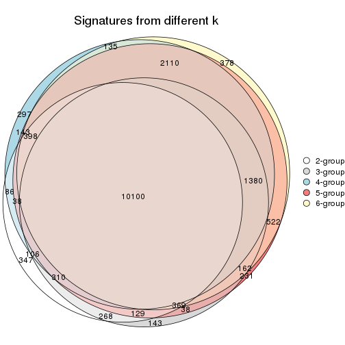

`get_signature()` returns a data frame invisibly. TO get the list of signatures, the function
call should be assigned to a variable explicitly. In following code, if `plot` argument is set
to `FALSE`, no heatmap is plotted while only the differential analysis is performed.

```r
# code only for demonstration
tb = get_signature(res, k = ..., plot = FALSE)
```

An example of the output of `tb` is:

```
#>   which_row         fdr    mean_1    mean_2 scaled_mean_1 scaled_mean_2 km
#> 1        38 0.042760348  8.373488  9.131774    -0.5533452     0.5164555  1
#> 2        40 0.018707592  7.106213  8.469186    -0.6173731     0.5762149  1
#> 3        55 0.019134737 10.221463 11.207825    -0.6159697     0.5749050  1
#> 4        59 0.006059896  5.921854  7.869574    -0.6899429     0.6439467  1
#> 5        60 0.018055526  8.928898 10.211722    -0.6204761     0.5791110  1
#> 6        98 0.009384629 15.714769 14.887706     0.6635654    -0.6193277  2
...
```

The columns in `tb` are:

1. `which_row`: row indices corresponding to the input matrix.
2. `fdr`: FDR for the differential test. 
3. `mean_x`: The mean value in group x.
4. `scaled_mean_x`: The mean value in group x after rows are scaled.
5. `km`: Row groups if k-means clustering is applied to rows.


UMAP plot which shows how samples are separated.


<script>
$( function() {
	$( '#tabs-CV-mclust-dimension-reduction' ).tabs();
} );
</script>
<div id='tabs-CV-mclust-dimension-reduction'>
<ul>
<li><a href='#tab-CV-mclust-dimension-reduction-1'>k = 2</a></li>
<li><a href='#tab-CV-mclust-dimension-reduction-2'>k = 3</a></li>
<li><a href='#tab-CV-mclust-dimension-reduction-3'>k = 4</a></li>
<li><a href='#tab-CV-mclust-dimension-reduction-4'>k = 5</a></li>
<li><a href='#tab-CV-mclust-dimension-reduction-5'>k = 6</a></li>
</ul>
<div id='tab-CV-mclust-dimension-reduction-1'>
<pre><code class="r">dimension_reduction(res, k = 2, method = &quot;UMAP&quot;)
</code></pre>

<p></p>

</div>
<div id='tab-CV-mclust-dimension-reduction-2'>
<pre><code class="r">dimension_reduction(res, k = 3, method = &quot;UMAP&quot;)
</code></pre>

<p></p>

</div>
<div id='tab-CV-mclust-dimension-reduction-3'>
<pre><code class="r">dimension_reduction(res, k = 4, method = &quot;UMAP&quot;)
</code></pre>

<p></p>

</div>
<div id='tab-CV-mclust-dimension-reduction-4'>
<pre><code class="r">dimension_reduction(res, k = 5, method = &quot;UMAP&quot;)
</code></pre>

<p></p>

</div>
<div id='tab-CV-mclust-dimension-reduction-5'>
<pre><code class="r">dimension_reduction(res, k = 6, method = &quot;UMAP&quot;)
</code></pre>

<p></p>

</div>
</div>


Following heatmap shows how subgroups are split when increasing `k`:

```r
collect_classes(res)
```


Test correlation between subgroups and known annotations. If the known
annotation is numeric, one-way ANOVA test is applied, and if the known
annotation is discrete, chi-squared contingency table test is applied.

```r
test_to_known_factors(res)
```

```
#>             n disease.state(p) k
#> CV:mclust 119         2.00e-11 2
#> CV:mclust 112         4.74e-26 3
#> CV:mclust 103         4.17e-33 4
#> CV:mclust 115         1.41e-43 5
#> CV:mclust 104         1.88e-35 6
```


If matrix rows can be associated to genes, consider to use `GO_Enrichment(res,
...)` to perform function enrichment for the signature genes.


 

---------------------------------------------------


### CV:NMF*


The object with results only for a single top-value method and a single partition method 
can be extracted as:

```r
res = res_list["CV", "NMF"]
# you can also extract it by
# res = res_list["CV:NMF"]
```

A summary of `res` and all the functions that can be applied to it:

```r
res
```

```
#> A 'ConsensusPartition' object with k = 2, 3, 4, 5, 6.
#>   On a matrix with 21168 rows and 121 columns.
#>   Top rows (1000, 2000, 3000, 4000, 5000) are extracted by 'CV' method.
#>   Subgroups are detected by 'NMF' method.
#>   Performed in total 1250 partitions by row resampling.
#>   Best k for subgroups seems to be 2.
#> 
#> Following methods can be applied to this 'ConsensusPartition' object:
#>  [1] "cola_report"             "collect_classes"         "collect_plots"          
#>  [4] "collect_stats"           "colnames"                "compare_signatures"     
#>  [7] "consensus_heatmap"       "dimension_reduction"     "functional_enrichment"  
#> [10] "get_anno_col"            "get_anno"                "get_classes"            
#> [13] "get_consensus"           "get_matrix"              "get_membership"         
#> [16] "get_param"               "get_signatures"          "get_stats"              
#> [19] "is_best_k"               "is_stable_k"             "membership_heatmap"     
#> [22] "ncol"                    "nrow"                    "plot_ecdf"              
#> [25] "rownames"                "select_partition_number" "show"                   
#> [28] "suggest_best_k"          "test_to_known_factors"
```

`collect_plots()` function collects all the plots made from `res` for all `k` (number of partitions)
into one single page to provide an easy and fast comparison between different `k`.

```r
collect_plots(res)
```


The plots are:

- The first row: a plot of the ECDF (Empirical cumulative distribution
  function) curves of the consensus matrix for each `k` and the heatmap of
  predicted classes for each `k`.
- The second row: heatmaps of the consensus matrix for each `k`.
- The third row: heatmaps of the membership matrix for each `k`.
- The fouth row: heatmaps of the signatures for each `k`.

All the plots in panels can be made by individual functions and they are
plotted later in this section.

`select_partition_number()` produces several plots showing different
statistics for choosing "optimized" `k`. There are following statistics:

- ECDF curves of the consensus matrix for each `k`;
- 1-PAC. [The PAC
  score](https://en.wikipedia.org/wiki/Consensus_clustering#Over-interpretation_potential_of_consensus_clustering)
  measures the proportion of the ambiguous subgrouping.
- Mean silhouette score.
- Concordance. The mean probability of fiting the consensus class ids in all
  partitions.
- Area increased. Denote $A_k$ as the area under the ECDF curve for current
  `k`, the area increased is defined as $A_k - A_{k-1}$.
- Rand index. The percent of pairs of samples that are both in a same cluster
  or both are not in a same cluster in the partition of k and k-1.
- Jaccard index. The ratio of pairs of samples are both in a same cluster in
  the partition of k and k-1 and the pairs of samples are both in a same
  cluster in the partition k or k-1.

The detailed explanations of these statistics can be found in [the cola
vignette](http://bioconductor.org/packages/devel/bioc/vignettes/cola/inst/doc/cola.html#toc_13).

Generally speaking, lower PAC score, higher mean silhouette score or higher
concordance corresponds to better partition. Rand index and Jaccard index
measure how similar the current partition is compared to partition with `k-1`.
If they are too similar, we won't accept `k` is better than `k-1`.

```r
select_partition_number(res)
```


The numeric values for all these statistics can be obtained by `get_stats()`.

```r
get_stats(res)
```

```
#>   k 1-PAC mean_silhouette concordance area_increased  Rand Jaccard
#> 2 2 0.932           0.940       0.975         0.4995 0.500   0.500
#> 3 3 0.577           0.667       0.849         0.3215 0.728   0.511
#> 4 4 0.555           0.509       0.716         0.1228 0.806   0.517
#> 5 5 0.623           0.547       0.731         0.0650 0.853   0.537
#> 6 6 0.709           0.669       0.799         0.0435 0.895   0.582
```

`suggest_best_k()` suggests the best $k$ based on these statistics. The rules are as follows:

- All $k$ with Jaccard index larger than 0.95 are removed because the increase of
  the partition number does not provides enough extra information. If all $k$ are removed,
  the best $k$ is assigned by `NA`.
- For $k$ with 1-PAC larger than 0.9, the maximal $k$ is taken as the "best k". Other $k$ is called "optional k".
- If it does not fit the second rule. The $k$ with the highest vote of highest
  1-PAC, mean silhouette and concordance is taken as the "best k".

```r
suggest_best_k(res)
```

```
#> [1] 2
```


Following shows the table of the partitions (You need to click the **show/hide
code output** link to see it). The membership matrix (columns with name `p*`)
is inferred by
[`clue::cl_consensus()`](https://www.rdocumentation.org/link/cl_consensus?package=clue)
function with the `SE` method. Basically the value in the membership matrix
represents the probability to belong to a certain group. The finall class
label for an item is determined with the group with highest probability it
belongs to.

In `get_classes()` function, the entropy is calculated from the membership
matrix and the silhouette score is calculated from the consensus matrix.


<script>
$( function() {
	$( '#tabs-CV-NMF-get-classes' ).tabs();
} );
</script>
<div id='tabs-CV-NMF-get-classes'>
<ul>
<li><a href='#tab-CV-NMF-get-classes-1'>k = 2</a></li>
<li><a href='#tab-CV-NMF-get-classes-2'>k = 3</a></li>
<li><a href='#tab-CV-NMF-get-classes-3'>k = 4</a></li>
<li><a href='#tab-CV-NMF-get-classes-4'>k = 5</a></li>
<li><a href='#tab-CV-NMF-get-classes-5'>k = 6</a></li>
</ul>

<div id='tab-CV-NMF-get-classes-1'>
<p><a id='tab-CV-NMF-get-classes-1-a' style='color:#0366d6' href='#'>show/hide code output</a></p>
<pre><code class="r">cbind(get_classes(res, k = 2), get_membership(res, k = 2))
</code></pre>

<pre><code>#&gt;           class entropy silhouette    p1    p2
#&gt; GSM74356      2  0.0000      0.973 0.000 1.000
#&gt; GSM74357      2  0.6343      0.816 0.160 0.840
#&gt; GSM74358      2  0.8327      0.657 0.264 0.736
#&gt; GSM74359      1  0.0000      0.975 1.000 0.000
#&gt; GSM74360      1  0.0000      0.975 1.000 0.000
#&gt; GSM74361      2  0.5178      0.867 0.116 0.884
#&gt; GSM74362      1  0.8909      0.545 0.692 0.308
#&gt; GSM74363      2  0.0000      0.973 0.000 1.000
#&gt; GSM74402      1  0.0000      0.975 1.000 0.000
#&gt; GSM74403      1  0.0000      0.975 1.000 0.000
#&gt; GSM74404      1  0.0000      0.975 1.000 0.000
#&gt; GSM74406      1  0.0000      0.975 1.000 0.000
#&gt; GSM74407      1  0.0000      0.975 1.000 0.000
#&gt; GSM74408      1  0.0000      0.975 1.000 0.000
#&gt; GSM74409      1  0.0000      0.975 1.000 0.000
#&gt; GSM74410      1  0.0000      0.975 1.000 0.000
#&gt; GSM119936     1  0.0000      0.975 1.000 0.000
#&gt; GSM119937     1  0.0000      0.975 1.000 0.000
#&gt; GSM74411      2  0.0000      0.973 0.000 1.000
#&gt; GSM74412      2  0.0000      0.973 0.000 1.000
#&gt; GSM74413      2  0.0000      0.973 0.000 1.000
#&gt; GSM74414      2  0.0000      0.973 0.000 1.000
#&gt; GSM74415      2  0.0000      0.973 0.000 1.000
#&gt; GSM121379     2  0.0000      0.973 0.000 1.000
#&gt; GSM121380     2  0.0000      0.973 0.000 1.000
#&gt; GSM121381     2  0.0000      0.973 0.000 1.000
#&gt; GSM121382     2  0.0000      0.973 0.000 1.000
#&gt; GSM121383     2  0.0000      0.973 0.000 1.000
#&gt; GSM121384     2  0.0000      0.973 0.000 1.000
#&gt; GSM121385     2  0.0000      0.973 0.000 1.000
#&gt; GSM121386     2  0.0000      0.973 0.000 1.000
#&gt; GSM121387     2  0.0000      0.973 0.000 1.000
#&gt; GSM121388     2  0.0000      0.973 0.000 1.000
#&gt; GSM121389     2  0.0000      0.973 0.000 1.000
#&gt; GSM121390     2  0.0000      0.973 0.000 1.000
#&gt; GSM121391     2  0.0000      0.973 0.000 1.000
#&gt; GSM121392     2  0.0000      0.973 0.000 1.000
#&gt; GSM121393     2  0.0000      0.973 0.000 1.000
#&gt; GSM121394     2  0.0000      0.973 0.000 1.000
#&gt; GSM121395     2  0.0000      0.973 0.000 1.000
#&gt; GSM121396     2  0.0000      0.973 0.000 1.000
#&gt; GSM121397     2  0.0000      0.973 0.000 1.000
#&gt; GSM121398     2  0.0000      0.973 0.000 1.000
#&gt; GSM121399     2  0.0000      0.973 0.000 1.000
#&gt; GSM74240      1  0.9954      0.124 0.540 0.460
#&gt; GSM74241      2  0.6048      0.830 0.148 0.852
#&gt; GSM74242      1  0.1414      0.956 0.980 0.020
#&gt; GSM74243      1  0.2423      0.937 0.960 0.040
#&gt; GSM74244      2  0.2236      0.945 0.036 0.964
#&gt; GSM74245      2  0.8081      0.684 0.248 0.752
#&gt; GSM74246      2  0.3274      0.924 0.060 0.940
#&gt; GSM74247      2  0.0938      0.964 0.012 0.988
#&gt; GSM74248      2  0.9209      0.511 0.336 0.664
#&gt; GSM74416      1  0.0000      0.975 1.000 0.000
#&gt; GSM74417      1  0.0000      0.975 1.000 0.000
#&gt; GSM74418      1  0.0000      0.975 1.000 0.000
#&gt; GSM74419      1  0.0000      0.975 1.000 0.000
#&gt; GSM121358     2  0.0000      0.973 0.000 1.000
#&gt; GSM121359     2  0.0000      0.973 0.000 1.000
#&gt; GSM121360     1  0.0000      0.975 1.000 0.000
#&gt; GSM121362     1  0.0000      0.975 1.000 0.000
#&gt; GSM121364     1  0.0000      0.975 1.000 0.000
#&gt; GSM121365     2  0.0000      0.973 0.000 1.000
#&gt; GSM121366     2  0.0000      0.973 0.000 1.000
#&gt; GSM121367     2  0.0000      0.973 0.000 1.000
#&gt; GSM121370     2  0.0000      0.973 0.000 1.000
#&gt; GSM121371     2  0.0000      0.973 0.000 1.000
#&gt; GSM121372     2  0.0000      0.973 0.000 1.000
#&gt; GSM121373     1  0.0000      0.975 1.000 0.000
#&gt; GSM121374     1  0.0000      0.975 1.000 0.000
#&gt; GSM121407     2  0.0000      0.973 0.000 1.000
#&gt; GSM74387      2  0.0000      0.973 0.000 1.000
#&gt; GSM74388      2  0.0000      0.973 0.000 1.000
#&gt; GSM74389      1  0.0000      0.975 1.000 0.000
#&gt; GSM74390      1  0.0000      0.975 1.000 0.000
#&gt; GSM74391      1  0.0000      0.975 1.000 0.000
#&gt; GSM74392      1  0.0000      0.975 1.000 0.000
#&gt; GSM74393      1  0.0000      0.975 1.000 0.000
#&gt; GSM74394      2  0.0000      0.973 0.000 1.000
#&gt; GSM74239      1  0.0000      0.975 1.000 0.000
#&gt; GSM74364      1  0.0000      0.975 1.000 0.000
#&gt; GSM74365      1  0.0000      0.975 1.000 0.000
#&gt; GSM74366      1  0.9286      0.468 0.656 0.344
#&gt; GSM74367      1  0.0000      0.975 1.000 0.000
#&gt; GSM74377      1  0.0000      0.975 1.000 0.000
#&gt; GSM74378      1  0.0938      0.964 0.988 0.012
#&gt; GSM74379      1  0.0000      0.975 1.000 0.000
#&gt; GSM74380      1  0.0000      0.975 1.000 0.000
#&gt; GSM74381      1  0.0000      0.975 1.000 0.000
#&gt; GSM121357     2  0.0000      0.973 0.000 1.000
#&gt; GSM121361     2  0.0000      0.973 0.000 1.000
#&gt; GSM121363     2  0.0000      0.973 0.000 1.000
#&gt; GSM121368     2  0.0000      0.973 0.000 1.000
#&gt; GSM121369     2  0.0376      0.970 0.004 0.996
#&gt; GSM74368      1  0.0000      0.975 1.000 0.000
#&gt; GSM74369      1  0.0000      0.975 1.000 0.000
#&gt; GSM74370      1  0.0000      0.975 1.000 0.000
#&gt; GSM74371      1  0.0000      0.975 1.000 0.000
#&gt; GSM74372      1  0.0000      0.975 1.000 0.000
#&gt; GSM74373      1  0.0000      0.975 1.000 0.000
#&gt; GSM74374      1  0.0000      0.975 1.000 0.000
#&gt; GSM74375      1  0.0000      0.975 1.000 0.000
#&gt; GSM74376      1  0.0000      0.975 1.000 0.000
#&gt; GSM74405      1  0.0000      0.975 1.000 0.000
#&gt; GSM74351      1  0.0000      0.975 1.000 0.000
#&gt; GSM74352      1  0.9710      0.345 0.600 0.400
#&gt; GSM74353      1  0.0000      0.975 1.000 0.000
#&gt; GSM74354      1  0.0000      0.975 1.000 0.000
#&gt; GSM74355      1  0.0000      0.975 1.000 0.000
#&gt; GSM74382      1  0.0000      0.975 1.000 0.000
#&gt; GSM74383      1  0.0000      0.975 1.000 0.000
#&gt; GSM74384      2  0.2043      0.948 0.032 0.968
#&gt; GSM74385      1  0.0000      0.975 1.000 0.000
#&gt; GSM74386      1  0.0000      0.975 1.000 0.000
#&gt; GSM74395      1  0.0000      0.975 1.000 0.000
#&gt; GSM74396      1  0.0000      0.975 1.000 0.000
#&gt; GSM74397      1  0.0000      0.975 1.000 0.000
#&gt; GSM74398      1  0.0000      0.975 1.000 0.000
#&gt; GSM74399      1  0.0000      0.975 1.000 0.000
#&gt; GSM74400      1  0.0000      0.975 1.000 0.000
#&gt; GSM74401      1  0.0000      0.975 1.000 0.000
</code></pre>

<script>
$('#tab-CV-NMF-get-classes-1-a').parent().next().next().hide();
$('#tab-CV-NMF-get-classes-1-a').click(function(){
  $('#tab-CV-NMF-get-classes-1-a').parent().next().next().toggle();
  return(false);
});
</script>
</div>

<div id='tab-CV-NMF-get-classes-2'>
<p><a id='tab-CV-NMF-get-classes-2-a' style='color:#0366d6' href='#'>show/hide code output</a></p>
<pre><code class="r">cbind(get_classes(res, k = 3), get_membership(res, k = 3))
</code></pre>

<pre><code>#&gt;           class entropy silhouette    p1    p2    p3
#&gt; GSM74356      3  0.0000     0.7871 0.000 0.000 1.000
#&gt; GSM74357      3  0.0237     0.7860 0.004 0.000 0.996
#&gt; GSM74358      3  0.0424     0.7847 0.008 0.000 0.992
#&gt; GSM74359      3  0.5733     0.3482 0.324 0.000 0.676
#&gt; GSM74360      1  0.5560     0.6107 0.700 0.000 0.300
#&gt; GSM74361      3  0.0000     0.7871 0.000 0.000 1.000
#&gt; GSM74362      3  0.0592     0.7831 0.012 0.000 0.988
#&gt; GSM74363      3  0.0237     0.7873 0.000 0.004 0.996
#&gt; GSM74402      1  0.3752     0.7726 0.856 0.000 0.144
#&gt; GSM74403      1  0.2796     0.8042 0.908 0.000 0.092
#&gt; GSM74404      1  0.3192     0.7934 0.888 0.000 0.112
#&gt; GSM74406      1  0.6026     0.4926 0.624 0.000 0.376
#&gt; GSM74407      1  0.4750     0.7094 0.784 0.000 0.216
#&gt; GSM74408      1  0.6235     0.3637 0.564 0.000 0.436
#&gt; GSM74409      1  0.6225     0.3739 0.568 0.000 0.432
#&gt; GSM74410      3  0.6235     0.0154 0.436 0.000 0.564
#&gt; GSM119936     1  0.5835     0.5520 0.660 0.000 0.340
#&gt; GSM119937     1  0.6079     0.4696 0.612 0.000 0.388
#&gt; GSM74411      3  0.4399     0.6519 0.000 0.188 0.812
#&gt; GSM74412      3  0.6126     0.2408 0.000 0.400 0.600
#&gt; GSM74413      3  0.5178     0.5585 0.000 0.256 0.744
#&gt; GSM74414      2  0.1289     0.8257 0.000 0.968 0.032
#&gt; GSM74415      3  0.1643     0.7802 0.000 0.044 0.956
#&gt; GSM121379     2  0.1643     0.8268 0.000 0.956 0.044
#&gt; GSM121380     2  0.1411     0.8264 0.000 0.964 0.036
#&gt; GSM121381     2  0.4974     0.6882 0.000 0.764 0.236
#&gt; GSM121382     2  0.4750     0.7119 0.000 0.784 0.216
#&gt; GSM121383     2  0.5465     0.6081 0.000 0.712 0.288
#&gt; GSM121384     2  0.1753     0.8264 0.000 0.952 0.048
#&gt; GSM121385     2  0.2448     0.8181 0.000 0.924 0.076
#&gt; GSM121386     2  0.2165     0.8227 0.000 0.936 0.064
#&gt; GSM121387     2  0.4291     0.7479 0.000 0.820 0.180
#&gt; GSM121388     2  0.6140     0.3613 0.000 0.596 0.404
#&gt; GSM121389     2  0.2878     0.8079 0.000 0.904 0.096
#&gt; GSM121390     2  0.0592     0.8191 0.000 0.988 0.012
#&gt; GSM121391     2  0.5905     0.4859 0.000 0.648 0.352
#&gt; GSM121392     2  0.0592     0.8086 0.012 0.988 0.000
#&gt; GSM121393     2  0.1643     0.8268 0.000 0.956 0.044
#&gt; GSM121394     3  0.6305    -0.0448 0.000 0.484 0.516
#&gt; GSM121395     2  0.2261     0.8213 0.000 0.932 0.068
#&gt; GSM121396     3  0.5591     0.4749 0.000 0.304 0.696
#&gt; GSM121397     2  0.2066     0.8238 0.000 0.940 0.060
#&gt; GSM121398     2  0.1529     0.8268 0.000 0.960 0.040
#&gt; GSM121399     2  0.3879     0.7709 0.000 0.848 0.152
#&gt; GSM74240      3  0.0592     0.7831 0.012 0.000 0.988
#&gt; GSM74241      3  0.1529     0.7820 0.000 0.040 0.960
#&gt; GSM74242      3  0.1163     0.7746 0.028 0.000 0.972
#&gt; GSM74243      3  0.1163     0.7748 0.028 0.000 0.972
#&gt; GSM74244      3  0.1031     0.7863 0.000 0.024 0.976
#&gt; GSM74245      3  0.0000     0.7871 0.000 0.000 1.000
#&gt; GSM74246      3  0.1753     0.7779 0.000 0.048 0.952
#&gt; GSM74247      3  0.2959     0.7399 0.000 0.100 0.900
#&gt; GSM74248      3  0.0000     0.7871 0.000 0.000 1.000
#&gt; GSM74416      1  0.3482     0.7839 0.872 0.000 0.128
#&gt; GSM74417      1  0.3551     0.7811 0.868 0.000 0.132
#&gt; GSM74418      1  0.2796     0.8042 0.908 0.000 0.092
#&gt; GSM74419      1  0.6168     0.4201 0.588 0.000 0.412
#&gt; GSM121358     3  0.1163     0.7858 0.000 0.028 0.972
#&gt; GSM121359     3  0.4974     0.5894 0.000 0.236 0.764
#&gt; GSM121360     1  0.6180     0.4028 0.584 0.000 0.416
#&gt; GSM121362     1  0.5115     0.6903 0.768 0.004 0.228
#&gt; GSM121364     3  0.6280    -0.0710 0.460 0.000 0.540
#&gt; GSM121365     3  0.1163     0.7858 0.000 0.028 0.972
#&gt; GSM121366     3  0.2261     0.7650 0.000 0.068 0.932
#&gt; GSM121367     3  0.1163     0.7858 0.000 0.028 0.972
#&gt; GSM121370     3  0.1643     0.7804 0.000 0.044 0.956
#&gt; GSM121371     3  0.1289     0.7847 0.000 0.032 0.968
#&gt; GSM121372     3  0.4605     0.6322 0.000 0.204 0.796
#&gt; GSM121373     1  0.6215     0.3814 0.572 0.000 0.428
#&gt; GSM121374     3  0.6260    -0.0277 0.448 0.000 0.552
#&gt; GSM121407     3  0.5835     0.3956 0.000 0.340 0.660
#&gt; GSM74387      3  0.6062     0.2880 0.000 0.384 0.616
#&gt; GSM74388      2  0.1411     0.7956 0.036 0.964 0.000
#&gt; GSM74389      3  0.5178     0.5002 0.256 0.000 0.744
#&gt; GSM74390      1  0.0237     0.8292 0.996 0.000 0.004
#&gt; GSM74391      1  0.6045     0.4857 0.620 0.000 0.380
#&gt; GSM74392      3  0.6291    -0.1004 0.468 0.000 0.532
#&gt; GSM74393      3  0.3267     0.7060 0.116 0.000 0.884
#&gt; GSM74394      2  0.2152     0.8244 0.016 0.948 0.036
#&gt; GSM74239      1  0.1031     0.8288 0.976 0.000 0.024
#&gt; GSM74364      1  0.0892     0.8292 0.980 0.000 0.020
#&gt; GSM74365      1  0.0747     0.8239 0.984 0.016 0.000
#&gt; GSM74366      2  0.5621     0.4921 0.308 0.692 0.000
#&gt; GSM74367      1  0.0424     0.8263 0.992 0.008 0.000
#&gt; GSM74377      1  0.5465     0.5402 0.712 0.288 0.000
#&gt; GSM74378      2  0.6168     0.2634 0.412 0.588 0.000
#&gt; GSM74379      1  0.2356     0.7977 0.928 0.072 0.000
#&gt; GSM74380      1  0.3192     0.7691 0.888 0.112 0.000
#&gt; GSM74381      1  0.6062     0.3352 0.616 0.384 0.000
#&gt; GSM121357     2  0.5016     0.6830 0.000 0.760 0.240
#&gt; GSM121361     2  0.1315     0.8104 0.020 0.972 0.008
#&gt; GSM121363     2  0.1182     0.8154 0.012 0.976 0.012
#&gt; GSM121368     2  0.1399     0.8241 0.004 0.968 0.028
#&gt; GSM121369     2  0.4931     0.7195 0.004 0.784 0.212
#&gt; GSM74368      1  0.0892     0.8292 0.980 0.000 0.020
#&gt; GSM74369      1  0.0424     0.8296 0.992 0.000 0.008
#&gt; GSM74370      1  0.0592     0.8297 0.988 0.000 0.012
#&gt; GSM74371      1  0.0424     0.8295 0.992 0.000 0.008
#&gt; GSM74372      1  0.0592     0.8297 0.988 0.000 0.012
#&gt; GSM74373      1  0.4555     0.6726 0.800 0.200 0.000
#&gt; GSM74374      1  0.0424     0.8262 0.992 0.008 0.000
#&gt; GSM74375      1  0.3686     0.7418 0.860 0.140 0.000
#&gt; GSM74376      1  0.6252     0.1607 0.556 0.444 0.000
#&gt; GSM74405      1  0.5397     0.5521 0.720 0.280 0.000
#&gt; GSM74351      1  0.1411     0.8260 0.964 0.000 0.036
#&gt; GSM74352      2  0.5431     0.5343 0.284 0.716 0.000
#&gt; GSM74353      1  0.0237     0.8290 0.996 0.000 0.004
#&gt; GSM74354      1  0.0000     0.8282 1.000 0.000 0.000
#&gt; GSM74355      2  0.6299     0.0666 0.476 0.524 0.000
#&gt; GSM74382      1  0.1163     0.8277 0.972 0.000 0.028
#&gt; GSM74383      1  0.0237     0.8290 0.996 0.000 0.004
#&gt; GSM74384      2  0.4555     0.6566 0.200 0.800 0.000
#&gt; GSM74385      1  0.0592     0.8297 0.988 0.000 0.012
#&gt; GSM74386      1  0.0237     0.8290 0.996 0.000 0.004
#&gt; GSM74395      1  0.0892     0.8292 0.980 0.000 0.020
#&gt; GSM74396      1  0.0000     0.8282 1.000 0.000 0.000
#&gt; GSM74397      1  0.1529     0.8246 0.960 0.000 0.040
#&gt; GSM74398      1  0.1529     0.8149 0.960 0.040 0.000
#&gt; GSM74399      1  0.2625     0.7902 0.916 0.084 0.000
#&gt; GSM74400      1  0.2959     0.7778 0.900 0.100 0.000
#&gt; GSM74401      1  0.2959     0.7786 0.900 0.100 0.000
</code></pre>

<script>
$('#tab-CV-NMF-get-classes-2-a').parent().next().next().hide();
$('#tab-CV-NMF-get-classes-2-a').click(function(){
  $('#tab-CV-NMF-get-classes-2-a').parent().next().next().toggle();
  return(false);
});
</script>
</div>

<div id='tab-CV-NMF-get-classes-3'>
<p><a id='tab-CV-NMF-get-classes-3-a' style='color:#0366d6' href='#'>show/hide code output</a></p>
<pre><code class="r">cbind(get_classes(res, k = 4), get_membership(res, k = 4))
</code></pre>

<pre><code>#&gt;           class entropy silhouette    p1    p2    p3    p4
#&gt; GSM74356      1  0.6197    0.40799 0.596 0.056 0.344 0.004
#&gt; GSM74357      1  0.6562    0.39120 0.600 0.044 0.328 0.028
#&gt; GSM74358      1  0.6440    0.37992 0.600 0.036 0.336 0.028
#&gt; GSM74359      3  0.7442    0.25900 0.212 0.000 0.504 0.284
#&gt; GSM74360      4  0.6775    0.18725 0.100 0.000 0.384 0.516
#&gt; GSM74361      3  0.5967   -0.00588 0.428 0.020 0.540 0.012
#&gt; GSM74362      3  0.5530    0.26129 0.336 0.000 0.632 0.032
#&gt; GSM74363      1  0.6832    0.47791 0.608 0.120 0.264 0.008
#&gt; GSM74402      4  0.2125    0.75863 0.076 0.000 0.004 0.920
#&gt; GSM74403      4  0.1722    0.76565 0.048 0.000 0.008 0.944
#&gt; GSM74404      4  0.2300    0.76476 0.048 0.000 0.028 0.924
#&gt; GSM74406      4  0.4673    0.67296 0.132 0.000 0.076 0.792
#&gt; GSM74407      4  0.3617    0.72463 0.076 0.000 0.064 0.860
#&gt; GSM74408      4  0.4920    0.63549 0.192 0.000 0.052 0.756
#&gt; GSM74409      4  0.5512    0.61008 0.172 0.000 0.100 0.728
#&gt; GSM74410      4  0.6587    0.46114 0.252 0.000 0.132 0.616
#&gt; GSM119936     4  0.3907    0.69776 0.140 0.000 0.032 0.828
#&gt; GSM119937     4  0.4290    0.67652 0.164 0.000 0.036 0.800
#&gt; GSM74411      3  0.6074    0.21130 0.268 0.084 0.648 0.000
#&gt; GSM74412      3  0.6862    0.18119 0.228 0.176 0.596 0.000
#&gt; GSM74413      3  0.7328   -0.26106 0.392 0.156 0.452 0.000
#&gt; GSM74414      2  0.5123    0.53685 0.232 0.724 0.044 0.000
#&gt; GSM74415      3  0.3402    0.50619 0.164 0.004 0.832 0.000
#&gt; GSM121379     2  0.0188    0.71454 0.004 0.996 0.000 0.000
#&gt; GSM121380     2  0.1211    0.70498 0.040 0.960 0.000 0.000
#&gt; GSM121381     2  0.4155    0.55837 0.240 0.756 0.004 0.000
#&gt; GSM121382     2  0.3636    0.63058 0.172 0.820 0.008 0.000
#&gt; GSM121383     2  0.4122    0.56637 0.236 0.760 0.004 0.000
#&gt; GSM121384     2  0.1022    0.70830 0.032 0.968 0.000 0.000
#&gt; GSM121385     2  0.1637    0.70616 0.060 0.940 0.000 0.000
#&gt; GSM121386     2  0.0921    0.71560 0.028 0.972 0.000 0.000
#&gt; GSM121387     2  0.3208    0.65278 0.148 0.848 0.004 0.000
#&gt; GSM121388     2  0.4950    0.34238 0.376 0.620 0.004 0.000
#&gt; GSM121389     2  0.1118    0.71479 0.036 0.964 0.000 0.000
#&gt; GSM121390     2  0.1867    0.68861 0.072 0.928 0.000 0.000
#&gt; GSM121391     2  0.4955    0.39533 0.344 0.648 0.008 0.000
#&gt; GSM121392     2  0.2704    0.65482 0.124 0.876 0.000 0.000
#&gt; GSM121393     2  0.1118    0.71546 0.036 0.964 0.000 0.000
#&gt; GSM121394     2  0.5229    0.22224 0.428 0.564 0.008 0.000
#&gt; GSM121395     2  0.1302    0.71280 0.044 0.956 0.000 0.000
#&gt; GSM121396     1  0.6008   -0.02353 0.496 0.464 0.040 0.000
#&gt; GSM121397     2  0.0921    0.70936 0.028 0.972 0.000 0.000
#&gt; GSM121398     2  0.0336    0.71572 0.008 0.992 0.000 0.000
#&gt; GSM121399     2  0.2921    0.65997 0.140 0.860 0.000 0.000
#&gt; GSM74240      3  0.0188    0.61770 0.004 0.000 0.996 0.000
#&gt; GSM74241      3  0.1211    0.61451 0.040 0.000 0.960 0.000
#&gt; GSM74242      3  0.2859    0.56610 0.112 0.000 0.880 0.008
#&gt; GSM74243      3  0.2222    0.59757 0.060 0.000 0.924 0.016
#&gt; GSM74244      3  0.1474    0.59931 0.052 0.000 0.948 0.000
#&gt; GSM74245      3  0.1022    0.60834 0.032 0.000 0.968 0.000
#&gt; GSM74246      3  0.1389    0.61629 0.048 0.000 0.952 0.000
#&gt; GSM74247      3  0.1474    0.61544 0.052 0.000 0.948 0.000
#&gt; GSM74248      3  0.0469    0.61458 0.012 0.000 0.988 0.000
#&gt; GSM74416      4  0.1557    0.76431 0.056 0.000 0.000 0.944
#&gt; GSM74417      4  0.2197    0.75281 0.080 0.000 0.004 0.916
#&gt; GSM74418      4  0.1389    0.76701 0.048 0.000 0.000 0.952
#&gt; GSM74419      4  0.4544    0.66735 0.164 0.000 0.048 0.788
#&gt; GSM121358     1  0.6528    0.46847 0.596 0.104 0.300 0.000
#&gt; GSM121359     1  0.7357    0.37972 0.512 0.296 0.192 0.000
#&gt; GSM121360     3  0.3583    0.57200 0.180 0.000 0.816 0.004
#&gt; GSM121362     3  0.7447    0.34759 0.192 0.008 0.548 0.252
#&gt; GSM121364     4  0.7466    0.00853 0.176 0.000 0.388 0.436
#&gt; GSM121365     1  0.6664    0.48312 0.600 0.128 0.272 0.000
#&gt; GSM121366     1  0.6993    0.48073 0.572 0.168 0.260 0.000
#&gt; GSM121367     1  0.6464    0.46130 0.596 0.096 0.308 0.000
#&gt; GSM121370     1  0.6309    0.43139 0.588 0.076 0.336 0.000
#&gt; GSM121371     1  0.6685    0.48425 0.600 0.132 0.268 0.000
#&gt; GSM121372     1  0.7500    0.44457 0.500 0.252 0.248 0.000
#&gt; GSM121373     3  0.7210    0.07184 0.140 0.000 0.456 0.404
#&gt; GSM121374     4  0.7475    0.05283 0.180 0.000 0.372 0.448
#&gt; GSM121407     1  0.7553    0.35636 0.476 0.308 0.216 0.000
#&gt; GSM74387      3  0.4332    0.56271 0.160 0.040 0.800 0.000
#&gt; GSM74388      3  0.7684    0.23015 0.360 0.220 0.420 0.000
#&gt; GSM74389      3  0.3051    0.59266 0.028 0.000 0.884 0.088
#&gt; GSM74390      1  0.8806   -0.21923 0.344 0.040 0.296 0.320
#&gt; GSM74391      3  0.5212    0.51496 0.068 0.000 0.740 0.192
#&gt; GSM74392      3  0.5507    0.49037 0.112 0.000 0.732 0.156
#&gt; GSM74393      3  0.0927    0.61644 0.016 0.000 0.976 0.008
#&gt; GSM74394      3  0.6116    0.44095 0.320 0.068 0.612 0.000
#&gt; GSM74239      4  0.0817    0.77929 0.024 0.000 0.000 0.976
#&gt; GSM74364      4  0.0188    0.77771 0.004 0.000 0.000 0.996
#&gt; GSM74365      4  0.2921    0.74902 0.140 0.000 0.000 0.860
#&gt; GSM74366      2  0.8726    0.19769 0.388 0.400 0.108 0.104
#&gt; GSM74367      4  0.3402    0.73416 0.164 0.000 0.004 0.832
#&gt; GSM74377      4  0.7882    0.36040 0.336 0.176 0.016 0.472
#&gt; GSM74378      2  0.8484    0.17283 0.392 0.396 0.048 0.164
#&gt; GSM74379      4  0.6834    0.51811 0.332 0.024 0.064 0.580
#&gt; GSM74380      4  0.7393    0.47494 0.340 0.072 0.044 0.544
#&gt; GSM74381      1  0.8754   -0.16563 0.384 0.332 0.044 0.240
#&gt; GSM121357     2  0.5102    0.61933 0.188 0.748 0.064 0.000
#&gt; GSM121361     3  0.6894    0.37808 0.344 0.120 0.536 0.000
#&gt; GSM121363     3  0.7634    0.25366 0.352 0.212 0.436 0.000
#&gt; GSM121368     3  0.6993    0.37371 0.336 0.132 0.532 0.000
#&gt; GSM121369     3  0.4599    0.52437 0.248 0.016 0.736 0.000
#&gt; GSM74368      4  0.2737    0.76874 0.104 0.000 0.008 0.888
#&gt; GSM74369      4  0.1118    0.77980 0.036 0.000 0.000 0.964
#&gt; GSM74370      4  0.2385    0.77868 0.052 0.000 0.028 0.920
#&gt; GSM74371      4  0.0817    0.77902 0.024 0.000 0.000 0.976
#&gt; GSM74372      4  0.6792    0.47732 0.140 0.000 0.272 0.588
#&gt; GSM74373      4  0.8455    0.27202 0.356 0.196 0.036 0.412
#&gt; GSM74374      4  0.3196    0.75202 0.136 0.000 0.008 0.856
#&gt; GSM74375      4  0.7127    0.50187 0.304 0.108 0.016 0.572
#&gt; GSM74376      1  0.9602   -0.10350 0.392 0.240 0.200 0.168
#&gt; GSM74405      1  0.9233   -0.16372 0.388 0.204 0.096 0.312
#&gt; GSM74351      4  0.0707    0.77397 0.020 0.000 0.000 0.980
#&gt; GSM74352      2  0.7142    0.31386 0.324 0.524 0.000 0.152
#&gt; GSM74353      4  0.0707    0.77928 0.020 0.000 0.000 0.980
#&gt; GSM74354      4  0.2011    0.77058 0.080 0.000 0.000 0.920
#&gt; GSM74355      1  0.8580   -0.22022 0.388 0.376 0.044 0.192
#&gt; GSM74382      4  0.0336    0.77736 0.008 0.000 0.000 0.992
#&gt; GSM74383      4  0.1557    0.77539 0.056 0.000 0.000 0.944
#&gt; GSM74384      2  0.7585    0.29386 0.388 0.492 0.048 0.072
#&gt; GSM74385      4  0.0707    0.77929 0.020 0.000 0.000 0.980
#&gt; GSM74386      4  0.3552    0.75145 0.128 0.000 0.024 0.848
#&gt; GSM74395      4  0.2329    0.77403 0.072 0.000 0.012 0.916
#&gt; GSM74396      4  0.3636    0.72659 0.172 0.000 0.008 0.820
#&gt; GSM74397      4  0.0469    0.77882 0.012 0.000 0.000 0.988
#&gt; GSM74398      4  0.6395    0.54675 0.316 0.004 0.076 0.604
#&gt; GSM74399      4  0.6648    0.53457 0.328 0.044 0.032 0.596
#&gt; GSM74400      4  0.4827    0.70270 0.124 0.092 0.000 0.784
#&gt; GSM74401      4  0.4775    0.70459 0.140 0.076 0.000 0.784
</code></pre>

<script>
$('#tab-CV-NMF-get-classes-3-a').parent().next().next().hide();
$('#tab-CV-NMF-get-classes-3-a').click(function(){
  $('#tab-CV-NMF-get-classes-3-a').parent().next().next().toggle();
  return(false);
});
</script>
</div>

<div id='tab-CV-NMF-get-classes-4'>
<p><a id='tab-CV-NMF-get-classes-4-a' style='color:#0366d6' href='#'>show/hide code output</a></p>
<pre><code class="r">cbind(get_classes(res, k = 5), get_membership(res, k = 5))
</code></pre>

<pre><code>#&gt;           class entropy silhouette    p1    p2    p3    p4    p5
#&gt; GSM74356      3  0.3080     0.7108 0.008 0.008 0.844 0.140 0.000
#&gt; GSM74357      3  0.3044     0.7085 0.008 0.004 0.840 0.148 0.000
#&gt; GSM74358      3  0.2911     0.7185 0.008 0.004 0.852 0.136 0.000
#&gt; GSM74359      4  0.2929     0.6564 0.076 0.000 0.044 0.876 0.004
#&gt; GSM74360      4  0.2696     0.6616 0.072 0.000 0.012 0.892 0.024
#&gt; GSM74361      4  0.4316     0.5578 0.000 0.004 0.208 0.748 0.040
#&gt; GSM74362      4  0.2446     0.6483 0.000 0.000 0.056 0.900 0.044
#&gt; GSM74363      3  0.1822     0.7773 0.004 0.024 0.936 0.036 0.000
#&gt; GSM74402      1  0.2284     0.7319 0.896 0.000 0.004 0.096 0.004
#&gt; GSM74403      1  0.3086     0.6713 0.816 0.000 0.004 0.180 0.000
#&gt; GSM74404      1  0.4166     0.4845 0.648 0.000 0.004 0.348 0.000
#&gt; GSM74406      1  0.4934     0.4113 0.600 0.000 0.036 0.364 0.000
#&gt; GSM74407      1  0.3706     0.6249 0.756 0.000 0.004 0.236 0.004
#&gt; GSM74408      1  0.5646     0.1421 0.480 0.000 0.076 0.444 0.000
#&gt; GSM74409      4  0.4890     0.2909 0.332 0.000 0.040 0.628 0.000
#&gt; GSM74410      4  0.5996     0.2720 0.316 0.000 0.136 0.548 0.000
#&gt; GSM119936     1  0.5043     0.4208 0.600 0.000 0.044 0.356 0.000
#&gt; GSM119937     1  0.5382     0.4245 0.592 0.000 0.072 0.336 0.000
#&gt; GSM74411      3  0.5794     0.3113 0.000 0.000 0.520 0.096 0.384
#&gt; GSM74412      3  0.6168     0.2762 0.000 0.012 0.496 0.096 0.396
#&gt; GSM74413      3  0.4983     0.5292 0.000 0.008 0.676 0.048 0.268
#&gt; GSM74414      5  0.5898     0.2479 0.016 0.324 0.080 0.000 0.580
#&gt; GSM74415      3  0.6370     0.1233 0.000 0.000 0.432 0.164 0.404
#&gt; GSM121379     2  0.1121     0.8957 0.000 0.956 0.044 0.000 0.000
#&gt; GSM121380     2  0.0510     0.8602 0.000 0.984 0.000 0.000 0.016
#&gt; GSM121381     2  0.2773     0.8541 0.000 0.836 0.164 0.000 0.000
#&gt; GSM121382     2  0.2377     0.8806 0.000 0.872 0.128 0.000 0.000
#&gt; GSM121383     2  0.2516     0.8721 0.000 0.860 0.140 0.000 0.000
#&gt; GSM121384     2  0.0510     0.8587 0.000 0.984 0.000 0.000 0.016
#&gt; GSM121385     2  0.1544     0.9006 0.000 0.932 0.068 0.000 0.000
#&gt; GSM121386     2  0.1341     0.8993 0.000 0.944 0.056 0.000 0.000
#&gt; GSM121387     2  0.1671     0.8997 0.000 0.924 0.076 0.000 0.000
#&gt; GSM121388     2  0.3305     0.7949 0.000 0.776 0.224 0.000 0.000
#&gt; GSM121389     2  0.1043     0.8946 0.000 0.960 0.040 0.000 0.000
#&gt; GSM121390     2  0.0609     0.8563 0.000 0.980 0.000 0.000 0.020
#&gt; GSM121391     2  0.2966     0.8360 0.000 0.816 0.184 0.000 0.000
#&gt; GSM121392     2  0.1357     0.8265 0.000 0.948 0.000 0.004 0.048
#&gt; GSM121393     2  0.1043     0.8940 0.000 0.960 0.040 0.000 0.000
#&gt; GSM121394     2  0.3949     0.6445 0.000 0.668 0.332 0.000 0.000
#&gt; GSM121395     2  0.1608     0.9008 0.000 0.928 0.072 0.000 0.000
#&gt; GSM121396     2  0.4517     0.4144 0.000 0.556 0.436 0.008 0.000
#&gt; GSM121397     2  0.0566     0.8771 0.000 0.984 0.012 0.000 0.004
#&gt; GSM121398     2  0.1544     0.9005 0.000 0.932 0.068 0.000 0.000
#&gt; GSM121399     2  0.1965     0.8934 0.000 0.904 0.096 0.000 0.000
#&gt; GSM74240      5  0.5944    -0.0261 0.000 0.000 0.108 0.404 0.488
#&gt; GSM74241      5  0.5886     0.2461 0.000 0.000 0.224 0.176 0.600
#&gt; GSM74242      5  0.6806    -0.0363 0.000 0.000 0.296 0.348 0.356
#&gt; GSM74243      4  0.6748    -0.0340 0.000 0.000 0.260 0.372 0.368
#&gt; GSM74244      5  0.6523     0.1217 0.000 0.000 0.288 0.232 0.480
#&gt; GSM74245      5  0.6636     0.0656 0.000 0.000 0.244 0.312 0.444
#&gt; GSM74246      5  0.5751     0.0942 0.000 0.000 0.100 0.348 0.552
#&gt; GSM74247      5  0.5887     0.2056 0.000 0.000 0.156 0.252 0.592
#&gt; GSM74248      4  0.5844     0.1113 0.000 0.000 0.096 0.484 0.420
#&gt; GSM74416      1  0.2763     0.6956 0.848 0.000 0.004 0.148 0.000
#&gt; GSM74417      1  0.3835     0.6053 0.744 0.000 0.012 0.244 0.000
#&gt; GSM74418      1  0.2763     0.7012 0.848 0.000 0.004 0.148 0.000
#&gt; GSM74419      1  0.5002     0.4775 0.636 0.000 0.052 0.312 0.000
#&gt; GSM121358     3  0.1310     0.7841 0.000 0.024 0.956 0.020 0.000
#&gt; GSM121359     3  0.1725     0.7801 0.000 0.044 0.936 0.000 0.020
#&gt; GSM121360     4  0.3509     0.5765 0.004 0.004 0.004 0.796 0.192
#&gt; GSM121362     4  0.4410     0.6180 0.044 0.060 0.000 0.800 0.096
#&gt; GSM121364     4  0.2740     0.6484 0.096 0.000 0.028 0.876 0.000
#&gt; GSM121365     3  0.1041     0.7853 0.000 0.032 0.964 0.004 0.000
#&gt; GSM121366     3  0.0963     0.7839 0.000 0.036 0.964 0.000 0.000
#&gt; GSM121367     3  0.1153     0.7877 0.000 0.024 0.964 0.008 0.004
#&gt; GSM121370     3  0.1974     0.7818 0.000 0.016 0.932 0.036 0.016
#&gt; GSM121371     3  0.1364     0.7833 0.000 0.036 0.952 0.012 0.000
#&gt; GSM121372     3  0.2381     0.7736 0.000 0.036 0.908 0.004 0.052
#&gt; GSM121373     4  0.2708     0.6610 0.072 0.000 0.020 0.892 0.016
#&gt; GSM121374     4  0.3064     0.6384 0.108 0.000 0.036 0.856 0.000
#&gt; GSM121407     3  0.2446     0.7738 0.000 0.056 0.900 0.000 0.044
#&gt; GSM74387      5  0.5142     0.2516 0.000 0.000 0.088 0.244 0.668
#&gt; GSM74388      5  0.6282     0.3133 0.000 0.368 0.000 0.156 0.476
#&gt; GSM74389      4  0.4087     0.5277 0.000 0.000 0.036 0.756 0.208
#&gt; GSM74390      5  0.6210     0.2344 0.332 0.012 0.004 0.100 0.552
#&gt; GSM74391      4  0.4935     0.5628 0.044 0.000 0.036 0.736 0.184
#&gt; GSM74392      4  0.1934     0.6523 0.008 0.000 0.020 0.932 0.040
#&gt; GSM74393      4  0.4728     0.4620 0.000 0.000 0.060 0.700 0.240
#&gt; GSM74394      5  0.4001     0.3112 0.000 0.004 0.024 0.208 0.764
#&gt; GSM74239      1  0.0693     0.7375 0.980 0.000 0.000 0.012 0.008
#&gt; GSM74364      1  0.0671     0.7385 0.980 0.000 0.000 0.016 0.004
#&gt; GSM74365      1  0.2763     0.6678 0.848 0.000 0.000 0.004 0.148
#&gt; GSM74366      5  0.5698     0.3968 0.208 0.148 0.000 0.004 0.640
#&gt; GSM74367      1  0.1952     0.7110 0.912 0.000 0.000 0.004 0.084
#&gt; GSM74377      1  0.4866     0.3213 0.580 0.028 0.000 0.000 0.392
#&gt; GSM74378      5  0.6369     0.3399 0.236 0.216 0.000 0.004 0.544
#&gt; GSM74379      1  0.4621     0.3144 0.576 0.004 0.000 0.008 0.412
#&gt; GSM74380      1  0.4714     0.3129 0.576 0.012 0.000 0.004 0.408
#&gt; GSM74381      5  0.6529     0.2226 0.316 0.172 0.000 0.008 0.504
#&gt; GSM121357     3  0.6667     0.1349 0.000 0.348 0.416 0.000 0.236
#&gt; GSM121361     5  0.6656     0.2062 0.000 0.252 0.000 0.308 0.440
#&gt; GSM121363     5  0.5967     0.3611 0.000 0.308 0.000 0.136 0.556
#&gt; GSM121368     5  0.5016     0.3920 0.000 0.176 0.000 0.120 0.704
#&gt; GSM121369     4  0.5192     0.1099 0.000 0.032 0.004 0.492 0.472
#&gt; GSM74368      1  0.2761     0.7009 0.872 0.000 0.000 0.024 0.104
#&gt; GSM74369      1  0.1809     0.7219 0.928 0.000 0.000 0.012 0.060
#&gt; GSM74370      1  0.5440     0.3275 0.540 0.000 0.000 0.396 0.064
#&gt; GSM74371      1  0.1251     0.7400 0.956 0.000 0.000 0.036 0.008
#&gt; GSM74372      4  0.5911     0.4890 0.228 0.000 0.000 0.596 0.176
#&gt; GSM74373      1  0.6857    -0.0199 0.420 0.176 0.000 0.016 0.388
#&gt; GSM74374      1  0.2291     0.7372 0.908 0.000 0.000 0.036 0.056
#&gt; GSM74375      1  0.4070     0.5426 0.728 0.012 0.000 0.004 0.256
#&gt; GSM74376      5  0.5115     0.3211 0.280 0.040 0.000 0.016 0.664
#&gt; GSM74405      5  0.5465     0.1222 0.376 0.044 0.000 0.012 0.568
#&gt; GSM74351      1  0.2074     0.7222 0.896 0.000 0.000 0.104 0.000
#&gt; GSM74352      1  0.6507    -0.0109 0.432 0.192 0.000 0.000 0.376
#&gt; GSM74353      1  0.1628     0.7406 0.936 0.000 0.000 0.056 0.008
#&gt; GSM74354      1  0.1106     0.7368 0.964 0.000 0.000 0.012 0.024
#&gt; GSM74355      5  0.5562     0.1132 0.384 0.064 0.000 0.004 0.548
#&gt; GSM74382      1  0.1908     0.7276 0.908 0.000 0.000 0.092 0.000
#&gt; GSM74383      1  0.0898     0.7357 0.972 0.000 0.000 0.008 0.020
#&gt; GSM74384      5  0.6135     0.3776 0.140 0.304 0.000 0.004 0.552
#&gt; GSM74385      1  0.2230     0.7165 0.884 0.000 0.000 0.116 0.000
#&gt; GSM74386      1  0.2344     0.7326 0.904 0.000 0.000 0.032 0.064
#&gt; GSM74395      1  0.1082     0.7344 0.964 0.000 0.000 0.008 0.028
#&gt; GSM74396      1  0.2179     0.7029 0.896 0.000 0.000 0.004 0.100
#&gt; GSM74397      1  0.1430     0.7398 0.944 0.000 0.000 0.052 0.004
#&gt; GSM74398      1  0.4383     0.2941 0.572 0.000 0.000 0.004 0.424
#&gt; GSM74399      1  0.4426     0.3713 0.612 0.004 0.000 0.004 0.380
#&gt; GSM74400      1  0.3801     0.6591 0.812 0.140 0.000 0.008 0.040
#&gt; GSM74401      1  0.2659     0.7041 0.888 0.060 0.000 0.000 0.052
</code></pre>

<script>
$('#tab-CV-NMF-get-classes-4-a').parent().next().next().hide();
$('#tab-CV-NMF-get-classes-4-a').click(function(){
  $('#tab-CV-NMF-get-classes-4-a').parent().next().next().toggle();
  return(false);
});
</script>
</div>

<div id='tab-CV-NMF-get-classes-5'>
<p><a id='tab-CV-NMF-get-classes-5-a' style='color:#0366d6' href='#'>show/hide code output</a></p>
<pre><code class="r">cbind(get_classes(res, k = 6), get_membership(res, k = 6))
</code></pre>

<pre><code>#&gt;           class entropy silhouette    p1    p2    p3    p4    p5    p6
#&gt; GSM74356      3  0.3386    0.76122 0.000 0.016 0.788 0.188 0.008 0.000
#&gt; GSM74357      3  0.3323    0.68292 0.000 0.008 0.752 0.240 0.000 0.000
#&gt; GSM74358      3  0.2882    0.76808 0.000 0.008 0.812 0.180 0.000 0.000
#&gt; GSM74359      4  0.2515    0.72373 0.024 0.000 0.072 0.888 0.016 0.000
#&gt; GSM74360      4  0.1705    0.71608 0.012 0.000 0.008 0.940 0.024 0.016
#&gt; GSM74361      4  0.6928    0.28342 0.012 0.032 0.128 0.504 0.292 0.032
#&gt; GSM74362      4  0.3238    0.69803 0.012 0.004 0.044 0.856 0.076 0.008
#&gt; GSM74363      3  0.1426    0.89838 0.000 0.016 0.948 0.028 0.008 0.000
#&gt; GSM74402      1  0.2496    0.75417 0.900 0.000 0.008 0.032 0.044 0.016
#&gt; GSM74403      1  0.3808    0.67088 0.804 0.000 0.000 0.116 0.036 0.044
#&gt; GSM74404      1  0.5633    0.47862 0.628 0.000 0.000 0.220 0.100 0.052
#&gt; GSM74406      1  0.5953    0.16914 0.508 0.000 0.064 0.380 0.024 0.024
#&gt; GSM74407      1  0.4899    0.59016 0.712 0.000 0.000 0.164 0.080 0.044
#&gt; GSM74408      4  0.6482    0.23873 0.360 0.000 0.144 0.456 0.020 0.020
#&gt; GSM74409      4  0.5457    0.59508 0.200 0.004 0.108 0.660 0.012 0.016
#&gt; GSM74410      4  0.5773    0.51949 0.144 0.000 0.236 0.596 0.012 0.012
#&gt; GSM119936     1  0.6125    0.19306 0.516 0.000 0.112 0.336 0.016 0.020
#&gt; GSM119937     1  0.6757   -0.02279 0.420 0.000 0.244 0.296 0.004 0.036
#&gt; GSM74411      5  0.4570    0.63537 0.000 0.000 0.248 0.020 0.688 0.044
#&gt; GSM74412      5  0.4844    0.65961 0.000 0.004 0.228 0.016 0.684 0.068
#&gt; GSM74413      5  0.4908    0.49207 0.000 0.004 0.336 0.020 0.608 0.032
#&gt; GSM74414      6  0.7071    0.14042 0.000 0.208 0.052 0.016 0.288 0.436
#&gt; GSM74415      5  0.4089    0.72299 0.000 0.000 0.176 0.024 0.760 0.040
#&gt; GSM121379     2  0.0665    0.95177 0.000 0.980 0.004 0.000 0.008 0.008
#&gt; GSM121380     2  0.0858    0.94508 0.000 0.968 0.004 0.000 0.000 0.028
#&gt; GSM121381     2  0.2393    0.91074 0.000 0.884 0.092 0.000 0.004 0.020
#&gt; GSM121382     2  0.1218    0.94915 0.000 0.956 0.028 0.012 0.004 0.000
#&gt; GSM121383     2  0.1116    0.94954 0.000 0.960 0.028 0.008 0.004 0.000
#&gt; GSM121384     2  0.0837    0.94716 0.000 0.972 0.004 0.000 0.004 0.020
#&gt; GSM121385     2  0.1053    0.95083 0.000 0.964 0.012 0.000 0.004 0.020
#&gt; GSM121386     2  0.1036    0.94979 0.000 0.964 0.008 0.000 0.004 0.024
#&gt; GSM121387     2  0.0870    0.95144 0.000 0.972 0.012 0.012 0.004 0.000
#&gt; GSM121388     2  0.2425    0.92184 0.000 0.900 0.060 0.016 0.008 0.016
#&gt; GSM121389     2  0.0653    0.95179 0.000 0.980 0.004 0.012 0.004 0.000
#&gt; GSM121390     2  0.1296    0.93594 0.000 0.948 0.004 0.000 0.004 0.044
#&gt; GSM121391     2  0.1226    0.94593 0.000 0.952 0.040 0.004 0.004 0.000
#&gt; GSM121392     2  0.1471    0.92246 0.000 0.932 0.004 0.000 0.000 0.064
#&gt; GSM121393     2  0.1963    0.93615 0.008 0.932 0.016 0.012 0.008 0.024
#&gt; GSM121394     2  0.2488    0.88484 0.000 0.864 0.124 0.008 0.004 0.000
#&gt; GSM121395     2  0.0870    0.95142 0.000 0.972 0.012 0.012 0.004 0.000
#&gt; GSM121396     2  0.3492    0.80609 0.000 0.796 0.172 0.016 0.012 0.004
#&gt; GSM121397     2  0.0922    0.94751 0.000 0.968 0.004 0.000 0.004 0.024
#&gt; GSM121398     2  0.1074    0.95036 0.000 0.960 0.012 0.000 0.000 0.028
#&gt; GSM121399     2  0.0862    0.95228 0.000 0.972 0.016 0.004 0.008 0.000
#&gt; GSM74240      5  0.1812    0.74950 0.000 0.000 0.008 0.080 0.912 0.000
#&gt; GSM74241      5  0.2285    0.78245 0.000 0.000 0.064 0.008 0.900 0.028
#&gt; GSM74242      5  0.2661    0.77786 0.008 0.004 0.060 0.036 0.888 0.004
#&gt; GSM74243      5  0.2551    0.77292 0.004 0.004 0.052 0.052 0.888 0.000
#&gt; GSM74244      5  0.2418    0.78215 0.000 0.000 0.092 0.008 0.884 0.016
#&gt; GSM74245      5  0.2265    0.78461 0.000 0.000 0.068 0.024 0.900 0.008
#&gt; GSM74246      5  0.2521    0.77298 0.000 0.000 0.020 0.056 0.892 0.032
#&gt; GSM74247      5  0.2384    0.78312 0.000 0.000 0.044 0.016 0.900 0.040
#&gt; GSM74248      5  0.2531    0.71872 0.000 0.000 0.008 0.128 0.860 0.004
#&gt; GSM74416      1  0.2862    0.71888 0.872 0.000 0.012 0.072 0.004 0.040
#&gt; GSM74417      1  0.4554    0.61347 0.740 0.000 0.016 0.180 0.024 0.040
#&gt; GSM74418      1  0.2631    0.72905 0.884 0.000 0.016 0.076 0.004 0.020
#&gt; GSM74419      1  0.5559    0.53912 0.676 0.016 0.008 0.196 0.056 0.048
#&gt; GSM121358     3  0.1409    0.89754 0.000 0.012 0.948 0.032 0.008 0.000
#&gt; GSM121359     3  0.2146    0.86667 0.000 0.024 0.908 0.008 0.060 0.000
#&gt; GSM121360     4  0.3500    0.65135 0.000 0.004 0.008 0.820 0.052 0.116
#&gt; GSM121362     4  0.3581    0.68099 0.012 0.008 0.020 0.832 0.020 0.108
#&gt; GSM121364     4  0.2146    0.72498 0.024 0.000 0.060 0.908 0.008 0.000
#&gt; GSM121365     3  0.1332    0.89751 0.000 0.008 0.952 0.028 0.012 0.000
#&gt; GSM121366     3  0.1418    0.88983 0.000 0.024 0.944 0.000 0.032 0.000
#&gt; GSM121367     3  0.1269    0.89942 0.000 0.012 0.956 0.012 0.020 0.000
#&gt; GSM121370     3  0.1760    0.88628 0.000 0.020 0.928 0.004 0.048 0.000
#&gt; GSM121371     3  0.1605    0.89772 0.000 0.016 0.940 0.032 0.012 0.000
#&gt; GSM121372     3  0.2380    0.85268 0.000 0.020 0.892 0.004 0.080 0.004
#&gt; GSM121373     4  0.3133    0.71690 0.016 0.000 0.072 0.860 0.008 0.044
#&gt; GSM121374     4  0.2527    0.71695 0.032 0.000 0.084 0.880 0.004 0.000
#&gt; GSM121407     3  0.2761    0.86804 0.000 0.020 0.884 0.008 0.060 0.028
#&gt; GSM74387      5  0.4811    0.67593 0.000 0.000 0.040 0.068 0.712 0.180
#&gt; GSM74388      6  0.6582    0.43469 0.000 0.152 0.004 0.100 0.188 0.556
#&gt; GSM74389      5  0.4336    0.23358 0.008 0.000 0.000 0.408 0.572 0.012
#&gt; GSM74390      1  0.7144   -0.16518 0.332 0.000 0.000 0.076 0.324 0.268
#&gt; GSM74391      5  0.5829    0.14025 0.072 0.000 0.000 0.364 0.516 0.048
#&gt; GSM74392      4  0.4158    0.57458 0.028 0.000 0.004 0.736 0.216 0.016
#&gt; GSM74393      4  0.4402    0.13183 0.004 0.000 0.000 0.564 0.412 0.020
#&gt; GSM74394      5  0.4732    0.43266 0.000 0.000 0.000 0.068 0.612 0.320
#&gt; GSM74239      1  0.1471    0.74861 0.932 0.000 0.004 0.000 0.000 0.064
#&gt; GSM74364      1  0.1141    0.75067 0.948 0.000 0.000 0.000 0.000 0.052
#&gt; GSM74365      1  0.3240    0.60363 0.752 0.000 0.004 0.000 0.000 0.244
#&gt; GSM74366      6  0.2958    0.71493 0.096 0.012 0.000 0.004 0.028 0.860
#&gt; GSM74367      1  0.2504    0.71026 0.856 0.000 0.004 0.000 0.004 0.136
#&gt; GSM74377      6  0.3266    0.59137 0.272 0.000 0.000 0.000 0.000 0.728
#&gt; GSM74378      6  0.2758    0.71459 0.088 0.028 0.000 0.008 0.004 0.872
#&gt; GSM74379      6  0.3897    0.53461 0.300 0.000 0.000 0.008 0.008 0.684
#&gt; GSM74380      6  0.4305    0.19555 0.436 0.000 0.000 0.000 0.020 0.544
#&gt; GSM74381      6  0.3409    0.71479 0.120 0.024 0.004 0.012 0.008 0.832
#&gt; GSM121357     6  0.5793    0.28588 0.000 0.060 0.336 0.016 0.032 0.556
#&gt; GSM121361     6  0.6241    0.39103 0.000 0.044 0.004 0.240 0.156 0.556
#&gt; GSM121363     6  0.5227    0.56976 0.000 0.072 0.004 0.104 0.112 0.708
#&gt; GSM121368     6  0.4792    0.56152 0.000 0.028 0.000 0.128 0.124 0.720
#&gt; GSM121369     6  0.5661    0.17385 0.000 0.008 0.000 0.376 0.124 0.492
#&gt; GSM74368      1  0.5399    0.42888 0.596 0.000 0.052 0.036 0.004 0.312
#&gt; GSM74369      1  0.4312    0.63742 0.728 0.000 0.032 0.020 0.004 0.216
#&gt; GSM74370      4  0.5956    0.34854 0.200 0.000 0.004 0.532 0.008 0.256
#&gt; GSM74371      1  0.0891    0.75626 0.968 0.000 0.000 0.008 0.000 0.024
#&gt; GSM74372      4  0.6335    0.49593 0.152 0.004 0.000 0.576 0.196 0.072
#&gt; GSM74373      6  0.5193    0.58987 0.252 0.032 0.004 0.024 0.024 0.664
#&gt; GSM74374      1  0.3347    0.74650 0.824 0.000 0.000 0.068 0.004 0.104
#&gt; GSM74375      1  0.4309    0.61942 0.736 0.000 0.000 0.008 0.080 0.176
#&gt; GSM74376      6  0.4228    0.69235 0.096 0.004 0.000 0.020 0.104 0.776
#&gt; GSM74405      6  0.3152    0.71167 0.132 0.000 0.000 0.016 0.020 0.832
#&gt; GSM74351      1  0.2074    0.74355 0.912 0.000 0.004 0.048 0.000 0.036
#&gt; GSM74352      6  0.3726    0.65200 0.216 0.028 0.000 0.004 0.000 0.752
#&gt; GSM74353      1  0.2333    0.75999 0.896 0.000 0.000 0.040 0.004 0.060
#&gt; GSM74354      1  0.1141    0.75146 0.948 0.000 0.000 0.000 0.000 0.052
#&gt; GSM74355      6  0.2968    0.68982 0.168 0.000 0.000 0.000 0.016 0.816
#&gt; GSM74382      1  0.1225    0.75511 0.952 0.000 0.000 0.036 0.000 0.012
#&gt; GSM74383      1  0.2346    0.74547 0.892 0.000 0.004 0.016 0.004 0.084
#&gt; GSM74384      6  0.2605    0.69287 0.032 0.064 0.000 0.012 0.004 0.888
#&gt; GSM74385      1  0.2173    0.75249 0.904 0.000 0.000 0.064 0.004 0.028
#&gt; GSM74386      1  0.2757    0.73723 0.864 0.000 0.000 0.016 0.016 0.104
#&gt; GSM74395      1  0.2094    0.75270 0.908 0.000 0.000 0.024 0.004 0.064
#&gt; GSM74396      1  0.2700    0.69795 0.836 0.000 0.004 0.004 0.000 0.156
#&gt; GSM74397      1  0.0858    0.75623 0.968 0.000 0.000 0.004 0.000 0.028
#&gt; GSM74398      1  0.4553    0.37918 0.620 0.000 0.000 0.000 0.052 0.328
#&gt; GSM74399      1  0.4308   -0.00351 0.516 0.000 0.000 0.004 0.012 0.468
#&gt; GSM74400      1  0.4098    0.68056 0.788 0.104 0.004 0.004 0.012 0.088
#&gt; GSM74401      1  0.2614    0.73811 0.884 0.044 0.000 0.000 0.012 0.060
</code></pre>

<script>
$('#tab-CV-NMF-get-classes-5-a').parent().next().next().hide();
$('#tab-CV-NMF-get-classes-5-a').click(function(){
  $('#tab-CV-NMF-get-classes-5-a').parent().next().next().toggle();
  return(false);
});
</script>
</div>
</div>

Heatmaps for the consensus matrix. It visualizes the probability of two
samples to be in a same group.


<script>
$( function() {
	$( '#tabs-CV-NMF-consensus-heatmap' ).tabs();
} );
</script>
<div id='tabs-CV-NMF-consensus-heatmap'>
<ul>
<li><a href='#tab-CV-NMF-consensus-heatmap-1'>k = 2</a></li>
<li><a href='#tab-CV-NMF-consensus-heatmap-2'>k = 3</a></li>
<li><a href='#tab-CV-NMF-consensus-heatmap-3'>k = 4</a></li>
<li><a href='#tab-CV-NMF-consensus-heatmap-4'>k = 5</a></li>
<li><a href='#tab-CV-NMF-consensus-heatmap-5'>k = 6</a></li>
</ul>
<div id='tab-CV-NMF-consensus-heatmap-1'>
<pre><code class="r">consensus_heatmap(res, k = 2)
</code></pre>

<p></p>

</div>
<div id='tab-CV-NMF-consensus-heatmap-2'>
<pre><code class="r">consensus_heatmap(res, k = 3)
</code></pre>

<p></p>

</div>
<div id='tab-CV-NMF-consensus-heatmap-3'>
<pre><code class="r">consensus_heatmap(res, k = 4)
</code></pre>

<p></p>

</div>
<div id='tab-CV-NMF-consensus-heatmap-4'>
<pre><code class="r">consensus_heatmap(res, k = 5)
</code></pre>

<p></p>

</div>
<div id='tab-CV-NMF-consensus-heatmap-5'>
<pre><code class="r">consensus_heatmap(res, k = 6)
</code></pre>

<p></p>

</div>
</div>

Heatmaps for the membership of samples in all partitions to see how consistent they are:


<script>
$( function() {
	$( '#tabs-CV-NMF-membership-heatmap' ).tabs();
} );
</script>
<div id='tabs-CV-NMF-membership-heatmap'>
<ul>
<li><a href='#tab-CV-NMF-membership-heatmap-1'>k = 2</a></li>
<li><a href='#tab-CV-NMF-membership-heatmap-2'>k = 3</a></li>
<li><a href='#tab-CV-NMF-membership-heatmap-3'>k = 4</a></li>
<li><a href='#tab-CV-NMF-membership-heatmap-4'>k = 5</a></li>
<li><a href='#tab-CV-NMF-membership-heatmap-5'>k = 6</a></li>
</ul>
<div id='tab-CV-NMF-membership-heatmap-1'>
<pre><code class="r">membership_heatmap(res, k = 2)
</code></pre>

<p></p>

</div>
<div id='tab-CV-NMF-membership-heatmap-2'>
<pre><code class="r">membership_heatmap(res, k = 3)
</code></pre>

<p></p>

</div>
<div id='tab-CV-NMF-membership-heatmap-3'>
<pre><code class="r">membership_heatmap(res, k = 4)
</code></pre>

<p></p>

</div>
<div id='tab-CV-NMF-membership-heatmap-4'>
<pre><code class="r">membership_heatmap(res, k = 5)
</code></pre>

<p></p>

</div>
<div id='tab-CV-NMF-membership-heatmap-5'>
<pre><code class="r">membership_heatmap(res, k = 6)
</code></pre>

<p></p>

</div>
</div>

As soon as we have had the classes for columns, we can look for signatures
which are significantly different between classes which can be candidate marks
for certain classes. Following are the heatmaps for signatures.


Signature heatmaps where rows are scaled:


<script>
$( function() {
	$( '#tabs-CV-NMF-get-signatures' ).tabs();
} );
</script>
<div id='tabs-CV-NMF-get-signatures'>
<ul>
<li><a href='#tab-CV-NMF-get-signatures-1'>k = 2</a></li>
<li><a href='#tab-CV-NMF-get-signatures-2'>k = 3</a></li>
<li><a href='#tab-CV-NMF-get-signatures-3'>k = 4</a></li>
<li><a href='#tab-CV-NMF-get-signatures-4'>k = 5</a></li>
<li><a href='#tab-CV-NMF-get-signatures-5'>k = 6</a></li>
</ul>
<div id='tab-CV-NMF-get-signatures-1'>
<pre><code class="r">get_signatures(res, k = 2)
</code></pre>

<p></p>

</div>
<div id='tab-CV-NMF-get-signatures-2'>
<pre><code class="r">get_signatures(res, k = 3)
</code></pre>

<p></p>

</div>
<div id='tab-CV-NMF-get-signatures-3'>
<pre><code class="r">get_signatures(res, k = 4)
</code></pre>

<p></p>

</div>
<div id='tab-CV-NMF-get-signatures-4'>
<pre><code class="r">get_signatures(res, k = 5)
</code></pre>

<p></p>

</div>
<div id='tab-CV-NMF-get-signatures-5'>
<pre><code class="r">get_signatures(res, k = 6)
</code></pre>

<p></p>

</div>
</div>


Signature heatmaps where rows are not scaled:


<script>
$( function() {
	$( '#tabs-CV-NMF-get-signatures-no-scale' ).tabs();
} );
</script>
<div id='tabs-CV-NMF-get-signatures-no-scale'>
<ul>
<li><a href='#tab-CV-NMF-get-signatures-no-scale-1'>k = 2</a></li>
<li><a href='#tab-CV-NMF-get-signatures-no-scale-2'>k = 3</a></li>
<li><a href='#tab-CV-NMF-get-signatures-no-scale-3'>k = 4</a></li>
<li><a href='#tab-CV-NMF-get-signatures-no-scale-4'>k = 5</a></li>
<li><a href='#tab-CV-NMF-get-signatures-no-scale-5'>k = 6</a></li>
</ul>
<div id='tab-CV-NMF-get-signatures-no-scale-1'>
<pre><code class="r">get_signatures(res, k = 2, scale_rows = FALSE)
</code></pre>

<p></p>

</div>
<div id='tab-CV-NMF-get-signatures-no-scale-2'>
<pre><code class="r">get_signatures(res, k = 3, scale_rows = FALSE)
</code></pre>

<p></p>

</div>
<div id='tab-CV-NMF-get-signatures-no-scale-3'>
<pre><code class="r">get_signatures(res, k = 4, scale_rows = FALSE)
</code></pre>

<p></p>

</div>
<div id='tab-CV-NMF-get-signatures-no-scale-4'>
<pre><code class="r">get_signatures(res, k = 5, scale_rows = FALSE)
</code></pre>

<p></p>

</div>
<div id='tab-CV-NMF-get-signatures-no-scale-5'>
<pre><code class="r">get_signatures(res, k = 6, scale_rows = FALSE)
</code></pre>

<p></p>

</div>
</div>


Compare the overlap of signatures from different k:

```r
compare_signatures(res)
```


`get_signature()` returns a data frame invisibly. TO get the list of signatures, the function
call should be assigned to a variable explicitly. In following code, if `plot` argument is set
to `FALSE`, no heatmap is plotted while only the differential analysis is performed.

```r
# code only for demonstration
tb = get_signature(res, k = ..., plot = FALSE)
```

An example of the output of `tb` is:

```
#>   which_row         fdr    mean_1    mean_2 scaled_mean_1 scaled_mean_2 km
#> 1        38 0.042760348  8.373488  9.131774    -0.5533452     0.5164555  1
#> 2        40 0.018707592  7.106213  8.469186    -0.6173731     0.5762149  1
#> 3        55 0.019134737 10.221463 11.207825    -0.6159697     0.5749050  1
#> 4        59 0.006059896  5.921854  7.869574    -0.6899429     0.6439467  1
#> 5        60 0.018055526  8.928898 10.211722    -0.6204761     0.5791110  1
#> 6        98 0.009384629 15.714769 14.887706     0.6635654    -0.6193277  2
...
```

The columns in `tb` are:

1. `which_row`: row indices corresponding to the input matrix.
2. `fdr`: FDR for the differential test. 
3. `mean_x`: The mean value in group x.
4. `scaled_mean_x`: The mean value in group x after rows are scaled.
5. `km`: Row groups if k-means clustering is applied to rows.


UMAP plot which shows how samples are separated.


<script>
$( function() {
	$( '#tabs-CV-NMF-dimension-reduction' ).tabs();
} );
</script>
<div id='tabs-CV-NMF-dimension-reduction'>
<ul>
<li><a href='#tab-CV-NMF-dimension-reduction-1'>k = 2</a></li>
<li><a href='#tab-CV-NMF-dimension-reduction-2'>k = 3</a></li>
<li><a href='#tab-CV-NMF-dimension-reduction-3'>k = 4</a></li>
<li><a href='#tab-CV-NMF-dimension-reduction-4'>k = 5</a></li>
<li><a href='#tab-CV-NMF-dimension-reduction-5'>k = 6</a></li>
</ul>
<div id='tab-CV-NMF-dimension-reduction-1'>
<pre><code class="r">dimension_reduction(res, k = 2, method = &quot;UMAP&quot;)
</code></pre>

<p></p>

</div>
<div id='tab-CV-NMF-dimension-reduction-2'>
<pre><code class="r">dimension_reduction(res, k = 3, method = &quot;UMAP&quot;)
</code></pre>

<p></p>

</div>
<div id='tab-CV-NMF-dimension-reduction-3'>
<pre><code class="r">dimension_reduction(res, k = 4, method = &quot;UMAP&quot;)
</code></pre>

<p></p>

</div>
<div id='tab-CV-NMF-dimension-reduction-4'>
<pre><code class="r">dimension_reduction(res, k = 5, method = &quot;UMAP&quot;)
</code></pre>

<p></p>

</div>
<div id='tab-CV-NMF-dimension-reduction-5'>
<pre><code class="r">dimension_reduction(res, k = 6, method = &quot;UMAP&quot;)
</code></pre>

<p></p>

</div>
</div>


Following heatmap shows how subgroups are split when increasing `k`:

```r
collect_classes(res)
```


Test correlation between subgroups and known annotations. If the known
annotation is numeric, one-way ANOVA test is applied, and if the known
annotation is discrete, chi-squared contingency table test is applied.

```r
test_to_known_factors(res)
```

```
#>          n disease.state(p) k
#> CV:NMF 118         2.16e-09 2
#> CV:NMF  96         5.04e-18 3
#> CV:NMF  73         3.18e-18 4
#> CV:NMF  73         1.17e-18 5
#> CV:NMF  98         1.30e-39 6
```


If matrix rows can be associated to genes, consider to use `GO_Enrichment(res,
...)` to perform function enrichment for the signature genes.


 

---------------------------------------------------


### MAD:hclust


The object with results only for a single top-value method and a single partition method 
can be extracted as:

```r
res = res_list["MAD", "hclust"]
# you can also extract it by
# res = res_list["MAD:hclust"]
```

A summary of `res` and all the functions that can be applied to it:

```r
res
```

```
#> A 'ConsensusPartition' object with k = 2, 3, 4, 5, 6.
#>   On a matrix with 21168 rows and 121 columns.
#>   Top rows (1000, 2000, 3000, 4000, 5000) are extracted by 'MAD' method.
#>   Subgroups are detected by 'hclust' method.
#>   Performed in total 1250 partitions by row resampling.
#>   Best k for subgroups seems to be 5.
#> 
#> Following methods can be applied to this 'ConsensusPartition' object:
#>  [1] "cola_report"             "collect_classes"         "collect_plots"          
#>  [4] "collect_stats"           "colnames"                "compare_signatures"     
#>  [7] "consensus_heatmap"       "dimension_reduction"     "functional_enrichment"  
#> [10] "get_anno_col"            "get_anno"                "get_classes"            
#> [13] "get_consensus"           "get_matrix"              "get_membership"         
#> [16] "get_param"               "get_signatures"          "get_stats"              
#> [19] "is_best_k"               "is_stable_k"             "membership_heatmap"     
#> [22] "ncol"                    "nrow"                    "plot_ecdf"              
#> [25] "rownames"                "select_partition_number" "show"                   
#> [28] "suggest_best_k"          "test_to_known_factors"
```

`collect_plots()` function collects all the plots made from `res` for all `k` (number of partitions)
into one single page to provide an easy and fast comparison between different `k`.

```r
collect_plots(res)
```


The plots are:

- The first row: a plot of the ECDF (Empirical cumulative distribution
  function) curves of the consensus matrix for each `k` and the heatmap of
  predicted classes for each `k`.
- The second row: heatmaps of the consensus matrix for each `k`.
- The third row: heatmaps of the membership matrix for each `k`.
- The fouth row: heatmaps of the signatures for each `k`.

All the plots in panels can be made by individual functions and they are
plotted later in this section.

`select_partition_number()` produces several plots showing different
statistics for choosing "optimized" `k`. There are following statistics:

- ECDF curves of the consensus matrix for each `k`;
- 1-PAC. [The PAC
  score](https://en.wikipedia.org/wiki/Consensus_clustering#Over-interpretation_potential_of_consensus_clustering)
  measures the proportion of the ambiguous subgrouping.
- Mean silhouette score.
- Concordance. The mean probability of fiting the consensus class ids in all
  partitions.
- Area increased. Denote $A_k$ as the area under the ECDF curve for current
  `k`, the area increased is defined as $A_k - A_{k-1}$.
- Rand index. The percent of pairs of samples that are both in a same cluster
  or both are not in a same cluster in the partition of k and k-1.
- Jaccard index. The ratio of pairs of samples are both in a same cluster in
  the partition of k and k-1 and the pairs of samples are both in a same
  cluster in the partition k or k-1.

The detailed explanations of these statistics can be found in [the cola
vignette](http://bioconductor.org/packages/devel/bioc/vignettes/cola/inst/doc/cola.html#toc_13).

Generally speaking, lower PAC score, higher mean silhouette score or higher
concordance corresponds to better partition. Rand index and Jaccard index
measure how similar the current partition is compared to partition with `k-1`.
If they are too similar, we won't accept `k` is better than `k-1`.

```r
select_partition_number(res)
```


The numeric values for all these statistics can be obtained by `get_stats()`.

```r
get_stats(res)
```

```
#>   k 1-PAC mean_silhouette concordance area_increased  Rand Jaccard
#> 2 2 0.204           0.583       0.805         0.4333 0.521   0.521
#> 3 3 0.312           0.573       0.680         0.4399 0.688   0.471
#> 4 4 0.554           0.739       0.838         0.1676 0.886   0.682
#> 5 5 0.641           0.763       0.829         0.0644 0.944   0.791
#> 6 6 0.706           0.722       0.829         0.0412 0.965   0.841
```

`suggest_best_k()` suggests the best $k$ based on these statistics. The rules are as follows:

- All $k$ with Jaccard index larger than 0.95 are removed because the increase of
  the partition number does not provides enough extra information. If all $k$ are removed,
  the best $k$ is assigned by `NA`.
- For $k$ with 1-PAC larger than 0.9, the maximal $k$ is taken as the "best k". Other $k$ is called "optional k".
- If it does not fit the second rule. The $k$ with the highest vote of highest
  1-PAC, mean silhouette and concordance is taken as the "best k".

```r
suggest_best_k(res)
```

```
#> [1] 5
```


Following shows the table of the partitions (You need to click the **show/hide
code output** link to see it). The membership matrix (columns with name `p*`)
is inferred by
[`clue::cl_consensus()`](https://www.rdocumentation.org/link/cl_consensus?package=clue)
function with the `SE` method. Basically the value in the membership matrix
represents the probability to belong to a certain group. The finall class
label for an item is determined with the group with highest probability it
belongs to.

In `get_classes()` function, the entropy is calculated from the membership
matrix and the silhouette score is calculated from the consensus matrix.


<script>
$( function() {
	$( '#tabs-MAD-hclust-get-classes' ).tabs();
} );
</script>
<div id='tabs-MAD-hclust-get-classes'>
<ul>
<li><a href='#tab-MAD-hclust-get-classes-1'>k = 2</a></li>
<li><a href='#tab-MAD-hclust-get-classes-2'>k = 3</a></li>
<li><a href='#tab-MAD-hclust-get-classes-3'>k = 4</a></li>
<li><a href='#tab-MAD-hclust-get-classes-4'>k = 5</a></li>
<li><a href='#tab-MAD-hclust-get-classes-5'>k = 6</a></li>
</ul>

<div id='tab-MAD-hclust-get-classes-1'>
<p><a id='tab-MAD-hclust-get-classes-1-a' style='color:#0366d6' href='#'>show/hide code output</a></p>
<pre><code class="r">cbind(get_classes(res, k = 2), get_membership(res, k = 2))
</code></pre>

<pre><code>#&gt;           class entropy silhouette    p1    p2
#&gt; GSM74356      1  0.8661     0.6640 0.712 0.288
#&gt; GSM74357      1  0.8713     0.6606 0.708 0.292
#&gt; GSM74358      1  0.8713     0.6606 0.708 0.292
#&gt; GSM74359      1  0.5737     0.7481 0.864 0.136
#&gt; GSM74360      1  0.5737     0.7481 0.864 0.136
#&gt; GSM74361      1  0.7219     0.7263 0.800 0.200
#&gt; GSM74362      1  0.7139     0.7283 0.804 0.196
#&gt; GSM74363      1  0.8713     0.6606 0.708 0.292
#&gt; GSM74402      1  0.0376     0.7227 0.996 0.004
#&gt; GSM74403      1  0.0000     0.7203 1.000 0.000
#&gt; GSM74404      1  0.0000     0.7203 1.000 0.000
#&gt; GSM74406      1  0.0376     0.7227 0.996 0.004
#&gt; GSM74407      1  0.0376     0.7227 0.996 0.004
#&gt; GSM74408      1  0.0000     0.7203 1.000 0.000
#&gt; GSM74409      1  0.0000     0.7203 1.000 0.000
#&gt; GSM74410      1  0.0000     0.7203 1.000 0.000
#&gt; GSM119936     1  0.0000     0.7203 1.000 0.000
#&gt; GSM119937     1  0.0672     0.7244 0.992 0.008
#&gt; GSM74411      2  0.9552     0.2337 0.376 0.624
#&gt; GSM74412      2  0.9552     0.2337 0.376 0.624
#&gt; GSM74413      2  0.9552     0.2337 0.376 0.624
#&gt; GSM74414      2  0.8207     0.5027 0.256 0.744
#&gt; GSM74415      2  0.9552     0.2337 0.376 0.624
#&gt; GSM121379     2  0.0000     0.7479 0.000 1.000
#&gt; GSM121380     2  0.0000     0.7479 0.000 1.000
#&gt; GSM121381     2  0.1414     0.7406 0.020 0.980
#&gt; GSM121382     2  0.0000     0.7479 0.000 1.000
#&gt; GSM121383     2  0.0000     0.7479 0.000 1.000
#&gt; GSM121384     2  0.0000     0.7479 0.000 1.000
#&gt; GSM121385     2  0.0000     0.7479 0.000 1.000
#&gt; GSM121386     2  0.0376     0.7475 0.004 0.996
#&gt; GSM121387     2  0.0000     0.7479 0.000 1.000
#&gt; GSM121388     2  0.1414     0.7399 0.020 0.980
#&gt; GSM121389     2  0.0000     0.7479 0.000 1.000
#&gt; GSM121390     2  0.0000     0.7479 0.000 1.000
#&gt; GSM121391     2  0.0000     0.7479 0.000 1.000
#&gt; GSM121392     2  0.0000     0.7479 0.000 1.000
#&gt; GSM121393     2  0.0000     0.7479 0.000 1.000
#&gt; GSM121394     2  0.0376     0.7468 0.004 0.996
#&gt; GSM121395     2  0.0000     0.7479 0.000 1.000
#&gt; GSM121396     2  0.2948     0.7197 0.052 0.948
#&gt; GSM121397     2  0.0000     0.7479 0.000 1.000
#&gt; GSM121398     2  0.0000     0.7479 0.000 1.000
#&gt; GSM121399     2  0.0000     0.7479 0.000 1.000
#&gt; GSM74240      1  0.9358     0.5899 0.648 0.352
#&gt; GSM74241      1  0.9358     0.5899 0.648 0.352
#&gt; GSM74242      1  0.9358     0.5899 0.648 0.352
#&gt; GSM74243      1  0.9358     0.5899 0.648 0.352
#&gt; GSM74244      1  0.9358     0.5899 0.648 0.352
#&gt; GSM74245      1  0.9358     0.5899 0.648 0.352
#&gt; GSM74246      1  0.9358     0.5899 0.648 0.352
#&gt; GSM74247      1  0.9358     0.5899 0.648 0.352
#&gt; GSM74248      1  0.9358     0.5899 0.648 0.352
#&gt; GSM74416      1  0.0000     0.7203 1.000 0.000
#&gt; GSM74417      1  0.0000     0.7203 1.000 0.000
#&gt; GSM74418      1  0.0000     0.7203 1.000 0.000
#&gt; GSM74419      1  0.0376     0.7227 0.996 0.004
#&gt; GSM121358     1  0.9933     0.3832 0.548 0.452
#&gt; GSM121359     1  0.9970     0.3376 0.532 0.468
#&gt; GSM121360     1  0.5737     0.7481 0.864 0.136
#&gt; GSM121362     1  0.5737     0.7481 0.864 0.136
#&gt; GSM121364     1  0.5737     0.7481 0.864 0.136
#&gt; GSM121365     1  0.9922     0.3914 0.552 0.448
#&gt; GSM121366     1  0.9933     0.3832 0.548 0.452
#&gt; GSM121367     1  0.9933     0.3832 0.548 0.452
#&gt; GSM121370     1  0.9866     0.4263 0.568 0.432
#&gt; GSM121371     1  0.9933     0.3832 0.548 0.452
#&gt; GSM121372     1  0.9983     0.3137 0.524 0.476
#&gt; GSM121373     1  0.5737     0.7481 0.864 0.136
#&gt; GSM121374     1  0.5737     0.7481 0.864 0.136
#&gt; GSM121407     2  0.9209     0.3355 0.336 0.664
#&gt; GSM74387      2  0.4939     0.6796 0.108 0.892
#&gt; GSM74388      2  0.0376     0.7476 0.004 0.996
#&gt; GSM74389      1  0.6247     0.7459 0.844 0.156
#&gt; GSM74390      1  0.9866     0.4460 0.568 0.432
#&gt; GSM74391      1  0.2043     0.7343 0.968 0.032
#&gt; GSM74392      1  0.6801     0.7361 0.820 0.180
#&gt; GSM74393      1  0.6801     0.7361 0.820 0.180
#&gt; GSM74394      2  0.0376     0.7476 0.004 0.996
#&gt; GSM74239      1  0.6343     0.7325 0.840 0.160
#&gt; GSM74364      1  0.4815     0.7316 0.896 0.104
#&gt; GSM74365      1  0.8661     0.6326 0.712 0.288
#&gt; GSM74366      2  0.9922     0.0675 0.448 0.552
#&gt; GSM74367      1  0.6801     0.7151 0.820 0.180
#&gt; GSM74377      2  0.9944     0.0490 0.456 0.544
#&gt; GSM74378      2  0.9922     0.0675 0.448 0.552
#&gt; GSM74379      1  0.9491     0.4874 0.632 0.368
#&gt; GSM74380      1  0.9922     0.2840 0.552 0.448
#&gt; GSM74381      2  0.9944     0.0436 0.456 0.544
#&gt; GSM121357     2  0.5629     0.6562 0.132 0.868
#&gt; GSM121361     2  0.0376     0.7476 0.004 0.996
#&gt; GSM121363     2  0.0376     0.7476 0.004 0.996
#&gt; GSM121368     2  0.0376     0.7476 0.004 0.996
#&gt; GSM121369     2  0.0376     0.7476 0.004 0.996
#&gt; GSM74368      1  0.7376     0.7190 0.792 0.208
#&gt; GSM74369      1  0.7376     0.7190 0.792 0.208
#&gt; GSM74370      1  0.7376     0.7190 0.792 0.208
#&gt; GSM74371      1  0.1843     0.7220 0.972 0.028
#&gt; GSM74372      1  0.5842     0.7212 0.860 0.140
#&gt; GSM74373      1  0.9087     0.5783 0.676 0.324
#&gt; GSM74374      1  0.8207     0.6729 0.744 0.256
#&gt; GSM74375      2  0.9977    -0.0254 0.472 0.528
#&gt; GSM74376      2  0.9988    -0.0417 0.480 0.520
#&gt; GSM74405      2  0.9998    -0.0893 0.492 0.508
#&gt; GSM74351      1  0.0000     0.7203 1.000 0.000
#&gt; GSM74352      2  0.9933     0.0522 0.452 0.548
#&gt; GSM74353      1  0.3879     0.7420 0.924 0.076
#&gt; GSM74354      1  0.8144     0.6777 0.748 0.252
#&gt; GSM74355      2  0.9922     0.0675 0.448 0.552
#&gt; GSM74382      1  0.2778     0.7329 0.952 0.048
#&gt; GSM74383      1  0.7299     0.7088 0.796 0.204
#&gt; GSM74384      2  0.9922     0.0675 0.448 0.552
#&gt; GSM74385      1  0.4562     0.7225 0.904 0.096
#&gt; GSM74386      1  0.6531     0.7187 0.832 0.168
#&gt; GSM74395      1  0.5519     0.7310 0.872 0.128
#&gt; GSM74396      1  0.5519     0.7310 0.872 0.128
#&gt; GSM74397      1  0.5408     0.7309 0.876 0.124
#&gt; GSM74398      2  0.9977    -0.0264 0.472 0.528
#&gt; GSM74399      2  0.9933     0.0570 0.452 0.548
#&gt; GSM74400      1  1.0000     0.1176 0.504 0.496
#&gt; GSM74401      1  1.0000     0.1176 0.504 0.496
</code></pre>

<script>
$('#tab-MAD-hclust-get-classes-1-a').parent().next().next().hide();
$('#tab-MAD-hclust-get-classes-1-a').click(function(){
  $('#tab-MAD-hclust-get-classes-1-a').parent().next().next().toggle();
  return(false);
});
</script>
</div>

<div id='tab-MAD-hclust-get-classes-2'>
<p><a id='tab-MAD-hclust-get-classes-2-a' style='color:#0366d6' href='#'>show/hide code output</a></p>
<pre><code class="r">cbind(get_classes(res, k = 3), get_membership(res, k = 3))
</code></pre>

<pre><code>#&gt;           class entropy silhouette    p1    p2    p3
#&gt; GSM74356      3  0.3573      0.580 0.004 0.120 0.876
#&gt; GSM74357      3  0.3644      0.579 0.004 0.124 0.872
#&gt; GSM74358      3  0.3644      0.579 0.004 0.124 0.872
#&gt; GSM74359      3  0.3933      0.531 0.092 0.028 0.880
#&gt; GSM74360      3  0.3933      0.531 0.092 0.028 0.880
#&gt; GSM74361      3  0.4087      0.564 0.052 0.068 0.880
#&gt; GSM74362      3  0.4189      0.564 0.056 0.068 0.876
#&gt; GSM74363      3  0.3644      0.579 0.004 0.124 0.872
#&gt; GSM74402      3  0.6305      0.313 0.484 0.000 0.516
#&gt; GSM74403      3  0.6308      0.308 0.492 0.000 0.508
#&gt; GSM74404      3  0.6308      0.308 0.492 0.000 0.508
#&gt; GSM74406      3  0.6305      0.313 0.484 0.000 0.516
#&gt; GSM74407      3  0.6309      0.299 0.496 0.000 0.504
#&gt; GSM74408      3  0.6302      0.320 0.480 0.000 0.520
#&gt; GSM74409      3  0.6302      0.320 0.480 0.000 0.520
#&gt; GSM74410      3  0.6302      0.320 0.480 0.000 0.520
#&gt; GSM119936     3  0.6302      0.320 0.480 0.000 0.520
#&gt; GSM119937     3  0.6260      0.311 0.448 0.000 0.552
#&gt; GSM74411      3  0.6659      0.149 0.008 0.460 0.532
#&gt; GSM74412      3  0.6659      0.149 0.008 0.460 0.532
#&gt; GSM74413      3  0.6659      0.149 0.008 0.460 0.532
#&gt; GSM74414      2  0.6796      0.355 0.020 0.612 0.368
#&gt; GSM74415      3  0.6659      0.149 0.008 0.460 0.532
#&gt; GSM121379     2  0.0000      0.909 0.000 1.000 0.000
#&gt; GSM121380     2  0.0000      0.909 0.000 1.000 0.000
#&gt; GSM121381     2  0.2165      0.884 0.000 0.936 0.064
#&gt; GSM121382     2  0.1031      0.907 0.000 0.976 0.024
#&gt; GSM121383     2  0.0424      0.911 0.000 0.992 0.008
#&gt; GSM121384     2  0.0000      0.909 0.000 1.000 0.000
#&gt; GSM121385     2  0.0592      0.909 0.000 0.988 0.012
#&gt; GSM121386     2  0.1163      0.904 0.000 0.972 0.028
#&gt; GSM121387     2  0.0747      0.910 0.000 0.984 0.016
#&gt; GSM121388     2  0.1031      0.906 0.000 0.976 0.024
#&gt; GSM121389     2  0.0237      0.910 0.000 0.996 0.004
#&gt; GSM121390     2  0.0000      0.909 0.000 1.000 0.000
#&gt; GSM121391     2  0.0424      0.911 0.000 0.992 0.008
#&gt; GSM121392     2  0.0000      0.909 0.000 1.000 0.000
#&gt; GSM121393     2  0.0000      0.909 0.000 1.000 0.000
#&gt; GSM121394     2  0.2066      0.887 0.000 0.940 0.060
#&gt; GSM121395     2  0.0237      0.910 0.000 0.996 0.004
#&gt; GSM121396     2  0.2682      0.871 0.004 0.920 0.076
#&gt; GSM121397     2  0.0000      0.909 0.000 1.000 0.000
#&gt; GSM121398     2  0.0424      0.910 0.000 0.992 0.008
#&gt; GSM121399     2  0.1031      0.907 0.000 0.976 0.024
#&gt; GSM74240      3  0.4861      0.573 0.012 0.180 0.808
#&gt; GSM74241      3  0.4861      0.573 0.012 0.180 0.808
#&gt; GSM74242      3  0.4861      0.573 0.012 0.180 0.808
#&gt; GSM74243      3  0.4861      0.573 0.012 0.180 0.808
#&gt; GSM74244      3  0.4861      0.573 0.012 0.180 0.808
#&gt; GSM74245      3  0.4861      0.573 0.012 0.180 0.808
#&gt; GSM74246      3  0.4861      0.573 0.012 0.180 0.808
#&gt; GSM74247      3  0.4861      0.573 0.012 0.180 0.808
#&gt; GSM74248      3  0.4861      0.573 0.012 0.180 0.808
#&gt; GSM74416      3  0.6309      0.307 0.496 0.000 0.504
#&gt; GSM74417      3  0.6309      0.307 0.496 0.000 0.504
#&gt; GSM74418      3  0.6309      0.307 0.496 0.000 0.504
#&gt; GSM74419      3  0.6302      0.316 0.480 0.000 0.520
#&gt; GSM121358     3  0.5831      0.511 0.008 0.284 0.708
#&gt; GSM121359     3  0.5958      0.497 0.008 0.300 0.692
#&gt; GSM121360     3  0.3933      0.531 0.092 0.028 0.880
#&gt; GSM121362     3  0.3933      0.531 0.092 0.028 0.880
#&gt; GSM121364     3  0.3933      0.531 0.092 0.028 0.880
#&gt; GSM121365     3  0.5656      0.514 0.004 0.284 0.712
#&gt; GSM121366     3  0.5831      0.511 0.008 0.284 0.708
#&gt; GSM121367     3  0.5831      0.511 0.008 0.284 0.708
#&gt; GSM121370     3  0.5517      0.524 0.004 0.268 0.728
#&gt; GSM121371     3  0.5831      0.511 0.008 0.284 0.708
#&gt; GSM121372     3  0.6018      0.490 0.008 0.308 0.684
#&gt; GSM121373     3  0.3933      0.531 0.092 0.028 0.880
#&gt; GSM121374     3  0.3933      0.531 0.092 0.028 0.880
#&gt; GSM121407     2  0.6682     -0.015 0.008 0.504 0.488
#&gt; GSM74387      2  0.5956      0.718 0.044 0.768 0.188
#&gt; GSM74388      2  0.3155      0.880 0.044 0.916 0.040
#&gt; GSM74389      3  0.5442      0.538 0.132 0.056 0.812
#&gt; GSM74390      3  0.7710      0.424 0.100 0.240 0.660
#&gt; GSM74391      3  0.6540      0.331 0.408 0.008 0.584
#&gt; GSM74392      3  0.4556      0.554 0.080 0.060 0.860
#&gt; GSM74393      3  0.4556      0.554 0.080 0.060 0.860
#&gt; GSM74394      2  0.3155      0.880 0.044 0.916 0.040
#&gt; GSM74239      1  0.6773      0.592 0.636 0.024 0.340
#&gt; GSM74364      1  0.5882      0.526 0.652 0.000 0.348
#&gt; GSM74365      1  0.7446      0.654 0.664 0.076 0.260
#&gt; GSM74366      1  0.9419      0.594 0.496 0.296 0.208
#&gt; GSM74367      1  0.6284      0.609 0.680 0.016 0.304
#&gt; GSM74377      1  0.9379      0.605 0.504 0.288 0.208
#&gt; GSM74378      1  0.9419      0.594 0.496 0.296 0.208
#&gt; GSM74379      1  0.8117      0.660 0.636 0.128 0.236
#&gt; GSM74380      1  0.9076      0.657 0.552 0.208 0.240
#&gt; GSM74381      1  0.9379      0.605 0.504 0.288 0.208
#&gt; GSM121357     2  0.6264      0.634 0.032 0.724 0.244
#&gt; GSM121361     2  0.3155      0.880 0.044 0.916 0.040
#&gt; GSM121363     2  0.3155      0.880 0.044 0.916 0.040
#&gt; GSM121368     2  0.3155      0.880 0.044 0.916 0.040
#&gt; GSM121369     2  0.3155      0.880 0.044 0.916 0.040
#&gt; GSM74368      1  0.7969      0.462 0.508 0.060 0.432
#&gt; GSM74369      1  0.7969      0.462 0.508 0.060 0.432
#&gt; GSM74370      1  0.7969      0.462 0.508 0.060 0.432
#&gt; GSM74371      1  0.6126      0.314 0.600 0.000 0.400
#&gt; GSM74372      1  0.5733      0.586 0.676 0.000 0.324
#&gt; GSM74373      1  0.7815      0.657 0.644 0.096 0.260
#&gt; GSM74374      1  0.7065      0.644 0.664 0.048 0.288
#&gt; GSM74375      1  0.9509      0.614 0.488 0.284 0.228
#&gt; GSM74376      1  0.9347      0.623 0.512 0.276 0.212
#&gt; GSM74405      1  0.9309      0.635 0.520 0.264 0.216
#&gt; GSM74351      1  0.6309     -0.325 0.500 0.000 0.500
#&gt; GSM74352      1  0.9399      0.600 0.500 0.292 0.208
#&gt; GSM74353      1  0.6954     -0.193 0.500 0.016 0.484
#&gt; GSM74354      1  0.6998      0.642 0.664 0.044 0.292
#&gt; GSM74355      1  0.9419      0.594 0.496 0.296 0.208
#&gt; GSM74382      1  0.6168      0.266 0.588 0.000 0.412
#&gt; GSM74383      1  0.6541      0.621 0.672 0.024 0.304
#&gt; GSM74384      1  0.9419      0.594 0.496 0.296 0.208
#&gt; GSM74385      1  0.5835      0.545 0.660 0.000 0.340
#&gt; GSM74386      1  0.6819      0.592 0.644 0.028 0.328
#&gt; GSM74395      1  0.6126      0.563 0.644 0.004 0.352
#&gt; GSM74396      1  0.6126      0.563 0.644 0.004 0.352
#&gt; GSM74397      1  0.6148      0.553 0.640 0.004 0.356
#&gt; GSM74398      1  0.9401      0.619 0.504 0.280 0.216
#&gt; GSM74399      1  0.9450      0.598 0.492 0.296 0.212
#&gt; GSM74400      1  0.9371      0.636 0.512 0.264 0.224
#&gt; GSM74401      1  0.9371      0.636 0.512 0.264 0.224
</code></pre>

<script>
$('#tab-MAD-hclust-get-classes-2-a').parent().next().next().hide();
$('#tab-MAD-hclust-get-classes-2-a').click(function(){
  $('#tab-MAD-hclust-get-classes-2-a').parent().next().next().toggle();
  return(false);
});
</script>
</div>

<div id='tab-MAD-hclust-get-classes-3'>
<p><a id='tab-MAD-hclust-get-classes-3-a' style='color:#0366d6' href='#'>show/hide code output</a></p>
<pre><code class="r">cbind(get_classes(res, k = 4), get_membership(res, k = 4))
</code></pre>

<pre><code>#&gt;           class entropy silhouette    p1    p2    p3    p4
#&gt; GSM74356      3  0.2036     0.7904 0.000 0.032 0.936 0.032
#&gt; GSM74357      3  0.1724     0.7930 0.000 0.032 0.948 0.020
#&gt; GSM74358      3  0.1724     0.7930 0.000 0.032 0.948 0.020
#&gt; GSM74359      3  0.4579     0.6513 0.032 0.000 0.768 0.200
#&gt; GSM74360      3  0.4579     0.6513 0.032 0.000 0.768 0.200
#&gt; GSM74361      3  0.3831     0.7222 0.012 0.012 0.836 0.140
#&gt; GSM74362      3  0.3933     0.7166 0.012 0.012 0.828 0.148
#&gt; GSM74363      3  0.1724     0.7930 0.000 0.032 0.948 0.020
#&gt; GSM74402      4  0.1576     0.8797 0.004 0.000 0.048 0.948
#&gt; GSM74403      4  0.1174     0.8750 0.012 0.000 0.020 0.968
#&gt; GSM74404      4  0.1174     0.8750 0.012 0.000 0.020 0.968
#&gt; GSM74406      4  0.1576     0.8797 0.004 0.000 0.048 0.948
#&gt; GSM74407      4  0.1488     0.8767 0.012 0.000 0.032 0.956
#&gt; GSM74408      4  0.1792     0.8731 0.000 0.000 0.068 0.932
#&gt; GSM74409      4  0.1792     0.8731 0.000 0.000 0.068 0.932
#&gt; GSM74410      4  0.1792     0.8731 0.000 0.000 0.068 0.932
#&gt; GSM119936     4  0.1792     0.8731 0.000 0.000 0.068 0.932
#&gt; GSM119937     4  0.3764     0.8225 0.040 0.000 0.116 0.844
#&gt; GSM74411      3  0.4697     0.4963 0.000 0.356 0.644 0.000
#&gt; GSM74412      3  0.4697     0.4963 0.000 0.356 0.644 0.000
#&gt; GSM74413      3  0.4697     0.4963 0.000 0.356 0.644 0.000
#&gt; GSM74414      2  0.5755     0.0483 0.028 0.528 0.444 0.000
#&gt; GSM74415      3  0.4697     0.4963 0.000 0.356 0.644 0.000
#&gt; GSM121379     2  0.0188     0.9080 0.000 0.996 0.004 0.000
#&gt; GSM121380     2  0.0469     0.9097 0.000 0.988 0.012 0.000
#&gt; GSM121381     2  0.2081     0.8686 0.000 0.916 0.084 0.000
#&gt; GSM121382     2  0.1302     0.9033 0.000 0.956 0.044 0.000
#&gt; GSM121383     2  0.0707     0.9101 0.000 0.980 0.020 0.000
#&gt; GSM121384     2  0.0188     0.9080 0.000 0.996 0.004 0.000
#&gt; GSM121385     2  0.0592     0.9085 0.000 0.984 0.016 0.000
#&gt; GSM121386     2  0.1022     0.9032 0.000 0.968 0.032 0.000
#&gt; GSM121387     2  0.1118     0.9061 0.000 0.964 0.036 0.000
#&gt; GSM121388     2  0.0817     0.9055 0.000 0.976 0.024 0.000
#&gt; GSM121389     2  0.0336     0.9091 0.000 0.992 0.008 0.000
#&gt; GSM121390     2  0.0000     0.9067 0.000 1.000 0.000 0.000
#&gt; GSM121391     2  0.0707     0.9101 0.000 0.980 0.020 0.000
#&gt; GSM121392     2  0.0000     0.9067 0.000 1.000 0.000 0.000
#&gt; GSM121393     2  0.0000     0.9067 0.000 1.000 0.000 0.000
#&gt; GSM121394     2  0.2081     0.8756 0.000 0.916 0.084 0.000
#&gt; GSM121395     2  0.0336     0.9091 0.000 0.992 0.008 0.000
#&gt; GSM121396     2  0.2469     0.8567 0.000 0.892 0.108 0.000
#&gt; GSM121397     2  0.0336     0.9090 0.000 0.992 0.008 0.000
#&gt; GSM121398     2  0.0707     0.9097 0.000 0.980 0.020 0.000
#&gt; GSM121399     2  0.1302     0.9031 0.000 0.956 0.044 0.000
#&gt; GSM74240      3  0.2706     0.8078 0.000 0.080 0.900 0.020
#&gt; GSM74241      3  0.2706     0.8078 0.000 0.080 0.900 0.020
#&gt; GSM74242      3  0.2813     0.8081 0.000 0.080 0.896 0.024
#&gt; GSM74243      3  0.2813     0.8081 0.000 0.080 0.896 0.024
#&gt; GSM74244      3  0.2706     0.8078 0.000 0.080 0.900 0.020
#&gt; GSM74245      3  0.2706     0.8078 0.000 0.080 0.900 0.020
#&gt; GSM74246      3  0.2706     0.8078 0.000 0.080 0.900 0.020
#&gt; GSM74247      3  0.2706     0.8078 0.000 0.080 0.900 0.020
#&gt; GSM74248      3  0.2706     0.8078 0.000 0.080 0.900 0.020
#&gt; GSM74416      4  0.0657     0.8742 0.004 0.000 0.012 0.984
#&gt; GSM74417      4  0.0657     0.8742 0.004 0.000 0.012 0.984
#&gt; GSM74418      4  0.0657     0.8742 0.004 0.000 0.012 0.984
#&gt; GSM74419      4  0.1661     0.8790 0.004 0.000 0.052 0.944
#&gt; GSM121358     3  0.3583     0.7528 0.000 0.180 0.816 0.004
#&gt; GSM121359     3  0.3528     0.7402 0.000 0.192 0.808 0.000
#&gt; GSM121360     3  0.4579     0.6513 0.032 0.000 0.768 0.200
#&gt; GSM121362     3  0.4579     0.6513 0.032 0.000 0.768 0.200
#&gt; GSM121364     3  0.4579     0.6513 0.032 0.000 0.768 0.200
#&gt; GSM121365     3  0.3725     0.7545 0.000 0.180 0.812 0.008
#&gt; GSM121366     3  0.3583     0.7528 0.000 0.180 0.816 0.004
#&gt; GSM121367     3  0.3583     0.7528 0.000 0.180 0.816 0.004
#&gt; GSM121370     3  0.3718     0.7625 0.000 0.168 0.820 0.012
#&gt; GSM121371     3  0.3583     0.7528 0.000 0.180 0.816 0.004
#&gt; GSM121372     3  0.3688     0.7283 0.000 0.208 0.792 0.000
#&gt; GSM121373     3  0.4579     0.6513 0.032 0.000 0.768 0.200
#&gt; GSM121374     3  0.4579     0.6513 0.032 0.000 0.768 0.200
#&gt; GSM121407     3  0.4907     0.3324 0.000 0.420 0.580 0.000
#&gt; GSM74387      2  0.5716     0.6554 0.088 0.700 0.212 0.000
#&gt; GSM74388      2  0.3570     0.8557 0.092 0.860 0.048 0.000
#&gt; GSM74389      3  0.5292     0.6127 0.020 0.016 0.712 0.252
#&gt; GSM74390      3  0.6196     0.7047 0.136 0.124 0.716 0.024
#&gt; GSM74391      4  0.4426     0.7478 0.032 0.004 0.168 0.796
#&gt; GSM74392      3  0.4376     0.6960 0.016 0.012 0.796 0.176
#&gt; GSM74393      3  0.4376     0.6960 0.016 0.012 0.796 0.176
#&gt; GSM74394      2  0.3697     0.8506 0.100 0.852 0.048 0.000
#&gt; GSM74239      1  0.5090     0.6444 0.728 0.000 0.044 0.228
#&gt; GSM74364      1  0.5691     0.5404 0.648 0.000 0.048 0.304
#&gt; GSM74365      1  0.3736     0.7339 0.860 0.012 0.032 0.096
#&gt; GSM74366      1  0.3351     0.7462 0.844 0.148 0.008 0.000
#&gt; GSM74367      1  0.4800     0.6679 0.760 0.000 0.044 0.196
#&gt; GSM74377      1  0.3249     0.7500 0.852 0.140 0.008 0.000
#&gt; GSM74378      1  0.3351     0.7462 0.844 0.148 0.008 0.000
#&gt; GSM74379      1  0.2910     0.7491 0.908 0.028 0.020 0.044
#&gt; GSM74380      1  0.4358     0.7600 0.832 0.104 0.020 0.044
#&gt; GSM74381      1  0.3249     0.7496 0.852 0.140 0.008 0.000
#&gt; GSM121357     2  0.5929     0.5077 0.064 0.640 0.296 0.000
#&gt; GSM121361     2  0.3570     0.8557 0.092 0.860 0.048 0.000
#&gt; GSM121363     2  0.3570     0.8557 0.092 0.860 0.048 0.000
#&gt; GSM121368     2  0.3570     0.8557 0.092 0.860 0.048 0.000
#&gt; GSM121369     2  0.3570     0.8557 0.092 0.860 0.048 0.000
#&gt; GSM74368      1  0.7017     0.4239 0.576 0.000 0.236 0.188
#&gt; GSM74369      1  0.7017     0.4239 0.576 0.000 0.236 0.188
#&gt; GSM74370      1  0.7017     0.4239 0.576 0.000 0.236 0.188
#&gt; GSM74371      4  0.6008    -0.1208 0.464 0.000 0.040 0.496
#&gt; GSM74372      1  0.5219     0.6308 0.712 0.000 0.044 0.244
#&gt; GSM74373      1  0.2772     0.7378 0.908 0.004 0.040 0.048
#&gt; GSM74374      1  0.3821     0.7184 0.840 0.000 0.040 0.120
#&gt; GSM74375      1  0.3983     0.7536 0.828 0.144 0.020 0.008
#&gt; GSM74376      1  0.4333     0.7489 0.816 0.144 0.024 0.016
#&gt; GSM74405      1  0.3933     0.7572 0.836 0.132 0.008 0.024
#&gt; GSM74351      4  0.2032     0.8595 0.036 0.000 0.028 0.936
#&gt; GSM74352      1  0.3300     0.7484 0.848 0.144 0.008 0.000
#&gt; GSM74353      4  0.5445     0.6986 0.160 0.004 0.092 0.744
#&gt; GSM74354      1  0.3787     0.7167 0.840 0.000 0.036 0.124
#&gt; GSM74355      1  0.3351     0.7462 0.844 0.148 0.008 0.000
#&gt; GSM74382      4  0.5933    -0.1000 0.464 0.000 0.036 0.500
#&gt; GSM74383      1  0.4379     0.6878 0.792 0.000 0.036 0.172
#&gt; GSM74384      1  0.3351     0.7462 0.844 0.148 0.008 0.000
#&gt; GSM74385      1  0.5546     0.5685 0.664 0.000 0.044 0.292
#&gt; GSM74386      1  0.6316     0.6285 0.672 0.020 0.072 0.236
#&gt; GSM74395      1  0.5312     0.6049 0.692 0.000 0.040 0.268
#&gt; GSM74396      1  0.5312     0.6049 0.692 0.000 0.040 0.268
#&gt; GSM74397      1  0.5417     0.5855 0.676 0.000 0.040 0.284
#&gt; GSM74398      1  0.3428     0.7538 0.844 0.144 0.000 0.012
#&gt; GSM74399      1  0.3208     0.7477 0.848 0.148 0.004 0.000
#&gt; GSM74400      1  0.4413     0.7540 0.812 0.140 0.008 0.040
#&gt; GSM74401      1  0.4413     0.7540 0.812 0.140 0.008 0.040
</code></pre>

<script>
$('#tab-MAD-hclust-get-classes-3-a').parent().next().next().hide();
$('#tab-MAD-hclust-get-classes-3-a').click(function(){
  $('#tab-MAD-hclust-get-classes-3-a').parent().next().next().toggle();
  return(false);
});
</script>
</div>

<div id='tab-MAD-hclust-get-classes-4'>
<p><a id='tab-MAD-hclust-get-classes-4-a' style='color:#0366d6' href='#'>show/hide code output</a></p>
<pre><code class="r">cbind(get_classes(res, k = 5), get_membership(res, k = 5))
</code></pre>

<pre><code>#&gt;           class entropy silhouette    p1    p2    p3    p4    p5
#&gt; GSM74356      3  0.1809     0.7800 0.012 0.000 0.928 0.060 0.000
#&gt; GSM74357      3  0.1597     0.7830 0.012 0.000 0.940 0.048 0.000
#&gt; GSM74358      3  0.1597     0.7830 0.012 0.000 0.940 0.048 0.000
#&gt; GSM74359      3  0.5926     0.6296 0.204 0.000 0.632 0.152 0.012
#&gt; GSM74360      3  0.5926     0.6296 0.204 0.000 0.632 0.152 0.012
#&gt; GSM74361      3  0.4627     0.7116 0.100 0.000 0.760 0.132 0.008
#&gt; GSM74362      3  0.4713     0.7058 0.100 0.000 0.752 0.140 0.008
#&gt; GSM74363      3  0.1597     0.7830 0.012 0.000 0.940 0.048 0.000
#&gt; GSM74402      4  0.1310     0.9036 0.024 0.000 0.020 0.956 0.000
#&gt; GSM74403      4  0.2280     0.8728 0.120 0.000 0.000 0.880 0.000
#&gt; GSM74404      4  0.2329     0.8698 0.124 0.000 0.000 0.876 0.000
#&gt; GSM74406      4  0.1310     0.9036 0.024 0.000 0.020 0.956 0.000
#&gt; GSM74407      4  0.1787     0.9005 0.044 0.000 0.016 0.936 0.004
#&gt; GSM74408      4  0.1377     0.8929 0.020 0.000 0.020 0.956 0.004
#&gt; GSM74409      4  0.1377     0.8929 0.020 0.000 0.020 0.956 0.004
#&gt; GSM74410      4  0.1377     0.8929 0.020 0.000 0.020 0.956 0.004
#&gt; GSM119936     4  0.1377     0.8929 0.020 0.000 0.020 0.956 0.004
#&gt; GSM119937     4  0.3488     0.8233 0.064 0.000 0.068 0.852 0.016
#&gt; GSM74411      3  0.3861     0.5540 0.004 0.284 0.712 0.000 0.000
#&gt; GSM74412      3  0.3861     0.5540 0.004 0.284 0.712 0.000 0.000
#&gt; GSM74413      3  0.3861     0.5540 0.004 0.284 0.712 0.000 0.000
#&gt; GSM74414      3  0.5258     0.0314 0.004 0.472 0.488 0.000 0.036
#&gt; GSM74415      3  0.3861     0.5540 0.004 0.284 0.712 0.000 0.000
#&gt; GSM121379     2  0.0290     0.9149 0.000 0.992 0.008 0.000 0.000
#&gt; GSM121380     2  0.0404     0.9158 0.000 0.988 0.012 0.000 0.000
#&gt; GSM121381     2  0.1851     0.8802 0.000 0.912 0.088 0.000 0.000
#&gt; GSM121382     2  0.1571     0.9051 0.004 0.936 0.060 0.000 0.000
#&gt; GSM121383     2  0.0609     0.9168 0.000 0.980 0.020 0.000 0.000
#&gt; GSM121384     2  0.0162     0.9132 0.000 0.996 0.004 0.000 0.000
#&gt; GSM121385     2  0.0609     0.9153 0.000 0.980 0.020 0.000 0.000
#&gt; GSM121386     2  0.0963     0.9117 0.000 0.964 0.036 0.000 0.000
#&gt; GSM121387     2  0.1357     0.9103 0.004 0.948 0.048 0.000 0.000
#&gt; GSM121388     2  0.0963     0.9112 0.000 0.964 0.036 0.000 0.000
#&gt; GSM121389     2  0.0404     0.9157 0.000 0.988 0.012 0.000 0.000
#&gt; GSM121390     2  0.0000     0.9116 0.000 1.000 0.000 0.000 0.000
#&gt; GSM121391     2  0.0609     0.9168 0.000 0.980 0.020 0.000 0.000
#&gt; GSM121392     2  0.0000     0.9116 0.000 1.000 0.000 0.000 0.000
#&gt; GSM121393     2  0.0000     0.9116 0.000 1.000 0.000 0.000 0.000
#&gt; GSM121394     2  0.2233     0.8751 0.004 0.892 0.104 0.000 0.000
#&gt; GSM121395     2  0.0404     0.9157 0.000 0.988 0.012 0.000 0.000
#&gt; GSM121396     2  0.2674     0.8439 0.004 0.856 0.140 0.000 0.000
#&gt; GSM121397     2  0.0404     0.9160 0.000 0.988 0.012 0.000 0.000
#&gt; GSM121398     2  0.0794     0.9162 0.000 0.972 0.028 0.000 0.000
#&gt; GSM121399     2  0.1410     0.9053 0.000 0.940 0.060 0.000 0.000
#&gt; GSM74240      3  0.1623     0.7929 0.016 0.020 0.948 0.016 0.000
#&gt; GSM74241      3  0.1623     0.7929 0.016 0.020 0.948 0.016 0.000
#&gt; GSM74242      3  0.1721     0.7929 0.016 0.020 0.944 0.020 0.000
#&gt; GSM74243      3  0.1721     0.7929 0.016 0.020 0.944 0.020 0.000
#&gt; GSM74244      3  0.1623     0.7929 0.016 0.020 0.948 0.016 0.000
#&gt; GSM74245      3  0.1623     0.7929 0.016 0.020 0.948 0.016 0.000
#&gt; GSM74246      3  0.1623     0.7929 0.016 0.020 0.948 0.016 0.000
#&gt; GSM74247      3  0.1623     0.7929 0.016 0.020 0.948 0.016 0.000
#&gt; GSM74248      3  0.1623     0.7929 0.016 0.020 0.948 0.016 0.000
#&gt; GSM74416      4  0.1671     0.8860 0.076 0.000 0.000 0.924 0.000
#&gt; GSM74417      4  0.1671     0.8860 0.076 0.000 0.000 0.924 0.000
#&gt; GSM74418      4  0.1671     0.8860 0.076 0.000 0.000 0.924 0.000
#&gt; GSM74419      4  0.1399     0.9042 0.028 0.000 0.020 0.952 0.000
#&gt; GSM121358     3  0.2777     0.7637 0.000 0.120 0.864 0.016 0.000
#&gt; GSM121359     3  0.2439     0.7555 0.004 0.120 0.876 0.000 0.000
#&gt; GSM121360     3  0.5926     0.6296 0.204 0.000 0.632 0.152 0.012
#&gt; GSM121362     3  0.5926     0.6296 0.204 0.000 0.632 0.152 0.012
#&gt; GSM121364     3  0.5926     0.6296 0.204 0.000 0.632 0.152 0.012
#&gt; GSM121365     3  0.2873     0.7648 0.000 0.120 0.860 0.020 0.000
#&gt; GSM121366     3  0.2777     0.7637 0.000 0.120 0.864 0.016 0.000
#&gt; GSM121367     3  0.2777     0.7637 0.000 0.120 0.864 0.016 0.000
#&gt; GSM121370     3  0.3160     0.7696 0.004 0.116 0.852 0.028 0.000
#&gt; GSM121371     3  0.2777     0.7637 0.000 0.120 0.864 0.016 0.000
#&gt; GSM121372     3  0.2629     0.7476 0.004 0.136 0.860 0.000 0.000
#&gt; GSM121373     3  0.5926     0.6296 0.204 0.000 0.632 0.152 0.012
#&gt; GSM121374     3  0.5932     0.6275 0.200 0.000 0.632 0.156 0.012
#&gt; GSM121407     3  0.4196     0.4127 0.004 0.356 0.640 0.000 0.000
#&gt; GSM74387      2  0.5459     0.6183 0.008 0.660 0.236 0.000 0.096
#&gt; GSM74388      2  0.3536     0.8530 0.008 0.840 0.052 0.000 0.100
#&gt; GSM74389      3  0.5631     0.6123 0.104 0.000 0.652 0.232 0.012
#&gt; GSM74390      3  0.5496     0.6893 0.096 0.060 0.732 0.004 0.108
#&gt; GSM74391      4  0.4640     0.7244 0.088 0.000 0.148 0.756 0.008
#&gt; GSM74392      3  0.5063     0.6884 0.116 0.000 0.720 0.156 0.008
#&gt; GSM74393      3  0.5063     0.6884 0.116 0.000 0.720 0.156 0.008
#&gt; GSM74394      2  0.3570     0.8490 0.008 0.836 0.048 0.000 0.108
#&gt; GSM74239      1  0.5167     0.7474 0.684 0.000 0.000 0.116 0.200
#&gt; GSM74364      1  0.4916     0.7357 0.716 0.000 0.000 0.160 0.124
#&gt; GSM74365      1  0.5088     0.4555 0.528 0.000 0.000 0.036 0.436
#&gt; GSM74366      5  0.0404     0.8833 0.000 0.012 0.000 0.000 0.988
#&gt; GSM74367      1  0.4876     0.7405 0.700 0.000 0.000 0.080 0.220
#&gt; GSM74377      5  0.1281     0.8811 0.032 0.012 0.000 0.000 0.956
#&gt; GSM74378      5  0.0566     0.8830 0.004 0.012 0.000 0.000 0.984
#&gt; GSM74379      5  0.4390    -0.0586 0.428 0.000 0.000 0.004 0.568
#&gt; GSM74380      5  0.3797     0.6329 0.232 0.008 0.000 0.004 0.756
#&gt; GSM74381      5  0.1597     0.8751 0.048 0.012 0.000 0.000 0.940
#&gt; GSM121357     2  0.5579     0.4424 0.008 0.592 0.332 0.000 0.068
#&gt; GSM121361     2  0.3536     0.8530 0.008 0.840 0.052 0.000 0.100
#&gt; GSM121363     2  0.3536     0.8530 0.008 0.840 0.052 0.000 0.100
#&gt; GSM121368     2  0.3536     0.8530 0.008 0.840 0.052 0.000 0.100
#&gt; GSM121369     2  0.3536     0.8530 0.008 0.840 0.052 0.000 0.100
#&gt; GSM74368      1  0.7444     0.5276 0.524 0.000 0.128 0.128 0.220
#&gt; GSM74369      1  0.7444     0.5276 0.524 0.000 0.128 0.128 0.220
#&gt; GSM74370      1  0.7399     0.5315 0.532 0.000 0.128 0.128 0.212
#&gt; GSM74371      1  0.5245     0.5008 0.608 0.000 0.000 0.328 0.064
#&gt; GSM74372      1  0.4504     0.7355 0.748 0.000 0.000 0.084 0.168
#&gt; GSM74373      1  0.4101     0.5552 0.628 0.000 0.000 0.000 0.372
#&gt; GSM74374      1  0.4184     0.6731 0.700 0.000 0.000 0.016 0.284
#&gt; GSM74375      5  0.1622     0.8804 0.028 0.016 0.004 0.004 0.948
#&gt; GSM74376      5  0.3496     0.8030 0.116 0.028 0.016 0.000 0.840
#&gt; GSM74405      5  0.2723     0.8134 0.124 0.012 0.000 0.000 0.864
#&gt; GSM74351      4  0.2471     0.8626 0.136 0.000 0.000 0.864 0.000
#&gt; GSM74352      5  0.0912     0.8841 0.016 0.012 0.000 0.000 0.972
#&gt; GSM74353      4  0.5827     0.6646 0.164 0.000 0.064 0.688 0.084
#&gt; GSM74354      1  0.4437     0.6530 0.664 0.000 0.000 0.020 0.316
#&gt; GSM74355      5  0.0404     0.8833 0.000 0.012 0.000 0.000 0.988
#&gt; GSM74382      1  0.5418     0.4684 0.568 0.000 0.000 0.364 0.068
#&gt; GSM74383      1  0.5051     0.7126 0.664 0.000 0.000 0.072 0.264
#&gt; GSM74384      5  0.0404     0.8833 0.000 0.012 0.000 0.000 0.988
#&gt; GSM74385      1  0.3962     0.7226 0.800 0.000 0.000 0.112 0.088
#&gt; GSM74386      1  0.5797     0.6798 0.636 0.000 0.020 0.092 0.252
#&gt; GSM74395      1  0.4864     0.7532 0.720 0.000 0.000 0.116 0.164
#&gt; GSM74396      1  0.4864     0.7532 0.720 0.000 0.000 0.116 0.164
#&gt; GSM74397      1  0.5002     0.7509 0.708 0.000 0.000 0.132 0.160
#&gt; GSM74398      5  0.1442     0.8809 0.032 0.012 0.000 0.004 0.952
#&gt; GSM74399      5  0.0807     0.8845 0.012 0.012 0.000 0.000 0.976
#&gt; GSM74400      5  0.2857     0.8228 0.112 0.012 0.000 0.008 0.868
#&gt; GSM74401      5  0.2857     0.8228 0.112 0.012 0.000 0.008 0.868
</code></pre>

<script>
$('#tab-MAD-hclust-get-classes-4-a').parent().next().next().hide();
$('#tab-MAD-hclust-get-classes-4-a').click(function(){
  $('#tab-MAD-hclust-get-classes-4-a').parent().next().next().toggle();
  return(false);
});
</script>
</div>

<div id='tab-MAD-hclust-get-classes-5'>
<p><a id='tab-MAD-hclust-get-classes-5-a' style='color:#0366d6' href='#'>show/hide code output</a></p>
<pre><code class="r">cbind(get_classes(res, k = 6), get_membership(res, k = 6))
</code></pre>

<pre><code>#&gt;           class entropy silhouette    p1    p2    p3    p4    p5    p6
#&gt; GSM74356      3  0.2282      0.627 0.000 0.000 0.888 0.024 0.088 0.000
#&gt; GSM74357      3  0.2060      0.641 0.000 0.000 0.900 0.016 0.084 0.000
#&gt; GSM74358      3  0.2060      0.641 0.000 0.000 0.900 0.016 0.084 0.000
#&gt; GSM74359      5  0.3826      0.943 0.012 0.000 0.236 0.016 0.736 0.000
#&gt; GSM74360      5  0.3826      0.943 0.012 0.000 0.236 0.016 0.736 0.000
#&gt; GSM74361      3  0.4629     -0.362 0.000 0.000 0.524 0.040 0.436 0.000
#&gt; GSM74362      3  0.4636     -0.384 0.000 0.000 0.516 0.040 0.444 0.000
#&gt; GSM74363      3  0.2060      0.641 0.000 0.000 0.900 0.016 0.084 0.000
#&gt; GSM74402      4  0.1577      0.896 0.016 0.000 0.008 0.940 0.036 0.000
#&gt; GSM74403      4  0.2163      0.858 0.092 0.000 0.000 0.892 0.016 0.000
#&gt; GSM74404      4  0.2250      0.856 0.092 0.000 0.000 0.888 0.020 0.000
#&gt; GSM74406      4  0.1577      0.896 0.016 0.000 0.008 0.940 0.036 0.000
#&gt; GSM74407      4  0.1832      0.893 0.032 0.000 0.008 0.928 0.032 0.000
#&gt; GSM74408      4  0.1908      0.885 0.004 0.000 0.000 0.900 0.096 0.000
#&gt; GSM74409      4  0.1908      0.885 0.004 0.000 0.000 0.900 0.096 0.000
#&gt; GSM74410      4  0.1908      0.885 0.004 0.000 0.000 0.900 0.096 0.000
#&gt; GSM119936     4  0.1908      0.885 0.004 0.000 0.000 0.900 0.096 0.000
#&gt; GSM119937     4  0.3989      0.822 0.052 0.000 0.032 0.788 0.128 0.000
#&gt; GSM74411      3  0.3337      0.594 0.000 0.260 0.736 0.000 0.004 0.000
#&gt; GSM74412      3  0.3337      0.594 0.000 0.260 0.736 0.000 0.004 0.000
#&gt; GSM74413      3  0.3337      0.594 0.000 0.260 0.736 0.000 0.004 0.000
#&gt; GSM74414      3  0.4754      0.105 0.000 0.452 0.508 0.000 0.008 0.032
#&gt; GSM74415      3  0.3337      0.594 0.000 0.260 0.736 0.000 0.004 0.000
#&gt; GSM121379     2  0.0405      0.909 0.000 0.988 0.008 0.000 0.004 0.000
#&gt; GSM121380     2  0.0363      0.910 0.000 0.988 0.012 0.000 0.000 0.000
#&gt; GSM121381     2  0.1765      0.869 0.000 0.904 0.096 0.000 0.000 0.000
#&gt; GSM121382     2  0.1471      0.898 0.000 0.932 0.064 0.000 0.004 0.000
#&gt; GSM121383     2  0.0632      0.912 0.000 0.976 0.024 0.000 0.000 0.000
#&gt; GSM121384     2  0.0291      0.908 0.000 0.992 0.004 0.000 0.004 0.000
#&gt; GSM121385     2  0.0547      0.910 0.000 0.980 0.020 0.000 0.000 0.000
#&gt; GSM121386     2  0.1007      0.903 0.000 0.956 0.044 0.000 0.000 0.000
#&gt; GSM121387     2  0.1285      0.903 0.000 0.944 0.052 0.000 0.004 0.000
#&gt; GSM121388     2  0.1010      0.904 0.000 0.960 0.036 0.000 0.004 0.000
#&gt; GSM121389     2  0.0363      0.911 0.000 0.988 0.012 0.000 0.000 0.000
#&gt; GSM121390     2  0.0146      0.907 0.000 0.996 0.000 0.000 0.004 0.000
#&gt; GSM121391     2  0.0632      0.912 0.000 0.976 0.024 0.000 0.000 0.000
#&gt; GSM121392     2  0.0146      0.907 0.000 0.996 0.000 0.000 0.004 0.000
#&gt; GSM121393     2  0.0146      0.907 0.000 0.996 0.000 0.000 0.004 0.000
#&gt; GSM121394     2  0.2146      0.860 0.000 0.880 0.116 0.000 0.004 0.000
#&gt; GSM121395     2  0.0363      0.911 0.000 0.988 0.012 0.000 0.000 0.000
#&gt; GSM121396     2  0.2442      0.832 0.000 0.852 0.144 0.000 0.004 0.000
#&gt; GSM121397     2  0.0508      0.910 0.000 0.984 0.012 0.000 0.004 0.000
#&gt; GSM121398     2  0.0713      0.910 0.000 0.972 0.028 0.000 0.000 0.000
#&gt; GSM121399     2  0.1327      0.898 0.000 0.936 0.064 0.000 0.000 0.000
#&gt; GSM74240      3  0.1152      0.693 0.004 0.000 0.952 0.000 0.044 0.000
#&gt; GSM74241      3  0.1152      0.693 0.004 0.000 0.952 0.000 0.044 0.000
#&gt; GSM74242      3  0.1296      0.691 0.004 0.000 0.948 0.004 0.044 0.000
#&gt; GSM74243      3  0.1296      0.691 0.004 0.000 0.948 0.004 0.044 0.000
#&gt; GSM74244      3  0.1152      0.693 0.004 0.000 0.952 0.000 0.044 0.000
#&gt; GSM74245      3  0.1152      0.693 0.004 0.000 0.952 0.000 0.044 0.000
#&gt; GSM74246      3  0.1152      0.693 0.004 0.000 0.952 0.000 0.044 0.000
#&gt; GSM74247      3  0.1152      0.693 0.004 0.000 0.952 0.000 0.044 0.000
#&gt; GSM74248      3  0.1152      0.693 0.004 0.000 0.952 0.000 0.044 0.000
#&gt; GSM74416      4  0.1141      0.882 0.052 0.000 0.000 0.948 0.000 0.000
#&gt; GSM74417      4  0.1141      0.882 0.052 0.000 0.000 0.948 0.000 0.000
#&gt; GSM74418      4  0.1141      0.882 0.052 0.000 0.000 0.948 0.000 0.000
#&gt; GSM74419      4  0.1666      0.897 0.020 0.000 0.008 0.936 0.036 0.000
#&gt; GSM121358     3  0.2275      0.713 0.000 0.096 0.888 0.008 0.008 0.000
#&gt; GSM121359     3  0.1908      0.709 0.000 0.096 0.900 0.000 0.004 0.000
#&gt; GSM121360     5  0.3826      0.943 0.012 0.000 0.236 0.016 0.736 0.000
#&gt; GSM121362     5  0.3826      0.943 0.012 0.000 0.236 0.016 0.736 0.000
#&gt; GSM121364     5  0.3826      0.943 0.012 0.000 0.236 0.016 0.736 0.000
#&gt; GSM121365     3  0.2376      0.712 0.000 0.096 0.884 0.008 0.012 0.000
#&gt; GSM121366     3  0.2275      0.713 0.000 0.096 0.888 0.008 0.008 0.000
#&gt; GSM121367     3  0.2275      0.713 0.000 0.096 0.888 0.008 0.008 0.000
#&gt; GSM121370     3  0.2605      0.710 0.000 0.092 0.876 0.012 0.020 0.000
#&gt; GSM121371     3  0.2275      0.713 0.000 0.096 0.888 0.008 0.008 0.000
#&gt; GSM121372     3  0.2100      0.704 0.000 0.112 0.884 0.000 0.004 0.000
#&gt; GSM121373     5  0.3826      0.943 0.012 0.000 0.236 0.016 0.736 0.000
#&gt; GSM121374     5  0.3813      0.938 0.008 0.000 0.236 0.020 0.736 0.000
#&gt; GSM121407     3  0.3684      0.467 0.000 0.332 0.664 0.000 0.004 0.000
#&gt; GSM74387      2  0.5423      0.602 0.004 0.644 0.236 0.004 0.024 0.088
#&gt; GSM74388      2  0.3592      0.849 0.004 0.832 0.044 0.004 0.024 0.092
#&gt; GSM74389      5  0.5892      0.462 0.016 0.000 0.424 0.128 0.432 0.000
#&gt; GSM74390      3  0.6113      0.435 0.040 0.032 0.632 0.004 0.196 0.096
#&gt; GSM74391      4  0.4615      0.736 0.056 0.000 0.124 0.748 0.072 0.000
#&gt; GSM74392      3  0.5120     -0.475 0.012 0.000 0.476 0.052 0.460 0.000
#&gt; GSM74393      3  0.5120     -0.475 0.012 0.000 0.476 0.052 0.460 0.000
#&gt; GSM74394      2  0.3622      0.846 0.004 0.828 0.040 0.004 0.024 0.100
#&gt; GSM74239      1  0.4116      0.754 0.776 0.000 0.000 0.084 0.020 0.120
#&gt; GSM74364      1  0.3676      0.742 0.808 0.000 0.000 0.120 0.020 0.052
#&gt; GSM74365      1  0.4570      0.480 0.596 0.000 0.000 0.012 0.024 0.368
#&gt; GSM74366      6  0.0000      0.873 0.000 0.000 0.000 0.000 0.000 1.000
#&gt; GSM74367      1  0.3681      0.746 0.796 0.000 0.000 0.048 0.012 0.144
#&gt; GSM74377      6  0.1075      0.868 0.048 0.000 0.000 0.000 0.000 0.952
#&gt; GSM74378      6  0.0260      0.873 0.008 0.000 0.000 0.000 0.000 0.992
#&gt; GSM74379      6  0.3996     -0.143 0.484 0.000 0.000 0.000 0.004 0.512
#&gt; GSM74380      6  0.3499      0.603 0.264 0.000 0.000 0.004 0.004 0.728
#&gt; GSM74381      6  0.1327      0.861 0.064 0.000 0.000 0.000 0.000 0.936
#&gt; GSM121357     2  0.5405      0.401 0.004 0.568 0.344 0.004 0.012 0.068
#&gt; GSM121361     2  0.3592      0.849 0.004 0.832 0.044 0.004 0.024 0.092
#&gt; GSM121363     2  0.3592      0.849 0.004 0.832 0.044 0.004 0.024 0.092
#&gt; GSM121368     2  0.3592      0.849 0.004 0.832 0.044 0.004 0.024 0.092
#&gt; GSM121369     2  0.3592      0.849 0.004 0.832 0.044 0.004 0.024 0.092
#&gt; GSM74368      1  0.7026      0.490 0.416 0.000 0.012 0.060 0.336 0.176
#&gt; GSM74369      1  0.7026      0.490 0.416 0.000 0.012 0.060 0.336 0.176
#&gt; GSM74370      1  0.6987      0.495 0.424 0.000 0.012 0.060 0.336 0.168
#&gt; GSM74371      1  0.3729      0.516 0.692 0.000 0.000 0.296 0.012 0.000
#&gt; GSM74372      1  0.4065      0.732 0.796 0.000 0.000 0.064 0.060 0.080
#&gt; GSM74373      1  0.4087      0.610 0.688 0.000 0.000 0.000 0.036 0.276
#&gt; GSM74374      1  0.3932      0.698 0.760 0.000 0.000 0.012 0.040 0.188
#&gt; GSM74375      6  0.1440      0.870 0.032 0.004 0.000 0.004 0.012 0.948
#&gt; GSM74376      6  0.3619      0.779 0.128 0.016 0.012 0.000 0.028 0.816
#&gt; GSM74405      6  0.2664      0.797 0.136 0.000 0.000 0.000 0.016 0.848
#&gt; GSM74351      4  0.2948      0.830 0.092 0.000 0.000 0.848 0.060 0.000
#&gt; GSM74352      6  0.0458      0.875 0.016 0.000 0.000 0.000 0.000 0.984
#&gt; GSM74353      4  0.6109      0.645 0.160 0.000 0.032 0.644 0.096 0.068
#&gt; GSM74354      1  0.3642      0.682 0.744 0.000 0.000 0.012 0.008 0.236
#&gt; GSM74355      6  0.0146      0.873 0.000 0.000 0.000 0.000 0.004 0.996
#&gt; GSM74382      1  0.4062      0.477 0.640 0.000 0.000 0.344 0.004 0.012
#&gt; GSM74383      1  0.4086      0.723 0.752 0.000 0.000 0.044 0.016 0.188
#&gt; GSM74384      6  0.0000      0.873 0.000 0.000 0.000 0.000 0.000 1.000
#&gt; GSM74385      1  0.2437      0.723 0.888 0.000 0.000 0.072 0.036 0.004
#&gt; GSM74386      1  0.5237      0.688 0.680 0.000 0.000 0.060 0.076 0.184
#&gt; GSM74395      1  0.3627      0.755 0.808 0.000 0.000 0.092 0.008 0.092
#&gt; GSM74396      1  0.3627      0.755 0.808 0.000 0.000 0.092 0.008 0.092
#&gt; GSM74397      1  0.3655      0.753 0.800 0.000 0.000 0.108 0.004 0.088
#&gt; GSM74398      6  0.1155      0.871 0.036 0.000 0.000 0.004 0.004 0.956
#&gt; GSM74399      6  0.0603      0.875 0.016 0.000 0.000 0.000 0.004 0.980
#&gt; GSM74400      6  0.2894      0.800 0.108 0.000 0.000 0.004 0.036 0.852
#&gt; GSM74401      6  0.2894      0.800 0.108 0.000 0.000 0.004 0.036 0.852
</code></pre>

<script>
$('#tab-MAD-hclust-get-classes-5-a').parent().next().next().hide();
$('#tab-MAD-hclust-get-classes-5-a').click(function(){
  $('#tab-MAD-hclust-get-classes-5-a').parent().next().next().toggle();
  return(false);
});
</script>
</div>
</div>

Heatmaps for the consensus matrix. It visualizes the probability of two
samples to be in a same group.


<script>
$( function() {
	$( '#tabs-MAD-hclust-consensus-heatmap' ).tabs();
} );
</script>
<div id='tabs-MAD-hclust-consensus-heatmap'>
<ul>
<li><a href='#tab-MAD-hclust-consensus-heatmap-1'>k = 2</a></li>
<li><a href='#tab-MAD-hclust-consensus-heatmap-2'>k = 3</a></li>
<li><a href='#tab-MAD-hclust-consensus-heatmap-3'>k = 4</a></li>
<li><a href='#tab-MAD-hclust-consensus-heatmap-4'>k = 5</a></li>
<li><a href='#tab-MAD-hclust-consensus-heatmap-5'>k = 6</a></li>
</ul>
<div id='tab-MAD-hclust-consensus-heatmap-1'>
<pre><code class="r">consensus_heatmap(res, k = 2)
</code></pre>

<p></p>

</div>
<div id='tab-MAD-hclust-consensus-heatmap-2'>
<pre><code class="r">consensus_heatmap(res, k = 3)
</code></pre>

<p></p>

</div>
<div id='tab-MAD-hclust-consensus-heatmap-3'>
<pre><code class="r">consensus_heatmap(res, k = 4)
</code></pre>

<p></p>

</div>
<div id='tab-MAD-hclust-consensus-heatmap-4'>
<pre><code class="r">consensus_heatmap(res, k = 5)
</code></pre>

<p></p>

</div>
<div id='tab-MAD-hclust-consensus-heatmap-5'>
<pre><code class="r">consensus_heatmap(res, k = 6)
</code></pre>

<p></p>

</div>
</div>

Heatmaps for the membership of samples in all partitions to see how consistent they are:


<script>
$( function() {
	$( '#tabs-MAD-hclust-membership-heatmap' ).tabs();
} );
</script>
<div id='tabs-MAD-hclust-membership-heatmap'>
<ul>
<li><a href='#tab-MAD-hclust-membership-heatmap-1'>k = 2</a></li>
<li><a href='#tab-MAD-hclust-membership-heatmap-2'>k = 3</a></li>
<li><a href='#tab-MAD-hclust-membership-heatmap-3'>k = 4</a></li>
<li><a href='#tab-MAD-hclust-membership-heatmap-4'>k = 5</a></li>
<li><a href='#tab-MAD-hclust-membership-heatmap-5'>k = 6</a></li>
</ul>
<div id='tab-MAD-hclust-membership-heatmap-1'>
<pre><code class="r">membership_heatmap(res, k = 2)
</code></pre>

<p></p>

</div>
<div id='tab-MAD-hclust-membership-heatmap-2'>
<pre><code class="r">membership_heatmap(res, k = 3)
</code></pre>

<p></p>

</div>
<div id='tab-MAD-hclust-membership-heatmap-3'>
<pre><code class="r">membership_heatmap(res, k = 4)
</code></pre>

<p></p>

</div>
<div id='tab-MAD-hclust-membership-heatmap-4'>
<pre><code class="r">membership_heatmap(res, k = 5)
</code></pre>

<p></p>

</div>
<div id='tab-MAD-hclust-membership-heatmap-5'>
<pre><code class="r">membership_heatmap(res, k = 6)
</code></pre>

<p></p>

</div>
</div>

As soon as we have had the classes for columns, we can look for signatures
which are significantly different between classes which can be candidate marks
for certain classes. Following are the heatmaps for signatures.


Signature heatmaps where rows are scaled:


<script>
$( function() {
	$( '#tabs-MAD-hclust-get-signatures' ).tabs();
} );
</script>
<div id='tabs-MAD-hclust-get-signatures'>
<ul>
<li><a href='#tab-MAD-hclust-get-signatures-1'>k = 2</a></li>
<li><a href='#tab-MAD-hclust-get-signatures-2'>k = 3</a></li>
<li><a href='#tab-MAD-hclust-get-signatures-3'>k = 4</a></li>
<li><a href='#tab-MAD-hclust-get-signatures-4'>k = 5</a></li>
<li><a href='#tab-MAD-hclust-get-signatures-5'>k = 6</a></li>
</ul>
<div id='tab-MAD-hclust-get-signatures-1'>
<pre><code class="r">get_signatures(res, k = 2)
</code></pre>

<p></p>

</div>
<div id='tab-MAD-hclust-get-signatures-2'>
<pre><code class="r">get_signatures(res, k = 3)
</code></pre>

<p></p>

</div>
<div id='tab-MAD-hclust-get-signatures-3'>
<pre><code class="r">get_signatures(res, k = 4)
</code></pre>

<p></p>

</div>
<div id='tab-MAD-hclust-get-signatures-4'>
<pre><code class="r">get_signatures(res, k = 5)
</code></pre>

<p></p>

</div>
<div id='tab-MAD-hclust-get-signatures-5'>
<pre><code class="r">get_signatures(res, k = 6)
</code></pre>

<p></p>

</div>
</div>


Signature heatmaps where rows are not scaled:


<script>
$( function() {
	$( '#tabs-MAD-hclust-get-signatures-no-scale' ).tabs();
} );
</script>
<div id='tabs-MAD-hclust-get-signatures-no-scale'>
<ul>
<li><a href='#tab-MAD-hclust-get-signatures-no-scale-1'>k = 2</a></li>
<li><a href='#tab-MAD-hclust-get-signatures-no-scale-2'>k = 3</a></li>
<li><a href='#tab-MAD-hclust-get-signatures-no-scale-3'>k = 4</a></li>
<li><a href='#tab-MAD-hclust-get-signatures-no-scale-4'>k = 5</a></li>
<li><a href='#tab-MAD-hclust-get-signatures-no-scale-5'>k = 6</a></li>
</ul>
<div id='tab-MAD-hclust-get-signatures-no-scale-1'>
<pre><code class="r">get_signatures(res, k = 2, scale_rows = FALSE)
</code></pre>

<p></p>

</div>
<div id='tab-MAD-hclust-get-signatures-no-scale-2'>
<pre><code class="r">get_signatures(res, k = 3, scale_rows = FALSE)
</code></pre>

<p></p>

</div>
<div id='tab-MAD-hclust-get-signatures-no-scale-3'>
<pre><code class="r">get_signatures(res, k = 4, scale_rows = FALSE)
</code></pre>

<p></p>

</div>
<div id='tab-MAD-hclust-get-signatures-no-scale-4'>
<pre><code class="r">get_signatures(res, k = 5, scale_rows = FALSE)
</code></pre>

<p></p>

</div>
<div id='tab-MAD-hclust-get-signatures-no-scale-5'>
<pre><code class="r">get_signatures(res, k = 6, scale_rows = FALSE)
</code></pre>

<p></p>

</div>
</div>


Compare the overlap of signatures from different k:

```r
compare_signatures(res)
```


`get_signature()` returns a data frame invisibly. TO get the list of signatures, the function
call should be assigned to a variable explicitly. In following code, if `plot` argument is set
to `FALSE`, no heatmap is plotted while only the differential analysis is performed.

```r
# code only for demonstration
tb = get_signature(res, k = ..., plot = FALSE)
```

An example of the output of `tb` is:

```
#>   which_row         fdr    mean_1    mean_2 scaled_mean_1 scaled_mean_2 km
#> 1        38 0.042760348  8.373488  9.131774    -0.5533452     0.5164555  1
#> 2        40 0.018707592  7.106213  8.469186    -0.6173731     0.5762149  1
#> 3        55 0.019134737 10.221463 11.207825    -0.6159697     0.5749050  1
#> 4        59 0.006059896  5.921854  7.869574    -0.6899429     0.6439467  1
#> 5        60 0.018055526  8.928898 10.211722    -0.6204761     0.5791110  1
#> 6        98 0.009384629 15.714769 14.887706     0.6635654    -0.6193277  2
...
```

The columns in `tb` are:

1. `which_row`: row indices corresponding to the input matrix.
2. `fdr`: FDR for the differential test. 
3. `mean_x`: The mean value in group x.
4. `scaled_mean_x`: The mean value in group x after rows are scaled.
5. `km`: Row groups if k-means clustering is applied to rows.


UMAP plot which shows how samples are separated.


<script>
$( function() {
	$( '#tabs-MAD-hclust-dimension-reduction' ).tabs();
} );
</script>
<div id='tabs-MAD-hclust-dimension-reduction'>
<ul>
<li><a href='#tab-MAD-hclust-dimension-reduction-1'>k = 2</a></li>
<li><a href='#tab-MAD-hclust-dimension-reduction-2'>k = 3</a></li>
<li><a href='#tab-MAD-hclust-dimension-reduction-3'>k = 4</a></li>
<li><a href='#tab-MAD-hclust-dimension-reduction-4'>k = 5</a></li>
<li><a href='#tab-MAD-hclust-dimension-reduction-5'>k = 6</a></li>
</ul>
<div id='tab-MAD-hclust-dimension-reduction-1'>
<pre><code class="r">dimension_reduction(res, k = 2, method = &quot;UMAP&quot;)
</code></pre>

<p></p>

</div>
<div id='tab-MAD-hclust-dimension-reduction-2'>
<pre><code class="r">dimension_reduction(res, k = 3, method = &quot;UMAP&quot;)
</code></pre>

<p></p>

</div>
<div id='tab-MAD-hclust-dimension-reduction-3'>
<pre><code class="r">dimension_reduction(res, k = 4, method = &quot;UMAP&quot;)
</code></pre>

<p></p>

</div>
<div id='tab-MAD-hclust-dimension-reduction-4'>
<pre><code class="r">dimension_reduction(res, k = 5, method = &quot;UMAP&quot;)
</code></pre>

<p></p>

</div>
<div id='tab-MAD-hclust-dimension-reduction-5'>
<pre><code class="r">dimension_reduction(res, k = 6, method = &quot;UMAP&quot;)
</code></pre>

<p></p>

</div>
</div>


Following heatmap shows how subgroups are split when increasing `k`:

```r
collect_classes(res)
```

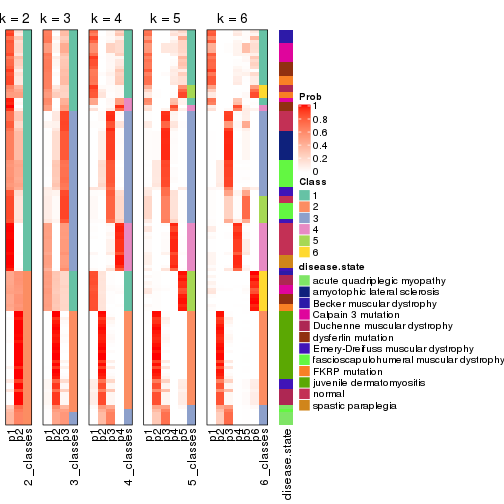


Test correlation between subgroups and known annotations. If the known
annotation is numeric, one-way ANOVA test is applied, and if the known
annotation is discrete, chi-squared contingency table test is applied.

```r
test_to_known_factors(res)
```

```
#>              n disease.state(p) k
#> MAD:hclust  91         3.47e-13 2
#> MAD:hclust  90         5.69e-24 3
#> MAD:hclust 110         2.57e-33 4
#> MAD:hclust 115         1.30e-33 5
#> MAD:hclust 106         2.64e-31 6
```


If matrix rows can be associated to genes, consider to use `GO_Enrichment(res,
...)` to perform function enrichment for the signature genes.


 

---------------------------------------------------


### MAD:kmeans*


The object with results only for a single top-value method and a single partition method 
can be extracted as:

```r
res = res_list["MAD", "kmeans"]
# you can also extract it by
# res = res_list["MAD:kmeans"]
```

A summary of `res` and all the functions that can be applied to it:

```r
res
```

```
#> A 'ConsensusPartition' object with k = 2, 3, 4, 5, 6.
#>   On a matrix with 21168 rows and 121 columns.
#>   Top rows (1000, 2000, 3000, 4000, 5000) are extracted by 'MAD' method.
#>   Subgroups are detected by 'kmeans' method.
#>   Performed in total 1250 partitions by row resampling.
#>   Best k for subgroups seems to be 2.
#> 
#> Following methods can be applied to this 'ConsensusPartition' object:
#>  [1] "cola_report"             "collect_classes"         "collect_plots"          
#>  [4] "collect_stats"           "colnames"                "compare_signatures"     
#>  [7] "consensus_heatmap"       "dimension_reduction"     "functional_enrichment"  
#> [10] "get_anno_col"            "get_anno"                "get_classes"            
#> [13] "get_consensus"           "get_matrix"              "get_membership"         
#> [16] "get_param"               "get_signatures"          "get_stats"              
#> [19] "is_best_k"               "is_stable_k"             "membership_heatmap"     
#> [22] "ncol"                    "nrow"                    "plot_ecdf"              
#> [25] "rownames"                "select_partition_number" "show"                   
#> [28] "suggest_best_k"          "test_to_known_factors"
```

`collect_plots()` function collects all the plots made from `res` for all `k` (number of partitions)
into one single page to provide an easy and fast comparison between different `k`.

```r
collect_plots(res)
```


The plots are:

- The first row: a plot of the ECDF (Empirical cumulative distribution
  function) curves of the consensus matrix for each `k` and the heatmap of
  predicted classes for each `k`.
- The second row: heatmaps of the consensus matrix for each `k`.
- The third row: heatmaps of the membership matrix for each `k`.
- The fouth row: heatmaps of the signatures for each `k`.

All the plots in panels can be made by individual functions and they are
plotted later in this section.

`select_partition_number()` produces several plots showing different
statistics for choosing "optimized" `k`. There are following statistics:

- ECDF curves of the consensus matrix for each `k`;
- 1-PAC. [The PAC
  score](https://en.wikipedia.org/wiki/Consensus_clustering#Over-interpretation_potential_of_consensus_clustering)
  measures the proportion of the ambiguous subgrouping.
- Mean silhouette score.
- Concordance. The mean probability of fiting the consensus class ids in all
  partitions.
- Area increased. Denote $A_k$ as the area under the ECDF curve for current
  `k`, the area increased is defined as $A_k - A_{k-1}$.
- Rand index. The percent of pairs of samples that are both in a same cluster
  or both are not in a same cluster in the partition of k and k-1.
- Jaccard index. The ratio of pairs of samples are both in a same cluster in
  the partition of k and k-1 and the pairs of samples are both in a same
  cluster in the partition k or k-1.

The detailed explanations of these statistics can be found in [the cola
vignette](http://bioconductor.org/packages/devel/bioc/vignettes/cola/inst/doc/cola.html#toc_13).

Generally speaking, lower PAC score, higher mean silhouette score or higher
concordance corresponds to better partition. Rand index and Jaccard index
measure how similar the current partition is compared to partition with `k-1`.
If they are too similar, we won't accept `k` is better than `k-1`.

```r
select_partition_number(res)
```


The numeric values for all these statistics can be obtained by `get_stats()`.

```r
get_stats(res)
```

```
#>   k 1-PAC mean_silhouette concordance area_increased  Rand Jaccard
#> 2 2 0.919           0.956       0.980         0.4998 0.499   0.499
#> 3 3 0.841           0.844       0.925         0.3347 0.691   0.458
#> 4 4 0.767           0.768       0.870         0.1197 0.906   0.725
#> 5 5 0.748           0.642       0.811         0.0541 0.898   0.656
#> 6 6 0.756           0.647       0.789         0.0380 0.899   0.607
```

`suggest_best_k()` suggests the best $k$ based on these statistics. The rules are as follows:

- All $k$ with Jaccard index larger than 0.95 are removed because the increase of
  the partition number does not provides enough extra information. If all $k$ are removed,
  the best $k$ is assigned by `NA`.
- For $k$ with 1-PAC larger than 0.9, the maximal $k$ is taken as the "best k". Other $k$ is called "optional k".
- If it does not fit the second rule. The $k$ with the highest vote of highest
  1-PAC, mean silhouette and concordance is taken as the "best k".

```r
suggest_best_k(res)
```

```
#> [1] 2
```


Following shows the table of the partitions (You need to click the **show/hide
code output** link to see it). The membership matrix (columns with name `p*`)
is inferred by
[`clue::cl_consensus()`](https://www.rdocumentation.org/link/cl_consensus?package=clue)
function with the `SE` method. Basically the value in the membership matrix
represents the probability to belong to a certain group. The finall class
label for an item is determined with the group with highest probability it
belongs to.

In `get_classes()` function, the entropy is calculated from the membership
matrix and the silhouette score is calculated from the consensus matrix.


<script>
$( function() {
	$( '#tabs-MAD-kmeans-get-classes' ).tabs();
} );
</script>
<div id='tabs-MAD-kmeans-get-classes'>
<ul>
<li><a href='#tab-MAD-kmeans-get-classes-1'>k = 2</a></li>
<li><a href='#tab-MAD-kmeans-get-classes-2'>k = 3</a></li>
<li><a href='#tab-MAD-kmeans-get-classes-3'>k = 4</a></li>
<li><a href='#tab-MAD-kmeans-get-classes-4'>k = 5</a></li>
<li><a href='#tab-MAD-kmeans-get-classes-5'>k = 6</a></li>
</ul>

<div id='tab-MAD-kmeans-get-classes-1'>
<p><a id='tab-MAD-kmeans-get-classes-1-a' style='color:#0366d6' href='#'>show/hide code output</a></p>
<pre><code class="r">cbind(get_classes(res, k = 2), get_membership(res, k = 2))
</code></pre>

<pre><code>#&gt;           class entropy silhouette    p1    p2
#&gt; GSM74356      2  0.3431      0.926 0.064 0.936
#&gt; GSM74357      2  0.6343      0.835 0.160 0.840
#&gt; GSM74358      2  0.6343      0.835 0.160 0.840
#&gt; GSM74359      1  0.0000      0.984 1.000 0.000
#&gt; GSM74360      1  0.0000      0.984 1.000 0.000
#&gt; GSM74361      2  0.6148      0.844 0.152 0.848
#&gt; GSM74362      2  0.6531      0.825 0.168 0.832
#&gt; GSM74363      2  0.3274      0.930 0.060 0.940
#&gt; GSM74402      1  0.0000      0.984 1.000 0.000
#&gt; GSM74403      1  0.0000      0.984 1.000 0.000
#&gt; GSM74404      1  0.0000      0.984 1.000 0.000
#&gt; GSM74406      1  0.0000      0.984 1.000 0.000
#&gt; GSM74407      1  0.0000      0.984 1.000 0.000
#&gt; GSM74408      1  0.0000      0.984 1.000 0.000
#&gt; GSM74409      1  0.0000      0.984 1.000 0.000
#&gt; GSM74410      1  0.0000      0.984 1.000 0.000
#&gt; GSM119936     1  0.0000      0.984 1.000 0.000
#&gt; GSM119937     1  0.0000      0.984 1.000 0.000
#&gt; GSM74411      2  0.0000      0.973 0.000 1.000
#&gt; GSM74412      2  0.0000      0.973 0.000 1.000
#&gt; GSM74413      2  0.0000      0.973 0.000 1.000
#&gt; GSM74414      2  0.0000      0.973 0.000 1.000
#&gt; GSM74415      2  0.0000      0.973 0.000 1.000
#&gt; GSM121379     2  0.0000      0.973 0.000 1.000
#&gt; GSM121380     2  0.0000      0.973 0.000 1.000
#&gt; GSM121381     2  0.0000      0.973 0.000 1.000
#&gt; GSM121382     2  0.0000      0.973 0.000 1.000
#&gt; GSM121383     2  0.0000      0.973 0.000 1.000
#&gt; GSM121384     2  0.0000      0.973 0.000 1.000
#&gt; GSM121385     2  0.0000      0.973 0.000 1.000
#&gt; GSM121386     2  0.0000      0.973 0.000 1.000
#&gt; GSM121387     2  0.0000      0.973 0.000 1.000
#&gt; GSM121388     2  0.0000      0.973 0.000 1.000
#&gt; GSM121389     2  0.0000      0.973 0.000 1.000
#&gt; GSM121390     2  0.0000      0.973 0.000 1.000
#&gt; GSM121391     2  0.0000      0.973 0.000 1.000
#&gt; GSM121392     2  0.0000      0.973 0.000 1.000
#&gt; GSM121393     2  0.0000      0.973 0.000 1.000
#&gt; GSM121394     2  0.0000      0.973 0.000 1.000
#&gt; GSM121395     2  0.0000      0.973 0.000 1.000
#&gt; GSM121396     2  0.0000      0.973 0.000 1.000
#&gt; GSM121397     2  0.0000      0.973 0.000 1.000
#&gt; GSM121398     2  0.0000      0.973 0.000 1.000
#&gt; GSM121399     2  0.0000      0.973 0.000 1.000
#&gt; GSM74240      2  0.7056      0.793 0.192 0.808
#&gt; GSM74241      2  0.5408      0.872 0.124 0.876
#&gt; GSM74242      1  0.9661      0.320 0.608 0.392
#&gt; GSM74243      1  0.9522      0.376 0.628 0.372
#&gt; GSM74244      2  0.2236      0.948 0.036 0.964
#&gt; GSM74245      2  0.6247      0.839 0.156 0.844
#&gt; GSM74246      2  0.0000      0.973 0.000 1.000
#&gt; GSM74247      2  0.0000      0.973 0.000 1.000
#&gt; GSM74248      2  0.7056      0.793 0.192 0.808
#&gt; GSM74416      1  0.0000      0.984 1.000 0.000
#&gt; GSM74417      1  0.0000      0.984 1.000 0.000
#&gt; GSM74418      1  0.0000      0.984 1.000 0.000
#&gt; GSM74419      1  0.0000      0.984 1.000 0.000
#&gt; GSM121358     2  0.0000      0.973 0.000 1.000
#&gt; GSM121359     2  0.0000      0.973 0.000 1.000
#&gt; GSM121360     1  0.0000      0.984 1.000 0.000
#&gt; GSM121362     1  0.0000      0.984 1.000 0.000
#&gt; GSM121364     1  0.0000      0.984 1.000 0.000
#&gt; GSM121365     2  0.0000      0.973 0.000 1.000
#&gt; GSM121366     2  0.0000      0.973 0.000 1.000
#&gt; GSM121367     2  0.0000      0.973 0.000 1.000
#&gt; GSM121370     2  0.0000      0.973 0.000 1.000
#&gt; GSM121371     2  0.0000      0.973 0.000 1.000
#&gt; GSM121372     2  0.0000      0.973 0.000 1.000
#&gt; GSM121373     1  0.0000      0.984 1.000 0.000
#&gt; GSM121374     1  0.0000      0.984 1.000 0.000
#&gt; GSM121407     2  0.0000      0.973 0.000 1.000
#&gt; GSM74387      2  0.0000      0.973 0.000 1.000
#&gt; GSM74388      2  0.0000      0.973 0.000 1.000
#&gt; GSM74389      1  0.0000      0.984 1.000 0.000
#&gt; GSM74390      1  0.0000      0.984 1.000 0.000
#&gt; GSM74391      1  0.0000      0.984 1.000 0.000
#&gt; GSM74392      1  0.0000      0.984 1.000 0.000
#&gt; GSM74393      1  0.0000      0.984 1.000 0.000
#&gt; GSM74394      2  0.0000      0.973 0.000 1.000
#&gt; GSM74239      1  0.0000      0.984 1.000 0.000
#&gt; GSM74364      1  0.0000      0.984 1.000 0.000
#&gt; GSM74365      1  0.0000      0.984 1.000 0.000
#&gt; GSM74366      1  0.2043      0.954 0.968 0.032
#&gt; GSM74367      1  0.0000      0.984 1.000 0.000
#&gt; GSM74377      1  0.0000      0.984 1.000 0.000
#&gt; GSM74378      1  0.0376      0.981 0.996 0.004
#&gt; GSM74379      1  0.0000      0.984 1.000 0.000
#&gt; GSM74380      1  0.0000      0.984 1.000 0.000
#&gt; GSM74381      1  0.0000      0.984 1.000 0.000
#&gt; GSM121357     2  0.0000      0.973 0.000 1.000
#&gt; GSM121361     2  0.0000      0.973 0.000 1.000
#&gt; GSM121363     2  0.0000      0.973 0.000 1.000
#&gt; GSM121368     2  0.0000      0.973 0.000 1.000
#&gt; GSM121369     2  0.0000      0.973 0.000 1.000
#&gt; GSM74368      1  0.0000      0.984 1.000 0.000
#&gt; GSM74369      1  0.0000      0.984 1.000 0.000
#&gt; GSM74370      1  0.0000      0.984 1.000 0.000
#&gt; GSM74371      1  0.0000      0.984 1.000 0.000
#&gt; GSM74372      1  0.0000      0.984 1.000 0.000
#&gt; GSM74373      1  0.0000      0.984 1.000 0.000
#&gt; GSM74374      1  0.0000      0.984 1.000 0.000
#&gt; GSM74375      1  0.0000      0.984 1.000 0.000
#&gt; GSM74376      1  0.0000      0.984 1.000 0.000
#&gt; GSM74405      1  0.0000      0.984 1.000 0.000
#&gt; GSM74351      1  0.0000      0.984 1.000 0.000
#&gt; GSM74352      1  0.4022      0.904 0.920 0.080
#&gt; GSM74353      1  0.0000      0.984 1.000 0.000
#&gt; GSM74354      1  0.0000      0.984 1.000 0.000
#&gt; GSM74355      1  0.0376      0.981 0.996 0.004
#&gt; GSM74382      1  0.0000      0.984 1.000 0.000
#&gt; GSM74383      1  0.0000      0.984 1.000 0.000
#&gt; GSM74384      1  0.4298      0.895 0.912 0.088
#&gt; GSM74385      1  0.0000      0.984 1.000 0.000
#&gt; GSM74386      1  0.0000      0.984 1.000 0.000
#&gt; GSM74395      1  0.0000      0.984 1.000 0.000
#&gt; GSM74396      1  0.0000      0.984 1.000 0.000
#&gt; GSM74397      1  0.0000      0.984 1.000 0.000
#&gt; GSM74398      1  0.0000      0.984 1.000 0.000
#&gt; GSM74399      1  0.0000      0.984 1.000 0.000
#&gt; GSM74400      1  0.0000      0.984 1.000 0.000
#&gt; GSM74401      1  0.0000      0.984 1.000 0.000
</code></pre>

<script>
$('#tab-MAD-kmeans-get-classes-1-a').parent().next().next().hide();
$('#tab-MAD-kmeans-get-classes-1-a').click(function(){
  $('#tab-MAD-kmeans-get-classes-1-a').parent().next().next().toggle();
  return(false);
});
</script>
</div>

<div id='tab-MAD-kmeans-get-classes-2'>
<p><a id='tab-MAD-kmeans-get-classes-2-a' style='color:#0366d6' href='#'>show/hide code output</a></p>
<pre><code class="r">cbind(get_classes(res, k = 3), get_membership(res, k = 3))
</code></pre>

<pre><code>#&gt;           class entropy silhouette    p1    p2    p3
#&gt; GSM74356      3  0.0424      0.806 0.000 0.008 0.992
#&gt; GSM74357      3  0.0424      0.806 0.000 0.008 0.992
#&gt; GSM74358      3  0.0424      0.806 0.000 0.008 0.992
#&gt; GSM74359      3  0.0747      0.809 0.016 0.000 0.984
#&gt; GSM74360      3  0.2537      0.799 0.080 0.000 0.920
#&gt; GSM74361      3  0.0424      0.806 0.000 0.008 0.992
#&gt; GSM74362      3  0.0424      0.806 0.000 0.008 0.992
#&gt; GSM74363      3  0.0424      0.806 0.000 0.008 0.992
#&gt; GSM74402      3  0.6095      0.406 0.392 0.000 0.608
#&gt; GSM74403      3  0.6260      0.273 0.448 0.000 0.552
#&gt; GSM74404      3  0.6235      0.306 0.436 0.000 0.564
#&gt; GSM74406      3  0.2537      0.799 0.080 0.000 0.920
#&gt; GSM74407      3  0.5058      0.653 0.244 0.000 0.756
#&gt; GSM74408      3  0.2537      0.799 0.080 0.000 0.920
#&gt; GSM74409      3  0.2537      0.799 0.080 0.000 0.920
#&gt; GSM74410      3  0.2448      0.801 0.076 0.000 0.924
#&gt; GSM119936     3  0.2537      0.799 0.080 0.000 0.920
#&gt; GSM119937     3  0.4654      0.695 0.208 0.000 0.792
#&gt; GSM74411      2  0.2537      0.915 0.000 0.920 0.080
#&gt; GSM74412      2  0.1031      0.959 0.000 0.976 0.024
#&gt; GSM74413      2  0.2537      0.915 0.000 0.920 0.080
#&gt; GSM74414      2  0.0000      0.969 0.000 1.000 0.000
#&gt; GSM74415      2  0.6235      0.190 0.000 0.564 0.436
#&gt; GSM121379     2  0.0000      0.969 0.000 1.000 0.000
#&gt; GSM121380     2  0.0000      0.969 0.000 1.000 0.000
#&gt; GSM121381     2  0.0000      0.969 0.000 1.000 0.000
#&gt; GSM121382     2  0.0000      0.969 0.000 1.000 0.000
#&gt; GSM121383     2  0.0000      0.969 0.000 1.000 0.000
#&gt; GSM121384     2  0.0000      0.969 0.000 1.000 0.000
#&gt; GSM121385     2  0.0000      0.969 0.000 1.000 0.000
#&gt; GSM121386     2  0.0000      0.969 0.000 1.000 0.000
#&gt; GSM121387     2  0.0000      0.969 0.000 1.000 0.000
#&gt; GSM121388     2  0.0000      0.969 0.000 1.000 0.000
#&gt; GSM121389     2  0.0000      0.969 0.000 1.000 0.000
#&gt; GSM121390     2  0.0000      0.969 0.000 1.000 0.000
#&gt; GSM121391     2  0.0000      0.969 0.000 1.000 0.000
#&gt; GSM121392     2  0.0424      0.964 0.008 0.992 0.000
#&gt; GSM121393     2  0.0000      0.969 0.000 1.000 0.000
#&gt; GSM121394     2  0.0000      0.969 0.000 1.000 0.000
#&gt; GSM121395     2  0.0000      0.969 0.000 1.000 0.000
#&gt; GSM121396     2  0.0747      0.963 0.000 0.984 0.016
#&gt; GSM121397     2  0.0000      0.969 0.000 1.000 0.000
#&gt; GSM121398     2  0.0000      0.969 0.000 1.000 0.000
#&gt; GSM121399     2  0.0000      0.969 0.000 1.000 0.000
#&gt; GSM74240      3  0.0424      0.806 0.000 0.008 0.992
#&gt; GSM74241      3  0.4796      0.631 0.000 0.220 0.780
#&gt; GSM74242      3  0.0424      0.806 0.000 0.008 0.992
#&gt; GSM74243      3  0.0424      0.806 0.000 0.008 0.992
#&gt; GSM74244      3  0.3340      0.734 0.000 0.120 0.880
#&gt; GSM74245      3  0.0424      0.806 0.000 0.008 0.992
#&gt; GSM74246      3  0.6180      0.284 0.000 0.416 0.584
#&gt; GSM74247      3  0.6267      0.176 0.000 0.452 0.548
#&gt; GSM74248      3  0.0424      0.806 0.000 0.008 0.992
#&gt; GSM74416      3  0.6225      0.316 0.432 0.000 0.568
#&gt; GSM74417      3  0.6225      0.316 0.432 0.000 0.568
#&gt; GSM74418      3  0.6244      0.295 0.440 0.000 0.560
#&gt; GSM74419      3  0.2537      0.799 0.080 0.000 0.920
#&gt; GSM121358     3  0.6026      0.385 0.000 0.376 0.624
#&gt; GSM121359     2  0.2537      0.915 0.000 0.920 0.080
#&gt; GSM121360     3  0.3340      0.777 0.120 0.000 0.880
#&gt; GSM121362     3  0.4842      0.682 0.224 0.000 0.776
#&gt; GSM121364     3  0.1031      0.810 0.024 0.000 0.976
#&gt; GSM121365     3  0.6026      0.385 0.000 0.376 0.624
#&gt; GSM121366     3  0.6026      0.385 0.000 0.376 0.624
#&gt; GSM121367     3  0.6026      0.385 0.000 0.376 0.624
#&gt; GSM121370     3  0.6026      0.385 0.000 0.376 0.624
#&gt; GSM121371     3  0.6026      0.385 0.000 0.376 0.624
#&gt; GSM121372     2  0.2537      0.915 0.000 0.920 0.080
#&gt; GSM121373     3  0.2448      0.800 0.076 0.000 0.924
#&gt; GSM121374     3  0.1031      0.810 0.024 0.000 0.976
#&gt; GSM121407     2  0.0592      0.965 0.000 0.988 0.012
#&gt; GSM74387      2  0.2680      0.923 0.008 0.924 0.068
#&gt; GSM74388      2  0.0892      0.958 0.020 0.980 0.000
#&gt; GSM74389      3  0.0592      0.809 0.012 0.000 0.988
#&gt; GSM74390      1  0.0000      0.993 1.000 0.000 0.000
#&gt; GSM74391      3  0.2537      0.799 0.080 0.000 0.920
#&gt; GSM74392      3  0.0892      0.810 0.020 0.000 0.980
#&gt; GSM74393      3  0.0237      0.807 0.004 0.000 0.996
#&gt; GSM74394      2  0.1315      0.959 0.020 0.972 0.008
#&gt; GSM74239      1  0.0424      0.993 0.992 0.000 0.008
#&gt; GSM74364      1  0.0424      0.993 0.992 0.000 0.008
#&gt; GSM74365      1  0.0000      0.993 1.000 0.000 0.000
#&gt; GSM74366      1  0.0237      0.990 0.996 0.004 0.000
#&gt; GSM74367      1  0.0424      0.993 0.992 0.000 0.008
#&gt; GSM74377      1  0.0000      0.993 1.000 0.000 0.000
#&gt; GSM74378      1  0.0237      0.990 0.996 0.004 0.000
#&gt; GSM74379      1  0.0000      0.993 1.000 0.000 0.000
#&gt; GSM74380      1  0.0000      0.993 1.000 0.000 0.000
#&gt; GSM74381      1  0.0000      0.993 1.000 0.000 0.000
#&gt; GSM121357     2  0.0424      0.967 0.000 0.992 0.008
#&gt; GSM121361     2  0.1453      0.956 0.024 0.968 0.008
#&gt; GSM121363     2  0.1315      0.959 0.020 0.972 0.008
#&gt; GSM121368     2  0.1315      0.959 0.020 0.972 0.008
#&gt; GSM121369     2  0.1774      0.954 0.024 0.960 0.016
#&gt; GSM74368      1  0.0424      0.993 0.992 0.000 0.008
#&gt; GSM74369      1  0.0424      0.993 0.992 0.000 0.008
#&gt; GSM74370      1  0.0424      0.993 0.992 0.000 0.008
#&gt; GSM74371      1  0.0424      0.993 0.992 0.000 0.008
#&gt; GSM74372      1  0.0424      0.993 0.992 0.000 0.008
#&gt; GSM74373      1  0.0000      0.993 1.000 0.000 0.000
#&gt; GSM74374      1  0.0424      0.993 0.992 0.000 0.008
#&gt; GSM74375      1  0.0000      0.993 1.000 0.000 0.000
#&gt; GSM74376      1  0.0000      0.993 1.000 0.000 0.000
#&gt; GSM74405      1  0.0000      0.993 1.000 0.000 0.000
#&gt; GSM74351      1  0.1163      0.973 0.972 0.000 0.028
#&gt; GSM74352      1  0.0424      0.986 0.992 0.008 0.000
#&gt; GSM74353      1  0.0424      0.993 0.992 0.000 0.008
#&gt; GSM74354      1  0.0424      0.993 0.992 0.000 0.008
#&gt; GSM74355      1  0.0237      0.990 0.996 0.004 0.000
#&gt; GSM74382      1  0.1753      0.950 0.952 0.000 0.048
#&gt; GSM74383      1  0.0424      0.993 0.992 0.000 0.008
#&gt; GSM74384      1  0.0424      0.986 0.992 0.008 0.000
#&gt; GSM74385      1  0.0424      0.993 0.992 0.000 0.008
#&gt; GSM74386      1  0.0424      0.993 0.992 0.000 0.008
#&gt; GSM74395      1  0.0424      0.993 0.992 0.000 0.008
#&gt; GSM74396      1  0.0424      0.993 0.992 0.000 0.008
#&gt; GSM74397      1  0.0424      0.993 0.992 0.000 0.008
#&gt; GSM74398      1  0.0000      0.993 1.000 0.000 0.000
#&gt; GSM74399      1  0.0000      0.993 1.000 0.000 0.000
#&gt; GSM74400      1  0.0000      0.993 1.000 0.000 0.000
#&gt; GSM74401      1  0.0000      0.993 1.000 0.000 0.000
</code></pre>

<script>
$('#tab-MAD-kmeans-get-classes-2-a').parent().next().next().hide();
$('#tab-MAD-kmeans-get-classes-2-a').click(function(){
  $('#tab-MAD-kmeans-get-classes-2-a').parent().next().next().toggle();
  return(false);
});
</script>
</div>

<div id='tab-MAD-kmeans-get-classes-3'>
<p><a id='tab-MAD-kmeans-get-classes-3-a' style='color:#0366d6' href='#'>show/hide code output</a></p>
<pre><code class="r">cbind(get_classes(res, k = 4), get_membership(res, k = 4))
</code></pre>

<pre><code>#&gt;           class entropy silhouette    p1    p2    p3    p4
#&gt; GSM74356      3  0.5028      0.827 0.000 0.400 0.596 0.004
#&gt; GSM74357      3  0.5028      0.827 0.000 0.400 0.596 0.004
#&gt; GSM74358      3  0.5028      0.827 0.000 0.400 0.596 0.004
#&gt; GSM74359      3  0.0336      0.337 0.000 0.000 0.992 0.008
#&gt; GSM74360      3  0.4877     -0.777 0.000 0.000 0.592 0.408
#&gt; GSM74361      3  0.4855      0.828 0.000 0.400 0.600 0.000
#&gt; GSM74362      3  0.4855      0.828 0.000 0.400 0.600 0.000
#&gt; GSM74363      3  0.5039      0.828 0.000 0.404 0.592 0.004
#&gt; GSM74402      4  0.5500      0.938 0.016 0.000 0.464 0.520
#&gt; GSM74403      4  0.5764      0.935 0.028 0.000 0.452 0.520
#&gt; GSM74404      4  0.5764      0.935 0.028 0.000 0.452 0.520
#&gt; GSM74406      4  0.4998      0.931 0.000 0.000 0.488 0.512
#&gt; GSM74407      4  0.5594      0.938 0.020 0.000 0.460 0.520
#&gt; GSM74408      4  0.4998      0.931 0.000 0.000 0.488 0.512
#&gt; GSM74409      4  0.4998      0.931 0.000 0.000 0.488 0.512
#&gt; GSM74410      4  0.4998      0.931 0.000 0.000 0.488 0.512
#&gt; GSM119936     4  0.4998      0.931 0.000 0.000 0.488 0.512
#&gt; GSM119937     4  0.4994      0.934 0.000 0.000 0.480 0.520
#&gt; GSM74411      2  0.1191      0.342 0.004 0.968 0.024 0.004
#&gt; GSM74412      2  0.2197      0.523 0.004 0.916 0.000 0.080
#&gt; GSM74413      2  0.1191      0.342 0.004 0.968 0.024 0.004
#&gt; GSM74414      2  0.5088      0.837 0.004 0.572 0.000 0.424
#&gt; GSM74415      3  0.5328      0.805 0.004 0.472 0.520 0.004
#&gt; GSM121379     2  0.4972      0.849 0.000 0.544 0.000 0.456
#&gt; GSM121380     2  0.4972      0.849 0.000 0.544 0.000 0.456
#&gt; GSM121381     2  0.4972      0.849 0.000 0.544 0.000 0.456
#&gt; GSM121382     2  0.4972      0.849 0.000 0.544 0.000 0.456
#&gt; GSM121383     2  0.4972      0.849 0.000 0.544 0.000 0.456
#&gt; GSM121384     2  0.4972      0.849 0.000 0.544 0.000 0.456
#&gt; GSM121385     2  0.4972      0.849 0.000 0.544 0.000 0.456
#&gt; GSM121386     2  0.4972      0.849 0.000 0.544 0.000 0.456
#&gt; GSM121387     2  0.4972      0.849 0.000 0.544 0.000 0.456
#&gt; GSM121388     2  0.4972      0.849 0.000 0.544 0.000 0.456
#&gt; GSM121389     2  0.4972      0.849 0.000 0.544 0.000 0.456
#&gt; GSM121390     2  0.4977      0.847 0.000 0.540 0.000 0.460
#&gt; GSM121391     2  0.4972      0.849 0.000 0.544 0.000 0.456
#&gt; GSM121392     2  0.4977      0.847 0.000 0.540 0.000 0.460
#&gt; GSM121393     2  0.4972      0.849 0.000 0.544 0.000 0.456
#&gt; GSM121394     2  0.4972      0.849 0.000 0.544 0.000 0.456
#&gt; GSM121395     2  0.4972      0.849 0.000 0.544 0.000 0.456
#&gt; GSM121396     2  0.2973      0.588 0.000 0.856 0.000 0.144
#&gt; GSM121397     2  0.4972      0.849 0.000 0.544 0.000 0.456
#&gt; GSM121398     2  0.4972      0.849 0.000 0.544 0.000 0.456
#&gt; GSM121399     2  0.4972      0.849 0.000 0.544 0.000 0.456
#&gt; GSM74240      3  0.5290      0.823 0.004 0.440 0.552 0.004
#&gt; GSM74241      3  0.5308      0.818 0.004 0.452 0.540 0.004
#&gt; GSM74242      3  0.4855      0.826 0.000 0.400 0.600 0.000
#&gt; GSM74243      3  0.4855      0.826 0.000 0.400 0.600 0.000
#&gt; GSM74244      3  0.5297      0.822 0.004 0.444 0.548 0.004
#&gt; GSM74245      3  0.5284      0.824 0.004 0.436 0.556 0.004
#&gt; GSM74246      3  0.5666      0.806 0.004 0.460 0.520 0.016
#&gt; GSM74247      3  0.5666      0.806 0.004 0.460 0.520 0.016
#&gt; GSM74248      3  0.5284      0.824 0.004 0.436 0.556 0.004
#&gt; GSM74416      4  0.5682      0.937 0.024 0.000 0.456 0.520
#&gt; GSM74417      4  0.5682      0.937 0.024 0.000 0.456 0.520
#&gt; GSM74418      4  0.5682      0.937 0.024 0.000 0.456 0.520
#&gt; GSM74419      4  0.4998      0.931 0.000 0.000 0.488 0.512
#&gt; GSM121358     3  0.4941      0.827 0.000 0.436 0.564 0.000
#&gt; GSM121359     2  0.2521      0.286 0.000 0.912 0.064 0.024
#&gt; GSM121360     3  0.4359      0.269 0.164 0.016 0.804 0.016
#&gt; GSM121362     3  0.4012      0.223 0.204 0.004 0.788 0.004
#&gt; GSM121364     3  0.0469      0.328 0.000 0.000 0.988 0.012
#&gt; GSM121365     3  0.4941      0.827 0.000 0.436 0.564 0.000
#&gt; GSM121366     3  0.4941      0.827 0.000 0.436 0.564 0.000
#&gt; GSM121367     3  0.4941      0.827 0.000 0.436 0.564 0.000
#&gt; GSM121370     3  0.4941      0.827 0.000 0.436 0.564 0.000
#&gt; GSM121371     3  0.4941      0.827 0.000 0.436 0.564 0.000
#&gt; GSM121372     2  0.1629      0.374 0.000 0.952 0.024 0.024
#&gt; GSM121373     3  0.0336      0.337 0.000 0.000 0.992 0.008
#&gt; GSM121374     3  0.0336      0.337 0.000 0.000 0.992 0.008
#&gt; GSM121407     2  0.4522      0.783 0.000 0.680 0.000 0.320
#&gt; GSM74387      2  0.5385      0.140 0.140 0.772 0.056 0.032
#&gt; GSM74388      2  0.7969      0.677 0.252 0.384 0.004 0.360
#&gt; GSM74389      3  0.4222      0.733 0.000 0.272 0.728 0.000
#&gt; GSM74390      1  0.0712      0.870 0.984 0.008 0.004 0.004
#&gt; GSM74391      4  0.5328      0.936 0.004 0.004 0.472 0.520
#&gt; GSM74392      3  0.0921      0.279 0.000 0.000 0.972 0.028
#&gt; GSM74393      3  0.4936      0.818 0.004 0.372 0.624 0.000
#&gt; GSM74394      2  0.7967      0.675 0.252 0.388 0.004 0.356
#&gt; GSM74239      1  0.4798      0.809 0.768 0.000 0.052 0.180
#&gt; GSM74364      1  0.5132      0.784 0.748 0.000 0.068 0.184
#&gt; GSM74365      1  0.2593      0.881 0.892 0.000 0.004 0.104
#&gt; GSM74366      1  0.0524      0.872 0.988 0.004 0.000 0.008
#&gt; GSM74367      1  0.4244      0.841 0.800 0.000 0.032 0.168
#&gt; GSM74377      1  0.0000      0.878 1.000 0.000 0.000 0.000
#&gt; GSM74378      1  0.0336      0.875 0.992 0.000 0.000 0.008
#&gt; GSM74379      1  0.0188      0.878 0.996 0.000 0.004 0.000
#&gt; GSM74380      1  0.0000      0.878 1.000 0.000 0.000 0.000
#&gt; GSM74381      1  0.0000      0.878 1.000 0.000 0.000 0.000
#&gt; GSM121357     2  0.4925      0.841 0.000 0.572 0.000 0.428
#&gt; GSM121361     2  0.7969      0.677 0.252 0.384 0.004 0.360
#&gt; GSM121363     2  0.7969      0.677 0.252 0.384 0.004 0.360
#&gt; GSM121368     2  0.7969      0.677 0.252 0.384 0.004 0.360
#&gt; GSM121369     2  0.7978      0.663 0.260 0.396 0.004 0.340
#&gt; GSM74368      1  0.3501      0.872 0.848 0.000 0.020 0.132
#&gt; GSM74369      1  0.3501      0.872 0.848 0.000 0.020 0.132
#&gt; GSM74370      1  0.3501      0.872 0.848 0.000 0.020 0.132
#&gt; GSM74371      4  0.6837      0.152 0.392 0.000 0.104 0.504
#&gt; GSM74372      1  0.3812      0.864 0.832 0.000 0.028 0.140
#&gt; GSM74373      1  0.0000      0.878 1.000 0.000 0.000 0.000
#&gt; GSM74374      1  0.3390      0.873 0.852 0.000 0.016 0.132
#&gt; GSM74375      1  0.0469      0.880 0.988 0.000 0.000 0.012
#&gt; GSM74376      1  0.0376      0.874 0.992 0.004 0.000 0.004
#&gt; GSM74405      1  0.0000      0.878 1.000 0.000 0.000 0.000
#&gt; GSM74351      4  0.6600      0.878 0.084 0.000 0.396 0.520
#&gt; GSM74352      1  0.0376      0.874 0.992 0.004 0.000 0.004
#&gt; GSM74353      1  0.4466      0.826 0.784 0.000 0.036 0.180
#&gt; GSM74354      1  0.3390      0.873 0.852 0.000 0.016 0.132
#&gt; GSM74355      1  0.0188      0.876 0.996 0.000 0.000 0.004
#&gt; GSM74382      4  0.6458      0.891 0.072 0.000 0.408 0.520
#&gt; GSM74383      1  0.4152      0.848 0.808 0.000 0.032 0.160
#&gt; GSM74384      1  0.0524      0.872 0.988 0.004 0.000 0.008
#&gt; GSM74385      1  0.5142      0.780 0.744 0.000 0.064 0.192
#&gt; GSM74386      1  0.4244      0.845 0.804 0.000 0.036 0.160
#&gt; GSM74395      1  0.5021      0.794 0.756 0.000 0.064 0.180
#&gt; GSM74396      1  0.3863      0.862 0.828 0.000 0.028 0.144
#&gt; GSM74397      1  0.5932      0.682 0.680 0.000 0.096 0.224
#&gt; GSM74398      1  0.0188      0.878 0.996 0.000 0.000 0.004
#&gt; GSM74399      1  0.0000      0.878 1.000 0.000 0.000 0.000
#&gt; GSM74400      1  0.2799      0.880 0.884 0.000 0.008 0.108
#&gt; GSM74401      1  0.2799      0.880 0.884 0.000 0.008 0.108
</code></pre>

<script>
$('#tab-MAD-kmeans-get-classes-3-a').parent().next().next().hide();
$('#tab-MAD-kmeans-get-classes-3-a').click(function(){
  $('#tab-MAD-kmeans-get-classes-3-a').parent().next().next().toggle();
  return(false);
});
</script>
</div>

<div id='tab-MAD-kmeans-get-classes-4'>
<p><a id='tab-MAD-kmeans-get-classes-4-a' style='color:#0366d6' href='#'>show/hide code output</a></p>
<pre><code class="r">cbind(get_classes(res, k = 5), get_membership(res, k = 5))
</code></pre>

<pre><code>#&gt;           class entropy silhouette    p1    p2    p3    p4    p5
#&gt; GSM74356      3  0.1195     0.7476 0.000 0.000 0.960 0.028 0.012
#&gt; GSM74357      3  0.1444     0.7425 0.000 0.000 0.948 0.040 0.012
#&gt; GSM74358      3  0.1444     0.7425 0.000 0.000 0.948 0.040 0.012
#&gt; GSM74359      4  0.6615     0.1853 0.000 0.000 0.324 0.444 0.232
#&gt; GSM74360      4  0.5594     0.4432 0.000 0.000 0.136 0.632 0.232
#&gt; GSM74361      3  0.1997     0.7418 0.000 0.000 0.924 0.040 0.036
#&gt; GSM74362      3  0.4732     0.5151 0.000 0.000 0.716 0.076 0.208
#&gt; GSM74363      3  0.1106     0.7491 0.000 0.000 0.964 0.024 0.012
#&gt; GSM74402      4  0.1205     0.7732 0.040 0.000 0.004 0.956 0.000
#&gt; GSM74403      4  0.1571     0.7689 0.060 0.000 0.004 0.936 0.000
#&gt; GSM74404      4  0.1571     0.7689 0.060 0.000 0.004 0.936 0.000
#&gt; GSM74406      4  0.0566     0.7703 0.012 0.000 0.004 0.984 0.000
#&gt; GSM74407      4  0.1571     0.7689 0.060 0.000 0.004 0.936 0.000
#&gt; GSM74408      4  0.0693     0.7596 0.000 0.000 0.008 0.980 0.012
#&gt; GSM74409      4  0.0798     0.7573 0.000 0.000 0.008 0.976 0.016
#&gt; GSM74410      4  0.0798     0.7573 0.000 0.000 0.008 0.976 0.016
#&gt; GSM119936     4  0.0960     0.7706 0.016 0.000 0.004 0.972 0.008
#&gt; GSM119937     4  0.1717     0.7712 0.052 0.000 0.004 0.936 0.008
#&gt; GSM74411      3  0.6071     0.4445 0.000 0.236 0.572 0.000 0.192
#&gt; GSM74412      3  0.6211     0.3969 0.000 0.264 0.544 0.000 0.192
#&gt; GSM74413      3  0.6071     0.4445 0.000 0.236 0.572 0.000 0.192
#&gt; GSM74414      2  0.2843     0.6862 0.000 0.848 0.008 0.000 0.144
#&gt; GSM74415      3  0.3421     0.7150 0.000 0.008 0.788 0.000 0.204
#&gt; GSM121379     2  0.0000     0.8274 0.000 1.000 0.000 0.000 0.000
#&gt; GSM121380     2  0.0000     0.8274 0.000 1.000 0.000 0.000 0.000
#&gt; GSM121381     2  0.0000     0.8274 0.000 1.000 0.000 0.000 0.000
#&gt; GSM121382     2  0.0000     0.8274 0.000 1.000 0.000 0.000 0.000
#&gt; GSM121383     2  0.0000     0.8274 0.000 1.000 0.000 0.000 0.000
#&gt; GSM121384     2  0.0000     0.8274 0.000 1.000 0.000 0.000 0.000
#&gt; GSM121385     2  0.0000     0.8274 0.000 1.000 0.000 0.000 0.000
#&gt; GSM121386     2  0.0000     0.8274 0.000 1.000 0.000 0.000 0.000
#&gt; GSM121387     2  0.0162     0.8257 0.000 0.996 0.000 0.000 0.004
#&gt; GSM121388     2  0.0955     0.8132 0.000 0.968 0.000 0.004 0.028
#&gt; GSM121389     2  0.0865     0.8141 0.000 0.972 0.000 0.004 0.024
#&gt; GSM121390     2  0.0000     0.8274 0.000 1.000 0.000 0.000 0.000
#&gt; GSM121391     2  0.0000     0.8274 0.000 1.000 0.000 0.000 0.000
#&gt; GSM121392     2  0.0324     0.8238 0.000 0.992 0.000 0.004 0.004
#&gt; GSM121393     2  0.0865     0.8141 0.000 0.972 0.000 0.004 0.024
#&gt; GSM121394     2  0.0000     0.8274 0.000 1.000 0.000 0.000 0.000
#&gt; GSM121395     2  0.0865     0.8141 0.000 0.972 0.000 0.004 0.024
#&gt; GSM121396     2  0.5401    -0.0310 0.000 0.492 0.452 0.000 0.056
#&gt; GSM121397     2  0.0000     0.8274 0.000 1.000 0.000 0.000 0.000
#&gt; GSM121398     2  0.0000     0.8274 0.000 1.000 0.000 0.000 0.000
#&gt; GSM121399     2  0.0000     0.8274 0.000 1.000 0.000 0.000 0.000
#&gt; GSM74240      3  0.3010     0.7410 0.000 0.000 0.824 0.004 0.172
#&gt; GSM74241      3  0.3109     0.7300 0.000 0.000 0.800 0.000 0.200
#&gt; GSM74242      3  0.3714     0.7279 0.000 0.000 0.812 0.056 0.132
#&gt; GSM74243      3  0.3714     0.7279 0.000 0.000 0.812 0.056 0.132
#&gt; GSM74244      3  0.2732     0.7425 0.000 0.000 0.840 0.000 0.160
#&gt; GSM74245      3  0.2732     0.7425 0.000 0.000 0.840 0.000 0.160
#&gt; GSM74246      3  0.3395     0.7100 0.000 0.000 0.764 0.000 0.236
#&gt; GSM74247      3  0.3395     0.7100 0.000 0.000 0.764 0.000 0.236
#&gt; GSM74248      3  0.3010     0.7410 0.000 0.000 0.824 0.004 0.172
#&gt; GSM74416      4  0.1788     0.7697 0.056 0.000 0.004 0.932 0.008
#&gt; GSM74417      4  0.1788     0.7697 0.056 0.000 0.004 0.932 0.008
#&gt; GSM74418      4  0.1788     0.7697 0.056 0.000 0.004 0.932 0.008
#&gt; GSM74419      4  0.0671     0.7715 0.016 0.000 0.004 0.980 0.000
#&gt; GSM121358     3  0.0867     0.7569 0.000 0.008 0.976 0.008 0.008
#&gt; GSM121359     3  0.4983     0.4494 0.000 0.272 0.664 0.000 0.064
#&gt; GSM121360     5  0.7071     0.1744 0.036 0.000 0.256 0.204 0.504
#&gt; GSM121362     5  0.7945     0.0948 0.092 0.000 0.284 0.224 0.400
#&gt; GSM121364     4  0.6598     0.1977 0.000 0.000 0.316 0.452 0.232
#&gt; GSM121365     3  0.0867     0.7569 0.000 0.008 0.976 0.008 0.008
#&gt; GSM121366     3  0.0981     0.7570 0.000 0.008 0.972 0.008 0.012
#&gt; GSM121367     3  0.0867     0.7569 0.000 0.008 0.976 0.008 0.008
#&gt; GSM121370     3  0.0981     0.7570 0.000 0.008 0.972 0.008 0.012
#&gt; GSM121371     3  0.0867     0.7569 0.000 0.008 0.976 0.008 0.008
#&gt; GSM121372     3  0.5117     0.4360 0.000 0.276 0.652 0.000 0.072
#&gt; GSM121373     4  0.6631     0.1771 0.000 0.000 0.324 0.440 0.236
#&gt; GSM121374     4  0.6615     0.1853 0.000 0.000 0.324 0.444 0.232
#&gt; GSM121407     2  0.5562     0.1381 0.000 0.520 0.408 0.000 0.072
#&gt; GSM74387      3  0.6710     0.1873 0.012 0.164 0.424 0.000 0.400
#&gt; GSM74388      2  0.5680    -0.0490 0.052 0.508 0.012 0.000 0.428
#&gt; GSM74389      3  0.6329     0.2229 0.000 0.000 0.528 0.232 0.240
#&gt; GSM74390      1  0.3398     0.6966 0.780 0.000 0.004 0.000 0.216
#&gt; GSM74391      4  0.1116     0.7728 0.028 0.000 0.004 0.964 0.004
#&gt; GSM74392      4  0.6573     0.1992 0.000 0.000 0.320 0.456 0.224
#&gt; GSM74393      3  0.5740     0.4107 0.000 0.000 0.600 0.128 0.272
#&gt; GSM74394      5  0.5674    -0.0876 0.044 0.464 0.016 0.000 0.476
#&gt; GSM74239      1  0.2409     0.7836 0.900 0.000 0.000 0.068 0.032
#&gt; GSM74364      1  0.2632     0.7782 0.888 0.000 0.000 0.072 0.040
#&gt; GSM74365      1  0.1012     0.8031 0.968 0.000 0.000 0.012 0.020
#&gt; GSM74366      1  0.4138     0.6652 0.616 0.000 0.000 0.000 0.384
#&gt; GSM74367      1  0.2067     0.7934 0.920 0.000 0.000 0.048 0.032
#&gt; GSM74377      1  0.3730     0.7347 0.712 0.000 0.000 0.000 0.288
#&gt; GSM74378      1  0.4138     0.6652 0.616 0.000 0.000 0.000 0.384
#&gt; GSM74379      1  0.2929     0.7770 0.820 0.000 0.000 0.000 0.180
#&gt; GSM74380      1  0.3143     0.7710 0.796 0.000 0.000 0.000 0.204
#&gt; GSM74381      1  0.3913     0.7136 0.676 0.000 0.000 0.000 0.324
#&gt; GSM121357     2  0.3203     0.6529 0.000 0.820 0.012 0.000 0.168
#&gt; GSM121361     2  0.5680    -0.0490 0.052 0.508 0.012 0.000 0.428
#&gt; GSM121363     2  0.5680    -0.0490 0.052 0.508 0.012 0.000 0.428
#&gt; GSM121368     2  0.5680    -0.0490 0.052 0.508 0.012 0.000 0.428
#&gt; GSM121369     5  0.5869    -0.0772 0.052 0.460 0.020 0.000 0.468
#&gt; GSM74368      1  0.1408     0.8020 0.948 0.000 0.000 0.044 0.008
#&gt; GSM74369      1  0.1408     0.8020 0.948 0.000 0.000 0.044 0.008
#&gt; GSM74370      1  0.1124     0.8025 0.960 0.000 0.000 0.036 0.004
#&gt; GSM74371      1  0.5065     0.1442 0.544 0.000 0.000 0.420 0.036
#&gt; GSM74372      1  0.1270     0.8005 0.948 0.000 0.000 0.052 0.000
#&gt; GSM74373      1  0.3857     0.7211 0.688 0.000 0.000 0.000 0.312
#&gt; GSM74374      1  0.0794     0.8030 0.972 0.000 0.000 0.028 0.000
#&gt; GSM74375      1  0.3210     0.7692 0.788 0.000 0.000 0.000 0.212
#&gt; GSM74376      1  0.4101     0.6761 0.628 0.000 0.000 0.000 0.372
#&gt; GSM74405      1  0.3913     0.7136 0.676 0.000 0.000 0.000 0.324
#&gt; GSM74351      4  0.3727     0.6084 0.216 0.000 0.000 0.768 0.016
#&gt; GSM74352      1  0.4114     0.6726 0.624 0.000 0.000 0.000 0.376
#&gt; GSM74353      1  0.1502     0.7978 0.940 0.000 0.000 0.056 0.004
#&gt; GSM74354      1  0.1836     0.7969 0.932 0.000 0.000 0.036 0.032
#&gt; GSM74355      1  0.4114     0.6726 0.624 0.000 0.000 0.000 0.376
#&gt; GSM74382      4  0.3772     0.6421 0.172 0.000 0.000 0.792 0.036
#&gt; GSM74383      1  0.2067     0.7934 0.920 0.000 0.000 0.048 0.032
#&gt; GSM74384      1  0.4161     0.6574 0.608 0.000 0.000 0.000 0.392
#&gt; GSM74385      1  0.2694     0.7755 0.884 0.000 0.000 0.076 0.040
#&gt; GSM74386      1  0.2139     0.7918 0.916 0.000 0.000 0.052 0.032
#&gt; GSM74395      1  0.2473     0.7816 0.896 0.000 0.000 0.072 0.032
#&gt; GSM74396      1  0.2067     0.7937 0.920 0.000 0.000 0.048 0.032
#&gt; GSM74397      1  0.2984     0.7543 0.860 0.000 0.000 0.108 0.032
#&gt; GSM74398      1  0.3109     0.7724 0.800 0.000 0.000 0.000 0.200
#&gt; GSM74399      1  0.3480     0.7541 0.752 0.000 0.000 0.000 0.248
#&gt; GSM74400      1  0.2909     0.7976 0.848 0.000 0.000 0.012 0.140
#&gt; GSM74401      1  0.2953     0.7972 0.844 0.000 0.000 0.012 0.144
</code></pre>

<script>
$('#tab-MAD-kmeans-get-classes-4-a').parent().next().next().hide();
$('#tab-MAD-kmeans-get-classes-4-a').click(function(){
  $('#tab-MAD-kmeans-get-classes-4-a').parent().next().next().toggle();
  return(false);
});
</script>
</div>

<div id='tab-MAD-kmeans-get-classes-5'>
<p><a id='tab-MAD-kmeans-get-classes-5-a' style='color:#0366d6' href='#'>show/hide code output</a></p>
<pre><code class="r">cbind(get_classes(res, k = 6), get_membership(res, k = 6))
</code></pre>

<pre><code>#&gt;           class entropy silhouette    p1    p2    p3    p4    p5    p6
#&gt; GSM74356      3  0.1588     0.6511 0.000 0.000 0.924 0.004 0.072 0.000
#&gt; GSM74357      3  0.1588     0.6497 0.000 0.000 0.924 0.004 0.072 0.000
#&gt; GSM74358      3  0.1531     0.6525 0.000 0.000 0.928 0.004 0.068 0.000
#&gt; GSM74359      5  0.5627     0.8170 0.000 0.000 0.164 0.288 0.544 0.004
#&gt; GSM74360      5  0.5218     0.6972 0.000 0.000 0.088 0.364 0.544 0.004
#&gt; GSM74361      3  0.3082     0.6140 0.000 0.000 0.828 0.008 0.144 0.020
#&gt; GSM74362      3  0.4653    -0.2762 0.000 0.000 0.492 0.020 0.476 0.012
#&gt; GSM74363      3  0.0777     0.6758 0.000 0.000 0.972 0.004 0.024 0.000
#&gt; GSM74402      4  0.0713     0.9251 0.028 0.000 0.000 0.972 0.000 0.000
#&gt; GSM74403      4  0.1116     0.9239 0.028 0.000 0.000 0.960 0.008 0.004
#&gt; GSM74404      4  0.1116     0.9239 0.028 0.000 0.000 0.960 0.008 0.004
#&gt; GSM74406      4  0.0806     0.9168 0.008 0.000 0.000 0.972 0.020 0.000
#&gt; GSM74407      4  0.1116     0.9239 0.028 0.000 0.000 0.960 0.008 0.004
#&gt; GSM74408      4  0.1036     0.9109 0.004 0.000 0.000 0.964 0.024 0.008
#&gt; GSM74409      4  0.1036     0.9109 0.004 0.000 0.000 0.964 0.024 0.008
#&gt; GSM74410      4  0.1036     0.9057 0.000 0.000 0.004 0.964 0.024 0.008
#&gt; GSM119936     4  0.1149     0.9141 0.008 0.000 0.000 0.960 0.024 0.008
#&gt; GSM119937     4  0.1700     0.9174 0.028 0.000 0.000 0.936 0.024 0.012
#&gt; GSM74411      3  0.6511     0.5813 0.000 0.112 0.564 0.004 0.200 0.120
#&gt; GSM74412      3  0.6680     0.5627 0.000 0.132 0.544 0.004 0.200 0.120
#&gt; GSM74413      3  0.6511     0.5813 0.000 0.112 0.564 0.004 0.200 0.120
#&gt; GSM74414      2  0.5038     0.5895 0.000 0.684 0.016 0.004 0.108 0.188
#&gt; GSM74415      3  0.4994     0.6314 0.000 0.000 0.648 0.004 0.228 0.120
#&gt; GSM121379     2  0.0000     0.9550 0.000 1.000 0.000 0.000 0.000 0.000
#&gt; GSM121380     2  0.0000     0.9550 0.000 1.000 0.000 0.000 0.000 0.000
#&gt; GSM121381     2  0.0000     0.9550 0.000 1.000 0.000 0.000 0.000 0.000
#&gt; GSM121382     2  0.0146     0.9537 0.000 0.996 0.000 0.000 0.004 0.000
#&gt; GSM121383     2  0.0146     0.9537 0.000 0.996 0.000 0.000 0.004 0.000
#&gt; GSM121384     2  0.0000     0.9550 0.000 1.000 0.000 0.000 0.000 0.000
#&gt; GSM121385     2  0.0000     0.9550 0.000 1.000 0.000 0.000 0.000 0.000
#&gt; GSM121386     2  0.0000     0.9550 0.000 1.000 0.000 0.000 0.000 0.000
#&gt; GSM121387     2  0.0146     0.9537 0.000 0.996 0.000 0.000 0.004 0.000
#&gt; GSM121388     2  0.1798     0.9136 0.000 0.932 0.020 0.000 0.020 0.028
#&gt; GSM121389     2  0.0725     0.9436 0.000 0.976 0.000 0.000 0.012 0.012
#&gt; GSM121390     2  0.0000     0.9550 0.000 1.000 0.000 0.000 0.000 0.000
#&gt; GSM121391     2  0.0000     0.9550 0.000 1.000 0.000 0.000 0.000 0.000
#&gt; GSM121392     2  0.0000     0.9550 0.000 1.000 0.000 0.000 0.000 0.000
#&gt; GSM121393     2  0.1176     0.9317 0.000 0.956 0.000 0.000 0.020 0.024
#&gt; GSM121394     2  0.0000     0.9550 0.000 1.000 0.000 0.000 0.000 0.000
#&gt; GSM121395     2  0.0909     0.9393 0.000 0.968 0.000 0.000 0.012 0.020
#&gt; GSM121396     3  0.5069     0.3312 0.000 0.396 0.544 0.000 0.032 0.028
#&gt; GSM121397     2  0.0000     0.9550 0.000 1.000 0.000 0.000 0.000 0.000
#&gt; GSM121398     2  0.0000     0.9550 0.000 1.000 0.000 0.000 0.000 0.000
#&gt; GSM121399     2  0.0000     0.9550 0.000 1.000 0.000 0.000 0.000 0.000
#&gt; GSM74240      3  0.5042     0.5700 0.000 0.000 0.592 0.000 0.308 0.100
#&gt; GSM74241      3  0.5116     0.6162 0.000 0.000 0.612 0.000 0.256 0.132
#&gt; GSM74242      3  0.5220     0.5341 0.000 0.000 0.600 0.024 0.312 0.064
#&gt; GSM74243      3  0.5220     0.5341 0.000 0.000 0.600 0.024 0.312 0.064
#&gt; GSM74244      3  0.4792     0.6082 0.000 0.000 0.644 0.000 0.260 0.096
#&gt; GSM74245      3  0.4812     0.6057 0.000 0.000 0.640 0.000 0.264 0.096
#&gt; GSM74246      3  0.5366     0.5985 0.000 0.000 0.568 0.000 0.284 0.148
#&gt; GSM74247      3  0.5366     0.5985 0.000 0.000 0.568 0.000 0.284 0.148
#&gt; GSM74248      3  0.4986     0.5692 0.000 0.000 0.600 0.000 0.304 0.096
#&gt; GSM74416      4  0.1332     0.9224 0.028 0.000 0.000 0.952 0.008 0.012
#&gt; GSM74417      4  0.1332     0.9224 0.028 0.000 0.000 0.952 0.008 0.012
#&gt; GSM74418      4  0.1332     0.9224 0.028 0.000 0.000 0.952 0.008 0.012
#&gt; GSM74419      4  0.0520     0.9212 0.008 0.000 0.000 0.984 0.008 0.000
#&gt; GSM121358     3  0.0146     0.6854 0.000 0.000 0.996 0.000 0.000 0.004
#&gt; GSM121359     3  0.3400     0.6243 0.000 0.132 0.816 0.000 0.044 0.008
#&gt; GSM121360     5  0.5773     0.6619 0.008 0.000 0.120 0.092 0.664 0.116
#&gt; GSM121362     5  0.6751     0.7178 0.060 0.000 0.160 0.120 0.592 0.068
#&gt; GSM121364     5  0.5627     0.8170 0.000 0.000 0.164 0.288 0.544 0.004
#&gt; GSM121365     3  0.0146     0.6854 0.000 0.000 0.996 0.000 0.000 0.004
#&gt; GSM121366     3  0.0146     0.6854 0.000 0.000 0.996 0.000 0.000 0.004
#&gt; GSM121367     3  0.0146     0.6854 0.000 0.000 0.996 0.000 0.000 0.004
#&gt; GSM121370     3  0.0146     0.6854 0.000 0.000 0.996 0.000 0.000 0.004
#&gt; GSM121371     3  0.0146     0.6854 0.000 0.000 0.996 0.000 0.000 0.004
#&gt; GSM121372     3  0.3527     0.6213 0.000 0.132 0.808 0.000 0.052 0.008
#&gt; GSM121373     5  0.5613     0.8171 0.000 0.000 0.164 0.284 0.548 0.004
#&gt; GSM121374     5  0.5627     0.8170 0.000 0.000 0.164 0.288 0.544 0.004
#&gt; GSM121407     3  0.4972     0.4793 0.000 0.256 0.656 0.000 0.064 0.024
#&gt; GSM74387      6  0.6900    -0.1638 0.000 0.068 0.252 0.000 0.244 0.436
#&gt; GSM74388      6  0.6408     0.2355 0.016 0.292 0.016 0.000 0.180 0.496
#&gt; GSM74389      5  0.5887     0.5544 0.000 0.000 0.324 0.136 0.520 0.020
#&gt; GSM74390      1  0.5187     0.3201 0.600 0.000 0.000 0.000 0.136 0.264
#&gt; GSM74391      4  0.1218     0.9171 0.012 0.000 0.000 0.956 0.028 0.004
#&gt; GSM74392      5  0.5815     0.7859 0.000 0.000 0.164 0.316 0.512 0.008
#&gt; GSM74393      5  0.5421     0.4022 0.000 0.000 0.364 0.068 0.544 0.024
#&gt; GSM74394      6  0.6131     0.2696 0.008 0.244 0.016 0.000 0.192 0.540
#&gt; GSM74239      1  0.1010     0.7717 0.960 0.000 0.000 0.036 0.000 0.004
#&gt; GSM74364      1  0.1528     0.7556 0.936 0.000 0.000 0.048 0.000 0.016
#&gt; GSM74365      1  0.1141     0.7740 0.948 0.000 0.000 0.000 0.000 0.052
#&gt; GSM74366      6  0.3607     0.2223 0.348 0.000 0.000 0.000 0.000 0.652
#&gt; GSM74367      1  0.0547     0.7792 0.980 0.000 0.000 0.020 0.000 0.000
#&gt; GSM74377      1  0.3860     0.1384 0.528 0.000 0.000 0.000 0.000 0.472
#&gt; GSM74378      6  0.3647     0.2088 0.360 0.000 0.000 0.000 0.000 0.640
#&gt; GSM74379      1  0.3244     0.5748 0.732 0.000 0.000 0.000 0.000 0.268
#&gt; GSM74380      1  0.3351     0.5470 0.712 0.000 0.000 0.000 0.000 0.288
#&gt; GSM74381      6  0.3868    -0.1113 0.496 0.000 0.000 0.000 0.000 0.504
#&gt; GSM121357     2  0.5885     0.3643 0.000 0.560 0.032 0.000 0.128 0.280
#&gt; GSM121361     6  0.6431     0.2329 0.016 0.292 0.016 0.000 0.184 0.492
#&gt; GSM121363     6  0.6408     0.2355 0.016 0.292 0.016 0.000 0.180 0.496
#&gt; GSM121368     6  0.6408     0.2355 0.016 0.292 0.016 0.000 0.180 0.496
#&gt; GSM121369     6  0.6433     0.2695 0.016 0.252 0.020 0.000 0.196 0.516
#&gt; GSM74368      1  0.1850     0.7779 0.924 0.000 0.000 0.008 0.016 0.052
#&gt; GSM74369      1  0.1850     0.7779 0.924 0.000 0.000 0.008 0.016 0.052
#&gt; GSM74370      1  0.1850     0.7779 0.924 0.000 0.000 0.008 0.016 0.052
#&gt; GSM74371      1  0.4074     0.3404 0.656 0.000 0.000 0.324 0.004 0.016
#&gt; GSM74372      1  0.2279     0.7782 0.904 0.000 0.000 0.024 0.016 0.056
#&gt; GSM74373      6  0.4098    -0.1163 0.496 0.000 0.000 0.000 0.008 0.496
#&gt; GSM74374      1  0.1644     0.7740 0.932 0.000 0.000 0.004 0.012 0.052
#&gt; GSM74375      1  0.3872     0.3650 0.604 0.000 0.000 0.000 0.004 0.392
#&gt; GSM74376      6  0.3828     0.0558 0.440 0.000 0.000 0.000 0.000 0.560
#&gt; GSM74405      6  0.3868    -0.1113 0.496 0.000 0.000 0.000 0.000 0.504
#&gt; GSM74351      4  0.3600     0.7080 0.192 0.000 0.000 0.776 0.020 0.012
#&gt; GSM74352      6  0.3774     0.1339 0.408 0.000 0.000 0.000 0.000 0.592
#&gt; GSM74353      1  0.2002     0.7802 0.916 0.000 0.000 0.020 0.008 0.056
#&gt; GSM74354      1  0.0000     0.7791 1.000 0.000 0.000 0.000 0.000 0.000
#&gt; GSM74355      6  0.3756     0.1487 0.400 0.000 0.000 0.000 0.000 0.600
#&gt; GSM74382      4  0.3730     0.6646 0.236 0.000 0.000 0.740 0.008 0.016
#&gt; GSM74383      1  0.0547     0.7792 0.980 0.000 0.000 0.020 0.000 0.000
#&gt; GSM74384      6  0.3578     0.2288 0.340 0.000 0.000 0.000 0.000 0.660
#&gt; GSM74385      1  0.1801     0.7478 0.924 0.000 0.000 0.056 0.004 0.016
#&gt; GSM74386      1  0.0717     0.7785 0.976 0.000 0.000 0.016 0.000 0.008
#&gt; GSM74395      1  0.1010     0.7713 0.960 0.000 0.000 0.036 0.000 0.004
#&gt; GSM74396      1  0.0547     0.7791 0.980 0.000 0.000 0.020 0.000 0.000
#&gt; GSM74397      1  0.1686     0.7454 0.924 0.000 0.000 0.064 0.000 0.012
#&gt; GSM74398      1  0.3795     0.4211 0.632 0.000 0.000 0.000 0.004 0.364
#&gt; GSM74399      1  0.3966     0.2226 0.552 0.000 0.000 0.000 0.004 0.444
#&gt; GSM74400      1  0.3296     0.6448 0.796 0.000 0.000 0.004 0.020 0.180
#&gt; GSM74401      1  0.3393     0.6314 0.784 0.000 0.000 0.004 0.020 0.192
</code></pre>

<script>
$('#tab-MAD-kmeans-get-classes-5-a').parent().next().next().hide();
$('#tab-MAD-kmeans-get-classes-5-a').click(function(){
  $('#tab-MAD-kmeans-get-classes-5-a').parent().next().next().toggle();
  return(false);
});
</script>
</div>
</div>

Heatmaps for the consensus matrix. It visualizes the probability of two
samples to be in a same group.


<script>
$( function() {
	$( '#tabs-MAD-kmeans-consensus-heatmap' ).tabs();
} );
</script>
<div id='tabs-MAD-kmeans-consensus-heatmap'>
<ul>
<li><a href='#tab-MAD-kmeans-consensus-heatmap-1'>k = 2</a></li>
<li><a href='#tab-MAD-kmeans-consensus-heatmap-2'>k = 3</a></li>
<li><a href='#tab-MAD-kmeans-consensus-heatmap-3'>k = 4</a></li>
<li><a href='#tab-MAD-kmeans-consensus-heatmap-4'>k = 5</a></li>
<li><a href='#tab-MAD-kmeans-consensus-heatmap-5'>k = 6</a></li>
</ul>
<div id='tab-MAD-kmeans-consensus-heatmap-1'>
<pre><code class="r">consensus_heatmap(res, k = 2)
</code></pre>

<p></p>

</div>
<div id='tab-MAD-kmeans-consensus-heatmap-2'>
<pre><code class="r">consensus_heatmap(res, k = 3)
</code></pre>

<p></p>

</div>
<div id='tab-MAD-kmeans-consensus-heatmap-3'>
<pre><code class="r">consensus_heatmap(res, k = 4)
</code></pre>

<p></p>

</div>
<div id='tab-MAD-kmeans-consensus-heatmap-4'>
<pre><code class="r">consensus_heatmap(res, k = 5)
</code></pre>

<p></p>

</div>
<div id='tab-MAD-kmeans-consensus-heatmap-5'>
<pre><code class="r">consensus_heatmap(res, k = 6)
</code></pre>

<p></p>

</div>
</div>

Heatmaps for the membership of samples in all partitions to see how consistent they are:


<script>
$( function() {
	$( '#tabs-MAD-kmeans-membership-heatmap' ).tabs();
} );
</script>
<div id='tabs-MAD-kmeans-membership-heatmap'>
<ul>
<li><a href='#tab-MAD-kmeans-membership-heatmap-1'>k = 2</a></li>
<li><a href='#tab-MAD-kmeans-membership-heatmap-2'>k = 3</a></li>
<li><a href='#tab-MAD-kmeans-membership-heatmap-3'>k = 4</a></li>
<li><a href='#tab-MAD-kmeans-membership-heatmap-4'>k = 5</a></li>
<li><a href='#tab-MAD-kmeans-membership-heatmap-5'>k = 6</a></li>
</ul>
<div id='tab-MAD-kmeans-membership-heatmap-1'>
<pre><code class="r">membership_heatmap(res, k = 2)
</code></pre>

<p></p>

</div>
<div id='tab-MAD-kmeans-membership-heatmap-2'>
<pre><code class="r">membership_heatmap(res, k = 3)
</code></pre>

<p></p>

</div>
<div id='tab-MAD-kmeans-membership-heatmap-3'>
<pre><code class="r">membership_heatmap(res, k = 4)
</code></pre>

<p></p>

</div>
<div id='tab-MAD-kmeans-membership-heatmap-4'>
<pre><code class="r">membership_heatmap(res, k = 5)
</code></pre>

<p></p>

</div>
<div id='tab-MAD-kmeans-membership-heatmap-5'>
<pre><code class="r">membership_heatmap(res, k = 6)
</code></pre>

<p></p>

</div>
</div>

As soon as we have had the classes for columns, we can look for signatures
which are significantly different between classes which can be candidate marks
for certain classes. Following are the heatmaps for signatures.


Signature heatmaps where rows are scaled:


<script>
$( function() {
	$( '#tabs-MAD-kmeans-get-signatures' ).tabs();
} );
</script>
<div id='tabs-MAD-kmeans-get-signatures'>
<ul>
<li><a href='#tab-MAD-kmeans-get-signatures-1'>k = 2</a></li>
<li><a href='#tab-MAD-kmeans-get-signatures-2'>k = 3</a></li>
<li><a href='#tab-MAD-kmeans-get-signatures-3'>k = 4</a></li>
<li><a href='#tab-MAD-kmeans-get-signatures-4'>k = 5</a></li>
<li><a href='#tab-MAD-kmeans-get-signatures-5'>k = 6</a></li>
</ul>
<div id='tab-MAD-kmeans-get-signatures-1'>
<pre><code class="r">get_signatures(res, k = 2)
</code></pre>

<p></p>

</div>
<div id='tab-MAD-kmeans-get-signatures-2'>
<pre><code class="r">get_signatures(res, k = 3)
</code></pre>

<p>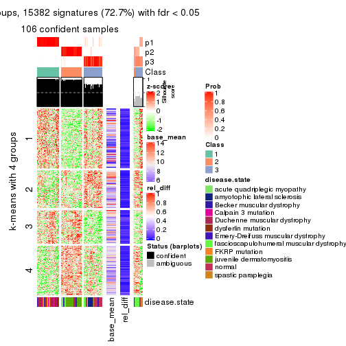</p>

</div>
<div id='tab-MAD-kmeans-get-signatures-3'>
<pre><code class="r">get_signatures(res, k = 4)
</code></pre>

<p></p>

</div>
<div id='tab-MAD-kmeans-get-signatures-4'>
<pre><code class="r">get_signatures(res, k = 5)
</code></pre>

<p></p>

</div>
<div id='tab-MAD-kmeans-get-signatures-5'>
<pre><code class="r">get_signatures(res, k = 6)
</code></pre>

<p></p>

</div>
</div>


Signature heatmaps where rows are not scaled:


<script>
$( function() {
	$( '#tabs-MAD-kmeans-get-signatures-no-scale' ).tabs();
} );
</script>
<div id='tabs-MAD-kmeans-get-signatures-no-scale'>
<ul>
<li><a href='#tab-MAD-kmeans-get-signatures-no-scale-1'>k = 2</a></li>
<li><a href='#tab-MAD-kmeans-get-signatures-no-scale-2'>k = 3</a></li>
<li><a href='#tab-MAD-kmeans-get-signatures-no-scale-3'>k = 4</a></li>
<li><a href='#tab-MAD-kmeans-get-signatures-no-scale-4'>k = 5</a></li>
<li><a href='#tab-MAD-kmeans-get-signatures-no-scale-5'>k = 6</a></li>
</ul>
<div id='tab-MAD-kmeans-get-signatures-no-scale-1'>
<pre><code class="r">get_signatures(res, k = 2, scale_rows = FALSE)
</code></pre>

<p></p>

</div>
<div id='tab-MAD-kmeans-get-signatures-no-scale-2'>
<pre><code class="r">get_signatures(res, k = 3, scale_rows = FALSE)
</code></pre>

<p></p>

</div>
<div id='tab-MAD-kmeans-get-signatures-no-scale-3'>
<pre><code class="r">get_signatures(res, k = 4, scale_rows = FALSE)
</code></pre>

<p></p>

</div>
<div id='tab-MAD-kmeans-get-signatures-no-scale-4'>
<pre><code class="r">get_signatures(res, k = 5, scale_rows = FALSE)
</code></pre>

<p></p>

</div>
<div id='tab-MAD-kmeans-get-signatures-no-scale-5'>
<pre><code class="r">get_signatures(res, k = 6, scale_rows = FALSE)
</code></pre>

<p></p>

</div>
</div>


Compare the overlap of signatures from different k:

```r
compare_signatures(res)
```


`get_signature()` returns a data frame invisibly. TO get the list of signatures, the function
call should be assigned to a variable explicitly. In following code, if `plot` argument is set
to `FALSE`, no heatmap is plotted while only the differential analysis is performed.

```r
# code only for demonstration
tb = get_signature(res, k = ..., plot = FALSE)
```

An example of the output of `tb` is:

```
#>   which_row         fdr    mean_1    mean_2 scaled_mean_1 scaled_mean_2 km
#> 1        38 0.042760348  8.373488  9.131774    -0.5533452     0.5164555  1
#> 2        40 0.018707592  7.106213  8.469186    -0.6173731     0.5762149  1
#> 3        55 0.019134737 10.221463 11.207825    -0.6159697     0.5749050  1
#> 4        59 0.006059896  5.921854  7.869574    -0.6899429     0.6439467  1
#> 5        60 0.018055526  8.928898 10.211722    -0.6204761     0.5791110  1
#> 6        98 0.009384629 15.714769 14.887706     0.6635654    -0.6193277  2
...
```

The columns in `tb` are:

1. `which_row`: row indices corresponding to the input matrix.
2. `fdr`: FDR for the differential test. 
3. `mean_x`: The mean value in group x.
4. `scaled_mean_x`: The mean value in group x after rows are scaled.
5. `km`: Row groups if k-means clustering is applied to rows.


UMAP plot which shows how samples are separated.


<script>
$( function() {
	$( '#tabs-MAD-kmeans-dimension-reduction' ).tabs();
} );
</script>
<div id='tabs-MAD-kmeans-dimension-reduction'>
<ul>
<li><a href='#tab-MAD-kmeans-dimension-reduction-1'>k = 2</a></li>
<li><a href='#tab-MAD-kmeans-dimension-reduction-2'>k = 3</a></li>
<li><a href='#tab-MAD-kmeans-dimension-reduction-3'>k = 4</a></li>
<li><a href='#tab-MAD-kmeans-dimension-reduction-4'>k = 5</a></li>
<li><a href='#tab-MAD-kmeans-dimension-reduction-5'>k = 6</a></li>
</ul>
<div id='tab-MAD-kmeans-dimension-reduction-1'>
<pre><code class="r">dimension_reduction(res, k = 2, method = &quot;UMAP&quot;)
</code></pre>

<p></p>

</div>
<div id='tab-MAD-kmeans-dimension-reduction-2'>
<pre><code class="r">dimension_reduction(res, k = 3, method = &quot;UMAP&quot;)
</code></pre>

<p></p>

</div>
<div id='tab-MAD-kmeans-dimension-reduction-3'>
<pre><code class="r">dimension_reduction(res, k = 4, method = &quot;UMAP&quot;)
</code></pre>

<p></p>

</div>
<div id='tab-MAD-kmeans-dimension-reduction-4'>
<pre><code class="r">dimension_reduction(res, k = 5, method = &quot;UMAP&quot;)
</code></pre>

<p></p>

</div>
<div id='tab-MAD-kmeans-dimension-reduction-5'>
<pre><code class="r">dimension_reduction(res, k = 6, method = &quot;UMAP&quot;)
</code></pre>

<p></p>

</div>
</div>


Following heatmap shows how subgroups are split when increasing `k`:

```r
collect_classes(res)
```


Test correlation between subgroups and known annotations. If the known
annotation is numeric, one-way ANOVA test is applied, and if the known
annotation is discrete, chi-squared contingency table test is applied.

```r
test_to_known_factors(res)
```

```
#>              n disease.state(p) k
#> MAD:kmeans 119         4.11e-11 2
#> MAD:kmeans 106         4.12e-25 3
#> MAD:kmeans 107         2.49e-29 4
#> MAD:kmeans  96         5.51e-30 5
#> MAD:kmeans  94         3.94e-30 6
```


If matrix rows can be associated to genes, consider to use `GO_Enrichment(res,
...)` to perform function enrichment for the signature genes.


 

---------------------------------------------------


### MAD:skmeans*


The object with results only for a single top-value method and a single partition method 
can be extracted as:

```r
res = res_list["MAD", "skmeans"]
# you can also extract it by
# res = res_list["MAD:skmeans"]
```

A summary of `res` and all the functions that can be applied to it:

```r
res
```

```
#> A 'ConsensusPartition' object with k = 2, 3, 4, 5, 6.
#>   On a matrix with 21168 rows and 121 columns.
#>   Top rows (1000, 2000, 3000, 4000, 5000) are extracted by 'MAD' method.
#>   Subgroups are detected by 'skmeans' method.
#>   Performed in total 1250 partitions by row resampling.
#>   Best k for subgroups seems to be 4.
#> 
#> Following methods can be applied to this 'ConsensusPartition' object:
#>  [1] "cola_report"             "collect_classes"         "collect_plots"          
#>  [4] "collect_stats"           "colnames"                "compare_signatures"     
#>  [7] "consensus_heatmap"       "dimension_reduction"     "functional_enrichment"  
#> [10] "get_anno_col"            "get_anno"                "get_classes"            
#> [13] "get_consensus"           "get_matrix"              "get_membership"         
#> [16] "get_param"               "get_signatures"          "get_stats"              
#> [19] "is_best_k"               "is_stable_k"             "membership_heatmap"     
#> [22] "ncol"                    "nrow"                    "plot_ecdf"              
#> [25] "rownames"                "select_partition_number" "show"                   
#> [28] "suggest_best_k"          "test_to_known_factors"
```

`collect_plots()` function collects all the plots made from `res` for all `k` (number of partitions)
into one single page to provide an easy and fast comparison between different `k`.

```r
collect_plots(res)
```

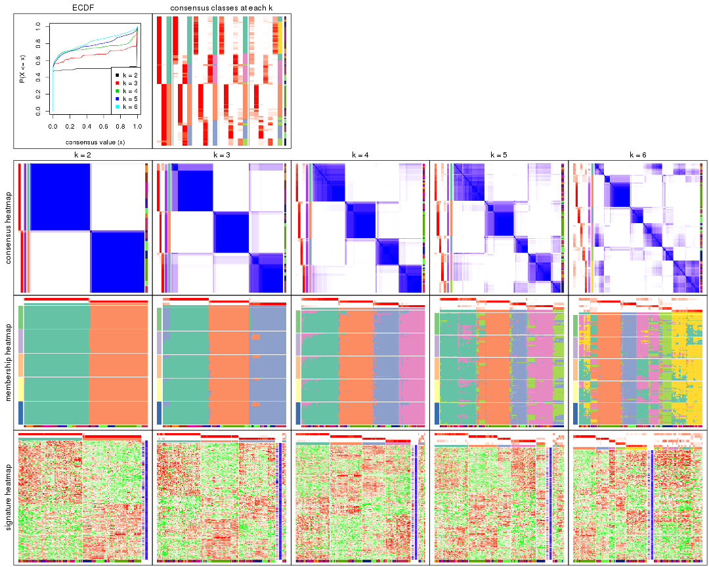

The plots are:

- The first row: a plot of the ECDF (Empirical cumulative distribution
  function) curves of the consensus matrix for each `k` and the heatmap of
  predicted classes for each `k`.
- The second row: heatmaps of the consensus matrix for each `k`.
- The third row: heatmaps of the membership matrix for each `k`.
- The fouth row: heatmaps of the signatures for each `k`.

All the plots in panels can be made by individual functions and they are
plotted later in this section.

`select_partition_number()` produces several plots showing different
statistics for choosing "optimized" `k`. There are following statistics:

- ECDF curves of the consensus matrix for each `k`;
- 1-PAC. [The PAC
  score](https://en.wikipedia.org/wiki/Consensus_clustering#Over-interpretation_potential_of_consensus_clustering)
  measures the proportion of the ambiguous subgrouping.
- Mean silhouette score.
- Concordance. The mean probability of fiting the consensus class ids in all
  partitions.
- Area increased. Denote $A_k$ as the area under the ECDF curve for current
  `k`, the area increased is defined as $A_k - A_{k-1}$.
- Rand index. The percent of pairs of samples that are both in a same cluster
  or both are not in a same cluster in the partition of k and k-1.
- Jaccard index. The ratio of pairs of samples are both in a same cluster in
  the partition of k and k-1 and the pairs of samples are both in a same
  cluster in the partition k or k-1.

The detailed explanations of these statistics can be found in [the cola
vignette](http://bioconductor.org/packages/devel/bioc/vignettes/cola/inst/doc/cola.html#toc_13).

Generally speaking, lower PAC score, higher mean silhouette score or higher
concordance corresponds to better partition. Rand index and Jaccard index
measure how similar the current partition is compared to partition with `k-1`.
If they are too similar, we won't accept `k` is better than `k-1`.

```r
select_partition_number(res)
```


The numeric values for all these statistics can be obtained by `get_stats()`.

```r
get_stats(res)
```

```
#>   k 1-PAC mean_silhouette concordance area_increased  Rand Jaccard
#> 2 2 1.000           0.989       0.995         0.5034 0.497   0.497
#> 3 3 0.866           0.911       0.960         0.3311 0.739   0.521
#> 4 4 0.917           0.899       0.948         0.1207 0.850   0.590
#> 5 5 0.769           0.749       0.856         0.0467 0.960   0.843
#> 6 6 0.749           0.545       0.739         0.0405 0.927   0.695
```

`suggest_best_k()` suggests the best $k$ based on these statistics. The rules are as follows:

- All $k$ with Jaccard index larger than 0.95 are removed because the increase of
  the partition number does not provides enough extra information. If all $k$ are removed,
  the best $k$ is assigned by `NA`.
- For $k$ with 1-PAC larger than 0.9, the maximal $k$ is taken as the "best k". Other $k$ is called "optional k".
- If it does not fit the second rule. The $k$ with the highest vote of highest
  1-PAC, mean silhouette and concordance is taken as the "best k".

```r
suggest_best_k(res)
```

```
#> [1] 4
#> attr(,"optional")
#> [1] 2
```

There is also optional best $k$ = 2 that is worth to check.

Following shows the table of the partitions (You need to click the **show/hide
code output** link to see it). The membership matrix (columns with name `p*`)
is inferred by
[`clue::cl_consensus()`](https://www.rdocumentation.org/link/cl_consensus?package=clue)
function with the `SE` method. Basically the value in the membership matrix
represents the probability to belong to a certain group. The finall class
label for an item is determined with the group with highest probability it
belongs to.

In `get_classes()` function, the entropy is calculated from the membership
matrix and the silhouette score is calculated from the consensus matrix.


<script>
$( function() {
	$( '#tabs-MAD-skmeans-get-classes' ).tabs();
} );
</script>
<div id='tabs-MAD-skmeans-get-classes'>
<ul>
<li><a href='#tab-MAD-skmeans-get-classes-1'>k = 2</a></li>
<li><a href='#tab-MAD-skmeans-get-classes-2'>k = 3</a></li>
<li><a href='#tab-MAD-skmeans-get-classes-3'>k = 4</a></li>
<li><a href='#tab-MAD-skmeans-get-classes-4'>k = 5</a></li>
<li><a href='#tab-MAD-skmeans-get-classes-5'>k = 6</a></li>
</ul>

<div id='tab-MAD-skmeans-get-classes-1'>
<p><a id='tab-MAD-skmeans-get-classes-1-a' style='color:#0366d6' href='#'>show/hide code output</a></p>
<pre><code class="r">cbind(get_classes(res, k = 2), get_membership(res, k = 2))
</code></pre>

<pre><code>#&gt;           class entropy silhouette    p1    p2
#&gt; GSM74356      2  0.0000      0.991 0.000 1.000
#&gt; GSM74357      2  0.0000      0.991 0.000 1.000
#&gt; GSM74358      2  0.0000      0.991 0.000 1.000
#&gt; GSM74359      1  0.0000      0.998 1.000 0.000
#&gt; GSM74360      1  0.0000      0.998 1.000 0.000
#&gt; GSM74361      2  0.0000      0.991 0.000 1.000
#&gt; GSM74362      2  0.0000      0.991 0.000 1.000
#&gt; GSM74363      2  0.0000      0.991 0.000 1.000
#&gt; GSM74402      1  0.0000      0.998 1.000 0.000
#&gt; GSM74403      1  0.0000      0.998 1.000 0.000
#&gt; GSM74404      1  0.0000      0.998 1.000 0.000
#&gt; GSM74406      1  0.0000      0.998 1.000 0.000
#&gt; GSM74407      1  0.0000      0.998 1.000 0.000
#&gt; GSM74408      1  0.0000      0.998 1.000 0.000
#&gt; GSM74409      1  0.0000      0.998 1.000 0.000
#&gt; GSM74410      1  0.0000      0.998 1.000 0.000
#&gt; GSM119936     1  0.0000      0.998 1.000 0.000
#&gt; GSM119937     1  0.0000      0.998 1.000 0.000
#&gt; GSM74411      2  0.0000      0.991 0.000 1.000
#&gt; GSM74412      2  0.0000      0.991 0.000 1.000
#&gt; GSM74413      2  0.0000      0.991 0.000 1.000
#&gt; GSM74414      2  0.0000      0.991 0.000 1.000
#&gt; GSM74415      2  0.0000      0.991 0.000 1.000
#&gt; GSM121379     2  0.0000      0.991 0.000 1.000
#&gt; GSM121380     2  0.0000      0.991 0.000 1.000
#&gt; GSM121381     2  0.0000      0.991 0.000 1.000
#&gt; GSM121382     2  0.0000      0.991 0.000 1.000
#&gt; GSM121383     2  0.0000      0.991 0.000 1.000
#&gt; GSM121384     2  0.0000      0.991 0.000 1.000
#&gt; GSM121385     2  0.0000      0.991 0.000 1.000
#&gt; GSM121386     2  0.0000      0.991 0.000 1.000
#&gt; GSM121387     2  0.0000      0.991 0.000 1.000
#&gt; GSM121388     2  0.0000      0.991 0.000 1.000
#&gt; GSM121389     2  0.0000      0.991 0.000 1.000
#&gt; GSM121390     2  0.0000      0.991 0.000 1.000
#&gt; GSM121391     2  0.0000      0.991 0.000 1.000
#&gt; GSM121392     2  0.0000      0.991 0.000 1.000
#&gt; GSM121393     2  0.0000      0.991 0.000 1.000
#&gt; GSM121394     2  0.0000      0.991 0.000 1.000
#&gt; GSM121395     2  0.0000      0.991 0.000 1.000
#&gt; GSM121396     2  0.0000      0.991 0.000 1.000
#&gt; GSM121397     2  0.0000      0.991 0.000 1.000
#&gt; GSM121398     2  0.0000      0.991 0.000 1.000
#&gt; GSM121399     2  0.0000      0.991 0.000 1.000
#&gt; GSM74240      2  0.0000      0.991 0.000 1.000
#&gt; GSM74241      2  0.0000      0.991 0.000 1.000
#&gt; GSM74242      2  0.7883      0.695 0.236 0.764
#&gt; GSM74243      2  0.8327      0.646 0.264 0.736
#&gt; GSM74244      2  0.0000      0.991 0.000 1.000
#&gt; GSM74245      2  0.0000      0.991 0.000 1.000
#&gt; GSM74246      2  0.0000      0.991 0.000 1.000
#&gt; GSM74247      2  0.0000      0.991 0.000 1.000
#&gt; GSM74248      2  0.0000      0.991 0.000 1.000
#&gt; GSM74416      1  0.0000      0.998 1.000 0.000
#&gt; GSM74417      1  0.0000      0.998 1.000 0.000
#&gt; GSM74418      1  0.0000      0.998 1.000 0.000
#&gt; GSM74419      1  0.0000      0.998 1.000 0.000
#&gt; GSM121358     2  0.0000      0.991 0.000 1.000
#&gt; GSM121359     2  0.0000      0.991 0.000 1.000
#&gt; GSM121360     1  0.0000      0.998 1.000 0.000
#&gt; GSM121362     1  0.0000      0.998 1.000 0.000
#&gt; GSM121364     1  0.0000      0.998 1.000 0.000
#&gt; GSM121365     2  0.0000      0.991 0.000 1.000
#&gt; GSM121366     2  0.0000      0.991 0.000 1.000
#&gt; GSM121367     2  0.0000      0.991 0.000 1.000
#&gt; GSM121370     2  0.0000      0.991 0.000 1.000
#&gt; GSM121371     2  0.0000      0.991 0.000 1.000
#&gt; GSM121372     2  0.0000      0.991 0.000 1.000
#&gt; GSM121373     1  0.0000      0.998 1.000 0.000
#&gt; GSM121374     1  0.0000      0.998 1.000 0.000
#&gt; GSM121407     2  0.0000      0.991 0.000 1.000
#&gt; GSM74387      2  0.0000      0.991 0.000 1.000
#&gt; GSM74388      2  0.0000      0.991 0.000 1.000
#&gt; GSM74389      1  0.0000      0.998 1.000 0.000
#&gt; GSM74390      1  0.0000      0.998 1.000 0.000
#&gt; GSM74391      1  0.0000      0.998 1.000 0.000
#&gt; GSM74392      1  0.0000      0.998 1.000 0.000
#&gt; GSM74393      1  0.4562      0.892 0.904 0.096
#&gt; GSM74394      2  0.0000      0.991 0.000 1.000
#&gt; GSM74239      1  0.0000      0.998 1.000 0.000
#&gt; GSM74364      1  0.0000      0.998 1.000 0.000
#&gt; GSM74365      1  0.0000      0.998 1.000 0.000
#&gt; GSM74366      1  0.0000      0.998 1.000 0.000
#&gt; GSM74367      1  0.0000      0.998 1.000 0.000
#&gt; GSM74377      1  0.0000      0.998 1.000 0.000
#&gt; GSM74378      1  0.0000      0.998 1.000 0.000
#&gt; GSM74379      1  0.0000      0.998 1.000 0.000
#&gt; GSM74380      1  0.0000      0.998 1.000 0.000
#&gt; GSM74381      1  0.0000      0.998 1.000 0.000
#&gt; GSM121357     2  0.0000      0.991 0.000 1.000
#&gt; GSM121361     2  0.0000      0.991 0.000 1.000
#&gt; GSM121363     2  0.0000      0.991 0.000 1.000
#&gt; GSM121368     2  0.0000      0.991 0.000 1.000
#&gt; GSM121369     2  0.0000      0.991 0.000 1.000
#&gt; GSM74368      1  0.0000      0.998 1.000 0.000
#&gt; GSM74369      1  0.0000      0.998 1.000 0.000
#&gt; GSM74370      1  0.0000      0.998 1.000 0.000
#&gt; GSM74371      1  0.0000      0.998 1.000 0.000
#&gt; GSM74372      1  0.0000      0.998 1.000 0.000
#&gt; GSM74373      1  0.0000      0.998 1.000 0.000
#&gt; GSM74374      1  0.0000      0.998 1.000 0.000
#&gt; GSM74375      1  0.0000      0.998 1.000 0.000
#&gt; GSM74376      1  0.0000      0.998 1.000 0.000
#&gt; GSM74405      1  0.0000      0.998 1.000 0.000
#&gt; GSM74351      1  0.0000      0.998 1.000 0.000
#&gt; GSM74352      1  0.0376      0.994 0.996 0.004
#&gt; GSM74353      1  0.0000      0.998 1.000 0.000
#&gt; GSM74354      1  0.0000      0.998 1.000 0.000
#&gt; GSM74355      1  0.0000      0.998 1.000 0.000
#&gt; GSM74382      1  0.0000      0.998 1.000 0.000
#&gt; GSM74383      1  0.0000      0.998 1.000 0.000
#&gt; GSM74384      1  0.0000      0.998 1.000 0.000
#&gt; GSM74385      1  0.0000      0.998 1.000 0.000
#&gt; GSM74386      1  0.0000      0.998 1.000 0.000
#&gt; GSM74395      1  0.0000      0.998 1.000 0.000
#&gt; GSM74396      1  0.0000      0.998 1.000 0.000
#&gt; GSM74397      1  0.0000      0.998 1.000 0.000
#&gt; GSM74398      1  0.0000      0.998 1.000 0.000
#&gt; GSM74399      1  0.0000      0.998 1.000 0.000
#&gt; GSM74400      1  0.0000      0.998 1.000 0.000
#&gt; GSM74401      1  0.0000      0.998 1.000 0.000
</code></pre>

<script>
$('#tab-MAD-skmeans-get-classes-1-a').parent().next().next().hide();
$('#tab-MAD-skmeans-get-classes-1-a').click(function(){
  $('#tab-MAD-skmeans-get-classes-1-a').parent().next().next().toggle();
  return(false);
});
</script>
</div>

<div id='tab-MAD-skmeans-get-classes-2'>
<p><a id='tab-MAD-skmeans-get-classes-2-a' style='color:#0366d6' href='#'>show/hide code output</a></p>
<pre><code class="r">cbind(get_classes(res, k = 3), get_membership(res, k = 3))
</code></pre>

<pre><code>#&gt;           class entropy silhouette    p1    p2    p3
#&gt; GSM74356      3  0.0000      0.946 0.000 0.000 1.000
#&gt; GSM74357      3  0.0000      0.946 0.000 0.000 1.000
#&gt; GSM74358      3  0.0000      0.946 0.000 0.000 1.000
#&gt; GSM74359      3  0.0000      0.946 0.000 0.000 1.000
#&gt; GSM74360      3  0.0000      0.946 0.000 0.000 1.000
#&gt; GSM74361      3  0.0000      0.946 0.000 0.000 1.000
#&gt; GSM74362      3  0.0000      0.946 0.000 0.000 1.000
#&gt; GSM74363      3  0.0000      0.946 0.000 0.000 1.000
#&gt; GSM74402      1  0.6008      0.483 0.628 0.000 0.372
#&gt; GSM74403      1  0.5733      0.577 0.676 0.000 0.324
#&gt; GSM74404      1  0.5810      0.557 0.664 0.000 0.336
#&gt; GSM74406      3  0.0747      0.936 0.016 0.000 0.984
#&gt; GSM74407      1  0.6308      0.144 0.508 0.000 0.492
#&gt; GSM74408      3  0.0000      0.946 0.000 0.000 1.000
#&gt; GSM74409      3  0.0000      0.946 0.000 0.000 1.000
#&gt; GSM74410      3  0.0000      0.946 0.000 0.000 1.000
#&gt; GSM119936     3  0.0747      0.936 0.016 0.000 0.984
#&gt; GSM119937     3  0.5905      0.375 0.352 0.000 0.648
#&gt; GSM74411      2  0.0000      0.986 0.000 1.000 0.000
#&gt; GSM74412      2  0.0000      0.986 0.000 1.000 0.000
#&gt; GSM74413      2  0.0000      0.986 0.000 1.000 0.000
#&gt; GSM74414      2  0.0000      0.986 0.000 1.000 0.000
#&gt; GSM74415      2  0.2448      0.909 0.000 0.924 0.076
#&gt; GSM121379     2  0.0000      0.986 0.000 1.000 0.000
#&gt; GSM121380     2  0.0000      0.986 0.000 1.000 0.000
#&gt; GSM121381     2  0.0000      0.986 0.000 1.000 0.000
#&gt; GSM121382     2  0.0000      0.986 0.000 1.000 0.000
#&gt; GSM121383     2  0.0000      0.986 0.000 1.000 0.000
#&gt; GSM121384     2  0.0000      0.986 0.000 1.000 0.000
#&gt; GSM121385     2  0.0000      0.986 0.000 1.000 0.000
#&gt; GSM121386     2  0.0000      0.986 0.000 1.000 0.000
#&gt; GSM121387     2  0.0000      0.986 0.000 1.000 0.000
#&gt; GSM121388     2  0.0000      0.986 0.000 1.000 0.000
#&gt; GSM121389     2  0.0000      0.986 0.000 1.000 0.000
#&gt; GSM121390     2  0.0000      0.986 0.000 1.000 0.000
#&gt; GSM121391     2  0.0000      0.986 0.000 1.000 0.000
#&gt; GSM121392     2  0.0000      0.986 0.000 1.000 0.000
#&gt; GSM121393     2  0.0000      0.986 0.000 1.000 0.000
#&gt; GSM121394     2  0.0000      0.986 0.000 1.000 0.000
#&gt; GSM121395     2  0.0000      0.986 0.000 1.000 0.000
#&gt; GSM121396     2  0.0000      0.986 0.000 1.000 0.000
#&gt; GSM121397     2  0.0000      0.986 0.000 1.000 0.000
#&gt; GSM121398     2  0.0000      0.986 0.000 1.000 0.000
#&gt; GSM121399     2  0.0000      0.986 0.000 1.000 0.000
#&gt; GSM74240      3  0.0000      0.946 0.000 0.000 1.000
#&gt; GSM74241      3  0.4399      0.785 0.000 0.188 0.812
#&gt; GSM74242      3  0.0000      0.946 0.000 0.000 1.000
#&gt; GSM74243      3  0.0000      0.946 0.000 0.000 1.000
#&gt; GSM74244      3  0.2261      0.906 0.000 0.068 0.932
#&gt; GSM74245      3  0.0000      0.946 0.000 0.000 1.000
#&gt; GSM74246      2  0.5882      0.443 0.000 0.652 0.348
#&gt; GSM74247      2  0.2878      0.886 0.000 0.904 0.096
#&gt; GSM74248      3  0.0000      0.946 0.000 0.000 1.000
#&gt; GSM74416      1  0.5810      0.557 0.664 0.000 0.336
#&gt; GSM74417      1  0.5810      0.557 0.664 0.000 0.336
#&gt; GSM74418      1  0.5810      0.557 0.664 0.000 0.336
#&gt; GSM74419      3  0.0424      0.942 0.008 0.000 0.992
#&gt; GSM121358     3  0.3482      0.858 0.000 0.128 0.872
#&gt; GSM121359     2  0.0000      0.986 0.000 1.000 0.000
#&gt; GSM121360     3  0.2878      0.865 0.096 0.000 0.904
#&gt; GSM121362     3  0.4399      0.748 0.188 0.000 0.812
#&gt; GSM121364     3  0.0000      0.946 0.000 0.000 1.000
#&gt; GSM121365     3  0.3551      0.854 0.000 0.132 0.868
#&gt; GSM121366     3  0.3816      0.836 0.000 0.148 0.852
#&gt; GSM121367     3  0.3482      0.858 0.000 0.128 0.872
#&gt; GSM121370     3  0.3551      0.854 0.000 0.132 0.868
#&gt; GSM121371     3  0.3482      0.858 0.000 0.128 0.872
#&gt; GSM121372     2  0.0000      0.986 0.000 1.000 0.000
#&gt; GSM121373     3  0.0000      0.946 0.000 0.000 1.000
#&gt; GSM121374     3  0.0000      0.946 0.000 0.000 1.000
#&gt; GSM121407     2  0.0000      0.986 0.000 1.000 0.000
#&gt; GSM74387      2  0.0000      0.986 0.000 1.000 0.000
#&gt; GSM74388      2  0.0000      0.986 0.000 1.000 0.000
#&gt; GSM74389      3  0.0000      0.946 0.000 0.000 1.000
#&gt; GSM74390      1  0.0000      0.940 1.000 0.000 0.000
#&gt; GSM74391      3  0.0747      0.937 0.016 0.000 0.984
#&gt; GSM74392      3  0.0000      0.946 0.000 0.000 1.000
#&gt; GSM74393      3  0.0000      0.946 0.000 0.000 1.000
#&gt; GSM74394      2  0.0000      0.986 0.000 1.000 0.000
#&gt; GSM74239      1  0.0000      0.940 1.000 0.000 0.000
#&gt; GSM74364      1  0.0000      0.940 1.000 0.000 0.000
#&gt; GSM74365      1  0.0000      0.940 1.000 0.000 0.000
#&gt; GSM74366      1  0.0000      0.940 1.000 0.000 0.000
#&gt; GSM74367      1  0.0000      0.940 1.000 0.000 0.000
#&gt; GSM74377      1  0.0000      0.940 1.000 0.000 0.000
#&gt; GSM74378      1  0.0000      0.940 1.000 0.000 0.000
#&gt; GSM74379      1  0.0000      0.940 1.000 0.000 0.000
#&gt; GSM74380      1  0.0000      0.940 1.000 0.000 0.000
#&gt; GSM74381      1  0.0000      0.940 1.000 0.000 0.000
#&gt; GSM121357     2  0.0000      0.986 0.000 1.000 0.000
#&gt; GSM121361     2  0.0000      0.986 0.000 1.000 0.000
#&gt; GSM121363     2  0.0000      0.986 0.000 1.000 0.000
#&gt; GSM121368     2  0.0000      0.986 0.000 1.000 0.000
#&gt; GSM121369     2  0.0000      0.986 0.000 1.000 0.000
#&gt; GSM74368      1  0.0000      0.940 1.000 0.000 0.000
#&gt; GSM74369      1  0.0000      0.940 1.000 0.000 0.000
#&gt; GSM74370      1  0.0000      0.940 1.000 0.000 0.000
#&gt; GSM74371      1  0.0000      0.940 1.000 0.000 0.000
#&gt; GSM74372      1  0.0000      0.940 1.000 0.000 0.000
#&gt; GSM74373      1  0.0000      0.940 1.000 0.000 0.000
#&gt; GSM74374      1  0.0000      0.940 1.000 0.000 0.000
#&gt; GSM74375      1  0.0000      0.940 1.000 0.000 0.000
#&gt; GSM74376      1  0.0000      0.940 1.000 0.000 0.000
#&gt; GSM74405      1  0.0000      0.940 1.000 0.000 0.000
#&gt; GSM74351      1  0.0000      0.940 1.000 0.000 0.000
#&gt; GSM74352      1  0.0000      0.940 1.000 0.000 0.000
#&gt; GSM74353      1  0.0000      0.940 1.000 0.000 0.000
#&gt; GSM74354      1  0.0000      0.940 1.000 0.000 0.000
#&gt; GSM74355      1  0.0000      0.940 1.000 0.000 0.000
#&gt; GSM74382      1  0.0237      0.937 0.996 0.000 0.004
#&gt; GSM74383      1  0.0000      0.940 1.000 0.000 0.000
#&gt; GSM74384      1  0.0237      0.936 0.996 0.004 0.000
#&gt; GSM74385      1  0.0000      0.940 1.000 0.000 0.000
#&gt; GSM74386      1  0.0000      0.940 1.000 0.000 0.000
#&gt; GSM74395      1  0.0000      0.940 1.000 0.000 0.000
#&gt; GSM74396      1  0.0000      0.940 1.000 0.000 0.000
#&gt; GSM74397      1  0.0000      0.940 1.000 0.000 0.000
#&gt; GSM74398      1  0.0000      0.940 1.000 0.000 0.000
#&gt; GSM74399      1  0.0000      0.940 1.000 0.000 0.000
#&gt; GSM74400      1  0.0000      0.940 1.000 0.000 0.000
#&gt; GSM74401      1  0.0000      0.940 1.000 0.000 0.000
</code></pre>

<script>
$('#tab-MAD-skmeans-get-classes-2-a').parent().next().next().hide();
$('#tab-MAD-skmeans-get-classes-2-a').click(function(){
  $('#tab-MAD-skmeans-get-classes-2-a').parent().next().next().toggle();
  return(false);
});
</script>
</div>

<div id='tab-MAD-skmeans-get-classes-3'>
<p><a id='tab-MAD-skmeans-get-classes-3-a' style='color:#0366d6' href='#'>show/hide code output</a></p>
<pre><code class="r">cbind(get_classes(res, k = 4), get_membership(res, k = 4))
</code></pre>

<pre><code>#&gt;           class entropy silhouette    p1    p2    p3    p4
#&gt; GSM74356      3  0.0336      0.942 0.000 0.000 0.992 0.008
#&gt; GSM74357      3  0.0336      0.942 0.000 0.000 0.992 0.008
#&gt; GSM74358      3  0.0336      0.942 0.000 0.000 0.992 0.008
#&gt; GSM74359      4  0.2011      0.906 0.000 0.000 0.080 0.920
#&gt; GSM74360      4  0.0188      0.952 0.000 0.000 0.004 0.996
#&gt; GSM74361      3  0.0592      0.938 0.000 0.000 0.984 0.016
#&gt; GSM74362      3  0.2216      0.869 0.000 0.000 0.908 0.092
#&gt; GSM74363      3  0.0336      0.942 0.000 0.000 0.992 0.008
#&gt; GSM74402      4  0.0188      0.952 0.004 0.000 0.000 0.996
#&gt; GSM74403      4  0.0188      0.952 0.004 0.000 0.000 0.996
#&gt; GSM74404      4  0.0000      0.953 0.000 0.000 0.000 1.000
#&gt; GSM74406      4  0.0000      0.953 0.000 0.000 0.000 1.000
#&gt; GSM74407      4  0.0000      0.953 0.000 0.000 0.000 1.000
#&gt; GSM74408      4  0.0000      0.953 0.000 0.000 0.000 1.000
#&gt; GSM74409      4  0.0000      0.953 0.000 0.000 0.000 1.000
#&gt; GSM74410      4  0.0000      0.953 0.000 0.000 0.000 1.000
#&gt; GSM119936     4  0.0000      0.953 0.000 0.000 0.000 1.000
#&gt; GSM119937     4  0.0000      0.953 0.000 0.000 0.000 1.000
#&gt; GSM74411      2  0.4933      0.224 0.000 0.568 0.432 0.000
#&gt; GSM74412      2  0.1022      0.939 0.000 0.968 0.032 0.000
#&gt; GSM74413      2  0.4776      0.384 0.000 0.624 0.376 0.000
#&gt; GSM74414      2  0.0000      0.961 0.000 1.000 0.000 0.000
#&gt; GSM74415      3  0.2149      0.876 0.000 0.088 0.912 0.000
#&gt; GSM121379     2  0.0000      0.961 0.000 1.000 0.000 0.000
#&gt; GSM121380     2  0.0000      0.961 0.000 1.000 0.000 0.000
#&gt; GSM121381     2  0.0000      0.961 0.000 1.000 0.000 0.000
#&gt; GSM121382     2  0.0000      0.961 0.000 1.000 0.000 0.000
#&gt; GSM121383     2  0.0000      0.961 0.000 1.000 0.000 0.000
#&gt; GSM121384     2  0.0000      0.961 0.000 1.000 0.000 0.000
#&gt; GSM121385     2  0.0000      0.961 0.000 1.000 0.000 0.000
#&gt; GSM121386     2  0.0000      0.961 0.000 1.000 0.000 0.000
#&gt; GSM121387     2  0.0000      0.961 0.000 1.000 0.000 0.000
#&gt; GSM121388     2  0.0000      0.961 0.000 1.000 0.000 0.000
#&gt; GSM121389     2  0.0000      0.961 0.000 1.000 0.000 0.000
#&gt; GSM121390     2  0.0000      0.961 0.000 1.000 0.000 0.000
#&gt; GSM121391     2  0.0000      0.961 0.000 1.000 0.000 0.000
#&gt; GSM121392     2  0.0000      0.961 0.000 1.000 0.000 0.000
#&gt; GSM121393     2  0.0000      0.961 0.000 1.000 0.000 0.000
#&gt; GSM121394     2  0.0000      0.961 0.000 1.000 0.000 0.000
#&gt; GSM121395     2  0.0000      0.961 0.000 1.000 0.000 0.000
#&gt; GSM121396     2  0.0469      0.954 0.000 0.988 0.012 0.000
#&gt; GSM121397     2  0.0000      0.961 0.000 1.000 0.000 0.000
#&gt; GSM121398     2  0.0000      0.961 0.000 1.000 0.000 0.000
#&gt; GSM121399     2  0.0000      0.961 0.000 1.000 0.000 0.000
#&gt; GSM74240      3  0.0000      0.942 0.000 0.000 1.000 0.000
#&gt; GSM74241      3  0.0000      0.942 0.000 0.000 1.000 0.000
#&gt; GSM74242      3  0.1118      0.924 0.000 0.000 0.964 0.036
#&gt; GSM74243      3  0.1022      0.927 0.000 0.000 0.968 0.032
#&gt; GSM74244      3  0.0000      0.942 0.000 0.000 1.000 0.000
#&gt; GSM74245      3  0.0000      0.942 0.000 0.000 1.000 0.000
#&gt; GSM74246      3  0.0000      0.942 0.000 0.000 1.000 0.000
#&gt; GSM74247      3  0.0188      0.940 0.000 0.004 0.996 0.000
#&gt; GSM74248      3  0.0000      0.942 0.000 0.000 1.000 0.000
#&gt; GSM74416      4  0.0188      0.952 0.004 0.000 0.000 0.996
#&gt; GSM74417      4  0.0188      0.952 0.004 0.000 0.000 0.996
#&gt; GSM74418      4  0.0188      0.952 0.004 0.000 0.000 0.996
#&gt; GSM74419      4  0.0000      0.953 0.000 0.000 0.000 1.000
#&gt; GSM121358     3  0.0376      0.942 0.000 0.004 0.992 0.004
#&gt; GSM121359     3  0.3764      0.712 0.000 0.216 0.784 0.000
#&gt; GSM121360     4  0.2546      0.912 0.028 0.000 0.060 0.912
#&gt; GSM121362     4  0.3383      0.884 0.076 0.000 0.052 0.872
#&gt; GSM121364     4  0.1867      0.913 0.000 0.000 0.072 0.928
#&gt; GSM121365     3  0.0376      0.942 0.000 0.004 0.992 0.004
#&gt; GSM121366     3  0.0376      0.942 0.000 0.004 0.992 0.004
#&gt; GSM121367     3  0.0376      0.942 0.000 0.004 0.992 0.004
#&gt; GSM121370     3  0.0376      0.942 0.000 0.004 0.992 0.004
#&gt; GSM121371     3  0.0376      0.942 0.000 0.004 0.992 0.004
#&gt; GSM121372     3  0.4643      0.468 0.000 0.344 0.656 0.000
#&gt; GSM121373     4  0.1716      0.919 0.000 0.000 0.064 0.936
#&gt; GSM121374     4  0.1940      0.910 0.000 0.000 0.076 0.924
#&gt; GSM121407     2  0.0336      0.956 0.000 0.992 0.008 0.000
#&gt; GSM74387      2  0.1824      0.917 0.004 0.936 0.060 0.000
#&gt; GSM74388      2  0.1722      0.930 0.048 0.944 0.008 0.000
#&gt; GSM74389      4  0.4907      0.288 0.000 0.000 0.420 0.580
#&gt; GSM74390      1  0.0937      0.927 0.976 0.000 0.012 0.012
#&gt; GSM74391      4  0.0000      0.953 0.000 0.000 0.000 1.000
#&gt; GSM74392      4  0.1557      0.924 0.000 0.000 0.056 0.944
#&gt; GSM74393      3  0.4817      0.328 0.000 0.000 0.612 0.388
#&gt; GSM74394      2  0.1722      0.930 0.048 0.944 0.008 0.000
#&gt; GSM74239      1  0.2647      0.897 0.880 0.000 0.000 0.120
#&gt; GSM74364      1  0.2868      0.886 0.864 0.000 0.000 0.136
#&gt; GSM74365      1  0.0707      0.931 0.980 0.000 0.000 0.020
#&gt; GSM74366      1  0.0000      0.931 1.000 0.000 0.000 0.000
#&gt; GSM74367      1  0.1940      0.918 0.924 0.000 0.000 0.076
#&gt; GSM74377      1  0.0000      0.931 1.000 0.000 0.000 0.000
#&gt; GSM74378      1  0.0000      0.931 1.000 0.000 0.000 0.000
#&gt; GSM74379      1  0.0000      0.931 1.000 0.000 0.000 0.000
#&gt; GSM74380      1  0.0000      0.931 1.000 0.000 0.000 0.000
#&gt; GSM74381      1  0.0000      0.931 1.000 0.000 0.000 0.000
#&gt; GSM121357     2  0.0000      0.961 0.000 1.000 0.000 0.000
#&gt; GSM121361     2  0.1722      0.930 0.048 0.944 0.008 0.000
#&gt; GSM121363     2  0.1722      0.930 0.048 0.944 0.008 0.000
#&gt; GSM121368     2  0.1722      0.930 0.048 0.944 0.008 0.000
#&gt; GSM121369     2  0.1722      0.930 0.048 0.944 0.008 0.000
#&gt; GSM74368      1  0.3444      0.836 0.816 0.000 0.000 0.184
#&gt; GSM74369      1  0.2149      0.914 0.912 0.000 0.000 0.088
#&gt; GSM74370      1  0.2281      0.911 0.904 0.000 0.000 0.096
#&gt; GSM74371      1  0.4830      0.498 0.608 0.000 0.000 0.392
#&gt; GSM74372      1  0.2647      0.896 0.880 0.000 0.000 0.120
#&gt; GSM74373      1  0.0000      0.931 1.000 0.000 0.000 0.000
#&gt; GSM74374      1  0.0921      0.930 0.972 0.000 0.000 0.028
#&gt; GSM74375      1  0.0188      0.931 0.996 0.000 0.000 0.004
#&gt; GSM74376      1  0.0000      0.931 1.000 0.000 0.000 0.000
#&gt; GSM74405      1  0.0000      0.931 1.000 0.000 0.000 0.000
#&gt; GSM74351      4  0.1867      0.890 0.072 0.000 0.000 0.928
#&gt; GSM74352      1  0.0000      0.931 1.000 0.000 0.000 0.000
#&gt; GSM74353      1  0.2647      0.898 0.880 0.000 0.000 0.120
#&gt; GSM74354      1  0.1557      0.924 0.944 0.000 0.000 0.056
#&gt; GSM74355      1  0.0000      0.931 1.000 0.000 0.000 0.000
#&gt; GSM74382      4  0.1302      0.920 0.044 0.000 0.000 0.956
#&gt; GSM74383      1  0.1716      0.921 0.936 0.000 0.000 0.064
#&gt; GSM74384      1  0.0000      0.931 1.000 0.000 0.000 0.000
#&gt; GSM74385      1  0.3444      0.842 0.816 0.000 0.000 0.184
#&gt; GSM74386      1  0.2408      0.907 0.896 0.000 0.000 0.104
#&gt; GSM74395      1  0.3569      0.826 0.804 0.000 0.000 0.196
#&gt; GSM74396      1  0.2216      0.912 0.908 0.000 0.000 0.092
#&gt; GSM74397      1  0.4941      0.377 0.564 0.000 0.000 0.436
#&gt; GSM74398      1  0.0188      0.931 0.996 0.000 0.000 0.004
#&gt; GSM74399      1  0.0000      0.931 1.000 0.000 0.000 0.000
#&gt; GSM74400      1  0.0707      0.931 0.980 0.000 0.000 0.020
#&gt; GSM74401      1  0.0592      0.931 0.984 0.000 0.000 0.016
</code></pre>

<script>
$('#tab-MAD-skmeans-get-classes-3-a').parent().next().next().hide();
$('#tab-MAD-skmeans-get-classes-3-a').click(function(){
  $('#tab-MAD-skmeans-get-classes-3-a').parent().next().next().toggle();
  return(false);
});
</script>
</div>

<div id='tab-MAD-skmeans-get-classes-4'>
<p><a id='tab-MAD-skmeans-get-classes-4-a' style='color:#0366d6' href='#'>show/hide code output</a></p>
<pre><code class="r">cbind(get_classes(res, k = 5), get_membership(res, k = 5))
</code></pre>

<pre><code>#&gt;           class entropy silhouette    p1    p2    p3    p4    p5
#&gt; GSM74356      3  0.1282     0.7955 0.000 0.000 0.952 0.004 0.044
#&gt; GSM74357      3  0.1357     0.7927 0.000 0.000 0.948 0.004 0.048
#&gt; GSM74358      3  0.1430     0.7896 0.000 0.000 0.944 0.004 0.052
#&gt; GSM74359      4  0.4338     0.6908 0.000 0.000 0.024 0.696 0.280
#&gt; GSM74360      4  0.3910     0.7118 0.000 0.000 0.008 0.720 0.272
#&gt; GSM74361      3  0.2351     0.7461 0.000 0.000 0.896 0.016 0.088
#&gt; GSM74362      3  0.5074     0.3807 0.000 0.000 0.660 0.072 0.268
#&gt; GSM74363      3  0.0290     0.8137 0.000 0.000 0.992 0.000 0.008
#&gt; GSM74402      4  0.0000     0.8428 0.000 0.000 0.000 1.000 0.000
#&gt; GSM74403      4  0.0000     0.8428 0.000 0.000 0.000 1.000 0.000
#&gt; GSM74404      4  0.0162     0.8407 0.004 0.000 0.000 0.996 0.000
#&gt; GSM74406      4  0.1282     0.8407 0.000 0.000 0.004 0.952 0.044
#&gt; GSM74407      4  0.0000     0.8428 0.000 0.000 0.000 1.000 0.000
#&gt; GSM74408      4  0.1168     0.8418 0.000 0.000 0.008 0.960 0.032
#&gt; GSM74409      4  0.1697     0.8338 0.000 0.000 0.008 0.932 0.060
#&gt; GSM74410      4  0.1557     0.8368 0.000 0.000 0.008 0.940 0.052
#&gt; GSM119936     4  0.0404     0.8444 0.000 0.000 0.000 0.988 0.012
#&gt; GSM119937     4  0.0290     0.8441 0.000 0.000 0.000 0.992 0.008
#&gt; GSM74411      3  0.6812    -0.0691 0.000 0.324 0.364 0.000 0.312
#&gt; GSM74412      2  0.5787     0.4791 0.000 0.616 0.180 0.000 0.204
#&gt; GSM74413      2  0.6811    -0.1844 0.000 0.360 0.336 0.000 0.304
#&gt; GSM74414      2  0.0290     0.8820 0.000 0.992 0.000 0.000 0.008
#&gt; GSM74415      3  0.5542    -0.2911 0.000 0.068 0.500 0.000 0.432
#&gt; GSM121379     2  0.0000     0.8850 0.000 1.000 0.000 0.000 0.000
#&gt; GSM121380     2  0.0000     0.8850 0.000 1.000 0.000 0.000 0.000
#&gt; GSM121381     2  0.0000     0.8850 0.000 1.000 0.000 0.000 0.000
#&gt; GSM121382     2  0.0000     0.8850 0.000 1.000 0.000 0.000 0.000
#&gt; GSM121383     2  0.0000     0.8850 0.000 1.000 0.000 0.000 0.000
#&gt; GSM121384     2  0.0000     0.8850 0.000 1.000 0.000 0.000 0.000
#&gt; GSM121385     2  0.0000     0.8850 0.000 1.000 0.000 0.000 0.000
#&gt; GSM121386     2  0.0000     0.8850 0.000 1.000 0.000 0.000 0.000
#&gt; GSM121387     2  0.0000     0.8850 0.000 1.000 0.000 0.000 0.000
#&gt; GSM121388     2  0.0609     0.8743 0.000 0.980 0.020 0.000 0.000
#&gt; GSM121389     2  0.0000     0.8850 0.000 1.000 0.000 0.000 0.000
#&gt; GSM121390     2  0.0000     0.8850 0.000 1.000 0.000 0.000 0.000
#&gt; GSM121391     2  0.0000     0.8850 0.000 1.000 0.000 0.000 0.000
#&gt; GSM121392     2  0.0290     0.8821 0.000 0.992 0.000 0.000 0.008
#&gt; GSM121393     2  0.0000     0.8850 0.000 1.000 0.000 0.000 0.000
#&gt; GSM121394     2  0.0162     0.8833 0.000 0.996 0.004 0.000 0.000
#&gt; GSM121395     2  0.0000     0.8850 0.000 1.000 0.000 0.000 0.000
#&gt; GSM121396     2  0.2773     0.7505 0.000 0.836 0.164 0.000 0.000
#&gt; GSM121397     2  0.0000     0.8850 0.000 1.000 0.000 0.000 0.000
#&gt; GSM121398     2  0.0000     0.8850 0.000 1.000 0.000 0.000 0.000
#&gt; GSM121399     2  0.0000     0.8850 0.000 1.000 0.000 0.000 0.000
#&gt; GSM74240      5  0.3661     0.7864 0.000 0.000 0.276 0.000 0.724
#&gt; GSM74241      5  0.3895     0.7687 0.000 0.000 0.320 0.000 0.680
#&gt; GSM74242      5  0.4907     0.7505 0.000 0.000 0.292 0.052 0.656
#&gt; GSM74243      5  0.4866     0.7540 0.000 0.000 0.284 0.052 0.664
#&gt; GSM74244      5  0.3966     0.7602 0.000 0.000 0.336 0.000 0.664
#&gt; GSM74245      5  0.3932     0.7678 0.000 0.000 0.328 0.000 0.672
#&gt; GSM74246      5  0.3612     0.7660 0.000 0.000 0.268 0.000 0.732
#&gt; GSM74247      5  0.3796     0.7690 0.000 0.000 0.300 0.000 0.700
#&gt; GSM74248      5  0.3586     0.7841 0.000 0.000 0.264 0.000 0.736
#&gt; GSM74416      4  0.0000     0.8428 0.000 0.000 0.000 1.000 0.000
#&gt; GSM74417      4  0.0000     0.8428 0.000 0.000 0.000 1.000 0.000
#&gt; GSM74418      4  0.0000     0.8428 0.000 0.000 0.000 1.000 0.000
#&gt; GSM74419      4  0.0771     0.8445 0.000 0.000 0.004 0.976 0.020
#&gt; GSM121358     3  0.0000     0.8155 0.000 0.000 1.000 0.000 0.000
#&gt; GSM121359     3  0.1197     0.7751 0.000 0.048 0.952 0.000 0.000
#&gt; GSM121360     4  0.5305     0.5064 0.024 0.000 0.016 0.536 0.424
#&gt; GSM121362     4  0.5494     0.6039 0.052 0.000 0.012 0.592 0.344
#&gt; GSM121364     4  0.4338     0.6908 0.000 0.000 0.024 0.696 0.280
#&gt; GSM121365     3  0.0000     0.8155 0.000 0.000 1.000 0.000 0.000
#&gt; GSM121366     3  0.0000     0.8155 0.000 0.000 1.000 0.000 0.000
#&gt; GSM121367     3  0.0000     0.8155 0.000 0.000 1.000 0.000 0.000
#&gt; GSM121370     3  0.0000     0.8155 0.000 0.000 1.000 0.000 0.000
#&gt; GSM121371     3  0.0000     0.8155 0.000 0.000 1.000 0.000 0.000
#&gt; GSM121372     3  0.2127     0.7004 0.000 0.108 0.892 0.000 0.000
#&gt; GSM121373     4  0.4297     0.6887 0.000 0.000 0.020 0.692 0.288
#&gt; GSM121374     4  0.4252     0.6954 0.000 0.000 0.020 0.700 0.280
#&gt; GSM121407     2  0.4294     0.1536 0.000 0.532 0.468 0.000 0.000
#&gt; GSM74387      2  0.5780     0.4068 0.024 0.528 0.044 0.000 0.404
#&gt; GSM74388      2  0.4541     0.7359 0.084 0.744 0.000 0.000 0.172
#&gt; GSM74389      5  0.5338     0.2052 0.000 0.000 0.072 0.324 0.604
#&gt; GSM74390      1  0.4454     0.6357 0.708 0.000 0.004 0.028 0.260
#&gt; GSM74391      4  0.1041     0.8435 0.000 0.000 0.004 0.964 0.032
#&gt; GSM74392      4  0.4382     0.6787 0.000 0.000 0.024 0.688 0.288
#&gt; GSM74393      5  0.5182     0.4764 0.000 0.000 0.112 0.208 0.680
#&gt; GSM74394      2  0.4732     0.7132 0.076 0.716 0.000 0.000 0.208
#&gt; GSM74239      1  0.3741     0.7606 0.732 0.000 0.000 0.264 0.004
#&gt; GSM74364      1  0.4009     0.7069 0.684 0.000 0.000 0.312 0.004
#&gt; GSM74365      1  0.1282     0.8652 0.952 0.000 0.000 0.044 0.004
#&gt; GSM74366      1  0.1270     0.8476 0.948 0.000 0.000 0.000 0.052
#&gt; GSM74367      1  0.2763     0.8384 0.848 0.000 0.000 0.148 0.004
#&gt; GSM74377      1  0.0510     0.8602 0.984 0.000 0.000 0.000 0.016
#&gt; GSM74378      1  0.1043     0.8533 0.960 0.000 0.000 0.000 0.040
#&gt; GSM74379      1  0.0451     0.8625 0.988 0.000 0.000 0.004 0.008
#&gt; GSM74380      1  0.0324     0.8628 0.992 0.000 0.000 0.004 0.004
#&gt; GSM74381      1  0.0609     0.8595 0.980 0.000 0.000 0.000 0.020
#&gt; GSM121357     2  0.0162     0.8838 0.000 0.996 0.000 0.000 0.004
#&gt; GSM121361     2  0.4541     0.7359 0.084 0.744 0.000 0.000 0.172
#&gt; GSM121363     2  0.4486     0.7392 0.080 0.748 0.000 0.000 0.172
#&gt; GSM121368     2  0.4486     0.7392 0.080 0.748 0.000 0.000 0.172
#&gt; GSM121369     2  0.4593     0.7302 0.080 0.736 0.000 0.000 0.184
#&gt; GSM74368      1  0.3969     0.7068 0.692 0.000 0.000 0.304 0.004
#&gt; GSM74369      1  0.3010     0.8303 0.824 0.000 0.000 0.172 0.004
#&gt; GSM74370      1  0.3318     0.8215 0.808 0.000 0.000 0.180 0.012
#&gt; GSM74371      4  0.4434    -0.2392 0.460 0.000 0.000 0.536 0.004
#&gt; GSM74372      1  0.3759     0.7972 0.764 0.000 0.000 0.220 0.016
#&gt; GSM74373      1  0.0609     0.8595 0.980 0.000 0.000 0.000 0.020
#&gt; GSM74374      1  0.2077     0.8625 0.908 0.000 0.000 0.084 0.008
#&gt; GSM74375      1  0.0992     0.8649 0.968 0.000 0.000 0.024 0.008
#&gt; GSM74376      1  0.0963     0.8549 0.964 0.000 0.000 0.000 0.036
#&gt; GSM74405      1  0.0609     0.8595 0.980 0.000 0.000 0.000 0.020
#&gt; GSM74351      4  0.1704     0.7824 0.068 0.000 0.000 0.928 0.004
#&gt; GSM74352      1  0.0963     0.8551 0.964 0.000 0.000 0.000 0.036
#&gt; GSM74353      1  0.3689     0.7674 0.740 0.000 0.000 0.256 0.004
#&gt; GSM74354      1  0.2358     0.8570 0.888 0.000 0.000 0.104 0.008
#&gt; GSM74355      1  0.0880     0.8561 0.968 0.000 0.000 0.000 0.032
#&gt; GSM74382      4  0.1041     0.8168 0.032 0.000 0.000 0.964 0.004
#&gt; GSM74383      1  0.2719     0.8408 0.852 0.000 0.000 0.144 0.004
#&gt; GSM74384      1  0.1197     0.8494 0.952 0.000 0.000 0.000 0.048
#&gt; GSM74385      1  0.4327     0.6269 0.632 0.000 0.000 0.360 0.008
#&gt; GSM74386      1  0.3756     0.7692 0.744 0.000 0.000 0.248 0.008
#&gt; GSM74395      1  0.4225     0.6217 0.632 0.000 0.000 0.364 0.004
#&gt; GSM74396      1  0.3109     0.8122 0.800 0.000 0.000 0.200 0.000
#&gt; GSM74397      1  0.4449     0.3430 0.512 0.000 0.000 0.484 0.004
#&gt; GSM74398      1  0.0693     0.8642 0.980 0.000 0.000 0.012 0.008
#&gt; GSM74399      1  0.0404     0.8608 0.988 0.000 0.000 0.000 0.012
#&gt; GSM74400      1  0.1357     0.8659 0.948 0.000 0.000 0.048 0.004
#&gt; GSM74401      1  0.1124     0.8663 0.960 0.000 0.000 0.036 0.004
</code></pre>

<script>
$('#tab-MAD-skmeans-get-classes-4-a').parent().next().next().hide();
$('#tab-MAD-skmeans-get-classes-4-a').click(function(){
  $('#tab-MAD-skmeans-get-classes-4-a').parent().next().next().toggle();
  return(false);
});
</script>
</div>

<div id='tab-MAD-skmeans-get-classes-5'>
<p><a id='tab-MAD-skmeans-get-classes-5-a' style='color:#0366d6' href='#'>show/hide code output</a></p>
<pre><code class="r">cbind(get_classes(res, k = 6), get_membership(res, k = 6))
</code></pre>

<pre><code>#&gt;           class entropy silhouette    p1    p2    p3    p4    p5    p6
#&gt; GSM74356      3  0.1957   0.834377 0.008 0.000 0.920 0.048 0.024 0.000
#&gt; GSM74357      3  0.1850   0.835853 0.008 0.000 0.924 0.052 0.016 0.000
#&gt; GSM74358      3  0.1692   0.840367 0.008 0.000 0.932 0.048 0.012 0.000
#&gt; GSM74359      4  0.1152   0.564954 0.000 0.000 0.004 0.952 0.044 0.000
#&gt; GSM74360      4  0.1010   0.564835 0.004 0.000 0.000 0.960 0.036 0.000
#&gt; GSM74361      3  0.4694   0.599120 0.008 0.000 0.704 0.124 0.164 0.000
#&gt; GSM74362      3  0.5675   0.248150 0.008 0.000 0.444 0.428 0.120 0.000
#&gt; GSM74363      3  0.0881   0.857127 0.008 0.000 0.972 0.012 0.008 0.000
#&gt; GSM74402      4  0.3986   0.157138 0.464 0.000 0.000 0.532 0.004 0.000
#&gt; GSM74403      1  0.3869  -0.160417 0.500 0.000 0.000 0.500 0.000 0.000
#&gt; GSM74404      4  0.3867   0.090936 0.488 0.000 0.000 0.512 0.000 0.000
#&gt; GSM74406      4  0.3578   0.438773 0.340 0.000 0.000 0.660 0.000 0.000
#&gt; GSM74407      4  0.3864   0.136824 0.480 0.000 0.000 0.520 0.000 0.000
#&gt; GSM74408      4  0.3563   0.441783 0.336 0.000 0.000 0.664 0.000 0.000
#&gt; GSM74409      4  0.3244   0.492326 0.268 0.000 0.000 0.732 0.000 0.000
#&gt; GSM74410      4  0.3309   0.488976 0.280 0.000 0.000 0.720 0.000 0.000
#&gt; GSM119936     4  0.3765   0.334776 0.404 0.000 0.000 0.596 0.000 0.000
#&gt; GSM119937     4  0.3843   0.222879 0.452 0.000 0.000 0.548 0.000 0.000
#&gt; GSM74411      5  0.6901   0.380663 0.072 0.236 0.248 0.000 0.444 0.000
#&gt; GSM74412      2  0.6882  -0.183352 0.072 0.408 0.184 0.000 0.336 0.000
#&gt; GSM74413      5  0.7000   0.342923 0.072 0.280 0.240 0.000 0.408 0.000
#&gt; GSM74414      2  0.2237   0.772996 0.068 0.896 0.000 0.000 0.036 0.000
#&gt; GSM74415      5  0.5466   0.528086 0.064 0.044 0.292 0.000 0.600 0.000
#&gt; GSM121379     2  0.0000   0.833668 0.000 1.000 0.000 0.000 0.000 0.000
#&gt; GSM121380     2  0.0000   0.833668 0.000 1.000 0.000 0.000 0.000 0.000
#&gt; GSM121381     2  0.0000   0.833668 0.000 1.000 0.000 0.000 0.000 0.000
#&gt; GSM121382     2  0.0000   0.833668 0.000 1.000 0.000 0.000 0.000 0.000
#&gt; GSM121383     2  0.0000   0.833668 0.000 1.000 0.000 0.000 0.000 0.000
#&gt; GSM121384     2  0.0000   0.833668 0.000 1.000 0.000 0.000 0.000 0.000
#&gt; GSM121385     2  0.0000   0.833668 0.000 1.000 0.000 0.000 0.000 0.000
#&gt; GSM121386     2  0.0000   0.833668 0.000 1.000 0.000 0.000 0.000 0.000
#&gt; GSM121387     2  0.0000   0.833668 0.000 1.000 0.000 0.000 0.000 0.000
#&gt; GSM121388     2  0.1219   0.799145 0.004 0.948 0.048 0.000 0.000 0.000
#&gt; GSM121389     2  0.0000   0.833668 0.000 1.000 0.000 0.000 0.000 0.000
#&gt; GSM121390     2  0.0000   0.833668 0.000 1.000 0.000 0.000 0.000 0.000
#&gt; GSM121391     2  0.0000   0.833668 0.000 1.000 0.000 0.000 0.000 0.000
#&gt; GSM121392     2  0.0291   0.830348 0.004 0.992 0.000 0.000 0.004 0.000
#&gt; GSM121393     2  0.0146   0.832147 0.004 0.996 0.000 0.000 0.000 0.000
#&gt; GSM121394     2  0.0291   0.829380 0.004 0.992 0.004 0.000 0.000 0.000
#&gt; GSM121395     2  0.0000   0.833668 0.000 1.000 0.000 0.000 0.000 0.000
#&gt; GSM121396     2  0.2902   0.649072 0.004 0.800 0.196 0.000 0.000 0.000
#&gt; GSM121397     2  0.0000   0.833668 0.000 1.000 0.000 0.000 0.000 0.000
#&gt; GSM121398     2  0.0000   0.833668 0.000 1.000 0.000 0.000 0.000 0.000
#&gt; GSM121399     2  0.0000   0.833668 0.000 1.000 0.000 0.000 0.000 0.000
#&gt; GSM74240      5  0.2365   0.772284 0.000 0.000 0.072 0.040 0.888 0.000
#&gt; GSM74241      5  0.2118   0.773715 0.000 0.000 0.104 0.008 0.888 0.000
#&gt; GSM74242      5  0.3123   0.749501 0.000 0.000 0.088 0.076 0.836 0.000
#&gt; GSM74243      5  0.3125   0.748354 0.000 0.000 0.080 0.084 0.836 0.000
#&gt; GSM74244      5  0.2257   0.770679 0.000 0.000 0.116 0.008 0.876 0.000
#&gt; GSM74245      5  0.2618   0.768949 0.000 0.000 0.116 0.024 0.860 0.000
#&gt; GSM74246      5  0.1644   0.771581 0.000 0.000 0.076 0.004 0.920 0.000
#&gt; GSM74247      5  0.1866   0.770031 0.008 0.000 0.084 0.000 0.908 0.000
#&gt; GSM74248      5  0.2568   0.767701 0.000 0.000 0.068 0.056 0.876 0.000
#&gt; GSM74416      1  0.3867  -0.120877 0.512 0.000 0.000 0.488 0.000 0.000
#&gt; GSM74417      4  0.3868   0.045146 0.496 0.000 0.000 0.504 0.000 0.000
#&gt; GSM74418      1  0.3868  -0.138376 0.508 0.000 0.000 0.492 0.000 0.000
#&gt; GSM74419      4  0.3747   0.347042 0.396 0.000 0.000 0.604 0.000 0.000
#&gt; GSM121358     3  0.0000   0.863085 0.000 0.000 1.000 0.000 0.000 0.000
#&gt; GSM121359     3  0.0777   0.845770 0.004 0.024 0.972 0.000 0.000 0.000
#&gt; GSM121360     4  0.4575   0.367539 0.224 0.000 0.000 0.700 0.060 0.016
#&gt; GSM121362     4  0.4118   0.474722 0.092 0.000 0.004 0.796 0.060 0.048
#&gt; GSM121364     4  0.1152   0.564954 0.000 0.000 0.004 0.952 0.044 0.000
#&gt; GSM121365     3  0.0000   0.863085 0.000 0.000 1.000 0.000 0.000 0.000
#&gt; GSM121366     3  0.0000   0.863085 0.000 0.000 1.000 0.000 0.000 0.000
#&gt; GSM121367     3  0.0000   0.863085 0.000 0.000 1.000 0.000 0.000 0.000
#&gt; GSM121370     3  0.0000   0.863085 0.000 0.000 1.000 0.000 0.000 0.000
#&gt; GSM121371     3  0.0000   0.863085 0.000 0.000 1.000 0.000 0.000 0.000
#&gt; GSM121372     3  0.0865   0.837031 0.000 0.036 0.964 0.000 0.000 0.000
#&gt; GSM121373     4  0.1410   0.562767 0.008 0.000 0.004 0.944 0.044 0.000
#&gt; GSM121374     4  0.1226   0.564844 0.004 0.000 0.004 0.952 0.040 0.000
#&gt; GSM121407     3  0.4102   0.364817 0.012 0.356 0.628 0.000 0.004 0.000
#&gt; GSM74387      5  0.7583   0.117482 0.296 0.252 0.044 0.000 0.360 0.048
#&gt; GSM74388      2  0.7008   0.327833 0.324 0.420 0.000 0.000 0.124 0.132
#&gt; GSM74389      4  0.4218   0.096095 0.004 0.000 0.012 0.584 0.400 0.000
#&gt; GSM74390      6  0.6340   0.387069 0.276 0.000 0.008 0.032 0.160 0.524
#&gt; GSM74391      4  0.4052   0.404289 0.356 0.000 0.000 0.628 0.016 0.000
#&gt; GSM74392      4  0.1897   0.552036 0.004 0.000 0.004 0.908 0.084 0.000
#&gt; GSM74393      4  0.4854   0.039980 0.016 0.000 0.036 0.580 0.368 0.000
#&gt; GSM74394      2  0.7240   0.237261 0.336 0.368 0.000 0.000 0.168 0.128
#&gt; GSM74239      6  0.4535   0.007906 0.484 0.000 0.000 0.032 0.000 0.484
#&gt; GSM74364      1  0.4578   0.040077 0.520 0.000 0.000 0.036 0.000 0.444
#&gt; GSM74365      6  0.2793   0.657101 0.200 0.000 0.000 0.000 0.000 0.800
#&gt; GSM74366      6  0.2831   0.623593 0.136 0.000 0.000 0.000 0.024 0.840
#&gt; GSM74367      6  0.4114   0.477778 0.356 0.000 0.000 0.008 0.008 0.628
#&gt; GSM74377      6  0.0363   0.696184 0.012 0.000 0.000 0.000 0.000 0.988
#&gt; GSM74378      6  0.2706   0.632833 0.124 0.000 0.000 0.000 0.024 0.852
#&gt; GSM74379      6  0.1444   0.701160 0.072 0.000 0.000 0.000 0.000 0.928
#&gt; GSM74380      6  0.1387   0.700648 0.068 0.000 0.000 0.000 0.000 0.932
#&gt; GSM74381      6  0.1124   0.688096 0.036 0.000 0.000 0.000 0.008 0.956
#&gt; GSM121357     2  0.1528   0.802336 0.048 0.936 0.000 0.000 0.016 0.000
#&gt; GSM121361     2  0.6982   0.332934 0.324 0.424 0.000 0.000 0.124 0.128
#&gt; GSM121363     2  0.6982   0.332934 0.324 0.424 0.000 0.000 0.124 0.128
#&gt; GSM121368     2  0.6982   0.332934 0.324 0.424 0.000 0.000 0.124 0.128
#&gt; GSM121369     2  0.7396   0.296329 0.332 0.396 0.000 0.016 0.124 0.132
#&gt; GSM74368      1  0.5120   0.006546 0.472 0.000 0.000 0.068 0.004 0.456
#&gt; GSM74369      6  0.4474   0.309844 0.412 0.000 0.000 0.024 0.004 0.560
#&gt; GSM74370      6  0.4437   0.397930 0.392 0.000 0.000 0.032 0.000 0.576
#&gt; GSM74371      1  0.5188   0.451233 0.588 0.000 0.000 0.124 0.000 0.288
#&gt; GSM74372      6  0.4798   0.362720 0.364 0.000 0.000 0.052 0.004 0.580
#&gt; GSM74373      6  0.0508   0.696881 0.012 0.000 0.000 0.000 0.004 0.984
#&gt; GSM74374      6  0.3383   0.606306 0.268 0.000 0.000 0.000 0.004 0.728
#&gt; GSM74375      6  0.2266   0.693471 0.108 0.000 0.000 0.000 0.012 0.880
#&gt; GSM74376      6  0.2282   0.659595 0.088 0.000 0.000 0.000 0.024 0.888
#&gt; GSM74405      6  0.1074   0.689793 0.028 0.000 0.000 0.000 0.012 0.960
#&gt; GSM74351      1  0.4903   0.246346 0.552 0.000 0.000 0.380 0.000 0.068
#&gt; GSM74352      6  0.2350   0.654786 0.100 0.000 0.000 0.000 0.020 0.880
#&gt; GSM74353      6  0.4526   0.106087 0.456 0.000 0.000 0.032 0.000 0.512
#&gt; GSM74354      6  0.3601   0.560364 0.312 0.000 0.000 0.000 0.004 0.684
#&gt; GSM74355      6  0.2263   0.655037 0.100 0.000 0.000 0.000 0.016 0.884
#&gt; GSM74382      1  0.4737   0.237964 0.572 0.000 0.000 0.372 0.000 0.056
#&gt; GSM74383      6  0.3894   0.526846 0.324 0.000 0.000 0.008 0.004 0.664
#&gt; GSM74384      6  0.3139   0.599232 0.160 0.000 0.000 0.000 0.028 0.812
#&gt; GSM74385      1  0.4905   0.197298 0.528 0.000 0.000 0.064 0.000 0.408
#&gt; GSM74386      6  0.4836   0.333634 0.380 0.000 0.000 0.052 0.004 0.564
#&gt; GSM74395      1  0.5162  -0.000816 0.468 0.000 0.000 0.072 0.004 0.456
#&gt; GSM74396      6  0.4265   0.408890 0.384 0.000 0.000 0.016 0.004 0.596
#&gt; GSM74397      1  0.5903   0.501742 0.520 0.000 0.000 0.212 0.008 0.260
#&gt; GSM74398      6  0.1765   0.697879 0.096 0.000 0.000 0.000 0.000 0.904
#&gt; GSM74399      6  0.0891   0.698409 0.024 0.000 0.000 0.000 0.008 0.968
#&gt; GSM74400      6  0.3073   0.652924 0.204 0.000 0.000 0.000 0.008 0.788
#&gt; GSM74401      6  0.2854   0.650495 0.208 0.000 0.000 0.000 0.000 0.792
</code></pre>

<script>
$('#tab-MAD-skmeans-get-classes-5-a').parent().next().next().hide();
$('#tab-MAD-skmeans-get-classes-5-a').click(function(){
  $('#tab-MAD-skmeans-get-classes-5-a').parent().next().next().toggle();
  return(false);
});
</script>
</div>
</div>

Heatmaps for the consensus matrix. It visualizes the probability of two
samples to be in a same group.


<script>
$( function() {
	$( '#tabs-MAD-skmeans-consensus-heatmap' ).tabs();
} );
</script>
<div id='tabs-MAD-skmeans-consensus-heatmap'>
<ul>
<li><a href='#tab-MAD-skmeans-consensus-heatmap-1'>k = 2</a></li>
<li><a href='#tab-MAD-skmeans-consensus-heatmap-2'>k = 3</a></li>
<li><a href='#tab-MAD-skmeans-consensus-heatmap-3'>k = 4</a></li>
<li><a href='#tab-MAD-skmeans-consensus-heatmap-4'>k = 5</a></li>
<li><a href='#tab-MAD-skmeans-consensus-heatmap-5'>k = 6</a></li>
</ul>
<div id='tab-MAD-skmeans-consensus-heatmap-1'>
<pre><code class="r">consensus_heatmap(res, k = 2)
</code></pre>

<p></p>

</div>
<div id='tab-MAD-skmeans-consensus-heatmap-2'>
<pre><code class="r">consensus_heatmap(res, k = 3)
</code></pre>

<p></p>

</div>
<div id='tab-MAD-skmeans-consensus-heatmap-3'>
<pre><code class="r">consensus_heatmap(res, k = 4)
</code></pre>

<p></p>

</div>
<div id='tab-MAD-skmeans-consensus-heatmap-4'>
<pre><code class="r">consensus_heatmap(res, k = 5)
</code></pre>

<p></p>

</div>
<div id='tab-MAD-skmeans-consensus-heatmap-5'>
<pre><code class="r">consensus_heatmap(res, k = 6)
</code></pre>

<p></p>

</div>
</div>

Heatmaps for the membership of samples in all partitions to see how consistent they are:


<script>
$( function() {
	$( '#tabs-MAD-skmeans-membership-heatmap' ).tabs();
} );
</script>
<div id='tabs-MAD-skmeans-membership-heatmap'>
<ul>
<li><a href='#tab-MAD-skmeans-membership-heatmap-1'>k = 2</a></li>
<li><a href='#tab-MAD-skmeans-membership-heatmap-2'>k = 3</a></li>
<li><a href='#tab-MAD-skmeans-membership-heatmap-3'>k = 4</a></li>
<li><a href='#tab-MAD-skmeans-membership-heatmap-4'>k = 5</a></li>
<li><a href='#tab-MAD-skmeans-membership-heatmap-5'>k = 6</a></li>
</ul>
<div id='tab-MAD-skmeans-membership-heatmap-1'>
<pre><code class="r">membership_heatmap(res, k = 2)
</code></pre>

<p></p>

</div>
<div id='tab-MAD-skmeans-membership-heatmap-2'>
<pre><code class="r">membership_heatmap(res, k = 3)
</code></pre>

<p></p>

</div>
<div id='tab-MAD-skmeans-membership-heatmap-3'>
<pre><code class="r">membership_heatmap(res, k = 4)
</code></pre>

<p></p>

</div>
<div id='tab-MAD-skmeans-membership-heatmap-4'>
<pre><code class="r">membership_heatmap(res, k = 5)
</code></pre>

<p></p>

</div>
<div id='tab-MAD-skmeans-membership-heatmap-5'>
<pre><code class="r">membership_heatmap(res, k = 6)
</code></pre>

<p></p>

</div>
</div>

As soon as we have had the classes for columns, we can look for signatures
which are significantly different between classes which can be candidate marks
for certain classes. Following are the heatmaps for signatures.


Signature heatmaps where rows are scaled:


<script>
$( function() {
	$( '#tabs-MAD-skmeans-get-signatures' ).tabs();
} );
</script>
<div id='tabs-MAD-skmeans-get-signatures'>
<ul>
<li><a href='#tab-MAD-skmeans-get-signatures-1'>k = 2</a></li>
<li><a href='#tab-MAD-skmeans-get-signatures-2'>k = 3</a></li>
<li><a href='#tab-MAD-skmeans-get-signatures-3'>k = 4</a></li>
<li><a href='#tab-MAD-skmeans-get-signatures-4'>k = 5</a></li>
<li><a href='#tab-MAD-skmeans-get-signatures-5'>k = 6</a></li>
</ul>
<div id='tab-MAD-skmeans-get-signatures-1'>
<pre><code class="r">get_signatures(res, k = 2)
</code></pre>

<p></p>

</div>
<div id='tab-MAD-skmeans-get-signatures-2'>
<pre><code class="r">get_signatures(res, k = 3)
</code></pre>

<p></p>

</div>
<div id='tab-MAD-skmeans-get-signatures-3'>
<pre><code class="r">get_signatures(res, k = 4)
</code></pre>

<p></p>

</div>
<div id='tab-MAD-skmeans-get-signatures-4'>
<pre><code class="r">get_signatures(res, k = 5)
</code></pre>

<p></p>

</div>
<div id='tab-MAD-skmeans-get-signatures-5'>
<pre><code class="r">get_signatures(res, k = 6)
</code></pre>

<p>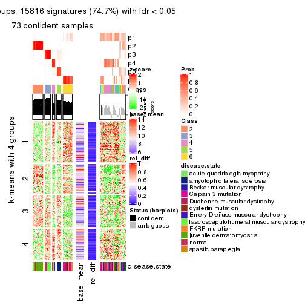</p>

</div>
</div>


Signature heatmaps where rows are not scaled:


<script>
$( function() {
	$( '#tabs-MAD-skmeans-get-signatures-no-scale' ).tabs();
} );
</script>
<div id='tabs-MAD-skmeans-get-signatures-no-scale'>
<ul>
<li><a href='#tab-MAD-skmeans-get-signatures-no-scale-1'>k = 2</a></li>
<li><a href='#tab-MAD-skmeans-get-signatures-no-scale-2'>k = 3</a></li>
<li><a href='#tab-MAD-skmeans-get-signatures-no-scale-3'>k = 4</a></li>
<li><a href='#tab-MAD-skmeans-get-signatures-no-scale-4'>k = 5</a></li>
<li><a href='#tab-MAD-skmeans-get-signatures-no-scale-5'>k = 6</a></li>
</ul>
<div id='tab-MAD-skmeans-get-signatures-no-scale-1'>
<pre><code class="r">get_signatures(res, k = 2, scale_rows = FALSE)
</code></pre>

<p></p>

</div>
<div id='tab-MAD-skmeans-get-signatures-no-scale-2'>
<pre><code class="r">get_signatures(res, k = 3, scale_rows = FALSE)
</code></pre>

<p></p>

</div>
<div id='tab-MAD-skmeans-get-signatures-no-scale-3'>
<pre><code class="r">get_signatures(res, k = 4, scale_rows = FALSE)
</code></pre>

<p></p>

</div>
<div id='tab-MAD-skmeans-get-signatures-no-scale-4'>
<pre><code class="r">get_signatures(res, k = 5, scale_rows = FALSE)
</code></pre>

<p></p>

</div>
<div id='tab-MAD-skmeans-get-signatures-no-scale-5'>
<pre><code class="r">get_signatures(res, k = 6, scale_rows = FALSE)
</code></pre>

<p></p>

</div>
</div>


Compare the overlap of signatures from different k:

```r
compare_signatures(res)
```


`get_signature()` returns a data frame invisibly. TO get the list of signatures, the function
call should be assigned to a variable explicitly. In following code, if `plot` argument is set
to `FALSE`, no heatmap is plotted while only the differential analysis is performed.

```r
# code only for demonstration
tb = get_signature(res, k = ..., plot = FALSE)
```

An example of the output of `tb` is:

```
#>   which_row         fdr    mean_1    mean_2 scaled_mean_1 scaled_mean_2 km
#> 1        38 0.042760348  8.373488  9.131774    -0.5533452     0.5164555  1
#> 2        40 0.018707592  7.106213  8.469186    -0.6173731     0.5762149  1
#> 3        55 0.019134737 10.221463 11.207825    -0.6159697     0.5749050  1
#> 4        59 0.006059896  5.921854  7.869574    -0.6899429     0.6439467  1
#> 5        60 0.018055526  8.928898 10.211722    -0.6204761     0.5791110  1
#> 6        98 0.009384629 15.714769 14.887706     0.6635654    -0.6193277  2
...
```

The columns in `tb` are:

1. `which_row`: row indices corresponding to the input matrix.
2. `fdr`: FDR for the differential test. 
3. `mean_x`: The mean value in group x.
4. `scaled_mean_x`: The mean value in group x after rows are scaled.
5. `km`: Row groups if k-means clustering is applied to rows.


UMAP plot which shows how samples are separated.


<script>
$( function() {
	$( '#tabs-MAD-skmeans-dimension-reduction' ).tabs();
} );
</script>
<div id='tabs-MAD-skmeans-dimension-reduction'>
<ul>
<li><a href='#tab-MAD-skmeans-dimension-reduction-1'>k = 2</a></li>
<li><a href='#tab-MAD-skmeans-dimension-reduction-2'>k = 3</a></li>
<li><a href='#tab-MAD-skmeans-dimension-reduction-3'>k = 4</a></li>
<li><a href='#tab-MAD-skmeans-dimension-reduction-4'>k = 5</a></li>
<li><a href='#tab-MAD-skmeans-dimension-reduction-5'>k = 6</a></li>
</ul>
<div id='tab-MAD-skmeans-dimension-reduction-1'>
<pre><code class="r">dimension_reduction(res, k = 2, method = &quot;UMAP&quot;)
</code></pre>

<p></p>

</div>
<div id='tab-MAD-skmeans-dimension-reduction-2'>
<pre><code class="r">dimension_reduction(res, k = 3, method = &quot;UMAP&quot;)
</code></pre>

<p></p>

</div>
<div id='tab-MAD-skmeans-dimension-reduction-3'>
<pre><code class="r">dimension_reduction(res, k = 4, method = &quot;UMAP&quot;)
</code></pre>

<p></p>

</div>
<div id='tab-MAD-skmeans-dimension-reduction-4'>
<pre><code class="r">dimension_reduction(res, k = 5, method = &quot;UMAP&quot;)
</code></pre>

<p></p>

</div>
<div id='tab-MAD-skmeans-dimension-reduction-5'>
<pre><code class="r">dimension_reduction(res, k = 6, method = &quot;UMAP&quot;)
</code></pre>

<p></p>

</div>
</div>


Following heatmap shows how subgroups are split when increasing `k`:

```r
collect_classes(res)
```


Test correlation between subgroups and known annotations. If the known
annotation is numeric, one-way ANOVA test is applied, and if the known
annotation is discrete, chi-squared contingency table test is applied.

```r
test_to_known_factors(res)
```

```
#>               n disease.state(p) k
#> MAD:skmeans 121         1.64e-11 2
#> MAD:skmeans 117         9.06e-25 3
#> MAD:skmeans 114         1.20e-29 4
#> MAD:skmeans 110         3.19e-42 5
#> MAD:skmeans  74         3.02e-25 6
```


If matrix rows can be associated to genes, consider to use `GO_Enrichment(res,
...)` to perform function enrichment for the signature genes.


 

---------------------------------------------------


### MAD:pam


The object with results only for a single top-value method and a single partition method 
can be extracted as:

```r
res = res_list["MAD", "pam"]
# you can also extract it by
# res = res_list["MAD:pam"]
```

A summary of `res` and all the functions that can be applied to it:

```r
res
```

```
#> A 'ConsensusPartition' object with k = 2, 3, 4, 5, 6.
#>   On a matrix with 21168 rows and 121 columns.
#>   Top rows (1000, 2000, 3000, 4000, 5000) are extracted by 'MAD' method.
#>   Subgroups are detected by 'pam' method.
#>   Performed in total 1250 partitions by row resampling.
#>   Best k for subgroups seems to be 6.
#> 
#> Following methods can be applied to this 'ConsensusPartition' object:
#>  [1] "cola_report"             "collect_classes"         "collect_plots"          
#>  [4] "collect_stats"           "colnames"                "compare_signatures"     
#>  [7] "consensus_heatmap"       "dimension_reduction"     "functional_enrichment"  
#> [10] "get_anno_col"            "get_anno"                "get_classes"            
#> [13] "get_consensus"           "get_matrix"              "get_membership"         
#> [16] "get_param"               "get_signatures"          "get_stats"              
#> [19] "is_best_k"               "is_stable_k"             "membership_heatmap"     
#> [22] "ncol"                    "nrow"                    "plot_ecdf"              
#> [25] "rownames"                "select_partition_number" "show"                   
#> [28] "suggest_best_k"          "test_to_known_factors"
```

`collect_plots()` function collects all the plots made from `res` for all `k` (number of partitions)
into one single page to provide an easy and fast comparison between different `k`.

```r
collect_plots(res)
```


The plots are:

- The first row: a plot of the ECDF (Empirical cumulative distribution
  function) curves of the consensus matrix for each `k` and the heatmap of
  predicted classes for each `k`.
- The second row: heatmaps of the consensus matrix for each `k`.
- The third row: heatmaps of the membership matrix for each `k`.
- The fouth row: heatmaps of the signatures for each `k`.

All the plots in panels can be made by individual functions and they are
plotted later in this section.

`select_partition_number()` produces several plots showing different
statistics for choosing "optimized" `k`. There are following statistics:

- ECDF curves of the consensus matrix for each `k`;
- 1-PAC. [The PAC
  score](https://en.wikipedia.org/wiki/Consensus_clustering#Over-interpretation_potential_of_consensus_clustering)
  measures the proportion of the ambiguous subgrouping.
- Mean silhouette score.
- Concordance. The mean probability of fiting the consensus class ids in all
  partitions.
- Area increased. Denote $A_k$ as the area under the ECDF curve for current
  `k`, the area increased is defined as $A_k - A_{k-1}$.
- Rand index. The percent of pairs of samples that are both in a same cluster
  or both are not in a same cluster in the partition of k and k-1.
- Jaccard index. The ratio of pairs of samples are both in a same cluster in
  the partition of k and k-1 and the pairs of samples are both in a same
  cluster in the partition k or k-1.

The detailed explanations of these statistics can be found in [the cola
vignette](http://bioconductor.org/packages/devel/bioc/vignettes/cola/inst/doc/cola.html#toc_13).

Generally speaking, lower PAC score, higher mean silhouette score or higher
concordance corresponds to better partition. Rand index and Jaccard index
measure how similar the current partition is compared to partition with `k-1`.
If they are too similar, we won't accept `k` is better than `k-1`.

```r
select_partition_number(res)
```


The numeric values for all these statistics can be obtained by `get_stats()`.

```r
get_stats(res)
```

```
#>   k 1-PAC mean_silhouette concordance area_increased  Rand Jaccard
#> 2 2 0.474           0.813       0.895         0.4850 0.521   0.521
#> 3 3 0.673           0.794       0.903         0.3712 0.720   0.505
#> 4 4 0.646           0.629       0.805         0.1244 0.800   0.488
#> 5 5 0.769           0.764       0.881         0.0657 0.902   0.642
#> 6 6 0.856           0.817       0.908         0.0351 0.958   0.800
```

`suggest_best_k()` suggests the best $k$ based on these statistics. The rules are as follows:

- All $k$ with Jaccard index larger than 0.95 are removed because the increase of
  the partition number does not provides enough extra information. If all $k$ are removed,
  the best $k$ is assigned by `NA`.
- For $k$ with 1-PAC larger than 0.9, the maximal $k$ is taken as the "best k". Other $k$ is called "optional k".
- If it does not fit the second rule. The $k$ with the highest vote of highest
  1-PAC, mean silhouette and concordance is taken as the "best k".

```r
suggest_best_k(res)
```

```
#> [1] 6
```


Following shows the table of the partitions (You need to click the **show/hide
code output** link to see it). The membership matrix (columns with name `p*`)
is inferred by
[`clue::cl_consensus()`](https://www.rdocumentation.org/link/cl_consensus?package=clue)
function with the `SE` method. Basically the value in the membership matrix
represents the probability to belong to a certain group. The finall class
label for an item is determined with the group with highest probability it
belongs to.

In `get_classes()` function, the entropy is calculated from the membership
matrix and the silhouette score is calculated from the consensus matrix.


<script>
$( function() {
	$( '#tabs-MAD-pam-get-classes' ).tabs();
} );
</script>
<div id='tabs-MAD-pam-get-classes'>
<ul>
<li><a href='#tab-MAD-pam-get-classes-1'>k = 2</a></li>
<li><a href='#tab-MAD-pam-get-classes-2'>k = 3</a></li>
<li><a href='#tab-MAD-pam-get-classes-3'>k = 4</a></li>
<li><a href='#tab-MAD-pam-get-classes-4'>k = 5</a></li>
<li><a href='#tab-MAD-pam-get-classes-5'>k = 6</a></li>
</ul>

<div id='tab-MAD-pam-get-classes-1'>
<p><a id='tab-MAD-pam-get-classes-1-a' style='color:#0366d6' href='#'>show/hide code output</a></p>
<pre><code class="r">cbind(get_classes(res, k = 2), get_membership(res, k = 2))
</code></pre>

<pre><code>#&gt;           class entropy silhouette    p1    p2
#&gt; GSM74356      1  0.8207      0.752 0.744 0.256
#&gt; GSM74357      1  0.8763      0.721 0.704 0.296
#&gt; GSM74358      1  0.7815      0.771 0.768 0.232
#&gt; GSM74359      1  0.6712      0.802 0.824 0.176
#&gt; GSM74360      1  0.0000      0.842 1.000 0.000
#&gt; GSM74361      1  0.8386      0.744 0.732 0.268
#&gt; GSM74362      1  0.8555      0.733 0.720 0.280
#&gt; GSM74363      1  0.9754      0.562 0.592 0.408
#&gt; GSM74402      1  0.0000      0.842 1.000 0.000
#&gt; GSM74403      1  0.0000      0.842 1.000 0.000
#&gt; GSM74404      1  0.0000      0.842 1.000 0.000
#&gt; GSM74406      1  0.0000      0.842 1.000 0.000
#&gt; GSM74407      1  0.0000      0.842 1.000 0.000
#&gt; GSM74408      1  0.0000      0.842 1.000 0.000
#&gt; GSM74409      1  0.0000      0.842 1.000 0.000
#&gt; GSM74410      1  0.0672      0.843 0.992 0.008
#&gt; GSM119936     1  0.0000      0.842 1.000 0.000
#&gt; GSM119937     1  0.0000      0.842 1.000 0.000
#&gt; GSM74411      2  0.0938      0.935 0.012 0.988
#&gt; GSM74412      2  0.0000      0.944 0.000 1.000
#&gt; GSM74413      2  0.0376      0.941 0.004 0.996
#&gt; GSM74414      2  0.0000      0.944 0.000 1.000
#&gt; GSM74415      2  0.9998     -0.347 0.492 0.508
#&gt; GSM121379     2  0.0000      0.944 0.000 1.000
#&gt; GSM121380     2  0.0000      0.944 0.000 1.000
#&gt; GSM121381     2  0.0000      0.944 0.000 1.000
#&gt; GSM121382     2  0.0000      0.944 0.000 1.000
#&gt; GSM121383     2  0.0000      0.944 0.000 1.000
#&gt; GSM121384     2  0.0000      0.944 0.000 1.000
#&gt; GSM121385     2  0.0000      0.944 0.000 1.000
#&gt; GSM121386     2  0.0000      0.944 0.000 1.000
#&gt; GSM121387     2  0.0000      0.944 0.000 1.000
#&gt; GSM121388     2  0.0000      0.944 0.000 1.000
#&gt; GSM121389     2  0.0000      0.944 0.000 1.000
#&gt; GSM121390     2  0.0000      0.944 0.000 1.000
#&gt; GSM121391     2  0.0000      0.944 0.000 1.000
#&gt; GSM121392     2  0.0000      0.944 0.000 1.000
#&gt; GSM121393     2  0.0000      0.944 0.000 1.000
#&gt; GSM121394     2  0.0000      0.944 0.000 1.000
#&gt; GSM121395     2  0.0000      0.944 0.000 1.000
#&gt; GSM121396     2  0.0000      0.944 0.000 1.000
#&gt; GSM121397     2  0.0000      0.944 0.000 1.000
#&gt; GSM121398     2  0.0000      0.944 0.000 1.000
#&gt; GSM121399     2  0.0000      0.944 0.000 1.000
#&gt; GSM74240      1  0.7950      0.764 0.760 0.240
#&gt; GSM74241      1  0.8499      0.743 0.724 0.276
#&gt; GSM74242      1  0.7056      0.794 0.808 0.192
#&gt; GSM74243      1  0.6973      0.796 0.812 0.188
#&gt; GSM74244      1  0.8499      0.736 0.724 0.276
#&gt; GSM74245      1  0.8207      0.753 0.744 0.256
#&gt; GSM74246      1  0.8955      0.705 0.688 0.312
#&gt; GSM74247      1  0.9087      0.691 0.676 0.324
#&gt; GSM74248      1  0.7299      0.787 0.796 0.204
#&gt; GSM74416      1  0.0000      0.842 1.000 0.000
#&gt; GSM74417      1  0.0000      0.842 1.000 0.000
#&gt; GSM74418      1  0.0000      0.842 1.000 0.000
#&gt; GSM74419      1  0.2043      0.842 0.968 0.032
#&gt; GSM121358     1  0.9881      0.505 0.564 0.436
#&gt; GSM121359     2  0.2236      0.912 0.036 0.964
#&gt; GSM121360     1  0.8661      0.705 0.712 0.288
#&gt; GSM121362     1  0.9427      0.611 0.640 0.360
#&gt; GSM121364     1  0.6801      0.800 0.820 0.180
#&gt; GSM121365     1  0.9983      0.412 0.524 0.476
#&gt; GSM121366     1  0.9954      0.451 0.540 0.460
#&gt; GSM121367     1  0.9881      0.505 0.564 0.436
#&gt; GSM121370     1  0.9833      0.530 0.576 0.424
#&gt; GSM121371     1  0.9922      0.480 0.552 0.448
#&gt; GSM121372     2  0.2423      0.908 0.040 0.960
#&gt; GSM121373     1  0.7056      0.794 0.808 0.192
#&gt; GSM121374     1  0.4161      0.833 0.916 0.084
#&gt; GSM121407     2  0.2236      0.912 0.036 0.964
#&gt; GSM74387      2  0.1184      0.931 0.016 0.984
#&gt; GSM74388      2  0.0000      0.944 0.000 1.000
#&gt; GSM74389      1  0.6801      0.800 0.820 0.180
#&gt; GSM74390      1  0.8555      0.741 0.720 0.280
#&gt; GSM74391      1  0.0672      0.843 0.992 0.008
#&gt; GSM74392      1  0.5408      0.822 0.876 0.124
#&gt; GSM74393      1  0.7056      0.794 0.808 0.192
#&gt; GSM74394      2  0.0672      0.939 0.008 0.992
#&gt; GSM74239      1  0.0672      0.842 0.992 0.008
#&gt; GSM74364      1  0.0672      0.842 0.992 0.008
#&gt; GSM74365      1  0.2236      0.838 0.964 0.036
#&gt; GSM74366      2  0.0672      0.938 0.008 0.992
#&gt; GSM74367      1  0.0672      0.842 0.992 0.008
#&gt; GSM74377      2  0.7602      0.712 0.220 0.780
#&gt; GSM74378      2  0.6801      0.755 0.180 0.820
#&gt; GSM74379      1  0.4939      0.806 0.892 0.108
#&gt; GSM74380      1  0.4298      0.814 0.912 0.088
#&gt; GSM74381      2  0.7299      0.728 0.204 0.796
#&gt; GSM121357     2  0.0000      0.944 0.000 1.000
#&gt; GSM121361     2  0.0000      0.944 0.000 1.000
#&gt; GSM121363     2  0.0000      0.944 0.000 1.000
#&gt; GSM121368     2  0.0000      0.944 0.000 1.000
#&gt; GSM121369     2  0.0000      0.944 0.000 1.000
#&gt; GSM74368      1  0.8016      0.764 0.756 0.244
#&gt; GSM74369      1  0.9393      0.631 0.644 0.356
#&gt; GSM74370      1  0.5059      0.801 0.888 0.112
#&gt; GSM74371      1  0.0000      0.842 1.000 0.000
#&gt; GSM74372      1  0.0672      0.842 0.992 0.008
#&gt; GSM74373      2  0.7528      0.715 0.216 0.784
#&gt; GSM74374      1  0.1184      0.841 0.984 0.016
#&gt; GSM74375      1  0.4939      0.827 0.892 0.108
#&gt; GSM74376      2  0.3879      0.875 0.076 0.924
#&gt; GSM74405      2  0.9044      0.551 0.320 0.680
#&gt; GSM74351      1  0.0000      0.842 1.000 0.000
#&gt; GSM74352      2  0.1184      0.932 0.016 0.984
#&gt; GSM74353      1  0.2236      0.838 0.964 0.036
#&gt; GSM74354      1  0.0938      0.842 0.988 0.012
#&gt; GSM74355      2  0.6973      0.745 0.188 0.812
#&gt; GSM74382      1  0.0000      0.842 1.000 0.000
#&gt; GSM74383      1  0.0672      0.842 0.992 0.008
#&gt; GSM74384      2  0.0000      0.944 0.000 1.000
#&gt; GSM74385      1  0.0376      0.842 0.996 0.004
#&gt; GSM74386      1  0.0672      0.842 0.992 0.008
#&gt; GSM74395      1  0.0672      0.842 0.992 0.008
#&gt; GSM74396      1  0.0938      0.842 0.988 0.012
#&gt; GSM74397      1  0.0672      0.842 0.992 0.008
#&gt; GSM74398      1  0.1633      0.841 0.976 0.024
#&gt; GSM74399      1  0.8144      0.675 0.748 0.252
#&gt; GSM74400      1  0.6801      0.749 0.820 0.180
#&gt; GSM74401      1  0.7376      0.721 0.792 0.208
</code></pre>

<script>
$('#tab-MAD-pam-get-classes-1-a').parent().next().next().hide();
$('#tab-MAD-pam-get-classes-1-a').click(function(){
  $('#tab-MAD-pam-get-classes-1-a').parent().next().next().toggle();
  return(false);
});
</script>
</div>

<div id='tab-MAD-pam-get-classes-2'>
<p><a id='tab-MAD-pam-get-classes-2-a' style='color:#0366d6' href='#'>show/hide code output</a></p>
<pre><code class="r">cbind(get_classes(res, k = 3), get_membership(res, k = 3))
</code></pre>

<pre><code>#&gt;           class entropy silhouette    p1    p2    p3
#&gt; GSM74356      3  0.0237      0.853 0.000 0.004 0.996
#&gt; GSM74357      3  0.0237      0.853 0.004 0.000 0.996
#&gt; GSM74358      3  0.0237      0.853 0.004 0.000 0.996
#&gt; GSM74359      3  0.1031      0.852 0.024 0.000 0.976
#&gt; GSM74360      3  0.6192      0.392 0.420 0.000 0.580
#&gt; GSM74361      3  0.0237      0.853 0.004 0.000 0.996
#&gt; GSM74362      3  0.0475      0.853 0.004 0.004 0.992
#&gt; GSM74363      3  0.0237      0.853 0.000 0.004 0.996
#&gt; GSM74402      3  0.6291      0.235 0.468 0.000 0.532
#&gt; GSM74403      1  0.4346      0.724 0.816 0.000 0.184
#&gt; GSM74404      1  0.4291      0.729 0.820 0.000 0.180
#&gt; GSM74406      3  0.6126      0.436 0.400 0.000 0.600
#&gt; GSM74407      1  0.6180      0.180 0.584 0.000 0.416
#&gt; GSM74408      3  0.4504      0.772 0.196 0.000 0.804
#&gt; GSM74409      3  0.4702      0.758 0.212 0.000 0.788
#&gt; GSM74410      3  0.4452      0.775 0.192 0.000 0.808
#&gt; GSM119936     3  0.4750      0.754 0.216 0.000 0.784
#&gt; GSM119937     3  0.4887      0.743 0.228 0.000 0.772
#&gt; GSM74411      2  0.6026      0.415 0.000 0.624 0.376
#&gt; GSM74412      2  0.0000      0.917 0.000 1.000 0.000
#&gt; GSM74413      2  0.5363      0.604 0.000 0.724 0.276
#&gt; GSM74414      2  0.0000      0.917 0.000 1.000 0.000
#&gt; GSM74415      3  0.1163      0.844 0.000 0.028 0.972
#&gt; GSM121379     2  0.0000      0.917 0.000 1.000 0.000
#&gt; GSM121380     2  0.0000      0.917 0.000 1.000 0.000
#&gt; GSM121381     2  0.0000      0.917 0.000 1.000 0.000
#&gt; GSM121382     2  0.0000      0.917 0.000 1.000 0.000
#&gt; GSM121383     2  0.0000      0.917 0.000 1.000 0.000
#&gt; GSM121384     2  0.0000      0.917 0.000 1.000 0.000
#&gt; GSM121385     2  0.0000      0.917 0.000 1.000 0.000
#&gt; GSM121386     2  0.0000      0.917 0.000 1.000 0.000
#&gt; GSM121387     2  0.0000      0.917 0.000 1.000 0.000
#&gt; GSM121388     2  0.1529      0.893 0.000 0.960 0.040
#&gt; GSM121389     2  0.0000      0.917 0.000 1.000 0.000
#&gt; GSM121390     2  0.0000      0.917 0.000 1.000 0.000
#&gt; GSM121391     2  0.0000      0.917 0.000 1.000 0.000
#&gt; GSM121392     2  0.0237      0.915 0.000 0.996 0.004
#&gt; GSM121393     2  0.0000      0.917 0.000 1.000 0.000
#&gt; GSM121394     2  0.0000      0.917 0.000 1.000 0.000
#&gt; GSM121395     2  0.0000      0.917 0.000 1.000 0.000
#&gt; GSM121396     2  0.2625      0.856 0.000 0.916 0.084
#&gt; GSM121397     2  0.0000      0.917 0.000 1.000 0.000
#&gt; GSM121398     2  0.0000      0.917 0.000 1.000 0.000
#&gt; GSM121399     2  0.0000      0.917 0.000 1.000 0.000
#&gt; GSM74240      3  0.0424      0.853 0.008 0.000 0.992
#&gt; GSM74241      3  0.0592      0.850 0.000 0.012 0.988
#&gt; GSM74242      3  0.1411      0.851 0.036 0.000 0.964
#&gt; GSM74243      3  0.1529      0.850 0.040 0.000 0.960
#&gt; GSM74244      3  0.0000      0.853 0.000 0.000 1.000
#&gt; GSM74245      3  0.0237      0.853 0.000 0.004 0.996
#&gt; GSM74246      3  0.4002      0.737 0.000 0.160 0.840
#&gt; GSM74247      3  0.4178      0.724 0.000 0.172 0.828
#&gt; GSM74248      3  0.0424      0.853 0.008 0.000 0.992
#&gt; GSM74416      1  0.5882      0.388 0.652 0.000 0.348
#&gt; GSM74417      1  0.5988      0.330 0.632 0.000 0.368
#&gt; GSM74418      1  0.5706      0.461 0.680 0.000 0.320
#&gt; GSM74419      3  0.4605      0.766 0.204 0.000 0.796
#&gt; GSM121358     3  0.0237      0.853 0.000 0.004 0.996
#&gt; GSM121359     3  0.3879      0.748 0.000 0.152 0.848
#&gt; GSM121360     3  0.6481      0.710 0.224 0.048 0.728
#&gt; GSM121362     3  0.6402      0.729 0.200 0.056 0.744
#&gt; GSM121364     3  0.4121      0.793 0.168 0.000 0.832
#&gt; GSM121365     3  0.0237      0.853 0.000 0.004 0.996
#&gt; GSM121366     3  0.0237      0.853 0.000 0.004 0.996
#&gt; GSM121367     3  0.0237      0.853 0.000 0.004 0.996
#&gt; GSM121370     3  0.0237      0.853 0.000 0.004 0.996
#&gt; GSM121371     3  0.0237      0.853 0.000 0.004 0.996
#&gt; GSM121372     3  0.2711      0.809 0.000 0.088 0.912
#&gt; GSM121373     3  0.3412      0.820 0.124 0.000 0.876
#&gt; GSM121374     3  0.3267      0.823 0.116 0.000 0.884
#&gt; GSM121407     3  0.4121      0.729 0.000 0.168 0.832
#&gt; GSM74387      2  0.4002      0.767 0.000 0.840 0.160
#&gt; GSM74388      2  0.1399      0.898 0.028 0.968 0.004
#&gt; GSM74389      3  0.3116      0.827 0.108 0.000 0.892
#&gt; GSM74390      3  0.7741      0.637 0.216 0.116 0.668
#&gt; GSM74391      3  0.6308      0.164 0.492 0.000 0.508
#&gt; GSM74392      3  0.4654      0.762 0.208 0.000 0.792
#&gt; GSM74393      3  0.2711      0.837 0.088 0.000 0.912
#&gt; GSM74394      2  0.0424      0.914 0.000 0.992 0.008
#&gt; GSM74239      1  0.0000      0.908 1.000 0.000 0.000
#&gt; GSM74364      1  0.0000      0.908 1.000 0.000 0.000
#&gt; GSM74365      1  0.0000      0.908 1.000 0.000 0.000
#&gt; GSM74366      2  0.6081      0.529 0.344 0.652 0.004
#&gt; GSM74367      1  0.0592      0.903 0.988 0.000 0.012
#&gt; GSM74377      1  0.2063      0.869 0.948 0.044 0.008
#&gt; GSM74378      2  0.6247      0.469 0.376 0.620 0.004
#&gt; GSM74379      1  0.0424      0.905 0.992 0.000 0.008
#&gt; GSM74380      1  0.0000      0.908 1.000 0.000 0.000
#&gt; GSM74381      1  0.4834      0.651 0.792 0.204 0.004
#&gt; GSM121357     2  0.0237      0.915 0.000 0.996 0.004
#&gt; GSM121361     2  0.0475      0.914 0.004 0.992 0.004
#&gt; GSM121363     2  0.0237      0.915 0.000 0.996 0.004
#&gt; GSM121368     2  0.0237      0.915 0.000 0.996 0.004
#&gt; GSM121369     2  0.1529      0.894 0.000 0.960 0.040
#&gt; GSM74368      3  0.6260      0.266 0.448 0.000 0.552
#&gt; GSM74369      1  0.5621      0.456 0.692 0.000 0.308
#&gt; GSM74370      1  0.0237      0.906 0.996 0.000 0.004
#&gt; GSM74371      1  0.0237      0.907 0.996 0.000 0.004
#&gt; GSM74372      1  0.0000      0.908 1.000 0.000 0.000
#&gt; GSM74373      1  0.2200      0.860 0.940 0.056 0.004
#&gt; GSM74374      1  0.0000      0.908 1.000 0.000 0.000
#&gt; GSM74375      1  0.0661      0.906 0.988 0.004 0.008
#&gt; GSM74376      1  0.1711      0.884 0.960 0.032 0.008
#&gt; GSM74405      1  0.0475      0.904 0.992 0.004 0.004
#&gt; GSM74351      1  0.2165      0.863 0.936 0.000 0.064
#&gt; GSM74352      2  0.6247      0.469 0.376 0.620 0.004
#&gt; GSM74353      1  0.0000      0.908 1.000 0.000 0.000
#&gt; GSM74354      1  0.0000      0.908 1.000 0.000 0.000
#&gt; GSM74355      2  0.6500      0.248 0.464 0.532 0.004
#&gt; GSM74382      1  0.1529      0.884 0.960 0.000 0.040
#&gt; GSM74383      1  0.0000      0.908 1.000 0.000 0.000
#&gt; GSM74384      2  0.6169      0.501 0.360 0.636 0.004
#&gt; GSM74385      1  0.0424      0.905 0.992 0.000 0.008
#&gt; GSM74386      1  0.0000      0.908 1.000 0.000 0.000
#&gt; GSM74395      1  0.0237      0.907 0.996 0.000 0.004
#&gt; GSM74396      1  0.0000      0.908 1.000 0.000 0.000
#&gt; GSM74397      1  0.0592      0.903 0.988 0.000 0.012
#&gt; GSM74398      1  0.0237      0.907 0.996 0.000 0.004
#&gt; GSM74399      1  0.0237      0.907 0.996 0.000 0.004
#&gt; GSM74400      1  0.0000      0.908 1.000 0.000 0.000
#&gt; GSM74401      1  0.0237      0.907 0.996 0.000 0.004
</code></pre>

<script>
$('#tab-MAD-pam-get-classes-2-a').parent().next().next().hide();
$('#tab-MAD-pam-get-classes-2-a').click(function(){
  $('#tab-MAD-pam-get-classes-2-a').parent().next().next().toggle();
  return(false);
});
</script>
</div>

<div id='tab-MAD-pam-get-classes-3'>
<p><a id='tab-MAD-pam-get-classes-3-a' style='color:#0366d6' href='#'>show/hide code output</a></p>
<pre><code class="r">cbind(get_classes(res, k = 4), get_membership(res, k = 4))
</code></pre>

<pre><code>#&gt;           class entropy silhouette    p1    p2    p3    p4
#&gt; GSM74356      4  0.5060     0.4580 0.000 0.004 0.412 0.584
#&gt; GSM74357      4  0.4888     0.4598 0.000 0.000 0.412 0.588
#&gt; GSM74358      4  0.4888     0.4598 0.000 0.000 0.412 0.588
#&gt; GSM74359      4  0.2589     0.4739 0.000 0.000 0.116 0.884
#&gt; GSM74360      4  0.6111     0.1738 0.092 0.000 0.256 0.652
#&gt; GSM74361      4  0.4790     0.4732 0.000 0.000 0.380 0.620
#&gt; GSM74362      4  0.4877     0.4667 0.000 0.000 0.408 0.592
#&gt; GSM74363      4  0.5060     0.4580 0.000 0.004 0.412 0.584
#&gt; GSM74402      4  0.3933     0.4750 0.200 0.000 0.008 0.792
#&gt; GSM74403      4  0.5203     0.3793 0.348 0.000 0.016 0.636
#&gt; GSM74404      4  0.5649     0.3654 0.344 0.000 0.036 0.620
#&gt; GSM74406      4  0.5172     0.5108 0.188 0.000 0.068 0.744
#&gt; GSM74407      4  0.5697     0.3885 0.292 0.000 0.052 0.656
#&gt; GSM74408      4  0.1637     0.5238 0.060 0.000 0.000 0.940
#&gt; GSM74409      4  0.3691     0.5397 0.076 0.000 0.068 0.856
#&gt; GSM74410      4  0.3935     0.5483 0.060 0.000 0.100 0.840
#&gt; GSM119936     4  0.2300     0.5166 0.064 0.000 0.016 0.920
#&gt; GSM119937     4  0.5171     0.5476 0.112 0.000 0.128 0.760
#&gt; GSM74411      3  0.3497     0.4783 0.000 0.124 0.852 0.024
#&gt; GSM74412      2  0.2814     0.8246 0.000 0.868 0.132 0.000
#&gt; GSM74413      3  0.5344     0.4446 0.000 0.300 0.668 0.032
#&gt; GSM74414      2  0.0000     0.9776 0.000 1.000 0.000 0.000
#&gt; GSM74415      3  0.0469     0.4334 0.000 0.000 0.988 0.012
#&gt; GSM121379     2  0.0000     0.9776 0.000 1.000 0.000 0.000
#&gt; GSM121380     2  0.0000     0.9776 0.000 1.000 0.000 0.000
#&gt; GSM121381     2  0.0000     0.9776 0.000 1.000 0.000 0.000
#&gt; GSM121382     2  0.0000     0.9776 0.000 1.000 0.000 0.000
#&gt; GSM121383     2  0.0000     0.9776 0.000 1.000 0.000 0.000
#&gt; GSM121384     2  0.0000     0.9776 0.000 1.000 0.000 0.000
#&gt; GSM121385     2  0.0000     0.9776 0.000 1.000 0.000 0.000
#&gt; GSM121386     2  0.0000     0.9776 0.000 1.000 0.000 0.000
#&gt; GSM121387     2  0.0000     0.9776 0.000 1.000 0.000 0.000
#&gt; GSM121388     2  0.1356     0.9431 0.000 0.960 0.032 0.008
#&gt; GSM121389     2  0.0000     0.9776 0.000 1.000 0.000 0.000
#&gt; GSM121390     2  0.0000     0.9776 0.000 1.000 0.000 0.000
#&gt; GSM121391     2  0.0000     0.9776 0.000 1.000 0.000 0.000
#&gt; GSM121392     2  0.0000     0.9776 0.000 1.000 0.000 0.000
#&gt; GSM121393     2  0.0000     0.9776 0.000 1.000 0.000 0.000
#&gt; GSM121394     2  0.0000     0.9776 0.000 1.000 0.000 0.000
#&gt; GSM121395     2  0.0000     0.9776 0.000 1.000 0.000 0.000
#&gt; GSM121396     2  0.2921     0.8206 0.000 0.860 0.140 0.000
#&gt; GSM121397     2  0.0000     0.9776 0.000 1.000 0.000 0.000
#&gt; GSM121398     2  0.0000     0.9776 0.000 1.000 0.000 0.000
#&gt; GSM121399     2  0.0000     0.9776 0.000 1.000 0.000 0.000
#&gt; GSM74240      3  0.4699     0.6012 0.004 0.000 0.676 0.320
#&gt; GSM74241      3  0.4040     0.6175 0.000 0.000 0.752 0.248
#&gt; GSM74242      3  0.4564     0.5970 0.000 0.000 0.672 0.328
#&gt; GSM74243      3  0.4605     0.5915 0.000 0.000 0.664 0.336
#&gt; GSM74244      3  0.4040     0.6175 0.000 0.000 0.752 0.248
#&gt; GSM74245      3  0.4040     0.6175 0.000 0.000 0.752 0.248
#&gt; GSM74246      3  0.4220     0.6186 0.004 0.000 0.748 0.248
#&gt; GSM74247      3  0.4220     0.6186 0.004 0.000 0.748 0.248
#&gt; GSM74248      3  0.4522     0.6006 0.000 0.000 0.680 0.320
#&gt; GSM74416      4  0.5173     0.3989 0.320 0.000 0.020 0.660
#&gt; GSM74417      4  0.5152     0.4026 0.316 0.000 0.020 0.664
#&gt; GSM74418      4  0.5252     0.3873 0.336 0.000 0.020 0.644
#&gt; GSM74419      4  0.3081     0.5110 0.064 0.000 0.048 0.888
#&gt; GSM121358     4  0.5060     0.4580 0.000 0.004 0.412 0.584
#&gt; GSM121359     3  0.7745    -0.2105 0.000 0.236 0.412 0.352
#&gt; GSM121360     3  0.6217     0.5692 0.084 0.000 0.624 0.292
#&gt; GSM121362     3  0.6152     0.5702 0.052 0.012 0.640 0.296
#&gt; GSM121364     4  0.3850     0.5188 0.044 0.000 0.116 0.840
#&gt; GSM121365     4  0.5060     0.4580 0.000 0.004 0.412 0.584
#&gt; GSM121366     4  0.5060     0.4580 0.000 0.004 0.412 0.584
#&gt; GSM121367     4  0.5060     0.4580 0.000 0.004 0.412 0.584
#&gt; GSM121370     3  0.5105    -0.2889 0.000 0.004 0.564 0.432
#&gt; GSM121371     4  0.5060     0.4580 0.000 0.004 0.412 0.584
#&gt; GSM121372     4  0.7113     0.3056 0.000 0.128 0.416 0.456
#&gt; GSM121373     4  0.4284     0.5208 0.012 0.000 0.224 0.764
#&gt; GSM121374     4  0.4542     0.5271 0.020 0.000 0.228 0.752
#&gt; GSM121407     3  0.7745    -0.2105 0.000 0.236 0.412 0.352
#&gt; GSM74387      3  0.5126     0.2230 0.004 0.444 0.552 0.000
#&gt; GSM74388      2  0.2149     0.8809 0.088 0.912 0.000 0.000
#&gt; GSM74389      3  0.4855     0.5252 0.000 0.000 0.600 0.400
#&gt; GSM74390      3  0.7136     0.5590 0.116 0.024 0.608 0.252
#&gt; GSM74391      4  0.6295    -0.0606 0.072 0.000 0.348 0.580
#&gt; GSM74392      4  0.4955    -0.0252 0.008 0.000 0.344 0.648
#&gt; GSM74393      3  0.4746     0.5622 0.000 0.000 0.632 0.368
#&gt; GSM74394      3  0.5080     0.2914 0.004 0.420 0.576 0.000
#&gt; GSM74239      1  0.2530     0.7774 0.888 0.000 0.000 0.112
#&gt; GSM74364      1  0.2704     0.7685 0.876 0.000 0.000 0.124
#&gt; GSM74365      1  0.0188     0.8351 0.996 0.000 0.000 0.004
#&gt; GSM74366      1  0.4661     0.4912 0.652 0.348 0.000 0.000
#&gt; GSM74367      1  0.2589     0.7720 0.884 0.000 0.000 0.116
#&gt; GSM74377      1  0.0188     0.8344 0.996 0.000 0.004 0.000
#&gt; GSM74378      1  0.4477     0.5554 0.688 0.312 0.000 0.000
#&gt; GSM74379      1  0.0000     0.8348 1.000 0.000 0.000 0.000
#&gt; GSM74380      1  0.0188     0.8351 0.996 0.000 0.000 0.004
#&gt; GSM74381      1  0.1867     0.7975 0.928 0.072 0.000 0.000
#&gt; GSM121357     2  0.0000     0.9776 0.000 1.000 0.000 0.000
#&gt; GSM121361     2  0.2480     0.8788 0.008 0.904 0.088 0.000
#&gt; GSM121363     2  0.0376     0.9719 0.004 0.992 0.004 0.000
#&gt; GSM121368     2  0.0376     0.9719 0.004 0.992 0.004 0.000
#&gt; GSM121369     3  0.5452     0.2583 0.016 0.428 0.556 0.000
#&gt; GSM74368      4  0.6340     0.2166 0.408 0.000 0.064 0.528
#&gt; GSM74369      1  0.3626     0.6741 0.812 0.000 0.004 0.184
#&gt; GSM74370      1  0.0817     0.8277 0.976 0.000 0.024 0.000
#&gt; GSM74371      1  0.3219     0.7288 0.836 0.000 0.000 0.164
#&gt; GSM74372      1  0.1302     0.8192 0.956 0.000 0.000 0.044
#&gt; GSM74373      1  0.1389     0.8144 0.952 0.000 0.048 0.000
#&gt; GSM74374      1  0.0188     0.8351 0.996 0.000 0.000 0.004
#&gt; GSM74375      1  0.5956     0.6012 0.680 0.000 0.220 0.100
#&gt; GSM74376      1  0.4382     0.5409 0.704 0.000 0.296 0.000
#&gt; GSM74405      1  0.0000     0.8348 1.000 0.000 0.000 0.000
#&gt; GSM74351      1  0.5444     0.1839 0.560 0.000 0.016 0.424
#&gt; GSM74352      1  0.4585     0.5219 0.668 0.332 0.000 0.000
#&gt; GSM74353      1  0.0469     0.8338 0.988 0.000 0.000 0.012
#&gt; GSM74354      1  0.0524     0.8352 0.988 0.000 0.004 0.008
#&gt; GSM74355      1  0.4250     0.6121 0.724 0.276 0.000 0.000
#&gt; GSM74382      4  0.5600     0.0618 0.468 0.000 0.020 0.512
#&gt; GSM74383      1  0.0336     0.8350 0.992 0.000 0.000 0.008
#&gt; GSM74384      1  0.4543     0.5348 0.676 0.324 0.000 0.000
#&gt; GSM74385      1  0.3444     0.6978 0.816 0.000 0.000 0.184
#&gt; GSM74386      1  0.4332     0.7167 0.800 0.000 0.160 0.040
#&gt; GSM74395      1  0.1733     0.8251 0.948 0.000 0.024 0.028
#&gt; GSM74396      1  0.0188     0.8351 0.996 0.000 0.000 0.004
#&gt; GSM74397      1  0.4790     0.3484 0.620 0.000 0.000 0.380
#&gt; GSM74398      1  0.0376     0.8356 0.992 0.000 0.004 0.004
#&gt; GSM74399      1  0.0000     0.8348 1.000 0.000 0.000 0.000
#&gt; GSM74400      1  0.0817     0.8300 0.976 0.000 0.000 0.024
#&gt; GSM74401      1  0.0188     0.8351 0.996 0.000 0.000 0.004
</code></pre>

<script>
$('#tab-MAD-pam-get-classes-3-a').parent().next().next().hide();
$('#tab-MAD-pam-get-classes-3-a').click(function(){
  $('#tab-MAD-pam-get-classes-3-a').parent().next().next().toggle();
  return(false);
});
</script>
</div>

<div id='tab-MAD-pam-get-classes-4'>
<p><a id='tab-MAD-pam-get-classes-4-a' style='color:#0366d6' href='#'>show/hide code output</a></p>
<pre><code class="r">cbind(get_classes(res, k = 5), get_membership(res, k = 5))
</code></pre>

<pre><code>#&gt;           class entropy silhouette    p1    p2    p3    p4    p5
#&gt; GSM74356      3  0.0609     0.9006 0.000 0.000 0.980 0.020 0.000
#&gt; GSM74357      3  0.0609     0.9006 0.000 0.000 0.980 0.020 0.000
#&gt; GSM74358      3  0.0609     0.9006 0.000 0.000 0.980 0.020 0.000
#&gt; GSM74359      4  0.5435     0.0823 0.000 0.000 0.428 0.512 0.060
#&gt; GSM74360      4  0.2624     0.6261 0.000 0.000 0.012 0.872 0.116
#&gt; GSM74361      3  0.2927     0.7986 0.000 0.000 0.868 0.040 0.092
#&gt; GSM74362      3  0.5490     0.4920 0.000 0.000 0.644 0.128 0.228
#&gt; GSM74363      3  0.0609     0.9006 0.000 0.000 0.980 0.020 0.000
#&gt; GSM74402      4  0.5815     0.5657 0.068 0.000 0.268 0.632 0.032
#&gt; GSM74403      4  0.3321     0.6945 0.136 0.000 0.000 0.832 0.032
#&gt; GSM74404      4  0.4194     0.6785 0.132 0.000 0.000 0.780 0.088
#&gt; GSM74406      4  0.0865     0.6852 0.000 0.000 0.024 0.972 0.004
#&gt; GSM74407      4  0.7305     0.5442 0.100 0.000 0.184 0.544 0.172
#&gt; GSM74408      4  0.3454     0.6544 0.000 0.000 0.156 0.816 0.028
#&gt; GSM74409      4  0.2439     0.6496 0.000 0.000 0.120 0.876 0.004
#&gt; GSM74410      4  0.4366     0.5095 0.000 0.000 0.320 0.664 0.016
#&gt; GSM119936     4  0.3577     0.6479 0.000 0.000 0.160 0.808 0.032
#&gt; GSM119937     4  0.5891     0.3314 0.068 0.000 0.428 0.492 0.012
#&gt; GSM74411      5  0.2625     0.7982 0.000 0.016 0.108 0.000 0.876
#&gt; GSM74412      2  0.3177     0.7319 0.000 0.792 0.000 0.000 0.208
#&gt; GSM74413      5  0.3966     0.7465 0.000 0.132 0.072 0.000 0.796
#&gt; GSM74414      2  0.0000     0.9723 0.000 1.000 0.000 0.000 0.000
#&gt; GSM74415      5  0.1341     0.8351 0.000 0.000 0.056 0.000 0.944
#&gt; GSM121379     2  0.0000     0.9723 0.000 1.000 0.000 0.000 0.000
#&gt; GSM121380     2  0.0000     0.9723 0.000 1.000 0.000 0.000 0.000
#&gt; GSM121381     2  0.0000     0.9723 0.000 1.000 0.000 0.000 0.000
#&gt; GSM121382     2  0.0000     0.9723 0.000 1.000 0.000 0.000 0.000
#&gt; GSM121383     2  0.0000     0.9723 0.000 1.000 0.000 0.000 0.000
#&gt; GSM121384     2  0.0000     0.9723 0.000 1.000 0.000 0.000 0.000
#&gt; GSM121385     2  0.0000     0.9723 0.000 1.000 0.000 0.000 0.000
#&gt; GSM121386     2  0.0000     0.9723 0.000 1.000 0.000 0.000 0.000
#&gt; GSM121387     2  0.0000     0.9723 0.000 1.000 0.000 0.000 0.000
#&gt; GSM121388     2  0.1851     0.8995 0.000 0.912 0.088 0.000 0.000
#&gt; GSM121389     2  0.0000     0.9723 0.000 1.000 0.000 0.000 0.000
#&gt; GSM121390     2  0.0000     0.9723 0.000 1.000 0.000 0.000 0.000
#&gt; GSM121391     2  0.0000     0.9723 0.000 1.000 0.000 0.000 0.000
#&gt; GSM121392     2  0.0000     0.9723 0.000 1.000 0.000 0.000 0.000
#&gt; GSM121393     2  0.0000     0.9723 0.000 1.000 0.000 0.000 0.000
#&gt; GSM121394     2  0.0000     0.9723 0.000 1.000 0.000 0.000 0.000
#&gt; GSM121395     2  0.0000     0.9723 0.000 1.000 0.000 0.000 0.000
#&gt; GSM121396     2  0.2471     0.8443 0.000 0.864 0.136 0.000 0.000
#&gt; GSM121397     2  0.0000     0.9723 0.000 1.000 0.000 0.000 0.000
#&gt; GSM121398     2  0.0000     0.9723 0.000 1.000 0.000 0.000 0.000
#&gt; GSM121399     2  0.0000     0.9723 0.000 1.000 0.000 0.000 0.000
#&gt; GSM74240      5  0.0290     0.8587 0.000 0.000 0.000 0.008 0.992
#&gt; GSM74241      5  0.0290     0.8587 0.000 0.000 0.000 0.008 0.992
#&gt; GSM74242      5  0.0609     0.8556 0.000 0.000 0.000 0.020 0.980
#&gt; GSM74243      5  0.0609     0.8556 0.000 0.000 0.000 0.020 0.980
#&gt; GSM74244      5  0.0290     0.8587 0.000 0.000 0.000 0.008 0.992
#&gt; GSM74245      5  0.0290     0.8587 0.000 0.000 0.000 0.008 0.992
#&gt; GSM74246      5  0.0290     0.8587 0.000 0.000 0.000 0.008 0.992
#&gt; GSM74247      5  0.0290     0.8587 0.000 0.000 0.000 0.008 0.992
#&gt; GSM74248      5  0.0290     0.8587 0.000 0.000 0.000 0.008 0.992
#&gt; GSM74416      4  0.2654     0.6994 0.084 0.000 0.000 0.884 0.032
#&gt; GSM74417      4  0.0290     0.6872 0.000 0.000 0.000 0.992 0.008
#&gt; GSM74418      4  0.0703     0.6920 0.024 0.000 0.000 0.976 0.000
#&gt; GSM74419      4  0.4879     0.5658 0.016 0.000 0.264 0.688 0.032
#&gt; GSM121358     3  0.0000     0.9083 0.000 0.000 1.000 0.000 0.000
#&gt; GSM121359     3  0.0290     0.9019 0.000 0.008 0.992 0.000 0.000
#&gt; GSM121360     5  0.4684     0.2847 0.008 0.000 0.004 0.452 0.536
#&gt; GSM121362     5  0.5715     0.1790 0.028 0.000 0.032 0.460 0.480
#&gt; GSM121364     4  0.5053     0.4982 0.000 0.000 0.216 0.688 0.096
#&gt; GSM121365     3  0.0000     0.9083 0.000 0.000 1.000 0.000 0.000
#&gt; GSM121366     3  0.0000     0.9083 0.000 0.000 1.000 0.000 0.000
#&gt; GSM121367     3  0.0000     0.9083 0.000 0.000 1.000 0.000 0.000
#&gt; GSM121370     3  0.0000     0.9083 0.000 0.000 1.000 0.000 0.000
#&gt; GSM121371     3  0.0000     0.9083 0.000 0.000 1.000 0.000 0.000
#&gt; GSM121372     3  0.0000     0.9083 0.000 0.000 1.000 0.000 0.000
#&gt; GSM121373     4  0.6309     0.2566 0.000 0.000 0.288 0.520 0.192
#&gt; GSM121374     4  0.4708     0.4314 0.000 0.000 0.292 0.668 0.040
#&gt; GSM121407     3  0.0290     0.9019 0.000 0.008 0.992 0.000 0.000
#&gt; GSM74387      5  0.2719     0.7676 0.004 0.144 0.000 0.000 0.852
#&gt; GSM74388      2  0.2077     0.8868 0.084 0.908 0.000 0.000 0.008
#&gt; GSM74389      5  0.1764     0.8268 0.000 0.000 0.008 0.064 0.928
#&gt; GSM74390      5  0.0290     0.8538 0.008 0.000 0.000 0.000 0.992
#&gt; GSM74391      5  0.4425     0.2912 0.000 0.000 0.008 0.392 0.600
#&gt; GSM74392      5  0.4109     0.5566 0.000 0.000 0.012 0.288 0.700
#&gt; GSM74393      5  0.0880     0.8499 0.000 0.000 0.000 0.032 0.968
#&gt; GSM74394      5  0.2439     0.7924 0.004 0.120 0.000 0.000 0.876
#&gt; GSM74239      1  0.4047     0.4596 0.676 0.000 0.000 0.320 0.004
#&gt; GSM74364      4  0.4648     0.1345 0.464 0.000 0.000 0.524 0.012
#&gt; GSM74365      1  0.0290     0.8807 0.992 0.000 0.000 0.008 0.000
#&gt; GSM74366      1  0.3132     0.7379 0.820 0.172 0.000 0.000 0.008
#&gt; GSM74367      1  0.3491     0.6446 0.768 0.000 0.000 0.228 0.004
#&gt; GSM74377      1  0.0290     0.8795 0.992 0.000 0.000 0.000 0.008
#&gt; GSM74378      1  0.2136     0.8248 0.904 0.088 0.000 0.000 0.008
#&gt; GSM74379      1  0.0290     0.8807 0.992 0.000 0.000 0.008 0.000
#&gt; GSM74380      1  0.0162     0.8807 0.996 0.000 0.000 0.004 0.000
#&gt; GSM74381      1  0.0451     0.8790 0.988 0.004 0.000 0.000 0.008
#&gt; GSM121357     2  0.0000     0.9723 0.000 1.000 0.000 0.000 0.000
#&gt; GSM121361     2  0.2886     0.8158 0.008 0.844 0.000 0.000 0.148
#&gt; GSM121363     2  0.0671     0.9601 0.004 0.980 0.000 0.000 0.016
#&gt; GSM121368     2  0.0566     0.9624 0.004 0.984 0.000 0.000 0.012
#&gt; GSM121369     5  0.2971     0.7576 0.008 0.156 0.000 0.000 0.836
#&gt; GSM74368      3  0.7899    -0.0650 0.308 0.000 0.388 0.220 0.084
#&gt; GSM74369      1  0.2899     0.8120 0.872 0.000 0.096 0.028 0.004
#&gt; GSM74370      1  0.1628     0.8622 0.936 0.000 0.000 0.056 0.008
#&gt; GSM74371      4  0.4118     0.4713 0.336 0.000 0.000 0.660 0.004
#&gt; GSM74372      1  0.1043     0.8730 0.960 0.000 0.000 0.040 0.000
#&gt; GSM74373      1  0.0162     0.8807 0.996 0.000 0.000 0.004 0.000
#&gt; GSM74374      1  0.0162     0.8807 0.996 0.000 0.000 0.004 0.000
#&gt; GSM74375      1  0.6456     0.0401 0.468 0.000 0.000 0.340 0.192
#&gt; GSM74376      1  0.2020     0.8186 0.900 0.000 0.000 0.000 0.100
#&gt; GSM74405      1  0.0162     0.8802 0.996 0.000 0.000 0.000 0.004
#&gt; GSM74351      4  0.4616     0.5532 0.288 0.000 0.000 0.676 0.036
#&gt; GSM74352      1  0.2462     0.8050 0.880 0.112 0.000 0.000 0.008
#&gt; GSM74353      1  0.0609     0.8804 0.980 0.000 0.000 0.020 0.000
#&gt; GSM74354      1  0.2124     0.8346 0.900 0.000 0.000 0.096 0.004
#&gt; GSM74355      1  0.1830     0.8420 0.924 0.068 0.000 0.000 0.008
#&gt; GSM74382      4  0.3035     0.6978 0.112 0.000 0.000 0.856 0.032
#&gt; GSM74383      1  0.1043     0.8715 0.960 0.000 0.000 0.040 0.000
#&gt; GSM74384      1  0.2193     0.8208 0.900 0.092 0.000 0.000 0.008
#&gt; GSM74385      4  0.4434     0.1630 0.460 0.000 0.000 0.536 0.004
#&gt; GSM74386      1  0.5921     0.3637 0.568 0.000 0.000 0.136 0.296
#&gt; GSM74395      1  0.2305     0.8396 0.896 0.000 0.000 0.092 0.012
#&gt; GSM74396      1  0.0963     0.8737 0.964 0.000 0.000 0.036 0.000
#&gt; GSM74397      4  0.4731     0.4728 0.328 0.000 0.000 0.640 0.032
#&gt; GSM74398      1  0.0451     0.8812 0.988 0.000 0.000 0.008 0.004
#&gt; GSM74399      1  0.0000     0.8807 1.000 0.000 0.000 0.000 0.000
#&gt; GSM74400      1  0.2329     0.7992 0.876 0.000 0.000 0.124 0.000
#&gt; GSM74401      1  0.0703     0.8784 0.976 0.000 0.000 0.024 0.000
</code></pre>

<script>
$('#tab-MAD-pam-get-classes-4-a').parent().next().next().hide();
$('#tab-MAD-pam-get-classes-4-a').click(function(){
  $('#tab-MAD-pam-get-classes-4-a').parent().next().next().toggle();
  return(false);
});
</script>
</div>

<div id='tab-MAD-pam-get-classes-5'>
<p><a id='tab-MAD-pam-get-classes-5-a' style='color:#0366d6' href='#'>show/hide code output</a></p>
<pre><code class="r">cbind(get_classes(res, k = 6), get_membership(res, k = 6))
</code></pre>

<pre><code>#&gt;           class entropy silhouette    p1    p2    p3    p4    p5    p6
#&gt; GSM74356      3  0.0790      0.926 0.000 0.000 0.968 0.032 0.000 0.000
#&gt; GSM74357      3  0.0790      0.926 0.000 0.000 0.968 0.032 0.000 0.000
#&gt; GSM74358      3  0.0790      0.926 0.000 0.000 0.968 0.032 0.000 0.000
#&gt; GSM74359      4  0.0622      0.896 0.012 0.000 0.008 0.980 0.000 0.000
#&gt; GSM74360      4  0.0632      0.898 0.024 0.000 0.000 0.976 0.000 0.000
#&gt; GSM74361      3  0.3427      0.750 0.008 0.000 0.804 0.032 0.156 0.000
#&gt; GSM74362      5  0.5923      0.177 0.008 0.000 0.356 0.168 0.468 0.000
#&gt; GSM74363      3  0.0790      0.926 0.000 0.000 0.968 0.032 0.000 0.000
#&gt; GSM74402      1  0.2568      0.761 0.876 0.000 0.068 0.056 0.000 0.000
#&gt; GSM74403      1  0.0363      0.786 0.988 0.000 0.000 0.012 0.000 0.000
#&gt; GSM74404      1  0.0000      0.784 1.000 0.000 0.000 0.000 0.000 0.000
#&gt; GSM74406      1  0.3014      0.715 0.804 0.000 0.012 0.184 0.000 0.000
#&gt; GSM74407      1  0.0405      0.785 0.988 0.000 0.000 0.008 0.004 0.000
#&gt; GSM74408      1  0.5095      0.488 0.584 0.000 0.104 0.312 0.000 0.000
#&gt; GSM74409      4  0.1765      0.827 0.096 0.000 0.000 0.904 0.000 0.000
#&gt; GSM74410      1  0.5149      0.567 0.624 0.000 0.184 0.192 0.000 0.000
#&gt; GSM119936     1  0.3481      0.717 0.792 0.000 0.048 0.160 0.000 0.000
#&gt; GSM119937     1  0.4831      0.561 0.668 0.000 0.164 0.168 0.000 0.000
#&gt; GSM74411      5  0.0937      0.873 0.000 0.000 0.040 0.000 0.960 0.000
#&gt; GSM74412      2  0.3431      0.692 0.000 0.756 0.016 0.000 0.228 0.000
#&gt; GSM74413      5  0.2474      0.817 0.000 0.080 0.040 0.000 0.880 0.000
#&gt; GSM74414      2  0.0000      0.964 0.000 1.000 0.000 0.000 0.000 0.000
#&gt; GSM74415      5  0.0547      0.882 0.000 0.000 0.020 0.000 0.980 0.000
#&gt; GSM121379     2  0.0000      0.964 0.000 1.000 0.000 0.000 0.000 0.000
#&gt; GSM121380     2  0.0000      0.964 0.000 1.000 0.000 0.000 0.000 0.000
#&gt; GSM121381     2  0.0146      0.962 0.000 0.996 0.004 0.000 0.000 0.000
#&gt; GSM121382     2  0.0000      0.964 0.000 1.000 0.000 0.000 0.000 0.000
#&gt; GSM121383     2  0.0000      0.964 0.000 1.000 0.000 0.000 0.000 0.000
#&gt; GSM121384     2  0.0000      0.964 0.000 1.000 0.000 0.000 0.000 0.000
#&gt; GSM121385     2  0.0000      0.964 0.000 1.000 0.000 0.000 0.000 0.000
#&gt; GSM121386     2  0.0000      0.964 0.000 1.000 0.000 0.000 0.000 0.000
#&gt; GSM121387     2  0.0000      0.964 0.000 1.000 0.000 0.000 0.000 0.000
#&gt; GSM121388     2  0.2340      0.829 0.000 0.852 0.148 0.000 0.000 0.000
#&gt; GSM121389     2  0.0000      0.964 0.000 1.000 0.000 0.000 0.000 0.000
#&gt; GSM121390     2  0.0000      0.964 0.000 1.000 0.000 0.000 0.000 0.000
#&gt; GSM121391     2  0.0000      0.964 0.000 1.000 0.000 0.000 0.000 0.000
#&gt; GSM121392     2  0.0000      0.964 0.000 1.000 0.000 0.000 0.000 0.000
#&gt; GSM121393     2  0.0000      0.964 0.000 1.000 0.000 0.000 0.000 0.000
#&gt; GSM121394     2  0.0000      0.964 0.000 1.000 0.000 0.000 0.000 0.000
#&gt; GSM121395     2  0.0000      0.964 0.000 1.000 0.000 0.000 0.000 0.000
#&gt; GSM121396     2  0.2219      0.841 0.000 0.864 0.136 0.000 0.000 0.000
#&gt; GSM121397     2  0.0000      0.964 0.000 1.000 0.000 0.000 0.000 0.000
#&gt; GSM121398     2  0.0000      0.964 0.000 1.000 0.000 0.000 0.000 0.000
#&gt; GSM121399     2  0.0000      0.964 0.000 1.000 0.000 0.000 0.000 0.000
#&gt; GSM74240      5  0.0000      0.887 0.000 0.000 0.000 0.000 1.000 0.000
#&gt; GSM74241      5  0.0000      0.887 0.000 0.000 0.000 0.000 1.000 0.000
#&gt; GSM74242      5  0.0291      0.886 0.004 0.000 0.004 0.000 0.992 0.000
#&gt; GSM74243      5  0.0146      0.887 0.004 0.000 0.000 0.000 0.996 0.000
#&gt; GSM74244      5  0.0000      0.887 0.000 0.000 0.000 0.000 1.000 0.000
#&gt; GSM74245      5  0.0000      0.887 0.000 0.000 0.000 0.000 1.000 0.000
#&gt; GSM74246      5  0.0000      0.887 0.000 0.000 0.000 0.000 1.000 0.000
#&gt; GSM74247      5  0.0000      0.887 0.000 0.000 0.000 0.000 1.000 0.000
#&gt; GSM74248      5  0.0000      0.887 0.000 0.000 0.000 0.000 1.000 0.000
#&gt; GSM74416      1  0.0458      0.785 0.984 0.000 0.000 0.016 0.000 0.000
#&gt; GSM74417      1  0.2969      0.683 0.776 0.000 0.000 0.224 0.000 0.000
#&gt; GSM74418      1  0.2631      0.721 0.820 0.000 0.000 0.180 0.000 0.000
#&gt; GSM74419      1  0.3534      0.723 0.800 0.000 0.076 0.124 0.000 0.000
#&gt; GSM121358     3  0.0000      0.939 0.000 0.000 1.000 0.000 0.000 0.000
#&gt; GSM121359     3  0.0000      0.939 0.000 0.000 1.000 0.000 0.000 0.000
#&gt; GSM121360     4  0.1049      0.872 0.000 0.000 0.000 0.960 0.032 0.008
#&gt; GSM121362     4  0.1007      0.877 0.000 0.000 0.000 0.956 0.044 0.000
#&gt; GSM121364     4  0.0725      0.899 0.012 0.000 0.000 0.976 0.012 0.000
#&gt; GSM121365     3  0.0000      0.939 0.000 0.000 1.000 0.000 0.000 0.000
#&gt; GSM121366     3  0.0000      0.939 0.000 0.000 1.000 0.000 0.000 0.000
#&gt; GSM121367     3  0.0000      0.939 0.000 0.000 1.000 0.000 0.000 0.000
#&gt; GSM121370     3  0.0000      0.939 0.000 0.000 1.000 0.000 0.000 0.000
#&gt; GSM121371     3  0.0000      0.939 0.000 0.000 1.000 0.000 0.000 0.000
#&gt; GSM121372     3  0.0000      0.939 0.000 0.000 1.000 0.000 0.000 0.000
#&gt; GSM121373     4  0.0717      0.897 0.008 0.000 0.000 0.976 0.016 0.000
#&gt; GSM121374     4  0.0632      0.898 0.024 0.000 0.000 0.976 0.000 0.000
#&gt; GSM121407     3  0.0000      0.939 0.000 0.000 1.000 0.000 0.000 0.000
#&gt; GSM74387      5  0.2007      0.860 0.000 0.040 0.016 0.012 0.924 0.008
#&gt; GSM74388      2  0.2039      0.883 0.000 0.904 0.000 0.020 0.000 0.076
#&gt; GSM74389      5  0.2805      0.759 0.012 0.000 0.000 0.160 0.828 0.000
#&gt; GSM74390      5  0.0806      0.879 0.000 0.000 0.000 0.020 0.972 0.008
#&gt; GSM74391      5  0.4294      0.206 0.428 0.000 0.000 0.020 0.552 0.000
#&gt; GSM74392      5  0.4057      0.276 0.008 0.000 0.000 0.436 0.556 0.000
#&gt; GSM74393      5  0.0405      0.884 0.008 0.000 0.000 0.004 0.988 0.000
#&gt; GSM74394      5  0.2402      0.825 0.000 0.084 0.000 0.020 0.888 0.008
#&gt; GSM74239      1  0.3867     -0.223 0.512 0.000 0.000 0.000 0.000 0.488
#&gt; GSM74364      1  0.2826      0.669 0.844 0.000 0.000 0.028 0.000 0.128
#&gt; GSM74365      6  0.1714      0.871 0.092 0.000 0.000 0.000 0.000 0.908
#&gt; GSM74366      6  0.2006      0.826 0.000 0.080 0.000 0.016 0.000 0.904
#&gt; GSM74367      6  0.4569      0.437 0.396 0.000 0.000 0.040 0.000 0.564
#&gt; GSM74377      6  0.0000      0.888 0.000 0.000 0.000 0.000 0.000 1.000
#&gt; GSM74378      6  0.0000      0.888 0.000 0.000 0.000 0.000 0.000 1.000
#&gt; GSM74379      6  0.1075      0.886 0.048 0.000 0.000 0.000 0.000 0.952
#&gt; GSM74380      6  0.0260      0.889 0.008 0.000 0.000 0.000 0.000 0.992
#&gt; GSM74381      6  0.0000      0.888 0.000 0.000 0.000 0.000 0.000 1.000
#&gt; GSM121357     2  0.0622      0.954 0.000 0.980 0.012 0.008 0.000 0.000
#&gt; GSM121361     2  0.3294      0.783 0.000 0.812 0.000 0.020 0.156 0.012
#&gt; GSM121363     2  0.1065      0.944 0.000 0.964 0.000 0.020 0.008 0.008
#&gt; GSM121368     2  0.0951      0.946 0.000 0.968 0.000 0.020 0.004 0.008
#&gt; GSM121369     5  0.2382      0.836 0.000 0.072 0.004 0.020 0.896 0.008
#&gt; GSM74368      3  0.6771      0.368 0.152 0.000 0.528 0.020 0.060 0.240
#&gt; GSM74369      6  0.2294      0.832 0.036 0.000 0.072 0.000 0.000 0.892
#&gt; GSM74370      6  0.2263      0.866 0.048 0.000 0.000 0.056 0.000 0.896
#&gt; GSM74371      1  0.0146      0.782 0.996 0.000 0.000 0.000 0.000 0.004
#&gt; GSM74372      6  0.2178      0.848 0.132 0.000 0.000 0.000 0.000 0.868
#&gt; GSM74373      6  0.0260      0.889 0.008 0.000 0.000 0.000 0.000 0.992
#&gt; GSM74374      6  0.0363      0.890 0.012 0.000 0.000 0.000 0.000 0.988
#&gt; GSM74375      1  0.5520      0.406 0.532 0.000 0.000 0.000 0.156 0.312
#&gt; GSM74376      6  0.0000      0.888 0.000 0.000 0.000 0.000 0.000 1.000
#&gt; GSM74405      6  0.0000      0.888 0.000 0.000 0.000 0.000 0.000 1.000
#&gt; GSM74351      1  0.0000      0.784 1.000 0.000 0.000 0.000 0.000 0.000
#&gt; GSM74352      6  0.0909      0.878 0.000 0.020 0.000 0.012 0.000 0.968
#&gt; GSM74353      6  0.1663      0.875 0.088 0.000 0.000 0.000 0.000 0.912
#&gt; GSM74354      6  0.3383      0.729 0.268 0.000 0.000 0.000 0.004 0.728
#&gt; GSM74355      6  0.0458      0.884 0.000 0.000 0.000 0.016 0.000 0.984
#&gt; GSM74382      1  0.0000      0.784 1.000 0.000 0.000 0.000 0.000 0.000
#&gt; GSM74383      6  0.2883      0.790 0.212 0.000 0.000 0.000 0.000 0.788
#&gt; GSM74384      6  0.0000      0.888 0.000 0.000 0.000 0.000 0.000 1.000
#&gt; GSM74385      4  0.5099      0.190 0.424 0.000 0.000 0.496 0.000 0.080
#&gt; GSM74386      6  0.7382      0.198 0.200 0.000 0.000 0.144 0.272 0.384
#&gt; GSM74395      6  0.3650      0.772 0.216 0.000 0.000 0.024 0.004 0.756
#&gt; GSM74396      6  0.2854      0.794 0.208 0.000 0.000 0.000 0.000 0.792
#&gt; GSM74397      1  0.0146      0.784 0.996 0.000 0.000 0.004 0.000 0.000
#&gt; GSM74398      6  0.0260      0.889 0.008 0.000 0.000 0.000 0.000 0.992
#&gt; GSM74399      6  0.0146      0.889 0.004 0.000 0.000 0.000 0.000 0.996
#&gt; GSM74400      6  0.2912      0.770 0.216 0.000 0.000 0.000 0.000 0.784
#&gt; GSM74401      6  0.1610      0.876 0.084 0.000 0.000 0.000 0.000 0.916
</code></pre>

<script>
$('#tab-MAD-pam-get-classes-5-a').parent().next().next().hide();
$('#tab-MAD-pam-get-classes-5-a').click(function(){
  $('#tab-MAD-pam-get-classes-5-a').parent().next().next().toggle();
  return(false);
});
</script>
</div>
</div>

Heatmaps for the consensus matrix. It visualizes the probability of two
samples to be in a same group.


<script>
$( function() {
	$( '#tabs-MAD-pam-consensus-heatmap' ).tabs();
} );
</script>
<div id='tabs-MAD-pam-consensus-heatmap'>
<ul>
<li><a href='#tab-MAD-pam-consensus-heatmap-1'>k = 2</a></li>
<li><a href='#tab-MAD-pam-consensus-heatmap-2'>k = 3</a></li>
<li><a href='#tab-MAD-pam-consensus-heatmap-3'>k = 4</a></li>
<li><a href='#tab-MAD-pam-consensus-heatmap-4'>k = 5</a></li>
<li><a href='#tab-MAD-pam-consensus-heatmap-5'>k = 6</a></li>
</ul>
<div id='tab-MAD-pam-consensus-heatmap-1'>
<pre><code class="r">consensus_heatmap(res, k = 2)
</code></pre>

<p></p>

</div>
<div id='tab-MAD-pam-consensus-heatmap-2'>
<pre><code class="r">consensus_heatmap(res, k = 3)
</code></pre>

<p></p>

</div>
<div id='tab-MAD-pam-consensus-heatmap-3'>
<pre><code class="r">consensus_heatmap(res, k = 4)
</code></pre>

<p></p>

</div>
<div id='tab-MAD-pam-consensus-heatmap-4'>
<pre><code class="r">consensus_heatmap(res, k = 5)
</code></pre>

<p></p>

</div>
<div id='tab-MAD-pam-consensus-heatmap-5'>
<pre><code class="r">consensus_heatmap(res, k = 6)
</code></pre>

<p></p>

</div>
</div>

Heatmaps for the membership of samples in all partitions to see how consistent they are:


<script>
$( function() {
	$( '#tabs-MAD-pam-membership-heatmap' ).tabs();
} );
</script>
<div id='tabs-MAD-pam-membership-heatmap'>
<ul>
<li><a href='#tab-MAD-pam-membership-heatmap-1'>k = 2</a></li>
<li><a href='#tab-MAD-pam-membership-heatmap-2'>k = 3</a></li>
<li><a href='#tab-MAD-pam-membership-heatmap-3'>k = 4</a></li>
<li><a href='#tab-MAD-pam-membership-heatmap-4'>k = 5</a></li>
<li><a href='#tab-MAD-pam-membership-heatmap-5'>k = 6</a></li>
</ul>
<div id='tab-MAD-pam-membership-heatmap-1'>
<pre><code class="r">membership_heatmap(res, k = 2)
</code></pre>

<p></p>

</div>
<div id='tab-MAD-pam-membership-heatmap-2'>
<pre><code class="r">membership_heatmap(res, k = 3)
</code></pre>

<p></p>

</div>
<div id='tab-MAD-pam-membership-heatmap-3'>
<pre><code class="r">membership_heatmap(res, k = 4)
</code></pre>

<p></p>

</div>
<div id='tab-MAD-pam-membership-heatmap-4'>
<pre><code class="r">membership_heatmap(res, k = 5)
</code></pre>

<p></p>

</div>
<div id='tab-MAD-pam-membership-heatmap-5'>
<pre><code class="r">membership_heatmap(res, k = 6)
</code></pre>

<p></p>

</div>
</div>

As soon as we have had the classes for columns, we can look for signatures
which are significantly different between classes which can be candidate marks
for certain classes. Following are the heatmaps for signatures.


Signature heatmaps where rows are scaled:


<script>
$( function() {
	$( '#tabs-MAD-pam-get-signatures' ).tabs();
} );
</script>
<div id='tabs-MAD-pam-get-signatures'>
<ul>
<li><a href='#tab-MAD-pam-get-signatures-1'>k = 2</a></li>
<li><a href='#tab-MAD-pam-get-signatures-2'>k = 3</a></li>
<li><a href='#tab-MAD-pam-get-signatures-3'>k = 4</a></li>
<li><a href='#tab-MAD-pam-get-signatures-4'>k = 5</a></li>
<li><a href='#tab-MAD-pam-get-signatures-5'>k = 6</a></li>
</ul>
<div id='tab-MAD-pam-get-signatures-1'>
<pre><code class="r">get_signatures(res, k = 2)
</code></pre>

<p></p>

</div>
<div id='tab-MAD-pam-get-signatures-2'>
<pre><code class="r">get_signatures(res, k = 3)
</code></pre>

<p></p>

</div>
<div id='tab-MAD-pam-get-signatures-3'>
<pre><code class="r">get_signatures(res, k = 4)
</code></pre>

<p></p>

</div>
<div id='tab-MAD-pam-get-signatures-4'>
<pre><code class="r">get_signatures(res, k = 5)
</code></pre>

<p></p>

</div>
<div id='tab-MAD-pam-get-signatures-5'>
<pre><code class="r">get_signatures(res, k = 6)
</code></pre>

<p></p>

</div>
</div>


Signature heatmaps where rows are not scaled:


<script>
$( function() {
	$( '#tabs-MAD-pam-get-signatures-no-scale' ).tabs();
} );
</script>
<div id='tabs-MAD-pam-get-signatures-no-scale'>
<ul>
<li><a href='#tab-MAD-pam-get-signatures-no-scale-1'>k = 2</a></li>
<li><a href='#tab-MAD-pam-get-signatures-no-scale-2'>k = 3</a></li>
<li><a href='#tab-MAD-pam-get-signatures-no-scale-3'>k = 4</a></li>
<li><a href='#tab-MAD-pam-get-signatures-no-scale-4'>k = 5</a></li>
<li><a href='#tab-MAD-pam-get-signatures-no-scale-5'>k = 6</a></li>
</ul>
<div id='tab-MAD-pam-get-signatures-no-scale-1'>
<pre><code class="r">get_signatures(res, k = 2, scale_rows = FALSE)
</code></pre>

<p></p>

</div>
<div id='tab-MAD-pam-get-signatures-no-scale-2'>
<pre><code class="r">get_signatures(res, k = 3, scale_rows = FALSE)
</code></pre>

<p></p>

</div>
<div id='tab-MAD-pam-get-signatures-no-scale-3'>
<pre><code class="r">get_signatures(res, k = 4, scale_rows = FALSE)
</code></pre>

<p></p>

</div>
<div id='tab-MAD-pam-get-signatures-no-scale-4'>
<pre><code class="r">get_signatures(res, k = 5, scale_rows = FALSE)
</code></pre>

<p></p>

</div>
<div id='tab-MAD-pam-get-signatures-no-scale-5'>
<pre><code class="r">get_signatures(res, k = 6, scale_rows = FALSE)
</code></pre>

<p></p>

</div>
</div>


Compare the overlap of signatures from different k:

```r
compare_signatures(res)
```


`get_signature()` returns a data frame invisibly. TO get the list of signatures, the function
call should be assigned to a variable explicitly. In following code, if `plot` argument is set
to `FALSE`, no heatmap is plotted while only the differential analysis is performed.

```r
# code only for demonstration
tb = get_signature(res, k = ..., plot = FALSE)
```

An example of the output of `tb` is:

```
#>   which_row         fdr    mean_1    mean_2 scaled_mean_1 scaled_mean_2 km
#> 1        38 0.042760348  8.373488  9.131774    -0.5533452     0.5164555  1
#> 2        40 0.018707592  7.106213  8.469186    -0.6173731     0.5762149  1
#> 3        55 0.019134737 10.221463 11.207825    -0.6159697     0.5749050  1
#> 4        59 0.006059896  5.921854  7.869574    -0.6899429     0.6439467  1
#> 5        60 0.018055526  8.928898 10.211722    -0.6204761     0.5791110  1
#> 6        98 0.009384629 15.714769 14.887706     0.6635654    -0.6193277  2
...
```

The columns in `tb` are:

1. `which_row`: row indices corresponding to the input matrix.
2. `fdr`: FDR for the differential test. 
3. `mean_x`: The mean value in group x.
4. `scaled_mean_x`: The mean value in group x after rows are scaled.
5. `km`: Row groups if k-means clustering is applied to rows.


UMAP plot which shows how samples are separated.


<script>
$( function() {
	$( '#tabs-MAD-pam-dimension-reduction' ).tabs();
} );
</script>
<div id='tabs-MAD-pam-dimension-reduction'>
<ul>
<li><a href='#tab-MAD-pam-dimension-reduction-1'>k = 2</a></li>
<li><a href='#tab-MAD-pam-dimension-reduction-2'>k = 3</a></li>
<li><a href='#tab-MAD-pam-dimension-reduction-3'>k = 4</a></li>
<li><a href='#tab-MAD-pam-dimension-reduction-4'>k = 5</a></li>
<li><a href='#tab-MAD-pam-dimension-reduction-5'>k = 6</a></li>
</ul>
<div id='tab-MAD-pam-dimension-reduction-1'>
<pre><code class="r">dimension_reduction(res, k = 2, method = &quot;UMAP&quot;)
</code></pre>

<p></p>

</div>
<div id='tab-MAD-pam-dimension-reduction-2'>
<pre><code class="r">dimension_reduction(res, k = 3, method = &quot;UMAP&quot;)
</code></pre>

<p></p>

</div>
<div id='tab-MAD-pam-dimension-reduction-3'>
<pre><code class="r">dimension_reduction(res, k = 4, method = &quot;UMAP&quot;)
</code></pre>

<p></p>

</div>
<div id='tab-MAD-pam-dimension-reduction-4'>
<pre><code class="r">dimension_reduction(res, k = 5, method = &quot;UMAP&quot;)
</code></pre>

<p></p>

</div>
<div id='tab-MAD-pam-dimension-reduction-5'>
<pre><code class="r">dimension_reduction(res, k = 6, method = &quot;UMAP&quot;)
</code></pre>

<p></p>

</div>
</div>


Following heatmap shows how subgroups are split when increasing `k`:

```r
collect_classes(res)
```


Test correlation between subgroups and known annotations. If the known
annotation is numeric, one-way ANOVA test is applied, and if the known
annotation is discrete, chi-squared contingency table test is applied.

```r
test_to_known_factors(res)
```

```
#>           n disease.state(p) k
#> MAD:pam 117         4.39e-11 2
#> MAD:pam 107         9.17e-24 3
#> MAD:pam  84         1.16e-28 4
#> MAD:pam 104         5.26e-42 5
#> MAD:pam 111         4.15e-37 6
```


If matrix rows can be associated to genes, consider to use `GO_Enrichment(res,
...)` to perform function enrichment for the signature genes.


 

---------------------------------------------------


### MAD:mclust


The object with results only for a single top-value method and a single partition method 
can be extracted as:

```r
res = res_list["MAD", "mclust"]
# you can also extract it by
# res = res_list["MAD:mclust"]
```

A summary of `res` and all the functions that can be applied to it:

```r
res
```

```
#> A 'ConsensusPartition' object with k = 2, 3, 4, 5, 6.
#>   On a matrix with 21168 rows and 121 columns.
#>   Top rows (1000, 2000, 3000, 4000, 5000) are extracted by 'MAD' method.
#>   Subgroups are detected by 'mclust' method.
#>   Performed in total 1250 partitions by row resampling.
#>   Best k for subgroups seems to be 3.
#> 
#> Following methods can be applied to this 'ConsensusPartition' object:
#>  [1] "cola_report"             "collect_classes"         "collect_plots"          
#>  [4] "collect_stats"           "colnames"                "compare_signatures"     
#>  [7] "consensus_heatmap"       "dimension_reduction"     "functional_enrichment"  
#> [10] "get_anno_col"            "get_anno"                "get_classes"            
#> [13] "get_consensus"           "get_matrix"              "get_membership"         
#> [16] "get_param"               "get_signatures"          "get_stats"              
#> [19] "is_best_k"               "is_stable_k"             "membership_heatmap"     
#> [22] "ncol"                    "nrow"                    "plot_ecdf"              
#> [25] "rownames"                "select_partition_number" "show"                   
#> [28] "suggest_best_k"          "test_to_known_factors"
```

`collect_plots()` function collects all the plots made from `res` for all `k` (number of partitions)
into one single page to provide an easy and fast comparison between different `k`.

```r
collect_plots(res)
```


The plots are:

- The first row: a plot of the ECDF (Empirical cumulative distribution
  function) curves of the consensus matrix for each `k` and the heatmap of
  predicted classes for each `k`.
- The second row: heatmaps of the consensus matrix for each `k`.
- The third row: heatmaps of the membership matrix for each `k`.
- The fouth row: heatmaps of the signatures for each `k`.

All the plots in panels can be made by individual functions and they are
plotted later in this section.

`select_partition_number()` produces several plots showing different
statistics for choosing "optimized" `k`. There are following statistics:

- ECDF curves of the consensus matrix for each `k`;
- 1-PAC. [The PAC
  score](https://en.wikipedia.org/wiki/Consensus_clustering#Over-interpretation_potential_of_consensus_clustering)
  measures the proportion of the ambiguous subgrouping.
- Mean silhouette score.
- Concordance. The mean probability of fiting the consensus class ids in all
  partitions.
- Area increased. Denote $A_k$ as the area under the ECDF curve for current
  `k`, the area increased is defined as $A_k - A_{k-1}$.
- Rand index. The percent of pairs of samples that are both in a same cluster
  or both are not in a same cluster in the partition of k and k-1.
- Jaccard index. The ratio of pairs of samples are both in a same cluster in
  the partition of k and k-1 and the pairs of samples are both in a same
  cluster in the partition k or k-1.

The detailed explanations of these statistics can be found in [the cola
vignette](http://bioconductor.org/packages/devel/bioc/vignettes/cola/inst/doc/cola.html#toc_13).

Generally speaking, lower PAC score, higher mean silhouette score or higher
concordance corresponds to better partition. Rand index and Jaccard index
measure how similar the current partition is compared to partition with `k-1`.
If they are too similar, we won't accept `k` is better than `k-1`.

```r
select_partition_number(res)
```


The numeric values for all these statistics can be obtained by `get_stats()`.

```r
get_stats(res)
```

```
#>   k 1-PAC mean_silhouette concordance area_increased  Rand Jaccard
#> 2 2 0.805           0.914       0.957         0.4970 0.502   0.502
#> 3 3 0.882           0.915       0.950         0.3095 0.821   0.651
#> 4 4 0.707           0.806       0.879         0.1071 0.924   0.786
#> 5 5 0.838           0.845       0.916         0.0862 0.899   0.666
#> 6 6 0.802           0.669       0.813         0.0435 0.925   0.672
```

`suggest_best_k()` suggests the best $k$ based on these statistics. The rules are as follows:

- All $k$ with Jaccard index larger than 0.95 are removed because the increase of
  the partition number does not provides enough extra information. If all $k$ are removed,
  the best $k$ is assigned by `NA`.
- For $k$ with 1-PAC larger than 0.9, the maximal $k$ is taken as the "best k". Other $k$ is called "optional k".
- If it does not fit the second rule. The $k$ with the highest vote of highest
  1-PAC, mean silhouette and concordance is taken as the "best k".

```r
suggest_best_k(res)
```

```
#> [1] 3
```


Following shows the table of the partitions (You need to click the **show/hide
code output** link to see it). The membership matrix (columns with name `p*`)
is inferred by
[`clue::cl_consensus()`](https://www.rdocumentation.org/link/cl_consensus?package=clue)
function with the `SE` method. Basically the value in the membership matrix
represents the probability to belong to a certain group. The finall class
label for an item is determined with the group with highest probability it
belongs to.

In `get_classes()` function, the entropy is calculated from the membership
matrix and the silhouette score is calculated from the consensus matrix.


<script>
$( function() {
	$( '#tabs-MAD-mclust-get-classes' ).tabs();
} );
</script>
<div id='tabs-MAD-mclust-get-classes'>
<ul>
<li><a href='#tab-MAD-mclust-get-classes-1'>k = 2</a></li>
<li><a href='#tab-MAD-mclust-get-classes-2'>k = 3</a></li>
<li><a href='#tab-MAD-mclust-get-classes-3'>k = 4</a></li>
<li><a href='#tab-MAD-mclust-get-classes-4'>k = 5</a></li>
<li><a href='#tab-MAD-mclust-get-classes-5'>k = 6</a></li>
</ul>

<div id='tab-MAD-mclust-get-classes-1'>
<p><a id='tab-MAD-mclust-get-classes-1-a' style='color:#0366d6' href='#'>show/hide code output</a></p>
<pre><code class="r">cbind(get_classes(res, k = 2), get_membership(res, k = 2))
</code></pre>

<pre><code>#&gt;           class entropy silhouette    p1    p2
#&gt; GSM74356      2  0.0000      0.925 0.000 1.000
#&gt; GSM74357      2  0.0000      0.925 0.000 1.000
#&gt; GSM74358      2  0.0000      0.925 0.000 1.000
#&gt; GSM74359      2  0.9129      0.596 0.328 0.672
#&gt; GSM74360      1  0.9795      0.159 0.584 0.416
#&gt; GSM74361      2  0.0000      0.925 0.000 1.000
#&gt; GSM74362      2  0.0000      0.925 0.000 1.000
#&gt; GSM74363      2  0.0376      0.926 0.004 0.996
#&gt; GSM74402      1  0.0000      0.990 1.000 0.000
#&gt; GSM74403      1  0.0000      0.990 1.000 0.000
#&gt; GSM74404      1  0.0000      0.990 1.000 0.000
#&gt; GSM74406      1  0.0376      0.986 0.996 0.004
#&gt; GSM74407      1  0.0000      0.990 1.000 0.000
#&gt; GSM74408      1  0.0000      0.990 1.000 0.000
#&gt; GSM74409      1  0.0000      0.990 1.000 0.000
#&gt; GSM74410      1  0.0000      0.990 1.000 0.000
#&gt; GSM119936     1  0.0000      0.990 1.000 0.000
#&gt; GSM119937     1  0.0000      0.990 1.000 0.000
#&gt; GSM74411      2  0.0000      0.925 0.000 1.000
#&gt; GSM74412      2  0.0000      0.925 0.000 1.000
#&gt; GSM74413      2  0.0000      0.925 0.000 1.000
#&gt; GSM74414      2  0.1184      0.926 0.016 0.984
#&gt; GSM74415      2  0.0000      0.925 0.000 1.000
#&gt; GSM121379     2  0.1184      0.926 0.016 0.984
#&gt; GSM121380     2  0.1184      0.926 0.016 0.984
#&gt; GSM121381     2  0.1184      0.926 0.016 0.984
#&gt; GSM121382     2  0.1184      0.926 0.016 0.984
#&gt; GSM121383     2  0.1184      0.926 0.016 0.984
#&gt; GSM121384     2  0.1184      0.926 0.016 0.984
#&gt; GSM121385     2  0.1184      0.926 0.016 0.984
#&gt; GSM121386     2  0.1184      0.926 0.016 0.984
#&gt; GSM121387     2  0.1184      0.926 0.016 0.984
#&gt; GSM121388     2  0.1184      0.926 0.016 0.984
#&gt; GSM121389     2  0.1184      0.926 0.016 0.984
#&gt; GSM121390     2  0.1184      0.926 0.016 0.984
#&gt; GSM121391     2  0.1184      0.926 0.016 0.984
#&gt; GSM121392     2  0.1184      0.926 0.016 0.984
#&gt; GSM121393     2  0.1843      0.921 0.028 0.972
#&gt; GSM121394     2  0.1184      0.926 0.016 0.984
#&gt; GSM121395     2  0.1184      0.926 0.016 0.984
#&gt; GSM121396     2  0.0938      0.926 0.012 0.988
#&gt; GSM121397     2  0.1184      0.926 0.016 0.984
#&gt; GSM121398     2  0.1184      0.926 0.016 0.984
#&gt; GSM121399     2  0.1184      0.926 0.016 0.984
#&gt; GSM74240      2  0.4161      0.887 0.084 0.916
#&gt; GSM74241      2  0.4431      0.882 0.092 0.908
#&gt; GSM74242      2  0.6623      0.818 0.172 0.828
#&gt; GSM74243      2  0.6623      0.818 0.172 0.828
#&gt; GSM74244      2  0.0376      0.925 0.004 0.996
#&gt; GSM74245      2  0.0376      0.925 0.004 0.996
#&gt; GSM74246      2  0.0672      0.925 0.008 0.992
#&gt; GSM74247      2  0.0376      0.925 0.004 0.996
#&gt; GSM74248      2  0.2603      0.910 0.044 0.956
#&gt; GSM74416      1  0.0000      0.990 1.000 0.000
#&gt; GSM74417      1  0.0000      0.990 1.000 0.000
#&gt; GSM74418      1  0.0000      0.990 1.000 0.000
#&gt; GSM74419      1  0.0000      0.990 1.000 0.000
#&gt; GSM121358     2  0.0000      0.925 0.000 1.000
#&gt; GSM121359     2  0.0000      0.925 0.000 1.000
#&gt; GSM121360     2  0.7528      0.767 0.216 0.784
#&gt; GSM121362     2  0.9710      0.457 0.400 0.600
#&gt; GSM121364     2  0.9732      0.439 0.404 0.596
#&gt; GSM121365     2  0.0000      0.925 0.000 1.000
#&gt; GSM121366     2  0.0000      0.925 0.000 1.000
#&gt; GSM121367     2  0.0000      0.925 0.000 1.000
#&gt; GSM121370     2  0.0000      0.925 0.000 1.000
#&gt; GSM121371     2  0.0000      0.925 0.000 1.000
#&gt; GSM121372     2  0.0000      0.925 0.000 1.000
#&gt; GSM121373     2  0.9795      0.409 0.416 0.584
#&gt; GSM121374     2  0.9732      0.439 0.404 0.596
#&gt; GSM121407     2  0.0000      0.925 0.000 1.000
#&gt; GSM74387      2  0.1184      0.923 0.016 0.984
#&gt; GSM74388      2  0.6887      0.810 0.184 0.816
#&gt; GSM74389      2  0.6623      0.818 0.172 0.828
#&gt; GSM74390      1  0.2236      0.950 0.964 0.036
#&gt; GSM74391      1  0.0672      0.983 0.992 0.008
#&gt; GSM74392      2  0.9775      0.419 0.412 0.588
#&gt; GSM74393      2  0.6531      0.822 0.168 0.832
#&gt; GSM74394      2  0.5519      0.856 0.128 0.872
#&gt; GSM74239      1  0.0000      0.990 1.000 0.000
#&gt; GSM74364      1  0.0000      0.990 1.000 0.000
#&gt; GSM74365      1  0.0000      0.990 1.000 0.000
#&gt; GSM74366      1  0.0000      0.990 1.000 0.000
#&gt; GSM74367      1  0.0000      0.990 1.000 0.000
#&gt; GSM74377      1  0.0000      0.990 1.000 0.000
#&gt; GSM74378      1  0.0000      0.990 1.000 0.000
#&gt; GSM74379      1  0.0000      0.990 1.000 0.000
#&gt; GSM74380      1  0.0000      0.990 1.000 0.000
#&gt; GSM74381      1  0.0000      0.990 1.000 0.000
#&gt; GSM121357     2  0.1184      0.926 0.016 0.984
#&gt; GSM121361     2  0.6438      0.826 0.164 0.836
#&gt; GSM121363     2  0.6048      0.840 0.148 0.852
#&gt; GSM121368     2  0.5294      0.863 0.120 0.880
#&gt; GSM121369     2  0.5946      0.843 0.144 0.856
#&gt; GSM74368      1  0.0000      0.990 1.000 0.000
#&gt; GSM74369      1  0.0000      0.990 1.000 0.000
#&gt; GSM74370      1  0.0000      0.990 1.000 0.000
#&gt; GSM74371      1  0.0000      0.990 1.000 0.000
#&gt; GSM74372      1  0.0000      0.990 1.000 0.000
#&gt; GSM74373      1  0.0000      0.990 1.000 0.000
#&gt; GSM74374      1  0.0000      0.990 1.000 0.000
#&gt; GSM74375      1  0.0000      0.990 1.000 0.000
#&gt; GSM74376      1  0.0000      0.990 1.000 0.000
#&gt; GSM74405      1  0.0000      0.990 1.000 0.000
#&gt; GSM74351      1  0.0000      0.990 1.000 0.000
#&gt; GSM74352      1  0.0000      0.990 1.000 0.000
#&gt; GSM74353      1  0.0000      0.990 1.000 0.000
#&gt; GSM74354      1  0.0000      0.990 1.000 0.000
#&gt; GSM74355      1  0.0000      0.990 1.000 0.000
#&gt; GSM74382      1  0.0000      0.990 1.000 0.000
#&gt; GSM74383      1  0.0000      0.990 1.000 0.000
#&gt; GSM74384      1  0.0000      0.990 1.000 0.000
#&gt; GSM74385      1  0.0000      0.990 1.000 0.000
#&gt; GSM74386      1  0.0000      0.990 1.000 0.000
#&gt; GSM74395      1  0.0000      0.990 1.000 0.000
#&gt; GSM74396      1  0.0000      0.990 1.000 0.000
#&gt; GSM74397      1  0.0000      0.990 1.000 0.000
#&gt; GSM74398      1  0.0000      0.990 1.000 0.000
#&gt; GSM74399      1  0.0000      0.990 1.000 0.000
#&gt; GSM74400      1  0.0000      0.990 1.000 0.000
#&gt; GSM74401      1  0.0000      0.990 1.000 0.000
</code></pre>

<script>
$('#tab-MAD-mclust-get-classes-1-a').parent().next().next().hide();
$('#tab-MAD-mclust-get-classes-1-a').click(function(){
  $('#tab-MAD-mclust-get-classes-1-a').parent().next().next().toggle();
  return(false);
});
</script>
</div>

<div id='tab-MAD-mclust-get-classes-2'>
<p><a id='tab-MAD-mclust-get-classes-2-a' style='color:#0366d6' href='#'>show/hide code output</a></p>
<pre><code class="r">cbind(get_classes(res, k = 3), get_membership(res, k = 3))
</code></pre>

<pre><code>#&gt;           class entropy silhouette    p1    p2    p3
#&gt; GSM74356      2  0.4931      0.815 0.000 0.768 0.232
#&gt; GSM74357      2  0.4931      0.815 0.000 0.768 0.232
#&gt; GSM74358      2  0.4931      0.815 0.000 0.768 0.232
#&gt; GSM74359      3  0.0000      0.946 0.000 0.000 1.000
#&gt; GSM74360      3  0.0747      0.931 0.016 0.000 0.984
#&gt; GSM74361      2  0.6302      0.358 0.000 0.520 0.480
#&gt; GSM74362      3  0.0592      0.940 0.000 0.012 0.988
#&gt; GSM74363      2  0.4931      0.815 0.000 0.768 0.232
#&gt; GSM74402      1  0.0237      0.997 0.996 0.000 0.004
#&gt; GSM74403      1  0.0000      0.999 1.000 0.000 0.000
#&gt; GSM74404      1  0.0000      0.999 1.000 0.000 0.000
#&gt; GSM74406      1  0.0237      0.997 0.996 0.000 0.004
#&gt; GSM74407      1  0.0237      0.997 0.996 0.000 0.004
#&gt; GSM74408      1  0.0237      0.997 0.996 0.000 0.004
#&gt; GSM74409      1  0.0237      0.997 0.996 0.000 0.004
#&gt; GSM74410      1  0.0237      0.997 0.996 0.000 0.004
#&gt; GSM119936     1  0.0237      0.997 0.996 0.000 0.004
#&gt; GSM119937     1  0.0237      0.997 0.996 0.000 0.004
#&gt; GSM74411      2  0.4931      0.815 0.000 0.768 0.232
#&gt; GSM74412      2  0.4931      0.815 0.000 0.768 0.232
#&gt; GSM74413      2  0.4887      0.817 0.000 0.772 0.228
#&gt; GSM74414      2  0.0000      0.872 0.000 1.000 0.000
#&gt; GSM74415      2  0.6260      0.444 0.000 0.552 0.448
#&gt; GSM121379     2  0.0000      0.872 0.000 1.000 0.000
#&gt; GSM121380     2  0.0000      0.872 0.000 1.000 0.000
#&gt; GSM121381     2  0.0000      0.872 0.000 1.000 0.000
#&gt; GSM121382     2  0.0000      0.872 0.000 1.000 0.000
#&gt; GSM121383     2  0.0000      0.872 0.000 1.000 0.000
#&gt; GSM121384     2  0.0000      0.872 0.000 1.000 0.000
#&gt; GSM121385     2  0.0000      0.872 0.000 1.000 0.000
#&gt; GSM121386     2  0.0000      0.872 0.000 1.000 0.000
#&gt; GSM121387     2  0.0000      0.872 0.000 1.000 0.000
#&gt; GSM121388     2  0.0000      0.872 0.000 1.000 0.000
#&gt; GSM121389     2  0.0000      0.872 0.000 1.000 0.000
#&gt; GSM121390     2  0.0000      0.872 0.000 1.000 0.000
#&gt; GSM121391     2  0.0000      0.872 0.000 1.000 0.000
#&gt; GSM121392     2  0.0000      0.872 0.000 1.000 0.000
#&gt; GSM121393     2  0.0000      0.872 0.000 1.000 0.000
#&gt; GSM121394     2  0.0000      0.872 0.000 1.000 0.000
#&gt; GSM121395     2  0.0000      0.872 0.000 1.000 0.000
#&gt; GSM121396     2  0.2537      0.857 0.000 0.920 0.080
#&gt; GSM121397     2  0.0000      0.872 0.000 1.000 0.000
#&gt; GSM121398     2  0.0000      0.872 0.000 1.000 0.000
#&gt; GSM121399     2  0.0000      0.872 0.000 1.000 0.000
#&gt; GSM74240      3  0.0237      0.947 0.000 0.004 0.996
#&gt; GSM74241      3  0.1529      0.908 0.000 0.040 0.960
#&gt; GSM74242      3  0.0000      0.946 0.000 0.000 1.000
#&gt; GSM74243      3  0.0237      0.947 0.000 0.004 0.996
#&gt; GSM74244      3  0.0237      0.947 0.000 0.004 0.996
#&gt; GSM74245      3  0.0237      0.947 0.000 0.004 0.996
#&gt; GSM74246      3  0.0237      0.947 0.000 0.004 0.996
#&gt; GSM74247      3  0.0237      0.947 0.000 0.004 0.996
#&gt; GSM74248      3  0.0237      0.947 0.000 0.004 0.996
#&gt; GSM74416      1  0.0237      0.997 0.996 0.000 0.004
#&gt; GSM74417      1  0.0237      0.997 0.996 0.000 0.004
#&gt; GSM74418      1  0.0237      0.997 0.996 0.000 0.004
#&gt; GSM74419      1  0.0237      0.997 0.996 0.000 0.004
#&gt; GSM121358     2  0.4931      0.815 0.000 0.768 0.232
#&gt; GSM121359     2  0.4931      0.815 0.000 0.768 0.232
#&gt; GSM121360     3  0.0237      0.947 0.000 0.004 0.996
#&gt; GSM121362     3  0.3983      0.778 0.144 0.004 0.852
#&gt; GSM121364     3  0.0000      0.946 0.000 0.000 1.000
#&gt; GSM121365     2  0.4931      0.815 0.000 0.768 0.232
#&gt; GSM121366     2  0.4931      0.815 0.000 0.768 0.232
#&gt; GSM121367     2  0.4931      0.815 0.000 0.768 0.232
#&gt; GSM121370     2  0.4931      0.815 0.000 0.768 0.232
#&gt; GSM121371     2  0.4931      0.815 0.000 0.768 0.232
#&gt; GSM121372     2  0.4931      0.815 0.000 0.768 0.232
#&gt; GSM121373     3  0.0000      0.946 0.000 0.000 1.000
#&gt; GSM121374     3  0.0000      0.946 0.000 0.000 1.000
#&gt; GSM121407     2  0.4931      0.815 0.000 0.768 0.232
#&gt; GSM74387      3  0.0237      0.947 0.000 0.004 0.996
#&gt; GSM74388      3  0.0475      0.945 0.004 0.004 0.992
#&gt; GSM74389      3  0.0000      0.946 0.000 0.000 1.000
#&gt; GSM74390      3  0.6154      0.326 0.408 0.000 0.592
#&gt; GSM74391      3  0.6244      0.229 0.440 0.000 0.560
#&gt; GSM74392      3  0.0000      0.946 0.000 0.000 1.000
#&gt; GSM74393      3  0.0000      0.946 0.000 0.000 1.000
#&gt; GSM74394      3  0.0237      0.947 0.000 0.004 0.996
#&gt; GSM74239      1  0.0000      0.999 1.000 0.000 0.000
#&gt; GSM74364      1  0.0000      0.999 1.000 0.000 0.000
#&gt; GSM74365      1  0.0000      0.999 1.000 0.000 0.000
#&gt; GSM74366      1  0.0000      0.999 1.000 0.000 0.000
#&gt; GSM74367      1  0.0000      0.999 1.000 0.000 0.000
#&gt; GSM74377      1  0.0000      0.999 1.000 0.000 0.000
#&gt; GSM74378      1  0.0000      0.999 1.000 0.000 0.000
#&gt; GSM74379      1  0.0000      0.999 1.000 0.000 0.000
#&gt; GSM74380      1  0.0000      0.999 1.000 0.000 0.000
#&gt; GSM74381      1  0.0000      0.999 1.000 0.000 0.000
#&gt; GSM121357     2  0.0424      0.871 0.000 0.992 0.008
#&gt; GSM121361     3  0.0237      0.947 0.000 0.004 0.996
#&gt; GSM121363     3  0.0237      0.947 0.000 0.004 0.996
#&gt; GSM121368     3  0.0237      0.947 0.000 0.004 0.996
#&gt; GSM121369     3  0.0237      0.947 0.000 0.004 0.996
#&gt; GSM74368      1  0.0000      0.999 1.000 0.000 0.000
#&gt; GSM74369      1  0.0000      0.999 1.000 0.000 0.000
#&gt; GSM74370      1  0.0000      0.999 1.000 0.000 0.000
#&gt; GSM74371      1  0.0000      0.999 1.000 0.000 0.000
#&gt; GSM74372      1  0.0000      0.999 1.000 0.000 0.000
#&gt; GSM74373      1  0.0000      0.999 1.000 0.000 0.000
#&gt; GSM74374      1  0.0000      0.999 1.000 0.000 0.000
#&gt; GSM74375      1  0.0000      0.999 1.000 0.000 0.000
#&gt; GSM74376      1  0.0000      0.999 1.000 0.000 0.000
#&gt; GSM74405      1  0.0000      0.999 1.000 0.000 0.000
#&gt; GSM74351      1  0.0000      0.999 1.000 0.000 0.000
#&gt; GSM74352      1  0.0000      0.999 1.000 0.000 0.000
#&gt; GSM74353      1  0.0000      0.999 1.000 0.000 0.000
#&gt; GSM74354      1  0.0000      0.999 1.000 0.000 0.000
#&gt; GSM74355      1  0.0000      0.999 1.000 0.000 0.000
#&gt; GSM74382      1  0.0000      0.999 1.000 0.000 0.000
#&gt; GSM74383      1  0.0000      0.999 1.000 0.000 0.000
#&gt; GSM74384      1  0.0000      0.999 1.000 0.000 0.000
#&gt; GSM74385      1  0.0000      0.999 1.000 0.000 0.000
#&gt; GSM74386      1  0.0000      0.999 1.000 0.000 0.000
#&gt; GSM74395      1  0.0000      0.999 1.000 0.000 0.000
#&gt; GSM74396      1  0.0000      0.999 1.000 0.000 0.000
#&gt; GSM74397      1  0.0000      0.999 1.000 0.000 0.000
#&gt; GSM74398      1  0.0000      0.999 1.000 0.000 0.000
#&gt; GSM74399      1  0.0000      0.999 1.000 0.000 0.000
#&gt; GSM74400      1  0.0000      0.999 1.000 0.000 0.000
#&gt; GSM74401      1  0.0000      0.999 1.000 0.000 0.000
</code></pre>

<script>
$('#tab-MAD-mclust-get-classes-2-a').parent().next().next().hide();
$('#tab-MAD-mclust-get-classes-2-a').click(function(){
  $('#tab-MAD-mclust-get-classes-2-a').parent().next().next().toggle();
  return(false);
});
</script>
</div>

<div id='tab-MAD-mclust-get-classes-3'>
<p><a id='tab-MAD-mclust-get-classes-3-a' style='color:#0366d6' href='#'>show/hide code output</a></p>
<pre><code class="r">cbind(get_classes(res, k = 4), get_membership(res, k = 4))
</code></pre>

<pre><code>#&gt;           class entropy silhouette    p1    p2    p3    p4
#&gt; GSM74356      2  0.5756     0.7709 0.000 0.692 0.224 0.084
#&gt; GSM74357      2  0.7105     0.6423 0.000 0.560 0.256 0.184
#&gt; GSM74358      2  0.7149     0.6302 0.000 0.552 0.264 0.184
#&gt; GSM74359      3  0.3649     0.7608 0.000 0.000 0.796 0.204
#&gt; GSM74360      3  0.3982     0.7366 0.004 0.000 0.776 0.220
#&gt; GSM74361      3  0.6110     0.1125 0.000 0.368 0.576 0.056
#&gt; GSM74362      3  0.1474     0.8385 0.000 0.000 0.948 0.052
#&gt; GSM74363      2  0.6265     0.7467 0.000 0.656 0.220 0.124
#&gt; GSM74402      4  0.3873     0.7732 0.228 0.000 0.000 0.772
#&gt; GSM74403      1  0.3219     0.8494 0.836 0.000 0.000 0.164
#&gt; GSM74404      1  0.2921     0.8665 0.860 0.000 0.000 0.140
#&gt; GSM74406      4  0.2408     0.9215 0.104 0.000 0.000 0.896
#&gt; GSM74407      4  0.3444     0.8447 0.184 0.000 0.000 0.816
#&gt; GSM74408      4  0.2408     0.9215 0.104 0.000 0.000 0.896
#&gt; GSM74409      4  0.2408     0.9215 0.104 0.000 0.000 0.896
#&gt; GSM74410      4  0.2408     0.9215 0.104 0.000 0.000 0.896
#&gt; GSM119936     4  0.2469     0.9198 0.108 0.000 0.000 0.892
#&gt; GSM119937     4  0.2408     0.9215 0.104 0.000 0.000 0.896
#&gt; GSM74411      2  0.5727     0.7690 0.000 0.692 0.228 0.080
#&gt; GSM74412      2  0.5759     0.7651 0.000 0.688 0.232 0.080
#&gt; GSM74413      2  0.5593     0.7821 0.000 0.708 0.212 0.080
#&gt; GSM74414      2  0.1452     0.8502 0.000 0.956 0.008 0.036
#&gt; GSM74415      3  0.6419    -0.1583 0.000 0.420 0.512 0.068
#&gt; GSM121379     2  0.0000     0.8508 0.000 1.000 0.000 0.000
#&gt; GSM121380     2  0.0000     0.8508 0.000 1.000 0.000 0.000
#&gt; GSM121381     2  0.0000     0.8508 0.000 1.000 0.000 0.000
#&gt; GSM121382     2  0.0000     0.8508 0.000 1.000 0.000 0.000
#&gt; GSM121383     2  0.0000     0.8508 0.000 1.000 0.000 0.000
#&gt; GSM121384     2  0.0000     0.8508 0.000 1.000 0.000 0.000
#&gt; GSM121385     2  0.0000     0.8508 0.000 1.000 0.000 0.000
#&gt; GSM121386     2  0.0000     0.8508 0.000 1.000 0.000 0.000
#&gt; GSM121387     2  0.0000     0.8508 0.000 1.000 0.000 0.000
#&gt; GSM121388     2  0.1209     0.8502 0.000 0.964 0.004 0.032
#&gt; GSM121389     2  0.0000     0.8508 0.000 1.000 0.000 0.000
#&gt; GSM121390     2  0.0188     0.8503 0.000 0.996 0.000 0.004
#&gt; GSM121391     2  0.0000     0.8508 0.000 1.000 0.000 0.000
#&gt; GSM121392     2  0.1209     0.8502 0.000 0.964 0.004 0.032
#&gt; GSM121393     2  0.1396     0.8496 0.004 0.960 0.004 0.032
#&gt; GSM121394     2  0.0188     0.8511 0.000 0.996 0.000 0.004
#&gt; GSM121395     2  0.0000     0.8508 0.000 1.000 0.000 0.000
#&gt; GSM121396     2  0.4525     0.8202 0.000 0.804 0.116 0.080
#&gt; GSM121397     2  0.0000     0.8508 0.000 1.000 0.000 0.000
#&gt; GSM121398     2  0.0000     0.8508 0.000 1.000 0.000 0.000
#&gt; GSM121399     2  0.0000     0.8508 0.000 1.000 0.000 0.000
#&gt; GSM74240      3  0.0592     0.8511 0.000 0.000 0.984 0.016
#&gt; GSM74241      3  0.3707     0.7244 0.000 0.132 0.840 0.028
#&gt; GSM74242      3  0.1867     0.8383 0.000 0.000 0.928 0.072
#&gt; GSM74243      3  0.1637     0.8402 0.000 0.000 0.940 0.060
#&gt; GSM74244      3  0.1118     0.8452 0.000 0.000 0.964 0.036
#&gt; GSM74245      3  0.1302     0.8429 0.000 0.000 0.956 0.044
#&gt; GSM74246      3  0.0817     0.8504 0.000 0.000 0.976 0.024
#&gt; GSM74247      3  0.0336     0.8490 0.000 0.000 0.992 0.008
#&gt; GSM74248      3  0.0592     0.8511 0.000 0.000 0.984 0.016
#&gt; GSM74416      1  0.4933     0.3142 0.568 0.000 0.000 0.432
#&gt; GSM74417      1  0.4730     0.5156 0.636 0.000 0.000 0.364
#&gt; GSM74418      1  0.4866     0.4019 0.596 0.000 0.000 0.404
#&gt; GSM74419      4  0.2530     0.9177 0.112 0.000 0.000 0.888
#&gt; GSM121358     2  0.5628     0.7788 0.000 0.704 0.216 0.080
#&gt; GSM121359     2  0.5184     0.7872 0.000 0.732 0.212 0.056
#&gt; GSM121360     3  0.2589     0.8175 0.000 0.000 0.884 0.116
#&gt; GSM121362     3  0.4610     0.7149 0.100 0.000 0.800 0.100
#&gt; GSM121364     3  0.3764     0.7478 0.000 0.000 0.784 0.216
#&gt; GSM121365     2  0.5593     0.7812 0.000 0.708 0.212 0.080
#&gt; GSM121366     2  0.5593     0.7812 0.000 0.708 0.212 0.080
#&gt; GSM121367     2  0.5628     0.7788 0.000 0.704 0.216 0.080
#&gt; GSM121370     2  0.5661     0.7758 0.000 0.700 0.220 0.080
#&gt; GSM121371     2  0.5628     0.7788 0.000 0.704 0.216 0.080
#&gt; GSM121372     2  0.5593     0.7812 0.000 0.708 0.212 0.080
#&gt; GSM121373     3  0.3444     0.7762 0.000 0.000 0.816 0.184
#&gt; GSM121374     3  0.3764     0.7502 0.000 0.000 0.784 0.216
#&gt; GSM121407     2  0.5464     0.7838 0.000 0.716 0.212 0.072
#&gt; GSM74387      3  0.0336     0.8473 0.000 0.000 0.992 0.008
#&gt; GSM74388      3  0.1610     0.8419 0.016 0.000 0.952 0.032
#&gt; GSM74389      3  0.2760     0.8108 0.000 0.000 0.872 0.128
#&gt; GSM74390      3  0.7538     0.0706 0.260 0.000 0.492 0.248
#&gt; GSM74391      4  0.6827     0.3590 0.128 0.000 0.304 0.568
#&gt; GSM74392      3  0.3907     0.7285 0.000 0.000 0.768 0.232
#&gt; GSM74393      3  0.1211     0.8479 0.000 0.000 0.960 0.040
#&gt; GSM74394      3  0.1022     0.8503 0.000 0.000 0.968 0.032
#&gt; GSM74239      1  0.2973     0.8633 0.856 0.000 0.000 0.144
#&gt; GSM74364      1  0.2973     0.8633 0.856 0.000 0.000 0.144
#&gt; GSM74365      1  0.1474     0.8949 0.948 0.000 0.000 0.052
#&gt; GSM74366      1  0.0000     0.8953 1.000 0.000 0.000 0.000
#&gt; GSM74367      1  0.0592     0.8982 0.984 0.000 0.000 0.016
#&gt; GSM74377      1  0.0000     0.8953 1.000 0.000 0.000 0.000
#&gt; GSM74378      1  0.0000     0.8953 1.000 0.000 0.000 0.000
#&gt; GSM74379      1  0.0188     0.8962 0.996 0.000 0.000 0.004
#&gt; GSM74380      1  0.0188     0.8962 0.996 0.000 0.000 0.004
#&gt; GSM74381      1  0.0000     0.8953 1.000 0.000 0.000 0.000
#&gt; GSM121357     2  0.2483     0.8463 0.000 0.916 0.032 0.052
#&gt; GSM121361     3  0.1022     0.8503 0.000 0.000 0.968 0.032
#&gt; GSM121363     3  0.1022     0.8503 0.000 0.000 0.968 0.032
#&gt; GSM121368     3  0.1022     0.8503 0.000 0.000 0.968 0.032
#&gt; GSM121369     3  0.1022     0.8503 0.000 0.000 0.968 0.032
#&gt; GSM74368      1  0.4304     0.6640 0.716 0.000 0.000 0.284
#&gt; GSM74369      1  0.2814     0.8680 0.868 0.000 0.000 0.132
#&gt; GSM74370      1  0.0469     0.8963 0.988 0.000 0.000 0.012
#&gt; GSM74371      1  0.2921     0.8661 0.860 0.000 0.000 0.140
#&gt; GSM74372      1  0.0469     0.8963 0.988 0.000 0.000 0.012
#&gt; GSM74373      1  0.0000     0.8953 1.000 0.000 0.000 0.000
#&gt; GSM74374      1  0.0336     0.8966 0.992 0.000 0.000 0.008
#&gt; GSM74375      1  0.2011     0.8896 0.920 0.000 0.000 0.080
#&gt; GSM74376      1  0.0000     0.8953 1.000 0.000 0.000 0.000
#&gt; GSM74405      1  0.0000     0.8953 1.000 0.000 0.000 0.000
#&gt; GSM74351      1  0.3356     0.8359 0.824 0.000 0.000 0.176
#&gt; GSM74352      1  0.2408     0.8830 0.896 0.000 0.000 0.104
#&gt; GSM74353      1  0.2760     0.8721 0.872 0.000 0.000 0.128
#&gt; GSM74354      1  0.1118     0.8977 0.964 0.000 0.000 0.036
#&gt; GSM74355      1  0.0000     0.8953 1.000 0.000 0.000 0.000
#&gt; GSM74382      1  0.2973     0.8633 0.856 0.000 0.000 0.144
#&gt; GSM74383      1  0.1940     0.8916 0.924 0.000 0.000 0.076
#&gt; GSM74384      1  0.0188     0.8931 0.996 0.000 0.000 0.004
#&gt; GSM74385      1  0.2814     0.8711 0.868 0.000 0.000 0.132
#&gt; GSM74386      1  0.0469     0.8972 0.988 0.000 0.000 0.012
#&gt; GSM74395      1  0.0921     0.8935 0.972 0.000 0.000 0.028
#&gt; GSM74396      1  0.0469     0.8963 0.988 0.000 0.000 0.012
#&gt; GSM74397      1  0.3311     0.8442 0.828 0.000 0.000 0.172
#&gt; GSM74398      1  0.0336     0.8966 0.992 0.000 0.000 0.008
#&gt; GSM74399      1  0.0188     0.8967 0.996 0.000 0.000 0.004
#&gt; GSM74400      1  0.2469     0.8791 0.892 0.000 0.000 0.108
#&gt; GSM74401      1  0.2589     0.8753 0.884 0.000 0.000 0.116
</code></pre>

<script>
$('#tab-MAD-mclust-get-classes-3-a').parent().next().next().hide();
$('#tab-MAD-mclust-get-classes-3-a').click(function(){
  $('#tab-MAD-mclust-get-classes-3-a').parent().next().next().toggle();
  return(false);
});
</script>
</div>

<div id='tab-MAD-mclust-get-classes-4'>
<p><a id='tab-MAD-mclust-get-classes-4-a' style='color:#0366d6' href='#'>show/hide code output</a></p>
<pre><code class="r">cbind(get_classes(res, k = 5), get_membership(res, k = 5))
</code></pre>

<pre><code>#&gt;           class entropy silhouette    p1    p2    p3    p4    p5
#&gt; GSM74356      3  0.0000      0.941 0.000 0.000 1.000 0.000 0.000
#&gt; GSM74357      3  0.0000      0.941 0.000 0.000 1.000 0.000 0.000
#&gt; GSM74358      3  0.0000      0.941 0.000 0.000 1.000 0.000 0.000
#&gt; GSM74359      5  0.1485      0.921 0.000 0.000 0.032 0.020 0.948
#&gt; GSM74360      5  0.1668      0.918 0.000 0.000 0.028 0.032 0.940
#&gt; GSM74361      3  0.3586      0.602 0.000 0.000 0.736 0.000 0.264
#&gt; GSM74362      5  0.3508      0.733 0.000 0.000 0.252 0.000 0.748
#&gt; GSM74363      3  0.0000      0.941 0.000 0.000 1.000 0.000 0.000
#&gt; GSM74402      4  0.3039      0.735 0.192 0.000 0.000 0.808 0.000
#&gt; GSM74403      1  0.4268      0.268 0.556 0.000 0.000 0.444 0.000
#&gt; GSM74404      1  0.3857      0.641 0.688 0.000 0.000 0.312 0.000
#&gt; GSM74406      4  0.0912      0.813 0.016 0.000 0.000 0.972 0.012
#&gt; GSM74407      4  0.1341      0.801 0.056 0.000 0.000 0.944 0.000
#&gt; GSM74408      4  0.0290      0.822 0.008 0.000 0.000 0.992 0.000
#&gt; GSM74409      4  0.0290      0.822 0.008 0.000 0.000 0.992 0.000
#&gt; GSM74410      4  0.0290      0.822 0.008 0.000 0.000 0.992 0.000
#&gt; GSM119936     4  0.0290      0.822 0.008 0.000 0.000 0.992 0.000
#&gt; GSM119937     4  0.0290      0.822 0.008 0.000 0.000 0.992 0.000
#&gt; GSM74411      3  0.0693      0.936 0.000 0.012 0.980 0.000 0.008
#&gt; GSM74412      3  0.0898      0.934 0.000 0.020 0.972 0.000 0.008
#&gt; GSM74413      3  0.2358      0.881 0.000 0.104 0.888 0.000 0.008
#&gt; GSM74414      2  0.2074      0.876 0.000 0.896 0.104 0.000 0.000
#&gt; GSM74415      3  0.2377      0.835 0.000 0.000 0.872 0.000 0.128
#&gt; GSM121379     2  0.0162      0.981 0.000 0.996 0.004 0.000 0.000
#&gt; GSM121380     2  0.0162      0.981 0.000 0.996 0.004 0.000 0.000
#&gt; GSM121381     2  0.0162      0.981 0.000 0.996 0.004 0.000 0.000
#&gt; GSM121382     2  0.0162      0.981 0.000 0.996 0.004 0.000 0.000
#&gt; GSM121383     2  0.0162      0.981 0.000 0.996 0.004 0.000 0.000
#&gt; GSM121384     2  0.0162      0.981 0.000 0.996 0.004 0.000 0.000
#&gt; GSM121385     2  0.0162      0.981 0.000 0.996 0.004 0.000 0.000
#&gt; GSM121386     2  0.0162      0.981 0.000 0.996 0.004 0.000 0.000
#&gt; GSM121387     2  0.0162      0.981 0.000 0.996 0.004 0.000 0.000
#&gt; GSM121388     2  0.0162      0.978 0.000 0.996 0.004 0.000 0.000
#&gt; GSM121389     2  0.0162      0.981 0.000 0.996 0.004 0.000 0.000
#&gt; GSM121390     2  0.0000      0.978 0.000 1.000 0.000 0.000 0.000
#&gt; GSM121391     2  0.0162      0.981 0.000 0.996 0.004 0.000 0.000
#&gt; GSM121392     2  0.0162      0.978 0.000 0.996 0.004 0.000 0.000
#&gt; GSM121393     2  0.0162      0.978 0.000 0.996 0.004 0.000 0.000
#&gt; GSM121394     2  0.0404      0.975 0.000 0.988 0.012 0.000 0.000
#&gt; GSM121395     2  0.0162      0.981 0.000 0.996 0.004 0.000 0.000
#&gt; GSM121396     3  0.1732      0.895 0.000 0.080 0.920 0.000 0.000
#&gt; GSM121397     2  0.0162      0.981 0.000 0.996 0.004 0.000 0.000
#&gt; GSM121398     2  0.0162      0.981 0.000 0.996 0.004 0.000 0.000
#&gt; GSM121399     2  0.0162      0.981 0.000 0.996 0.004 0.000 0.000
#&gt; GSM74240      5  0.1410      0.920 0.000 0.000 0.060 0.000 0.940
#&gt; GSM74241      5  0.2424      0.877 0.000 0.000 0.132 0.000 0.868
#&gt; GSM74242      5  0.1965      0.909 0.000 0.000 0.096 0.000 0.904
#&gt; GSM74243      5  0.1851      0.913 0.000 0.000 0.088 0.000 0.912
#&gt; GSM74244      5  0.2230      0.891 0.000 0.000 0.116 0.000 0.884
#&gt; GSM74245      5  0.2230      0.891 0.000 0.000 0.116 0.000 0.884
#&gt; GSM74246      5  0.1732      0.909 0.000 0.000 0.080 0.000 0.920
#&gt; GSM74247      5  0.2230      0.891 0.000 0.000 0.116 0.000 0.884
#&gt; GSM74248      5  0.1908      0.905 0.000 0.000 0.092 0.000 0.908
#&gt; GSM74416      4  0.3177      0.720 0.208 0.000 0.000 0.792 0.000
#&gt; GSM74417      4  0.3177      0.720 0.208 0.000 0.000 0.792 0.000
#&gt; GSM74418      4  0.3177      0.720 0.208 0.000 0.000 0.792 0.000
#&gt; GSM74419      4  0.0290      0.822 0.008 0.000 0.000 0.992 0.000
#&gt; GSM121358     3  0.0000      0.941 0.000 0.000 1.000 0.000 0.000
#&gt; GSM121359     3  0.2843      0.844 0.000 0.144 0.848 0.000 0.008
#&gt; GSM121360     5  0.1764      0.919 0.000 0.000 0.064 0.008 0.928
#&gt; GSM121362     5  0.1251      0.902 0.036 0.000 0.000 0.008 0.956
#&gt; GSM121364     5  0.1668      0.919 0.000 0.000 0.032 0.028 0.940
#&gt; GSM121365     3  0.0000      0.941 0.000 0.000 1.000 0.000 0.000
#&gt; GSM121366     3  0.0000      0.941 0.000 0.000 1.000 0.000 0.000
#&gt; GSM121367     3  0.0000      0.941 0.000 0.000 1.000 0.000 0.000
#&gt; GSM121370     3  0.0000      0.941 0.000 0.000 1.000 0.000 0.000
#&gt; GSM121371     3  0.0000      0.941 0.000 0.000 1.000 0.000 0.000
#&gt; GSM121372     3  0.1251      0.927 0.000 0.036 0.956 0.000 0.008
#&gt; GSM121373     5  0.1281      0.921 0.000 0.000 0.032 0.012 0.956
#&gt; GSM121374     5  0.1485      0.921 0.000 0.000 0.032 0.020 0.948
#&gt; GSM121407     3  0.2886      0.836 0.000 0.148 0.844 0.000 0.008
#&gt; GSM74387      5  0.1478      0.918 0.000 0.000 0.064 0.000 0.936
#&gt; GSM74388      5  0.0324      0.917 0.000 0.000 0.004 0.004 0.992
#&gt; GSM74389      5  0.1597      0.922 0.000 0.000 0.048 0.012 0.940
#&gt; GSM74390      5  0.5909      0.477 0.272 0.000 0.016 0.100 0.612
#&gt; GSM74391      5  0.5880      0.483 0.116 0.000 0.004 0.296 0.584
#&gt; GSM74392      5  0.1741      0.913 0.000 0.000 0.024 0.040 0.936
#&gt; GSM74393      5  0.0963      0.922 0.000 0.000 0.036 0.000 0.964
#&gt; GSM74394      5  0.0324      0.917 0.000 0.000 0.004 0.004 0.992
#&gt; GSM74239      1  0.3242      0.766 0.784 0.000 0.000 0.216 0.000
#&gt; GSM74364      1  0.3730      0.687 0.712 0.000 0.000 0.288 0.000
#&gt; GSM74365      1  0.2179      0.828 0.888 0.000 0.000 0.112 0.000
#&gt; GSM74366      1  0.0000      0.853 1.000 0.000 0.000 0.000 0.000
#&gt; GSM74367      1  0.0794      0.854 0.972 0.000 0.000 0.028 0.000
#&gt; GSM74377      1  0.0794      0.854 0.972 0.000 0.000 0.028 0.000
#&gt; GSM74378      1  0.0000      0.853 1.000 0.000 0.000 0.000 0.000
#&gt; GSM74379      1  0.0000      0.853 1.000 0.000 0.000 0.000 0.000
#&gt; GSM74380      1  0.0000      0.853 1.000 0.000 0.000 0.000 0.000
#&gt; GSM74381      1  0.0000      0.853 1.000 0.000 0.000 0.000 0.000
#&gt; GSM121357     2  0.3452      0.674 0.000 0.756 0.244 0.000 0.000
#&gt; GSM121361     5  0.0324      0.917 0.000 0.000 0.004 0.004 0.992
#&gt; GSM121363     5  0.0324      0.917 0.000 0.000 0.004 0.004 0.992
#&gt; GSM121368     5  0.0324      0.917 0.000 0.000 0.004 0.004 0.992
#&gt; GSM121369     5  0.0162      0.917 0.000 0.000 0.004 0.000 0.996
#&gt; GSM74368      4  0.4291      0.061 0.464 0.000 0.000 0.536 0.000
#&gt; GSM74369      1  0.3636      0.708 0.728 0.000 0.000 0.272 0.000
#&gt; GSM74370      1  0.0162      0.853 0.996 0.000 0.000 0.004 0.000
#&gt; GSM74371      1  0.3109      0.779 0.800 0.000 0.000 0.200 0.000
#&gt; GSM74372      1  0.1041      0.839 0.964 0.000 0.000 0.004 0.032
#&gt; GSM74373      1  0.0000      0.853 1.000 0.000 0.000 0.000 0.000
#&gt; GSM74374      1  0.0162      0.853 0.996 0.000 0.000 0.004 0.000
#&gt; GSM74375      1  0.3109      0.778 0.800 0.000 0.000 0.200 0.000
#&gt; GSM74376      1  0.0000      0.853 1.000 0.000 0.000 0.000 0.000
#&gt; GSM74405      1  0.0000      0.853 1.000 0.000 0.000 0.000 0.000
#&gt; GSM74351      4  0.4307     -0.117 0.496 0.000 0.000 0.504 0.000
#&gt; GSM74352      1  0.3424      0.743 0.760 0.000 0.000 0.240 0.000
#&gt; GSM74353      1  0.3612      0.716 0.732 0.000 0.000 0.268 0.000
#&gt; GSM74354      1  0.1544      0.845 0.932 0.000 0.000 0.068 0.000
#&gt; GSM74355      1  0.0000      0.853 1.000 0.000 0.000 0.000 0.000
#&gt; GSM74382      1  0.3774      0.674 0.704 0.000 0.000 0.296 0.000
#&gt; GSM74383      1  0.2230      0.828 0.884 0.000 0.000 0.116 0.000
#&gt; GSM74384      1  0.0000      0.853 1.000 0.000 0.000 0.000 0.000
#&gt; GSM74385      1  0.3636      0.710 0.728 0.000 0.000 0.272 0.000
#&gt; GSM74386      1  0.0703      0.852 0.976 0.000 0.000 0.024 0.000
#&gt; GSM74395      1  0.0162      0.853 0.996 0.000 0.000 0.004 0.000
#&gt; GSM74396      1  0.0162      0.853 0.996 0.000 0.000 0.004 0.000
#&gt; GSM74397      1  0.3003      0.787 0.812 0.000 0.000 0.188 0.000
#&gt; GSM74398      1  0.0000      0.853 1.000 0.000 0.000 0.000 0.000
#&gt; GSM74399      1  0.0703      0.854 0.976 0.000 0.000 0.024 0.000
#&gt; GSM74400      1  0.3586      0.718 0.736 0.000 0.000 0.264 0.000
#&gt; GSM74401      1  0.3612      0.713 0.732 0.000 0.000 0.268 0.000
</code></pre>

<script>
$('#tab-MAD-mclust-get-classes-4-a').parent().next().next().hide();
$('#tab-MAD-mclust-get-classes-4-a').click(function(){
  $('#tab-MAD-mclust-get-classes-4-a').parent().next().next().toggle();
  return(false);
});
</script>
</div>

<div id='tab-MAD-mclust-get-classes-5'>
<p><a id='tab-MAD-mclust-get-classes-5-a' style='color:#0366d6' href='#'>show/hide code output</a></p>
<pre><code class="r">cbind(get_classes(res, k = 6), get_membership(res, k = 6))
</code></pre>

<pre><code>#&gt;           class entropy silhouette    p1    p2    p3    p4    p5    p6
#&gt; GSM74356      3  0.0146     0.8693 0.000 0.000 0.996 0.000 0.004 0.000
#&gt; GSM74357      3  0.0146     0.8693 0.000 0.000 0.996 0.000 0.004 0.000
#&gt; GSM74358      3  0.0146     0.8693 0.000 0.000 0.996 0.000 0.004 0.000
#&gt; GSM74359      5  0.0000     0.9057 0.000 0.000 0.000 0.000 1.000 0.000
#&gt; GSM74360      5  0.0000     0.9057 0.000 0.000 0.000 0.000 1.000 0.000
#&gt; GSM74361      3  0.3592     0.4973 0.000 0.000 0.656 0.000 0.344 0.000
#&gt; GSM74362      5  0.2482     0.7896 0.004 0.000 0.148 0.000 0.848 0.000
#&gt; GSM74363      3  0.0146     0.8693 0.000 0.000 0.996 0.000 0.004 0.000
#&gt; GSM74402      4  0.3782     0.4975 0.360 0.000 0.000 0.636 0.000 0.004
#&gt; GSM74403      4  0.4755     0.3369 0.460 0.000 0.000 0.492 0.000 0.048
#&gt; GSM74404      4  0.5674     0.3395 0.332 0.000 0.000 0.496 0.000 0.172
#&gt; GSM74406      4  0.0713     0.6850 0.000 0.000 0.000 0.972 0.028 0.000
#&gt; GSM74407      4  0.0713     0.6911 0.000 0.000 0.000 0.972 0.000 0.028
#&gt; GSM74408      4  0.0000     0.7065 0.000 0.000 0.000 1.000 0.000 0.000
#&gt; GSM74409      4  0.0000     0.7065 0.000 0.000 0.000 1.000 0.000 0.000
#&gt; GSM74410      4  0.0000     0.7065 0.000 0.000 0.000 1.000 0.000 0.000
#&gt; GSM119936     4  0.0363     0.7049 0.012 0.000 0.000 0.988 0.000 0.000
#&gt; GSM119937     4  0.0000     0.7065 0.000 0.000 0.000 1.000 0.000 0.000
#&gt; GSM74411      3  0.2913     0.8194 0.004 0.180 0.812 0.000 0.004 0.000
#&gt; GSM74412      3  0.2871     0.8119 0.000 0.192 0.804 0.000 0.004 0.000
#&gt; GSM74413      3  0.3081     0.7868 0.000 0.220 0.776 0.000 0.004 0.000
#&gt; GSM74414      2  0.1908     0.8724 0.004 0.900 0.096 0.000 0.000 0.000
#&gt; GSM74415      3  0.3629     0.6368 0.016 0.000 0.724 0.000 0.260 0.000
#&gt; GSM121379     2  0.0000     0.9811 0.000 1.000 0.000 0.000 0.000 0.000
#&gt; GSM121380     2  0.0000     0.9811 0.000 1.000 0.000 0.000 0.000 0.000
#&gt; GSM121381     2  0.0000     0.9811 0.000 1.000 0.000 0.000 0.000 0.000
#&gt; GSM121382     2  0.0000     0.9811 0.000 1.000 0.000 0.000 0.000 0.000
#&gt; GSM121383     2  0.0000     0.9811 0.000 1.000 0.000 0.000 0.000 0.000
#&gt; GSM121384     2  0.0000     0.9811 0.000 1.000 0.000 0.000 0.000 0.000
#&gt; GSM121385     2  0.0000     0.9811 0.000 1.000 0.000 0.000 0.000 0.000
#&gt; GSM121386     2  0.0000     0.9811 0.000 1.000 0.000 0.000 0.000 0.000
#&gt; GSM121387     2  0.0000     0.9811 0.000 1.000 0.000 0.000 0.000 0.000
#&gt; GSM121388     2  0.0146     0.9792 0.004 0.996 0.000 0.000 0.000 0.000
#&gt; GSM121389     2  0.0000     0.9811 0.000 1.000 0.000 0.000 0.000 0.000
#&gt; GSM121390     2  0.0146     0.9792 0.004 0.996 0.000 0.000 0.000 0.000
#&gt; GSM121391     2  0.0000     0.9811 0.000 1.000 0.000 0.000 0.000 0.000
#&gt; GSM121392     2  0.0146     0.9792 0.004 0.996 0.000 0.000 0.000 0.000
#&gt; GSM121393     2  0.0291     0.9759 0.004 0.992 0.000 0.004 0.000 0.000
#&gt; GSM121394     2  0.0000     0.9811 0.000 1.000 0.000 0.000 0.000 0.000
#&gt; GSM121395     2  0.0000     0.9811 0.000 1.000 0.000 0.000 0.000 0.000
#&gt; GSM121396     3  0.3081     0.7882 0.000 0.220 0.776 0.000 0.004 0.000
#&gt; GSM121397     2  0.0000     0.9811 0.000 1.000 0.000 0.000 0.000 0.000
#&gt; GSM121398     2  0.0000     0.9811 0.000 1.000 0.000 0.000 0.000 0.000
#&gt; GSM121399     2  0.0000     0.9811 0.000 1.000 0.000 0.000 0.000 0.000
#&gt; GSM74240      5  0.1501     0.8972 0.076 0.000 0.000 0.000 0.924 0.000
#&gt; GSM74241      5  0.1531     0.8997 0.068 0.000 0.004 0.000 0.928 0.000
#&gt; GSM74242      5  0.0000     0.9057 0.000 0.000 0.000 0.000 1.000 0.000
#&gt; GSM74243      5  0.0000     0.9057 0.000 0.000 0.000 0.000 1.000 0.000
#&gt; GSM74244      5  0.1501     0.8972 0.076 0.000 0.000 0.000 0.924 0.000
#&gt; GSM74245      5  0.1327     0.9003 0.064 0.000 0.000 0.000 0.936 0.000
#&gt; GSM74246      5  0.1765     0.8885 0.096 0.000 0.000 0.000 0.904 0.000
#&gt; GSM74247      5  0.1814     0.8864 0.100 0.000 0.000 0.000 0.900 0.000
#&gt; GSM74248      5  0.1444     0.8983 0.072 0.000 0.000 0.000 0.928 0.000
#&gt; GSM74416      4  0.4184     0.3744 0.488 0.000 0.000 0.500 0.000 0.012
#&gt; GSM74417      4  0.4184     0.3744 0.488 0.000 0.000 0.500 0.000 0.012
#&gt; GSM74418      4  0.4184     0.3744 0.488 0.000 0.000 0.500 0.000 0.012
#&gt; GSM74419      4  0.0000     0.7065 0.000 0.000 0.000 1.000 0.000 0.000
#&gt; GSM121358     3  0.0146     0.8693 0.000 0.000 0.996 0.000 0.004 0.000
#&gt; GSM121359     3  0.2964     0.8034 0.000 0.204 0.792 0.000 0.004 0.000
#&gt; GSM121360     5  0.1556     0.8961 0.080 0.000 0.000 0.000 0.920 0.000
#&gt; GSM121362     5  0.1141     0.8759 0.000 0.000 0.000 0.000 0.948 0.052
#&gt; GSM121364     5  0.0000     0.9057 0.000 0.000 0.000 0.000 1.000 0.000
#&gt; GSM121365     3  0.0146     0.8693 0.000 0.000 0.996 0.000 0.004 0.000
#&gt; GSM121366     3  0.0146     0.8693 0.000 0.000 0.996 0.000 0.004 0.000
#&gt; GSM121367     3  0.0146     0.8693 0.000 0.000 0.996 0.000 0.004 0.000
#&gt; GSM121370     3  0.0146     0.8693 0.000 0.000 0.996 0.000 0.004 0.000
#&gt; GSM121371     3  0.0146     0.8693 0.000 0.000 0.996 0.000 0.004 0.000
#&gt; GSM121372     3  0.2772     0.8194 0.000 0.180 0.816 0.000 0.004 0.000
#&gt; GSM121373     5  0.0000     0.9057 0.000 0.000 0.000 0.000 1.000 0.000
#&gt; GSM121374     5  0.0000     0.9057 0.000 0.000 0.000 0.000 1.000 0.000
#&gt; GSM121407     3  0.3189     0.7674 0.000 0.236 0.760 0.000 0.004 0.000
#&gt; GSM74387      5  0.2883     0.7997 0.212 0.000 0.000 0.000 0.788 0.000
#&gt; GSM74388      1  0.3999    -0.4495 0.500 0.000 0.004 0.000 0.496 0.000
#&gt; GSM74389      5  0.0000     0.9057 0.000 0.000 0.000 0.000 1.000 0.000
#&gt; GSM74390      5  0.4913     0.4195 0.000 0.000 0.000 0.092 0.612 0.296
#&gt; GSM74391      5  0.4168     0.5929 0.000 0.000 0.000 0.256 0.696 0.048
#&gt; GSM74392      5  0.0000     0.9057 0.000 0.000 0.000 0.000 1.000 0.000
#&gt; GSM74393      5  0.0146     0.9057 0.004 0.000 0.000 0.000 0.996 0.000
#&gt; GSM74394      1  0.3999    -0.4495 0.500 0.000 0.004 0.000 0.496 0.000
#&gt; GSM74239      1  0.5719     0.1730 0.460 0.000 0.000 0.168 0.000 0.372
#&gt; GSM74364      1  0.5808     0.1338 0.492 0.000 0.000 0.288 0.000 0.220
#&gt; GSM74365      6  0.3955     0.4130 0.384 0.000 0.000 0.008 0.000 0.608
#&gt; GSM74366      6  0.0146     0.8209 0.004 0.000 0.000 0.000 0.000 0.996
#&gt; GSM74367      6  0.2631     0.6969 0.180 0.000 0.000 0.000 0.000 0.820
#&gt; GSM74377      6  0.3390     0.5632 0.296 0.000 0.000 0.000 0.000 0.704
#&gt; GSM74378      6  0.0146     0.8209 0.004 0.000 0.000 0.000 0.000 0.996
#&gt; GSM74379      6  0.0000     0.8219 0.000 0.000 0.000 0.000 0.000 1.000
#&gt; GSM74380      6  0.0260     0.8214 0.008 0.000 0.000 0.000 0.000 0.992
#&gt; GSM74381      6  0.0000     0.8219 0.000 0.000 0.000 0.000 0.000 1.000
#&gt; GSM121357     2  0.3276     0.6526 0.004 0.764 0.228 0.000 0.004 0.000
#&gt; GSM121361     1  0.3999    -0.4495 0.500 0.000 0.004 0.000 0.496 0.000
#&gt; GSM121363     1  0.3999    -0.4495 0.500 0.000 0.004 0.000 0.496 0.000
#&gt; GSM121368     1  0.3999    -0.4495 0.500 0.000 0.004 0.000 0.496 0.000
#&gt; GSM121369     5  0.3634     0.6300 0.356 0.000 0.000 0.000 0.644 0.000
#&gt; GSM74368      1  0.5724    -0.0677 0.456 0.000 0.000 0.376 0.000 0.168
#&gt; GSM74369      1  0.5844     0.2098 0.488 0.000 0.000 0.244 0.000 0.268
#&gt; GSM74370      6  0.0146     0.8221 0.004 0.000 0.000 0.000 0.000 0.996
#&gt; GSM74371      1  0.5913     0.1938 0.468 0.000 0.000 0.256 0.000 0.276
#&gt; GSM74372      6  0.0146     0.8221 0.004 0.000 0.000 0.000 0.000 0.996
#&gt; GSM74373      6  0.0000     0.8219 0.000 0.000 0.000 0.000 0.000 1.000
#&gt; GSM74374      6  0.0146     0.8221 0.004 0.000 0.000 0.000 0.000 0.996
#&gt; GSM74375      6  0.4463     0.3671 0.376 0.000 0.000 0.036 0.000 0.588
#&gt; GSM74376      6  0.0000     0.8219 0.000 0.000 0.000 0.000 0.000 1.000
#&gt; GSM74405      6  0.0000     0.8219 0.000 0.000 0.000 0.000 0.000 1.000
#&gt; GSM74351      1  0.4899    -0.3368 0.488 0.000 0.000 0.452 0.000 0.060
#&gt; GSM74352      6  0.4757     0.1097 0.468 0.000 0.000 0.048 0.000 0.484
#&gt; GSM74353      1  0.5585     0.1918 0.488 0.000 0.000 0.148 0.000 0.364
#&gt; GSM74354      6  0.3899     0.4481 0.364 0.000 0.000 0.008 0.000 0.628
#&gt; GSM74355      6  0.0146     0.8209 0.004 0.000 0.000 0.000 0.000 0.996
#&gt; GSM74382      1  0.5458    -0.1657 0.480 0.000 0.000 0.396 0.000 0.124
#&gt; GSM74383      6  0.5002     0.1878 0.412 0.000 0.000 0.072 0.000 0.516
#&gt; GSM74384      6  0.0146     0.8209 0.004 0.000 0.000 0.000 0.000 0.996
#&gt; GSM74385      1  0.5616     0.2146 0.492 0.000 0.000 0.156 0.000 0.352
#&gt; GSM74386      6  0.0622     0.8140 0.008 0.000 0.000 0.012 0.000 0.980
#&gt; GSM74395      6  0.0146     0.8221 0.004 0.000 0.000 0.000 0.000 0.996
#&gt; GSM74396      6  0.0363     0.8199 0.012 0.000 0.000 0.000 0.000 0.988
#&gt; GSM74397      6  0.5530     0.1151 0.364 0.000 0.000 0.140 0.000 0.496
#&gt; GSM74398      6  0.0146     0.8221 0.004 0.000 0.000 0.000 0.000 0.996
#&gt; GSM74399      6  0.2838     0.6859 0.188 0.000 0.000 0.004 0.000 0.808
#&gt; GSM74400      1  0.5503     0.1354 0.484 0.000 0.000 0.132 0.000 0.384
#&gt; GSM74401      1  0.5578     0.1983 0.492 0.000 0.000 0.148 0.000 0.360
</code></pre>

<script>
$('#tab-MAD-mclust-get-classes-5-a').parent().next().next().hide();
$('#tab-MAD-mclust-get-classes-5-a').click(function(){
  $('#tab-MAD-mclust-get-classes-5-a').parent().next().next().toggle();
  return(false);
});
</script>
</div>
</div>

Heatmaps for the consensus matrix. It visualizes the probability of two
samples to be in a same group.


<script>
$( function() {
	$( '#tabs-MAD-mclust-consensus-heatmap' ).tabs();
} );
</script>
<div id='tabs-MAD-mclust-consensus-heatmap'>
<ul>
<li><a href='#tab-MAD-mclust-consensus-heatmap-1'>k = 2</a></li>
<li><a href='#tab-MAD-mclust-consensus-heatmap-2'>k = 3</a></li>
<li><a href='#tab-MAD-mclust-consensus-heatmap-3'>k = 4</a></li>
<li><a href='#tab-MAD-mclust-consensus-heatmap-4'>k = 5</a></li>
<li><a href='#tab-MAD-mclust-consensus-heatmap-5'>k = 6</a></li>
</ul>
<div id='tab-MAD-mclust-consensus-heatmap-1'>
<pre><code class="r">consensus_heatmap(res, k = 2)
</code></pre>

<p></p>

</div>
<div id='tab-MAD-mclust-consensus-heatmap-2'>
<pre><code class="r">consensus_heatmap(res, k = 3)
</code></pre>

<p></p>

</div>
<div id='tab-MAD-mclust-consensus-heatmap-3'>
<pre><code class="r">consensus_heatmap(res, k = 4)
</code></pre>

<p></p>

</div>
<div id='tab-MAD-mclust-consensus-heatmap-4'>
<pre><code class="r">consensus_heatmap(res, k = 5)
</code></pre>

<p></p>

</div>
<div id='tab-MAD-mclust-consensus-heatmap-5'>
<pre><code class="r">consensus_heatmap(res, k = 6)
</code></pre>

<p></p>

</div>
</div>

Heatmaps for the membership of samples in all partitions to see how consistent they are:


<script>
$( function() {
	$( '#tabs-MAD-mclust-membership-heatmap' ).tabs();
} );
</script>
<div id='tabs-MAD-mclust-membership-heatmap'>
<ul>
<li><a href='#tab-MAD-mclust-membership-heatmap-1'>k = 2</a></li>
<li><a href='#tab-MAD-mclust-membership-heatmap-2'>k = 3</a></li>
<li><a href='#tab-MAD-mclust-membership-heatmap-3'>k = 4</a></li>
<li><a href='#tab-MAD-mclust-membership-heatmap-4'>k = 5</a></li>
<li><a href='#tab-MAD-mclust-membership-heatmap-5'>k = 6</a></li>
</ul>
<div id='tab-MAD-mclust-membership-heatmap-1'>
<pre><code class="r">membership_heatmap(res, k = 2)
</code></pre>

<p></p>

</div>
<div id='tab-MAD-mclust-membership-heatmap-2'>
<pre><code class="r">membership_heatmap(res, k = 3)
</code></pre>

<p></p>

</div>
<div id='tab-MAD-mclust-membership-heatmap-3'>
<pre><code class="r">membership_heatmap(res, k = 4)
</code></pre>

<p></p>

</div>
<div id='tab-MAD-mclust-membership-heatmap-4'>
<pre><code class="r">membership_heatmap(res, k = 5)
</code></pre>

<p></p>

</div>
<div id='tab-MAD-mclust-membership-heatmap-5'>
<pre><code class="r">membership_heatmap(res, k = 6)
</code></pre>

<p></p>

</div>
</div>

As soon as we have had the classes for columns, we can look for signatures
which are significantly different between classes which can be candidate marks
for certain classes. Following are the heatmaps for signatures.


Signature heatmaps where rows are scaled:


<script>
$( function() {
	$( '#tabs-MAD-mclust-get-signatures' ).tabs();
} );
</script>
<div id='tabs-MAD-mclust-get-signatures'>
<ul>
<li><a href='#tab-MAD-mclust-get-signatures-1'>k = 2</a></li>
<li><a href='#tab-MAD-mclust-get-signatures-2'>k = 3</a></li>
<li><a href='#tab-MAD-mclust-get-signatures-3'>k = 4</a></li>
<li><a href='#tab-MAD-mclust-get-signatures-4'>k = 5</a></li>
<li><a href='#tab-MAD-mclust-get-signatures-5'>k = 6</a></li>
</ul>
<div id='tab-MAD-mclust-get-signatures-1'>
<pre><code class="r">get_signatures(res, k = 2)
</code></pre>

<p></p>

</div>
<div id='tab-MAD-mclust-get-signatures-2'>
<pre><code class="r">get_signatures(res, k = 3)
</code></pre>

<p></p>

</div>
<div id='tab-MAD-mclust-get-signatures-3'>
<pre><code class="r">get_signatures(res, k = 4)
</code></pre>

<p></p>

</div>
<div id='tab-MAD-mclust-get-signatures-4'>
<pre><code class="r">get_signatures(res, k = 5)
</code></pre>

<p></p>

</div>
<div id='tab-MAD-mclust-get-signatures-5'>
<pre><code class="r">get_signatures(res, k = 6)
</code></pre>

<p></p>

</div>
</div>


Signature heatmaps where rows are not scaled:


<script>
$( function() {
	$( '#tabs-MAD-mclust-get-signatures-no-scale' ).tabs();
} );
</script>
<div id='tabs-MAD-mclust-get-signatures-no-scale'>
<ul>
<li><a href='#tab-MAD-mclust-get-signatures-no-scale-1'>k = 2</a></li>
<li><a href='#tab-MAD-mclust-get-signatures-no-scale-2'>k = 3</a></li>
<li><a href='#tab-MAD-mclust-get-signatures-no-scale-3'>k = 4</a></li>
<li><a href='#tab-MAD-mclust-get-signatures-no-scale-4'>k = 5</a></li>
<li><a href='#tab-MAD-mclust-get-signatures-no-scale-5'>k = 6</a></li>
</ul>
<div id='tab-MAD-mclust-get-signatures-no-scale-1'>
<pre><code class="r">get_signatures(res, k = 2, scale_rows = FALSE)
</code></pre>

<p></p>

</div>
<div id='tab-MAD-mclust-get-signatures-no-scale-2'>
<pre><code class="r">get_signatures(res, k = 3, scale_rows = FALSE)
</code></pre>

<p></p>

</div>
<div id='tab-MAD-mclust-get-signatures-no-scale-3'>
<pre><code class="r">get_signatures(res, k = 4, scale_rows = FALSE)
</code></pre>

<p></p>

</div>
<div id='tab-MAD-mclust-get-signatures-no-scale-4'>
<pre><code class="r">get_signatures(res, k = 5, scale_rows = FALSE)
</code></pre>

<p></p>

</div>
<div id='tab-MAD-mclust-get-signatures-no-scale-5'>
<pre><code class="r">get_signatures(res, k = 6, scale_rows = FALSE)
</code></pre>

<p></p>

</div>
</div>


Compare the overlap of signatures from different k:

```r
compare_signatures(res)
```


`get_signature()` returns a data frame invisibly. TO get the list of signatures, the function
call should be assigned to a variable explicitly. In following code, if `plot` argument is set
to `FALSE`, no heatmap is plotted while only the differential analysis is performed.

```r
# code only for demonstration
tb = get_signature(res, k = ..., plot = FALSE)
```

An example of the output of `tb` is:

```
#>   which_row         fdr    mean_1    mean_2 scaled_mean_1 scaled_mean_2 km
#> 1        38 0.042760348  8.373488  9.131774    -0.5533452     0.5164555  1
#> 2        40 0.018707592  7.106213  8.469186    -0.6173731     0.5762149  1
#> 3        55 0.019134737 10.221463 11.207825    -0.6159697     0.5749050  1
#> 4        59 0.006059896  5.921854  7.869574    -0.6899429     0.6439467  1
#> 5        60 0.018055526  8.928898 10.211722    -0.6204761     0.5791110  1
#> 6        98 0.009384629 15.714769 14.887706     0.6635654    -0.6193277  2
...
```

The columns in `tb` are:

1. `which_row`: row indices corresponding to the input matrix.
2. `fdr`: FDR for the differential test. 
3. `mean_x`: The mean value in group x.
4. `scaled_mean_x`: The mean value in group x after rows are scaled.
5. `km`: Row groups if k-means clustering is applied to rows.


UMAP plot which shows how samples are separated.


<script>
$( function() {
	$( '#tabs-MAD-mclust-dimension-reduction' ).tabs();
} );
</script>
<div id='tabs-MAD-mclust-dimension-reduction'>
<ul>
<li><a href='#tab-MAD-mclust-dimension-reduction-1'>k = 2</a></li>
<li><a href='#tab-MAD-mclust-dimension-reduction-2'>k = 3</a></li>
<li><a href='#tab-MAD-mclust-dimension-reduction-3'>k = 4</a></li>
<li><a href='#tab-MAD-mclust-dimension-reduction-4'>k = 5</a></li>
<li><a href='#tab-MAD-mclust-dimension-reduction-5'>k = 6</a></li>
</ul>
<div id='tab-MAD-mclust-dimension-reduction-1'>
<pre><code class="r">dimension_reduction(res, k = 2, method = &quot;UMAP&quot;)
</code></pre>

<p></p>

</div>
<div id='tab-MAD-mclust-dimension-reduction-2'>
<pre><code class="r">dimension_reduction(res, k = 3, method = &quot;UMAP&quot;)
</code></pre>

<p></p>

</div>
<div id='tab-MAD-mclust-dimension-reduction-3'>
<pre><code class="r">dimension_reduction(res, k = 4, method = &quot;UMAP&quot;)
</code></pre>

<p></p>

</div>
<div id='tab-MAD-mclust-dimension-reduction-4'>
<pre><code class="r">dimension_reduction(res, k = 5, method = &quot;UMAP&quot;)
</code></pre>

<p></p>

</div>
<div id='tab-MAD-mclust-dimension-reduction-5'>
<pre><code class="r">dimension_reduction(res, k = 6, method = &quot;UMAP&quot;)
</code></pre>

<p></p>

</div>
</div>


Following heatmap shows how subgroups are split when increasing `k`:

```r
collect_classes(res)
```


Test correlation between subgroups and known annotations. If the known
annotation is numeric, one-way ANOVA test is applied, and if the known
annotation is discrete, chi-squared contingency table test is applied.

```r
test_to_known_factors(res)
```

```
#>              n disease.state(p) k
#> MAD:mclust 115         4.59e-13 2
#> MAD:mclust 117         2.26e-23 3
#> MAD:mclust 115         1.30e-28 4
#> MAD:mclust 116         5.98e-42 5
#> MAD:mclust  91         3.80e-29 6
```


If matrix rows can be associated to genes, consider to use `GO_Enrichment(res,
...)` to perform function enrichment for the signature genes.


 

---------------------------------------------------


### MAD:NMF**


The object with results only for a single top-value method and a single partition method 
can be extracted as:

```r
res = res_list["MAD", "NMF"]
# you can also extract it by
# res = res_list["MAD:NMF"]
```

A summary of `res` and all the functions that can be applied to it:

```r
res
```

```
#> A 'ConsensusPartition' object with k = 2, 3, 4, 5, 6.
#>   On a matrix with 21168 rows and 121 columns.
#>   Top rows (1000, 2000, 3000, 4000, 5000) are extracted by 'MAD' method.
#>   Subgroups are detected by 'NMF' method.
#>   Performed in total 1250 partitions by row resampling.
#>   Best k for subgroups seems to be 2.
#> 
#> Following methods can be applied to this 'ConsensusPartition' object:
#>  [1] "cola_report"             "collect_classes"         "collect_plots"          
#>  [4] "collect_stats"           "colnames"                "compare_signatures"     
#>  [7] "consensus_heatmap"       "dimension_reduction"     "functional_enrichment"  
#> [10] "get_anno_col"            "get_anno"                "get_classes"            
#> [13] "get_consensus"           "get_matrix"              "get_membership"         
#> [16] "get_param"               "get_signatures"          "get_stats"              
#> [19] "is_best_k"               "is_stable_k"             "membership_heatmap"     
#> [22] "ncol"                    "nrow"                    "plot_ecdf"              
#> [25] "rownames"                "select_partition_number" "show"                   
#> [28] "suggest_best_k"          "test_to_known_factors"
```

`collect_plots()` function collects all the plots made from `res` for all `k` (number of partitions)
into one single page to provide an easy and fast comparison between different `k`.

```r
collect_plots(res)
```


The plots are:

- The first row: a plot of the ECDF (Empirical cumulative distribution
  function) curves of the consensus matrix for each `k` and the heatmap of
  predicted classes for each `k`.
- The second row: heatmaps of the consensus matrix for each `k`.
- The third row: heatmaps of the membership matrix for each `k`.
- The fouth row: heatmaps of the signatures for each `k`.

All the plots in panels can be made by individual functions and they are
plotted later in this section.

`select_partition_number()` produces several plots showing different
statistics for choosing "optimized" `k`. There are following statistics:

- ECDF curves of the consensus matrix for each `k`;
- 1-PAC. [The PAC
  score](https://en.wikipedia.org/wiki/Consensus_clustering#Over-interpretation_potential_of_consensus_clustering)
  measures the proportion of the ambiguous subgrouping.
- Mean silhouette score.
- Concordance. The mean probability of fiting the consensus class ids in all
  partitions.
- Area increased. Denote $A_k$ as the area under the ECDF curve for current
  `k`, the area increased is defined as $A_k - A_{k-1}$.
- Rand index. The percent of pairs of samples that are both in a same cluster
  or both are not in a same cluster in the partition of k and k-1.
- Jaccard index. The ratio of pairs of samples are both in a same cluster in
  the partition of k and k-1 and the pairs of samples are both in a same
  cluster in the partition k or k-1.

The detailed explanations of these statistics can be found in [the cola
vignette](http://bioconductor.org/packages/devel/bioc/vignettes/cola/inst/doc/cola.html#toc_13).

Generally speaking, lower PAC score, higher mean silhouette score or higher
concordance corresponds to better partition. Rand index and Jaccard index
measure how similar the current partition is compared to partition with `k-1`.
If they are too similar, we won't accept `k` is better than `k-1`.

```r
select_partition_number(res)
```


The numeric values for all these statistics can be obtained by `get_stats()`.

```r
get_stats(res)
```

```
#>   k 1-PAC mean_silhouette concordance area_increased  Rand Jaccard
#> 2 2 0.963           0.954       0.980         0.5023 0.497   0.497
#> 3 3 0.537           0.679       0.842         0.3187 0.760   0.555
#> 4 4 0.578           0.476       0.692         0.1253 0.831   0.559
#> 5 5 0.612           0.538       0.738         0.0634 0.819   0.436
#> 6 6 0.736           0.695       0.824         0.0406 0.927   0.683
```

`suggest_best_k()` suggests the best $k$ based on these statistics. The rules are as follows:

- All $k$ with Jaccard index larger than 0.95 are removed because the increase of
  the partition number does not provides enough extra information. If all $k$ are removed,
  the best $k$ is assigned by `NA`.
- For $k$ with 1-PAC larger than 0.9, the maximal $k$ is taken as the "best k". Other $k$ is called "optional k".
- If it does not fit the second rule. The $k$ with the highest vote of highest
  1-PAC, mean silhouette and concordance is taken as the "best k".

```r
suggest_best_k(res)
```

```
#> [1] 2
```


Following shows the table of the partitions (You need to click the **show/hide
code output** link to see it). The membership matrix (columns with name `p*`)
is inferred by
[`clue::cl_consensus()`](https://www.rdocumentation.org/link/cl_consensus?package=clue)
function with the `SE` method. Basically the value in the membership matrix
represents the probability to belong to a certain group. The finall class
label for an item is determined with the group with highest probability it
belongs to.

In `get_classes()` function, the entropy is calculated from the membership
matrix and the silhouette score is calculated from the consensus matrix.


<script>
$( function() {
	$( '#tabs-MAD-NMF-get-classes' ).tabs();
} );
</script>
<div id='tabs-MAD-NMF-get-classes'>
<ul>
<li><a href='#tab-MAD-NMF-get-classes-1'>k = 2</a></li>
<li><a href='#tab-MAD-NMF-get-classes-2'>k = 3</a></li>
<li><a href='#tab-MAD-NMF-get-classes-3'>k = 4</a></li>
<li><a href='#tab-MAD-NMF-get-classes-4'>k = 5</a></li>
<li><a href='#tab-MAD-NMF-get-classes-5'>k = 6</a></li>
</ul>

<div id='tab-MAD-NMF-get-classes-1'>
<p><a id='tab-MAD-NMF-get-classes-1-a' style='color:#0366d6' href='#'>show/hide code output</a></p>
<pre><code class="r">cbind(get_classes(res, k = 2), get_membership(res, k = 2))
</code></pre>

<pre><code>#&gt;           class entropy silhouette    p1    p2
#&gt; GSM74356      2  0.5842      0.834 0.140 0.860
#&gt; GSM74357      1  0.8443      0.625 0.728 0.272
#&gt; GSM74358      1  0.4562      0.892 0.904 0.096
#&gt; GSM74359      1  0.0000      0.986 1.000 0.000
#&gt; GSM74360      1  0.0000      0.986 1.000 0.000
#&gt; GSM74361      2  0.3879      0.906 0.076 0.924
#&gt; GSM74362      1  0.6148      0.821 0.848 0.152
#&gt; GSM74363      2  0.2043      0.946 0.032 0.968
#&gt; GSM74402      1  0.0000      0.986 1.000 0.000
#&gt; GSM74403      1  0.0000      0.986 1.000 0.000
#&gt; GSM74404      1  0.0000      0.986 1.000 0.000
#&gt; GSM74406      1  0.0000      0.986 1.000 0.000
#&gt; GSM74407      1  0.0000      0.986 1.000 0.000
#&gt; GSM74408      1  0.0000      0.986 1.000 0.000
#&gt; GSM74409      1  0.0000      0.986 1.000 0.000
#&gt; GSM74410      1  0.0000      0.986 1.000 0.000
#&gt; GSM119936     1  0.0000      0.986 1.000 0.000
#&gt; GSM119937     1  0.0000      0.986 1.000 0.000
#&gt; GSM74411      2  0.0000      0.971 0.000 1.000
#&gt; GSM74412      2  0.0000      0.971 0.000 1.000
#&gt; GSM74413      2  0.0000      0.971 0.000 1.000
#&gt; GSM74414      2  0.0000      0.971 0.000 1.000
#&gt; GSM74415      2  0.0000      0.971 0.000 1.000
#&gt; GSM121379     2  0.0000      0.971 0.000 1.000
#&gt; GSM121380     2  0.0000      0.971 0.000 1.000
#&gt; GSM121381     2  0.0000      0.971 0.000 1.000
#&gt; GSM121382     2  0.0000      0.971 0.000 1.000
#&gt; GSM121383     2  0.0000      0.971 0.000 1.000
#&gt; GSM121384     2  0.0000      0.971 0.000 1.000
#&gt; GSM121385     2  0.0000      0.971 0.000 1.000
#&gt; GSM121386     2  0.0000      0.971 0.000 1.000
#&gt; GSM121387     2  0.0000      0.971 0.000 1.000
#&gt; GSM121388     2  0.0000      0.971 0.000 1.000
#&gt; GSM121389     2  0.0000      0.971 0.000 1.000
#&gt; GSM121390     2  0.0000      0.971 0.000 1.000
#&gt; GSM121391     2  0.0000      0.971 0.000 1.000
#&gt; GSM121392     2  0.0000      0.971 0.000 1.000
#&gt; GSM121393     2  0.0000      0.971 0.000 1.000
#&gt; GSM121394     2  0.0000      0.971 0.000 1.000
#&gt; GSM121395     2  0.0000      0.971 0.000 1.000
#&gt; GSM121396     2  0.0000      0.971 0.000 1.000
#&gt; GSM121397     2  0.0000      0.971 0.000 1.000
#&gt; GSM121398     2  0.0000      0.971 0.000 1.000
#&gt; GSM121399     2  0.0000      0.971 0.000 1.000
#&gt; GSM74240      2  0.8327      0.655 0.264 0.736
#&gt; GSM74241      2  0.0938      0.962 0.012 0.988
#&gt; GSM74242      1  0.0000      0.986 1.000 0.000
#&gt; GSM74243      1  0.0000      0.986 1.000 0.000
#&gt; GSM74244      2  0.0000      0.971 0.000 1.000
#&gt; GSM74245      2  0.4022      0.902 0.080 0.920
#&gt; GSM74246      2  0.0000      0.971 0.000 1.000
#&gt; GSM74247      2  0.0000      0.971 0.000 1.000
#&gt; GSM74248      2  0.9686      0.362 0.396 0.604
#&gt; GSM74416      1  0.0000      0.986 1.000 0.000
#&gt; GSM74417      1  0.0000      0.986 1.000 0.000
#&gt; GSM74418      1  0.0000      0.986 1.000 0.000
#&gt; GSM74419      1  0.0000      0.986 1.000 0.000
#&gt; GSM121358     2  0.0000      0.971 0.000 1.000
#&gt; GSM121359     2  0.0000      0.971 0.000 1.000
#&gt; GSM121360     1  0.1843      0.963 0.972 0.028
#&gt; GSM121362     1  0.2043      0.959 0.968 0.032
#&gt; GSM121364     1  0.0000      0.986 1.000 0.000
#&gt; GSM121365     2  0.0000      0.971 0.000 1.000
#&gt; GSM121366     2  0.0000      0.971 0.000 1.000
#&gt; GSM121367     2  0.0000      0.971 0.000 1.000
#&gt; GSM121370     2  0.0000      0.971 0.000 1.000
#&gt; GSM121371     2  0.0000      0.971 0.000 1.000
#&gt; GSM121372     2  0.0000      0.971 0.000 1.000
#&gt; GSM121373     1  0.0000      0.986 1.000 0.000
#&gt; GSM121374     1  0.0000      0.986 1.000 0.000
#&gt; GSM121407     2  0.0000      0.971 0.000 1.000
#&gt; GSM74387      2  0.0000      0.971 0.000 1.000
#&gt; GSM74388      2  0.0000      0.971 0.000 1.000
#&gt; GSM74389      1  0.0000      0.986 1.000 0.000
#&gt; GSM74390      1  0.3584      0.923 0.932 0.068
#&gt; GSM74391      1  0.0000      0.986 1.000 0.000
#&gt; GSM74392      1  0.0000      0.986 1.000 0.000
#&gt; GSM74393      1  0.0000      0.986 1.000 0.000
#&gt; GSM74394      2  0.0000      0.971 0.000 1.000
#&gt; GSM74239      1  0.0000      0.986 1.000 0.000
#&gt; GSM74364      1  0.0000      0.986 1.000 0.000
#&gt; GSM74365      1  0.0000      0.986 1.000 0.000
#&gt; GSM74366      2  0.0672      0.965 0.008 0.992
#&gt; GSM74367      1  0.0000      0.986 1.000 0.000
#&gt; GSM74377      1  0.0000      0.986 1.000 0.000
#&gt; GSM74378      2  0.7674      0.718 0.224 0.776
#&gt; GSM74379      1  0.0000      0.986 1.000 0.000
#&gt; GSM74380      1  0.0000      0.986 1.000 0.000
#&gt; GSM74381      1  0.1414      0.969 0.980 0.020
#&gt; GSM121357     2  0.0000      0.971 0.000 1.000
#&gt; GSM121361     2  0.0000      0.971 0.000 1.000
#&gt; GSM121363     2  0.0000      0.971 0.000 1.000
#&gt; GSM121368     2  0.0000      0.971 0.000 1.000
#&gt; GSM121369     2  0.0000      0.971 0.000 1.000
#&gt; GSM74368      1  0.0376      0.983 0.996 0.004
#&gt; GSM74369      1  0.0000      0.986 1.000 0.000
#&gt; GSM74370      1  0.0000      0.986 1.000 0.000
#&gt; GSM74371      1  0.0000      0.986 1.000 0.000
#&gt; GSM74372      1  0.0000      0.986 1.000 0.000
#&gt; GSM74373      1  0.0000      0.986 1.000 0.000
#&gt; GSM74374      1  0.0000      0.986 1.000 0.000
#&gt; GSM74375      1  0.0376      0.983 0.996 0.004
#&gt; GSM74376      1  0.6801      0.783 0.820 0.180
#&gt; GSM74405      1  0.0000      0.986 1.000 0.000
#&gt; GSM74351      1  0.0000      0.986 1.000 0.000
#&gt; GSM74352      2  0.0000      0.971 0.000 1.000
#&gt; GSM74353      1  0.0000      0.986 1.000 0.000
#&gt; GSM74354      1  0.0000      0.986 1.000 0.000
#&gt; GSM74355      2  0.9522      0.427 0.372 0.628
#&gt; GSM74382      1  0.0000      0.986 1.000 0.000
#&gt; GSM74383      1  0.0000      0.986 1.000 0.000
#&gt; GSM74384      2  0.0000      0.971 0.000 1.000
#&gt; GSM74385      1  0.0000      0.986 1.000 0.000
#&gt; GSM74386      1  0.0000      0.986 1.000 0.000
#&gt; GSM74395      1  0.0000      0.986 1.000 0.000
#&gt; GSM74396      1  0.0000      0.986 1.000 0.000
#&gt; GSM74397      1  0.0000      0.986 1.000 0.000
#&gt; GSM74398      1  0.0000      0.986 1.000 0.000
#&gt; GSM74399      1  0.0000      0.986 1.000 0.000
#&gt; GSM74400      1  0.0000      0.986 1.000 0.000
#&gt; GSM74401      1  0.0000      0.986 1.000 0.000
</code></pre>

<script>
$('#tab-MAD-NMF-get-classes-1-a').parent().next().next().hide();
$('#tab-MAD-NMF-get-classes-1-a').click(function(){
  $('#tab-MAD-NMF-get-classes-1-a').parent().next().next().toggle();
  return(false);
});
</script>
</div>

<div id='tab-MAD-NMF-get-classes-2'>
<p><a id='tab-MAD-NMF-get-classes-2-a' style='color:#0366d6' href='#'>show/hide code output</a></p>
<pre><code class="r">cbind(get_classes(res, k = 3), get_membership(res, k = 3))
</code></pre>

<pre><code>#&gt;           class entropy silhouette    p1    p2    p3
#&gt; GSM74356      3  0.0000     0.8266 0.000 0.000 1.000
#&gt; GSM74357      3  0.0237     0.8254 0.004 0.000 0.996
#&gt; GSM74358      3  0.0892     0.8138 0.020 0.000 0.980
#&gt; GSM74359      3  0.5785     0.2498 0.332 0.000 0.668
#&gt; GSM74360      1  0.4346     0.7783 0.816 0.000 0.184
#&gt; GSM74361      3  0.0237     0.8254 0.004 0.000 0.996
#&gt; GSM74362      3  0.0237     0.8254 0.004 0.000 0.996
#&gt; GSM74363      3  0.0000     0.8266 0.000 0.000 1.000
#&gt; GSM74402      1  0.4121     0.7881 0.832 0.000 0.168
#&gt; GSM74403      1  0.3482     0.8038 0.872 0.000 0.128
#&gt; GSM74404      1  0.3551     0.8027 0.868 0.000 0.132
#&gt; GSM74406      1  0.5810     0.6287 0.664 0.000 0.336
#&gt; GSM74407      1  0.4399     0.7756 0.812 0.000 0.188
#&gt; GSM74408      1  0.6026     0.5697 0.624 0.000 0.376
#&gt; GSM74409      1  0.6045     0.5634 0.620 0.000 0.380
#&gt; GSM74410      1  0.6280     0.4107 0.540 0.000 0.460
#&gt; GSM119936     1  0.5785     0.6340 0.668 0.000 0.332
#&gt; GSM119937     1  0.4702     0.7584 0.788 0.000 0.212
#&gt; GSM74411      3  0.4346     0.7640 0.000 0.184 0.816
#&gt; GSM74412      3  0.6095     0.3890 0.000 0.392 0.608
#&gt; GSM74413      3  0.4399     0.7599 0.000 0.188 0.812
#&gt; GSM74414      2  0.0592     0.7530 0.000 0.988 0.012
#&gt; GSM74415      3  0.3116     0.8172 0.000 0.108 0.892
#&gt; GSM121379     2  0.2711     0.7363 0.000 0.912 0.088
#&gt; GSM121380     2  0.1643     0.7497 0.000 0.956 0.044
#&gt; GSM121381     2  0.6309    -0.0577 0.000 0.504 0.496
#&gt; GSM121382     2  0.6280     0.0832 0.000 0.540 0.460
#&gt; GSM121383     2  0.6309    -0.0559 0.000 0.504 0.496
#&gt; GSM121384     2  0.1964     0.7472 0.000 0.944 0.056
#&gt; GSM121385     2  0.3686     0.7033 0.000 0.860 0.140
#&gt; GSM121386     2  0.4062     0.6819 0.000 0.836 0.164
#&gt; GSM121387     2  0.5968     0.3564 0.000 0.636 0.364
#&gt; GSM121388     3  0.5465     0.6176 0.000 0.288 0.712
#&gt; GSM121389     2  0.4235     0.6686 0.000 0.824 0.176
#&gt; GSM121390     2  0.0592     0.7530 0.000 0.988 0.012
#&gt; GSM121391     3  0.6079     0.3957 0.000 0.388 0.612
#&gt; GSM121392     2  0.0000     0.7523 0.000 1.000 0.000
#&gt; GSM121393     2  0.3686     0.7023 0.000 0.860 0.140
#&gt; GSM121394     3  0.5138     0.6765 0.000 0.252 0.748
#&gt; GSM121395     2  0.2878     0.7325 0.000 0.904 0.096
#&gt; GSM121396     3  0.4062     0.7815 0.000 0.164 0.836
#&gt; GSM121397     2  0.2261     0.7438 0.000 0.932 0.068
#&gt; GSM121398     2  0.2796     0.7346 0.000 0.908 0.092
#&gt; GSM121399     2  0.6252     0.1375 0.000 0.556 0.444
#&gt; GSM74240      3  0.0237     0.8254 0.004 0.000 0.996
#&gt; GSM74241      3  0.2772     0.8321 0.004 0.080 0.916
#&gt; GSM74242      3  0.2066     0.7797 0.060 0.000 0.940
#&gt; GSM74243      3  0.1643     0.7944 0.044 0.000 0.956
#&gt; GSM74244      3  0.2066     0.8354 0.000 0.060 0.940
#&gt; GSM74245      3  0.0237     0.8254 0.004 0.000 0.996
#&gt; GSM74246      3  0.3879     0.7914 0.000 0.152 0.848
#&gt; GSM74247      3  0.4605     0.7424 0.000 0.204 0.796
#&gt; GSM74248      3  0.0237     0.8254 0.004 0.000 0.996
#&gt; GSM74416      1  0.4121     0.7884 0.832 0.000 0.168
#&gt; GSM74417      1  0.4062     0.7902 0.836 0.000 0.164
#&gt; GSM74418      1  0.3686     0.8007 0.860 0.000 0.140
#&gt; GSM74419      1  0.6215     0.4812 0.572 0.000 0.428
#&gt; GSM121358     3  0.1964     0.8354 0.000 0.056 0.944
#&gt; GSM121359     3  0.4002     0.7847 0.000 0.160 0.840
#&gt; GSM121360     1  0.5263     0.7893 0.828 0.088 0.084
#&gt; GSM121362     1  0.5179     0.7874 0.832 0.088 0.080
#&gt; GSM121364     1  0.6302     0.3653 0.520 0.000 0.480
#&gt; GSM121365     3  0.2165     0.8347 0.000 0.064 0.936
#&gt; GSM121366     3  0.2625     0.8284 0.000 0.084 0.916
#&gt; GSM121367     3  0.1643     0.8345 0.000 0.044 0.956
#&gt; GSM121370     3  0.2066     0.8355 0.000 0.060 0.940
#&gt; GSM121371     3  0.2066     0.8354 0.000 0.060 0.940
#&gt; GSM121372     3  0.4121     0.7783 0.000 0.168 0.832
#&gt; GSM121373     1  0.5291     0.7079 0.732 0.000 0.268
#&gt; GSM121374     1  0.6309     0.3109 0.500 0.000 0.500
#&gt; GSM121407     3  0.5621     0.5796 0.000 0.308 0.692
#&gt; GSM74387      2  0.5785     0.4235 0.000 0.668 0.332
#&gt; GSM74388      2  0.1860     0.7386 0.052 0.948 0.000
#&gt; GSM74389      3  0.5178     0.4746 0.256 0.000 0.744
#&gt; GSM74390      1  0.3340     0.7447 0.880 0.120 0.000
#&gt; GSM74391      1  0.5098     0.7276 0.752 0.000 0.248
#&gt; GSM74392      1  0.6291     0.3904 0.532 0.000 0.468
#&gt; GSM74393      3  0.3941     0.6647 0.156 0.000 0.844
#&gt; GSM74394      2  0.0592     0.7515 0.012 0.988 0.000
#&gt; GSM74239      1  0.0237     0.8185 0.996 0.000 0.004
#&gt; GSM74364      1  0.0237     0.8185 0.996 0.000 0.004
#&gt; GSM74365      1  0.0892     0.8108 0.980 0.020 0.000
#&gt; GSM74366      2  0.4654     0.6361 0.208 0.792 0.000
#&gt; GSM74367      1  0.0424     0.8155 0.992 0.008 0.000
#&gt; GSM74377      2  0.6274     0.1791 0.456 0.544 0.000
#&gt; GSM74378      2  0.5397     0.5454 0.280 0.720 0.000
#&gt; GSM74379      1  0.3879     0.7124 0.848 0.152 0.000
#&gt; GSM74380      1  0.4796     0.6268 0.780 0.220 0.000
#&gt; GSM74381      2  0.6204     0.2678 0.424 0.576 0.000
#&gt; GSM121357     2  0.3879     0.6938 0.000 0.848 0.152
#&gt; GSM121361     2  0.1411     0.7452 0.036 0.964 0.000
#&gt; GSM121363     2  0.1031     0.7488 0.024 0.976 0.000
#&gt; GSM121368     2  0.0592     0.7515 0.012 0.988 0.000
#&gt; GSM121369     2  0.0983     0.7540 0.004 0.980 0.016
#&gt; GSM74368      1  0.1267     0.8195 0.972 0.004 0.024
#&gt; GSM74369      1  0.0475     0.8177 0.992 0.004 0.004
#&gt; GSM74370      1  0.0237     0.8167 0.996 0.004 0.000
#&gt; GSM74371      1  0.0424     0.8188 0.992 0.000 0.008
#&gt; GSM74372      1  0.0237     0.8167 0.996 0.004 0.000
#&gt; GSM74373      1  0.6026     0.3165 0.624 0.376 0.000
#&gt; GSM74374      1  0.0892     0.8108 0.980 0.020 0.000
#&gt; GSM74375      1  0.4399     0.6712 0.812 0.188 0.000
#&gt; GSM74376      2  0.6140     0.3165 0.404 0.596 0.000
#&gt; GSM74405      1  0.6215     0.1728 0.572 0.428 0.000
#&gt; GSM74351      1  0.2625     0.8132 0.916 0.000 0.084
#&gt; GSM74352      2  0.4452     0.6532 0.192 0.808 0.000
#&gt; GSM74353      1  0.0000     0.8177 1.000 0.000 0.000
#&gt; GSM74354      1  0.0592     0.8140 0.988 0.012 0.000
#&gt; GSM74355      2  0.5678     0.4891 0.316 0.684 0.000
#&gt; GSM74382      1  0.2537     0.8138 0.920 0.000 0.080
#&gt; GSM74383      1  0.0237     0.8167 0.996 0.004 0.000
#&gt; GSM74384      2  0.4178     0.6713 0.172 0.828 0.000
#&gt; GSM74385      1  0.0237     0.8185 0.996 0.000 0.004
#&gt; GSM74386      1  0.0237     0.8167 0.996 0.004 0.000
#&gt; GSM74395      1  0.0237     0.8185 0.996 0.000 0.004
#&gt; GSM74396      1  0.0237     0.8167 0.996 0.004 0.000
#&gt; GSM74397      1  0.1163     0.8190 0.972 0.000 0.028
#&gt; GSM74398      1  0.2165     0.7874 0.936 0.064 0.000
#&gt; GSM74399      1  0.4974     0.6019 0.764 0.236 0.000
#&gt; GSM74400      1  0.2066     0.7897 0.940 0.060 0.000
#&gt; GSM74401      1  0.2625     0.7731 0.916 0.084 0.000
</code></pre>

<script>
$('#tab-MAD-NMF-get-classes-2-a').parent().next().next().hide();
$('#tab-MAD-NMF-get-classes-2-a').click(function(){
  $('#tab-MAD-NMF-get-classes-2-a').parent().next().next().toggle();
  return(false);
});
</script>
</div>

<div id='tab-MAD-NMF-get-classes-3'>
<p><a id='tab-MAD-NMF-get-classes-3-a' style='color:#0366d6' href='#'>show/hide code output</a></p>
<pre><code class="r">cbind(get_classes(res, k = 4), get_membership(res, k = 4))
</code></pre>

<pre><code>#&gt;           class entropy silhouette    p1    p2    p3    p4
#&gt; GSM74356      3  0.3105    0.51663 0.004 0.000 0.856 0.140
#&gt; GSM74357      3  0.3306    0.49539 0.004 0.000 0.840 0.156
#&gt; GSM74358      3  0.2773    0.54045 0.004 0.000 0.880 0.116
#&gt; GSM74359      4  0.6611    0.17650 0.080 0.000 0.460 0.460
#&gt; GSM74360      4  0.7159    0.34980 0.244 0.000 0.200 0.556
#&gt; GSM74361      3  0.5018    0.20129 0.012 0.000 0.656 0.332
#&gt; GSM74362      3  0.4994   -0.12745 0.000 0.000 0.520 0.480
#&gt; GSM74363      3  0.0844    0.64150 0.004 0.012 0.980 0.004
#&gt; GSM74402      1  0.1004    0.83175 0.972 0.000 0.024 0.004
#&gt; GSM74403      1  0.0804    0.83375 0.980 0.000 0.012 0.008
#&gt; GSM74404      1  0.1677    0.82250 0.948 0.000 0.012 0.040
#&gt; GSM74406      1  0.5507    0.62718 0.732 0.000 0.156 0.112
#&gt; GSM74407      1  0.3245    0.77504 0.880 0.000 0.064 0.056
#&gt; GSM74408      1  0.5309    0.64796 0.744 0.000 0.164 0.092
#&gt; GSM74409      1  0.7034    0.33711 0.576 0.000 0.220 0.204
#&gt; GSM74410      1  0.7031    0.32447 0.556 0.000 0.288 0.156
#&gt; GSM119936     1  0.4337    0.72067 0.808 0.000 0.140 0.052
#&gt; GSM119937     1  0.3013    0.78528 0.888 0.000 0.080 0.032
#&gt; GSM74411      3  0.5556    0.53890 0.000 0.188 0.720 0.092
#&gt; GSM74412      3  0.6717    0.29141 0.000 0.332 0.560 0.108
#&gt; GSM74413      3  0.5463    0.45387 0.000 0.256 0.692 0.052
#&gt; GSM74414      2  0.1182    0.61589 0.000 0.968 0.016 0.016
#&gt; GSM74415      3  0.3978    0.51109 0.000 0.012 0.796 0.192
#&gt; GSM121379     2  0.3569    0.59111 0.000 0.804 0.196 0.000
#&gt; GSM121380     2  0.1743    0.62282 0.000 0.940 0.056 0.004
#&gt; GSM121381     2  0.5151    0.17242 0.000 0.532 0.464 0.004
#&gt; GSM121382     2  0.5112    0.24356 0.000 0.560 0.436 0.004
#&gt; GSM121383     2  0.5132    0.21283 0.000 0.548 0.448 0.004
#&gt; GSM121384     2  0.1661    0.62242 0.000 0.944 0.052 0.004
#&gt; GSM121385     2  0.4188    0.55060 0.000 0.752 0.244 0.004
#&gt; GSM121386     2  0.3982    0.57384 0.000 0.776 0.220 0.004
#&gt; GSM121387     2  0.4889    0.38576 0.000 0.636 0.360 0.004
#&gt; GSM121388     3  0.4925    0.06819 0.000 0.428 0.572 0.000
#&gt; GSM121389     2  0.3751    0.58900 0.000 0.800 0.196 0.004
#&gt; GSM121390     2  0.0376    0.61476 0.000 0.992 0.004 0.004
#&gt; GSM121391     3  0.5263    0.01755 0.000 0.448 0.544 0.008
#&gt; GSM121392     2  0.1489    0.59953 0.000 0.952 0.004 0.044
#&gt; GSM121393     2  0.4072    0.54512 0.000 0.748 0.252 0.000
#&gt; GSM121394     3  0.5016    0.15972 0.000 0.396 0.600 0.004
#&gt; GSM121395     2  0.3837    0.57252 0.000 0.776 0.224 0.000
#&gt; GSM121396     3  0.4647    0.40061 0.000 0.288 0.704 0.008
#&gt; GSM121397     2  0.2401    0.61991 0.000 0.904 0.092 0.004
#&gt; GSM121398     2  0.3688    0.58443 0.000 0.792 0.208 0.000
#&gt; GSM121399     2  0.5112    0.24307 0.000 0.560 0.436 0.004
#&gt; GSM74240      4  0.4643    0.34702 0.000 0.000 0.344 0.656
#&gt; GSM74241      3  0.5277   -0.00325 0.000 0.008 0.532 0.460
#&gt; GSM74242      3  0.5163   -0.09412 0.004 0.000 0.516 0.480
#&gt; GSM74243      3  0.5163   -0.09181 0.004 0.000 0.516 0.480
#&gt; GSM74244      4  0.4994    0.11199 0.000 0.000 0.480 0.520
#&gt; GSM74245      4  0.4992    0.12303 0.000 0.000 0.476 0.524
#&gt; GSM74246      4  0.4567    0.39137 0.000 0.008 0.276 0.716
#&gt; GSM74247      4  0.4844    0.37140 0.000 0.012 0.300 0.688
#&gt; GSM74248      4  0.4855    0.27371 0.000 0.000 0.400 0.600
#&gt; GSM74416      1  0.0779    0.83425 0.980 0.000 0.016 0.004
#&gt; GSM74417      1  0.1284    0.82888 0.964 0.000 0.024 0.012
#&gt; GSM74418      1  0.0779    0.83425 0.980 0.000 0.016 0.004
#&gt; GSM74419      1  0.4499    0.70648 0.792 0.000 0.160 0.048
#&gt; GSM121358     3  0.0524    0.64259 0.000 0.008 0.988 0.004
#&gt; GSM121359     3  0.3636    0.55785 0.000 0.172 0.820 0.008
#&gt; GSM121360     4  0.1767    0.47989 0.012 0.000 0.044 0.944
#&gt; GSM121362     4  0.3669    0.48203 0.052 0.032 0.040 0.876
#&gt; GSM121364     4  0.7069    0.23143 0.124 0.000 0.408 0.468
#&gt; GSM121365     3  0.0707    0.64583 0.000 0.020 0.980 0.000
#&gt; GSM121366     3  0.1389    0.64725 0.000 0.048 0.952 0.000
#&gt; GSM121367     3  0.0000    0.64051 0.000 0.000 1.000 0.000
#&gt; GSM121370     3  0.1004    0.63417 0.000 0.004 0.972 0.024
#&gt; GSM121371     3  0.0336    0.64367 0.000 0.008 0.992 0.000
#&gt; GSM121372     3  0.3324    0.59227 0.000 0.136 0.852 0.012
#&gt; GSM121373     4  0.5025    0.42434 0.032 0.000 0.252 0.716
#&gt; GSM121374     4  0.6826    0.24099 0.100 0.000 0.416 0.484
#&gt; GSM121407     3  0.4770    0.40863 0.000 0.288 0.700 0.012
#&gt; GSM74387      4  0.5334    0.42587 0.000 0.172 0.088 0.740
#&gt; GSM74388      4  0.4817    0.11552 0.000 0.388 0.000 0.612
#&gt; GSM74389      4  0.4991    0.29956 0.004 0.000 0.388 0.608
#&gt; GSM74390      4  0.5705    0.27862 0.064 0.260 0.000 0.676
#&gt; GSM74391      4  0.7451    0.13467 0.408 0.000 0.172 0.420
#&gt; GSM74392      4  0.5756    0.27448 0.032 0.000 0.400 0.568
#&gt; GSM74393      4  0.4889    0.33122 0.004 0.000 0.360 0.636
#&gt; GSM74394      4  0.4431    0.24742 0.000 0.304 0.000 0.696
#&gt; GSM74239      1  0.0336    0.83808 0.992 0.000 0.000 0.008
#&gt; GSM74364      1  0.0000    0.83724 1.000 0.000 0.000 0.000
#&gt; GSM74365      1  0.1398    0.83142 0.956 0.004 0.000 0.040
#&gt; GSM74366      2  0.5827    0.20234 0.036 0.568 0.000 0.396
#&gt; GSM74367      1  0.1305    0.83293 0.960 0.004 0.000 0.036
#&gt; GSM74377      1  0.7893    0.06324 0.376 0.324 0.000 0.300
#&gt; GSM74378      2  0.6243    0.18433 0.060 0.548 0.000 0.392
#&gt; GSM74379      1  0.6153    0.50325 0.604 0.068 0.000 0.328
#&gt; GSM74380      1  0.6261    0.50876 0.608 0.080 0.000 0.312
#&gt; GSM74381      2  0.6770    0.11386 0.096 0.496 0.000 0.408
#&gt; GSM121357     2  0.3554    0.61318 0.000 0.844 0.136 0.020
#&gt; GSM121361     4  0.4564    0.21578 0.000 0.328 0.000 0.672
#&gt; GSM121363     4  0.4907    0.05206 0.000 0.420 0.000 0.580
#&gt; GSM121368     4  0.4776    0.13471 0.000 0.376 0.000 0.624
#&gt; GSM121369     4  0.3625    0.40173 0.000 0.160 0.012 0.828
#&gt; GSM74368      1  0.0524    0.83775 0.988 0.000 0.004 0.008
#&gt; GSM74369      1  0.0657    0.83776 0.984 0.004 0.000 0.012
#&gt; GSM74370      1  0.5750    0.36701 0.532 0.028 0.000 0.440
#&gt; GSM74371      1  0.0188    0.83785 0.996 0.000 0.000 0.004
#&gt; GSM74372      4  0.5442    0.11439 0.336 0.028 0.000 0.636
#&gt; GSM74373      4  0.7830    0.01770 0.272 0.324 0.000 0.404
#&gt; GSM74374      1  0.4428    0.64385 0.720 0.004 0.000 0.276
#&gt; GSM74375      1  0.4300    0.75047 0.820 0.092 0.000 0.088
#&gt; GSM74376      2  0.6785    0.10269 0.096 0.484 0.000 0.420
#&gt; GSM74405      4  0.7423   -0.05625 0.168 0.404 0.000 0.428
#&gt; GSM74351      1  0.0524    0.83593 0.988 0.000 0.008 0.004
#&gt; GSM74352      2  0.5722    0.41735 0.136 0.716 0.000 0.148
#&gt; GSM74353      1  0.0524    0.83766 0.988 0.004 0.000 0.008
#&gt; GSM74354      1  0.1576    0.82875 0.948 0.004 0.000 0.048
#&gt; GSM74355      2  0.6508    0.20721 0.084 0.556 0.000 0.360
#&gt; GSM74382      1  0.0336    0.83623 0.992 0.000 0.008 0.000
#&gt; GSM74383      1  0.1109    0.83490 0.968 0.004 0.000 0.028
#&gt; GSM74384      2  0.5548    0.22423 0.024 0.588 0.000 0.388
#&gt; GSM74385      1  0.0188    0.83807 0.996 0.000 0.000 0.004
#&gt; GSM74386      1  0.3355    0.76507 0.836 0.004 0.000 0.160
#&gt; GSM74395      1  0.1637    0.82866 0.940 0.000 0.000 0.060
#&gt; GSM74396      1  0.2888    0.78494 0.872 0.004 0.000 0.124
#&gt; GSM74397      1  0.0188    0.83785 0.996 0.000 0.000 0.004
#&gt; GSM74398      1  0.5773    0.52197 0.620 0.044 0.000 0.336
#&gt; GSM74399      1  0.6025    0.58983 0.668 0.096 0.000 0.236
#&gt; GSM74400      1  0.1042    0.83603 0.972 0.008 0.000 0.020
#&gt; GSM74401      1  0.1520    0.83275 0.956 0.020 0.000 0.024
</code></pre>

<script>
$('#tab-MAD-NMF-get-classes-3-a').parent().next().next().hide();
$('#tab-MAD-NMF-get-classes-3-a').click(function(){
  $('#tab-MAD-NMF-get-classes-3-a').parent().next().next().toggle();
  return(false);
});
</script>
</div>

<div id='tab-MAD-NMF-get-classes-4'>
<p><a id='tab-MAD-NMF-get-classes-4-a' style='color:#0366d6' href='#'>show/hide code output</a></p>
<pre><code class="r">cbind(get_classes(res, k = 5), get_membership(res, k = 5))
</code></pre>

<pre><code>#&gt;           class entropy silhouette    p1    p2    p3    p4    p5
#&gt; GSM74356      4  0.5419    0.38926 0.000 0.100 0.208 0.680 0.012
#&gt; GSM74357      4  0.5532    0.38054 0.000 0.100 0.224 0.664 0.012
#&gt; GSM74358      4  0.5755    0.36132 0.000 0.096 0.252 0.636 0.016
#&gt; GSM74359      4  0.3049    0.49271 0.048 0.000 0.064 0.876 0.012
#&gt; GSM74360      4  0.4996    0.43958 0.072 0.000 0.092 0.764 0.072
#&gt; GSM74361      4  0.4704    0.40551 0.016 0.040 0.216 0.728 0.000
#&gt; GSM74362      4  0.2929    0.44961 0.000 0.004 0.128 0.856 0.012
#&gt; GSM74363      4  0.7158    0.21690 0.000 0.276 0.276 0.428 0.020
#&gt; GSM74402      1  0.1168    0.81629 0.960 0.000 0.008 0.032 0.000
#&gt; GSM74403      1  0.2248    0.79052 0.900 0.000 0.012 0.088 0.000
#&gt; GSM74404      1  0.3724    0.70063 0.788 0.000 0.028 0.184 0.000
#&gt; GSM74406      1  0.4632    0.20914 0.540 0.000 0.012 0.448 0.000
#&gt; GSM74407      1  0.3317    0.75814 0.840 0.000 0.044 0.116 0.000
#&gt; GSM74408      4  0.4843    0.33284 0.328 0.024 0.008 0.640 0.000
#&gt; GSM74409      4  0.4522    0.44673 0.252 0.012 0.016 0.716 0.004
#&gt; GSM74410      4  0.4549    0.45566 0.244 0.032 0.008 0.716 0.000
#&gt; GSM119936     1  0.4656    0.12553 0.508 0.000 0.012 0.480 0.000
#&gt; GSM119937     4  0.4449   -0.10915 0.484 0.004 0.000 0.512 0.000
#&gt; GSM74411      3  0.4259    0.49419 0.000 0.172 0.776 0.036 0.016
#&gt; GSM74412      3  0.4220    0.49986 0.000 0.200 0.760 0.008 0.032
#&gt; GSM74413      3  0.4353    0.44798 0.000 0.224 0.740 0.024 0.012
#&gt; GSM74414      2  0.6387    0.43077 0.008 0.544 0.172 0.000 0.276
#&gt; GSM74415      3  0.2645    0.56867 0.000 0.096 0.884 0.008 0.012
#&gt; GSM121379     2  0.2488    0.76064 0.000 0.872 0.000 0.004 0.124
#&gt; GSM121380     2  0.3861    0.64614 0.000 0.712 0.000 0.004 0.284
#&gt; GSM121381     2  0.2026    0.74642 0.000 0.928 0.016 0.012 0.044
#&gt; GSM121382     2  0.1087    0.75658 0.000 0.968 0.008 0.008 0.016
#&gt; GSM121383     2  0.1087    0.75394 0.000 0.968 0.008 0.008 0.016
#&gt; GSM121384     2  0.3861    0.64550 0.000 0.712 0.000 0.004 0.284
#&gt; GSM121385     2  0.2124    0.76928 0.000 0.900 0.000 0.004 0.096
#&gt; GSM121386     2  0.2488    0.76301 0.000 0.872 0.000 0.004 0.124
#&gt; GSM121387     2  0.1914    0.76580 0.000 0.924 0.000 0.016 0.060
#&gt; GSM121388     2  0.1498    0.73298 0.000 0.952 0.016 0.024 0.008
#&gt; GSM121389     2  0.2707    0.75664 0.000 0.860 0.000 0.008 0.132
#&gt; GSM121390     2  0.4135    0.57597 0.000 0.656 0.000 0.004 0.340
#&gt; GSM121391     2  0.1524    0.73366 0.000 0.952 0.016 0.016 0.016
#&gt; GSM121392     2  0.4288    0.50617 0.000 0.612 0.000 0.004 0.384
#&gt; GSM121393     2  0.2921    0.76194 0.000 0.856 0.000 0.020 0.124
#&gt; GSM121394     2  0.2591    0.70436 0.000 0.904 0.044 0.032 0.020
#&gt; GSM121395     2  0.2179    0.76798 0.000 0.896 0.000 0.004 0.100
#&gt; GSM121396     2  0.3624    0.65508 0.000 0.844 0.084 0.052 0.020
#&gt; GSM121397     2  0.3715    0.66939 0.000 0.736 0.000 0.004 0.260
#&gt; GSM121398     2  0.2389    0.76657 0.000 0.880 0.004 0.000 0.116
#&gt; GSM121399     2  0.0566    0.75664 0.000 0.984 0.000 0.004 0.012
#&gt; GSM74240      3  0.4724    0.55657 0.000 0.000 0.732 0.164 0.104
#&gt; GSM74241      3  0.2251    0.61231 0.000 0.024 0.916 0.008 0.052
#&gt; GSM74242      3  0.2670    0.59871 0.004 0.016 0.888 0.088 0.004
#&gt; GSM74243      3  0.2943    0.59297 0.004 0.016 0.868 0.108 0.004
#&gt; GSM74244      3  0.2338    0.61599 0.000 0.016 0.916 0.036 0.032
#&gt; GSM74245      3  0.2859    0.61556 0.000 0.016 0.888 0.060 0.036
#&gt; GSM74246      3  0.4605    0.58060 0.000 0.004 0.756 0.108 0.132
#&gt; GSM74247      3  0.4252    0.60629 0.000 0.020 0.796 0.056 0.128
#&gt; GSM74248      3  0.4522    0.56129 0.000 0.000 0.744 0.176 0.080
#&gt; GSM74416      1  0.1942    0.80217 0.920 0.000 0.012 0.068 0.000
#&gt; GSM74417      1  0.3318    0.70972 0.800 0.000 0.008 0.192 0.000
#&gt; GSM74418      1  0.1608    0.80536 0.928 0.000 0.000 0.072 0.000
#&gt; GSM74419      1  0.4715    0.53379 0.672 0.004 0.032 0.292 0.000
#&gt; GSM121358     4  0.7262    0.15861 0.000 0.284 0.324 0.372 0.020
#&gt; GSM121359     2  0.7035    0.02278 0.000 0.420 0.360 0.200 0.020
#&gt; GSM121360     4  0.6050    0.12620 0.000 0.000 0.144 0.544 0.312
#&gt; GSM121362     4  0.5761    0.22547 0.004 0.004 0.096 0.612 0.284
#&gt; GSM121364     4  0.3514    0.48363 0.056 0.000 0.072 0.852 0.020
#&gt; GSM121365     4  0.7271    0.15277 0.000 0.288 0.328 0.364 0.020
#&gt; GSM121366     3  0.7267   -0.12540 0.000 0.348 0.352 0.280 0.020
#&gt; GSM121367     4  0.7276    0.13083 0.000 0.288 0.340 0.352 0.020
#&gt; GSM121370     3  0.7249   -0.15999 0.000 0.272 0.372 0.336 0.020
#&gt; GSM121371     4  0.7281    0.14485 0.000 0.296 0.328 0.356 0.020
#&gt; GSM121372     2  0.6997    0.04568 0.000 0.428 0.360 0.192 0.020
#&gt; GSM121373     4  0.4129    0.43951 0.016 0.000 0.076 0.808 0.100
#&gt; GSM121374     4  0.3201    0.48724 0.036 0.000 0.064 0.872 0.028
#&gt; GSM121407     2  0.6845    0.10057 0.000 0.460 0.340 0.184 0.016
#&gt; GSM74387      3  0.5377    0.42820 0.000 0.012 0.648 0.064 0.276
#&gt; GSM74388      5  0.4312    0.58469 0.000 0.016 0.136 0.060 0.788
#&gt; GSM74389      3  0.5648    0.18302 0.000 0.000 0.476 0.448 0.076
#&gt; GSM74390      5  0.6596    0.32974 0.020 0.008 0.292 0.124 0.556
#&gt; GSM74391      3  0.7016    0.09092 0.256 0.000 0.452 0.276 0.016
#&gt; GSM74392      4  0.5015    0.27114 0.020 0.000 0.272 0.676 0.032
#&gt; GSM74393      3  0.5891    0.21618 0.000 0.000 0.468 0.432 0.100
#&gt; GSM74394      3  0.5549    0.00724 0.000 0.004 0.480 0.056 0.460
#&gt; GSM74239      1  0.0794    0.81738 0.972 0.000 0.000 0.000 0.028
#&gt; GSM74364      1  0.0404    0.81972 0.988 0.000 0.000 0.000 0.012
#&gt; GSM74365      1  0.2561    0.73979 0.856 0.000 0.000 0.000 0.144
#&gt; GSM74366      5  0.3071    0.69330 0.080 0.036 0.012 0.000 0.872
#&gt; GSM74367      1  0.1341    0.80838 0.944 0.000 0.000 0.000 0.056
#&gt; GSM74377      5  0.4680    0.22501 0.448 0.008 0.004 0.000 0.540
#&gt; GSM74378      5  0.2962    0.69132 0.084 0.048 0.000 0.000 0.868
#&gt; GSM74379      1  0.4434    0.05323 0.536 0.000 0.004 0.000 0.460
#&gt; GSM74380      1  0.4101    0.34293 0.628 0.000 0.000 0.000 0.372
#&gt; GSM74381      5  0.3218    0.70494 0.124 0.016 0.012 0.000 0.848
#&gt; GSM121357     2  0.6743    0.36621 0.000 0.448 0.124 0.028 0.400
#&gt; GSM121361     5  0.4485    0.60274 0.000 0.032 0.080 0.096 0.792
#&gt; GSM121363     5  0.3525    0.63015 0.000 0.028 0.080 0.040 0.852
#&gt; GSM121368     5  0.3523    0.61169 0.000 0.004 0.120 0.044 0.832
#&gt; GSM121369     5  0.5460    0.45315 0.000 0.000 0.148 0.196 0.656
#&gt; GSM74368      1  0.3142    0.79197 0.864 0.004 0.000 0.056 0.076
#&gt; GSM74369      1  0.2361    0.78460 0.892 0.000 0.000 0.012 0.096
#&gt; GSM74370      5  0.6642    0.39299 0.232 0.000 0.008 0.252 0.508
#&gt; GSM74371      1  0.0162    0.82050 0.996 0.000 0.000 0.004 0.000
#&gt; GSM74372      5  0.8338    0.25335 0.248 0.000 0.160 0.224 0.368
#&gt; GSM74373      5  0.3815    0.66896 0.220 0.004 0.012 0.000 0.764
#&gt; GSM74374      1  0.3719    0.66421 0.776 0.000 0.012 0.004 0.208
#&gt; GSM74375      1  0.3323    0.73627 0.844 0.004 0.036 0.000 0.116
#&gt; GSM74376      5  0.5480    0.56866 0.284 0.008 0.076 0.000 0.632
#&gt; GSM74405      5  0.3961    0.67697 0.212 0.000 0.028 0.000 0.760
#&gt; GSM74351      1  0.1357    0.81335 0.948 0.000 0.004 0.048 0.000
#&gt; GSM74352      5  0.5695    0.54312 0.256 0.132 0.000 0.000 0.612
#&gt; GSM74353      1  0.0807    0.82136 0.976 0.000 0.000 0.012 0.012
#&gt; GSM74354      1  0.1357    0.81331 0.948 0.000 0.004 0.000 0.048
#&gt; GSM74355      5  0.4010    0.69311 0.176 0.032 0.008 0.000 0.784
#&gt; GSM74382      1  0.1430    0.81124 0.944 0.000 0.004 0.052 0.000
#&gt; GSM74383      1  0.1121    0.81355 0.956 0.000 0.000 0.000 0.044
#&gt; GSM74384      5  0.2588    0.67742 0.048 0.060 0.000 0.000 0.892
#&gt; GSM74385      1  0.1197    0.81339 0.952 0.000 0.000 0.048 0.000
#&gt; GSM74386      1  0.3352    0.77846 0.852 0.000 0.012 0.036 0.100
#&gt; GSM74395      1  0.1483    0.82167 0.952 0.000 0.012 0.008 0.028
#&gt; GSM74396      1  0.1732    0.79759 0.920 0.000 0.000 0.000 0.080
#&gt; GSM74397      1  0.0290    0.82019 0.992 0.000 0.000 0.008 0.000
#&gt; GSM74398      1  0.4503    0.45558 0.664 0.000 0.024 0.000 0.312
#&gt; GSM74399      1  0.4127    0.46502 0.680 0.000 0.008 0.000 0.312
#&gt; GSM74400      1  0.0880    0.81686 0.968 0.000 0.000 0.000 0.032
#&gt; GSM74401      1  0.0771    0.81896 0.976 0.000 0.004 0.000 0.020
</code></pre>

<script>
$('#tab-MAD-NMF-get-classes-4-a').parent().next().next().hide();
$('#tab-MAD-NMF-get-classes-4-a').click(function(){
  $('#tab-MAD-NMF-get-classes-4-a').parent().next().next().toggle();
  return(false);
});
</script>
</div>

<div id='tab-MAD-NMF-get-classes-5'>
<p><a id='tab-MAD-NMF-get-classes-5-a' style='color:#0366d6' href='#'>show/hide code output</a></p>
<pre><code class="r">cbind(get_classes(res, k = 6), get_membership(res, k = 6))
</code></pre>

<pre><code>#&gt;           class entropy silhouette    p1    p2    p3    p4    p5    p6
#&gt; GSM74356      3  0.3468    0.62232 0.000 0.008 0.728 0.264 0.000 0.000
#&gt; GSM74357      3  0.3126    0.65296 0.000 0.000 0.752 0.248 0.000 0.000
#&gt; GSM74358      3  0.2912    0.69716 0.000 0.000 0.784 0.216 0.000 0.000
#&gt; GSM74359      4  0.3248    0.59586 0.004 0.000 0.224 0.768 0.000 0.004
#&gt; GSM74360      4  0.2586    0.65972 0.012 0.000 0.064 0.892 0.016 0.016
#&gt; GSM74361      4  0.5055    0.58307 0.004 0.040 0.116 0.712 0.128 0.000
#&gt; GSM74362      4  0.2890    0.64682 0.000 0.000 0.128 0.844 0.024 0.004
#&gt; GSM74363      3  0.2257    0.79714 0.000 0.008 0.876 0.116 0.000 0.000
#&gt; GSM74402      1  0.0858    0.79566 0.968 0.000 0.004 0.028 0.000 0.000
#&gt; GSM74403      1  0.2915    0.71865 0.808 0.000 0.000 0.184 0.008 0.000
#&gt; GSM74404      1  0.4518    0.48240 0.612 0.000 0.004 0.348 0.036 0.000
#&gt; GSM74406      1  0.5265    0.19418 0.500 0.000 0.100 0.400 0.000 0.000
#&gt; GSM74407      1  0.3245    0.71157 0.796 0.000 0.004 0.184 0.016 0.000
#&gt; GSM74408      4  0.5565    0.40160 0.240 0.000 0.208 0.552 0.000 0.000
#&gt; GSM74409      4  0.4634    0.54448 0.124 0.000 0.188 0.688 0.000 0.000
#&gt; GSM74410      4  0.5235    0.28455 0.100 0.000 0.380 0.520 0.000 0.000
#&gt; GSM119936     1  0.5673    0.05904 0.448 0.000 0.156 0.396 0.000 0.000
#&gt; GSM119937     1  0.5872   -0.05269 0.404 0.000 0.196 0.400 0.000 0.000
#&gt; GSM74411      5  0.3756    0.73257 0.000 0.024 0.184 0.012 0.776 0.004
#&gt; GSM74412      5  0.3653    0.75868 0.000 0.040 0.140 0.012 0.804 0.004
#&gt; GSM74413      5  0.4041    0.72167 0.000 0.040 0.184 0.012 0.760 0.004
#&gt; GSM74414      5  0.7220    0.25457 0.000 0.320 0.080 0.016 0.420 0.164
#&gt; GSM74415      5  0.2568    0.79376 0.000 0.016 0.096 0.012 0.876 0.000
#&gt; GSM121379     2  0.0146    0.95668 0.000 0.996 0.000 0.000 0.000 0.004
#&gt; GSM121380     2  0.0935    0.94983 0.000 0.964 0.000 0.004 0.000 0.032
#&gt; GSM121381     2  0.2588    0.87512 0.000 0.860 0.124 0.004 0.000 0.012
#&gt; GSM121382     2  0.0912    0.95482 0.000 0.972 0.008 0.012 0.004 0.004
#&gt; GSM121383     2  0.0717    0.95482 0.000 0.976 0.016 0.008 0.000 0.000
#&gt; GSM121384     2  0.0777    0.95234 0.000 0.972 0.000 0.004 0.000 0.024
#&gt; GSM121385     2  0.0405    0.95695 0.000 0.988 0.008 0.000 0.000 0.004
#&gt; GSM121386     2  0.0458    0.95587 0.000 0.984 0.000 0.000 0.000 0.016
#&gt; GSM121387     2  0.0405    0.95673 0.000 0.988 0.004 0.008 0.000 0.000
#&gt; GSM121388     2  0.1636    0.94649 0.000 0.936 0.036 0.024 0.000 0.004
#&gt; GSM121389     2  0.0862    0.95434 0.000 0.972 0.004 0.016 0.000 0.008
#&gt; GSM121390     2  0.1753    0.91685 0.000 0.912 0.000 0.004 0.000 0.084
#&gt; GSM121391     2  0.1049    0.94851 0.000 0.960 0.032 0.008 0.000 0.000
#&gt; GSM121392     2  0.2257    0.88383 0.000 0.876 0.000 0.008 0.000 0.116
#&gt; GSM121393     2  0.1477    0.94008 0.000 0.940 0.008 0.048 0.000 0.004
#&gt; GSM121394     2  0.2174    0.90644 0.000 0.896 0.088 0.008 0.008 0.000
#&gt; GSM121395     2  0.0665    0.95653 0.000 0.980 0.008 0.008 0.000 0.004
#&gt; GSM121396     2  0.3124    0.87721 0.000 0.852 0.096 0.016 0.032 0.004
#&gt; GSM121397     2  0.0935    0.95039 0.000 0.964 0.000 0.004 0.000 0.032
#&gt; GSM121398     2  0.0551    0.95692 0.000 0.984 0.004 0.004 0.000 0.008
#&gt; GSM121399     2  0.0405    0.95644 0.000 0.988 0.000 0.008 0.000 0.004
#&gt; GSM74240      5  0.2662    0.70651 0.000 0.000 0.004 0.152 0.840 0.004
#&gt; GSM74241      5  0.1471    0.80494 0.000 0.000 0.064 0.000 0.932 0.004
#&gt; GSM74242      5  0.2988    0.78772 0.004 0.000 0.060 0.084 0.852 0.000
#&gt; GSM74243      5  0.2882    0.78828 0.004 0.000 0.060 0.076 0.860 0.000
#&gt; GSM74244      5  0.1757    0.80361 0.000 0.000 0.076 0.008 0.916 0.000
#&gt; GSM74245      5  0.1926    0.80495 0.000 0.000 0.068 0.020 0.912 0.000
#&gt; GSM74246      5  0.1769    0.77889 0.000 0.000 0.012 0.060 0.924 0.004
#&gt; GSM74247      5  0.1152    0.80486 0.000 0.000 0.044 0.000 0.952 0.004
#&gt; GSM74248      5  0.2584    0.71860 0.000 0.000 0.004 0.144 0.848 0.004
#&gt; GSM74416      1  0.2006    0.77259 0.892 0.000 0.004 0.104 0.000 0.000
#&gt; GSM74417      1  0.3470    0.65681 0.740 0.000 0.012 0.248 0.000 0.000
#&gt; GSM74418      1  0.1958    0.77521 0.896 0.000 0.004 0.100 0.000 0.000
#&gt; GSM74419      1  0.4837    0.42026 0.580 0.016 0.008 0.376 0.020 0.000
#&gt; GSM121358     3  0.2095    0.83721 0.000 0.004 0.904 0.076 0.016 0.000
#&gt; GSM121359     3  0.2997    0.74974 0.000 0.060 0.844 0.000 0.096 0.000
#&gt; GSM121360     4  0.5445    0.41742 0.000 0.004 0.048 0.608 0.048 0.292
#&gt; GSM121362     4  0.4666    0.58509 0.000 0.012 0.060 0.724 0.016 0.188
#&gt; GSM121364     4  0.3073    0.63233 0.016 0.000 0.164 0.816 0.000 0.004
#&gt; GSM121365     3  0.1225    0.84563 0.000 0.000 0.952 0.036 0.012 0.000
#&gt; GSM121366     3  0.1405    0.82994 0.000 0.024 0.948 0.004 0.024 0.000
#&gt; GSM121367     3  0.1168    0.84494 0.000 0.000 0.956 0.028 0.016 0.000
#&gt; GSM121370     3  0.2146    0.83837 0.000 0.004 0.908 0.044 0.044 0.000
#&gt; GSM121371     3  0.1226    0.84243 0.000 0.004 0.952 0.040 0.004 0.000
#&gt; GSM121372     3  0.2928    0.76306 0.000 0.056 0.856 0.004 0.084 0.000
#&gt; GSM121373     4  0.4478    0.58743 0.000 0.000 0.200 0.708 0.004 0.088
#&gt; GSM121374     4  0.3411    0.58766 0.004 0.000 0.232 0.756 0.000 0.008
#&gt; GSM121407     3  0.2523    0.78964 0.000 0.036 0.888 0.004 0.068 0.004
#&gt; GSM74387      5  0.2528    0.78138 0.000 0.000 0.024 0.028 0.892 0.056
#&gt; GSM74388      6  0.5189    0.59790 0.000 0.048 0.000 0.100 0.164 0.688
#&gt; GSM74389      4  0.4103    0.10128 0.000 0.000 0.004 0.544 0.448 0.004
#&gt; GSM74390      6  0.6035    0.34773 0.012 0.004 0.000 0.180 0.284 0.520
#&gt; GSM74391      5  0.5543    0.23924 0.148 0.000 0.004 0.296 0.552 0.000
#&gt; GSM74392      4  0.3329    0.58044 0.012 0.000 0.012 0.796 0.180 0.000
#&gt; GSM74393      4  0.4262    0.15487 0.000 0.000 0.004 0.560 0.424 0.012
#&gt; GSM74394      5  0.4889    0.37202 0.000 0.000 0.000 0.084 0.604 0.312
#&gt; GSM74239      1  0.0713    0.79166 0.972 0.000 0.000 0.000 0.000 0.028
#&gt; GSM74364      1  0.0260    0.79627 0.992 0.000 0.000 0.000 0.000 0.008
#&gt; GSM74365      1  0.2730    0.67615 0.808 0.000 0.000 0.000 0.000 0.192
#&gt; GSM74366      6  0.1590    0.78642 0.048 0.008 0.000 0.000 0.008 0.936
#&gt; GSM74367      1  0.1267    0.78157 0.940 0.000 0.000 0.000 0.000 0.060
#&gt; GSM74377      6  0.3266    0.63609 0.272 0.000 0.000 0.000 0.000 0.728
#&gt; GSM74378      6  0.1391    0.78547 0.040 0.016 0.000 0.000 0.000 0.944
#&gt; GSM74379      6  0.3221    0.64520 0.264 0.000 0.000 0.000 0.000 0.736
#&gt; GSM74380      1  0.3862    0.00985 0.524 0.000 0.000 0.000 0.000 0.476
#&gt; GSM74381      6  0.1367    0.78740 0.044 0.012 0.000 0.000 0.000 0.944
#&gt; GSM121357     6  0.5561    0.33003 0.000 0.088 0.332 0.008 0.012 0.560
#&gt; GSM121361     6  0.3598    0.69413 0.000 0.040 0.000 0.116 0.028 0.816
#&gt; GSM121363     6  0.2198    0.74846 0.000 0.032 0.000 0.032 0.024 0.912
#&gt; GSM121368     6  0.1616    0.76045 0.000 0.012 0.000 0.020 0.028 0.940
#&gt; GSM121369     6  0.4523    0.60309 0.000 0.016 0.004 0.204 0.056 0.720
#&gt; GSM74368      1  0.4739    0.67808 0.736 0.004 0.072 0.028 0.004 0.156
#&gt; GSM74369      1  0.3704    0.65012 0.764 0.000 0.024 0.004 0.004 0.204
#&gt; GSM74370      6  0.4528    0.61761 0.072 0.000 0.004 0.200 0.008 0.716
#&gt; GSM74371      1  0.0508    0.79660 0.984 0.000 0.004 0.012 0.000 0.000
#&gt; GSM74372      4  0.6958    0.37253 0.132 0.000 0.004 0.508 0.164 0.192
#&gt; GSM74373      6  0.2757    0.76432 0.136 0.008 0.000 0.004 0.004 0.848
#&gt; GSM74374      1  0.3652    0.64971 0.760 0.000 0.000 0.020 0.008 0.212
#&gt; GSM74375      1  0.2400    0.76603 0.900 0.004 0.000 0.008 0.040 0.048
#&gt; GSM74376      6  0.3393    0.73658 0.192 0.004 0.000 0.000 0.020 0.784
#&gt; GSM74405      6  0.1753    0.78461 0.084 0.000 0.000 0.000 0.004 0.912
#&gt; GSM74351      1  0.1610    0.78326 0.916 0.000 0.000 0.084 0.000 0.000
#&gt; GSM74352      6  0.4049    0.63867 0.256 0.032 0.000 0.004 0.000 0.708
#&gt; GSM74353      1  0.0993    0.79961 0.964 0.000 0.000 0.024 0.000 0.012
#&gt; GSM74354      1  0.0935    0.79115 0.964 0.000 0.004 0.000 0.000 0.032
#&gt; GSM74355      6  0.2515    0.77640 0.104 0.008 0.000 0.004 0.008 0.876
#&gt; GSM74382      1  0.1806    0.78013 0.908 0.000 0.004 0.088 0.000 0.000
#&gt; GSM74383      1  0.1588    0.77794 0.924 0.000 0.000 0.004 0.000 0.072
#&gt; GSM74384      6  0.1168    0.78335 0.028 0.016 0.000 0.000 0.000 0.956
#&gt; GSM74385      1  0.2149    0.77810 0.888 0.000 0.004 0.104 0.000 0.004
#&gt; GSM74386      1  0.2747    0.78842 0.876 0.000 0.004 0.076 0.008 0.036
#&gt; GSM74395      1  0.1728    0.79490 0.924 0.000 0.004 0.064 0.000 0.008
#&gt; GSM74396      1  0.1812    0.77098 0.912 0.000 0.000 0.008 0.000 0.080
#&gt; GSM74397      1  0.0767    0.79760 0.976 0.000 0.004 0.008 0.000 0.012
#&gt; GSM74398      1  0.3565    0.49007 0.692 0.000 0.000 0.000 0.004 0.304
#&gt; GSM74399      1  0.3854    0.05188 0.536 0.000 0.000 0.000 0.000 0.464
#&gt; GSM74400      1  0.0508    0.79588 0.984 0.000 0.004 0.000 0.000 0.012
#&gt; GSM74401      1  0.0508    0.79584 0.984 0.000 0.004 0.000 0.000 0.012
</code></pre>

<script>
$('#tab-MAD-NMF-get-classes-5-a').parent().next().next().hide();
$('#tab-MAD-NMF-get-classes-5-a').click(function(){
  $('#tab-MAD-NMF-get-classes-5-a').parent().next().next().toggle();
  return(false);
});
</script>
</div>
</div>

Heatmaps for the consensus matrix. It visualizes the probability of two
samples to be in a same group.


<script>
$( function() {
	$( '#tabs-MAD-NMF-consensus-heatmap' ).tabs();
} );
</script>
<div id='tabs-MAD-NMF-consensus-heatmap'>
<ul>
<li><a href='#tab-MAD-NMF-consensus-heatmap-1'>k = 2</a></li>
<li><a href='#tab-MAD-NMF-consensus-heatmap-2'>k = 3</a></li>
<li><a href='#tab-MAD-NMF-consensus-heatmap-3'>k = 4</a></li>
<li><a href='#tab-MAD-NMF-consensus-heatmap-4'>k = 5</a></li>
<li><a href='#tab-MAD-NMF-consensus-heatmap-5'>k = 6</a></li>
</ul>
<div id='tab-MAD-NMF-consensus-heatmap-1'>
<pre><code class="r">consensus_heatmap(res, k = 2)
</code></pre>

<p></p>

</div>
<div id='tab-MAD-NMF-consensus-heatmap-2'>
<pre><code class="r">consensus_heatmap(res, k = 3)
</code></pre>

<p></p>

</div>
<div id='tab-MAD-NMF-consensus-heatmap-3'>
<pre><code class="r">consensus_heatmap(res, k = 4)
</code></pre>

<p></p>

</div>
<div id='tab-MAD-NMF-consensus-heatmap-4'>
<pre><code class="r">consensus_heatmap(res, k = 5)
</code></pre>

<p></p>

</div>
<div id='tab-MAD-NMF-consensus-heatmap-5'>
<pre><code class="r">consensus_heatmap(res, k = 6)
</code></pre>

<p></p>

</div>
</div>

Heatmaps for the membership of samples in all partitions to see how consistent they are:


<script>
$( function() {
	$( '#tabs-MAD-NMF-membership-heatmap' ).tabs();
} );
</script>
<div id='tabs-MAD-NMF-membership-heatmap'>
<ul>
<li><a href='#tab-MAD-NMF-membership-heatmap-1'>k = 2</a></li>
<li><a href='#tab-MAD-NMF-membership-heatmap-2'>k = 3</a></li>
<li><a href='#tab-MAD-NMF-membership-heatmap-3'>k = 4</a></li>
<li><a href='#tab-MAD-NMF-membership-heatmap-4'>k = 5</a></li>
<li><a href='#tab-MAD-NMF-membership-heatmap-5'>k = 6</a></li>
</ul>
<div id='tab-MAD-NMF-membership-heatmap-1'>
<pre><code class="r">membership_heatmap(res, k = 2)
</code></pre>

<p></p>

</div>
<div id='tab-MAD-NMF-membership-heatmap-2'>
<pre><code class="r">membership_heatmap(res, k = 3)
</code></pre>

<p></p>

</div>
<div id='tab-MAD-NMF-membership-heatmap-3'>
<pre><code class="r">membership_heatmap(res, k = 4)
</code></pre>

<p></p>

</div>
<div id='tab-MAD-NMF-membership-heatmap-4'>
<pre><code class="r">membership_heatmap(res, k = 5)
</code></pre>

<p></p>

</div>
<div id='tab-MAD-NMF-membership-heatmap-5'>
<pre><code class="r">membership_heatmap(res, k = 6)
</code></pre>

<p></p>

</div>
</div>

As soon as we have had the classes for columns, we can look for signatures
which are significantly different between classes which can be candidate marks
for certain classes. Following are the heatmaps for signatures.


Signature heatmaps where rows are scaled:


<script>
$( function() {
	$( '#tabs-MAD-NMF-get-signatures' ).tabs();
} );
</script>
<div id='tabs-MAD-NMF-get-signatures'>
<ul>
<li><a href='#tab-MAD-NMF-get-signatures-1'>k = 2</a></li>
<li><a href='#tab-MAD-NMF-get-signatures-2'>k = 3</a></li>
<li><a href='#tab-MAD-NMF-get-signatures-3'>k = 4</a></li>
<li><a href='#tab-MAD-NMF-get-signatures-4'>k = 5</a></li>
<li><a href='#tab-MAD-NMF-get-signatures-5'>k = 6</a></li>
</ul>
<div id='tab-MAD-NMF-get-signatures-1'>
<pre><code class="r">get_signatures(res, k = 2)
</code></pre>

<p></p>

</div>
<div id='tab-MAD-NMF-get-signatures-2'>
<pre><code class="r">get_signatures(res, k = 3)
</code></pre>

<p></p>

</div>
<div id='tab-MAD-NMF-get-signatures-3'>
<pre><code class="r">get_signatures(res, k = 4)
</code></pre>

<p></p>

</div>
<div id='tab-MAD-NMF-get-signatures-4'>
<pre><code class="r">get_signatures(res, k = 5)
</code></pre>

<p></p>

</div>
<div id='tab-MAD-NMF-get-signatures-5'>
<pre><code class="r">get_signatures(res, k = 6)
</code></pre>

<p></p>

</div>
</div>


Signature heatmaps where rows are not scaled:


<script>
$( function() {
	$( '#tabs-MAD-NMF-get-signatures-no-scale' ).tabs();
} );
</script>
<div id='tabs-MAD-NMF-get-signatures-no-scale'>
<ul>
<li><a href='#tab-MAD-NMF-get-signatures-no-scale-1'>k = 2</a></li>
<li><a href='#tab-MAD-NMF-get-signatures-no-scale-2'>k = 3</a></li>
<li><a href='#tab-MAD-NMF-get-signatures-no-scale-3'>k = 4</a></li>
<li><a href='#tab-MAD-NMF-get-signatures-no-scale-4'>k = 5</a></li>
<li><a href='#tab-MAD-NMF-get-signatures-no-scale-5'>k = 6</a></li>
</ul>
<div id='tab-MAD-NMF-get-signatures-no-scale-1'>
<pre><code class="r">get_signatures(res, k = 2, scale_rows = FALSE)
</code></pre>

<p></p>

</div>
<div id='tab-MAD-NMF-get-signatures-no-scale-2'>
<pre><code class="r">get_signatures(res, k = 3, scale_rows = FALSE)
</code></pre>

<p></p>

</div>
<div id='tab-MAD-NMF-get-signatures-no-scale-3'>
<pre><code class="r">get_signatures(res, k = 4, scale_rows = FALSE)
</code></pre>

<p></p>

</div>
<div id='tab-MAD-NMF-get-signatures-no-scale-4'>
<pre><code class="r">get_signatures(res, k = 5, scale_rows = FALSE)
</code></pre>

<p></p>

</div>
<div id='tab-MAD-NMF-get-signatures-no-scale-5'>
<pre><code class="r">get_signatures(res, k = 6, scale_rows = FALSE)
</code></pre>

<p></p>

</div>
</div>


Compare the overlap of signatures from different k:

```r
compare_signatures(res)
```


`get_signature()` returns a data frame invisibly. TO get the list of signatures, the function
call should be assigned to a variable explicitly. In following code, if `plot` argument is set
to `FALSE`, no heatmap is plotted while only the differential analysis is performed.

```r
# code only for demonstration
tb = get_signature(res, k = ..., plot = FALSE)
```

An example of the output of `tb` is:

```
#>   which_row         fdr    mean_1    mean_2 scaled_mean_1 scaled_mean_2 km
#> 1        38 0.042760348  8.373488  9.131774    -0.5533452     0.5164555  1
#> 2        40 0.018707592  7.106213  8.469186    -0.6173731     0.5762149  1
#> 3        55 0.019134737 10.221463 11.207825    -0.6159697     0.5749050  1
#> 4        59 0.006059896  5.921854  7.869574    -0.6899429     0.6439467  1
#> 5        60 0.018055526  8.928898 10.211722    -0.6204761     0.5791110  1
#> 6        98 0.009384629 15.714769 14.887706     0.6635654    -0.6193277  2
...
```

The columns in `tb` are:

1. `which_row`: row indices corresponding to the input matrix.
2. `fdr`: FDR for the differential test. 
3. `mean_x`: The mean value in group x.
4. `scaled_mean_x`: The mean value in group x after rows are scaled.
5. `km`: Row groups if k-means clustering is applied to rows.


UMAP plot which shows how samples are separated.


<script>
$( function() {
	$( '#tabs-MAD-NMF-dimension-reduction' ).tabs();
} );
</script>
<div id='tabs-MAD-NMF-dimension-reduction'>
<ul>
<li><a href='#tab-MAD-NMF-dimension-reduction-1'>k = 2</a></li>
<li><a href='#tab-MAD-NMF-dimension-reduction-2'>k = 3</a></li>
<li><a href='#tab-MAD-NMF-dimension-reduction-3'>k = 4</a></li>
<li><a href='#tab-MAD-NMF-dimension-reduction-4'>k = 5</a></li>
<li><a href='#tab-MAD-NMF-dimension-reduction-5'>k = 6</a></li>
</ul>
<div id='tab-MAD-NMF-dimension-reduction-1'>
<pre><code class="r">dimension_reduction(res, k = 2, method = &quot;UMAP&quot;)
</code></pre>

<p></p>

</div>
<div id='tab-MAD-NMF-dimension-reduction-2'>
<pre><code class="r">dimension_reduction(res, k = 3, method = &quot;UMAP&quot;)
</code></pre>

<p></p>

</div>
<div id='tab-MAD-NMF-dimension-reduction-3'>
<pre><code class="r">dimension_reduction(res, k = 4, method = &quot;UMAP&quot;)
</code></pre>

<p></p>

</div>
<div id='tab-MAD-NMF-dimension-reduction-4'>
<pre><code class="r">dimension_reduction(res, k = 5, method = &quot;UMAP&quot;)
</code></pre>

<p></p>

</div>
<div id='tab-MAD-NMF-dimension-reduction-5'>
<pre><code class="r">dimension_reduction(res, k = 6, method = &quot;UMAP&quot;)
</code></pre>

<p></p>

</div>
</div>


Following heatmap shows how subgroups are split when increasing `k`:

```r
collect_classes(res)
```


Test correlation between subgroups and known annotations. If the known
annotation is numeric, one-way ANOVA test is applied, and if the known
annotation is discrete, chi-squared contingency table test is applied.

```r
test_to_known_factors(res)
```

```
#>           n disease.state(p) k
#> MAD:NMF 119         2.13e-09 2
#> MAD:NMF 100         1.57e-13 3
#> MAD:NMF  64         6.35e-14 4
#> MAD:NMF  73         2.37e-23 5
#> MAD:NMF 102         8.44e-42 6
```


If matrix rows can be associated to genes, consider to use `GO_Enrichment(res,
...)` to perform function enrichment for the signature genes.


 

---------------------------------------------------


### ATC:hclust


The object with results only for a single top-value method and a single partition method 
can be extracted as:

```r
res = res_list["ATC", "hclust"]
# you can also extract it by
# res = res_list["ATC:hclust"]
```

A summary of `res` and all the functions that can be applied to it:

```r
res
```

```
#> A 'ConsensusPartition' object with k = 2, 3, 4, 5, 6.
#>   On a matrix with 21168 rows and 121 columns.
#>   Top rows (1000, 2000, 3000, 4000, 5000) are extracted by 'ATC' method.
#>   Subgroups are detected by 'hclust' method.
#>   Performed in total 1250 partitions by row resampling.
#>   Best k for subgroups seems to be 2.
#> 
#> Following methods can be applied to this 'ConsensusPartition' object:
#>  [1] "cola_report"             "collect_classes"         "collect_plots"          
#>  [4] "collect_stats"           "colnames"                "compare_signatures"     
#>  [7] "consensus_heatmap"       "dimension_reduction"     "functional_enrichment"  
#> [10] "get_anno_col"            "get_anno"                "get_classes"            
#> [13] "get_consensus"           "get_matrix"              "get_membership"         
#> [16] "get_param"               "get_signatures"          "get_stats"              
#> [19] "is_best_k"               "is_stable_k"             "membership_heatmap"     
#> [22] "ncol"                    "nrow"                    "plot_ecdf"              
#> [25] "rownames"                "select_partition_number" "show"                   
#> [28] "suggest_best_k"          "test_to_known_factors"
```

`collect_plots()` function collects all the plots made from `res` for all `k` (number of partitions)
into one single page to provide an easy and fast comparison between different `k`.

```r
collect_plots(res)
```

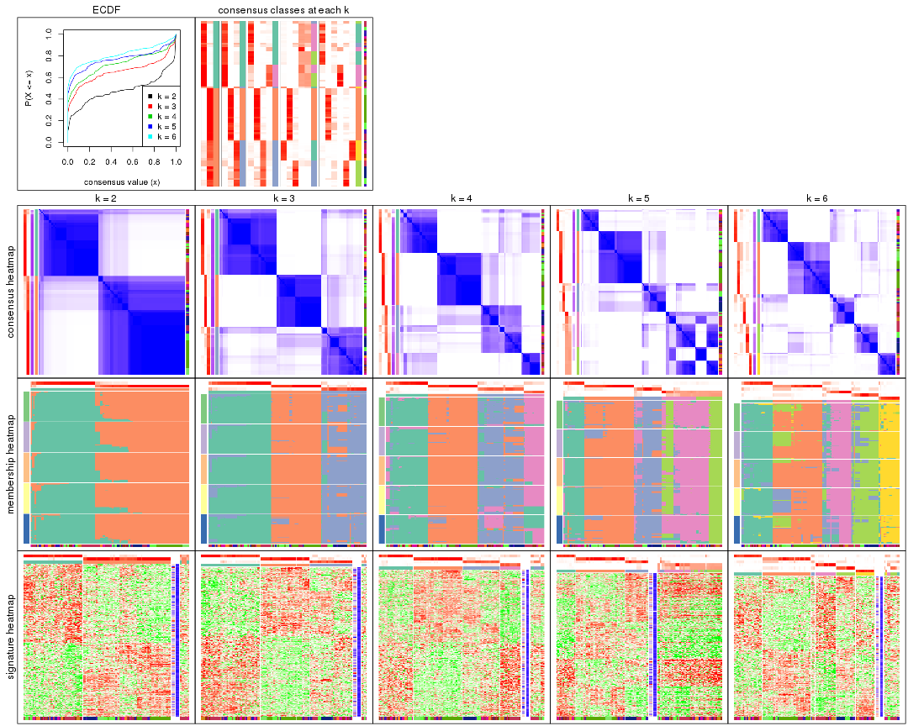

The plots are:

- The first row: a plot of the ECDF (Empirical cumulative distribution
  function) curves of the consensus matrix for each `k` and the heatmap of
  predicted classes for each `k`.
- The second row: heatmaps of the consensus matrix for each `k`.
- The third row: heatmaps of the membership matrix for each `k`.
- The fouth row: heatmaps of the signatures for each `k`.

All the plots in panels can be made by individual functions and they are
plotted later in this section.

`select_partition_number()` produces several plots showing different
statistics for choosing "optimized" `k`. There are following statistics:

- ECDF curves of the consensus matrix for each `k`;
- 1-PAC. [The PAC
  score](https://en.wikipedia.org/wiki/Consensus_clustering#Over-interpretation_potential_of_consensus_clustering)
  measures the proportion of the ambiguous subgrouping.
- Mean silhouette score.
- Concordance. The mean probability of fiting the consensus class ids in all
  partitions.
- Area increased. Denote $A_k$ as the area under the ECDF curve for current
  `k`, the area increased is defined as $A_k - A_{k-1}$.
- Rand index. The percent of pairs of samples that are both in a same cluster
  or both are not in a same cluster in the partition of k and k-1.
- Jaccard index. The ratio of pairs of samples are both in a same cluster in
  the partition of k and k-1 and the pairs of samples are both in a same
  cluster in the partition k or k-1.

The detailed explanations of these statistics can be found in [the cola
vignette](http://bioconductor.org/packages/devel/bioc/vignettes/cola/inst/doc/cola.html#toc_13).

Generally speaking, lower PAC score, higher mean silhouette score or higher
concordance corresponds to better partition. Rand index and Jaccard index
measure how similar the current partition is compared to partition with `k-1`.
If they are too similar, we won't accept `k` is better than `k-1`.

```r
select_partition_number(res)
```


The numeric values for all these statistics can be obtained by `get_stats()`.

```r
get_stats(res)
```

```
#>   k 1-PAC mean_silhouette concordance area_increased  Rand Jaccard
#> 2 2 0.674           0.887       0.943         0.4813 0.514   0.514
#> 3 3 0.747           0.856       0.912         0.3616 0.811   0.635
#> 4 4 0.717           0.796       0.858         0.1067 0.929   0.789
#> 5 5 0.734           0.536       0.781         0.0639 0.879   0.594
#> 6 6 0.787           0.695       0.821         0.0533 0.928   0.705
```

`suggest_best_k()` suggests the best $k$ based on these statistics. The rules are as follows:

- All $k$ with Jaccard index larger than 0.95 are removed because the increase of
  the partition number does not provides enough extra information. If all $k$ are removed,
  the best $k$ is assigned by `NA`.
- For $k$ with 1-PAC larger than 0.9, the maximal $k$ is taken as the "best k". Other $k$ is called "optional k".
- If it does not fit the second rule. The $k$ with the highest vote of highest
  1-PAC, mean silhouette and concordance is taken as the "best k".

```r
suggest_best_k(res)
```

```
#> [1] 2
```


Following shows the table of the partitions (You need to click the **show/hide
code output** link to see it). The membership matrix (columns with name `p*`)
is inferred by
[`clue::cl_consensus()`](https://www.rdocumentation.org/link/cl_consensus?package=clue)
function with the `SE` method. Basically the value in the membership matrix
represents the probability to belong to a certain group. The finall class
label for an item is determined with the group with highest probability it
belongs to.

In `get_classes()` function, the entropy is calculated from the membership
matrix and the silhouette score is calculated from the consensus matrix.


<script>
$( function() {
	$( '#tabs-ATC-hclust-get-classes' ).tabs();
} );
</script>
<div id='tabs-ATC-hclust-get-classes'>
<ul>
<li><a href='#tab-ATC-hclust-get-classes-1'>k = 2</a></li>
<li><a href='#tab-ATC-hclust-get-classes-2'>k = 3</a></li>
<li><a href='#tab-ATC-hclust-get-classes-3'>k = 4</a></li>
<li><a href='#tab-ATC-hclust-get-classes-4'>k = 5</a></li>
<li><a href='#tab-ATC-hclust-get-classes-5'>k = 6</a></li>
</ul>

<div id='tab-ATC-hclust-get-classes-1'>
<p><a id='tab-ATC-hclust-get-classes-1-a' style='color:#0366d6' href='#'>show/hide code output</a></p>
<pre><code class="r">cbind(get_classes(res, k = 2), get_membership(res, k = 2))
</code></pre>

<pre><code>#&gt;           class entropy silhouette    p1    p2
#&gt; GSM74356      2  0.9608      0.461 0.384 0.616
#&gt; GSM74357      2  0.9608      0.461 0.384 0.616
#&gt; GSM74358      2  0.9608      0.461 0.384 0.616
#&gt; GSM74359      1  0.0000      0.952 1.000 0.000
#&gt; GSM74360      1  0.0000      0.952 1.000 0.000
#&gt; GSM74361      1  0.9209      0.464 0.664 0.336
#&gt; GSM74362      1  0.7883      0.673 0.764 0.236
#&gt; GSM74363      2  0.9608      0.461 0.384 0.616
#&gt; GSM74402      1  0.0000      0.952 1.000 0.000
#&gt; GSM74403      1  0.0000      0.952 1.000 0.000
#&gt; GSM74404      1  0.0000      0.952 1.000 0.000
#&gt; GSM74406      1  0.0000      0.952 1.000 0.000
#&gt; GSM74407      1  0.9087      0.493 0.676 0.324
#&gt; GSM74408      1  0.0000      0.952 1.000 0.000
#&gt; GSM74409      1  0.0000      0.952 1.000 0.000
#&gt; GSM74410      1  0.0000      0.952 1.000 0.000
#&gt; GSM119936     1  0.0000      0.952 1.000 0.000
#&gt; GSM119937     1  0.0376      0.952 0.996 0.004
#&gt; GSM74411      2  0.0000      0.928 0.000 1.000
#&gt; GSM74412      2  0.0000      0.928 0.000 1.000
#&gt; GSM74413      2  0.0000      0.928 0.000 1.000
#&gt; GSM74414      2  0.0000      0.928 0.000 1.000
#&gt; GSM74415      2  0.0000      0.928 0.000 1.000
#&gt; GSM121379     2  0.0000      0.928 0.000 1.000
#&gt; GSM121380     2  0.0000      0.928 0.000 1.000
#&gt; GSM121381     2  0.0000      0.928 0.000 1.000
#&gt; GSM121382     2  0.0000      0.928 0.000 1.000
#&gt; GSM121383     2  0.0000      0.928 0.000 1.000
#&gt; GSM121384     2  0.0000      0.928 0.000 1.000
#&gt; GSM121385     2  0.0000      0.928 0.000 1.000
#&gt; GSM121386     2  0.0000      0.928 0.000 1.000
#&gt; GSM121387     2  0.0000      0.928 0.000 1.000
#&gt; GSM121388     2  0.0000      0.928 0.000 1.000
#&gt; GSM121389     2  0.0000      0.928 0.000 1.000
#&gt; GSM121390     2  0.0000      0.928 0.000 1.000
#&gt; GSM121391     2  0.0000      0.928 0.000 1.000
#&gt; GSM121392     2  0.0000      0.928 0.000 1.000
#&gt; GSM121393     2  0.4690      0.884 0.100 0.900
#&gt; GSM121394     2  0.0000      0.928 0.000 1.000
#&gt; GSM121395     2  0.0000      0.928 0.000 1.000
#&gt; GSM121396     2  0.0000      0.928 0.000 1.000
#&gt; GSM121397     2  0.0000      0.928 0.000 1.000
#&gt; GSM121398     2  0.0000      0.928 0.000 1.000
#&gt; GSM121399     2  0.0000      0.928 0.000 1.000
#&gt; GSM74240      2  0.0376      0.927 0.004 0.996
#&gt; GSM74241      2  0.0376      0.927 0.004 0.996
#&gt; GSM74242      2  0.5629      0.865 0.132 0.868
#&gt; GSM74243      2  0.5629      0.865 0.132 0.868
#&gt; GSM74244      2  0.0376      0.927 0.004 0.996
#&gt; GSM74245      2  0.0376      0.927 0.004 0.996
#&gt; GSM74246      2  0.0376      0.927 0.004 0.996
#&gt; GSM74247      2  0.0376      0.927 0.004 0.996
#&gt; GSM74248      2  0.0376      0.927 0.004 0.996
#&gt; GSM74416      1  0.0000      0.952 1.000 0.000
#&gt; GSM74417      1  0.0000      0.952 1.000 0.000
#&gt; GSM74418      1  0.0000      0.952 1.000 0.000
#&gt; GSM74419      1  0.3733      0.902 0.928 0.072
#&gt; GSM121358     2  0.1184      0.923 0.016 0.984
#&gt; GSM121359     2  0.0000      0.928 0.000 1.000
#&gt; GSM121360     1  0.0376      0.952 0.996 0.004
#&gt; GSM121362     1  0.0376      0.952 0.996 0.004
#&gt; GSM121364     1  0.0000      0.952 1.000 0.000
#&gt; GSM121365     2  0.5629      0.865 0.132 0.868
#&gt; GSM121366     2  0.0000      0.928 0.000 1.000
#&gt; GSM121367     2  0.4298      0.891 0.088 0.912
#&gt; GSM121370     2  0.0000      0.928 0.000 1.000
#&gt; GSM121371     2  0.5629      0.865 0.132 0.868
#&gt; GSM121372     2  0.0000      0.928 0.000 1.000
#&gt; GSM121373     1  0.0376      0.952 0.996 0.004
#&gt; GSM121374     1  0.0000      0.952 1.000 0.000
#&gt; GSM121407     2  0.0000      0.928 0.000 1.000
#&gt; GSM74387      2  0.0000      0.928 0.000 1.000
#&gt; GSM74388      2  0.0000      0.928 0.000 1.000
#&gt; GSM74389      2  0.5629      0.865 0.132 0.868
#&gt; GSM74390      2  0.2043      0.917 0.032 0.968
#&gt; GSM74391      1  0.4562      0.878 0.904 0.096
#&gt; GSM74392      1  0.3584      0.908 0.932 0.068
#&gt; GSM74393      1  0.3584      0.908 0.932 0.068
#&gt; GSM74394      2  0.0376      0.927 0.004 0.996
#&gt; GSM74239      1  0.1414      0.949 0.980 0.020
#&gt; GSM74364      1  0.0000      0.952 1.000 0.000
#&gt; GSM74365      1  0.1414      0.949 0.980 0.020
#&gt; GSM74366      2  0.5178      0.875 0.116 0.884
#&gt; GSM74367      1  0.1414      0.949 0.980 0.020
#&gt; GSM74377      2  0.6343      0.841 0.160 0.840
#&gt; GSM74378      2  0.5519      0.867 0.128 0.872
#&gt; GSM74379      2  0.6887      0.817 0.184 0.816
#&gt; GSM74380      2  0.6887      0.817 0.184 0.816
#&gt; GSM74381      2  0.6148      0.848 0.152 0.848
#&gt; GSM121357     2  0.0000      0.928 0.000 1.000
#&gt; GSM121361     2  0.0000      0.928 0.000 1.000
#&gt; GSM121363     2  0.0000      0.928 0.000 1.000
#&gt; GSM121368     2  0.0000      0.928 0.000 1.000
#&gt; GSM121369     2  0.0376      0.927 0.004 0.996
#&gt; GSM74368      1  0.1633      0.947 0.976 0.024
#&gt; GSM74369      1  0.1633      0.947 0.976 0.024
#&gt; GSM74370      1  0.0376      0.952 0.996 0.004
#&gt; GSM74371      1  0.0000      0.952 1.000 0.000
#&gt; GSM74372      1  0.1184      0.950 0.984 0.016
#&gt; GSM74373      2  0.7139      0.803 0.196 0.804
#&gt; GSM74374      1  0.1414      0.949 0.980 0.020
#&gt; GSM74375      1  0.9988     -0.029 0.520 0.480
#&gt; GSM74376      2  0.6801      0.821 0.180 0.820
#&gt; GSM74405      2  0.6148      0.848 0.152 0.848
#&gt; GSM74351      1  0.0000      0.952 1.000 0.000
#&gt; GSM74352      2  0.5519      0.867 0.128 0.872
#&gt; GSM74353      1  0.0376      0.952 0.996 0.004
#&gt; GSM74354      1  0.1414      0.949 0.980 0.020
#&gt; GSM74355      2  0.5519      0.867 0.128 0.872
#&gt; GSM74382      1  0.0000      0.952 1.000 0.000
#&gt; GSM74383      1  0.1414      0.949 0.980 0.020
#&gt; GSM74384      2  0.5408      0.869 0.124 0.876
#&gt; GSM74385      1  0.0000      0.952 1.000 0.000
#&gt; GSM74386      1  0.1414      0.949 0.980 0.020
#&gt; GSM74395      1  0.1414      0.949 0.980 0.020
#&gt; GSM74396      1  0.1414      0.949 0.980 0.020
#&gt; GSM74397      1  0.1414      0.949 0.980 0.020
#&gt; GSM74398      2  0.7950      0.746 0.240 0.760
#&gt; GSM74399      2  0.7950      0.746 0.240 0.760
#&gt; GSM74400      1  0.2948      0.925 0.948 0.052
#&gt; GSM74401      1  0.2948      0.925 0.948 0.052
</code></pre>

<script>
$('#tab-ATC-hclust-get-classes-1-a').parent().next().next().hide();
$('#tab-ATC-hclust-get-classes-1-a').click(function(){
  $('#tab-ATC-hclust-get-classes-1-a').parent().next().next().toggle();
  return(false);
});
</script>
</div>

<div id='tab-ATC-hclust-get-classes-2'>
<p><a id='tab-ATC-hclust-get-classes-2-a' style='color:#0366d6' href='#'>show/hide code output</a></p>
<pre><code class="r">cbind(get_classes(res, k = 3), get_membership(res, k = 3))
</code></pre>

<pre><code>#&gt;           class entropy silhouette    p1    p2    p3
#&gt; GSM74356      3  0.4974      0.614 0.236 0.000 0.764
#&gt; GSM74357      3  0.4974      0.614 0.236 0.000 0.764
#&gt; GSM74358      3  0.4974      0.614 0.236 0.000 0.764
#&gt; GSM74359      1  0.0592      0.913 0.988 0.000 0.012
#&gt; GSM74360      1  0.1860      0.917 0.948 0.000 0.052
#&gt; GSM74361      1  0.6813      0.227 0.520 0.012 0.468
#&gt; GSM74362      1  0.6045      0.501 0.620 0.000 0.380
#&gt; GSM74363      3  0.4974      0.614 0.236 0.000 0.764
#&gt; GSM74402      1  0.0237      0.909 0.996 0.000 0.004
#&gt; GSM74403      1  0.0237      0.909 0.996 0.000 0.004
#&gt; GSM74404      1  0.0237      0.909 0.996 0.000 0.004
#&gt; GSM74406      1  0.0237      0.909 0.996 0.000 0.004
#&gt; GSM74407      1  0.6295      0.258 0.528 0.000 0.472
#&gt; GSM74408      1  0.0237      0.909 0.996 0.000 0.004
#&gt; GSM74409      1  0.0237      0.909 0.996 0.000 0.004
#&gt; GSM74410      1  0.0237      0.909 0.996 0.000 0.004
#&gt; GSM119936     1  0.0237      0.909 0.996 0.000 0.004
#&gt; GSM119937     1  0.2261      0.917 0.932 0.000 0.068
#&gt; GSM74411      2  0.2261      0.943 0.000 0.932 0.068
#&gt; GSM74412      2  0.2261      0.943 0.000 0.932 0.068
#&gt; GSM74413      2  0.2261      0.943 0.000 0.932 0.068
#&gt; GSM74414      2  0.2066      0.947 0.000 0.940 0.060
#&gt; GSM74415      2  0.2356      0.940 0.000 0.928 0.072
#&gt; GSM121379     2  0.0000      0.963 0.000 1.000 0.000
#&gt; GSM121380     2  0.0000      0.963 0.000 1.000 0.000
#&gt; GSM121381     2  0.0424      0.962 0.000 0.992 0.008
#&gt; GSM121382     2  0.0237      0.963 0.000 0.996 0.004
#&gt; GSM121383     2  0.0000      0.963 0.000 1.000 0.000
#&gt; GSM121384     2  0.0000      0.963 0.000 1.000 0.000
#&gt; GSM121385     2  0.0000      0.963 0.000 1.000 0.000
#&gt; GSM121386     2  0.0000      0.963 0.000 1.000 0.000
#&gt; GSM121387     2  0.0000      0.963 0.000 1.000 0.000
#&gt; GSM121388     2  0.2356      0.940 0.000 0.928 0.072
#&gt; GSM121389     2  0.0000      0.963 0.000 1.000 0.000
#&gt; GSM121390     2  0.0000      0.963 0.000 1.000 0.000
#&gt; GSM121391     2  0.0000      0.963 0.000 1.000 0.000
#&gt; GSM121392     2  0.0000      0.963 0.000 1.000 0.000
#&gt; GSM121393     3  0.5016      0.709 0.000 0.240 0.760
#&gt; GSM121394     2  0.0237      0.963 0.000 0.996 0.004
#&gt; GSM121395     2  0.0237      0.962 0.000 0.996 0.004
#&gt; GSM121396     2  0.2261      0.943 0.000 0.932 0.068
#&gt; GSM121397     2  0.0000      0.963 0.000 1.000 0.000
#&gt; GSM121398     2  0.0000      0.963 0.000 1.000 0.000
#&gt; GSM121399     2  0.0237      0.963 0.000 0.996 0.004
#&gt; GSM74240      3  0.5216      0.708 0.000 0.260 0.740
#&gt; GSM74241      3  0.5216      0.708 0.000 0.260 0.740
#&gt; GSM74242      3  0.2682      0.836 0.004 0.076 0.920
#&gt; GSM74243      3  0.2682      0.836 0.004 0.076 0.920
#&gt; GSM74244      3  0.5216      0.708 0.000 0.260 0.740
#&gt; GSM74245      3  0.5216      0.708 0.000 0.260 0.740
#&gt; GSM74246      3  0.5216      0.708 0.000 0.260 0.740
#&gt; GSM74247      3  0.5216      0.708 0.000 0.260 0.740
#&gt; GSM74248      3  0.5216      0.708 0.000 0.260 0.740
#&gt; GSM74416      1  0.0237      0.909 0.996 0.000 0.004
#&gt; GSM74417      1  0.0237      0.909 0.996 0.000 0.004
#&gt; GSM74418      1  0.0237      0.909 0.996 0.000 0.004
#&gt; GSM74419      1  0.4654      0.797 0.792 0.000 0.208
#&gt; GSM121358     3  0.6235      0.339 0.000 0.436 0.564
#&gt; GSM121359     2  0.2261      0.943 0.000 0.932 0.068
#&gt; GSM121360     1  0.2356      0.917 0.928 0.000 0.072
#&gt; GSM121362     1  0.2356      0.917 0.928 0.000 0.072
#&gt; GSM121364     1  0.0592      0.913 0.988 0.000 0.012
#&gt; GSM121365     3  0.2945      0.834 0.004 0.088 0.908
#&gt; GSM121366     2  0.2261      0.943 0.000 0.932 0.068
#&gt; GSM121367     3  0.3551      0.811 0.000 0.132 0.868
#&gt; GSM121370     2  0.3192      0.896 0.000 0.888 0.112
#&gt; GSM121371     3  0.2945      0.834 0.004 0.088 0.908
#&gt; GSM121372     2  0.2261      0.943 0.000 0.932 0.068
#&gt; GSM121373     1  0.2165      0.917 0.936 0.000 0.064
#&gt; GSM121374     1  0.0592      0.913 0.988 0.000 0.012
#&gt; GSM121407     2  0.2066      0.947 0.000 0.940 0.060
#&gt; GSM74387      2  0.2066      0.947 0.000 0.940 0.060
#&gt; GSM74388      2  0.0000      0.963 0.000 1.000 0.000
#&gt; GSM74389      3  0.2682      0.836 0.004 0.076 0.920
#&gt; GSM74390      3  0.4452      0.769 0.000 0.192 0.808
#&gt; GSM74391      1  0.5058      0.757 0.756 0.000 0.244
#&gt; GSM74392      1  0.4504      0.818 0.804 0.000 0.196
#&gt; GSM74393      1  0.4504      0.818 0.804 0.000 0.196
#&gt; GSM74394      2  0.2711      0.896 0.000 0.912 0.088
#&gt; GSM74239      1  0.2796      0.914 0.908 0.000 0.092
#&gt; GSM74364      1  0.0592      0.911 0.988 0.000 0.012
#&gt; GSM74365      1  0.2796      0.914 0.908 0.000 0.092
#&gt; GSM74366      3  0.2796      0.829 0.000 0.092 0.908
#&gt; GSM74367      1  0.2796      0.914 0.908 0.000 0.092
#&gt; GSM74377      3  0.1491      0.834 0.016 0.016 0.968
#&gt; GSM74378      3  0.1529      0.837 0.000 0.040 0.960
#&gt; GSM74379      3  0.1647      0.824 0.036 0.004 0.960
#&gt; GSM74380      3  0.1647      0.824 0.036 0.004 0.960
#&gt; GSM74381      3  0.1315      0.836 0.008 0.020 0.972
#&gt; GSM121357     2  0.2165      0.945 0.000 0.936 0.064
#&gt; GSM121361     2  0.0000      0.963 0.000 1.000 0.000
#&gt; GSM121363     2  0.0000      0.963 0.000 1.000 0.000
#&gt; GSM121368     2  0.0000      0.963 0.000 1.000 0.000
#&gt; GSM121369     2  0.2711      0.896 0.000 0.912 0.088
#&gt; GSM74368      1  0.2959      0.910 0.900 0.000 0.100
#&gt; GSM74369      1  0.2959      0.910 0.900 0.000 0.100
#&gt; GSM74370      1  0.2356      0.917 0.928 0.000 0.072
#&gt; GSM74371      1  0.0237      0.909 0.996 0.000 0.004
#&gt; GSM74372      1  0.2711      0.915 0.912 0.000 0.088
#&gt; GSM74373      3  0.1989      0.819 0.048 0.004 0.948
#&gt; GSM74374      1  0.2796      0.914 0.908 0.000 0.092
#&gt; GSM74375      3  0.6095      0.187 0.392 0.000 0.608
#&gt; GSM74376      3  0.1525      0.825 0.032 0.004 0.964
#&gt; GSM74405      3  0.1315      0.836 0.008 0.020 0.972
#&gt; GSM74351      1  0.0237      0.909 0.996 0.000 0.004
#&gt; GSM74352      3  0.1529      0.837 0.000 0.040 0.960
#&gt; GSM74353      1  0.2261      0.917 0.932 0.000 0.068
#&gt; GSM74354      1  0.2796      0.914 0.908 0.000 0.092
#&gt; GSM74355      3  0.1529      0.837 0.000 0.040 0.960
#&gt; GSM74382      1  0.0237      0.909 0.996 0.000 0.004
#&gt; GSM74383      1  0.2796      0.914 0.908 0.000 0.092
#&gt; GSM74384      3  0.2356      0.834 0.000 0.072 0.928
#&gt; GSM74385      1  0.0237      0.909 0.996 0.000 0.004
#&gt; GSM74386      1  0.2878      0.912 0.904 0.000 0.096
#&gt; GSM74395      1  0.2796      0.914 0.908 0.000 0.092
#&gt; GSM74396      1  0.2796      0.914 0.908 0.000 0.092
#&gt; GSM74397      1  0.2796      0.914 0.908 0.000 0.092
#&gt; GSM74398      3  0.3030      0.794 0.092 0.004 0.904
#&gt; GSM74399      3  0.3030      0.794 0.092 0.004 0.904
#&gt; GSM74400      1  0.3482      0.890 0.872 0.000 0.128
#&gt; GSM74401      1  0.3482      0.890 0.872 0.000 0.128
</code></pre>

<script>
$('#tab-ATC-hclust-get-classes-2-a').parent().next().next().hide();
$('#tab-ATC-hclust-get-classes-2-a').click(function(){
  $('#tab-ATC-hclust-get-classes-2-a').parent().next().next().toggle();
  return(false);
});
</script>
</div>

<div id='tab-ATC-hclust-get-classes-3'>
<p><a id='tab-ATC-hclust-get-classes-3-a' style='color:#0366d6' href='#'>show/hide code output</a></p>
<pre><code class="r">cbind(get_classes(res, k = 4), get_membership(res, k = 4))
</code></pre>

<pre><code>#&gt;           class entropy silhouette    p1    p2    p3    p4
#&gt; GSM74356      3  0.5697     0.4975 0.280 0.000 0.664 0.056
#&gt; GSM74357      3  0.5697     0.4975 0.280 0.000 0.664 0.056
#&gt; GSM74358      3  0.5697     0.4975 0.280 0.000 0.664 0.056
#&gt; GSM74359      1  0.4817     0.0401 0.612 0.000 0.000 0.388
#&gt; GSM74360      1  0.1867     0.8018 0.928 0.000 0.000 0.072
#&gt; GSM74361      1  0.6723     0.3063 0.548 0.008 0.368 0.076
#&gt; GSM74362      1  0.5927     0.5510 0.660 0.000 0.264 0.076
#&gt; GSM74363      3  0.5697     0.4975 0.280 0.000 0.664 0.056
#&gt; GSM74402      4  0.4406     0.8616 0.300 0.000 0.000 0.700
#&gt; GSM74403      4  0.3311     0.9132 0.172 0.000 0.000 0.828
#&gt; GSM74404      4  0.3311     0.9132 0.172 0.000 0.000 0.828
#&gt; GSM74406      4  0.4431     0.8562 0.304 0.000 0.000 0.696
#&gt; GSM74407      1  0.6214     0.3487 0.576 0.000 0.360 0.064
#&gt; GSM74408      4  0.4356     0.8694 0.292 0.000 0.000 0.708
#&gt; GSM74409      4  0.4356     0.8694 0.292 0.000 0.000 0.708
#&gt; GSM74410      4  0.4356     0.8694 0.292 0.000 0.000 0.708
#&gt; GSM119936     4  0.4356     0.8694 0.292 0.000 0.000 0.708
#&gt; GSM119937     1  0.0921     0.8404 0.972 0.000 0.000 0.028
#&gt; GSM74411      2  0.1867     0.9426 0.000 0.928 0.072 0.000
#&gt; GSM74412      2  0.1867     0.9426 0.000 0.928 0.072 0.000
#&gt; GSM74413      2  0.1867     0.9426 0.000 0.928 0.072 0.000
#&gt; GSM74414      2  0.1716     0.9464 0.000 0.936 0.064 0.000
#&gt; GSM74415      2  0.1940     0.9399 0.000 0.924 0.076 0.000
#&gt; GSM121379     2  0.0000     0.9628 0.000 1.000 0.000 0.000
#&gt; GSM121380     2  0.0000     0.9628 0.000 1.000 0.000 0.000
#&gt; GSM121381     2  0.0469     0.9608 0.000 0.988 0.012 0.000
#&gt; GSM121382     2  0.0188     0.9625 0.000 0.996 0.004 0.000
#&gt; GSM121383     2  0.0000     0.9628 0.000 1.000 0.000 0.000
#&gt; GSM121384     2  0.0000     0.9628 0.000 1.000 0.000 0.000
#&gt; GSM121385     2  0.0000     0.9628 0.000 1.000 0.000 0.000
#&gt; GSM121386     2  0.0000     0.9628 0.000 1.000 0.000 0.000
#&gt; GSM121387     2  0.0000     0.9628 0.000 1.000 0.000 0.000
#&gt; GSM121388     2  0.1867     0.9425 0.000 0.928 0.072 0.000
#&gt; GSM121389     2  0.0000     0.9628 0.000 1.000 0.000 0.000
#&gt; GSM121390     2  0.0000     0.9628 0.000 1.000 0.000 0.000
#&gt; GSM121391     2  0.0000     0.9628 0.000 1.000 0.000 0.000
#&gt; GSM121392     2  0.0000     0.9628 0.000 1.000 0.000 0.000
#&gt; GSM121393     3  0.5882     0.6747 0.008 0.224 0.696 0.072
#&gt; GSM121394     2  0.0188     0.9625 0.000 0.996 0.004 0.000
#&gt; GSM121395     2  0.0188     0.9614 0.000 0.996 0.004 0.000
#&gt; GSM121396     2  0.1867     0.9426 0.000 0.928 0.072 0.000
#&gt; GSM121397     2  0.0000     0.9628 0.000 1.000 0.000 0.000
#&gt; GSM121398     2  0.0000     0.9628 0.000 1.000 0.000 0.000
#&gt; GSM121399     2  0.0188     0.9625 0.000 0.996 0.004 0.000
#&gt; GSM74240      3  0.4040     0.6708 0.000 0.248 0.752 0.000
#&gt; GSM74241      3  0.4040     0.6708 0.000 0.248 0.752 0.000
#&gt; GSM74242      3  0.3978     0.7478 0.028 0.064 0.860 0.048
#&gt; GSM74243      3  0.3978     0.7478 0.028 0.064 0.860 0.048
#&gt; GSM74244      3  0.4040     0.6708 0.000 0.248 0.752 0.000
#&gt; GSM74245      3  0.4040     0.6708 0.000 0.248 0.752 0.000
#&gt; GSM74246      3  0.4040     0.6708 0.000 0.248 0.752 0.000
#&gt; GSM74247      3  0.4040     0.6708 0.000 0.248 0.752 0.000
#&gt; GSM74248      3  0.4040     0.6708 0.000 0.248 0.752 0.000
#&gt; GSM74416      4  0.3311     0.9132 0.172 0.000 0.000 0.828
#&gt; GSM74417      4  0.3311     0.9132 0.172 0.000 0.000 0.828
#&gt; GSM74418      4  0.3311     0.9132 0.172 0.000 0.000 0.828
#&gt; GSM74419      1  0.4956     0.7253 0.776 0.000 0.108 0.116
#&gt; GSM121358     3  0.4925     0.3036 0.000 0.428 0.572 0.000
#&gt; GSM121359     2  0.1867     0.9426 0.000 0.928 0.072 0.000
#&gt; GSM121360     1  0.0707     0.8452 0.980 0.000 0.000 0.020
#&gt; GSM121362     1  0.0707     0.8452 0.980 0.000 0.000 0.020
#&gt; GSM121364     1  0.4817     0.0401 0.612 0.000 0.000 0.388
#&gt; GSM121365     3  0.4195     0.7477 0.028 0.076 0.848 0.048
#&gt; GSM121366     2  0.1867     0.9426 0.000 0.928 0.072 0.000
#&gt; GSM121367     3  0.3914     0.7461 0.004 0.120 0.840 0.036
#&gt; GSM121370     2  0.2647     0.8945 0.000 0.880 0.120 0.000
#&gt; GSM121371     3  0.4195     0.7477 0.028 0.076 0.848 0.048
#&gt; GSM121372     2  0.1867     0.9426 0.000 0.928 0.072 0.000
#&gt; GSM121373     1  0.1302     0.8287 0.956 0.000 0.000 0.044
#&gt; GSM121374     1  0.4817     0.0401 0.612 0.000 0.000 0.388
#&gt; GSM121407     2  0.1716     0.9465 0.000 0.936 0.064 0.000
#&gt; GSM74387      2  0.1716     0.9465 0.000 0.936 0.064 0.000
#&gt; GSM74388      2  0.0000     0.9628 0.000 1.000 0.000 0.000
#&gt; GSM74389      3  0.3978     0.7478 0.028 0.064 0.860 0.048
#&gt; GSM74390      3  0.3852     0.7238 0.000 0.180 0.808 0.012
#&gt; GSM74391      1  0.4740     0.7192 0.788 0.000 0.132 0.080
#&gt; GSM74392      1  0.3970     0.7602 0.840 0.000 0.084 0.076
#&gt; GSM74393      1  0.3970     0.7602 0.840 0.000 0.084 0.076
#&gt; GSM74394      2  0.2401     0.8864 0.000 0.904 0.092 0.004
#&gt; GSM74239      1  0.0000     0.8517 1.000 0.000 0.000 0.000
#&gt; GSM74364      4  0.4679     0.7136 0.352 0.000 0.000 0.648
#&gt; GSM74365      1  0.0000     0.8517 1.000 0.000 0.000 0.000
#&gt; GSM74366      3  0.5290     0.7417 0.028 0.080 0.784 0.108
#&gt; GSM74367      1  0.0000     0.8517 1.000 0.000 0.000 0.000
#&gt; GSM74377      3  0.4949     0.7373 0.072 0.012 0.792 0.124
#&gt; GSM74378      3  0.4562     0.7440 0.036 0.028 0.820 0.116
#&gt; GSM74379      3  0.4780     0.7299 0.096 0.000 0.788 0.116
#&gt; GSM74380      3  0.4780     0.7299 0.096 0.000 0.788 0.116
#&gt; GSM74381      3  0.4795     0.7404 0.060 0.016 0.804 0.120
#&gt; GSM121357     2  0.1792     0.9452 0.000 0.932 0.068 0.000
#&gt; GSM121361     2  0.0000     0.9628 0.000 1.000 0.000 0.000
#&gt; GSM121363     2  0.0000     0.9628 0.000 1.000 0.000 0.000
#&gt; GSM121368     2  0.0000     0.9628 0.000 1.000 0.000 0.000
#&gt; GSM121369     2  0.2401     0.8864 0.000 0.904 0.092 0.004
#&gt; GSM74368      1  0.0657     0.8499 0.984 0.000 0.004 0.012
#&gt; GSM74369      1  0.0657     0.8499 0.984 0.000 0.004 0.012
#&gt; GSM74370      1  0.0707     0.8452 0.980 0.000 0.000 0.020
#&gt; GSM74371      4  0.3311     0.9132 0.172 0.000 0.000 0.828
#&gt; GSM74372      1  0.0469     0.8512 0.988 0.000 0.000 0.012
#&gt; GSM74373      3  0.5119     0.7203 0.112 0.000 0.764 0.124
#&gt; GSM74374      1  0.0188     0.8510 0.996 0.000 0.000 0.004
#&gt; GSM74375      3  0.6277     0.0866 0.468 0.000 0.476 0.056
#&gt; GSM74376      3  0.4888     0.7284 0.096 0.000 0.780 0.124
#&gt; GSM74405      3  0.4795     0.7404 0.060 0.016 0.804 0.120
#&gt; GSM74351      4  0.3311     0.9132 0.172 0.000 0.000 0.828
#&gt; GSM74352      3  0.4562     0.7440 0.036 0.028 0.820 0.116
#&gt; GSM74353      1  0.0921     0.8404 0.972 0.000 0.000 0.028
#&gt; GSM74354      1  0.0188     0.8510 0.996 0.000 0.000 0.004
#&gt; GSM74355      3  0.4562     0.7440 0.036 0.028 0.820 0.116
#&gt; GSM74382      4  0.3444     0.9105 0.184 0.000 0.000 0.816
#&gt; GSM74383      1  0.0000     0.8517 1.000 0.000 0.000 0.000
#&gt; GSM74384      3  0.5147     0.7425 0.032 0.060 0.792 0.116
#&gt; GSM74385      4  0.3311     0.9132 0.172 0.000 0.000 0.828
#&gt; GSM74386      1  0.0524     0.8511 0.988 0.000 0.004 0.008
#&gt; GSM74395      1  0.0000     0.8517 1.000 0.000 0.000 0.000
#&gt; GSM74396      1  0.0000     0.8517 1.000 0.000 0.000 0.000
#&gt; GSM74397      1  0.0000     0.8517 1.000 0.000 0.000 0.000
#&gt; GSM74398      3  0.5568     0.6959 0.152 0.000 0.728 0.120
#&gt; GSM74399      3  0.5568     0.6959 0.152 0.000 0.728 0.120
#&gt; GSM74400      1  0.1297     0.8319 0.964 0.000 0.016 0.020
#&gt; GSM74401      1  0.1297     0.8319 0.964 0.000 0.016 0.020
</code></pre>

<script>
$('#tab-ATC-hclust-get-classes-3-a').parent().next().next().hide();
$('#tab-ATC-hclust-get-classes-3-a').click(function(){
  $('#tab-ATC-hclust-get-classes-3-a').parent().next().next().toggle();
  return(false);
});
</script>
</div>

<div id='tab-ATC-hclust-get-classes-4'>
<p><a id='tab-ATC-hclust-get-classes-4-a' style='color:#0366d6' href='#'>show/hide code output</a></p>
<pre><code class="r">cbind(get_classes(res, k = 5), get_membership(res, k = 5))
</code></pre>

<pre><code>#&gt;           class entropy silhouette    p1    p2    p3    p4    p5
#&gt; GSM74356      3  0.5180      0.564 0.024 0.000 0.728 0.100 0.148
#&gt; GSM74357      3  0.5180      0.564 0.024 0.000 0.728 0.100 0.148
#&gt; GSM74358      3  0.5180      0.564 0.024 0.000 0.728 0.100 0.148
#&gt; GSM74359      4  0.0510      0.186 0.016 0.000 0.000 0.984 0.000
#&gt; GSM74360      4  0.4982      0.363 0.032 0.000 0.000 0.556 0.412
#&gt; GSM74361      3  0.7162     -0.119 0.024 0.000 0.440 0.300 0.236
#&gt; GSM74362      4  0.7314      0.276 0.028 0.000 0.332 0.396 0.244
#&gt; GSM74363      3  0.5180      0.564 0.024 0.000 0.728 0.100 0.148
#&gt; GSM74402      4  0.3913     -0.113 0.000 0.000 0.000 0.676 0.324
#&gt; GSM74403      5  0.4653      0.276 0.012 0.000 0.000 0.472 0.516
#&gt; GSM74404      5  0.4653      0.276 0.012 0.000 0.000 0.472 0.516
#&gt; GSM74406      4  0.3895     -0.109 0.000 0.000 0.000 0.680 0.320
#&gt; GSM74407      3  0.7356     -0.124 0.036 0.000 0.428 0.304 0.232
#&gt; GSM74408      4  0.3913     -0.116 0.000 0.000 0.000 0.676 0.324
#&gt; GSM74409      4  0.3913     -0.116 0.000 0.000 0.000 0.676 0.324
#&gt; GSM74410      4  0.3913     -0.116 0.000 0.000 0.000 0.676 0.324
#&gt; GSM119936     4  0.3913     -0.116 0.000 0.000 0.000 0.676 0.324
#&gt; GSM119937     4  0.4744      0.356 0.016 0.000 0.000 0.508 0.476
#&gt; GSM74411      2  0.2561      0.886 0.000 0.856 0.144 0.000 0.000
#&gt; GSM74412      2  0.2561      0.886 0.000 0.856 0.144 0.000 0.000
#&gt; GSM74413      2  0.2561      0.886 0.000 0.856 0.144 0.000 0.000
#&gt; GSM74414      2  0.2471      0.891 0.000 0.864 0.136 0.000 0.000
#&gt; GSM74415      2  0.2605      0.884 0.000 0.852 0.148 0.000 0.000
#&gt; GSM121379     2  0.0000      0.928 0.000 1.000 0.000 0.000 0.000
#&gt; GSM121380     2  0.0000      0.928 0.000 1.000 0.000 0.000 0.000
#&gt; GSM121381     2  0.1341      0.920 0.000 0.944 0.056 0.000 0.000
#&gt; GSM121382     2  0.0609      0.928 0.000 0.980 0.020 0.000 0.000
#&gt; GSM121383     2  0.0162      0.928 0.000 0.996 0.004 0.000 0.000
#&gt; GSM121384     2  0.0000      0.928 0.000 1.000 0.000 0.000 0.000
#&gt; GSM121385     2  0.0000      0.928 0.000 1.000 0.000 0.000 0.000
#&gt; GSM121386     2  0.0000      0.928 0.000 1.000 0.000 0.000 0.000
#&gt; GSM121387     2  0.0000      0.928 0.000 1.000 0.000 0.000 0.000
#&gt; GSM121388     2  0.2424      0.893 0.000 0.868 0.132 0.000 0.000
#&gt; GSM121389     2  0.0000      0.928 0.000 1.000 0.000 0.000 0.000
#&gt; GSM121390     2  0.0000      0.928 0.000 1.000 0.000 0.000 0.000
#&gt; GSM121391     2  0.0510      0.928 0.000 0.984 0.016 0.000 0.000
#&gt; GSM121392     2  0.0000      0.928 0.000 1.000 0.000 0.000 0.000
#&gt; GSM121393     1  0.5240      0.610 0.676 0.204 0.120 0.000 0.000
#&gt; GSM121394     2  0.0794      0.926 0.000 0.972 0.028 0.000 0.000
#&gt; GSM121395     2  0.0404      0.928 0.000 0.988 0.012 0.000 0.000
#&gt; GSM121396     2  0.2561      0.886 0.000 0.856 0.144 0.000 0.000
#&gt; GSM121397     2  0.0000      0.928 0.000 1.000 0.000 0.000 0.000
#&gt; GSM121398     2  0.0000      0.928 0.000 1.000 0.000 0.000 0.000
#&gt; GSM121399     2  0.0609      0.928 0.000 0.980 0.020 0.000 0.000
#&gt; GSM74240      3  0.2852      0.728 0.000 0.172 0.828 0.000 0.000
#&gt; GSM74241      3  0.2852      0.728 0.000 0.172 0.828 0.000 0.000
#&gt; GSM74242      3  0.0404      0.723 0.012 0.000 0.988 0.000 0.000
#&gt; GSM74243      3  0.0404      0.723 0.012 0.000 0.988 0.000 0.000
#&gt; GSM74244      3  0.2852      0.728 0.000 0.172 0.828 0.000 0.000
#&gt; GSM74245      3  0.2852      0.728 0.000 0.172 0.828 0.000 0.000
#&gt; GSM74246      3  0.2852      0.728 0.000 0.172 0.828 0.000 0.000
#&gt; GSM74247      3  0.2852      0.728 0.000 0.172 0.828 0.000 0.000
#&gt; GSM74248      3  0.2852      0.728 0.000 0.172 0.828 0.000 0.000
#&gt; GSM74416      5  0.4653      0.276 0.012 0.000 0.000 0.472 0.516
#&gt; GSM74417      5  0.4653      0.276 0.012 0.000 0.000 0.472 0.516
#&gt; GSM74418      5  0.4653      0.276 0.012 0.000 0.000 0.472 0.516
#&gt; GSM74419      4  0.6783      0.358 0.024 0.000 0.176 0.520 0.280
#&gt; GSM121358     3  0.4030      0.405 0.000 0.352 0.648 0.000 0.000
#&gt; GSM121359     2  0.2605      0.883 0.000 0.852 0.148 0.000 0.000
#&gt; GSM121360     4  0.5112      0.359 0.036 0.000 0.000 0.496 0.468
#&gt; GSM121362     4  0.5112      0.359 0.036 0.000 0.000 0.496 0.468
#&gt; GSM121364     4  0.0510      0.186 0.016 0.000 0.000 0.984 0.000
#&gt; GSM121365     3  0.0324      0.727 0.004 0.004 0.992 0.000 0.000
#&gt; GSM121366     2  0.2605      0.883 0.000 0.852 0.148 0.000 0.000
#&gt; GSM121367     3  0.1357      0.736 0.004 0.048 0.948 0.000 0.000
#&gt; GSM121370     2  0.3074      0.831 0.000 0.804 0.196 0.000 0.000
#&gt; GSM121371     3  0.0324      0.727 0.004 0.004 0.992 0.000 0.000
#&gt; GSM121372     2  0.2605      0.883 0.000 0.852 0.148 0.000 0.000
#&gt; GSM121373     4  0.5092      0.362 0.036 0.000 0.000 0.524 0.440
#&gt; GSM121374     4  0.0510      0.186 0.016 0.000 0.000 0.984 0.000
#&gt; GSM121407     2  0.2471      0.891 0.000 0.864 0.136 0.000 0.000
#&gt; GSM74387      2  0.2471      0.891 0.000 0.864 0.136 0.000 0.000
#&gt; GSM74388      2  0.0000      0.928 0.000 1.000 0.000 0.000 0.000
#&gt; GSM74389      3  0.0404      0.723 0.012 0.000 0.988 0.000 0.000
#&gt; GSM74390      3  0.2286      0.735 0.004 0.108 0.888 0.000 0.000
#&gt; GSM74391      4  0.7122      0.352 0.032 0.000 0.204 0.476 0.288
#&gt; GSM74392      4  0.6644      0.367 0.016 0.000 0.160 0.504 0.320
#&gt; GSM74393      4  0.6644      0.367 0.016 0.000 0.160 0.504 0.320
#&gt; GSM74394      2  0.2645      0.869 0.044 0.888 0.068 0.000 0.000
#&gt; GSM74239      4  0.5238      0.333 0.044 0.000 0.000 0.480 0.476
#&gt; GSM74364      5  0.4659      0.109 0.012 0.000 0.000 0.492 0.496
#&gt; GSM74365      4  0.5297      0.331 0.048 0.000 0.000 0.476 0.476
#&gt; GSM74366      1  0.2927      0.852 0.872 0.068 0.060 0.000 0.000
#&gt; GSM74367      5  0.5297     -0.389 0.048 0.000 0.000 0.476 0.476
#&gt; GSM74377      1  0.1404      0.898 0.956 0.008 0.028 0.004 0.004
#&gt; GSM74378      1  0.1943      0.890 0.924 0.020 0.056 0.000 0.000
#&gt; GSM74379      1  0.1588      0.894 0.948 0.000 0.028 0.008 0.016
#&gt; GSM74380      1  0.1588      0.894 0.948 0.000 0.028 0.008 0.016
#&gt; GSM74381      1  0.1525      0.898 0.948 0.012 0.036 0.000 0.004
#&gt; GSM121357     2  0.2629      0.891 0.004 0.860 0.136 0.000 0.000
#&gt; GSM121361     2  0.0000      0.928 0.000 1.000 0.000 0.000 0.000
#&gt; GSM121363     2  0.0000      0.928 0.000 1.000 0.000 0.000 0.000
#&gt; GSM121368     2  0.0000      0.928 0.000 1.000 0.000 0.000 0.000
#&gt; GSM121369     2  0.2645      0.869 0.044 0.888 0.068 0.000 0.000
#&gt; GSM74368      5  0.5406     -0.388 0.056 0.000 0.000 0.468 0.476
#&gt; GSM74369      5  0.5406     -0.388 0.056 0.000 0.000 0.468 0.476
#&gt; GSM74370      4  0.4906      0.355 0.024 0.000 0.000 0.496 0.480
#&gt; GSM74371      5  0.4653      0.276 0.012 0.000 0.000 0.472 0.516
#&gt; GSM74372      5  0.5178     -0.398 0.040 0.000 0.000 0.480 0.480
#&gt; GSM74373      1  0.1043      0.885 0.960 0.000 0.000 0.000 0.040
#&gt; GSM74374      4  0.5296      0.337 0.048 0.000 0.000 0.480 0.472
#&gt; GSM74375      1  0.6302      0.301 0.584 0.000 0.016 0.156 0.244
#&gt; GSM74376      1  0.1211      0.893 0.960 0.000 0.016 0.000 0.024
#&gt; GSM74405      1  0.1525      0.898 0.948 0.012 0.036 0.000 0.004
#&gt; GSM74351      5  0.4653      0.276 0.012 0.000 0.000 0.472 0.516
#&gt; GSM74352      1  0.1943      0.890 0.924 0.020 0.056 0.000 0.000
#&gt; GSM74353      4  0.4744      0.356 0.016 0.000 0.000 0.508 0.476
#&gt; GSM74354      4  0.5296      0.337 0.048 0.000 0.000 0.480 0.472
#&gt; GSM74355      1  0.1943      0.890 0.924 0.020 0.056 0.000 0.000
#&gt; GSM74382      5  0.4659      0.265 0.012 0.000 0.000 0.488 0.500
#&gt; GSM74383      5  0.5297     -0.391 0.048 0.000 0.000 0.476 0.476
#&gt; GSM74384      1  0.2588      0.871 0.892 0.048 0.060 0.000 0.000
#&gt; GSM74385      5  0.4653      0.276 0.012 0.000 0.000 0.472 0.516
#&gt; GSM74386      5  0.5353     -0.389 0.052 0.000 0.000 0.472 0.476
#&gt; GSM74395      5  0.5297     -0.389 0.048 0.000 0.000 0.476 0.476
#&gt; GSM74396      5  0.5297     -0.389 0.048 0.000 0.000 0.476 0.476
#&gt; GSM74397      4  0.5297      0.331 0.048 0.000 0.000 0.476 0.476
#&gt; GSM74398      1  0.2634      0.857 0.900 0.000 0.020 0.056 0.024
#&gt; GSM74399      1  0.2634      0.857 0.900 0.000 0.020 0.056 0.024
#&gt; GSM74400      5  0.5818     -0.375 0.092 0.000 0.000 0.444 0.464
#&gt; GSM74401      5  0.5818     -0.375 0.092 0.000 0.000 0.444 0.464
</code></pre>

<script>
$('#tab-ATC-hclust-get-classes-4-a').parent().next().next().hide();
$('#tab-ATC-hclust-get-classes-4-a').click(function(){
  $('#tab-ATC-hclust-get-classes-4-a').parent().next().next().toggle();
  return(false);
});
</script>
</div>

<div id='tab-ATC-hclust-get-classes-5'>
<p><a id='tab-ATC-hclust-get-classes-5-a' style='color:#0366d6' href='#'>show/hide code output</a></p>
<pre><code class="r">cbind(get_classes(res, k = 6), get_membership(res, k = 6))
</code></pre>

<pre><code>#&gt;           class entropy silhouette    p1    p2    p3    p4    p5    p6
#&gt; GSM74356      5  0.4132      0.429 0.044 0.000 0.220 0.000 0.728 0.008
#&gt; GSM74357      5  0.4132      0.429 0.044 0.000 0.220 0.000 0.728 0.008
#&gt; GSM74358      5  0.4132      0.429 0.044 0.000 0.220 0.000 0.728 0.008
#&gt; GSM74359      4  0.5953      0.296 0.344 0.000 0.196 0.456 0.000 0.004
#&gt; GSM74360      1  0.3455      0.709 0.800 0.000 0.144 0.056 0.000 0.000
#&gt; GSM74361      5  0.6250     -0.620 0.236 0.000 0.316 0.000 0.436 0.012
#&gt; GSM74362      3  0.6405      0.732 0.300 0.000 0.360 0.000 0.328 0.012
#&gt; GSM74363      5  0.4132      0.429 0.044 0.000 0.220 0.000 0.728 0.008
#&gt; GSM74402      4  0.3777      0.763 0.084 0.000 0.124 0.788 0.000 0.004
#&gt; GSM74403      4  0.0000      0.807 0.000 0.000 0.000 1.000 0.000 0.000
#&gt; GSM74404      4  0.0000      0.807 0.000 0.000 0.000 1.000 0.000 0.000
#&gt; GSM74406      4  0.3826      0.760 0.088 0.000 0.124 0.784 0.000 0.004
#&gt; GSM74407      5  0.6262     -0.493 0.204 0.000 0.356 0.000 0.424 0.016
#&gt; GSM74408      4  0.3675      0.766 0.076 0.000 0.124 0.796 0.000 0.004
#&gt; GSM74409      4  0.3675      0.766 0.076 0.000 0.124 0.796 0.000 0.004
#&gt; GSM74410      4  0.3675      0.766 0.076 0.000 0.124 0.796 0.000 0.004
#&gt; GSM119936     4  0.3675      0.766 0.076 0.000 0.124 0.796 0.000 0.004
#&gt; GSM119937     1  0.1049      0.809 0.960 0.000 0.032 0.008 0.000 0.000
#&gt; GSM74411      2  0.5510      0.654 0.000 0.540 0.324 0.000 0.132 0.004
#&gt; GSM74412      2  0.5510      0.654 0.000 0.540 0.324 0.000 0.132 0.004
#&gt; GSM74413      2  0.5510      0.654 0.000 0.540 0.324 0.000 0.132 0.004
#&gt; GSM74414      2  0.5434      0.667 0.000 0.552 0.320 0.000 0.124 0.004
#&gt; GSM74415      2  0.5541      0.651 0.000 0.536 0.324 0.000 0.136 0.004
#&gt; GSM121379     2  0.0146      0.787 0.000 0.996 0.004 0.000 0.000 0.000
#&gt; GSM121380     2  0.0692      0.780 0.000 0.976 0.020 0.000 0.000 0.004
#&gt; GSM121381     2  0.3065      0.783 0.000 0.844 0.100 0.000 0.052 0.004
#&gt; GSM121382     2  0.2445      0.790 0.000 0.872 0.108 0.000 0.020 0.000
#&gt; GSM121383     2  0.1411      0.795 0.000 0.936 0.060 0.000 0.004 0.000
#&gt; GSM121384     2  0.0692      0.780 0.000 0.976 0.020 0.000 0.000 0.004
#&gt; GSM121385     2  0.0146      0.787 0.000 0.996 0.004 0.000 0.000 0.000
#&gt; GSM121386     2  0.0937      0.794 0.000 0.960 0.040 0.000 0.000 0.000
#&gt; GSM121387     2  0.1007      0.794 0.000 0.956 0.044 0.000 0.000 0.000
#&gt; GSM121388     2  0.5374      0.669 0.000 0.564 0.312 0.000 0.120 0.004
#&gt; GSM121389     2  0.1643      0.752 0.000 0.924 0.068 0.000 0.000 0.008
#&gt; GSM121390     2  0.0692      0.780 0.000 0.976 0.020 0.000 0.000 0.004
#&gt; GSM121391     2  0.1951      0.794 0.000 0.908 0.076 0.000 0.016 0.000
#&gt; GSM121392     2  0.1643      0.752 0.000 0.924 0.068 0.000 0.000 0.008
#&gt; GSM121393     6  0.5277      0.659 0.000 0.116 0.084 0.000 0.104 0.696
#&gt; GSM121394     2  0.2605      0.789 0.000 0.864 0.108 0.000 0.028 0.000
#&gt; GSM121395     2  0.2326      0.758 0.000 0.888 0.092 0.000 0.012 0.008
#&gt; GSM121396     2  0.5486      0.659 0.000 0.548 0.316 0.000 0.132 0.004
#&gt; GSM121397     2  0.0146      0.787 0.000 0.996 0.004 0.000 0.000 0.000
#&gt; GSM121398     2  0.0790      0.792 0.000 0.968 0.032 0.000 0.000 0.000
#&gt; GSM121399     2  0.2445      0.790 0.000 0.872 0.108 0.000 0.020 0.000
#&gt; GSM74240      5  0.2738      0.720 0.000 0.000 0.176 0.000 0.820 0.004
#&gt; GSM74241      5  0.2738      0.720 0.000 0.000 0.176 0.000 0.820 0.004
#&gt; GSM74242      5  0.0291      0.705 0.000 0.000 0.004 0.000 0.992 0.004
#&gt; GSM74243      5  0.0291      0.705 0.000 0.000 0.004 0.000 0.992 0.004
#&gt; GSM74244      5  0.2738      0.720 0.000 0.000 0.176 0.000 0.820 0.004
#&gt; GSM74245      5  0.2738      0.720 0.000 0.000 0.176 0.000 0.820 0.004
#&gt; GSM74246      5  0.2738      0.720 0.000 0.000 0.176 0.000 0.820 0.004
#&gt; GSM74247      5  0.2738      0.720 0.000 0.000 0.176 0.000 0.820 0.004
#&gt; GSM74248      5  0.2738      0.720 0.000 0.000 0.176 0.000 0.820 0.004
#&gt; GSM74416      4  0.0000      0.807 0.000 0.000 0.000 1.000 0.000 0.000
#&gt; GSM74417      4  0.0000      0.807 0.000 0.000 0.000 1.000 0.000 0.000
#&gt; GSM74418      4  0.0000      0.807 0.000 0.000 0.000 1.000 0.000 0.000
#&gt; GSM74419      3  0.6920      0.813 0.360 0.000 0.408 0.044 0.172 0.016
#&gt; GSM121358     5  0.5140      0.508 0.000 0.164 0.192 0.000 0.640 0.004
#&gt; GSM121359     2  0.5541      0.650 0.000 0.536 0.324 0.000 0.136 0.004
#&gt; GSM121360     1  0.2668      0.746 0.828 0.000 0.168 0.000 0.000 0.004
#&gt; GSM121362     1  0.2595      0.750 0.836 0.000 0.160 0.000 0.000 0.004
#&gt; GSM121364     4  0.5953      0.296 0.344 0.000 0.196 0.456 0.000 0.004
#&gt; GSM121365     5  0.0146      0.711 0.000 0.000 0.004 0.000 0.996 0.000
#&gt; GSM121366     2  0.5541      0.650 0.000 0.536 0.324 0.000 0.136 0.004
#&gt; GSM121367     5  0.1075      0.722 0.000 0.000 0.048 0.000 0.952 0.000
#&gt; GSM121370     2  0.5854      0.584 0.000 0.488 0.324 0.000 0.184 0.004
#&gt; GSM121371     5  0.0146      0.711 0.000 0.000 0.004 0.000 0.996 0.000
#&gt; GSM121372     2  0.5541      0.650 0.000 0.536 0.324 0.000 0.136 0.004
#&gt; GSM121373     1  0.3168      0.739 0.820 0.000 0.148 0.028 0.000 0.004
#&gt; GSM121374     4  0.5953      0.296 0.344 0.000 0.196 0.456 0.000 0.004
#&gt; GSM121407     2  0.5434      0.662 0.000 0.552 0.320 0.000 0.124 0.004
#&gt; GSM74387      2  0.5367      0.670 0.000 0.572 0.300 0.000 0.124 0.004
#&gt; GSM74388      2  0.0692      0.786 0.000 0.976 0.020 0.000 0.000 0.004
#&gt; GSM74389      5  0.0291      0.705 0.000 0.000 0.004 0.000 0.992 0.004
#&gt; GSM74390      5  0.2100      0.725 0.000 0.000 0.112 0.000 0.884 0.004
#&gt; GSM74391      3  0.6323      0.837 0.364 0.000 0.416 0.000 0.200 0.020
#&gt; GSM74392      1  0.5879     -0.773 0.432 0.000 0.408 0.000 0.152 0.008
#&gt; GSM74393      1  0.5879     -0.773 0.432 0.000 0.408 0.000 0.152 0.008
#&gt; GSM74394      2  0.3483      0.748 0.000 0.836 0.048 0.000 0.068 0.048
#&gt; GSM74239      1  0.0972      0.826 0.964 0.000 0.008 0.000 0.000 0.028
#&gt; GSM74364      4  0.2762      0.653 0.196 0.000 0.000 0.804 0.000 0.000
#&gt; GSM74365      1  0.1049      0.825 0.960 0.000 0.008 0.000 0.000 0.032
#&gt; GSM74366      6  0.2084      0.861 0.000 0.044 0.016 0.000 0.024 0.916
#&gt; GSM74367      1  0.1049      0.825 0.960 0.000 0.008 0.000 0.000 0.032
#&gt; GSM74377      6  0.0547      0.899 0.020 0.000 0.000 0.000 0.000 0.980
#&gt; GSM74378      6  0.0951      0.892 0.000 0.004 0.008 0.000 0.020 0.968
#&gt; GSM74379      6  0.1082      0.896 0.040 0.000 0.004 0.000 0.000 0.956
#&gt; GSM74380      6  0.1082      0.896 0.040 0.000 0.004 0.000 0.000 0.956
#&gt; GSM74381      6  0.0622      0.899 0.012 0.000 0.000 0.000 0.008 0.980
#&gt; GSM121357     2  0.5535      0.661 0.000 0.548 0.320 0.000 0.124 0.008
#&gt; GSM121361     2  0.0692      0.786 0.000 0.976 0.020 0.000 0.000 0.004
#&gt; GSM121363     2  0.0692      0.786 0.000 0.976 0.020 0.000 0.000 0.004
#&gt; GSM121368     2  0.0692      0.786 0.000 0.976 0.020 0.000 0.000 0.004
#&gt; GSM121369     2  0.3483      0.748 0.000 0.836 0.048 0.000 0.068 0.048
#&gt; GSM74368      1  0.1391      0.815 0.944 0.000 0.016 0.000 0.000 0.040
#&gt; GSM74369      1  0.1391      0.815 0.944 0.000 0.016 0.000 0.000 0.040
#&gt; GSM74370      1  0.2362      0.772 0.860 0.000 0.136 0.000 0.000 0.004
#&gt; GSM74371      4  0.0000      0.807 0.000 0.000 0.000 1.000 0.000 0.000
#&gt; GSM74372      1  0.2667      0.781 0.852 0.000 0.128 0.000 0.000 0.020
#&gt; GSM74373      6  0.1349      0.888 0.056 0.000 0.004 0.000 0.000 0.940
#&gt; GSM74374      1  0.1924      0.824 0.920 0.000 0.048 0.004 0.000 0.028
#&gt; GSM74375      6  0.4101      0.253 0.408 0.000 0.012 0.000 0.000 0.580
#&gt; GSM74376      6  0.1082      0.895 0.040 0.000 0.004 0.000 0.000 0.956
#&gt; GSM74405      6  0.0622      0.899 0.012 0.000 0.000 0.000 0.008 0.980
#&gt; GSM74351      4  0.0000      0.807 0.000 0.000 0.000 1.000 0.000 0.000
#&gt; GSM74352      6  0.0951      0.892 0.000 0.004 0.008 0.000 0.020 0.968
#&gt; GSM74353      1  0.1049      0.809 0.960 0.000 0.032 0.008 0.000 0.000
#&gt; GSM74354      1  0.1924      0.824 0.920 0.000 0.048 0.004 0.000 0.028
#&gt; GSM74355      6  0.0951      0.892 0.000 0.004 0.008 0.000 0.020 0.968
#&gt; GSM74382      4  0.0458      0.804 0.016 0.000 0.000 0.984 0.000 0.000
#&gt; GSM74383      1  0.1780      0.824 0.924 0.000 0.048 0.000 0.000 0.028
#&gt; GSM74384      6  0.1700      0.875 0.000 0.028 0.012 0.000 0.024 0.936
#&gt; GSM74385      4  0.0000      0.807 0.000 0.000 0.000 1.000 0.000 0.000
#&gt; GSM74386      1  0.1225      0.821 0.952 0.000 0.012 0.000 0.000 0.036
#&gt; GSM74395      1  0.1049      0.825 0.960 0.000 0.008 0.000 0.000 0.032
#&gt; GSM74396      1  0.1049      0.825 0.960 0.000 0.008 0.000 0.000 0.032
#&gt; GSM74397      1  0.1049      0.825 0.960 0.000 0.008 0.000 0.000 0.032
#&gt; GSM74398      6  0.1970      0.854 0.092 0.000 0.008 0.000 0.000 0.900
#&gt; GSM74399      6  0.1970      0.854 0.092 0.000 0.008 0.000 0.000 0.900
#&gt; GSM74400      1  0.2294      0.803 0.892 0.000 0.036 0.000 0.000 0.072
#&gt; GSM74401      1  0.2294      0.803 0.892 0.000 0.036 0.000 0.000 0.072
</code></pre>

<script>
$('#tab-ATC-hclust-get-classes-5-a').parent().next().next().hide();
$('#tab-ATC-hclust-get-classes-5-a').click(function(){
  $('#tab-ATC-hclust-get-classes-5-a').parent().next().next().toggle();
  return(false);
});
</script>
</div>
</div>

Heatmaps for the consensus matrix. It visualizes the probability of two
samples to be in a same group.


<script>
$( function() {
	$( '#tabs-ATC-hclust-consensus-heatmap' ).tabs();
} );
</script>
<div id='tabs-ATC-hclust-consensus-heatmap'>
<ul>
<li><a href='#tab-ATC-hclust-consensus-heatmap-1'>k = 2</a></li>
<li><a href='#tab-ATC-hclust-consensus-heatmap-2'>k = 3</a></li>
<li><a href='#tab-ATC-hclust-consensus-heatmap-3'>k = 4</a></li>
<li><a href='#tab-ATC-hclust-consensus-heatmap-4'>k = 5</a></li>
<li><a href='#tab-ATC-hclust-consensus-heatmap-5'>k = 6</a></li>
</ul>
<div id='tab-ATC-hclust-consensus-heatmap-1'>
<pre><code class="r">consensus_heatmap(res, k = 2)
</code></pre>

<p></p>

</div>
<div id='tab-ATC-hclust-consensus-heatmap-2'>
<pre><code class="r">consensus_heatmap(res, k = 3)
</code></pre>

<p></p>

</div>
<div id='tab-ATC-hclust-consensus-heatmap-3'>
<pre><code class="r">consensus_heatmap(res, k = 4)
</code></pre>

<p></p>

</div>
<div id='tab-ATC-hclust-consensus-heatmap-4'>
<pre><code class="r">consensus_heatmap(res, k = 5)
</code></pre>

<p></p>

</div>
<div id='tab-ATC-hclust-consensus-heatmap-5'>
<pre><code class="r">consensus_heatmap(res, k = 6)
</code></pre>

<p></p>

</div>
</div>

Heatmaps for the membership of samples in all partitions to see how consistent they are:


<script>
$( function() {
	$( '#tabs-ATC-hclust-membership-heatmap' ).tabs();
} );
</script>
<div id='tabs-ATC-hclust-membership-heatmap'>
<ul>
<li><a href='#tab-ATC-hclust-membership-heatmap-1'>k = 2</a></li>
<li><a href='#tab-ATC-hclust-membership-heatmap-2'>k = 3</a></li>
<li><a href='#tab-ATC-hclust-membership-heatmap-3'>k = 4</a></li>
<li><a href='#tab-ATC-hclust-membership-heatmap-4'>k = 5</a></li>
<li><a href='#tab-ATC-hclust-membership-heatmap-5'>k = 6</a></li>
</ul>
<div id='tab-ATC-hclust-membership-heatmap-1'>
<pre><code class="r">membership_heatmap(res, k = 2)
</code></pre>

<p></p>

</div>
<div id='tab-ATC-hclust-membership-heatmap-2'>
<pre><code class="r">membership_heatmap(res, k = 3)
</code></pre>

<p></p>

</div>
<div id='tab-ATC-hclust-membership-heatmap-3'>
<pre><code class="r">membership_heatmap(res, k = 4)
</code></pre>

<p></p>

</div>
<div id='tab-ATC-hclust-membership-heatmap-4'>
<pre><code class="r">membership_heatmap(res, k = 5)
</code></pre>

<p></p>

</div>
<div id='tab-ATC-hclust-membership-heatmap-5'>
<pre><code class="r">membership_heatmap(res, k = 6)
</code></pre>

<p></p>

</div>
</div>

As soon as we have had the classes for columns, we can look for signatures
which are significantly different between classes which can be candidate marks
for certain classes. Following are the heatmaps for signatures.


Signature heatmaps where rows are scaled:


<script>
$( function() {
	$( '#tabs-ATC-hclust-get-signatures' ).tabs();
} );
</script>
<div id='tabs-ATC-hclust-get-signatures'>
<ul>
<li><a href='#tab-ATC-hclust-get-signatures-1'>k = 2</a></li>
<li><a href='#tab-ATC-hclust-get-signatures-2'>k = 3</a></li>
<li><a href='#tab-ATC-hclust-get-signatures-3'>k = 4</a></li>
<li><a href='#tab-ATC-hclust-get-signatures-4'>k = 5</a></li>
<li><a href='#tab-ATC-hclust-get-signatures-5'>k = 6</a></li>
</ul>
<div id='tab-ATC-hclust-get-signatures-1'>
<pre><code class="r">get_signatures(res, k = 2)
</code></pre>

<p></p>

</div>
<div id='tab-ATC-hclust-get-signatures-2'>
<pre><code class="r">get_signatures(res, k = 3)
</code></pre>

<p></p>

</div>
<div id='tab-ATC-hclust-get-signatures-3'>
<pre><code class="r">get_signatures(res, k = 4)
</code></pre>

<p></p>

</div>
<div id='tab-ATC-hclust-get-signatures-4'>
<pre><code class="r">get_signatures(res, k = 5)
</code></pre>

<p>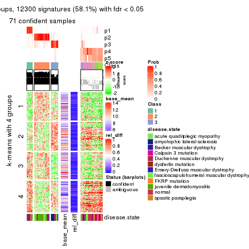</p>

</div>
<div id='tab-ATC-hclust-get-signatures-5'>
<pre><code class="r">get_signatures(res, k = 6)
</code></pre>

<p></p>

</div>
</div>


Signature heatmaps where rows are not scaled:


<script>
$( function() {
	$( '#tabs-ATC-hclust-get-signatures-no-scale' ).tabs();
} );
</script>
<div id='tabs-ATC-hclust-get-signatures-no-scale'>
<ul>
<li><a href='#tab-ATC-hclust-get-signatures-no-scale-1'>k = 2</a></li>
<li><a href='#tab-ATC-hclust-get-signatures-no-scale-2'>k = 3</a></li>
<li><a href='#tab-ATC-hclust-get-signatures-no-scale-3'>k = 4</a></li>
<li><a href='#tab-ATC-hclust-get-signatures-no-scale-4'>k = 5</a></li>
<li><a href='#tab-ATC-hclust-get-signatures-no-scale-5'>k = 6</a></li>
</ul>
<div id='tab-ATC-hclust-get-signatures-no-scale-1'>
<pre><code class="r">get_signatures(res, k = 2, scale_rows = FALSE)
</code></pre>

<p></p>

</div>
<div id='tab-ATC-hclust-get-signatures-no-scale-2'>
<pre><code class="r">get_signatures(res, k = 3, scale_rows = FALSE)
</code></pre>

<p></p>

</div>
<div id='tab-ATC-hclust-get-signatures-no-scale-3'>
<pre><code class="r">get_signatures(res, k = 4, scale_rows = FALSE)
</code></pre>

<p></p>

</div>
<div id='tab-ATC-hclust-get-signatures-no-scale-4'>
<pre><code class="r">get_signatures(res, k = 5, scale_rows = FALSE)
</code></pre>

<p></p>

</div>
<div id='tab-ATC-hclust-get-signatures-no-scale-5'>
<pre><code class="r">get_signatures(res, k = 6, scale_rows = FALSE)
</code></pre>

<p></p>

</div>
</div>


Compare the overlap of signatures from different k:

```r
compare_signatures(res)
```


`get_signature()` returns a data frame invisibly. TO get the list of signatures, the function
call should be assigned to a variable explicitly. In following code, if `plot` argument is set
to `FALSE`, no heatmap is plotted while only the differential analysis is performed.

```r
# code only for demonstration
tb = get_signature(res, k = ..., plot = FALSE)
```

An example of the output of `tb` is:

```
#>   which_row         fdr    mean_1    mean_2 scaled_mean_1 scaled_mean_2 km
#> 1        38 0.042760348  8.373488  9.131774    -0.5533452     0.5164555  1
#> 2        40 0.018707592  7.106213  8.469186    -0.6173731     0.5762149  1
#> 3        55 0.019134737 10.221463 11.207825    -0.6159697     0.5749050  1
#> 4        59 0.006059896  5.921854  7.869574    -0.6899429     0.6439467  1
#> 5        60 0.018055526  8.928898 10.211722    -0.6204761     0.5791110  1
#> 6        98 0.009384629 15.714769 14.887706     0.6635654    -0.6193277  2
...
```

The columns in `tb` are:

1. `which_row`: row indices corresponding to the input matrix.
2. `fdr`: FDR for the differential test. 
3. `mean_x`: The mean value in group x.
4. `scaled_mean_x`: The mean value in group x after rows are scaled.
5. `km`: Row groups if k-means clustering is applied to rows.


UMAP plot which shows how samples are separated.


<script>
$( function() {
	$( '#tabs-ATC-hclust-dimension-reduction' ).tabs();
} );
</script>
<div id='tabs-ATC-hclust-dimension-reduction'>
<ul>
<li><a href='#tab-ATC-hclust-dimension-reduction-1'>k = 2</a></li>
<li><a href='#tab-ATC-hclust-dimension-reduction-2'>k = 3</a></li>
<li><a href='#tab-ATC-hclust-dimension-reduction-3'>k = 4</a></li>
<li><a href='#tab-ATC-hclust-dimension-reduction-4'>k = 5</a></li>
<li><a href='#tab-ATC-hclust-dimension-reduction-5'>k = 6</a></li>
</ul>
<div id='tab-ATC-hclust-dimension-reduction-1'>
<pre><code class="r">dimension_reduction(res, k = 2, method = &quot;UMAP&quot;)
</code></pre>

<p></p>

</div>
<div id='tab-ATC-hclust-dimension-reduction-2'>
<pre><code class="r">dimension_reduction(res, k = 3, method = &quot;UMAP&quot;)
</code></pre>

<p></p>

</div>
<div id='tab-ATC-hclust-dimension-reduction-3'>
<pre><code class="r">dimension_reduction(res, k = 4, method = &quot;UMAP&quot;)
</code></pre>

<p></p>

</div>
<div id='tab-ATC-hclust-dimension-reduction-4'>
<pre><code class="r">dimension_reduction(res, k = 5, method = &quot;UMAP&quot;)
</code></pre>

<p></p>

</div>
<div id='tab-ATC-hclust-dimension-reduction-5'>
<pre><code class="r">dimension_reduction(res, k = 6, method = &quot;UMAP&quot;)
</code></pre>

<p></p>

</div>
</div>


Following heatmap shows how subgroups are split when increasing `k`:

```r
collect_classes(res)
```


Test correlation between subgroups and known annotations. If the known
annotation is numeric, one-way ANOVA test is applied, and if the known
annotation is discrete, chi-squared contingency table test is applied.

```r
test_to_known_factors(res)
```

```
#>              n disease.state(p) k
#> ATC:hclust 114         5.47e-10 2
#> ATC:hclust 117         3.22e-14 3
#> ATC:hclust 110         4.29e-17 4
#> ATC:hclust  71         7.26e-13 5
#> ATC:hclust 109         2.14e-23 6
```


If matrix rows can be associated to genes, consider to use `GO_Enrichment(res,
...)` to perform function enrichment for the signature genes.


 

---------------------------------------------------


### ATC:kmeans**


The object with results only for a single top-value method and a single partition method 
can be extracted as:

```r
res = res_list["ATC", "kmeans"]
# you can also extract it by
# res = res_list["ATC:kmeans"]
```

A summary of `res` and all the functions that can be applied to it:

```r
res
```

```
#> A 'ConsensusPartition' object with k = 2, 3, 4, 5, 6.
#>   On a matrix with 21168 rows and 121 columns.
#>   Top rows (1000, 2000, 3000, 4000, 5000) are extracted by 'ATC' method.
#>   Subgroups are detected by 'kmeans' method.
#>   Performed in total 1250 partitions by row resampling.
#>   Best k for subgroups seems to be 2.
#> 
#> Following methods can be applied to this 'ConsensusPartition' object:
#>  [1] "cola_report"             "collect_classes"         "collect_plots"          
#>  [4] "collect_stats"           "colnames"                "compare_signatures"     
#>  [7] "consensus_heatmap"       "dimension_reduction"     "functional_enrichment"  
#> [10] "get_anno_col"            "get_anno"                "get_classes"            
#> [13] "get_consensus"           "get_matrix"              "get_membership"         
#> [16] "get_param"               "get_signatures"          "get_stats"              
#> [19] "is_best_k"               "is_stable_k"             "membership_heatmap"     
#> [22] "ncol"                    "nrow"                    "plot_ecdf"              
#> [25] "rownames"                "select_partition_number" "show"                   
#> [28] "suggest_best_k"          "test_to_known_factors"
```

`collect_plots()` function collects all the plots made from `res` for all `k` (number of partitions)
into one single page to provide an easy and fast comparison between different `k`.

```r
collect_plots(res)
```


The plots are:

- The first row: a plot of the ECDF (Empirical cumulative distribution
  function) curves of the consensus matrix for each `k` and the heatmap of
  predicted classes for each `k`.
- The second row: heatmaps of the consensus matrix for each `k`.
- The third row: heatmaps of the membership matrix for each `k`.
- The fouth row: heatmaps of the signatures for each `k`.

All the plots in panels can be made by individual functions and they are
plotted later in this section.

`select_partition_number()` produces several plots showing different
statistics for choosing "optimized" `k`. There are following statistics:

- ECDF curves of the consensus matrix for each `k`;
- 1-PAC. [The PAC
  score](https://en.wikipedia.org/wiki/Consensus_clustering#Over-interpretation_potential_of_consensus_clustering)
  measures the proportion of the ambiguous subgrouping.
- Mean silhouette score.
- Concordance. The mean probability of fiting the consensus class ids in all
  partitions.
- Area increased. Denote $A_k$ as the area under the ECDF curve for current
  `k`, the area increased is defined as $A_k - A_{k-1}$.
- Rand index. The percent of pairs of samples that are both in a same cluster
  or both are not in a same cluster in the partition of k and k-1.
- Jaccard index. The ratio of pairs of samples are both in a same cluster in
  the partition of k and k-1 and the pairs of samples are both in a same
  cluster in the partition k or k-1.

The detailed explanations of these statistics can be found in [the cola
vignette](http://bioconductor.org/packages/devel/bioc/vignettes/cola/inst/doc/cola.html#toc_13).

Generally speaking, lower PAC score, higher mean silhouette score or higher
concordance corresponds to better partition. Rand index and Jaccard index
measure how similar the current partition is compared to partition with `k-1`.
If they are too similar, we won't accept `k` is better than `k-1`.

```r
select_partition_number(res)
```


The numeric values for all these statistics can be obtained by `get_stats()`.

```r
get_stats(res)
```

```
#>   k 1-PAC mean_silhouette concordance area_increased  Rand Jaccard
#> 2 2 1.000           0.994       0.997         0.5028 0.498   0.498
#> 3 3 0.563           0.579       0.791         0.3008 0.736   0.515
#> 4 4 0.849           0.905       0.939         0.1408 0.808   0.501
#> 5 5 0.787           0.707       0.836         0.0584 0.978   0.912
#> 6 6 0.781           0.647       0.756         0.0422 0.898   0.595
```

`suggest_best_k()` suggests the best $k$ based on these statistics. The rules are as follows:

- All $k$ with Jaccard index larger than 0.95 are removed because the increase of
  the partition number does not provides enough extra information. If all $k$ are removed,
  the best $k$ is assigned by `NA`.
- For $k$ with 1-PAC larger than 0.9, the maximal $k$ is taken as the "best k". Other $k$ is called "optional k".
- If it does not fit the second rule. The $k$ with the highest vote of highest
  1-PAC, mean silhouette and concordance is taken as the "best k".

```r
suggest_best_k(res)
```

```
#> [1] 2
```


Following shows the table of the partitions (You need to click the **show/hide
code output** link to see it). The membership matrix (columns with name `p*`)
is inferred by
[`clue::cl_consensus()`](https://www.rdocumentation.org/link/cl_consensus?package=clue)
function with the `SE` method. Basically the value in the membership matrix
represents the probability to belong to a certain group. The finall class
label for an item is determined with the group with highest probability it
belongs to.

In `get_classes()` function, the entropy is calculated from the membership
matrix and the silhouette score is calculated from the consensus matrix.


<script>
$( function() {
	$( '#tabs-ATC-kmeans-get-classes' ).tabs();
} );
</script>
<div id='tabs-ATC-kmeans-get-classes'>
<ul>
<li><a href='#tab-ATC-kmeans-get-classes-1'>k = 2</a></li>
<li><a href='#tab-ATC-kmeans-get-classes-2'>k = 3</a></li>
<li><a href='#tab-ATC-kmeans-get-classes-3'>k = 4</a></li>
<li><a href='#tab-ATC-kmeans-get-classes-4'>k = 5</a></li>
<li><a href='#tab-ATC-kmeans-get-classes-5'>k = 6</a></li>
</ul>

<div id='tab-ATC-kmeans-get-classes-1'>
<p><a id='tab-ATC-kmeans-get-classes-1-a' style='color:#0366d6' href='#'>show/hide code output</a></p>
<pre><code class="r">cbind(get_classes(res, k = 2), get_membership(res, k = 2))
</code></pre>

<pre><code>#&gt;           class entropy silhouette    p1    p2
#&gt; GSM74356      1  0.0376      0.994 0.996 0.004
#&gt; GSM74357      1  0.0000      0.997 1.000 0.000
#&gt; GSM74358      1  0.0000      0.997 1.000 0.000
#&gt; GSM74359      1  0.0000      0.997 1.000 0.000
#&gt; GSM74360      1  0.0000      0.997 1.000 0.000
#&gt; GSM74361      1  0.1414      0.981 0.980 0.020
#&gt; GSM74362      1  0.0000      0.997 1.000 0.000
#&gt; GSM74363      1  0.1184      0.984 0.984 0.016
#&gt; GSM74402      1  0.0000      0.997 1.000 0.000
#&gt; GSM74403      1  0.0000      0.997 1.000 0.000
#&gt; GSM74404      1  0.0000      0.997 1.000 0.000
#&gt; GSM74406      1  0.0000      0.997 1.000 0.000
#&gt; GSM74407      1  0.0000      0.997 1.000 0.000
#&gt; GSM74408      1  0.0000      0.997 1.000 0.000
#&gt; GSM74409      1  0.0000      0.997 1.000 0.000
#&gt; GSM74410      1  0.0000      0.997 1.000 0.000
#&gt; GSM119936     1  0.0000      0.997 1.000 0.000
#&gt; GSM119937     1  0.0000      0.997 1.000 0.000
#&gt; GSM74411      2  0.0000      0.997 0.000 1.000
#&gt; GSM74412      2  0.0000      0.997 0.000 1.000
#&gt; GSM74413      2  0.0000      0.997 0.000 1.000
#&gt; GSM74414      2  0.0000      0.997 0.000 1.000
#&gt; GSM74415      2  0.0000      0.997 0.000 1.000
#&gt; GSM121379     2  0.0000      0.997 0.000 1.000
#&gt; GSM121380     2  0.0000      0.997 0.000 1.000
#&gt; GSM121381     2  0.0000      0.997 0.000 1.000
#&gt; GSM121382     2  0.0000      0.997 0.000 1.000
#&gt; GSM121383     2  0.0000      0.997 0.000 1.000
#&gt; GSM121384     2  0.0000      0.997 0.000 1.000
#&gt; GSM121385     2  0.0000      0.997 0.000 1.000
#&gt; GSM121386     2  0.0000      0.997 0.000 1.000
#&gt; GSM121387     2  0.0000      0.997 0.000 1.000
#&gt; GSM121388     2  0.0000      0.997 0.000 1.000
#&gt; GSM121389     2  0.0000      0.997 0.000 1.000
#&gt; GSM121390     2  0.0000      0.997 0.000 1.000
#&gt; GSM121391     2  0.0000      0.997 0.000 1.000
#&gt; GSM121392     2  0.0000      0.997 0.000 1.000
#&gt; GSM121393     2  0.0000      0.997 0.000 1.000
#&gt; GSM121394     2  0.0000      0.997 0.000 1.000
#&gt; GSM121395     2  0.0000      0.997 0.000 1.000
#&gt; GSM121396     2  0.0000      0.997 0.000 1.000
#&gt; GSM121397     2  0.0000      0.997 0.000 1.000
#&gt; GSM121398     2  0.0000      0.997 0.000 1.000
#&gt; GSM121399     2  0.0000      0.997 0.000 1.000
#&gt; GSM74240      2  0.0000      0.997 0.000 1.000
#&gt; GSM74241      2  0.0000      0.997 0.000 1.000
#&gt; GSM74242      2  0.4298      0.904 0.088 0.912
#&gt; GSM74243      2  0.4815      0.885 0.104 0.896
#&gt; GSM74244      2  0.0000      0.997 0.000 1.000
#&gt; GSM74245      2  0.0000      0.997 0.000 1.000
#&gt; GSM74246      2  0.0000      0.997 0.000 1.000
#&gt; GSM74247      2  0.0000      0.997 0.000 1.000
#&gt; GSM74248      2  0.0000      0.997 0.000 1.000
#&gt; GSM74416      1  0.0000      0.997 1.000 0.000
#&gt; GSM74417      1  0.0000      0.997 1.000 0.000
#&gt; GSM74418      1  0.0000      0.997 1.000 0.000
#&gt; GSM74419      1  0.0000      0.997 1.000 0.000
#&gt; GSM121358     2  0.0000      0.997 0.000 1.000
#&gt; GSM121359     2  0.0000      0.997 0.000 1.000
#&gt; GSM121360     1  0.0000      0.997 1.000 0.000
#&gt; GSM121362     1  0.0000      0.997 1.000 0.000
#&gt; GSM121364     1  0.0000      0.997 1.000 0.000
#&gt; GSM121365     2  0.0000      0.997 0.000 1.000
#&gt; GSM121366     2  0.0000      0.997 0.000 1.000
#&gt; GSM121367     2  0.0000      0.997 0.000 1.000
#&gt; GSM121370     2  0.0000      0.997 0.000 1.000
#&gt; GSM121371     2  0.0000      0.997 0.000 1.000
#&gt; GSM121372     2  0.0000      0.997 0.000 1.000
#&gt; GSM121373     1  0.0000      0.997 1.000 0.000
#&gt; GSM121374     1  0.0000      0.997 1.000 0.000
#&gt; GSM121407     2  0.0000      0.997 0.000 1.000
#&gt; GSM74387      2  0.0000      0.997 0.000 1.000
#&gt; GSM74388      2  0.0000      0.997 0.000 1.000
#&gt; GSM74389      1  0.1184      0.984 0.984 0.016
#&gt; GSM74390      2  0.0000      0.997 0.000 1.000
#&gt; GSM74391      1  0.0000      0.997 1.000 0.000
#&gt; GSM74392      1  0.0000      0.997 1.000 0.000
#&gt; GSM74393      1  0.0000      0.997 1.000 0.000
#&gt; GSM74394      2  0.0000      0.997 0.000 1.000
#&gt; GSM74239      1  0.0000      0.997 1.000 0.000
#&gt; GSM74364      1  0.0000      0.997 1.000 0.000
#&gt; GSM74365      1  0.0000      0.997 1.000 0.000
#&gt; GSM74366      2  0.0000      0.997 0.000 1.000
#&gt; GSM74367      1  0.0000      0.997 1.000 0.000
#&gt; GSM74377      1  0.0000      0.997 1.000 0.000
#&gt; GSM74378      2  0.0000      0.997 0.000 1.000
#&gt; GSM74379      1  0.0000      0.997 1.000 0.000
#&gt; GSM74380      1  0.0000      0.997 1.000 0.000
#&gt; GSM74381      1  0.2603      0.956 0.956 0.044
#&gt; GSM121357     2  0.0000      0.997 0.000 1.000
#&gt; GSM121361     2  0.0000      0.997 0.000 1.000
#&gt; GSM121363     2  0.0000      0.997 0.000 1.000
#&gt; GSM121368     2  0.0000      0.997 0.000 1.000
#&gt; GSM121369     2  0.0000      0.997 0.000 1.000
#&gt; GSM74368      1  0.0000      0.997 1.000 0.000
#&gt; GSM74369      1  0.0000      0.997 1.000 0.000
#&gt; GSM74370      1  0.0000      0.997 1.000 0.000
#&gt; GSM74371      1  0.0000      0.997 1.000 0.000
#&gt; GSM74372      1  0.0000      0.997 1.000 0.000
#&gt; GSM74373      1  0.0000      0.997 1.000 0.000
#&gt; GSM74374      1  0.0000      0.997 1.000 0.000
#&gt; GSM74375      1  0.0000      0.997 1.000 0.000
#&gt; GSM74376      1  0.2603      0.956 0.956 0.044
#&gt; GSM74405      1  0.0938      0.988 0.988 0.012
#&gt; GSM74351      1  0.0000      0.997 1.000 0.000
#&gt; GSM74352      1  0.0376      0.994 0.996 0.004
#&gt; GSM74353      1  0.0000      0.997 1.000 0.000
#&gt; GSM74354      1  0.0000      0.997 1.000 0.000
#&gt; GSM74355      2  0.0000      0.997 0.000 1.000
#&gt; GSM74382      1  0.0000      0.997 1.000 0.000
#&gt; GSM74383      1  0.0000      0.997 1.000 0.000
#&gt; GSM74384      2  0.0000      0.997 0.000 1.000
#&gt; GSM74385      1  0.0000      0.997 1.000 0.000
#&gt; GSM74386      1  0.0000      0.997 1.000 0.000
#&gt; GSM74395      1  0.0000      0.997 1.000 0.000
#&gt; GSM74396      1  0.0000      0.997 1.000 0.000
#&gt; GSM74397      1  0.0000      0.997 1.000 0.000
#&gt; GSM74398      1  0.0000      0.997 1.000 0.000
#&gt; GSM74399      1  0.0000      0.997 1.000 0.000
#&gt; GSM74400      1  0.0000      0.997 1.000 0.000
#&gt; GSM74401      1  0.0000      0.997 1.000 0.000
</code></pre>

<script>
$('#tab-ATC-kmeans-get-classes-1-a').parent().next().next().hide();
$('#tab-ATC-kmeans-get-classes-1-a').click(function(){
  $('#tab-ATC-kmeans-get-classes-1-a').parent().next().next().toggle();
  return(false);
});
</script>
</div>

<div id='tab-ATC-kmeans-get-classes-2'>
<p><a id='tab-ATC-kmeans-get-classes-2-a' style='color:#0366d6' href='#'>show/hide code output</a></p>
<pre><code class="r">cbind(get_classes(res, k = 3), get_membership(res, k = 3))
</code></pre>

<pre><code>#&gt;           class entropy silhouette    p1    p2    p3
#&gt; GSM74356      3  0.5219     0.4974 0.196 0.016 0.788
#&gt; GSM74357      3  0.4702     0.4850 0.212 0.000 0.788
#&gt; GSM74358      3  0.4702     0.4850 0.212 0.000 0.788
#&gt; GSM74359      1  0.1031     0.7606 0.976 0.000 0.024
#&gt; GSM74360      1  0.0000     0.7702 1.000 0.000 0.000
#&gt; GSM74361      3  0.5428     0.5448 0.064 0.120 0.816
#&gt; GSM74362      3  0.4702     0.4850 0.212 0.000 0.788
#&gt; GSM74363      3  0.5219     0.4974 0.196 0.016 0.788
#&gt; GSM74402      1  0.1031     0.7606 0.976 0.000 0.024
#&gt; GSM74403      1  0.0000     0.7702 1.000 0.000 0.000
#&gt; GSM74404      1  0.0000     0.7702 1.000 0.000 0.000
#&gt; GSM74406      1  0.1031     0.7606 0.976 0.000 0.024
#&gt; GSM74407      3  0.4605     0.4877 0.204 0.000 0.796
#&gt; GSM74408      1  0.1031     0.7606 0.976 0.000 0.024
#&gt; GSM74409      1  0.1031     0.7606 0.976 0.000 0.024
#&gt; GSM74410      1  0.1031     0.7606 0.976 0.000 0.024
#&gt; GSM119936     1  0.1031     0.7606 0.976 0.000 0.024
#&gt; GSM119937     1  0.0747     0.7660 0.984 0.000 0.016
#&gt; GSM74411      2  0.2356     0.8560 0.000 0.928 0.072
#&gt; GSM74412      2  0.0000     0.9007 0.000 1.000 0.000
#&gt; GSM74413      2  0.2448     0.8538 0.000 0.924 0.076
#&gt; GSM74414      2  0.0000     0.9007 0.000 1.000 0.000
#&gt; GSM74415      2  0.6305     0.2340 0.000 0.516 0.484
#&gt; GSM121379     2  0.0000     0.9007 0.000 1.000 0.000
#&gt; GSM121380     2  0.0000     0.9007 0.000 1.000 0.000
#&gt; GSM121381     2  0.0000     0.9007 0.000 1.000 0.000
#&gt; GSM121382     2  0.0000     0.9007 0.000 1.000 0.000
#&gt; GSM121383     2  0.0000     0.9007 0.000 1.000 0.000
#&gt; GSM121384     2  0.0000     0.9007 0.000 1.000 0.000
#&gt; GSM121385     2  0.0000     0.9007 0.000 1.000 0.000
#&gt; GSM121386     2  0.0000     0.9007 0.000 1.000 0.000
#&gt; GSM121387     2  0.0000     0.9007 0.000 1.000 0.000
#&gt; GSM121388     2  0.0000     0.9007 0.000 1.000 0.000
#&gt; GSM121389     2  0.0000     0.9007 0.000 1.000 0.000
#&gt; GSM121390     2  0.0000     0.9007 0.000 1.000 0.000
#&gt; GSM121391     2  0.0000     0.9007 0.000 1.000 0.000
#&gt; GSM121392     2  0.0592     0.8938 0.000 0.988 0.012
#&gt; GSM121393     2  0.4346     0.7098 0.000 0.816 0.184
#&gt; GSM121394     2  0.0000     0.9007 0.000 1.000 0.000
#&gt; GSM121395     2  0.0000     0.9007 0.000 1.000 0.000
#&gt; GSM121396     2  0.1289     0.8833 0.000 0.968 0.032
#&gt; GSM121397     2  0.0000     0.9007 0.000 1.000 0.000
#&gt; GSM121398     2  0.0000     0.9007 0.000 1.000 0.000
#&gt; GSM121399     2  0.0000     0.9007 0.000 1.000 0.000
#&gt; GSM74240      3  0.6299    -0.1607 0.000 0.476 0.524
#&gt; GSM74241      3  0.6299    -0.1607 0.000 0.476 0.524
#&gt; GSM74242      3  0.5901     0.4880 0.040 0.192 0.768
#&gt; GSM74243      3  0.5901     0.4880 0.040 0.192 0.768
#&gt; GSM74244      2  0.6026     0.4924 0.000 0.624 0.376
#&gt; GSM74245      3  0.6008     0.1611 0.000 0.372 0.628
#&gt; GSM74246      2  0.5678     0.5929 0.000 0.684 0.316
#&gt; GSM74247      2  0.5678     0.5929 0.000 0.684 0.316
#&gt; GSM74248      3  0.5810     0.2509 0.000 0.336 0.664
#&gt; GSM74416      1  0.0000     0.7702 1.000 0.000 0.000
#&gt; GSM74417      1  0.0000     0.7702 1.000 0.000 0.000
#&gt; GSM74418      1  0.0000     0.7702 1.000 0.000 0.000
#&gt; GSM74419      1  0.1031     0.7606 0.976 0.000 0.024
#&gt; GSM121358     3  0.6307    -0.1971 0.000 0.488 0.512
#&gt; GSM121359     2  0.3192     0.8224 0.000 0.888 0.112
#&gt; GSM121360     1  0.6215     0.4803 0.572 0.000 0.428
#&gt; GSM121362     3  0.6299    -0.2248 0.476 0.000 0.524
#&gt; GSM121364     1  0.1031     0.7606 0.976 0.000 0.024
#&gt; GSM121365     3  0.5058     0.4265 0.000 0.244 0.756
#&gt; GSM121366     2  0.5810     0.5621 0.000 0.664 0.336
#&gt; GSM121367     3  0.6307    -0.1971 0.000 0.488 0.512
#&gt; GSM121370     2  0.6026     0.4924 0.000 0.624 0.376
#&gt; GSM121371     3  0.5810     0.2509 0.000 0.336 0.664
#&gt; GSM121372     2  0.5138     0.6708 0.000 0.748 0.252
#&gt; GSM121373     1  0.0000     0.7702 1.000 0.000 0.000
#&gt; GSM121374     1  0.1031     0.7606 0.976 0.000 0.024
#&gt; GSM121407     2  0.0000     0.9007 0.000 1.000 0.000
#&gt; GSM74387      2  0.0000     0.9007 0.000 1.000 0.000
#&gt; GSM74388      2  0.0592     0.8938 0.000 0.988 0.012
#&gt; GSM74389      3  0.5219     0.4974 0.196 0.016 0.788
#&gt; GSM74390      3  0.4887     0.4513 0.000 0.228 0.772
#&gt; GSM74391      3  0.6305     0.0374 0.484 0.000 0.516
#&gt; GSM74392      1  0.1031     0.7606 0.976 0.000 0.024
#&gt; GSM74393      3  0.5859     0.3411 0.344 0.000 0.656
#&gt; GSM74394      2  0.0592     0.8938 0.000 0.988 0.012
#&gt; GSM74239      1  0.5529     0.6356 0.704 0.000 0.296
#&gt; GSM74364      1  0.0000     0.7702 1.000 0.000 0.000
#&gt; GSM74365      1  0.6308     0.3564 0.508 0.000 0.492
#&gt; GSM74366      3  0.6291     0.0623 0.000 0.468 0.532
#&gt; GSM74367      1  0.6252     0.4518 0.556 0.000 0.444
#&gt; GSM74377      3  0.5465     0.2646 0.288 0.000 0.712
#&gt; GSM74378      3  0.6180     0.4430 0.024 0.260 0.716
#&gt; GSM74379      3  0.5948     0.0830 0.360 0.000 0.640
#&gt; GSM74380      3  0.5948     0.0830 0.360 0.000 0.640
#&gt; GSM74381      3  0.5431     0.2724 0.284 0.000 0.716
#&gt; GSM121357     2  0.2537     0.8414 0.000 0.920 0.080
#&gt; GSM121361     2  0.0592     0.8938 0.000 0.988 0.012
#&gt; GSM121363     2  0.0592     0.8938 0.000 0.988 0.012
#&gt; GSM121368     2  0.0592     0.8938 0.000 0.988 0.012
#&gt; GSM121369     2  0.5678     0.4773 0.000 0.684 0.316
#&gt; GSM74368      3  0.6180    -0.0575 0.416 0.000 0.584
#&gt; GSM74369      1  0.6045     0.5490 0.620 0.000 0.380
#&gt; GSM74370      1  0.5591     0.6307 0.696 0.000 0.304
#&gt; GSM74371      1  0.0000     0.7702 1.000 0.000 0.000
#&gt; GSM74372      1  0.5835     0.5969 0.660 0.000 0.340
#&gt; GSM74373      3  0.6126    -0.0564 0.400 0.000 0.600
#&gt; GSM74374      1  0.5591     0.6307 0.696 0.000 0.304
#&gt; GSM74375      3  0.5465     0.2646 0.288 0.000 0.712
#&gt; GSM74376      3  0.5431     0.2724 0.284 0.000 0.716
#&gt; GSM74405      3  0.5431     0.2724 0.284 0.000 0.716
#&gt; GSM74351      1  0.0000     0.7702 1.000 0.000 0.000
#&gt; GSM74352      3  0.5431     0.2724 0.284 0.000 0.716
#&gt; GSM74353      1  0.5621     0.6274 0.692 0.000 0.308
#&gt; GSM74354      1  0.5591     0.6307 0.696 0.000 0.304
#&gt; GSM74355      3  0.6180     0.4430 0.024 0.260 0.716
#&gt; GSM74382      1  0.0000     0.7702 1.000 0.000 0.000
#&gt; GSM74383      1  0.5591     0.6307 0.696 0.000 0.304
#&gt; GSM74384      3  0.6274     0.0976 0.000 0.456 0.544
#&gt; GSM74385      1  0.0000     0.7702 1.000 0.000 0.000
#&gt; GSM74386      1  0.6260     0.4433 0.552 0.000 0.448
#&gt; GSM74395      1  0.6244     0.4598 0.560 0.000 0.440
#&gt; GSM74396      1  0.6235     0.4673 0.564 0.000 0.436
#&gt; GSM74397      1  0.6260     0.4433 0.552 0.000 0.448
#&gt; GSM74398      3  0.6295    -0.2961 0.472 0.000 0.528
#&gt; GSM74399      3  0.5968     0.0703 0.364 0.000 0.636
#&gt; GSM74400      1  0.6244     0.4627 0.560 0.000 0.440
#&gt; GSM74401      1  0.6244     0.4627 0.560 0.000 0.440
</code></pre>

<script>
$('#tab-ATC-kmeans-get-classes-2-a').parent().next().next().hide();
$('#tab-ATC-kmeans-get-classes-2-a').click(function(){
  $('#tab-ATC-kmeans-get-classes-2-a').parent().next().next().toggle();
  return(false);
});
</script>
</div>

<div id='tab-ATC-kmeans-get-classes-3'>
<p><a id='tab-ATC-kmeans-get-classes-3-a' style='color:#0366d6' href='#'>show/hide code output</a></p>
<pre><code class="r">cbind(get_classes(res, k = 4), get_membership(res, k = 4))
</code></pre>

<pre><code>#&gt;           class entropy silhouette    p1    p2    p3    p4
#&gt; GSM74356      3  0.0817    0.92727 0.024 0.000 0.976 0.000
#&gt; GSM74357      3  0.0817    0.92727 0.024 0.000 0.976 0.000
#&gt; GSM74358      3  0.0817    0.92727 0.024 0.000 0.976 0.000
#&gt; GSM74359      4  0.1174    0.98820 0.020 0.000 0.012 0.968
#&gt; GSM74360      4  0.1174    0.98820 0.020 0.000 0.012 0.968
#&gt; GSM74361      3  0.0817    0.92727 0.024 0.000 0.976 0.000
#&gt; GSM74362      3  0.1302    0.91486 0.044 0.000 0.956 0.000
#&gt; GSM74363      3  0.0817    0.92727 0.024 0.000 0.976 0.000
#&gt; GSM74402      4  0.0592    0.99489 0.016 0.000 0.000 0.984
#&gt; GSM74403      4  0.0592    0.99489 0.016 0.000 0.000 0.984
#&gt; GSM74404      4  0.0592    0.99489 0.016 0.000 0.000 0.984
#&gt; GSM74406      4  0.0592    0.99489 0.016 0.000 0.000 0.984
#&gt; GSM74407      3  0.4277    0.62541 0.280 0.000 0.720 0.000
#&gt; GSM74408      4  0.0592    0.99489 0.016 0.000 0.000 0.984
#&gt; GSM74409      4  0.0592    0.99489 0.016 0.000 0.000 0.984
#&gt; GSM74410      4  0.0592    0.99489 0.016 0.000 0.000 0.984
#&gt; GSM119936     4  0.0592    0.99489 0.016 0.000 0.000 0.984
#&gt; GSM119937     4  0.1174    0.98091 0.020 0.000 0.012 0.968
#&gt; GSM74411      2  0.1297    0.94121 0.000 0.964 0.020 0.016
#&gt; GSM74412      2  0.0927    0.94887 0.000 0.976 0.008 0.016
#&gt; GSM74413      2  0.1297    0.94121 0.000 0.964 0.020 0.016
#&gt; GSM74414      2  0.0469    0.95545 0.000 0.988 0.012 0.000
#&gt; GSM74415      3  0.1510    0.92457 0.000 0.028 0.956 0.016
#&gt; GSM121379     2  0.0000    0.95759 0.000 1.000 0.000 0.000
#&gt; GSM121380     2  0.0000    0.95759 0.000 1.000 0.000 0.000
#&gt; GSM121381     2  0.0000    0.95759 0.000 1.000 0.000 0.000
#&gt; GSM121382     2  0.0000    0.95759 0.000 1.000 0.000 0.000
#&gt; GSM121383     2  0.0000    0.95759 0.000 1.000 0.000 0.000
#&gt; GSM121384     2  0.0000    0.95759 0.000 1.000 0.000 0.000
#&gt; GSM121385     2  0.0000    0.95759 0.000 1.000 0.000 0.000
#&gt; GSM121386     2  0.0000    0.95759 0.000 1.000 0.000 0.000
#&gt; GSM121387     2  0.0000    0.95759 0.000 1.000 0.000 0.000
#&gt; GSM121388     2  0.0188    0.95687 0.000 0.996 0.004 0.000
#&gt; GSM121389     2  0.0000    0.95759 0.000 1.000 0.000 0.000
#&gt; GSM121390     2  0.0188    0.95599 0.000 0.996 0.004 0.000
#&gt; GSM121391     2  0.0000    0.95759 0.000 1.000 0.000 0.000
#&gt; GSM121392     2  0.0188    0.95599 0.000 0.996 0.004 0.000
#&gt; GSM121393     2  0.4944    0.74732 0.072 0.768 0.160 0.000
#&gt; GSM121394     2  0.0336    0.95565 0.000 0.992 0.008 0.000
#&gt; GSM121395     2  0.0000    0.95759 0.000 1.000 0.000 0.000
#&gt; GSM121396     2  0.0779    0.95020 0.000 0.980 0.004 0.016
#&gt; GSM121397     2  0.0000    0.95759 0.000 1.000 0.000 0.000
#&gt; GSM121398     2  0.0000    0.95759 0.000 1.000 0.000 0.000
#&gt; GSM121399     2  0.0000    0.95759 0.000 1.000 0.000 0.000
#&gt; GSM74240      3  0.1510    0.92457 0.000 0.028 0.956 0.016
#&gt; GSM74241      3  0.1510    0.92457 0.000 0.028 0.956 0.016
#&gt; GSM74242      3  0.0657    0.92964 0.012 0.004 0.984 0.000
#&gt; GSM74243      3  0.0657    0.92964 0.012 0.004 0.984 0.000
#&gt; GSM74244      3  0.1610    0.92235 0.000 0.032 0.952 0.016
#&gt; GSM74245      3  0.1648    0.92767 0.012 0.016 0.956 0.016
#&gt; GSM74246      3  0.3969    0.77598 0.000 0.180 0.804 0.016
#&gt; GSM74247      3  0.3969    0.77598 0.000 0.180 0.804 0.016
#&gt; GSM74248      3  0.1394    0.92887 0.012 0.008 0.964 0.016
#&gt; GSM74416      4  0.0592    0.99489 0.016 0.000 0.000 0.984
#&gt; GSM74417      4  0.0592    0.99489 0.016 0.000 0.000 0.984
#&gt; GSM74418      4  0.0592    0.99489 0.016 0.000 0.000 0.984
#&gt; GSM74419      4  0.1059    0.98482 0.016 0.000 0.012 0.972
#&gt; GSM121358     3  0.1388    0.92532 0.000 0.028 0.960 0.012
#&gt; GSM121359     2  0.1297    0.94121 0.000 0.964 0.020 0.016
#&gt; GSM121360     1  0.3080    0.90166 0.880 0.000 0.024 0.096
#&gt; GSM121362     1  0.3080    0.90166 0.880 0.000 0.024 0.096
#&gt; GSM121364     4  0.1174    0.98820 0.020 0.000 0.012 0.968
#&gt; GSM121365     3  0.0657    0.92964 0.012 0.004 0.984 0.000
#&gt; GSM121366     3  0.2861    0.87211 0.000 0.096 0.888 0.016
#&gt; GSM121367     3  0.1388    0.92532 0.000 0.028 0.960 0.012
#&gt; GSM121370     3  0.1610    0.92235 0.000 0.032 0.952 0.016
#&gt; GSM121371     3  0.0804    0.92973 0.012 0.008 0.980 0.000
#&gt; GSM121372     2  0.5511    0.00782 0.000 0.500 0.484 0.016
#&gt; GSM121373     4  0.1174    0.98820 0.020 0.000 0.012 0.968
#&gt; GSM121374     4  0.1174    0.98820 0.020 0.000 0.012 0.968
#&gt; GSM121407     2  0.0336    0.95565 0.000 0.992 0.008 0.000
#&gt; GSM74387      2  0.0927    0.94887 0.000 0.976 0.008 0.016
#&gt; GSM74388      2  0.0188    0.95599 0.000 0.996 0.004 0.000
#&gt; GSM74389      3  0.0817    0.92727 0.024 0.000 0.976 0.000
#&gt; GSM74390      3  0.0592    0.92874 0.016 0.000 0.984 0.000
#&gt; GSM74391      3  0.5510    0.37504 0.376 0.000 0.600 0.024
#&gt; GSM74392      4  0.1174    0.98820 0.020 0.000 0.012 0.968
#&gt; GSM74393      3  0.3444    0.76793 0.184 0.000 0.816 0.000
#&gt; GSM74394      2  0.0817    0.94919 0.000 0.976 0.024 0.000
#&gt; GSM74239      1  0.3271    0.88765 0.856 0.000 0.012 0.132
#&gt; GSM74364      4  0.0592    0.99489 0.016 0.000 0.000 0.984
#&gt; GSM74365      1  0.0804    0.90074 0.980 0.000 0.012 0.008
#&gt; GSM74366      1  0.6730    0.41222 0.592 0.276 0.132 0.000
#&gt; GSM74367      1  0.2805    0.90455 0.888 0.000 0.012 0.100
#&gt; GSM74377      1  0.0336    0.89762 0.992 0.000 0.008 0.000
#&gt; GSM74378      1  0.0927    0.88528 0.976 0.016 0.008 0.000
#&gt; GSM74379      1  0.0188    0.89852 0.996 0.000 0.004 0.000
#&gt; GSM74380      1  0.0188    0.89852 0.996 0.000 0.004 0.000
#&gt; GSM74381      1  0.0336    0.89762 0.992 0.000 0.008 0.000
#&gt; GSM121357     2  0.2704    0.84655 0.000 0.876 0.124 0.000
#&gt; GSM121361     2  0.0469    0.95545 0.000 0.988 0.012 0.000
#&gt; GSM121363     2  0.0188    0.95599 0.000 0.996 0.004 0.000
#&gt; GSM121368     2  0.0469    0.95545 0.000 0.988 0.012 0.000
#&gt; GSM121369     2  0.6693    0.43670 0.116 0.580 0.304 0.000
#&gt; GSM74368      1  0.2796    0.90519 0.892 0.000 0.016 0.092
#&gt; GSM74369      1  0.2988    0.89958 0.876 0.000 0.012 0.112
#&gt; GSM74370      1  0.4485    0.74996 0.740 0.000 0.012 0.248
#&gt; GSM74371      4  0.0592    0.99489 0.016 0.000 0.000 0.984
#&gt; GSM74372      1  0.2928    0.90182 0.880 0.000 0.012 0.108
#&gt; GSM74373      1  0.0188    0.89852 0.996 0.000 0.004 0.000
#&gt; GSM74374      1  0.3271    0.88765 0.856 0.000 0.012 0.132
#&gt; GSM74375      1  0.0188    0.89852 0.996 0.000 0.004 0.000
#&gt; GSM74376      1  0.0336    0.89762 0.992 0.000 0.008 0.000
#&gt; GSM74405      1  0.0336    0.89762 0.992 0.000 0.008 0.000
#&gt; GSM74351      4  0.0592    0.99489 0.016 0.000 0.000 0.984
#&gt; GSM74352      1  0.0336    0.89762 0.992 0.000 0.008 0.000
#&gt; GSM74353      1  0.3271    0.88765 0.856 0.000 0.012 0.132
#&gt; GSM74354      1  0.3217    0.89036 0.860 0.000 0.012 0.128
#&gt; GSM74355      1  0.0927    0.88528 0.976 0.016 0.008 0.000
#&gt; GSM74382      4  0.0592    0.99489 0.016 0.000 0.000 0.984
#&gt; GSM74383      1  0.3271    0.88765 0.856 0.000 0.012 0.132
#&gt; GSM74384      1  0.6618    0.43166 0.604 0.272 0.124 0.000
#&gt; GSM74385      4  0.0592    0.99489 0.016 0.000 0.000 0.984
#&gt; GSM74386      1  0.2741    0.90524 0.892 0.000 0.012 0.096
#&gt; GSM74395      1  0.2805    0.90455 0.888 0.000 0.012 0.100
#&gt; GSM74396      1  0.2805    0.90455 0.888 0.000 0.012 0.100
#&gt; GSM74397      1  0.2805    0.90455 0.888 0.000 0.012 0.100
#&gt; GSM74398      1  0.0336    0.89870 0.992 0.000 0.008 0.000
#&gt; GSM74399      1  0.0188    0.89852 0.996 0.000 0.004 0.000
#&gt; GSM74400      1  0.2805    0.90455 0.888 0.000 0.012 0.100
#&gt; GSM74401      1  0.2805    0.90455 0.888 0.000 0.012 0.100
</code></pre>

<script>
$('#tab-ATC-kmeans-get-classes-3-a').parent().next().next().hide();
$('#tab-ATC-kmeans-get-classes-3-a').click(function(){
  $('#tab-ATC-kmeans-get-classes-3-a').parent().next().next().toggle();
  return(false);
});
</script>
</div>

<div id='tab-ATC-kmeans-get-classes-4'>
<p><a id='tab-ATC-kmeans-get-classes-4-a' style='color:#0366d6' href='#'>show/hide code output</a></p>
<pre><code class="r">cbind(get_classes(res, k = 5), get_membership(res, k = 5))
</code></pre>

<pre><code>#&gt;           class entropy silhouette    p1    p2    p3    p4    p5
#&gt; GSM74356      3  0.0727      0.780 0.004 0.000 0.980 0.004 0.012
#&gt; GSM74357      3  0.0968      0.776 0.004 0.000 0.972 0.012 0.012
#&gt; GSM74358      3  0.0968      0.776 0.004 0.000 0.972 0.012 0.012
#&gt; GSM74359      4  0.2516      0.866 0.000 0.000 0.000 0.860 0.140
#&gt; GSM74360      4  0.2674      0.866 0.004 0.000 0.000 0.856 0.140
#&gt; GSM74361      3  0.0324      0.784 0.004 0.000 0.992 0.000 0.004
#&gt; GSM74362      3  0.3187      0.705 0.036 0.000 0.864 0.012 0.088
#&gt; GSM74363      3  0.0486      0.783 0.004 0.000 0.988 0.004 0.004
#&gt; GSM74402      4  0.0000      0.907 0.000 0.000 0.000 1.000 0.000
#&gt; GSM74403      4  0.1357      0.904 0.004 0.000 0.000 0.948 0.048
#&gt; GSM74404      4  0.1357      0.904 0.004 0.000 0.000 0.948 0.048
#&gt; GSM74406      4  0.0000      0.907 0.000 0.000 0.000 1.000 0.000
#&gt; GSM74407      3  0.4371      0.506 0.268 0.000 0.708 0.012 0.012
#&gt; GSM74408      4  0.0000      0.907 0.000 0.000 0.000 1.000 0.000
#&gt; GSM74409      4  0.0000      0.907 0.000 0.000 0.000 1.000 0.000
#&gt; GSM74410      4  0.0000      0.907 0.000 0.000 0.000 1.000 0.000
#&gt; GSM119936     4  0.0000      0.907 0.000 0.000 0.000 1.000 0.000
#&gt; GSM119937     4  0.5644      0.470 0.328 0.000 0.000 0.576 0.096
#&gt; GSM74411      2  0.5423      0.490 0.000 0.548 0.064 0.000 0.388
#&gt; GSM74412      2  0.4403      0.573 0.000 0.608 0.008 0.000 0.384
#&gt; GSM74413      2  0.5476      0.484 0.000 0.544 0.068 0.000 0.388
#&gt; GSM74414      2  0.3774      0.683 0.000 0.704 0.000 0.000 0.296
#&gt; GSM74415      3  0.4299      0.578 0.000 0.004 0.608 0.000 0.388
#&gt; GSM121379     2  0.0000      0.798 0.000 1.000 0.000 0.000 0.000
#&gt; GSM121380     2  0.0000      0.798 0.000 1.000 0.000 0.000 0.000
#&gt; GSM121381     2  0.0000      0.798 0.000 1.000 0.000 0.000 0.000
#&gt; GSM121382     2  0.0000      0.798 0.000 1.000 0.000 0.000 0.000
#&gt; GSM121383     2  0.0000      0.798 0.000 1.000 0.000 0.000 0.000
#&gt; GSM121384     2  0.0000      0.798 0.000 1.000 0.000 0.000 0.000
#&gt; GSM121385     2  0.0000      0.798 0.000 1.000 0.000 0.000 0.000
#&gt; GSM121386     2  0.0000      0.798 0.000 1.000 0.000 0.000 0.000
#&gt; GSM121387     2  0.0000      0.798 0.000 1.000 0.000 0.000 0.000
#&gt; GSM121388     2  0.2813      0.752 0.000 0.832 0.000 0.000 0.168
#&gt; GSM121389     2  0.0290      0.795 0.000 0.992 0.000 0.000 0.008
#&gt; GSM121390     2  0.0162      0.796 0.000 0.996 0.000 0.000 0.004
#&gt; GSM121391     2  0.0000      0.798 0.000 1.000 0.000 0.000 0.000
#&gt; GSM121392     2  0.1671      0.759 0.000 0.924 0.000 0.000 0.076
#&gt; GSM121393     2  0.5895      0.169 0.036 0.540 0.040 0.000 0.384
#&gt; GSM121394     2  0.1792      0.779 0.000 0.916 0.000 0.000 0.084
#&gt; GSM121395     2  0.0290      0.795 0.000 0.992 0.000 0.000 0.008
#&gt; GSM121396     2  0.4252      0.610 0.000 0.652 0.008 0.000 0.340
#&gt; GSM121397     2  0.0000      0.798 0.000 1.000 0.000 0.000 0.000
#&gt; GSM121398     2  0.0000      0.798 0.000 1.000 0.000 0.000 0.000
#&gt; GSM121399     2  0.0000      0.798 0.000 1.000 0.000 0.000 0.000
#&gt; GSM74240      3  0.3550      0.726 0.000 0.004 0.760 0.000 0.236
#&gt; GSM74241      3  0.3550      0.726 0.000 0.004 0.760 0.000 0.236
#&gt; GSM74242      3  0.0162      0.785 0.004 0.000 0.996 0.000 0.000
#&gt; GSM74243      3  0.0162      0.785 0.004 0.000 0.996 0.000 0.000
#&gt; GSM74244      3  0.3861      0.691 0.000 0.004 0.712 0.000 0.284
#&gt; GSM74245      3  0.2930      0.758 0.000 0.004 0.832 0.000 0.164
#&gt; GSM74246      3  0.5670      0.465 0.000 0.084 0.528 0.000 0.388
#&gt; GSM74247      3  0.5670      0.465 0.000 0.084 0.528 0.000 0.388
#&gt; GSM74248      3  0.2233      0.776 0.004 0.000 0.892 0.000 0.104
#&gt; GSM74416      4  0.1991      0.899 0.004 0.000 0.004 0.916 0.076
#&gt; GSM74417      4  0.1991      0.899 0.004 0.000 0.004 0.916 0.076
#&gt; GSM74418      4  0.1991      0.899 0.004 0.000 0.004 0.916 0.076
#&gt; GSM74419      4  0.3532      0.823 0.092 0.000 0.000 0.832 0.076
#&gt; GSM121358     3  0.2629      0.768 0.000 0.004 0.860 0.000 0.136
#&gt; GSM121359     2  0.5510      0.487 0.000 0.548 0.072 0.000 0.380
#&gt; GSM121360     1  0.3868      0.641 0.800 0.000 0.000 0.060 0.140
#&gt; GSM121362     1  0.4210      0.626 0.788 0.000 0.008 0.064 0.140
#&gt; GSM121364     4  0.2516      0.866 0.000 0.000 0.000 0.860 0.140
#&gt; GSM121365     3  0.0162      0.785 0.004 0.000 0.996 0.000 0.000
#&gt; GSM121366     3  0.4801      0.652 0.000 0.048 0.668 0.000 0.284
#&gt; GSM121367     3  0.2583      0.769 0.000 0.004 0.864 0.000 0.132
#&gt; GSM121370     3  0.3861      0.691 0.000 0.004 0.712 0.000 0.284
#&gt; GSM121371     3  0.0324      0.785 0.004 0.000 0.992 0.000 0.004
#&gt; GSM121372     3  0.6603      0.205 0.000 0.212 0.400 0.000 0.388
#&gt; GSM121373     4  0.2843      0.866 0.008 0.000 0.000 0.848 0.144
#&gt; GSM121374     4  0.2516      0.866 0.000 0.000 0.000 0.860 0.140
#&gt; GSM121407     2  0.3612      0.693 0.000 0.732 0.000 0.000 0.268
#&gt; GSM74387      2  0.4707      0.550 0.000 0.588 0.020 0.000 0.392
#&gt; GSM74388      2  0.2891      0.739 0.000 0.824 0.000 0.000 0.176
#&gt; GSM74389      3  0.0486      0.783 0.004 0.000 0.988 0.004 0.004
#&gt; GSM74390      3  0.0451      0.785 0.004 0.000 0.988 0.000 0.008
#&gt; GSM74391      3  0.5775      0.191 0.416 0.000 0.512 0.012 0.060
#&gt; GSM74392      4  0.2516      0.866 0.000 0.000 0.000 0.860 0.140
#&gt; GSM74393      3  0.5292      0.526 0.180 0.000 0.700 0.012 0.108
#&gt; GSM74394      2  0.3999      0.638 0.000 0.656 0.000 0.000 0.344
#&gt; GSM74239      1  0.1894      0.759 0.920 0.000 0.000 0.072 0.008
#&gt; GSM74364      4  0.4311      0.781 0.144 0.000 0.004 0.776 0.076
#&gt; GSM74365      1  0.0162      0.738 0.996 0.000 0.000 0.000 0.004
#&gt; GSM74366      5  0.6287      0.639 0.340 0.076 0.036 0.000 0.548
#&gt; GSM74367      1  0.1410      0.767 0.940 0.000 0.000 0.060 0.000
#&gt; GSM74377      1  0.3857      0.495 0.688 0.000 0.000 0.000 0.312
#&gt; GSM74378      1  0.4425      0.278 0.600 0.000 0.008 0.000 0.392
#&gt; GSM74379      1  0.3452      0.580 0.756 0.000 0.000 0.000 0.244
#&gt; GSM74380      1  0.3586      0.560 0.736 0.000 0.000 0.000 0.264
#&gt; GSM74381      1  0.4147      0.476 0.676 0.000 0.008 0.000 0.316
#&gt; GSM121357     2  0.5576      0.484 0.000 0.536 0.076 0.000 0.388
#&gt; GSM121361     2  0.3752      0.686 0.000 0.708 0.000 0.000 0.292
#&gt; GSM121363     2  0.3752      0.686 0.000 0.708 0.000 0.000 0.292
#&gt; GSM121368     2  0.3752      0.686 0.000 0.708 0.000 0.000 0.292
#&gt; GSM121369     5  0.5442      0.319 0.020 0.228 0.076 0.000 0.676
#&gt; GSM74368      1  0.1282      0.764 0.952 0.000 0.004 0.044 0.000
#&gt; GSM74369      1  0.1764      0.763 0.928 0.000 0.000 0.064 0.008
#&gt; GSM74370      1  0.3586      0.676 0.828 0.000 0.000 0.096 0.076
#&gt; GSM74371      4  0.2116      0.898 0.008 0.000 0.004 0.912 0.076
#&gt; GSM74372      1  0.1341      0.767 0.944 0.000 0.000 0.056 0.000
#&gt; GSM74373      1  0.3684      0.541 0.720 0.000 0.000 0.000 0.280
#&gt; GSM74374      1  0.1894      0.759 0.920 0.000 0.000 0.072 0.008
#&gt; GSM74375      1  0.3661      0.547 0.724 0.000 0.000 0.000 0.276
#&gt; GSM74376      1  0.4147      0.476 0.676 0.000 0.008 0.000 0.316
#&gt; GSM74405      1  0.4147      0.476 0.676 0.000 0.008 0.000 0.316
#&gt; GSM74351      4  0.1991      0.899 0.004 0.000 0.004 0.916 0.076
#&gt; GSM74352      1  0.4147      0.476 0.676 0.000 0.008 0.000 0.316
#&gt; GSM74353      1  0.1894      0.759 0.920 0.000 0.000 0.072 0.008
#&gt; GSM74354      1  0.1764      0.763 0.928 0.000 0.000 0.064 0.008
#&gt; GSM74355      1  0.4425      0.278 0.600 0.000 0.008 0.000 0.392
#&gt; GSM74382      4  0.1430      0.904 0.004 0.000 0.000 0.944 0.052
#&gt; GSM74383      1  0.1894      0.759 0.920 0.000 0.000 0.072 0.008
#&gt; GSM74384      5  0.6210      0.625 0.348 0.068 0.036 0.000 0.548
#&gt; GSM74385      4  0.2116      0.898 0.008 0.000 0.004 0.912 0.076
#&gt; GSM74386      1  0.1270      0.766 0.948 0.000 0.000 0.052 0.000
#&gt; GSM74395      1  0.1410      0.767 0.940 0.000 0.000 0.060 0.000
#&gt; GSM74396      1  0.1410      0.767 0.940 0.000 0.000 0.060 0.000
#&gt; GSM74397      1  0.1410      0.767 0.940 0.000 0.000 0.060 0.000
#&gt; GSM74398      1  0.0290      0.737 0.992 0.000 0.000 0.000 0.008
#&gt; GSM74399      1  0.3534      0.569 0.744 0.000 0.000 0.000 0.256
#&gt; GSM74400      1  0.1410      0.767 0.940 0.000 0.000 0.060 0.000
#&gt; GSM74401      1  0.1410      0.767 0.940 0.000 0.000 0.060 0.000
</code></pre>

<script>
$('#tab-ATC-kmeans-get-classes-4-a').parent().next().next().hide();
$('#tab-ATC-kmeans-get-classes-4-a').click(function(){
  $('#tab-ATC-kmeans-get-classes-4-a').parent().next().next().toggle();
  return(false);
});
</script>
</div>

<div id='tab-ATC-kmeans-get-classes-5'>
<p><a id='tab-ATC-kmeans-get-classes-5-a' style='color:#0366d6' href='#'>show/hide code output</a></p>
<pre><code class="r">cbind(get_classes(res, k = 6), get_membership(res, k = 6))
</code></pre>

<pre><code>#&gt;           class entropy silhouette    p1    p2    p3    p4    p5    p6
#&gt; GSM74356      5  0.0405    0.79709 0.008 0.000 0.000 0.004 0.988 0.000
#&gt; GSM74357      5  0.0551    0.79615 0.008 0.000 0.000 0.004 0.984 0.004
#&gt; GSM74358      5  0.0551    0.79615 0.008 0.000 0.000 0.004 0.984 0.004
#&gt; GSM74359      4  0.3876    0.80216 0.000 0.000 0.156 0.772 0.004 0.068
#&gt; GSM74360      4  0.4131    0.79879 0.004 0.000 0.176 0.752 0.004 0.064
#&gt; GSM74361      5  0.0260    0.79699 0.008 0.000 0.000 0.000 0.992 0.000
#&gt; GSM74362      5  0.2660    0.71771 0.008 0.000 0.100 0.016 0.872 0.004
#&gt; GSM74363      5  0.0405    0.79709 0.008 0.000 0.000 0.004 0.988 0.000
#&gt; GSM74402      4  0.0146    0.87716 0.004 0.000 0.000 0.996 0.000 0.000
#&gt; GSM74403      4  0.1906    0.87477 0.008 0.000 0.036 0.924 0.000 0.032
#&gt; GSM74404      4  0.1906    0.87477 0.008 0.000 0.036 0.924 0.000 0.032
#&gt; GSM74406      4  0.0146    0.87716 0.004 0.000 0.000 0.996 0.000 0.000
#&gt; GSM74407      5  0.3722    0.56449 0.260 0.000 0.004 0.008 0.724 0.004
#&gt; GSM74408      4  0.0146    0.87716 0.004 0.000 0.000 0.996 0.000 0.000
#&gt; GSM74409      4  0.0146    0.87716 0.004 0.000 0.000 0.996 0.000 0.000
#&gt; GSM74410      4  0.0146    0.87716 0.004 0.000 0.000 0.996 0.000 0.000
#&gt; GSM119936     4  0.0146    0.87716 0.004 0.000 0.000 0.996 0.000 0.000
#&gt; GSM119937     1  0.4535    0.15938 0.548 0.000 0.012 0.424 0.000 0.016
#&gt; GSM74411      3  0.4681    0.60871 0.004 0.280 0.664 0.000 0.032 0.020
#&gt; GSM74412      3  0.4242    0.56410 0.004 0.312 0.660 0.000 0.004 0.020
#&gt; GSM74413      3  0.4681    0.60871 0.004 0.280 0.664 0.000 0.032 0.020
#&gt; GSM74414      2  0.6074    0.13616 0.004 0.424 0.348 0.000 0.000 0.224
#&gt; GSM74415      3  0.4138    0.50274 0.004 0.000 0.656 0.000 0.320 0.020
#&gt; GSM121379     2  0.0000    0.79278 0.000 1.000 0.000 0.000 0.000 0.000
#&gt; GSM121380     2  0.0146    0.79214 0.000 0.996 0.004 0.000 0.000 0.000
#&gt; GSM121381     2  0.0363    0.79094 0.000 0.988 0.000 0.000 0.000 0.012
#&gt; GSM121382     2  0.0260    0.79191 0.000 0.992 0.000 0.000 0.000 0.008
#&gt; GSM121383     2  0.0146    0.79263 0.000 0.996 0.000 0.000 0.000 0.004
#&gt; GSM121384     2  0.0000    0.79278 0.000 1.000 0.000 0.000 0.000 0.000
#&gt; GSM121385     2  0.0000    0.79278 0.000 1.000 0.000 0.000 0.000 0.000
#&gt; GSM121386     2  0.0000    0.79278 0.000 1.000 0.000 0.000 0.000 0.000
#&gt; GSM121387     2  0.0146    0.79263 0.000 0.996 0.000 0.000 0.000 0.004
#&gt; GSM121388     2  0.4935    0.00301 0.000 0.484 0.460 0.000 0.004 0.052
#&gt; GSM121389     2  0.1124    0.77793 0.000 0.956 0.036 0.000 0.000 0.008
#&gt; GSM121390     2  0.0790    0.78199 0.000 0.968 0.032 0.000 0.000 0.000
#&gt; GSM121391     2  0.0146    0.79263 0.000 0.996 0.000 0.000 0.000 0.004
#&gt; GSM121392     2  0.3123    0.70628 0.000 0.832 0.056 0.000 0.000 0.112
#&gt; GSM121393     6  0.4915    0.04644 0.000 0.320 0.072 0.000 0.004 0.604
#&gt; GSM121394     2  0.2531    0.67377 0.000 0.856 0.132 0.000 0.000 0.012
#&gt; GSM121395     2  0.1934    0.76509 0.000 0.916 0.044 0.000 0.000 0.040
#&gt; GSM121396     3  0.4289    0.53806 0.000 0.332 0.640 0.000 0.008 0.020
#&gt; GSM121397     2  0.0000    0.79278 0.000 1.000 0.000 0.000 0.000 0.000
#&gt; GSM121398     2  0.0000    0.79278 0.000 1.000 0.000 0.000 0.000 0.000
#&gt; GSM121399     2  0.0260    0.79191 0.000 0.992 0.000 0.000 0.000 0.008
#&gt; GSM74240      5  0.3857    0.02513 0.000 0.000 0.468 0.000 0.532 0.000
#&gt; GSM74241      5  0.3864   -0.01540 0.000 0.000 0.480 0.000 0.520 0.000
#&gt; GSM74242      5  0.0603    0.79573 0.004 0.000 0.016 0.000 0.980 0.000
#&gt; GSM74243      5  0.0603    0.79573 0.004 0.000 0.016 0.000 0.980 0.000
#&gt; GSM74244      3  0.3810    0.26978 0.000 0.000 0.572 0.000 0.428 0.000
#&gt; GSM74245      5  0.3531    0.44398 0.000 0.000 0.328 0.000 0.672 0.000
#&gt; GSM74246      3  0.4435    0.55520 0.000 0.032 0.664 0.000 0.292 0.012
#&gt; GSM74247      3  0.4435    0.55520 0.000 0.032 0.664 0.000 0.292 0.012
#&gt; GSM74248      5  0.2260    0.71029 0.000 0.000 0.140 0.000 0.860 0.000
#&gt; GSM74416      4  0.3110    0.86103 0.008 0.000 0.072 0.848 0.000 0.072
#&gt; GSM74417      4  0.3110    0.86103 0.008 0.000 0.072 0.848 0.000 0.072
#&gt; GSM74418      4  0.3110    0.86103 0.008 0.000 0.072 0.848 0.000 0.072
#&gt; GSM74419      4  0.4290    0.70230 0.176 0.000 0.076 0.740 0.004 0.004
#&gt; GSM121358     5  0.3405    0.53281 0.000 0.000 0.272 0.000 0.724 0.004
#&gt; GSM121359     3  0.4716    0.61078 0.000 0.280 0.656 0.000 0.048 0.016
#&gt; GSM121360     1  0.4800    0.61125 0.720 0.000 0.176 0.036 0.004 0.064
#&gt; GSM121362     1  0.4843    0.59214 0.720 0.000 0.176 0.024 0.012 0.068
#&gt; GSM121364     4  0.3821    0.80401 0.000 0.000 0.156 0.776 0.004 0.064
#&gt; GSM121365     5  0.0260    0.79530 0.000 0.000 0.008 0.000 0.992 0.000
#&gt; GSM121366     3  0.4433    0.32803 0.000 0.016 0.560 0.000 0.416 0.008
#&gt; GSM121367     5  0.3290    0.56463 0.000 0.000 0.252 0.000 0.744 0.004
#&gt; GSM121370     3  0.4057    0.26929 0.000 0.000 0.556 0.000 0.436 0.008
#&gt; GSM121371     5  0.0603    0.79188 0.000 0.000 0.016 0.000 0.980 0.004
#&gt; GSM121372     3  0.4837    0.59989 0.000 0.084 0.660 0.000 0.248 0.008
#&gt; GSM121373     4  0.4207    0.79934 0.008 0.000 0.172 0.752 0.004 0.064
#&gt; GSM121374     4  0.3821    0.80401 0.000 0.000 0.156 0.776 0.004 0.064
#&gt; GSM121407     3  0.4697    0.23032 0.000 0.432 0.528 0.000 0.004 0.036
#&gt; GSM74387      3  0.4235    0.56975 0.000 0.300 0.668 0.000 0.008 0.024
#&gt; GSM74388      2  0.5126    0.51051 0.000 0.624 0.160 0.000 0.000 0.216
#&gt; GSM74389      5  0.0405    0.79709 0.008 0.000 0.000 0.004 0.988 0.000
#&gt; GSM74390      5  0.0291    0.79671 0.004 0.000 0.004 0.000 0.992 0.000
#&gt; GSM74391      5  0.5092    0.28374 0.388 0.000 0.040 0.016 0.552 0.004
#&gt; GSM74392      4  0.3876    0.80216 0.000 0.000 0.156 0.772 0.004 0.068
#&gt; GSM74393      5  0.3964    0.65571 0.068 0.000 0.120 0.016 0.792 0.004
#&gt; GSM74394      2  0.6029    0.13500 0.000 0.396 0.356 0.000 0.000 0.248
#&gt; GSM74239      1  0.1194    0.85128 0.956 0.000 0.008 0.032 0.000 0.004
#&gt; GSM74364      4  0.5604    0.65227 0.216 0.000 0.076 0.636 0.000 0.072
#&gt; GSM74365      1  0.0692    0.80687 0.976 0.000 0.004 0.000 0.000 0.020
#&gt; GSM74366      6  0.3834    0.64831 0.124 0.016 0.056 0.000 0.004 0.800
#&gt; GSM74367      1  0.0935    0.85251 0.964 0.000 0.004 0.032 0.000 0.000
#&gt; GSM74377      6  0.3765    0.66060 0.404 0.000 0.000 0.000 0.000 0.596
#&gt; GSM74378      6  0.2883    0.68457 0.212 0.000 0.000 0.000 0.000 0.788
#&gt; GSM74379      1  0.3838   -0.41023 0.552 0.000 0.000 0.000 0.000 0.448
#&gt; GSM74380      6  0.3868    0.50904 0.492 0.000 0.000 0.000 0.000 0.508
#&gt; GSM74381      6  0.3695    0.68950 0.376 0.000 0.000 0.000 0.000 0.624
#&gt; GSM121357     3  0.6374    0.13511 0.000 0.316 0.448 0.000 0.024 0.212
#&gt; GSM121361     2  0.5962    0.18371 0.000 0.424 0.348 0.000 0.000 0.228
#&gt; GSM121363     2  0.5962    0.18371 0.000 0.424 0.348 0.000 0.000 0.228
#&gt; GSM121368     2  0.5962    0.18371 0.000 0.424 0.348 0.000 0.000 0.228
#&gt; GSM121369     6  0.5257    0.09455 0.000 0.080 0.312 0.000 0.016 0.592
#&gt; GSM74368      1  0.0837    0.84366 0.972 0.000 0.004 0.020 0.004 0.000
#&gt; GSM74369      1  0.1080    0.85236 0.960 0.000 0.004 0.032 0.000 0.004
#&gt; GSM74370      1  0.2638    0.79064 0.888 0.000 0.032 0.044 0.000 0.036
#&gt; GSM74371      4  0.3264    0.85844 0.012 0.000 0.076 0.840 0.000 0.072
#&gt; GSM74372      1  0.1151    0.85005 0.956 0.000 0.012 0.032 0.000 0.000
#&gt; GSM74373      6  0.3979    0.58212 0.456 0.000 0.004 0.000 0.000 0.540
#&gt; GSM74374      1  0.1194    0.85128 0.956 0.000 0.008 0.032 0.000 0.004
#&gt; GSM74375      6  0.3843    0.59657 0.452 0.000 0.000 0.000 0.000 0.548
#&gt; GSM74376      6  0.3695    0.68950 0.376 0.000 0.000 0.000 0.000 0.624
#&gt; GSM74405      6  0.3706    0.68725 0.380 0.000 0.000 0.000 0.000 0.620
#&gt; GSM74351      4  0.3110    0.86103 0.008 0.000 0.072 0.848 0.000 0.072
#&gt; GSM74352      6  0.3706    0.68725 0.380 0.000 0.000 0.000 0.000 0.620
#&gt; GSM74353      1  0.1080    0.85182 0.960 0.000 0.004 0.032 0.000 0.004
#&gt; GSM74354      1  0.1194    0.85128 0.956 0.000 0.008 0.032 0.000 0.004
#&gt; GSM74355      6  0.2883    0.68457 0.212 0.000 0.000 0.000 0.000 0.788
#&gt; GSM74382      4  0.2122    0.87323 0.008 0.000 0.040 0.912 0.000 0.040
#&gt; GSM74383      1  0.1194    0.85128 0.956 0.000 0.008 0.032 0.000 0.004
#&gt; GSM74384      6  0.3834    0.64831 0.124 0.016 0.056 0.000 0.004 0.800
#&gt; GSM74385      4  0.3264    0.85844 0.012 0.000 0.076 0.840 0.000 0.072
#&gt; GSM74386      1  0.1003    0.85010 0.964 0.000 0.004 0.028 0.000 0.004
#&gt; GSM74395      1  0.0935    0.85251 0.964 0.000 0.004 0.032 0.000 0.000
#&gt; GSM74396      1  0.0935    0.85251 0.964 0.000 0.004 0.032 0.000 0.000
#&gt; GSM74397      1  0.0935    0.85251 0.964 0.000 0.004 0.032 0.000 0.000
#&gt; GSM74398      1  0.0632    0.80320 0.976 0.000 0.000 0.000 0.000 0.024
#&gt; GSM74399      1  0.3867   -0.51517 0.512 0.000 0.000 0.000 0.000 0.488
#&gt; GSM74400      1  0.0790    0.85259 0.968 0.000 0.000 0.032 0.000 0.000
#&gt; GSM74401      1  0.0790    0.85259 0.968 0.000 0.000 0.032 0.000 0.000
</code></pre>

<script>
$('#tab-ATC-kmeans-get-classes-5-a').parent().next().next().hide();
$('#tab-ATC-kmeans-get-classes-5-a').click(function(){
  $('#tab-ATC-kmeans-get-classes-5-a').parent().next().next().toggle();
  return(false);
});
</script>
</div>
</div>

Heatmaps for the consensus matrix. It visualizes the probability of two
samples to be in a same group.


<script>
$( function() {
	$( '#tabs-ATC-kmeans-consensus-heatmap' ).tabs();
} );
</script>
<div id='tabs-ATC-kmeans-consensus-heatmap'>
<ul>
<li><a href='#tab-ATC-kmeans-consensus-heatmap-1'>k = 2</a></li>
<li><a href='#tab-ATC-kmeans-consensus-heatmap-2'>k = 3</a></li>
<li><a href='#tab-ATC-kmeans-consensus-heatmap-3'>k = 4</a></li>
<li><a href='#tab-ATC-kmeans-consensus-heatmap-4'>k = 5</a></li>
<li><a href='#tab-ATC-kmeans-consensus-heatmap-5'>k = 6</a></li>
</ul>
<div id='tab-ATC-kmeans-consensus-heatmap-1'>
<pre><code class="r">consensus_heatmap(res, k = 2)
</code></pre>

<p></p>

</div>
<div id='tab-ATC-kmeans-consensus-heatmap-2'>
<pre><code class="r">consensus_heatmap(res, k = 3)
</code></pre>

<p></p>

</div>
<div id='tab-ATC-kmeans-consensus-heatmap-3'>
<pre><code class="r">consensus_heatmap(res, k = 4)
</code></pre>

<p></p>

</div>
<div id='tab-ATC-kmeans-consensus-heatmap-4'>
<pre><code class="r">consensus_heatmap(res, k = 5)
</code></pre>

<p>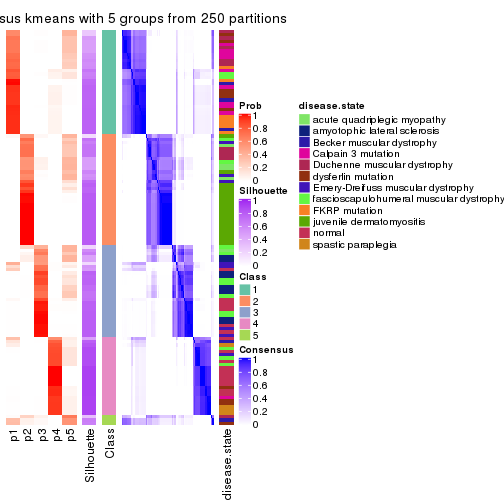</p>

</div>
<div id='tab-ATC-kmeans-consensus-heatmap-5'>
<pre><code class="r">consensus_heatmap(res, k = 6)
</code></pre>

<p></p>

</div>
</div>

Heatmaps for the membership of samples in all partitions to see how consistent they are:


<script>
$( function() {
	$( '#tabs-ATC-kmeans-membership-heatmap' ).tabs();
} );
</script>
<div id='tabs-ATC-kmeans-membership-heatmap'>
<ul>
<li><a href='#tab-ATC-kmeans-membership-heatmap-1'>k = 2</a></li>
<li><a href='#tab-ATC-kmeans-membership-heatmap-2'>k = 3</a></li>
<li><a href='#tab-ATC-kmeans-membership-heatmap-3'>k = 4</a></li>
<li><a href='#tab-ATC-kmeans-membership-heatmap-4'>k = 5</a></li>
<li><a href='#tab-ATC-kmeans-membership-heatmap-5'>k = 6</a></li>
</ul>
<div id='tab-ATC-kmeans-membership-heatmap-1'>
<pre><code class="r">membership_heatmap(res, k = 2)
</code></pre>

<p></p>

</div>
<div id='tab-ATC-kmeans-membership-heatmap-2'>
<pre><code class="r">membership_heatmap(res, k = 3)
</code></pre>

<p></p>

</div>
<div id='tab-ATC-kmeans-membership-heatmap-3'>
<pre><code class="r">membership_heatmap(res, k = 4)
</code></pre>

<p></p>

</div>
<div id='tab-ATC-kmeans-membership-heatmap-4'>
<pre><code class="r">membership_heatmap(res, k = 5)
</code></pre>

<p></p>

</div>
<div id='tab-ATC-kmeans-membership-heatmap-5'>
<pre><code class="r">membership_heatmap(res, k = 6)
</code></pre>

<p></p>

</div>
</div>

As soon as we have had the classes for columns, we can look for signatures
which are significantly different between classes which can be candidate marks
for certain classes. Following are the heatmaps for signatures.


Signature heatmaps where rows are scaled:


<script>
$( function() {
	$( '#tabs-ATC-kmeans-get-signatures' ).tabs();
} );
</script>
<div id='tabs-ATC-kmeans-get-signatures'>
<ul>
<li><a href='#tab-ATC-kmeans-get-signatures-1'>k = 2</a></li>
<li><a href='#tab-ATC-kmeans-get-signatures-2'>k = 3</a></li>
<li><a href='#tab-ATC-kmeans-get-signatures-3'>k = 4</a></li>
<li><a href='#tab-ATC-kmeans-get-signatures-4'>k = 5</a></li>
<li><a href='#tab-ATC-kmeans-get-signatures-5'>k = 6</a></li>
</ul>
<div id='tab-ATC-kmeans-get-signatures-1'>
<pre><code class="r">get_signatures(res, k = 2)
</code></pre>

<p></p>

</div>
<div id='tab-ATC-kmeans-get-signatures-2'>
<pre><code class="r">get_signatures(res, k = 3)
</code></pre>

<p></p>

</div>
<div id='tab-ATC-kmeans-get-signatures-3'>
<pre><code class="r">get_signatures(res, k = 4)
</code></pre>

<p></p>

</div>
<div id='tab-ATC-kmeans-get-signatures-4'>
<pre><code class="r">get_signatures(res, k = 5)
</code></pre>

<p></p>

</div>
<div id='tab-ATC-kmeans-get-signatures-5'>
<pre><code class="r">get_signatures(res, k = 6)
</code></pre>

<p></p>

</div>
</div>


Signature heatmaps where rows are not scaled:


<script>
$( function() {
	$( '#tabs-ATC-kmeans-get-signatures-no-scale' ).tabs();
} );
</script>
<div id='tabs-ATC-kmeans-get-signatures-no-scale'>
<ul>
<li><a href='#tab-ATC-kmeans-get-signatures-no-scale-1'>k = 2</a></li>
<li><a href='#tab-ATC-kmeans-get-signatures-no-scale-2'>k = 3</a></li>
<li><a href='#tab-ATC-kmeans-get-signatures-no-scale-3'>k = 4</a></li>
<li><a href='#tab-ATC-kmeans-get-signatures-no-scale-4'>k = 5</a></li>
<li><a href='#tab-ATC-kmeans-get-signatures-no-scale-5'>k = 6</a></li>
</ul>
<div id='tab-ATC-kmeans-get-signatures-no-scale-1'>
<pre><code class="r">get_signatures(res, k = 2, scale_rows = FALSE)
</code></pre>

<p></p>

</div>
<div id='tab-ATC-kmeans-get-signatures-no-scale-2'>
<pre><code class="r">get_signatures(res, k = 3, scale_rows = FALSE)
</code></pre>

<p></p>

</div>
<div id='tab-ATC-kmeans-get-signatures-no-scale-3'>
<pre><code class="r">get_signatures(res, k = 4, scale_rows = FALSE)
</code></pre>

<p></p>

</div>
<div id='tab-ATC-kmeans-get-signatures-no-scale-4'>
<pre><code class="r">get_signatures(res, k = 5, scale_rows = FALSE)
</code></pre>

<p></p>

</div>
<div id='tab-ATC-kmeans-get-signatures-no-scale-5'>
<pre><code class="r">get_signatures(res, k = 6, scale_rows = FALSE)
</code></pre>

<p></p>

</div>
</div>


Compare the overlap of signatures from different k:

```r
compare_signatures(res)
```


`get_signature()` returns a data frame invisibly. TO get the list of signatures, the function
call should be assigned to a variable explicitly. In following code, if `plot` argument is set
to `FALSE`, no heatmap is plotted while only the differential analysis is performed.

```r
# code only for demonstration
tb = get_signature(res, k = ..., plot = FALSE)
```

An example of the output of `tb` is:

```
#>   which_row         fdr    mean_1    mean_2 scaled_mean_1 scaled_mean_2 km
#> 1        38 0.042760348  8.373488  9.131774    -0.5533452     0.5164555  1
#> 2        40 0.018707592  7.106213  8.469186    -0.6173731     0.5762149  1
#> 3        55 0.019134737 10.221463 11.207825    -0.6159697     0.5749050  1
#> 4        59 0.006059896  5.921854  7.869574    -0.6899429     0.6439467  1
#> 5        60 0.018055526  8.928898 10.211722    -0.6204761     0.5791110  1
#> 6        98 0.009384629 15.714769 14.887706     0.6635654    -0.6193277  2
...
```

The columns in `tb` are:

1. `which_row`: row indices corresponding to the input matrix.
2. `fdr`: FDR for the differential test. 
3. `mean_x`: The mean value in group x.
4. `scaled_mean_x`: The mean value in group x after rows are scaled.
5. `km`: Row groups if k-means clustering is applied to rows.


UMAP plot which shows how samples are separated.


<script>
$( function() {
	$( '#tabs-ATC-kmeans-dimension-reduction' ).tabs();
} );
</script>
<div id='tabs-ATC-kmeans-dimension-reduction'>
<ul>
<li><a href='#tab-ATC-kmeans-dimension-reduction-1'>k = 2</a></li>
<li><a href='#tab-ATC-kmeans-dimension-reduction-2'>k = 3</a></li>
<li><a href='#tab-ATC-kmeans-dimension-reduction-3'>k = 4</a></li>
<li><a href='#tab-ATC-kmeans-dimension-reduction-4'>k = 5</a></li>
<li><a href='#tab-ATC-kmeans-dimension-reduction-5'>k = 6</a></li>
</ul>
<div id='tab-ATC-kmeans-dimension-reduction-1'>
<pre><code class="r">dimension_reduction(res, k = 2, method = &quot;UMAP&quot;)
</code></pre>

<p></p>

</div>
<div id='tab-ATC-kmeans-dimension-reduction-2'>
<pre><code class="r">dimension_reduction(res, k = 3, method = &quot;UMAP&quot;)
</code></pre>

<p></p>

</div>
<div id='tab-ATC-kmeans-dimension-reduction-3'>
<pre><code class="r">dimension_reduction(res, k = 4, method = &quot;UMAP&quot;)
</code></pre>

<p></p>

</div>
<div id='tab-ATC-kmeans-dimension-reduction-4'>
<pre><code class="r">dimension_reduction(res, k = 5, method = &quot;UMAP&quot;)
</code></pre>

<p></p>

</div>
<div id='tab-ATC-kmeans-dimension-reduction-5'>
<pre><code class="r">dimension_reduction(res, k = 6, method = &quot;UMAP&quot;)
</code></pre>

<p>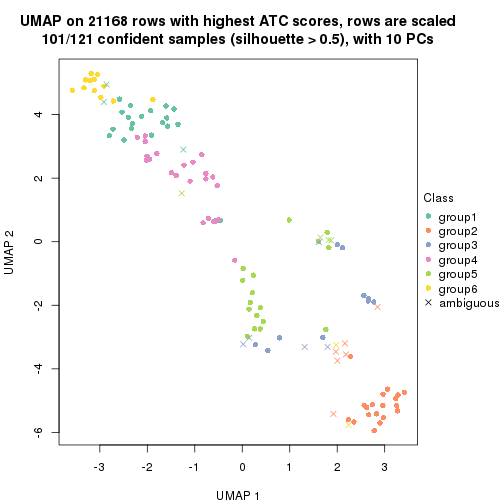</p>

</div>
</div>


Following heatmap shows how subgroups are split when increasing `k`:

```r
collect_classes(res)
```


Test correlation between subgroups and known annotations. If the known
annotation is numeric, one-way ANOVA test is applied, and if the known
annotation is discrete, chi-squared contingency table test is applied.

```r
test_to_known_factors(res)
```

```
#>              n disease.state(p) k
#> ATC:kmeans 121         1.03e-12 2
#> ATC:kmeans  71         1.25e-06 3
#> ATC:kmeans 116         7.41e-26 4
#> ATC:kmeans 103         2.03e-20 5
#> ATC:kmeans 101         1.16e-28 6
```


If matrix rows can be associated to genes, consider to use `GO_Enrichment(res,
...)` to perform function enrichment for the signature genes.


 

---------------------------------------------------


### ATC:skmeans**


The object with results only for a single top-value method and a single partition method 
can be extracted as:

```r
res = res_list["ATC", "skmeans"]
# you can also extract it by
# res = res_list["ATC:skmeans"]
```

A summary of `res` and all the functions that can be applied to it:

```r
res
```

```
#> A 'ConsensusPartition' object with k = 2, 3, 4, 5, 6.
#>   On a matrix with 21168 rows and 121 columns.
#>   Top rows (1000, 2000, 3000, 4000, 5000) are extracted by 'ATC' method.
#>   Subgroups are detected by 'skmeans' method.
#>   Performed in total 1250 partitions by row resampling.
#>   Best k for subgroups seems to be 4.
#> 
#> Following methods can be applied to this 'ConsensusPartition' object:
#>  [1] "cola_report"             "collect_classes"         "collect_plots"          
#>  [4] "collect_stats"           "colnames"                "compare_signatures"     
#>  [7] "consensus_heatmap"       "dimension_reduction"     "functional_enrichment"  
#> [10] "get_anno_col"            "get_anno"                "get_classes"            
#> [13] "get_consensus"           "get_matrix"              "get_membership"         
#> [16] "get_param"               "get_signatures"          "get_stats"              
#> [19] "is_best_k"               "is_stable_k"             "membership_heatmap"     
#> [22] "ncol"                    "nrow"                    "plot_ecdf"              
#> [25] "rownames"                "select_partition_number" "show"                   
#> [28] "suggest_best_k"          "test_to_known_factors"
```

`collect_plots()` function collects all the plots made from `res` for all `k` (number of partitions)
into one single page to provide an easy and fast comparison between different `k`.

```r
collect_plots(res)
```


The plots are:

- The first row: a plot of the ECDF (Empirical cumulative distribution
  function) curves of the consensus matrix for each `k` and the heatmap of
  predicted classes for each `k`.
- The second row: heatmaps of the consensus matrix for each `k`.
- The third row: heatmaps of the membership matrix for each `k`.
- The fouth row: heatmaps of the signatures for each `k`.

All the plots in panels can be made by individual functions and they are
plotted later in this section.

`select_partition_number()` produces several plots showing different
statistics for choosing "optimized" `k`. There are following statistics:

- ECDF curves of the consensus matrix for each `k`;
- 1-PAC. [The PAC
  score](https://en.wikipedia.org/wiki/Consensus_clustering#Over-interpretation_potential_of_consensus_clustering)
  measures the proportion of the ambiguous subgrouping.
- Mean silhouette score.
- Concordance. The mean probability of fiting the consensus class ids in all
  partitions.
- Area increased. Denote $A_k$ as the area under the ECDF curve for current
  `k`, the area increased is defined as $A_k - A_{k-1}$.
- Rand index. The percent of pairs of samples that are both in a same cluster
  or both are not in a same cluster in the partition of k and k-1.
- Jaccard index. The ratio of pairs of samples are both in a same cluster in
  the partition of k and k-1 and the pairs of samples are both in a same
  cluster in the partition k or k-1.

The detailed explanations of these statistics can be found in [the cola
vignette](http://bioconductor.org/packages/devel/bioc/vignettes/cola/inst/doc/cola.html#toc_13).

Generally speaking, lower PAC score, higher mean silhouette score or higher
concordance corresponds to better partition. Rand index and Jaccard index
measure how similar the current partition is compared to partition with `k-1`.
If they are too similar, we won't accept `k` is better than `k-1`.

```r
select_partition_number(res)
```


The numeric values for all these statistics can be obtained by `get_stats()`.

```r
get_stats(res)
```

```
#>   k 1-PAC mean_silhouette concordance area_increased  Rand Jaccard
#> 2 2 0.983           0.956       0.983         0.5043 0.496   0.496
#> 3 3 0.922           0.939       0.971         0.2572 0.822   0.658
#> 4 4 0.968           0.952       0.981         0.1201 0.895   0.724
#> 5 5 0.812           0.743       0.862         0.0702 0.946   0.820
#> 6 6 0.776           0.762       0.832         0.0549 0.890   0.597
```

`suggest_best_k()` suggests the best $k$ based on these statistics. The rules are as follows:

- All $k$ with Jaccard index larger than 0.95 are removed because the increase of
  the partition number does not provides enough extra information. If all $k$ are removed,
  the best $k$ is assigned by `NA`.
- For $k$ with 1-PAC larger than 0.9, the maximal $k$ is taken as the "best k". Other $k$ is called "optional k".
- If it does not fit the second rule. The $k$ with the highest vote of highest
  1-PAC, mean silhouette and concordance is taken as the "best k".

```r
suggest_best_k(res)
```

```
#> [1] 4
#> attr(,"optional")
#> [1] 2 3
```

There is also optional best $k$ = 2 3 that is worth to check.

Following shows the table of the partitions (You need to click the **show/hide
code output** link to see it). The membership matrix (columns with name `p*`)
is inferred by
[`clue::cl_consensus()`](https://www.rdocumentation.org/link/cl_consensus?package=clue)
function with the `SE` method. Basically the value in the membership matrix
represents the probability to belong to a certain group. The finall class
label for an item is determined with the group with highest probability it
belongs to.

In `get_classes()` function, the entropy is calculated from the membership
matrix and the silhouette score is calculated from the consensus matrix.


<script>
$( function() {
	$( '#tabs-ATC-skmeans-get-classes' ).tabs();
} );
</script>
<div id='tabs-ATC-skmeans-get-classes'>
<ul>
<li><a href='#tab-ATC-skmeans-get-classes-1'>k = 2</a></li>
<li><a href='#tab-ATC-skmeans-get-classes-2'>k = 3</a></li>
<li><a href='#tab-ATC-skmeans-get-classes-3'>k = 4</a></li>
<li><a href='#tab-ATC-skmeans-get-classes-4'>k = 5</a></li>
<li><a href='#tab-ATC-skmeans-get-classes-5'>k = 6</a></li>
</ul>

<div id='tab-ATC-skmeans-get-classes-1'>
<p><a id='tab-ATC-skmeans-get-classes-1-a' style='color:#0366d6' href='#'>show/hide code output</a></p>
<pre><code class="r">cbind(get_classes(res, k = 2), get_membership(res, k = 2))
</code></pre>

<pre><code>#&gt;           class entropy silhouette    p1    p2
#&gt; GSM74356      1  0.8713     0.5731 0.708 0.292
#&gt; GSM74357      1  0.0000     0.9889 1.000 0.000
#&gt; GSM74358      1  0.0000     0.9889 1.000 0.000
#&gt; GSM74359      1  0.0000     0.9889 1.000 0.000
#&gt; GSM74360      1  0.0000     0.9889 1.000 0.000
#&gt; GSM74361      2  0.9522     0.4200 0.372 0.628
#&gt; GSM74362      1  0.0000     0.9889 1.000 0.000
#&gt; GSM74363      2  0.9996     0.0635 0.488 0.512
#&gt; GSM74402      1  0.0000     0.9889 1.000 0.000
#&gt; GSM74403      1  0.0000     0.9889 1.000 0.000
#&gt; GSM74404      1  0.0000     0.9889 1.000 0.000
#&gt; GSM74406      1  0.0000     0.9889 1.000 0.000
#&gt; GSM74407      1  0.0000     0.9889 1.000 0.000
#&gt; GSM74408      1  0.0000     0.9889 1.000 0.000
#&gt; GSM74409      1  0.0000     0.9889 1.000 0.000
#&gt; GSM74410      1  0.0000     0.9889 1.000 0.000
#&gt; GSM119936     1  0.0000     0.9889 1.000 0.000
#&gt; GSM119937     1  0.0000     0.9889 1.000 0.000
#&gt; GSM74411      2  0.0000     0.9744 0.000 1.000
#&gt; GSM74412      2  0.0000     0.9744 0.000 1.000
#&gt; GSM74413      2  0.0000     0.9744 0.000 1.000
#&gt; GSM74414      2  0.0000     0.9744 0.000 1.000
#&gt; GSM74415      2  0.0000     0.9744 0.000 1.000
#&gt; GSM121379     2  0.0000     0.9744 0.000 1.000
#&gt; GSM121380     2  0.0000     0.9744 0.000 1.000
#&gt; GSM121381     2  0.0000     0.9744 0.000 1.000
#&gt; GSM121382     2  0.0000     0.9744 0.000 1.000
#&gt; GSM121383     2  0.0000     0.9744 0.000 1.000
#&gt; GSM121384     2  0.0000     0.9744 0.000 1.000
#&gt; GSM121385     2  0.0000     0.9744 0.000 1.000
#&gt; GSM121386     2  0.0000     0.9744 0.000 1.000
#&gt; GSM121387     2  0.0000     0.9744 0.000 1.000
#&gt; GSM121388     2  0.0000     0.9744 0.000 1.000
#&gt; GSM121389     2  0.0000     0.9744 0.000 1.000
#&gt; GSM121390     2  0.0000     0.9744 0.000 1.000
#&gt; GSM121391     2  0.0000     0.9744 0.000 1.000
#&gt; GSM121392     2  0.0000     0.9744 0.000 1.000
#&gt; GSM121393     2  0.0000     0.9744 0.000 1.000
#&gt; GSM121394     2  0.0000     0.9744 0.000 1.000
#&gt; GSM121395     2  0.0000     0.9744 0.000 1.000
#&gt; GSM121396     2  0.0000     0.9744 0.000 1.000
#&gt; GSM121397     2  0.0000     0.9744 0.000 1.000
#&gt; GSM121398     2  0.0000     0.9744 0.000 1.000
#&gt; GSM121399     2  0.0000     0.9744 0.000 1.000
#&gt; GSM74240      2  0.0000     0.9744 0.000 1.000
#&gt; GSM74241      2  0.0000     0.9744 0.000 1.000
#&gt; GSM74242      2  0.0000     0.9744 0.000 1.000
#&gt; GSM74243      2  0.0000     0.9744 0.000 1.000
#&gt; GSM74244      2  0.0000     0.9744 0.000 1.000
#&gt; GSM74245      2  0.0000     0.9744 0.000 1.000
#&gt; GSM74246      2  0.0000     0.9744 0.000 1.000
#&gt; GSM74247      2  0.0000     0.9744 0.000 1.000
#&gt; GSM74248      2  0.0000     0.9744 0.000 1.000
#&gt; GSM74416      1  0.0000     0.9889 1.000 0.000
#&gt; GSM74417      1  0.0000     0.9889 1.000 0.000
#&gt; GSM74418      1  0.0000     0.9889 1.000 0.000
#&gt; GSM74419      1  0.0000     0.9889 1.000 0.000
#&gt; GSM121358     2  0.0000     0.9744 0.000 1.000
#&gt; GSM121359     2  0.0000     0.9744 0.000 1.000
#&gt; GSM121360     1  0.0000     0.9889 1.000 0.000
#&gt; GSM121362     1  0.0000     0.9889 1.000 0.000
#&gt; GSM121364     1  0.0000     0.9889 1.000 0.000
#&gt; GSM121365     2  0.0000     0.9744 0.000 1.000
#&gt; GSM121366     2  0.0000     0.9744 0.000 1.000
#&gt; GSM121367     2  0.0000     0.9744 0.000 1.000
#&gt; GSM121370     2  0.0000     0.9744 0.000 1.000
#&gt; GSM121371     2  0.0000     0.9744 0.000 1.000
#&gt; GSM121372     2  0.0000     0.9744 0.000 1.000
#&gt; GSM121373     1  0.0000     0.9889 1.000 0.000
#&gt; GSM121374     1  0.0000     0.9889 1.000 0.000
#&gt; GSM121407     2  0.0000     0.9744 0.000 1.000
#&gt; GSM74387      2  0.0000     0.9744 0.000 1.000
#&gt; GSM74388      2  0.0000     0.9744 0.000 1.000
#&gt; GSM74389      2  0.9608     0.3898 0.384 0.616
#&gt; GSM74390      2  0.0000     0.9744 0.000 1.000
#&gt; GSM74391      1  0.0000     0.9889 1.000 0.000
#&gt; GSM74392      1  0.0000     0.9889 1.000 0.000
#&gt; GSM74393      1  0.0000     0.9889 1.000 0.000
#&gt; GSM74394      2  0.0000     0.9744 0.000 1.000
#&gt; GSM74239      1  0.0000     0.9889 1.000 0.000
#&gt; GSM74364      1  0.0000     0.9889 1.000 0.000
#&gt; GSM74365      1  0.0000     0.9889 1.000 0.000
#&gt; GSM74366      2  0.0000     0.9744 0.000 1.000
#&gt; GSM74367      1  0.0000     0.9889 1.000 0.000
#&gt; GSM74377      1  0.0000     0.9889 1.000 0.000
#&gt; GSM74378      2  0.0000     0.9744 0.000 1.000
#&gt; GSM74379      1  0.0000     0.9889 1.000 0.000
#&gt; GSM74380      1  0.0000     0.9889 1.000 0.000
#&gt; GSM74381      1  0.6438     0.7984 0.836 0.164
#&gt; GSM121357     2  0.0000     0.9744 0.000 1.000
#&gt; GSM121361     2  0.0000     0.9744 0.000 1.000
#&gt; GSM121363     2  0.0000     0.9744 0.000 1.000
#&gt; GSM121368     2  0.0000     0.9744 0.000 1.000
#&gt; GSM121369     2  0.0000     0.9744 0.000 1.000
#&gt; GSM74368      1  0.0000     0.9889 1.000 0.000
#&gt; GSM74369      1  0.0000     0.9889 1.000 0.000
#&gt; GSM74370      1  0.0000     0.9889 1.000 0.000
#&gt; GSM74371      1  0.0000     0.9889 1.000 0.000
#&gt; GSM74372      1  0.0000     0.9889 1.000 0.000
#&gt; GSM74373      1  0.0000     0.9889 1.000 0.000
#&gt; GSM74374      1  0.0000     0.9889 1.000 0.000
#&gt; GSM74375      1  0.0000     0.9889 1.000 0.000
#&gt; GSM74376      1  0.6623     0.7869 0.828 0.172
#&gt; GSM74405      1  0.0672     0.9813 0.992 0.008
#&gt; GSM74351      1  0.0000     0.9889 1.000 0.000
#&gt; GSM74352      1  0.0000     0.9889 1.000 0.000
#&gt; GSM74353      1  0.0000     0.9889 1.000 0.000
#&gt; GSM74354      1  0.0000     0.9889 1.000 0.000
#&gt; GSM74355      2  0.7815     0.6892 0.232 0.768
#&gt; GSM74382      1  0.0000     0.9889 1.000 0.000
#&gt; GSM74383      1  0.0000     0.9889 1.000 0.000
#&gt; GSM74384      2  0.0000     0.9744 0.000 1.000
#&gt; GSM74385      1  0.0000     0.9889 1.000 0.000
#&gt; GSM74386      1  0.0000     0.9889 1.000 0.000
#&gt; GSM74395      1  0.0000     0.9889 1.000 0.000
#&gt; GSM74396      1  0.0000     0.9889 1.000 0.000
#&gt; GSM74397      1  0.0000     0.9889 1.000 0.000
#&gt; GSM74398      1  0.0000     0.9889 1.000 0.000
#&gt; GSM74399      1  0.0000     0.9889 1.000 0.000
#&gt; GSM74400      1  0.0000     0.9889 1.000 0.000
#&gt; GSM74401      1  0.0000     0.9889 1.000 0.000
</code></pre>

<script>
$('#tab-ATC-skmeans-get-classes-1-a').parent().next().next().hide();
$('#tab-ATC-skmeans-get-classes-1-a').click(function(){
  $('#tab-ATC-skmeans-get-classes-1-a').parent().next().next().toggle();
  return(false);
});
</script>
</div>

<div id='tab-ATC-skmeans-get-classes-2'>
<p><a id='tab-ATC-skmeans-get-classes-2-a' style='color:#0366d6' href='#'>show/hide code output</a></p>
<pre><code class="r">cbind(get_classes(res, k = 3), get_membership(res, k = 3))
</code></pre>

<pre><code>#&gt;           class entropy silhouette    p1    p2    p3
#&gt; GSM74356      3  0.0592      0.939 0.012 0.000 0.988
#&gt; GSM74357      3  0.0592      0.939 0.012 0.000 0.988
#&gt; GSM74358      3  0.0592      0.939 0.012 0.000 0.988
#&gt; GSM74359      1  0.0237      0.987 0.996 0.000 0.004
#&gt; GSM74360      1  0.0237      0.987 0.996 0.000 0.004
#&gt; GSM74361      3  0.0592      0.939 0.012 0.000 0.988
#&gt; GSM74362      3  0.3619      0.829 0.136 0.000 0.864
#&gt; GSM74363      3  0.0592      0.939 0.012 0.000 0.988
#&gt; GSM74402      1  0.0237      0.987 0.996 0.000 0.004
#&gt; GSM74403      1  0.0237      0.987 0.996 0.000 0.004
#&gt; GSM74404      1  0.0237      0.987 0.996 0.000 0.004
#&gt; GSM74406      1  0.0237      0.987 0.996 0.000 0.004
#&gt; GSM74407      3  0.6280      0.171 0.460 0.000 0.540
#&gt; GSM74408      1  0.0237      0.987 0.996 0.000 0.004
#&gt; GSM74409      1  0.0237      0.987 0.996 0.000 0.004
#&gt; GSM74410      1  0.0237      0.987 0.996 0.000 0.004
#&gt; GSM119936     1  0.0237      0.987 0.996 0.000 0.004
#&gt; GSM119937     1  0.0237      0.987 0.996 0.000 0.004
#&gt; GSM74411      2  0.0000      0.957 0.000 1.000 0.000
#&gt; GSM74412      2  0.0000      0.957 0.000 1.000 0.000
#&gt; GSM74413      2  0.0000      0.957 0.000 1.000 0.000
#&gt; GSM74414      2  0.0000      0.957 0.000 1.000 0.000
#&gt; GSM74415      2  0.4796      0.727 0.000 0.780 0.220
#&gt; GSM121379     2  0.0000      0.957 0.000 1.000 0.000
#&gt; GSM121380     2  0.0000      0.957 0.000 1.000 0.000
#&gt; GSM121381     2  0.0000      0.957 0.000 1.000 0.000
#&gt; GSM121382     2  0.0000      0.957 0.000 1.000 0.000
#&gt; GSM121383     2  0.0000      0.957 0.000 1.000 0.000
#&gt; GSM121384     2  0.0000      0.957 0.000 1.000 0.000
#&gt; GSM121385     2  0.0000      0.957 0.000 1.000 0.000
#&gt; GSM121386     2  0.0000      0.957 0.000 1.000 0.000
#&gt; GSM121387     2  0.0000      0.957 0.000 1.000 0.000
#&gt; GSM121388     2  0.0000      0.957 0.000 1.000 0.000
#&gt; GSM121389     2  0.0000      0.957 0.000 1.000 0.000
#&gt; GSM121390     2  0.0000      0.957 0.000 1.000 0.000
#&gt; GSM121391     2  0.0000      0.957 0.000 1.000 0.000
#&gt; GSM121392     2  0.0000      0.957 0.000 1.000 0.000
#&gt; GSM121393     2  0.0000      0.957 0.000 1.000 0.000
#&gt; GSM121394     2  0.0000      0.957 0.000 1.000 0.000
#&gt; GSM121395     2  0.0000      0.957 0.000 1.000 0.000
#&gt; GSM121396     2  0.2959      0.869 0.000 0.900 0.100
#&gt; GSM121397     2  0.0000      0.957 0.000 1.000 0.000
#&gt; GSM121398     2  0.0000      0.957 0.000 1.000 0.000
#&gt; GSM121399     2  0.0000      0.957 0.000 1.000 0.000
#&gt; GSM74240      3  0.2261      0.917 0.000 0.068 0.932
#&gt; GSM74241      3  0.2356      0.914 0.000 0.072 0.928
#&gt; GSM74242      3  0.0592      0.942 0.000 0.012 0.988
#&gt; GSM74243      3  0.0592      0.942 0.000 0.012 0.988
#&gt; GSM74244      3  0.2356      0.914 0.000 0.072 0.928
#&gt; GSM74245      3  0.0747      0.943 0.000 0.016 0.984
#&gt; GSM74246      2  0.4842      0.722 0.000 0.776 0.224
#&gt; GSM74247      2  0.4842      0.722 0.000 0.776 0.224
#&gt; GSM74248      3  0.0747      0.943 0.000 0.016 0.984
#&gt; GSM74416      1  0.0237      0.987 0.996 0.000 0.004
#&gt; GSM74417      1  0.0237      0.987 0.996 0.000 0.004
#&gt; GSM74418      1  0.0237      0.987 0.996 0.000 0.004
#&gt; GSM74419      1  0.0237      0.987 0.996 0.000 0.004
#&gt; GSM121358     3  0.0747      0.943 0.000 0.016 0.984
#&gt; GSM121359     2  0.4842      0.722 0.000 0.776 0.224
#&gt; GSM121360     1  0.0000      0.987 1.000 0.000 0.000
#&gt; GSM121362     1  0.0237      0.987 0.996 0.000 0.004
#&gt; GSM121364     1  0.0237      0.987 0.996 0.000 0.004
#&gt; GSM121365     3  0.0747      0.943 0.000 0.016 0.984
#&gt; GSM121366     3  0.2959      0.888 0.000 0.100 0.900
#&gt; GSM121367     3  0.0747      0.943 0.000 0.016 0.984
#&gt; GSM121370     3  0.2959      0.888 0.000 0.100 0.900
#&gt; GSM121371     3  0.0747      0.943 0.000 0.016 0.984
#&gt; GSM121372     2  0.4796      0.727 0.000 0.780 0.220
#&gt; GSM121373     1  0.0237      0.987 0.996 0.000 0.004
#&gt; GSM121374     1  0.0237      0.987 0.996 0.000 0.004
#&gt; GSM121407     2  0.0000      0.957 0.000 1.000 0.000
#&gt; GSM74387      2  0.0000      0.957 0.000 1.000 0.000
#&gt; GSM74388      2  0.0000      0.957 0.000 1.000 0.000
#&gt; GSM74389      3  0.0592      0.939 0.012 0.000 0.988
#&gt; GSM74390      3  0.1529      0.933 0.000 0.040 0.960
#&gt; GSM74391      1  0.0237      0.987 0.996 0.000 0.004
#&gt; GSM74392      1  0.0237      0.987 0.996 0.000 0.004
#&gt; GSM74393      1  0.0892      0.973 0.980 0.000 0.020
#&gt; GSM74394      2  0.0000      0.957 0.000 1.000 0.000
#&gt; GSM74239      1  0.0000      0.987 1.000 0.000 0.000
#&gt; GSM74364      1  0.0000      0.987 1.000 0.000 0.000
#&gt; GSM74365      1  0.0424      0.982 0.992 0.000 0.008
#&gt; GSM74366      2  0.0661      0.948 0.004 0.988 0.008
#&gt; GSM74367      1  0.0000      0.987 1.000 0.000 0.000
#&gt; GSM74377      1  0.0592      0.980 0.988 0.000 0.012
#&gt; GSM74378      2  0.0829      0.945 0.004 0.984 0.012
#&gt; GSM74379      1  0.0592      0.980 0.988 0.000 0.012
#&gt; GSM74380      1  0.0592      0.980 0.988 0.000 0.012
#&gt; GSM74381      2  0.4634      0.754 0.164 0.824 0.012
#&gt; GSM121357     2  0.0000      0.957 0.000 1.000 0.000
#&gt; GSM121361     2  0.0000      0.957 0.000 1.000 0.000
#&gt; GSM121363     2  0.0000      0.957 0.000 1.000 0.000
#&gt; GSM121368     2  0.0000      0.957 0.000 1.000 0.000
#&gt; GSM121369     2  0.0000      0.957 0.000 1.000 0.000
#&gt; GSM74368      1  0.0000      0.987 1.000 0.000 0.000
#&gt; GSM74369      1  0.0000      0.987 1.000 0.000 0.000
#&gt; GSM74370      1  0.0000      0.987 1.000 0.000 0.000
#&gt; GSM74371      1  0.0000      0.987 1.000 0.000 0.000
#&gt; GSM74372      1  0.0000      0.987 1.000 0.000 0.000
#&gt; GSM74373      1  0.0592      0.980 0.988 0.000 0.012
#&gt; GSM74374      1  0.0000      0.987 1.000 0.000 0.000
#&gt; GSM74375      1  0.0592      0.980 0.988 0.000 0.012
#&gt; GSM74376      2  0.5406      0.665 0.224 0.764 0.012
#&gt; GSM74405      1  0.4915      0.752 0.804 0.184 0.012
#&gt; GSM74351      1  0.0237      0.987 0.996 0.000 0.004
#&gt; GSM74352      1  0.5493      0.682 0.756 0.232 0.012
#&gt; GSM74353      1  0.0000      0.987 1.000 0.000 0.000
#&gt; GSM74354      1  0.0000      0.987 1.000 0.000 0.000
#&gt; GSM74355      2  0.0829      0.945 0.004 0.984 0.012
#&gt; GSM74382      1  0.0237      0.987 0.996 0.000 0.004
#&gt; GSM74383      1  0.0000      0.987 1.000 0.000 0.000
#&gt; GSM74384      2  0.0829      0.945 0.004 0.984 0.012
#&gt; GSM74385      1  0.0000      0.987 1.000 0.000 0.000
#&gt; GSM74386      1  0.0000      0.987 1.000 0.000 0.000
#&gt; GSM74395      1  0.0000      0.987 1.000 0.000 0.000
#&gt; GSM74396      1  0.0000      0.987 1.000 0.000 0.000
#&gt; GSM74397      1  0.0000      0.987 1.000 0.000 0.000
#&gt; GSM74398      1  0.0592      0.980 0.988 0.000 0.012
#&gt; GSM74399      1  0.0592      0.980 0.988 0.000 0.012
#&gt; GSM74400      1  0.0000      0.987 1.000 0.000 0.000
#&gt; GSM74401      1  0.0000      0.987 1.000 0.000 0.000
</code></pre>

<script>
$('#tab-ATC-skmeans-get-classes-2-a').parent().next().next().hide();
$('#tab-ATC-skmeans-get-classes-2-a').click(function(){
  $('#tab-ATC-skmeans-get-classes-2-a').parent().next().next().toggle();
  return(false);
});
</script>
</div>

<div id='tab-ATC-skmeans-get-classes-3'>
<p><a id='tab-ATC-skmeans-get-classes-3-a' style='color:#0366d6' href='#'>show/hide code output</a></p>
<pre><code class="r">cbind(get_classes(res, k = 4), get_membership(res, k = 4))
</code></pre>

<pre><code>#&gt;           class entropy silhouette    p1    p2    p3    p4
#&gt; GSM74356      3  0.0000      0.935 0.000 0.000 1.000 0.000
#&gt; GSM74357      3  0.0000      0.935 0.000 0.000 1.000 0.000
#&gt; GSM74358      3  0.0000      0.935 0.000 0.000 1.000 0.000
#&gt; GSM74359      4  0.0000      0.980 0.000 0.000 0.000 1.000
#&gt; GSM74360      4  0.0000      0.980 0.000 0.000 0.000 1.000
#&gt; GSM74361      3  0.0000      0.935 0.000 0.000 1.000 0.000
#&gt; GSM74362      3  0.3219      0.742 0.000 0.000 0.836 0.164
#&gt; GSM74363      3  0.0000      0.935 0.000 0.000 1.000 0.000
#&gt; GSM74402      4  0.0000      0.980 0.000 0.000 0.000 1.000
#&gt; GSM74403      4  0.0000      0.980 0.000 0.000 0.000 1.000
#&gt; GSM74404      4  0.0000      0.980 0.000 0.000 0.000 1.000
#&gt; GSM74406      4  0.0000      0.980 0.000 0.000 0.000 1.000
#&gt; GSM74407      4  0.4967      0.151 0.000 0.000 0.452 0.548
#&gt; GSM74408      4  0.0000      0.980 0.000 0.000 0.000 1.000
#&gt; GSM74409      4  0.0000      0.980 0.000 0.000 0.000 1.000
#&gt; GSM74410      4  0.0000      0.980 0.000 0.000 0.000 1.000
#&gt; GSM119936     4  0.0000      0.980 0.000 0.000 0.000 1.000
#&gt; GSM119937     4  0.0000      0.980 0.000 0.000 0.000 1.000
#&gt; GSM74411      2  0.0000      1.000 0.000 1.000 0.000 0.000
#&gt; GSM74412      2  0.0000      1.000 0.000 1.000 0.000 0.000
#&gt; GSM74413      2  0.0000      1.000 0.000 1.000 0.000 0.000
#&gt; GSM74414      2  0.0000      1.000 0.000 1.000 0.000 0.000
#&gt; GSM74415      2  0.0000      1.000 0.000 1.000 0.000 0.000
#&gt; GSM121379     2  0.0000      1.000 0.000 1.000 0.000 0.000
#&gt; GSM121380     2  0.0000      1.000 0.000 1.000 0.000 0.000
#&gt; GSM121381     2  0.0000      1.000 0.000 1.000 0.000 0.000
#&gt; GSM121382     2  0.0000      1.000 0.000 1.000 0.000 0.000
#&gt; GSM121383     2  0.0000      1.000 0.000 1.000 0.000 0.000
#&gt; GSM121384     2  0.0000      1.000 0.000 1.000 0.000 0.000
#&gt; GSM121385     2  0.0000      1.000 0.000 1.000 0.000 0.000
#&gt; GSM121386     2  0.0000      1.000 0.000 1.000 0.000 0.000
#&gt; GSM121387     2  0.0000      1.000 0.000 1.000 0.000 0.000
#&gt; GSM121388     2  0.0000      1.000 0.000 1.000 0.000 0.000
#&gt; GSM121389     2  0.0000      1.000 0.000 1.000 0.000 0.000
#&gt; GSM121390     2  0.0000      1.000 0.000 1.000 0.000 0.000
#&gt; GSM121391     2  0.0000      1.000 0.000 1.000 0.000 0.000
#&gt; GSM121392     2  0.0000      1.000 0.000 1.000 0.000 0.000
#&gt; GSM121393     2  0.0000      1.000 0.000 1.000 0.000 0.000
#&gt; GSM121394     2  0.0000      1.000 0.000 1.000 0.000 0.000
#&gt; GSM121395     2  0.0000      1.000 0.000 1.000 0.000 0.000
#&gt; GSM121396     2  0.0000      1.000 0.000 1.000 0.000 0.000
#&gt; GSM121397     2  0.0000      1.000 0.000 1.000 0.000 0.000
#&gt; GSM121398     2  0.0000      1.000 0.000 1.000 0.000 0.000
#&gt; GSM121399     2  0.0000      1.000 0.000 1.000 0.000 0.000
#&gt; GSM74240      3  0.2647      0.857 0.000 0.120 0.880 0.000
#&gt; GSM74241      3  0.2704      0.854 0.000 0.124 0.876 0.000
#&gt; GSM74242      3  0.0000      0.935 0.000 0.000 1.000 0.000
#&gt; GSM74243      3  0.0000      0.935 0.000 0.000 1.000 0.000
#&gt; GSM74244      3  0.2704      0.854 0.000 0.124 0.876 0.000
#&gt; GSM74245      3  0.0336      0.932 0.000 0.008 0.992 0.000
#&gt; GSM74246      2  0.0188      0.996 0.000 0.996 0.004 0.000
#&gt; GSM74247      2  0.0188      0.996 0.000 0.996 0.004 0.000
#&gt; GSM74248      3  0.0000      0.935 0.000 0.000 1.000 0.000
#&gt; GSM74416      4  0.0000      0.980 0.000 0.000 0.000 1.000
#&gt; GSM74417      4  0.0000      0.980 0.000 0.000 0.000 1.000
#&gt; GSM74418      4  0.0000      0.980 0.000 0.000 0.000 1.000
#&gt; GSM74419      4  0.0000      0.980 0.000 0.000 0.000 1.000
#&gt; GSM121358     3  0.0000      0.935 0.000 0.000 1.000 0.000
#&gt; GSM121359     2  0.0000      1.000 0.000 1.000 0.000 0.000
#&gt; GSM121360     4  0.0000      0.980 0.000 0.000 0.000 1.000
#&gt; GSM121362     4  0.0000      0.980 0.000 0.000 0.000 1.000
#&gt; GSM121364     4  0.0000      0.980 0.000 0.000 0.000 1.000
#&gt; GSM121365     3  0.0000      0.935 0.000 0.000 1.000 0.000
#&gt; GSM121366     3  0.3486      0.781 0.000 0.188 0.812 0.000
#&gt; GSM121367     3  0.0000      0.935 0.000 0.000 1.000 0.000
#&gt; GSM121370     3  0.3444      0.787 0.000 0.184 0.816 0.000
#&gt; GSM121371     3  0.0000      0.935 0.000 0.000 1.000 0.000
#&gt; GSM121372     2  0.0000      1.000 0.000 1.000 0.000 0.000
#&gt; GSM121373     4  0.0000      0.980 0.000 0.000 0.000 1.000
#&gt; GSM121374     4  0.0000      0.980 0.000 0.000 0.000 1.000
#&gt; GSM121407     2  0.0000      1.000 0.000 1.000 0.000 0.000
#&gt; GSM74387      2  0.0000      1.000 0.000 1.000 0.000 0.000
#&gt; GSM74388      2  0.0000      1.000 0.000 1.000 0.000 0.000
#&gt; GSM74389      3  0.0000      0.935 0.000 0.000 1.000 0.000
#&gt; GSM74390      3  0.1557      0.904 0.000 0.056 0.944 0.000
#&gt; GSM74391      4  0.0000      0.980 0.000 0.000 0.000 1.000
#&gt; GSM74392      4  0.0000      0.980 0.000 0.000 0.000 1.000
#&gt; GSM74393      4  0.0000      0.980 0.000 0.000 0.000 1.000
#&gt; GSM74394      2  0.0000      1.000 0.000 1.000 0.000 0.000
#&gt; GSM74239      4  0.0000      0.980 0.000 0.000 0.000 1.000
#&gt; GSM74364      4  0.0000      0.980 0.000 0.000 0.000 1.000
#&gt; GSM74365      4  0.4830      0.332 0.392 0.000 0.000 0.608
#&gt; GSM74366      1  0.3569      0.712 0.804 0.196 0.000 0.000
#&gt; GSM74367      4  0.0000      0.980 0.000 0.000 0.000 1.000
#&gt; GSM74377      1  0.0000      0.954 1.000 0.000 0.000 0.000
#&gt; GSM74378      1  0.0000      0.954 1.000 0.000 0.000 0.000
#&gt; GSM74379      1  0.0000      0.954 1.000 0.000 0.000 0.000
#&gt; GSM74380      1  0.0000      0.954 1.000 0.000 0.000 0.000
#&gt; GSM74381      1  0.0000      0.954 1.000 0.000 0.000 0.000
#&gt; GSM121357     2  0.0000      1.000 0.000 1.000 0.000 0.000
#&gt; GSM121361     2  0.0000      1.000 0.000 1.000 0.000 0.000
#&gt; GSM121363     2  0.0000      1.000 0.000 1.000 0.000 0.000
#&gt; GSM121368     2  0.0000      1.000 0.000 1.000 0.000 0.000
#&gt; GSM121369     2  0.0000      1.000 0.000 1.000 0.000 0.000
#&gt; GSM74368      4  0.0000      0.980 0.000 0.000 0.000 1.000
#&gt; GSM74369      4  0.0000      0.980 0.000 0.000 0.000 1.000
#&gt; GSM74370      4  0.0000      0.980 0.000 0.000 0.000 1.000
#&gt; GSM74371      4  0.0000      0.980 0.000 0.000 0.000 1.000
#&gt; GSM74372      4  0.0000      0.980 0.000 0.000 0.000 1.000
#&gt; GSM74373      1  0.0000      0.954 1.000 0.000 0.000 0.000
#&gt; GSM74374      4  0.0000      0.980 0.000 0.000 0.000 1.000
#&gt; GSM74375      1  0.0000      0.954 1.000 0.000 0.000 0.000
#&gt; GSM74376      1  0.0000      0.954 1.000 0.000 0.000 0.000
#&gt; GSM74405      1  0.0000      0.954 1.000 0.000 0.000 0.000
#&gt; GSM74351      4  0.0000      0.980 0.000 0.000 0.000 1.000
#&gt; GSM74352      1  0.0000      0.954 1.000 0.000 0.000 0.000
#&gt; GSM74353      4  0.0000      0.980 0.000 0.000 0.000 1.000
#&gt; GSM74354      4  0.0000      0.980 0.000 0.000 0.000 1.000
#&gt; GSM74355      1  0.0000      0.954 1.000 0.000 0.000 0.000
#&gt; GSM74382      4  0.0000      0.980 0.000 0.000 0.000 1.000
#&gt; GSM74383      4  0.0000      0.980 0.000 0.000 0.000 1.000
#&gt; GSM74384      1  0.0000      0.954 1.000 0.000 0.000 0.000
#&gt; GSM74385      4  0.0000      0.980 0.000 0.000 0.000 1.000
#&gt; GSM74386      4  0.0000      0.980 0.000 0.000 0.000 1.000
#&gt; GSM74395      4  0.0000      0.980 0.000 0.000 0.000 1.000
#&gt; GSM74396      4  0.0000      0.980 0.000 0.000 0.000 1.000
#&gt; GSM74397      4  0.0000      0.980 0.000 0.000 0.000 1.000
#&gt; GSM74398      1  0.4331      0.582 0.712 0.000 0.000 0.288
#&gt; GSM74399      1  0.0000      0.954 1.000 0.000 0.000 0.000
#&gt; GSM74400      4  0.0000      0.980 0.000 0.000 0.000 1.000
#&gt; GSM74401      4  0.0000      0.980 0.000 0.000 0.000 1.000
</code></pre>

<script>
$('#tab-ATC-skmeans-get-classes-3-a').parent().next().next().hide();
$('#tab-ATC-skmeans-get-classes-3-a').click(function(){
  $('#tab-ATC-skmeans-get-classes-3-a').parent().next().next().toggle();
  return(false);
});
</script>
</div>

<div id='tab-ATC-skmeans-get-classes-4'>
<p><a id='tab-ATC-skmeans-get-classes-4-a' style='color:#0366d6' href='#'>show/hide code output</a></p>
<pre><code class="r">cbind(get_classes(res, k = 5), get_membership(res, k = 5))
</code></pre>

<pre><code>#&gt;           class entropy silhouette    p1    p2    p3    p4    p5
#&gt; GSM74356      5  0.3707    0.79074 0.000 0.000 0.284 0.000 0.716
#&gt; GSM74357      5  0.3707    0.79074 0.000 0.000 0.284 0.000 0.716
#&gt; GSM74358      5  0.3707    0.79074 0.000 0.000 0.284 0.000 0.716
#&gt; GSM74359      4  0.1732    0.80178 0.000 0.000 0.000 0.920 0.080
#&gt; GSM74360      4  0.0963    0.82572 0.000 0.000 0.000 0.964 0.036
#&gt; GSM74361      5  0.3707    0.79074 0.000 0.000 0.284 0.000 0.716
#&gt; GSM74362      5  0.3779    0.56005 0.000 0.000 0.012 0.236 0.752
#&gt; GSM74363      5  0.3707    0.79074 0.000 0.000 0.284 0.000 0.716
#&gt; GSM74402      4  0.1270    0.81757 0.000 0.000 0.000 0.948 0.052
#&gt; GSM74403      4  0.0162    0.83460 0.000 0.000 0.000 0.996 0.004
#&gt; GSM74404      4  0.0162    0.83460 0.000 0.000 0.000 0.996 0.004
#&gt; GSM74406      4  0.1341    0.81549 0.000 0.000 0.000 0.944 0.056
#&gt; GSM74407      4  0.4774    0.20299 0.000 0.000 0.028 0.612 0.360
#&gt; GSM74408      4  0.1341    0.81549 0.000 0.000 0.000 0.944 0.056
#&gt; GSM74409      4  0.1341    0.81549 0.000 0.000 0.000 0.944 0.056
#&gt; GSM74410      4  0.1341    0.81549 0.000 0.000 0.000 0.944 0.056
#&gt; GSM119936     4  0.1341    0.81549 0.000 0.000 0.000 0.944 0.056
#&gt; GSM119937     4  0.0162    0.83460 0.000 0.000 0.000 0.996 0.004
#&gt; GSM74411      2  0.4307    0.00215 0.000 0.504 0.496 0.000 0.000
#&gt; GSM74412      2  0.4219    0.26363 0.000 0.584 0.416 0.000 0.000
#&gt; GSM74413      2  0.4307    0.00215 0.000 0.504 0.496 0.000 0.000
#&gt; GSM74414      2  0.0000    0.93032 0.000 1.000 0.000 0.000 0.000
#&gt; GSM74415      3  0.4287    0.08779 0.000 0.460 0.540 0.000 0.000
#&gt; GSM121379     2  0.0000    0.93032 0.000 1.000 0.000 0.000 0.000
#&gt; GSM121380     2  0.0000    0.93032 0.000 1.000 0.000 0.000 0.000
#&gt; GSM121381     2  0.0000    0.93032 0.000 1.000 0.000 0.000 0.000
#&gt; GSM121382     2  0.0000    0.93032 0.000 1.000 0.000 0.000 0.000
#&gt; GSM121383     2  0.0000    0.93032 0.000 1.000 0.000 0.000 0.000
#&gt; GSM121384     2  0.0000    0.93032 0.000 1.000 0.000 0.000 0.000
#&gt; GSM121385     2  0.0000    0.93032 0.000 1.000 0.000 0.000 0.000
#&gt; GSM121386     2  0.0000    0.93032 0.000 1.000 0.000 0.000 0.000
#&gt; GSM121387     2  0.0000    0.93032 0.000 1.000 0.000 0.000 0.000
#&gt; GSM121388     2  0.0000    0.93032 0.000 1.000 0.000 0.000 0.000
#&gt; GSM121389     2  0.0000    0.93032 0.000 1.000 0.000 0.000 0.000
#&gt; GSM121390     2  0.0000    0.93032 0.000 1.000 0.000 0.000 0.000
#&gt; GSM121391     2  0.0000    0.93032 0.000 1.000 0.000 0.000 0.000
#&gt; GSM121392     2  0.0290    0.92660 0.008 0.992 0.000 0.000 0.000
#&gt; GSM121393     2  0.0290    0.92660 0.008 0.992 0.000 0.000 0.000
#&gt; GSM121394     2  0.0000    0.93032 0.000 1.000 0.000 0.000 0.000
#&gt; GSM121395     2  0.0000    0.93032 0.000 1.000 0.000 0.000 0.000
#&gt; GSM121396     2  0.2471    0.78551 0.000 0.864 0.136 0.000 0.000
#&gt; GSM121397     2  0.0000    0.93032 0.000 1.000 0.000 0.000 0.000
#&gt; GSM121398     2  0.0000    0.93032 0.000 1.000 0.000 0.000 0.000
#&gt; GSM121399     2  0.0000    0.93032 0.000 1.000 0.000 0.000 0.000
#&gt; GSM74240      3  0.0290    0.61989 0.000 0.008 0.992 0.000 0.000
#&gt; GSM74241      3  0.0290    0.61989 0.000 0.008 0.992 0.000 0.000
#&gt; GSM74242      3  0.4302   -0.35333 0.000 0.000 0.520 0.000 0.480
#&gt; GSM74243      3  0.4304   -0.36355 0.000 0.000 0.516 0.000 0.484
#&gt; GSM74244      3  0.0290    0.61989 0.000 0.008 0.992 0.000 0.000
#&gt; GSM74245      3  0.0000    0.61398 0.000 0.000 1.000 0.000 0.000
#&gt; GSM74246      3  0.3816    0.48298 0.000 0.304 0.696 0.000 0.000
#&gt; GSM74247      3  0.3816    0.48298 0.000 0.304 0.696 0.000 0.000
#&gt; GSM74248      3  0.0000    0.61398 0.000 0.000 1.000 0.000 0.000
#&gt; GSM74416      4  0.1341    0.84538 0.000 0.000 0.000 0.944 0.056
#&gt; GSM74417      4  0.1341    0.84538 0.000 0.000 0.000 0.944 0.056
#&gt; GSM74418      4  0.1341    0.84538 0.000 0.000 0.000 0.944 0.056
#&gt; GSM74419      4  0.1341    0.81549 0.000 0.000 0.000 0.944 0.056
#&gt; GSM121358     3  0.2074    0.53357 0.000 0.000 0.896 0.000 0.104
#&gt; GSM121359     3  0.4201    0.25368 0.000 0.408 0.592 0.000 0.000
#&gt; GSM121360     4  0.3395    0.83848 0.000 0.000 0.000 0.764 0.236
#&gt; GSM121362     4  0.1043    0.82746 0.000 0.000 0.000 0.960 0.040
#&gt; GSM121364     4  0.1732    0.80178 0.000 0.000 0.000 0.920 0.080
#&gt; GSM121365     3  0.4182   -0.13216 0.000 0.000 0.600 0.000 0.400
#&gt; GSM121366     3  0.0609    0.62060 0.000 0.020 0.980 0.000 0.000
#&gt; GSM121367     3  0.2773    0.45344 0.000 0.000 0.836 0.000 0.164
#&gt; GSM121370     3  0.0609    0.62060 0.000 0.020 0.980 0.000 0.000
#&gt; GSM121371     3  0.4060   -0.00581 0.000 0.000 0.640 0.000 0.360
#&gt; GSM121372     3  0.4045    0.37720 0.000 0.356 0.644 0.000 0.000
#&gt; GSM121373     4  0.0880    0.82747 0.000 0.000 0.000 0.968 0.032
#&gt; GSM121374     4  0.1732    0.80178 0.000 0.000 0.000 0.920 0.080
#&gt; GSM121407     2  0.0000    0.93032 0.000 1.000 0.000 0.000 0.000
#&gt; GSM74387      2  0.4030    0.42030 0.000 0.648 0.352 0.000 0.000
#&gt; GSM74388      2  0.0290    0.92660 0.008 0.992 0.000 0.000 0.000
#&gt; GSM74389      5  0.3730    0.78598 0.000 0.000 0.288 0.000 0.712
#&gt; GSM74390      3  0.2438    0.57573 0.000 0.040 0.900 0.000 0.060
#&gt; GSM74391      4  0.1410    0.81329 0.000 0.000 0.000 0.940 0.060
#&gt; GSM74392      4  0.1732    0.80178 0.000 0.000 0.000 0.920 0.080
#&gt; GSM74393      5  0.4227    0.34560 0.000 0.000 0.000 0.420 0.580
#&gt; GSM74394      2  0.0290    0.92660 0.008 0.992 0.000 0.000 0.000
#&gt; GSM74239      4  0.3452    0.83646 0.000 0.000 0.000 0.756 0.244
#&gt; GSM74364      4  0.3305    0.84055 0.000 0.000 0.000 0.776 0.224
#&gt; GSM74365      4  0.5909    0.66784 0.164 0.000 0.000 0.592 0.244
#&gt; GSM74366      1  0.3160    0.68059 0.808 0.188 0.000 0.000 0.004
#&gt; GSM74367      4  0.3452    0.83646 0.000 0.000 0.000 0.756 0.244
#&gt; GSM74377      1  0.0290    0.91233 0.992 0.000 0.000 0.000 0.008
#&gt; GSM74378      1  0.0162    0.91245 0.996 0.000 0.000 0.000 0.004
#&gt; GSM74379      1  0.1197    0.89279 0.952 0.000 0.000 0.000 0.048
#&gt; GSM74380      1  0.1121    0.89608 0.956 0.000 0.000 0.000 0.044
#&gt; GSM74381      1  0.0162    0.91245 0.996 0.000 0.000 0.000 0.004
#&gt; GSM121357     2  0.0000    0.93032 0.000 1.000 0.000 0.000 0.000
#&gt; GSM121361     2  0.0290    0.92660 0.008 0.992 0.000 0.000 0.000
#&gt; GSM121363     2  0.0290    0.92660 0.008 0.992 0.000 0.000 0.000
#&gt; GSM121368     2  0.0290    0.92660 0.008 0.992 0.000 0.000 0.000
#&gt; GSM121369     2  0.0290    0.92660 0.008 0.992 0.000 0.000 0.000
#&gt; GSM74368      4  0.3395    0.83858 0.000 0.000 0.000 0.764 0.236
#&gt; GSM74369      4  0.3395    0.83858 0.000 0.000 0.000 0.764 0.236
#&gt; GSM74370      4  0.3452    0.83646 0.000 0.000 0.000 0.756 0.244
#&gt; GSM74371      4  0.3274    0.84120 0.000 0.000 0.000 0.780 0.220
#&gt; GSM74372      4  0.3452    0.83646 0.000 0.000 0.000 0.756 0.244
#&gt; GSM74373      1  0.0609    0.91078 0.980 0.000 0.000 0.000 0.020
#&gt; GSM74374      4  0.3452    0.83646 0.000 0.000 0.000 0.756 0.244
#&gt; GSM74375      1  0.0609    0.91078 0.980 0.000 0.000 0.000 0.020
#&gt; GSM74376      1  0.0000    0.91253 1.000 0.000 0.000 0.000 0.000
#&gt; GSM74405      1  0.0162    0.91245 0.996 0.000 0.000 0.000 0.004
#&gt; GSM74351      4  0.1410    0.84568 0.000 0.000 0.000 0.940 0.060
#&gt; GSM74352      1  0.0000    0.91253 1.000 0.000 0.000 0.000 0.000
#&gt; GSM74353      4  0.3452    0.83646 0.000 0.000 0.000 0.756 0.244
#&gt; GSM74354      4  0.3452    0.83646 0.000 0.000 0.000 0.756 0.244
#&gt; GSM74355      1  0.0162    0.91245 0.996 0.000 0.000 0.000 0.004
#&gt; GSM74382      4  0.1341    0.84538 0.000 0.000 0.000 0.944 0.056
#&gt; GSM74383      4  0.3452    0.83646 0.000 0.000 0.000 0.756 0.244
#&gt; GSM74384      1  0.1205    0.87933 0.956 0.040 0.000 0.000 0.004
#&gt; GSM74385      4  0.3274    0.84120 0.000 0.000 0.000 0.780 0.220
#&gt; GSM74386      4  0.3452    0.83646 0.000 0.000 0.000 0.756 0.244
#&gt; GSM74395      4  0.3452    0.83646 0.000 0.000 0.000 0.756 0.244
#&gt; GSM74396      4  0.3452    0.83646 0.000 0.000 0.000 0.756 0.244
#&gt; GSM74397      4  0.3395    0.83865 0.000 0.000 0.000 0.764 0.236
#&gt; GSM74398      1  0.6410    0.09480 0.488 0.000 0.000 0.320 0.192
#&gt; GSM74399      1  0.0609    0.91078 0.980 0.000 0.000 0.000 0.020
#&gt; GSM74400      4  0.3452    0.83646 0.000 0.000 0.000 0.756 0.244
#&gt; GSM74401      4  0.3452    0.83646 0.000 0.000 0.000 0.756 0.244
</code></pre>

<script>
$('#tab-ATC-skmeans-get-classes-4-a').parent().next().next().hide();
$('#tab-ATC-skmeans-get-classes-4-a').click(function(){
  $('#tab-ATC-skmeans-get-classes-4-a').parent().next().next().toggle();
  return(false);
});
</script>
</div>

<div id='tab-ATC-skmeans-get-classes-5'>
<p><a id='tab-ATC-skmeans-get-classes-5-a' style='color:#0366d6' href='#'>show/hide code output</a></p>
<pre><code class="r">cbind(get_classes(res, k = 6), get_membership(res, k = 6))
</code></pre>

<pre><code>#&gt;           class entropy silhouette    p1    p2    p3    p4    p5    p6
#&gt; GSM74356      3  0.1124     0.8304 0.000 0.000 0.956 0.008 0.036 0.000
#&gt; GSM74357      3  0.1124     0.8304 0.000 0.000 0.956 0.008 0.036 0.000
#&gt; GSM74358      3  0.1124     0.8304 0.000 0.000 0.956 0.008 0.036 0.000
#&gt; GSM74359      4  0.3509     0.7944 0.240 0.000 0.016 0.744 0.000 0.000
#&gt; GSM74360      4  0.3470     0.7953 0.248 0.000 0.012 0.740 0.000 0.000
#&gt; GSM74361      3  0.1225     0.8300 0.000 0.000 0.952 0.012 0.036 0.000
#&gt; GSM74362      3  0.2135     0.7166 0.000 0.000 0.872 0.128 0.000 0.000
#&gt; GSM74363      3  0.1124     0.8304 0.000 0.000 0.956 0.008 0.036 0.000
#&gt; GSM74402      4  0.3728     0.8392 0.344 0.000 0.004 0.652 0.000 0.000
#&gt; GSM74403      4  0.3659     0.8276 0.364 0.000 0.000 0.636 0.000 0.000
#&gt; GSM74404      4  0.3659     0.8276 0.364 0.000 0.000 0.636 0.000 0.000
#&gt; GSM74406      4  0.3699     0.8428 0.336 0.000 0.004 0.660 0.000 0.000
#&gt; GSM74407      4  0.6074     0.5026 0.248 0.000 0.264 0.480 0.008 0.000
#&gt; GSM74408      4  0.3699     0.8428 0.336 0.000 0.004 0.660 0.000 0.000
#&gt; GSM74409      4  0.3699     0.8428 0.336 0.000 0.004 0.660 0.000 0.000
#&gt; GSM74410      4  0.3699     0.8428 0.336 0.000 0.004 0.660 0.000 0.000
#&gt; GSM119936     4  0.3699     0.8428 0.336 0.000 0.004 0.660 0.000 0.000
#&gt; GSM119937     4  0.3684     0.8215 0.372 0.000 0.000 0.628 0.000 0.000
#&gt; GSM74411      5  0.4060     0.5942 0.000 0.284 0.000 0.032 0.684 0.000
#&gt; GSM74412      5  0.4306     0.4879 0.000 0.344 0.000 0.032 0.624 0.000
#&gt; GSM74413      5  0.4040     0.5978 0.000 0.280 0.000 0.032 0.688 0.000
#&gt; GSM74414      2  0.2201     0.9133 0.000 0.912 0.012 0.048 0.024 0.004
#&gt; GSM74415      5  0.3658     0.6473 0.000 0.216 0.000 0.032 0.752 0.000
#&gt; GSM121379     2  0.0260     0.9406 0.000 0.992 0.000 0.000 0.008 0.000
#&gt; GSM121380     2  0.0000     0.9402 0.000 1.000 0.000 0.000 0.000 0.000
#&gt; GSM121381     2  0.0260     0.9406 0.000 0.992 0.000 0.000 0.008 0.000
#&gt; GSM121382     2  0.0260     0.9406 0.000 0.992 0.000 0.000 0.008 0.000
#&gt; GSM121383     2  0.0260     0.9406 0.000 0.992 0.000 0.000 0.008 0.000
#&gt; GSM121384     2  0.0000     0.9402 0.000 1.000 0.000 0.000 0.000 0.000
#&gt; GSM121385     2  0.0260     0.9406 0.000 0.992 0.000 0.000 0.008 0.000
#&gt; GSM121386     2  0.0260     0.9406 0.000 0.992 0.000 0.000 0.008 0.000
#&gt; GSM121387     2  0.0260     0.9406 0.000 0.992 0.000 0.000 0.008 0.000
#&gt; GSM121388     2  0.0665     0.9397 0.000 0.980 0.008 0.004 0.008 0.000
#&gt; GSM121389     2  0.0508     0.9371 0.000 0.984 0.012 0.004 0.000 0.000
#&gt; GSM121390     2  0.0837     0.9333 0.000 0.972 0.020 0.004 0.004 0.000
#&gt; GSM121391     2  0.0260     0.9406 0.000 0.992 0.000 0.000 0.008 0.000
#&gt; GSM121392     2  0.1381     0.9262 0.000 0.952 0.020 0.020 0.004 0.004
#&gt; GSM121393     2  0.1237     0.9275 0.000 0.956 0.020 0.020 0.004 0.000
#&gt; GSM121394     2  0.0260     0.9406 0.000 0.992 0.000 0.000 0.008 0.000
#&gt; GSM121395     2  0.0508     0.9371 0.000 0.984 0.012 0.004 0.000 0.000
#&gt; GSM121396     2  0.3183     0.6822 0.000 0.788 0.004 0.008 0.200 0.000
#&gt; GSM121397     2  0.0260     0.9406 0.000 0.992 0.000 0.000 0.008 0.000
#&gt; GSM121398     2  0.0260     0.9406 0.000 0.992 0.000 0.000 0.008 0.000
#&gt; GSM121399     2  0.0260     0.9406 0.000 0.992 0.000 0.000 0.008 0.000
#&gt; GSM74240      5  0.0713     0.6960 0.000 0.000 0.028 0.000 0.972 0.000
#&gt; GSM74241      5  0.0713     0.6960 0.000 0.000 0.028 0.000 0.972 0.000
#&gt; GSM74242      3  0.3670     0.6843 0.000 0.000 0.704 0.012 0.284 0.000
#&gt; GSM74243      3  0.3650     0.6880 0.000 0.000 0.708 0.012 0.280 0.000
#&gt; GSM74244      5  0.0713     0.6960 0.000 0.000 0.028 0.000 0.972 0.000
#&gt; GSM74245      5  0.0935     0.6941 0.000 0.000 0.032 0.004 0.964 0.000
#&gt; GSM74246      5  0.2398     0.7026 0.000 0.104 0.000 0.020 0.876 0.000
#&gt; GSM74247      5  0.2398     0.7026 0.000 0.104 0.000 0.020 0.876 0.000
#&gt; GSM74248      5  0.0935     0.6941 0.000 0.000 0.032 0.004 0.964 0.000
#&gt; GSM74416      4  0.3828     0.7339 0.440 0.000 0.000 0.560 0.000 0.000
#&gt; GSM74417      4  0.3828     0.7339 0.440 0.000 0.000 0.560 0.000 0.000
#&gt; GSM74418      4  0.3828     0.7339 0.440 0.000 0.000 0.560 0.000 0.000
#&gt; GSM74419      4  0.3699     0.8428 0.336 0.000 0.004 0.660 0.000 0.000
#&gt; GSM121358     5  0.5334     0.1494 0.000 0.000 0.320 0.128 0.552 0.000
#&gt; GSM121359     5  0.4750     0.6689 0.000 0.176 0.008 0.120 0.696 0.000
#&gt; GSM121360     1  0.3898     0.3581 0.652 0.000 0.012 0.336 0.000 0.000
#&gt; GSM121362     4  0.3729     0.7659 0.296 0.000 0.012 0.692 0.000 0.000
#&gt; GSM121364     4  0.3509     0.7944 0.240 0.000 0.016 0.744 0.000 0.000
#&gt; GSM121365     3  0.5289     0.4967 0.000 0.000 0.560 0.124 0.316 0.000
#&gt; GSM121366     5  0.3295     0.6446 0.000 0.000 0.056 0.128 0.816 0.000
#&gt; GSM121367     5  0.5462    -0.0548 0.000 0.000 0.376 0.128 0.496 0.000
#&gt; GSM121370     5  0.3295     0.6446 0.000 0.000 0.056 0.128 0.816 0.000
#&gt; GSM121371     3  0.5418     0.4178 0.000 0.000 0.520 0.128 0.352 0.000
#&gt; GSM121372     5  0.4449     0.6836 0.000 0.136 0.008 0.124 0.732 0.000
#&gt; GSM121373     4  0.3564     0.7929 0.264 0.000 0.012 0.724 0.000 0.000
#&gt; GSM121374     4  0.3420     0.7934 0.240 0.000 0.012 0.748 0.000 0.000
#&gt; GSM121407     2  0.1138     0.9320 0.000 0.960 0.004 0.012 0.024 0.000
#&gt; GSM74387      2  0.4556    -0.0314 0.000 0.516 0.008 0.020 0.456 0.000
#&gt; GSM74388      2  0.2651     0.9034 0.000 0.892 0.028 0.052 0.016 0.012
#&gt; GSM74389      3  0.1297     0.8295 0.000 0.000 0.948 0.012 0.040 0.000
#&gt; GSM74390      5  0.5948     0.3697 0.000 0.044 0.232 0.140 0.584 0.000
#&gt; GSM74391      4  0.3922     0.8378 0.320 0.000 0.016 0.664 0.000 0.000
#&gt; GSM74392      4  0.3509     0.7944 0.240 0.000 0.016 0.744 0.000 0.000
#&gt; GSM74393      4  0.4264     0.3464 0.032 0.000 0.332 0.636 0.000 0.000
#&gt; GSM74394      2  0.2651     0.9034 0.000 0.892 0.028 0.052 0.016 0.012
#&gt; GSM74239      1  0.1387     0.7998 0.932 0.000 0.000 0.068 0.000 0.000
#&gt; GSM74364      1  0.3050     0.5253 0.764 0.000 0.000 0.236 0.000 0.000
#&gt; GSM74365      1  0.1398     0.7564 0.940 0.000 0.000 0.008 0.000 0.052
#&gt; GSM74366      6  0.2889     0.7719 0.000 0.096 0.004 0.044 0.000 0.856
#&gt; GSM74367      1  0.0458     0.8253 0.984 0.000 0.000 0.016 0.000 0.000
#&gt; GSM74377      6  0.0725     0.8814 0.012 0.000 0.000 0.012 0.000 0.976
#&gt; GSM74378      6  0.0458     0.8798 0.000 0.000 0.000 0.016 0.000 0.984
#&gt; GSM74379      6  0.3797     0.7195 0.292 0.000 0.000 0.016 0.000 0.692
#&gt; GSM74380      6  0.3457     0.7805 0.232 0.000 0.000 0.016 0.000 0.752
#&gt; GSM74381      6  0.0603     0.8817 0.004 0.000 0.000 0.016 0.000 0.980
#&gt; GSM121357     2  0.1599     0.9247 0.000 0.940 0.008 0.028 0.024 0.000
#&gt; GSM121361     2  0.2651     0.9034 0.000 0.892 0.028 0.052 0.016 0.012
#&gt; GSM121363     2  0.2651     0.9034 0.000 0.892 0.028 0.052 0.016 0.012
#&gt; GSM121368     2  0.2738     0.9013 0.000 0.888 0.028 0.052 0.020 0.012
#&gt; GSM121369     2  0.2738     0.9013 0.000 0.888 0.028 0.052 0.020 0.012
#&gt; GSM74368      1  0.2562     0.6783 0.828 0.000 0.000 0.172 0.000 0.000
#&gt; GSM74369      1  0.2527     0.6824 0.832 0.000 0.000 0.168 0.000 0.000
#&gt; GSM74370      1  0.1267     0.8060 0.940 0.000 0.000 0.060 0.000 0.000
#&gt; GSM74371      1  0.3390     0.3250 0.704 0.000 0.000 0.296 0.000 0.000
#&gt; GSM74372      1  0.0291     0.8158 0.992 0.000 0.000 0.004 0.000 0.004
#&gt; GSM74373      6  0.2667     0.8455 0.128 0.000 0.000 0.020 0.000 0.852
#&gt; GSM74374      1  0.0260     0.8246 0.992 0.000 0.000 0.008 0.000 0.000
#&gt; GSM74375      6  0.3487     0.7877 0.224 0.000 0.000 0.020 0.000 0.756
#&gt; GSM74376      6  0.0146     0.8822 0.004 0.000 0.000 0.000 0.000 0.996
#&gt; GSM74405      6  0.0603     0.8817 0.004 0.000 0.000 0.016 0.000 0.980
#&gt; GSM74351      4  0.3847     0.7009 0.456 0.000 0.000 0.544 0.000 0.000
#&gt; GSM74352      6  0.0520     0.8821 0.008 0.000 0.000 0.008 0.000 0.984
#&gt; GSM74353      1  0.0713     0.8224 0.972 0.000 0.000 0.028 0.000 0.000
#&gt; GSM74354      1  0.0000     0.8210 1.000 0.000 0.000 0.000 0.000 0.000
#&gt; GSM74355      6  0.0603     0.8817 0.004 0.000 0.000 0.016 0.000 0.980
#&gt; GSM74382      4  0.3833     0.7263 0.444 0.000 0.000 0.556 0.000 0.000
#&gt; GSM74383      1  0.0363     0.8252 0.988 0.000 0.000 0.012 0.000 0.000
#&gt; GSM74384      6  0.1693     0.8527 0.000 0.020 0.004 0.044 0.000 0.932
#&gt; GSM74385      1  0.3288     0.4005 0.724 0.000 0.000 0.276 0.000 0.000
#&gt; GSM74386      1  0.0363     0.8233 0.988 0.000 0.000 0.012 0.000 0.000
#&gt; GSM74395      1  0.0458     0.8253 0.984 0.000 0.000 0.016 0.000 0.000
#&gt; GSM74396      1  0.1007     0.8156 0.956 0.000 0.000 0.044 0.000 0.000
#&gt; GSM74397      1  0.2527     0.6829 0.832 0.000 0.000 0.168 0.000 0.000
#&gt; GSM74398      1  0.3916     0.2810 0.680 0.000 0.000 0.020 0.000 0.300
#&gt; GSM74399      6  0.3088     0.8234 0.172 0.000 0.000 0.020 0.000 0.808
#&gt; GSM74400      1  0.0363     0.8188 0.988 0.000 0.000 0.012 0.000 0.000
#&gt; GSM74401      1  0.0260     0.8153 0.992 0.000 0.000 0.008 0.000 0.000
</code></pre>

<script>
$('#tab-ATC-skmeans-get-classes-5-a').parent().next().next().hide();
$('#tab-ATC-skmeans-get-classes-5-a').click(function(){
  $('#tab-ATC-skmeans-get-classes-5-a').parent().next().next().toggle();
  return(false);
});
</script>
</div>
</div>

Heatmaps for the consensus matrix. It visualizes the probability of two
samples to be in a same group.


<script>
$( function() {
	$( '#tabs-ATC-skmeans-consensus-heatmap' ).tabs();
} );
</script>
<div id='tabs-ATC-skmeans-consensus-heatmap'>
<ul>
<li><a href='#tab-ATC-skmeans-consensus-heatmap-1'>k = 2</a></li>
<li><a href='#tab-ATC-skmeans-consensus-heatmap-2'>k = 3</a></li>
<li><a href='#tab-ATC-skmeans-consensus-heatmap-3'>k = 4</a></li>
<li><a href='#tab-ATC-skmeans-consensus-heatmap-4'>k = 5</a></li>
<li><a href='#tab-ATC-skmeans-consensus-heatmap-5'>k = 6</a></li>
</ul>
<div id='tab-ATC-skmeans-consensus-heatmap-1'>
<pre><code class="r">consensus_heatmap(res, k = 2)
</code></pre>

<p></p>

</div>
<div id='tab-ATC-skmeans-consensus-heatmap-2'>
<pre><code class="r">consensus_heatmap(res, k = 3)
</code></pre>

<p></p>

</div>
<div id='tab-ATC-skmeans-consensus-heatmap-3'>
<pre><code class="r">consensus_heatmap(res, k = 4)
</code></pre>

<p></p>

</div>
<div id='tab-ATC-skmeans-consensus-heatmap-4'>
<pre><code class="r">consensus_heatmap(res, k = 5)
</code></pre>

<p></p>

</div>
<div id='tab-ATC-skmeans-consensus-heatmap-5'>
<pre><code class="r">consensus_heatmap(res, k = 6)
</code></pre>

<p></p>

</div>
</div>

Heatmaps for the membership of samples in all partitions to see how consistent they are:


<script>
$( function() {
	$( '#tabs-ATC-skmeans-membership-heatmap' ).tabs();
} );
</script>
<div id='tabs-ATC-skmeans-membership-heatmap'>
<ul>
<li><a href='#tab-ATC-skmeans-membership-heatmap-1'>k = 2</a></li>
<li><a href='#tab-ATC-skmeans-membership-heatmap-2'>k = 3</a></li>
<li><a href='#tab-ATC-skmeans-membership-heatmap-3'>k = 4</a></li>
<li><a href='#tab-ATC-skmeans-membership-heatmap-4'>k = 5</a></li>
<li><a href='#tab-ATC-skmeans-membership-heatmap-5'>k = 6</a></li>
</ul>
<div id='tab-ATC-skmeans-membership-heatmap-1'>
<pre><code class="r">membership_heatmap(res, k = 2)
</code></pre>

<p></p>

</div>
<div id='tab-ATC-skmeans-membership-heatmap-2'>
<pre><code class="r">membership_heatmap(res, k = 3)
</code></pre>

<p></p>

</div>
<div id='tab-ATC-skmeans-membership-heatmap-3'>
<pre><code class="r">membership_heatmap(res, k = 4)
</code></pre>

<p></p>

</div>
<div id='tab-ATC-skmeans-membership-heatmap-4'>
<pre><code class="r">membership_heatmap(res, k = 5)
</code></pre>

<p></p>

</div>
<div id='tab-ATC-skmeans-membership-heatmap-5'>
<pre><code class="r">membership_heatmap(res, k = 6)
</code></pre>

<p></p>

</div>
</div>

As soon as we have had the classes for columns, we can look for signatures
which are significantly different between classes which can be candidate marks
for certain classes. Following are the heatmaps for signatures.


Signature heatmaps where rows are scaled:


<script>
$( function() {
	$( '#tabs-ATC-skmeans-get-signatures' ).tabs();
} );
</script>
<div id='tabs-ATC-skmeans-get-signatures'>
<ul>
<li><a href='#tab-ATC-skmeans-get-signatures-1'>k = 2</a></li>
<li><a href='#tab-ATC-skmeans-get-signatures-2'>k = 3</a></li>
<li><a href='#tab-ATC-skmeans-get-signatures-3'>k = 4</a></li>
<li><a href='#tab-ATC-skmeans-get-signatures-4'>k = 5</a></li>
<li><a href='#tab-ATC-skmeans-get-signatures-5'>k = 6</a></li>
</ul>
<div id='tab-ATC-skmeans-get-signatures-1'>
<pre><code class="r">get_signatures(res, k = 2)
</code></pre>

<p></p>

</div>
<div id='tab-ATC-skmeans-get-signatures-2'>
<pre><code class="r">get_signatures(res, k = 3)
</code></pre>

<pre><code>#&gt; Error in mat[ceiling(1:nr/h_ratio), ceiling(1:nc/w_ratio), drop = FALSE]: subscript out of bounds
</code></pre>

<p></p>

</div>
<div id='tab-ATC-skmeans-get-signatures-3'>
<pre><code class="r">get_signatures(res, k = 4)
</code></pre>

<p></p>

</div>
<div id='tab-ATC-skmeans-get-signatures-4'>
<pre><code class="r">get_signatures(res, k = 5)
</code></pre>

<p></p>

</div>
<div id='tab-ATC-skmeans-get-signatures-5'>
<pre><code class="r">get_signatures(res, k = 6)
</code></pre>

<p></p>

</div>
</div>


Signature heatmaps where rows are not scaled:


<script>
$( function() {
	$( '#tabs-ATC-skmeans-get-signatures-no-scale' ).tabs();
} );
</script>
<div id='tabs-ATC-skmeans-get-signatures-no-scale'>
<ul>
<li><a href='#tab-ATC-skmeans-get-signatures-no-scale-1'>k = 2</a></li>
<li><a href='#tab-ATC-skmeans-get-signatures-no-scale-2'>k = 3</a></li>
<li><a href='#tab-ATC-skmeans-get-signatures-no-scale-3'>k = 4</a></li>
<li><a href='#tab-ATC-skmeans-get-signatures-no-scale-4'>k = 5</a></li>
<li><a href='#tab-ATC-skmeans-get-signatures-no-scale-5'>k = 6</a></li>
</ul>
<div id='tab-ATC-skmeans-get-signatures-no-scale-1'>
<pre><code class="r">get_signatures(res, k = 2, scale_rows = FALSE)
</code></pre>

<p></p>

</div>
<div id='tab-ATC-skmeans-get-signatures-no-scale-2'>
<pre><code class="r">get_signatures(res, k = 3, scale_rows = FALSE)
</code></pre>

<p></p>

</div>
<div id='tab-ATC-skmeans-get-signatures-no-scale-3'>
<pre><code class="r">get_signatures(res, k = 4, scale_rows = FALSE)
</code></pre>

<p></p>

</div>
<div id='tab-ATC-skmeans-get-signatures-no-scale-4'>
<pre><code class="r">get_signatures(res, k = 5, scale_rows = FALSE)
</code></pre>

<p>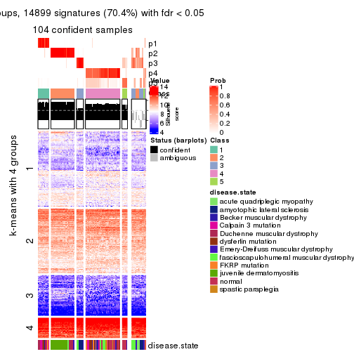</p>

</div>
<div id='tab-ATC-skmeans-get-signatures-no-scale-5'>
<pre><code class="r">get_signatures(res, k = 6, scale_rows = FALSE)
</code></pre>

<p></p>

</div>
</div>


Compare the overlap of signatures from different k:

```r
compare_signatures(res)
```


`get_signature()` returns a data frame invisibly. TO get the list of signatures, the function
call should be assigned to a variable explicitly. In following code, if `plot` argument is set
to `FALSE`, no heatmap is plotted while only the differential analysis is performed.

```r
# code only for demonstration
tb = get_signature(res, k = ..., plot = FALSE)
```

An example of the output of `tb` is:

```
#>   which_row         fdr    mean_1    mean_2 scaled_mean_1 scaled_mean_2 km
#> 1        38 0.042760348  8.373488  9.131774    -0.5533452     0.5164555  1
#> 2        40 0.018707592  7.106213  8.469186    -0.6173731     0.5762149  1
#> 3        55 0.019134737 10.221463 11.207825    -0.6159697     0.5749050  1
#> 4        59 0.006059896  5.921854  7.869574    -0.6899429     0.6439467  1
#> 5        60 0.018055526  8.928898 10.211722    -0.6204761     0.5791110  1
#> 6        98 0.009384629 15.714769 14.887706     0.6635654    -0.6193277  2
...
```

The columns in `tb` are:

1. `which_row`: row indices corresponding to the input matrix.
2. `fdr`: FDR for the differential test. 
3. `mean_x`: The mean value in group x.
4. `scaled_mean_x`: The mean value in group x after rows are scaled.
5. `km`: Row groups if k-means clustering is applied to rows.


UMAP plot which shows how samples are separated.


<script>
$( function() {
	$( '#tabs-ATC-skmeans-dimension-reduction' ).tabs();
} );
</script>
<div id='tabs-ATC-skmeans-dimension-reduction'>
<ul>
<li><a href='#tab-ATC-skmeans-dimension-reduction-1'>k = 2</a></li>
<li><a href='#tab-ATC-skmeans-dimension-reduction-2'>k = 3</a></li>
<li><a href='#tab-ATC-skmeans-dimension-reduction-3'>k = 4</a></li>
<li><a href='#tab-ATC-skmeans-dimension-reduction-4'>k = 5</a></li>
<li><a href='#tab-ATC-skmeans-dimension-reduction-5'>k = 6</a></li>
</ul>
<div id='tab-ATC-skmeans-dimension-reduction-1'>
<pre><code class="r">dimension_reduction(res, k = 2, method = &quot;UMAP&quot;)
</code></pre>

<p></p>

</div>
<div id='tab-ATC-skmeans-dimension-reduction-2'>
<pre><code class="r">dimension_reduction(res, k = 3, method = &quot;UMAP&quot;)
</code></pre>

<p></p>

</div>
<div id='tab-ATC-skmeans-dimension-reduction-3'>
<pre><code class="r">dimension_reduction(res, k = 4, method = &quot;UMAP&quot;)
</code></pre>

<p></p>

</div>
<div id='tab-ATC-skmeans-dimension-reduction-4'>
<pre><code class="r">dimension_reduction(res, k = 5, method = &quot;UMAP&quot;)
</code></pre>

<p></p>

</div>
<div id='tab-ATC-skmeans-dimension-reduction-5'>
<pre><code class="r">dimension_reduction(res, k = 6, method = &quot;UMAP&quot;)
</code></pre>

<p>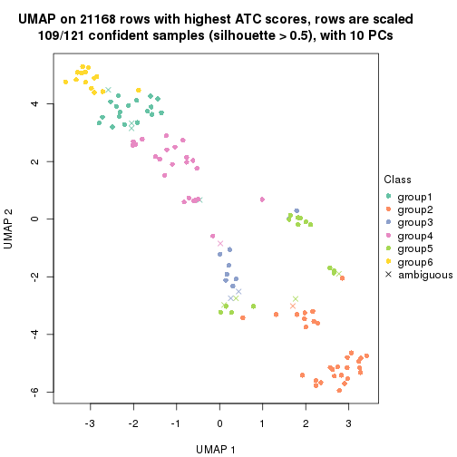</p>

</div>
</div>


Following heatmap shows how subgroups are split when increasing `k`:

```r
collect_classes(res)
```


Test correlation between subgroups and known annotations. If the known
annotation is numeric, one-way ANOVA test is applied, and if the known
annotation is discrete, chi-squared contingency table test is applied.

```r
test_to_known_factors(res)
```

```
#>               n disease.state(p) k
#> ATC:skmeans 118         2.26e-12 2
#> ATC:skmeans 120         2.66e-15 3
#> ATC:skmeans 119         3.26e-18 4
#> ATC:skmeans 104         7.19e-22 5
#> ATC:skmeans 109         2.94e-30 6
```


If matrix rows can be associated to genes, consider to use `GO_Enrichment(res,
...)` to perform function enrichment for the signature genes.


 

---------------------------------------------------


### ATC:pam*


The object with results only for a single top-value method and a single partition method 
can be extracted as:

```r
res = res_list["ATC", "pam"]
# you can also extract it by
# res = res_list["ATC:pam"]
```

A summary of `res` and all the functions that can be applied to it:

```r
res
```

```
#> A 'ConsensusPartition' object with k = 2, 3, 4, 5, 6.
#>   On a matrix with 21168 rows and 121 columns.
#>   Top rows (1000, 2000, 3000, 4000, 5000) are extracted by 'ATC' method.
#>   Subgroups are detected by 'pam' method.
#>   Performed in total 1250 partitions by row resampling.
#>   Best k for subgroups seems to be 6.
#> 
#> Following methods can be applied to this 'ConsensusPartition' object:
#>  [1] "cola_report"             "collect_classes"         "collect_plots"          
#>  [4] "collect_stats"           "colnames"                "compare_signatures"     
#>  [7] "consensus_heatmap"       "dimension_reduction"     "functional_enrichment"  
#> [10] "get_anno_col"            "get_anno"                "get_classes"            
#> [13] "get_consensus"           "get_matrix"              "get_membership"         
#> [16] "get_param"               "get_signatures"          "get_stats"              
#> [19] "is_best_k"               "is_stable_k"             "membership_heatmap"     
#> [22] "ncol"                    "nrow"                    "plot_ecdf"              
#> [25] "rownames"                "select_partition_number" "show"                   
#> [28] "suggest_best_k"          "test_to_known_factors"
```

`collect_plots()` function collects all the plots made from `res` for all `k` (number of partitions)
into one single page to provide an easy and fast comparison between different `k`.

```r
collect_plots(res)
```


The plots are:

- The first row: a plot of the ECDF (Empirical cumulative distribution
  function) curves of the consensus matrix for each `k` and the heatmap of
  predicted classes for each `k`.
- The second row: heatmaps of the consensus matrix for each `k`.
- The third row: heatmaps of the membership matrix for each `k`.
- The fouth row: heatmaps of the signatures for each `k`.

All the plots in panels can be made by individual functions and they are
plotted later in this section.

`select_partition_number()` produces several plots showing different
statistics for choosing "optimized" `k`. There are following statistics:

- ECDF curves of the consensus matrix for each `k`;
- 1-PAC. [The PAC
  score](https://en.wikipedia.org/wiki/Consensus_clustering#Over-interpretation_potential_of_consensus_clustering)
  measures the proportion of the ambiguous subgrouping.
- Mean silhouette score.
- Concordance. The mean probability of fiting the consensus class ids in all
  partitions.
- Area increased. Denote $A_k$ as the area under the ECDF curve for current
  `k`, the area increased is defined as $A_k - A_{k-1}$.
- Rand index. The percent of pairs of samples that are both in a same cluster
  or both are not in a same cluster in the partition of k and k-1.
- Jaccard index. The ratio of pairs of samples are both in a same cluster in
  the partition of k and k-1 and the pairs of samples are both in a same
  cluster in the partition k or k-1.

The detailed explanations of these statistics can be found in [the cola
vignette](http://bioconductor.org/packages/devel/bioc/vignettes/cola/inst/doc/cola.html#toc_13).

Generally speaking, lower PAC score, higher mean silhouette score or higher
concordance corresponds to better partition. Rand index and Jaccard index
measure how similar the current partition is compared to partition with `k-1`.
If they are too similar, we won't accept `k` is better than `k-1`.

```r
select_partition_number(res)
```


The numeric values for all these statistics can be obtained by `get_stats()`.

```r
get_stats(res)
```

```
#>   k 1-PAC mean_silhouette concordance area_increased  Rand Jaccard
#> 2 2 1.000           0.976       0.990         0.4990 0.504   0.504
#> 3 3 0.920           0.904       0.960         0.2810 0.806   0.634
#> 4 4 0.780           0.845       0.902         0.1619 0.844   0.596
#> 5 5 0.805           0.840       0.917         0.0699 0.879   0.582
#> 6 6 0.906           0.858       0.940         0.0391 0.963   0.820
```

`suggest_best_k()` suggests the best $k$ based on these statistics. The rules are as follows:

- All $k$ with Jaccard index larger than 0.95 are removed because the increase of
  the partition number does not provides enough extra information. If all $k$ are removed,
  the best $k$ is assigned by `NA`.
- For $k$ with 1-PAC larger than 0.9, the maximal $k$ is taken as the "best k". Other $k$ is called "optional k".
- If it does not fit the second rule. The $k$ with the highest vote of highest
  1-PAC, mean silhouette and concordance is taken as the "best k".

```r
suggest_best_k(res)
```

```
#> [1] 6
#> attr(,"optional")
#> [1] 2 3
```

There is also optional best $k$ = 2 3 that is worth to check.

Following shows the table of the partitions (You need to click the **show/hide
code output** link to see it). The membership matrix (columns with name `p*`)
is inferred by
[`clue::cl_consensus()`](https://www.rdocumentation.org/link/cl_consensus?package=clue)
function with the `SE` method. Basically the value in the membership matrix
represents the probability to belong to a certain group. The finall class
label for an item is determined with the group with highest probability it
belongs to.

In `get_classes()` function, the entropy is calculated from the membership
matrix and the silhouette score is calculated from the consensus matrix.


<script>
$( function() {
	$( '#tabs-ATC-pam-get-classes' ).tabs();
} );
</script>
<div id='tabs-ATC-pam-get-classes'>
<ul>
<li><a href='#tab-ATC-pam-get-classes-1'>k = 2</a></li>
<li><a href='#tab-ATC-pam-get-classes-2'>k = 3</a></li>
<li><a href='#tab-ATC-pam-get-classes-3'>k = 4</a></li>
<li><a href='#tab-ATC-pam-get-classes-4'>k = 5</a></li>
<li><a href='#tab-ATC-pam-get-classes-5'>k = 6</a></li>
</ul>

<div id='tab-ATC-pam-get-classes-1'>
<p><a id='tab-ATC-pam-get-classes-1-a' style='color:#0366d6' href='#'>show/hide code output</a></p>
<pre><code class="r">cbind(get_classes(res, k = 2), get_membership(res, k = 2))
</code></pre>

<pre><code>#&gt;           class entropy silhouette    p1    p2
#&gt; GSM74356      1  0.4022      0.907 0.920 0.080
#&gt; GSM74357      1  0.0376      0.980 0.996 0.004
#&gt; GSM74358      1  0.0376      0.980 0.996 0.004
#&gt; GSM74359      1  0.0000      0.982 1.000 0.000
#&gt; GSM74360      1  0.0000      0.982 1.000 0.000
#&gt; GSM74361      1  0.1184      0.969 0.984 0.016
#&gt; GSM74362      1  0.0000      0.982 1.000 0.000
#&gt; GSM74363      1  0.9909      0.226 0.556 0.444
#&gt; GSM74402      1  0.0000      0.982 1.000 0.000
#&gt; GSM74403      1  0.0000      0.982 1.000 0.000
#&gt; GSM74404      1  0.0000      0.982 1.000 0.000
#&gt; GSM74406      1  0.0000      0.982 1.000 0.000
#&gt; GSM74407      1  0.0000      0.982 1.000 0.000
#&gt; GSM74408      1  0.0000      0.982 1.000 0.000
#&gt; GSM74409      1  0.0000      0.982 1.000 0.000
#&gt; GSM74410      1  0.0000      0.982 1.000 0.000
#&gt; GSM119936     1  0.0000      0.982 1.000 0.000
#&gt; GSM119937     1  0.0000      0.982 1.000 0.000
#&gt; GSM74411      2  0.0000      1.000 0.000 1.000
#&gt; GSM74412      2  0.0000      1.000 0.000 1.000
#&gt; GSM74413      2  0.0000      1.000 0.000 1.000
#&gt; GSM74414      2  0.0000      1.000 0.000 1.000
#&gt; GSM74415      2  0.0000      1.000 0.000 1.000
#&gt; GSM121379     2  0.0000      1.000 0.000 1.000
#&gt; GSM121380     2  0.0000      1.000 0.000 1.000
#&gt; GSM121381     2  0.0000      1.000 0.000 1.000
#&gt; GSM121382     2  0.0000      1.000 0.000 1.000
#&gt; GSM121383     2  0.0000      1.000 0.000 1.000
#&gt; GSM121384     2  0.0000      1.000 0.000 1.000
#&gt; GSM121385     2  0.0000      1.000 0.000 1.000
#&gt; GSM121386     2  0.0000      1.000 0.000 1.000
#&gt; GSM121387     2  0.0000      1.000 0.000 1.000
#&gt; GSM121388     2  0.0000      1.000 0.000 1.000
#&gt; GSM121389     2  0.0000      1.000 0.000 1.000
#&gt; GSM121390     2  0.0000      1.000 0.000 1.000
#&gt; GSM121391     2  0.0000      1.000 0.000 1.000
#&gt; GSM121392     2  0.0000      1.000 0.000 1.000
#&gt; GSM121393     2  0.0000      1.000 0.000 1.000
#&gt; GSM121394     2  0.0000      1.000 0.000 1.000
#&gt; GSM121395     2  0.0000      1.000 0.000 1.000
#&gt; GSM121396     2  0.0000      1.000 0.000 1.000
#&gt; GSM121397     2  0.0000      1.000 0.000 1.000
#&gt; GSM121398     2  0.0000      1.000 0.000 1.000
#&gt; GSM121399     2  0.0000      1.000 0.000 1.000
#&gt; GSM74240      2  0.0000      1.000 0.000 1.000
#&gt; GSM74241      2  0.0000      1.000 0.000 1.000
#&gt; GSM74242      1  0.6531      0.799 0.832 0.168
#&gt; GSM74243      1  0.3733      0.915 0.928 0.072
#&gt; GSM74244      2  0.0000      1.000 0.000 1.000
#&gt; GSM74245      2  0.0000      1.000 0.000 1.000
#&gt; GSM74246      2  0.0000      1.000 0.000 1.000
#&gt; GSM74247      2  0.0000      1.000 0.000 1.000
#&gt; GSM74248      2  0.0000      1.000 0.000 1.000
#&gt; GSM74416      1  0.0000      0.982 1.000 0.000
#&gt; GSM74417      1  0.0000      0.982 1.000 0.000
#&gt; GSM74418      1  0.0000      0.982 1.000 0.000
#&gt; GSM74419      1  0.0000      0.982 1.000 0.000
#&gt; GSM121358     2  0.0000      1.000 0.000 1.000
#&gt; GSM121359     2  0.0000      1.000 0.000 1.000
#&gt; GSM121360     1  0.0000      0.982 1.000 0.000
#&gt; GSM121362     1  0.0000      0.982 1.000 0.000
#&gt; GSM121364     1  0.0000      0.982 1.000 0.000
#&gt; GSM121365     2  0.0000      1.000 0.000 1.000
#&gt; GSM121366     2  0.0000      1.000 0.000 1.000
#&gt; GSM121367     2  0.0000      1.000 0.000 1.000
#&gt; GSM121370     2  0.0000      1.000 0.000 1.000
#&gt; GSM121371     2  0.0000      1.000 0.000 1.000
#&gt; GSM121372     2  0.0000      1.000 0.000 1.000
#&gt; GSM121373     1  0.0000      0.982 1.000 0.000
#&gt; GSM121374     1  0.0000      0.982 1.000 0.000
#&gt; GSM121407     2  0.0000      1.000 0.000 1.000
#&gt; GSM74387      2  0.0000      1.000 0.000 1.000
#&gt; GSM74388      2  0.0000      1.000 0.000 1.000
#&gt; GSM74389      1  0.0376      0.980 0.996 0.004
#&gt; GSM74390      2  0.0000      1.000 0.000 1.000
#&gt; GSM74391      1  0.0000      0.982 1.000 0.000
#&gt; GSM74392      1  0.0000      0.982 1.000 0.000
#&gt; GSM74393      1  0.0000      0.982 1.000 0.000
#&gt; GSM74394      2  0.0000      1.000 0.000 1.000
#&gt; GSM74239      1  0.0000      0.982 1.000 0.000
#&gt; GSM74364      1  0.0000      0.982 1.000 0.000
#&gt; GSM74365      1  0.0000      0.982 1.000 0.000
#&gt; GSM74366      2  0.0000      1.000 0.000 1.000
#&gt; GSM74367      1  0.0000      0.982 1.000 0.000
#&gt; GSM74377      1  0.0000      0.982 1.000 0.000
#&gt; GSM74378      1  0.9580      0.397 0.620 0.380
#&gt; GSM74379      1  0.0000      0.982 1.000 0.000
#&gt; GSM74380      1  0.0000      0.982 1.000 0.000
#&gt; GSM74381      1  0.0376      0.980 0.996 0.004
#&gt; GSM121357     2  0.0000      1.000 0.000 1.000
#&gt; GSM121361     2  0.0000      1.000 0.000 1.000
#&gt; GSM121363     2  0.0000      1.000 0.000 1.000
#&gt; GSM121368     2  0.0000      1.000 0.000 1.000
#&gt; GSM121369     2  0.0000      1.000 0.000 1.000
#&gt; GSM74368      1  0.0000      0.982 1.000 0.000
#&gt; GSM74369      1  0.0000      0.982 1.000 0.000
#&gt; GSM74370      1  0.0000      0.982 1.000 0.000
#&gt; GSM74371      1  0.0000      0.982 1.000 0.000
#&gt; GSM74372      1  0.0000      0.982 1.000 0.000
#&gt; GSM74373      1  0.0000      0.982 1.000 0.000
#&gt; GSM74374      1  0.0000      0.982 1.000 0.000
#&gt; GSM74375      1  0.0000      0.982 1.000 0.000
#&gt; GSM74376      1  0.0376      0.980 0.996 0.004
#&gt; GSM74405      1  0.0000      0.982 1.000 0.000
#&gt; GSM74351      1  0.0000      0.982 1.000 0.000
#&gt; GSM74352      1  0.0376      0.980 0.996 0.004
#&gt; GSM74353      1  0.0000      0.982 1.000 0.000
#&gt; GSM74354      1  0.0000      0.982 1.000 0.000
#&gt; GSM74355      1  0.0376      0.980 0.996 0.004
#&gt; GSM74382      1  0.0000      0.982 1.000 0.000
#&gt; GSM74383      1  0.0000      0.982 1.000 0.000
#&gt; GSM74384      2  0.0000      1.000 0.000 1.000
#&gt; GSM74385      1  0.0000      0.982 1.000 0.000
#&gt; GSM74386      1  0.0000      0.982 1.000 0.000
#&gt; GSM74395      1  0.0000      0.982 1.000 0.000
#&gt; GSM74396      1  0.0000      0.982 1.000 0.000
#&gt; GSM74397      1  0.0000      0.982 1.000 0.000
#&gt; GSM74398      1  0.0000      0.982 1.000 0.000
#&gt; GSM74399      1  0.0000      0.982 1.000 0.000
#&gt; GSM74400      1  0.0000      0.982 1.000 0.000
#&gt; GSM74401      1  0.0000      0.982 1.000 0.000
</code></pre>

<script>
$('#tab-ATC-pam-get-classes-1-a').parent().next().next().hide();
$('#tab-ATC-pam-get-classes-1-a').click(function(){
  $('#tab-ATC-pam-get-classes-1-a').parent().next().next().toggle();
  return(false);
});
</script>
</div>

<div id='tab-ATC-pam-get-classes-2'>
<p><a id='tab-ATC-pam-get-classes-2-a' style='color:#0366d6' href='#'>show/hide code output</a></p>
<pre><code class="r">cbind(get_classes(res, k = 3), get_membership(res, k = 3))
</code></pre>

<pre><code>#&gt;           class entropy silhouette    p1    p2    p3
#&gt; GSM74356      3  0.0000     0.9214 0.000 0.000 1.000
#&gt; GSM74357      3  0.0000     0.9214 0.000 0.000 1.000
#&gt; GSM74358      3  0.0000     0.9214 0.000 0.000 1.000
#&gt; GSM74359      1  0.0000     0.9787 1.000 0.000 0.000
#&gt; GSM74360      1  0.0000     0.9787 1.000 0.000 0.000
#&gt; GSM74361      3  0.0000     0.9214 0.000 0.000 1.000
#&gt; GSM74362      3  0.4452     0.7042 0.192 0.000 0.808
#&gt; GSM74363      3  0.0000     0.9214 0.000 0.000 1.000
#&gt; GSM74402      1  0.0000     0.9787 1.000 0.000 0.000
#&gt; GSM74403      1  0.0000     0.9787 1.000 0.000 0.000
#&gt; GSM74404      1  0.0000     0.9787 1.000 0.000 0.000
#&gt; GSM74406      1  0.0000     0.9787 1.000 0.000 0.000
#&gt; GSM74407      1  0.4654     0.7400 0.792 0.000 0.208
#&gt; GSM74408      1  0.0000     0.9787 1.000 0.000 0.000
#&gt; GSM74409      1  0.0000     0.9787 1.000 0.000 0.000
#&gt; GSM74410      1  0.0000     0.9787 1.000 0.000 0.000
#&gt; GSM119936     1  0.0000     0.9787 1.000 0.000 0.000
#&gt; GSM119937     1  0.0000     0.9787 1.000 0.000 0.000
#&gt; GSM74411      3  0.6180     0.3451 0.000 0.416 0.584
#&gt; GSM74412      2  0.0747     0.9357 0.000 0.984 0.016
#&gt; GSM74413      3  0.2165     0.8803 0.000 0.064 0.936
#&gt; GSM74414      2  0.0000     0.9469 0.000 1.000 0.000
#&gt; GSM74415      3  0.0000     0.9214 0.000 0.000 1.000
#&gt; GSM121379     2  0.0000     0.9469 0.000 1.000 0.000
#&gt; GSM121380     2  0.0000     0.9469 0.000 1.000 0.000
#&gt; GSM121381     2  0.0000     0.9469 0.000 1.000 0.000
#&gt; GSM121382     2  0.0000     0.9469 0.000 1.000 0.000
#&gt; GSM121383     2  0.0000     0.9469 0.000 1.000 0.000
#&gt; GSM121384     2  0.0000     0.9469 0.000 1.000 0.000
#&gt; GSM121385     2  0.0000     0.9469 0.000 1.000 0.000
#&gt; GSM121386     2  0.0000     0.9469 0.000 1.000 0.000
#&gt; GSM121387     2  0.0000     0.9469 0.000 1.000 0.000
#&gt; GSM121388     2  0.1289     0.9244 0.000 0.968 0.032
#&gt; GSM121389     2  0.0000     0.9469 0.000 1.000 0.000
#&gt; GSM121390     2  0.0000     0.9469 0.000 1.000 0.000
#&gt; GSM121391     2  0.0000     0.9469 0.000 1.000 0.000
#&gt; GSM121392     2  0.0000     0.9469 0.000 1.000 0.000
#&gt; GSM121393     2  0.4605     0.7350 0.000 0.796 0.204
#&gt; GSM121394     2  0.0000     0.9469 0.000 1.000 0.000
#&gt; GSM121395     2  0.0000     0.9469 0.000 1.000 0.000
#&gt; GSM121396     3  0.6168     0.3559 0.000 0.412 0.588
#&gt; GSM121397     2  0.0000     0.9469 0.000 1.000 0.000
#&gt; GSM121398     2  0.0000     0.9469 0.000 1.000 0.000
#&gt; GSM121399     2  0.0000     0.9469 0.000 1.000 0.000
#&gt; GSM74240      3  0.0000     0.9214 0.000 0.000 1.000
#&gt; GSM74241      3  0.0000     0.9214 0.000 0.000 1.000
#&gt; GSM74242      3  0.0000     0.9214 0.000 0.000 1.000
#&gt; GSM74243      3  0.0000     0.9214 0.000 0.000 1.000
#&gt; GSM74244      3  0.0237     0.9193 0.000 0.004 0.996
#&gt; GSM74245      3  0.0000     0.9214 0.000 0.000 1.000
#&gt; GSM74246      3  0.2625     0.8640 0.000 0.084 0.916
#&gt; GSM74247      3  0.1860     0.8902 0.000 0.052 0.948
#&gt; GSM74248      3  0.0000     0.9214 0.000 0.000 1.000
#&gt; GSM74416      1  0.0000     0.9787 1.000 0.000 0.000
#&gt; GSM74417      1  0.0000     0.9787 1.000 0.000 0.000
#&gt; GSM74418      1  0.0000     0.9787 1.000 0.000 0.000
#&gt; GSM74419      1  0.0000     0.9787 1.000 0.000 0.000
#&gt; GSM121358     3  0.0000     0.9214 0.000 0.000 1.000
#&gt; GSM121359     3  0.4931     0.6921 0.000 0.232 0.768
#&gt; GSM121360     1  0.0237     0.9770 0.996 0.000 0.004
#&gt; GSM121362     1  0.1411     0.9539 0.964 0.000 0.036
#&gt; GSM121364     1  0.0000     0.9787 1.000 0.000 0.000
#&gt; GSM121365     3  0.0000     0.9214 0.000 0.000 1.000
#&gt; GSM121366     3  0.0237     0.9193 0.000 0.004 0.996
#&gt; GSM121367     3  0.0000     0.9214 0.000 0.000 1.000
#&gt; GSM121370     3  0.0000     0.9214 0.000 0.000 1.000
#&gt; GSM121371     3  0.0000     0.9214 0.000 0.000 1.000
#&gt; GSM121372     3  0.0592     0.9149 0.000 0.012 0.988
#&gt; GSM121373     1  0.0000     0.9787 1.000 0.000 0.000
#&gt; GSM121374     1  0.0000     0.9787 1.000 0.000 0.000
#&gt; GSM121407     2  0.3482     0.8245 0.000 0.872 0.128
#&gt; GSM74387      2  0.6309    -0.1183 0.000 0.504 0.496
#&gt; GSM74388      2  0.0000     0.9469 0.000 1.000 0.000
#&gt; GSM74389      3  0.0000     0.9214 0.000 0.000 1.000
#&gt; GSM74390      3  0.0000     0.9214 0.000 0.000 1.000
#&gt; GSM74391      1  0.1643     0.9474 0.956 0.000 0.044
#&gt; GSM74392      1  0.0000     0.9787 1.000 0.000 0.000
#&gt; GSM74393      1  0.6305     0.0823 0.516 0.000 0.484
#&gt; GSM74394      2  0.2356     0.8879 0.000 0.928 0.072
#&gt; GSM74239      1  0.0000     0.9787 1.000 0.000 0.000
#&gt; GSM74364      1  0.0000     0.9787 1.000 0.000 0.000
#&gt; GSM74365      1  0.0237     0.9770 0.996 0.000 0.004
#&gt; GSM74366      2  0.4750     0.7173 0.000 0.784 0.216
#&gt; GSM74367      1  0.0000     0.9787 1.000 0.000 0.000
#&gt; GSM74377      1  0.0237     0.9770 0.996 0.000 0.004
#&gt; GSM74378      1  0.5036     0.8191 0.832 0.120 0.048
#&gt; GSM74379      1  0.0237     0.9770 0.996 0.000 0.004
#&gt; GSM74380      1  0.0237     0.9770 0.996 0.000 0.004
#&gt; GSM74381      1  0.1643     0.9474 0.956 0.000 0.044
#&gt; GSM121357     3  0.6244     0.1853 0.000 0.440 0.560
#&gt; GSM121361     2  0.0000     0.9469 0.000 1.000 0.000
#&gt; GSM121363     2  0.0000     0.9469 0.000 1.000 0.000
#&gt; GSM121368     2  0.0000     0.9469 0.000 1.000 0.000
#&gt; GSM121369     3  0.4931     0.6767 0.000 0.232 0.768
#&gt; GSM74368      1  0.0237     0.9770 0.996 0.000 0.004
#&gt; GSM74369      1  0.0000     0.9787 1.000 0.000 0.000
#&gt; GSM74370      1  0.0000     0.9787 1.000 0.000 0.000
#&gt; GSM74371      1  0.0000     0.9787 1.000 0.000 0.000
#&gt; GSM74372      1  0.0000     0.9787 1.000 0.000 0.000
#&gt; GSM74373      1  0.0237     0.9770 0.996 0.000 0.004
#&gt; GSM74374      1  0.0000     0.9787 1.000 0.000 0.000
#&gt; GSM74375      1  0.0237     0.9770 0.996 0.000 0.004
#&gt; GSM74376      1  0.1753     0.9439 0.952 0.000 0.048
#&gt; GSM74405      1  0.1753     0.9439 0.952 0.000 0.048
#&gt; GSM74351      1  0.0000     0.9787 1.000 0.000 0.000
#&gt; GSM74352      1  0.1753     0.9441 0.952 0.000 0.048
#&gt; GSM74353      1  0.0000     0.9787 1.000 0.000 0.000
#&gt; GSM74354      1  0.0000     0.9787 1.000 0.000 0.000
#&gt; GSM74355      1  0.2261     0.9250 0.932 0.000 0.068
#&gt; GSM74382      1  0.0000     0.9787 1.000 0.000 0.000
#&gt; GSM74383      1  0.0000     0.9787 1.000 0.000 0.000
#&gt; GSM74384      2  0.6811     0.6461 0.064 0.716 0.220
#&gt; GSM74385      1  0.0000     0.9787 1.000 0.000 0.000
#&gt; GSM74386      1  0.0237     0.9770 0.996 0.000 0.004
#&gt; GSM74395      1  0.0000     0.9787 1.000 0.000 0.000
#&gt; GSM74396      1  0.0000     0.9787 1.000 0.000 0.000
#&gt; GSM74397      1  0.0000     0.9787 1.000 0.000 0.000
#&gt; GSM74398      1  0.0000     0.9787 1.000 0.000 0.000
#&gt; GSM74399      1  0.0237     0.9770 0.996 0.000 0.004
#&gt; GSM74400      1  0.0000     0.9787 1.000 0.000 0.000
#&gt; GSM74401      1  0.0000     0.9787 1.000 0.000 0.000
</code></pre>

<script>
$('#tab-ATC-pam-get-classes-2-a').parent().next().next().hide();
$('#tab-ATC-pam-get-classes-2-a').click(function(){
  $('#tab-ATC-pam-get-classes-2-a').parent().next().next().toggle();
  return(false);
});
</script>
</div>

<div id='tab-ATC-pam-get-classes-3'>
<p><a id='tab-ATC-pam-get-classes-3-a' style='color:#0366d6' href='#'>show/hide code output</a></p>
<pre><code class="r">cbind(get_classes(res, k = 4), get_membership(res, k = 4))
</code></pre>

<pre><code>#&gt;           class entropy silhouette    p1    p2    p3    p4
#&gt; GSM74356      3  0.0000      0.892 0.000 0.000 1.000 0.000
#&gt; GSM74357      3  0.0000      0.892 0.000 0.000 1.000 0.000
#&gt; GSM74358      3  0.0000      0.892 0.000 0.000 1.000 0.000
#&gt; GSM74359      4  0.3626      0.956 0.184 0.000 0.004 0.812
#&gt; GSM74360      4  0.4382      0.841 0.296 0.000 0.000 0.704
#&gt; GSM74361      3  0.0000      0.892 0.000 0.000 1.000 0.000
#&gt; GSM74362      3  0.1867      0.843 0.072 0.000 0.928 0.000
#&gt; GSM74363      3  0.0000      0.892 0.000 0.000 1.000 0.000
#&gt; GSM74402      4  0.3400      0.962 0.180 0.000 0.000 0.820
#&gt; GSM74403      4  0.3356      0.963 0.176 0.000 0.000 0.824
#&gt; GSM74404      4  0.3356      0.963 0.176 0.000 0.000 0.824
#&gt; GSM74406      4  0.3356      0.963 0.176 0.000 0.000 0.824
#&gt; GSM74407      3  0.4866      0.322 0.404 0.000 0.596 0.000
#&gt; GSM74408      4  0.3356      0.963 0.176 0.000 0.000 0.824
#&gt; GSM74409      4  0.3356      0.963 0.176 0.000 0.000 0.824
#&gt; GSM74410      4  0.3356      0.963 0.176 0.000 0.000 0.824
#&gt; GSM119936     4  0.3356      0.963 0.176 0.000 0.000 0.824
#&gt; GSM119937     4  0.4877      0.640 0.408 0.000 0.000 0.592
#&gt; GSM74411      3  0.5536      0.416 0.000 0.384 0.592 0.024
#&gt; GSM74412      2  0.1004      0.940 0.000 0.972 0.004 0.024
#&gt; GSM74413      3  0.1929      0.875 0.000 0.036 0.940 0.024
#&gt; GSM74414      2  0.3356      0.856 0.000 0.824 0.000 0.176
#&gt; GSM74415      3  0.0817      0.891 0.000 0.000 0.976 0.024
#&gt; GSM121379     2  0.0000      0.955 0.000 1.000 0.000 0.000
#&gt; GSM121380     2  0.0000      0.955 0.000 1.000 0.000 0.000
#&gt; GSM121381     2  0.0000      0.955 0.000 1.000 0.000 0.000
#&gt; GSM121382     2  0.0000      0.955 0.000 1.000 0.000 0.000
#&gt; GSM121383     2  0.0000      0.955 0.000 1.000 0.000 0.000
#&gt; GSM121384     2  0.0000      0.955 0.000 1.000 0.000 0.000
#&gt; GSM121385     2  0.0000      0.955 0.000 1.000 0.000 0.000
#&gt; GSM121386     2  0.0000      0.955 0.000 1.000 0.000 0.000
#&gt; GSM121387     2  0.0000      0.955 0.000 1.000 0.000 0.000
#&gt; GSM121388     2  0.0592      0.945 0.000 0.984 0.016 0.000
#&gt; GSM121389     2  0.0000      0.955 0.000 1.000 0.000 0.000
#&gt; GSM121390     2  0.0000      0.955 0.000 1.000 0.000 0.000
#&gt; GSM121391     2  0.0000      0.955 0.000 1.000 0.000 0.000
#&gt; GSM121392     2  0.0000      0.955 0.000 1.000 0.000 0.000
#&gt; GSM121393     2  0.3978      0.740 0.000 0.796 0.192 0.012
#&gt; GSM121394     2  0.0000      0.955 0.000 1.000 0.000 0.000
#&gt; GSM121395     2  0.0000      0.955 0.000 1.000 0.000 0.000
#&gt; GSM121396     3  0.4866      0.394 0.000 0.404 0.596 0.000
#&gt; GSM121397     2  0.0000      0.955 0.000 1.000 0.000 0.000
#&gt; GSM121398     2  0.0000      0.955 0.000 1.000 0.000 0.000
#&gt; GSM121399     2  0.0000      0.955 0.000 1.000 0.000 0.000
#&gt; GSM74240      3  0.0817      0.891 0.000 0.000 0.976 0.024
#&gt; GSM74241      3  0.0817      0.891 0.000 0.000 0.976 0.024
#&gt; GSM74242      3  0.0000      0.892 0.000 0.000 1.000 0.000
#&gt; GSM74243      3  0.0000      0.892 0.000 0.000 1.000 0.000
#&gt; GSM74244      3  0.0817      0.891 0.000 0.000 0.976 0.024
#&gt; GSM74245      3  0.0817      0.891 0.000 0.000 0.976 0.024
#&gt; GSM74246      3  0.2443      0.860 0.000 0.060 0.916 0.024
#&gt; GSM74247      3  0.2021      0.873 0.000 0.040 0.936 0.024
#&gt; GSM74248      3  0.0817      0.891 0.000 0.000 0.976 0.024
#&gt; GSM74416      4  0.3356      0.963 0.176 0.000 0.000 0.824
#&gt; GSM74417      4  0.3356      0.963 0.176 0.000 0.000 0.824
#&gt; GSM74418      4  0.3356      0.963 0.176 0.000 0.000 0.824
#&gt; GSM74419      1  0.5000     -0.418 0.504 0.000 0.000 0.496
#&gt; GSM121358     3  0.0000      0.892 0.000 0.000 1.000 0.000
#&gt; GSM121359     3  0.3907      0.691 0.000 0.232 0.768 0.000
#&gt; GSM121360     1  0.0000      0.881 1.000 0.000 0.000 0.000
#&gt; GSM121362     1  0.0921      0.868 0.972 0.000 0.028 0.000
#&gt; GSM121364     4  0.3356      0.963 0.176 0.000 0.000 0.824
#&gt; GSM121365     3  0.0000      0.892 0.000 0.000 1.000 0.000
#&gt; GSM121366     3  0.0817      0.891 0.000 0.000 0.976 0.024
#&gt; GSM121367     3  0.0188      0.892 0.000 0.000 0.996 0.004
#&gt; GSM121370     3  0.0817      0.891 0.000 0.000 0.976 0.024
#&gt; GSM121371     3  0.0000      0.892 0.000 0.000 1.000 0.000
#&gt; GSM121372     3  0.0817      0.891 0.000 0.000 0.976 0.024
#&gt; GSM121373     4  0.4008      0.905 0.244 0.000 0.000 0.756
#&gt; GSM121374     4  0.3444      0.960 0.184 0.000 0.000 0.816
#&gt; GSM121407     2  0.0817      0.939 0.000 0.976 0.024 0.000
#&gt; GSM74387      3  0.5620      0.338 0.000 0.416 0.560 0.024
#&gt; GSM74388      2  0.2973      0.875 0.000 0.856 0.000 0.144
#&gt; GSM74389      3  0.0000      0.892 0.000 0.000 1.000 0.000
#&gt; GSM74390      3  0.0188      0.891 0.004 0.000 0.996 0.000
#&gt; GSM74391      1  0.3991      0.743 0.832 0.000 0.120 0.048
#&gt; GSM74392      4  0.3444      0.960 0.184 0.000 0.000 0.816
#&gt; GSM74393      3  0.4877      0.305 0.408 0.000 0.592 0.000
#&gt; GSM74394      2  0.4832      0.808 0.000 0.768 0.056 0.176
#&gt; GSM74239      1  0.0336      0.875 0.992 0.000 0.000 0.008
#&gt; GSM74364      1  0.3266      0.665 0.832 0.000 0.000 0.168
#&gt; GSM74365      1  0.0000      0.881 1.000 0.000 0.000 0.000
#&gt; GSM74366      1  0.9109      0.393 0.480 0.160 0.184 0.176
#&gt; GSM74367      1  0.0000      0.881 1.000 0.000 0.000 0.000
#&gt; GSM74377      1  0.3074      0.810 0.848 0.000 0.000 0.152
#&gt; GSM74378      1  0.4332      0.770 0.792 0.032 0.000 0.176
#&gt; GSM74379      1  0.0000      0.881 1.000 0.000 0.000 0.000
#&gt; GSM74380      1  0.0188      0.880 0.996 0.000 0.000 0.004
#&gt; GSM74381      1  0.3862      0.797 0.824 0.000 0.024 0.152
#&gt; GSM121357     3  0.5856      0.289 0.000 0.408 0.556 0.036
#&gt; GSM121361     2  0.3539      0.853 0.004 0.820 0.000 0.176
#&gt; GSM121363     2  0.2973      0.875 0.000 0.856 0.000 0.144
#&gt; GSM121368     2  0.3172      0.866 0.000 0.840 0.000 0.160
#&gt; GSM121369     3  0.5546      0.726 0.028 0.048 0.748 0.176
#&gt; GSM74368      1  0.0921      0.858 0.972 0.000 0.000 0.028
#&gt; GSM74369      1  0.1118      0.851 0.964 0.000 0.000 0.036
#&gt; GSM74370      1  0.0000      0.881 1.000 0.000 0.000 0.000
#&gt; GSM74371      4  0.3528      0.954 0.192 0.000 0.000 0.808
#&gt; GSM74372      1  0.0000      0.881 1.000 0.000 0.000 0.000
#&gt; GSM74373      1  0.2973      0.814 0.856 0.000 0.000 0.144
#&gt; GSM74374      1  0.0000      0.881 1.000 0.000 0.000 0.000
#&gt; GSM74375      1  0.0188      0.880 0.996 0.000 0.000 0.004
#&gt; GSM74376      1  0.3356      0.794 0.824 0.000 0.000 0.176
#&gt; GSM74405      1  0.3862      0.797 0.824 0.000 0.024 0.152
#&gt; GSM74351      4  0.3356      0.963 0.176 0.000 0.000 0.824
#&gt; GSM74352      1  0.3529      0.804 0.836 0.000 0.012 0.152
#&gt; GSM74353      1  0.0000      0.881 1.000 0.000 0.000 0.000
#&gt; GSM74354      1  0.0000      0.881 1.000 0.000 0.000 0.000
#&gt; GSM74355      1  0.3356      0.794 0.824 0.000 0.000 0.176
#&gt; GSM74382      4  0.4543      0.796 0.324 0.000 0.000 0.676
#&gt; GSM74383      1  0.0000      0.881 1.000 0.000 0.000 0.000
#&gt; GSM74384      1  0.8006      0.549 0.588 0.156 0.080 0.176
#&gt; GSM74385      4  0.3400      0.962 0.180 0.000 0.000 0.820
#&gt; GSM74386      1  0.0000      0.881 1.000 0.000 0.000 0.000
#&gt; GSM74395      1  0.0000      0.881 1.000 0.000 0.000 0.000
#&gt; GSM74396      1  0.0000      0.881 1.000 0.000 0.000 0.000
#&gt; GSM74397      1  0.0000      0.881 1.000 0.000 0.000 0.000
#&gt; GSM74398      1  0.0000      0.881 1.000 0.000 0.000 0.000
#&gt; GSM74399      1  0.2973      0.814 0.856 0.000 0.000 0.144
#&gt; GSM74400      1  0.0000      0.881 1.000 0.000 0.000 0.000
#&gt; GSM74401      1  0.0000      0.881 1.000 0.000 0.000 0.000
</code></pre>

<script>
$('#tab-ATC-pam-get-classes-3-a').parent().next().next().hide();
$('#tab-ATC-pam-get-classes-3-a').click(function(){
  $('#tab-ATC-pam-get-classes-3-a').parent().next().next().toggle();
  return(false);
});
</script>
</div>

<div id='tab-ATC-pam-get-classes-4'>
<p><a id='tab-ATC-pam-get-classes-4-a' style='color:#0366d6' href='#'>show/hide code output</a></p>
<pre><code class="r">cbind(get_classes(res, k = 5), get_membership(res, k = 5))
</code></pre>

<pre><code>#&gt;           class entropy silhouette    p1    p2    p3    p4    p5
#&gt; GSM74356      3  0.0000     0.8842 0.000 0.000 1.000 0.000 0.000
#&gt; GSM74357      3  0.0000     0.8842 0.000 0.000 1.000 0.000 0.000
#&gt; GSM74358      3  0.0000     0.8842 0.000 0.000 1.000 0.000 0.000
#&gt; GSM74359      4  0.0404     0.9537 0.012 0.000 0.000 0.988 0.000
#&gt; GSM74360      1  0.3913     0.5471 0.676 0.000 0.000 0.324 0.000
#&gt; GSM74361      3  0.0000     0.8842 0.000 0.000 1.000 0.000 0.000
#&gt; GSM74362      3  0.2471     0.7541 0.136 0.000 0.864 0.000 0.000
#&gt; GSM74363      3  0.0000     0.8842 0.000 0.000 1.000 0.000 0.000
#&gt; GSM74402      4  0.0510     0.9504 0.016 0.000 0.000 0.984 0.000
#&gt; GSM74403      4  0.0000     0.9617 0.000 0.000 0.000 1.000 0.000
#&gt; GSM74404      4  0.0000     0.9617 0.000 0.000 0.000 1.000 0.000
#&gt; GSM74406      4  0.0000     0.9617 0.000 0.000 0.000 1.000 0.000
#&gt; GSM74407      1  0.3730     0.6357 0.712 0.000 0.288 0.000 0.000
#&gt; GSM74408      4  0.0000     0.9617 0.000 0.000 0.000 1.000 0.000
#&gt; GSM74409      4  0.0000     0.9617 0.000 0.000 0.000 1.000 0.000
#&gt; GSM74410      4  0.0000     0.9617 0.000 0.000 0.000 1.000 0.000
#&gt; GSM119936     4  0.0000     0.9617 0.000 0.000 0.000 1.000 0.000
#&gt; GSM119937     1  0.2329     0.8273 0.876 0.000 0.000 0.124 0.000
#&gt; GSM74411      3  0.5740     0.6429 0.000 0.244 0.612 0.000 0.144
#&gt; GSM74412      2  0.2561     0.7946 0.000 0.856 0.000 0.000 0.144
#&gt; GSM74413      3  0.2719     0.8739 0.000 0.004 0.852 0.000 0.144
#&gt; GSM74414      5  0.0290     0.7894 0.000 0.008 0.000 0.000 0.992
#&gt; GSM74415      3  0.2561     0.8751 0.000 0.000 0.856 0.000 0.144
#&gt; GSM121379     2  0.0000     0.9660 0.000 1.000 0.000 0.000 0.000
#&gt; GSM121380     2  0.0000     0.9660 0.000 1.000 0.000 0.000 0.000
#&gt; GSM121381     2  0.0000     0.9660 0.000 1.000 0.000 0.000 0.000
#&gt; GSM121382     2  0.0000     0.9660 0.000 1.000 0.000 0.000 0.000
#&gt; GSM121383     2  0.0000     0.9660 0.000 1.000 0.000 0.000 0.000
#&gt; GSM121384     2  0.0000     0.9660 0.000 1.000 0.000 0.000 0.000
#&gt; GSM121385     2  0.0000     0.9660 0.000 1.000 0.000 0.000 0.000
#&gt; GSM121386     2  0.0000     0.9660 0.000 1.000 0.000 0.000 0.000
#&gt; GSM121387     2  0.0000     0.9660 0.000 1.000 0.000 0.000 0.000
#&gt; GSM121388     2  0.0771     0.9453 0.000 0.976 0.020 0.000 0.004
#&gt; GSM121389     2  0.0000     0.9660 0.000 1.000 0.000 0.000 0.000
#&gt; GSM121390     2  0.0000     0.9660 0.000 1.000 0.000 0.000 0.000
#&gt; GSM121391     2  0.0000     0.9660 0.000 1.000 0.000 0.000 0.000
#&gt; GSM121392     2  0.0000     0.9660 0.000 1.000 0.000 0.000 0.000
#&gt; GSM121393     5  0.5967     0.0646 0.000 0.436 0.108 0.000 0.456
#&gt; GSM121394     2  0.0162     0.9627 0.000 0.996 0.000 0.000 0.004
#&gt; GSM121395     2  0.0000     0.9660 0.000 1.000 0.000 0.000 0.000
#&gt; GSM121396     3  0.4457     0.4904 0.000 0.368 0.620 0.000 0.012
#&gt; GSM121397     2  0.0000     0.9660 0.000 1.000 0.000 0.000 0.000
#&gt; GSM121398     2  0.0000     0.9660 0.000 1.000 0.000 0.000 0.000
#&gt; GSM121399     2  0.0000     0.9660 0.000 1.000 0.000 0.000 0.000
#&gt; GSM74240      3  0.2516     0.8768 0.000 0.000 0.860 0.000 0.140
#&gt; GSM74241      3  0.2516     0.8768 0.000 0.000 0.860 0.000 0.140
#&gt; GSM74242      3  0.0000     0.8842 0.000 0.000 1.000 0.000 0.000
#&gt; GSM74243      3  0.0000     0.8842 0.000 0.000 1.000 0.000 0.000
#&gt; GSM74244      3  0.2516     0.8768 0.000 0.000 0.860 0.000 0.140
#&gt; GSM74245      3  0.2471     0.8780 0.000 0.000 0.864 0.000 0.136
#&gt; GSM74246      3  0.2719     0.8739 0.000 0.004 0.852 0.000 0.144
#&gt; GSM74247      3  0.2561     0.8751 0.000 0.000 0.856 0.000 0.144
#&gt; GSM74248      3  0.2516     0.8768 0.000 0.000 0.860 0.000 0.140
#&gt; GSM74416      4  0.0000     0.9617 0.000 0.000 0.000 1.000 0.000
#&gt; GSM74417      4  0.0000     0.9617 0.000 0.000 0.000 1.000 0.000
#&gt; GSM74418      4  0.0000     0.9617 0.000 0.000 0.000 1.000 0.000
#&gt; GSM74419      1  0.2280     0.8241 0.880 0.000 0.000 0.120 0.000
#&gt; GSM121358     3  0.0000     0.8842 0.000 0.000 1.000 0.000 0.000
#&gt; GSM121359     3  0.3424     0.7198 0.000 0.240 0.760 0.000 0.000
#&gt; GSM121360     1  0.0000     0.9147 1.000 0.000 0.000 0.000 0.000
#&gt; GSM121362     1  0.2179     0.8368 0.888 0.000 0.112 0.000 0.000
#&gt; GSM121364     4  0.0000     0.9617 0.000 0.000 0.000 1.000 0.000
#&gt; GSM121365     3  0.0000     0.8842 0.000 0.000 1.000 0.000 0.000
#&gt; GSM121366     3  0.2471     0.8779 0.000 0.000 0.864 0.000 0.136
#&gt; GSM121367     3  0.0510     0.8850 0.000 0.000 0.984 0.000 0.016
#&gt; GSM121370     3  0.2424     0.8785 0.000 0.000 0.868 0.000 0.132
#&gt; GSM121371     3  0.0000     0.8842 0.000 0.000 1.000 0.000 0.000
#&gt; GSM121372     3  0.2471     0.8779 0.000 0.000 0.864 0.000 0.136
#&gt; GSM121373     4  0.4114     0.3514 0.376 0.000 0.000 0.624 0.000
#&gt; GSM121374     4  0.0290     0.9572 0.008 0.000 0.000 0.992 0.000
#&gt; GSM121407     2  0.1041     0.9313 0.000 0.964 0.032 0.000 0.004
#&gt; GSM74387      3  0.5806     0.6250 0.000 0.256 0.600 0.000 0.144
#&gt; GSM74388      2  0.4182     0.2381 0.000 0.600 0.000 0.000 0.400
#&gt; GSM74389      3  0.0000     0.8842 0.000 0.000 1.000 0.000 0.000
#&gt; GSM74390      3  0.0162     0.8835 0.000 0.000 0.996 0.000 0.004
#&gt; GSM74391      1  0.2329     0.8264 0.876 0.000 0.124 0.000 0.000
#&gt; GSM74392      4  0.0290     0.9571 0.008 0.000 0.000 0.992 0.000
#&gt; GSM74393      1  0.3876     0.5991 0.684 0.000 0.316 0.000 0.000
#&gt; GSM74394      5  0.0000     0.7891 0.000 0.000 0.000 0.000 1.000
#&gt; GSM74239      1  0.0000     0.9147 1.000 0.000 0.000 0.000 0.000
#&gt; GSM74364      1  0.2377     0.8247 0.872 0.000 0.000 0.128 0.000
#&gt; GSM74365      1  0.0000     0.9147 1.000 0.000 0.000 0.000 0.000
#&gt; GSM74366      5  0.0162     0.7909 0.004 0.000 0.000 0.000 0.996
#&gt; GSM74367      1  0.0000     0.9147 1.000 0.000 0.000 0.000 0.000
#&gt; GSM74377      5  0.2561     0.7994 0.144 0.000 0.000 0.000 0.856
#&gt; GSM74378      5  0.2471     0.8019 0.136 0.000 0.000 0.000 0.864
#&gt; GSM74379      1  0.0000     0.9147 1.000 0.000 0.000 0.000 0.000
#&gt; GSM74380      1  0.0290     0.9089 0.992 0.000 0.000 0.000 0.008
#&gt; GSM74381      5  0.2516     0.8010 0.140 0.000 0.000 0.000 0.860
#&gt; GSM121357     5  0.6219     0.3214 0.000 0.212 0.240 0.000 0.548
#&gt; GSM121361     5  0.0162     0.7890 0.000 0.004 0.000 0.000 0.996
#&gt; GSM121363     5  0.4114     0.3662 0.000 0.376 0.000 0.000 0.624
#&gt; GSM121368     5  0.1908     0.7527 0.000 0.092 0.000 0.000 0.908
#&gt; GSM121369     5  0.0000     0.7891 0.000 0.000 0.000 0.000 1.000
#&gt; GSM74368      1  0.0794     0.8989 0.972 0.000 0.028 0.000 0.000
#&gt; GSM74369      1  0.0000     0.9147 1.000 0.000 0.000 0.000 0.000
#&gt; GSM74370      1  0.0000     0.9147 1.000 0.000 0.000 0.000 0.000
#&gt; GSM74371      1  0.4219     0.3149 0.584 0.000 0.000 0.416 0.000
#&gt; GSM74372      1  0.0000     0.9147 1.000 0.000 0.000 0.000 0.000
#&gt; GSM74373      5  0.4256     0.3769 0.436 0.000 0.000 0.000 0.564
#&gt; GSM74374      1  0.0000     0.9147 1.000 0.000 0.000 0.000 0.000
#&gt; GSM74375      1  0.0000     0.9147 1.000 0.000 0.000 0.000 0.000
#&gt; GSM74376      5  0.2561     0.7994 0.144 0.000 0.000 0.000 0.856
#&gt; GSM74405      5  0.2561     0.7994 0.144 0.000 0.000 0.000 0.856
#&gt; GSM74351      4  0.0000     0.9617 0.000 0.000 0.000 1.000 0.000
#&gt; GSM74352      5  0.2516     0.8010 0.140 0.000 0.000 0.000 0.860
#&gt; GSM74353      1  0.0000     0.9147 1.000 0.000 0.000 0.000 0.000
#&gt; GSM74354      1  0.0000     0.9147 1.000 0.000 0.000 0.000 0.000
#&gt; GSM74355      5  0.2471     0.8019 0.136 0.000 0.000 0.000 0.864
#&gt; GSM74382      1  0.3452     0.6866 0.756 0.000 0.000 0.244 0.000
#&gt; GSM74383      1  0.0000     0.9147 1.000 0.000 0.000 0.000 0.000
#&gt; GSM74384      5  0.0162     0.7909 0.004 0.000 0.000 0.000 0.996
#&gt; GSM74385      4  0.2127     0.8502 0.108 0.000 0.000 0.892 0.000
#&gt; GSM74386      1  0.0000     0.9147 1.000 0.000 0.000 0.000 0.000
#&gt; GSM74395      1  0.0000     0.9147 1.000 0.000 0.000 0.000 0.000
#&gt; GSM74396      1  0.0000     0.9147 1.000 0.000 0.000 0.000 0.000
#&gt; GSM74397      1  0.0000     0.9147 1.000 0.000 0.000 0.000 0.000
#&gt; GSM74398      1  0.0000     0.9147 1.000 0.000 0.000 0.000 0.000
#&gt; GSM74399      5  0.4305     0.2361 0.488 0.000 0.000 0.000 0.512
#&gt; GSM74400      1  0.0000     0.9147 1.000 0.000 0.000 0.000 0.000
#&gt; GSM74401      1  0.0000     0.9147 1.000 0.000 0.000 0.000 0.000
</code></pre>

<script>
$('#tab-ATC-pam-get-classes-4-a').parent().next().next().hide();
$('#tab-ATC-pam-get-classes-4-a').click(function(){
  $('#tab-ATC-pam-get-classes-4-a').parent().next().next().toggle();
  return(false);
});
</script>
</div>

<div id='tab-ATC-pam-get-classes-5'>
<p><a id='tab-ATC-pam-get-classes-5-a' style='color:#0366d6' href='#'>show/hide code output</a></p>
<pre><code class="r">cbind(get_classes(res, k = 6), get_membership(res, k = 6))
</code></pre>

<pre><code>#&gt;           class entropy silhouette    p1    p2    p3    p4    p5    p6
#&gt; GSM74356      3  0.0000      0.919 0.000 0.000 1.000 0.000 0.000 0.000
#&gt; GSM74357      3  0.0000      0.919 0.000 0.000 1.000 0.000 0.000 0.000
#&gt; GSM74358      3  0.0000      0.919 0.000 0.000 1.000 0.000 0.000 0.000
#&gt; GSM74359      4  0.0363      0.953 0.012 0.000 0.000 0.988 0.000 0.000
#&gt; GSM74360      1  0.3288      0.621 0.724 0.000 0.000 0.276 0.000 0.000
#&gt; GSM74361      3  0.0000      0.919 0.000 0.000 1.000 0.000 0.000 0.000
#&gt; GSM74362      3  0.1204      0.867 0.056 0.000 0.944 0.000 0.000 0.000
#&gt; GSM74363      3  0.0000      0.919 0.000 0.000 1.000 0.000 0.000 0.000
#&gt; GSM74402      4  0.0458      0.950 0.016 0.000 0.000 0.984 0.000 0.000
#&gt; GSM74403      4  0.0000      0.961 0.000 0.000 0.000 1.000 0.000 0.000
#&gt; GSM74404      4  0.0000      0.961 0.000 0.000 0.000 1.000 0.000 0.000
#&gt; GSM74406      4  0.0000      0.961 0.000 0.000 0.000 1.000 0.000 0.000
#&gt; GSM74407      1  0.3409      0.592 0.700 0.000 0.300 0.000 0.000 0.000
#&gt; GSM74408      4  0.0000      0.961 0.000 0.000 0.000 1.000 0.000 0.000
#&gt; GSM74409      4  0.0000      0.961 0.000 0.000 0.000 1.000 0.000 0.000
#&gt; GSM74410      4  0.0000      0.961 0.000 0.000 0.000 1.000 0.000 0.000
#&gt; GSM119936     4  0.0000      0.961 0.000 0.000 0.000 1.000 0.000 0.000
#&gt; GSM119937     1  0.0458      0.922 0.984 0.000 0.000 0.016 0.000 0.000
#&gt; GSM74411      5  0.0000      0.965 0.000 0.000 0.000 0.000 1.000 0.000
#&gt; GSM74412      5  0.0000      0.965 0.000 0.000 0.000 0.000 1.000 0.000
#&gt; GSM74413      5  0.0000      0.965 0.000 0.000 0.000 0.000 1.000 0.000
#&gt; GSM74414      6  0.2092      0.752 0.000 0.000 0.000 0.000 0.124 0.876
#&gt; GSM74415      5  0.0000      0.965 0.000 0.000 0.000 0.000 1.000 0.000
#&gt; GSM121379     2  0.0000      0.975 0.000 1.000 0.000 0.000 0.000 0.000
#&gt; GSM121380     2  0.0000      0.975 0.000 1.000 0.000 0.000 0.000 0.000
#&gt; GSM121381     2  0.0000      0.975 0.000 1.000 0.000 0.000 0.000 0.000
#&gt; GSM121382     2  0.0000      0.975 0.000 1.000 0.000 0.000 0.000 0.000
#&gt; GSM121383     2  0.0000      0.975 0.000 1.000 0.000 0.000 0.000 0.000
#&gt; GSM121384     2  0.0000      0.975 0.000 1.000 0.000 0.000 0.000 0.000
#&gt; GSM121385     2  0.0000      0.975 0.000 1.000 0.000 0.000 0.000 0.000
#&gt; GSM121386     2  0.0000      0.975 0.000 1.000 0.000 0.000 0.000 0.000
#&gt; GSM121387     2  0.0000      0.975 0.000 1.000 0.000 0.000 0.000 0.000
#&gt; GSM121388     2  0.0260      0.968 0.000 0.992 0.008 0.000 0.000 0.000
#&gt; GSM121389     2  0.0000      0.975 0.000 1.000 0.000 0.000 0.000 0.000
#&gt; GSM121390     2  0.0000      0.975 0.000 1.000 0.000 0.000 0.000 0.000
#&gt; GSM121391     2  0.0000      0.975 0.000 1.000 0.000 0.000 0.000 0.000
#&gt; GSM121392     2  0.0000      0.975 0.000 1.000 0.000 0.000 0.000 0.000
#&gt; GSM121393     6  0.3961      0.132 0.000 0.440 0.004 0.000 0.000 0.556
#&gt; GSM121394     2  0.0000      0.975 0.000 1.000 0.000 0.000 0.000 0.000
#&gt; GSM121395     2  0.0000      0.975 0.000 1.000 0.000 0.000 0.000 0.000
#&gt; GSM121396     3  0.3860      0.685 0.000 0.236 0.728 0.000 0.036 0.000
#&gt; GSM121397     2  0.0000      0.975 0.000 1.000 0.000 0.000 0.000 0.000
#&gt; GSM121398     2  0.0000      0.975 0.000 1.000 0.000 0.000 0.000 0.000
#&gt; GSM121399     2  0.0000      0.975 0.000 1.000 0.000 0.000 0.000 0.000
#&gt; GSM74240      5  0.0000      0.965 0.000 0.000 0.000 0.000 1.000 0.000
#&gt; GSM74241      5  0.0000      0.965 0.000 0.000 0.000 0.000 1.000 0.000
#&gt; GSM74242      3  0.0000      0.919 0.000 0.000 1.000 0.000 0.000 0.000
#&gt; GSM74243      3  0.0000      0.919 0.000 0.000 1.000 0.000 0.000 0.000
#&gt; GSM74244      5  0.0000      0.965 0.000 0.000 0.000 0.000 1.000 0.000
#&gt; GSM74245      5  0.0547      0.947 0.000 0.000 0.020 0.000 0.980 0.000
#&gt; GSM74246      5  0.0000      0.965 0.000 0.000 0.000 0.000 1.000 0.000
#&gt; GSM74247      5  0.0000      0.965 0.000 0.000 0.000 0.000 1.000 0.000
#&gt; GSM74248      5  0.0000      0.965 0.000 0.000 0.000 0.000 1.000 0.000
#&gt; GSM74416      4  0.0000      0.961 0.000 0.000 0.000 1.000 0.000 0.000
#&gt; GSM74417      4  0.0000      0.961 0.000 0.000 0.000 1.000 0.000 0.000
#&gt; GSM74418      4  0.0000      0.961 0.000 0.000 0.000 1.000 0.000 0.000
#&gt; GSM74419      1  0.1957      0.840 0.888 0.000 0.000 0.112 0.000 0.000
#&gt; GSM121358     3  0.0000      0.919 0.000 0.000 1.000 0.000 0.000 0.000
#&gt; GSM121359     3  0.3558      0.678 0.000 0.248 0.736 0.000 0.016 0.000
#&gt; GSM121360     1  0.0000      0.931 1.000 0.000 0.000 0.000 0.000 0.000
#&gt; GSM121362     1  0.0632      0.917 0.976 0.000 0.024 0.000 0.000 0.000
#&gt; GSM121364     4  0.0000      0.961 0.000 0.000 0.000 1.000 0.000 0.000
#&gt; GSM121365     3  0.0000      0.919 0.000 0.000 1.000 0.000 0.000 0.000
#&gt; GSM121366     3  0.3109      0.725 0.000 0.004 0.772 0.000 0.224 0.000
#&gt; GSM121367     3  0.0547      0.908 0.000 0.000 0.980 0.000 0.020 0.000
#&gt; GSM121370     3  0.2941      0.731 0.000 0.000 0.780 0.000 0.220 0.000
#&gt; GSM121371     3  0.0000      0.919 0.000 0.000 1.000 0.000 0.000 0.000
#&gt; GSM121372     3  0.3221      0.671 0.000 0.000 0.736 0.000 0.264 0.000
#&gt; GSM121373     4  0.3695      0.368 0.376 0.000 0.000 0.624 0.000 0.000
#&gt; GSM121374     4  0.0260      0.957 0.008 0.000 0.000 0.992 0.000 0.000
#&gt; GSM121407     2  0.0713      0.946 0.000 0.972 0.028 0.000 0.000 0.000
#&gt; GSM74387      5  0.0790      0.932 0.000 0.032 0.000 0.000 0.968 0.000
#&gt; GSM74388      2  0.3756      0.234 0.000 0.600 0.000 0.000 0.000 0.400
#&gt; GSM74389      3  0.0000      0.919 0.000 0.000 1.000 0.000 0.000 0.000
#&gt; GSM74390      3  0.0000      0.919 0.000 0.000 1.000 0.000 0.000 0.000
#&gt; GSM74391      1  0.1444      0.880 0.928 0.000 0.072 0.000 0.000 0.000
#&gt; GSM74392      4  0.0260      0.957 0.008 0.000 0.000 0.992 0.000 0.000
#&gt; GSM74393      1  0.3823      0.304 0.564 0.000 0.436 0.000 0.000 0.000
#&gt; GSM74394      6  0.3756      0.350 0.000 0.000 0.000 0.000 0.400 0.600
#&gt; GSM74239      1  0.0000      0.931 1.000 0.000 0.000 0.000 0.000 0.000
#&gt; GSM74364      1  0.0865      0.908 0.964 0.000 0.000 0.036 0.000 0.000
#&gt; GSM74365      1  0.0000      0.931 1.000 0.000 0.000 0.000 0.000 0.000
#&gt; GSM74366      6  0.0000      0.815 0.000 0.000 0.000 0.000 0.000 1.000
#&gt; GSM74367      1  0.0000      0.931 1.000 0.000 0.000 0.000 0.000 0.000
#&gt; GSM74377      6  0.0363      0.811 0.012 0.000 0.000 0.000 0.000 0.988
#&gt; GSM74378      6  0.0000      0.815 0.000 0.000 0.000 0.000 0.000 1.000
#&gt; GSM74379      1  0.0146      0.929 0.996 0.000 0.000 0.000 0.000 0.004
#&gt; GSM74380      1  0.0363      0.923 0.988 0.000 0.000 0.000 0.000 0.012
#&gt; GSM74381      6  0.0000      0.815 0.000 0.000 0.000 0.000 0.000 1.000
#&gt; GSM121357     5  0.5430      0.546 0.000 0.188 0.028 0.000 0.644 0.140
#&gt; GSM121361     6  0.2491      0.716 0.000 0.000 0.000 0.000 0.164 0.836
#&gt; GSM121363     6  0.4018      0.484 0.000 0.324 0.000 0.000 0.020 0.656
#&gt; GSM121368     6  0.3570      0.707 0.000 0.064 0.000 0.000 0.144 0.792
#&gt; GSM121369     6  0.1501      0.780 0.000 0.000 0.000 0.000 0.076 0.924
#&gt; GSM74368      1  0.0000      0.931 1.000 0.000 0.000 0.000 0.000 0.000
#&gt; GSM74369      1  0.0000      0.931 1.000 0.000 0.000 0.000 0.000 0.000
#&gt; GSM74370      1  0.0000      0.931 1.000 0.000 0.000 0.000 0.000 0.000
#&gt; GSM74371      1  0.3782      0.305 0.588 0.000 0.000 0.412 0.000 0.000
#&gt; GSM74372      1  0.0000      0.931 1.000 0.000 0.000 0.000 0.000 0.000
#&gt; GSM74373      6  0.3804      0.322 0.424 0.000 0.000 0.000 0.000 0.576
#&gt; GSM74374      1  0.0000      0.931 1.000 0.000 0.000 0.000 0.000 0.000
#&gt; GSM74375      1  0.0000      0.931 1.000 0.000 0.000 0.000 0.000 0.000
#&gt; GSM74376      6  0.0000      0.815 0.000 0.000 0.000 0.000 0.000 1.000
#&gt; GSM74405      6  0.0000      0.815 0.000 0.000 0.000 0.000 0.000 1.000
#&gt; GSM74351      4  0.0000      0.961 0.000 0.000 0.000 1.000 0.000 0.000
#&gt; GSM74352      6  0.0000      0.815 0.000 0.000 0.000 0.000 0.000 1.000
#&gt; GSM74353      1  0.0000      0.931 1.000 0.000 0.000 0.000 0.000 0.000
#&gt; GSM74354      1  0.0000      0.931 1.000 0.000 0.000 0.000 0.000 0.000
#&gt; GSM74355      6  0.0000      0.815 0.000 0.000 0.000 0.000 0.000 1.000
#&gt; GSM74382      1  0.3076      0.681 0.760 0.000 0.000 0.240 0.000 0.000
#&gt; GSM74383      1  0.0000      0.931 1.000 0.000 0.000 0.000 0.000 0.000
#&gt; GSM74384      6  0.0000      0.815 0.000 0.000 0.000 0.000 0.000 1.000
#&gt; GSM74385      4  0.1910      0.849 0.108 0.000 0.000 0.892 0.000 0.000
#&gt; GSM74386      1  0.0000      0.931 1.000 0.000 0.000 0.000 0.000 0.000
#&gt; GSM74395      1  0.0000      0.931 1.000 0.000 0.000 0.000 0.000 0.000
#&gt; GSM74396      1  0.0000      0.931 1.000 0.000 0.000 0.000 0.000 0.000
#&gt; GSM74397      1  0.0000      0.931 1.000 0.000 0.000 0.000 0.000 0.000
#&gt; GSM74398      1  0.0000      0.931 1.000 0.000 0.000 0.000 0.000 0.000
#&gt; GSM74399      6  0.3864      0.164 0.480 0.000 0.000 0.000 0.000 0.520
#&gt; GSM74400      1  0.0000      0.931 1.000 0.000 0.000 0.000 0.000 0.000
#&gt; GSM74401      1  0.0000      0.931 1.000 0.000 0.000 0.000 0.000 0.000
</code></pre>

<script>
$('#tab-ATC-pam-get-classes-5-a').parent().next().next().hide();
$('#tab-ATC-pam-get-classes-5-a').click(function(){
  $('#tab-ATC-pam-get-classes-5-a').parent().next().next().toggle();
  return(false);
});
</script>
</div>
</div>

Heatmaps for the consensus matrix. It visualizes the probability of two
samples to be in a same group.


<script>
$( function() {
	$( '#tabs-ATC-pam-consensus-heatmap' ).tabs();
} );
</script>
<div id='tabs-ATC-pam-consensus-heatmap'>
<ul>
<li><a href='#tab-ATC-pam-consensus-heatmap-1'>k = 2</a></li>
<li><a href='#tab-ATC-pam-consensus-heatmap-2'>k = 3</a></li>
<li><a href='#tab-ATC-pam-consensus-heatmap-3'>k = 4</a></li>
<li><a href='#tab-ATC-pam-consensus-heatmap-4'>k = 5</a></li>
<li><a href='#tab-ATC-pam-consensus-heatmap-5'>k = 6</a></li>
</ul>
<div id='tab-ATC-pam-consensus-heatmap-1'>
<pre><code class="r">consensus_heatmap(res, k = 2)
</code></pre>

<p></p>

</div>
<div id='tab-ATC-pam-consensus-heatmap-2'>
<pre><code class="r">consensus_heatmap(res, k = 3)
</code></pre>

<p></p>

</div>
<div id='tab-ATC-pam-consensus-heatmap-3'>
<pre><code class="r">consensus_heatmap(res, k = 4)
</code></pre>

<p></p>

</div>
<div id='tab-ATC-pam-consensus-heatmap-4'>
<pre><code class="r">consensus_heatmap(res, k = 5)
</code></pre>

<p></p>

</div>
<div id='tab-ATC-pam-consensus-heatmap-5'>
<pre><code class="r">consensus_heatmap(res, k = 6)
</code></pre>

<p></p>

</div>
</div>

Heatmaps for the membership of samples in all partitions to see how consistent they are:


<script>
$( function() {
	$( '#tabs-ATC-pam-membership-heatmap' ).tabs();
} );
</script>
<div id='tabs-ATC-pam-membership-heatmap'>
<ul>
<li><a href='#tab-ATC-pam-membership-heatmap-1'>k = 2</a></li>
<li><a href='#tab-ATC-pam-membership-heatmap-2'>k = 3</a></li>
<li><a href='#tab-ATC-pam-membership-heatmap-3'>k = 4</a></li>
<li><a href='#tab-ATC-pam-membership-heatmap-4'>k = 5</a></li>
<li><a href='#tab-ATC-pam-membership-heatmap-5'>k = 6</a></li>
</ul>
<div id='tab-ATC-pam-membership-heatmap-1'>
<pre><code class="r">membership_heatmap(res, k = 2)
</code></pre>

<p></p>

</div>
<div id='tab-ATC-pam-membership-heatmap-2'>
<pre><code class="r">membership_heatmap(res, k = 3)
</code></pre>

<p></p>

</div>
<div id='tab-ATC-pam-membership-heatmap-3'>
<pre><code class="r">membership_heatmap(res, k = 4)
</code></pre>

<p></p>

</div>
<div id='tab-ATC-pam-membership-heatmap-4'>
<pre><code class="r">membership_heatmap(res, k = 5)
</code></pre>

<p></p>

</div>
<div id='tab-ATC-pam-membership-heatmap-5'>
<pre><code class="r">membership_heatmap(res, k = 6)
</code></pre>

<p></p>

</div>
</div>

As soon as we have had the classes for columns, we can look for signatures
which are significantly different between classes which can be candidate marks
for certain classes. Following are the heatmaps for signatures.


Signature heatmaps where rows are scaled:


<script>
$( function() {
	$( '#tabs-ATC-pam-get-signatures' ).tabs();
} );
</script>
<div id='tabs-ATC-pam-get-signatures'>
<ul>
<li><a href='#tab-ATC-pam-get-signatures-1'>k = 2</a></li>
<li><a href='#tab-ATC-pam-get-signatures-2'>k = 3</a></li>
<li><a href='#tab-ATC-pam-get-signatures-3'>k = 4</a></li>
<li><a href='#tab-ATC-pam-get-signatures-4'>k = 5</a></li>
<li><a href='#tab-ATC-pam-get-signatures-5'>k = 6</a></li>
</ul>
<div id='tab-ATC-pam-get-signatures-1'>
<pre><code class="r">get_signatures(res, k = 2)
</code></pre>

<p></p>

</div>
<div id='tab-ATC-pam-get-signatures-2'>
<pre><code class="r">get_signatures(res, k = 3)
</code></pre>

<p></p>

</div>
<div id='tab-ATC-pam-get-signatures-3'>
<pre><code class="r">get_signatures(res, k = 4)
</code></pre>

<p></p>

</div>
<div id='tab-ATC-pam-get-signatures-4'>
<pre><code class="r">get_signatures(res, k = 5)
</code></pre>

<p></p>

</div>
<div id='tab-ATC-pam-get-signatures-5'>
<pre><code class="r">get_signatures(res, k = 6)
</code></pre>

<p></p>

</div>
</div>


Signature heatmaps where rows are not scaled:


<script>
$( function() {
	$( '#tabs-ATC-pam-get-signatures-no-scale' ).tabs();
} );
</script>
<div id='tabs-ATC-pam-get-signatures-no-scale'>
<ul>
<li><a href='#tab-ATC-pam-get-signatures-no-scale-1'>k = 2</a></li>
<li><a href='#tab-ATC-pam-get-signatures-no-scale-2'>k = 3</a></li>
<li><a href='#tab-ATC-pam-get-signatures-no-scale-3'>k = 4</a></li>
<li><a href='#tab-ATC-pam-get-signatures-no-scale-4'>k = 5</a></li>
<li><a href='#tab-ATC-pam-get-signatures-no-scale-5'>k = 6</a></li>
</ul>
<div id='tab-ATC-pam-get-signatures-no-scale-1'>
<pre><code class="r">get_signatures(res, k = 2, scale_rows = FALSE)
</code></pre>

<p></p>

</div>
<div id='tab-ATC-pam-get-signatures-no-scale-2'>
<pre><code class="r">get_signatures(res, k = 3, scale_rows = FALSE)
</code></pre>

<p></p>

</div>
<div id='tab-ATC-pam-get-signatures-no-scale-3'>
<pre><code class="r">get_signatures(res, k = 4, scale_rows = FALSE)
</code></pre>

<p></p>

</div>
<div id='tab-ATC-pam-get-signatures-no-scale-4'>
<pre><code class="r">get_signatures(res, k = 5, scale_rows = FALSE)
</code></pre>

<p></p>

</div>
<div id='tab-ATC-pam-get-signatures-no-scale-5'>
<pre><code class="r">get_signatures(res, k = 6, scale_rows = FALSE)
</code></pre>

<p></p>

</div>
</div>


Compare the overlap of signatures from different k:

```r
compare_signatures(res)
```


`get_signature()` returns a data frame invisibly. TO get the list of signatures, the function
call should be assigned to a variable explicitly. In following code, if `plot` argument is set
to `FALSE`, no heatmap is plotted while only the differential analysis is performed.

```r
# code only for demonstration
tb = get_signature(res, k = ..., plot = FALSE)
```

An example of the output of `tb` is:

```
#>   which_row         fdr    mean_1    mean_2 scaled_mean_1 scaled_mean_2 km
#> 1        38 0.042760348  8.373488  9.131774    -0.5533452     0.5164555  1
#> 2        40 0.018707592  7.106213  8.469186    -0.6173731     0.5762149  1
#> 3        55 0.019134737 10.221463 11.207825    -0.6159697     0.5749050  1
#> 4        59 0.006059896  5.921854  7.869574    -0.6899429     0.6439467  1
#> 5        60 0.018055526  8.928898 10.211722    -0.6204761     0.5791110  1
#> 6        98 0.009384629 15.714769 14.887706     0.6635654    -0.6193277  2
...
```

The columns in `tb` are:

1. `which_row`: row indices corresponding to the input matrix.
2. `fdr`: FDR for the differential test. 
3. `mean_x`: The mean value in group x.
4. `scaled_mean_x`: The mean value in group x after rows are scaled.
5. `km`: Row groups if k-means clustering is applied to rows.


UMAP plot which shows how samples are separated.


<script>
$( function() {
	$( '#tabs-ATC-pam-dimension-reduction' ).tabs();
} );
</script>
<div id='tabs-ATC-pam-dimension-reduction'>
<ul>
<li><a href='#tab-ATC-pam-dimension-reduction-1'>k = 2</a></li>
<li><a href='#tab-ATC-pam-dimension-reduction-2'>k = 3</a></li>
<li><a href='#tab-ATC-pam-dimension-reduction-3'>k = 4</a></li>
<li><a href='#tab-ATC-pam-dimension-reduction-4'>k = 5</a></li>
<li><a href='#tab-ATC-pam-dimension-reduction-5'>k = 6</a></li>
</ul>
<div id='tab-ATC-pam-dimension-reduction-1'>
<pre><code class="r">dimension_reduction(res, k = 2, method = &quot;UMAP&quot;)
</code></pre>

<p></p>

</div>
<div id='tab-ATC-pam-dimension-reduction-2'>
<pre><code class="r">dimension_reduction(res, k = 3, method = &quot;UMAP&quot;)
</code></pre>

<p></p>

</div>
<div id='tab-ATC-pam-dimension-reduction-3'>
<pre><code class="r">dimension_reduction(res, k = 4, method = &quot;UMAP&quot;)
</code></pre>

<p></p>

</div>
<div id='tab-ATC-pam-dimension-reduction-4'>
<pre><code class="r">dimension_reduction(res, k = 5, method = &quot;UMAP&quot;)
</code></pre>

<p></p>

</div>
<div id='tab-ATC-pam-dimension-reduction-5'>
<pre><code class="r">dimension_reduction(res, k = 6, method = &quot;UMAP&quot;)
</code></pre>

<p></p>

</div>
</div>


Following heatmap shows how subgroups are split when increasing `k`:

```r
collect_classes(res)
```


Test correlation between subgroups and known annotations. If the known
annotation is numeric, one-way ANOVA test is applied, and if the known
annotation is discrete, chi-squared contingency table test is applied.

```r
test_to_known_factors(res)
```

```
#>           n disease.state(p) k
#> ATC:pam 119         9.88e-12 2
#> ATC:pam 116         1.99e-18 3
#> ATC:pam 113         1.64e-25 4
#> ATC:pam 112         2.20e-27 5
#> ATC:pam 112         2.66e-32 6
```


If matrix rows can be associated to genes, consider to use `GO_Enrichment(res,
...)` to perform function enrichment for the signature genes.


 

---------------------------------------------------


### ATC:mclust


The object with results only for a single top-value method and a single partition method 
can be extracted as:

```r
res = res_list["ATC", "mclust"]
# you can also extract it by
# res = res_list["ATC:mclust"]
```

A summary of `res` and all the functions that can be applied to it:

```r
res
```

```
#> A 'ConsensusPartition' object with k = 2, 3, 4, 5, 6.
#>   On a matrix with 21168 rows and 121 columns.
#>   Top rows (1000, 2000, 3000, 4000, 5000) are extracted by 'ATC' method.
#>   Subgroups are detected by 'mclust' method.
#>   Performed in total 1250 partitions by row resampling.
#>   Best k for subgroups seems to be 3.
#> 
#> Following methods can be applied to this 'ConsensusPartition' object:
#>  [1] "cola_report"             "collect_classes"         "collect_plots"          
#>  [4] "collect_stats"           "colnames"                "compare_signatures"     
#>  [7] "consensus_heatmap"       "dimension_reduction"     "functional_enrichment"  
#> [10] "get_anno_col"            "get_anno"                "get_classes"            
#> [13] "get_consensus"           "get_matrix"              "get_membership"         
#> [16] "get_param"               "get_signatures"          "get_stats"              
#> [19] "is_best_k"               "is_stable_k"             "membership_heatmap"     
#> [22] "ncol"                    "nrow"                    "plot_ecdf"              
#> [25] "rownames"                "select_partition_number" "show"                   
#> [28] "suggest_best_k"          "test_to_known_factors"
```

`collect_plots()` function collects all the plots made from `res` for all `k` (number of partitions)
into one single page to provide an easy and fast comparison between different `k`.

```r
collect_plots(res)
```


The plots are:

- The first row: a plot of the ECDF (Empirical cumulative distribution
  function) curves of the consensus matrix for each `k` and the heatmap of
  predicted classes for each `k`.
- The second row: heatmaps of the consensus matrix for each `k`.
- The third row: heatmaps of the membership matrix for each `k`.
- The fouth row: heatmaps of the signatures for each `k`.

All the plots in panels can be made by individual functions and they are
plotted later in this section.

`select_partition_number()` produces several plots showing different
statistics for choosing "optimized" `k`. There are following statistics:

- ECDF curves of the consensus matrix for each `k`;
- 1-PAC. [The PAC
  score](https://en.wikipedia.org/wiki/Consensus_clustering#Over-interpretation_potential_of_consensus_clustering)
  measures the proportion of the ambiguous subgrouping.
- Mean silhouette score.
- Concordance. The mean probability of fiting the consensus class ids in all
  partitions.
- Area increased. Denote $A_k$ as the area under the ECDF curve for current
  `k`, the area increased is defined as $A_k - A_{k-1}$.
- Rand index. The percent of pairs of samples that are both in a same cluster
  or both are not in a same cluster in the partition of k and k-1.
- Jaccard index. The ratio of pairs of samples are both in a same cluster in
  the partition of k and k-1 and the pairs of samples are both in a same
  cluster in the partition k or k-1.

The detailed explanations of these statistics can be found in [the cola
vignette](http://bioconductor.org/packages/devel/bioc/vignettes/cola/inst/doc/cola.html#toc_13).

Generally speaking, lower PAC score, higher mean silhouette score or higher
concordance corresponds to better partition. Rand index and Jaccard index
measure how similar the current partition is compared to partition with `k-1`.
If they are too similar, we won't accept `k` is better than `k-1`.

```r
select_partition_number(res)
```


The numeric values for all these statistics can be obtained by `get_stats()`.

```r
get_stats(res)
```

```
#>   k 1-PAC mean_silhouette concordance area_increased  Rand Jaccard
#> 2 2 0.533           0.895       0.915         0.4416 0.506   0.506
#> 3 3 0.710           0.931       0.945         0.3871 0.809   0.648
#> 4 4 0.787           0.897       0.921         0.1965 0.844   0.613
#> 5 5 0.850           0.830       0.913         0.0657 0.908   0.675
#> 6 6 0.820           0.791       0.847         0.0321 0.932   0.720
```

`suggest_best_k()` suggests the best $k$ based on these statistics. The rules are as follows:

- All $k$ with Jaccard index larger than 0.95 are removed because the increase of
  the partition number does not provides enough extra information. If all $k$ are removed,
  the best $k$ is assigned by `NA`.
- For $k$ with 1-PAC larger than 0.9, the maximal $k$ is taken as the "best k". Other $k$ is called "optional k".
- If it does not fit the second rule. The $k$ with the highest vote of highest
  1-PAC, mean silhouette and concordance is taken as the "best k".

```r
suggest_best_k(res)
```

```
#> [1] 3
```


Following shows the table of the partitions (You need to click the **show/hide
code output** link to see it). The membership matrix (columns with name `p*`)
is inferred by
[`clue::cl_consensus()`](https://www.rdocumentation.org/link/cl_consensus?package=clue)
function with the `SE` method. Basically the value in the membership matrix
represents the probability to belong to a certain group. The finall class
label for an item is determined with the group with highest probability it
belongs to.

In `get_classes()` function, the entropy is calculated from the membership
matrix and the silhouette score is calculated from the consensus matrix.


<script>
$( function() {
	$( '#tabs-ATC-mclust-get-classes' ).tabs();
} );
</script>
<div id='tabs-ATC-mclust-get-classes'>
<ul>
<li><a href='#tab-ATC-mclust-get-classes-1'>k = 2</a></li>
<li><a href='#tab-ATC-mclust-get-classes-2'>k = 3</a></li>
<li><a href='#tab-ATC-mclust-get-classes-3'>k = 4</a></li>
<li><a href='#tab-ATC-mclust-get-classes-4'>k = 5</a></li>
<li><a href='#tab-ATC-mclust-get-classes-5'>k = 6</a></li>
</ul>

<div id='tab-ATC-mclust-get-classes-1'>
<p><a id='tab-ATC-mclust-get-classes-1-a' style='color:#0366d6' href='#'>show/hide code output</a></p>
<pre><code class="r">cbind(get_classes(res, k = 2), get_membership(res, k = 2))
</code></pre>

<pre><code>#&gt;           class entropy silhouette    p1    p2
#&gt; GSM74356      2  0.8081      0.858 0.248 0.752
#&gt; GSM74357      2  0.8144      0.854 0.252 0.748
#&gt; GSM74358      2  0.8081      0.858 0.248 0.752
#&gt; GSM74359      1  0.2778      0.937 0.952 0.048
#&gt; GSM74360      1  0.2603      0.940 0.956 0.044
#&gt; GSM74361      2  0.9983      0.396 0.476 0.524
#&gt; GSM74362      1  0.5294      0.855 0.880 0.120
#&gt; GSM74363      2  0.8081      0.858 0.248 0.752
#&gt; GSM74402      1  0.0000      0.968 1.000 0.000
#&gt; GSM74403      1  0.0000      0.968 1.000 0.000
#&gt; GSM74404      1  0.0000      0.968 1.000 0.000
#&gt; GSM74406      1  0.0000      0.968 1.000 0.000
#&gt; GSM74407      1  0.4562      0.870 0.904 0.096
#&gt; GSM74408      1  0.0000      0.968 1.000 0.000
#&gt; GSM74409      1  0.0376      0.966 0.996 0.004
#&gt; GSM74410      1  0.0672      0.965 0.992 0.008
#&gt; GSM119936     1  0.0000      0.968 1.000 0.000
#&gt; GSM119937     1  0.0000      0.968 1.000 0.000
#&gt; GSM74411      2  0.8081      0.858 0.248 0.752
#&gt; GSM74412      2  0.8081      0.858 0.248 0.752
#&gt; GSM74413      2  0.8081      0.858 0.248 0.752
#&gt; GSM74414      2  0.9129      0.752 0.328 0.672
#&gt; GSM74415      2  0.8081      0.858 0.248 0.752
#&gt; GSM121379     2  0.0000      0.807 0.000 1.000
#&gt; GSM121380     2  0.0000      0.807 0.000 1.000
#&gt; GSM121381     2  0.0000      0.807 0.000 1.000
#&gt; GSM121382     2  0.0000      0.807 0.000 1.000
#&gt; GSM121383     2  0.0000      0.807 0.000 1.000
#&gt; GSM121384     2  0.0000      0.807 0.000 1.000
#&gt; GSM121385     2  0.0000      0.807 0.000 1.000
#&gt; GSM121386     2  0.0000      0.807 0.000 1.000
#&gt; GSM121387     2  0.0000      0.807 0.000 1.000
#&gt; GSM121388     2  0.4298      0.827 0.088 0.912
#&gt; GSM121389     2  0.0000      0.807 0.000 1.000
#&gt; GSM121390     2  0.0000      0.807 0.000 1.000
#&gt; GSM121391     2  0.0000      0.807 0.000 1.000
#&gt; GSM121392     2  0.2603      0.798 0.044 0.956
#&gt; GSM121393     2  0.5842      0.735 0.140 0.860
#&gt; GSM121394     2  0.0000      0.807 0.000 1.000
#&gt; GSM121395     2  0.0000      0.807 0.000 1.000
#&gt; GSM121396     2  0.8081      0.858 0.248 0.752
#&gt; GSM121397     2  0.0000      0.807 0.000 1.000
#&gt; GSM121398     2  0.0000      0.807 0.000 1.000
#&gt; GSM121399     2  0.0000      0.807 0.000 1.000
#&gt; GSM74240      2  0.8081      0.858 0.248 0.752
#&gt; GSM74241      2  0.8081      0.858 0.248 0.752
#&gt; GSM74242      2  0.8081      0.858 0.248 0.752
#&gt; GSM74243      2  0.8081      0.858 0.248 0.752
#&gt; GSM74244      2  0.8081      0.858 0.248 0.752
#&gt; GSM74245      2  0.8081      0.858 0.248 0.752
#&gt; GSM74246      2  0.8081      0.858 0.248 0.752
#&gt; GSM74247      2  0.8081      0.858 0.248 0.752
#&gt; GSM74248      2  0.8081      0.858 0.248 0.752
#&gt; GSM74416      1  0.0000      0.968 1.000 0.000
#&gt; GSM74417      1  0.0000      0.968 1.000 0.000
#&gt; GSM74418      1  0.0000      0.968 1.000 0.000
#&gt; GSM74419      1  0.0376      0.967 0.996 0.004
#&gt; GSM121358     2  0.8081      0.858 0.248 0.752
#&gt; GSM121359     2  0.8081      0.858 0.248 0.752
#&gt; GSM121360     1  0.2778      0.937 0.952 0.048
#&gt; GSM121362     1  0.2778      0.937 0.952 0.048
#&gt; GSM121364     1  0.2778      0.937 0.952 0.048
#&gt; GSM121365     2  0.8081      0.858 0.248 0.752
#&gt; GSM121366     2  0.8081      0.858 0.248 0.752
#&gt; GSM121367     2  0.8081      0.858 0.248 0.752
#&gt; GSM121370     2  0.8081      0.858 0.248 0.752
#&gt; GSM121371     2  0.8081      0.858 0.248 0.752
#&gt; GSM121372     2  0.8081      0.858 0.248 0.752
#&gt; GSM121373     1  0.2778      0.937 0.952 0.048
#&gt; GSM121374     1  0.2778      0.937 0.952 0.048
#&gt; GSM121407     2  0.8081      0.858 0.248 0.752
#&gt; GSM74387      2  0.8081      0.858 0.248 0.752
#&gt; GSM74388      1  0.5737      0.842 0.864 0.136
#&gt; GSM74389      2  0.8081      0.858 0.248 0.752
#&gt; GSM74390      1  0.6247      0.802 0.844 0.156
#&gt; GSM74391      1  0.0672      0.965 0.992 0.008
#&gt; GSM74392      1  0.2778      0.937 0.952 0.048
#&gt; GSM74393      1  0.3733      0.913 0.928 0.072
#&gt; GSM74394      1  0.6048      0.825 0.852 0.148
#&gt; GSM74239      1  0.0000      0.968 1.000 0.000
#&gt; GSM74364      1  0.0000      0.968 1.000 0.000
#&gt; GSM74365      1  0.0000      0.968 1.000 0.000
#&gt; GSM74366      1  0.0672      0.965 0.992 0.008
#&gt; GSM74367      1  0.0000      0.968 1.000 0.000
#&gt; GSM74377      1  0.0672      0.965 0.992 0.008
#&gt; GSM74378      1  0.0672      0.965 0.992 0.008
#&gt; GSM74379      1  0.0672      0.965 0.992 0.008
#&gt; GSM74380      1  0.0672      0.965 0.992 0.008
#&gt; GSM74381      1  0.0672      0.965 0.992 0.008
#&gt; GSM121357     2  0.8081      0.858 0.248 0.752
#&gt; GSM121361     1  0.5737      0.842 0.864 0.136
#&gt; GSM121363     1  0.5737      0.842 0.864 0.136
#&gt; GSM121368     1  0.5737      0.842 0.864 0.136
#&gt; GSM121369     1  0.5294      0.855 0.880 0.120
#&gt; GSM74368      1  0.0000      0.968 1.000 0.000
#&gt; GSM74369      1  0.0000      0.968 1.000 0.000
#&gt; GSM74370      1  0.0000      0.968 1.000 0.000
#&gt; GSM74371      1  0.0000      0.968 1.000 0.000
#&gt; GSM74372      1  0.0000      0.968 1.000 0.000
#&gt; GSM74373      1  0.0672      0.965 0.992 0.008
#&gt; GSM74374      1  0.0000      0.968 1.000 0.000
#&gt; GSM74375      1  0.0376      0.966 0.996 0.004
#&gt; GSM74376      1  0.0672      0.965 0.992 0.008
#&gt; GSM74405      1  0.0672      0.965 0.992 0.008
#&gt; GSM74351      1  0.0000      0.968 1.000 0.000
#&gt; GSM74352      1  0.0672      0.965 0.992 0.008
#&gt; GSM74353      1  0.0000      0.968 1.000 0.000
#&gt; GSM74354      1  0.0000      0.968 1.000 0.000
#&gt; GSM74355      1  0.0672      0.965 0.992 0.008
#&gt; GSM74382      1  0.0000      0.968 1.000 0.000
#&gt; GSM74383      1  0.0000      0.968 1.000 0.000
#&gt; GSM74384      1  0.0672      0.965 0.992 0.008
#&gt; GSM74385      1  0.0000      0.968 1.000 0.000
#&gt; GSM74386      1  0.0000      0.968 1.000 0.000
#&gt; GSM74395      1  0.0000      0.968 1.000 0.000
#&gt; GSM74396      1  0.0000      0.968 1.000 0.000
#&gt; GSM74397      1  0.0000      0.968 1.000 0.000
#&gt; GSM74398      1  0.0000      0.968 1.000 0.000
#&gt; GSM74399      1  0.0672      0.965 0.992 0.008
#&gt; GSM74400      1  0.0000      0.968 1.000 0.000
#&gt; GSM74401      1  0.0000      0.968 1.000 0.000
</code></pre>

<script>
$('#tab-ATC-mclust-get-classes-1-a').parent().next().next().hide();
$('#tab-ATC-mclust-get-classes-1-a').click(function(){
  $('#tab-ATC-mclust-get-classes-1-a').parent().next().next().toggle();
  return(false);
});
</script>
</div>

<div id='tab-ATC-mclust-get-classes-2'>
<p><a id='tab-ATC-mclust-get-classes-2-a' style='color:#0366d6' href='#'>show/hide code output</a></p>
<pre><code class="r">cbind(get_classes(res, k = 3), get_membership(res, k = 3))
</code></pre>

<pre><code>#&gt;           class entropy silhouette    p1    p2    p3
#&gt; GSM74356      3  0.0892      0.950 0.000 0.020 0.980
#&gt; GSM74357      3  0.0892      0.950 0.000 0.020 0.980
#&gt; GSM74358      3  0.0592      0.955 0.000 0.012 0.988
#&gt; GSM74359      1  0.6176      0.811 0.780 0.100 0.120
#&gt; GSM74360      1  0.3832      0.884 0.880 0.100 0.020
#&gt; GSM74361      3  0.1170      0.950 0.008 0.016 0.976
#&gt; GSM74362      3  0.2527      0.920 0.020 0.044 0.936
#&gt; GSM74363      3  0.0747      0.953 0.000 0.016 0.984
#&gt; GSM74402      1  0.2878      0.892 0.904 0.000 0.096
#&gt; GSM74403      1  0.0000      0.952 1.000 0.000 0.000
#&gt; GSM74404      1  0.0000      0.952 1.000 0.000 0.000
#&gt; GSM74406      1  0.2878      0.892 0.904 0.000 0.096
#&gt; GSM74407      1  0.5726      0.754 0.760 0.024 0.216
#&gt; GSM74408      1  0.3112      0.891 0.900 0.004 0.096
#&gt; GSM74409      1  0.3112      0.891 0.900 0.004 0.096
#&gt; GSM74410      1  0.3112      0.891 0.900 0.004 0.096
#&gt; GSM119936     1  0.2878      0.892 0.904 0.000 0.096
#&gt; GSM119937     1  0.0237      0.952 0.996 0.004 0.000
#&gt; GSM74411      3  0.0892      0.951 0.000 0.020 0.980
#&gt; GSM74412      3  0.1411      0.943 0.000 0.036 0.964
#&gt; GSM74413      3  0.1163      0.947 0.000 0.028 0.972
#&gt; GSM74414      3  0.4270      0.844 0.116 0.024 0.860
#&gt; GSM74415      3  0.0237      0.959 0.000 0.004 0.996
#&gt; GSM121379     2  0.2959      0.983 0.000 0.900 0.100
#&gt; GSM121380     2  0.2959      0.983 0.000 0.900 0.100
#&gt; GSM121381     2  0.2959      0.983 0.000 0.900 0.100
#&gt; GSM121382     2  0.2959      0.983 0.000 0.900 0.100
#&gt; GSM121383     2  0.2959      0.983 0.000 0.900 0.100
#&gt; GSM121384     2  0.2959      0.983 0.000 0.900 0.100
#&gt; GSM121385     2  0.2959      0.983 0.000 0.900 0.100
#&gt; GSM121386     2  0.2959      0.983 0.000 0.900 0.100
#&gt; GSM121387     2  0.2959      0.983 0.000 0.900 0.100
#&gt; GSM121388     2  0.4002      0.920 0.000 0.840 0.160
#&gt; GSM121389     2  0.2959      0.983 0.000 0.900 0.100
#&gt; GSM121390     2  0.2959      0.983 0.000 0.900 0.100
#&gt; GSM121391     2  0.2959      0.983 0.000 0.900 0.100
#&gt; GSM121392     2  0.4540      0.937 0.028 0.848 0.124
#&gt; GSM121393     2  0.4326      0.801 0.144 0.844 0.012
#&gt; GSM121394     2  0.2959      0.983 0.000 0.900 0.100
#&gt; GSM121395     2  0.3038      0.979 0.000 0.896 0.104
#&gt; GSM121396     3  0.2448      0.902 0.000 0.076 0.924
#&gt; GSM121397     2  0.2959      0.983 0.000 0.900 0.100
#&gt; GSM121398     2  0.2959      0.983 0.000 0.900 0.100
#&gt; GSM121399     2  0.2959      0.983 0.000 0.900 0.100
#&gt; GSM74240      3  0.0237      0.959 0.000 0.004 0.996
#&gt; GSM74241      3  0.0000      0.958 0.000 0.000 1.000
#&gt; GSM74242      3  0.0237      0.959 0.000 0.004 0.996
#&gt; GSM74243      3  0.0237      0.959 0.000 0.004 0.996
#&gt; GSM74244      3  0.0237      0.959 0.000 0.004 0.996
#&gt; GSM74245      3  0.0237      0.959 0.000 0.004 0.996
#&gt; GSM74246      3  0.0237      0.959 0.000 0.004 0.996
#&gt; GSM74247      3  0.0237      0.959 0.000 0.004 0.996
#&gt; GSM74248      3  0.0237      0.959 0.000 0.004 0.996
#&gt; GSM74416      1  0.0000      0.952 1.000 0.000 0.000
#&gt; GSM74417      1  0.0000      0.952 1.000 0.000 0.000
#&gt; GSM74418      1  0.0000      0.952 1.000 0.000 0.000
#&gt; GSM74419      1  0.3112      0.891 0.900 0.004 0.096
#&gt; GSM121358     3  0.0237      0.959 0.000 0.004 0.996
#&gt; GSM121359     3  0.0424      0.958 0.000 0.008 0.992
#&gt; GSM121360     1  0.3910      0.881 0.876 0.104 0.020
#&gt; GSM121362     1  0.3966      0.881 0.876 0.100 0.024
#&gt; GSM121364     1  0.6176      0.811 0.780 0.100 0.120
#&gt; GSM121365     3  0.0424      0.957 0.000 0.008 0.992
#&gt; GSM121366     3  0.0237      0.959 0.000 0.004 0.996
#&gt; GSM121367     3  0.0237      0.959 0.000 0.004 0.996
#&gt; GSM121370     3  0.0237      0.959 0.000 0.004 0.996
#&gt; GSM121371     3  0.0237      0.959 0.000 0.004 0.996
#&gt; GSM121372     3  0.0424      0.958 0.000 0.008 0.992
#&gt; GSM121373     1  0.3690      0.887 0.884 0.100 0.016
#&gt; GSM121374     1  0.6176      0.811 0.780 0.100 0.120
#&gt; GSM121407     3  0.1163      0.950 0.000 0.028 0.972
#&gt; GSM74387      3  0.0237      0.959 0.000 0.004 0.996
#&gt; GSM74388      3  0.3846      0.859 0.108 0.016 0.876
#&gt; GSM74389      3  0.0424      0.957 0.000 0.008 0.992
#&gt; GSM74390      3  0.0237      0.958 0.000 0.004 0.996
#&gt; GSM74391      1  0.4335      0.874 0.864 0.036 0.100
#&gt; GSM74392      1  0.6176      0.811 0.780 0.100 0.120
#&gt; GSM74393      1  0.7091      0.335 0.560 0.024 0.416
#&gt; GSM74394      3  0.3921      0.855 0.112 0.016 0.872
#&gt; GSM74239      1  0.0000      0.952 1.000 0.000 0.000
#&gt; GSM74364      1  0.0000      0.952 1.000 0.000 0.000
#&gt; GSM74365      1  0.0000      0.952 1.000 0.000 0.000
#&gt; GSM74366      1  0.0237      0.952 0.996 0.004 0.000
#&gt; GSM74367      1  0.0000      0.952 1.000 0.000 0.000
#&gt; GSM74377      1  0.0000      0.952 1.000 0.000 0.000
#&gt; GSM74378      1  0.0237      0.952 0.996 0.004 0.000
#&gt; GSM74379      1  0.0000      0.952 1.000 0.000 0.000
#&gt; GSM74380      1  0.0237      0.952 0.996 0.004 0.000
#&gt; GSM74381      1  0.0237      0.952 0.996 0.004 0.000
#&gt; GSM121357     3  0.1636      0.943 0.020 0.016 0.964
#&gt; GSM121361     3  0.3846      0.859 0.108 0.016 0.876
#&gt; GSM121363     3  0.3846      0.859 0.108 0.016 0.876
#&gt; GSM121368     3  0.3846      0.859 0.108 0.016 0.876
#&gt; GSM121369     3  0.4196      0.848 0.112 0.024 0.864
#&gt; GSM74368      1  0.0237      0.952 0.996 0.004 0.000
#&gt; GSM74369      1  0.0000      0.952 1.000 0.000 0.000
#&gt; GSM74370      1  0.0237      0.952 0.996 0.004 0.000
#&gt; GSM74371      1  0.0000      0.952 1.000 0.000 0.000
#&gt; GSM74372      1  0.0237      0.952 0.996 0.004 0.000
#&gt; GSM74373      1  0.0000      0.952 1.000 0.000 0.000
#&gt; GSM74374      1  0.0000      0.952 1.000 0.000 0.000
#&gt; GSM74375      1  0.0000      0.952 1.000 0.000 0.000
#&gt; GSM74376      1  0.0237      0.952 0.996 0.004 0.000
#&gt; GSM74405      1  0.0237      0.952 0.996 0.004 0.000
#&gt; GSM74351      1  0.0000      0.952 1.000 0.000 0.000
#&gt; GSM74352      1  0.0000      0.952 1.000 0.000 0.000
#&gt; GSM74353      1  0.0000      0.952 1.000 0.000 0.000
#&gt; GSM74354      1  0.0000      0.952 1.000 0.000 0.000
#&gt; GSM74355      1  0.0000      0.952 1.000 0.000 0.000
#&gt; GSM74382      1  0.0000      0.952 1.000 0.000 0.000
#&gt; GSM74383      1  0.0000      0.952 1.000 0.000 0.000
#&gt; GSM74384      1  0.0237      0.952 0.996 0.004 0.000
#&gt; GSM74385      1  0.0000      0.952 1.000 0.000 0.000
#&gt; GSM74386      1  0.0237      0.952 0.996 0.004 0.000
#&gt; GSM74395      1  0.0237      0.952 0.996 0.004 0.000
#&gt; GSM74396      1  0.0237      0.952 0.996 0.004 0.000
#&gt; GSM74397      1  0.0237      0.952 0.996 0.004 0.000
#&gt; GSM74398      1  0.0000      0.952 1.000 0.000 0.000
#&gt; GSM74399      1  0.0000      0.952 1.000 0.000 0.000
#&gt; GSM74400      1  0.0237      0.952 0.996 0.004 0.000
#&gt; GSM74401      1  0.0000      0.952 1.000 0.000 0.000
</code></pre>

<script>
$('#tab-ATC-mclust-get-classes-2-a').parent().next().next().hide();
$('#tab-ATC-mclust-get-classes-2-a').click(function(){
  $('#tab-ATC-mclust-get-classes-2-a').parent().next().next().toggle();
  return(false);
});
</script>
</div>

<div id='tab-ATC-mclust-get-classes-3'>
<p><a id='tab-ATC-mclust-get-classes-3-a' style='color:#0366d6' href='#'>show/hide code output</a></p>
<pre><code class="r">cbind(get_classes(res, k = 4), get_membership(res, k = 4))
</code></pre>

<pre><code>#&gt;           class entropy silhouette    p1    p2    p3    p4
#&gt; GSM74356      3  0.0188      0.925 0.000 0.004 0.996 0.000
#&gt; GSM74357      3  0.0188      0.925 0.000 0.004 0.996 0.000
#&gt; GSM74358      3  0.0188      0.925 0.000 0.004 0.996 0.000
#&gt; GSM74359      4  0.1191      0.853 0.004 0.024 0.004 0.968
#&gt; GSM74360      4  0.1920      0.863 0.028 0.024 0.004 0.944
#&gt; GSM74361      3  0.2197      0.900 0.000 0.004 0.916 0.080
#&gt; GSM74362      3  0.2976      0.881 0.000 0.008 0.872 0.120
#&gt; GSM74363      3  0.0188      0.925 0.000 0.004 0.996 0.000
#&gt; GSM74402      4  0.2530      0.912 0.112 0.000 0.000 0.888
#&gt; GSM74403      4  0.2704      0.910 0.124 0.000 0.000 0.876
#&gt; GSM74404      4  0.2760      0.909 0.128 0.000 0.000 0.872
#&gt; GSM74406      4  0.2408      0.912 0.104 0.000 0.000 0.896
#&gt; GSM74407      3  0.4731      0.826 0.100 0.004 0.800 0.096
#&gt; GSM74408      4  0.2469      0.910 0.108 0.000 0.000 0.892
#&gt; GSM74409      4  0.2197      0.895 0.080 0.004 0.000 0.916
#&gt; GSM74410      4  0.2053      0.890 0.072 0.004 0.000 0.924
#&gt; GSM119936     4  0.2408      0.912 0.104 0.000 0.000 0.896
#&gt; GSM119937     4  0.2921      0.906 0.140 0.000 0.000 0.860
#&gt; GSM74411      3  0.2281      0.890 0.000 0.096 0.904 0.000
#&gt; GSM74412      3  0.2408      0.885 0.000 0.104 0.896 0.000
#&gt; GSM74413      3  0.2408      0.885 0.000 0.104 0.896 0.000
#&gt; GSM74414      3  0.4709      0.863 0.044 0.052 0.824 0.080
#&gt; GSM74415      3  0.2011      0.899 0.000 0.080 0.920 0.000
#&gt; GSM121379     2  0.0921      0.975 0.000 0.972 0.028 0.000
#&gt; GSM121380     2  0.0921      0.975 0.000 0.972 0.028 0.000
#&gt; GSM121381     2  0.0921      0.975 0.000 0.972 0.028 0.000
#&gt; GSM121382     2  0.0921      0.975 0.000 0.972 0.028 0.000
#&gt; GSM121383     2  0.0921      0.975 0.000 0.972 0.028 0.000
#&gt; GSM121384     2  0.0921      0.975 0.000 0.972 0.028 0.000
#&gt; GSM121385     2  0.0921      0.975 0.000 0.972 0.028 0.000
#&gt; GSM121386     2  0.0921      0.975 0.000 0.972 0.028 0.000
#&gt; GSM121387     2  0.0921      0.975 0.000 0.972 0.028 0.000
#&gt; GSM121388     2  0.3801      0.733 0.000 0.780 0.220 0.000
#&gt; GSM121389     2  0.0921      0.975 0.000 0.972 0.028 0.000
#&gt; GSM121390     2  0.0921      0.975 0.000 0.972 0.028 0.000
#&gt; GSM121391     2  0.0921      0.975 0.000 0.972 0.028 0.000
#&gt; GSM121392     2  0.3372      0.888 0.000 0.868 0.036 0.096
#&gt; GSM121393     2  0.3900      0.829 0.096 0.848 0.004 0.052
#&gt; GSM121394     2  0.0921      0.975 0.000 0.972 0.028 0.000
#&gt; GSM121395     2  0.1022      0.972 0.000 0.968 0.032 0.000
#&gt; GSM121396     3  0.1022      0.920 0.000 0.032 0.968 0.000
#&gt; GSM121397     2  0.0921      0.975 0.000 0.972 0.028 0.000
#&gt; GSM121398     2  0.0921      0.975 0.000 0.972 0.028 0.000
#&gt; GSM121399     2  0.0921      0.975 0.000 0.972 0.028 0.000
#&gt; GSM74240      3  0.0000      0.926 0.000 0.000 1.000 0.000
#&gt; GSM74241      3  0.0592      0.923 0.000 0.016 0.984 0.000
#&gt; GSM74242      3  0.0000      0.926 0.000 0.000 1.000 0.000
#&gt; GSM74243      3  0.0000      0.926 0.000 0.000 1.000 0.000
#&gt; GSM74244      3  0.0000      0.926 0.000 0.000 1.000 0.000
#&gt; GSM74245      3  0.0000      0.926 0.000 0.000 1.000 0.000
#&gt; GSM74246      3  0.0000      0.926 0.000 0.000 1.000 0.000
#&gt; GSM74247      3  0.0469      0.924 0.000 0.012 0.988 0.000
#&gt; GSM74248      3  0.0000      0.926 0.000 0.000 1.000 0.000
#&gt; GSM74416      4  0.2647      0.912 0.120 0.000 0.000 0.880
#&gt; GSM74417      4  0.2647      0.912 0.120 0.000 0.000 0.880
#&gt; GSM74418      4  0.2647      0.912 0.120 0.000 0.000 0.880
#&gt; GSM74419      4  0.2334      0.898 0.088 0.004 0.000 0.908
#&gt; GSM121358     3  0.0000      0.926 0.000 0.000 1.000 0.000
#&gt; GSM121359     3  0.0707      0.922 0.000 0.020 0.980 0.000
#&gt; GSM121360     1  0.4321      0.775 0.796 0.024 0.004 0.176
#&gt; GSM121362     1  0.5696      0.426 0.592 0.024 0.004 0.380
#&gt; GSM121364     4  0.1191      0.853 0.004 0.024 0.004 0.968
#&gt; GSM121365     3  0.0000      0.926 0.000 0.000 1.000 0.000
#&gt; GSM121366     3  0.0000      0.926 0.000 0.000 1.000 0.000
#&gt; GSM121367     3  0.0000      0.926 0.000 0.000 1.000 0.000
#&gt; GSM121370     3  0.0000      0.926 0.000 0.000 1.000 0.000
#&gt; GSM121371     3  0.0000      0.926 0.000 0.000 1.000 0.000
#&gt; GSM121372     3  0.0469      0.924 0.000 0.012 0.988 0.000
#&gt; GSM121373     4  0.1284      0.861 0.012 0.024 0.000 0.964
#&gt; GSM121374     4  0.1191      0.853 0.004 0.024 0.004 0.968
#&gt; GSM121407     3  0.1792      0.906 0.000 0.068 0.932 0.000
#&gt; GSM74387      3  0.0921      0.920 0.000 0.028 0.972 0.000
#&gt; GSM74388      3  0.6329      0.767 0.144 0.052 0.720 0.084
#&gt; GSM74389      3  0.0188      0.925 0.000 0.004 0.996 0.000
#&gt; GSM74390      3  0.2125      0.902 0.004 0.000 0.920 0.076
#&gt; GSM74391      3  0.5272      0.792 0.096 0.004 0.760 0.140
#&gt; GSM74392      4  0.1004      0.854 0.004 0.024 0.000 0.972
#&gt; GSM74393      3  0.2976      0.879 0.000 0.008 0.872 0.120
#&gt; GSM74394      3  0.6508      0.757 0.144 0.052 0.708 0.096
#&gt; GSM74239      1  0.1389      0.934 0.952 0.000 0.000 0.048
#&gt; GSM74364      4  0.2647      0.912 0.120 0.000 0.000 0.880
#&gt; GSM74365      1  0.0469      0.954 0.988 0.000 0.000 0.012
#&gt; GSM74366      1  0.0524      0.950 0.988 0.004 0.000 0.008
#&gt; GSM74367      1  0.0188      0.954 0.996 0.000 0.000 0.004
#&gt; GSM74377      1  0.0592      0.952 0.984 0.000 0.000 0.016
#&gt; GSM74378      1  0.0000      0.955 1.000 0.000 0.000 0.000
#&gt; GSM74379      1  0.0188      0.955 0.996 0.000 0.000 0.004
#&gt; GSM74380      1  0.0000      0.955 1.000 0.000 0.000 0.000
#&gt; GSM74381      1  0.0000      0.955 1.000 0.000 0.000 0.000
#&gt; GSM121357     3  0.2676      0.890 0.000 0.092 0.896 0.012
#&gt; GSM121361     3  0.6252      0.769 0.144 0.048 0.724 0.084
#&gt; GSM121363     3  0.6252      0.769 0.144 0.048 0.724 0.084
#&gt; GSM121368     3  0.6329      0.767 0.144 0.052 0.720 0.084
#&gt; GSM121369     3  0.6269      0.752 0.156 0.024 0.708 0.112
#&gt; GSM74368      1  0.3726      0.710 0.788 0.000 0.000 0.212
#&gt; GSM74369      4  0.3688      0.830 0.208 0.000 0.000 0.792
#&gt; GSM74370      1  0.0336      0.953 0.992 0.000 0.000 0.008
#&gt; GSM74371      4  0.2647      0.912 0.120 0.000 0.000 0.880
#&gt; GSM74372      1  0.0000      0.955 1.000 0.000 0.000 0.000
#&gt; GSM74373      1  0.0592      0.953 0.984 0.000 0.000 0.016
#&gt; GSM74374      1  0.0817      0.949 0.976 0.000 0.000 0.024
#&gt; GSM74375      1  0.0469      0.953 0.988 0.000 0.000 0.012
#&gt; GSM74376      1  0.0000      0.955 1.000 0.000 0.000 0.000
#&gt; GSM74405      1  0.0000      0.955 1.000 0.000 0.000 0.000
#&gt; GSM74351      4  0.2647      0.912 0.120 0.000 0.000 0.880
#&gt; GSM74352      1  0.0707      0.950 0.980 0.000 0.000 0.020
#&gt; GSM74353      1  0.3311      0.776 0.828 0.000 0.000 0.172
#&gt; GSM74354      1  0.0817      0.949 0.976 0.000 0.000 0.024
#&gt; GSM74355      1  0.0000      0.955 1.000 0.000 0.000 0.000
#&gt; GSM74382      4  0.2760      0.909 0.128 0.000 0.000 0.872
#&gt; GSM74383      1  0.0817      0.949 0.976 0.000 0.000 0.024
#&gt; GSM74384      1  0.0188      0.953 0.996 0.004 0.000 0.000
#&gt; GSM74385      4  0.2704      0.910 0.124 0.000 0.000 0.876
#&gt; GSM74386      1  0.0000      0.955 1.000 0.000 0.000 0.000
#&gt; GSM74395      1  0.0188      0.954 0.996 0.000 0.000 0.004
#&gt; GSM74396      1  0.0592      0.949 0.984 0.000 0.000 0.016
#&gt; GSM74397      1  0.1302      0.928 0.956 0.000 0.000 0.044
#&gt; GSM74398      1  0.0188      0.955 0.996 0.000 0.000 0.004
#&gt; GSM74399      1  0.0707      0.950 0.980 0.000 0.000 0.020
#&gt; GSM74400      4  0.5000      0.248 0.496 0.000 0.000 0.504
#&gt; GSM74401      4  0.4888      0.465 0.412 0.000 0.000 0.588
</code></pre>

<script>
$('#tab-ATC-mclust-get-classes-3-a').parent().next().next().hide();
$('#tab-ATC-mclust-get-classes-3-a').click(function(){
  $('#tab-ATC-mclust-get-classes-3-a').parent().next().next().toggle();
  return(false);
});
</script>
</div>

<div id='tab-ATC-mclust-get-classes-4'>
<p><a id='tab-ATC-mclust-get-classes-4-a' style='color:#0366d6' href='#'>show/hide code output</a></p>
<pre><code class="r">cbind(get_classes(res, k = 5), get_membership(res, k = 5))
</code></pre>

<pre><code>#&gt;           class entropy silhouette    p1    p2    p3    p4    p5
#&gt; GSM74356      3  0.0162     0.9649 0.000 0.000 0.996 0.000 0.004
#&gt; GSM74357      3  0.0162     0.9649 0.000 0.000 0.996 0.000 0.004
#&gt; GSM74358      3  0.0162     0.9649 0.000 0.000 0.996 0.000 0.004
#&gt; GSM74359      4  0.2890     0.7630 0.004 0.000 0.000 0.836 0.160
#&gt; GSM74360      1  0.6296    -0.0815 0.440 0.000 0.000 0.408 0.152
#&gt; GSM74361      5  0.4161     0.5146 0.000 0.000 0.392 0.000 0.608
#&gt; GSM74362      5  0.4251     0.5376 0.000 0.000 0.372 0.004 0.624
#&gt; GSM74363      3  0.0162     0.9649 0.000 0.000 0.996 0.000 0.004
#&gt; GSM74402      4  0.0324     0.8400 0.004 0.000 0.000 0.992 0.004
#&gt; GSM74403      4  0.1410     0.8466 0.060 0.000 0.000 0.940 0.000
#&gt; GSM74404      4  0.1608     0.8418 0.072 0.000 0.000 0.928 0.000
#&gt; GSM74406      4  0.0324     0.8400 0.004 0.000 0.000 0.992 0.004
#&gt; GSM74407      5  0.6587     0.5273 0.008 0.000 0.236 0.236 0.520
#&gt; GSM74408      4  0.0324     0.8400 0.004 0.000 0.000 0.992 0.004
#&gt; GSM74409      4  0.1041     0.8375 0.004 0.000 0.000 0.964 0.032
#&gt; GSM74410      4  0.1041     0.8332 0.004 0.000 0.000 0.964 0.032
#&gt; GSM119936     4  0.0324     0.8400 0.004 0.000 0.000 0.992 0.004
#&gt; GSM119937     4  0.4437     0.0411 0.464 0.000 0.000 0.532 0.004
#&gt; GSM74411      3  0.2513     0.8628 0.000 0.116 0.876 0.000 0.008
#&gt; GSM74412      3  0.2329     0.8547 0.000 0.124 0.876 0.000 0.000
#&gt; GSM74413      3  0.2424     0.8443 0.000 0.132 0.868 0.000 0.000
#&gt; GSM74414      5  0.1787     0.7765 0.012 0.032 0.016 0.000 0.940
#&gt; GSM74415      3  0.2411     0.8722 0.000 0.108 0.884 0.000 0.008
#&gt; GSM121379     2  0.0000     0.9800 0.000 1.000 0.000 0.000 0.000
#&gt; GSM121380     2  0.0000     0.9800 0.000 1.000 0.000 0.000 0.000
#&gt; GSM121381     2  0.0000     0.9800 0.000 1.000 0.000 0.000 0.000
#&gt; GSM121382     2  0.0000     0.9800 0.000 1.000 0.000 0.000 0.000
#&gt; GSM121383     2  0.0000     0.9800 0.000 1.000 0.000 0.000 0.000
#&gt; GSM121384     2  0.0000     0.9800 0.000 1.000 0.000 0.000 0.000
#&gt; GSM121385     2  0.0000     0.9800 0.000 1.000 0.000 0.000 0.000
#&gt; GSM121386     2  0.0000     0.9800 0.000 1.000 0.000 0.000 0.000
#&gt; GSM121387     2  0.0000     0.9800 0.000 1.000 0.000 0.000 0.000
#&gt; GSM121388     2  0.0880     0.9435 0.000 0.968 0.032 0.000 0.000
#&gt; GSM121389     2  0.0000     0.9800 0.000 1.000 0.000 0.000 0.000
#&gt; GSM121390     2  0.0162     0.9762 0.000 0.996 0.000 0.000 0.004
#&gt; GSM121391     2  0.0000     0.9800 0.000 1.000 0.000 0.000 0.000
#&gt; GSM121392     2  0.2674     0.8160 0.004 0.856 0.000 0.000 0.140
#&gt; GSM121393     2  0.3359     0.8185 0.072 0.844 0.000 0.000 0.084
#&gt; GSM121394     2  0.0000     0.9800 0.000 1.000 0.000 0.000 0.000
#&gt; GSM121395     2  0.0000     0.9800 0.000 1.000 0.000 0.000 0.000
#&gt; GSM121396     3  0.0880     0.9480 0.000 0.032 0.968 0.000 0.000
#&gt; GSM121397     2  0.0000     0.9800 0.000 1.000 0.000 0.000 0.000
#&gt; GSM121398     2  0.0000     0.9800 0.000 1.000 0.000 0.000 0.000
#&gt; GSM121399     2  0.0000     0.9800 0.000 1.000 0.000 0.000 0.000
#&gt; GSM74240      3  0.0290     0.9652 0.000 0.000 0.992 0.000 0.008
#&gt; GSM74241      3  0.0693     0.9610 0.000 0.012 0.980 0.000 0.008
#&gt; GSM74242      3  0.0290     0.9652 0.000 0.000 0.992 0.000 0.008
#&gt; GSM74243      3  0.0290     0.9652 0.000 0.000 0.992 0.000 0.008
#&gt; GSM74244      3  0.0290     0.9652 0.000 0.000 0.992 0.000 0.008
#&gt; GSM74245      3  0.0290     0.9652 0.000 0.000 0.992 0.000 0.008
#&gt; GSM74246      3  0.0290     0.9652 0.000 0.000 0.992 0.000 0.008
#&gt; GSM74247      3  0.1082     0.9498 0.000 0.028 0.964 0.000 0.008
#&gt; GSM74248      3  0.0290     0.9652 0.000 0.000 0.992 0.000 0.008
#&gt; GSM74416      4  0.1430     0.8480 0.052 0.000 0.000 0.944 0.004
#&gt; GSM74417      4  0.1430     0.8480 0.052 0.000 0.000 0.944 0.004
#&gt; GSM74418      4  0.1430     0.8480 0.052 0.000 0.000 0.944 0.004
#&gt; GSM74419      4  0.3160     0.6834 0.004 0.000 0.000 0.808 0.188
#&gt; GSM121358     3  0.0000     0.9656 0.000 0.000 1.000 0.000 0.000
#&gt; GSM121359     3  0.0162     0.9653 0.000 0.004 0.996 0.000 0.000
#&gt; GSM121360     1  0.3183     0.7809 0.828 0.000 0.000 0.016 0.156
#&gt; GSM121362     1  0.6542    -0.0542 0.428 0.000 0.000 0.372 0.200
#&gt; GSM121364     4  0.2848     0.7659 0.004 0.000 0.000 0.840 0.156
#&gt; GSM121365     3  0.0162     0.9649 0.000 0.000 0.996 0.000 0.004
#&gt; GSM121366     3  0.0000     0.9656 0.000 0.000 1.000 0.000 0.000
#&gt; GSM121367     3  0.0162     0.9649 0.000 0.000 0.996 0.000 0.004
#&gt; GSM121370     3  0.0000     0.9656 0.000 0.000 1.000 0.000 0.000
#&gt; GSM121371     3  0.0162     0.9649 0.000 0.000 0.996 0.000 0.004
#&gt; GSM121372     3  0.0000     0.9656 0.000 0.000 1.000 0.000 0.000
#&gt; GSM121373     4  0.5526     0.6044 0.200 0.000 0.000 0.648 0.152
#&gt; GSM121374     4  0.2848     0.7659 0.004 0.000 0.000 0.840 0.156
#&gt; GSM121407     3  0.1608     0.9121 0.000 0.072 0.928 0.000 0.000
#&gt; GSM74387      3  0.0992     0.9514 0.000 0.024 0.968 0.000 0.008
#&gt; GSM74388      5  0.1626     0.7804 0.000 0.044 0.016 0.000 0.940
#&gt; GSM74389      3  0.0404     0.9649 0.000 0.000 0.988 0.000 0.012
#&gt; GSM74390      5  0.4126     0.5314 0.000 0.000 0.380 0.000 0.620
#&gt; GSM74391      5  0.4801     0.2500 0.008 0.000 0.012 0.396 0.584
#&gt; GSM74392      4  0.3266     0.7279 0.004 0.000 0.000 0.796 0.200
#&gt; GSM74393      5  0.5589     0.5768 0.004 0.000 0.128 0.220 0.648
#&gt; GSM74394      5  0.1682     0.7774 0.004 0.044 0.012 0.000 0.940
#&gt; GSM74239      1  0.2068     0.8572 0.904 0.000 0.000 0.092 0.004
#&gt; GSM74364      4  0.4415     0.1171 0.444 0.000 0.000 0.552 0.004
#&gt; GSM74365      1  0.0324     0.8966 0.992 0.000 0.000 0.004 0.004
#&gt; GSM74366      1  0.1952     0.8611 0.912 0.000 0.000 0.004 0.084
#&gt; GSM74367      1  0.1124     0.8912 0.960 0.000 0.000 0.036 0.004
#&gt; GSM74377      1  0.0162     0.8956 0.996 0.000 0.000 0.000 0.004
#&gt; GSM74378      1  0.0290     0.8954 0.992 0.000 0.000 0.000 0.008
#&gt; GSM74379      1  0.0162     0.8957 0.996 0.000 0.000 0.000 0.004
#&gt; GSM74380      1  0.0162     0.8956 0.996 0.000 0.000 0.000 0.004
#&gt; GSM74381      1  0.0290     0.8954 0.992 0.000 0.000 0.000 0.008
#&gt; GSM121357     5  0.4583     0.7080 0.000 0.112 0.140 0.000 0.748
#&gt; GSM121361     5  0.1626     0.7804 0.000 0.044 0.016 0.000 0.940
#&gt; GSM121363     5  0.1626     0.7804 0.000 0.044 0.016 0.000 0.940
#&gt; GSM121368     5  0.1626     0.7804 0.000 0.044 0.016 0.000 0.940
#&gt; GSM121369     5  0.1756     0.7773 0.008 0.036 0.016 0.000 0.940
#&gt; GSM74368      1  0.4430     0.4840 0.628 0.000 0.000 0.360 0.012
#&gt; GSM74369      1  0.4138     0.4075 0.616 0.000 0.000 0.384 0.000
#&gt; GSM74370      1  0.1041     0.8937 0.964 0.000 0.000 0.032 0.004
#&gt; GSM74371      4  0.1638     0.8431 0.064 0.000 0.000 0.932 0.004
#&gt; GSM74372      1  0.0671     0.8963 0.980 0.000 0.000 0.016 0.004
#&gt; GSM74373      1  0.0162     0.8956 0.996 0.000 0.000 0.000 0.004
#&gt; GSM74374      1  0.0566     0.8970 0.984 0.000 0.000 0.012 0.004
#&gt; GSM74375      1  0.0693     0.8963 0.980 0.000 0.000 0.012 0.008
#&gt; GSM74376      1  0.0162     0.8956 0.996 0.000 0.000 0.000 0.004
#&gt; GSM74405      1  0.0609     0.8938 0.980 0.000 0.000 0.000 0.020
#&gt; GSM74351      4  0.1430     0.8480 0.052 0.000 0.000 0.944 0.004
#&gt; GSM74352      1  0.0798     0.8957 0.976 0.000 0.000 0.016 0.008
#&gt; GSM74353      1  0.1197     0.8884 0.952 0.000 0.000 0.048 0.000
#&gt; GSM74354      1  0.0671     0.8966 0.980 0.000 0.000 0.016 0.004
#&gt; GSM74355      1  0.0290     0.8954 0.992 0.000 0.000 0.000 0.008
#&gt; GSM74382      1  0.4249     0.2709 0.568 0.000 0.000 0.432 0.000
#&gt; GSM74383      1  0.0955     0.8936 0.968 0.000 0.000 0.028 0.004
#&gt; GSM74384      1  0.0510     0.8947 0.984 0.000 0.000 0.000 0.016
#&gt; GSM74385      4  0.1638     0.8431 0.064 0.000 0.000 0.932 0.004
#&gt; GSM74386      1  0.0771     0.8956 0.976 0.000 0.000 0.020 0.004
#&gt; GSM74395      1  0.1549     0.8877 0.944 0.000 0.000 0.040 0.016
#&gt; GSM74396      1  0.2286     0.8448 0.888 0.000 0.000 0.108 0.004
#&gt; GSM74397      1  0.3461     0.7169 0.772 0.000 0.000 0.224 0.004
#&gt; GSM74398      1  0.0162     0.8957 0.996 0.000 0.000 0.000 0.004
#&gt; GSM74399      1  0.0451     0.8968 0.988 0.000 0.000 0.004 0.008
#&gt; GSM74400      1  0.1205     0.8904 0.956 0.000 0.000 0.040 0.004
#&gt; GSM74401      1  0.1282     0.8878 0.952 0.000 0.000 0.044 0.004
</code></pre>

<script>
$('#tab-ATC-mclust-get-classes-4-a').parent().next().next().hide();
$('#tab-ATC-mclust-get-classes-4-a').click(function(){
  $('#tab-ATC-mclust-get-classes-4-a').parent().next().next().toggle();
  return(false);
});
</script>
</div>

<div id='tab-ATC-mclust-get-classes-5'>
<p><a id='tab-ATC-mclust-get-classes-5-a' style='color:#0366d6' href='#'>show/hide code output</a></p>
<pre><code class="r">cbind(get_classes(res, k = 6), get_membership(res, k = 6))
</code></pre>

<pre><code>#&gt;           class entropy silhouette    p1    p2    p3    p4    p5    p6
#&gt; GSM74356      3  0.3464     0.8355 0.312 0.000 0.688 0.000 0.000 0.000
#&gt; GSM74357      3  0.2793     0.8356 0.200 0.000 0.800 0.000 0.000 0.000
#&gt; GSM74358      3  0.2527     0.8322 0.168 0.000 0.832 0.000 0.000 0.000
#&gt; GSM74359      4  0.3547     0.6104 0.088 0.000 0.036 0.828 0.048 0.000
#&gt; GSM74360      4  0.5893     0.3290 0.224 0.000 0.000 0.604 0.064 0.108
#&gt; GSM74361      3  0.4467     0.8251 0.272 0.004 0.676 0.004 0.044 0.000
#&gt; GSM74362      3  0.4710     0.7981 0.312 0.000 0.632 0.012 0.044 0.000
#&gt; GSM74363      3  0.3464     0.8341 0.312 0.000 0.688 0.000 0.000 0.000
#&gt; GSM74402      4  0.0000     0.6353 0.000 0.000 0.000 1.000 0.000 0.000
#&gt; GSM74403      4  0.4091     0.1517 0.224 0.000 0.000 0.720 0.000 0.056
#&gt; GSM74404      4  0.4247     0.0623 0.240 0.000 0.000 0.700 0.000 0.060
#&gt; GSM74406      4  0.0000     0.6353 0.000 0.000 0.000 1.000 0.000 0.000
#&gt; GSM74407      4  0.5730     0.1834 0.044 0.012 0.440 0.468 0.036 0.000
#&gt; GSM74408      4  0.0000     0.6353 0.000 0.000 0.000 1.000 0.000 0.000
#&gt; GSM74409      4  0.0363     0.6361 0.000 0.000 0.000 0.988 0.012 0.000
#&gt; GSM74410      4  0.0000     0.6353 0.000 0.000 0.000 1.000 0.000 0.000
#&gt; GSM119936     4  0.0000     0.6353 0.000 0.000 0.000 1.000 0.000 0.000
#&gt; GSM119937     4  0.2312     0.5591 0.012 0.000 0.000 0.876 0.000 0.112
#&gt; GSM74411      3  0.4789     0.7691 0.144 0.124 0.712 0.000 0.020 0.000
#&gt; GSM74412      3  0.5626     0.7581 0.260 0.132 0.588 0.000 0.020 0.000
#&gt; GSM74413      3  0.5626     0.7581 0.260 0.132 0.588 0.000 0.020 0.000
#&gt; GSM74414      5  0.2093     0.8829 0.000 0.088 0.004 0.004 0.900 0.004
#&gt; GSM74415      3  0.5142     0.8021 0.240 0.092 0.648 0.000 0.020 0.000
#&gt; GSM121379     2  0.0000     0.9742 0.000 1.000 0.000 0.000 0.000 0.000
#&gt; GSM121380     2  0.0363     0.9681 0.000 0.988 0.000 0.000 0.012 0.000
#&gt; GSM121381     2  0.0000     0.9742 0.000 1.000 0.000 0.000 0.000 0.000
#&gt; GSM121382     2  0.0000     0.9742 0.000 1.000 0.000 0.000 0.000 0.000
#&gt; GSM121383     2  0.0000     0.9742 0.000 1.000 0.000 0.000 0.000 0.000
#&gt; GSM121384     2  0.0260     0.9705 0.000 0.992 0.000 0.000 0.008 0.000
#&gt; GSM121385     2  0.0000     0.9742 0.000 1.000 0.000 0.000 0.000 0.000
#&gt; GSM121386     2  0.0000     0.9742 0.000 1.000 0.000 0.000 0.000 0.000
#&gt; GSM121387     2  0.0000     0.9742 0.000 1.000 0.000 0.000 0.000 0.000
#&gt; GSM121388     2  0.1890     0.9004 0.044 0.924 0.024 0.000 0.008 0.000
#&gt; GSM121389     2  0.0458     0.9652 0.000 0.984 0.000 0.000 0.016 0.000
#&gt; GSM121390     2  0.0458     0.9652 0.000 0.984 0.000 0.000 0.016 0.000
#&gt; GSM121391     2  0.0000     0.9742 0.000 1.000 0.000 0.000 0.000 0.000
#&gt; GSM121392     2  0.2652     0.8513 0.000 0.868 0.000 0.008 0.104 0.020
#&gt; GSM121393     2  0.3232     0.7935 0.008 0.840 0.000 0.008 0.032 0.112
#&gt; GSM121394     2  0.0146     0.9711 0.000 0.996 0.004 0.000 0.000 0.000
#&gt; GSM121395     2  0.0146     0.9719 0.000 0.996 0.000 0.000 0.004 0.000
#&gt; GSM121396     3  0.4555     0.8262 0.272 0.040 0.672 0.000 0.016 0.000
#&gt; GSM121397     2  0.0000     0.9742 0.000 1.000 0.000 0.000 0.000 0.000
#&gt; GSM121398     2  0.0000     0.9742 0.000 1.000 0.000 0.000 0.000 0.000
#&gt; GSM121399     2  0.0000     0.9742 0.000 1.000 0.000 0.000 0.000 0.000
#&gt; GSM74240      3  0.0603     0.8088 0.004 0.000 0.980 0.000 0.016 0.000
#&gt; GSM74241      3  0.0806     0.8082 0.000 0.008 0.972 0.000 0.020 0.000
#&gt; GSM74242      3  0.0632     0.8073 0.024 0.000 0.976 0.000 0.000 0.000
#&gt; GSM74243      3  0.0713     0.8068 0.028 0.000 0.972 0.000 0.000 0.000
#&gt; GSM74244      3  0.0458     0.8093 0.000 0.000 0.984 0.000 0.016 0.000
#&gt; GSM74245      3  0.0000     0.8102 0.000 0.000 1.000 0.000 0.000 0.000
#&gt; GSM74246      3  0.0603     0.8091 0.000 0.004 0.980 0.000 0.016 0.000
#&gt; GSM74247      3  0.1088     0.8046 0.000 0.024 0.960 0.000 0.016 0.000
#&gt; GSM74248      3  0.0260     0.8093 0.008 0.000 0.992 0.000 0.000 0.000
#&gt; GSM74416      1  0.4475     1.0000 0.556 0.000 0.000 0.412 0.000 0.032
#&gt; GSM74417      1  0.4475     1.0000 0.556 0.000 0.000 0.412 0.000 0.032
#&gt; GSM74418      1  0.4475     1.0000 0.556 0.000 0.000 0.412 0.000 0.032
#&gt; GSM74419      4  0.0291     0.6369 0.000 0.000 0.004 0.992 0.004 0.000
#&gt; GSM121358     3  0.3390     0.8373 0.296 0.000 0.704 0.000 0.000 0.000
#&gt; GSM121359     3  0.4035     0.8350 0.272 0.012 0.700 0.000 0.016 0.000
#&gt; GSM121360     6  0.3615     0.8040 0.080 0.000 0.000 0.032 0.064 0.824
#&gt; GSM121362     4  0.4675     0.5684 0.092 0.000 0.000 0.748 0.064 0.096
#&gt; GSM121364     4  0.3053     0.6198 0.080 0.000 0.016 0.856 0.048 0.000
#&gt; GSM121365     3  0.3428     0.8359 0.304 0.000 0.696 0.000 0.000 0.000
#&gt; GSM121366     3  0.3695     0.8372 0.272 0.000 0.712 0.000 0.016 0.000
#&gt; GSM121367     3  0.3409     0.8368 0.300 0.000 0.700 0.000 0.000 0.000
#&gt; GSM121370     3  0.3608     0.8379 0.272 0.000 0.716 0.000 0.012 0.000
#&gt; GSM121371     3  0.3409     0.8368 0.300 0.000 0.700 0.000 0.000 0.000
#&gt; GSM121372     3  0.3695     0.8372 0.272 0.000 0.712 0.000 0.016 0.000
#&gt; GSM121373     4  0.5307     0.1293 0.332 0.000 0.000 0.580 0.060 0.028
#&gt; GSM121374     4  0.2794     0.6181 0.080 0.000 0.000 0.860 0.060 0.000
#&gt; GSM121407     3  0.5308     0.7895 0.272 0.100 0.612 0.000 0.016 0.000
#&gt; GSM74387      3  0.1549     0.7957 0.000 0.044 0.936 0.000 0.020 0.000
#&gt; GSM74388      5  0.0363     0.9476 0.000 0.012 0.000 0.000 0.988 0.000
#&gt; GSM74389      3  0.1349     0.8027 0.056 0.000 0.940 0.000 0.004 0.000
#&gt; GSM74390      3  0.1588     0.7868 0.004 0.000 0.924 0.000 0.072 0.000
#&gt; GSM74391      4  0.5080     0.4662 0.044 0.008 0.192 0.708 0.036 0.012
#&gt; GSM74392      4  0.2893     0.6222 0.080 0.004 0.004 0.864 0.048 0.000
#&gt; GSM74393      4  0.4714     0.5238 0.072 0.004 0.132 0.744 0.048 0.000
#&gt; GSM74394      5  0.0622     0.9440 0.000 0.012 0.000 0.008 0.980 0.000
#&gt; GSM74239      6  0.1779     0.8815 0.016 0.000 0.000 0.064 0.000 0.920
#&gt; GSM74364      4  0.5962    -0.5425 0.364 0.000 0.000 0.412 0.000 0.224
#&gt; GSM74365      6  0.0146     0.9181 0.000 0.000 0.000 0.004 0.000 0.996
#&gt; GSM74366      6  0.3415     0.8003 0.028 0.000 0.000 0.012 0.152 0.808
#&gt; GSM74367      6  0.0632     0.9147 0.000 0.000 0.000 0.024 0.000 0.976
#&gt; GSM74377      6  0.0865     0.9168 0.036 0.000 0.000 0.000 0.000 0.964
#&gt; GSM74378      6  0.1720     0.9015 0.040 0.000 0.000 0.000 0.032 0.928
#&gt; GSM74379      6  0.0713     0.9162 0.028 0.000 0.000 0.000 0.000 0.972
#&gt; GSM74380      6  0.0935     0.9150 0.032 0.000 0.000 0.000 0.004 0.964
#&gt; GSM74381      6  0.1720     0.9015 0.040 0.000 0.000 0.000 0.032 0.928
#&gt; GSM121357     5  0.4024     0.7691 0.008 0.128 0.092 0.000 0.772 0.000
#&gt; GSM121361     5  0.0363     0.9476 0.000 0.012 0.000 0.000 0.988 0.000
#&gt; GSM121363     5  0.0363     0.9476 0.000 0.012 0.000 0.000 0.988 0.000
#&gt; GSM121368     5  0.0363     0.9476 0.000 0.012 0.000 0.000 0.988 0.000
#&gt; GSM121369     5  0.0622     0.9440 0.000 0.012 0.000 0.008 0.980 0.000
#&gt; GSM74368      4  0.3586     0.3732 0.012 0.000 0.000 0.720 0.000 0.268
#&gt; GSM74369      6  0.4249     0.3985 0.032 0.000 0.000 0.328 0.000 0.640
#&gt; GSM74370      6  0.0777     0.9166 0.000 0.000 0.000 0.024 0.004 0.972
#&gt; GSM74371      1  0.4475     1.0000 0.556 0.000 0.000 0.412 0.000 0.032
#&gt; GSM74372      6  0.0603     0.9184 0.000 0.000 0.000 0.016 0.004 0.980
#&gt; GSM74373      6  0.0767     0.9196 0.008 0.000 0.000 0.012 0.004 0.976
#&gt; GSM74374      6  0.0603     0.9175 0.016 0.000 0.000 0.004 0.000 0.980
#&gt; GSM74375      6  0.0547     0.9191 0.020 0.000 0.000 0.000 0.000 0.980
#&gt; GSM74376      6  0.1226     0.9142 0.040 0.000 0.000 0.004 0.004 0.952
#&gt; GSM74405      6  0.1642     0.9064 0.028 0.000 0.000 0.004 0.032 0.936
#&gt; GSM74351      1  0.4475     1.0000 0.556 0.000 0.000 0.412 0.000 0.032
#&gt; GSM74352      6  0.0937     0.9174 0.040 0.000 0.000 0.000 0.000 0.960
#&gt; GSM74353      6  0.0717     0.9165 0.016 0.000 0.000 0.008 0.000 0.976
#&gt; GSM74354      6  0.0405     0.9180 0.008 0.000 0.000 0.004 0.000 0.988
#&gt; GSM74355      6  0.1720     0.9015 0.040 0.000 0.000 0.000 0.032 0.928
#&gt; GSM74382      4  0.4278     0.1665 0.212 0.000 0.000 0.712 0.000 0.076
#&gt; GSM74383      6  0.0146     0.9181 0.000 0.000 0.000 0.004 0.000 0.996
#&gt; GSM74384      6  0.1832     0.9054 0.032 0.000 0.000 0.008 0.032 0.928
#&gt; GSM74385      1  0.4475     1.0000 0.556 0.000 0.000 0.412 0.000 0.032
#&gt; GSM74386      6  0.0363     0.9182 0.000 0.000 0.000 0.012 0.000 0.988
#&gt; GSM74395      6  0.1285     0.9009 0.004 0.000 0.000 0.052 0.000 0.944
#&gt; GSM74396      6  0.1700     0.8823 0.004 0.000 0.000 0.080 0.000 0.916
#&gt; GSM74397      6  0.4147     0.1730 0.012 0.000 0.000 0.436 0.000 0.552
#&gt; GSM74398      6  0.0000     0.9180 0.000 0.000 0.000 0.000 0.000 1.000
#&gt; GSM74399      6  0.0547     0.9188 0.020 0.000 0.000 0.000 0.000 0.980
#&gt; GSM74400      6  0.2730     0.7779 0.012 0.000 0.000 0.152 0.000 0.836
#&gt; GSM74401      6  0.3102     0.7530 0.028 0.000 0.000 0.156 0.000 0.816
</code></pre>

<script>
$('#tab-ATC-mclust-get-classes-5-a').parent().next().next().hide();
$('#tab-ATC-mclust-get-classes-5-a').click(function(){
  $('#tab-ATC-mclust-get-classes-5-a').parent().next().next().toggle();
  return(false);
});
</script>
</div>
</div>

Heatmaps for the consensus matrix. It visualizes the probability of two
samples to be in a same group.


<script>
$( function() {
	$( '#tabs-ATC-mclust-consensus-heatmap' ).tabs();
} );
</script>
<div id='tabs-ATC-mclust-consensus-heatmap'>
<ul>
<li><a href='#tab-ATC-mclust-consensus-heatmap-1'>k = 2</a></li>
<li><a href='#tab-ATC-mclust-consensus-heatmap-2'>k = 3</a></li>
<li><a href='#tab-ATC-mclust-consensus-heatmap-3'>k = 4</a></li>
<li><a href='#tab-ATC-mclust-consensus-heatmap-4'>k = 5</a></li>
<li><a href='#tab-ATC-mclust-consensus-heatmap-5'>k = 6</a></li>
</ul>
<div id='tab-ATC-mclust-consensus-heatmap-1'>
<pre><code class="r">consensus_heatmap(res, k = 2)
</code></pre>

<p>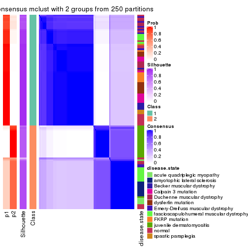</p>

</div>
<div id='tab-ATC-mclust-consensus-heatmap-2'>
<pre><code class="r">consensus_heatmap(res, k = 3)
</code></pre>

<p></p>

</div>
<div id='tab-ATC-mclust-consensus-heatmap-3'>
<pre><code class="r">consensus_heatmap(res, k = 4)
</code></pre>

<p></p>

</div>
<div id='tab-ATC-mclust-consensus-heatmap-4'>
<pre><code class="r">consensus_heatmap(res, k = 5)
</code></pre>

<p></p>

</div>
<div id='tab-ATC-mclust-consensus-heatmap-5'>
<pre><code class="r">consensus_heatmap(res, k = 6)
</code></pre>

<p></p>

</div>
</div>

Heatmaps for the membership of samples in all partitions to see how consistent they are:


<script>
$( function() {
	$( '#tabs-ATC-mclust-membership-heatmap' ).tabs();
} );
</script>
<div id='tabs-ATC-mclust-membership-heatmap'>
<ul>
<li><a href='#tab-ATC-mclust-membership-heatmap-1'>k = 2</a></li>
<li><a href='#tab-ATC-mclust-membership-heatmap-2'>k = 3</a></li>
<li><a href='#tab-ATC-mclust-membership-heatmap-3'>k = 4</a></li>
<li><a href='#tab-ATC-mclust-membership-heatmap-4'>k = 5</a></li>
<li><a href='#tab-ATC-mclust-membership-heatmap-5'>k = 6</a></li>
</ul>
<div id='tab-ATC-mclust-membership-heatmap-1'>
<pre><code class="r">membership_heatmap(res, k = 2)
</code></pre>

<p></p>

</div>
<div id='tab-ATC-mclust-membership-heatmap-2'>
<pre><code class="r">membership_heatmap(res, k = 3)
</code></pre>

<p></p>

</div>
<div id='tab-ATC-mclust-membership-heatmap-3'>
<pre><code class="r">membership_heatmap(res, k = 4)
</code></pre>

<p></p>

</div>
<div id='tab-ATC-mclust-membership-heatmap-4'>
<pre><code class="r">membership_heatmap(res, k = 5)
</code></pre>

<p></p>

</div>
<div id='tab-ATC-mclust-membership-heatmap-5'>
<pre><code class="r">membership_heatmap(res, k = 6)
</code></pre>

<p></p>

</div>
</div>

As soon as we have had the classes for columns, we can look for signatures
which are significantly different between classes which can be candidate marks
for certain classes. Following are the heatmaps for signatures.


Signature heatmaps where rows are scaled:


<script>
$( function() {
	$( '#tabs-ATC-mclust-get-signatures' ).tabs();
} );
</script>
<div id='tabs-ATC-mclust-get-signatures'>
<ul>
<li><a href='#tab-ATC-mclust-get-signatures-1'>k = 2</a></li>
<li><a href='#tab-ATC-mclust-get-signatures-2'>k = 3</a></li>
<li><a href='#tab-ATC-mclust-get-signatures-3'>k = 4</a></li>
<li><a href='#tab-ATC-mclust-get-signatures-4'>k = 5</a></li>
<li><a href='#tab-ATC-mclust-get-signatures-5'>k = 6</a></li>
</ul>
<div id='tab-ATC-mclust-get-signatures-1'>
<pre><code class="r">get_signatures(res, k = 2)
</code></pre>

<pre><code>#&gt; Error in mat[ceiling(1:nr/h_ratio), ceiling(1:nc/w_ratio), drop = FALSE]: subscript out of bounds
</code></pre>

<p></p>

</div>
<div id='tab-ATC-mclust-get-signatures-2'>
<pre><code class="r">get_signatures(res, k = 3)
</code></pre>

<pre><code>#&gt; Error in mat[ceiling(1:nr/h_ratio), ceiling(1:nc/w_ratio), drop = FALSE]: subscript out of bounds
</code></pre>

<p></p>

</div>
<div id='tab-ATC-mclust-get-signatures-3'>
<pre><code class="r">get_signatures(res, k = 4)
</code></pre>

<p></p>

</div>
<div id='tab-ATC-mclust-get-signatures-4'>
<pre><code class="r">get_signatures(res, k = 5)
</code></pre>

<p></p>

</div>
<div id='tab-ATC-mclust-get-signatures-5'>
<pre><code class="r">get_signatures(res, k = 6)
</code></pre>

<p></p>

</div>
</div>


Signature heatmaps where rows are not scaled:


<script>
$( function() {
	$( '#tabs-ATC-mclust-get-signatures-no-scale' ).tabs();
} );
</script>
<div id='tabs-ATC-mclust-get-signatures-no-scale'>
<ul>
<li><a href='#tab-ATC-mclust-get-signatures-no-scale-1'>k = 2</a></li>
<li><a href='#tab-ATC-mclust-get-signatures-no-scale-2'>k = 3</a></li>
<li><a href='#tab-ATC-mclust-get-signatures-no-scale-3'>k = 4</a></li>
<li><a href='#tab-ATC-mclust-get-signatures-no-scale-4'>k = 5</a></li>
<li><a href='#tab-ATC-mclust-get-signatures-no-scale-5'>k = 6</a></li>
</ul>
<div id='tab-ATC-mclust-get-signatures-no-scale-1'>
<pre><code class="r">get_signatures(res, k = 2, scale_rows = FALSE)
</code></pre>

<p></p>

</div>
<div id='tab-ATC-mclust-get-signatures-no-scale-2'>
<pre><code class="r">get_signatures(res, k = 3, scale_rows = FALSE)
</code></pre>

<p></p>

</div>
<div id='tab-ATC-mclust-get-signatures-no-scale-3'>
<pre><code class="r">get_signatures(res, k = 4, scale_rows = FALSE)
</code></pre>

<p></p>

</div>
<div id='tab-ATC-mclust-get-signatures-no-scale-4'>
<pre><code class="r">get_signatures(res, k = 5, scale_rows = FALSE)
</code></pre>

<p></p>

</div>
<div id='tab-ATC-mclust-get-signatures-no-scale-5'>
<pre><code class="r">get_signatures(res, k = 6, scale_rows = FALSE)
</code></pre>

<p></p>

</div>
</div>


Compare the overlap of signatures from different k:

```r
compare_signatures(res)
```


`get_signature()` returns a data frame invisibly. TO get the list of signatures, the function
call should be assigned to a variable explicitly. In following code, if `plot` argument is set
to `FALSE`, no heatmap is plotted while only the differential analysis is performed.

```r
# code only for demonstration
tb = get_signature(res, k = ..., plot = FALSE)
```

An example of the output of `tb` is:

```
#>   which_row         fdr    mean_1    mean_2 scaled_mean_1 scaled_mean_2 km
#> 1        38 0.042760348  8.373488  9.131774    -0.5533452     0.5164555  1
#> 2        40 0.018707592  7.106213  8.469186    -0.6173731     0.5762149  1
#> 3        55 0.019134737 10.221463 11.207825    -0.6159697     0.5749050  1
#> 4        59 0.006059896  5.921854  7.869574    -0.6899429     0.6439467  1
#> 5        60 0.018055526  8.928898 10.211722    -0.6204761     0.5791110  1
#> 6        98 0.009384629 15.714769 14.887706     0.6635654    -0.6193277  2
...
```

The columns in `tb` are:

1. `which_row`: row indices corresponding to the input matrix.
2. `fdr`: FDR for the differential test. 
3. `mean_x`: The mean value in group x.
4. `scaled_mean_x`: The mean value in group x after rows are scaled.
5. `km`: Row groups if k-means clustering is applied to rows.


UMAP plot which shows how samples are separated.


<script>
$( function() {
	$( '#tabs-ATC-mclust-dimension-reduction' ).tabs();
} );
</script>
<div id='tabs-ATC-mclust-dimension-reduction'>
<ul>
<li><a href='#tab-ATC-mclust-dimension-reduction-1'>k = 2</a></li>
<li><a href='#tab-ATC-mclust-dimension-reduction-2'>k = 3</a></li>
<li><a href='#tab-ATC-mclust-dimension-reduction-3'>k = 4</a></li>
<li><a href='#tab-ATC-mclust-dimension-reduction-4'>k = 5</a></li>
<li><a href='#tab-ATC-mclust-dimension-reduction-5'>k = 6</a></li>
</ul>
<div id='tab-ATC-mclust-dimension-reduction-1'>
<pre><code class="r">dimension_reduction(res, k = 2, method = &quot;UMAP&quot;)
</code></pre>

<p></p>

</div>
<div id='tab-ATC-mclust-dimension-reduction-2'>
<pre><code class="r">dimension_reduction(res, k = 3, method = &quot;UMAP&quot;)
</code></pre>

<p></p>

</div>
<div id='tab-ATC-mclust-dimension-reduction-3'>
<pre><code class="r">dimension_reduction(res, k = 4, method = &quot;UMAP&quot;)
</code></pre>

<p></p>

</div>
<div id='tab-ATC-mclust-dimension-reduction-4'>
<pre><code class="r">dimension_reduction(res, k = 5, method = &quot;UMAP&quot;)
</code></pre>

<p></p>

</div>
<div id='tab-ATC-mclust-dimension-reduction-5'>
<pre><code class="r">dimension_reduction(res, k = 6, method = &quot;UMAP&quot;)
</code></pre>

<p></p>

</div>
</div>


Following heatmap shows how subgroups are split when increasing `k`:

```r
collect_classes(res)
```


Test correlation between subgroups and known annotations. If the known
annotation is numeric, one-way ANOVA test is applied, and if the known
annotation is discrete, chi-squared contingency table test is applied.

```r
test_to_known_factors(res)
```

```
#>              n disease.state(p) k
#> ATC:mclust 120         1.97e-13 2
#> ATC:mclust 120         5.94e-26 3
#> ATC:mclust 118         2.68e-31 4
#> ATC:mclust 113         1.40e-34 5
#> ATC:mclust 110         2.94e-36 6
```


If matrix rows can be associated to genes, consider to use `GO_Enrichment(res,
...)` to perform function enrichment for the signature genes.


 

---------------------------------------------------


### ATC:NMF**


The object with results only for a single top-value method and a single partition method 
can be extracted as:

```r
res = res_list["ATC", "NMF"]
# you can also extract it by
# res = res_list["ATC:NMF"]
```

A summary of `res` and all the functions that can be applied to it:

```r
res
```

```
#> A 'ConsensusPartition' object with k = 2, 3, 4, 5, 6.
#>   On a matrix with 21168 rows and 121 columns.
#>   Top rows (1000, 2000, 3000, 4000, 5000) are extracted by 'ATC' method.
#>   Subgroups are detected by 'NMF' method.
#>   Performed in total 1250 partitions by row resampling.
#>   Best k for subgroups seems to be 2.
#> 
#> Following methods can be applied to this 'ConsensusPartition' object:
#>  [1] "cola_report"             "collect_classes"         "collect_plots"          
#>  [4] "collect_stats"           "colnames"                "compare_signatures"     
#>  [7] "consensus_heatmap"       "dimension_reduction"     "functional_enrichment"  
#> [10] "get_anno_col"            "get_anno"                "get_classes"            
#> [13] "get_consensus"           "get_matrix"              "get_membership"         
#> [16] "get_param"               "get_signatures"          "get_stats"              
#> [19] "is_best_k"               "is_stable_k"             "membership_heatmap"     
#> [22] "ncol"                    "nrow"                    "plot_ecdf"              
#> [25] "rownames"                "select_partition_number" "show"                   
#> [28] "suggest_best_k"          "test_to_known_factors"
```

`collect_plots()` function collects all the plots made from `res` for all `k` (number of partitions)
into one single page to provide an easy and fast comparison between different `k`.

```r
collect_plots(res)
```


The plots are:

- The first row: a plot of the ECDF (Empirical cumulative distribution
  function) curves of the consensus matrix for each `k` and the heatmap of
  predicted classes for each `k`.
- The second row: heatmaps of the consensus matrix for each `k`.
- The third row: heatmaps of the membership matrix for each `k`.
- The fouth row: heatmaps of the signatures for each `k`.

All the plots in panels can be made by individual functions and they are
plotted later in this section.

`select_partition_number()` produces several plots showing different
statistics for choosing "optimized" `k`. There are following statistics:

- ECDF curves of the consensus matrix for each `k`;
- 1-PAC. [The PAC
  score](https://en.wikipedia.org/wiki/Consensus_clustering#Over-interpretation_potential_of_consensus_clustering)
  measures the proportion of the ambiguous subgrouping.
- Mean silhouette score.
- Concordance. The mean probability of fiting the consensus class ids in all
  partitions.
- Area increased. Denote $A_k$ as the area under the ECDF curve for current
  `k`, the area increased is defined as $A_k - A_{k-1}$.
- Rand index. The percent of pairs of samples that are both in a same cluster
  or both are not in a same cluster in the partition of k and k-1.
- Jaccard index. The ratio of pairs of samples are both in a same cluster in
  the partition of k and k-1 and the pairs of samples are both in a same
  cluster in the partition k or k-1.

The detailed explanations of these statistics can be found in [the cola
vignette](http://bioconductor.org/packages/devel/bioc/vignettes/cola/inst/doc/cola.html#toc_13).

Generally speaking, lower PAC score, higher mean silhouette score or higher
concordance corresponds to better partition. Rand index and Jaccard index
measure how similar the current partition is compared to partition with `k-1`.
If they are too similar, we won't accept `k` is better than `k-1`.

```r
select_partition_number(res)
```


The numeric values for all these statistics can be obtained by `get_stats()`.

```r
get_stats(res)
```

```
#>   k 1-PAC mean_silhouette concordance area_increased  Rand Jaccard
#> 2 2 0.966           0.950       0.980         0.5037 0.496   0.496
#> 3 3 0.652           0.738       0.884         0.3172 0.749   0.537
#> 4 4 0.690           0.776       0.869         0.1162 0.840   0.577
#> 5 5 0.746           0.744       0.860         0.0690 0.887   0.606
#> 6 6 0.757           0.756       0.850         0.0419 0.925   0.661
```

`suggest_best_k()` suggests the best $k$ based on these statistics. The rules are as follows:

- All $k$ with Jaccard index larger than 0.95 are removed because the increase of
  the partition number does not provides enough extra information. If all $k$ are removed,
  the best $k$ is assigned by `NA`.
- For $k$ with 1-PAC larger than 0.9, the maximal $k$ is taken as the "best k". Other $k$ is called "optional k".
- If it does not fit the second rule. The $k$ with the highest vote of highest
  1-PAC, mean silhouette and concordance is taken as the "best k".

```r
suggest_best_k(res)
```

```
#> [1] 2
```


Following shows the table of the partitions (You need to click the **show/hide
code output** link to see it). The membership matrix (columns with name `p*`)
is inferred by
[`clue::cl_consensus()`](https://www.rdocumentation.org/link/cl_consensus?package=clue)
function with the `SE` method. Basically the value in the membership matrix
represents the probability to belong to a certain group. The finall class
label for an item is determined with the group with highest probability it
belongs to.

In `get_classes()` function, the entropy is calculated from the membership
matrix and the silhouette score is calculated from the consensus matrix.


<script>
$( function() {
	$( '#tabs-ATC-NMF-get-classes' ).tabs();
} );
</script>
<div id='tabs-ATC-NMF-get-classes'>
<ul>
<li><a href='#tab-ATC-NMF-get-classes-1'>k = 2</a></li>
<li><a href='#tab-ATC-NMF-get-classes-2'>k = 3</a></li>
<li><a href='#tab-ATC-NMF-get-classes-3'>k = 4</a></li>
<li><a href='#tab-ATC-NMF-get-classes-4'>k = 5</a></li>
<li><a href='#tab-ATC-NMF-get-classes-5'>k = 6</a></li>
</ul>

<div id='tab-ATC-NMF-get-classes-1'>
<p><a id='tab-ATC-NMF-get-classes-1-a' style='color:#0366d6' href='#'>show/hide code output</a></p>
<pre><code class="r">cbind(get_classes(res, k = 2), get_membership(res, k = 2))
</code></pre>

<pre><code>#&gt;           class entropy silhouette    p1    p2
#&gt; GSM74356      1   0.118      0.974 0.984 0.016
#&gt; GSM74357      1   0.000      0.989 1.000 0.000
#&gt; GSM74358      1   0.000      0.989 1.000 0.000
#&gt; GSM74359      1   0.000      0.989 1.000 0.000
#&gt; GSM74360      1   0.000      0.989 1.000 0.000
#&gt; GSM74361      1   0.987      0.195 0.568 0.432
#&gt; GSM74362      1   0.000      0.989 1.000 0.000
#&gt; GSM74363      1   0.373      0.915 0.928 0.072
#&gt; GSM74402      1   0.000      0.989 1.000 0.000
#&gt; GSM74403      1   0.000      0.989 1.000 0.000
#&gt; GSM74404      1   0.000      0.989 1.000 0.000
#&gt; GSM74406      1   0.000      0.989 1.000 0.000
#&gt; GSM74407      1   0.000      0.989 1.000 0.000
#&gt; GSM74408      1   0.000      0.989 1.000 0.000
#&gt; GSM74409      1   0.000      0.989 1.000 0.000
#&gt; GSM74410      1   0.000      0.989 1.000 0.000
#&gt; GSM119936     1   0.000      0.989 1.000 0.000
#&gt; GSM119937     1   0.000      0.989 1.000 0.000
#&gt; GSM74411      2   0.000      0.970 0.000 1.000
#&gt; GSM74412      2   0.000      0.970 0.000 1.000
#&gt; GSM74413      2   0.000      0.970 0.000 1.000
#&gt; GSM74414      2   0.000      0.970 0.000 1.000
#&gt; GSM74415      2   0.000      0.970 0.000 1.000
#&gt; GSM121379     2   0.000      0.970 0.000 1.000
#&gt; GSM121380     2   0.000      0.970 0.000 1.000
#&gt; GSM121381     2   0.000      0.970 0.000 1.000
#&gt; GSM121382     2   0.000      0.970 0.000 1.000
#&gt; GSM121383     2   0.000      0.970 0.000 1.000
#&gt; GSM121384     2   0.000      0.970 0.000 1.000
#&gt; GSM121385     2   0.000      0.970 0.000 1.000
#&gt; GSM121386     2   0.000      0.970 0.000 1.000
#&gt; GSM121387     2   0.000      0.970 0.000 1.000
#&gt; GSM121388     2   0.000      0.970 0.000 1.000
#&gt; GSM121389     2   0.000      0.970 0.000 1.000
#&gt; GSM121390     2   0.000      0.970 0.000 1.000
#&gt; GSM121391     2   0.000      0.970 0.000 1.000
#&gt; GSM121392     2   0.000      0.970 0.000 1.000
#&gt; GSM121393     2   0.000      0.970 0.000 1.000
#&gt; GSM121394     2   0.000      0.970 0.000 1.000
#&gt; GSM121395     2   0.000      0.970 0.000 1.000
#&gt; GSM121396     2   0.000      0.970 0.000 1.000
#&gt; GSM121397     2   0.000      0.970 0.000 1.000
#&gt; GSM121398     2   0.000      0.970 0.000 1.000
#&gt; GSM121399     2   0.000      0.970 0.000 1.000
#&gt; GSM74240      2   0.000      0.970 0.000 1.000
#&gt; GSM74241      2   0.000      0.970 0.000 1.000
#&gt; GSM74242      2   0.827      0.653 0.260 0.740
#&gt; GSM74243      2   0.963      0.387 0.388 0.612
#&gt; GSM74244      2   0.000      0.970 0.000 1.000
#&gt; GSM74245      2   0.000      0.970 0.000 1.000
#&gt; GSM74246      2   0.000      0.970 0.000 1.000
#&gt; GSM74247      2   0.000      0.970 0.000 1.000
#&gt; GSM74248      2   0.000      0.970 0.000 1.000
#&gt; GSM74416      1   0.000      0.989 1.000 0.000
#&gt; GSM74417      1   0.000      0.989 1.000 0.000
#&gt; GSM74418      1   0.000      0.989 1.000 0.000
#&gt; GSM74419      1   0.000      0.989 1.000 0.000
#&gt; GSM121358     2   0.000      0.970 0.000 1.000
#&gt; GSM121359     2   0.000      0.970 0.000 1.000
#&gt; GSM121360     1   0.000      0.989 1.000 0.000
#&gt; GSM121362     1   0.000      0.989 1.000 0.000
#&gt; GSM121364     1   0.000      0.989 1.000 0.000
#&gt; GSM121365     2   0.000      0.970 0.000 1.000
#&gt; GSM121366     2   0.000      0.970 0.000 1.000
#&gt; GSM121367     2   0.000      0.970 0.000 1.000
#&gt; GSM121370     2   0.000      0.970 0.000 1.000
#&gt; GSM121371     2   0.000      0.970 0.000 1.000
#&gt; GSM121372     2   0.000      0.970 0.000 1.000
#&gt; GSM121373     1   0.000      0.989 1.000 0.000
#&gt; GSM121374     1   0.000      0.989 1.000 0.000
#&gt; GSM121407     2   0.000      0.970 0.000 1.000
#&gt; GSM74387      2   0.000      0.970 0.000 1.000
#&gt; GSM74388      2   0.000      0.970 0.000 1.000
#&gt; GSM74389      1   0.494      0.871 0.892 0.108
#&gt; GSM74390      2   0.000      0.970 0.000 1.000
#&gt; GSM74391      1   0.000      0.989 1.000 0.000
#&gt; GSM74392      1   0.000      0.989 1.000 0.000
#&gt; GSM74393      1   0.000      0.989 1.000 0.000
#&gt; GSM74394      2   0.000      0.970 0.000 1.000
#&gt; GSM74239      1   0.000      0.989 1.000 0.000
#&gt; GSM74364      1   0.000      0.989 1.000 0.000
#&gt; GSM74365      1   0.000      0.989 1.000 0.000
#&gt; GSM74366      2   0.000      0.970 0.000 1.000
#&gt; GSM74367      1   0.000      0.989 1.000 0.000
#&gt; GSM74377      1   0.118      0.974 0.984 0.016
#&gt; GSM74378      2   0.000      0.970 0.000 1.000
#&gt; GSM74379      1   0.000      0.989 1.000 0.000
#&gt; GSM74380      1   0.000      0.989 1.000 0.000
#&gt; GSM74381      2   0.529      0.851 0.120 0.880
#&gt; GSM121357     2   0.000      0.970 0.000 1.000
#&gt; GSM121361     2   0.000      0.970 0.000 1.000
#&gt; GSM121363     2   0.000      0.970 0.000 1.000
#&gt; GSM121368     2   0.000      0.970 0.000 1.000
#&gt; GSM121369     2   0.000      0.970 0.000 1.000
#&gt; GSM74368      1   0.000      0.989 1.000 0.000
#&gt; GSM74369      1   0.000      0.989 1.000 0.000
#&gt; GSM74370      1   0.000      0.989 1.000 0.000
#&gt; GSM74371      1   0.000      0.989 1.000 0.000
#&gt; GSM74372      1   0.000      0.989 1.000 0.000
#&gt; GSM74373      1   0.000      0.989 1.000 0.000
#&gt; GSM74374      1   0.000      0.989 1.000 0.000
#&gt; GSM74375      1   0.000      0.989 1.000 0.000
#&gt; GSM74376      2   0.671      0.782 0.176 0.824
#&gt; GSM74405      2   0.969      0.370 0.396 0.604
#&gt; GSM74351      1   0.000      0.989 1.000 0.000
#&gt; GSM74352      2   0.990      0.246 0.440 0.560
#&gt; GSM74353      1   0.000      0.989 1.000 0.000
#&gt; GSM74354      1   0.000      0.989 1.000 0.000
#&gt; GSM74355      2   0.000      0.970 0.000 1.000
#&gt; GSM74382      1   0.000      0.989 1.000 0.000
#&gt; GSM74383      1   0.000      0.989 1.000 0.000
#&gt; GSM74384      2   0.000      0.970 0.000 1.000
#&gt; GSM74385      1   0.000      0.989 1.000 0.000
#&gt; GSM74386      1   0.000      0.989 1.000 0.000
#&gt; GSM74395      1   0.000      0.989 1.000 0.000
#&gt; GSM74396      1   0.000      0.989 1.000 0.000
#&gt; GSM74397      1   0.000      0.989 1.000 0.000
#&gt; GSM74398      1   0.000      0.989 1.000 0.000
#&gt; GSM74399      1   0.000      0.989 1.000 0.000
#&gt; GSM74400      1   0.000      0.989 1.000 0.000
#&gt; GSM74401      1   0.000      0.989 1.000 0.000
</code></pre>

<script>
$('#tab-ATC-NMF-get-classes-1-a').parent().next().next().hide();
$('#tab-ATC-NMF-get-classes-1-a').click(function(){
  $('#tab-ATC-NMF-get-classes-1-a').parent().next().next().toggle();
  return(false);
});
</script>
</div>

<div id='tab-ATC-NMF-get-classes-2'>
<p><a id='tab-ATC-NMF-get-classes-2-a' style='color:#0366d6' href='#'>show/hide code output</a></p>
<pre><code class="r">cbind(get_classes(res, k = 3), get_membership(res, k = 3))
</code></pre>

<pre><code>#&gt;           class entropy silhouette    p1    p2    p3
#&gt; GSM74356      3  0.2066     0.8173 0.060 0.000 0.940
#&gt; GSM74357      3  0.3267     0.7661 0.116 0.000 0.884
#&gt; GSM74358      3  0.3551     0.7495 0.132 0.000 0.868
#&gt; GSM74359      1  0.6260     0.2639 0.552 0.000 0.448
#&gt; GSM74360      1  0.0000     0.8964 1.000 0.000 0.000
#&gt; GSM74361      3  0.2066     0.8172 0.060 0.000 0.940
#&gt; GSM74362      3  0.4452     0.6818 0.192 0.000 0.808
#&gt; GSM74363      3  0.1753     0.8261 0.048 0.000 0.952
#&gt; GSM74402      1  0.2165     0.8677 0.936 0.000 0.064
#&gt; GSM74403      1  0.0000     0.8964 1.000 0.000 0.000
#&gt; GSM74404      1  0.0000     0.8964 1.000 0.000 0.000
#&gt; GSM74406      1  0.2165     0.8677 0.936 0.000 0.064
#&gt; GSM74407      3  0.5291     0.5541 0.268 0.000 0.732
#&gt; GSM74408      1  0.2356     0.8626 0.928 0.000 0.072
#&gt; GSM74409      1  0.1860     0.8745 0.948 0.000 0.052
#&gt; GSM74410      1  0.3941     0.7879 0.844 0.000 0.156
#&gt; GSM119936     1  0.1964     0.8723 0.944 0.000 0.056
#&gt; GSM119937     1  0.0000     0.8964 1.000 0.000 0.000
#&gt; GSM74411      3  0.4235     0.7337 0.000 0.176 0.824
#&gt; GSM74412      3  0.5678     0.5234 0.000 0.316 0.684
#&gt; GSM74413      3  0.3941     0.7546 0.000 0.156 0.844
#&gt; GSM74414      2  0.0592     0.8092 0.000 0.988 0.012
#&gt; GSM74415      3  0.2796     0.8071 0.000 0.092 0.908
#&gt; GSM121379     2  0.4399     0.7292 0.000 0.812 0.188
#&gt; GSM121380     2  0.2878     0.7889 0.000 0.904 0.096
#&gt; GSM121381     3  0.6305     0.0284 0.000 0.484 0.516
#&gt; GSM121382     2  0.5591     0.5762 0.000 0.696 0.304
#&gt; GSM121383     2  0.6260     0.1938 0.000 0.552 0.448
#&gt; GSM121384     2  0.3482     0.7742 0.000 0.872 0.128
#&gt; GSM121385     2  0.4796     0.6979 0.000 0.780 0.220
#&gt; GSM121386     2  0.5529     0.5906 0.000 0.704 0.296
#&gt; GSM121387     2  0.5678     0.5527 0.000 0.684 0.316
#&gt; GSM121388     3  0.6260     0.1707 0.000 0.448 0.552
#&gt; GSM121389     2  0.3551     0.7715 0.000 0.868 0.132
#&gt; GSM121390     2  0.2261     0.7992 0.000 0.932 0.068
#&gt; GSM121391     3  0.6235     0.2109 0.000 0.436 0.564
#&gt; GSM121392     2  0.0237     0.8085 0.000 0.996 0.004
#&gt; GSM121393     2  0.0000     0.8076 0.000 1.000 0.000
#&gt; GSM121394     3  0.5431     0.5815 0.000 0.284 0.716
#&gt; GSM121395     2  0.3879     0.7589 0.000 0.848 0.152
#&gt; GSM121396     3  0.3482     0.7791 0.000 0.128 0.872
#&gt; GSM121397     2  0.4702     0.7065 0.000 0.788 0.212
#&gt; GSM121398     2  0.4750     0.7025 0.000 0.784 0.216
#&gt; GSM121399     2  0.6062     0.3942 0.000 0.616 0.384
#&gt; GSM74240      3  0.0000     0.8511 0.000 0.000 1.000
#&gt; GSM74241      3  0.0000     0.8511 0.000 0.000 1.000
#&gt; GSM74242      3  0.0237     0.8501 0.004 0.000 0.996
#&gt; GSM74243      3  0.0237     0.8501 0.004 0.000 0.996
#&gt; GSM74244      3  0.0000     0.8511 0.000 0.000 1.000
#&gt; GSM74245      3  0.0000     0.8511 0.000 0.000 1.000
#&gt; GSM74246      3  0.0892     0.8457 0.000 0.020 0.980
#&gt; GSM74247      3  0.1753     0.8339 0.000 0.048 0.952
#&gt; GSM74248      3  0.0000     0.8511 0.000 0.000 1.000
#&gt; GSM74416      1  0.0000     0.8964 1.000 0.000 0.000
#&gt; GSM74417      1  0.0000     0.8964 1.000 0.000 0.000
#&gt; GSM74418      1  0.0000     0.8964 1.000 0.000 0.000
#&gt; GSM74419      1  0.5591     0.5749 0.696 0.000 0.304
#&gt; GSM121358     3  0.0000     0.8511 0.000 0.000 1.000
#&gt; GSM121359     3  0.2066     0.8260 0.000 0.060 0.940
#&gt; GSM121360     1  0.3412     0.8133 0.876 0.124 0.000
#&gt; GSM121362     1  0.0237     0.8953 0.996 0.000 0.004
#&gt; GSM121364     1  0.3619     0.8092 0.864 0.000 0.136
#&gt; GSM121365     3  0.0237     0.8501 0.004 0.000 0.996
#&gt; GSM121366     3  0.0000     0.8511 0.000 0.000 1.000
#&gt; GSM121367     3  0.0000     0.8511 0.000 0.000 1.000
#&gt; GSM121370     3  0.0000     0.8511 0.000 0.000 1.000
#&gt; GSM121371     3  0.0237     0.8501 0.004 0.000 0.996
#&gt; GSM121372     3  0.0237     0.8503 0.000 0.004 0.996
#&gt; GSM121373     1  0.0000     0.8964 1.000 0.000 0.000
#&gt; GSM121374     1  0.1643     0.8786 0.956 0.000 0.044
#&gt; GSM121407     3  0.6026     0.3658 0.000 0.376 0.624
#&gt; GSM74387      3  0.5397     0.5875 0.000 0.280 0.720
#&gt; GSM74388      2  0.0592     0.8093 0.000 0.988 0.012
#&gt; GSM74389      3  0.1529     0.8312 0.040 0.000 0.960
#&gt; GSM74390      3  0.0747     0.8471 0.000 0.016 0.984
#&gt; GSM74391      1  0.6026     0.4320 0.624 0.000 0.376
#&gt; GSM74392      1  0.3340     0.8232 0.880 0.000 0.120
#&gt; GSM74393      1  0.6274     0.2402 0.544 0.000 0.456
#&gt; GSM74394      2  0.0237     0.8085 0.000 0.996 0.004
#&gt; GSM74239      1  0.0237     0.8955 0.996 0.004 0.000
#&gt; GSM74364      1  0.0000     0.8964 1.000 0.000 0.000
#&gt; GSM74365      1  0.2356     0.8583 0.928 0.072 0.000
#&gt; GSM74366      2  0.0000     0.8076 0.000 1.000 0.000
#&gt; GSM74367      1  0.0592     0.8935 0.988 0.012 0.000
#&gt; GSM74377      2  0.5016     0.5773 0.240 0.760 0.000
#&gt; GSM74378      2  0.0592     0.8038 0.012 0.988 0.000
#&gt; GSM74379      1  0.6307     0.1368 0.512 0.488 0.000
#&gt; GSM74380      2  0.6252     0.0623 0.444 0.556 0.000
#&gt; GSM74381      2  0.2625     0.7637 0.084 0.916 0.000
#&gt; GSM121357     2  0.5431     0.6158 0.000 0.716 0.284
#&gt; GSM121361     2  0.0237     0.8085 0.000 0.996 0.004
#&gt; GSM121363     2  0.1529     0.8063 0.000 0.960 0.040
#&gt; GSM121368     2  0.1031     0.8085 0.000 0.976 0.024
#&gt; GSM121369     2  0.0424     0.8091 0.000 0.992 0.008
#&gt; GSM74368      1  0.0000     0.8964 1.000 0.000 0.000
#&gt; GSM74369      1  0.0000     0.8964 1.000 0.000 0.000
#&gt; GSM74370      1  0.0892     0.8906 0.980 0.020 0.000
#&gt; GSM74371      1  0.0000     0.8964 1.000 0.000 0.000
#&gt; GSM74372      1  0.4178     0.7634 0.828 0.172 0.000
#&gt; GSM74373      1  0.6302     0.1627 0.520 0.480 0.000
#&gt; GSM74374      1  0.1031     0.8888 0.976 0.024 0.000
#&gt; GSM74375      1  0.5988     0.4514 0.632 0.368 0.000
#&gt; GSM74376      2  0.2878     0.7553 0.096 0.904 0.000
#&gt; GSM74405      2  0.3116     0.7463 0.108 0.892 0.000
#&gt; GSM74351      1  0.0000     0.8964 1.000 0.000 0.000
#&gt; GSM74352      2  0.3551     0.7249 0.132 0.868 0.000
#&gt; GSM74353      1  0.0592     0.8934 0.988 0.012 0.000
#&gt; GSM74354      1  0.0892     0.8906 0.980 0.020 0.000
#&gt; GSM74355      2  0.0892     0.8006 0.020 0.980 0.000
#&gt; GSM74382      1  0.0000     0.8964 1.000 0.000 0.000
#&gt; GSM74383      1  0.0892     0.8906 0.980 0.020 0.000
#&gt; GSM74384      2  0.0000     0.8076 0.000 1.000 0.000
#&gt; GSM74385      1  0.0000     0.8964 1.000 0.000 0.000
#&gt; GSM74386      1  0.0892     0.8906 0.980 0.020 0.000
#&gt; GSM74395      1  0.0237     0.8955 0.996 0.004 0.000
#&gt; GSM74396      1  0.0000     0.8964 1.000 0.000 0.000
#&gt; GSM74397      1  0.0000     0.8964 1.000 0.000 0.000
#&gt; GSM74398      1  0.5650     0.5635 0.688 0.312 0.000
#&gt; GSM74399      2  0.6308    -0.1120 0.492 0.508 0.000
#&gt; GSM74400      1  0.1964     0.8701 0.944 0.056 0.000
#&gt; GSM74401      1  0.1529     0.8802 0.960 0.040 0.000
</code></pre>

<script>
$('#tab-ATC-NMF-get-classes-2-a').parent().next().next().hide();
$('#tab-ATC-NMF-get-classes-2-a').click(function(){
  $('#tab-ATC-NMF-get-classes-2-a').parent().next().next().toggle();
  return(false);
});
</script>
</div>

<div id='tab-ATC-NMF-get-classes-3'>
<p><a id='tab-ATC-NMF-get-classes-3-a' style='color:#0366d6' href='#'>show/hide code output</a></p>
<pre><code class="r">cbind(get_classes(res, k = 4), get_membership(res, k = 4))
</code></pre>

<pre><code>#&gt;           class entropy silhouette    p1    p2    p3    p4
#&gt; GSM74356      3  0.2552     0.8283 0.048 0.012 0.920 0.020
#&gt; GSM74357      3  0.2262     0.8337 0.040 0.012 0.932 0.016
#&gt; GSM74358      3  0.1575     0.8435 0.028 0.012 0.956 0.004
#&gt; GSM74359      4  0.6454     0.5993 0.084 0.012 0.260 0.644
#&gt; GSM74360      4  0.4752     0.7822 0.088 0.012 0.092 0.808
#&gt; GSM74361      3  0.2684     0.8233 0.060 0.012 0.912 0.016
#&gt; GSM74362      3  0.5401     0.6897 0.084 0.012 0.760 0.144
#&gt; GSM74363      3  0.0804     0.8596 0.000 0.012 0.980 0.008
#&gt; GSM74402      4  0.0672     0.8596 0.008 0.000 0.008 0.984
#&gt; GSM74403      4  0.0376     0.8590 0.004 0.000 0.004 0.992
#&gt; GSM74404      4  0.0672     0.8592 0.008 0.000 0.008 0.984
#&gt; GSM74406      4  0.1635     0.8507 0.008 0.000 0.044 0.948
#&gt; GSM74407      3  0.2255     0.8439 0.000 0.012 0.920 0.068
#&gt; GSM74408      4  0.2830     0.8344 0.040 0.000 0.060 0.900
#&gt; GSM74409      4  0.3938     0.8106 0.060 0.008 0.080 0.852
#&gt; GSM74410      4  0.3689     0.8161 0.048 0.004 0.088 0.860
#&gt; GSM119936     4  0.2596     0.8377 0.024 0.000 0.068 0.908
#&gt; GSM119937     4  0.3077     0.8322 0.036 0.004 0.068 0.892
#&gt; GSM74411      3  0.4175     0.7791 0.016 0.200 0.784 0.000
#&gt; GSM74412      3  0.4343     0.7106 0.004 0.264 0.732 0.000
#&gt; GSM74413      3  0.4252     0.7228 0.004 0.252 0.744 0.000
#&gt; GSM74414      2  0.5168    -0.1529 0.496 0.500 0.004 0.000
#&gt; GSM74415      3  0.3266     0.8144 0.000 0.168 0.832 0.000
#&gt; GSM121379     2  0.0707     0.8975 0.020 0.980 0.000 0.000
#&gt; GSM121380     2  0.1302     0.8836 0.044 0.956 0.000 0.000
#&gt; GSM121381     2  0.1389     0.8935 0.000 0.952 0.048 0.000
#&gt; GSM121382     2  0.1305     0.8976 0.004 0.960 0.036 0.000
#&gt; GSM121383     2  0.1557     0.8892 0.000 0.944 0.056 0.000
#&gt; GSM121384     2  0.1022     0.8917 0.032 0.968 0.000 0.000
#&gt; GSM121385     2  0.0804     0.9023 0.008 0.980 0.012 0.000
#&gt; GSM121386     2  0.0707     0.9024 0.000 0.980 0.020 0.000
#&gt; GSM121387     2  0.0707     0.9024 0.000 0.980 0.020 0.000
#&gt; GSM121388     2  0.1867     0.8778 0.000 0.928 0.072 0.000
#&gt; GSM121389     2  0.1211     0.8866 0.040 0.960 0.000 0.000
#&gt; GSM121390     2  0.1637     0.8712 0.060 0.940 0.000 0.000
#&gt; GSM121391     2  0.1902     0.8818 0.004 0.932 0.064 0.000
#&gt; GSM121392     2  0.2530     0.8136 0.112 0.888 0.000 0.000
#&gt; GSM121393     2  0.1867     0.8588 0.072 0.928 0.000 0.000
#&gt; GSM121394     2  0.2125     0.8714 0.004 0.920 0.076 0.000
#&gt; GSM121395     2  0.0817     0.8959 0.024 0.976 0.000 0.000
#&gt; GSM121396     2  0.4948     0.0647 0.000 0.560 0.440 0.000
#&gt; GSM121397     2  0.0804     0.9010 0.012 0.980 0.008 0.000
#&gt; GSM121398     2  0.0592     0.9025 0.000 0.984 0.016 0.000
#&gt; GSM121399     2  0.1398     0.8959 0.004 0.956 0.040 0.000
#&gt; GSM74240      3  0.1488     0.8692 0.012 0.032 0.956 0.000
#&gt; GSM74241      3  0.2334     0.8604 0.004 0.088 0.908 0.000
#&gt; GSM74242      3  0.0817     0.8670 0.000 0.024 0.976 0.000
#&gt; GSM74243      3  0.0707     0.8661 0.000 0.020 0.980 0.000
#&gt; GSM74244      3  0.2011     0.8631 0.000 0.080 0.920 0.000
#&gt; GSM74245      3  0.1389     0.8695 0.000 0.048 0.952 0.000
#&gt; GSM74246      3  0.2924     0.8555 0.016 0.100 0.884 0.000
#&gt; GSM74247      3  0.2928     0.8518 0.012 0.108 0.880 0.000
#&gt; GSM74248      3  0.1004     0.8671 0.004 0.024 0.972 0.000
#&gt; GSM74416      4  0.0336     0.8593 0.008 0.000 0.000 0.992
#&gt; GSM74417      4  0.0188     0.8595 0.004 0.000 0.000 0.996
#&gt; GSM74418      4  0.0336     0.8593 0.008 0.000 0.000 0.992
#&gt; GSM74419      4  0.1398     0.8534 0.004 0.000 0.040 0.956
#&gt; GSM121358     3  0.1389     0.8692 0.000 0.048 0.952 0.000
#&gt; GSM121359     3  0.3024     0.8294 0.000 0.148 0.852 0.000
#&gt; GSM121360     1  0.5766     0.4995 0.692 0.012 0.048 0.248
#&gt; GSM121362     4  0.5400     0.7558 0.104 0.012 0.120 0.764
#&gt; GSM121364     4  0.5212     0.7592 0.088 0.012 0.124 0.776
#&gt; GSM121365     3  0.1118     0.8687 0.000 0.036 0.964 0.000
#&gt; GSM121366     3  0.2149     0.8603 0.000 0.088 0.912 0.000
#&gt; GSM121367     3  0.1474     0.8688 0.000 0.052 0.948 0.000
#&gt; GSM121370     3  0.1940     0.8642 0.000 0.076 0.924 0.000
#&gt; GSM121371     3  0.1211     0.8692 0.000 0.040 0.960 0.000
#&gt; GSM121372     3  0.2999     0.8390 0.004 0.132 0.864 0.000
#&gt; GSM121373     4  0.4558     0.7904 0.084 0.012 0.084 0.820
#&gt; GSM121374     4  0.4992     0.7708 0.088 0.012 0.108 0.792
#&gt; GSM121407     3  0.4483     0.6882 0.004 0.284 0.712 0.000
#&gt; GSM74387      3  0.3790     0.8174 0.016 0.164 0.820 0.000
#&gt; GSM74388      1  0.4624     0.5107 0.660 0.340 0.000 0.000
#&gt; GSM74389      3  0.2365     0.8291 0.064 0.012 0.920 0.004
#&gt; GSM74390      3  0.2992     0.8228 0.084 0.016 0.892 0.008
#&gt; GSM74391      3  0.4978     0.3528 0.004 0.000 0.612 0.384
#&gt; GSM74392      4  0.5353     0.7481 0.084 0.012 0.140 0.764
#&gt; GSM74393      3  0.6744     0.3538 0.084 0.012 0.592 0.312
#&gt; GSM74394      1  0.3024     0.7972 0.852 0.148 0.000 0.000
#&gt; GSM74239      4  0.1792     0.8367 0.068 0.000 0.000 0.932
#&gt; GSM74364      4  0.0707     0.8580 0.020 0.000 0.000 0.980
#&gt; GSM74365      1  0.4522     0.6088 0.680 0.000 0.000 0.320
#&gt; GSM74366      1  0.2921     0.8075 0.860 0.140 0.000 0.000
#&gt; GSM74367      4  0.4761     0.3352 0.372 0.000 0.000 0.628
#&gt; GSM74377      1  0.3708     0.8083 0.832 0.020 0.000 0.148
#&gt; GSM74378      1  0.2469     0.8195 0.892 0.108 0.000 0.000
#&gt; GSM74379      1  0.3591     0.7933 0.824 0.008 0.000 0.168
#&gt; GSM74380      1  0.3082     0.8291 0.884 0.032 0.000 0.084
#&gt; GSM74381      1  0.2542     0.8286 0.904 0.084 0.000 0.012
#&gt; GSM121357     3  0.6933     0.5224 0.172 0.244 0.584 0.000
#&gt; GSM121361     1  0.2868     0.8024 0.864 0.136 0.000 0.000
#&gt; GSM121363     1  0.3123     0.7849 0.844 0.156 0.000 0.000
#&gt; GSM121368     1  0.2868     0.8016 0.864 0.136 0.000 0.000
#&gt; GSM121369     1  0.2530     0.8085 0.888 0.112 0.000 0.000
#&gt; GSM74368      4  0.1474     0.8465 0.052 0.000 0.000 0.948
#&gt; GSM74369      4  0.0707     0.8580 0.020 0.000 0.000 0.980
#&gt; GSM74370      4  0.5352     0.6677 0.296 0.008 0.020 0.676
#&gt; GSM74371      4  0.0592     0.8586 0.016 0.000 0.000 0.984
#&gt; GSM74372      1  0.3172     0.7643 0.840 0.000 0.000 0.160
#&gt; GSM74373      1  0.2611     0.8252 0.896 0.008 0.000 0.096
#&gt; GSM74374      4  0.4730     0.3560 0.364 0.000 0.000 0.636
#&gt; GSM74375      1  0.4989     0.2151 0.528 0.000 0.000 0.472
#&gt; GSM74376      1  0.3107     0.8323 0.884 0.080 0.000 0.036
#&gt; GSM74405      1  0.2473     0.8296 0.908 0.080 0.000 0.012
#&gt; GSM74351      4  0.0592     0.8586 0.016 0.000 0.000 0.984
#&gt; GSM74352      1  0.4755     0.7696 0.760 0.040 0.000 0.200
#&gt; GSM74353      4  0.1118     0.8537 0.036 0.000 0.000 0.964
#&gt; GSM74354      4  0.3486     0.7185 0.188 0.000 0.000 0.812
#&gt; GSM74355      1  0.2775     0.8309 0.896 0.084 0.000 0.020
#&gt; GSM74382      4  0.0779     0.8593 0.016 0.000 0.004 0.980
#&gt; GSM74383      4  0.3266     0.7438 0.168 0.000 0.000 0.832
#&gt; GSM74384      1  0.2530     0.8189 0.888 0.112 0.000 0.000
#&gt; GSM74385      4  0.0592     0.8586 0.016 0.000 0.000 0.984
#&gt; GSM74386      4  0.5000    -0.1138 0.496 0.000 0.000 0.504
#&gt; GSM74395      4  0.3836     0.7614 0.168 0.000 0.016 0.816
#&gt; GSM74396      4  0.3052     0.7814 0.136 0.000 0.004 0.860
#&gt; GSM74397      4  0.1743     0.8458 0.056 0.000 0.004 0.940
#&gt; GSM74398      1  0.4088     0.7368 0.764 0.004 0.000 0.232
#&gt; GSM74399      1  0.4008     0.7248 0.756 0.000 0.000 0.244
#&gt; GSM74400      4  0.0921     0.8563 0.028 0.000 0.000 0.972
#&gt; GSM74401      4  0.1302     0.8504 0.044 0.000 0.000 0.956
</code></pre>

<script>
$('#tab-ATC-NMF-get-classes-3-a').parent().next().next().hide();
$('#tab-ATC-NMF-get-classes-3-a').click(function(){
  $('#tab-ATC-NMF-get-classes-3-a').parent().next().next().toggle();
  return(false);
});
</script>
</div>

<div id='tab-ATC-NMF-get-classes-4'>
<p><a id='tab-ATC-NMF-get-classes-4-a' style='color:#0366d6' href='#'>show/hide code output</a></p>
<pre><code class="r">cbind(get_classes(res, k = 5), get_membership(res, k = 5))
</code></pre>

<pre><code>#&gt;           class entropy silhouette    p1    p2    p3    p4    p5
#&gt; GSM74356      4  0.4242     0.0210 0.000 0.000 0.428 0.572 0.000
#&gt; GSM74357      4  0.4287    -0.0821 0.000 0.000 0.460 0.540 0.000
#&gt; GSM74358      3  0.4278     0.3105 0.000 0.000 0.548 0.452 0.000
#&gt; GSM74359      4  0.3099     0.7310 0.124 0.000 0.028 0.848 0.000
#&gt; GSM74360      4  0.2563     0.7198 0.120 0.000 0.000 0.872 0.008
#&gt; GSM74361      4  0.4210     0.0906 0.000 0.000 0.412 0.588 0.000
#&gt; GSM74362      4  0.2293     0.6866 0.016 0.000 0.084 0.900 0.000
#&gt; GSM74363      3  0.4015     0.5661 0.000 0.000 0.652 0.348 0.000
#&gt; GSM74402      1  0.2773     0.7455 0.836 0.000 0.000 0.164 0.000
#&gt; GSM74403      1  0.3983     0.4594 0.660 0.000 0.000 0.340 0.000
#&gt; GSM74404      1  0.4114     0.3663 0.624 0.000 0.000 0.376 0.000
#&gt; GSM74406      1  0.4219     0.2263 0.584 0.000 0.000 0.416 0.000
#&gt; GSM74407      3  0.1243     0.8612 0.028 0.000 0.960 0.008 0.004
#&gt; GSM74408      4  0.4227     0.3477 0.420 0.000 0.000 0.580 0.000
#&gt; GSM74409      4  0.3636     0.6152 0.272 0.000 0.000 0.728 0.000
#&gt; GSM74410      4  0.4045     0.4898 0.356 0.000 0.000 0.644 0.000
#&gt; GSM119936     4  0.4262     0.2901 0.440 0.000 0.000 0.560 0.000
#&gt; GSM119937     4  0.4138     0.4338 0.384 0.000 0.000 0.616 0.000
#&gt; GSM74411      3  0.2532     0.8417 0.000 0.036 0.908 0.028 0.028
#&gt; GSM74412      3  0.3221     0.8153 0.000 0.076 0.868 0.024 0.032
#&gt; GSM74413      3  0.2956     0.8262 0.000 0.060 0.884 0.036 0.020
#&gt; GSM74414      2  0.6163     0.5313 0.000 0.612 0.196 0.016 0.176
#&gt; GSM74415      3  0.1372     0.8591 0.000 0.004 0.956 0.024 0.016
#&gt; GSM121379     2  0.0162     0.9581 0.000 0.996 0.004 0.000 0.000
#&gt; GSM121380     2  0.0324     0.9565 0.000 0.992 0.004 0.000 0.004
#&gt; GSM121381     2  0.0290     0.9595 0.000 0.992 0.008 0.000 0.000
#&gt; GSM121382     2  0.0290     0.9595 0.000 0.992 0.008 0.000 0.000
#&gt; GSM121383     2  0.0510     0.9558 0.000 0.984 0.016 0.000 0.000
#&gt; GSM121384     2  0.0162     0.9581 0.000 0.996 0.004 0.000 0.000
#&gt; GSM121385     2  0.0290     0.9595 0.000 0.992 0.008 0.000 0.000
#&gt; GSM121386     2  0.0290     0.9595 0.000 0.992 0.008 0.000 0.000
#&gt; GSM121387     2  0.0290     0.9595 0.000 0.992 0.008 0.000 0.000
#&gt; GSM121388     2  0.0865     0.9479 0.000 0.972 0.024 0.004 0.000
#&gt; GSM121389     2  0.0162     0.9581 0.000 0.996 0.004 0.000 0.000
#&gt; GSM121390     2  0.0404     0.9496 0.000 0.988 0.000 0.000 0.012
#&gt; GSM121391     2  0.0671     0.9540 0.000 0.980 0.016 0.004 0.000
#&gt; GSM121392     2  0.0510     0.9468 0.000 0.984 0.000 0.000 0.016
#&gt; GSM121393     2  0.0162     0.9537 0.000 0.996 0.000 0.000 0.004
#&gt; GSM121394     2  0.0671     0.9540 0.000 0.980 0.016 0.004 0.000
#&gt; GSM121395     2  0.0290     0.9595 0.000 0.992 0.008 0.000 0.000
#&gt; GSM121396     2  0.4029     0.4994 0.000 0.680 0.316 0.004 0.000
#&gt; GSM121397     2  0.0290     0.9595 0.000 0.992 0.008 0.000 0.000
#&gt; GSM121398     2  0.0290     0.9595 0.000 0.992 0.008 0.000 0.000
#&gt; GSM121399     2  0.0290     0.9595 0.000 0.992 0.008 0.000 0.000
#&gt; GSM74240      3  0.1168     0.8678 0.000 0.000 0.960 0.032 0.008
#&gt; GSM74241      3  0.0798     0.8625 0.000 0.000 0.976 0.016 0.008
#&gt; GSM74242      3  0.1043     0.8666 0.000 0.000 0.960 0.040 0.000
#&gt; GSM74243      3  0.1792     0.8551 0.000 0.000 0.916 0.084 0.000
#&gt; GSM74244      3  0.0671     0.8659 0.000 0.000 0.980 0.016 0.004
#&gt; GSM74245      3  0.0671     0.8659 0.000 0.000 0.980 0.016 0.004
#&gt; GSM74246      3  0.1830     0.8559 0.000 0.000 0.932 0.028 0.040
#&gt; GSM74247      3  0.1661     0.8577 0.000 0.000 0.940 0.024 0.036
#&gt; GSM74248      3  0.1430     0.8668 0.000 0.000 0.944 0.052 0.004
#&gt; GSM74416      1  0.1671     0.8049 0.924 0.000 0.000 0.076 0.000
#&gt; GSM74417      1  0.2773     0.7450 0.836 0.000 0.000 0.164 0.000
#&gt; GSM74418      1  0.2424     0.7723 0.868 0.000 0.000 0.132 0.000
#&gt; GSM74419      1  0.4251     0.4954 0.672 0.000 0.012 0.316 0.000
#&gt; GSM121358     3  0.2719     0.8283 0.000 0.004 0.852 0.144 0.000
#&gt; GSM121359     3  0.1300     0.8661 0.000 0.028 0.956 0.016 0.000
#&gt; GSM121360     5  0.4897     0.3019 0.024 0.000 0.000 0.460 0.516
#&gt; GSM121362     4  0.2142     0.7077 0.048 0.000 0.004 0.920 0.028
#&gt; GSM121364     4  0.2646     0.7303 0.124 0.000 0.004 0.868 0.004
#&gt; GSM121365     3  0.3210     0.7705 0.000 0.000 0.788 0.212 0.000
#&gt; GSM121366     3  0.1205     0.8670 0.000 0.004 0.956 0.040 0.000
#&gt; GSM121367     3  0.2674     0.8308 0.000 0.004 0.856 0.140 0.000
#&gt; GSM121370     3  0.1544     0.8613 0.000 0.000 0.932 0.068 0.000
#&gt; GSM121371     3  0.2719     0.8271 0.000 0.004 0.852 0.144 0.000
#&gt; GSM121372     3  0.1997     0.8622 0.000 0.036 0.924 0.040 0.000
#&gt; GSM121373     4  0.2929     0.7070 0.152 0.000 0.000 0.840 0.008
#&gt; GSM121374     4  0.2497     0.7302 0.112 0.000 0.004 0.880 0.004
#&gt; GSM121407     3  0.4061     0.6914 0.000 0.240 0.740 0.016 0.004
#&gt; GSM74387      3  0.2032     0.8555 0.000 0.004 0.924 0.020 0.052
#&gt; GSM74388      5  0.3450     0.7236 0.000 0.176 0.008 0.008 0.808
#&gt; GSM74389      3  0.4118     0.5924 0.000 0.000 0.660 0.336 0.004
#&gt; GSM74390      3  0.4660     0.7492 0.000 0.000 0.728 0.192 0.080
#&gt; GSM74391      3  0.4337     0.6231 0.196 0.000 0.748 0.056 0.000
#&gt; GSM74392      4  0.2911     0.7285 0.136 0.000 0.008 0.852 0.004
#&gt; GSM74393      4  0.2819     0.7192 0.060 0.000 0.052 0.884 0.004
#&gt; GSM74394      5  0.2152     0.8261 0.000 0.032 0.004 0.044 0.920
#&gt; GSM74239      1  0.0609     0.8167 0.980 0.000 0.000 0.000 0.020
#&gt; GSM74364      1  0.0703     0.8180 0.976 0.000 0.000 0.024 0.000
#&gt; GSM74365      1  0.3496     0.6597 0.788 0.000 0.000 0.012 0.200
#&gt; GSM74366      5  0.1779     0.8424 0.040 0.008 0.004 0.008 0.940
#&gt; GSM74367      1  0.1732     0.7904 0.920 0.000 0.000 0.000 0.080
#&gt; GSM74377      5  0.3910     0.6953 0.248 0.004 0.000 0.008 0.740
#&gt; GSM74378      5  0.0798     0.8429 0.016 0.008 0.000 0.000 0.976
#&gt; GSM74379      5  0.3231     0.7482 0.196 0.000 0.000 0.004 0.800
#&gt; GSM74380      5  0.1831     0.8375 0.076 0.004 0.000 0.000 0.920
#&gt; GSM74381      5  0.1082     0.8449 0.028 0.008 0.000 0.000 0.964
#&gt; GSM121357     3  0.4480     0.7545 0.000 0.068 0.776 0.016 0.140
#&gt; GSM121361     5  0.1845     0.8250 0.000 0.016 0.000 0.056 0.928
#&gt; GSM121363     5  0.2409     0.8190 0.000 0.044 0.016 0.028 0.912
#&gt; GSM121368     5  0.1893     0.8308 0.000 0.012 0.024 0.028 0.936
#&gt; GSM121369     5  0.2727     0.7994 0.000 0.016 0.000 0.116 0.868
#&gt; GSM74368      1  0.1310     0.8075 0.956 0.000 0.000 0.020 0.024
#&gt; GSM74369      1  0.1041     0.8170 0.964 0.000 0.000 0.032 0.004
#&gt; GSM74370      5  0.5672     0.4507 0.104 0.000 0.000 0.312 0.584
#&gt; GSM74371      1  0.1478     0.8110 0.936 0.000 0.000 0.064 0.000
#&gt; GSM74372      5  0.3055     0.8069 0.064 0.000 0.000 0.072 0.864
#&gt; GSM74373      5  0.1864     0.8412 0.068 0.004 0.000 0.004 0.924
#&gt; GSM74374      1  0.2011     0.7897 0.908 0.000 0.000 0.004 0.088
#&gt; GSM74375      1  0.3076     0.7521 0.868 0.000 0.008 0.036 0.088
#&gt; GSM74376      5  0.2575     0.8263 0.100 0.004 0.000 0.012 0.884
#&gt; GSM74405      5  0.0771     0.8444 0.020 0.004 0.000 0.000 0.976
#&gt; GSM74351      1  0.1410     0.8119 0.940 0.000 0.000 0.060 0.000
#&gt; GSM74352      1  0.4481     0.4124 0.668 0.004 0.000 0.016 0.312
#&gt; GSM74353      1  0.1628     0.8161 0.936 0.000 0.000 0.056 0.008
#&gt; GSM74354      1  0.1571     0.8059 0.936 0.000 0.000 0.004 0.060
#&gt; GSM74355      5  0.2302     0.8358 0.080 0.008 0.000 0.008 0.904
#&gt; GSM74382      1  0.3109     0.7045 0.800 0.000 0.000 0.200 0.000
#&gt; GSM74383      1  0.2069     0.8057 0.912 0.000 0.000 0.012 0.076
#&gt; GSM74384      5  0.0798     0.8429 0.016 0.008 0.000 0.000 0.976
#&gt; GSM74385      1  0.2605     0.7612 0.852 0.000 0.000 0.148 0.000
#&gt; GSM74386      5  0.4425     0.3510 0.392 0.000 0.000 0.008 0.600
#&gt; GSM74395      1  0.3409     0.7753 0.836 0.000 0.000 0.052 0.112
#&gt; GSM74396      1  0.1549     0.8169 0.944 0.000 0.000 0.016 0.040
#&gt; GSM74397      1  0.0609     0.8159 0.980 0.000 0.000 0.000 0.020
#&gt; GSM74398      5  0.4264     0.4516 0.376 0.000 0.000 0.004 0.620
#&gt; GSM74399      1  0.4524     0.3621 0.644 0.000 0.000 0.020 0.336
#&gt; GSM74400      1  0.1270     0.8144 0.948 0.000 0.000 0.052 0.000
#&gt; GSM74401      1  0.0566     0.8176 0.984 0.000 0.000 0.004 0.012
</code></pre>

<script>
$('#tab-ATC-NMF-get-classes-4-a').parent().next().next().hide();
$('#tab-ATC-NMF-get-classes-4-a').click(function(){
  $('#tab-ATC-NMF-get-classes-4-a').parent().next().next().toggle();
  return(false);
});
</script>
</div>

<div id='tab-ATC-NMF-get-classes-5'>
<p><a id='tab-ATC-NMF-get-classes-5-a' style='color:#0366d6' href='#'>show/hide code output</a></p>
<pre><code class="r">cbind(get_classes(res, k = 6), get_membership(res, k = 6))
</code></pre>

<pre><code>#&gt;           class entropy silhouette    p1    p2    p3    p4    p5    p6
#&gt; GSM74356      3  0.1644     0.8029 0.000 0.000 0.920 0.076 0.004 0.000
#&gt; GSM74357      3  0.2790     0.7739 0.000 0.000 0.844 0.132 0.024 0.000
#&gt; GSM74358      3  0.2651     0.7933 0.000 0.000 0.860 0.112 0.028 0.000
#&gt; GSM74359      4  0.2002     0.7403 0.012 0.000 0.076 0.908 0.004 0.000
#&gt; GSM74360      4  0.1821     0.7376 0.024 0.000 0.008 0.928 0.040 0.000
#&gt; GSM74361      3  0.3766     0.7018 0.000 0.000 0.748 0.212 0.040 0.000
#&gt; GSM74362      4  0.2163     0.7092 0.000 0.000 0.092 0.892 0.016 0.000
#&gt; GSM74363      3  0.2058     0.8051 0.000 0.000 0.908 0.056 0.036 0.000
#&gt; GSM74402      1  0.3245     0.6741 0.764 0.000 0.000 0.228 0.008 0.000
#&gt; GSM74403      1  0.3966     0.1260 0.552 0.000 0.000 0.444 0.004 0.000
#&gt; GSM74404      4  0.4252     0.4309 0.372 0.000 0.000 0.604 0.024 0.000
#&gt; GSM74406      4  0.3823     0.2924 0.436 0.000 0.000 0.564 0.000 0.000
#&gt; GSM74407      3  0.3884     0.6908 0.052 0.000 0.760 0.004 0.184 0.000
#&gt; GSM74408      4  0.4452     0.5804 0.288 0.000 0.040 0.664 0.008 0.000
#&gt; GSM74409      4  0.3268     0.7126 0.144 0.000 0.044 0.812 0.000 0.000
#&gt; GSM74410      4  0.4977     0.6417 0.212 0.000 0.108 0.668 0.012 0.000
#&gt; GSM119936     4  0.4528     0.5407 0.316 0.000 0.044 0.636 0.004 0.000
#&gt; GSM119937     4  0.4370     0.5363 0.324 0.000 0.032 0.640 0.004 0.000
#&gt; GSM74411      5  0.2454     0.8431 0.000 0.016 0.104 0.000 0.876 0.004
#&gt; GSM74412      5  0.2702     0.8307 0.000 0.036 0.092 0.000 0.868 0.004
#&gt; GSM74413      5  0.2454     0.8431 0.000 0.016 0.104 0.000 0.876 0.004
#&gt; GSM74414      5  0.4402     0.5668 0.000 0.244 0.008 0.000 0.696 0.052
#&gt; GSM74415      5  0.2386     0.8457 0.000 0.004 0.112 0.004 0.876 0.004
#&gt; GSM121379     2  0.0260     0.9775 0.000 0.992 0.000 0.000 0.008 0.000
#&gt; GSM121380     2  0.0146     0.9775 0.000 0.996 0.000 0.000 0.004 0.000
#&gt; GSM121381     2  0.0146     0.9772 0.000 0.996 0.000 0.000 0.004 0.000
#&gt; GSM121382     2  0.0458     0.9755 0.000 0.984 0.000 0.000 0.016 0.000
#&gt; GSM121383     2  0.0260     0.9775 0.000 0.992 0.000 0.000 0.008 0.000
#&gt; GSM121384     2  0.0146     0.9772 0.000 0.996 0.000 0.000 0.004 0.000
#&gt; GSM121385     2  0.0458     0.9761 0.000 0.984 0.000 0.000 0.016 0.000
#&gt; GSM121386     2  0.0260     0.9769 0.000 0.992 0.000 0.000 0.008 0.000
#&gt; GSM121387     2  0.0146     0.9775 0.000 0.996 0.000 0.000 0.004 0.000
#&gt; GSM121388     2  0.2069     0.9129 0.000 0.908 0.068 0.004 0.020 0.000
#&gt; GSM121389     2  0.0363     0.9759 0.000 0.988 0.000 0.000 0.012 0.000
#&gt; GSM121390     2  0.0146     0.9772 0.000 0.996 0.000 0.000 0.004 0.000
#&gt; GSM121391     2  0.0547     0.9744 0.000 0.980 0.000 0.000 0.020 0.000
#&gt; GSM121392     2  0.0405     0.9725 0.000 0.988 0.000 0.000 0.004 0.008
#&gt; GSM121393     2  0.0862     0.9653 0.000 0.972 0.008 0.004 0.016 0.000
#&gt; GSM121394     2  0.0458     0.9748 0.000 0.984 0.000 0.000 0.016 0.000
#&gt; GSM121395     2  0.0508     0.9717 0.000 0.984 0.004 0.000 0.012 0.000
#&gt; GSM121396     2  0.3683     0.7533 0.000 0.784 0.160 0.004 0.052 0.000
#&gt; GSM121397     2  0.0458     0.9761 0.000 0.984 0.000 0.000 0.016 0.000
#&gt; GSM121398     2  0.0000     0.9767 0.000 1.000 0.000 0.000 0.000 0.000
#&gt; GSM121399     2  0.0260     0.9775 0.000 0.992 0.000 0.000 0.008 0.000
#&gt; GSM74240      5  0.3627     0.8135 0.000 0.000 0.224 0.020 0.752 0.004
#&gt; GSM74241      5  0.2933     0.8358 0.000 0.000 0.200 0.004 0.796 0.000
#&gt; GSM74242      3  0.3684     0.4557 0.000 0.000 0.664 0.004 0.332 0.000
#&gt; GSM74243      3  0.3653     0.5327 0.000 0.000 0.692 0.008 0.300 0.000
#&gt; GSM74244      5  0.3409     0.7322 0.000 0.000 0.300 0.000 0.700 0.000
#&gt; GSM74245      5  0.2793     0.8354 0.000 0.000 0.200 0.000 0.800 0.000
#&gt; GSM74246      5  0.2624     0.8504 0.000 0.000 0.148 0.004 0.844 0.004
#&gt; GSM74247      5  0.2584     0.8504 0.000 0.000 0.144 0.004 0.848 0.004
#&gt; GSM74248      5  0.3758     0.7465 0.000 0.000 0.284 0.016 0.700 0.000
#&gt; GSM74416      1  0.2320     0.7705 0.864 0.000 0.000 0.132 0.004 0.000
#&gt; GSM74417      1  0.3619     0.5295 0.680 0.000 0.000 0.316 0.004 0.000
#&gt; GSM74418      1  0.3271     0.6699 0.760 0.000 0.000 0.232 0.008 0.000
#&gt; GSM74419      4  0.4593     0.0980 0.472 0.000 0.000 0.492 0.036 0.000
#&gt; GSM121358     3  0.1049     0.8223 0.000 0.000 0.960 0.008 0.032 0.000
#&gt; GSM121359     3  0.2957     0.7700 0.000 0.032 0.844 0.004 0.120 0.000
#&gt; GSM121360     4  0.4127     0.3932 0.000 0.000 0.004 0.684 0.028 0.284
#&gt; GSM121362     4  0.1508     0.7396 0.004 0.000 0.020 0.948 0.012 0.016
#&gt; GSM121364     4  0.1826     0.7482 0.020 0.000 0.052 0.924 0.004 0.000
#&gt; GSM121365     3  0.1633     0.8227 0.000 0.000 0.932 0.024 0.044 0.000
#&gt; GSM121366     3  0.1714     0.8050 0.000 0.000 0.908 0.000 0.092 0.000
#&gt; GSM121367     3  0.1082     0.8210 0.000 0.000 0.956 0.004 0.040 0.000
#&gt; GSM121370     3  0.1765     0.7996 0.000 0.000 0.904 0.000 0.096 0.000
#&gt; GSM121371     3  0.0820     0.8222 0.000 0.000 0.972 0.012 0.016 0.000
#&gt; GSM121372     3  0.1897     0.8105 0.000 0.004 0.908 0.004 0.084 0.000
#&gt; GSM121373     4  0.1708     0.7499 0.040 0.000 0.024 0.932 0.004 0.000
#&gt; GSM121374     4  0.1536     0.7486 0.016 0.000 0.040 0.940 0.004 0.000
#&gt; GSM121407     3  0.4123     0.6948 0.000 0.136 0.772 0.000 0.072 0.020
#&gt; GSM74387      5  0.4009     0.6247 0.000 0.000 0.356 0.008 0.632 0.004
#&gt; GSM74388      6  0.4406     0.6878 0.000 0.140 0.000 0.008 0.116 0.736
#&gt; GSM74389      3  0.4601     0.6531 0.000 0.000 0.688 0.200 0.112 0.000
#&gt; GSM74390      3  0.2401     0.8130 0.000 0.000 0.900 0.020 0.036 0.044
#&gt; GSM74391      5  0.4054     0.7117 0.104 0.000 0.060 0.044 0.792 0.000
#&gt; GSM74392      4  0.1693     0.7494 0.044 0.000 0.020 0.932 0.004 0.000
#&gt; GSM74393      4  0.2122     0.7310 0.008 0.000 0.084 0.900 0.008 0.000
#&gt; GSM74394      6  0.4473     0.6795 0.000 0.020 0.004 0.040 0.220 0.716
#&gt; GSM74239      1  0.0820     0.8059 0.972 0.000 0.000 0.012 0.000 0.016
#&gt; GSM74364      1  0.1605     0.8066 0.936 0.000 0.000 0.044 0.016 0.004
#&gt; GSM74365      1  0.2912     0.6626 0.784 0.000 0.000 0.000 0.000 0.216
#&gt; GSM74366      6  0.1988     0.8635 0.048 0.004 0.004 0.000 0.024 0.920
#&gt; GSM74367      1  0.2356     0.7721 0.884 0.000 0.004 0.004 0.008 0.100
#&gt; GSM74377      6  0.2772     0.7942 0.180 0.000 0.000 0.000 0.004 0.816
#&gt; GSM74378      6  0.0777     0.8635 0.024 0.000 0.004 0.000 0.000 0.972
#&gt; GSM74379      6  0.2442     0.8199 0.144 0.000 0.004 0.000 0.000 0.852
#&gt; GSM74380      6  0.1531     0.8620 0.068 0.000 0.000 0.000 0.004 0.928
#&gt; GSM74381      6  0.0865     0.8649 0.036 0.000 0.000 0.000 0.000 0.964
#&gt; GSM121357     3  0.4529     0.6294 0.004 0.032 0.728 0.000 0.040 0.196
#&gt; GSM121361     6  0.1936     0.8384 0.000 0.008 0.008 0.028 0.028 0.928
#&gt; GSM121363     6  0.1140     0.8486 0.000 0.012 0.008 0.008 0.008 0.964
#&gt; GSM121368     6  0.1667     0.8448 0.000 0.004 0.008 0.008 0.044 0.936
#&gt; GSM121369     6  0.2772     0.8040 0.000 0.000 0.004 0.092 0.040 0.864
#&gt; GSM74368      1  0.3979     0.7208 0.800 0.000 0.120 0.012 0.024 0.044
#&gt; GSM74369      1  0.2254     0.7937 0.916 0.000 0.016 0.020 0.024 0.024
#&gt; GSM74370      4  0.5360     0.0537 0.032 0.000 0.004 0.508 0.036 0.420
#&gt; GSM74371      1  0.2178     0.7732 0.868 0.000 0.000 0.132 0.000 0.000
#&gt; GSM74372      6  0.3751     0.7826 0.028 0.000 0.004 0.100 0.052 0.816
#&gt; GSM74373      6  0.1219     0.8660 0.048 0.000 0.004 0.000 0.000 0.948
#&gt; GSM74374      1  0.1218     0.8021 0.956 0.000 0.000 0.004 0.012 0.028
#&gt; GSM74375      1  0.3134     0.7186 0.824 0.000 0.000 0.012 0.148 0.016
#&gt; GSM74376      6  0.3585     0.8031 0.156 0.000 0.000 0.004 0.048 0.792
#&gt; GSM74405      6  0.0865     0.8649 0.036 0.000 0.000 0.000 0.000 0.964
#&gt; GSM74351      1  0.2048     0.7788 0.880 0.000 0.000 0.120 0.000 0.000
#&gt; GSM74352      1  0.3606     0.5564 0.728 0.000 0.000 0.000 0.016 0.256
#&gt; GSM74353      1  0.1501     0.7975 0.924 0.000 0.000 0.076 0.000 0.000
#&gt; GSM74354      1  0.1265     0.7961 0.948 0.000 0.000 0.000 0.008 0.044
#&gt; GSM74355      6  0.1686     0.8614 0.064 0.000 0.000 0.000 0.012 0.924
#&gt; GSM74382      1  0.3528     0.5692 0.700 0.000 0.000 0.296 0.004 0.000
#&gt; GSM74383      1  0.1858     0.7962 0.912 0.000 0.000 0.012 0.000 0.076
#&gt; GSM74384      6  0.0891     0.8638 0.024 0.000 0.000 0.000 0.008 0.968
#&gt; GSM74385      1  0.3398     0.6483 0.740 0.000 0.000 0.252 0.008 0.000
#&gt; GSM74386      6  0.4312     0.4103 0.368 0.000 0.000 0.028 0.000 0.604
#&gt; GSM74395      1  0.4288     0.7261 0.748 0.000 0.000 0.132 0.008 0.112
#&gt; GSM74396      1  0.1624     0.8089 0.936 0.000 0.000 0.040 0.004 0.020
#&gt; GSM74397      1  0.0767     0.8055 0.976 0.000 0.000 0.008 0.004 0.012
#&gt; GSM74398      6  0.4032     0.3427 0.420 0.000 0.000 0.000 0.008 0.572
#&gt; GSM74399      1  0.3558     0.5710 0.736 0.000 0.000 0.000 0.016 0.248
#&gt; GSM74400      1  0.1714     0.7949 0.908 0.000 0.000 0.092 0.000 0.000
#&gt; GSM74401      1  0.0291     0.8057 0.992 0.000 0.000 0.004 0.004 0.000
</code></pre>

<script>
$('#tab-ATC-NMF-get-classes-5-a').parent().next().next().hide();
$('#tab-ATC-NMF-get-classes-5-a').click(function(){
  $('#tab-ATC-NMF-get-classes-5-a').parent().next().next().toggle();
  return(false);
});
</script>
</div>
</div>

Heatmaps for the consensus matrix. It visualizes the probability of two
samples to be in a same group.


<script>
$( function() {
	$( '#tabs-ATC-NMF-consensus-heatmap' ).tabs();
} );
</script>
<div id='tabs-ATC-NMF-consensus-heatmap'>
<ul>
<li><a href='#tab-ATC-NMF-consensus-heatmap-1'>k = 2</a></li>
<li><a href='#tab-ATC-NMF-consensus-heatmap-2'>k = 3</a></li>
<li><a href='#tab-ATC-NMF-consensus-heatmap-3'>k = 4</a></li>
<li><a href='#tab-ATC-NMF-consensus-heatmap-4'>k = 5</a></li>
<li><a href='#tab-ATC-NMF-consensus-heatmap-5'>k = 6</a></li>
</ul>
<div id='tab-ATC-NMF-consensus-heatmap-1'>
<pre><code class="r">consensus_heatmap(res, k = 2)
</code></pre>

<p></p>

</div>
<div id='tab-ATC-NMF-consensus-heatmap-2'>
<pre><code class="r">consensus_heatmap(res, k = 3)
</code></pre>

<p></p>

</div>
<div id='tab-ATC-NMF-consensus-heatmap-3'>
<pre><code class="r">consensus_heatmap(res, k = 4)
</code></pre>

<p></p>

</div>
<div id='tab-ATC-NMF-consensus-heatmap-4'>
<pre><code class="r">consensus_heatmap(res, k = 5)
</code></pre>

<p></p>

</div>
<div id='tab-ATC-NMF-consensus-heatmap-5'>
<pre><code class="r">consensus_heatmap(res, k = 6)
</code></pre>

<p></p>

</div>
</div>

Heatmaps for the membership of samples in all partitions to see how consistent they are:


<script>
$( function() {
	$( '#tabs-ATC-NMF-membership-heatmap' ).tabs();
} );
</script>
<div id='tabs-ATC-NMF-membership-heatmap'>
<ul>
<li><a href='#tab-ATC-NMF-membership-heatmap-1'>k = 2</a></li>
<li><a href='#tab-ATC-NMF-membership-heatmap-2'>k = 3</a></li>
<li><a href='#tab-ATC-NMF-membership-heatmap-3'>k = 4</a></li>
<li><a href='#tab-ATC-NMF-membership-heatmap-4'>k = 5</a></li>
<li><a href='#tab-ATC-NMF-membership-heatmap-5'>k = 6</a></li>
</ul>
<div id='tab-ATC-NMF-membership-heatmap-1'>
<pre><code class="r">membership_heatmap(res, k = 2)
</code></pre>

<p></p>

</div>
<div id='tab-ATC-NMF-membership-heatmap-2'>
<pre><code class="r">membership_heatmap(res, k = 3)
</code></pre>

<p></p>

</div>
<div id='tab-ATC-NMF-membership-heatmap-3'>
<pre><code class="r">membership_heatmap(res, k = 4)
</code></pre>

<p></p>

</div>
<div id='tab-ATC-NMF-membership-heatmap-4'>
<pre><code class="r">membership_heatmap(res, k = 5)
</code></pre>

<p></p>

</div>
<div id='tab-ATC-NMF-membership-heatmap-5'>
<pre><code class="r">membership_heatmap(res, k = 6)
</code></pre>

<p></p>

</div>
</div>

As soon as we have had the classes for columns, we can look for signatures
which are significantly different between classes which can be candidate marks
for certain classes. Following are the heatmaps for signatures.


Signature heatmaps where rows are scaled:


<script>
$( function() {
	$( '#tabs-ATC-NMF-get-signatures' ).tabs();
} );
</script>
<div id='tabs-ATC-NMF-get-signatures'>
<ul>
<li><a href='#tab-ATC-NMF-get-signatures-1'>k = 2</a></li>
<li><a href='#tab-ATC-NMF-get-signatures-2'>k = 3</a></li>
<li><a href='#tab-ATC-NMF-get-signatures-3'>k = 4</a></li>
<li><a href='#tab-ATC-NMF-get-signatures-4'>k = 5</a></li>
<li><a href='#tab-ATC-NMF-get-signatures-5'>k = 6</a></li>
</ul>
<div id='tab-ATC-NMF-get-signatures-1'>
<pre><code class="r">get_signatures(res, k = 2)
</code></pre>

<p></p>

</div>
<div id='tab-ATC-NMF-get-signatures-2'>
<pre><code class="r">get_signatures(res, k = 3)
</code></pre>

<p></p>

</div>
<div id='tab-ATC-NMF-get-signatures-3'>
<pre><code class="r">get_signatures(res, k = 4)
</code></pre>

<p></p>

</div>
<div id='tab-ATC-NMF-get-signatures-4'>
<pre><code class="r">get_signatures(res, k = 5)
</code></pre>

<p></p>

</div>
<div id='tab-ATC-NMF-get-signatures-5'>
<pre><code class="r">get_signatures(res, k = 6)
</code></pre>

<p></p>

</div>
</div>


Signature heatmaps where rows are not scaled:


<script>
$( function() {
	$( '#tabs-ATC-NMF-get-signatures-no-scale' ).tabs();
} );
</script>
<div id='tabs-ATC-NMF-get-signatures-no-scale'>
<ul>
<li><a href='#tab-ATC-NMF-get-signatures-no-scale-1'>k = 2</a></li>
<li><a href='#tab-ATC-NMF-get-signatures-no-scale-2'>k = 3</a></li>
<li><a href='#tab-ATC-NMF-get-signatures-no-scale-3'>k = 4</a></li>
<li><a href='#tab-ATC-NMF-get-signatures-no-scale-4'>k = 5</a></li>
<li><a href='#tab-ATC-NMF-get-signatures-no-scale-5'>k = 6</a></li>
</ul>
<div id='tab-ATC-NMF-get-signatures-no-scale-1'>
<pre><code class="r">get_signatures(res, k = 2, scale_rows = FALSE)
</code></pre>

<p>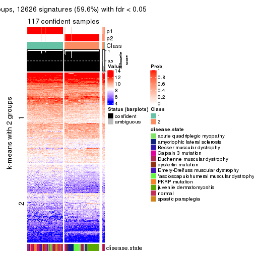</p>

</div>
<div id='tab-ATC-NMF-get-signatures-no-scale-2'>
<pre><code class="r">get_signatures(res, k = 3, scale_rows = FALSE)
</code></pre>

<p></p>

</div>
<div id='tab-ATC-NMF-get-signatures-no-scale-3'>
<pre><code class="r">get_signatures(res, k = 4, scale_rows = FALSE)
</code></pre>

<p></p>

</div>
<div id='tab-ATC-NMF-get-signatures-no-scale-4'>
<pre><code class="r">get_signatures(res, k = 5, scale_rows = FALSE)
</code></pre>

<p></p>

</div>
<div id='tab-ATC-NMF-get-signatures-no-scale-5'>
<pre><code class="r">get_signatures(res, k = 6, scale_rows = FALSE)
</code></pre>

<p></p>

</div>
</div>


Compare the overlap of signatures from different k:

```r
compare_signatures(res)
```


`get_signature()` returns a data frame invisibly. TO get the list of signatures, the function
call should be assigned to a variable explicitly. In following code, if `plot` argument is set
to `FALSE`, no heatmap is plotted while only the differential analysis is performed.

```r
# code only for demonstration
tb = get_signature(res, k = ..., plot = FALSE)
```

An example of the output of `tb` is:

```
#>   which_row         fdr    mean_1    mean_2 scaled_mean_1 scaled_mean_2 km
#> 1        38 0.042760348  8.373488  9.131774    -0.5533452     0.5164555  1
#> 2        40 0.018707592  7.106213  8.469186    -0.6173731     0.5762149  1
#> 3        55 0.019134737 10.221463 11.207825    -0.6159697     0.5749050  1
#> 4        59 0.006059896  5.921854  7.869574    -0.6899429     0.6439467  1
#> 5        60 0.018055526  8.928898 10.211722    -0.6204761     0.5791110  1
#> 6        98 0.009384629 15.714769 14.887706     0.6635654    -0.6193277  2
...
```

The columns in `tb` are:

1. `which_row`: row indices corresponding to the input matrix.
2. `fdr`: FDR for the differential test. 
3. `mean_x`: The mean value in group x.
4. `scaled_mean_x`: The mean value in group x after rows are scaled.
5. `km`: Row groups if k-means clustering is applied to rows.


UMAP plot which shows how samples are separated.


<script>
$( function() {
	$( '#tabs-ATC-NMF-dimension-reduction' ).tabs();
} );
</script>
<div id='tabs-ATC-NMF-dimension-reduction'>
<ul>
<li><a href='#tab-ATC-NMF-dimension-reduction-1'>k = 2</a></li>
<li><a href='#tab-ATC-NMF-dimension-reduction-2'>k = 3</a></li>
<li><a href='#tab-ATC-NMF-dimension-reduction-3'>k = 4</a></li>
<li><a href='#tab-ATC-NMF-dimension-reduction-4'>k = 5</a></li>
<li><a href='#tab-ATC-NMF-dimension-reduction-5'>k = 6</a></li>
</ul>
<div id='tab-ATC-NMF-dimension-reduction-1'>
<pre><code class="r">dimension_reduction(res, k = 2, method = &quot;UMAP&quot;)
</code></pre>

<p></p>

</div>
<div id='tab-ATC-NMF-dimension-reduction-2'>
<pre><code class="r">dimension_reduction(res, k = 3, method = &quot;UMAP&quot;)
</code></pre>

<p></p>

</div>
<div id='tab-ATC-NMF-dimension-reduction-3'>
<pre><code class="r">dimension_reduction(res, k = 4, method = &quot;UMAP&quot;)
</code></pre>

<p></p>

</div>
<div id='tab-ATC-NMF-dimension-reduction-4'>
<pre><code class="r">dimension_reduction(res, k = 5, method = &quot;UMAP&quot;)
</code></pre>

<p></p>

</div>
<div id='tab-ATC-NMF-dimension-reduction-5'>
<pre><code class="r">dimension_reduction(res, k = 6, method = &quot;UMAP&quot;)
</code></pre>

<p></p>

</div>
</div>


Following heatmap shows how subgroups are split when increasing `k`:

```r
collect_classes(res)
```


Test correlation between subgroups and known annotations. If the known
annotation is numeric, one-way ANOVA test is applied, and if the known
annotation is discrete, chi-squared contingency table test is applied.

```r
test_to_known_factors(res)
```

```
#>           n disease.state(p) k
#> ATC:NMF 117         1.51e-11 2
#> ATC:NMF 107         3.98e-15 3
#> ATC:NMF 112         7.37e-29 4
#> ATC:NMF 102         3.44e-31 5
#> ATC:NMF 112         4.38e-45 6
```


If matrix rows can be associated to genes, consider to use `GO_Enrichment(res,
...)` to perform function enrichment for the signature genes.


 

## Session info


```r
sessionInfo()
```

```
#> R version 3.6.0 (2019-04-26)
#> Platform: x86_64-pc-linux-gnu (64-bit)
#> Running under: CentOS Linux 7 (Core)
#> 
#> Matrix products: default
#> BLAS:   /usr/lib64/libblas.so.3.4.2
#> LAPACK: /usr/lib64/liblapack.so.3.4.2
#> 
#> locale:
#>  [1] LC_CTYPE=en_GB.UTF-8       LC_NUMERIC=C               LC_TIME=en_GB.UTF-8       
#>  [4] LC_COLLATE=en_GB.UTF-8     LC_MONETARY=en_GB.UTF-8    LC_MESSAGES=en_GB.UTF-8   
#>  [7] LC_PAPER=en_GB.UTF-8       LC_NAME=C                  LC_ADDRESS=C              
#> [10] LC_TELEPHONE=C             LC_MEASUREMENT=en_GB.UTF-8 LC_IDENTIFICATION=C       
#> 
#> attached base packages:
#> [1] grid      parallel  stats     graphics  grDevices utils     datasets  methods   base     
#> 
#> other attached packages:
#>  [1] genefilter_1.66.0     ComplexHeatmap_2.1.1  markdown_1.1          knitr_1.26           
#>  [5] preprocessCore_1.46.0 cola_1.3.2            GEOquery_2.52.0       Biobase_2.44.0       
#>  [9] BiocGenerics_0.30.0   GetoptLong_0.1.7     
#> 
#> loaded via a namespace (and not attached):
#>  [1] bitops_1.0-6         matrixStats_0.55.0   bit64_0.9-7          doParallel_1.0.15   
#>  [5] RColorBrewer_1.1-2   httr_1.4.1           tools_3.6.0          backports_1.1.5     
#>  [9] R6_2.4.1             DBI_1.0.0            lazyeval_0.2.2       colorspace_1.4-1    
#> [13] withr_2.1.2          tidyselect_0.2.5     gridExtra_2.3        bit_1.1-14          
#> [17] compiler_3.6.0       xml2_1.2.2           microbenchmark_1.4-7 pkgmaker_0.28       
#> [21] slam_0.1-46          scales_1.1.0         readr_1.3.1          NMF_0.23.6          
#> [25] stringr_1.4.0        digest_0.6.23        pkgconfig_2.0.3      bibtex_0.4.2        
#> [29] highr_0.8            limma_3.40.6         rlang_0.4.2          GlobalOptions_0.1.1 
#> [33] RSQLite_2.1.2        impute_1.58.0        shape_1.4.4          mclust_5.4.5        
#> [37] dendextend_1.12.0    dplyr_0.8.3          RCurl_1.95-4.12      magrittr_1.5        
#> [41] Matrix_1.2-17        Rcpp_1.0.3           munsell_0.5.0        S4Vectors_0.22.1    
#> [45] viridis_0.5.1        lifecycle_0.1.0      stringi_1.4.3        plyr_1.8.4          
#> [49] blob_1.2.0           crayon_1.3.4         lattice_0.20-38      splines_3.6.0       
#> [53] annotate_1.62.0      circlize_0.4.9       hms_0.5.2            zeallot_0.1.0       
#> [57] pillar_1.4.2         rjson_0.2.20         rngtools_1.4         reshape2_1.4.3      
#> [61] codetools_0.2-16     stats4_3.6.0         XML_3.98-1.20        glue_1.3.1          
#> [65] evaluate_0.14        png_0.1-7            vctrs_0.2.0          foreach_1.4.7       
#> [69] polyclip_1.10-0      gtable_0.3.0         purrr_0.3.3          tidyr_1.0.0         
#> [73] clue_0.3-57          assertthat_0.2.1     ggplot2_3.2.1        xfun_0.11           
#> [77] gridBase_0.4-7       eulerr_6.0.0         xtable_1.8-4         skmeans_0.2-11      
#> [81] survival_2.44-1.1    viridisLite_0.3.0    tibble_2.1.3         iterators_1.0.12    
#> [85] AnnotationDbi_1.46.1 registry_0.5-1       memoise_1.1.0        IRanges_2.18.3      
#> [89] cluster_2.1.0        brew_1.0-6
```


